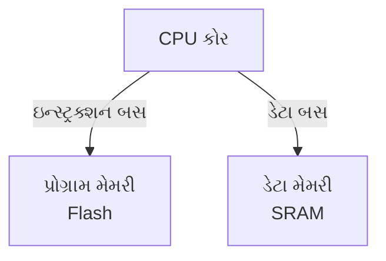
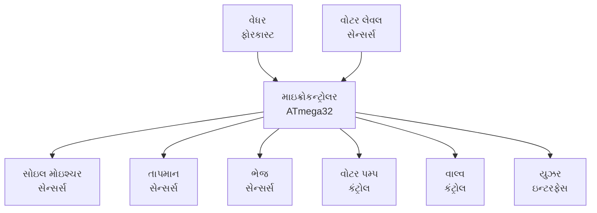
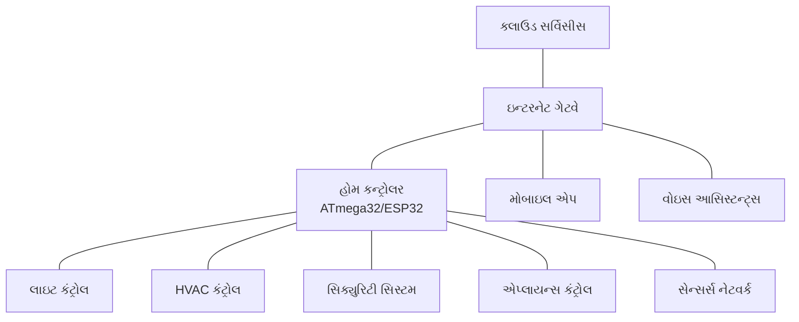

## પ્રશ્ન 1(અ) [3 ગુણ]

**ATmega32 માં RAM, Flash અને EEPROM મેમરી કેટલી છે? માઇક્રોકન્ટ્રોલરમાં તેની જરૂરિયાત સમજાવો.**

**જવાબ**:

ATmega32 મેમરી સ્પેસિફિકેશન અને માઇક્રોકન્ટ્રોલર ઓપરેશનમાં તેનું મહત્વ:

**કોષ્ટક: ATmega32માં મેમરી સાઇઝ**

| મેમરી પ્રકાર | સાઇઝ | હેતુ |
|-------------|------|---------|
| SRAM (RAM) | 2 KB | વેરિએબલ્સ અને સ્ટેક સ્ટોરેજ |
| Flash | 32 KB | પ્રોગ્રામ સ્ટોરેજ |
| EEPROM | 1 KB | નોન-વોલેટાઇલ ડેટા સ્ટોરેજ |

- **RAM**: પ્રોગ્રામ એક્ઝિક્યુશન દરમિયાન વેરિએબલ્સ માટે ટેમ્પરરી સ્ટોરેજ
- **Flash**: પ્રોગ્રામ ઇન્સ્ટ્રક્શન્સ અને કોન્સ્ટન્ટ્સ માટે પરમેનન્ટ સ્ટોરેજ
- **EEPROM**: પાવર સાયકલ્સ પછી પણ જાળવી રાખવા જરૂરી એવા ડેટા માટે લાંબા ગાળાનું સ્ટોરેજ

**મેમરી ટ્રીક:** "રન માટે RAM, ફંક્શન માટે Flash, હંમેશા માટે EEPROM"

## પ્રશ્ન 1(બ) [4 ગુણ]

**ATmega32 ની RAM મેમરીની ચર્ચા કરો.**

**જવાબ**:

ATmega32ની RAM (SRAM) ચોક્કસ હેતુઓ માટે જુદા જુદા વિભાગોમાં ગોઠવાયેલી છે.

**ડાયાગ્રામ:**

```goat
    ATmega32 RAM (2KB)
+-------------------------+ 0x0000
| 32 General Registers    |
+-------------------------+ 0x0020
| 64 I/O Registers        |
+-------------------------+ 0x0060
| 160 Extended I/O Regs   |
+-------------------------+ 0x0100
|                         |
| Internal SRAM           |
| (1.85 KB)               |
|                         |
+-------------------------+ 0x085F
```

- **રજિસ્ટર ફાઇલ**: પ્રથમ 32 લોકેશન્સ (0x0000-0x001F)
- **I/O રજિસ્ટર્સ**: સ્ટાન્ડર્ડ I/O સ્પેસ (0x0020-0x005F)
- **એક્સટેન્ડેડ I/O**: વધારાના પેરિફેરલ રજિસ્ટર્સ (0x0060-0x00FF)
- **ડેટા મેમરી**: જનરલ પરપઝ SRAM (0x0100-0x085F)

**મેમરી ટ્રીક:** "રજિસ્ટર્સ, I/O, એક્સટેન્ડેડ, ડેટા - RAM ની કાર્યક્ષમ ડિઝાઇન"

## પ્રશ્ન 1(ક) [7 ગુણ]

**રિયલ ટાઈમ ઓપરેટિંગ સિસ્ટમની વ્યાખ્યાયિત કરો અને તેની લાક્ષણિકતાઓ સમજાવો.**

**જવાબ**:

રિયલ-ટાઇમ ઓપરેટિંગ સિસ્ટમ (RTOS) એ ચુસ્ત ટાઇમિંગ જરૂરિયાતો સાથે ડેટા અને ઇવેન્ટ્સ પ્રોસેસ કરવા માટે ડિઝાઇન કરાયેલ સ્પેશિયલાઇઝ્ડ ઓપરેટિંગ સિસ્ટમ છે.

**કોષ્ટક: RTOS ની મુખ્ય લાક્ષણિકતાઓ**

| લાક્ષણિકતા | વર્ણન |
|----------------|-------------|
| ડિટર્મિનિઝમ | ટાસ્ક્સ માટે ગેરંટેડ રિસ્પોન્સ ટાઇમ |
| પ્રિએમ્પ્ટિવ શેડ્યુલિંગ | ઉચ્ચ પ્રાધાન્યવાળા ટાસ્ક્સ નીચા પ્રાધાન્યવાળા ટાસ્ક્સને ઇન્ટરપ્ટ કરી શકે છે |
| લો લેટન્સી | ઇવેન્ટ અને રિસ્પોન્સ વચ્ચે ન્યૂનતમ વિલંબ |
| પ્રાયોરિટી-બેઝ્ડ | એક્ઝિક્યુશન માટે ટાસ્ક્સને પ્રાધાન્ય આપવામાં આવે છે |
| ટાસ્ક મેનેજમેન્ટ | ટાસ્ક ક્રિએશન, ડિલીશન અને સિંક્રનાઇઝેશન માટે મેકેનિઝમ્સ પૂરા પાડે છે |
| રિસોર્સ મેનેજમેન્ટ | રિસોર્સ કોન્ફ્લિક્ટ્સ અને ડેડલોક્સ અટકાવે છે |
| વિશ્વસનીયતા | પીક લોડ હેઠળ પણ મજબૂત ઓપરેશન |

- **મલ્ટીટાસ્કિંગ**: અનેક ટાસ્ક્સના કન્કરન્ટ એક્ઝિક્યુશનને સપોર્ટ કરે છે
- **સ્મોલ ફૂટપ્રિન્ટ**: મર્યાદિત રિસોર્સવાળા એમ્બેડેડ સિસ્ટમ્સ માટે ઓપ્ટિમાઇઝ્ડ
- **ટાઇમ મેનેજમેન્ટ**: માઇક્રોસેકન્ડ રેઝોલ્યુશન સાથે પ્રિસાઇઝ ટાઇમિંગ સર્વિસીસ
- **કર્નલ સર્વિસીસ**: ટાસ્ક કોઓર્ડિનેશન માટે IPC, મ્યુટેક્સ, સેમાફોર

**મેમરી ટ્રીક:** "ડિટર્મિનિસ્ટિક પ્રિએમ્પ્ટિવ ટાસ્ક્સ રન ઓન સ્ટ્રિક્ટ ટાઇમલાઇન્સ"

## પ્રશ્ન 1(ક OR) [7 ગુણ]

**એમ્બેડેડ સિસ્ટમ શું છે? એમ્બેડેડ સિસ્ટમનો સામાન્ય બ્લોક ડાયાગ્રામ દોરો અને સમજાવો.**

**જવાબ**:

એમ્બેડેડ સિસ્ટમ એ એક ડેડિકેટેડ કમ્પ્યુટર સિસ્ટમ છે જે મોટી મિકેનિકલ અથવા ઇલેક્ટ્રિકલ સિસ્ટમની અંદર ચોક્કસ કાર્યો કરવા માટે ડિઝાઇન કરવામાં આવે છે, ઘણીવાર રિયલ-ટાઇમ કન્સ્ટ્રેઇન્ટ્સ સાથે.

**ડાયાગ્રામ:**

```goat
                           +----------------+
                           |   Power Supply |
                           +----------------+
                                   |
                                   v
+-----------+    +-------------+    +-----------+    +-----------+
|           |    |             |    |           |    |           |
|  Input    |--->| Processing  |--->|  Output   |    |  Memory   |
|  Devices  |    |    Unit     |    |  Devices  |    |           |
|           |    |             |    |           |    |           |
+-----------+    +-------------+    +-----------+    +-----------+
     ^                  ^                                  ^
     |                  |                                  |
     v                  v                                  v
+-----------+    +--------------+                    +-----------+
|           |    |              |                    |           |
|  Sensors  |    | Communication|                    |  Storage  |
|           |    |  Interface   |                    |           |
+-----------+    +--------------+                    +-----------+
```

**કોષ્ટક: એમ્બેડેડ સિસ્ટમ કોમ્પોનન્ટ્સ**

| કોમ્પોનન્ટ | ફંક્શન |
|-----------|----------|
| પ્રોસેસિંગ યુનિટ | પ્રોગ્રામ ઇન્સ્ટ્રક્શન્સ એક્ઝિક્યુટ કરે છે (માઇક્રોકન્ટ્રોલર/માઇક્રોપ્રોસેસર) |
| મેમરી | પ્રોગ્રામ અને ડેટા સ્ટોર કરે છે (RAM, ROM, Flash) |
| ઇનપુટ/આઉટપુટ | બાહ્ય ડિવાઇસ સાથે ઇન્ટરફેસ કરે છે |
| કમ્યુનિકેશન | અન્ય સિસ્ટમ્સ અથવા નેટવર્ક્સ સાથે જોડાય છે |
| પાવર સપ્લાય | રેગ્યુલેટેડ પાવર પ્રદાન કરે છે |
| સેન્સર્સ | પર્યાવરણીય ડેટા એકત્રિત કરે છે |

- **એપ્લિકેશન-સ્પેસિફિક**: ડેડિકેટેડ ટાસ્ક્સ માટે ડિઝાઇન કરાયેલ
- **રિસોર્સ-કન્સ્ટ્રેઇન્ડ**: મર્યાદિત પ્રોસેસિંગ પાવર અને મેમરી
- **રિયલ-ટાઇમ**: ટાઇમિંગ કન્સ્ટ્રેઇન્ટ્સની અંદર ઇવેન્ટ્સને પ્રતિસાદ આપે છે
- **હાઇ રિલાયબિલિટી**: નિષ્ફળતા વિના સતત ઓપરેટ કરવું જોઈએ

**મેમરી ટ્રીક:** "પ્રોસેસ, મેમરી, I/O - દરેક સિસ્ટમમાં હોવું જોઈએ"

## પ્રશ્ન 2(અ) [3 ગુણ]

**એમ્બેડેડ સિસ્ટમમાં કોઈપણ એપ્લિકેશન ડિઝાઇન માટે માઇક્રોકન્ટ્રોલર પસંદ કરવા માટે વિવિધ માપદંડો લખો.**

**જવાબ**:

યોગ્ય માઇક્રોકન્ટ્રોલર પસંદ કરવા માટે એપ્લિકેશન જરૂરિયાતો આધારિત અનેક માપદંડોનું મૂલ્યાંકન કરવું જરૂરી છે.

**કોષ્ટક: માઇક્રોકન્ટ્રોલર પસંદગી માપદંડ**

| માપદંડ | વિચારણાઓ |
|-----------|----------------|
| પરફોર્મન્સ | CPU સ્પીડ, MIPS, બિટ વિડ્થ (8/16/32) |
| મેમરી | Flash, RAM, EEPROM કેપેસિટી |
| પાવર કન્ઝમ્પશન | ઓપરેટિંગ વોલ્ટેજ, સ્લીપ મોડ |
| I/O કેપેબિલિટીઝ | પોર્ટ્સની સંખ્યા, સ્પેશિયલ ફંક્શન્સ |
| પેરિફેરલ્સ | ADC, ટાઇમર્સ, કમ્યુનિકેશન ઇન્ટરફેસીસ |
| કોસ્ટ | યુનિટ પ્રાઇસ, ડેવલપમેન્ટ ટૂલ્સ |
| ફોર્મ ફેક્ટર | સાઇઝ, પેકેજ ટાઇપ, પિન કાઉન્ટ |

- **એપ્લિકેશન રિક્વાયરમેન્ટ્સ**: એપ્લિકેશન માટે જરૂરી સ્પેસિફિક ફીચર્સ
- **ડેવલપમેન્ટ એન્વાયરન્મેન્ટ**: ઉપલબ્ધ કમ્પાઇલર્સ, ડિબગર્સ, લાઇબ્રેરીઝ
- **ફ્યુચર એક્સપાન્શન**: ભવિષ્યના એન્હાન્સમેન્ટ્સ માટે સ્કેલેબિલિટી

**મેમરી ટ્રીક:** "પરફોર્મન્સ મેમરી પાવર I/O કોસ્ટ"

## પ્રશ્ન 2(બ) [4 ગુણ]

**TCCR0 રજિસ્ટર દોરો અને સમજાવો.**

**જવાબ**:

ટાઇમર/કાઉન્ટર કંટ્રોલ રજિસ્ટર 0 (TCCR0) ATmega32માં ટાઇમર/કાઉન્ટર0ના ઓપરેશનને કંટ્રોલ કરે છે.

**ડાયાગ્રામ:**

```goat
+-----+------+------+-----+-----+-----+-----+-----+
| FOC0| WGM00| COM01|COM00|WGM01| CS02| CS01| CS00|
+-----+------+------+-----+-----+-----+-----+-----+
   7     6       5     4     3     2     1     0
```

**કોષ્ટક: TCCR0 બિટ ફંક્શન્સ**

| બિટ્સ | નામ | ફંક્શન |
|------|------|----------|
| 7 | FOC0 | ફોર્સ આઉટપુટ કમ્પેર |
| 6,3 | WGM01:0 | વેવફોર્મ જનરેશન મોડ |
| 5,4 | COM01:0 | કમ્પેર મેચ આઉટપુટ મોડ |
| 2,1,0 | CS02:0 | ક્લોક સિલેક્ટ (પ્રીસ્કેલર) |

- **WGM01:0**: ટાઇમર ઓપરેટિંગ મોડ નક્કી કરે છે (નોર્મલ, CTC, PWM)
- **COM01:0**: OC0 પિન આઉટપુટ બિહેવિયર કંટ્રોલ કરે છે
- **CS02:0**: ક્લોક સોર્સ અને પ્રીસ્કેલર વેલ્યુ પસંદ કરે છે

**મેમરી ટ્રીક:** "ફોર્સ વેવફોર્મ કમ્પેર ક્લોક સિલેક્ટ"

## પ્રશ્ન 2(ક) [7 ગુણ]

**ATmega32 ના ટાઈમરોની યાદી બનાવો અને કોઈપણ એક ટાઈમરના Modes ને વિગતવાર સમજાવો.**

**જવાબ**:

ATmega32માં વિવિધ ક્ષમતાઓ અને ઓપરેટિંગ મોડ્સ સાથે અનેક ટાઇમર્સ છે.

**કોષ્ટક: ATmega32માં ટાઇમર્સ**

| ટાઇમર | પ્રકાર | સાઇઝ | ફીચર્સ |
|-------|------|------|----------|
| ટાઇમર0 | જનરલ પરપઝ | 8-બિટ | સિમ્પલ ટાઇમિંગ, PWM |
| ટાઇમર1 | એડવાન્સ્ડ | 16-બિટ | ઇનપુટ કેપ્ચર, ડ્યુઅલ PWM |
| ટાઇમર2 | જનરલ પરપઝ | 8-બિટ | એસિંક્રોનસ ઓપરેશન |

**ટાઇમર0 ઓપરેટિંગ મોડ્સ:**

1. **નોર્મલ મોડ**:
   - કાઉન્ટર 0 થી 255 સુધી વધે છે પછી 0 પર ઓવરફ્લો થાય છે
   - ઓવરફ્લો ઇન્ટરપ્ટ જનરેટ થઈ શકે છે
   - સરળ ટાઇમિંગ અને ડિલે જનરેશન માટે વપરાય છે

2. **CTC (ક્લિયર ટાઇમર ઓન કમ્પેર) મોડ**:
   - કાઉન્ટર OCR0 વેલ્યુ પર પહોંચે ત્યારે રીસેટ થાય છે
   - પ્રિસાઇઝ ફ્રિક્વન્સી જનરેશન માટે ઉપયોગી
   - કમ્પેર મેચ ઇન્ટરપ્ટ જનરેટ થઈ શકે છે

3. **ફાસ્ટ PWM મોડ**:
   - કાઉન્ટર 0 થી 255 સુધી ગણે છે
   - આઉટપુટ ઓવરફ્લો અને કમ્પેર મેચ પર ટોગલ થાય છે
   - હાઇ ફ્રિક્વન્સી PWM જનરેશન

4. **ફેઝ કરેક્ટ PWM મોડ**:
   - કાઉન્ટર ઉપર પછી નીચે (0→255→0) ગણે છે
   - સિમેટ્રિક PWM વેવફોર્મ જનરેશન
   - ફાસ્ટ PWM કરતાં ઓછી ફ્રિક્વન્સી પણ વધુ સારી રેઝોલ્યુશન

**મેમરી ટ્રીક:** "નોર્મલ કમ્પેર્સ ફાસ્ટ ફેઝ - ટાઇમર મોડ્સ મેટર"

## પ્રશ્ન 2(અ OR) [3 ગુણ]

**વિવિધ એમ્બેડેડ સિસ્ટમ એપ્લિકેશન્સની સૂચિ બનાવો. કોઈપણ એકને ટૂંકમાં સમજાવો.**

**જવાબ**:

એમ્બેડેડ સિસ્ટમ્સ વિવિધ ડોમેઇન્સમાં અનેક એપ્લિકેશન્સમાં જોવા મળે છે.

**કોષ્ટક: એમ્બેડેડ સિસ્ટમ એપ્લિકેશન્સ**

| ડોમેઇન | એપ્લિકેશન્સ |
|--------|--------------|
| કન્ઝ્યુમર | સ્માર્ટ એપ્લાયન્સીસ, એન્ટરટેઇનમેન્ટ સિસ્ટમ્સ |
| ઓટોમોટિવ | એન્જિન કંટ્રોલ, સેફ્ટી સિસ્ટમ્સ, ઇન્ફોટેઇનમેન્ટ |
| ઇન્ડસ્ટ્રિયલ | પ્રોસેસ કંટ્રોલ, ઓટોમેશન, રોબોટિક્સ |
| મેડિકલ | પેશન્ટ મોનિટરિંગ, ઇમેજિંગ, ઇમ્પ્લાન્ટેબલ ડિવાઇસીસ |
| કમ્યુનિકેશન્સ | રાઉટર્સ, મોડેમ્સ, નેટવર્ક સ્વિચીસ |
| એરોસ્પેસ | ફ્લાઇટ કંટ્રોલ, નેવિગેશન, લાઇફ સપોર્ટ |

**સ્માર્ટ હોમ ઓટોમેશન સિસ્ટમ:**
સ્માર્ટ હોમ સિસ્ટમ ઘરેલું ઉપકરણોને મોનિટર અને કંટ્રોલ કરવા માટે એમ્બેડેડ કન્ટ્રોલર્સનો ઉપયોગ કરે છે. સેન્સર્સ તાપમાન અને મોશન જેવી પર્યાવરણીય સ્થિતિઓને ડિટેક્ટ કરે છે, જ્યારે માઇક્રોકન્ટ્રોલર્સ આ ડેટાને પ્રોસેસ કરે છે અને HVAC સિસ્ટમ્સ, લાઇટિંગ અને સિક્યુરિટી ડિવાઇસીસ જેવા એક્ચ્યુએટર્સને કંટ્રોલ કરે છે. સિસ્ટમને ઓટોનોમસ ઓપરેશન અથવા સ્માર્ટફોન એપ્સ દ્વારા યુઝર કંટ્રોલ માટે પ્રોગ્રામ કરી શકાય છે, જે સુવિધા, એનર્જી એફિશિયન્સી અને એન્હાન્સ્ડ સિક્યુરિટી પ્રદાન કરે છે.

**મેમરી ટ્રીક:** "કન્ઝ્યુમર્સ ઓટોમેટ ઇન્ડસ્ટ્રી મેડિકલ કમ્યુનિકેશન્સ એરોસ્પેસ"

## પ્રશ્ન 2(બ OR) [4 ગુણ]

**ATmega32 માઇક્રોકન્ટ્રોલરમાં DDRA, PINA અને PORTA રજિસ્ટરનાં કાર્ય સમજાવો.**

**જવાબ**:

ત્રણ રજિસ્ટર્સ ATmega32માં પોર્ટ A ના ઓપરેશનને કંટ્રોલ કરે છે, દરેક અલગ હેતુ ધરાવે છે.

**કોષ્ટક: પોર્ટ A રજિસ્ટર્સ**

| રજિસ્ટર | ફંક્શન | ઓપરેશન |
|----------|----------|-----------|
| DDRA | ડેટા ડિરેક્શન | પિન્સને ઇનપુટ (0) અથવા આઉટપુટ (1) તરીકે કન્ફિગર કરે છે |
| PORTA | ડેટા રજિસ્ટર | આઉટપુટ વેલ્યુ સેટ કરે છે અથવા પુલ-અપ્સ એનેબલ કરે છે |
| PINA | પોર્ટ ઇનપુટ પિન્સ | એક્ચ્યુઅલ પિન સ્ટેટ્સ વાંચે છે |

**કન્ફિગરેશન ઉદાહરણો:**

```goat
DDRA = 0xFF;  // બધી પિન્સ આઉટપુટ તરીકે
PORTA = 0xA5; // આલ્ટરનેટિંગ પેટર્ન સેટ કરો (10100101)

DDRA = 0x00;  // બધી પિન્સ ઇનપુટ તરીકે
PORTA = 0xFF; // બધી પિન્સ પર ઇન્ટરનલ પુલ-અપ્સ એનેબલ કરો
data = PINA;  // કરંટ પિન સ્ટેટ્સ વાંચો
```

- **બિટ-લેવલ કંટ્રોલ**: દરેક બિટ સંબંધિત પિનને કંટ્રોલ કરે છે
- **એટોમિક ઓપરેશન્સ**: વ્યક્તિગત બિટ્સ મોડિફાય કરી શકાય છે
- **રીડ-મોડિફાય-રાઇટ**: સામાન્ય ઓપરેશન પેટર્ન

**મેમરી ટ્રીક:** "ડિરેક્શન ડિટરમાઇન્સ, પોર્ટ પ્રોવાઇડ્સ, PIN પર્સીવ્સ"

## પ્રશ્ન 2(ક OR) [7 ગુણ]

**ATmega32 નું સ્ટેટસ રજીસ્ટર દોરો અને તેને વિગતવાર સમજાવો.**

**જવાબ**:

ATmega32માં સ્ટેટસ રજિસ્ટર (SREG) એરિથમેટિક ઓપરેશન્સથી પ્રભાવિત પ્રોસેસર સ્ટેટસ ફ્લેગ્સ ધરાવે છે અને ઇન્ટરપ્ટ્સને કંટ્રોલ કરે છે.

**ડાયાગ્રામ:**

```goat
+---+---+---+---+---+---+---+---+
| I | T | H | S | V | N | Z | C |
+---+---+---+---+---+---+---+---+
  7   6   5   4   3   2   1   0
```

**કોષ્ટક: SREG બિટ ફંક્શન્સ**

| બિટ | નામ | ફંક્શન | સેટ થાય ત્યારે |
|-----|------|----------|----------|
| 7 | I | ગ્લોબલ ઇન્ટરપ્ટ એનેબલ | પ્રોગ્રામેટિકલી એનેબલ્ડ |
| 6 | T | બિટ કોપી સ્ટોરેજ | બિટ કોપી ઇન્સ્ટ્રક્શન્સ માટે ઉપયોગમાં લેવાય છે |
| 5 | H | હાફ કેરી ફ્લેગ | BCD ઓપરેશન્સમાં હાફ-કેરી |
| 4 | S | સાઇન ફ્લેગ | N⊕V (સાઇન્ડ ઓપરેશન્સ માટે ઉપયોગી) |
| 3 | V | ટુ'સ કોમ્પ્લિમેન્ટ ઓવરફ્લો | એરિથમેટિક ઓવરફ્લો થાય ત્યારે |
| 2 | N | નેગેટિવ ફ્લેગ | પરિણામ નેગેટિવ છે (MSB=1) |
| 1 | Z | ઝીરો ફ્લેગ | પરિણામ ઝીરો છે |
| 0 | C | કેરી ફ્લેગ | એરિથમેટિકમાં કેરી થાય છે |

- **એરિથમેટિક ફીડબેક**: રિઝલ્ટ સ્ટેટસ દર્શાવે છે
- **કન્ડિશનલ બ્રાન્ચીસ**: બ્રાન્ચ ઇન્સ્ટ્રક્શન્સ દ્વારા ઉપયોગ કરાય છે
- **ઇન્ટરપ્ટ કંટ્રોલ**: I-બિટ બધા ઇન્ટરપ્ટ્સને એનેબલ/ડિસેબલ કરે છે
- **એક્સેસ મેથડ્સ**: IN/OUT ઇન્સ્ટ્રક્શન્સ દ્વારા ડાયરેક્ટલી એડ્રેસેબલ

**મેમરી ટ્રીક:** "ઇન્ટરપ્ટ્સ ટ્રેક હાફ સાઇન ઓવરફ્લો નેગેટિવ ઝીરો કેરી"

## પ્રશ્ન 3(અ) [3 ગુણ]

**AVR માઇક્રોકન્ટ્રોલરના હાર્વર્ડ આર્કિટેક્ચર પર ટૂંકી નોંધ લખો.**

**જવાબ**:

હાર્વર્ડ આર્કિટેક્ચર એ AVR માઇક્રોકન્ટ્રોલર્સનો ફન્ડામેન્ટલ ડિઝાઇન પ્રિન્સિપલ છે, જે પ્રોગ્રામ અને ડેટા મેમરીને અલગ કરે છે.

**ડાયાગ્રામ:**



- **સેપરેટ બસ**: પ્રોગ્રામ અને ડેટા મેમરી માટે ઇન્ડિપેન્ડન્ટ બસ
- **પેરેલલ એક્સેસ**: એક સાથે ઇન્સ્ટ્રક્શન્સ ફેચ અને ડેટા એક્સેસ કરી શકે છે
- **પરફોર્મન્સ**: મેમરી બોટલનેક્સ દૂર કરીને એક્ઝિક્યુશન સ્પીડ વધારે છે
- **ડિફરન્ટ વિડ્થ્સ**: પ્રોગ્રામ મેમરી 16-બિટ વર્ડ્સમાં, ડેટા મેમરી 8-બિટ બાઇટ્સમાં ઓર્ગેનાઇઝ્ડ છે

**મેમરી ટ્રીક:** "પ્રોગ્રામ અને ડેટા પાથ્સ અલગ છે"

## પ્રશ્ન 3(બ) [4 ગુણ]

**સીરીયલ કોમ્યુનિકેશન (RS232) સાથે સંકળાયેલ રજીસ્ટરોની યાદી બનાવો અને તેને ATmega32 સાથે ઈન્ટરફેસ કરવાનાં પગલાં સમજાવો.**

**જવાબ**:

ATmega32 સીરિયલ કમ્યુનિકેશન માટે USART (યુનિવર્સલ સિંક્રોનસ એસિંક્રોનસ રિસીવર ટ્રાન્સમિટર) નો ઉપયોગ કરે છે.

**કોષ્ટક: USART રજિસ્ટર્સ**

| રજિસ્ટર | ફંક્શન |
|----------|----------|
| UDR | USART ડેટા રજિસ્ટર (ટ્રાન્સમિટ/રિસીવ) |
| UCSRA | USART કંટ્રોલ અને સ્ટેટસ રજિસ્ટર A |
| UCSRB | USART કંટ્રોલ અને સ્ટેટસ રજિસ્ટર B |
| UCSRC | USART કંટ્રોલ અને સ્ટેટસ રજિસ્ટર C |
| UBRRH/UBRRL | USART બોડ રેટ રજિસ્ટર્સ |

**RS232 ઇન્ટરફેસ કરવાના પગલાં:**

1. **હાર્ડવેર કનેક્શન**:
   - ATmega32ના TXD (PD1) અને RXD (PD0) MAX232 સાથે કનેક્ટ કરો
   - MAX232ને RS232 પોર્ટ અથવા કનેક્ટર સાથે કનેક્ટ કરો

2. **USART ઇનિશિયલાઇઝ**:
   - બોડ રેટ સેટ કરો (UBRR)
   - ફ્રેમ ફોર્મેટ સેટ કરો (ડેટા બિટ્સ, પેરિટી, સ્ટોપ બિટ્સ)
   - ટ્રાન્સમિટર અને/અથવા રિસીવર એનેબલ કરો

3. **ડેટા ટ્રાન્સમિશન/રિસેપ્શન**:
   - ઓપરેશન પહેલાં સ્ટેટસ ફ્લેગ્સ ચેક કરો
   - ટ્રાન્સમિટ કરવા માટે UDRમાં લખો
   - રિસીવ કરવા માટે UDRમાંથી વાંચો

**મેમરી ટ્રીક:** "કનેક્ટ, બોડ કન્ફિગર, એનેબલ, ટ્રાન્સમિટ/રિસીવ"

## પ્રશ્ન 3(ક) [7 ગુણ]

**જરૂરી ઉદાહરણો સાથે AVR C પ્રોગ્રામિંગમાં Bit-wise logical operations વિગતવાર ચર્ચા કરો.**

**જવાબ**:

બિટ-વાઇઝ ઓપરેશન્સ બાઇટ અથવા વર્ડમાં વ્યક્તિગત બિટ્સને મેનિપ્યુલેટ કરે છે, જે એમ્બેડેડ પ્રોગ્રામિંગ માટે અનિવાર્ય છે.

**કોષ્ટક: AVR C માં બિટ-વાઇઝ ઓપરેટર્સ**

| ઓપરેટર | ઓપરેશન | ઉદાહરણ | પરિણામ |
|----------|-----------|---------|--------|
| & | AND | 0xA5 & 0x0F | 0x05 |
| \| | OR | 0x50 \| 0x0F | 0x5F |
| ^ | XOR | 0x55 ^ 0xFF | 0xAA |
| ~ | NOT | ~0x55 | 0xAA |
| << | લેફ્ટ શિફ્ટ | 0x01 << 3 | 0x08 |
| >> | રાઇટ શિફ્ટ | 0x80 >> 3 | 0x10 |

**ઉદાહરણ: બિટ્સ સેટ અને ક્લિયર કરવી**

```c
// PORTB ની બિટ 3 સેટ કરો
PORTB |= (1 << 3);   // PORTB = PORTB | 0b00001000

// PORTB ની બિટ 5 ક્લિયર કરો
PORTB &= ~(1 << 5);  // PORTB = PORTB & 0b11011111

// PORTB ની બિટ 2 ટોગલ કરો
PORTB ^= (1 << 2);   // PORTB = PORTB ^ 0b00000100

// ચેક કરો કે બિટ 4 સેટ છે કે નહીં
if (PINB & (1 << 4)) {
    // બિટ 4 સેટ છે
}
```

**મેમરી ટ્રીક:** "AND ક્લિયર કરે, OR સેટ કરે, XOR ટોગલ કરે, શિફ્ટ ગુણાકાર/ભાગાકાર કરે"

## પ્રશ્ન 3(અ OR) [3 ગુણ]

**ATmega32 માઇક્રોકન્ટ્રોલર માટે રીસેટ સર્કિટ સમજાવો.**

**જવાબ**:

રીસેટ સર્કિટ પાવર લાગુ થાય ત્યારે અથવા સિસ્ટમ રીસેટ દરમિયાન ATmega32નું યોગ્ય ઇનિશિયલાઇઝેશન સુનિશ્ચિત કરે છે.

**ડાયાગ્રામ:**

```goat
         VCC
          |
          |
         +++
         | | 10KΩ (પુલ-અપ)
         +++
          |
          +------+
          |      |
      +---+      |
      |   |      |
      |   C      |
   +--+--+ 100nF |
   |RESET|       |
   |     |       |
   | MCU |      GND
   +-----+
```

- **એક્ટિવ-લો RESET**: માઇક્રોકન્ટ્રોલરને રીસેટ કરવા માટે લો રાખવું જોઈએ
- **એક્સટર્નલ રીસેટ**: મેન્યુઅલ રીસેટ બટન RESET પિનને ગ્રાઉન્ડ સાથે જોડે છે
- **પાવર-ઓન રીસેટ**: પાવર પ્રથમ વખત લાગુ થાય ત્યારે ઓટો-રીસેટ
- **બ્રાઉન-આઉટ ડિટેક્શન**: વોલ્ટેજ થ્રેશોલ્ડથી નીચે જાય ત્યારે રીસેટ
- **વોચડોગ ટાઇમર**: સોફ્ટવેર મલફંક્શન પર રીસેટ

**મેમરી ટ્રીક:** "પુલ અપ, પુશ બટન, પાવર સ્ટાર્ટ, વોલ્ટેજ ડ્રોપ"

## પ્રશ્ન 3(બ OR) [4 ગુણ]

**EEPROM સાથે સંકળાયેલ રજીસ્ટરોની યાદી બનાવો અને ATmega32 ના EEPROM ને ઈન્ટરફેસ કરવા માટે પગલાંઓ લખો.**

**જવાબ**:

ATmega32માં ઓન-ચિપ EEPROM છે જેના એક્સેસ કંટ્રોલ માટે ડેડિકેટેડ રજિસ્ટર્સ છે.

**કોષ્ટક: EEPROM રજિસ્ટર્સ**

| રજિસ્ટર | ફંક્શન |
|----------|----------|
| EEARH/EEARL | EEPROM એડ્રેસ રજિસ્ટર્સ |
| EEDR | EEPROM ડેટા રજિસ્ટર |
| EECR | EEPROM કંટ્રોલ રજિસ્ટર |

**EEPROM ઇન્ટરફેસ કરવાના પગલાં:**

1. **પૂર્ણતા માટે રાહ જુઓ**:
   - ચેક કરો કે અગાઉની રાઇટ ઓપરેશન પૂર્ણ થઈ છે કે નહીં (EECR માં EEWE બિટ)

2. **એડ્રેસ સેટ કરો**:
   - EEARH:EEARL માં એડ્રેસ લોડ કરો (16-બિટ એડ્રેસ)

3. **રીડ અથવા રાઇટ ઓપરેશન**:
   - રીડ માટે: EECR માં EERE બિટ સેટ કરો, પછી EEDR વાંચો
   - રાઇટ માટે: EEDR માં ડેટા લખો, પછી EECR માં EEMWE અને EEWE બિટ્સ સેટ કરો

4. **પૂર્ણતા માટે રાહ જુઓ**:
   - EEWE બિટ ઝીરો થાય ત્યાં સુધી પોલ કરો

**મેમરી ટ્રીક:** "રાહ જુઓ, એડ્રેસ, ડેટા, કંટ્રોલ, રાહ જુઓ"

## પ્રશ્ન 3(ક OR) [7 ગુણ]

**PORTC.2 પિન પર 1KHz ની સ્ક્વેર વેવ જનરેટ કરવા માટે C પ્રોગ્રામ લખો. delay બનાવવા માટે Timer0, Normal mode અને 1:8 પ્રી-સ્કેલરનો ઉપયોગ કરો. CRYSTAL FREQ. = 8 MHz ધારો.**

**જવાબ**:

```c
#include <avr/io.h>

int main(void)
{
    // PORTC.2 ને આઉટપુટ તરીકે કન્ફિગર કરો
    DDRC |= (1 << 2);  // PC2 ને આઉટપુટ તરીકે સેટ કરો
    
    // Timer0 કન્ફિગરેશન - નોર્મલ મોડ, 1:8 પ્રીસ્કેલર
    TCCR0 = (0 << WGM01) | (0 << WGM00) | (0 << CS02) | (1 << CS01) | (0 << CS00);
    
    // 1KHz માટે ટાઇમર વેલ્યુની ગણતરી (500μs પીરિયડ, 250μs હાફ-પીરિયડ)
    // 8MHz/8 = 1MHz ટાઇમર ક્લોક, 250 સાઇકલ્સ ફોર 250μs
    // 256-250 = 6 (250μs માટે સ્ટાર્ટિંગ વેલ્યુ)
    
    while (1)
    {
        // PORTC.2 ટોગલ કરો
        PORTC ^= (1 << 2);
        
        // ટાઇમર રીસેટ કરો
        TCNT0 = 6;
        
        // ટાઇમર ઓવરફ્લો થાય ત્યાં સુધી રાહ જુઓ
        while (!(TIFR & (1 << TOV0)));
        
        // ઓવરફ્લો ફ્લેગ ક્લિયર કરો
        TIFR |= (1 << TOV0);
    }
    
    return 0;
}
```

- **ફ્રિક્વન્સી ગણતરી**: 1KHz = 1000Hz = 1ms પીરિયડ = 500μs હાફ-પીરિયડ
- **ટાઇમર ક્લોક**: 8MHz ÷ 8 = 1MHz = 1μs પ્રતિ ટિક
- **ટાઇમર ટિક્સ**: 250μs ÷ 1μs = 250 ટિક્સ
- **ઇનિશિયલ વેલ્યુ**: 256 - 250 = 6 (250 ટિક્સ પછી ઓવરફ્લો માટે)

**મેમરી ટ્રીક:** "કન્ફિગર, કેલ્ક્યુલેટ, ટોગલ, રીસેટ, વેઇટ, ક્લિયર, રિપીટ"

## પ્રશ્ન 4(અ) [3 ગુણ]

**ATmega32 સાથે SPI આધારિત device ઇન્ટરફેસિંગ ડાયાગ્રામ દોરો અને સમજાવો.**

**જવાબ**:

SPI (સીરિયલ પેરિફેરલ ઇન્ટરફેસ) એ સિંક્રોનસ સીરિયલ કમ્યુનિકેશન પ્રોટોકોલ છે જે ATmega32ને પેરિફેરલ ડિવાઇસ સાથે ઇન્ટરફેસ કરવા માટે વપરાય છે.

**ડાયાગ્રામ:**

```goat
            ATmega32                  SPI Device
          +----------+               +----------+
          |          |               |          |
  (SS)  PB4 ---------|-------------> CS         |
 (MOSI) PB5 ---------|-------------> SDI        |
(MISO) PB6 <---------|-------------- SDO        |
 (SCK)  PB7 ---------|-------------> SCK        |
          |          |               |          |
          +----------+               +----------+
```

- **MOSI (માસ્ટર આઉટ સ્લેવ ઇન)**: માસ્ટરથી સ્લેવ સુધી ડેટા
- **MISO (માસ્ટર ઇન સ્લેવ આઉટ)**: સ્લેવથી માસ્ટર સુધી ડેટા
- **SCK (સીરિયલ ક્લોક)**: માસ્ટર દ્વારા પ્રદાન કરેલ સિંક્રનાઇઝેશન ક્લોક
- **SS (સ્લેવ સિલેક્ટ)**: ચોક્કસ સ્લેવ ડિવાઇસ પસંદ કરવા માટે એક્ટિવ-લો સિગ્નલ

**મેમરી ટ્રીક:** "માસ્ટર આઉટપુટ્સ, સ્લેવ ઇનપુટ્સ, ક્લોક કીપ્સ સિંક્રનાઇઝેશન"

## પ્રશ્ન 4(બ) [4 ગુણ]

**ATmega32 સાથે ULN2803 નો ઉપયોગ કરીને રિલેનું ઇન્ટરફેસિંગ દોરો અને સમજાવો.**

**જવાબ**:

ULN2803 એ ડાર્લિંગટન ટ્રાન્ઝિસ્ટર પેર્સનો એરે છે જે માઇક્રોકન્ટ્રોલર પિન્સથી રિલે જેવા હાઇ-કરંટ ડિવાઇસને ડ્રાઇવ કરવા માટે વપરાય છે.

**ડાયાગ્રામ:**

```goat
  ATmega32          ULN2803            Relay
+---------+      +-----------+        +---------+
|         |      |           |        |         |
|     PD0 |----->| IN1  OUT1 |------->|+      K |
|         |      |           |  |     |         |
|     PD1 |----->| IN2  OUT2 |--┘     |         |
|         |      |           |        |         |
+---------+      |           |        +---------+
                 |       COM |------->| GND     |
     VCC ------->| VCC       |        |         |
                 +-----------+        +---------+
                                        ^
                                        |
                                       VCC
```

- **કરંટ એમ્પ્લિફિકેશન**: ULN2803 પ્રતિ ચેનલ 500mA સુધી સિંક કરી શકે છે
- **વોલ્ટેજ આઇસોલેશન**: બિલ્ટ-ઇન ડાયોડ્સ ઇન્ડક્ટિવ કિકબેક સામે સુરક્ષા આપે છે
- **મલ્ટિપલ ચેનલ્સ**: એક પેકેજમાં 8 ડાર્લિંગટન પેર્સ
- **હાઇ વોલ્ટેજ રેટિંગ**: આઉટપુટ પર 50V સુધી હેન્ડલ કરી શકે છે

**મેમરી ટ્રીક:** "લો કરંટ કંટ્રોલ્સ હાઇ કરંટ લોડ્સ"

## પ્રશ્ન 4(ક) [7 ગુણ]

**ATmega32 ના ADC0 (પિન 40) પર જોડાયેલ LM35 નો ઇન્ટરફેસિંગ ડાયાગ્રામ દોરો અને PORT-B પર ADC નું ડિજિટલ પરિણામ દર્શાવવા માટે AVR C પ્રોગ્રામ લખો. (8-બીટ મોડમાં ADC નો ઉપયોગ કરો).**

**જવાબ**:

LM35 એ પ્રેસિઝન તાપમાન સેન્સર છે જે તાપમાનના પ્રમાણમાં એનાલોગ વોલ્ટેજ આઉટપુટ આપે છે.

**સર્કિટ ડાયાગ્રામ:**

```goat
    +5V
     |
     |
  +--+--+
  |     |
  | LM35|
  |     |
  +--+--+
     |
     +---------> To ADC0 (PA0/Pin 40)
     |
     |
    GND
```

**C પ્રોગ્રામ:**

```c
#include <avr/io.h>
#include <util/delay.h>

int main(void)
{
    // PORTB ને પરિણામ દર્શાવવા માટે આઉટપુટ તરીકે કન્ફિગર કરો
    DDRB = 0xFF;
    
    // ADC કન્ફિગર કરો
    ADMUX = (0 << REFS1) | (1 << REFS0) | // AVCC as રેફરન્સ
            (1 << ADLAR) |               // 8-બિટ માટે લેફ્ટ એડજસ્ટ રિઝલ્ટ
            (0 << MUX4) | (0 << MUX3) | (0 << MUX2) | (0 << MUX1) | (0 << MUX0); // ADC0
    
    ADCSRA = (1 << ADEN) |               // ADC એનેબલ કરો
             (1 << ADPS2) | (1 << ADPS1) | (1 << ADPS0); // પ્રીસ્કેલર 128
    
    while (1)
    {
        // કન્વર્ઝન શરૂ કરો
        ADCSRA |= (1 << ADSC);
        
        // કન્વર્ઝન પૂર્ણ થાય ત્યાં સુધી રાહ જુઓ
        while (ADCSRA & (1 << ADSC));
        
        // PORTB પર પરિણામ દર્શાવો (ADCH માંથી 8-બિટ)
        PORTB = ADCH;
        
        // આગલા રીડિંગ પહેલા રાહ જુઓ
        _delay_ms(500);
    }
    
    return 0;
}
```

- **તાપમાન ગણતરી**: LM35 10mV/°C આઉટપુટ આપે છે
- **ADC કન્ફિગરેશન**: 8-બિટ રીડિંગ માટે લેફ્ટ-એડજસ્ટેડ
- **રેઝોલ્યુશન**: 5V રેફરન્સ સાથે 8-બિટ મોડનો ઉપયોગ કરવાથી આશરે 1°C રેઝોલ્યુશન મળે છે
- **રેન્જ**: 0-255°C રેન્જ માપી શકે છે (8-બિટ રજિસ્ટર દ્વારા મર્યાદિત)

**મેમરી ટ્રીક:** "કનેક્ટ, કન્ફિગર, કન્વર્ટ, કેપ્ચર, ડિસ્પ્લે"

## પ્રશ્ન 4(અ OR) [3 ગુણ]

**PORTA ના PA0 પિનને સતત મોનિટર કરવા માટે AVR C પ્રોગ્રામ લખો. જો તે HIGH હોય, તો PORTC ના PC0 પિન પર HIGH મોકલો; નહિંતર, PORTC ના PC0 પિન પર LOW મોકલો.**

**જવાબ**:

```c
#include <avr/io.h>

int main(void)
{
    // PA0 ને ઇનપુટ તરીકે કન્ફિગર કરો
    DDRA &= ~(1 << PA0);
    
    // PA0 પર પુલ-અપ રેઝિસ્ટર એનેબલ કરો
    PORTA |= (1 << PA0);
    
    // PC0 ને આઉટપુટ તરીકે કન્ફિગર કરો
    DDRC |= (1 << PC0);
    
    while (1)
    {
        // ચેક કરો કે PA0 HIGH છે કે નહીં
        if (PINA & (1 << PA0))
        {
            // PC0 ને HIGH સેટ કરો
            PORTC |= (1 << PC0);
        }
        else
        {
            // PC0 ને LOW સેટ કરો
            PORTC &= ~(1 << PC0);
        }
    }
    
    return 0;
}
```

- **ઇનપુટ કન્ફિગરેશન**: પુલ-અપ રેઝિસ્ટર સાથે ઇનપુટ તરીકે સેટ કરો
- **કન્ટિન્યુઅસ મોનિટરિંગ**: ઇન્ફિનિટ લૂપ પિન સ્ટેટ ચેક કરે છે
- **આઉટપુટ એક્શન**: PC0 PA0 સ્ટેટનું મિરરિંગ કરે છે
- **ઇફિશિયન્ટ કોડ**: પિન મોનિટરિંગ માટે સિમ્પલ કન્ડિશનલ સ્ટેટમેન્ટ

**મેમરી ટ્રીક:** "કન્ફિગર, મોનિટર, મિરર"

## પ્રશ્ન 4(બ OR) [4 ગુણ]

**ATmega32 પિન ડાયાગ્રામ દોરો અને Vcc, AVcc અને Aref પિનનાં કાર્ય લખો.**

**જવાબ**:

ATmega32માં 40 પિન્સ DIP પેકેજમાં ગોઠવાયેલ છે, જેમાં પાવર સપ્લાય પિન્સ અલગ-અલગ ફંક્શન ધરાવે છે.

**સિમ્પ્લિફાઇડ પિન ડાયાગ્રામ:**

```goat
                 +------+
      (XCK) PB0 -|1   40|- PA0 (ADC0)
           PB1  -|2   39|- PA1 (ADC1)
(INT2/AIN0) PB2 -|3   38|- PA2 (ADC2)
 (OC0/AIN1) PB3 -|4   37|- PA3 (ADC3)
         SS PB4 -|5   36|- PA4 (ADC4)
       MOSI PB5 -|6   35|- PA5 (ADC5)
       MISO PB6 -|7   34|- PA6 (ADC6)
        SCK PB7 -|8   33|- PA7 (ADC7)
         RESET  -|9   32|- AREF
           VCC  -|10  31|- GND
           GND  -|11  30|- AVCC
         XTAL2  -|12  29|- PC7
         XTAL1  -|13  28|- PC6
     (RXD) PD0  -|14  27|- PC5
     (TXD) PD1  -|15  26|- PC4
    (INT0) PD2  -|16  25|- PC3
    (INT1) PD3  -|17  24|- PC2
    (OC1B) PD4  -|18  23|- PC1
    (OC1A) PD5  -|19  22|- PC0
     (ICP) PD6  -|20  21|- PD7 (OC2)
                 +------+
```

**કોષ્ટક: પાવર સપ્લાય પિન્સ**

| પિન | ફંક્શન | વર્ણન |
|-----|----------|-------------|
| VCC | ડિજિટલ પાવર | ડિજિટલ સર્કિટ્સ માટે મુખ્ય સપ્લાય વોલ્ટેજ (5V ટિપિકલ) |
| AVCC | એનાલોગ પાવર | એનાલોગ સર્કિટરી માટે સપ્લાય, ખાસ કરીને ADC (5V ટિપિકલ) |
| AREF | એનાલોગ રેફરન્સ | ADC માટે એક્સટર્નલ રેફરન્સ વોલ્ટેજ |

- **VCC**: ડિજિટલ લોજિક અને I/O પોર્ટ્સને પાવર આપે છે
- **AVCC**: ADC બિન-વપરાશમાં હોય તો પણ, VCC ની ±0.3V ની અંદર હોવું જોઈએ
- **AREF**: ADC માટે વૈકલ્પિક એક્સટર્નલ રેફરન્સ, અન્યથા AVCC સાથે કનેક્ટ કરો

**મેમરી ટ્રીક:** "VCC કોર સર્કિટ્સ માટે, AVCC એનાલોગ માટે, AREF રેફરન્સ માટે"

## પ્રશ્ન 4(ક OR) [7 ગુણ]

**ATmega32 સાથે MAX7221 નું ઇન્ટરફેસિંગ દોરો અને સમજાવો.**

**જવાબ**:

MAX7221 એ LED ડિસ્પ્લે ડ્રાઇવર IC છે જે SPI કમ્યુનિકેશનનો ઉપયોગ કરીને ATmega32 સાથે ઇન્ટરફેસ કરે છે.

**સર્કિટ ડાયાગ્રામ:**

```goat
 ATmega32                MAX7221                 Display
+--------+              +--------+              +--------+
|        |              |        |              |        |
|    PB4 |------------->|CS/LOAD |              |        |
|    PB5 |------------->|DIN     |              |        |
|    PB6 |<-------------|DOUT    |              |  7-SEG |
|    PB7 |------------->|CLK     |------------->| DISPLAY|
|        |              |        |              |        |
+--------+              +--------+              +--------+
```

**કોષ્ટક: કનેક્શન વિગતો**

| ATmega32 પિન | MAX7221 પિન | ફંક્શન |
|--------------|-------------|----------|
| PB4 (SS) | CS/LOAD | ચિપ સિલેક્ટ/લોડ ડેટા |
| PB5 (MOSI) | DIN | MAX7221માં ડેટા ઇનપુટ |
| PB6 (MISO) | DOUT | ડેટા આઉટપુટ (ઘણીવાર બિનઉપયોગી) |
| PB7 (SCK) | CLK | ક્લોક સિગ્નલ |

**ઇન્ટરફેસિંગ સ્ટેપ્સ:**

1. **SPI ઇનિશિયલાઇઝ કરો:**
   - SPI ને માસ્ટર મોડમાં કન્ફિગર કરો
   - યોગ્ય ક્લોક પોલેરિટી અને ફેઝ સેટ કરો
   - SS (PB4) ને આઉટપુટ તરીકે અને પ્રારંભિક રીતે હાઇ સેટ કરો

2. **MAX7221 ઇનિશિયલાઇઝ કરો:**
   - ડિકોડ મોડ સેટ કરો (BCD ડિકોડ અથવા નો-ડિકોડ)
   - સ્કેન લિમિટ (ડિજિટ્સની સંખ્યા) સેટ કરો
   - ઇન્ટેન્સિટી (બ્રાઇટનેસ) સેટ કરો
   - ડિસ્પ્લે ચાલુ કરો

3. **ડેટા મોકલો:**
   - SS ને લો પુલ કરો
   - રજિસ્ટર એડ્રેસ પછી ડેટા મોકલો
   - ડેટા લેચ કરવા માટે SS ને હાઇ પુલ કરો

```c
// ઇનિશિયલાઇઝેશન કોડનું ઉદાહરણ
void MAX7221_init() {
    // SPI ઇનિશિયલાઇઝ કરો
    DDRB |= (1<<PB4)|(1<<PB5)|(1<<PB7);  // SS, MOSI, SCK ને આઉટપુટ્સ તરીકે
    SPCR = (1<<SPE)|(1<<MSTR)|(1<<SPR0); // SPI એનેબલ, માસ્ટર, clk/16
    
    // MAX7221 ઇનિશિયલાઇઝ કરો
    MAX7221_send(0x09, 0xFF);  // ડિકોડ મોડ: બધા ડિજિટ્સ માટે BCD
    MAX7221_send(0x0A, 0x0F);  // ઇન્ટેન્સિટી: 15/32 ડ્યુટી (મેક્સ)
    MAX7221_send(0x0B, 0x07);  // સ્કેન લિમિટ: બધા ડિજિટ્સ ડિસ્પ્લે કરો
    MAX7221_send(0x0C, 0x01);  // શટડાઉન મોડ: નોર્મલ ઓપરેશન
    MAX7221_send(0x0F, 0x00);  // ડિસ્પ્લે ટેસ્ટ: નોર્મલ ઓપરેશન
}
```

**મેમરી ટ્રીક:** "સેન્ડ, સિલેક્ટ, ક્લોક, ડેટા, ડિસ્પ્લે"

## પ્રશ્ન 5(અ) [3 ગુણ]

**L293D મોટર ડ્રાઇવર IC નો પિન ડાયાગ્રામ દોરો અને સમજાવો.**

**જવાબ**:

L293D એ DC મોટર્સના બાયડાયરેક્શનલ કંટ્રોલ માટે ડિઝાઇન કરાયેલ ક્વાડ્રુપલ હાફ-H ડ્રાઇવર છે.

**ડાયાગ્રામ:**

```goat
        +------+
        | 1  16| 
    EN1-|      |-VCC1
    IN1-|      |-IN4
   OUT1-|      |-OUT4
    GND-| L293D|-GND
    GND-|      |-GND
   OUT2-|      |-OUT3
    IN2-|      |-IN3
   VCC2-|      |-EN2
        +------+
```

**કોષ્ટક: L293D પિન ફંક્શન્સ**

| પિન | નામ | ફંક્શન |
|-----|------|----------|
| 1, 9 | EN1, EN2 | એનેબલ ઇનપુટ્સ (PWM સિગ્નલ હોઈ શકે છે) |
| 2, 7, 10, 15 | IN1-IN4 | લોજિક ઇનપુટ્સ |
| 3, 6, 11, 14 | OUT1-OUT4 | મોટર્સ કનેક્ટ કરવા માટે આઉટપુટ પિન્સ |
| 4, 5, 12, 13 | GND | ગ્રાઉન્ડ કનેક્શન્સ |
| 8 | VCC2 | મોટર સપ્લાય વોલ્ટેજ (4.5V-36V) |
| 16 | VCC1 | લોજિક સપ્લાય વોલ્ટેજ (5V) |

- **ડ્યુઅલ H-બ્રિજ**: બે DC મોટર્સને સ્વતંત્ર રીતે કંટ્રોલ કરી શકે છે
- **હીટ સિંક**: ગ્રાઉન્ડ પિન્સ હીટ ડિસિપેશન પ્રદાન કરે છે
- **હાઇ કરંટ**: પ્રતિ ચેનલ 600mA સુધી ડ્રાઇવ કરી શકે છે
- **પ્રોટેક્શન ડાયોડ્સ**: ઇન્ડક્ટિવ લોડ્સ માટે ઇન્ટરનલ ફ્લાયબેક ડાયોડ્સ

**મેમરી ટ્રીક:** "એનેબલ, ઇનપુટ, આઉટપુટ, પાવર"

## પ્રશ્ન 5(બ) [4 ગુણ]

**ADMUX રજિસ્ટર દોરો અને સમજાવો.**

**જવાબ**:

ADMUX (ADC મલ્ટિપ્લેક્સર સિલેક્શન રજિસ્ટર) ATmega32માં એનાલોગ ચેનલ સિલેક્શન અને રિઝલ્ટ ફોર્મેટ કંટ્રોલ કરે છે.

**ડાયાગ્રામ:**

```goat
+------+------+------+------+------+------+------+------+
| REFS1| REFS0| ADLAR|  --  | MUX3 | MUX2 | MUX1 | MUX0 |
+------+------+------+------+------+------+------+------+
    7      6      5      4      3      2      1      0
```

**કોષ્ટક: ADMUX બિટ ફંક્શન્સ**

| બિટ્સ | નામ | ફંક્શન |
|------|------|----------|
| 7:6 | REFS1:0 | રેફરન્સ વોલ્ટેજ સિલેક્શન |
| 5 | ADLAR | ADC લેફ્ટ એડજસ્ટ રિઝલ્ટ |
| 3:0 | MUX3:0 | એનાલોગ ચેનલ સિલેક્શન |

**REFS1:0 સેટિંગ્સ:**

- 00: AREF પિન (એક્સટર્નલ રેફરન્સ)
- 01: એક્સટર્નલ કેપેસિટર સાથે AVCC
- 11: ઇન્ટરનલ 2.56V રેફરન્સ

- **ચેનલ સિલેક્શન**: MUX3:0 કયા ADC ઇનપુટને કનેક્ટ કરવું તે સિલેક્ટ કરે છે
- **રિઝલ્ટ એલાઇનમેન્ટ**: ADLAR=1 રિઝલ્ટને લેફ્ટ શિફ્ટ કરે છે (8-બિટ રીડિંગ્સ માટે)
- **ડિફરેન્શિયલ ઇનપુટ્સ**: કેટલાક MUX કોમ્બિનેશન્સ ડિફરેન્શિયલ મેઝરમેન્ટ્સની મંજૂરી આપે છે

**મેમરી ટ્રીક:** "રેફરન્સ, એલાઇનમેન્ટ, મલ્ટિપ્લેક્સર"

## પ્રશ્ન 5(ક) [7 ગુણ]

**સ્માર્ટ સિંચાઈ પદ્ધતિ સમજાવો.**

**જવાબ**:

સ્માર્ટ સિંચાઈ સિસ્ટમ પર્યાવરણીય પરિસ્થિતિઓના આધારે વનસ્પતિ ખેતી માટે પાણીનું કાર્યક્ષમ રીતે વ્યવસ્થાપન કરવા એમ્બેડેડ ટેક્નોલોજીનો ઉપયોગ કરે છે.

**ડાયાગ્રામ:**



**કોષ્ટક: સ્માર્ટ સિંચાઈ કોમ્પોનન્ટ્સ**

| કોમ્પોનન્ટ | ફંક્શન |
|-----------|----------|
| સોઇલ મોઇશ્ચર સેન્સર્સ | જમીનમાં પાણીનું પ્રમાણ માપે છે |
| તાપમાન/ભેજ સેન્સર્સ | પર્યાવરણીય પરિસ્થિતિઓનું મોનિટરિંગ કરે છે |
| વાલ્વ્સ | અલગ અલગ ઝોન માટે વોટર ફ્લો કંટ્રોલ કરે છે |
| પમ્પ કંટ્રોલ | જરૂર પડે ત્યારે વોટર પમ્પ એક્ટિવેટ કરે છે |
| માઇક્રોકન્ટ્રોલર | સેન્સર ડેટા પ્રોસેસ કરે છે અને આઉટપુટ કંટ્રોલ કરે છે |
| યુઝર ઇન્ટરફેસ | મોનિટરિંગ અને મેન્યુઅલ કંટ્રોલની મંજૂરી આપે છે |

**કી ફીચર્સ:**

1. **ઓટોમેટેડ વોટરિંગ**: જ્યારે સોઇલ મોઇશ્ચર થ્રેશોલ્ડથી નીચે જાય ત્યારે જ વનસ્પતિઓને પાણી આપે છે
2. **વેધર એડાપ્ટેશન**: તાપમાન, ભેજ અને વરસાદ ફોરકાસ્ટના આધારે વોટરિંગ શેડ્યૂલ એડજસ્ટ કરે છે
3. **ઝોન કંટ્રોલ**: અલગ અલગ વિસ્તારોમાં અલગ અલગ વોટરિંગ શેડ્યૂલ હોઈ શકે છે
4. **વોટર કન્ઝર્વેશન**: ઓપ્ટિમલ પ્લાન્ટ ગ્રોથ માટે મિનિમમ જરૂરી પાણીનો ઉપયોગ કરે છે
5. **રિમોટ મોનિટરિંગ**: સિસ્ટમ સ્ટેટસ અને કંટ્રોલ માટે મોબાઇલ એપ અથવા વેબ ઇન્ટરફેસ
6. **શેડ્યુલિંગ**: ટાઇમ-બેઝ્ડ અને કન્ડિશન-બેઝ્ડ વોટરિંગ ઓપ્શન્સ

**મેમરી ટ્રીક:** "સેન્સ, ડિસાઇડ, કન્ઝર્વ, ગ્રો"

## પ્રશ્ન 5(અ OR) [3 ગુણ]

**L293D મોટર ડ્રાઇવરનો ઉપયોગ કરીને ATmega32 સાથે DC મોટરને ઇન્ટરફેસ કરવા માટે સર્કિટ ડાયાગ્રામ દોરો.**

**જવાબ**:

સર્કિટ DC મોટરને બાયડાયરેક્શનલ કંટ્રોલ માટે L293D મારફતે ATmega32 સાથે કનેક્ટ કરે છે.

**સર્કિટ ડાયાગ્રામ:**

```goat
         ATmega32               L293D                  DC Motor
        +--------+           +--------+              +----------+
        |        |           |        |              |          |
        |     PB0|---------->|IN1     |              |          |
        |     PB1|---------->|IN2     |              |          |
        |     PB2|---------->|EN1     |              |          |
        |        |           |OUT1 >--|------------->|+         |
        |        |           |OUT2 >--|------------->|-         |
        |        |           |        |              |          |
        +--------+           +--------+              +----------+
                                 |
                                 | VCC2 (Motor power)
                              +--+--+
                              |     |
                              | 12V |
                              |     |
                              +-----+
```

**કંટ્રોલ લોજિક:**

| PB0 (IN1) | PB1 (IN2) | PB2 (EN1) | મોટર સ્ટેટસ |
|-----------|-----------|-----------|--------------|
| 0 | 0 | 1 | સ્ટોપ (બ્રેક) |
| 1 | 0 | 1 | ક્લોકવાઇઝ રોટેશન |
| 0 | 1 | 1 | કાઉન્ટર-ક્લોકવાઇઝ રોટેશન |
| 1 | 1 | 1 | સ્ટોપ (બ્રેક) |
| X | X | 0 | મોટર ડિસેબલ્ડ |

- **સ્પીડ કંટ્રોલ**: EN1 પર PWM સિગ્નલ મોટરની સ્પીડ કંટ્રોલ કરી શકે છે
- **ડિરેક્શન કંટ્રોલ**: IN1 અને IN2 રોટેશન ડિરેક્શન કંટ્રોલ કરે છે
- **પાવર સેપરેશન**: લોજિક માઇક્રોકન્ટ્રોલર દ્વારા, મોટર અલગ સપ્લાય દ્વારા પાવર્ડ

**મેમરી ટ્રીક:** "એનેબલ અને ડિરેક્શન કંટ્રોલ મોટર"

## પ્રશ્ન 5(બ OR) [4 ગુણ]

**ATmega32 સાથે I2C આધારિત device ઇન્ટરફેસિંગ ડાયાગ્રામ દોરો અને સમજાવો.**

**જવાબ**:

I2C (ઇન્ટર-ઇન્ટિગ્રેટેડ સર્કિટ) એ માઇક્રોકન્ટ્રોલર સાથે મલ્ટિપલ ડિવાઇસ કનેક્ટ કરવા માટે ટુ-વાયર સીરિયલ બસ છે.

**ડાયાગ્રામ:**

```goat
           VCC
            |
            |
         +--+--+        +-----------+        +-----------+
         |     |        |           |        |           |
         | 4.7K|        | I2C       |        | I2C       |
         | ohm |        | Device 1  |        | Device 2  |
         +--+--+        | (EEPROM)  |        | (Sensor)  |
            |           |           |        |           |
            |           |           |        |           |
 ATmega32   |           |           |        |           |
+--------+  |           |           |        |           |
|        |  |           |           |        |           |
|     PC0|--+-----------|-SDA-------|--------|-SDA-------|
|        |              |           |        |           |
|     PC1|--+-----------|-SCL-------|--------|-SCL-------|
|        |  |           |           |        |           |
+--------+  |           +-----------+        +-----------+
            |
         +--+--+
         |     |
         | 4.7K|
         | ohm |
         +--+--+
            |
            |
           VCC
```

**કી કોમ્પોનન્ટ્સ:**

- **SDA (સીરિયલ ડેટા લાઇન)**: બાયડાયરેક્શનલ ડેટા ટ્રાન્સફર લાઇન
- **SCL (સીરિયલ ક્લોક લાઇન)**: માસ્ટર દ્વારા જનરેટ કરેલ ક્લોક સિગ્નલ
- **પુલ-અપ રેઝિસ્ટર્સ**: બંને લાઇન્સ પર જરૂરી (સામાન્ય રીતે 4.7kΩ)
- **મલ્ટિપલ ડિવાઇસીસ**: દરેક I2C ડિવાઇસ યુનિક એડ્રેસ ધરાવે છે

**કમ્યુનિકેશન પ્રોસેસ:**

1. **સ્ટાર્ટ કન્ડિશન**: SCL હાઇ હોય ત્યારે SDA હાઇ-ટુ-લો ટ્રાન્ઝિશન કરે છે
2. **એડ્રેસ ટ્રાન્સમિશન**: 7-બિટ ડિવાઇસ એડ્રેસ પછી R/W બિટ
3. **એક્નોલેજમેન્ટ**: રિસીવિંગ ડિવાઇસ SDA ને પુલ ડાઉન કરે છે
4. **ડેટા ટ્રાન્સફર**: એક્નોલેજમેન્ટ સાથે 8-બિટ ડેટા બાઇટ્સ
5. **સ્ટોપ કન્ડિશન**: SCL હાઇ હોય ત્યારે SDA લો-ટુ-હાઇ ટ્રાન્ઝિશન કરે છે

**મેમરી ટ્રીક:** "સ્ટાર્ટ, એડ્રેસ, એક્નોલેજ, ડેટા, સ્ટોપ"

## પ્રશ્ન 5(ક OR) [7 ગુણ]

**IoT આધારિત હોમ ઓટોમેશન સિસ્ટમ સમજાવો.**

**જવાબ**:

IoT-આધારિત હોમ ઓટોમેશન સિસ્ટમ ઘરના ઉપકરણોને રિમોટ મોનિટરિંગ અને કંટ્રોલ માટે ઇન્ટરનેટ સાથે કનેક્ટ કરે છે.

**ડાયાગ્રામ:**



**કોષ્ટક: હોમ ઓટોમેશન કોમ્પોનન્ટ્સ**

| કોમ્પોનન્ટ | ફંક્શન |
|-----------|----------|
| કન્ટ્રોલર | સેન્ટ્રલ પ્રોસેસિંગ યુનિટ (માઇક્રોકન્ટ્રોલર/SBC) |
| સેન્સર્સ | તાપમાન, મોશન, લાઇટ, ભેજનું મોનિટરિંગ કરે છે |
| એક્ચ્યુએટર્સ | લાઇટ્સ, ઉપકરણો, લોક્સ, HVAC કંટ્રોલ કરે છે |
| ગેટવે | ઇન્ટરનેટ અને લોકલ ડિવાઇસ સાથે કનેક્ટ થાય છે |
| યુઝર ઇન્ટરફેસ | મોબાઇલ એપ, વોઇસ કંટ્રોલ, વેબ ડેશબોર્ડ |
| ક્લાઉડ સર્વિસીસ | ડેટા સ્ટોરેજ, પ્રોસેસિંગ અને રિમોટ એક્સેસ |

**કી ફીચર્સ:**

1. **રિમોટ એક્સેસ**: ગમે ત્યાંથી ઘરના ઉપકરણો કંટ્રોલ કરવા
2. **વોઇસ કંટ્રોલ**: વોઇસ આસિસ્ટન્ટ્સ (એલેક્સા, ગૂગલ હોમ) સાથે ઇન્ટિગ્રેશન
3. **એનર્જી મેનેજમેન્ટ**: પાવર કન્ઝમ્પશનનું મોનિટરિંગ અને ઓપ્ટિમાઇઝેશન
4. **સિક્યુરિટી**: દરવાજા, બારી અને કેમેરાનું કંટ્રોલ અને મોનિટરિંગ
5. **શેડ્યુલિંગ**: સમય અથવા ઇવેન્ટ્સના આધારે ડિવાઇસના ઓપરેશનનું ઓટોમેશન
6. **સીન સેટિંગ**: મલ્ટિપલ ડિવાઇસ માટે પ્રીડિફાઇન્ડ કન્ફિગરેશન
7. **એડેપ્ટિવ કંટ્રોલ**: યુઝર પ્રેફરન્સીસ અને પેટર્ન શીખવાનું અને અનુકૂલન કરવાનું

**મેમરી ટ્રીક:** "કનેક્ટ, કંટ્રોલ, મોનિટર, ઓટોમેટ, લર્ન"
