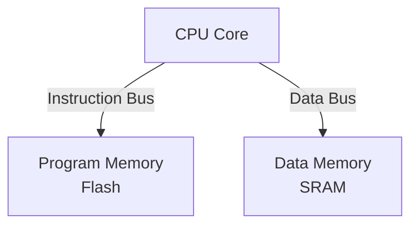
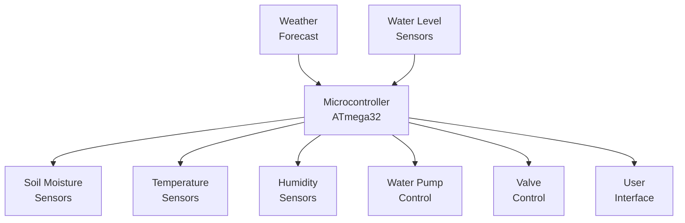
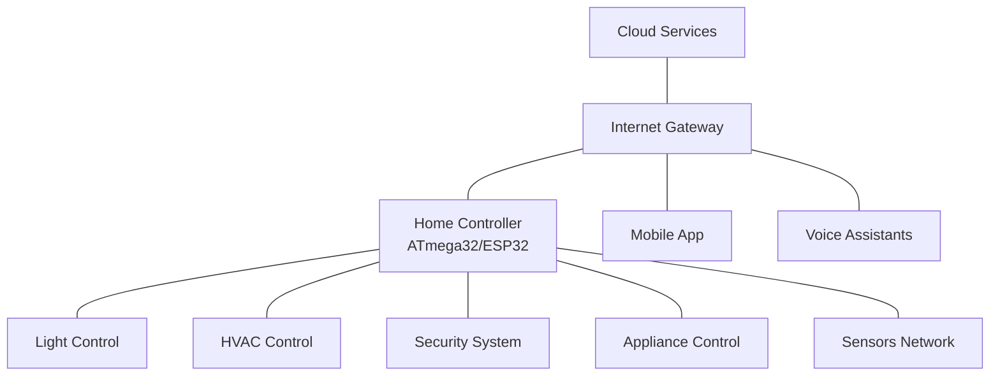

## Question 1(a) [3 marks]

**Write the size of RAM, Flash and EEPROM memory in ATmega32 and explain its need in microcontroller.**

**Answer**:

ATmega32 memory specifications and their importance in microcontroller operation:

**Table: Memory Sizes in ATmega32**

| Memory Type | Size | Purpose |
|-------------|------|---------|
| SRAM (RAM) | 2 KB | Variables and stack storage |
| Flash | 32 KB | Program storage |
| EEPROM | 1 KB | Non-volatile data storage |

- **RAM**: Temporary storage for variables during program execution
- **Flash**: Permanent storage for program instructions and constants
- **EEPROM**: Long-term storage for data that must survive power cycles

**Mnemonic:** "RAM for Run, Flash for Function, EEPROM for Eternity"

## Question 1(b) [4 marks]

**Discuss RAM memory of ATmega32.**

**Answer**:

ATmega32's RAM (SRAM) is organized into different sections for specific purposes.

**Diagram:**

```goat
    ATmega32 RAM (2KB)
+-------------------------+ 0x0000
| 32 General Registers    |
+-------------------------+ 0x0020
| 64 I/O Registers        |
+-------------------------+ 0x0060
| 160 Extended I/O Regs   |
+-------------------------+ 0x0100
|                         |
| Internal SRAM           |
| (1.85 KB)               |
|                         |
+-------------------------+ 0x085F
```

- **Register File**: First 32 locations (0x0000-0x001F)
- **I/O Registers**: Standard I/O space (0x0020-0x005F)
- **Extended I/O**: Additional peripheral registers (0x0060-0x00FF)
- **Data Memory**: General purpose SRAM (0x0100-0x085F)

**Mnemonic:** "Registers, I/O, Extended, Data - RAM's Efficient Design"

## Question 1(c) [7 marks]

**Define Real Time Operating System and Explain Characteristics of it.**

**Answer**:

A Real-Time Operating System (RTOS) is a specialized operating system designed to process data and events with precise timing constraints.

**Table: Key Characteristics of RTOS**

| Characteristic | Description |
|----------------|-------------|
| Determinism | Guaranteed response times for tasks |
| Preemptive Scheduling | Higher priority tasks can interrupt lower ones |
| Low Latency | Minimal delay between event and response |
| Priority-Based | Tasks are assigned priorities for execution |
| Task Management | Provides mechanisms for task creation, deletion, and synchronization |
| Resource Management | Prevents resource conflicts and deadlocks |
| Reliability | Robust operation even under peak loads |

- **Multitasking**: Supports concurrent execution of multiple tasks
- **Small Footprint**: Optimized for embedded systems with limited resources
- **Time Management**: Precise timing services with microsecond resolution
- **Kernel Services**: IPC, mutex, semaphores for task coordination

**Mnemonic:** "Deterministic Preemptive Tasks Run On Strict Timelines"

## Question 1(c OR) [7 marks]

**What is Embedded System? Draw and Explain General block diagram of Embedded system.**

**Answer**:

An Embedded System is a dedicated computer system designed to perform specific functions within a larger mechanical or electrical system, often with real-time constraints.

**Diagram:**

```goat
                           +----------------+
                           |   Power Supply |
                           +----------------+
                                   |
                                   v
+-----------+    +-------------+    +-----------+    +-----------+
|           |    |             |    |           |    |           |
|  Input    |--->| Processing  |--->|  Output   |    |  Memory   |
|  Devices  |    |    Unit     |    |  Devices  |    |           |
|           |    |             |    |           |    |           |
+-----------+    +-------------+    +-----------+    +-----------+
     ^                  ^                                  ^
     |                  |                                  |
     v                  v                                  v
+-----------+    +--------------+                    +-----------+
|           |    |              |                    |           |
|  Sensors  |    | Communication|                    |  Storage  |
|           |    |  Interface   |                    |           |
+-----------+    +--------------+                    +-----------+
```

**Table: Embedded System Components**

| Component | Function |
|-----------|----------|
| Processing Unit | Executes program instructions (microcontroller/microprocessor) |
| Memory | Stores program and data (RAM, ROM, Flash) |
| Input/Output | Interfaces with external devices |
| Communication | Connects to other systems or networks |
| Power Supply | Provides regulated power |
| Sensors | Gather environmental data |

- **Application-Specific**: Designed for dedicated tasks
- **Resource-Constrained**: Limited processing power and memory
- **Real-Time**: Responds to events within timing constraints
- **High Reliability**: Must operate continuously without failure

**Mnemonic:** "Process, Memory, I/O - Every System Must Include"

## Question 2(a) [3 marks]

**Write different Criteria for choosing microcontroller for any application design in embedded system.**

**Answer**:

Selecting the right microcontroller requires evaluating multiple criteria based on application requirements.

**Table: Microcontroller Selection Criteria**

| Criterion | Considerations |
|-----------|----------------|
| Performance | CPU speed, MIPS, bit width (8/16/32) |
| Memory | Flash, RAM, EEPROM capacity |
| Power Consumption | Operating voltage, sleep modes |
| I/O Capabilities | Number of ports, special functions |
| Peripherals | ADC, timers, communication interfaces |
| Cost | Unit price, development tools |
| Form Factor | Size, package type, pin count |

- **Application Requirements**: Specific features needed for the application
- **Development Environment**: Available compilers, debuggers, libraries
- **Future Expansion**: Scalability for future enhancements

**Mnemonic:** "Performance Memory Power I/O Cost"

## Question 2(b) [4 marks]

**Draw and Explain TCCR0 register.**

**Answer**:

Timer/Counter Control Register 0 (TCCR0) controls the operation of Timer/Counter0 in ATmega32.

**Diagram:**

```goat
+-----+------+------+-----+-----+-----+-----+-----+
| FOC0| WGM00| COM01|COM00|WGM01| CS02| CS01| CS00|
+-----+------+------+-----+-----+-----+-----+-----+
   7     6       5     4     3     2     1     0
```

**Table: TCCR0 Bit Functions**

| Bits | Name | Function |
|------|------|----------|
| 7 | FOC0 | Force Output Compare |
| 6,3 | WGM01:0 | Waveform Generation Mode |
| 5,4 | COM01:0 | Compare Match Output Mode |
| 2,1,0 | CS02:0 | Clock Select (Prescaler) |

- **WGM01:0**: Determines timer operating mode (Normal, CTC, PWM)
- **COM01:0**: Controls OC0 pin output behavior
- **CS02:0**: Selects clock source and prescaler value

**Mnemonic:** "Force Waveform Compare Clock Select"

## Question 2(c) [7 marks]

**List timers of ATmega32 and Explain working modes of any one timer in detail.**

**Answer**:

ATmega32 features multiple timers with various capabilities and operating modes.

**Table: Timers in ATmega32**

| Timer | Type | Size | Features |
|-------|------|------|----------|
| Timer0 | General Purpose | 8-bit | Simple timing, PWM |
| Timer1 | Advanced | 16-bit | Input capture, dual PWM |
| Timer2 | General Purpose | 8-bit | Asynchronous operation |

**Timer0 Operating Modes:**

1. **Normal Mode**:
   - Counter increments from 0 to 255 then overflows back to 0
   - Overflow interrupt can be generated
   - Used for simple timing and delay generation

2. **CTC (Clear Timer on Compare) Mode**:
   - Counter resets when it reaches OCR0 value
   - Allows precise frequency generation
   - Compare match interrupt can be generated

3. **Fast PWM Mode**:
   - Counter counts from 0 to 255
   - Output toggles at overflow and compare match
   - High frequency PWM generation

4. **Phase Correct PWM Mode**:
   - Counter counts up then down (0→255→0)
   - Symmetric PWM waveform generation
   - Lower frequency but better resolution than Fast PWM

**Mnemonic:** "Normal Compares Fast Phase - Timer Modes Matter"

## Question 2(a OR) [3 marks]

**List various embedded system applications. Explain any one in brief.**

**Answer**:

Embedded systems are found in numerous applications across various domains.

**Table: Embedded System Applications**

| Domain | Applications |
|--------|--------------|
| Consumer | Smart appliances, entertainment systems |
| Automotive | Engine control, safety systems, infotainment |
| Industrial | Process control, automation, robotics |
| Medical | Patient monitoring, imaging, implantable devices |
| Communications | Routers, modems, network switches |
| Aerospace | Flight control, navigation, life support |

**Smart Home Automation System:**
A smart home system uses embedded controllers to monitor and control household devices. Sensors detect environmental conditions like temperature and motion, while microcontrollers process this data and control actuators such as HVAC systems, lighting, and security devices. The system can be programmed for autonomous operation or user control via smartphone apps, providing convenience, energy efficiency, and enhanced security.

**Mnemonic:** "Consumers Automate Industry Medical Communications Aerospace"

## Question 2(b OR) [4 marks]

**Explain the function of DDRA, PINA and PORTA registers in ATmega32 microcontroller.**

**Answer**:

The three registers control the operation of Port A in ATmega32, each serving a distinct purpose.

**Table: Port A Registers**

| Register | Function | Operation |
|----------|----------|-----------|
| DDRA | Data Direction | Configures pins as input (0) or output (1) |
| PORTA | Data Register | Sets output values or enables pull-ups |
| PINA | Port Input Pins | Reads actual pin states |

**Example Configurations:**

```goat
DDRA = 0xFF;  // All pins as output
PORTA = 0xA5; // Set alternating pattern (10100101)

DDRA = 0x00;  // All pins as input
PORTA = 0xFF; // Enable internal pull-ups on all pins
data = PINA;  // Read current pin states
```

- **Bit-Level Control**: Each bit controls corresponding pin
- **Atomic Operations**: Individual bits can be modified
- **Read-Modify-Write**: Common operation pattern

**Mnemonic:** "Direction Determines, Port Provides, PIN Perceives"

## Question 2(c OR) [7 marks]

**Draw Status Register of ATmega32 and explain it in detail.**

**Answer**:

The Status Register (SREG) in ATmega32 contains processor status flags affected by arithmetic operations and controls interrupts.

**Diagram:**

```goat
+---+---+---+---+---+---+---+---+
| I | T | H | S | V | N | Z | C |
+---+---+---+---+---+---+---+---+
  7   6   5   4   3   2   1   0
```

**Table: SREG Bit Functions**

| Bit | Name | Function | Set When |
|-----|------|----------|----------|
| 7 | I | Global Interrupt Enable | Programmatically enabled |
| 6 | T | Bit Copy Storage | Used for bit copy instructions |
| 5 | H | Half Carry Flag | Half-carry in BCD operations |
| 4 | S | Sign Flag | N⊕V (used for signed operations) |
| 3 | V | Two's Complement Overflow | Arithmetic overflow occurs |
| 2 | N | Negative Flag | Result is negative (MSB=1) |
| 1 | Z | Zero Flag | Result is zero |
| 0 | C | Carry Flag | Carry occurs in arithmetic |

- **Arithmetic Feedback**: Indicates result status
- **Conditional Branches**: Used by branch instructions
- **Interrupt Control**: I-bit enables/disables all interrupts
- **Access Methods**: Directly addressable via IN/OUT instructions

**Mnemonic:** "Interrupts Track Half Sign Overflow Negative Zero Carry"

## Question 3(a) [3 marks]

**Write a short note on Harvard Architecture of AVR microcontroller.**

**Answer**:

Harvard Architecture is a fundamental design principle of AVR microcontrollers, separating program and data memory.

**Diagram:**



- **Separate Buses**: Independent buses for program and data memory
- **Parallel Access**: Can fetch instructions and access data simultaneously
- **Performance**: Increases execution speed by eliminating memory bottlenecks
- **Different Widths**: Program memory is organized in 16-bit words, data memory in 8-bit bytes

**Mnemonic:** "Program and Data Paths Are Separate"

## Question 3(b) [4 marks]

**List Registers associated with Serial Communication (RS232) and explain steps to interface it with ATmega32.**

**Answer**:

ATmega32 uses USART (Universal Synchronous Asynchronous Receiver Transmitter) for serial communication.

**Table: USART Registers**

| Register | Function |
|----------|----------|
| UDR | USART Data Register (transmit/receive) |
| UCSRA | USART Control and Status Register A |
| UCSRB | USART Control and Status Register B |
| UCSRC | USART Control and Status Register C |
| UBRRH/UBRRL | USART Baud Rate Registers |

**Steps to Interface RS232:**

1. **Hardware Connection**:
   - Connect ATmega32's TXD (PD1) and RXD (PD0) to MAX232
   - Connect MAX232 to RS232 port or connector

2. **Initialize USART**:
   - Set baud rate (UBRR)
   - Set frame format (data bits, parity, stop bits)
   - Enable transmitter and/or receiver

3. **Data Transmission/Reception**:
   - Check status flags before operation
   - Write to UDR to transmit
   - Read from UDR to receive

**Mnemonic:** "Connect, Configure Baud, Enable, Transmit/Receive"

## Question 3(c) [7 marks]

**Explain Bit-wise logical operations in AVR C programming with necessary examples.**

**Answer**:

Bit-wise operations manipulate individual bits in a byte or word, essential for embedded programming.

**Table: Bit-wise Operators in AVR C**

| Operator | Operation | Example | Result |
|----------|-----------|---------|--------|
| & | AND | 0xA5 & 0x0F | 0x05 |
| \| | OR | 0x50 \| 0x0F | 0x5F |
| ^ | XOR | 0x55 ^ 0xFF | 0xAA |
| ~ | NOT | ~0x55 | 0xAA |
| << | Left Shift | 0x01 << 3 | 0x08 |
| >> | Right Shift | 0x80 >> 3 | 0x10 |

**Example: Setting and Clearing Bits**

```c
// Set bit 3 of PORTB
PORTB |= (1 << 3);   // PORTB = PORTB | 0b00001000

// Clear bit 5 of PORTB
PORTB &= ~(1 << 5);  // PORTB = PORTB & 0b11011111

// Toggle bit 2 of PORTB
PORTB ^= (1 << 2);   // PORTB = PORTB ^ 0b00000100

// Check if bit 4 is set
if (PINB & (1 << 4)) {
    // Bit 4 is set
}
```

**Mnemonic:** "AND clears, OR sets, XOR toggles, Shift multiplies/divides"

## Question 3(a OR) [3 marks]

**Explain RESET circuit for the ATmega32 microcontroller.**

**Answer**:

The reset circuit ensures proper initialization of ATmega32 when power is applied or during system reset.

**Diagram:**

```goat
         VCC
          |
          |
         +++
         | | 10KΩ (Pull-up)
         +++
          |
          +------+
          |      |
      +---+      |
      |   |      |
      |   C      |
   +--+--+ 100nF |
   |RESET|       |
   |     |       |
   | MCU |      GND
   +-----+
```

- **Active-Low RESET**: Held low to reset the microcontroller
- **External Reset**: Manual reset button connects RESET pin to ground
- **Power-on Reset**: Auto-reset when power is first applied
- **Brown-out Detection**: Reset when voltage drops below threshold
- **Watchdog Timer**: Reset on software malfunction

**Mnemonic:** "Pull Up, Push Button, Power Starts, Voltage Drops"

## Question 3(b OR) [4 marks]

**List Registers associated with EEPROM and write steps to interface EEPROM of ATmega32.**

**Answer**:

ATmega32 has on-chip EEPROM with dedicated registers for access control.

**Table: EEPROM Registers**

| Register | Function |
|----------|----------|
| EEARH/EEARL | EEPROM Address Registers |
| EEDR | EEPROM Data Register |
| EECR | EEPROM Control Register |

**Steps to Interface EEPROM:**

1. **Wait for Completion**:
   - Check if previous write operation is complete (EEWE bit in EECR)

2. **Set Address**:
   - Load address into EEARH:EEARL (16-bit address)

3. **Read or Write Operation**:
   - For read: Set EERE bit in EECR, then read EEDR
   - For write: Write data to EEDR, then set EEMWE and EEWE bits in EECR

4. **Wait for Completion**:
   - Poll EEWE bit until it becomes zero

**Mnemonic:** "Wait, Address, Data, Control, Wait"

## Question 3(c OR) [7 marks]

**Write a C program to generate square wave of 1KHz on the PORTC.2 pin continuously. Use Timer0, Normal mode, and 1:8 pre-scaler to create the delay. Assume XTAL = 8 MHz.**

**Answer**:

```c
#include <avr/io.h>

int main(void)
{
    // Configure PORTC.2 as output
    DDRC |= (1 << 2);  // Set PC2 as output
    
    // Timer0 configuration - Normal mode, 1:8 prescaler
    TCCR0 = (0 << WGM01) | (0 << WGM00) | (0 << CS02) | (1 << CS01) | (0 << CS00);
    
    // Calculate timer value for 1KHz (500μs period, 250μs half-period)
    // 8MHz/8 = 1MHz timer clock, 250 cycles for 250μs
    // 256-250 = 6 (starting value for 250μs)
    
    while (1)
    {
        // Toggle PORTC.2
        PORTC ^= (1 << 2);
        
        // Reset timer
        TCNT0 = 6;
        
        // Wait until timer overflows
        while (!(TIFR & (1 << TOV0)));
        
        // Clear overflow flag
        TIFR |= (1 << TOV0);
    }
    
    return 0;
}
```

- **Frequency Calculation**: 1KHz = 1000Hz = 1ms period = 500μs half-period
- **Timer Clock**: 8MHz ÷ 8 = 1MHz = 1μs per tick
- **Timer Ticks**: 250μs ÷ 1μs = 250 ticks
- **Initial Value**: 256 - 250 = 6 (for overflow after 250 ticks)

**Mnemonic:** "Configure, Calculate, Toggle, Reset, Wait, Clear, Repeat"

## Question 4(a) [3 marks]

**Draw and Explain SPI based device interfacing diagram with ATmega32.**

**Answer**:

SPI (Serial Peripheral Interface) is a synchronous serial communication protocol used to interface ATmega32 with peripheral devices.

**Diagram:**

```goat
            ATmega32                  SPI Device
          +----------+               +----------+
          |          |               |          |
  (SS)  PB4 ---------|-------------> CS         |
 (MOSI) PB5 ---------|-------------> SDI        |
(MISO) PB6 <---------|-------------- SDO        |
 (SCK)  PB7 ---------|-------------> SCK        |
          |          |               |          |
          +----------+               +----------+
```

- **MOSI (Master Out Slave In)**: Data from master to slave
- **MISO (Master In Slave Out)**: Data from slave to master
- **SCK (Serial Clock)**: Synchronization clock provided by master
- **SS (Slave Select)**: Active-low signal to select specific slave device

**Mnemonic:** "Master Outputs, Slave Inputs, Clock Keeps Synchronization"

## Question 4(b) [4 marks]

**Draw and explain interfacing of Relay using ULN2803 with ATmega32.**

**Answer**:

ULN2803 is an array of Darlington transistor pairs used to drive high-current devices like relays from microcontroller pins.

**Diagram:**

```goat
  ATmega32          ULN2803            Relay
+---------+      +-----------+        +---------+
|         |      |           |        |         |
|     PD0 |----->| IN1  OUT1 |------->|+      K |
|         |      |           |  |     |         |
|     PD1 |----->| IN2  OUT2 |--┘     |         |
|         |      |           |        |         |
+---------+      |           |        +---------+
                 |       COM |------->| GND     |
     VCC ------->| VCC       |        |         |
                 +-----------+        +---------+
                                        ^
                                        |
                                       VCC
```

- **Current Amplification**: ULN2803 can sink up to 500mA per channel
- **Voltage Isolation**: Built-in diodes protect against inductive kickback
- **Multiple Channels**: 8 Darlington pairs in one package
- **High Voltage Rating**: Can handle up to 50V at outputs

**Mnemonic:** "Low Current Controls High Current Loads"

## Question 4(c) [7 marks]

**Draw an interfacing diagram of LM35 connected on ADC0 (pin 40) of ATmega32 and write AVR C program to display digital result on Port B. (use ADC in 8-bit mode).**

**Answer**:

LM35 is a precision temperature sensor that outputs an analog voltage proportional to temperature.

**Circuit Diagram:**

```goat
    +5V
     |
     |
  +--+--+
  |     |
  | LM35|
  |     |
  +--+--+
     |
     +---------> To ADC0 (PA0/Pin 40)
     |
     |
    GND
```

**C Program:**

```c
#include <avr/io.h>
#include <util/delay.h>

int main(void)
{
    // Configure PORTB as output for displaying result
    DDRB = 0xFF;
    
    // Configure ADC
    ADMUX = (0 << REFS1) | (1 << REFS0) | // AVCC as reference
            (1 << ADLAR) |               // Left adjust result for 8-bit
            (0 << MUX4) | (0 << MUX3) | (0 << MUX2) | (0 << MUX1) | (0 << MUX0); // ADC0
    
    ADCSRA = (1 << ADEN) |               // Enable ADC
             (1 << ADPS2) | (1 << ADPS1) | (1 << ADPS0); // Prescaler 128
    
    while (1)
    {
        // Start conversion
        ADCSRA |= (1 << ADSC);
        
        // Wait for conversion to complete
        while (ADCSRA & (1 << ADSC));
        
        // Display result on PORTB (8-bit from ADCH)
        PORTB = ADCH;
        
        // Wait before next reading
        _delay_ms(500);
    }
    
    return 0;
}
```

- **Temperature Calculation**: LM35 outputs 10mV/°C
- **ADC Configuration**: Left-adjusted for easy 8-bit reading
- **Resolution**: Using 8-bit mode gives approximately 1°C resolution with 5V reference
- **Range**: Can measure 0-255°C range (limited by 8-bit register)

**Mnemonic:** "Connect, Configure, Convert, Capture, Display"

## Question 4(a OR) [3 marks]

**Write an AVR C program to continuous monitor PA0 pin of port A. If it is HIGH, send HIGH to PC0 pin of port C; otherwise, send LOW to PC0 pin of port C.**

**Answer**:

```c
#include <avr/io.h>

int main(void)
{
    // Configure PA0 as input
    DDRA &= ~(1 << PA0);
    
    // Enable pull-up resistor on PA0
    PORTA |= (1 << PA0);
    
    // Configure PC0 as output
    DDRC |= (1 << PC0);
    
    while (1)
    {
        // Check if PA0 is HIGH
        if (PINA & (1 << PA0))
        {
            // Set PC0 HIGH
            PORTC |= (1 << PC0);
        }
        else
        {
            // Set PC0 LOW
            PORTC &= ~(1 << PC0);
        }
    }
    
    return 0;
}
```

- **Input Configuration**: Set as input with pull-up resistor
- **Continuous Monitoring**: Infinite loop checks pin state
- **Output Action**: PC0 mirrors PA0 state
- **Efficient Code**: Simple conditional statement for pin monitoring

**Mnemonic:** "Configure, Monitor, Mirror"

## Question 4(b OR) [4 marks]

**Draw ATmega32 pin diagram and write function of Vcc, AVcc and Aref pin.**

**Answer**:

ATmega32 has 40 pins organized in a DIP package, with power supply pins having distinct functions.

**Simplified Pin Diagram:**

```goat
                 +------+
      (XCK) PB0 -|1   40|- PA0 (ADC0)
           PB1  -|2   39|- PA1 (ADC1)
(INT2/AIN0) PB2 -|3   38|- PA2 (ADC2)
 (OC0/AIN1) PB3 -|4   37|- PA3 (ADC3)
         SS PB4 -|5   36|- PA4 (ADC4)
       MOSI PB5 -|6   35|- PA5 (ADC5)
       MISO PB6 -|7   34|- PA6 (ADC6)
        SCK PB7 -|8   33|- PA7 (ADC7)
         RESET  -|9   32|- AREF
           VCC  -|10  31|- GND
           GND  -|11  30|- AVCC
         XTAL2  -|12  29|- PC7
         XTAL1  -|13  28|- PC6
     (RXD) PD0  -|14  27|- PC5
     (TXD) PD1  -|15  26|- PC4
    (INT0) PD2  -|16  25|- PC3
    (INT1) PD3  -|17  24|- PC2
    (OC1B) PD4  -|18  23|- PC1
    (OC1A) PD5  -|19  22|- PC0
     (ICP) PD6  -|20  21|- PD7 (OC2)
                 +------+
```

**Table: Power Supply Pins**

| Pin | Function | Description |
|-----|----------|-------------|
| VCC | Digital Power | Main supply voltage for digital circuits (5V typical) |
| AVCC | Analog Power | Supply for analog circuitry, particularly ADC (5V typical) |
| AREF | Analog Reference | External reference voltage for ADC |

- **VCC**: Powers digital logic and I/O ports
- **AVCC**: Must be within ±0.3V of VCC, even if ADC unused
- **AREF**: Optional external reference for ADC, otherwise connect to AVCC

**Mnemonic:** "VCC for Core Circuits, AVCC for Analog, AREF for Reference"

## Question 4(c OR) [7 marks]

**Draw and explain interfacing of MAX7221 with ATmega32.**

**Answer**:

MAX7221 is an LED display driver IC that interfaces with ATmega32 using SPI communication.

**Circuit Diagram:**

```goat
 ATmega32                MAX7221                 Display
+--------+              +--------+              +--------+
|        |              |        |              |        |
|    PB4 |------------->|CS/LOAD |              |        |
|    PB5 |------------->|DIN     |              |        |
|    PB6 |<-------------|DOUT    |              |  7-SEG |
|    PB7 |------------->|CLK     |------------->| DISPLAY|
|        |              |        |              |        |
+--------+              +--------+              +--------+
```

**Table: Connection Details**

| ATmega32 Pin | MAX7221 Pin | Function |
|--------------|-------------|----------|
| PB4 (SS) | CS/LOAD | Chip select/Load data |
| PB5 (MOSI) | DIN | Data input to MAX7221 |
| PB6 (MISO) | DOUT | Data output (often unused) |
| PB7 (SCK) | CLK | Clock signal |

**Interfacing Steps:**

1. **Initialize SPI:**
   - Configure SPI in master mode
   - Set appropriate clock polarity and phase
   - Set SS (PB4) as output and initially high

2. **Initialize MAX7221:**
   - Set decode mode (BCD decode or no-decode)
   - Set scan limit (number of digits)
   - Set intensity (brightness)
   - Turn on display

3. **Send Data:**
   - Pull SS low
   - Send register address followed by data
   - Pull SS high to latch the data

```c
// Example initialization code
void MAX7221_init() {
    // Initialize SPI
    DDRB |= (1<<PB4)|(1<<PB5)|(1<<PB7);  // SS, MOSI, SCK as outputs
    SPCR = (1<<SPE)|(1<<MSTR)|(1<<SPR0); // Enable SPI, Master, clk/16
    
    // Initialize MAX7221
    MAX7221_send(0x09, 0xFF);  // Decode mode: BCD for all digits
    MAX7221_send(0x0A, 0x0F);  // Intensity: 15/32 duty (max)
    MAX7221_send(0x0B, 0x07);  // Scan limit: display all digits
    MAX7221_send(0x0C, 0x01);  // Shutdown mode: normal operation
    MAX7221_send(0x0F, 0x00);  // Display test: normal operation
}
```

**Mnemonic:** "Send, Select, Clock, Data, Display"

## Question 5(a) [3 marks]

**Draw and explain pin diagram of L293D motor driver IC.**

**Answer**:

L293D is a quadruple half-H driver designed for bidirectional control of DC motors.

**Diagram:**

```goat
        +------+
        | 1  16| 
    EN1-|      |-VCC1
    IN1-|      |-IN4
   OUT1-|      |-OUT4
    GND-| L293D|-GND
    GND-|      |-GND
   OUT2-|      |-OUT3
    IN2-|      |-IN3
   VCC2-|      |-EN2
        +------+
```

**Table: L293D Pin Functions**

| Pin | Name | Function |
|-----|------|----------|
| 1, 9 | EN1, EN2 | Enable inputs (can be PWM signals) |
| 2, 7, 10, 15 | IN1-IN4 | Logic inputs |
| 3, 6, 11, 14 | OUT1-OUT4 | Output pins to motors |
| 4, 5, 12, 13 | GND | Ground connections |
| 8 | VCC2 | Motor supply voltage (4.5V-36V) |
| 16 | VCC1 | Logic supply voltage (5V) |

- **Dual H-Bridges**: Can control two DC motors independently
- **Heat Sink**: Ground pins provide heat dissipation
- **High Current**: Can drive up to 600mA per channel
- **Protection Diodes**: Internal flyback diodes for inductive loads

**Mnemonic:** "Enable, Input, Output, Power"

## Question 5(b) [4 marks]

**Draw and explain ADMUX register.**

**Answer**:

ADMUX (ADC Multiplexer Selection Register) controls analog channel selection and result format in ATmega32.

**Diagram:**

```goat
+------+------+------+------+------+------+------+------+
| REFS1| REFS0| ADLAR|  --  | MUX3 | MUX2 | MUX1 | MUX0 |
+------+------+------+------+------+------+------+------+
    7      6      5      4      3      2      1      0
```

**Table: ADMUX Bit Functions**

| Bits | Name | Function |
|------|------|----------|
| 7:6 | REFS1:0 | Reference voltage selection |
| 5 | ADLAR | ADC Left Adjust Result |
| 3:0 | MUX3:0 | Analog channel selection |

**REFS1:0 Settings:**

- 00: AREF pin (external reference)
- 01: AVCC with external capacitor
- 11: Internal 2.56V reference

- **Channel Selection**: MUX3:0 selects which ADC input to connect
- **Result Alignment**: ADLAR=1 shifts result left (for 8-bit readings)
- **Differential Inputs**: Some MUX combinations allow differential measurements

**Mnemonic:** "Reference, Alignment, Multiplexer"

## Question 5(c) [7 marks]

**Explain Smart Irrigation System.**

**Answer**:

A Smart Irrigation System uses embedded technology to efficiently manage water for plant cultivation based on environmental conditions.

**Diagram:**



**Table: Smart Irrigation Components**

| Component | Function |
|-----------|----------|
| Soil Moisture Sensors | Measure water content in soil |
| Temperature/Humidity Sensors | Monitor environmental conditions |
| Valves | Control water flow to different zones |
| Pump Control | Activate water pumps when needed |
| Microcontroller | Process sensor data and control outputs |
| User Interface | Allow monitoring and manual control |

**Key Features:**

1. **Automated Watering**: Waters plants only when soil moisture falls below threshold
2. **Weather Adaptation**: Adjusts watering schedule based on temperature, humidity, and rain forecast
3. **Zone Control**: Different areas can have individual watering schedules
4. **Water Conservation**: Uses minimum necessary water for optimal plant growth
5. **Remote Monitoring**: Mobile app or web interface for system status and control
6. **Scheduling**: Time-based and condition-based watering options

**Mnemonic:** "Sense, Decide, Conserve, Grow"

## Question 5(a OR) [3 marks]

**Draw circuit diagram to interface DC motor with ATmega32 using L293D motor driver.**

**Answer**:

The circuit connects a DC motor to ATmega32 through L293D for bidirectional control.

**Circuit Diagram:**

```goat
         ATmega32               L293D                  DC Motor
        +--------+           +--------+              +----------+
        |        |           |        |              |          |
        |     PB0|---------->|IN1     |              |          |
        |     PB1|---------->|IN2     |              |          |
        |     PB2|---------->|EN1     |              |          |
        |        |           |OUT1 >--|------------->|+         |
        |        |           |OUT2 >--|------------->|-         |
        |        |           |        |              |          |
        +--------+           +--------+              +----------+
                                 |
                                 | VCC2 (Motor power)
                              +--+--+
                              |     |
                              | 12V |
                              |     |
                              +-----+
```

**Control Logic:**

| PB0 (IN1) | PB1 (IN2) | PB2 (EN1) | Motor Status |
|-----------|-----------|-----------|--------------|
| 0 | 0 | 1 | Stop (brake) |
| 1 | 0 | 1 | Rotate clockwise |
| 0 | 1 | 1 | Rotate counter-clockwise |
| 1 | 1 | 1 | Stop (brake) |
| X | X | 0 | Motor disabled |

- **Speed Control**: PWM signal on EN1 can control motor speed
- **Direction Control**: IN1 and IN2 control rotation direction
- **Power Separation**: Logic powered by microcontroller, motor by separate supply

**Mnemonic:** "Enable and Direction Control Motor"

## Question 5(b OR) [4 marks]

**Draw and Explain I2C based device interfacing diagram with ATmega32.**

**Answer**:

I2C (Inter-Integrated Circuit) is a two-wire serial bus for connecting multiple devices to a microcontroller.

**Diagram:**

```goat
           VCC
            |
            |
         +--+--+        +-----------+        +-----------+
         |     |        |           |        |           |
         | 4.7K|        | I2C       |        | I2C       |
         | ohm |        | Device 1  |        | Device 2  |
         +--+--+        | (EEPROM)  |        | (Sensor)  |
            |           |           |        |           |
            |           |           |        |           |
 ATmega32   |           |           |        |           |
+--------+  |           |           |        |           |
|        |  |           |           |        |           |
|     PC0|--+-----------|-SDA-------|--------|-SDA-------|
|        |              |           |        |           |
|     PC1|--+-----------|-SCL-------|--------|-SCL-------|
|        |  |           |           |        |           |
+--------+  |           +-----------+        +-----------+
            |
         +--+--+
         |     |
         | 4.7K|
         | ohm |
         +--+--+
            |
            |
           VCC
```

**Key Components:**

- **SDA (Serial Data Line)**: Bidirectional data transfer line
- **SCL (Serial Clock Line)**: Clock signal generated by master
- **Pull-up Resistors**: Required on both lines (typically 4.7kΩ)
- **Multiple Devices**: Each I2C device has a unique address

**Communication Process:**

1. **Start Condition**: SDA transitions high-to-low while SCL is high
2. **Address Transmission**: 7-bit device address followed by R/W bit
3. **Acknowledgment**: Receiving device pulls SDA low
4. **Data Transfer**: 8-bit data bytes with acknowledgment
5. **Stop Condition**: SDA transitions low-to-high while SCL is high

**Mnemonic:** "Start, Address, Acknowledge, Data, Stop"

## Question 5(c OR) [7 marks]

**Explain IoT based Home Automation System.**

**Answer**:

An IoT-based Home Automation System connects household devices to the internet for remote monitoring and control.

**Diagram:**



**Table: Home Automation Components**

| Component | Function |
|-----------|----------|
| Controller | Central processing unit (microcontroller/SBC) |
| Sensors | Monitor temperature, motion, light, humidity |
| Actuators | Control lights, appliances, locks, HVAC |
| Gateway | Connects to internet and local devices |
| User Interface | Mobile app, voice control, web dashboard |
| Cloud Services | Data storage, processing, and remote access |

**Key Features:**

1. **Remote Access**: Control home devices from anywhere
2. **Voice Control**: Integration with voice assistants (Alexa, Google Home)
3. **Energy Management**: Monitor and optimize power consumption
4. **Security**: Control and monitor doors, windows, and cameras
5. **Scheduling**: Automate device operation based on time or events
6. **Scene Setting**: Predefined configurations for multiple devices
7. **Adaptive Control**: Learning user preferences and patterns

**Mnemonic:** "Connect, Control, Monitor, Automate, Learn"
