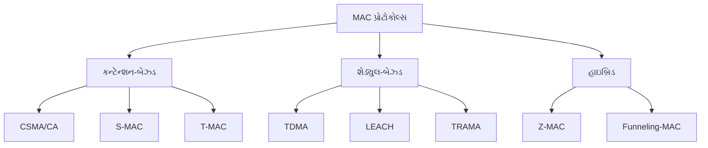
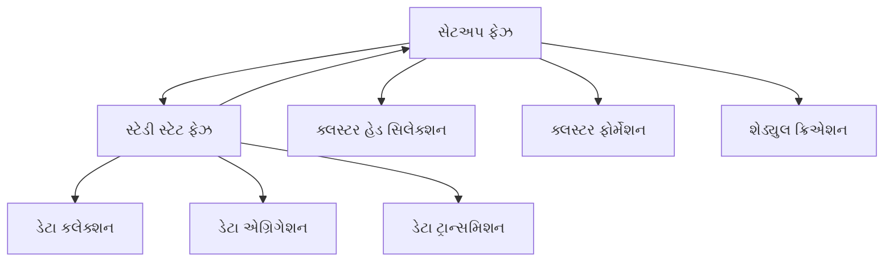
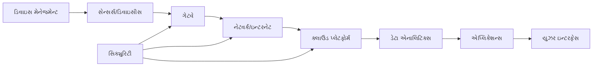
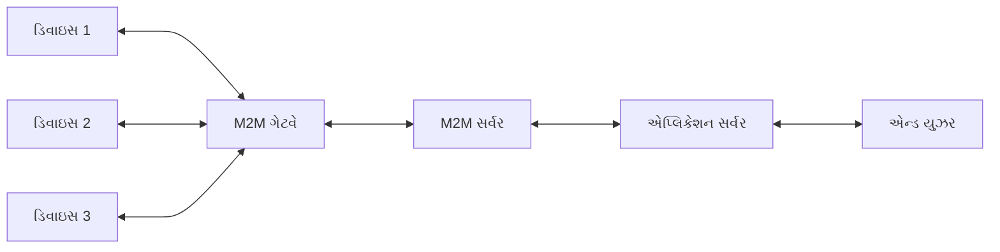
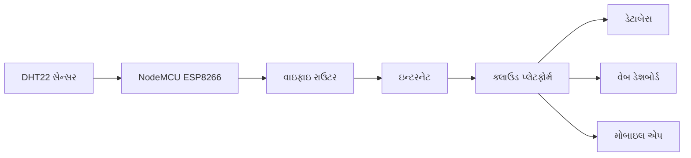
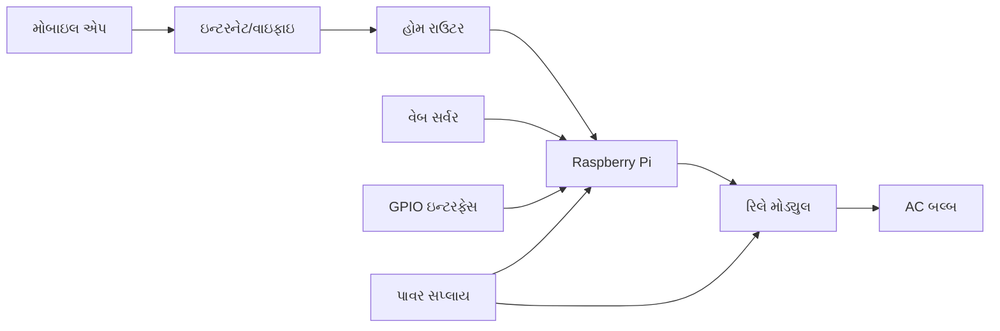
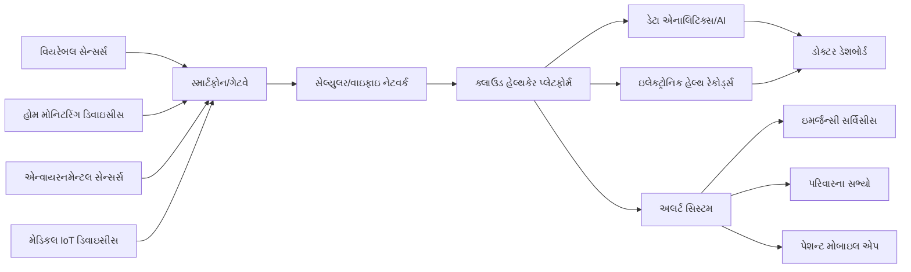
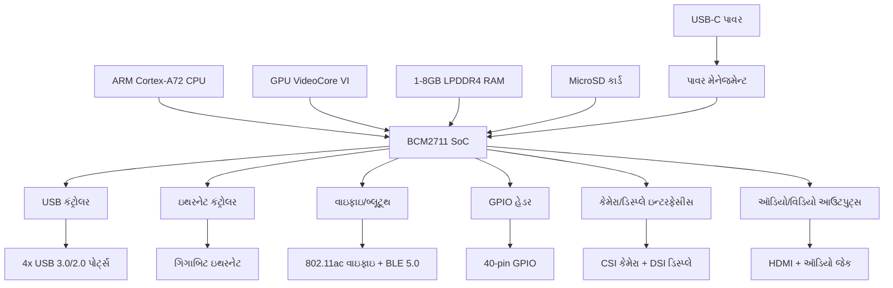

## પ્રશ્ન 1(અ) [3 ગુણ]

**વાયરલેસ સેન્સર નેટવર્ક (WSN) ની વ્યાખ્યા આપો અને તેના મુખ્ય ઘટકોની યાદી આપો.**

**જવાબ**:

**WSN વ્યાખ્યા**: વાયરલેસ સેન્સર નેટવર્ક એ અવકાશીય રીતે વિતરિત સ્વાયત્ત સેન્સર્સનો સંગ્રહ છે જે ભૌતિક અથવા પર્યાવરણીય સ્થિતિઓનું નિરીક્ષણ કરે છે અને નેટવર્ક દ્વારા સહકારી રીતે મુખ્ય સ્થાને ડેટા પસાર કરે છે.

**મુખ્ય ઘટકોનું ટેબલ:**

| ઘટક | કાર્ય |
|-----------|----------|
| **સેન્સર નોડ્સ** | પર્યાવરણીય ડેટા સંગ્રહ કરે છે |
| **બેઝ સ્ટેશન** | ડેટા સંગ્રહ અને પ્રક્રિયા કેન્દ્ર |
| **કમ્યુનિકેશન લિંક્સ** | વાયરલેસ ડેટા ટ્રાન્સમિશન |
| **ગેટવે** | WSN અને બાહ્ય નેટવર્ક વચ્ચે ઇન્ટરફેસ |

**મેમરી ટ્રીક:** "SBCG - સેન્સર્સ બેઝ કમ્યુનિકેશન ગેટવે"

## પ્રશ્ન 1(બ) [4 ગુણ]

**WSNs માં ફિઝિકલ લેયરની ભૂમિકા સમજાવો.**

**જવાબ**:

**ફિઝિકલ લેયર કાર્યો:**

- **સિગ્નલ ટ્રાન્સમિશન**: વાયરલેસ કમ્યુનિકેશન માટે ડિજિટલ ડેટાને રેડિયો તરંગોમાં કન્વર્ટ કરે છે
- **ફ્રીક્વન્સી મૅનેજમેન્ટ**: ISM બેન્ડ્સમાં કાર્ય કરે છે (2.4 GHz, 915 MHz, 433 MHz)
- **પાવર કંટ્રોલ**: બેટરી લાઇફ ઑપ્ટિમાઇઝ કરવા માટે ટ્રાન્સમિશન પાવર મૅનેજ કરે છે
- **મોડ્યુલેશન**: ડેટા એન્કોડિંગ માટે BPSK, QPSK જેવી તકનીકોનો ઉપયોગ કરે છે

**સરળ બ્લોક ડાયાગ્રામ:**

```goat
┌─────────────┐    ┌─────────────┐    ┌─────────────┐
│   Digital   │───▶│  Physical   │───▶│  Antenna    │
│    Data     │    │   Layer     │    │ Transmission│
└─────────────┘    └─────────────┘    └─────────────┘
```

**મેમરી ટ્રીક:** "SFPM - સિગ્નલ ફ્રીક્વન્સી પાવર મોડ્યુલેશન"

## પ્રશ્ન 1(ક) [7 ગુણ]

**WSNs માં ટ્રાન્સીવર્સ માટેની ડિઝાઇન વિચારણાઓની ચર્ચા કરો.**

**જવાબ**:

**મુખ્ય ડિઝાઇન વિચારણાઓ:**

- **પાવર એફિશિયન્સી**: વિસ્તૃત બેટરી લાઇફ માટે અતિ-નીચો પાવર વપરાશ
- **કમ્યુનિકેશન રેન્જ**: રેન્જ (10m-1km) અને પાવર વપરાશ વચ્ચે સંતુલન
- **ડેટા રેટ**: સેન્સર એપ્લિકેશન્સ માટે સામાન્ય રીતે 20-250 kbps
- **ફ્રીક્વન્સી બેન્ડ**: લાઇસન્સિંગ આવશ્યકતાઓ ટાળવા માટે ISM બેન્ડ્સ
- **મોડ્યુલેશન સ્કીમ**: ઓછા પાવર માટે OOK, FSK જેવી સરળ સ્કીમ્સ
- **એન્ટેના ડિઝાઇન**: કોમ્પેક્ટ, ઓમ્નિડાયરેક્શનલ એન્ટેના
- **કોસ્ટ ફેક્ટર**: લાર્જ-સ્કેલ ડિપ્લોયમેન્ટ માટે ઓછી કિંમતના ઘટકો

**ટ્રાન્સીવર આર્કિટેક્ચર:**

```goat
┌───────────┐    ┌──────────┐    ┌─────────┐    ┌─────────┐
│   MCU     │◄──►│   RF     │◄──►│  PA/LNA │◄──►│ Antenna │
│           │    │ Frontend │    │         │    │         │
└───────────┘    └──────────┘    └─────────┘    └─────────┘
```

**ટ્રેડ-ઑફ્સ ટેબલ:**

| પેરામીટર | હાઇ પર્ફોર્મન્સ | લો પાવર |
|-----------|------------------|-----------|
| **રેન્જ** | લાંબી (1km) | ટૂંકી (100m) |
| **પાવર** | વધારે (100mW) | ઓછી (1mW) |
| **કિંમત** | મંહગું | સસ્તું |

**મેમરી ટ્રીક:** "PCRFMAC - પાવર કમ્યુનિકેશન રેન્જ ફ્રીક્વન્સી મોડ્યુલેશન એન્ટેના કોસ્ટ"

## પ્રશ્ન 1(ક) OR [7 ગુણ]

**WSN માં ઑપ્ટિમાઇઝેશન ગોલ્સ અને ફિગર્સ ઑફ મેરિટને સમજાવો.**

**જવાબ**:

**ઑપ્ટિમાઇઝેશન ગોલ્સ:**

- **એનર્જી એફિશિયન્સી**: પાવર વપરાશ ઘટાડીને નેટવર્ક લાઇફટાઇમ વધારવી
- **કવરેજ**: ન્યૂનતમ સેન્સર નોડ્સ સાથે સંપૂર્ણ વિસ્તાર મૉનિટરિંગ સુનિશ્ચિત કરવું
- **કનેક્ટિવિટી**: નોડ ફેઇલ્યુર સાથે પણ નેટવર્ક કનેક્ટિવિટી જાળવવી
- **ડેટા ક્વોલિટી**: એકત્રિત ડેટાની ઉચ્ચ ચોકસાઇ અને વિશ્વસનીયતા
- **સ્કેલેબિલિટી**: મોટી સંખ્યામાં નોડ્સને સપોર્ટ કરવું (100-10000)
- **કોસ્ટ ઇફેક્ટિવનેસ**: ડિપ્લોયમેન્ટ અને મેઇન્ટેનન્સ કોસ્ટ ઘટાડવી

**ફિગર્સ ઑફ મેરિટ ટેબલ:**

| મેટ્રિક | વર્ણન | સામાન્ય મૂલ્ય |
|--------|-------------|---------------|
| **નેટવર્ક લાઇફટાઇમ** | પ્રથમ નોડ મૃત્યુ સુધીનો સમય | 1-5 વર્ષ |
| **કવરેજ રેશિયો** | કવર કરેલું વિસ્તાર/કુલ વિસ્તાર | >95% |
| **કનેક્ટિવિટી** | કનેક્ટેડ નોડ્સ/કુલ નોડ્સ | >90% |
| **લેટન્સી** | એન્ડ-ટુ-એન્ડ વિલંબ | <1 સેકન્ડ |
| **થ્રુપુટ** | નોડ દીઠ ડેટા રેટ | 1-100 kbps |

**ઑપ્ટિમાઇઝેશન ટેકનિક્સ:**

- **ક્લસ્ટરિંગ**: કમ્યુનિકેશન ઓવરહેડ ઘટાડવું
- **ડેટા એગ્રિગેશન**: રિડન્ડન્ટ ટ્રાન્સમિશન્સ ઘટાડવા
- **સ્લીપ શેડ્યુલિંગ**: જરૂર ન હોય ત્યારે નોડ્સ બંધ કરવા

**મેમરી ટ્રીક:** "ECCDC - એનર્જી કવરેજ કનેક્ટિવિટી ડેટા કોસ્ટ"

## પ્રશ્ન 2(અ) [3 ગુણ]

**WSNs માં સેન્સર MAC પ્રોટોકોલની લાક્ષણિકતાઓની યાદી આપો.**

**જવાબ**:

**S-MAC પ્રોટોકોલ લાક્ષણિકતાઓ:**

| લાક્ષણિકતા | વર્ણન |
|----------------|-------------|
| **ડ્યુટી સાયક્લિંગ** | સમયાંતરે સ્લીપ અને વેક-અપ સાયકલ |
| **કોલિઝન એવોઇડન્સ** | RTS/CTS મેકેનિઝમ |
| **ઓવરહિયરિંગ એવોઇડન્સ** | અપ્રાસંગિક ટ્રાન્સમિશન દરમિયાન નોડ્સ સૂઈ જાય છે |
| **મેસેજ પાસિંગ** | લાંબા મેસેજીસ ફ્રેગમેન્ટ્સમાં વિભાજિત |

**મેમરી ટ્રીક:** "DCOM - ડ્યુટી કોલિઝન ઓવરહિયરિંગ મેસેજ"

## પ્રશ્ન 2(બ) [4 ગુણ]

**WSNs માં એનર્જી-એફિશિયન્ટ રૂટિંગની વિભાવના વર્ણન કરો.**

**જવાબ**:

**એનર્જી-એફિશિયન્ટ રૂટિંગ કોન્સેપ્ટ:**

એનર્જી-એફિશિયન્ટ રૂટિંગ નેટવર્ક કનેક્ટિવિટી અને ડેટા ડિલિવરી જાળવીને પાવર વપરાશ ઘટાડે છે.

**મુખ્ય ટેકનિક્સ:**

- **મલ્ટિ-હોપ કમ્યુનિકેશન**: ટૂંકા હોપ્સ લાંબા હોપ્સ કરતાં ઓછા પાવરનો વપરાશ કરે છે
- **લોડ બેલેન્સિંગ**: નોડ ડિપ્લીશન ટાળવા માટે ટ્રાફિક વિતરિત કરવું
- **ડેટા એગ્રિગેશન**: અનેક સ્ત્રોતોમાંથી ડેટા સંયોજિત કરવું
- **જિયોગ્રાફિક રૂટિંગ**: કાર્યક્ષમ પાથ માટે સ્થાન માહિતીનો ઉપયોગ

**એનર્જી મોડલ:**

```
E_tx = E_elec × k + ε_amp × k × d²
E_rx = E_elec × k
```

**રૂટિંગ સ્ટ્રેટેજીસ ટેબલ:**

| સ્ટ્રેટેજી | પાવર સેવિંગ | ઇમ્પ્લિમેન્ટેશન |
|----------|-------------|----------------|
| **શોર્ટેસ્ટ પાથ** | મધ્યમ | સરળ |
| **મિન-એનર્જી** | ઊંચું | જટિલ |
| **મેક્સ-લાઇફટાઇમ** | ખૂબ ઊંચું | ખૂબ જટિલ |

**મેમરી ટ્રીક:** "MLDG - મલ્ટિ-હોપ લોડ ડેટા જિયોગ્રાફિક"

## પ્રશ્ન 2(ક) [7 ગુણ]

**WSNs માટે MAC પ્રોટોકોલ્સનું વર્ગીકરણ ઉદાહરણો સાથે સમજાવો.**

**જવાબ**:

**MAC પ્રોટોકોલ વર્ગીકરણ:**



**વિગતવાર વર્ગીકરણ:**

**1. કન્ટેન્શન-બેઝ્ડ પ્રોટોકોલ્સ:**

- **CSMA/CA**: ટ્રાન્સમિશન પહેલાં કેરિયર સેન્સિંગ
- **S-MAC**: સ્લીપ શેડ્યુલ્સ સાથે સિંક્રોનાઇઝ્ડ ડ્યુટી સાયકલ્સ
- **T-MAC**: ટ્રાફિક આધારિત એડાપ્ટિવ ડ્યુટી સાયકલ

**2. શેડ્યુલ-બેઝ્ડ પ્રોટોકોલ્સ:**

- **TDMA**: નોડ્સને ટાઇમ સ્લોટ્સ ફાળવવામાં આવે છે
- **LEACH**: રોટેટિંગ ક્લસ્ટર હેડ્સ સાથે ક્લસ્ટર-બેઝ્ડ
- **TRAMA**: ટ્રાફિક-એડાપ્ટિવ મીડિયમ એક્સેસ

**3. હાઇબ્રિડ પ્રોટોકોલ્સ:**

- **Z-MAC**: CSMA અને TDMA ફાયદાઓને સંયોજિત કરે છે
- **Funneling-MAC**: વિવિધ નેટવર્ક રીજન્સ માટે વિવિધ પ્રોટોકોલ્સ

**તુલના ટેબલ:**

| પ્રોટોકોલ પ્રકાર | એનર્જી એફિશિયન્સી | લેટન્સી | સ્કેલેબિલિટી |
|---------------|-------------------|---------|-------------|
| **કન્ટેન્શન** | મધ્યમ | ઓછું | ઊંચું |
| **શેડ્યુલ** | ઊંચું | મધ્યમ | મધ્યમ |
| **હાઇબ્રિડ** | ઊંચું | ઓછું | ઊંચું |

**મેમરી ટ્રીક:** "CSH - કન્ટેન્શન શેડ્યુલ હાઇબ્રિડ"

## પ્રશ્ન 2(અ) OR [3 ગુણ]

**WSNs માં એડ્રેસ મેનેજમેન્ટનો હેતુ જણાવો.**

**જવાબ**:

**એડ્રેસ મેનેજમેન્ટ હેતુ:**

| હેતુ | વર્ણન |
|---------|-------------|
| **નોડ આઇડેન્ટિફિકેશન** | દરેક સેન્સર નોડની અનન્ય ઓળખ |
| **રૂટિંગ સપોર્ટ** | કાર્યક્ષમ ડેટા ફોરવર્ડિંગ સક્ષમ કરવું |
| **નેટવર્ક ઓર્ગેનાઇઝેશન** | સ્કેલેબિલિટી માટે હાયરાર્કિકલ એડ્રેસિંગ |

**મેમરી ટ્રીક:** "NIR - નોડ આઇડેન્ટિફિકેશન રૂટિંગ"

## પ્રશ્ન 2(બ) OR [4 ગુણ]

**જિયોગ્રાફિક રૂટિંગને વિસ્તારથી સમજાવો.**

**જવાબ**:

**જિયોગ્રાફિક રૂટિંગ:**

જિયોગ્રાફિક રૂટિંગ રૂટિંગ ટેબલ્સ જાળવ્યા વિના ફોરવર્ડિંગ નિર્ણયો લેવા માટે ભૌતિક સ્થાન માહિતીનો ઉપયોગ કરે છે.

**મુખ્ય ઘટકો:**

- **લોકેશન સર્વિસ**: GPS અથવા લોકેલાઇઝેશન એલ્ગોરિધમ્સ
- **ગ્રીડી ફોરવર્ડિંગ**: ડેસ્ટિનેશનની સૌથી નજીકના નેઇબર પાસે ફોરવર્ડ કરવું
- **ફેસ રૂટિંગ**: લોકલ મિનિમા પરિસ્થિતિઓ હેન્ડલ કરવી
- **કોઓર્ડિનેટ સિસ્ટમ**: 2D/3D પોઝિશનિંગ

**ફોરવર્ડિંગ એલ્ગોરિધમ:**

```
1. ડેસ્ટિનેશન કોઓર્ડિનેટ્સ સાથે પેકેટ મેળવો
2. ડેસ્ટિનેશનની સૌથી નજીકનો નેઇબર શોધો
3. જો વર્તમાન નોડ કરતાં નજીક છે, તો ફોરવર્ડ કરો
4. નહીં તો ફેસ રૂટિંગનો ઉપયોગ કરો અથવા ડ્રોપ કરો
```

**ફાયદાઓ/નુકસાનો:**

| પાસું | ફાયદો | નુકસાન |
|--------|-----------|--------------|
| **સ્કેલેબિલિટી** | કોઈ રૂટિંગ ટેબલ્સ નહીં | લોકેશન ઓવરહેડ |
| **એડાપ્ટેબિલિટી** | મોબિલિટી હેન્ડલ કરે છે | લોકલ મિનિમા સમસ્યા |

**મેમરી ટ્રીક:** "LGFC - લોકેશન ગ્રીડી ફેસ કોઓર્ડિનેટ"

## પ્રશ્ન 2(ક) OR [7 ગુણ]

**WSN માં LEACH પ્રોટોકોલની કાર્યપ્રણાલી સમજાવો.**

**જવાબ**:

**LEACH પ્રોટોકોલ (લો-એનર્જી એડાપ્ટિવ ક્લસ્ટરિંગ હાયરાર્કી):**

**પ્રોટોકોલ તબક્કાઓ:**



**વિગતવાર કાર્યપ્રણાલી:**

**1. સેટઅપ ફેઝ:**

- **ક્લસ્ટર હેડ સિલેક્શન**: નોડ્સ સંભાવના આધારે ક્લસ્ટર હેડ બનવાનું નક્કી કરે છે
- **એડવર્ટાઇઝમેન્ટ**: ક્લસ્ટર હેડ્સ એડવર્ટાઇઝમેન્ટ મેસેજીસ બ્રોડકાસ્ટ કરે છે
- **ક્લસ્ટર ફોર્મેશન**: નોન-ક્લસ્ટર હેડ નોડ્સ નજીકના ક્લસ્ટર હેડ સાથે જોડાય છે
- **શેડ્યુલ ક્રિએશન**: ક્લસ્ટર સભ્યો માટે TDMA શેડ્યુલ બનાવવામાં આવે છે

**2. સ્ટેડી સ્ટેટ ફેઝ:**

- **ડેટા કલેક્શન**: ક્લસ્ટર સભ્યો ડેટા એકત્રિત કરીને ક્લસ્ટર હેડને મોકલે છે
- **ડેટા એગ્રિગેશન**: ક્લસ્ટર હેડ પ્રાપ્ત ડેટાને એકીકૃત કરે છે
- **ડેટા ટ્રાન્સમિશન**: એકીકૃત ડેટા બેઝ સ્ટેશનને મોકલવામાં આવે છે

**ક્લસ્ટર હેડ સિલેક્શન ફોર્મ્યુલા:**

```
P(n) = k / (N - k × (r mod N/k))
```

જ્યાં: k = ઇચ્છિત ક્લસ્ટર હેડ્સ, N = કુલ નોડ્સ, r = વર્તમાન રાઉન્ડ

**એનર્જી ફાયદાઓ:**

- **લોડ ડિસ્ટ્રિબ્યુશન**: ક્લસ્ટર હેડ ભૂમિકા નોડ્સ વચ્ચે ફરે છે
- **ડેટા એગ્રિગેશન**: બેઝ સ્ટેશનને ટ્રાન્સમિશન્સ ઘટાડે છે
- **શોર્ટ રેન્જ કમ્યુનિકેશન**: મોટાભાગના ટ્રાન્સમિશન્સ ક્લસ્ટરની અંદર હોય છે

**પર્ફોર્મન્સ મેટ્રિક્સ:**

| મેટ્રિક | LEACH | ડાયરેક્ટ ટ્રાન્સમિશન |
|--------|-------|-------------------|
| **નેટવર્ક લાઇફટાઇમ** | 8x લાંબી | બેઝલાઇન |
| **એનર્જી ડિસ્ટ્રિબ્યુશન** | યુનિફોર્મ | અસમાન |
| **સ્કેલેબિલિટી** | ઊંચી | ઓછી |

**મેમરી ટ્રીક:** "SSCADT - સેટઅપ સ્ટેડી ક્લસ્ટર એગ્રિગેશન ડેટા ટ્રાન્સમિશન"

## પ્રશ્ન 3(અ) [3 ગુણ]

**IoT ની વ્યાખ્યા આપો અને તેના મુખ્ય સ્ત્રોતો જણાવો.**

**જવાબ**:

**IoT વ્યાખ્યા**: ઇન્ટરનેટ ઑફ થિંગ્સ એ સેન્સર્સ, સોફ્ટવેર અને કનેક્ટિવિટી સાથે એમ્બેડેડ ભૌતિક ઉપકરણોનું નેટવર્ક છે જે ડેટા એકત્રિત કરવા અને તેની આપ-લે કરવા માટે છે.

**મુખ્ય સ્ત્રોતો ટેબલ:**

| સ્ત્રોત | વર્ણન |
|--------|-------------|
| **RFID ટેક્નોલોજી** | પદાર્થ ટ્રેકિંગ માટે રેડિયો ફ્રીક્વન્સી આઇડેન્ટિફિકેશન |
| **સેન્સર નેટવર્ક્સ** | WSNs અને પર્યાવરણીય મોનિટરિંગ સિસ્ટમ્સ |
| **મોબાઇલ કમ્પ્યુટિંગ** | સ્માર્ટફોન્સ અને પોર્ટેબલ ઉપકરણો |
| **ક્લાઉડ કમ્પ્યુટિંગ** | સ્કેલેબલ ડેટા સ્ટોરેજ અને પ્રોસેસિંગ |

**મેમરી ટ્રીક:** "RSMC - RFID સેન્સર મોબાઇલ ક્લાઉડ"

## પ્રશ્ન 3(બ) [4 ગુણ]

**IoT/M2M સિસ્ટમ્સ માટે મોડિફાઇડ OSI મોડલ સમજાવો.**

**જવાબ**:

**IoT માટે મોડિફાઇડ OSI મોડલ:**

| લેયર | પરંપરાગત OSI | IoT/M2M મોડિફિકેશન |
|-------|----------------|---------------------|
| **એપ્લિકેશન** | એન્ડ-યુઝર એપ્લિકેશન્સ | IoT એપ્લિકેશન્સ, ડેટા એનાલિટિક્સ |
| **પ્રેઝન્ટેશન** | ડેટા ફોર્મેટિંગ | ડેટા એગ્રિગેશન, સિમેન્ટિક પ્રોસેસિંગ |
| **સેશન** | સેશન મેનેજમેન્ટ | ડિવાઇસ મેનેજમેન્ટ, સિક્યુરિટી |
| **ટ્રાન્સપોર્ટ** | એન્ડ-ટુ-એન્ડ ડિલિવરી | વિશ્વસનીય/અવિશ્વસનીય ડિલિવરી (UDP/TCP) |
| **નેટવર્ક** | રૂટિંગ | IPv6, 6LoWPAN, RPL રૂટિંગ |
| **ડેટા લિંક** | ફ્રેમ ડિલિવરી | IEEE 802.15.4, વાઇફાઇ, બ્લૂટૂથ |
| **ફિઝિકલ** | બિટ ટ્રાન્સમિશન | રેડિયો, ઓપ્ટિકલ, વાયર્ડ ટ્રાન્સમિશન |

**IoT-સ્પેસિફિક મોડિફિકેશન્સ:**

- **6LoWPAN**: લો-પાવર વાયરલેસ પર્સનલ એરિયા નેટવર્ક્સ પર IPv6
- **CoAP**: રિસોર્સ-લિમિટેડ ડિવાઇસીસ માટે કન્સ્ટ્રેઇન્ડ એપ્લિકેશન પ્રોટોકોલ
- **MQTT**: લાઇટવેઇટ કમ્યુનિકેશન માટે મેસેજ ક્યુઇંગ ટેલીમેટ્રી ટ્રાન્સપોર્ટ

**પ્રોટોકોલ સ્ટેક ઉદાહરણ:**

```goat
┌─────────────────┐
│  IoT Application│
├─────────────────┤
│   CoAP/MQTT     │
├─────────────────┤
│      UDP        │
├─────────────────┤
│    6LoWPAN      │
├─────────────────┤
│  IEEE 802.15.4  │
└─────────────────┘
```

**મેમરી ટ્રીક:** "સિક્સ-લેયર લો-પાવર WAN - 6LoWPAN"

## પ્રશ્ન 3(ક) [7 ગુણ]

**IoT સિસ્ટમના મુખ્ય ઘટકોની આકૃત સાથે ચર્ચા કરો.**

**જવાબ**:

**IoT સિસ્ટમ આર્કિટેક્ચર:**



**મુખ્ય ઘટકો:**

**1. ડિવાઇસ લેયર:**

- **સેન્સર્સ**: તાપમાન, ભેજ, ગતિ, પ્રકાશ સેન્સર્સ
- **એક્ચ્યુએટર્સ**: કંટ્રોલ માટે મોટર્સ, રિલે, વાલ્વ
- **માઇક્રોકંટ્રોલર્સ**: ESP32, Arduino, Raspberry Pi
- **કમ્યુનિકેશન મોડ્યુલ્સ**: વાઇફાઇ, બ્લૂટૂથ, LoRa, સેલ્યુલર

**2. કનેક્ટિવિટી લેયર:**

- **ગેટવેઝ**: પ્રોટોકોલ ટ્રાન્સલેશન અને ડેટા એગ્રિગેશન
- **નેટવર્ક ઇન્ફ્રાસ્ટ્રક્ચર**: ઇન્ટરનેટ, સેલ્યુલર, સેટેલાઇટ
- **કમ્યુનિકેશન પ્રોટોકોલ્સ**: HTTP, MQTT, CoAP, WebSocket

**3. ડેટા પ્રોસેસિંગ લેયર:**

- **ક્લાઉડ પ્લેટફોર્મ્સ**: AWS IoT, Azure IoT, Google Cloud IoT
- **એજ કમ્પ્યુટિંગ**: લોકલ ડેટા પ્રોસેસિંગ અને ફિલ્ટરિંગ
- **ડેટા સ્ટોરેજ**: ટાઇમ-સિરીઝ ડેટાબેસીસ, NoSQL ડેટાબેસીસ

**4. એપ્લિકેશન લેયર:**

- **એનાલિટિક્સ એન્જિન**: રીઅલ-ટાઇમ અને બેચ પ્રોસેસિંગ
- **મશીન લર્નિંગ**: પ્રેડિક્ટિવ એનાલિટિક્સ અને પેટર્ન રેકગ્નિશન
- **APIs**: ડેટા એક્સેસ માટે RESTful સેવાઓ

**5. બિઝનેસ લેયર:**

- **યુઝર ઇન્ટરફેસીસ**: વેબ ડેશબોર્ડ્સ, મોબાઇલ એપ્સ
- **બિઝનેસ લોજિક**: રૂલ્સ એન્જિન્સ અને વર્કફ્લો મેનેજમેન્ટ
- **ઇન્ટિગ્રેશન**: ERP, CRM સિસ્ટમ ઇન્ટિગ્રેશન

**ઘટક કાર્યો ટેબલ:**

| ઘટક | ઇનપુટ | પ્રોસેસિંગ | આઉટપુટ |
|-----------|-------|------------|--------|
| **સેન્સર્સ** | ભૌતિક પેરામીટર્સ | એનાલોગ ટુ ડિજિટલ | ડિજિટલ ડેટા |
| **ગેટવે** | સેન્સર ડેટા | પ્રોટોકોલ કન્વર્ઝન | નેટવર્ક પેકેટ્સ |
| **ક્લાઉડ** | કાચો ડેટા | સ્ટોરેજ અને એનાલિટિક્સ | પ્રોસેસ્ડ માહિતી |
| **એપ્લિકેશન્સ** | પ્રોસેસ્ડ ડેટા | બિઝનેસ લોજિક | યુઝર એક્શન્સ |

**ડેટા ફ્લો:**

```
સેન્સર્સ → ગેટવે → ઇન્ટરનેટ → ક્લાઉડ → એનાલિટિક્સ → એપ્લિકેશન્સ → યુઝર્સ
```

**મેમરી ટ્રીક:** "DCDA-B - ડિવાઇસ કનેક્ટિવિટી ડેટા એપ્લિકેશન બિઝનેસ"

## પ્રશ્ન 3(અ) OR [3 ગુણ]

**IoT અમલીકરણની ત્રણ પડકારોની યાદી આપો.**

**જવાબ**:

**IoT અમલીકરણ પડકારો:**

| પડકાર | વર્ણન |
|-----------|-------------|
| **સિક્યુરિટી અને પ્રાઇવસી** | ડેટા અને ડિવાઇસ એક્સેસનું સુરક્ષણ |
| **ઇન્ટરઓપરેબિલિટી** | વિવિધ પ્રોટોકોલ્સ અને સ્ટાન્ડર્ડ્સ |
| **સ્કેલેબિલિટી** | લાખો કનેક્ટેડ ડિવાઇસીસનું મેનેજમેન્ટ |

**મેમરી ટ્રીક:** "SIS - સિક્યુરિટી ઇન્ટરઓપરેબિલિટી સ્કેલેબિલિટી"

## પ્રશ્ન 3(બ) OR [4 ગુણ]

**IoT પાછળની ટેક્નોલોજીને ઉદાહરણો સાથે વર્ણન કરો.**

**જવાબ**:

**મુખ્ય ટેક્નોલોજીઓ:**

**1. સેન્સિંગ ટેક્નોલોજી:**

- **MEMS સેન્સર્સ**: એક્સેલેરોમીટર્સ, ગાયરોસ્કોપ્સ
- **એન્વાયરનમેન્ટલ સેન્સર્સ**: તાપમાન, ભેજ (DHT22)
- **બાયોમેટ્રિક સેન્સર્સ**: હાર્ટ રેટ, ફિંગરપ્રિન્ટ
- **ઉદાહરણ**: તાપમાન સેન્સર્સનો ઉપયોગ કરીને સ્માર્ટ થર્મોસ્ટેટ

**2. કમ્યુનિકેશન ટેક્નોલોજી:**

- **શોર્ટ રેન્જ**: બ્લૂટૂથ, વાઇફાઇ, Zigbee
- **લોંગ રેન્જ**: LoRaWAN, સેલ્યુલર (4G/5G), સેટેલાઇટ
- **ઉદાહરણ**: લોકલ કંટ્રોલ માટે વાઇફાઇનો ઉપયોગ કરીને સ્માર્ટ હોમ

**3. કમ્પ્યુટિંગ ટેક્નોલોજી:**

- **માઇક્રોકંટ્રોલર્સ**: ESP32, Arduino Uno
- **સિંગલ બોર્ડ કમ્પ્યુટર્સ**: Raspberry Pi
- **ઉદાહરણ**: NodeMCU નો ઉપયોગ કરીને સ્માર્ટ ઇરિગેશન

**4. ક્લાઉડ ટેક્નોલોજી:**

- **પ્લેટફોર્મ્સ**: AWS IoT Core, Microsoft Azure IoT
- **સેવાઓ**: ડેટા એનાલિટિક્સ, મશીન લર્નિંગ
- **ઉદાહરણ**: AWS IoT નો ઉપયોગ કરીને ઇન્ડસ્ટ્રિયલ મોનિટરિંગ

**ટેક્નોલોજી સ્ટેક ઉદાહરણ:**

```goat
┌─────────────────┐
│   Cloud (AWS)   │
├─────────────────┤
│  WiFi Network   │
├─────────────────┤
│    ESP32 MCU    │
├─────────────────┤
│  DHT22 Sensor   │
└─────────────────┘
```

**મેમરી ટ્રીક:** "SCCC - સેન્સિંગ કમ્યુનિકેશન કમ્પ્યુટિંગ ક્લાઉડ"

## પ્રશ્ન 3(ક) OR [7 ગુણ]

**IoT માં M2M કમ્યુનિકેશનની ભૂમિકા ઉદાહરણ એપ્લિકેશન સાથે સમજાવો.**

**જવાબ**:

**IoT માં M2M કમ્યુનિકેશન:**

મશીન-ટુ-મશીન (M2M) કમ્યુનિકેશન માનવી હસ્તક્ષેપ વિના ઉપકરણો વચ્ચે સ્વયંચાલિત ડેટા આપ-લે સક્ષમ કરે છે.

**મુખ્ય લાક્ષણિકતાઓ:**

- **સ્વાયત્ત ઓપરેશન**: માનવી ઇનપુટ વિના ઉપકરણો વાતચીત કરે છે
- **રીઅલ-ટાઇમ રિસ્પોન્સ**: ડેટા આપ-લે આધારિત તાત્કાલિક ક્રિયા
- **સ્કેલેબલ આર્કિટેક્ચર**: હજારો કનેક્ટેડ ઉપકરણો માટે સપોર્ટ
- **વિશ્વસનીય કમ્યુનિકેશન**: ગેરેન્ટીડ મેસેજ ડિલિવરી

**M2M આર્કિટેક્ચર:**



**કમ્યુનિકેશન પ્રોટોકોલ્સ:**

- **MQTT**: લાઇટવેઇટ પબ્લિશ-સબ્સ્ક્રાઇબ મેસેજિંગ
- **CoAP**: મર્યાદિત ઉપકરણો માટે કન્સ્ટ્રેઇન્ડ એપ્લિકેશન પ્રોટોકોલ
- **HTTP/REST**: વેબ-આધારિત કમ્યુનિકેશન
- **WebSocket**: રીઅલ-ટાઇમ બાઇડાયરેક્શનલ કમ્યુનિકેશન

**ઉદાહરણ એપ્લિકેશન: સ્માર્ટ સ્ટ્રીટ લાઇટિંગ સિસ્ટમ**

**સિસ્ટમ ઘટકો:**

- **સ્માર્ટ LED લાઇટ્સ**: વ્યક્તિગત કંટ્રોલેબલ સ્ટ્રીટ લાઇટ્સ
- **મોશન સેન્સર્સ**: પદયાત્રી અને વાહન ચળવળ શોધે છે
- **લાઇટ સેન્સર્સ**: આસપાસના પ્રકાશ સ્તરને માપે છે
- **સેન્ટ્રલ કંટ્રોલર**: સંપૂર્ણ લાઇટિંગ નેટવર્કનું મેનેજમેન્ટ કરે છે

**M2M કમ્યુનિકેશન ફ્લો:**

```
1. મોશન સેન્સર ચળવળ શોધે છે
2. સેન્સર Zigbee દ્વારા નજીકના લાઇટ્સને ડેટા મોકલે છે
3. લાઇટ્સ "લાઇટિંગ પાથ" બનાવવા માટે એકબીજા સાથે વાતચીત કરે છે
4. લાઇટ્સ ટ્રાફિક આધારે બ્રાઇટનેસ સ્વયંચાલિત રીતે એડજસ્ટ કરે છે
5. ઉપયોગ ડેટા સેલ્યુલર દ્વારા સેન્ટ્રલ કંટ્રોલરને મોકલવામાં આવે છે
6. કંટ્રોલર લાઇટિંગ શેડ્યુલ્સ ઑપ્ટિમાઇઝ કરે છે
```

**આ એપ્લિકેશનમાં M2M ફાયદાઓ:**

- **એનર્જી એફિશિયન્સી**: કોઈ એક્ટિવિટી ન હોય ત્યારે લાઇટ્સ ડિમ થાય છે
- **પ્રેડિક્ટિવ મેઇન્ટેનન્સ**: લાઇટ્સ તેમની હેલ્થ સ્ટેટસ રિપોર્ટ કરે છે
- **એડાપ્ટિવ કંટ્રોલ**: સિસ્ટમ ટ્રાફિક પેટર્ન શીખે છે
- **કોસ્ટ રિડક્શન**: પરંપરાગત લાઇટિંગ કરતાં 60% એનર્જી સેવિંગ્સ

**કમ્યુનિકેશન પ્રોટોકોલ સ્ટેક:**

```goat
┌─────────────────┐
│   Application   │ ← Smart Lighting Control
├─────────────────┤
│      MQTT       │ ← Message Protocol
├─────────────────┤
│      TCP        │ ← Transport Layer
├─────────────────┤
│   Cellular/WiFi │ ← Network Layer
└─────────────────┘
```

**પર્ફોર્મન્સ મેટ્રિક્સ:**

| મેટ્રિક | પરંપરાગત | M2M સ્માર્ટ સિસ્ટમ |
|--------|-------------|------------------|
| **એનર્જી વપરાશ** | 100% | 40% |
| **મેઇન્ટેનન્સ કોસ્ટ** | ઊંચું | ઓછું (પ્રેડિક્ટિવ) |
| **રિસ્પોન્સ ટાઇમ** | મેન્યુઅલ (કલાકો) | સ્વયંચાલિત (સેકન્ડો) |
| **લવચીકતા** | નિશ્ચિત શેડ્યુલ | એડાપ્ટિવ |

**મેમરી ટ્રીક:** "ARSR - સ્વાયત્ત રીઅલ-ટાઇમ સ્કેલેબલ વિશ્વસનીય"

## પ્રશ્ન 4(અ) [3 ગુણ]

**IoT માં વપરાતા ત્રણ એપ્લિકેશન લેયર પ્રોટોકોલ્સના નામ આપો.**

**જવાબ**:

**IoT એપ્લિકેશન લેયર પ્રોટોકોલ્સ:**

| પ્રોટોકોલ | હેતુ |
|----------|---------|
| **MQTT** | લાઇટવેઇટ પબ્લિશ-સબ્સ્ક્રાઇબ મેસેજિંગ |
| **CoAP** | રિસોર્સ-લિમિટેડ ડિવાઇસીસ માટે કન્સ્ટ્રેઇન્ડ એપ્લિકેશન પ્રોટોકોલ |
| **HTTP/HTTPS** | વેબ-આધારિત RESTful કમ્યુનિકેશન |

**મેમરી ટ્રીક:** "MCH - MQTT CoAP HTTP"

## પ્રશ્ન 4(બ) [4 ગુણ]

**IoT સિસ્ટમ્સમાં MQTT ની ભૂમિકા સમજાવો.**

**જવાબ**:

**MQTT (મેસેજ ક્યુઇંગ ટેલીમેટ્રી ટ્રાન્સપોર્ટ) ભૂમિકા:**

MQTT એ મર્યાદિત સંસાધનો સાથેના IoT ઉપકરણો માટે ડિઝાઇન કરેલ લાઇટવેઇટ પબ્લિશ-સબ્સ્ક્રાઇબ મેસેજિંગ પ્રોટોકોલ છે.

**મુખ્ય લાક્ષણિકતાઓ:**

- **પબ્લિશ-સબ્સ્ક્રાઇબ મોડલ**: ઉપકરણો વચ્ચે ડિકપલ્ડ કમ્યુનિકેશન
- **ક્વોલિટી ઑફ સર્વિસ**: મેસેજ ડિલિવરી માટે ત્રણ સ્તરો (0, 1, 2)
- **પર્સિસ્ટન્ટ સેશન્સ**: કનેક્શન સ્ટેટ જાળવે છે
- **લાસ્ટ વિલ ટેસ્ટામેન્ટ**: ડિવાઇસ ડિસ્કનેક્ટ થાય ત્યારે સ્વયંચાલિત નોટિફિકેશન

**MQTT આર્કિટેક્ચર:**

```goat
┌─────────────┐    ┌─────────────┐    ┌─────────────┐
│  Publisher  │───▶│   Broker    │◄───│ Subscriber  │
│  (Sensor)   │    │  (Server)   │    │ (Display)   │
└─────────────┘    └─────────────┘    └─────────────┘
```

**QoS સ્તરો:**

| સ્તર | વર્ણન | ઉપયોગ |
|-------|-------------|----------|
| **QoS 0** | વધુમાં વધુ એક વખત ડિલિવરી | બિન-જટિલ ડેટા |
| **QoS 1** | ઓછામાં ઓછું એક વખત ડિલિવરી | મહત્વપૂર્ણ ડેટા |
| **QoS 2** | બરાબર એક વખત ડિલિવરી | જટિલ કમાન્ડ્સ |

**IoT માં ફાયદાઓ:**

- **લો બેન્ડવિથ**: ન્યૂનતમ પ્રોટોકોલ ઓવરહેડ
- **બેટરી એફિશિયન્ટ**: લો-પાવર ડિવાઇસીસ માટે ઑપ્ટિમાઇઝ્ડ
- **સ્કેલેબલ**: હજારો સમાંતર કનેક્શન્સને સપોર્ટ કરે છે

**મેમરી ટ્રીક:** "PQPL - પબ્લિશ QoS પર્સિસ્ટન્ટ લાસ્ટ-વિલ"

## પ્રશ્ન 4(ક) [7 ગુણ]

**NodeMCU નો ઉપયોગ કરીને તાપમાન સેન્સર ડેટા વાંચીને ક્લાઉડ પ્લેટફોર્મ પર ટ્રાન્સમિટ કરવા માટે સિસ્ટમ ડિઝાઇન કરો.**

**જવાબ**:

**સિસ્ટમ ડિઝાઇન: તાપમાન મોનિટરિંગ સિસ્ટમ**

**સિસ્ટમ આર્કિટેક્ચર:**



**હાર્ડવેર ઘટકો:**

- **NodeMCU ESP8266**: વાઇફાઇ ક્ષમતા સાથે માઇક્રોકંટ્રોલર
- **DHT22 સેન્સર**: ડિજિટલ તાપમાન અને ભેજ સેન્સર
- **બ્રેડબોર્ડ અને જમ્પર વાયર્સ**: કનેક્શન્સ માટે
- **પાવર સપ્લાય**: USB અથવા બાહ્ય 5V સપ્લાય

**સર્કિટ ડાયાગ્રામ:**

```goat
NodeMCU ESP8266        DHT22 Sensor
┌─────────────┐       ┌─────────────┐
│    3.3V     │──────▶│     VCC     │
│     GND     │──────▶│     GND     │
│     D4      │──────▶│    DATA     │
└─────────────┘       └─────────────┘
```

**સોફ્ટવેર અમલીકરણ:**

**Arduino કોડ (સરળીકૃત):**

```cpp
#include <ESP8266WiFi.h>
#include <DHT.h>
#include <PubSubClient.h>

#define DHT_PIN D4
#define DHT_TYPE DHT22

DHT dht(DHT_PIN, DHT_TYPE);
WiFiClient espClient;
PubSubClient client(espClient);

void setup() {
  Serial.begin(115200);
  dht.begin();
  WiFi.begin("SSID", "PASSWORD");
  client.setServer("mqtt.broker.com", 1883);
}

void loop() {
  float temp = dht.readTemperature();
  float hum = dht.readHumidity();
  
  String payload = "{\"temperature\":" + String(temp) + 
                   ",\"humidity\":" + String(hum) + "}";
  
  client.publish("sensor/data", payload.c_str());
  delay(30000); // દર 30 સેકન્ડે મોકલવું
}
```

**ક્લાઉડ પ્લેટફોર્મ સેટઅપ (AWS IoT):**

1. **ડિવાઇસ રજિસ્ટ્રેશન**: IoT ડિવાઇસ સર્ટિફિકેટ બનાવવું
2. **ટોપિક કન્ફિગરેશન**: ડેટા માટે MQTT ટોપિક્સ સેટ કરવા
3. **રૂલ્સ એન્જિન**: આવતા ડેટાને પ્રોસેસ અને રૂટ કરવું
4. **ડેટાબેસ સ્ટોરેજ**: DynamoDB/TimeStream માં ડેટા સ્ટોર કરવો
5. **API ગેટવે**: ડેટા એક્સેસ માટે REST APIs બનાવવા

**ડેટા ફ્લો:**

```
DHT22 → NodeMCU → વાઇફાઇ → ઇન્ટરનેટ → AWS IoT → ડેટાબેસ → ડેશબોર્ડ
```

**સિસ્ટમ ફીચર્સ:**

- **રીઅલ-ટાઇમ મોનિટરિંગ**: દર 30 સેકન્ડે તાપમાન ડેટા
- **હિસ્ટોરિકલ ડેટા**: ટ્રેન્ડ એનાલિસિસ માટે ડેટા સ્ટોર કરવો
- **અલર્ટ્સ**: તાપમાન થ્રેશહોલ્ડ વટાવે ત્યારે ઇમેઇલ/SMS
- **રિમોટ એક્સેસ**: વેબ/મોબાઇલ દ્વારા ગમે ત્યાંથી ડેટા જોવો

**પર્ફોર્મન્સ સ્પેસિફિકેશન્સ:**

| પેરામીટર | સ્પેસિફિકેશન |
|-----------|---------------|
| **ચોકસાઈ** | ±0.5°C તાપમાન, ±2% ભેજ |
| **રેન્જ** | -40°C થી 80°C |
| **અપડેટ રેટ** | 30 સેકન્ડ |
| **પાવર વપરાશ** | 70mA સક્રિય, 20µA ડીપ સ્લીપ |
| **વાઇફાઇ રેન્જ** | 50-100 મીટર |

**કોસ્ટ એનાલિસિસ:**

| ઘટક | કિંમત (USD) |
|-----------|------------|
| **NodeMCU ESP8266** | $3 |
| **DHT22 સેન્સર** | $5 |
| **વિવિધ** | $2 |
| **કુલ હાર્ડવેર** | $10 |
| **ક્લાઉડ સર્વિસ** | $5/મહિનો |

**મેમરી ટ્રીક:** "HSCDP - હાર્ડવેર સોફ્ટવેર ક્લાઉડ ડેટા પ્લેટફોર્મ"

## પ્રશ્ન 4(અ) OR [3 ગુણ]

**IoT એપ્લિકેશન્સમાં વપરાતા સેન્સર્સના પ્રકારોની યાદી આપો.**

**જવાબ**:

**IoT સેન્સર પ્રકારો:**

| સેન્સર પ્રકાર | માપણ |
|-------------|-------------|
| **તાપમાન** | આસપાસ અને સપાટીનું તાપમાન |
| **મોશન/PIR** | હિલચાલ અને હાજરી શોધવી |
| **લાઇટ/LDR** | આસપાસના પ્રકાશની તીવ્રતા |

**મેમરી ટ્રીક:** "TML - તાપમાન મોશન લાઇટ"

## પ્રશ્ન 4(બ) OR [4 ગુણ]

**IoT સિસ્ટમ્સમાં સિક્યુરિટી પડકારોની ચર્ચા કરો.**

**જવાબ**:

**IoT સિક્યુરિટી પડકારો:**

**1. ડિવાઇસ-લેવલ સિક્યુરિટી:**

- **નબળી ઓથેન્ટિકેશન**: ડિફોલ્ટ પાસવર્ડ્સ અને નબળું એક્સેસ કંટ્રોલ
- **ફર્મવેર વલ્નરેબિલિટીઝ**: પેચ ન કરેલા સિક્યુરિટી ખામીઓ
- **ફિઝિકલ સિક્યુરિટી**: ડિવાઇસ ટેમ્પરિંગ અને ચોરી
- **રિસોર્સ કન્સ્ટ્રેઇન્ટ્સ**: એન્ક્રિપ્શન માટે મર્યાદિત પ્રોસેસિંગ પાવર

**2. નેટવર્ક-લેવલ સિક્યુરિટી:**

- **ડેટા ટ્રાન્સમિશન**: અનએન્ક્રિપ્ટેડ કમ્યુનિકેશન ચેનલ્સ
- **નેટવર્ક પ્રોટોકોલ્સ**: વાયરલેસ પ્રોટોકોલ્સમાં વલ્નરેબિલિટીઝ
- **મેન-ઇન-ધ-મિડલ**: કમ્યુનિકેશનનું ઇન્ટરસેપ્શન
- **DDoS હુમલાઓ**: નેટવર્ક ઇન્ફ્રાસ્ટ્રક્ચરને ઓવરવ્હેલ્મ કરવું

**3. ક્લાઉડ-લેવલ સિક્યુરિટી:**

- **ડેટા પ્રાઇવસી**: સ્ટોર કરેલા ડેટાનું અનઓથોરાઇઝ્ડ એક્સેસ
- **API સિક્યુરિટી**: એપ્લિકેશન ઇન્ટરફેસીસમાં વલ્નરેબિલિટીઝ
- **આઇડેન્ટિટી મેનેજમેન્ટ**: નબળું યુઝર ઓથેન્ટિકેશન અને ઓથોરાઇઝેશન
- **ડેટા બ્રીચીસ**: લાર્જ-સ્કેલ ડેટા ચોરી

**સિક્યુરિટી સોલ્યુશન્સ ટેબલ:**

| પડકાર | સોલ્યુશન |
|-----------|----------|
| **નબળી ઓથેન્ટિકેશન** | મજબૂત પાસવર્ડ્સ, મલ્ટિ-ફેક્ટર ઓથેન્ટિકેશન |
| **ડેટા ટ્રાન્સમિશન** | એન્ડ-ટુ-એન્ડ એન્ક્રિપ્શન (TLS/SSL) |
| **ફર્મવેર અપડેટ્સ** | સિક્યોર OTA અપડેટ મેકેનિઝમ્સ |
| **એક્સેસ કંટ્રોલ** | રોલ-બેઝ્ડ પરમિશન્સ |

**મેમરી ટ્રીક:** "DNCI - ડિવાઇસ નેટવર્ક ક્લાઉડ આઇડેન્ટિટી"

## પ્રશ્ન 4(ક) OR [7 ગુણ]

**મોબાઇલ એપ દ્વારા Raspberry Pi નો ઉપયોગ કરીને બલ્બને કંટ્રોલ કરવા માટે બ્લોક ડાયાગ્રામ દોરો અને બ્લોક્સને વિસ્તારથી સમજાવો.**

**જવાબ**:

**સ્માર્ટ બલ્બ કંટ્રોલ સિસ્ટમ:**



**વિગતવાર બ્લોક સમજૂતી:**

**1. મોબાઇલ એપ્લિકેશન:**

- **પ્લેટફોર્મ**: એન્ડ્રોઇડ/iOS નેટિવ એપ અથવા વેબ એપ
- **ઇન્ટરફેસ**: ON/OFF બટન્સ, ડિમિંગ સ્લાઇડર, શેડ્યુલિંગ
- **કમ્યુનિકેશન**: Raspberry Pi વેબ સર્વરને HTTP રિક્વેસ્ટ્સ
- **ફીચર્સ**: રીઅલ-ટાઇમ સ્ટેટસ, ટાઇમર કંટ્રોલ્સ, વોઇસ કમાન્ડ્સ

**2. ઇન્ટરનેટ/વાઇફાઇ નેટવર્ક:**

- **લોકલ નેટવર્ક**: લોકલ કંટ્રોલ માટે હોમ વાઇફાઇ રાઉટર
- **ઇન્ટરનેટ**: પોર્ટ ફોરવર્ડિંગ અથવા VPN દ્વારા રિમોટ એક્સેસ
- **પ્રોટોકોલ્સ**: વેબ કમ્યુનિકેશન માટે HTTP/HTTPS
- **સિક્યુરિટી**: WPA2/WPA3 એન્ક્રિપ્શન

**3. હોમ રાઉટર:**

- **કાર્ય**: નેટવર્ક ગેટવે અને DHCP સર્વર
- **પોર્ટ ફોરવર્ડિંગ**: Raspberry Pi માટે બાહ્ય એક્સેસ
- **ફાયરવોલ**: હોમ નેટવર્ક માટે સિક્યુરિટી
- **QoS**: ટ્રાફિક પ્રાઇઓરિટાઇઝેશન

**4. Raspberry Pi કંટ્રોલર:**

- **મોડલ**: વાઇફાઇ ક્ષમતા સાથે Raspberry Pi 4B
- **OS**: Raspberry Pi OS (Linux-આધારિત)
- **વેબ સર્વર**: કંટ્રોલ ઇન્ટરફેસ સર્વ કરતું Flask/Apache
- **GPIO કંટ્રોલ**: હાર્ડવેર કંટ્રોલ માટે Python લાયબ્રેરીઓ

**5. રિલે મોડ્યુલ:**

- **પ્રકાર**: 5V સિંગલ-ચેનલ રિલે મોડ્યુલ
- **કાર્ય**: ઇલેક્ટ્રિકલ આઇસોલેશન અને AC સ્વિચિંગ
- **કંટ્રોલ સિગ્નલ**: Raspberry Pi થી 3.3V GPIO
- **સેફ્ટી**: ઓપ્ટોકપલર આઇસોલેશન

**6. AC બલ્બ:**

- **પ્રકાર**: સ્ટાન્ડર્ડ 230V AC ઇન્કેન્ડેસન્ટ/LED બલ્બ
- **પાવર**: 100W ક્ષમતા સુધી
- **કંટ્રોલ**: રિલે દ્વારા ON/OFF સ્વિચિંગ
- **કનેક્શન**: રિલે કોન્ટેક્ટ્સ દ્વારા સીરીઝ કનેક્શન

**સિસ્ટમ ઓપરેશન ફ્લો:**

```goat
Mobile App          Raspberry Pi         Relay Module        AC Bulb
┌─────────┐        ┌─────────────┐       ┌─────────────┐     ┌─────────┐
│ Tap ON  │───────▶│ Web Server  │──────▶│   GPIO=HIGH │────▶│ Bulb ON │
│         │        │   Process   │       │             │     │         │
│ Tap OFF │───────▶│   Request   │──────▶│   GPIO=LOW  │────▶│ Bulb OFF│
└─────────┘        └─────────────┘       └─────────────┘     └─────────┘
```

**સોફ્ટવેર ઘટકો:**

**Python કોડ (સરળીકૃત):**

```python
import RPi.GPIO as GPIO
from flask import Flask, request, jsonify

app = Flask(__name__)
RELAY_PIN = 18
GPIO.setmode(GPIO.BCM)
GPIO.setup(RELAY_PIN, GPIO.OUT)

@app.route('/bulb/<state>')
def control_bulb(state):
    if state == 'on':
        GPIO.output(RELAY_PIN, GPIO.HIGH)
        return jsonify({'status': 'બલ્બ ON'})
    elif state == 'off':
        GPIO.output(RELAY_PIN, GPIO.LOW)
        return jsonify({'status': 'બલ્બ OFF'})

if __name__ == '__main__':
    app.run(host='0.0.0.0', port=5000)
```

**મોબાઇલ એપ ઇન્ટરફેસ:**

- **કનેક્શન**: Pi ના IP એડ્રેસ પર HTTP રિક્વેસ્ટ્સ
- **URL ફોર્મેટ**: `http://192.168.1.100:5000/bulb/on`
- **રિસ્પોન્સ**: JSON સ્ટેટસ કન્ફર્મેશન
- **UI એલિમેન્ટ્સ**: ટોગલ સ્વિચ, સ્ટેટસ ઇન્ડિકેટર

**હાર્ડવેર કનેક્શન્સ:**

| Raspberry Pi | રિલે મોડ્યુલ | AC સર્કિટ |
|-------------|--------------|------------|
| GPIO 18 | IN | - |
| 5V | VCC | - |
| GND | GND | - |
| - | COM | લાઇવ વાયર |
| - | NO | બલ્બ લાઇવ |

**સેફ્ટી વિચારણાઓ:**

- **ઇલેક્ટ્રિકલ આઇસોલેશન**: રિલે ગેલ્વેનિક આઇસોલેશન પ્રદાન કરે છે
- **યોગ્ય વાયરિંગ**: ઇલેક્ટ્રિકલ સેફ્ટી કોડ્સનું પાલન કરવું
- **એન્ક્લોઝર**: કનેક્શન્સને ભેજથી સુરક્ષિત કરવા
- **સર્કિટ બ્રેકર**: સેફ્ટી માટે AC સર્કિટમાં સમાવેશ

**સિસ્ટમ ફાયદાઓ:**

- **રિમોટ કંટ્રોલ**: ઇન્ટરનેટ સાથે ગમે ત્યાંથી એક્સેસ
- **શેડ્યુલિંગ**: સ્વયંચાલિત ON/OFF ટાઇમર્સ
- **એનર્જી મોનિટરિંગ**: પાવર વપરાશ ટ્રેક કરવું
- **વોઇસ કંટ્રોલ**: Alexa/Google Assistant સાથે ઇન્ટિગ્રેશન
- **મલ્ટિપલ બલ્બ્સ**: અનેક ઉપકરણોને કંટ્રોલ કરવા માટે વિસ્તૃત કરી શકાય

**કોસ્ટ બ્રેકડાઉન:**

| ઘટક | કિંમત (USD) |
|-----------|------------|
| **Raspberry Pi 4B** | $35 |
| **રિલે મોડ્યુલ** | $3 |
| **જમ્પર વાયર્સ** | $2 |
| **એન્ક્લોઝર** | $5 |
| **કુલ** | $45 |

**મેમરી ટ્રીક:** "MIHRBA - મોબાઇલ ઇન્ટરનેટ હોમ-રાઉટર રાસ્પબેરી-પાઇ રિલે બલ્બ"

## પ્રશ્ન 5(અ) [3 ગુણ]

**IoT એપ્લિકેશન્સને વ્યાપક શ્રેણીઓમાં વર્ગીકૃત કરો.**

**જવાબ**:

**IoT એપ્લિકેશન શ્રેણીઓ:**

| શ્રેણી | વર્ણન |
|----------|-------------|
| **કન્ઝ્યુમર IoT** | સ્માર્ટ હોમ્સ, વિયરેબલ્સ, મનોરંજન |
| **ઇન્ડસ્ટ્રિયલ IoT** | મેન્યુફેક્ચરિંગ, સપ્લાય ચેઇન, પ્રેડિક્ટિવ મેઇન્ટેનન્સ |
| **ઇન્ફ્રાસ્ટ્રક્ચર IoT** | સ્માર્ટ સિટીઝ, ટ્રાન્સપોર્ટેશન, યુટિલિટીઝ |

**મેમરી ટ્રીક:** "CII - કન્ઝ્યુમર ઇન્ડસ્ટ્રિયલ ઇન્ફ્રાસ્ટ્રક્ચર"

## પ્રશ્ન 5(બ) [4 ગુણ]

**IoT નો ઉપયોગ કરીને સ્માર્ટ હોમ ઓટોમેશન સિસ્ટમની કાર્યપ્રણાલી સમજાવો.**

**જવાબ**:

**સ્માર્ટ હોમ ઓટોમેશન સિસ્ટમ:**

સ્માર્ટ હોમ ઓટોમેશન હોમ ફંક્શન્સનું કેન્દ્રીકૃત કંટ્રોલ અને ઇન્ટેલિજન્ટ ઓટોમેશન પ્રદાન કરવા માટે વિવિધ IoT ઉપકરણોને એકીકૃત કરે છે.

**સિસ્ટમ ઘટકો:**

- **સેન્ટ્રલ હબ**: સ્માર્ટ હોમ કંટ્રોલર (જેમ કે Amazon Echo, Google Home)
- **સેન્સર્સ**: મોશન, તાપમાન, લાઇટ, દરવાજા/બારી સેન્સર્સ
- **એક્ચ્યુએટર્સ**: સ્માર્ટ સ્વિચીસ, થર્મોસ્ટેટ્સ, દરવાજાના તાળાઓ, કેમેરા
- **કમ્યુનિકેશન**: વાઇફાઇ, Zigbee, Z-Wave પ્રોટોકોલ્સ

**કાર્યસિદ્ધાંત:**

```goat
┌─────────────┐    ┌─────────────┐    ┌─────────────┐
│   Sensors   │───▶│ Central Hub │───▶│  Actuators  │
│  (Input)    │    │ (Process)   │    │  (Output)   │
└─────────────┘    └─────────────┘    └─────────────┘
        ▲                 │                 │
        │                 ▼                 │
┌─────────────┐    ┌─────────────┐          │
│ Mobile App  │◄───│    Cloud    │          │
│   Control   │    │  Services   │          │
└─────────────┘    └─────────────┘          │
        ▲                                   │
        └───────────────────────────────────┘
```

**ઓટોમેશન ઉદાહરણો:**

- **સિક્યુરિટી**: મોશન સેન્સર્સ લાઇટ્સ અને કેમેરા ટ્રિગર કરે છે
- **એનર્જી મેનેજમેન્ટ**: તાપમાન સેન્સર્સ HVAC સિસ્ટમ્સ કંટ્રોલ કરે છે
- **સુવિધા**: વોઇસ કમાન્ડ્સ અનેક ઉપકરણોને કંટ્રોલ કરે છે
- **સેફ્ટી**: સ્મોક ડિટેક્ટર્સ અલાર્મ અને નોટિફિકેશન્સ ટ્રિગર કરે છે

**ફાયદાઓ:**

- **એનર્જી એફિશિયન્સી**: પાવર વપરાશમાં 20-30% ઘટાડો
- **સિક્યુરિટી**: રીઅલ-ટાઇમ મોનિટરિંગ અને અલર્ટ્સ
- **સુવિધા**: રિમોટ કંટ્રોલ અને ઓટોમૅશન
- **કોસ્ટ સેવિંગ્સ**: ઘટાડેલા યુટિલિટી બિલ્સ અને ઇન્શુરન્સ પ્રીમિયમ્સ

**મેમરી ટ્રીક:** "HCSA - હબ કમ્યુનિકેશન સેન્સર્સ એક્ચ્યુએટર્સ"

## પ્રશ્ન 5(ક) [7 ગુણ]

**IoT આધારિત હેલ્થકેર મોનિટરિંગ સિસ્ટમ માટે બ્લોક ડાયાગ્રામ અને કાર્યસિદ્ધાંત સૂચવો.**

**જવાબ**:

**IoT હેલ્થકેર મોનિટરિંગ સિસ્ટમ:**

**સિસ્ટમ આર્કિટેક્ચર:**



**વિગતવાર ઘટકો:**

**1. પેશન્ટ-સાઇડ ડિવાઇસીસ:**

**વિયરેબલ સેન્સર્સ:**

- **સ્માર્ટવોચ**: હાર્ટ રેટ, એક્ટિવિટી ટ્રેકિંગ, ECG
- **ફિટનેસ બેન્ડ્સ**: સ્ટેપ્સ, સ્લીપ પેટર્ન્સ, કેલરીઝ
- **સ્માર્ટ પેચીસ**: કન્ટિન્યુઅસ ગ્લુકોઝ મોનિટરિંગ, તાપમાન
- **સ્માર્ટ કપડાં**: શ્વસન દર, પોસ્ચર મોનિટરિંગ

**હોમ મોનિટરિંગ ડિવાઇસીસ:**

- **સ્માર્ટ બ્લડ પ્રેશર મોનિટર**: ટાઇમસ્ટેમ્પ્સ સાથે ઑટોમેટિક રીડિંગ્સ
- **સ્માર્ટ વેઇંગ સ્કેલ**: બોડી કમ્પોઝિશન એનાલિસિસ
- **સ્માર્ટ થર્મોમીટર**: નોન-કોન્ટેક્ટ તાપમાન માપણ
- **સ્માર્ટ પિલ ડિસ્પેન્સર**: દવા પાલન ટ્રેકિંગ

**એન્વાયરનમેન્ટલ સેન્સર્સ:**

- **એર ક્વોલિટી મોનિટર**: PM2.5, CO2, ભેજ સ્તરો
- **સ્માર્ટ બેડરૂમ**: સ્લીપ ક્વોલિટી એનાલિસિસ
- **ફોલ ડિટેક્શન**: એક્સેલેરોમીટર-આધારિત ઇમર્જન્સી ડિટેક્શન

**2. કમ્યુનિકેશન લેયર:**

- **સ્માર્ટફોન ગેટવે**: ડેટા એગ્રિગેશન અને ટ્રાન્સમિશન
- **બ્લૂટૂથ LE**: લો-પાવર ડિવાઇસ કનેક્ટિવિટી
- **વાઇફાઇ/4G/5G**: ડેટા અપલોડ માટે ઇન્ટરનેટ કનેક્ટિવિટી
- **એજ પ્રોસેસિંગ**: લોકલ ડેટા ફિલ્ટરિંગ અને એનાલિસિસ

**3. ક્લાઉડ ઇન્ફ્રાસ્ટ્રક્ચર:**

- **હેલ્થકેર ક્લાઉડ પ્લેટફોર્મ**: HIPAA-કમ્પ્લાયન્ટ ડેટા સ્ટોરેજ
- **રીઅલ-ટાઇમ ડેટા પ્રોસેસિંગ**: વાઇટલ સાઇન્સ માટે સ્ટ્રીમ પ્રોસેસિંગ
- **મશીન લર્નિંગ મોડલ્સ**: એનોમલી ડિટેક્શન અને પ્રેડિક્શન
- **API ગેટવે**: એપ્લિકેશન્સ માટે સિક્યોર ડેટા એક્સેસ

**4. એનાલિટિક્સ અને ઇન્ટેલિજન્સ:**

- **વાઇટલ સાઇન્સ એનાલિસિસ**: ટ્રેન્ડ ડિટેક્શન અને થ્રેશહોલ્ડ મોનિટરિંગ
- **પ્રેડિક્ટિવ એનાલિટિક્સ**: હેલ્થ ઇશ્યુઝ માટે અર્લી વોર્નિંગ સિસ્ટમ
- **પર્સનલાઇઝ્ડ ઇનસાઇટ્સ**: વ્યક્તિગત હેલ્થ ભલામણો
- **પોપ્યુલેશન હેલ્થ**: એગ્રિગેટ હેલ્થ સ્ટેટિસ્ટિક્સ

**5. યુઝર ઇન્ટરફેસીસ:**

- **પેશન્ટ મોબાઇલ એપ**: પર્સનલ હેલ્થ ડેશબોર્ડ
- **ડોક્ટર વેબ પોર્ટલ**: પેશન્ટ મોનિટરિંગ અને મેનેજમેન્ટ
- **ઇમર્જન્સી ડેશબોર્ડ**: ક્રિટિકલ અલર્ટ્સ અને રિસ્પોન્સ કોઓર્ડિનેશન
- **ફેમિલી એપ**: કેરગિવર નોટિફિકેશન્સ અને અપડેટ્સ

**કાર્યસિદ્ધાંત:**

**ડેટા કલેક્શન ફેઝ:**

```
સેન્સર્સ → સ્માર્ટફોન → ડેટા વેલિડેશન → ક્લાઉડ અપલોડ
```

**પ્રોસેસિંગ ફેઝ:**

```
કાચો ડેટા → પ્રીપ્રોસેસિંગ → ML એનાલિસિસ → અલર્ટ જનરેશન
```

**રિસ્પોન્સ ફેઝ:**

```
અલર્ટ્સ → ક્લાસિફિકેશન → નોટિફિકેશન → એક્શન લેવાયું
```

**વિગતવાર વર્કફ્લો:**

1. **કન્ટિન્યુઅસ મોનિટરિંગ**: વિયરેબલ ડિવાઇસીસ દર 15-30 સેકન્ડે વાઇટલ સાઇન્સ એકત્રિત કરે છે
2. **ડેટા એગ્રિગેશન**: સ્માર્ટફોન એપ અનેક સેન્સર્સમાંથી ડેટા એકીકૃત કરે છે
3. **ક્વોલિટી ચેક**: ડેટા વેલિડેશન અને એરર કરેક્શન એલ્ગોરિધમ્સ
4. **સિક્યોર ટ્રાન્સમિશન**: સેલ્યુલર/વાઇફાઇ દ્વારા એન્ક્રિપ્ટેડ ડેટા ક્લાઉડને મોકલવામાં આવે છે
5. **રીઅલ-ટાઇમ એનાલિસિસ**: ML એલ્ગોરિધમ્સ આવતા ડેટા સ્ટ્રીમ્સનું વિશ્લેષણ કરે છે
6. **પેટર્ન રેકગ્નિશન**: સામાન્ય વિ અસામાન્ય હેલ્થ પેટર્ન્સ ઓળખવા
7. **અલર્ટ જનરેશન**: થ્રેશહોલ્ડ વાયોલેશન્સ માટે સ્વયંચાલિત અલર્ટ્સ
8. **નોટિફિકેશન ડિસ્પેચ**: પેશન્ટ્સ, ડોક્ટર્સ અને કુટુંબને અલર્ટ્સ મોકલવા
9. **ઇમર્જન્સી રિસ્પોન્સ**: ક્રિટિકલ અલર્ટ્સ ઇમર્જન્સી સર્વિસીસ ટ્રિગર કરે છે
10. **ડેટા સ્ટોરેજ**: લોંગ-ટર્મ એનાલિસિસ માટે હિસ્ટોરિકલ ડેટા સ્ટોર કરવામાં આવે છે

**ક્લિનિકલ યુઝ કેસીસ:**

**ક્રોનિક ડિઝીઝ મેનેજમેન્ટ:**

- **ડાયાબિટીસ**: ઇન્સુલિન ભલામણો સાથે કન્ટિન્યુઅસ ગ્લુકોઝ મોનિટરિંગ
- **હાયપરટેન્શન**: દવા રિમાઇન્ડર્સ સાથે બ્લડ પ્રેશર ટ્રેકિંગ
- **હાર્ટ ડિઝીઝ**: એરિથમિયા ડિટેક્શન સાથે ECG મોનિટરિંગ
- **COPD**: સ્લીપ દરમિયાન શ્વસન દર અને ઑક્સિજન સેચ્યુરેશન મોનિટરિંગ

**ઇમર્જન્સી ડિટેક્શન:**

- **કાર્ડિયાક ઇવેન્ટ્સ**: હાર્ટ રેટ એનોમલીઝ તાત્કાલિક અલર્ટ્સ ટ્રિગર કરે છે
- **ફોલ્સ**: વૃદ્ધ પેશન્ટ્સમાં એક્સેલેરોમીટર ડેટા ફોલ્સ ડિટેક્ટ કરે છે
- **મેડિકેશન નોન-કમ્પ્લાયન્સ**: સ્માર્ટ પિલ ડિસ્પેન્સર્સ પાલન ટ્રેક કરે છે
- **સ્લીપ એપનિયા**: સ્લીપ દરમિયાન શ્વસન મોનિટરિંગ

**પર્ફોર્મન્સ મેટ્રિક્સ:**

| મેટ્રિક | ટાર્ગેટ વેલ્યુ | વર્તમાન અચીવમેન્ટ |
|--------|-------------|-------------------|
| **ડેટા એક્યુરસી** | >95% | 97% |
| **ફોલ્સ અલાર્મ રેટ** | <5% | 3% |
| **રિસ્પોન્સ ટાઇમ** | <30 સેકન્ડ | 15 સેકન્ડ |
| **બેટરી લાઇફ** | 7 દિવસ | 5 દિવસ |
| **યુઝર એડોપ્શન** | >80% | 75% |

**ટેકનિકલ સ્પેસિફિકેશન્સ:**

**સેન્સર સ્પેસિફિકેશન્સ:**

- **હાર્ટ રેટ**: ±2 BPM એક્યુરસી
- **બ્લડ પ્રેશર**: ±3 mmHg એક્યુરસી
- **તાપમાન**: ±0.1°C એક્યુરસી
- **એક્ટિવિટી**: >95% સ્ટેપ કાઉન્ટિંગ એક્યુરસી

**કમ્યુનિકેશન સ્પેસિફિકેશન્સ:**

- **ડેટા રેટ**: ડિવાઇસ દીઠ 1-10 Kbps
- **લેટન્સી**: ક્રિટિકલ અલર્ટ્સ માટે <100ms
- **રેન્જ**: 10m બ્લૂટૂથ, અનલિમિટેડ સેલ્યુલર
- **સિક્યુરિટી**: AES-256 એન્ક્રિપ્શન

**પ્રાઇવસી અને સિક્યુરિટી:**

- **ડેટા એન્ક્રિપ્શન**: બધા કમ્યુનિકેશન્સ માટે એન્ડ-ટુ-એન્ડ એન્ક્રિપ્શન
- **એક્સેસ કંટ્રોલ**: હેલ્થકેર પ્રોવાઇડર્સ માટે રોલ-બેઝ્ડ પરમિશન્સ
- **કમ્પ્લાયન્સ**: HIPAA, GDPR કમ્પ્લાયન્ટ ડેટા હેન્ડલિંગ
- **ઑડિટ ટ્રેઇલ્સ**: ડેટા એક્સેસ અને મોડિફિકેશન્સની સંપૂર્ણ લોગિંગ

**કોસ્ટ-બેનિફિટ એનાલિસિસ:**

**ઇમ્પ્લિમેન્ટેશન કોસ્ટ્સ:**

- **પેશન્ટ દીઠ હાર્ડવેર**: $200-500
- **ક્લાઉડ ઇન્ફ્રાસ્ટ્રક્ચર**: પેશન્ટ દીઠ મહિને $10-20
- **ડેવલપમેન્ટ**: $500K-1M પ્રારંભિક રોકાણ
- **મેઇન્ટેનન્સ**: વાર્ષિક ડેવલપમેન્ટ કોસ્ટના 15-20%

**ફાયદાઓ:**

- **હોસ્પિટલ રીએડમિશન રિડક્શન**: 25-30%
- **ઇમર્જન્સી રિસ્પોન્સ ટાઇમ**: 50% સુધારો
- **હેલ્થકેર કોસ્ટ સેવિંગ્સ**: પેશન્ટ દીઠ વાર્ષિક $1000-2000
- **પેશન્ટ સેટિસ્ફેક્શન**: કેર ક્વોલિટીમાં 85% સુધારો

**પડકારો અને સોલ્યુશન્સ:**

| પડકાર | સોલ્યુશન |
|-----------|----------|
| **ડેટા પ્રાઇવસી** | એન્ડ-ટુ-એન્ડ એન્ક્રિપ્શન, ડેટા અનોનાઇમાઇઝેશન |
| **ડિવાઇસ બેટરી લાઇફ** | લો-પાવર પ્રોટોકોલ્સ, એનર્જી હાર્વેસ્ટિંગ |
| **ફોલ્સ અલાર્મ્સ** | AI-આધારિત પેટર્ન રેકગ્નિશન, એડાપ્ટિવ થ્રેશહોલ્ડ્સ |
| **યુઝર કમ્પ્લાયન્સ** | ગેમિફિકેશન, કુટુંબની સંડોવણી |
| **ઇન્ટરઓપરેબિલિટી** | સ્ટાન્ડર્ડ પ્રોટોકોલ્સ (HL7 FHIR, MQTT) |

**ભવિષ્યના સુધારાઓ:**

- **AI-પાવર્ડ ડાયાગ્નોસિસ**: બીમારી પ્રેડિક્શન માટે એડવાન્સ મશીન લર્નિંગ
- **ટેલીમેડિસિન ઇન્ટિગ્રેશન**: સેન્સર ડેટા આધારિત વિડિયો કન્સલ્ટેશન્સ
- **બ્લોકચેઇન**: સિક્યોર, ડિસ્ટ્રિબ્યુટેડ હેલ્થ રેકોર્ડ મેનેજમેન્ટ
- **5G કનેક્ટિવિટી**: રીઅલ-ટાઇમ મોનિટરિંગ માટે અલ્ટ્રા-લો લેટન્સી

**મેમરી ટ્રીક:** "WHDCA-UI - વિયરેબલ્સ હોમ-ડિવાઇસીસ ડેટા કમ્યુનિકેશન એનાલિટિક્સ યુઝર-ઇન્ટરફેસ"

## પ્રશ્ન 5(અ) OR [3 ગુણ]

**ત્રણ વાસ્તવિક IoT એપ્લિકેશન્સની યાદી આપો.**

**જવાબ**:

**વાસ્તવિક IoT એપ્લિકેશન્સ:**

| એપ્લિકેશન | વર્ણન |
|-------------|-------------|
| **સ્માર્ટ એગ્રિકલ્ચર** | માટીની ભેજ મોનિટરિંગ અને સ્વયંચાલિત સિંચાઈ |
| **ઇન્ડસ્ટ્રિયલ મોનિટરિંગ** | મેન્યુફેક્ચરિંગ સાધનોનું પ્રેડિક્ટિવ મેઇન્ટેનન્સ |
| **સ્માર્ટ ટ્રાન્સપોર્ટેશન** | ટ્રાફિક મેનેજમેન્ટ અને વાહન ટ્રેકિંગ સિસ્ટમ્સ |

**મેમરી ટ્રીક:** "AIT - એગ્રિકલ્ચર ઇન્ડસ્ટ્રિયલ ટ્રાન્સપોર્ટેશન"

## પ્રશ્ન 5(બ) OR [4 ગુણ]

**સ્માર્ટ પાર્કિંગ સિસ્ટમમાં IoT ની ભૂમિકા વર્ણન કરો.**

**જવાબ**:

**સ્માર્ટ પાર્કિંગ સિસ્ટમમાં IoT:**

IoT પાર્કિંગ સ્પેસ ઉપલબ્ધતા વિશે રીઅલ-ટાઇમ માહિતી પ્રદાન કરીને અને પેમેન્ટ પ્રક્રિયાઓને સ્વયંચાલિત કરીને ઇન્ટેલિજન્ટ પાર્કિંગ મેનેજમેન્ટ સક્ષમ કરે છે.

**સિસ્ટમ ઘટકો:**

- **પાર્કિંગ સેન્સર્સ**: અલ્ટ્રાસોનિક/મેગ્નેટિક સેન્સર્સ વાહનની હાજરી શોધે છે
- **ગેટવે ડિવાઇસીસ**: અનેક સેન્સર્સમાંથી ડેટા એકત્રિત કરે છે
- **ક્લાઉડ પ્લેટફોર્મ**: પાર્કિંગ ડેટા પ્રોસેસ અને સ્ટોર કરે છે
- **મોબાઇલ એપ્લિકેશન**: પાર્કિંગ માહિતી માટે યુઝર ઇન્ટરફેસ

**IoT ફાયદાઓ:**

| પરંપરાગત પાર્કિંગ | IoT સ્માર્ટ પાર્કિંગ |
|-------------------|------------------|
| મેન્યુઅલ સ્પેસ શોધવું | રીઅલ-ટાઇમ ઉપલબ્ધતા |
| કેશ/કાર્ડ પેમેન્ટ્સ | મોબાઇલ પેમેન્ટ્સ |
| કોઈ ડેટા એનાલિટિક્સ નહીં | ઉપયોગ એનાલિટિક્સ |
| ઊંચું ઇંધણ વેડફાટ | 30% ઇંધણ બચત |

**કાર્યપ્રક્રિયા:**

1. **ડિટેક્શન**: સેન્સર્સ ખાલી/કબજામાં લીધેલી જગ્યાઓ શોધે છે
2. **ડેટા કલેક્શન**: ગેટવે સેન્સર ડેટા એકીકૃત કરે છે
3. **ક્લાઉડ પ્રોસેસિંગ**: રીઅલ-ટાઇમ સ્પેસ ઉપલબ્ધતા ગણતરી
4. **યુઝર નોટિફિકેશન**: મોબાઇલ એપ ઉપલબ્ધ સ્પેસીસ બતાવે છે
5. **નેવિગેશન**: GPS-ગાઇડેડ પાર્કિંગ સહાયતા
6. **પેમેન્ટ**: સ્વયંચાલિત મોબાઇલ પેમેન્ટ પ્રોસેસિંગ

**મુખ્ય ફીચર્સ:**

- **રીઅલ-ટાઇમ અપડેટ્સ**: દર 30 સેકન્ડે સ્પેસ ઉપલબ્ધતા અપડેટ
- **પ્રેડિક્ટિવ એનાલિટિક્સ**: પાર્કિંગ ડિમાન્ડ ફોરકાસ્ટિંગ
- **ડાયનેમિક પ્રાઇસિંગ**: ડિમાન્ડ આધારે રેટ્સ એડજસ્ટ
- **વાયોલેશન ડિટેક્શન**: ઓવરસ્ટે અને ગેરકાયદેસર પાર્કિંગ અલર્ટ્સ

**મેમરી ટ્રીક:** "DCPN - ડિટેક્શન કલેક્શન પ્રોસેસિંગ નોટિફિકેશન"

## પ્રશ્ન 5(ક) OR [7 ગુણ]

**Raspberry Pi ના આર્કિટેક્ચર બ્લોક ડાયાગ્રામ દોરો અને તેને સમજાવો.**

**જવાબ**:

**Raspberry Pi 4B આર્કિટેક્ચર:**



**વિગતવાર આર્કિટેક્ચર સમજૂતી:**

**1. સેન્ટ્રલ પ્રોસેસિંગ યુનિટ (CPU):**

- **પ્રોસેસર**: ક્વાડ-કોર ARM Cortex-A72 64-bit
- **ક્લોક સ્પીડ**: 1.5 GHz (2.0 GHz સુધી ઓવરક્લોક કરી શકાય)
- **આર્કિટેક્ચર**: NEON SIMD સપોર્ટ સાથે ARMv8-A
- **કેશ**: L1: કોર દીઠ 32KB ઇન્સ્ટ્રક્શન + 32KB ડેટા, L2: 1MB શેર્ડ
- **પર્ફોર્મન્સ**: Raspberry Pi 3B+ કરતાં ~4x ઝડપી

**2. ગ્રાફિક્સ પ્રોસેસિંગ યુનિટ (GPU):**

- **મોડલ**: Broadcom VideoCore VI
- **ફીચર્સ**: OpenGL ES 3.0, હાર્ડવેર વિડિયો ડીકોડ
- **વિડિયો**: 4K60 HEVC ડીકોડ, 1080p60 H.264 એન્કોડ
- **ડિસ્પ્લે**: માઇક્રો-HDMI દ્વારા ડ્યુઅલ 4K ડિસ્પ્લે સપોર્ટ

**3. સિસ્ટમ ઓન ચિપ (SoC):**

- **ચિપ**: Broadcom BCM2711
- **પ્રોસેસ**: 28nm ટેક્નોલોજી
- **ઇન્ટિગ્રેશન**: CPU, GPU, મેમરી કંટ્રોલર, I/O કંટ્રોલર્સ
- **થર્મલ મેનેજમેન્ટ**: હીટ સ્પ્રેડર અને થર્મલ થ્રોટલિંગ

**4. મેમરી સબસિસ્ટમ:**

- **RAM**: LPDDR4-3200 (1GB, 2GB, 4GB, અથવા 8GB વેરિઅન્ટ્સ)
- **મેમરી કંટ્રોલર**: 64-bit વાઇડ બસ
- **બેન્ડવિથ**: 25.6 GB/s સુધી થિયોરેટિકલ
- **સ્ટોરેજ**: MicroSD કાર્ડ સ્લોટ (UHS-I સપોર્ટ)

**5. કનેક્ટિવિટી વિકલ્પો:**

**USB કનેક્ટિવિટી:**

- **USB 3.0**: 5 Gbps સ્પીડ સાથે 2 પોર્ટ્સ
- **USB 2.0**: 480 Mbps સ્પીડ સાથે 2 પોર્ટ્સ
- **પાવર**: કુલ 1.2A સુધી બસ-પાવર્ડ ડિવાઇસીસ સપોર્ટેડ

**નેટવર્ક કનેક્ટિવિટી:**

- **ઇથરનેટ**: USB 3.0 દ્વારા ગિગાબિટ ઇથરનેટ (1000 Mbps)
- **વાઇફાઇ**: 802.11ac ડ્યુઅલ-બેન્ડ (2.4GHz + 5GHz)
- **બ્લૂટૂથ**: લો એનર્જી સપોર્ટ સાથે બ્લૂટૂથ 5.0

**6. ઇનપુટ/આઉટપુટ ઇન્ટરફેસીસ:**

**GPIO (જનરલ પર્પઝ ઇનપુટ/આઉટપુટ):**

- **પિન્સ**: 40-pin હેડર (26 GPIO + પાવર + ગ્રાઉન્ડ)
- **પ્રોટોકોલ્સ**: SPI, I2C, UART, PWM સપોર્ટ
- **વોલ્ટેજ**: 3.3V લોજિક લેવલ્સ
- **કરન્ટ**: પિન દીઠ 16mA, કુલ 50mA

**સ્પેશિયલાઇઝ્ડ ઇન્ટરફેસીસ:**

- **કેમેરા સીરિયલ ઇન્ટરફેસ (CSI)**: કેમેરા મોડ્યુલ્સ માટે 15-pin કનેક્ટર
- **ડિસ્પ્લે સીરિયલ ઇન્ટરફેસ (DSI)**: ટચ ડિસ્પ્લે માટે 15-pin કનેક્ટર
- **ઑડિયો**: 3.5mm TRRS જેક (ઑડિયો + કમ્પોઝિટ વિડિયો)
- **HDMI**: 4K60 સપોર્ટિંગ 2x માઇક્રો-HDMI પોર્ટ્સ

**7. પાવર મેનેજમેન્ટ:**

- **ઇનપુટ**: USB-C કનેક્ટર, 5V 3A મિનિમમ
- **પાવર કન્ઝમ્પશન**: 2.7W આઇડલ, 6.4W અંડર સ્ટ્રેસ
- **પાવર મેનેજમેન્ટ IC**: એફિશિયન્ટ વોલ્ટેજ રેગ્યુલેશન
- **GPIO પાવર**: 3.3V અને 5V રેઇલ્સ ઉપલબ્ધ

**8. બુટ અને સ્ટોરેજ:**

- **બુટ વિકલ્પો**: MicroSD કાર્ડ, USB સ્ટોરેજ, નેટવર્ક બુટ
- **ફાઇલ સિસ્ટમ્સ**: ext4, FAT32, NTFS સપોર્ટ
- **OS સપોર્ટ**: Raspberry Pi OS, Ubuntu, Windows 10 IoT

**પર્ફોર્મન્સ તુલના:**

| સ્પેસિફિકેશન | RPi 3B+ | RPi 4B |
|--------------|---------|--------|
| **CPU કોર્સ** | 4 | 4 |
| **CPU સ્પીડ** | 1.4 GHz | 1.5 GHz |
| **RAM વિકલ્પો** | 1GB | 1/2/4/8GB |
| **ઇથરનેટ** | 300 Mbps | 1 Gbps |
| **USB** | 2.0 માત્ર | 3.0 + 2.0 |
| **વાઇફાઇ** | 802.11n | 802.11ac |

**GPIO પિનઆઉટ (મુખ્ય પિન્સ):**

| પિન | ફંક્શન | પિન | ફંક્શન |
|-----|----------|-----|----------|
| 1 | 3.3V પાવર | 2 | 5V પાવર |
| 3 | GPIO 2 (SDA) | 4 | 5V પાવર |
| 5 | GPIO 3 (SCL) | 6 | ગ્રાઉન્ડ |
| 7 | GPIO 4 | 8 | GPIO 14 (TXD) |
| 9 | ગ્રાઉન્ડ | 10 | GPIO 15 (RXD) |

**સોફ્ટવેર આર્કિટેક્ચર:**

```goat
┌─────────────────────────────────────┐
│          Applications               │
├─────────────────────────────────────┤
│      Python/C++/Java Libraries      │
├─────────────────────────────────────┤
│         Raspberry Pi OS             │
├─────────────────────────────────────┤
│          Linux Kernel               │
├─────────────────────────────────────┤
│         Hardware (BCM2711)          │
└─────────────────────────────────────┘
```

**સામાન્ય IoT યુઝ કેસીસ:**

- **IoT ગેટવે**: GPIO/USB દ્વારા સેન્સર્સમાંથી ડેટા એકત્રિત કરવો
- **એજ કમ્પ્યુટિંગ**: લોકલ ડેટા પ્રોસેસિંગ અને ML ઇન્ફરન્સ
- **હોમ ઑટોમેશન**: GPIO અને નેટવર્ક દ્વારા ઉપકરણોનું કંટ્રોલ
- **ઇન્ડસ્ટ્રિયલ મોનિટરિંગ**: ઇન્ડસ્ટ્રિયલ સેન્સર્સ સાથે ઇન્ટરફેસ
- **રોબોટિક્સ**: મોટર કંટ્રોલ અને સેન્સર ઇન્ટિગ્રેશન

**IoT માં ફાયદાઓ:**

- **ફુલ Linux OS**: સંપૂર્ણ ડેવલપમેન્ટ એન્વાયરનમેન્ટ
- **રિચ I/O**: અનેક કમ્યુનિકેશન પ્રોટોકોલ્સ સપોર્ટેડ
- **કમ્યુનિટી સપોર્ટ**: વ્યાપક ડોક્યુમેન્ટેશન અને લાયબ્રેરીઓ
- **કોસ્ટ-ઇફેક્ટિવ**: RAM કન્ફિગરેશન પર આધાર રાખીને $35-75
- **પાવર એફિશિયન્ટ**: યોગ્ય પાવર મેનેજમેન્ટ સાથે બેટરી પર ચાલી શકે

**મર્યાદાઓ:**

- **રીઅલ-ટાઇમ પર્ફોર્મન્સ**: હાર્ડ રીઅલ-ટાઇમ એપ્લિકેશન્સ માટે યોગ્ય નથી
- **ઇન્ડસ્ટ્રિયલ તાપમાન**: કન્ઝ્યુમર-ગ્રેડ તાપમાન રેન્જ
- **GPIO ડ્રાઇવ**: પિન દીઠ મર્યાદિત કરન્ટ આઉટપુટ
- **એનાલોગ ઇનપુટ**: બિલ્ટ-ઇન ADC નથી (બાહ્ય ADC ની જરૂર)

**ડેવલપમેન્ટ ટૂલ્સ:**

- **પ્રોગ્રામિંગ ભાષાઓ**: Python, C/C++, Java, Node.js
- **IDEs**: Thonny, Visual Studio Code, Eclipse
- **લાયબ્રેરીઓ**: RPi.GPIO, gpiozero, OpenCV, TensorFlow Lite
- **રિમોટ ડેવલપમેન્ટ**: SSH, VNC, VS Code Remote

**મેમરી ટ્રીક:** "CPU-GPU-SoC-MEM-CONN-IO-PWR-BOOT - સંપૂર્ણ Pi આર્કિટેક્ચર"
