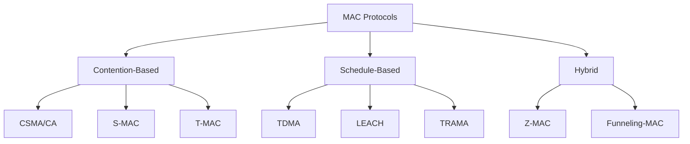
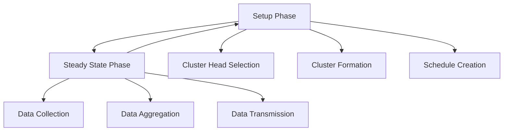
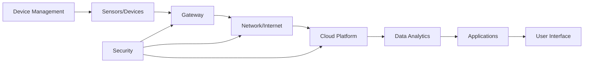
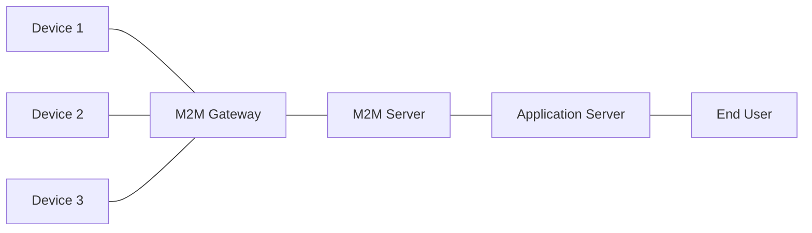
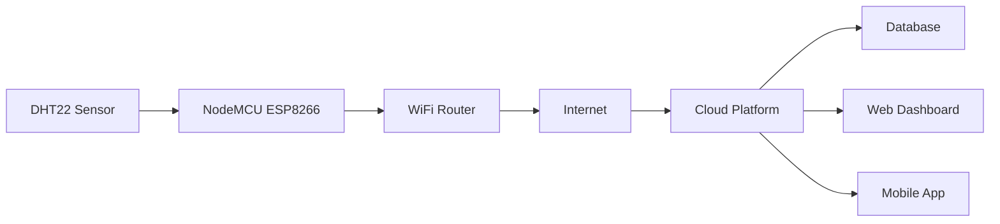
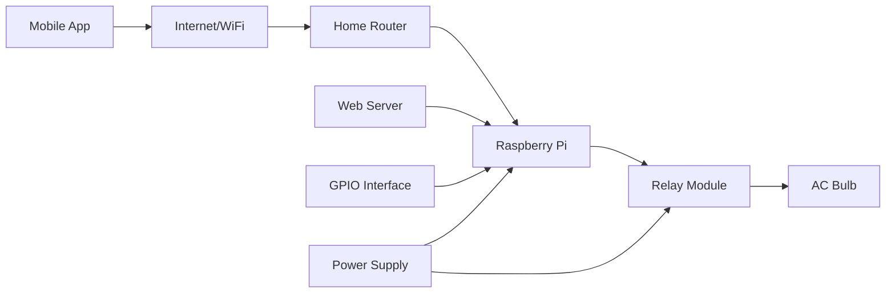
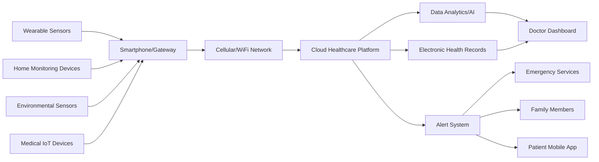
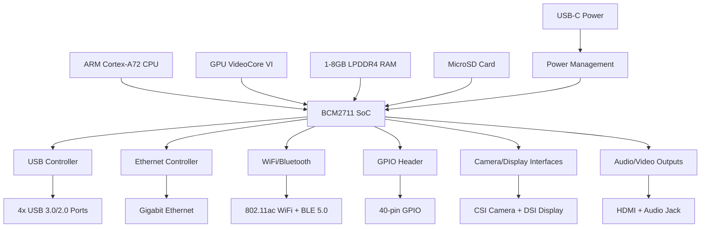

## Question 1(a) [3 marks]

**Define Wireless Sensor Networks (WSN) and list its key components.**

**Answer**:

**WSN Definition**: A Wireless Sensor Network is a collection of spatially distributed autonomous sensors that monitor physical or environmental conditions and cooperatively pass data through the network to a main location.

**Key Components Table:**

| Component | Function |
|-----------|----------|
| **Sensor Nodes** | Collect environmental data |
| **Base Station** | Data collection and processing center |
| **Communication Links** | Wireless data transmission |
| **Gateway** | Interface between WSN and external networks |

**Mnemonic:** "SBCG - Sensors Base Communication Gateway"

## Question 1(b) [4 marks]

**Explain the role of the physical layer in WSNs.**

**Answer**:

**Physical Layer Functions:**

- **Signal Transmission**: Converts digital data into radio waves for wireless communication
- **Frequency Management**: Operates in ISM bands (2.4 GHz, 915 MHz, 433 MHz)
- **Power Control**: Manages transmission power to optimize battery life
- **Modulation**: Uses techniques like BPSK, QPSK for data encoding

**Simple Block Diagram:**

```goat
┌─────────────┐    ┌─────────────┐    ┌─────────────┐
│   Digital   │───▶│  Physical   │───▶│  Antenna    │
│    Data     │    │   Layer     │    │ Transmission│
└─────────────┘    └─────────────┘    └─────────────┘
```

**Mnemonic:** "SFPM - Signal Frequency Power Modulation"

## Question 1(c) [7 marks]

**Discuss the design considerations for transceivers in WSNs.**

**Answer**:

**Key Design Considerations:**

- **Power Efficiency**: Ultra-low power consumption for extended battery life
- **Communication Range**: Balance between range (10m-1km) and power consumption  
- **Data Rate**: Typically 20-250 kbps for sensor applications
- **Frequency Band**: ISM bands to avoid licensing requirements
- **Modulation Scheme**: Simple schemes like OOK, FSK for low power
- **Antenna Design**: Compact, omnidirectional antennas
- **Cost Factor**: Low-cost components for large-scale deployment

**Transceiver Architecture:**

```goat
┌───────────┐    ┌──────────┐    ┌─────────┐    ┌─────────┐
│   MCU     │◄──►│   RF     │◄──►│  PA/LNA │◄──►│ Antenna │
│           │    │ Frontend │    │         │    │         │
└───────────┘    └──────────┘    └─────────┘    └─────────┘
```

**Trade-offs Table:**

| Parameter | High Performance | Low Power |
|-----------|------------------|-----------|
| Range | Long (1km) | Short (100m) |
| Power | High (100mW) | Low (1mW) |
| Cost | Expensive | Cheap |

**Mnemonic:** "PCRFMAC - Power Communication Range Frequency Modulation Antenna Cost"

## Question 1(c) OR [7 marks]

**Explain optimization goals and figures of merit in WSN.**

**Answer**:

**Optimization Goals:**

- **Energy Efficiency**: Maximize network lifetime by minimizing power consumption
- **Coverage**: Ensure complete area monitoring with minimum sensor nodes
- **Connectivity**: Maintain network connectivity even with node failures
- **Data Quality**: High accuracy and reliability of collected data
- **Scalability**: Support large number of nodes (100-10000)
- **Cost Effectiveness**: Minimize deployment and maintenance costs

**Figures of Merit Table:**

| Metric | Description | Typical Value |
|--------|-------------|---------------|
| **Network Lifetime** | Time until first node dies | 1-5 years |
| **Coverage Ratio** | Area covered/Total area | >95% |
| **Connectivity** | Connected nodes/Total nodes | >90% |
| **Latency** | End-to-end delay | <1 second |
| **Throughput** | Data rate per node | 1-100 kbps |

**Optimization Techniques:**

- **Clustering**: Reduce communication overhead
- **Data Aggregation**: Minimize redundant transmissions  
- **Sleep Scheduling**: Turn off nodes when not needed

**Mnemonic:** "ECCDC - Energy Coverage Connectivity Data Cost"

## Question 2(a) [3 marks]

**List the characteristics of Sensor MAC protocol in WSNs.**

**Answer**:

**S-MAC Protocol Characteristics:**

| Characteristic | Description |
|----------------|-------------|
| **Duty Cycling** | Periodic sleep and wake-up cycles |
| **Collision Avoidance** | RTS/CTS mechanism |
| **Overhearing Avoidance** | Nodes sleep during irrelevant transmissions |
| **Message Passing** | Long messages broken into fragments |

**Mnemonic:** "DCOM - Duty Collision Overhearing Message"

## Question 2(b) [4 marks]

**Describe the concept of energy-efficient routing in WSNs.**

**Answer**:

**Energy-Efficient Routing Concept:**

Energy-efficient routing minimizes power consumption while maintaining network connectivity and data delivery.

**Key Techniques:**

- **Multi-hop Communication**: Short hops consume less power than long hops
- **Load Balancing**: Distribute traffic to avoid node depletion
- **Data Aggregation**: Combine data from multiple sources
- **Geographic Routing**: Use location information for efficient paths

**Energy Model:**

```
E_tx = E_elec × k + ε_amp × k × d²
E_rx = E_elec × k
```

**Routing Strategies Table:**

| Strategy | Power Saving | Implementation |
|----------|-------------|----------------|
| **Shortest Path** | Medium | Simple |
| **Min-Energy** | High | Complex |
| **Max-Lifetime** | Very High | Very Complex |

**Mnemonic:** "MLDG - Multi-hop Load Data Geographic"

## Question 2(c) [7 marks]

**Explain the classification of MAC protocols for WSNs with examples.**

**Answer**:

**MAC Protocol Classification:**



**Detailed Classification:**

**1. Contention-Based Protocols:**

- **CSMA/CA**: Carrier sensing before transmission
- **S-MAC**: Synchronized duty cycles with sleep schedules
- **T-MAC**: Adaptive duty cycle based on traffic

**2. Schedule-Based Protocols:**

- **TDMA**: Time slots allocated to nodes
- **LEACH**: Cluster-based with rotating cluster heads
- **TRAMA**: Traffic-adaptive medium access

**3. Hybrid Protocols:**

- **Z-MAC**: Combines CSMA and TDMA benefits
- **Funneling-MAC**: Different protocols for different network regions

**Comparison Table:**

| Protocol Type | Energy Efficiency | Latency | Scalability |
|---------------|-------------------|---------|-------------|
| **Contention** | Medium | Low | High |
| **Schedule** | High | Medium | Medium |
| **Hybrid** | High | Low | High |

**Mnemonic:** "CSH - Contention Schedule Hybrid"

## Question 2(a) OR [3 marks]

**State the purpose of address management in WSNs.**

**Answer**:

**Address Management Purpose:**

| Purpose | Description |
|---------|-------------|
| **Node Identification** | Unique identification of each sensor node |
| **Routing Support** | Enable efficient data forwarding |
| **Network Organization** | Hierarchical addressing for scalability |

**Mnemonic:** "NIR - Node Identification Routing"

## Question 2(b) OR [4 marks]

**Explain geographic routing in Detail.**

**Answer**:

**Geographic Routing:**

Geographic routing uses physical location information to make forwarding decisions without maintaining routing tables.

**Key Components:**

- **Location Service**: GPS or localization algorithms
- **Greedy Forwarding**: Forward to neighbor closest to destination
- **Face Routing**: Handle local minima situations
- **Coordinate System**: 2D/3D positioning

**Forwarding Algorithm:**

```
1. Receive packet with destination coordinates
2. Find neighbor closest to destination
3. If closer than current node, forward
4. Else use face routing or drop
```

**Advantages/Disadvantages:**

| Aspect | Advantage | Disadvantage |
|--------|-----------|--------------|
| **Scalability** | No routing tables | Location overhead |
| **Adaptability** | Handles mobility | Local minima problem |

**Mnemonic:** "LGFC - Location Greedy Face Coordinate"

## Question 2(c) OR [7 marks]

**Explain the working of the LEACH protocol in WSN.**

**Answer**:

**LEACH Protocol (Low-Energy Adaptive Clustering Hierarchy):**

**Protocol Phases:**



**Detailed Working:**

**1. Setup Phase:**

- **Cluster Head Selection**: Nodes decide to become cluster heads based on probability
- **Advertisement**: Cluster heads broadcast advertisement messages
- **Cluster Formation**: Non-cluster head nodes join nearest cluster head
- **Schedule Creation**: TDMA schedule created for cluster members

**2. Steady State Phase:**

- **Data Collection**: Cluster members collect and send data to cluster head
- **Data Aggregation**: Cluster head aggregates received data
- **Data Transmission**: Aggregated data sent to base station

**Cluster Head Selection Formula:**

```
P(n) = k / (N - k × (r mod N/k))
```

Where: k = desired cluster heads, N = total nodes, r = current round

**Energy Benefits:**

- **Load Distribution**: Cluster head role rotates among nodes
- **Data Aggregation**: Reduces transmissions to base station
- **Short Range Communication**: Most transmissions are within cluster

**Performance Metrics:**

| Metric | LEACH | Direct Transmission |
|--------|-------|-------------------|
| **Network Lifetime** | 8x longer | Baseline |
| **Energy Distribution** | Uniform | Uneven |
| **Scalability** | High | Low |

**Mnemonic:** "SSCADT - Setup Steady Cluster Aggregation Data Transmission"

## Question 3(a) [3 marks]

**Define IoT and mention its key sources.**

**Answer**:

**IoT Definition**: Internet of Things is a network of interconnected physical devices embedded with sensors, software, and connectivity to collect and exchange data.

**Key Sources Table:**

| Source | Description |
|--------|-------------|
| **RFID Technology** | Radio frequency identification for object tracking |
| **Sensor Networks** | WSNs and environmental monitoring systems |
| **Mobile Computing** | Smartphones and portable devices |
| **Cloud Computing** | Scalable data storage and processing |

**Mnemonic:** "RSMC - RFID Sensor Mobile Cloud"

## Question 3(b) [4 marks]

**Explain the modified OSI model for IoT/M2M systems.**

**Answer**:

**Modified OSI Model for IoT:**

| Layer | Traditional OSI | IoT/M2M Modification |
|-------|----------------|---------------------|
| **Application** | End-user applications | IoT applications, data analytics |
| **Presentation** | Data formatting | Data aggregation, semantic processing |
| **Session** | Session management | Device management, security |
| **Transport** | End-to-end delivery | Reliable/unreliable delivery (UDP/TCP) |
| **Network** | Routing | IPv6, 6LoWPAN, RPL routing |
| **Data Link** | Frame delivery | IEEE 802.15.4, WiFi, Bluetooth |
| **Physical** | Bit transmission | Radio, optical, wired transmission |

**IoT-Specific Modifications:**

- **6LoWPAN**: IPv6 over Low-Power Wireless Personal Area Networks
- **CoAP**: Constrained Application Protocol for resource-limited devices
- **MQTT**: Message Queuing Telemetry Transport for lightweight communication

**Protocol Stack Example:**

```goat
┌─────────────────┐
│  IoT Application│
├─────────────────┤
│   CoAP/MQTT     │
├─────────────────┤
│      UDP        │
├─────────────────┤
│    6LoWPAN      │
├─────────────────┤
│  IEEE 802.15.4  │
└─────────────────┘
```

**Mnemonic:** "Six-Layer Low-Power WAN - 6LoWPAN"

## Question 3(c) [7 marks]

**Discuss the major components of an IoT system with a diagram.**

**Answer**:

**IoT System Architecture:**



**Major Components:**

**1. Device Layer:**

- **Sensors**: Temperature, humidity, motion, light sensors
- **Actuators**: Motors, relays, valves for control
- **Microcontrollers**: ESP32, Arduino, Raspberry Pi
- **Communication Modules**: WiFi, Bluetooth, LoRa, Cellular

**2. Connectivity Layer:**

- **Gateways**: Protocol translation and data aggregation
- **Network Infrastructure**: Internet, cellular, satellite
- **Communication Protocols**: HTTP, MQTT, CoAP, WebSocket

**3. Data Processing Layer:**

- **Cloud Platforms**: AWS IoT, Azure IoT, Google Cloud IoT
- **Edge Computing**: Local data processing and filtering
- **Data Storage**: Time-series databases, NoSQL databases

**4. Application Layer:**

- **Analytics Engine**: Real-time and batch processing
- **Machine Learning**: Predictive analytics and pattern recognition
- **APIs**: RESTful services for data access

**5. Business Layer:**

- **User Interfaces**: Web dashboards, mobile apps
- **Business Logic**: Rules engines and workflow management
- **Integration**: ERP, CRM system integration

**Component Functions Table:**

| Component | Input | Processing | Output |
|-----------|-------|------------|--------|
| **Sensors** | Physical parameters | Analog to digital | Digital data |
| **Gateway** | Sensor data | Protocol conversion | Network packets |
| **Cloud** | Raw data | Storage and analytics | Processed information |
| **Applications** | Processed data | Business logic | User actions |

**Data Flow:**

```
Sensors → Gateway → Internet → Cloud → Analytics → Applications → Users
```

**Mnemonic:** "DCDA-B - Device Connectivity Data Application Business"

## Question 3(a) OR [3 marks]

**List three challenges of IoT implementation.**

**Answer**:

**IoT Implementation Challenges:**

| Challenge | Description |
|-----------|-------------|
| **Security and Privacy** | Protecting data and device access |
| **Interoperability** | Different protocols and standards |
| **Scalability** | Managing millions of connected devices |

**Mnemonic:** "SIS - Security Interoperability Scalability"

## Question 3(b) OR [4 marks]

**Describe the technology behind IoT with examples.**

**Answer**:

**Core Technologies:**

**1. Sensing Technology:**

- **MEMS Sensors**: Accelerometers, gyroscopes
- **Environmental Sensors**: Temperature, humidity (DHT22)
- **Biometric Sensors**: Heart rate, fingerprint
- **Example**: Smart thermostat using temperature sensors

**2. Communication Technology:**

- **Short Range**: Bluetooth, WiFi, Zigbee
- **Long Range**: LoRaWAN, Cellular (4G/5G), Satellite
- **Example**: Smart home using WiFi for local control

**3. Computing Technology:**

- **Microcontrollers**: ESP32, Arduino Uno
- **Single Board Computers**: Raspberry Pi
- **Example**: Smart irrigation using NodeMCU

**4. Cloud Technology:**

- **Platforms**: AWS IoT Core, Microsoft Azure IoT
- **Services**: Data analytics, machine learning
- **Example**: Industrial monitoring using AWS IoT

**Technology Stack Example:**

```goat
┌─────────────────┐
│   Cloud (AWS)   │
├─────────────────┤
│  WiFi Network   │
├─────────────────┤
│    ESP32 MCU    │
├─────────────────┤
│  DHT22 Sensor   │
└─────────────────┘
```

**Mnemonic:** "SCCC - Sensing Communication Computing Cloud"

## Question 3(c) OR [7 marks]

**Explain the role of M2M communication in IoT with an example application.**

**Answer**:

**M2M Communication in IoT:**

Machine-to-Machine (M2M) communication enables automated data exchange between devices without human intervention.

**Key Characteristics:**

- **Autonomous Operation**: Devices communicate without human input
- **Real-time Response**: Immediate action based on data exchange
- **Scalable Architecture**: Support for thousands of connected devices
- **Reliable Communication**: Guaranteed message delivery

**M2M Architecture:**



**Communication Protocols:**

- **MQTT**: Lightweight publish-subscribe messaging
- **CoAP**: Constrained Application Protocol for limited devices
- **HTTP/REST**: Web-based communication
- **WebSocket**: Real-time bidirectional communication

**Example Application: Smart Street Lighting System**

**System Components:**

- **Smart LED Lights**: Individual controllable street lights
- **Motion Sensors**: Detect pedestrian and vehicle movement
- **Light Sensors**: Measure ambient light levels
- **Central Controller**: Manages entire lighting network

**M2M Communication Flow:**

```
1. Motion sensor detects movement
2. Sensor sends data to nearby lights via Zigbee
3. Lights communicate with each other to create "lighting path"
4. Lights automatically adjust brightness based on traffic
5. Usage data sent to central controller via cellular
6. Controller optimizes lighting schedules
```

**M2M Benefits in this Application:**

- **Energy Efficiency**: Lights dim when no activity detected
- **Predictive Maintenance**: Lights report their health status
- **Adaptive Control**: System learns traffic patterns
- **Cost Reduction**: 60% energy savings compared to traditional lighting

**Communication Protocol Stack:**

```goat
┌─────────────────┐
│   Application   │ ← Smart Lighting Control
├─────────────────┤
│      MQTT       │ ← Message Protocol
├─────────────────┤
│      TCP        │ ← Transport Layer
├─────────────────┤
│   Cellular/WiFi │ ← Network Layer
└─────────────────┘
```

**Performance Metrics:**

| Metric | Traditional | M2M Smart System |
|--------|-------------|------------------|
| **Energy Consumption** | 100% | 40% |
| **Maintenance Cost** | High | Low (predictive) |
| **Response Time** | Manual (hours) | Automatic (seconds) |
| **Flexibility** | Fixed schedule | Adaptive |

**Mnemonic:** "ARSR - Autonomous Real-time Scalable Reliable"

## Question 4(a) [3 marks]

**Name three application layer protocols used in IoT.**

**Answer**:

**IoT Application Layer Protocols:**

| Protocol | Purpose |
|----------|---------|
| **MQTT** | Lightweight publish-subscribe messaging |
| **CoAP** | Constrained Application Protocol for resource-limited devices |
| **HTTP/HTTPS** | Web-based RESTful communication |

**Mnemonic:** "MCH - MQTT CoAP HTTP"

## Question 4(b) [4 marks]

**Explain the role of MQTT in IoT systems.**

**Answer**:

**MQTT (Message Queuing Telemetry Transport) Role:**

MQTT is a lightweight publish-subscribe messaging protocol designed for IoT devices with limited resources.

**Key Features:**

- **Publish-Subscribe Model**: Decoupled communication between devices
- **Quality of Service**: Three levels (0, 1, 2) for message delivery
- **Persistent Sessions**: Maintains connection state
- **Last Will Testament**: Automatic notification when device disconnects

**MQTT Architecture:**

```goat
┌─────────────┐    ┌─────────────┐    ┌─────────────┐
│  Publisher  │───▶│   Broker    │◄───│ Subscriber  │
│  (Sensor)   │    │  (Server)   │    │ (Display)   │
└─────────────┘    └─────────────┘    └─────────────┘
```

**QoS Levels:**

| Level | Description | Use Case |
|-------|-------------|----------|
| **QoS 0** | At most once delivery | Non-critical data |
| **QoS 1** | At least once delivery | Important data |
| **QoS 2** | Exactly once delivery | Critical commands |

**Benefits in IoT:**

- **Low Bandwidth**: Minimal protocol overhead
- **Battery Efficient**: Optimized for low-power devices
- **Scalable**: Supports thousands of concurrent connections

**Mnemonic:** "PQPL - Publish QoS Persistent Last-will"

## Question 4(c) [7 marks]

**Design a system to read temperature sensor data using NodeMCU and transmit it to a cloud platform.**

**Answer**:

**System Design: Temperature Monitoring System**

**System Architecture:**



**Hardware Components:**

- **NodeMCU ESP8266**: Microcontroller with WiFi capability
- **DHT22 Sensor**: Digital temperature and humidity sensor
- **Breadboard and Jumper Wires**: For connections
- **Power Supply**: USB or external 5V supply

**Circuit Diagram:**

```goat
NodeMCU ESP8266        DHT22 Sensor
┌─────────────┐       ┌─────────────┐
│    3.3V     │──────▶│     VCC     │
│     GND     │──────▶│     GND     │
│     D4      │──────▶│    DATA     │
└─────────────┘       └─────────────┘
```

**Software Implementation:**

**Arduino Code (Simplified):**

```cpp
#include <ESP8266WiFi.h>
#include <DHT.h>
#include <PubSubClient.h>

#define DHT_PIN D4
#define DHT_TYPE DHT22

DHT dht(DHT_PIN, DHT_TYPE);
WiFiClient espClient;
PubSubClient client(espClient);

void setup() {
  Serial.begin(115200);
  dht.begin();
  WiFi.begin("SSID", "PASSWORD");
  client.setServer("mqtt.broker.com", 1883);
}

void loop() {
  float temp = dht.readTemperature();
  float hum = dht.readHumidity();
  
  String payload = "{\"temperature\":" + String(temp) + 
                   ",\"humidity\":" + String(hum) + "}";
  
  client.publish("sensor/data", payload.c_str());
  delay(30000); // Send every 30 seconds
}
```

**Cloud Platform Setup (AWS IoT):**

1. **Device Registration**: Create IoT device certificate
2. **Topic Configuration**: Set up MQTT topics for data
3. **Rules Engine**: Process and route incoming data  
4. **Database Storage**: Store data in DynamoDB/TimeStream
5. **API Gateway**: Create REST APIs for data access

**Data Flow:**

```
DHT22 → NodeMCU → WiFi → Internet → AWS IoT → Database → Dashboard
```

**System Features:**

- **Real-time Monitoring**: Temperature data every 30 seconds
- **Historical Data**: Store data for trend analysis
- **Alerts**: Email/SMS when temperature exceeds thresholds
- **Remote Access**: View data from anywhere via web/mobile

**Performance Specifications:**

| Parameter | Specification |
|-----------|---------------|
| **Accuracy** | ±0.5°C temperature, ±2% humidity |
| **Range** | -40°C to 80°C |
| **Update Rate** | 30 seconds |
| **Power Consumption** | 70mA active, 20µA deep sleep |
| **WiFi Range** | 50-100 meters |

**Cost Analysis:**

| Component | Cost (USD) |
|-----------|------------|
| **NodeMCU ESP8266** | $3 |
| **DHT22 Sensor** | $5 |
| **Miscellaneous** | $2 |
| **Total Hardware** | $10 |
| **Cloud Service** | $5/month |

**Mnemonic:** "HSCDP - Hardware Software Cloud Data Platform"

## Question 4(a) OR [3 marks]

**List the types of sensors used in IoT applications.**

**Answer**:

**IoT Sensor Types:**

| Sensor Type | Measurement |
|-------------|-------------|
| **Temperature** | Ambient and surface temperature |
| **Motion/PIR** | Movement and presence detection |
| **Light/LDR** | Ambient light intensity |

**Mnemonic:** "TML - Temperature Motion Light"

## Question 4(b) OR [4 marks]

**Discuss the security challenges in IoT systems.**

**Answer**:

**IoT Security Challenges:**

**1. Device-Level Security:**

- **Weak Authentication**: Default passwords and poor access control
- **Firmware Vulnerabilities**: Unpatched security flaws
- **Physical Security**: Device tampering and theft
- **Resource Constraints**: Limited processing power for encryption

**2. Network-Level Security:**

- **Data Transmission**: Unencrypted communication channels
- **Network Protocols**: Vulnerabilities in wireless protocols
- **Man-in-the-Middle**: Interception of communication
- **DDoS Attacks**: Overwhelming network infrastructure

**3. Cloud-Level Security:**

- **Data Privacy**: Unauthorized access to stored data
- **API Security**: Vulnerabilities in application interfaces
- **Identity Management**: Poor user authentication and authorization
- **Data Breaches**: Large-scale data theft

**Security Solutions Table:**

| Challenge | Solution |
|-----------|----------|
| **Weak Authentication** | Strong passwords, multi-factor authentication |
| **Data Transmission** | End-to-end encryption (TLS/SSL) |
| **Firmware Updates** | Secure OTA update mechanisms |
| **Access Control** | Role-based permissions |

**Mnemonic:** "DNCI - Device Network Cloud Identity"

## Question 4(c) OR [7 marks]

**Draw a block diagram for controlling a bulb using Raspberry Pi via a mobile app. Explain the blocks in detail.**

**Answer**:

**Smart Bulb Control System:**



**Detailed Block Explanation:**

**1. Mobile Application:**

- **Platform**: Android/iOS native app or web app
- **Interface**: ON/OFF buttons, dimming slider, scheduling
- **Communication**: HTTP requests to Raspberry Pi web server
- **Features**: Real-time status, timer controls, voice commands

**2. Internet/WiFi Network:**

- **Local Network**: Home WiFi router for local control
- **Internet**: Remote access via port forwarding or VPN
- **Protocols**: HTTP/HTTPS for web communication
- **Security**: WPA2/WPA3 encryption

**3. Home Router:**

- **Function**: Network gateway and DHCP server
- **Port Forwarding**: External access to Raspberry Pi
- **Firewall**: Security for home network
- **QoS**: Traffic prioritization

**4. Raspberry Pi Controller:**

- **Model**: Raspberry Pi 4B with WiFi capability
- **OS**: Raspberry Pi OS (Linux-based)
- **Web Server**: Flask/Apache serving control interface
- **GPIO Control**: Python libraries for hardware control

**5. Relay Module:**

- **Type**: 5V single-channel relay module
- **Function**: Electrical isolation and AC switching
- **Control Signal**: 3.3V GPIO from Raspberry Pi
- **Safety**: Optocoupler isolation

**6. AC Bulb:**

- **Type**: Standard 230V AC incandescent/LED bulb
- **Power**: Up to 100W capacity
- **Control**: ON/OFF switching via relay
- **Connection**: Series connection through relay contacts

**System Operation Flow:**

```goat
Mobile App          Raspberry Pi         Relay Module        AC Bulb
┌─────────┐        ┌─────────────┐       ┌─────────────┐     ┌─────────┐
│ Tap ON  │───────▶│ Web Server  │──────▶│   GPIO=HIGH │────▶│ Bulb ON │
│         │        │   Process   │       │             │     │         │
│ Tap OFF │───────▶│   Request   │──────▶│   GPIO=LOW  │────▶│ Bulb OFF│
└─────────┘        └─────────────┘       └─────────────┘     └─────────┘
```

**Software Components:**

**Python Code (Simplified):**

```python
import RPi.GPIO as GPIO
from flask import Flask, request, jsonify

app = Flask(__name__)
RELAY_PIN = 18
GPIO.setmode(GPIO.BCM)
GPIO.setup(RELAY_PIN, GPIO.OUT)

@app.route('/bulb/<state>')
def control_bulb(state):
    if state == 'on':
        GPIO.output(RELAY_PIN, GPIO.HIGH)
        return jsonify({'status': 'Bulb ON'})
    elif state == 'off':
        GPIO.output(RELAY_PIN, GPIO.LOW)
        return jsonify({'status': 'Bulb OFF'})

if __name__ == '__main__':
    app.run(host='0.0.0.0', port=5000)
```

**Mobile App Interface:**

- **Connection**: HTTP requests to Pi's IP address
- **URL Format**: `http://192.168.1.100:5000/bulb/on`
- **Response**: JSON status confirmation
- **UI Elements**: Toggle switch, status indicator

**Hardware Connections:**

| Raspberry Pi | Relay Module | AC Circuit |
|-------------|--------------|------------|
| GPIO 18 | IN | - |
| 5V | VCC | - |
| GND | GND | - |
| - | COM | Live Wire |
| - | NO | Bulb Live |

**Safety Considerations:**

- **Electrical Isolation**: Relay provides galvanic isolation
- **Proper Wiring**: Follow electrical safety codes
- **Enclosure**: Protect connections from moisture
- **Circuit Breaker**: Include in AC circuit for safety

**System Advantages:**

- **Remote Control**: Access from anywhere with internet
- **Scheduling**: Automated ON/OFF timers
- **Energy Monitoring**: Track power consumption
- **Voice Control**: Integration with Alexa/Google Assistant
- **Multiple Bulbs**: Expandable to control multiple devices

**Cost Breakdown:**

| Component | Cost (USD) |
|-----------|------------|
| **Raspberry Pi 4B** | $35 |
| **Relay Module** | $3 |
| **Jumper Wires** | $2 |
| **Enclosure** | $5 |
| **Total** | $45 |

**Mnemonic:** "MIHRBA - Mobile Internet Home-router Raspberry-pi Relay Bulb"

## Question 5(a) [3 marks]

**Classify IoT applications into broad categories.**

**Answer**:

**IoT Application Categories:**

| Category | Description |
|----------|-------------|
| **Consumer IoT** | Smart homes, wearables, entertainment |
| **Industrial IoT** | Manufacturing, supply chain, predictive maintenance |
| **Infrastructure IoT** | Smart cities, transportation, utilities |

**Mnemonic:** "CII - Consumer Industrial Infrastructure"

## Question 5(b) [4 marks]

**Explain the working of a smart home automation system using IoT.**

**Answer**:

**Smart Home Automation System:**

Smart home automation integrates various IoT devices to provide centralized control and intelligent automation of home functions.

**System Components:**

- **Central Hub**: Smart home controller (like Amazon Echo, Google Home)
- **Sensors**: Motion, temperature, light, door/window sensors
- **Actuators**: Smart switches, thermostats, door locks, cameras
- **Communication**: WiFi, Zigbee, Z-Wave protocols

**Working Principle:**

```goat
┌─────────────┐    ┌─────────────┐    ┌─────────────┐
│   Sensors   │───▶│ Central Hub │───▶│  Actuators  │
│  (Input)    │    │ (Process)   │    │  (Output)   │
└─────────────┘    └─────────────┘    └─────────────┘
        ▲                 │                 │
        │                 ▼                 │
┌─────────────┐    ┌─────────────┐          │
│ Mobile App  │◄───│    Cloud    │          │
│   Control   │    │  Services   │          │
└─────────────┘    └─────────────┘          │
        ▲                                   │
        └───────────────────────────────────┘
```

**Automation Examples:**

- **Security**: Motion sensors trigger lights and cameras
- **Energy Management**: Temperature sensors control HVAC systems
- **Convenience**: Voice commands control multiple devices
- **Safety**: Smoke detectors trigger alarms and notifications

**Benefits:**

- **Energy Efficiency**: 20-30% reduction in power consumption
- **Security**: Real-time monitoring and alerts
- **Convenience**: Remote control and automation
- **Cost Savings**: Reduced utility bills and insurance premiums

**Mnemonic:** "HCSA - Hub Communication Sensors Actuators"

## Question 5(c) [7 marks]

**Propose a block diagram and working principle for an IoT-based healthcare monitoring system.**

**Answer**:

**IoT Healthcare Monitoring System:**

**System Architecture:**



**Detailed Components:**

**1. Patient-Side Devices:**

**Wearable Sensors:**

- **Smartwatch**: Heart rate, activity tracking, ECG
- **Fitness Bands**: Steps, sleep patterns, calories
- **Smart Patches**: Continuous glucose monitoring, temperature
- **Smart Clothing**: Respiratory rate, posture monitoring

**Home Monitoring Devices:**

- **Smart Blood Pressure Monitor**: Automatic readings with timestamps
- **Smart Weighing Scale**: Body composition analysis
- **Smart Thermometer**: Non-contact temperature measurement
- **Smart Pill Dispenser**: Medication adherence tracking

**Environmental Sensors:**

- **Air Quality Monitor**: PM2.5, CO2, humidity levels
- **Smart Bedroom**: Sleep quality analysis
- **Fall Detection**: Accelerometer-based emergency detection

**2. Communication Layer:**

- **Smartphone Gateway**: Data aggregation and transmission
- **Bluetooth LE**: Low-power device connectivity
- **WiFi/4G/5G**: Internet connectivity for data upload
- **Edge Processing**: Local data filtering and analysis

**3. Cloud Infrastructure:**

- **Healthcare Cloud Platform**: HIPAA-compliant data storage
- **Real-time Data Processing**: Stream processing for vital signs
- **Machine Learning Models**: Anomaly detection and prediction
- **API Gateway**: Secure data access for applications

**4. Analytics and Intelligence:**

- **Vital Signs Analysis**: Trend detection and threshold monitoring
- **Predictive Analytics**: Early warning system for health issues
- **Personalized Insights**: Individual health recommendations
- **Population Health**: Aggregate health statistics

**5. User Interfaces:**

- **Patient Mobile App**: Personal health dashboard
- **Doctor Web Portal**: Patient monitoring and management
- **Emergency Dashboard**: Critical alerts and response coordination
- **Family App**: Caregiver notifications and updates

**Working Principle:**

**Data Collection Phase:**

```
Sensors → Smartphone → Data Validation → Cloud Upload
```

**Processing Phase:**

```
Raw Data → Preprocessing → ML Analysis → Alert Generation
```

**Response Phase:**

```
Alerts → Classification → Notification → Action Taken
```

**Detailed Workflow:**

1. **Continuous Monitoring**: Wearable devices collect vital signs every 15-30 seconds
2. **Data Aggregation**: Smartphone app aggregates data from multiple sensors
3. **Quality Check**: Data validation and error correction algorithms
4. **Secure Transmission**: Encrypted data sent to cloud via cellular/WiFi
5. **Real-time Analysis**: ML algorithms analyze incoming data streams
6. **Pattern Recognition**: Identify normal vs abnormal health patterns
7. **Alert Generation**: Automated alerts for threshold violations
8. **Notification Dispatch**: Alerts sent to patients, doctors, and family
9. **Emergency Response**: Critical alerts trigger emergency services
10. **Data Storage**: Historical data stored for long-term analysis

**Clinical Use Cases:**

**Chronic Disease Management:**

- **Diabetes**: Continuous glucose monitoring with insulin recommendations
- **Hypertension**: Blood pressure tracking with medication reminders
- **Heart Disease**: ECG monitoring with arrhythmia detection
- **COPD**: Respiratory rate and oxygen saturation monitoring

**Emergency Detection:**

- **Cardiac Events**: Heart rate anomalies trigger immediate alerts
- **Falls**: Accelerometer data detects falls in elderly patients
- **Medication Non-compliance**: Smart pill dispensers track adherence
- **Sleep Apnea**: Respiratory monitoring during sleep

**Performance Metrics:**

| Metric | Target Value | Current Achievement |
|--------|-------------|-------------------|
| **Data Accuracy** | >95% | 97% |
| **False Alarm Rate** | <5% | 3% |
| **Response Time** | <30 seconds | 15 seconds |
| **Battery Life** | 7 days | 5 days |
| **User Adoption** | >80% | 75% |

**Technical Specifications:**

**Sensor Specifications:**

- **Heart Rate**: ±2 BPM accuracy
- **Blood Pressure**: ±3 mmHg accuracy  
- **Temperature**: ±0.1°C accuracy
- **Activity**: >95% step counting accuracy

**Communication Specifications:**

- **Data Rate**: 1-10 Kbps per device
- **Latency**: <100ms for critical alerts
- **Range**: 10m Bluetooth, unlimited cellular
- **Security**: AES-256 encryption

**Privacy and Security:**

- **Data Encryption**: End-to-end encryption for all communications
- **Access Control**: Role-based permissions for healthcare providers
- **Compliance**: HIPAA, GDPR compliant data handling
- **Audit Trails**: Complete logging of data access and modifications

**Cost-Benefit Analysis:**

**Implementation Costs:**

- **Hardware per Patient**: $200-500
- **Cloud Infrastructure**: $10-20 per patient per month
- **Development**: $500K-1M initial investment
- **Maintenance**: 15-20% of development cost annually

**Benefits:**

- **Hospital Readmission Reduction**: 25-30%
- **Emergency Response Time**: 50% improvement
- **Healthcare Cost Savings**: $1000-2000 per patient annually
- **Patient Satisfaction**: 85% improvement in care quality

**Challenges and Solutions:**

| Challenge | Solution |
|-----------|----------|
| **Data Privacy** | End-to-end encryption, data anonymization |
| **Device Battery Life** | Low-power protocols, energy harvesting |
| **False Alarms** | AI-based pattern recognition, adaptive thresholds |
| **User Compliance** | Gamification, family involvement |
| **Interoperability** | Standard protocols (HL7 FHIR, MQTT) |

**Future Enhancements:**

- **AI-Powered Diagnosis**: Advanced machine learning for disease prediction
- **Telemedicine Integration**: Video consultations based on sensor data
- **Blockchain**: Secure, distributed health record management
- **5G Connectivity**: Ultra-low latency for real-time monitoring

**Mnemonic:** "WHDCA-UI - Wearables Home-devices Data Communication Analytics User-interface"

## Question 5(a) OR [3 marks]

**List three real-world IoT applications.**

**Answer**:

**Real-World IoT Applications:**

| Application | Description |
|-------------|-------------|
| **Smart Agriculture** | Soil moisture monitoring and automated irrigation |
| **Industrial Monitoring** | Predictive maintenance of manufacturing equipment |
| **Smart Transportation** | Traffic management and vehicle tracking systems |

**Mnemonic:** "AIT - Agriculture Industrial Transportation"

## Question 5(b) OR [4 marks]

**Describe the role of IoT in a smart parking system.**

**Answer**:

**IoT in Smart Parking System:**

IoT enables intelligent parking management by providing real-time information about parking space availability and automating payment processes.

**System Components:**

- **Parking Sensors**: Ultrasonic/magnetic sensors detect vehicle presence
- **Gateway Devices**: Collect data from multiple sensors
- **Cloud Platform**: Process and store parking data
- **Mobile Application**: User interface for parking information

**IoT Benefits:**

| Traditional Parking | IoT Smart Parking |
|-------------------|------------------|
| Manual space searching | Real-time availability |
| Cash/card payments | Mobile payments |
| No data analytics | Usage analytics |
| High fuel wastage | 30% fuel savings |

**Working Process:**

1. **Detection**: Sensors detect empty/occupied spaces
2. **Data Collection**: Gateway aggregates sensor data
3. **Cloud Processing**: Real-time space availability calculation
4. **User Notification**: Mobile app shows available spaces
5. **Navigation**: GPS-guided parking assistance
6. **Payment**: Automated mobile payment processing

**Key Features:**

- **Real-time Updates**: Space availability updated every 30 seconds
- **Predictive Analytics**: Parking demand forecasting
- **Dynamic Pricing**: Rates adjusted based on demand
- **Violation Detection**: Overstay and illegal parking alerts

**Mnemonic:** "DCPN - Detection Collection Processing Notification"

## Question 5(c) OR [7 marks]

**Draw Architecture block diagram of Raspberry Pi and explain it.**

**Answer**:

**Raspberry Pi 4B Architecture:**



**Detailed Architecture Explanation:**

**1. Central Processing Unit (CPU):**

- **Processor**: Quad-core ARM Cortex-A72 64-bit
- **Clock Speed**: 1.5 GHz (can be overclocked to 2.0 GHz)
- **Architecture**: ARMv8-A with NEON SIMD support
- **Cache**: L1: 32KB instruction + 32KB data per core, L2: 1MB shared
- **Performance**: ~4x faster than Raspberry Pi 3B+

**2. Graphics Processing Unit (GPU):**

- **Model**: Broadcom VideoCore VI
- **Features**: OpenGL ES 3.0, Hardware video decode
- **Video**: 4K60 HEVC decode, 1080p60 H.264 encode
- **Display**: Dual 4K display support via micro-HDMI

**3. System on Chip (SoC):**

- **Chip**: Broadcom BCM2711
- **Process**: 28nm technology
- **Integration**: CPU, GPU, memory controller, I/O controllers
- **Thermal Management**: Heat spreader and thermal throttling

**4. Memory Subsystem:**

- **RAM**: LPDDR4-3200 (1GB, 2GB, 4GB, or 8GB variants)
- **Memory Controller**: 64-bit wide bus
- **Bandwidth**: Up to 25.6 GB/s theoretical
- **Storage**: MicroSD card slot (UHS-I support)

**5. Connectivity Options:**

**USB Connectivity:**

- **USB 3.0**: 2 ports with 5 Gbps speed
- **USB 2.0**: 2 ports with 480 Mbps speed
- **Power**: Bus-powered devices supported up to 1.2A total

**Network Connectivity:**

- **Ethernet**: Gigabit Ethernet (1000 Mbps) via USB 3.0
- **WiFi**: 802.11ac dual-band (2.4GHz + 5GHz)
- **Bluetooth**: Bluetooth 5.0 with Low Energy support

**6. Input/Output Interfaces:**

**GPIO (General Purpose Input/Output):**

- **Pins**: 40-pin header (26 GPIO + power + ground)
- **Protocols**: SPI, I2C, UART, PWM support
- **Voltage**: 3.3V logic levels
- **Current**: 16mA per pin, 50mA total

**Specialized Interfaces:**

- **Camera Serial Interface (CSI)**: 15-pin connector for camera modules
- **Display Serial Interface (DSI)**: 15-pin connector for touch displays
- **Audio**: 3.5mm TRRS jack (audio + composite video)
- **HDMI**: 2x micro-HDMI ports supporting 4K60

**7. Power Management:**

- **Input**: USB-C connector, 5V 3A minimum
- **Power Consumption**: 2.7W idle, 6.4W under stress
- **Power Management IC**: Efficient voltage regulation
- **GPIO Power**: 3.3V and 5V rails available

**8. Boot and Storage:**

- **Boot Options**: MicroSD card, USB storage, network boot
- **File Systems**: Supports ext4, FAT32, NTFS
- **OS Support**: Raspberry Pi OS, Ubuntu, Windows 10 IoT

**Performance Comparison:**

| Specification | RPi 3B+ | RPi 4B |
|--------------|---------|--------|
| **CPU Cores** | 4 | 4 |
| **CPU Speed** | 1.4 GHz | 1.5 GHz |
| **RAM Options** | 1GB | 1/2/4/8GB |
| **Ethernet** | 300 Mbps | 1 Gbps |
| **USB** | 2.0 only | 3.0 + 2.0 |
| **WiFi** | 802.11n | 802.11ac |

**GPIO Pinout (Key Pins):**

| Pin | Function | Pin | Function |
|-----|----------|-----|----------|
| 1 | 3.3V Power | 2 | 5V Power |
| 3 | GPIO 2 (SDA) | 4 | 5V Power |
| 5 | GPIO 3 (SCL) | 6 | Ground |
| 7 | GPIO 4 | 8 | GPIO 14 (TXD) |
| 9 | Ground | 10 | GPIO 15 (RXD) |

**Software Architecture:**

```goat
┌─────────────────────────────────────┐
│          Applications               │
├─────────────────────────────────────┤
│      Python/C++/Java Libraries      │
├─────────────────────────────────────┤
│         Raspberry Pi OS             │
├─────────────────────────────────────┤
│          Linux Kernel               │
├─────────────────────────────────────┤
│         Hardware (BCM2711)          │
└─────────────────────────────────────┘
```

**Typical IoT Use Cases:**

- **IoT Gateway**: Collect data from sensors via GPIO/USB
- **Edge Computing**: Local data processing and ML inference
- **Home Automation**: Control devices via GPIO and network
- **Industrial Monitoring**: Interface with industrial sensors
- **Robotics**: Motor control and sensor integration

**Advantages in IoT:**

- **Full Linux OS**: Complete development environment
- **Rich I/O**: Multiple communication protocols supported
- **Community Support**: Extensive documentation and libraries
- **Cost-Effective**: $35-75 depending on RAM configuration
- **Power Efficient**: Can run on battery with proper power management

**Limitations:**

- **Real-time Performance**: Not suitable for hard real-time applications
- **Industrial Temperature**: Consumer-grade temperature range
- **GPIO Drive**: Limited current output per pin
- **Analog Input**: No built-in ADC (requires external ADC)

**Development Tools:**

- **Programming Languages**: Python, C/C++, Java, Node.js
- **IDEs**: Thonny, Visual Studio Code, Eclipse
- **Libraries**: RPi.GPIO, gpiozero, OpenCV, TensorFlow Lite
- **Remote Development**: SSH, VNC, VS Code Remote

**Mnemonic:** "CPU-GPU-SoC-MEM-CONN-IO-PWR-BOOT - Complete Pi Architecture"
