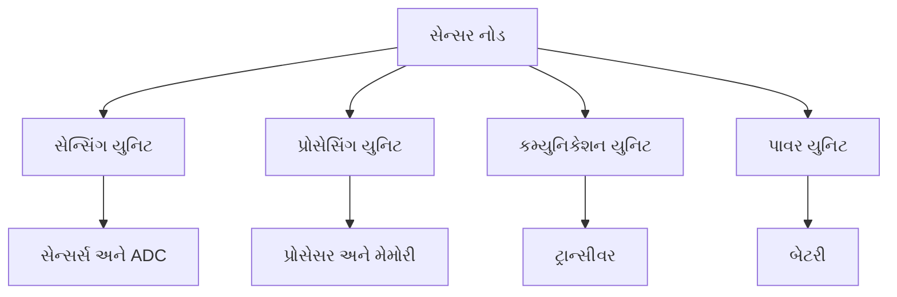
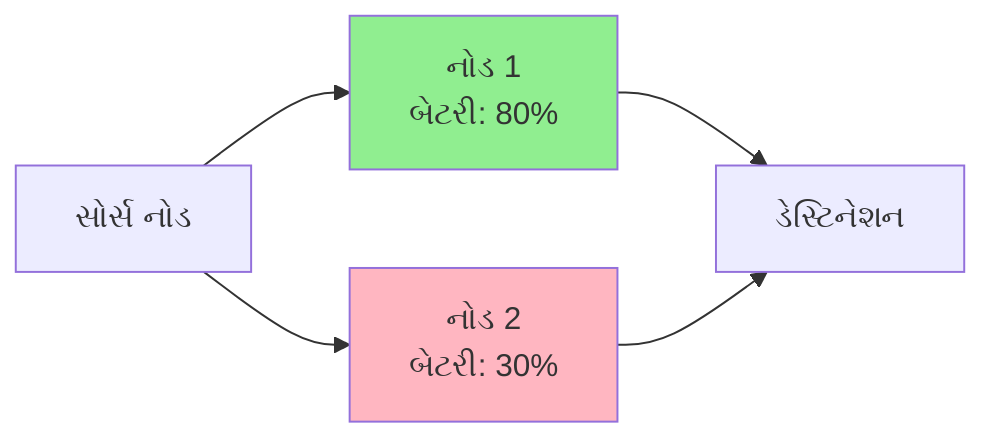
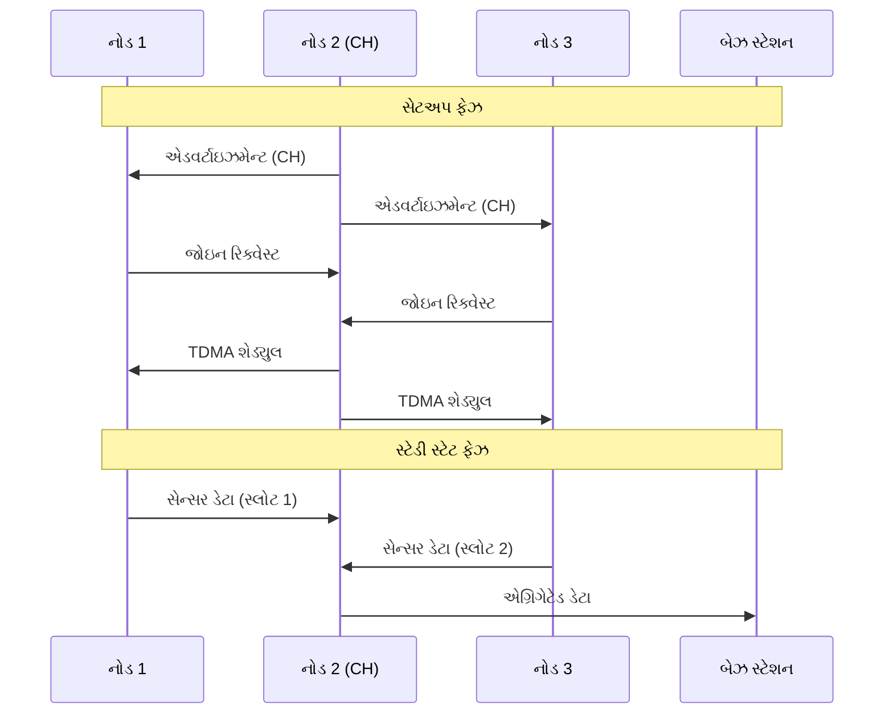
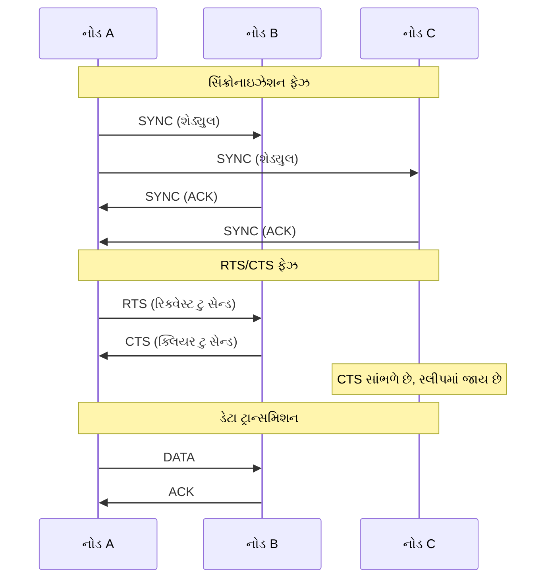
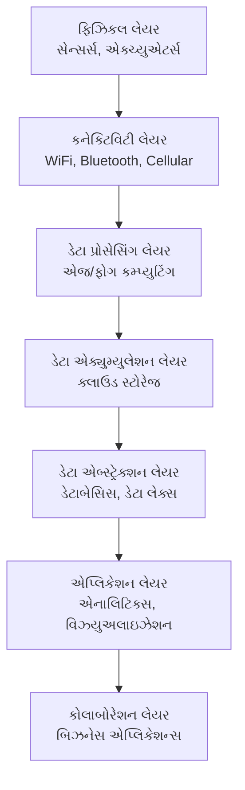
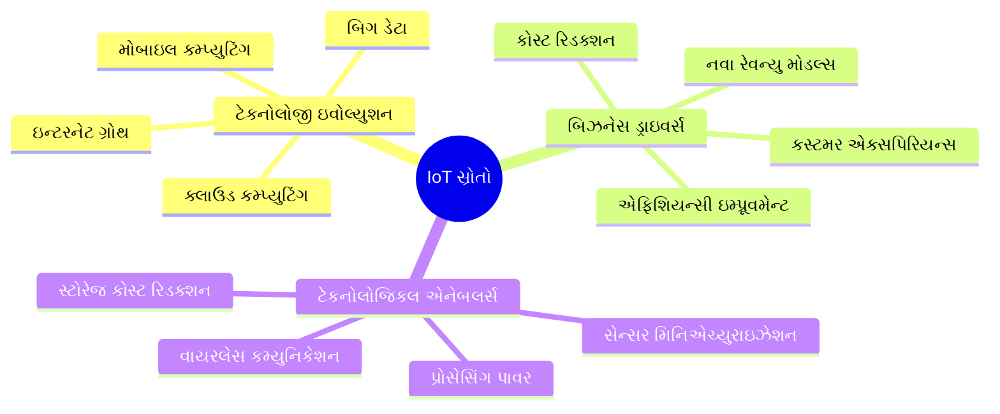
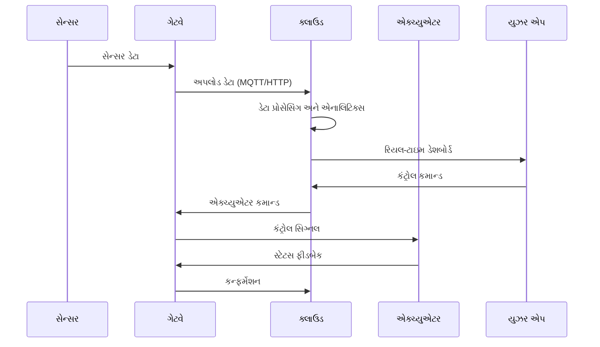
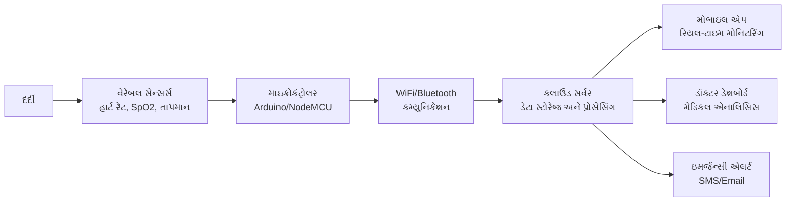
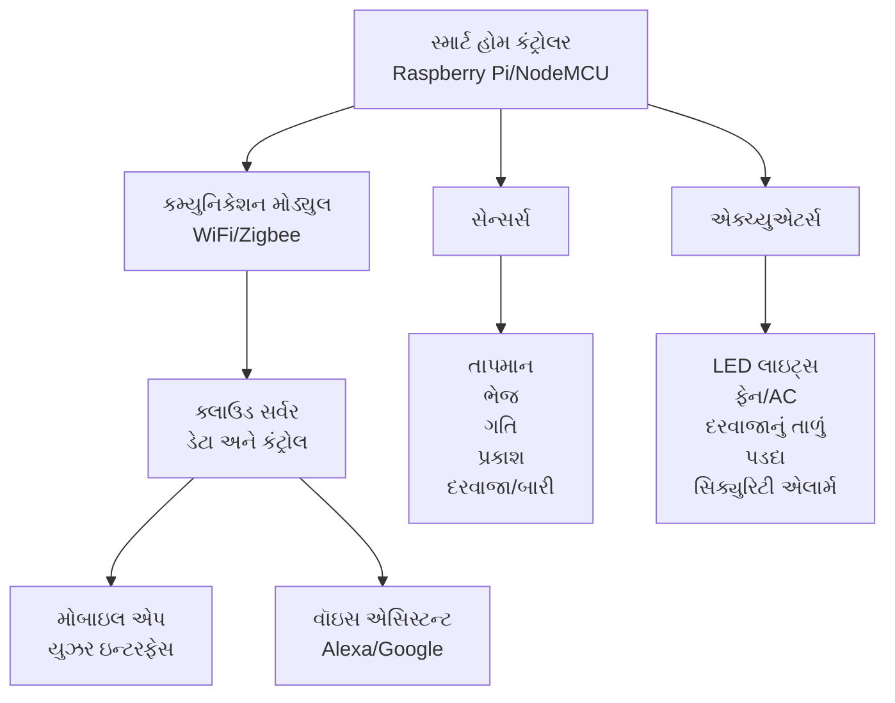
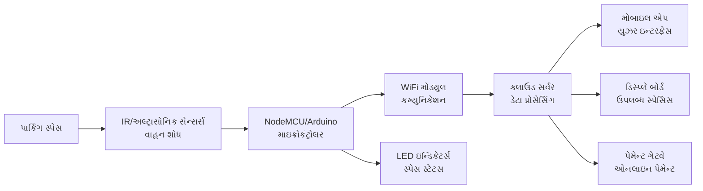

## પ્રશ્ન 1(અ) [3 ગુણ]

**સિંગલ હોપ અને મલ્ટિહોપ નેટવર્કની સરખામણી કરો.**

**જવાબ**:

| પેરામીટર | સિંગલ હોપ નેટવર્ક | મલ્ટિહોપ નેટવર્ક |
|-----------|-------------------|------------------|
| **કમ્યુનિકેશન** | સીધું બેઝ સ્ટેશન સાથે | મધ્યવર્તી નોડ્સ દ્વારા |
| **એનર્જી વપરાશ** | દૂરના નોડ્સ માટે વધુ | નોડ્સ વચ્ચે વિતરિત |
| **નેટવર્ક કવરેજ** | ટ્રાન્સમિશન રેન્જ દ્વારા મર્યાદિત | વિસ્તૃત કવરેજ વિસ્તાર |
| **જટિલતા** | સરળ રાઉટિંગ | જટિલ રાઉટિંગ પ્રોટોકોલ |

- **સિંગલ હોપ**: બધા નોડ્સ બેઝ સ્ટેશન સાથે સીધો સંપર્ક કરે છે
- **મલ્ટિહોપ**: ડેટા ગંતવ્ય સુધી પહોંચવા માટે અનેક મધ્યવર્તી નોડ્સમાંથી પસાર થાય છે

**મેમરી ટ્રીક:** "સિંગલ ડાયરેક્ટ, મલ્ટિ રિલે"

## પ્રશ્ન 1(બ) [4 ગુણ]

**સેન્સર નોડના મૂળભૂત ઘટકો સમજાવો.**

**જવાબ**:



**મૂળભૂત ઘટકો:**

- **સેન્સિંગ સબસિસ્ટમ**: સેન્સર્સ અને ADC નો ઉપયોગ કરીને પર્યાવરણમાંથી ડેટા એકત્રિત કરે છે
- **પ્રોસેસિંગ સબસિસ્ટમ**: ડેટા પ્રોસેસિંગ માટે મેમોરી સાથે માઇક્રોકંટ્રોલર/પ્રોસેસર
- **કમ્યુનિકેશન સબસિસ્ટમ**: વાયરલેસ ડેટા ટ્રાન્સમિશન માટે રેડિયો ટ્રાન્સીવર
- **પાવર સબસિસ્ટમ**: પાવર સપ્લાય માટે બેટરી અથવા એનર્જી હાર્વેસ્ટિંગ યુનિટ

**મેમરી ટ્રીક:** "સેન્સ પ્રોસેસ કમ્યુનિકેટ પાવર"

## પ્રશ્ન 1(ક) [7 ગુણ]

**WSN માં પાવર કન્ઝમ્પશન ઘટાડવા માટે કોઈપણ ચાર ટેકનોલોજીની યાદી બનાવો અને કોઈપણ બે ટેકનોલોજીને વિગતવાર સમજાવો.**

**જવાબ**:

**ચાર પાવર રિડક્શન ટેકનોલોજીઓ:**

| ટેકનોલોજી | વર્ણન |
|------------|-------------|
| **સ્લીપ શેડ્યુલિંગ** | નોડ્સ સક્રિય અને સ્લીપ મોડ વચ્ચે ફેરફાર કરે છે |
| **ડેટા એગ્રિગેશન** | અનેક ડેટા પેકેટ્સને એક જ ટ્રાન્સમિશનમાં જોડે છે |
| **ટોપોલોજી કંટ્રોલ** | એનર્જી ઘટાડવા માટે નેટવર્ક સ્ટ્રક્ચર ઓપ્ટિમાઇઝ કરે છે |
| **એનર્જી હાર્વેસ્ટિંગ** | સોલાર, વાઇબ્રેશન જેવા રિન્યુએબલ સોર્સનો ઉપયોગ કરે છે |

**વિગતવાર સમજૂતી:**

**1. સ્લીપ શેડ્યુલિંગ:**

- **એક્ટિવ મોડ**: નોડ સેન્સિંગ, પ્રોસેસિંગ, કમ્યુનિકેશન કરે છે
- **સ્લીપ મોડ**: નોડ બિનજરૂરી ઘટકોને પાવર ડાઉન કરે છે
- **ફાયદા**: આઇડલ લિસનિંગ એનર્જી કન્ઝમ્પશન 90% સુધી ઘટાડે છે

**2. ડેટા એગ્રિગેશન:**

- **પ્રક્રિયા**: મધ્યવર્તી નોડ્સ પર અનેક સેન્સર રીડિંગ્સ જોડવામાં આવે છે
- **ટેકનિક્સ**: એવરેજ, મેક્સિમમ, મિનિમમ ફંક્શન્સ લાગુ કરવામાં આવે છે
- **ફાયદો**: કુલ ટ્રાન્સમિશનની સંખ્યા નોંધપાત્ર રીતે ઘટાડે છે

**મેમરી ટ્રીક:** "સ્લીપ એગ્રિગેટ ટોપોલોજી હાર્વેસ્ટ"

## પ્રશ્ન 1(ક) OR [7 ગુણ]

**વાયરલેસ સેન્સર નેટવર્કના કોઈપણ ચાર પડકારોની યાદી બનાવો અને કોઈપણ બેને વિગતવાર સમજાવો.**

**જવાબ**:

**ચાર WSN પડકારો:**

| પડકાર | અસર |
|-----------|---------|
| **મર્યાદિત એનર્જી** | નેટવર્ક લાઇફટાઇમને અસર કરે છે |
| **મર્યાદિત બેન્ડવિડ્થ** | ડેટા ટ્રાન્સમિશનને મર્યાદિત કરે છે |
| **સિક્યુરિટી વલ્નરેબિલિટીઝ** | ડેટા ઇન્ટેગ્રિટીને જોખમમાં મૂકે છે |
| **સ્કેલેબિલિટી ઇશ્યુઝ** | મોટા નેટવર્ક પરફોર્મન્સને અસર કરે છે |

**વિગતવાર સમજૂતી:**

**1. મર્યાદિત એનર્જી:**

- **બેટરી કન્સ્ટ્રેઈન્ટ**: નોડ્સ મર્યાદિત કેપેસિટી સાથે નાની બેટરીઓ પર કામ કરે છે
- **એનર્જી ડિપ્લીશન**: ટ્રાન્સમિશન અને રિસેપ્શન દરમિયાન ઉચ્ચ એનર્જી વપરાશ
- **સોલ્યુશન એપ્રોચ**: પાવર મેનેજમેન્ટ પ્રોટોકોલ્સ, એનર્જી-એફિશિયન્ટ રાઉટિંગ

**2. સિક્યુરિટી વલ્નરેબિલિટીઝ:**

- **ફિઝિકલ એટેક્સ**: નોડ્સને ભૌતિક રીતે કેપ્ચર અથવા નુકસાન થઈ શકે છે
- **નેટવર્ક એટેક્સ**: ઇવ્સડ્રોપિંગ, જેમિંગ, ડિનાયલ ઓફ સર્વિસ એટેક્સ
- **કાઉન્ટરમેઝર્સ**: એન્ક્રિપ્શન, ઓથેન્ટિકેશન, સિક્યોર રાઉટિંગ પ્રોટોકોલ્સ

**મેમરી ટ્રીક:** "એનર્જી બેન્ડવિડ્થ સિક્યુરિટી સ્કેલ"

## પ્રશ્ન 2(અ) [3 ગુણ]

**"IEEE 802.15.4 સ્ટાન્ડર્ડ અને ZigBee સ્પેસિફિકેશન્સ વાયરલેસ સેન્સર નેટવર્ક માટે લોકપ્રિય પ્રોટોકોલ પસંદગીઓ છે" - જસ્ટિફાઈ**

**જવાબ**:

**જસ્ટિફિકેશન ટેબલ:**

| ફીચર | WSN માટે ફાયદો |
|---------|-----------------|
| **લો પાવર કન્ઝમ્પશન** | બેટરી લાઇફ વધારે છે |
| **લો ડેટા રેટ** | સેન્સર ડેટા માટે યોગ્ય |
| **શોર્ટ રેન્જ** | ક્લસ્ટર્ડ સેન્સર્સ માટે પરફેક્ટ |
| **લો કોસ્ટ** | મોટા ડિપ્લોયમેન્ટ માટે આર્થિક |

- **IEEE 802.15.4**: PHY અને MAC લેયર સ્પેસિફિકેશન્સ પ્રદાન કરે છે
- **ZigBee**: ટોચ પર નેટવર્ક અને એપ્લિકેશન લેયર્સ ઉમેરે છે
- **પરફેક્ટ મેચ**: WSN આવશ્યકતાઓ પ્રોટોકોલ ક્ષમતાઓ સાથે સંરેખિત થાય છે

**મેમરી ટ્રીક:** "લો પાવર, લો ડેટા, લો કોસ્ટ, લો રેન્જ"

## પ્રશ્ન 2(બ) [4 ગુણ]

**યોગ્ય ઉદાહરણની મદદથી એનર્જી એફિશિયન્ટ રાઉટિંગ સમજાવો**

**જવાબ**:



**એનર્જી એફિશિયન્ટ રાઉટિંગ:**

- **ઉદ્દેશ્ય**: નેટવર્ક લાઇફટાઇમ મહત્તમ કરતા પાથ્સ પસંદ કરો
- **એપ્રોચ**: નોડ્સના બાકી બેટરી લેવલ્સ ધ્યાનમાં લો
- **ઉદાહરણ**: નોડ 2 (30% બેટરી) ને બદલે નોડ 1 (80% બેટરી) દ્વારા રૂટ કરો

**મુખ્ય ટેકનિક્સ:**

- **બેટરી અવેરનેસ**: બાકી એનર્જી લેવલ્સનું નિરીક્ષણ કરો
- **લોડ બેલેન્સિંગ**: અનેક પાથ્સ વચ્ચે ટ્રાફિક વિતરણ કરો
- **ક્લસ્ટરિંગ**: લાંબા-અંતરના ટ્રાન્સમિશન ઘટાડવા માટે નજીકના નોડ્સને ગ્રુપ કરો

**મેમરી ટ્રીક:** "બેટરી બેલેન્સ ક્લસ્ટર"

## પ્રશ્ન 2(ક) [7 ગુણ]

**યોગ્ય સ્કેચની મદદથી LEACH પ્રોટોકોલના સેટઅપ અને સ્ટેડી સ્ટેટ ફેઝ સમજાવો.**

**જવાબ**:



**LEACH પ્રોટોકોલ ફેઝિસ:**

**સેટઅપ ફેઝ:**

- **ક્લસ્ટર હેડ સિલેક્શન**: પ્રોબેબિલિટી થ્રેશોલ્ડ આધારિત રેન્ડમ સિલેક્શન
- **એડવર્ટાઇઝમેન્ટ**: પસંદ કરેલા CHs એનાઉન્સમેન્ટ મેસેજિસ બ્રોડકાસ્ટ કરે છે
- **ક્લસ્ટર ફોર્મેશન**: નોન-CH નોડ્સ નજીકના ક્લસ્ટર હેડમાં જોડાય છે
- **શેડ્યુલ ક્રિએશન**: CH ક્લસ્ટર મેમ્બર્સ માટે TDMA શેડ્યુલ બનાવે છે

**સ્ટેડી સ્ટેટ ફેઝ:**

- **ડેટા ટ્રાન્સમિશન**: નોડ્સ TDMA શેડ્યુલ અનુસાર CH ને ડેટા મોકલે છે
- **ડેટા એગ્રિગેશન**: CH ક્લસ્ટર મેમ્બર્સ પાસેથી પ્રાપ્ત ડેટાને જોડે છે
- **ડેટા ફોરવર્ડિંગ**: CH એગ્રિગેટેડ ડેટાને બેઝ સ્ટેશન પર ટ્રાન્સમિટ કરે છે

**ફાયદા:**

- **એનર્જી ડિસ્ટ્રિબ્યુશન**: નોડ્સ વચ્ચે CH રોલ રોટેટ કરે છે
- **કોલિઝન એવોઇડન્સ**: TDMA શેડ્યુલિંગ ઇન્ટરફેરન્સ અટકાવે છે

**મેમરી ટ્રીક:** "સિલેક્ટ એડવર્ટાઇઝ જોઇન શેડ્યુલ, સેન્ડ એગ્રિગેટ ફોરવર્ડ"

## પ્રશ્ન 2(અ) OR [3 ગુણ]

**વાયરલેસ સેન્સર નેટવર્કમાં રાઉટિંગ પ્રોટોકોલ્સનું વર્ગીકરણ આપો.**

**જવાબ**:

**WSN રાઉટિંગ પ્રોટોકોલ વર્ગીકરણ:**

| વર્ગીકરણ આધાર | પ્રકારો |
|---------------------|-------|
| **નેટવર્ક સ્ટ્રક્ચર** | ફ્લેટ, હાઇરાર્કિકલ, લોકેશન-બેઝ્ડ |
| **પ્રોટોકોલ ઓપરેશન** | મલ્ટિપાથ, ક્વેરી-બેઝ્ડ, નેગોસિએશન-બેઝ્ડ |
| **પાથ એસ્ટેબ્લિશમેન્ટ** | પ્રોએક્ટિવ, રિએક્ટિવ, હાઇબ્રિડ |

**મુખ્ય કેટેગરીઝ:**

- **ફ્લેટ રાઉટિંગ**: બધા નોડ્સની સમાન ભૂમિકા (જેમ કે, ફ્લડિંગ, SPIN)
- **હાઇરાર્કિકલ રાઉટિંગ**: ક્લસ્ટર-બેઝ્ડ એપ્રોચ (જેમ કે, LEACH, TEEN)
- **લોકેશન-બેઝ્ડ રાઉટિંગ**: જિયોગ્રાફિક ઇન્ફોર્મેશનનો ઉપયોગ (જેમ કે, GEAR)

**મેમરી ટ્રીક:** "ફ્લેટ હાઇરાર્કિકલ લોકેશન"

## પ્રશ્ન 2(બ) OR [4 ગુણ]

**સ્કેચની મદદથી લો ડ્યુટી સાઇકલ પ્રોટોકોલના વેકઅપ કોન્સેપ્ટને સમજાવો.**

**જવાબ**:

```goat
Time -->
Node A: [Sleep]---[Wake]--[Listen]--[Sleep]---[Wake]--[Listen]--[Sleep]
Node B: [Sleep]-----[Wake]--[Tx]--[Sleep]-----[Wake]--[Listen]--[Sleep]
         |     |     |     |   |     |       |     |     |       |
         0    T1    T2    T3  T4    T5      T6    T7    T8      T9
```

**લો ડ્યુટી સાઇકલ વેકઅપ કોન્સેપ્ટ:**

- **સ્લીપ પીરિયડ**: એનર્જી બચાવવા માટે નોડ્સ રેડિયો બંધ કરે છે
- **વેક પીરિયડ**: નોડ્સ સમયાંતરે કમ્યુનિકેશન ચેક કરવા માટે જાગે છે
- **સિંક્રોનાઇઝેશન**: સેન્ડરને રિસીવરના વેકઅપ શેડ્યુલની જાણ હોવી જરૂરી

**મુખ્ય ફાયદા:**

- **એનર્જી સેવિંગ્સ**: આઇડલ લિસનિંગ 99% સુધી ઘટાડે છે
- **કોઓર્ડિનેટેડ એક્સેસ**: વેકઅપ પીરિયડ દરમિયાન કોલિઝન અટકાવે છે

**મેમરી ટ્રીક:** "સ્લીપ વેક લિસન રિપીટ"

## પ્રશ્ન 2(ક) OR [7 ગુણ]

**S-MAC પ્રોટોકોલના Synch, RTS અને CTS તબક્કાઓ અને તેના મેસેજ પાસિંગ એપ્રોચ સમજાવો.**

**જવાબ**:



**S-MAC પ્રોટોકોલ ફેઝિસ:**

**1. સિંક્રોનાઇઝેશન ફેઝ:**

- **હેતુ**: સામાન્ય સ્લીપ/વેક શેડ્યુલ સ્થાપિત કરવું
- **પ્રક્રિયા**: નોડ્સ શેડ્યુલ ઇન્ફોર્મેશન સાથે SYNC પેકેટ્સનું વિનિમય કરે છે
- **ફાયદો**: નેટવર્ક વ્યાપી કોઓર્ડિનેટેડ સ્લીપ પેટર્ન સુનિશ્ચિત કરે છે

**2. RTS ફેઝ (રિક્વેસ્ટ ટુ સેન્ડ):**

- **શરૂઆત**: સેન્ડર ઇન્ટેન્ડેડ રિસીવર ને RTS પેકેટ ટ્રાન્સમિટ કરે છે
- **કન્ટેન્ટ**: સોર્સ એડ્રેસ, ડેસ્ટિનેશન એડ્રેસ, ટ્રાન્સમિશન ડ્યુરેશન

**3. CTS ફેઝ (ક્લિયર ટુ સેન્ડ):**

- **રિસ્પોન્સ**: રિસીવર ઉપલબ્ધતાની પુષ્ટિ કરતું CTS પેકેટ મોકલે છે
- **વર્ચ્યુઅલ સેન્સિંગ**: પડોશી નોડ્સ CTS સાંભળે છે અને ટ્રાન્સમિશન મુલતવી રાખે છે

**મેસેજ પાસિંગ એપ્રોચ:**

- **કોલિઝન એવોઇડન્સ**: RTS/CTS હેન્ડશેક હિડન ટર્મિનલ પ્રોબ્લેમ અટકાવે છે
- **એનર્જી કન્ઝર્વેશન**: ઓવરહિયરિંગ નોડ્સ ડેટા એક્સચેન્જ દરમિયાન સ્લીપ મોડમાં જાય છે
- **પીરિયોડિક સિંક્રોનાઇઝેશન**: નેટવર્ક-વાઇડ શેડ્યુલ કોઓર્ડિનેશન જાળવે છે

**મેમરી ટ્રીક:** "સિંક રિક્વેસ્ટ ક્લિયર ટ્રાન્સમિટ"

## પ્રશ્ન 3(અ) [3 ગુણ]

**IEEE 802.15.4 સ્ટાન્ડર્ડનું સુપર ફ્રેમ સ્ટ્રક્ચર સમજાવો.**

**જવાબ**:

```goat
|<-------------- Super Frame (15.36 ms) -------------->|
|<---CAP--->|<----------CFP---------->|<--Inactive-->|
| Beacon |Slot|Slot|Slot|GTS|GTS|GTS|    Period    |
|   8    | 0 | 1 | 2 | 1 | 2 | 3 |              |
```

**સુપર ફ્રેમ ઘટકો:**

| ઘટક | વર્ણન | અવધિ |
|-----------|-------------|----------|
| **બીકન** | નેટવર્ક સિંક્રોનાઇઝેશન | નિશ્ચિત |
| **CAP** | કન્ટેન્શન એક્સેસ પીરિયડ | ચલ |
| **CFP** | કન્ટેન્શન ફ્રી પીરિયડ | ચલ |
| **ઇનએક્ટિવ** | સ્લીપ પીરિયડ | ચલ |

- **CAP**: ચેનલ એક્સેસ માટે CSMA/CA નો ઉપયોગ કરે છે
- **CFP**: રિયલ-ટાઇમ ડેટા માટે GTS (ગેરેન્ટીડ ટાઇમ સ્લોટ્સ) નો ઉપયોગ કરે છે
- **ઇનએક્ટિવ પીરિયડ**: ડિવાઇસિસ લો-પાવર મોડમાં જઈ શકે છે

**મેમરી ટ્રીક:** "બીકન કન્ટેન્ડ ગેરેન્ટી સ્લીપ"

## પ્રશ્ન 3(બ) [4 ગુણ]

**M2M અને IoT ટેકનોલોજીની સરખામણી કરો.**

**જવાબ**:

| પેરામીટર | M2M | IoT |
|-----------|-----|-----|
| **કમ્યુનિકેશન** | પોઇન્ટ-ટુ-પોઇન્ટ | ઇન્ટરનેટ-બેઝ્ડ |
| **ડેટા પ્રોસેસિંગ** | લોકલ | ક્લાઉડ-બેઝ્ડ |
| **કનેક્ટિવિટી** | સેલ્યુલર/વાયર્ડ | અનેક પ્રોટોકોલ્સ |
| **એપ્લિકેશન્સ** | વિશિષ્ટ ઇન્ડસ્ટ્રીઝ | કન્ઝ્યુમર અને ઇન્ડસ્ટ્રિયલ |

**મુખ્ય તફાવતો:**

- **M2M**: મશીન-ટુ-મશીન ડાયરેક્ટ કમ્યુનિકેશન
- **IoT**: ક્લાઉડ ઇન્ટિગ્રેશન સાથે ઇન્ટરનેટ ઓફ થિંગ્સ
- **સ્કોપ**: M2M એ વ્યાપક IoT ઇકોસિસ્ટમનો ઉપસમૂહ છે
- **ઇન્ટેલિજન્સ**: IoT વધુ એડવાન્સ્ડ એનાલિટિક્સ અને AI પ્રદાન કરે છે

**મેમરી ટ્રીક:** "M2M ડાયરેક્ટ, IoT ઇન્ટરનેટ"

## પ્રશ્ન 3(ક) [7 ગુણ]

**IoT આર્કિટેક્ચરનો બ્લોક ડાયાગ્રામ દોરો અને તેને સમજાવો**

**જવાબ**:



**IoT આર્કિટેક્ચર લેયર્સ:**

**1. ફિઝિકલ લેયર:**

- **ઘટકો**: સેન્સર્સ (તાપમાન, ભેજ), એક્ચ્યુએટર્સ (મોટર્સ, વાલ્વ્સ)
- **કાર્ય**: ભૌતિક પર્યાવરણમાંથી ડેટા કલેક્શન

**2. કનેક્ટિવિટી લેયર:**

- **પ્રોટોકોલ્સ**: WiFi, Bluetooth, Zigbee, LoRaWAN, સેલ્યુલર
- **કાર્ય**: ડિવાઇસિસમાંથી પ્રોસેસિંગ સેન્ટર્સ સુધી ડેટા ટ્રાન્સમિટ કરવું

**3. ડેટા પ્રોસેસિંગ લેયર:**

- **ટેકનોલોજીઝ**: એજ કમ્પ્યુટિંગ, ફોગ કમ્પ્યુટિંગ
- **કાર્ય**: સેન્સર ડેટાની રિયલ-ટાઇમ પ્રોસેસિંગ અને ફિલ્ટરિંગ

**4. ડેટા એક્યુમ્યુલેશન લેયર:**

- **ઇન્ફ્રાસ્ટ્રક્ચર**: ક્લાઉડ સ્ટોરેજ, ડેટા વેરહાઉસિસ
- **કાર્ય**: IoT ડેટાના વિશાળ પ્રમાણને સ્ટોર કરવું

**5. ડેટા એબ્સ્ટ્રેક્શન લેયર:**

- **ઘટકો**: ડેટાબેસિસ, ડેટા એનાલિટિક્સ એન્જિન્સ
- **કાર્ય**: એપ્લિકેશન્સ માટે ડેટાને ઓર્ગેનાઇઝ અને તૈયાર કરવું

**6. એપ્લિકેશન લેયર:**

- **સર્વિસિસ**: વેબ એપ્લિકેશન્સ, મોબાઇલ એપ્સ, ડેશબોર્ડ્સ
- **કાર્ય**: યુઝર ઇન્ટરફેસિસ અને બિઝનેસ લોજિક પ્રદાન કરવું

**7. કોલાબોરેશન લેયર:**

- **ઇન્ટિગ્રેશન**: ERP સિસ્ટમ્સ, બિઝનેસ પ્રોસેસિસ
- **કાર્ય**: વિવિધ સ્ટેકહોલ્ડર્સ વચ્ચે કોલાબોરેશન સક્ષમ કરવું

**મેમરી ટ્રીક:** "ફિઝિકલ કનેક્ટ પ્રોસેસ એક્યુમ્યુલેટ એબ્સ્ટ્રેક્ટ એપ્લાઈ કોલાબોરેટ"

## પ્રશ્ન 3(અ) OR [3 ગુણ]

**MAC પ્રોટોકોલની એનર્જી સમસ્યાઓ સમજાવો**

**જવાબ**:

**MAC પ્રોટોકોલ્સમાં એનર્જી સમસ્યાઓ:**

| સમસ્યા | વર્ણન | અસર |
|---------|-------------|---------|
| **આઇડલ લિસનિંગ** | કમ્યુનિકેશન વિના રેડિયો ચાલુ રહે છે | 50-60% એનર્જી વેસ્ટ |
| **કોલિઝન** | અનેક ટ્રાન્સમિશન્સ ઇન્ટરફેર કરે છે | રિટ્રાન્સમિશન ઓવરહેડ |
| **ઓવરહિયરિંગ** | અપ્રસ્તુત પેકેટ્સ પ્રાપ્ત કરવું | બિનજરૂરી એનર્જી વપરાશ |

**મુખ્ય મુદ્દાઓ:**

- **આઇડલ લિસનિંગ**: WSN માં સૌથી વધુ એનર્જી-વપરાતી પ્રવૃત્તિ
- **પ્રોટોકોલ ઓવરહેડ**: કંટ્રોલ પેકેટ્સ વધારાની એનર્જી વાપરે છે
- **પૂર ગરીબ શેડ્યુલિંગ**: બિનકાર્યક્ષમ ચેનલ એક્સેસ એનર્જી વધારે છે

**મેમરી ટ્રીક:** "આઇડલ કોલાઇડ ઓવરહિયર"

## પ્રશ્ન 3(બ) OR [4 ગુણ]

**IoT સિસ્ટમ માટે મોડિફાઇડ OSI મોડેલ સમજાવો**

**જવાબ**:

**IoT માટે મોડિફાઇડ OSI મોડેલ:**

| લેયર | પરંપરાગત OSI | IoT મોડિફિકેશન |
|-------|----------------|------------------|
| **એપ્લિકેશન** | યુઝર એપ્લિકેશન્સ | IoT એપ્લિકેશન્સ, ક્લાઉડ સર્વિસિસ |
| **પ્રેઝન્ટેશન** | ડેટા ફોર્મેટિંગ | JSON, XML, CoAP |
| **સેશન** | સેશન મેનેજમેન્ટ | MQTT, HTTP સેશન્સ |
| **ટ્રાન્સપોર્ટ** | TCP, UDP | UDP, CoAP, MQTT |
| **નેટવર્ક** | IP રાઉટિંગ | 6LoWPAN, IPv6 |
| **ડેટા લિંક** | Ethernet, WiFi | IEEE 802.15.4, LoRa |
| **ફિઝિકલ** | ફિઝિકલ મીડિયમ | સેન્સર્સ, એક્ચ્યુએટર્સ, રેડિયો |

**મુખ્ય મોડિફિકેશન્સ:**

- **લાઇટવેઇટ પ્રોટોકોલ્સ**: રિસોર્સ-કન્સ્ટ્રેઇન્ડ ડિવાઇસિસ માટે ઓપ્ટિમાઇઝ્ડ
- **એનર્જી એફિશિયન્સી**: લો પાવર કન્ઝમ્પશન માટે ડિઝાઇન કરેલા પ્રોટોકોલ્સ
- **ઇન્ટરઓપરેબિલિટી**: વિવિધ IoT ડિવાઇસિસ અને પ્લેટફોર્મ્સ માટે સપોર્ટ

**મેમરી ટ્રીક:** "એપ્સ પ્રેઝન્ટ સેશન ટ્રાન્સપોર્ટ નેટવર્ક લિંક ફિઝિકલ"

## પ્રશ્ન 3(ક) OR [7 ગુણ]

**IoT ના સ્રોતો વિગતવાર સમજાવો**

**જવાબ**:

**IoT સ્રોતો વર્ગીકરણ:**



**1. ટેકનોલોજી ઇવોલ્યુશન સ્રોતો:**

- **ઇન્ટરનેટ વિસ્તરણ**: ગ્લોબલ કનેક્ટિવિટી ઇન્ફ્રાસ્ટ્રક્ચર ડેવલપમેન્ટ
- **મોબાઇલ રિવોલ્યુશન**: સ્માર્ટફોન અને ટેબ્લેટ્સ કનેક્ટેડ ઇકોસિસ્ટમ બનાવે છે
- **ક્લાઉડ કમ્પ્યુટિંગ**: સ્કેલેબલ કમ્પ્યુટિંગ અને સ્ટોરેજ રિસોર્સિસ
- **બિગ ડેટા એનાલિટિક્સ**: વિશાળ ડેટા વોલ્યુમ્સ પ્રોસેસ કરવાની ક્ષમતા

**2. બિઝનેસ ડ્રાઇવર્સ:**

- **ઓપરેશનલ એફિશિયન્સી**: બિઝનેસ પ્રોસેસિસનું ઓટોમેશન અને ઓપ્ટિમાઇઝેશન
- **કોસ્ટ રિડક્શન**: ઓપરેશનલ અને મેઇન્ટેનન્સ કોસ્ટ ઓછી
- **નવા બિઝનેસ મોડલ્સ**: ડેટા-ડ્રિવન સર્વિસિસ અને પ્રોડક્ટ્સ
- **કસ્ટમર સેટિસફેક્શન**: સ્માર્ટ સર્વિસિસ દ્વારા યુઝર એક્સપિરિયન્સ વધારવું

**3. ટેકનોલોજિકલ એનેબલર્સ:**

- **સેન્સર એડવાન્સમેન્ટ**: નાના, સસ્તા, વધુ સચોટ સેન્સર્સ
- **કમ્યુનિકેશન પ્રોગ્રેસ**: બહેતર વાયરલેસ પ્રોટોકોલ્સ અને સ્ટાન્ડર્ડ્સ
- **પ્રોસેસિંગ ઇવોલ્યુશન**: વધુ શક્તિશાળી છતાં એનર્જી-એફિશિયન્ટ પ્રોસેસર્સ
- **સ્ટોરેજ રિવોલ્યુશન**: સસ્તું અને વધુ વિશ્વસનીય ડેટા સ્ટોરેજ સોલ્યુશન્સ

**4. માર્કેટ ડિમાન્ડ્સ:**

- **સ્માર્ટ સિટીઝ**: શહેરી આયોજન અને ઇન્ફ્રાસ્ટ્રક્ચર મેનેજમેન્ટ
- **હેલ્થકેર**: રિમોટ મોનિટરિંગ અને ટેલિમેડિસિન
- **ઇન્ડસ્ટ્રિયલ ઓટોમેશન**: ઇન્ડસ્ટ્રી 4.0 અને સ્માર્ટ મેન્યુફેક્ચરિંગ
- **એન્વાયરન્મેન્ટલ મોનિટરિંગ**: ક્લાઇમેટ ચેન્જ અને સસ્ટેનેબિલિટી ચિંતાઓ

**મુખ્ય કન્વર્જન્સ ફેક્ટર્સ:**

- **IPv6 એડોપ્શન**: અબજો ડિવાઇસિસ માટે અનલિમિટેડ એડ્રેસિંગ
- **5G નેટવર્ક્સ**: હાઇ-સ્પીડ, લો-લેટન્સી કમ્યુનિકેશન
- **AI ઇન્ટિગ્રેશન**: ઇન્ટેલિજન્ટ ડિસિઝન મેકિંગ માટે મશીન લર્નિંગ

**મેમરી ટ્રીક:** "ટેકનોલોજી બિઝનેસ એનેબલ માર્કેટ"

## પ્રશ્ન 4(અ) [3 ગુણ]

**IoT ના મૂળભૂત ઘટકોને સંક્ષિપ્તમાં સમજાવો.**

**જવાબ**:

**મૂળભૂત IoT ઘટકો:**

| ઘટક | કાર્ય | ઉદાહરણ |
|-----------|----------|----------|
| **સેન્સર્સ** | ડેટા કલેક્શન | તાપમાન, દબાણ, ગતિ |
| **કનેક્ટિવિટી** | ડેટા ટ્રાન્સમિશન | WiFi, Bluetooth, સેલ્યુલર |
| **ડેટા પ્રોસેસિંગ** | ઇન્ફોર્મેશન એનાલિસિસ | એજ/ક્લાઉડ કમ્પ્યુટિંગ |
| **યુઝર ઇન્ટરફેસ** | હ્યુમન ઇન્ટરેક્શન | મોબાઇલ એપ્સ, ડેશબોર્ડ્સ |

**કોર ફંક્શન્સ:**

- **સેન્સિંગ**: પર્યાવરણીય ડેટા એકત્રિત કરવું
- **કનેક્ટિંગ**: પ્રોસેસિંગ સેન્ટર્સ સુધી ડેટા ટ્રાન્સમિટ કરવું
- **પ્રોસેસિંગ**: એનાલિસિસ અને ઇનસાઇટ્સ કાઢવા
- **એક્ટિંગ**: એનાલિસિસ આધારે એક્ચ્યુએટર્સને કંટ્રોલ કરવું

**મેમરી ટ્રીક:** "સેન્સ કનેક્ટ પ્રોસેસ ઇન્ટરફેસ"

## પ્રશ્ન 4(બ) [4 ગુણ]

**કન્સ્ટ્રેઇન્ડ એપ્લિકેશન પ્રોટોકોલ (CoAP) ની સંક્ષિપ્તમાં ચર્ચા કરો.**

**જવાબ**:

**CoAP પ્રોટોકોલ ઓવરવ્યુ:**

```goat
Client                    Server
  |                         |
  |------- GET /temp ------>|
  |                         |
  |<----- 2.05 Content -----|
  |    Payload: 25°C        |
  |                         |
```

**CoAP ફીચર્સ:**

| ફીચર | વર્ણન | ફાયદો |
|---------|-------------|---------|
| **લાઇટવેઇટ** | સિમ્પલ પ્રોટોકોલ ડિઝાઇન | લો રિસોર્સ વેજ |
| **UDP-બેઝ્ડ** | UDP ટ્રાન્સપોર્ટ વાપરે છે | રિડ્યુસ્ડ ઓવરહેડ |
| **RESTful** | REST આર્કિટેક્ચર | ઇઝી ઇન્ટિગ્રેશન |
| **રિલાયેબલ** | બિલ્ટ-ઇન રિટ્રાન્સમિશન | એન્શ્યોર્સ ડિલિવરી |

**મુખ્ય લક્ષણો:**

- **રિક્વેસ્ટ/રિસ્પોન્સ**: HTTP સમાન પરંતુ IoT માટે ઓપ્ટિમાઇઝ્ડ
- **કન્ફર્મેબલ મેસેજિસ**: એકનોલેજમેન્ટ્સ દ્વારા રિલાયબિલિટી
- **રિસોર્સ ડિસ્કવરી**: બિલ્ટ-ઇન સર્વિસ ડિસ્કવરી મેકેનિઝ્મ
- **બ્લોક ટ્રાન્સફર**: મોટા ડેટા ટ્રાન્સફર્સ માટે સપોર્ટ

**મેમરી ટ્રીક:** "લાઇટ UDP REST રિલાયેબલ"

## પ્રશ્ન 4(ક) [7 ગુણ]

**ક્લાઉડ દ્વારા સેન્સર અને કંટ્રોલિંગ ડિવાઇસ (એક્ચ્યુએટર) મેનેજમેન્ટની પ્રક્રિયા સમજાવો.**

**જવાબ**:



**ક્લાઉડ-બેઝ્ડ IoT મેનેજમેન્ટ પ્રોસેસ:**

**1. ડેટા કલેક્શન ફેઝ:**

- **સેન્સર્સ**: પર્યાવરણીય ડેટા એકત્રિત કરે છે (તાપમાન, ભેજ, ગતિ)
- **લોકલ પ્રોસેસિંગ**: એજ ડિવાઇસિસ પર બેઝિક ફિલ્ટરિંગ અને ફોર્મેટિંગ
- **ડેટા ટ્રાન્સમિશન**: WiFi/સેલ્યુલર કનેક્શન દ્વારા ક્લાઉડ પર ડેટા મોકલવું

**2. ક્લાઉડ પ્રોસેસિંગ ફેઝ:**

- **ડેટા ઈન્જેસ્શન**: ક્લાઉડ ડેટાબેસિસમાં સેન્સર ડેટા પ્રાપ્ત અને સ્ટોર કરવું
- **રિયલ-ટાઇમ એનાલિટિક્સ**: તાત્કાલિક ઇનસાઇટ્સ માટે ડેટા સ્ટ્રીમ્સ પ્રોસેસ કરવા
- **મશીન લર્નિંગ**: પેટર્ન રેકગ્નિશન અને પ્રિડિક્શન માટે AI એલ્ગોરિધમ્સ લાગુ કરવા

**3. ડિસિઝન મેકિંગ ફેઝ:**

- **રૂલ એન્જિન**: જરૂરી એક્શન્સ નક્કી કરવા માટે બિઝનેસ રૂલ્સ લાગુ કરવા
- **થ્રેશોલ્ડ મોનિટરિંગ**: વેલ્યુઝ લિમિટ્સ ઓતરી જાય ત્યારે એલર્ટ ટ્રિગર કરવા
- **ઓટોમેટેડ રિસ્પોન્સિસ**: એક્ચ્યુએટર્સ માટે કંટ્રોલ કમાન્ડ્સ જનરેટ કરવા

**4. કંટ્રોલ એક્ઝીક્યુશન ફેઝ:**

- **કમાન્ડ ડિસ્પેચ**: યોગ્ય એક્ચ્યુએટર્સ પર કંટ્રોલ સિગ્નલ્સ મોકલવા
- **ડિવાઇસ મેનેજમેન્ટ**: એક્ચ્યુએટર સ્ટેટસ અને પરફોર્મન્સ મોનિટર કરવું
- **ફીડબેક લૂપ**: સફળ કમાન્ડ એક્ઝીક્યુશનની કન્ફર્મેશન એકત્રિત કરવી

**5. યુઝર ઇન્ટરેક્શન:**

- **ડેશબોર્ડ**: સેન્સર ડેટા અને સિસ્ટમ સ્ટેટસનું રિયલ-ટાઇમ વિઝ્યુઅલાઇઝેશન
- **મોબાઇલ એપ્સ**: રિમોટ મોનિટરિંગ અને મેન્યુઅલ કંટ્રોલ ક્ષમતાઓ
- **નોટિફિકેશન્સ**: યુઝર્સને એલર્ટ્સ અને વોર્નિંગ્સ મોકલવા

**ફાયદા:**

- **સ્કેલેબિલિટી**: હજારો ડિવાઇસિસને એકસાથે હેન્ડલ કરી શકે છે
- **રિમોટ એક્સેસ**: ઇન્ટરનેટ સાથે ગમે ત્યાંથી ડિવાઇસિસ કંટ્રોલ કરી શકાય છે
- **ડેટા એનાલિટિક્સ**: હિસ્ટોરિકલ એનાલિસિસ અને પ્રિડિક્ટિવ મેઇન્ટેનન્સ
- **ઇન્ટિગ્રેશન**: અન્ય બિઝનેસ સિસ્ટમ્સ અને સર્વિસિસ સાથે કનેક્ટ કરી શકાય છે

**મેમરી ટ્રીક:** "કલેક્ટ પ્રોસેસ ડિસાઇડ કંટ્રોલ ઇન્ટરેક્ટ"

## પ્રશ્ન 4(અ) OR [3 ગુણ]

**ઇન્ટરનેટ ઓફ થિંગ્સને વ્યાખ્યાયિત કરો અને તેનું વિઝન જણાવો.**

**જવાબ**:

**વ્યાખ્યા:**
ઇન્ટરનેટ ઓફ થિંગ્સ (IoT) એ સેન્સર્સ, સોફ્ટવેર, અને કનેક્ટિવિટી સાથે એમ્બેડેડ ભૌતિક ડિવાઇસિસનું નેટવર્ક છે જે ઇન્ટરનેટ પર ડેટા એકત્રિત અને વિનિમય કરવા માટે છે.

**IoT વિઝન:**

| પાસું | વિઝન |
|--------|--------|
| **કનેક્ટિવિટી** | બધું બધે કનેક્ટેડ |
| **ઇન્ટેલિજન્સ** | સ્માર્ટ ડિસિઝન મેકિંગ |
| **ઓટોમેશન** | મિનિમલ હ્યુમન ઇન્ટરવેન્શન |
| **ઇન્ટિગ્રેશન** | સીમલેસ સિસ્ટમ ઇન્ટરેક્શન |

**કોર વિઝન એલિમેન્ટ્સ:**

- **યુબિક્વિટસ કમ્પ્યુટિંગ**: રોજિંદા વસ્તુઓમાં એમ્બેડેડ ટેકનોલોજી
- **સીમલેસ ઇન્ટરેક્શન**: કુદરતી હ્યુમન-ડિવાઇસ કમ્યુનિકેશન
- **ઇન્ટેલિજન્ટ એન્વાયરન્મેન્ટ**: કન્ટેક્સ્ટ-અવેર રિસ્પોન્સિવ સિસ્ટમ્સ

**મેમરી ટ્રીક:** "કનેક્ટ ઇન્ટેલિજન્સ ઓટોમેટ ઇન્ટિગ્રેટ"

## પ્રશ્ન 4(બ) OR [4 ગુણ]

**મેસેજ ક્યુ ટેલિમેટ્રી ટ્રાન્સપોર્ટ (MQTT) પ્રોટોકોલની સંક્ષિપ્તમાં ચર્ચા કરો.**

**જવાબ**:

**MQTT પ્રોટોકોલ આર્કિટેક્ચર:**

```goat
Publisher                Broker               Subscriber
    |                       |                      |
    |-- Publish(topic) ---->|                      |
    |                       |<-- Subscribe(topic)--|
    |                       |                      |
    |                       |-- Forward Message -->|
```

**MQTT લક્ષણો:**

| ફીચર | વર્ણન | ફાયદો |
|---------|-------------|-----------|
| **લાઇટવેઇટ** | મિનિમલ પ્રોટોકોલ ઓવરહેડ | IoT ડિવાઇસિસ માટે યોગ્ય |
| **પબ્લિશ/સબ્સ્ક્રાઇબ** | ડિકપલ્ડ કમ્યુનિકેશન | સ્કેલેબલ આર્કિટેક્ચર |
| **QoS લેવલ્સ** | ક્વોલિટી ઓફ સર્વિસ ઓપ્શન્સ | રિલાયેબલ ડિલિવરી |
| **પર્સિસ્ટન્ટ સેશન્સ** | સેશન સ્ટેટ જાળવવામાં આવે છે | કનેક્શન રેઝિલિયન્સ |

**MQTT ઘટકો:**

- **પબ્લિશર**: બ્રોકર પર મેસેજિસ મોકલે છે
- **સબ્સ્ક્રાઇબર**: બ્રોકર પાસેથી મેસેજિસ પ્રાપ્ત કરે છે
- **બ્રોકર**: સેન્ટ્રલ મેસેજ રાઉટર
- **ટોપિક્સ**: મેસેજ કેટેગોરાઇઝેશન સિસ્ટમ

**ક્વોલિટી ઓફ સર્વિસ લેવલ્સ:**

- **QoS 0**: સૌથી વધુ એક વાર ડિલિવરી
- **QoS 1**: ઓછામાં ઓછું એક વાર ડિલિવરી
- **QoS 2**: બરાબર એક વાર ડિલિવરી

**મેમરી ટ્રીક:** "પબ્લિશ સબ્સ્ક્રાઇબ બ્રોકર ટોપિક"

## પ્રશ્ન 4(ક) OR [7 ગુણ]

**રાસ્પબેરી પાઇનો આર્કિટેક્ચર બ્લોક ડાયાગ્રામ દોરો અને તેને સમજાવો.**

**જવાબ**:

```goat
+----------------------------------------------------------+
|                    Raspberry Pi 4                       |
|  +----------+  +----------+  +----------+  +----------+ |
|  |   CPU    |  |   GPU    |  |  Memory  |  | Storage  | |
|  |Quad-core |  |VideoCore |  | 4GB RAM  |  |MicroSD   | |
|  |ARM A72   |  |    VI    |  |  LPDDR4  |  |   Card   | |
|  +----------+  +----------+  +----------+  +----------+ |
|                                                         |
|  +----------+  +----------+  +----------+  +----------+ |
|  |   GPIO   |  |   USB    |  | Network  |  |  Audio   | |
|  | 40 pins  |  | 4 ports  |  |Ethernet  |  |3.5mm jack| |
|  |          |  |  USB 3.0 |  |WiFi/BT   |  |   HDMI   | |
|  +----------+  +----------+  +----------+  +----------+ |
+----------------------------------------------------------+
```

**રાસ્પબેરી પાઇ આર્કિટેક્ચર ઘટકો:**

**1. પ્રોસેસિંગ યુનિટ:**

- **CPU**: 1.5GHz પર ચાલતું ક્વાડ-કોર ARM Cortex-A72 પ્રોસેસર
- **GPU**: ગ્રાફિક્સ પ્રોસેસિંગ અને વિડિયો એક્સિલરેશન માટે VideoCore VI
- **પરફોર્મન્સ**: Linux જેવા સંપૂર્ણ ઓપરેટિંગ સિસ્ટમ્સ ચલાવવા સક્ષમ

**2. મેમોરી સિસ્ટમ:**

- **RAM**: પ્રોગ્રામ એક્ઝીક્યુશન માટે 4GB LPDDR4 સિસ્ટમ મેમોરી
- **સ્ટોરેજ**: ઓપરેટિંગ સિસ્ટમ અને ડેટા સ્ટોરેજ માટે MicroSD કાર્ડ સ્લોટ
- **કેશ**: બહેતર પરફોર્મન્સ માટે ઓન-ચિપ કેશ મેમોરી

**3. ઇનપુટ/આઉટપુટ ઇન્ટરફેસિસ:**

- **GPIO**: સેન્સર કનેક્ટિવિટી માટે 40-પિન જનરલ પર્પઝ ઇનપુટ/આઉટપુટ
- **USB પોર્ટ્સ**: પેરિફેરલ્સ અને સ્ટોરેજ ડિવાઇસિસ માટે 4x USB 3.0 પોર્ટ્સ
- **ડિસ્પ્લે**: 4K વિડિયો આઉટપુટ સપોર્ટિંગ 2x માઇક્રો-HDMI પોર્ટ્સ

**4. કનેક્ટિવિટી ઓપ્શન્સ:**

- **ઇથરનેટ**: વાયર્ડ નેટવર્ક કનેક્શન માટે ગિગાબિટ ઇથરનેટ પોર્ટ
- **વાયરલેસ**: ડ્યુઅલ-બેન્ડ WiFi 802.11ac અને Bluetooth 5.0
- **કેમેરા**: ડેડિકેટેડ કેમેરા સીરિયલ ઇન્ટરફેસ (CSI) પોર્ટ

**5. પાવર અને ઓડિયો:**

- **પાવર**: એફિશિયન્ટ પાવર મેનેજમેન્ટ સાથે USB-C પાવર ઇનપુટ
- **ઓડિયો**: 3.5mm ઓડિયો જેક અને HDMI ઓડિયો આઉટપુટ
- **પાવર કન્ઝમ્પશન**: સતત ઓપરેશન માટે ઓપ્ટિમાઇઝ્ડ

**IoT એપ્લિકેશન્સ:**

- **હોમ ઓટોમેશન**: લાઇટ્સ, ફેન્સ, સિક્યુરિટી સિસ્ટમ્સ કંટ્રોલ
- **ઇન્ડસ્ટ્રિયલ મોનિટરિંગ**: તાપમાન, દબાણ, વાઇબ્રેશન સેન્સિંગ
- **રોબોટિક્સ**: મોટર કંટ્રોલ, સેન્સર ઇન્ટિગ્રેશન, કમ્પ્યુટર વિઝન
- **ડેટા લોગિંગ**: પર્યાવરણીય મોનિટરિંગ અને ડેટા કલેક્શન

**IoT માટે ફાયદા:**

- **કોસ્ટ-ઇફેક્ટિવ**: લો-કોસ્ટ કમ્પ્યુટિંગ પ્લેટફોર્મ
- **વર્સેટાઇલ**: અનેક પ્રોગ્રામિંગ લેંગ્વેજિસ સપોર્ટ કરે છે
- **કમ્યુનિટી સપોર્ટ**: ટ્યુટોરિયલ્સ અને પ્રોજેક્ટ્સનું વિશાળ ઇકોસિસ્ટમ
- **એક્સપેન્ડેબિલિટી**: અનેક સેન્સર્સ અને મોડ્યુલ્સ સાથે કમ્પેટિબલ

**મેમરી ટ્રીક:** "પ્રોસેસ મેમોરી ઇન્ટરફેસ કનેક્ટ પાવર"

## પ્રશ્ન 5(અ) [3 ગુણ]

**IoT નો ઉપયોગ કરીને સ્માર્ટ હેલ્થ મોનિટરિંગ સિસ્ટમનો બ્લોક ડાયાગ્રામ દોરો.**

**જવાબ**:



**સિસ્ટમ ઘટકો:**

- **સેન્સર્સ**: વાઇટલ સાઇન્સ એકત્રિત કરે છે (હાર્ટ રેટ, બ્લડ પ્રેશર, તાપમાન)
- **માઇક્રોકંટ્રોલર**: સેન્સર ડેટા પ્રોસેસ કરે છે અને કમ્યુનિકેશન મેનેજ કરે છે
- **કનેક્ટિવિટી**: WiFi/સેલ્યુલર નેટવર્ક્સ દ્વારા ક્લાઉડ પર ડેટા ટ્રાન્સમિટ કરે છે
- **ક્લાઉડ પ્લેટફોર્મ**: ડેટા સ્ટોર કરે છે અને એનાલિટિક્સ સર્વિસિસ પ્રદાન કરે છે
- **યુઝર ઇન્ટરફેસિસ**: મોનિટરિંગ માટે મોબાઇલ એપ્સ અને વેબ ડેશબોર્ડ્સ

**મેમરી ટ્રીક:** "સેન્સ પ્રોસેસ કનેક્ટ સ્ટોર મોનિટર"

## પ્રશ્ન 5(બ) [4 ગુણ]

**IoT માં વિવિધ પ્રકારના સેન્સર્સની યાદી બનાવો અને કોઈપણ બેના કાર્યને સંક્ષિપ્તમાં સમજાવો.**

**જવાબ**:

**IoT સેન્સર પ્રકારો:**

| સેન્સર પ્રકાર | માપન | એપ્લિકેશન્સ |
|-------------|-------------|--------------|
| **તાપમાન** | ગરમી/ઠંડક લેવલ્સ | HVAC, હવામાન મોનિટરિંગ |
| **ભેજ** | ભેજનું પ્રમાણ | કૃષિ, સ્ટોરેજ |
| **દબાણ** | એકમ વિસ્તાર દીઠ બળ | હવામાન, ઇન્ડસ્ટ્રિયલ |
| **ગતિ/PIR** | હલચલ શોધ | સિક્યુરિટી, ઓટોમેશન |
| **ગેસ** | રસાયણિક રચના | હવાની ગુણવત્તા, સલામતી |
| **પ્રકાશ** | પ્રકાશ સ્તર | સ્માર્ટ લાઇટિંગ |

**વિગતવાર કાર્ય:**

**1. તાપમાન સેન્સર (DHT22):**

- **સિદ્ધાંત**: થર્મિસ્ટર રેઝિસ્ટન્સ તાપમાન સાથે બદલાય છે
- **પ્રક્રિયા**: માઇક્રોકંટ્રોલર રેઝિસ્ટન્સ વેલ્યુ વાંચે છે અને તાપમાનમાં કન્વર્ટ કરે છે
- **આઉટપુટ**: તાપમાન અને ભેજ ડેટા સાથે ડિજિટલ સિગ્નલ
- **એપ્લિકેશન્સ**: સ્માર્ટ થર્મોસ્ટેટ, પર્યાવરણીય મોનિટરિંગ

**2. PIR મોશન સેન્સર:**

- **સિદ્ધાંત**: હલતા પદાર્થો દ્વારા ઉત્સર્જિત ઇન્ફ્રારેડ રેડિયેશન શોધે છે
- **ઘટકો**: ફ્રેસ્નેલ લેન્સ સાથે પાયરોઇલેક્ટ્રિક સેન્સર
- **કાર્ય**: ઇન્ફ્રારેડ લેવલ્સમાં ફેરફાર ડિજિટલ આઉટપુટ સિગ્નલ ટ્રિગર કરે છે
- **એપ્લિકેશન્સ**: સિક્યુરિટી સિસ્ટમ્સ, ઓટોમેટિક લાઇટિંગ, ઓક્યુપેન્સી ડિટેક્શન

**મેમરી ટ્રીક:** "તાપમાન ભેજ દબાણ ગતિ ગેસ પ્રકાશ"

## પ્રશ્ન 5(ક) [7 ગુણ]

**IoT નો ઉપયોગ કરીને સ્માર્ટ હોમ ઓટોમેશનનો બ્લોક ડાયાગ્રામ દોરો અને તેનું કાર્ય સમજાવો.**

**જવાબ**:



**સ્માર્ટ હોમ ઓટોમેશન કાર્ય:**

**1. ડેટા કલેક્શન:**

- **પર્યાવરણીય સેન્સર્સ**: તાપમાન, ભેજ, પ્રકાશ સ્તરનું નિરીક્ષણ કરે છે
- **સિક્યુરિટી સેન્સર્સ**: ગતિ, દરવાજા/બારીની સ્થિતિ, સ્મોક/ગેસ શોધે છે
- **યુઝર પ્રેઝન્સ**: વિવિધ રૂમ્સમાં ઓક્યુપેન્સી નિર્ધારિત કરવા માટે PIR સેન્સર્સ

**2. ડેટા પ્રોસેસિંગ:**

- **લોકલ પ્રોસેસિંગ**: ક્રિટિકલ પરિસ્થિતિઓ (ફાયર એલાર્મ) માટે તાત્કાલિક પ્રતિક્રિયા
- **ક્લાઉડ પ્રોસેસિંગ**: જટિલ એનાલિટિક્સ અને પેટર્ન રેકગ્નિશન
- **મશીન લર્નિંગ**: સમય સાથે યુઝર પ્રાથમિકતાઓ અને આદતો શીખવી

**3. ડિસિઝન મેકિંગ:**

- **રૂલ-બેઝ્ડ કંટ્રોલ**: જો તાપમાન > 25°C, તો AC ચાલુ કરો
- **શેડ્યુલ્ડ ઓપરેશન્સ**: સૂર્યાસ્ત સમયે લાઇટ્સ ચાલુ કરો, સવારે 6 વાગ્યે છોડવાઓને પાણી આપો
- **યુઝર પ્રાથમિકતાઓ**: શીખેલા પેટર્ન આધારે લાઇટિંગ અને તાપમાન એડજસ્ટ કરો

**4. કંટ્રોલ એક્ઝીક્યુશન:**

- **લાઇટિંગ કંટ્રોલ**: એમ્બિઅન્ટ લાઇટ અને સમય આધારે ઓટોમેટિક ડિમિંગ
- **ક્લાઇમેટ કંટ્રોલ**: ઓક્યુપેન્સી અને હવામાન આધારે હીટિંગ/કૂલિંગ ઓપ્ટિમાઇઝ કરો
- **સિક્યુરિટી મેનેજમેન્ટ**: સિક્યુરિટી સિસ્ટમ આર્મ/ડિસઆર્મ, દરવાજા લોક/અનલોક

**5. યુઝર ઇન્ટરેક્શન:**

- **મોબાઇલ એપ**: ગમે ત્યાંથી રિમોટ મોનિટરિંગ અને કંટ્રોલ
- **વૉઇસ કમાન્ડ્સ**: Alexa, Google Assistant સાથે ઇન્ટિગ્રેશન
- **મેન્યુઅલ ઓવરરાઇડ**: ફિઝિકલ સ્વિચિસ અને કંટ્રોલ્સ કાર્યક્ષમ રહે છે

**6. કમ્યુનિકેશન ફ્લો:**

- **સેન્સર ડેટા**: દર થોડી સેકન્ડે એકત્રિત કરવામાં આવે છે અને કંટ્રોલર પર ટ્રાન્સમિટ કરવામાં આવે છે
- **ક્લાઉડ સિંક્રોનાઇઝેશન**: ડેટા બેકઅપ અને રિમોટ એક્સેસ ક્ષમતાઓ
- **સ્ટેટસ અપડેટ્સ**: મોબાઇલ ડિવાઇસિસ પર રિયલ-ટાઇમ નોટિફિકેશન્સ

**મુખ્ય ફીચર્સ:**

- **એનર્જી એફિશિયન્સી**: ઓટોમેટિક કંટ્રોલ વીજ વપરાશ 30-40% ઘટાડે છે
- **સિક્યુરિટી એન્હાન્સમેન્ટ**: રિયલ-ટાઇમ મોનિટરિંગ અને એલર્ટ સિસ્ટમ્સ
- **કન્વીનિયન્સ**: વૉઇસ કંટ્રોલ અને સ્માર્ટફોન ઇન્ટિગ્રેશન
- **કોસ્ટ સેવિંગ્સ**: વીજ અને પાણીના સંસાધનોનો ઓપ્ટિમાઇઝ્ડ ઉપયોગ

**સિસ્ટમ ફાયદા:**

- **રિમોટ મોનિટરિંગ**: ઓફિસ અથવા વેકેશનથી ઘરની સ્થિતિ ચેક કરો
- **ઓટોમેટેડ રિસ્પોન્સિસ**: ઇમર્જન્સી દરમિયાન તાત્કાલિક પગલાં
- **પર્સનલાઇઝેશન**: વ્યક્તિગત પ્રાથમિકતાઓ આધારે કસ્ટમાઇઝ્ડ વાતાવરણ
- **ઇન્ટિગ્રેશન**: હાલના ઘરેલું ઉપકરણો અને સિસ્ટમ્સ સાથે કામ કરે છે

**ટેકનિકલ સ્પેસિફિકેશન્સ:**

- **પ્રોટોકોલ્સ**: ડિવાઇસ કમ્યુનિકેશન માટે WiFi, Zigbee, Z-Wave
- **પાવર બેકઅપ**: પાવર કટ દરમિયાન ક્રિટિકલ સેન્સર્સ માટે બેટરી બેકઅપ
- **ડેટા એન્ક્રિપ્શન**: ડિવાઇસિસ અને ક્લાઉડ વચ્ચે સિક્યોર કમ્યુનિકેશન
- **સ્કેલેબિલિટી**: નવા ડિવાઇસિસ અને સેન્સર્સનો સરળ ઉમેરો

**મેમરી ટ્રીક:** "કલેક્ટ પ્રોસેસ ડિસાઇડ કંટ્રોલ ઇન્ટરેક્ટ સિક્યોર"

## પ્રશ્ન 5(અ) OR [3 ગુણ]

**કોઈપણ ત્રણ ઇન્ડસ્ટ્રિયલ અને મિલિટરી IoT એપ્લિકેશન્સની યાદી બનાવો.**

**જવાબ**:

**ઇન્ડસ્ટ્રિયલ IoT એપ્લિકેશન્સ:**

| એપ્લિકેશન | વર્ણન | ફાયદા |
|-------------|-------------|----------|
| **પ્રિડિક્ટિવ મેઇન્ટેનન્સ** | રિયલ-ટાઇમમાં સાધનોના સ્વાસ્થ્યનું નિરીક્ષણ | ડાઉનટાઇમ ઘટાડો, ખર્ચ ઓછો |
| **સપ્લાય ચેઇન ટ્રેકિંગ** | ફેક્ટરીથી ગ્રાહક સુધી માલનો ટ્રેક | કાર્યક્ષમતા સુધારો, નુકસાન ઘટાડો |
| **એનર્જી મેનેજમેન્ટ** | વીજ વપરાશનું નિરીક્ષણ અને ઓપ્ટિમાઇઝેશન | એનર્જી કોસ્ટ 20-30% ઘટાડો |

**મિલિટરી IoT એપ્લિકેશન્સ:**

| એપ્લિકેશન | વર્ણન | ફાયદા |
|-------------|-------------|----------|
| **બેટલફીલ્ડ સર્વેલન્સ** | લડાઇ ઝોનનું રિયલ-ટાઇમ મોનિટરિંગ | વધારેલ સિચ્યુએશનલ અવેરનેસ |
| **એસેટ ટ્રેકિંગ** | મિલિટરી સાધનો અને વાહનોનું નિરીક્ષણ | ચોરી અટકાવો, લોજિસ્ટિક્સ ઓપ્ટિમાઇઝ કરો |
| **સોલ્જર હેલ્થ મોનિટરિંગ** | કર્મચારીઓના વાઇટલ સાઇન્સનો ટ્રેક | સલામતી સુધારો, મેડિકલ રિસ્પોન્સ |

**મેમરી ટ્રીક:** "પ્રિડિક્ટ ટ્રેક એનર્જી, સર્વે ટ્રેક મોનિટર"

## પ્રશ્ન 5(બ) OR [4 ગુણ]

**IoT માં વિવિધ પ્રકારના એક્ચ્યુએટર્સની યાદી બનાવો અને કોઈપણ બેના કાર્યને સંક્ષિપ્તમાં સમજાવો.**

**જવાબ**:

**IoT એક્ચ્યુએટર પ્રકારો:**

| એક્ચ્યુએટર પ્રકાર | કાર્ય | એપ્લિકેશન્સ |
|---------------|----------|--------------|
| **સર્વો મોટર** | ચોક્કસ કોણીય સ્થિતિ | રોબોટિક્સ, ઓટોમેશન |
| **રિલે** | ઇલેક્ટ્રિકલ સ્વિચિંગ | લાઇટ્સ, ફેન્સ, ઉપકરણો |
| **સોલેનોઇડ વાલ્વ** | પ્રવાહી પ્રવાહ નિયંત્રણ | સિંચાઈ, HVAC |
| **LED** | પ્રકાશ ઉત્સર્જન | સૂચકાંકો, ડિસ્પ્લે |
| **બઝર** | અવાજ ઉત્પાદન | એલાર્મ્સ, નોટિફિકેશન્સ |
| **સ્ટેપર મોટર** | ચોક્કસ રોટેશનલ કંટ્રોલ | 3D પ્રિન્ટર્સ, CNC |

**વિગતવાર કાર્ય:**

**1. સર્વો મોટર:**

- **કંટ્રોલ સિગ્નલ**: PWM (પલ્સ વિડ્થ મોડ્યુલેશન) સિગ્નલ સ્થિતિ નિર્ધારિત કરે છે
- **ફીડબેક સિસ્ટમ**: આંતરિક પોટેન્શિયોમીટર પોઝિશન ફીડબેક પ્રદાન કરે છે
- **કાર્ય**: કંટ્રોલ સર્કિટ ઇચ્છિત વિ એક્ચ્યુઅલ પોઝિશનની સરખામણી કરે છે
- **એપ્લિકેશન્સ**: રોબોટિક આર્મ્સ, કેમેરા પેન/ટિલ્ટ, ઓટોમેટિક દરવાજા

**2. રિલે મોડ્યુલ:**

- **ઇલેક્ટ્રોમેગ્નેટિક સિદ્ધાંત**: એનર્જાઇઝ થાય ત્યારે કોઇલ મેગ્નેટિક ફીલ્ડ બનાવે છે
- **સ્વિચિંગ એક્શન**: મેગ્નેટિક ફીલ્ડ મેકેનિકલ કોન્ટેક્ટ્સને ખસેડે છે
- **આઇસોલેશન**: કંટ્રોલ અને લોડ સર્કિટ્સ વચ્ચે ઇલેક્ટ્રિકલ આઇસોલેશન
- **એપ્લિકેશન્સ**: હોમ ઓટોમેશન, ઇન્ડસ્ટ્રિયલ કંટ્રોલ, સેફ્ટી સિસ્ટમ્સ

**મેમરી ટ્રીક:** "સર્વો રિલે સોલેનોઇડ LED બઝર સ્ટેપર"

## પ્રશ્ન 5(ક) OR [7 ગુણ]

**IoT નો ઉપયોગ કરીને સ્માર્ટ પાર્કિંગ સિસ્ટમનો બ્લોક ડાયાગ્રામ દોરો અને તેનું કાર્ય સમજાવો.**

**જવાબ**:



**સ્માર્ટ પાર્કિંગ સિસ્ટમ કાર્ય:**

**1. વાહન શોધ:**

- **સેન્સર પ્લેસમેન્ટ**: દરેક પાર્કિંગ સ્પેસ પર IR અથવા અલ્ટ્રાસોનિક સેન્સર્સ ઇન્સ્ટોલ કરવામાં આવે છે
- **ડિટેક્શન મેકેનિઝ્મ**: સેન્સર્સ વાહનોની હાજરી/ગેરહાજરી શોધે છે
- **સ્ટેટસ મોનિટરિંગ**: સ્પેસ ઓક્યુપેન્સીનું સતત નિરીક્ષણ
- **ડેટા એક્યુરસી**: અનેક સેન્સર્સ ખોટા પોઝિટિવ રીડિંગ્સ ઘટાડે છે

**2. ડેટા કલેક્શન અને પ્રોસેસિંગ:**

- **માઇક્રોકંટ્રોલર**: NodeMCU/Arduino સેન્સર ડેટાને સ્થાનિક રીતે પ્રોસેસ કરે છે
- **સ્ટેટસ ડિટર્મિનેશન**: ઓક્યુપાઇડ (સેન્સર બ્લોક્ડ) અથવા ફ્રી (સેન્સર ક્લિયર)
- **ટાઇમ સ્ટેમ્પિંગ**: બિલિંગ માટે એન્ટ્રી અને એક્ઝિટ ટાઇમ રેકોર્ડ કરવા
- **ડેટા વેલિડેશન**: અસ્થાયી અવરોધો (પાંદડા, કચરો) ફિલ્ટર કરવા

**3. કમ્યુનિકેશન અને ક્લાઉડ ઇન્ટિગ્રેશન:** (ચાલુ)

- **WiFi ટ્રાન્સમિશન**: ક્લાઉડ સર્વર પર રિયલ-ટાઇમ ડેટા મોકલવામાં આવે છે
- **ડેટાબેસ સ્ટોરેજ**: પાર્કિંગ સ્પેસ સ્ટેટસના રેકોર્ડ્સ જાળવવા
- **એનાલિટિક્સ પ્રોસેસિંગ**: ઉપયોગના પેટર્ન અને આંકડા જનરેટ કરવા
- **API ઇન્ટિગ્રેશન**: મોબાઇલ એપ્સ અને ડિસ્પ્લે સિસ્ટમ્સ સાથે કનેક્ટ કરવું

**4. યુઝર ઇન્ટરફેસ અને સર્વિસિસ:**

- **મોબાઇલ એપ્લિકેશન**: યુઝર્સ પાર્કિંગ સ્પેસિસ શોધી અને રિઝર્વ કરી શકે છે
- **રિયલ-ટાઇમ અપડેટ્સ**: ઉપલબ્ધ પાર્કિંગ સ્પેસિસનું લાઇવ સ્ટેટસ
- **નેવિગેશન આસિસ્ટન્સ**: પસંદ કરેલી પાર્કિંગ સ્પેસ સુધી GPS માર્ગદર્શન
- **પેમેન્ટ ઇન્ટિગ્રેશન**: પાર્કિંગ ફી માટે ઓનલાઇન પેમેન્ટ

**5. વિઝ્યુઅલ ઇન્ડિકેટર્સ:**

- **LED ઇન્ડિકેટર્સ**: દરેક સ્પેસ માટે લીલો (ફ્રી), લાલ (ઓક્યુપાઇડ)
- **ડિસ્પ્લે બોર્ડ્સ**: કુલ ઉપલબ્ધ સ્પેસિસ દર્શાવતા ઇલેક્ટ્રોનિક સાઇન્સ
- **મોબાઇલ નોટિફિકેશન્સ**: રિઝર્વ્ડ ટાઇમ એક્સપાયર થતો હોય ત્યારે એલર્ટ્સ
- **એડમિન ડેશબોર્ડ**: મોનિટરિંગ અને કંટ્રોલ માટે મેનેજમેન્ટ ઇન્ટરફેસ

**6. એડવાન્સ્ડ ફીચર્સ:**

- **સ્પેસ રિઝર્વેશન**: અગાઉથી પાર્કિંગ સ્પેસ બુક કરવી
- **ઓટોમેટિક બિલિંગ**: પાર્કિંગ અવધિ આધારે ચાર્જિસ કેલ્ક્યુલેટ કરવા
- **વાયોલેશન ડિટેક્શન**: અનધિકૃત પાર્કિંગ માટે એલર્ટ
- **ડેટા એનાલિટિક્સ**: પીક ઉપયોગ કલાકો, રેવન્યુ એનાલિસિસ

**સિસ્ટમ ફાયદા:**

- **ટાઇમ સેવિંગ**: પાર્કિંગ શોધવામાં લાગતો સમય ઘટાડે છે
- **ટ્રાફિક રિડક્શન**: સ્પેસિસ શોધતાં ફરવાનું ઓછું
- **રેવન્યુ ઓપ્ટિમાઇઝેશન**: માંગ આધારિત ડાયનેમિક પ્રાઇસિંગ
- **એન્વાયરન્મેન્ટલ ઇમ્પેક્ટ**: ઇંધણ વપરાશ અને ઉત્સર્જન ઘટાડે છે

**ટેકનિકલ ઘટકો:**

- **સેન્સર્સ**: IR પ્રોક્સિમિટી સેન્સર્સ અથવા અલ્ટ્રાસોનિક ડિસ્ટન્સ સેન્સર્સ
- **માઇક્રોકંટ્રોલર્સ**: ESP8266/ESP32 બેઝ્ડ ડેવલપમેન્ટ બોર્ડ્સ
- **કમ્યુનિકેશન**: WiFi, LoRaWAN, અથવા સેલ્યુલર કનેક્ટિવિટી
- **પાવર સપ્લાય**: રિમોટ લોકેશન્સ માટે બેટરી બેકઅપ સાથે સોલાર પેનલ્સ

**ઇમ્પ્લિમેન્ટેશન પડકારો:**

- **વેધર રેઝિસ્ટન્સ**: સેન્સર્સએ વરસાદ, બરફ, આત્યંતિક તાપમાનમાં કામ કરવું જોઈએ
- **પાવર મેનેજમેન્ટ**: બેટરી-પાવર્ડ સેન્સર્સને કાર્યક્ષમ પાવર વપરાશની જરૂર છે
- **નેટવર્ક રિલાયબિલિટી**: કનેક્ટિવિટી ઇશ્યુઝ માટે બેકઅપ કમ્યુનિકેશન મેથડ્સ
- **મેઇન્ટેનન્સ**: સેન્સર્સની નિયમિત સફાઈ અને કેલિબ્રેશન

**કોસ્ટ-બેનિફિટ એનાલિસિસ:**

- **પ્રારંભિક રોકાણ**: સેન્સર ઇન્સ્ટોલેશન અને સિસ્ટમ સેટઅપ કોસ્ટ
- **ઓપરેશનલ સેવિંગ્સ**: મેનેજમેન્ટ ઓવરહેડ ઘટાડવું
- **રેવન્યુ ઇન્ક્રીઝ**: સુધારેલ સ્પેસ યુટિલાઇઝેશન અને ડાયનેમિક પ્રાઇસિંગ
- **પેબેક પીરિયડ**: કમર્શિયલ ઇન્સ્ટોલેશન્સ માટે સામાન્ય રીતે 12-18 મહિના

**ઇન્ટિગ્રેશન પોસિબિલિટીઝ:**

- **સ્માર્ટ સિટી સિસ્ટમ્સ**: ટ્રાફિક મેનેજમેન્ટ સિસ્ટમ્સ સાથે કનેક્ટ કરવું
- **બિલ્ડિંગ ઓટોમેશન**: શોપિંગ મોલ અથવા ઓફિસ બિલ્ડિંગ સિસ્ટમ્સ સાથે ઇન્ટિગ્રેશન
- **પબ્લિક ટ્રાન્સપોર્ટેશન**: બસ/મેટ્રો શેડ્યુલ્સ સાથે કોઓર્ડિનેટ કરવું
- **ઇમર્જન્સી સર્વિસિસ**: ઇમર્જન્સી વાહનો માટે પ્રાયોરિટી એક્સેસ

**ભવિષ્યની એન્હાન્સમેન્ટ્સ:**

- **AI ઇન્ટિગ્રેશન**: મશીન લર્નિંગ વાપરીને પાર્કિંગ ડિમાન્ડ પ્રિડિક્ટ કરવી
- **ઇલેક્ટ્રિક વાહન ચાર્જિંગ**: EV ચાર્જિંગ સ્ટેશન્સ સાથે ઇન્ટિગ્રેશન
- **ઓટોનોમસ વાહન્સ**: સેલ્ફ-પાર્કિંગ કાર્સ માટે સપોર્ટ
- **મોબાઇલ પેમેન્ટ એક્સપેન્શન**: ડિજિટલ વોલેટ્સ સાથે ઇન્ટિગ્રેશન

**મેમરી ટ્રીક:** "ડિટેક્ટ પ્રોસેસ કમ્યુનિકેટ ઇન્ટરફેસ ઇન્ડિકેટ સર્વ"
