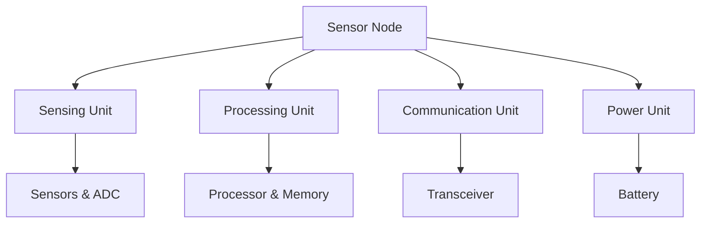
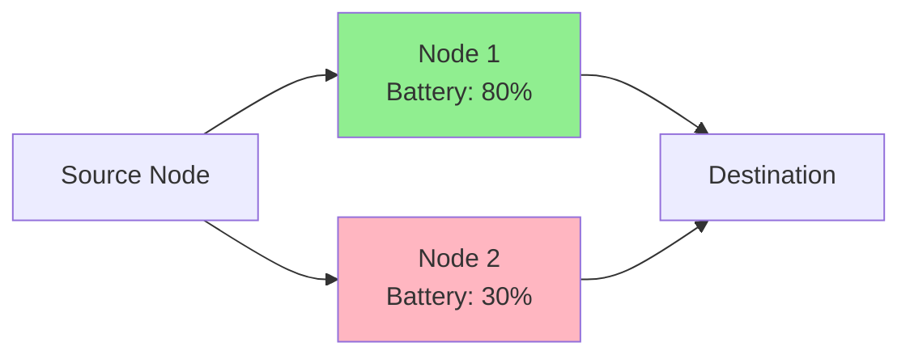
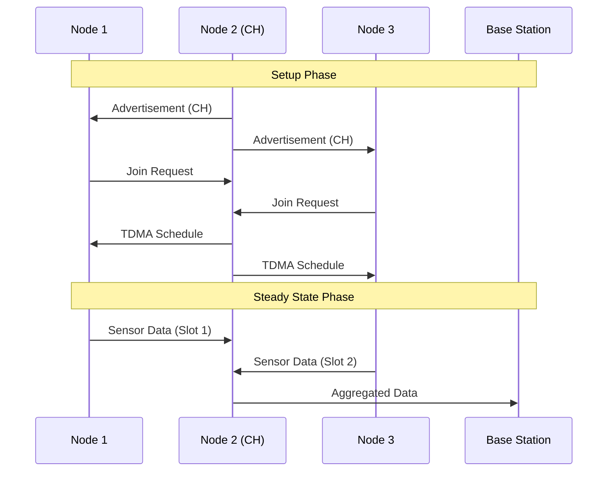
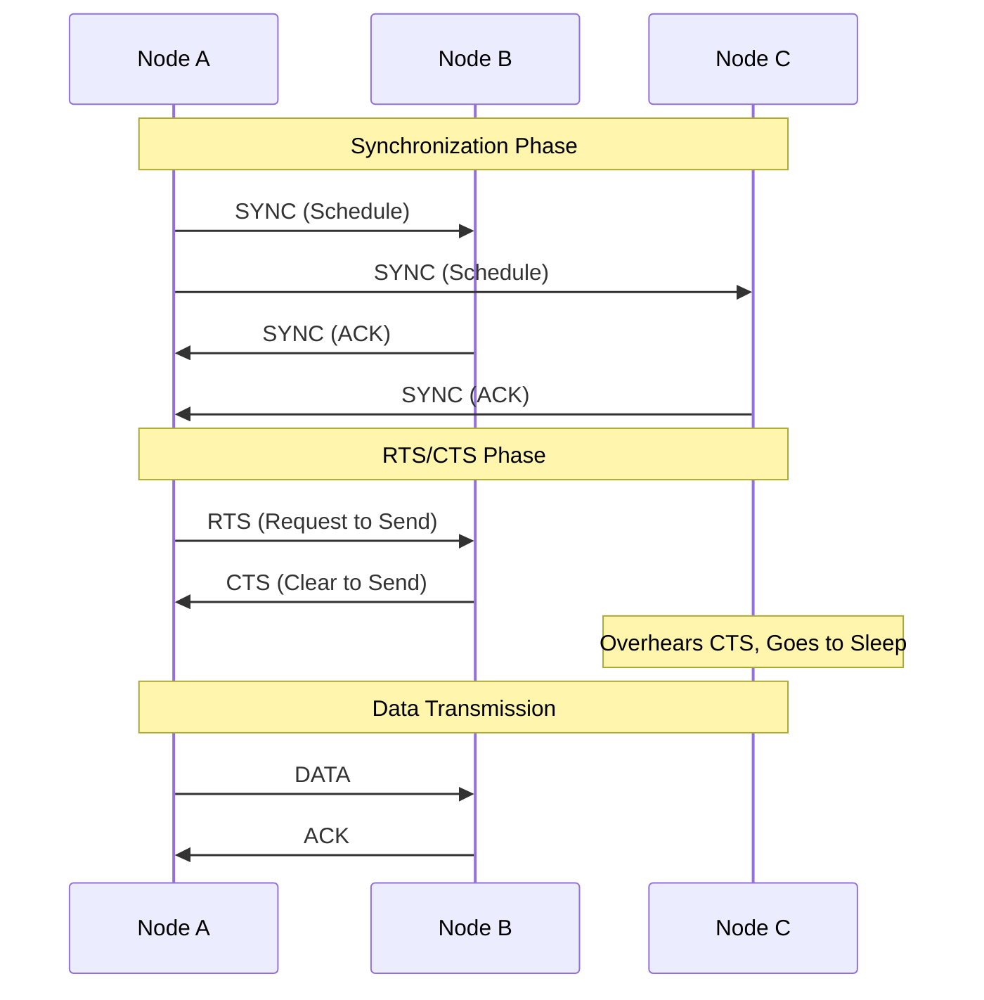
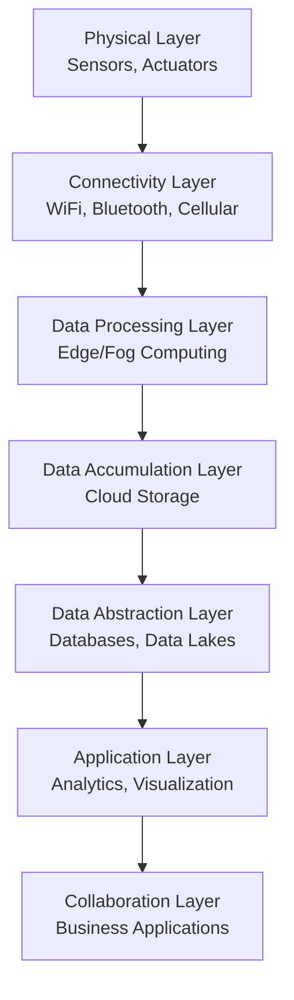
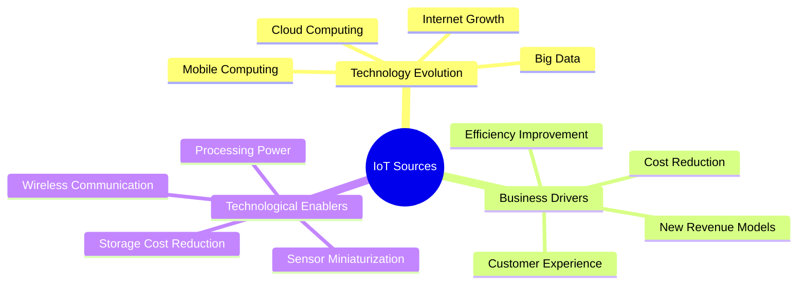
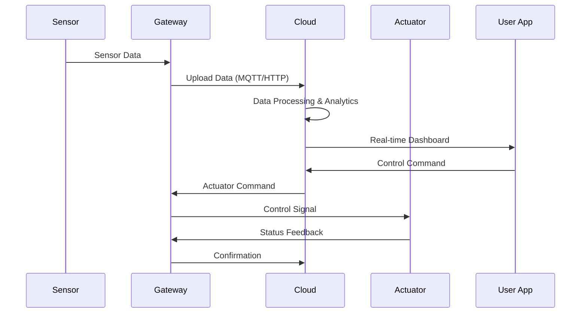
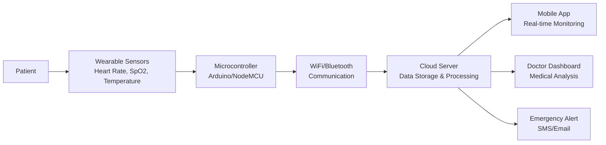
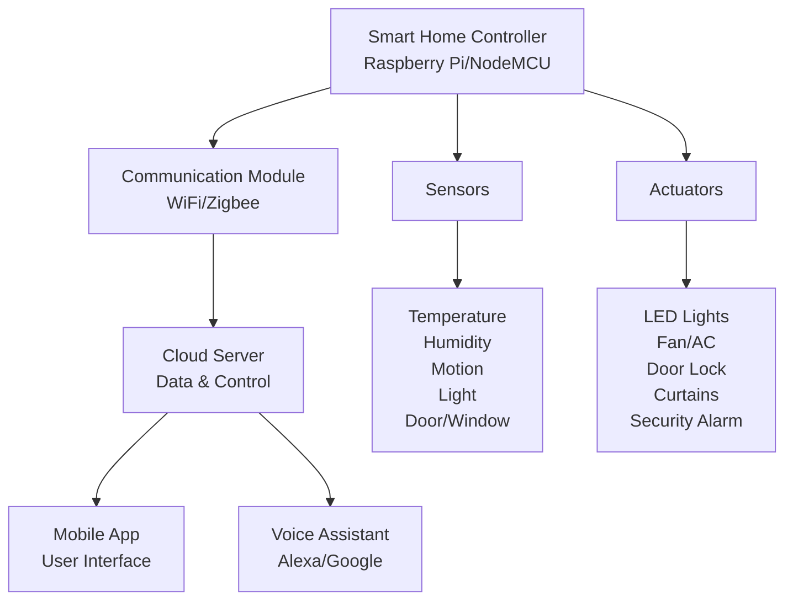
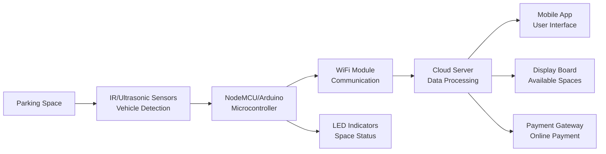

## Question 1(a) [3 marks]

**Compare Single hop and Multihop Network.**

**Answer**:

| Parameter | Single Hop Network | Multihop Network |
|-----------|-------------------|------------------|
| **Communication** | Direct to base station | Via intermediate nodes |
| **Energy consumption** | High for distant nodes | Distributed among nodes |
| **Network coverage** | Limited by transmission range | Extended coverage area |
| **Complexity** | Simple routing | Complex routing protocols |

- **Single hop**: All nodes communicate directly with base station
- **Multihop**: Data passes through multiple intermediate nodes to reach destination

**Mnemonic:** "Single Direct, Multi Relay"

## Question 1(b) [4 marks]

**Explain the Basic Components of Sensor Node.**

**Answer**:



**Basic Components:**

- **Sensing subsystem**: Collects data from environment using sensors and ADC
- **Processing subsystem**: Microcontroller/processor with memory for data processing
- **Communication subsystem**: Radio transceiver for wireless data transmission
- **Power subsystem**: Battery or energy harvesting unit for power supply

**Mnemonic:** "Sense Process Communicate Power"

## Question 1(c) [7 marks]

**List out any four technologies to reduce power consumption in WSN and explain any two technologies in detail.**

**Answer**:

**Four Power Reduction Technologies:**

| Technology | Description |
|------------|-------------|
| **Sleep scheduling** | Nodes alternate between active and sleep modes |
| **Data aggregation** | Combines multiple data packets into single transmission |
| **Topology control** | Optimizes network structure to reduce energy |
| **Energy harvesting** | Uses renewable sources like solar, vibration |

**Detailed Explanation:**

**1. Sleep Scheduling:**

- **Active mode**: Node performs sensing, processing, communication
- **Sleep mode**: Node powers down non-essential components
- **Benefits**: Reduces idle listening energy consumption by 90%

**2. Data Aggregation:**

- **Process**: Multiple sensor readings combined at intermediate nodes
- **Techniques**: Average, maximum, minimum functions applied
- **Advantage**: Reduces total number of transmissions significantly

**Mnemonic:** "Sleep Aggregate Topology Harvest"

## Question 1(c) OR [7 marks]

**List out any four challenges of wireless sensor network and explain any two in detail.**

**Answer**:

**Four WSN Challenges:**

| Challenge | Impact |
|-----------|---------|
| **Limited energy** | Affects network lifetime |
| **Limited bandwidth** | Constrains data transmission |
| **Security vulnerabilities** | Threatens data integrity |
| **Scalability issues** | Affects large network performance |

**Detailed Explanation:**

**1. Limited Energy:**

- **Battery constraint**: Nodes operate on small batteries with limited capacity
- **Energy depletion**: High energy consumption during transmission and reception
- **Solution approaches**: Power management protocols, energy-efficient routing

**2. Security Vulnerabilities:**

- **Physical attacks**: Nodes can be physically captured or damaged
- **Network attacks**: Eavesdropping, jamming, denial of service attacks
- **Countermeasures**: Encryption, authentication, secure routing protocols

**Mnemonic:** "Energy Bandwidth Security Scale"

## Question 2(a) [3 marks]

**"IEEE 802.15.4 standard and the Zigbee specifications are popular protocol choices for Wireless Sensor Network" - Justify**

**Answer**:

**Justification Table:**

| Feature | Benefit for WSN |
|---------|-----------------|
| **Low power consumption** | Extends battery life |
| **Low data rate** | Suitable for sensor data |
| **Short range** | Perfect for clustered sensors |
| **Low cost** | Economical for large deployments |

- **IEEE 802.15.4**: Provides PHY and MAC layer specifications
- **ZigBee**: Adds network and application layers on top
- **Perfect match**: WSN requirements align with protocol capabilities

**Mnemonic:** "Low Power, Low Data, Low Cost, Low Range"

## Question 2(b) [4 marks]

**Explain Energy Efficient routing with the help of suitable example**

**Answer**:



**Energy Efficient Routing:**

- **Objective**: Select paths that maximize network lifetime
- **Approach**: Consider remaining battery levels of nodes
- **Example**: Route through Node 1 (80% battery) instead of Node 2 (30% battery)

**Key Techniques:**

- **Battery awareness**: Monitor remaining energy levels
- **Load balancing**: Distribute traffic among multiple paths
- **Clustering**: Group nearby nodes to reduce long-distance transmissions

**Mnemonic:** "Battery Balance Cluster"

## Question 2(c) [7 marks]

**Explain setup and steady state phase of LEACH protocol with the help of suitable sketch.**

**Answer**:



**LEACH Protocol Phases:**

**Setup Phase:**

- **Cluster head selection**: Random selection based on probability threshold
- **Advertisement**: Selected CHs broadcast announcement messages
- **Cluster formation**: Non-CH nodes join nearest cluster head
- **Schedule creation**: CH creates TDMA schedule for cluster members

**Steady State Phase:**

- **Data transmission**: Nodes send data to CH according to TDMA schedule
- **Data aggregation**: CH combines received data from cluster members
- **Data forwarding**: CH transmits aggregated data to base station

**Advantages:**

- **Energy distribution**: Rotates CH role among nodes
- **Collision avoidance**: TDMA scheduling prevents interference

**Mnemonic:** "Select Advertise Join Schedule, Send Aggregate Forward"

## Question 2(a) OR [3 marks]

**Give Classification of routing protocols in Wireless Sensor Network.**

**Answer**:

**WSN Routing Protocol Classification:**

| Classification Basis | Types |
|---------------------|-------|
| **Network Structure** | Flat, Hierarchical, Location-based |
| **Protocol Operation** | Multipath, Query-based, Negotiation-based |
| **Path Establishment** | Proactive, Reactive, Hybrid |

**Main Categories:**

- **Flat routing**: All nodes have equal roles (e.g., Flooding, SPIN)
- **Hierarchical routing**: Cluster-based approach (e.g., LEACH, TEEN)
- **Location-based routing**: Uses geographic information (e.g., GEAR)

**Mnemonic:** "Flat Hierarchical Location"

## Question 2(b) OR [4 marks]

**Explain the wakeup concept of low duty cycle protocol with the help of sketch.**

**Answer**:

```goat
Time -->
Node A: [Sleep]---[Wake]--[Listen]--[Sleep]---[Wake]--[Listen]--[Sleep]
Node B: [Sleep]-----[Wake]--[Tx]--[Sleep]-----[Wake]--[Listen]--[Sleep]
         |     |     |     |   |     |       |     |     |       |
         0    T1    T2    T3  T4    T5      T6    T7    T8      T9
```

**Low Duty Cycle Wakeup Concept:**

- **Sleep period**: Nodes turn off radio to save energy
- **Wake period**: Nodes periodically wake up to check for communication
- **Synchronization**: Sender must know receiver's wakeup schedule

**Key Benefits:**

- **Energy savings**: Reduces idle listening by up to 99%
- **Coordinated access**: Prevents collisions during wakeup periods

**Mnemonic:** "Sleep Wake Listen Repeat"

## Question 2(c) OR [7 marks]

**Explain Synch, RTS & CTS Phases of S-MAC Protocol and message passing approach of it.**

**Answer**:



**S-MAC Protocol Phases:**

**1. Synchronization Phase:**

- **Purpose**: Establish common sleep/wake schedule
- **Process**: Nodes exchange SYNC packets containing schedule information
- **Benefit**: Ensures coordinated sleep patterns across network

**2. RTS Phase (Request to Send):**

- **Initiation**: Sender transmits RTS packet to intended receiver
- **Content**: Source address, destination address, transmission duration

**3. CTS Phase (Clear to Send):**

- **Response**: Receiver sends CTS packet confirming availability
- **Virtual sensing**: Neighboring nodes overhear CTS and defer transmission

**Message Passing Approach:**

- **Collision avoidance**: RTS/CTS handshake prevents hidden terminal problem
- **Energy conservation**: Overhearing nodes enter sleep mode during data exchange
- **Periodic synchronization**: Maintains network-wide schedule coordination

**Mnemonic:** "Sync Request Clear Transmit"

## Question 3(a) [3 marks]

**Explain Super Frame structure of IEEE 802.15.4 standard.**

**Answer**:

```goat
|<-------------- Super Frame (15.36 ms) -------------->|
|<---CAP--->|<----------CFP---------->|<--Inactive-->|
| Beacon |Slot|Slot|Slot|GTS|GTS|GTS|    Period    |
|   8    | 0 | 1 | 2 | 1 | 2 | 3 |              |
```

**Super Frame Components:**

| Component | Description | Duration |
|-----------|-------------|----------|
| **Beacon** | Network synchronization | Fixed |
| **CAP** | Contention Access Period | Variable |
| **CFP** | Contention Free Period | Variable |
| **Inactive** | Sleep period | Variable |

- **CAP**: Uses CSMA/CA for channel access
- **CFP**: Uses GTS (Guaranteed Time Slots) for real-time data
- **Inactive period**: Devices can enter low-power mode

**Mnemonic:** "Beacon Contend Guarantee Sleep"

## Question 3(b) [4 marks]

**Compare M2M and IoT Technology.**

**Answer**:

| Parameter | M2M | IoT |
|-----------|-----|-----|
| **Communication** | Point-to-point | Internet-based |
| **Data processing** | Local | Cloud-based |
| **Connectivity** | Cellular/Wired | Multiple protocols |
| **Applications** | Specific industries | Consumer & industrial |

**Key Differences:**

- **M2M**: Machine-to-Machine direct communication
- **IoT**: Internet of Things with cloud integration
- **Scope**: M2M is subset of broader IoT ecosystem
- **Intelligence**: IoT provides more advanced analytics and AI

**Mnemonic:** "M2M Direct, IoT Internet"

## Question 3(c) [7 marks]

**Draw Block Diagram of IoT Architecture and explain it**

**Answer**:



**IoT Architecture Layers:**

**1. Physical Layer:**

- **Components**: Sensors (temperature, humidity), actuators (motors, valves)
- **Function**: Data collection from physical environment

**2. Connectivity Layer:**

- **Protocols**: WiFi, Bluetooth, Zigbee, LoRaWAN, cellular
- **Function**: Transmit data from devices to processing centers

**3. Data Processing Layer:**

- **Technologies**: Edge computing, fog computing
- **Function**: Real-time processing and filtering of sensor data

**4. Data Accumulation Layer:**

- **Infrastructure**: Cloud storage, data warehouses
- **Function**: Store massive amounts of IoT data

**5. Data Abstraction Layer:**

- **Components**: Databases, data analytics engines
- **Function**: Organize and prepare data for applications

**6. Application Layer:**

- **Services**: Web applications, mobile apps, dashboards
- **Function**: Provide user interfaces and business logic

**7. Collaboration Layer:**

- **Integration**: ERP systems, business processes
- **Function**: Enable collaboration between different stakeholders

**Mnemonic:** "Physical Connect Process Accumulate Abstract Apply Collaborate"

## Question 3(a) OR [3 marks]

**Explain Energy problems of MAC Protocol**

**Answer**:

**Energy Problems in MAC Protocols:**

| Problem | Description | Impact |
|---------|-------------|---------|
| **Idle listening** | Radio stays on without communication | 50-60% energy waste |
| **Collision** | Multiple transmissions interfere | Retransmission overhead |
| **Overhearing** | Receiving irrelevant packets | Unnecessary energy consumption |

**Main Issues:**

- **Idle listening**: Most energy-consuming activity in WSN
- **Protocol overhead**: Control packets consume additional energy
- **Poor scheduling**: Inefficient channel access increases energy usage

**Mnemonic:** "Idle Collide Overhear"

## Question 3(b) OR [4 marks]

**Explain modified OSI model for IoT system**

**Answer**:

**Modified OSI Model for IoT:**

| Layer | Traditional OSI | IoT Modification |
|-------|----------------|------------------|
| **Application** | User applications | IoT applications, cloud services |
| **Presentation** | Data formatting | JSON, XML, CoAP |
| **Session** | Session management | MQTT, HTTP sessions |
| **Transport** | TCP, UDP | UDP, CoAP, MQTT |
| **Network** | IP routing | 6LoWPAN, IPv6 |
| **Data Link** | Ethernet, WiFi | IEEE 802.15.4, LoRa |
| **Physical** | Physical medium | Sensors, actuators, radio |

**Key Modifications:**

- **Lightweight protocols**: Optimized for resource-constrained devices
- **Energy efficiency**: Protocols designed for low power consumption
- **Interoperability**: Support for diverse IoT devices and platforms

**Mnemonic:** "Apps Present Session Transport Network Link Physical"

## Question 3(c) OR [7 marks]

**Explain Sources of IoT in detail**

**Answer**:

**IoT Sources Classification:**



**1. Technology Evolution Sources:**

- **Internet expansion**: Global connectivity infrastructure development
- **Mobile revolution**: Smartphones and tablets creating connected ecosystem
- **Cloud computing**: Scalable computing and storage resources
- **Big data analytics**: Ability to process massive data volumes

**2. Business Drivers:**

- **Operational efficiency**: Automation and optimization of business processes
- **Cost reduction**: Lower operational and maintenance costs
- **New business models**: Data-driven services and products
- **Customer satisfaction**: Enhanced user experience through smart services

**3. Technological Enablers:**

- **Sensor advancement**: Smaller, cheaper, more accurate sensors
- **Communication progress**: Improved wireless protocols and standards
- **Processing evolution**: More powerful yet energy-efficient processors
- **Storage revolution**: Cheaper and more reliable data storage solutions

**4. Market Demands:**

- **Smart cities**: Urban planning and infrastructure management
- **Healthcare**: Remote monitoring and telemedicine
- **Industrial automation**: Industry 4.0 and smart manufacturing
- **Environmental monitoring**: Climate change and sustainability concerns

**Key Convergence Factors:**

- **IPv6 adoption**: Unlimited addressing for billions of devices
- **5G networks**: High-speed, low-latency communication
- **AI integration**: Machine learning for intelligent decision making

**Mnemonic:** "Technology Business Enable Market"

## Question 4(a) [3 marks]

**Explain basic Components of IoT in brief.**

**Answer**:

**Basic IoT Components:**

| Component | Function | Examples |
|-----------|----------|----------|
| **Sensors** | Data collection | Temperature, pressure, motion |
| **Connectivity** | Data transmission | WiFi, Bluetooth, cellular |
| **Data processing** | Information analysis | Edge/cloud computing |
| **User interface** | Human interaction | Mobile apps, dashboards |

**Core Functions:**

- **Sensing**: Collect environmental data
- **Connecting**: Transmit data to processing centers
- **Processing**: Analyze and extract insights
- **Acting**: Control actuators based on analysis

**Mnemonic:** "Sense Connect Process Interface"

## Question 4(b) [4 marks]

**Discuss Constrained Application Protocol (CoAP) in brief.**

**Answer**:

**CoAP Protocol Overview:**

```goat
Client                    Server
  |                         |
  |------- GET /temp ------>|
  |                         |
  |<----- 2.05 Content -----|
  |    Payload: 25°C        |
  |                         |
```

**CoAP Features:**

| Feature | Description | Benefit |
|---------|-------------|---------|
| **Lightweight** | Simple protocol design | Low resource usage |
| **UDP-based** | Uses UDP transport | Reduced overhead |
| **RESTful** | REST architecture | Easy integration |
| **Reliable** | Built-in retransmission | Ensures delivery |

**Key Characteristics:**

- **Request/Response**: Similar to HTTP but optimized for IoT
- **Confirmable messages**: Reliability through acknowledgments
- **Resource discovery**: Built-in service discovery mechanism
- **Block transfer**: Support for large data transfers

**Mnemonic:** "Light UDP REST Reliable"

## Question 4(c) [7 marks]

**Explain Process of Sensor and controlling device (actuator) management through cloud.**

**Answer**:



**Cloud-based IoT Management Process:**

**1. Data Collection Phase:**

- **Sensors**: Collect environmental data (temperature, humidity, motion)
- **Local processing**: Basic filtering and formatting at edge devices
- **Data transmission**: Send data to cloud via WiFi/cellular connection

**2. Cloud Processing Phase:**

- **Data ingestion**: Receive and store sensor data in cloud databases
- **Real-time analytics**: Process data streams for immediate insights
- **Machine learning**: Apply AI algorithms for pattern recognition and prediction

**3. Decision Making Phase:**

- **Rule engine**: Apply business rules to determine required actions
- **Threshold monitoring**: Trigger alerts when values exceed limits
- **Automated responses**: Generate control commands for actuators

**4. Control Execution Phase:**

- **Command dispatch**: Send control signals to appropriate actuators
- **Device management**: Monitor actuator status and performance
- **Feedback loop**: Collect confirmation of successful command execution

**5. User Interaction:**

- **Dashboard**: Real-time visualization of sensor data and system status
- **Mobile apps**: Remote monitoring and manual control capabilities
- **Notifications**: Alerts and warnings sent to users

**Benefits:**

- **Scalability**: Handle thousands of devices simultaneously
- **Remote access**: Control devices from anywhere with internet
- **Data analytics**: Historical analysis and predictive maintenance
- **Integration**: Connect with other business systems and services

**Mnemonic:** "Collect Process Decide Control Interact"

## Question 4(a) OR [3 marks]

**Define Internet of Things and state its Vision.**

**Answer**:

**Definition:**
Internet of Things (IoT) is a network of interconnected physical devices embedded with sensors, software, and connectivity to collect and exchange data over the internet.

**IoT Vision:**

| Aspect | Vision |
|--------|--------|
| **Connectivity** | Everything connected everywhere |
| **Intelligence** | Smart decision making |
| **Automation** | Minimal human intervention |
| **Integration** | Seamless system interaction |

**Core Vision Elements:**

- **Ubiquitous computing**: Technology embedded in everyday objects
- **Seamless interaction**: Natural human-device communication
- **Intelligent environment**: Context-aware responsive systems

**Mnemonic:** "Connect Intelligence Automate Integrate"

## Question 4(b) OR [4 marks]

**Discuss (Message Queue Telemetry Transport) MQTT protocol in brief.**

**Answer**:

**MQTT Protocol Architecture:**

```goat
Publisher                Broker               Subscriber
    |                       |                       |
    |-- Publish(topic) ---->|                       |
    |                       |<-- Subscribe(topic) --|
    |                       |                       |
    |                       |-- Forward Message  -->|
```

**MQTT Characteristics:**

| Feature | Description | Advantage |
|---------|-------------|-----------|
| **Lightweight** | Minimal protocol overhead | Suitable for IoT devices |
| **Publish/Subscribe** | Decoupled communication | Scalable architecture |
| **QoS levels** | Quality of service options | Reliable delivery |
| **Persistent sessions** | Session state maintained | Connection resilience |

**MQTT Components:**

- **Publisher**: Sends messages to broker
- **Subscriber**: Receives messages from broker
- **Broker**: Central message router
- **Topics**: Message categorization system

**Quality of Service Levels:**

- **QoS 0**: At most once delivery
- **QoS 1**: At least once delivery  
- **QoS 2**: Exactly once delivery

**Mnemonic:** "Publish Subscribe Broker Topic"

## Question 4(c) OR [7 marks]

**Draw Architecture block diagram of Raspberry Pi and explain it.**

**Answer**:

```goat
+----------------------------------------------------------+
|                    Raspberry Pi 4                       |
|  +----------+  +----------+  +----------+  +----------+ |
|  |   CPU    |  |   GPU    |  |  Memory  |  | Storage  | |
|  |Quad-core |  |VideoCore |  | 4GB RAM  |  |MicroSD   | |
|  |ARM A72   |  |    VI    |  |  LPDDR4  |  |   Card   | |
|  +----------+  +----------+  +----------+  +----------+ |
|                                                         |
|  +----------+  +----------+  +----------+  +----------+ |
|  |   GPIO   |  |   USB    |  | Network  |  |  Audio   | |
|  | 40 pins  |  | 4 ports  |  |Ethernet  |  |3.5mm jack| |
|  |          |  |  USB 3.0 |  |WiFi/BT   |  |   HDMI   | |
|  +----------+  +----------+  +----------+  +----------+ |
+----------------------------------------------------------+
```

**Raspberry Pi Architecture Components:**

**1. Processing Unit:**

- **CPU**: Quad-core ARM Cortex-A72 processor running at 1.5GHz
- **GPU**: VideoCore VI for graphics processing and video acceleration
- **Performance**: Capable of running full operating systems like Linux

**2. Memory System:**

- **RAM**: 4GB LPDDR4 system memory for program execution
- **Storage**: MicroSD card slot for operating system and data storage
- **Cache**: On-chip cache memory for improved performance

**3. Input/Output Interfaces:**

- **GPIO**: 40-pin general purpose input/output for sensor connectivity
- **USB ports**: 4x USB 3.0 ports for peripherals and storage devices
- **Display**: 2x micro-HDMI ports supporting 4K video output

**4. Connectivity Options:**

- **Ethernet**: Gigabit Ethernet port for wired network connection
- **Wireless**: Dual-band WiFi 802.11ac and Bluetooth 5.0
- **Camera**: Dedicated camera serial interface (CSI) port

**5. Power and Audio:**

- **Power**: USB-C power input with efficient power management
- **Audio**: 3.5mm audio jack and HDMI audio output
- **Power consumption**: Optimized for continuous operation

**IoT Applications:**

- **Home automation**: Control lights, fans, security systems
- **Industrial monitoring**: Temperature, pressure, vibration sensing
- **Robotics**: Motor control, sensor integration, computer vision
- **Data logging**: Environmental monitoring and data collection

**Advantages for IoT:**

- **Cost-effective**: Low-cost computing platform
- **Versatile**: Supports multiple programming languages
- **Community support**: Large ecosystem of tutorials and projects
- **Expandability**: Compatible with numerous sensors and modules

**Mnemonic:** "Process Memory Interface Connect Power"

## Question 5(a) [3 marks]

**Draw Block Diagram of Smart Health Monitoring System with IoT.**

**Answer**:



**System Components:**

- **Sensors**: Collect vital signs (heart rate, blood pressure, temperature)
- **Microcontroller**: Process sensor data and manage communication
- **Connectivity**: Transmit data to cloud via WiFi/cellular networks
- **Cloud platform**: Store data and provide analytics services
- **User interfaces**: Mobile apps and web dashboards for monitoring

**Mnemonic:** "Sense Process Connect Store Monitor"

## Question 5(b) [4 marks]

**List out different types of sensors in IoT and briefly explain working of any two.**

**Answer**:

**IoT Sensor Types:**

| Sensor Type | Measurement | Applications |
|-------------|-------------|--------------|
| **Temperature** | Heat/cold levels | HVAC, weather monitoring |
| **Humidity** | Moisture content | Agriculture, storage |
| **Pressure** | Force per unit area | Weather, industrial |
| **Motion/PIR** | Movement detection | Security, automation |
| **Gas** | Chemical composition | Air quality, safety |
| **Light** | Illumination levels | Smart lighting |

**Detailed Working:**

**1. Temperature Sensor (DHT22):**

- **Principle**: Thermistor resistance changes with temperature
- **Process**: Microcontroller reads resistance value and converts to temperature
- **Output**: Digital signal with temperature and humidity data
- **Applications**: Smart thermostat, environmental monitoring

**2. PIR Motion Sensor:**

- **Principle**: Detects infrared radiation emitted by moving objects
- **Components**: Pyroelectric sensor with fresnel lens
- **Working**: Changes in infrared levels trigger digital output signal
- **Applications**: Security systems, automatic lighting, occupancy detection

**Mnemonic:** "Temperature Humidity Pressure Motion Gas Light"

## Question 5(c) [7 marks]

**Draw Block diagram of smart home automation with IoT and Explain its working.**

**Answer**:



**Smart Home Automation Working:**

**1. Data Collection:**

- **Environmental sensors**: Monitor temperature, humidity, light levels
- **Security sensors**: Detect motion, door/window status, smoke/gas
- **User presence**: PIR sensors determine occupancy in different rooms

**2. Data Processing:**

- **Local processing**: Immediate responses for critical situations (fire alarm)
- **Cloud processing**: Complex analytics and pattern recognition
- **Machine learning**: Learn user preferences and habits over time

**3. Decision Making:**

- **Rule-based control**: If temperature > 25°C, turn on AC
- **Scheduled operations**: Turn on lights at sunset, water plants at 6 AM
- **User preferences**: Adjust lighting and temperature based on learned patterns

**4. Control Execution:**

- **Lighting control**: Automatic dimming based on ambient light and time
- **Climate control**: Optimize heating/cooling based on occupancy and weather
- **Security management**: Arm/disarm security system, lock/unlock doors

**5. User Interaction:**

- **Mobile app**: Remote monitoring and control from anywhere
- **Voice commands**: Integration with Alexa, Google Assistant
- **Manual override**: Physical switches and controls remain functional

**6. Communication Flow:**

- **Sensor data**: Collected every few seconds and transmitted to controller
- **Cloud synchronization**: Data backup and remote access capabilities
- **Status updates**: Real-time notifications to mobile devices

**Key Features:**

- **Energy efficiency**: Automatic control reduces power consumption by 30-40%
- **Security enhancement**: Real-time monitoring and alert systems
- **Convenience**: Voice control and smartphone integration
- **Cost savings**: Optimized usage of electricity and water resources

**System Benefits:**

- **Remote monitoring**: Check home status from office or vacation
- **Automated responses**: Immediate action during emergencies
- **Personalization**: Customized environment based on individual preferences
- **Integration**: Works with existing home appliances and systems

**Technical Specifications:**

- **Protocols**: WiFi, Zigbee, Z-Wave for device communication
- **Power backup**: Battery backup for critical sensors during power outage
- **Data encryption**: Secure communication between devices and cloud
- **Scalability**: Easy addition of new devices and sensors

**Mnemonic:** "Collect Process Decide Control Interact Secure"

## Question 5(a) OR [3 marks]

**List out any three Industrial and Military IoT applications.**

**Answer**:

**Industrial IoT Applications:**

| Application | Description | Benefits |
|-------------|-------------|----------|
| **Predictive maintenance** | Monitor equipment health in real-time | Reduce downtime, lower costs |
| **Supply chain tracking** | Track goods from factory to customer | Improve efficiency, reduce losses |
| **Energy management** | Monitor and optimize power consumption | Reduce energy costs by 20-30% |

**Military IoT Applications:**

| Application | Description | Benefits |
|-------------|-------------|----------|
| **Battlefield surveillance** | Real-time monitoring of combat zones | Enhanced situational awareness |
| **Asset tracking** | Monitor military equipment and vehicles | Prevent theft, optimize logistics |
| **Soldier health monitoring** | Track vital signs of personnel | Improve safety, medical response |

**Mnemonic:** "Predict Track Energy, Survey Track Monitor"

## Question 5(b) OR [4 marks]

**List out different types of actuators in IoT and briefly explain working of any two.**

**Answer**:

**IoT Actuator Types:**

| Actuator Type | Function | Applications |
|---------------|----------|--------------|
| **Servo motor** | Precise angular positioning | Robotics, automation |
| **Relay** | Electrical switching | Lights, fans, appliances |
| **Solenoid valve** | Fluid flow control | Irrigation, HVAC |
| **LED** | Light emission | Indicators, displays |
| **Buzzer** | Sound generation | Alarms, notifications |
| **Stepper motor** | Precise rotational control | 3D printers, CNC |

**Detailed Working:**

**1. Servo Motor:**

- **Control signal**: PWM (Pulse Width Modulation) signal determines position
- **Feedback system**: Internal potentiometer provides position feedback
- **Working**: Control circuit compares desired vs actual position
- **Applications**: Robotic arms, camera pan/tilt, automatic doors

**2. Relay Module:**

- **Electromagnetic principle**: Coil creates magnetic field when energized
- **Switching action**: Magnetic field moves mechanical contacts
- **Isolation**: Electrical isolation between control and load circuits
- **Applications**: Home automation, industrial control, safety systems

**Mnemonic:** "Servo Relay Solenoid LED Buzzer Stepper"

## Question 5(c) OR [7 marks]

**Draw Block diagram of smart parking system with IoT and Explain its working.**

**Answer**:



**Smart Parking System Working:**

**1. Vehicle Detection:**

- **Sensor placement**: IR or ultrasonic sensors installed at each parking space
- **Detection mechanism**: Sensors detect presence/absence of vehicles
- **Status monitoring**: Continuous monitoring of space occupancy
- **Data accuracy**: Multiple sensors reduce false positive readings

**2. Data Collection and Processing:**

- **Microcontroller**: NodeMCU/Arduino processes sensor data locally
- **Status determination**: Occupied (sensor blocked) or Free (sensor clear)
- **Time stamping**: Record entry and exit times for billing
- **Data validation**: Filter out temporary obstructions (leaves, debris)

**3. Communication and Cloud Integration:**

- **WiFi transmission**: Real-time data sent to cloud server
- **Database storage**: Maintain records of parking space status
- **Analytics processing**: Generate usage patterns and statistics
- **API integration**: Connect with mobile apps and display systems

**4. User Interface and Services:**

- **Mobile application**: Users can find and reserve parking spaces
- **Real-time updates**: Live status of available parking spaces
- **Navigation assistance**: GPS guidance to selected parking space
- **Payment integration**: Online payment for parking fees

**5. Visual Indicators:**

- **LED indicators**: Green (free), Red (occupied) for each space
- **Display boards**: Electronic signs showing total available spaces
- **Mobile notifications**: Alerts when reserved time is expiring
- **Admin dashboard**: Management interface for monitoring and control

**6. Advanced Features:**

- **Space reservation**: Book parking space in advance
- **Automatic billing**: Calculate charges based on parking duration
- **Violation detection**: Alert for unauthorized parking
- **Data analytics**: Peak usage hours, revenue analysis

**System Benefits:**

- **Time saving**: Reduces time spent searching for parking
- **Traffic reduction**: Less circling around looking for spaces
- **Revenue optimization**: Dynamic pricing based on demand
- **Environmental impact**: Reduced fuel consumption and emissions

**Technical Components:**

- **Sensors**: IR proximity sensors or ultrasonic distance sensors
- **Microcontrollers**: ESP8266/ESP32 based development boards
- **Communication**: WiFi, LoRaWAN, or cellular connectivity
- **Power supply**: Solar panels with battery backup for remote locations

**Implementation Challenges:**

- **Weather resistance**: Sensors must work in rain, snow, extreme temperatures
- **Power management**: Battery-powered sensors need efficient power usage
- **Network reliability**: Backup communication methods for connectivity issues
- **Maintenance**: Regular cleaning and calibration of sensors

**Cost-Benefit Analysis:**

- **Initial investment**: Sensor installation and system setup costs
- **Operational savings**: Reduced management overhead
- **Revenue increase**: Improved space utilization and dynamic pricing
- **Payback period**: Typically 12-18 months for commercial installations

**Integration Possibilities:**

- **Smart city systems**: Connect with traffic management systems
- **Building automation**: Integration with shopping mall or office building systems
- **Public transportation**: Coordinate with bus/metro schedules
- **Emergency services**: Priority access for emergency vehicles

**Future Enhancements:**

- **AI integration**: Predict parking demand using machine learning
- **Electric vehicle charging**: Integration with EV charging stations
- **Autonomous vehicles**: Support for self-parking cars
- **Mobile payment expansion**: Integration with digital wallets

**Mnemonic:** "Detect Process Communicate Interface Indicate Serve"
