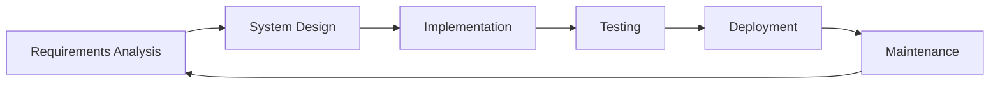
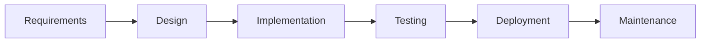
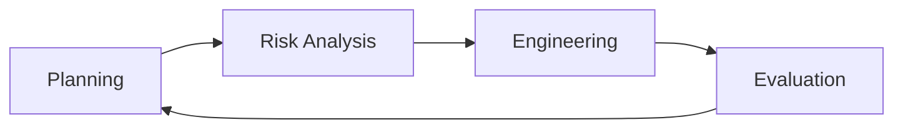
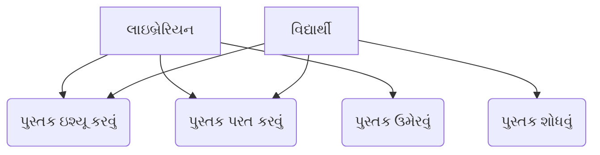
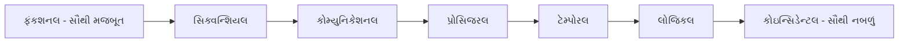
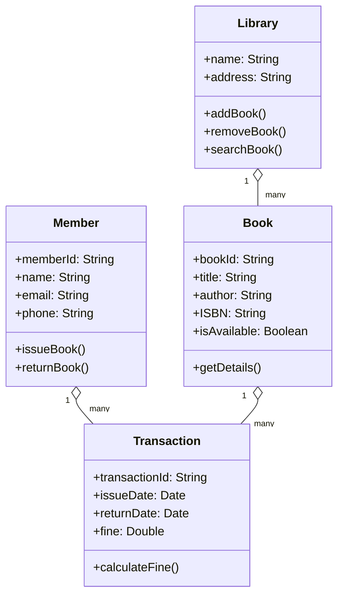

## પ્રશ્ન 1(અ) [3 ગુણ]

**બધા જ પ્રકારના સૉફ્ટવેર એપ્લિકેશન ડોમેઇન ની યાદી બનાવો અને Embedded Software સમજાવો**

**જવાબ**:

**સૉફ્ટવેર એપ્લિકેશન ડોમેઇન:**

| ડોમેઇન | વર્ણન |
|--------|-------|
| **સિસ્ટમ સૉફ્ટવેર** | ઓપરેટિંગ સિસ્ટમ, ડિવાઇસ ડ્રાઇવર |
| **એપ્લિકેશન સૉફ્ટવેર** | વર્ડ પ્રોસેસર, ગેમ્સ, બિઝનેસ એપ્સ |
| **એન્જિનિયરિંગ/સાયન્ટિફિક સૉફ્ટવેર** | CAD, સિમ્યુલેશન ટૂલ |
| **એમ્બેડેડ સૉફ્ટવેર** | રિયલ-ટાઇમ કંટ્રોલ સિસ્ટમ |
| **વેબ એપ્લિકેશન** | બ્રાઉઝર-આધારિત એપ્લિકેશન |
| **AI સૉફ્ટવેર** | મશીન લર્નિંગ, એક્સપર્ટ સિસ્ટમ |

**એમ્બેડેડ સૉફ્ટવેર** એ વિશેષ સૉફ્ટવેર છે જે ચોક્કસ હાર્ડવેર સાથે એમ્બેડેડ સિસ્ટમ પર ચાલે છે. આ વોશિંગ મશીન, કાર અને મેડિકલ ઉપકરણોમાં વપરાય છે.

- **રિયલ-ટાઇમ ઓપરેશન**: નિર્ધારિત સમયમર્યાદામાં જવાબ આપવો જોઈએ
- **રિસોર્સ મર્યાદાઓ**: મર્યાદિત મેમરી અને પ્રોસેસિંગ પાવર
- **હાર્ડવેર પર નિર્ભરતા**: ચોક્કસ હાર્ડવેર સાથે ગાઢ એકીકરણ

**મેમરી ટ્રીક:** "SAEEWA" - System, Application, Engineering, Embedded, Web, AI

## પ્રશ્ન 1(બ) [4 ગુણ]

**જેનેરિક ફ્રેમવર્ક એક્ટિવિટીસ અને અમ્બ્રેલા એક્ટિવિટીસ સમજાવો**

**જવાબ**:

**જેનેરિક ફ્રેમવર્ક એક્ટિવિટીસ:**

| એક્ટિવિટી | હેતુ |
|---------|-----|
| **કોમ્યુનિકેશન** | હિતધારકોથી જરૂરિયાતો એકત્રિત કરવી |
| **પ્લાનિંગ** | કાર્ય યોજના અને શેડ્યૂલ બનાવવું |
| **મોડેલિંગ** | વિશ્લેષણ અને ડિઝાઇન મોડેલ બનાવવા |
| **કન્સ્ટ્રક્શન** | કોડ જનરેશન અને ટેસ્ટિંગ |
| **ડિપ્લોયમેન્ટ** | સૉફ્ટવેર ડિલિવરી અને સપોર્ટ |

**અમ્બ્રેલા એક્ટિવિટીસ:**

| એક્ટિવિટી | હેતુ |
|---------|-----|
| **પ્રોજેક્ટ મેનેજમેન્ટ** | પ્રગતિ ટ્રેક કરવી અને નિયંત્રણ |
| **રિસ્ક મેનેજમેન્ટ** | જોખમો ઓળખવા અને ઘટાડવા |
| **ક્વોલિટી એશ્યોરન્સ** | સૉફ્ટવેર ગુણવત્તા સુનિશ્ચિત કરવી |
| **કન્ફિગરેશન મેનેજમેન્ટ** | ફેરફારોને નિયંત્રિત કરવા |
| **વર્ક પ્રોડક્ટ પ્રિપરેશન** | દસ્તાવેજીકરણ બનાવવું |

- **ફ્રેમવર્ક એક્ટિવિટીસ**: દરેક પ્રોજેક્ટમાં મુખ્ય ક્રમિક પ્રવૃત્તિઓ
- **અમ્બ્રેલા એક્ટિવિટીસ**: પ્રોજેક્ટ જીવનકાળ દરમિયાન સતત પ્રવૃત્તિઓ

**મેમરી ટ્રીક:** "CPMCD" ફ્રેમવર્ક માટે, "PRQCW" અમ્બ્રેલા માટે

## પ્રશ્ન 1(ક) [7 ગુણ]

**સૉફ્ટવેર ડેવલપમેંટ લાઇફ સાઇકલની આકૃતિ દોરી તેના તબક્કાઓ સમજાવો**

**જવાબ**:

**SDLC આકૃતિ:**



**SDLC તબક્કાઓ:**

| તબક્કો | પ્રવૃત્તિઓ | પરિણામો |
|-------|----------|--------|
| **જરૂરિયાત વિશ્લેષણ** | વપરાશકર્તા જરૂરિયાતો એકત્રિત કરવી, SRS બનાવવું | SRS દસ્તાવેજ |
| **સિસ્ટમ ડિઝાઇન** | આર્કિટેક્ચર ડિઝાઇન, UI ડિઝાઇન | ડિઝાઇન દસ્તાવેજ |
| **અમલીકરણ** | કોડ ડેવલપમેન્ટ, યુનિટ ટેસ્ટિંગ | સોર્સ કોડ |
| **ટેસ્ટિંગ** | એકીકરણ, સિસ્ટમ ટેસ્ટિંગ | ટેસ્ટ રિપોર્ટ |
| **ડિપ્લોયમેન્ટ** | ઇન્સ્ટોલેશન, વપરાશકર્તા તાલીમ | ડિપ્લોય થયેલ સિસ્ટમ |
| **જાળવણી** | બગ ફિક્સ, સુધારાઓ | અપડેટ થયેલ સિસ્ટમ |

- **વ્યવસ્થિત અભિગમ**: દરેક તબક્કાના ચોક્કસ ઇનપુટ અને આઉટપુટ
- **ગુણવત્તા ગેટ**: તબક્કાઓ વચ્ચે સમીક્ષા ગુણવત્તા સુનિશ્ચિત કરે છે
- **પુનરાવર્તિત પ્રકૃતિ**: પ્રતિપુષ્ટિ આગામી ચક્રો સુધારે છે

**મેમરી ટ્રીક:** "વાસ્તવિક સિસ્ટમ અમલીકરણ ટેસ્ટ દરમિયાન જાળવણી"

## પ્રશ્ન 1(ક) OR [7 ગુણ]

**સોફ્ટવેર ડેવલપમેંટ મોડેલ્સની યાદી બનાવી કોઈ પણ બે મોડલ જરૂરી આકૃતિ સાથે સમજાવો**

**જવાબ**:

**સૉફ્ટવેર ડેવલપમેન્ટ મોડેલ્સ:**

| મોડેલ | લાક્ષણિકતાઓ |
|------|-------------|
| **વોટરફોલ મોડેલ** | ક્રમિક, રેખીય અભિગમ |
| **પુનરાવર્તિત મોડેલ** | ડેવલપમેન્ટના પુનરાવર્તિત ચક્રો |
| **સ્પાઇરલ મોડેલ** | જોખમ-સંચાલિત, પુનરાવર્તિત |
| **એજાઇલ મોડેલ** | લવચીક, ગ્રાહક સહયોગ |
| **RAD મોડેલ** | ઝડપી પ્રોટોટાઇપિંગ |
| **V-મોડેલ** | વેરિફિકેશન અને વેલિડેશન પર ધ્યાન |

**1. વોટરફોલ મોડેલ:**



**2. સ્પાઇરલ મોડેલ:**



- **વોટરફોલ**: સરળ, સારી રીતે સમજાયેલ જરૂરિયાતો માટે યોગ્ય
- **સ્પાઇરલ**: ઉચ્ચ જોખમવાળા પ્રોજેક્ટને પુનરાવર્તિત જોખમ મૂલ્યાંકન સાથે હેન્ડલ કરે છે

**મેમરી ટ્રીક:** "WIRRAV" - Waterfall, Iterative, RAD, Risk-driven, Agile, V-model

## પ્રશ્ન 2(અ) [3 ગુણ]

**SCRUM એજાઇલ પ્રોસેસ મોડલ અને SPIRAL પ્રોસેસ મોડલ વચ્ચેના તફાવત લખો**

**જવાબ**:

| પાસું | SCRUM | SPIRAL |
|------|-------|--------|
| **અભિગમ** | એજાઇલ, પુનરાવર્તિત | જોખમ-સંચાલિત, પુનરાવર્તિત |
| **અવધિ** | નિશ્ચિત સ્પ્રિન્ટ (2-4 અઠવાડિયા) | ચલ સ્પાઇરલ ચક્રો |
| **ધ્યાન** | ગ્રાહક સહયોગ | જોખમ વ્યવસ્થાપન |
| **આયોજન** | સ્પ્રિન્ટ પ્લાનિંગ | વ્યાપક આયોજન |
| **દસ્તાવેજીકરણ** | ન્યૂનતમ દસ્તાવેજીકરણ | વિગતવાર દસ્તાવેજીકરણ |
| **ટીમ સાઇઝ** | નાની ટીમ (5-9 સભ્યો) | કોઈપણ ટીમ સાઇઝ |

- **SCRUM**: ઝડપી ડિલિવરી અને ગ્રાહક પ્રતિપુષ્ટિ પર ભાર
- **SPIRAL**: જોખમ ઓળખ અને શમન પર ધ્યાન

**મેમરી ટ્રીક:** "SCRUM=સ્પીડ, SPIRAL=સેફ્ટી"

## પ્રશ્ન 2(બ) [4 ગુણ]

**જરૂરિયાત એકત્રીકરણ તકનીકોની યાદી આપો અને કોઇ પણ એક સમજાવો**

**જવાબ**:

**જરૂરિયાત એકત્રીકરણ તકનીકો:**

| તકનીક | વર્ણન |
|-------|-------|
| **ઇન્ટરવ્યુ** | હિતધારકો સાથે સીધી વાતચીત |
| **પ્રશ્નાવલી** | માળખાગત લેખિત પ્રશ્નો |
| **અવલોકન** | વપરાશકર્તાઓને કાર્ય કરતા જોવા |
| **દસ્તાવેજ વિશ્લેષણ** | હાલના દસ્તાવેજોની સમીક્ષા |
| **પ્રોટોટાઇપિંગ** | કાર્યશીલ મોડેલ બનાવવા |
| **બ્રેઇનસ્ટોર્મિંગ** | ગ્રૂપ આઇડિયા જનરેશન |

**ઇન્ટરવ્યુ તકનીક સમજાવેલ:**

- **માળખાગત ઇન્ટરવ્યુ**: પૂર્વનિર્ધારિત પ્રશ્નો, ઔપચારિક અભિગમ
- **અમાળખાગત ઇન્ટરવ્યુ**: ખુલ્લી ચર્ચા, લવચીક
- **અર્ધ-માળખાગત**: બંનેનું મિશ્રણ

**ફાયદાઓ**: સીધી હિતધારક ઇનપુટ, સ્પષ્ટીકરણ શક્ય, વિગતવાર માહિતી
**પડકારો**: સમય વપરાશ, ઇન્ટરવ્યુઅર પૂર્વગ્રહ, અધૂરી માહિતી

**મેમરી ટ્રીક:** "IQDPBB" - Interview, Questionnaire, Document, Prototype, Brainstorm, Observe

## પ્રશ્ન 2(ક) [7 ગુણ]

**યુઝ કેસ ડાયગ્રામ વ્યાખ્યાપિત કરો. તેને ઉદાહરણ સાથે સમજાવો**

**જવાબ**:

**યુઝ કેસ ડાયગ્રામ વ્યાખ્યા:**
યુઝ કેસ ડાયગ્રામ એક્ટર્સ અને તેમની યુઝ કેસ સાથેની ક્રિયાપ્રતિક્રિયા દર્શાવીને સિસ્ટમની કાર્યાત્મક જરૂરિયાતો બતાવે છે.

**ઘટકો:**

| ઘટક | પ્રતીક | હેતુ |
|-----|------|-----|
| **એક્ટર** | લાકડી આકૃતિ | બાહ્ય એન્ટિટી |
| **યુઝ કેસ** | અંડાકાર | સિસ્ટમ ફંક્શન |
| **એસોસિએશન** | લાઇન | એક્ટર-યુઝ કેસ સંબંધ |
| **સિસ્ટમ બાઉન્ડરી** | લંબચોરસ | સિસ્ટમ સ્કોપ |

**ઉદાહરણ: લાઇબ્રેરી મેનેજમેન્ટ સિસ્ટમ**



**સંબંધો:**

- **Include**: યુઝ કેસ દ્વારા શેર કરાયેલ સામાન્ય કાર્યક્ષમતા
- **Extend**: બેઝ યુઝ કેસમાં વૈકલ્પિક કાર્યક્ષમતા ઉમેરવી
- **સામાન્યીકરણ**: એક્ટર્સ અથવા યુઝ કેસ વચ્ચે વારસો

**ફાયદાઓ**: સ્પષ્ટ કાર્યાત્મક ઝાંખી, કોમ્યુનિકેશન ટૂલ, ટેસ્ટિંગ માટે આધાર

**મેમરી ટ્રીક:** "એક્ટર્સ યુઝ કેસ સિસ્ટમની અંદર"

## પ્રશ્ન 2(અ) OR [3 ગુણ]

**વોટર ફોલ મોડલ અને ઈટરેટિવ વોટર ફોલ મોડલ ની સરખામણી કરો**

**જવાબ**:

| પાસું | વોટરફોલ મોડેલ | ઇટરેટિવ વોટરફોલ |
|------|---------------|-----------------|
| **તબક્કાઓ** | ક્રમિક, એક વખત | પુનરાવર્તનમાં પુનરાવૃત્તિ |
| **પ્રતિપુષ્ટિ** | પ્રોજેક્ટના અંતે | દરેક પુનરાવર્તન પછી |
| **જોખમ** | મોડેથી જોખમ ઓળખ | વહેલી જોખમ ઓળખ |
| **લવચીકતા** | કઠોર, કોઈ ફેરફાર નહીં | ફેરફારોને સમાવે છે |
| **ટેસ્ટિંગ** | ડેવલપમેન્ટ પછી | સતત ટેસ્ટિંગ |
| **ડિલિવરી** | એક અંતિમ ડિલિવરી | બહુવિધ વૃદ્ધિશીલ ડિલિવરી |

- **વોટરફોલ**: સ્થિર, સારી રીતે વ્યાખ્યાયિત જરૂરિયાતો માટે યોગ્ય
- **ઇટરેટિવ વોટરફોલ**: પ્રતિપુષ્ટિ સાથે વિકસિત જરૂરિયાતો માટે બહેતર

**મેમરી ટ્રીક:** "PFRTFD" - Phases, Feedback, Risk, Testing, Flexibility, Delivery

## પ્રશ્ન 2(બ) OR [4 ગુણ]

**ફંકશનલ અને નોન-ફંકશનલ જરૂરિયાતની વ્યાખ્યા લખી બંનેના ઉદાહરણ આપો**

**જવાબ**:

**ફંકશનલ જરૂરિયાતો:**
સિસ્ટમે શું કરવું જોઈએ - ચોક્કસ વર્તણૂકો અને કાર્યોને વ્યાખ્યાયિત કરતી જરૂરિયાતો.

**નોન-ફંકશનલ જરૂરિયાતો:**
સિસ્ટમ કેવી રીતે કાર્ય કરે છે - ગુણવત્તા લક્ષણો અને મર્યાદાઓને વ્યાખ્યાયિત કરતી જરૂરિયાતો.

| પ્રકાર | ફંકશનલ | નોન-ફંકશનલ |
|------|---------|-------------|
| **વ્યાખ્યા** | સિસ્ટમ વર્તણૂક | સિસ્ટમ ગુણવત્તા |
| **ઉદાહરણો** | લોગિન, ગણતરી, સંગ્રહ | પ્રદર્શન, સુરક્ષા |
| **ટેસ્ટિંગ** | બ્લેક-બોક્સ ટેસ્ટિંગ | લોડ, સ્ટ્રેસ ટેસ્ટિંગ |
| **દસ્તાવેજીકરણ** | યુઝ કેસ, દૃશ્યો | ગુણવત્તા મેટ્રિક્સ |

**ફંકશનલ ઉદાહરણો:**

- વપરાશકર્તા પ્રમાણીકરણ અને લોગિન
- કુલ બિલ રકમની ગણતરી કરવી
- માસિક રિપોર્ટ જનરેટ કરવી

**નોન-ફંકશનલ ઉદાહરણો:**

- સિસ્ટમ રિસ્પોન્સ ટાઇમ < 2 સેકન્ડ (પ્રદર્શન)
- 99.9% સિસ્ટમ ઉપલબ્ધતા (વિશ્વસનીયતા)
- 1000 સમવર્તી વપરાશકર્તાઓને સપોર્ટ (સ્કેલેબિલિટી)

**મેમરી ટ્રીક:** "ફંકશનલ=શું, નોન-ફંકશનલ=કેવી રીતે"

## પ્રશ્ન 2(ક) OR [7 ગુણ]

**કોહેશનની વ્યાખ્યા આપો. કોહેશનનું વર્ગીકરણ સમજાવો**

**જવાબ**:

**કોહેશન વ્યાખ્યા:**
કોહેશન માપે છે કે મોડ્યુલની અંદરના ત્તત્વો કેટલા નજીકથી સંબંધિત છે. ઉચ્ચ કોહેશન સારી રીતે ડિઝાઇન કરાયેલ મોડ્યુલ દર્શાવે છે.

**કોહેશનનું વર્ગીકરણ (સૌથી મજબૂતથી સૌથી નબળું):**

| પ્રકાર | વર્ણન | ઉદાહરણ |
|------|-------|--------|
| **ફંકશનલ** | એક, સારી રીતે વ્યાખ્યાયિત કાર્ય | વર્ગમૂળ ગણતરી |
| **સિક્વન્શિયલ** | એકનું આઉટપુટ = બીજાનું ઇનપુટ | વાંચવું→પ્રોસેસ કરવું→લખવું |
| **કોમ્યુનિકેશનલ** | સમાન ડેટા પર કામ કરવું | ગ્રાહક રેકોર્ડ અપડેટ |
| **પ્રોસિજરલ** | અમલીકરણનો ક્રમ અનુસરવો | પેરોલ પ્રોસેસિંગ સ્ટેપ્સ |
| **ટેમ્પોરલ** | સમાન સમયે અમલ | સિસ્ટમ પ્રારંભીકરણ |
| **લોજિકલ** | સમાન લોજિકલ ફંક્શન | બધા ઇનપુટ/આઉટપુટ ઓપરેશન |
| **કોઇન્સિડેન્ટલ** | કોઈ અર્થપૂર્ણ સંબંધ નહીં | રેન્ડમ યુટિલિટીઝ |



**લક્ષ્ય**: જાળવણીયોગ્ય, વિશ્વસનીય મોડ્યુલ માટે ફંકશનલ કોહેશન હાંસલ કરવું

**મેમરી ટ્રીક:** "ફ્રેન્કની સ્માર્ટ બિલાડી ટેનિસ લોજિકલી રમે છે"

## પ્રશ્ન 3(અ) [3 ગુણ]

**સારા સોફ્ટવેર ડિઝાઇનની લાક્ષણિકતાઓની યાદી બનાવો**

**જવાબ**:

**સારા સૉફ્ટવેર ડિઝાઇનની લાક્ષણિકતાઓ:**

| લાક્ષણિકતા | વર્ણન |
|-----------|-------|
| **મોડ્યુલારિટી** | સ્વતંત્ર મોડ્યુલમાં વિભાજિત |
| **એબ્સ્ટ્રેક્શન** | અમલીકરણ વિગતો છુપાવવી |
| **એન્કેપ્સ્યુલેશન** | ડેટા અને મેથડ્સ એકસાથે બંડલ કરવા |
| **હાયરાર્કી** | સ્તરો/લેવલમાં સંગઠિત |
| **સરળતા** | સમજવામાં અને જાળવવામાં સરળ |
| **લવચીકતા** | ભવિષ્યના ફેરફારોને સમાવવા |

- **ઉચ્ચ કોહેશન**: સંબંધિત ત્તત્વો એકસાથે જૂથબદ્ધ
- **નીચું કપલિંગ**: મોડ્યુલ વચ્ચે ન્યૂનતમ નિર્ભરતાઓ
- **પુનઃઉપયોગિતા**: ઘટકોને અન્ય સિસ્ટમમાં ફરીથી વાપરી શકાય

**મેમરી ટ્રીક:** "MAEHSF" - Modularity, Abstraction, Encapsulation, Hierarchy, Simplicity, Flexibility

## પ્રશ્ન 3(બ) [4 ગુણ]

**ઈંટરમીડીયેટ COCOMO મોડલ દ્વારા પ્રોજેક્ટ એસ્ટીમેશન પધ્ધતિ સમજાવો**

**જવાબ**:

**ઇન્ટરમીડિયેટ COCOMO મોડેલ:**
ઉત્પાદકતાને અસર કરતા કોસ્ટ ડ્રાઇવરોને ધ્યાનમાં લઈને બેઝિક COCOMO ને વિસ્તૃત કરે છે.

**સૂત્ર:**
Effort = a × (KLOC)^b × EAF

**કોસ્ટ ડ્રાઇવર્સ:**

| કેટેગરી | ડ્રાઇવર્સ | પ્રભાવ |
|----------|----------|-------|
| **પ્રોડક્ટ** | વિશ્વસનીયતા, જટિલતા | પ્રયત્ન ગુણક |
| **હાર્ડવેર** | એક્ઝિક્યુશન ટાઇમ, સ્ટોરેજ | પ્રદર્શન મર્યાદાઓ |
| **કર્મચારીવર્ગ** | વિશ્લેષક ક્ષમતા, અનુભવ | ટીમ કુશળતા |
| **પ્રોજેક્ટ** | આધુનિક પ્રથાઓ, શેડ્યૂલ | ડેવલપમેન્ટ વાતાવરણ |

**પ્રયત્ન સમાયોજન ફેક્ટર (EAF):**
EAF = બધા કોસ્ટ ડ્રાઇવર ગુણકોનું ગુણાકાર

**પગલાં:**

1. KLOC (કોડની હજારો લાઇન) નો અંદાજ કાઢવો
2. પ્રોજેક્ટ પ્રકાર આધારે યોગ્ય a, b મૂલ્યો પસંદ કરવા
3. કોસ્ટ ડ્રાઇવર્સનું મૂલ્યાંકન (સ્કેલ 0.70 થી 1.65)
4. EAF ની ગણતરી કરવી
5. પર્સન-મંથમાં પ્રયત્ન મેળવવા માટે સૂત્ર લાગુ કરવું

**મેમરી ટ્રીક:** "PHPP" - Product, Hardware, Personnel, Project drivers

## પ્રશ્ન 3(ક) [7 ગુણ]

**ઓનલાઇન શોપિંગ સિસ્ટમ માટે લેવલ-1 નો ડેટા ફ્લો ડાયગ્રામ દોરો અને સમજાવો**

**જવાબ**:

**ઓનલાઇન શોપિંગ સિસ્ટમ માટે લેવલ-1 DFD:**

```goat
    +----------+                    +----------+
    |          |     Order Info     |          |
    |Customer  |<------------------>| Process  |
    |          |     Product Info   | Order    |
    +----------+                    +----------+
                                           |
                                           | Order Details
                                           v
    +----------+     Payment Info   +----------+
    |Payment   |<------------------>| Process  |
    |Gateway   |                    | Payment  |
    +----------+                    +----------+
                                           |
                                           | Inventory Update
                                           v
    +----------+     Stock Info     +----------+
    |Inventory |<------------------>| Manage   |
    |Manager   |                    |Inventory |
    +----------+                    +----------+
```

**પ્રોસેસ:**

| પ્રોસેસ | ઇનપુટ | આઉટપુટ | વર્ણન |
|-------|-------|--------|-------|
| **ઓર્ડર પ્રોસેસ** | ગ્રાહક ઓર્ડર | ઓર્ડર પુષ્ટિકરણ | ઓર્ડર પ્લેસમેન્ટ હેન્ડલ કરવું |
| **પેમેન્ટ પ્રોસેસ** | પેમેન્ટ વિગતો | પેમેન્ટ સ્ટેટસ | ટ્રાન્ઝેક્શન પ્રોસેસ કરવા |
| **ઇન્વેન્ટરી મેનેજ** | સ્ટોક ક્વેરી | સ્ટોક સ્ટેટસ | પ્રોડક્ટ ઉપલબ્ધતા ટ્રેક કરવી |

**ડેટા સ્ટોર:**

- **પ્રોડક્ટ ડેટાબેઝ**: પ્રોડક્ટ માહિતી સંગ્રહિત કરવી
- **ઓર્ડર ડેટાબેઝ**: ઓર્ડર વિગતો સંગ્રહિત કરવી
- **ગ્રાહક ડેટાબેઝ**: ગ્રાહક પ્રોફાઇલ સંગ્રહિત કરવી

**બાહ્ય એન્ટિટીઝ:**

- **ગ્રાહક**: ઓર્ડર મૂકે છે, પેમેન્ટ કરે છે
- **પેમેન્ટ ગેટવે**: પેમેન્ટ પ્રોસેસ કરે છે
- **ઇન્વેન્ટરી મેનેજર**: સ્ટોક લેવલ અપડેટ કરે છે

**મેમરી ટ્રીક:** "PPMI" - Process order, Process payment, Manage inventory

## પ્રશ્ન 3(અ) OR [3 ગુણ]

**એનાલિસિસ અને ડિઝાઇન વચ્ચેનો તફાવત લખો**

**જવાબ**:

| પાસું | એનાલિસિસ | ડિઝાઇન |
|------|----------|--------|
| **ધ્યાન** | સિસ્ટમે શું કરવું જોઈએ | સિસ્ટમ કેવી રીતે કામ કરશે |
| **તબક્કો** | જરૂરિયાત તબક્કો | ડિઝાઇન તબક્કો |
| **આઉટપુટ** | સમસ્યાની સમજ | સોલ્યુશન સ્ટ્રક્ચર |
| **મોડેલ** | યુઝ કેસ, જરૂરિયાતો | આર્કિટેક્ચર, ક્લાસ |
| **દૃષ્ટિકોણ** | વપરાશકર્તાનો દૃષ્ટિકોણ | ડેવલપરનો દૃષ્ટિકોણ |
| **સ્તર** | અમૂર્ત, સંકલ્પનાત્મક | નક્કર, વિગતવાર |

- **એનાલિસિસ**: સમસ્યા-કેન્દ્રિત, જરૂરિયાતોની સમજ
- **ડિઝાઇન**: સોલ્યુશન-કેન્દ્રિત, સિસ્ટમ આર્કિટેક્ચર બનાવવું

**મેમરી ટ્રીક:** "એનાલિસિસ=શું, ડિઝાઇન=કેવી રીતે"

## પ્રશ્ન 3(બ) OR [4 ગુણ]

**બેઝિક COCOMO મોડલ દ્વારા પ્રોજેક્ટ એસ્ટીમેશન પધ્ધતિ સમજાવો**

**જવાબ**:

**બેઝિક COCOMO મોડેલ:**
કોડની લાઇન આધારે સૉફ્ટવેર ડેવલપમેન્ટ પ્રયત્નનો અંદાજ કાઢે છે.

**સૂત્ર:**

- Effort = a × (KLOC)^b person-months
- Time = c × (Effort)^d months

**પ્રોજેક્ટ પ્રકારો:**

| પ્રકાર | a | b | c | d | વર્ણન |
|------|---|---|---|---|-------|
| **ઓર્ગેનિક** | 2.4 | 1.05 | 2.5 | 0.38 | નાની, અનુભવી ટીમ |
| **સેમી-ડિટેચ્ડ** | 3.0 | 1.12 | 2.5 | 0.35 | મધ્યમ કદ, મિશ્ર ટીમ |
| **એમ્બેડેડ** | 3.6 | 1.20 | 2.5 | 0.32 | જટિલ, કડક મર્યાદાઓ |

**પગલાં:**

1. KLOC (કોડની હજારો લાઇન) નો અંદાજ કાઢવો
2. પ્રોજેક્ટ પ્રકાર ઓળખવો (organic/semi-detached/embedded)
3. યોગ્ય ગુણાંકો લાગુ કરવા
4. પ્રયત્ન અને ડેવલપમેન્ટ સમયની ગણતરી કરવી

**ઉદાહરણ**: 10 KLOC ઓર્ગેનિક પ્રોજેક્ટ

- Effort = 2.4 × (10)^1.05 = 25.2 person-months
- Time = 2.5 × (25.2)^0.38 = 8.4 months

**મેમરી ટ્રીક:** "OSE" - Organic, Semi-detached, Embedded

## પ્રશ્ન 3(ક) OR [7 ગુણ]

**લાઇબ્રેરી મેનેજમેન્ટ સિસ્ટમ માટે ક્લાસ ડાયગ્રામ દોરો અને સમજાવો**

**જવાબ**:

**લાઇબ્રેરી મેનેજમેન્ટ સિસ્ટમ માટે ક્લાસ ડાયગ્રામ:**



**સંબંધો:**

| સંબંધ | વર્ણન | મલ્ટિપ્લિસિટી |
|-------|-------|-------------|
| **લાઇબ્રેરી-બુક** | લાઇબ્રેરીમાં પુસ્તકો છે | 1 થી ઘણા |
| **મેમ્બર-ટ્રાન્ઝેક્શન** | મેમ્બરના ટ્રાન્ઝેક્શન છે | 1 થી ઘણા |
| **બુક-ટ્રાન્ઝેક્શન** | પુસ્તક ટ્રાન્ઝેક્શનમાં સામેલ | 1 થી ઘણા |

**મુખ્ય લક્ષણો:**

- **એટ્રિબ્યુટ્સ**: દરેક ક્લાસના ડેટા સભ્યો
- **મેથડ્સ**: ક્લાસ ડેટા પર કામ કરતા ફંક્શન
- **એસોસિએશન**: ક્લાસો વચ્ચેના સંબંધો બતાવે છે કે તેઓ કેવી રીતે ક્રિયાપ્રતિક્રિયા કરે છે

**મેમરી ટ્રીક:** "LBMT" - Library, Book, Member, Transaction

## પ્રશ્ન 4(અ) [3 ગુણ]

**પ્રોજેક્ટ સાઇઝ નક્કી કરવાના મેટ્રિક્સની યાદી બનાવી તેની વ્યાખ્યા લખો**

**જવાબ**:

**પ્રોજેક્ટ સાઇઝ એસ્ટીમેશન મેટ્રિક્સ:**

| મેટ્રિક | વ્યાખ્યા | ઉપયોગ |
|--------|---------|-------|
| **લાઇન્સ ઓફ કોડ (LOC)** | એક્ઝિક્યુટેબલ કોડ લાઇનની ગણતરી | પરંપરાગત સાઇઝિંગ |
| **ફંક્શન પોઇન્ટ્સ (FP)** | કાર્યક્ષમતા આધારિત માપ | ભાષા-સ્વતંત્ર |
| **ફીચર પોઇન્ટ્સ** | વિસ્તૃત ફંક્શન પોઇન્ટ્સ | રિયલ-ટાઇમ સિસ્ટમ |
| **ઓબ્જેક્ટ પોઇન્ટ્સ** | ઓબ્જેક્ટ અને મેથડ્સની ગણતરી | ઓબ્જેક્ટ-ઓરિએન્ટેડ સિસ્ટમ |
| **યુઝ કેસ પોઇન્ટ્સ** | યુઝ કેસ જટિલતા આધારિત | જરૂરિયાત-આધારિત |

**ફંક્શન પોઇન્ટ્સ ઘટકો:**

- **એક્સટર્નલ ઇનપુટ્સ**: ડેટા એન્ટ્રી સ્ક્રીન
- **એક્સટર્નલ આઉટપુટ્સ**: રિપોર્ટ્સ, મેસેજ
- **એક્સટર્નલ ઇન્ક્વાયરીઝ**: ઇન્ટરેક્ટિવ ક્વેરીઝ
- **ઇન્ટર્નલ ફાઇલ્સ**: માસ્ટર ફાઇલ્સ
- **એક્સટર્નલ ઇન્ટરફેસ**: શેર કરેલ ડેટા

**ફાયદાઓ**: વહેલું અનુમાન, ટેકનોલોજી-સ્વતંત્ર, માનકીકૃત અભિગમ

**મેમરી ટ્રીક:** "LFFOU" - LOC, Function Points, Feature Points, Object Points, Use Case Points

## પ્રશ્ન 4(બ) [4 ગુણ]

**જોખમની ઓળખને વિસ્તારથી સમજાવો**

**જવાબ**:

**જોખમ ઓળખ:**
પ્રોજેક્ટની સફળતાને અસર કરી શકે તેવા સંભવિત જોખમોને શોધવા, ઓળખવા અને વર્ણવવાની પ્રક્રિયા.

**જોખમ કેટેગરીઝ:**

| કેટેગરી | ઉદાહરણો | પ્રભાવ |
|---------|----------|-------|
| **ટેકનિકલ** | નવી ટેકનોલોજી, જટિલતા | ડેવલપમેન્ટ વિલંબ |
| **પ્રોજેક્ટ** | શેડ્યૂલ, બજેટ મર્યાદાઓ | કોસ્ટ ઓવરરન |
| **બિઝનેસ** | માર્કેટ ફેરફારો, સ્પર્ધા | પ્રોજેક્ટ રદ્દીકરણ |
| **બાહ્ય** | વેન્ડર મુદ્દાઓ, નિયમો | નિર્ભરતાઓ |

**ઓળખ તકનીકો:**

- **બ્રેઇનસ્ટોર્મિંગ**: જોખમો ઓળખવા માટે ટીમ ચર્ચા
- **ચેકલિસ્ટ**: માનક જોખમ કેટેગરીઝની સમીક્ષા
- **એક્સપર્ટ જજમેન્ટ**: અનુભવ આધારિત ઓળખ
- **SWOT એનાલિસિસ**: શક્તિઓ, નબળાઈઓ, તકો, ધમકીઓ

**રિસ્ક રજિસ્ટર:**
ઓળખાયેલ જોખમો સાથેનો દસ્તાવેજ જેમાં છે:

- જોખમ વર્ણન
- ઘટનાની સંભાવના
- પ્રભાવની ગંભીરતા
- જોખમ કેટેગરી
- જવાબદાર વ્યક્તિ

**મેમરી ટ્રીક:** "TPBE" - Technical, Project, Business, External risks

## પ્રશ્ન 4(ક) [7 ગુણ]

**તમારી પસંદની કોઇ સિસ્ટમ માટે Gantt Chart દોરો**

**જવાબ**:

**ઓનલાઇન બેંકિંગ સિસ્ટમ માટે ગેન્ટ ચાર્ટ:**

| કાર્ય | અઠવાડિયું 1 | અઠવાડિયું 2 | અઠવાડિયું 3 | અઠવાડિયું 4 | અઠવાડિયું 5 | અઠવાડિયું 6 | અઠવાડિયું 7 | અઠવાડિયું 8 |
|------|------------|------------|------------|------------|------------|------------|------------|------------|
| **જરૂરિયાત વિશ્લેષણ** | ████████ | ████████ | | | | | | |
| **સિસ્ટમ ડિઝાઇન** | | ████████ | ████████ | | | | | |
| **ડેટાબેઝ ડિઝાઇન** | | | ████████ | ████████ | | | | |
| **UI ડેવલપમેન્ટ** | | | | ████████ | ████████ | | | |
| **બેકએન્ડ ડેવલપમેન્ટ** | | | | | ████████ | ████████ | | |
| **ટેસ્ટિંગ** | | | | | | ████████ | ████████ | |
| **ડિપ્લોયમેન્ટ** | | | | | | | ████████ | ████████ |

**પ્રોજેક્ટ કાર્યો:**

| કાર્ય | અવધિ | નિર્ભરતાઓ | સંસાધનો |
|------|-----|----------|--------|
| **જરૂરિયાત વિશ્લેષણ** | 2 અઠવાડિયા | કોઈ નહીં | બિઝનેસ એનાલિસ્ટ |
| **સિસ્ટમ ડિઝાઇન** | 2 અઠવાડિયા | જરૂરિયાતો | સિસ્ટમ ડિઝાઇનર |
| **ડેટાબેઝ ડિઝાઇન** | 2 અઠવાડિયા | સિસ્ટમ ડિઝાઇન | ડેટાબેઝ ડિઝાઇનર |
| **UI ડેવલપમેન્ટ** | 2 અઠવાડિયા | સિસ્ટમ ડિઝાઇન | UI ડેવલપર |
| **બેકએન્ડ ડેવલપમેન્ટ** | 2 અઠવાડિયા | ડેટાબેઝ ડિઝાઇન | બેકએન્ડ ડેવલપર |
| **ટેસ્ટિંગ** | 2 અઠવાડિયા | UI + બેકએન્ડ | QA ટેસ્ટર |
| **ડિપ્લોયમેન્ટ** | 2 અઠવાડિયા | ટેસ્ટિંગ | DevOps એન્જિનિયર |

**ફાયદાઓ**: દ્રશ્ય પ્રગતિ ટ્રેકિંગ, સંસાધન ફાળવણી, નિર્ભરતા વ્યવસ્થાપન

**મેમરી ટ્રીક:** "RSDUBtd" - Requirements, System design, Database, UI, Backend, Testing, Deployment

## પ્રશ્ન 4(અ) OR [3 ગુણ]

**પ્રોજેક્ટ મેનેજરની જવાબદારીઓની યાદી બનાવો**

**જવાબ**:

**પ્રોજેક્ટ મેનેજરની જવાબદારીઓ:**

| ક્ષેત્ર | જવાબદારીઓ |
|------|----------|
| **આયોજન** | પ્રોજેક્ટ પ્લાન બનાવવા, સ્કોપ વ્યાખ્યાયિત કરવો |
| **સંગઠન** | સંસાધનો ફાળવવા, ટીમ બનાવવી |
| **નેતૃત્વ** | ટીમને પ્રેરણા આપવી, સંઘર્ષ ઉકેલવો |
| **નિયંત્રણ** | પ્રગતિ મોનિટર કરવી, ફેરફારો વ્યવસ્થિત કરવા |
| **કોમ્યુનિકેશન** | હિતધારક અપડેટ્સ, ટીમ કોર્ડિનેશન |
| **રિસ્ક મેનેજમેન્ટ** | જોખમો ઓળખવા અને શમન કરવા |

**મુખ્ય પ્રવૃત્તિઓ:**

- **પ્રોજેક્ટ શરૂઆત**: ઉદ્દેશ્યો અને મર્યાદાઓ વ્યાખ્યાયિત કરવા
- **શેડ્યૂલ મેનેજમેન્ટ**: ટાઇમલાઇન બનાવવી અને જાળવવી
- **બજેટ નિયંત્રણ**: ખર્ચ અને વ્યય મોનિટર કરવા
- **ગુણવત્તા આશ્વાસન**: ડિલિવરેબલ સ્ટાન્ડર્ડ સુનિશ્ચિત કરવા
- **ટીમ મેનેજમેન્ટ**: ટીમ સભ્યોનું નેતૃત્વ અને વિકાસ

**મેમરી ટ્રીક:** "POLCR" - Planning, Organizing, Leading, Controlling, Risk management

## પ્રશ્ન 4(બ) OR [4 ગુણ]

**જોખમ આકારણીને વિસ્તારથી સમજાવો**

**જવાબ**:

**જોખમ આકારણી:**
પ્રોજેક્ટની સફળતા પર તેમની સંભાવના અને પ્રભાવ નક્કી કરવા માટે ઓળખાયેલ જોખમોનું મૂલ્યાંકન કરવાની પ્રક્રિયા.

**આકારણી ઘટકો:**

| ઘટક | સ્કેલ | વર્ણન |
|-----|------|-------|
| **સંભાવના** | 1-5 અથવા % | જોખમ ઘટનાની સંભાવના |
| **પ્રભાવ** | 1-5 અથવા $ | જો જોખમ થાય તો તીવ્રતા |
| **રિસ્ક સ્કોર** | P × I | એકંદર જોખમ પ્રાથમિકતા |

**જોખમ આકારણી મેટ્રિક્સ:**

| સંભાવના/પ્રભાવ | નીચું (1) | મધ્યમ (2) | ઉચ્ચ (3) |
|---------------|---------|----------|--------|
| **નીચું (1)** | 1 | 2 | 3 |
| **મધ્યમ (2)** | 2 | 4 | 6 |
| **ઉચ્ચ (3)** | 3 | 6 | 9 |

**આકારણી તકનીકો:**

- **ગુણાત્મક આકારણી**: વર્ણનાત્મક સ્કેલ (ઉચ્ચ/મધ્યમ/નીચું)
- **માત્રાત્મક આકારણી**: સંખ્યાત્મક મૂલ્યો અને ગણતરીઓ
- **એક્સપર્ટ જજમેન્ટ**: અનુભવ આધારિત મૂલ્યાંકન
- **ઐતિહાસિક ડેટા**: ભૂતકાળના પ્રોજેક્ટ વિશ્લેષણ

**જોખમ વર્ગીકરણ:**

- **ઉચ્ચ જોખમ** (7-9): તાત્કાલિક ધ્યાન જરૂરી
- **મધ્યમ જોખમ** (4-6): મોનિટર કરવું અને શમન આયોજન કરવું
- **નીચું જોખમ** (1-3): સ્વીકારવું અથવા ન્યૂનતમ શમન

**મેમરી ટ્રીક:** "PIS" - Probability, Impact, Score

## પ્રશ્ન 4(ક) OR [7 ગુણ]

**તમારી પસંદની કોઇ સિસ્ટમ માટે સ્પ્રિન્ટ બર્ન ડાઉન ચાર્ટ દોરો**

**જવાબ**:

**E-commerce મોબાઇલ એપ માટે સ્પ્રિન્ટ બર્ન ડાઉન ચાર્ટ (2-અઠવાડિયાનો સ્પ્રિન્ટ):**

```goat
સ્ટોરી પોઇન્ટ્સ
    |
 40 +---*
    |    \
 35 +     *
    |      \
 30 +       *
    |        \
 25 +         *---*
    |              \
 20 +               *
    |                \
 15 +                 *
    |                  \
 10 +                   *
    |                    \
  5 +                     *
    |                      \
  0 +________________________*
    1  2  3  4  5  6  7  8  9  10 દિવસ
    
    * = વાસ્તવિક પ્રગતિ
    --- = આદર્શ પ્રગતિ
```

**સ્પ્રિન્ટ વિગતો:**

| દિવસ | આદર્શ બાકી | વાસ્તવિક બાકી | પૂર્ણ થયેલ કાર્ય |
|-----|-----------|-------------|-------------|
| **દિવસ 1** | 36 | 40 | સ્પ્રિન્ટ પ્લાનિંગ |
| **દિવસ 2** | 32 | 35 | યુઝર લોગિન ફીચર |
| **દિવસ 3** | 28 | 30 | પ્રોડક્ટ કેટાલોગ |
| **દિવસ 4** | 24 | 25 | શોપિંગ કાર્ટ |
| **દિવસ 5** | 20 | 25 | API મુદ્દાથી અવરોધ |
| **દિવસ 6** | 16 | 20 | પેમેન્ટ એકીકરણ |
| **દિવસ 7** | 12 | 15 | ઓર્ડર મેનેજમેન્ટ |
| **દિવસ 8** | 8 | 10 | ટેસ્ટિંગ અને ફિક્સ |
| **દિવસ 9** | 4 | 5 | અંતિમ ટેસ્ટિંગ |
| **દિવસ 10** | 0 | 0 | સ્પ્રિન્ટ પૂર્ણ |

**મુખ્ય અંતર્દૃષ્ટિ:**

- **ઢાળ**: આદર્શ સાથે સરખામણીએ પ્રગતિ દર
- **સપાટ વિસ્તારો**: અવરોધિત કાર્ય અથવા સ્કોપ ફેરફારો
- **આદર્શથી નીચે**: શેડ્યૂલ આગળ
- **આદર્શથી ઉપર**: શેડ્યૂલ પાછળ

**મેમરી ટ્રીક:** "DABC" - Days, Actual, Burn-down, Chart

## પ્રશ્ન 5(અ) [3 ગુણ]

**કોડ રિવ્યુ તકનીકની યાદી બનાવી કોઈ એક સમજાવો**

**જવાબ**:

**કોડ રિવ્યુ તકનીકો:**

| તકનીક | વર્ણન | સહભાગીઓ |
|-------|-------|----------|
| **કોડ વોકથ્રુ** | લેખક દ્વારા અનૌપચારિક સમીક્ષા | લેખક + સમીક્ષકો |
| **કોડ ઇન્સ્પેક્શન** | ઔપચારિક, વ્યવસ્થિત સમીક્ષા | પ્રશિક્ષિત નિરીક્ષકો |
| **પીઅર રિવ્યુ** | સાથીદાર કોડ તપાસે છે | ડેવલપર સાથીદારો |
| **ટૂલ-આધારિત રિવ્યુ** | સ્વચાલિત વિશ્લેષણ | ટૂલ્સ + ડેવલપર્સ |

**કોડ ઇન્સ્પેક્શન સમજાવેલ:**

**પ્રક્રિયા:**

1. **આયોજન**: કોડ પસંદ કરવો, ભૂમિકાઓ સોંપવી
2. **ઝાંખી**: લેખક કોડ સ્ટ્રક્ચર સમજાવે છે
3. **તૈયારી**: કોડની વ્યક્તિગત સમીક્ષા
4. **ઇન્સ્પેક્શન મીટિંગ**: ગ્રૂપ કોડ તપાસે છે
5. **રિવર્ક**: ઓળખાયેલ ખામીઓ ઠીક કરવી
6. **ફોલો-અપ**: સુધારાઓ ચકાસવા

**ભૂમિકાઓ:**

- **મોડરેટર**: ઇન્સ્પેક્શન પ્રક્રિયાનું નેતૃત્વ
- **લેખક**: કોડ ડેવલપર, લોજિક સમજાવે છે
- **સમીક્ષકો**: ખામીઓ અને મુદ્દાઓ શોધે છે
- **રેકોર્ડર**: તારણો દસ્તાવેજીકૃત કરે છે

**ફાયદાઓ**: ઉચ્ચ ખામી શોધ દર, જ્ઞાન શેરિંગ, સુધારેલ કોડ ગુણવત્તા

**મેમરી ટ્રીક:** "CWIP" - Code Walkthrough, Inspection, Peer review

## પ્રશ્ન 5(બ) [4 ગુણ]

**ઓનલાઇન શોપિંગ સિસ્ટમ માટે ટેસ્ટ કેસ તૈયાર કરો**

**જવાબ**:

**ઓનલાઇન શોપિંગ સિસ્ટમ માટે ટેસ્ટ કેસ:**

| ટેસ્ટ કેસ ID | ટેસ્ટ દૃશ્ય | ટેસ્ટ સ્ટેપ્સ | અપેક્ષિત પરિણામ |
|-------------|-----------|------------|-------------|
| **TC001** | વપરાશકર્તા નોંધણી | 1. માન્ય વિગતો દાખલ કરો<br>2. રજિસ્ટર ક્લિક કરો | એકાઉન્ટ સફળતાપૂર્વક બનાવ્યું |
| **TC002** | વપરાશકર્તા લોગિન | 1. વપરાશકર્તાનામ/પાસવર્ડ દાખલ કરો<br>2. લોગિન ક્લિક કરો | વપરાશકર્તા લોગ ઇન થયો |
| **TC003** | કાર્ટમાં ઉમેરો | 1. પ્રોડક્ટ પસંદ કરો<br>2. કાર્ટમાં ઉમેરો ક્લિક કરો | પ્રોડક્ટ કાર્ટમાં ઉમેર્યું |
| **TC004** | ચેકઆઉટ પ્રક્રિયા | 1. કાર્ટમાં જાઓ<br>2. ચેકઆઉટ ક્લિક કરો<br>3. પેમેન્ટ વિગતો દાખલ કરો | ઓર્ડર સફળતાપૂર્વક મૂક્યો |

**વિગતવાર ટેસ્ટ કેસ ઉદાહરણ:**

**ટેસ્ટ કેસ ID**: TC003
**ટેસ્ટ ટાઇટલ**: શોપિંગ કાર્ટમાં પ્રોડક્ટ ઉમેરવું
**પ્રી-કન્ડિશન**: વપરાશકર્તા લોગ ઇન છે, પ્રોડક્ટ ઉપલબ્ધ છે
**ટેસ્ટ સ્ટેપ્સ**:

1. પ્રોડક્ટ કેટાલોગ પર નેવિગેટ કરો
2. પ્રોડક્ટ પસંદ કરો
3. જથ્થો પસંદ કરો
4. "કાર્ટમાં ઉમેરો" બટન ક્લિક કરો

**અપેક્ષિત પરિણામ**: સાચા જથ્થા અને કિંમત સાથે પ્રોડક્ટ કાર્ટમાં દેખાય છે
**પોસ્ટ-કન્ડિશન**: કાર્ટ કાઉન્ટ વધે છે, કુલ રકમ અપડેટ થાય છે

**મેમરી ટ્રીક:** "RAULC" - Registration, Authentication, User cart, Login, Checkout

## પ્રશ્ન 5(ક) [7 ગુણ]

**વ્હાઇટ બોક્સ ટેકનિકની વ્યાખ્યા કરો. વિવિધ વ્હાઇટ બોક્સ તકનીકની સૂચિ બનાવો. કોઈપણ બે સમજાવો**

**જવાબ**:

**વ્હાઇટ બોક્સ ટેસ્ટિંગ વ્યાખ્યા:**
આંતરિક કોડ સ્ટ્રક્ચર, લોજિક પાથ અને અમલીકરણ વિગતોની તપાસ કરતી ટેસ્ટિંગ તકનીક.

**વ્હાઇટ બોક્સ તકનીકો:**

| તકનીક | કવરેજ ક્રાઇટેરિયા | હેતુ |
|-------|-----------------|-----|
| **સ્ટેટમેન્ટ કવરેજ** | બધા સ્ટેટમેન્ટ એક્ઝિક્યુટ | બેસિક કોડ કવરેજ |
| **બ્રાન્ચ કવરેજ** | બધી બ્રાન્ચ લેવાય | નિર્ણય ટેસ્ટિંગ |
| **પાથ કવરેજ** | બધા પાથ એક્ઝિક્યુટ | સંપૂર્ણ ફ્લો ટેસ્ટિંગ |
| **કન્ડિશન કવરેજ** | બધી શરતો ટેસ્ટ | લોજિકલ એક્સપ્રેશન ટેસ્ટિંગ |
| **લૂપ ટેસ્ટિંગ** | બધા લૂપ વેરિએશન | પુનરાવર્તક સ્ટ્રક્ચર ટેસ્ટિંગ |

**1. સ્ટેટમેન્ટ કવરેજ:**
કોડમાં દરેક એક્ઝિક્યુટેબલ સ્ટેટમેન્ટ ઓછામાં ઓછું એક વાર એક્ઝિક્યુટ થાય તેની ખાતરી કરે છે.

**સૂત્ર**: (એક્ઝિક્યુટ થયેલ સ્ટેટમેન્ટ / કુલ સ્ટેટમેન્ટ) × 100%

**ઉદાહરણ:**

```
if (x > 0)        // સ્ટેટમેન્ટ 1
    y = x + 1;    // સ્ટેટમેન્ટ 2
else
    y = x - 1;    // સ્ટેટમેન્ટ 3
z = y * 2;        // સ્ટેટમેન્ટ 4
```

**ટેસ્ટ કેસ**: x = 5 (સ્ટેટમેન્ટ 1,2,4 કવર કરે), x = -1 (સ્ટેટમેન્ટ 1,3,4 કવર કરે)
**કવરેજ**: 100% સ્ટેટમેન્ટ કવરેજ હાંસલ

**2. બ્રાન્ચ કવરેજ:**
નિર્ણય બિંદુઓની દરેક બ્રાન્ચ (true/false) એક્ઝિક્યુટ થાય તેની ખાતરી કરે છે.

**ઉદાહરણ:**

```
if (a > b && c > d)    // બે શરતો
    result = 1;        // True બ્રાન્ચ
else
    result = 0;        // False બ્રાન્ચ
```

**ટેસ્ટ કેસ**:

- a=5, b=3, c=7, d=2 (true બ્રાન્ચ)
- a=1, b=3, c=7, d=2 (false બ્રાન્ચ)

**ફાયદાઓ**: સ્ટેટમેન્ટ કવરેજ કરતાં ઉચ્ચ ખામી શોધ

**મેમરી ટ્રીક:** "SBPCL" - Statement, Branch, Path, Condition, Loop

## પ્રશ્ન 5(અ) OR [3 ગુણ]

**સૉફ્ટવેર ડોક્યુમેન્ટેશન સમજાવો**

**જવાબ**:

**સૉફ્ટવેર ડોક્યુમેન્ટેશન:**
સૉફ્ટવેર સિસ્ટમ, તેની ડિઝાઇન, અમલીકરણ અને ઉપયોગનું વર્ણન કરતી લેખિત સામગ્રી.

**ડોક્યુમેન્ટેશનના પ્રકારો:**

| પ્રકાર | હેતુ | પ્રેક્ષકો |
|------|-----|--------|
| **આંતરિક ડોક્યુમેન્ટેશન** | કોડ સમજ | ડેવલપર્સ |
| **બાહ્ય ડોક્યુમેન્ટેશન** | સિસ્ટમ ઉપયોગ | વપરાશકર્તાઓ, ઓપરેટર્સ |
| **સિસ્ટમ ડોક્યુમેન્ટેશન** | ડિઝાઇન અને આર્કિટેક્ચર | જાળવણીકર્તાઓ |
| **વપરાશકર્તા ડોક્યુમેન્ટેશન** | ઓપરેશન સૂચનાઓ | અંતિમ વપરાશકર્તાઓ |

**આંતરિક ડોક્યુમેન્ટેશન:**

- **ટિપ્પણીઓ**: કોડ લોજિક અને હેતુ સમજાવે છે
- **કોડ સ્ટ્રક્ચર**: ક્લાસ અને મેથડ વર્ણનો
- **ડિઝાઇન તર્ક**: શા માટે ચોક્કસ અભિગમ પસંદ કર્યો

**બાહ્ય ડોક્યુમેન્ટેશન:**

- **વપરાશકર્તા મેન્યુઅલ**: સ્ટેપ-બાય-સ્ટેપ ઉપયોગ સૂચનાઓ
- **ઇન્સ્ટોલેશન ગાઇડ**: સેટઅપ પ્રક્રિયાઓ
- **API ડોક્યુમેન્ટેશન**: ઇન્ટરફેસ સ્પેસિફિકેશન

**ફાયદાઓ**: સરળ જાળવણી, જ્ઞાન સ્થાનાંતરણ, ઘટાડેલ તાલીમ સમય

**મેમરી ટ્રીક:** "IESU" - Internal, External, System, User documentation

## પ્રશ્ન 5(બ) OR [4 ગુણ]

**ATM સિસ્ટમ માટે 4 ટેસ્ટ કેસ બનાવો**

**જવાબ**:

**ATM સિસ્ટમ માટે ટેસ્ટ કેસ:**

| ટેસ્ટ કેસ ID | ટેસ્ટ દૃશ્ય | ટેસ્ટ સ્ટેપ્સ | અપેક્ષિત પરિણામ |
|-------------|-----------|------------|-------------|
| **TC001** | માન્ય PIN એન્ટ્રી | 1. કાર્ડ દાખલ કરો<br>2. સાચો PIN દાખલ કરો<br>3. Enter દબાવો | મુખ્ય મેનુમાં પ્રવેશ મળ્યો |
| **TC002** | અમાન્ય PIN એન્ટ્રી | 1. કાર્ડ દાખલ કરો<br>2. ખોટો PIN દાખલ કરો<br>3. Enter દબાવો | "અમાન્ય PIN" સંદેશ દેખાય છે |
| **TC003** | રોકડ ઉપાડ | 1. સફળતાપૂર્વક લોગિન કરો<br>2. "રોકડ ઉપાડ" પસંદ કરો<br>3. રકમ દાખલ કરો<br>4. પુષ્ટિ કરો | રોકડ આપવામાં આવી, બેલેન્સ અપડેટ થયું |
| **TC004** | અપૂરતું બેલેન્સ | 1. સફળતાપૂર્વક લોગિન કરો<br>2. "રોકડ ઉપાડ" પસંદ કરો<br>3. બેલેન્સ કરતાં વધુ રકમ દાખલ કરો | "અપૂરતું બેલેન્સ" સંદેશ |

**વિગતવાર ટેસ્ટ કેસ:**

**ટેસ્ટ કેસ ID**: TC003
**ટેસ્ટ વર્ણન**: પૂરતા બેલેન્સ સાથે રોકડ ઉપાડવી
**પ્રી-કન્ડિશન**: માન્ય ATM કાર્ડ, પૂરતું એકાઉન્ટ બેલેન્સ
**ટેસ્ટ ડેટા**: PIN=1234, ઉપાડની રકમ=₹1000, એકાઉન્ટ બેલેન્સ=₹5000

**પોસ્ટ-કન્ડિશન**: એકાઉન્ટ બેલેન્સ ₹1000 ઘટાડ્યું, ટ્રાન્ઝેક્શન રેકોર્ડ થયું

**મેમરી ટ્રીક:** "VPCI" - Valid PIN, PIN error, Cash withdrawal, Insufficient funds

## પ્રશ્ન 5(ક) OR [7 ગુણ]

**બ્લેક બોક્સ ટેસ્ટિંગ પધ્ધતિની સૂચિ બનાવો. તેને ફંકશનલ ટેસ્ટિંગ કેમ કહેવાય છે તે સમજાવો. થા કોઇ પણ બે પધ્ધતિ આકૃતિ સાથે વણવો**

**જવાબ**:

**બ્લેક બોક્સ ટેસ્ટિંગ પધ્ધતિઓ:**

| પધ્ધતિ | હેતુ | ઇનપુટ ફોકસ |
|-------|-----|----------|
| **સમકક્ષ વિભાજન** | ઇનપુટને વર્ગોમાં વહેંચવું | માન્ય/અમાન્ય વિભાજન |
| **બાઉન્ડરી વેલ્યુ એનાલિસિસ** | સીમા મૂલ્યોની ટેસ્ટ | સીમા શરતો |
| **ડિસિઝન ટેબલ ટેસ્ટિંગ** | જટિલ બિઝનેસ નિયમો | બહુવિધ ઇનપુટ સંયોજનો |
| **સ્ટેટ ટ્રાન્ઝિશન ટેસ્ટિંગ** | સ્ટેટ આધારિત સિસ્ટમ | સ્ટેટ ફેરફારો |
| **યુઝ કેસ ટેસ્ટિંગ** | કાર્યાત્મક દૃશ્યો | વપરાશકર્તા ક્રિયાપ્રતિક્રિયા |
| **એરર ગેસિંગ** | અનુભવ આધારિત ટેસ્ટિંગ | સંભવિત ભૂલ શરતો |

**શા માટે ફંકશનલ ટેસ્ટિંગ કહેવાય છે?**
બ્લેક બોક્સ ટેસ્ટિંગ **સિસ્ટમ શું કરે છે** પર ધ્યાન આપે છે **તે કેવી રીતે કામ કરે છે** તેનાથી વિપરીત. તે આંતરિક કોડ સ્ટ્રક્ચરનું જ્ઞાન વિના ઇનપુટ અને અપેક્ષિત આઉટપુટ ટેસ્ટ કરીને કાર્યાત્મક આવશ્યકતાઓને માન્ય કરે છે.

**1. સમકક્ષ વિભાજન:**

```goat
ઇનપુટ રેન્જ: વય (0-120)

માન્ય વિભાજન:     અમાન્ય વિભાજન:
   18-65 વર્ષ       <0   0-17   66-120   >120
      |                |     |      |       |
      v                v     v      v       v
   [માન્ય]         [અમાન્ય ઇનપુટ્સ]
```

**ઉદાહરણ**: જોબ એપ્લિકેશન માટે વય વેલિડેશન

- **માન્ય વિભાજન**: 18-65 વર્ષ
- **અમાન્ય વિભાજન**: <0, 0-17, 66-120, >120
- **ટેસ્ટ કેસ**: દરેક વિભાજનમાંથી એક (દા.ત., 25, -5, 10, 70, 130)

**2. બાઉન્ડરી વેલ્યુ એનાલિસિસ:**

```goat
    ઇનપુટ રેન્જ: સ્કોર (0-100)
    
    અમાન્ય  |  માન્ય રેન્જ  | અમાન્ય
      -1  0  |  1    99  100 | 101
       |  |  |   |    |   |  |  |
       v  v  v   v    v   v  v  v
    [ટેસ્ટ બાઉન્ડરી મૂલ્યો]
```

**ઉદાહરણ**: વિદ્યાર્થી સ્કોર વેલિડેશન (0-100)

- **ટેસ્ટ મૂલ્યો**: -1, 0, 1, 50, 99, 100, 101
- **ફોકસ**: સીમાની અંદર અને બહાર
- **તર્ક**: મોટાભાગની ભૂલો સીમા પર થાય છે

**ફાયદાઓ:**

- **સ્વતંત્રતા**: પ્રોગ્રામિંગ જ્ઞાનની આવશ્યકતા નથી
- **વપરાશકર્તા દૃષ્ટિકોણ**: વપરાશકર્તાના દૃષ્ટિકોણથી ટેસ્ટ
- **જરૂરિયાત વેલિડેશન**: કાર્યાત્મક સ્પેસિફિકેશન ચકાસે છે

**મેમરી ટ્રીક:** "EBDSUE" - Equivalence, Boundary, Decision, State, Use case, Error guessing
