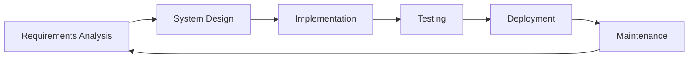
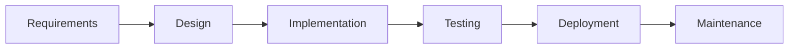
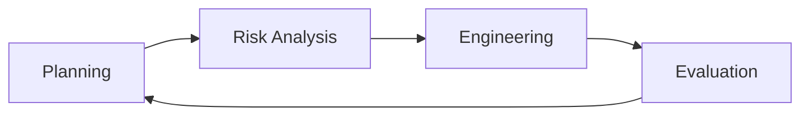
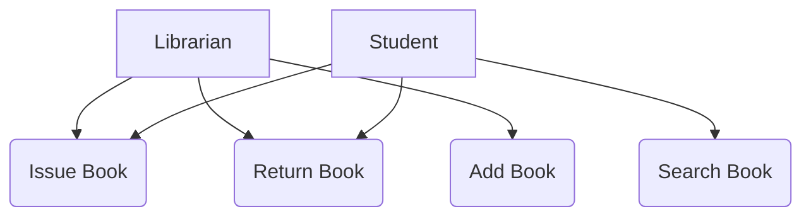
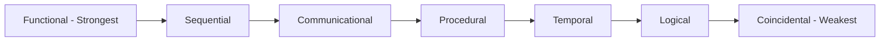
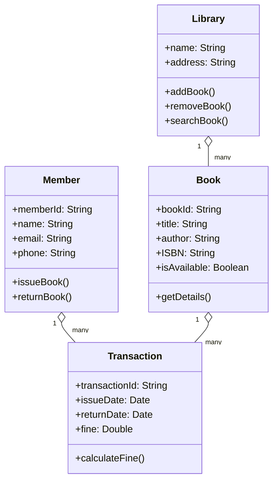

## Question 1(a) [3 marks]

**Enlist Software Application Domain and explain Embedded Software**

**Answer**:

**Software Application Domains:**

| Domain | Description |
|--------|-------------|
| **System Software** | Operating systems, device drivers |
| **Application Software** | Word processors, games, business apps |
| **Engineering/Scientific Software** | CAD, simulation tools |
| **Embedded Software** | Real-time control systems |
| **Web Applications** | Browser-based applications |
| **AI Software** | Machine learning, expert systems |

**Embedded Software** is specialized software that runs on embedded systems with dedicated hardware. It controls specific functions in devices like washing machines, cars, and medical equipment.

- **Real-time operation**: Must respond within strict time limits
- **Resource constraints**: Limited memory and processing power
- **Hardware dependency**: Closely integrated with specific hardware

**Mnemonic:** "SAEEWA" - System, Application, Engineering, Embedded, Web, AI

## Question 1(b) [4 marks]

**Explain Generic Framework activities and umbrella activities**

**Answer**:

**Generic Framework Activities:**

| Activity | Purpose |
|----------|---------|
| **Communication** | Gather requirements from stakeholders |
| **Planning** | Define work plan and schedule |
| **Modeling** | Create analysis and design models |
| **Construction** | Code generation and testing |
| **Deployment** | Software delivery and support |

**Umbrella Activities:**

| Activity | Purpose |
|----------|---------|
| **Project Management** | Track progress and control |
| **Risk Management** | Identify and mitigate risks |
| **Quality Assurance** | Ensure software quality |
| **Configuration Management** | Control changes |
| **Work Product Preparation** | Document creation |

- **Framework activities**: Core sequential activities in every project
- **Umbrella activities**: Continuous activities throughout project lifecycle

**Mnemonic:** "CPMCD" for Framework, "PRQCW" for Umbrella

## Question 1(c) [7 marks]

**Recreate the software development life cycle diagram and explain it's phases**

**Answer**:

**SDLC Diagram:**



**SDLC Phases:**

| Phase | Activities | Deliverables |
|-------|------------|--------------|
| **Requirements Analysis** | Gather user needs, create SRS | SRS Document |
| **System Design** | Architecture design, UI design | Design Document |
| **Implementation** | Code development, unit testing | Source Code |
| **Testing** | Integration, system testing | Test Reports |
| **Deployment** | Installation, user training | Deployed System |
| **Maintenance** | Bug fixes, enhancements | Updated System |

- **Systematic approach**: Each phase has specific inputs and outputs
- **Quality gates**: Reviews between phases ensure quality
- **Iterative nature**: Feedback improves subsequent cycles

**Mnemonic:** "Real Systems Implement Tests During Maintenance"

## Question 1(c) OR [7 marks]

**List software development models and explain any two models with necessary diagrams**

**Answer**:

**Software Development Models:**

| Model | Characteristics |
|-------|----------------|
| **Waterfall Model** | Sequential, linear approach |
| **Iterative Model** | Repeated cycles of development |
| **Spiral Model** | Risk-driven, iterative |
| **Agile Model** | Flexible, customer collaboration |
| **RAD Model** | Rapid prototyping |
| **V-Model** | Verification and validation focus |

**1. Waterfall Model:**



**2. Spiral Model:**



- **Waterfall**: Simple, suitable for well-understood requirements
- **Spiral**: Handles high-risk projects with iterative risk assessment

**Mnemonic:** "WIRRAV" - Waterfall, Iterative, RAD, Risk-driven, Agile, V-model

## Question 2(a) [3 marks]

**Differentiate SCRUM Agile process model with SPIRAL process model**

**Answer**:

| Aspect | SCRUM | SPIRAL |
|--------|-------|--------|
| **Approach** | Agile, iterative | Risk-driven, iterative |
| **Duration** | Fixed sprints (2-4 weeks) | Variable spiral cycles |
| **Focus** | Customer collaboration | Risk management |
| **Planning** | Sprint planning | Comprehensive planning |
| **Documentation** | Minimal documentation | Detailed documentation |
| **Team Size** | Small teams (5-9 members) | Any team size |

- **SCRUM**: Emphasizes rapid delivery and customer feedback
- **SPIRAL**: Focuses on risk identification and mitigation

**Mnemonic:** "SCRUM=Speed, SPIRAL=Safety"

## Question 2(b) [4 marks]

**List requirement gathering techniques and explain anyone**

**Answer**:

**Requirement Gathering Techniques:**

| Technique | Description |
|-----------|-------------|
| **Interviews** | Direct conversation with stakeholders |
| **Questionnaires** | Structured written questions |
| **Observation** | Watch users perform tasks |
| **Document Analysis** | Review existing documents |
| **Prototyping** | Build working models |
| **Brainstorming** | Group idea generation |

**Interview Technique Explained:**

- **Structured interviews**: Predetermined questions, formal approach
- **Unstructured interviews**: Open-ended discussion, flexible
- **Semi-structured**: Combination of both approaches

**Benefits**: Direct stakeholder input, clarification possible, detailed information
**Challenges**: Time-consuming, interviewer bias, incomplete information

**Mnemonic:** "IQDPBB" - Interview, Questionnaire, Document, Prototype, Brainstorm, Observe

## Question 2(c) [7 marks]

**Define use case diagram. Explain it with example**

**Answer**:

**Use Case Diagram Definition:**
A use case diagram shows the functional requirements of a system by depicting actors and their interactions with use cases.

**Components:**

| Component | Symbol | Purpose |
|-----------|--------|---------|
| **Actor** | Stick figure | External entity |
| **Use Case** | Oval | System function |
| **Association** | Line | Actor-use case relationship |
| **System Boundary** | Rectangle | System scope |

**Example: Library Management System**



**Relationships:**

- **Include**: Common functionality shared by use cases
- **Extend**: Optional functionality added to base use case
- **Generalization**: Inheritance between actors or use cases

**Benefits**: Clear functional overview, communication tool, basis for testing

**Mnemonic:** "Actors Use Cases Inside Systems"

## Question 2(a) OR [3 marks]

**Compare Water fall model and Iterative waterfall model**

**Answer**:

| Aspect | Waterfall Model | Iterative Waterfall |
|--------|----------------|-------------------|
| **Phases** | Sequential, one-time | Repeated in iterations |
| **Feedback** | At end of project | After each iteration |
| **Risk** | High risk detection late | Early risk identification |
| **Flexibility** | Rigid, no changes | Accommodates changes |
| **Testing** | After development | Continuous testing |
| **Delivery** | Single final delivery | Multiple incremental deliveries |

- **Waterfall**: Suitable for stable, well-defined requirements
- **Iterative Waterfall**: Better for evolving requirements with feedback

**Mnemonic:** "PFRTFD" - Phases, Feedback, Risk, Testing, Flexibility, Delivery

## Question 2(b) OR [4 marks]

**Define Functional and non-Functional Requirement and give examples of both**

**Answer**:

**Functional Requirements:**
Requirements that define what the system should do - specific behaviors and functions.

**Non-Functional Requirements:**
Requirements that define how the system should perform - quality attributes and constraints.

| Type | Functional | Non-Functional |
|------|------------|----------------|
| **Definition** | System behavior | System quality |
| **Examples** | Login, Calculate, Store | Performance, Security |
| **Testing** | Black-box testing | Load, stress testing |
| **Documentation** | Use cases, scenarios | Quality metrics |

**Functional Examples:**

- User authentication and login
- Calculate total bill amount
- Generate monthly reports

**Non-Functional Examples:**

- System response time < 2 seconds (Performance)
- 99.9% system availability (Reliability)  
- Support 1000 concurrent users (Scalability)

**Mnemonic:** "Functional=What, Non-Functional=How"

## Question 2(c) OR [7 marks]

**Define cohesion. Explain classification of cohesion**

**Answer**:

**Cohesion Definition:**
Cohesion measures how closely related elements within a module are. High cohesion indicates a well-designed module.

**Classification of Cohesion (Strongest to Weakest):**

| Type | Description | Example |
|------|-------------|---------|
| **Functional** | Single, well-defined task | Calculate square root |
| **Sequential** | Output of one = input of next | Read→Process→Write |
| **Communicational** | Operate on same data | Update customer record |
| **Procedural** | Follow sequence of execution | Process payroll steps |
| **Temporal** | Execute at same time | System initialization |
| **Logical** | Similar logical functions | All input/output operations |
| **Coincidental** | No meaningful relationship | Random utilities |



**Goal**: Achieve functional cohesion for maintainable, reliable modules

**Mnemonic:** "Frank's Smart Cat Plays Tennis Like Crazy"

## Question 3(a) [3 marks]

**List characteristics of good software design**

**Answer**:

**Characteristics of Good Software Design:**

| Characteristic | Description |
|----------------|-------------|
| **Modularity** | Divided into independent modules |
| **Abstraction** | Hide implementation details |
| **Encapsulation** | Bundle data and methods together |
| **Hierarchy** | Organized in layers/levels |
| **Simplicity** | Easy to understand and maintain |
| **Flexibility** | Accommodate future changes |

- **High cohesion**: Related elements grouped together
- **Low coupling**: Minimal dependencies between modules
- **Reusability**: Components can be reused in other systems

**Mnemonic:** "MAEHSF" - Modularity, Abstraction, Encapsulation, Hierarchy, Simplicity, Flexibility

## Question 3(b) [4 marks]

**Explain Project Estimation Techniques using intermediate COCOMO model**

**Answer**:

**Intermediate COCOMO Model:**
Extends basic COCOMO by considering cost drivers that affect productivity.

**Formula:**
Effort = a × (KLOC)^b × EAF

**Cost Drivers:**

| Category | Drivers | Impact |
|----------|---------|--------|
| **Product** | Reliability, Complexity | Effort multiplier |
| **Hardware** | Execution time, Storage | Performance constraints |
| **Personnel** | Analyst capability, Experience | Team skills |
| **Project** | Modern practices, Schedule | Development environment |

**Effort Adjustment Factor (EAF):**
EAF = Product of all cost driver multipliers

**Steps:**

1. Estimate KLOC (thousands of lines of code)
2. Select appropriate a, b values based on project type
3. Evaluate cost drivers (scale 0.70 to 1.65)
4. Calculate EAF
5. Apply formula to get effort in person-months

**Mnemonic:** "PHPP" - Product, Hardware, Personnel, Project drivers

## Question 3(c) [7 marks]

**Draw and explain level-1 Data flow diagram for Online shopping system**

**Answer**:

**Level-1 DFD for Online Shopping System:**

```goat
    +----------+                    +----------+
    |          |     Order Info     |          |
    |Customer  |<------------------>| Process  |
    |          |     Product Info   | Order    |
    +----------+                    +----------+
                                           |
                                           | Order Details
                                           v
    +----------+     Payment Info   +----------+
    |Payment   |<------------------>| Process  |
    |Gateway   |                    | Payment  |
    +----------+                    +----------+
                                           |
                                           | Inventory Update
                                           v
    +----------+     Stock Info     +----------+
    |Inventory |<------------------>| Manage   |
    |Manager   |                    |Inventory |
    +----------+                    +----------+
```

**Processes:**

| Process | Input | Output | Description |
|---------|-------|--------|-------------|
| **Process Order** | Customer order | Order confirmation | Handle order placement |
| **Process Payment** | Payment details | Payment status | Process transactions |
| **Manage Inventory** | Stock queries | Stock status | Track product availability |

**Data Stores:**

- **Product Database**: Store product information
- **Order Database**: Store order details
- **Customer Database**: Store customer profiles

**External Entities:**

- **Customer**: Places orders, makes payments
- **Payment Gateway**: Processes payments
- **Inventory Manager**: Updates stock levels

**Mnemonic:** "PPMI" - Process order, Process payment, Manage inventory

## Question 3(a) OR [3 marks]

**Differentiate analysis and design**

**Answer**:

| Aspect | Analysis | Design |
|--------|----------|--------|
| **Focus** | What system should do | How system will work |
| **Phase** | Requirements phase | Design phase |
| **Output** | Problem understanding | Solution structure |
| **Models** | Use cases, requirements | Architecture, classes |
| **Perspective** | User's viewpoint | Developer's viewpoint |
| **Level** | Abstract, conceptual | Concrete, detailed |

- **Analysis**: Problem-focused, understanding requirements
- **Design**: Solution-focused, creating system architecture

**Mnemonic:** "Analysis=WHAT, Design=HOW"

## Question 3(b) OR [4 marks]

**Explain Project Estimation Techniques using basic COCOMO model**

**Answer**:

**Basic COCOMO Model:**
Estimates software development effort based on lines of code.

**Formula:**

- Effort = a × (KLOC)^b person-months
- Time = c × (Effort)^d months

**Project Types:**

| Type | a | b | c | d | Description |
|------|---|---|---|---|-------------|
| **Organic** | 2.4 | 1.05 | 2.5 | 0.38 | Small, experienced team |
| **Semi-detached** | 3.0 | 1.12 | 2.5 | 0.35 | Medium size, mixed team |
| **Embedded** | 3.6 | 1.20 | 2.5 | 0.32 | Complex, tight constraints |

**Steps:**

1. Estimate KLOC (thousands of lines of code)
2. Identify project type (organic/semi-detached/embedded)
3. Apply appropriate coefficients
4. Calculate effort and development time

**Example**: 10 KLOC organic project

- Effort = 2.4 × (10)^1.05 = 25.2 person-months
- Time = 2.5 × (25.2)^0.38 = 8.4 months

**Mnemonic:** "OSE" - Organic, Semi-detached, Embedded

## Question 3(c) OR [7 marks]

**Draw and explain Class Diagram for Library Management system**

**Answer**:

**Class Diagram for Library Management System:**



**Relationships:**

| Relationship | Description | Multiplicity |
|--------------|-------------|--------------|
| **Library-Book** | Library contains books | 1 to many |
| **Member-Transaction** | Member has transactions | 1 to many |
| **Book-Transaction** | Book involved in transactions | 1 to many |

**Key Features:**

- **Attributes**: Data members of each class
- **Methods**: Functions that operate on class data
- **Associations**: Relationships between classes showing how they interact

**Mnemonic:** "LBMT" - Library, Book, Member, Transaction

## Question 4(a) [3 marks]

**List Project Size Estimation Metrics and define them**

**Answer**:

**Project Size Estimation Metrics:**

| Metric | Definition | Usage |
|--------|------------|-------|
| **Lines of Code (LOC)** | Count of executable code lines | Traditional sizing |
| **Function Points (FP)** | Measure based on functionality | Language-independent |
| **Feature Points** | Extended function points | Real-time systems |
| **Object Points** | Count of objects and methods | Object-oriented systems |
| **Use Case Points** | Based on use case complexity | Requirements-based |

**Function Points Components:**

- **External Inputs**: Data entry screens
- **External Outputs**: Reports, messages
- **External Inquiries**: Interactive queries
- **Internal Files**: Master files
- **External Interfaces**: Shared data

**Benefits**: Early estimation, technology-independent, standardized approach

**Mnemonic:** "LFFOU" - LOC, Function Points, Feature Points, Object Points, Use Case Points

## Question 4(b) [4 marks]

**Explain Risk identification in detail**

**Answer**:

**Risk Identification:**
Process of finding, recognizing, and describing potential risks that could affect project success.

**Risk Categories:**

| Category | Examples | Impact |
|----------|----------|--------|
| **Technical** | New technology, complexity | Development delays |
| **Project** | Schedule, budget constraints | Cost overruns |
| **Business** | Market changes, competition | Project cancellation |
| **External** | Vendor issues, regulations | Dependencies |

**Identification Techniques:**

- **Brainstorming**: Team discussions to identify risks
- **Checklists**: Standard risk categories review
- **Expert judgment**: Experience-based identification
- **SWOT analysis**: Strengths, Weaknesses, Opportunities, Threats

**Risk Register:**
Document containing identified risks with:

- Risk description
- Probability of occurrence
- Impact severity
- Risk category
- Responsible person

**Mnemonic:** "TPBE" - Technical, Project, Business, External risks

## Question 4(c) [7 marks]

**Prepare Gantt Chart for any system of your choice**

**Answer**:

**Gantt Chart for Online Banking System:**

| Task | Week 1 | Week 2 | Week 3 | Week 4 | Week 5 | Week 6 | Week 7 | Week 8 |
|------|--------|--------|--------|--------|--------|--------|--------|--------|
| **Requirements Analysis** | ████████ | ████████ | | | | | | |
| **System Design** | | ████████ | ████████ | | | | | |
| **Database Design** | | | ████████ | ████████ | | | | |
| **UI Development** | | | | ████████ | ████████ | | | |
| **Backend Development** | | | | | ████████ | ████████ | | |
| **Testing** | | | | | | ████████ | ████████ | |
| **Deployment** | | | | | | | ████████ | ████████ |

**Project Tasks:**

| Task | Duration | Dependencies | Resources |
|------|----------|--------------|-----------|
| **Requirements Analysis** | 2 weeks | None | Business Analyst |
| **System Design** | 2 weeks | Requirements | System Designer |
| **Database Design** | 2 weeks | System Design | Database Designer |
| **UI Development** | 2 weeks | System Design | UI Developer |
| **Backend Development** | 2 weeks | Database Design | Backend Developer |
| **Testing** | 2 weeks | UI + Backend | QA Tester |
| **Deployment** | 2 weeks | Testing | DevOps Engineer |

**Benefits**: Visual progress tracking, resource allocation, dependency management

**Mnemonic:** "RSDUBtd" - Requirements, System design, Database, UI, Backend, Testing, Deployment

## Question 4(a) OR [3 marks]

**List Responsibilities of Project manager**

**Answer**:

**Project Manager Responsibilities:**

| Area | Responsibilities |
|------|-----------------|
| **Planning** | Create project plans, define scope |
| **Organizing** | Allocate resources, form teams |
| **Leading** | Motivate team, resolve conflicts |
| **Controlling** | Monitor progress, manage changes |
| **Communication** | Stakeholder updates, team coordination |
| **Risk Management** | Identify and mitigate risks |

**Key Activities:**

- **Project initiation**: Define objectives and constraints
- **Schedule management**: Create and maintain timelines
- **Budget control**: Monitor costs and expenses
- **Quality assurance**: Ensure deliverable standards
- **Team management**: Lead and develop team members

**Mnemonic:** "POLCR" - Planning, Organizing, Leading, Controlling, Risk management

## Question 4(b) OR [4 marks]

**Explain Risk Assessment in detail**

**Answer**:

**Risk Assessment:**
Process of evaluating identified risks to determine their probability and impact on project success.

**Assessment Components:**

| Component | Scale | Description |
|-----------|-------|-------------|
| **Probability** | 1-5 or % | Likelihood of risk occurrence |
| **Impact** | 1-5 or $ | Severity if risk occurs |
| **Risk Score** | P × I | Overall risk priority |

**Risk Assessment Matrix:**

| Probability/Impact | Low (1) | Medium (2) | High (3) |
|-------------------|---------|------------|-----------|
| **Low (1)** | 1 | 2 | 3 |
| **Medium (2)** | 2 | 4 | 6 |
| **High (3)** | 3 | 6 | 9 |

**Assessment Techniques:**

- **Qualitative assessment**: Descriptive scales (High/Medium/Low)
- **Quantitative assessment**: Numerical values and calculations
- **Expert judgment**: Experience-based evaluation
- **Historical data**: Past project analysis

**Risk Categorization:**

- **High risk** (7-9): Immediate attention required
- **Medium risk** (4-6): Monitor and plan mitigation
- **Low risk** (1-3): Accept or minimal mitigation

**Mnemonic:** "PIS" - Probability, Impact, Score

## Question 4(c) OR [7 marks]

**Prepare Sprint burn down chart for any system of your choice**

**Answer**:

**Sprint Burn Down Chart for E-commerce Mobile App (2-week Sprint):**

```goat
Story Points
    |
 40 +---*
    |    \
 35 +     *
    |      \
 30 +       *
    |        \
 25 +         *---*
    |              \
 20 +               *
    |                \
 15 +                 *
    |                  \
 10 +                   *
    |                    \
  5 +                     *
    |                      \
  0 +________________________*
    1  2  3  4  5  6  7  8  9  10 Days
    
    * = Actual Progress
    --- = Ideal Progress
```

**Sprint Details:**

| Day | Ideal Remaining | Actual Remaining | Work Completed |
|-----|----------------|------------------|----------------|
| **Day 1** | 36 | 40 | Sprint planning |
| **Day 2** | 32 | 35 | User login feature |
| **Day 3** | 28 | 30 | Product catalog |
| **Day 4** | 24 | 25 | Shopping cart |
| **Day 5** | 20 | 25 | Blocked by API issue |
| **Day 6** | 16 | 20 | Payment integration |
| **Day 7** | 12 | 15 | Order management |
| **Day 8** | 8 | 10 | Testing and fixes |
| **Day 9** | 4 | 5 | Final testing |
| **Day 10** | 0 | 0 | Sprint completed |

**Key Insights:**

- **Slope**: Progress rate compared to ideal
- **Flat areas**: Blocked work or scope changes
- **Below ideal**: Ahead of schedule
- **Above ideal**: Behind schedule

**Mnemonic:** "DABC" - Days, Actual, Burn-down, Chart

## Question 5(a) [3 marks]

**List Code Review Techniques and explain anyone**

**Answer**:

**Code Review Techniques:**

| Technique | Description | Participants |
|-----------|-------------|--------------|
| **Code Walkthrough** | Informal review by author | Author + reviewers |
| **Code Inspection** | Formal, systematic review | Trained inspectors |
| **Peer Review** | Colleague examines code | Developer peers |
| **Tool-based Review** | Automated analysis | Tools + developers |

**Code Inspection Explained:**

**Process:**

1. **Planning**: Select code, assign roles
2. **Overview**: Author explains code structure
3. **Preparation**: Individual review of code
4. **Inspection meeting**: Group examines code
5. **Rework**: Fix identified defects
6. **Follow-up**: Verify corrections

**Roles:**

- **Moderator**: Leads the inspection process
- **Author**: Code developer, explains logic
- **Reviewers**: Find defects and issues
- **Recorder**: Documents findings

**Benefits**: High defect detection rate, knowledge sharing, improved code quality

**Mnemonic:** "CWIP" - Code Walkthrough, Inspection, Peer review

## Question 5(b) [4 marks]

**Prepare test cases for online shopping system**

**Answer**:

**Test Cases for Online Shopping System:**

| Test Case ID | Test Scenario | Test Steps | Expected Result |
|-------------|---------------|------------|-----------------|
| **TC001** | User Registration | 1. Enter valid details<br>2. Click Register | Account created successfully |
| **TC002** | User Login | 1. Enter username/password<br>2. Click Login | User logged in |
| **TC003** | Add to Cart | 1. Select product<br>2. Click Add to Cart | Product added to cart |
| **TC004** | Checkout Process | 1. Go to cart<br>2. Click Checkout<br>3. Enter payment details | Order placed successfully |

**Detailed Test Case Example:**

**Test Case ID**: TC003
**Test Title**: Add Product to Shopping Cart
**Pre-conditions**: User is logged in, product is available
**Test Steps**:

1. Navigate to product catalog
2. Select a product
3. Choose quantity
4. Click "Add to Cart" button

**Expected Result**: Product appears in cart with correct quantity and price
**Post-conditions**: Cart count increases, total amount updates

**Mnemonic:** "RAULC" - Registration, Authentication, User cart, Login, Checkout

## Question 5(c) [7 marks]

**Define White box technique. List various white box technique. Explain any two**

**Answer**:

**White Box Testing Definition:**
Testing technique that examines internal code structure, logic paths, and implementation details.

**White Box Techniques:**

| Technique | Coverage Criteria | Purpose |
|-----------|------------------|---------|
| **Statement Coverage** | All statements executed | Basic code coverage |
| **Branch Coverage** | All branches taken | Decision testing |
| **Path Coverage** | All paths executed | Complete flow testing |
| **Condition Coverage** | All conditions tested | Logical expression testing |
| **Loop Testing** | All loop variations | Iterative structure testing |

**1. Statement Coverage:**
Ensures every executable statement in code is executed at least once.

**Formula**: (Executed statements / Total statements) × 100%

**Example:**
```
if (x > 0)        // Statement 1
    y = x + 1;    // Statement 2
else
    y = x - 1;    // Statement 3
z = y * 2;        // Statement 4
```

**Test Cases**: x = 5 (covers statements 1,2,4), x = -1 (covers statements 1,3,4)
**Coverage**: 100% statement coverage achieved

**2. Branch Coverage:**
Ensures every branch (true/false) of decision points is executed.

**Example:**
```
if (a > b && c > d)    // Two conditions
    result = 1;        // True branch
else
    result = 0;        // False branch
```

**Test Cases**:

- a=5, b=3, c=7, d=2 (true branch)
- a=1, b=3, c=7, d=2 (false branch)

**Benefits**: Higher defect detection than statement coverage

**Mnemonic:** "SBPCL" - Statement, Branch, Path, Condition, Loop

## Question 5(a) OR [3 marks]

**Explain software documentation**

**Answer**:

**Software Documentation:**
Written material that describes software system, its design, implementation, and usage.

**Types of Documentation:**

| Type | Purpose | Audience |
|------|---------|----------|
| **Internal Documentation** | Code understanding | Developers |
| **External Documentation** | System usage | Users, operators |
| **System Documentation** | Design and architecture | Maintainers |
| **User Documentation** | Operation instructions | End users |

**Internal Documentation:**

- **Comments**: Explain code logic and purpose  
- **Code structure**: Class and method descriptions
- **Design rationale**: Why specific approaches chosen

**External Documentation:**

- **User manuals**: Step-by-step usage instructions
- **Installation guides**: Setup procedures
- **API documentation**: Interface specifications

**Benefits**: Easier maintenance, knowledge transfer, reduced training time

**Mnemonic:** "IESU" - Internal, External, System, User documentation

## Question 5(b) OR [4 marks]

**Prepare at least 4 test cases for ATM System**

**Answer**:

**Test Cases for ATM System:**

| Test Case ID | Test Scenario | Test Steps | Expected Result |
|-------------|---------------|------------|-----------------|
| **TC001** | Valid PIN Entry | 1. Insert card<br>2. Enter correct PIN<br>3. Press Enter | Access granted to main menu |
| **TC002** | Invalid PIN Entry | 1. Insert card<br>2. Enter wrong PIN<br>3. Press Enter | "Invalid PIN" message displayed |
| **TC003** | Cash Withdrawal | 1. Login successfully<br>2. Select "Withdraw Cash"<br>3. Enter amount<br>4. Confirm | Cash dispensed, balance updated |
| **TC004** | Insufficient Balance | 1. Login successfully<br>2. Select "Withdraw Cash"<br>3. Enter amount > balance | "Insufficient funds" message |

**Detailed Test Case:**

**Test Case ID**: TC003
**Test Description**: Withdraw cash with sufficient balance
**Pre-conditions**: Valid ATM card, sufficient account balance
**Test Data**: PIN=1234, Withdrawal amount=₹1000, Account balance=₹5000

**Post-conditions**: Account balance reduced by ₹1000, transaction recorded

**Mnemonic:** "VPCI" - Valid PIN, PIN error, Cash withdrawal, Insufficient funds

## Question 5(c) OR [7 marks]

**Enlist all black box testing methodologies. Explain why it is known as functional testing? Explain at least 2 methods with diagram**

**Answer**:

**Black Box Testing Methodologies:**

| Method | Purpose | Input Focus |
|--------|---------|-------------|
| **Equivalence Partitioning** | Divide inputs into classes | Valid/invalid partitions |
| **Boundary Value Analysis** | Test edge values | Boundary conditions |
| **Decision Table Testing** | Complex business rules | Multiple input combinations |
| **State Transition Testing** | State-based systems | State changes |
| **Use Case Testing** | Functional scenarios | User interactions |
| **Error Guessing** | Experience-based testing | Likely error conditions |

**Why called Functional Testing?**
Black box testing focuses on **what the system does** rather than **how it works**. It validates functional requirements by testing inputs and expected outputs without knowledge of internal code structure.

**1. Equivalence Partitioning:**

```goat
Input Range: Age (0-120)

Valid Partition:     Invalid Partitions:
   18-65 years       <0   0-17   66-120   >120
      |                |     |      |       |
      v                v     v      v       v
   [VALID]         [INVALID INPUTS]
```

**Example**: Age validation for job application

- **Valid partition**: 18-65 years
- **Invalid partitions**: <0, 0-17, 66-120, >120
- **Test cases**: One from each partition (e.g., 25, -5, 10, 70, 130)

**2. Boundary Value Analysis:**

```goat
    Input Range: Score (0-100)
    
    Invalid  |  Valid Range  | Invalid
      -1  0  |  1    99  100 | 101
       |  |  |   |    |   |  |  |
       v  v  v   v    v   v  v  v
    [Test boundary values]
```

**Example**: Student score validation (0-100)

- **Test values**: -1, 0, 1, 50, 99, 100, 101
- **Focus**: Just inside and outside boundaries
- **Rationale**: Most errors occur at boundaries

**Benefits:**

- **Independence**: No programming knowledge required
- **User perspective**: Tests from user's viewpoint  
- **Requirement validation**: Verifies functional specifications

**Mnemonic:** "EBDSUE" - Equivalence, Boundary, Decision, State, Use case, Error guessing
