## પ્રશ્ન 1(અ) [3 ગુણ]

**સોફ્ટવૅર ની વ્યાખ્યા આપો અને તેની લાક્ષણિકતા સમજાવો.**

**જવાબ**:

**સોફ્ટવૅર** એ કમ્પ્યુટર પ્રોગ્રામ્સ, પ્રક્રિયાઓ અને દસ્તાવેજીકરણનો સમૂહ છે જે કમ્પ્યુટર સિસ્ટમ પર કાર્યો કરે છે.

**ટેબલ: સોફ્ટવૅર લાક્ષણિકતાઓ**

| લાક્ષણિકતા | વર્ણન |
|---|---|
| **અસ્પર્શ્ય** | સ્પર્શ કરી શકાતું નથી, માત્ર અનુભવી શકાય છે |
| **વિકસિત** | એન્જિનિયર્ડ, મેન્યુફેક્ચર્ડ નહીં |
| **જાળવણીયોગ્ય** | સુધારણા અને અપડેટ કરી શકાય છે |
| **વિશ્વસનીય** | સતત કામ કરવું જોઈએ |
| **કાર્યક્ષમ** | સાધનોનો શ્રેષ્ઠ ઉપયોગ કરે છે |

- **મુખ્ય મુદ્દો**: સોફ્ટવૅર = પ્રોગ્રામ્સ + દસ્તાવેજીકરણ + પ્રક્રિયાઓ
- **મેમરી ટ્રીક:** "I Don't Make Reliable Electronics"

---

## પ્રશ્ન 1(બ) [4 ગુણ]

**ક્લાસિકલ વોટરફોલ મોડેલ સમજાવો.**

**જવાબ**:

**વોટરફોલ મોડેલ** એ રેખીય ક્રમિક સોફ્ટવૅર વિકાસ પદ્ધતિ છે જ્યાં દરેક તબક્કો પૂર્ણ થયા પછી જ આગળનો તબક્કો શરૂ થાય છે.

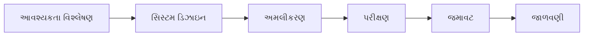

**મુખ્ય લક્ષણો**:

- **ક્રમિક તબક્કાઓ**: તબક્કાઓ વચ્ચે કોઈ ઓવરલેપ નથી
- **દસ્તાવેજીકરણ આધારિત**: દરેક તબક્કે ભારે દસ્તાવેજીકરણ
- **સરળ માળખું**: સમજવા અને મેનેજ કરવા સરળ
- **નિશ્ચિત આવશ્યકતાઓ**: એકવાર શરૂ થયા પછી ફેરફાર મુશ્કેલ

**મેમરી ટ્રીક:** "Real Systems Include Testing, Deployment, Maintenance"

---

## પ્રશ્ન 1(ક) [7 ગુણ]

**સોફ્ટવૅર પ્રોસેસ ફ્રેમવર્ક અને અમ્બ્રેલા એક્ટિવિટી સમજાવો.**

**જવાબ**:

**સોફ્ટવૅર પ્રોસેસ ફ્રેમવર્ક** મુખ્ય પ્રોસેસ વિસ્તારો ઓળખીને સંપૂર્ણ સોફ્ટવૅર એન્જિનિયરિંગ પ્રોસેસ માટે પાયો પ્રદાન કરે છે.

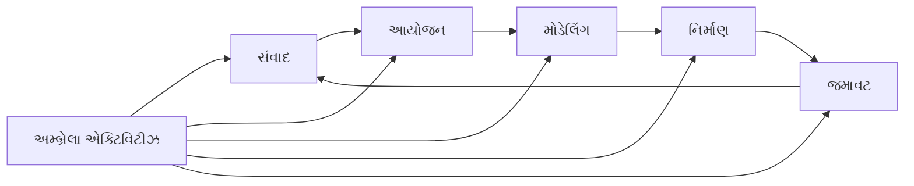

**ટેબલ: ફ્રેમવર્ક એક્ટિવિટીઝ વિ અમ્બ્રેલા એક્ટિવિટીઝ**

| ફ્રેમવર્ક એક્ટિવિટીઝ | અમ્બ્રેલા એક્ટિવિટીઝ |
|---|---|
| સંવાદ | સોફ્ટવૅર પ્રોજેક્ટ ટ્રેકિંગ |
| આયોજન | જોખમ મેનેજમેન્ટ |
| મોડેલિંગ | ગુણવત્તા ખાતરી |
| નિર્માણ | તકનીકી સમીક્ષાઓ |
| જમાવટ | કન્ફિગરેશન મેનેજમેન્ટ |

**ફ્રેમવર્ક એક્ટિવિટીઝ**:

- **સંવાદ**: સ્ટેકહોલ્ડર્સ પાસેથી આવશ્યકતાઓ એકત્રિત કરવી
- **આયોજન**: પ્રોજેક્ટ પ્લાન અને શેડ્યુલ બનાવવું
- **મોડેલિંગ**: ડિઝાઇન મોડેલ્સ બનાવવા
- **નિર્માણ**: કોડ જનરેશન અને પરીક્ષણ
- **જમાવટ**: સોફ્ટવૅર ડિલિવરી અને ફીડબેક

**અમ્બ્રેલા એક્ટિવિટીઝ** પ્રોજેક્ટ દરમિયાન ચાલે છે:

- **પ્રોજેક્ટ ટ્રેકિંગ**: પ્રગતિ નિરીક્ષણ
- **જોખમ મેનેજમેન્ટ**: જોખમો ઓળખવા અને નિયંત્રિત કરવા
- **ગુણવત્તા ખાતરી**: ગુણવત્તા ધોરણો સુનિશ્ચિત કરવા
- **કન્ફિગરેશન મેનેજમેન્ટ**: ફેરફારો નિયંત્રિત કરવા

**મેમરી ટ્રીક:** "Can People Make Construction Deploy"

---

## પ્રશ્ન 1(ક) OR [7 ગુણ]

**SCRUM મોડેલ પર ટૂંક નોંધ લખો.**

**જવાબ**:

**SCRUM** એ પુનરાવર્તક અને વૃદ્ધિશીલ પ્રથાઓનો ઉપયોગ કરીને સોફ્ટવૅર વિકાસ પ્રોજેક્ટ્સનું મેનેજમેન્ટ કરવા માટેનું એક agile ફ્રેમવર્ક છે.

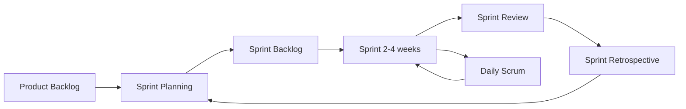

**ટેબલ: SCRUM ભૂમિકાઓ અને આર્ટિફેક્ટ્સ**

| ઘટક | વર્ણન |
|---|---|
| **Product Owner** | આવશ્યકતાઓ અને પ્રાથમિકતાઓ વ્યાખ્યાયિત કરે છે |
| **Scrum Master** | પ્રક્રિયાને સુવિધા આપે છે અને અવરોધો દૂર કરે છે |
| **Development Team** | સ્વ-સંગઠિત ટીમ જે પ્રોડક્ટ બનાવે છે |
| **Product Backlog** | લક્ષણોની પ્રાથમિકતા આપેલી યાદી |
| **Sprint Backlog** | વર્તમાન sprint માટે પસંદ કરેલા કાર્યો |

**મુખ્ય ઇવેન્ટ્સ**:

- **Sprint Planning**: આગામી sprint માટે કામ પસંદ કરવું
- **Daily Scrum**: 15-મિનિટનું દૈનિક સિંક્રોનાઇઝેશન
- **Sprint Review**: પૂર્ણ થયેલ કામ દર્શાવવું
- **Sprint Retrospective**: પ્રક્રિયા પર વિચાર કરવો અને સુધારવું

**ફાયદાઓ**: ઝડપી ડિલિવરી, લવચીકતા, સતત સુધારણા, ગ્રાહક સહયોગ

**મેમરી ટ્રીક:** "People Sprint Daily Reviewing Retrospectively"

---

## પ્રશ્ન 2(અ) [3 ગુણ]

**સારા SRS ની લાક્ષણિકતા સમજાવો.**

**જવાબ**:

**SRS (સોફ્ટવૅર આવશ્યકતા વિશિષ્ટતા)** દસ્તાવેજ અસરકારક બનવા માટે વિશિષ્ટ ગુણો હોવા જોઈએ.

**ટેબલ: સારા SRS લાક્ષણિકતાઓ**

| લાક્ષણિકતા | અર્થ |
|---|---|
| **સંપૂર્ણ** | બધી આવશ્યકતાઓ સમાવેશ |
| **સુસંગત** | કોઈ વિરોધાભાસી આવશ્યકતાઓ નથી |
| **અસ્પષ્ટ નથી** | સ્પષ્ટ અને એક અર્થઘટન |
| **ચકાસણીયોગ્ય** | પરીક્ષણ અને વેલિડેશન શક્ય |
| **સુધારણાયોગ્ય** | જરૂર પડે ત્યારે બદલવા સરળ |

- **સંપૂર્ણ**: બધી functional અને non-functional આવશ્યકતાઓ સમાવે છે
- **સુસંગત**: વિવિધ આવશ્યકતાઓ વચ્ચે કોઈ સંઘર્ષ નથી
- **અસ્પષ્ટ નથી**: દરેક આવશ્યકતાનો માત્ર એક જ અર્થઘટન છે

**મેમરી ટ્રીક:** "Complete Computers Use Verified Modifications"

---

## પ્રશ્ન 2(બ) [4 ગુણ]

**પ્રોટોટાઇપ મોડેલના લાભ અને ગેરલાભ વર્ણવો.**

**જવાબ**:

**પ્રોટોટાઇપ મોડેલ** આવશ્યકતાઓને વધુ સારી રીતે સમજવા માટે સોફ્ટવૅરનું કાર્યકારી મોડેલ બનાવે છે.

**ટેબલ: પ્રોટોટાઇપ મોડેલ - ફાયદા અને ગેરફાયદા**

| ફાયદા | ગેરફાયદા |
|---|---|
| **આવશ્યકતા સમજણ સુધારે છે** | **સમયનો વધારે ખર્ચ** |
| **વપરાશકર્તા સામેલગીરી** | **ખર્ચમાં વધારો** |
| **પ્રારંભિક ભૂલ શોધ** | **અપૂર્ણ વિશ્લેષણ** |
| **વપરાશકર્તા સંતુષ્ટિ** | **પ્રોટોટાઇપ મૂંઝવણ** |

**ફાયદા**:

- **સ્પષ્ટ આવશ્યકતાઓ**: વપરાશકર્તા કાર્યકારી મોડેલ જુએ છે
- **પ્રારંભિક ફીડબેક**: અંતિમ પ્રોડક્ટના જોખમો ઘટાડે છે
- **વપરાશકર્તાનો સમાવેશ**: વધુ સારી વપરાશકર્તા સ્વીકૃતિ

**ગેરફાયદા**:

- **વધારાનો સમય**: પ્રોટોટાઇપ બનાવવામાં સમય લાગે છે
- **વધારાનો ખર્ચ**: પ્રોટોટાઇપ માટે સાધનોની જરૂર
- **અવકાશ વિસ્તરણ**: વપરાશકર્તા પ્રોટોટાઇપના ફીચર્સની અપેક્ષા રાખી શકે છે

**મેમરી ટ્રીક:** "Better Users Experience" વિ "Time Costs Increase"

---

## પ્રશ્ન 2(ક) [7 ગુણ]

**સ્પાઇરલ મોડેલ ડિઝાઇન વર્ણવો અને તેના લાભ અને ગેરલાભ વિશે લખો.**

**જવાબ**:

**સ્પાઇરલ મોડેલ** પુનરાવર્તક વિકાસને વ્યવસ્થિત જોખમ મેનેજમેન્ટ સાથે પુનરાવર્તિત ચક્રો દ્વારા જોડે છે.

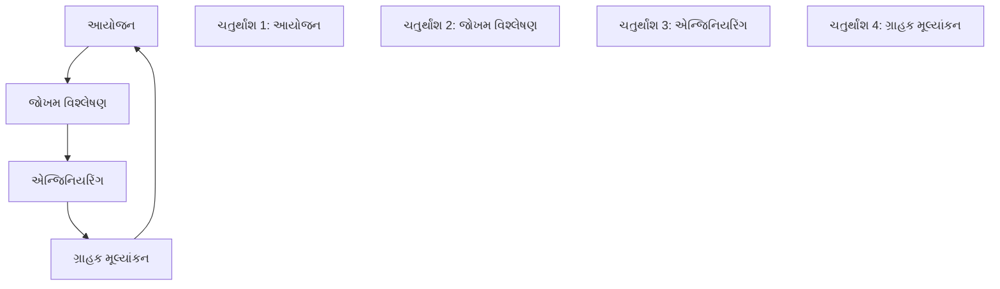

**ટેબલ: સ્પાઇરલ મોડેલ તબક્કાઓ**

| તબક્કો | પ્રવૃત્તિઓ |
|---|---|
| **આયોજન** | આવશ્યકતા એકત્રીકરણ, સાધન આયોજન |
| **જોખમ વિશ્લેષણ** | જોખમો ઓળખવા અને ઉકેલવા |
| **એન્જિનિયરિંગ** | વિકાસ અને પરીક્ષણ |
| **ગ્રાહક મૂલ્યાંકન** | ગ્રાહક સમીક્ષા અને ફીડબેક |

**ફાયદા**:

- **જોખમ મેનેજમેન્ટ**: પ્રારંભિક જોખમ ઓળખ
- **લવચીકતા**: ફેરફારો સરળતાથી સમાવે છે
- **ગ્રાહક સામેલગીરી**: નિયમિત ગ્રાહક ફીડબેક
- **ગુણવત્તા ફોકસ**: સતત પરીક્ષણ અને વેલિડેશન

**ગેરફાયદા**:

- **જટિલ મેનેજમેન્ટ**: મેનેજ કરવું મુશ્કેલ
- **ઊંચો ખર્ચ**: જોખમ વિશ્લેષણને કારણે મોંઘું
- **સમય લેતું**: લાંબા વિકાસ ચક્રો
- **જોખમ નિપુણતા જરૂરી**: જોખમ મૂલ્યાંકન કૌશલ્યની જરૂર

**શ્રેષ્ઠ માટે**: મોટા, જટિલ, ઉચ્ચ-જોખમ પ્રોજેક્ટ્સ

**મેમરી ટ્રીક:** "Plan Risks Engineering Customer" તબક્કાઓ માટે

---

## પ્રશ્ન 2(અ) OR [3 ગુણ]

**ઇન્ક્રિમેન્ટલ મોડેલ સમજાવો.**

**જવાબ**:

**ઇન્ક્રિમેન્ટલ મોડેલ** સોફ્ટવૅરને નાના, કાર્યાત્મક ટુકડાઓમાં જે ઇન્ક્રિમેન્ટ્સ કહેવાય છે તેમાં ડિલિવર કરે છે.


**મુખ્ય લક્ષણો**:

- **આંશિક અમલીકરણ**: દરેક ઇન્ક્રિમેન્ટ કાર્યક્ષમતા ઉમેરે છે
- **પ્રારંભિક ડિલિવરી**: મુખ્ય ફીચર્સ પ્રથમ ડિલિવર થાય છે
- **સમાંતર વિકાસ**: અનેક ઇન્ક્રિમેન્ટ્સ એકસાથે વિકસાવી શકાય છે

**ટેબલ: ઇન્ક્રિમેન્ટલ મોડેલ લાક્ષણિકતાઓ**

| પાસું | વર્ણન |
|---|---|
| **ડિલિવરી** | અનેક રિલીઝ |
| **કાર્યક્ષમતા** | દરેક ઇન્ક્રિમેન્ટ સાથે વધે છે |
| **જોખમ** | પ્રારંભિક ડિલિવરી દ્વારા ઘટે છે |
| **ફીડબેક** | સતત વપરાશકર્તા ફીડબેક |

**મેમરી ટ્રીક:** "Deliver Functionality Reducing Feedback"

---

## પ્રશ્ન 2(બ) OR [4 ગુણ]

**રેપિડ એપ્લિકેશન ડેવલપમેન્ટ મોડેલનો ખ્યાલ આપી સમજાવો.**

**જવાબ**:

**RAD (રેપિડ એપ્લિકેશન ડેવલપમેન્ટ)** વ્યાપક આયોજનને બદલે ઝડપી પ્રોટોટાઇપિંગ અને ઝડપી ફીડબેક પર ભાર મૂકે છે.

**ટેબલ: RAD મોડેલ તબક્કાઓ**

| તબક્કો | અવધિ | પ્રવૃત્તિઓ |
|---|---|---|
| **બિઝનેસ મોડેલિંગ** | ટૂંકી | બિઝનેસ કાર્યો વ્યાખ્યાયિત કરવા |
| **ડેટા મોડેલિંગ** | ટૂંકી | ડેટા આવશ્યકતાઓ વ્યાખ્યાયિત કરવી |
| **પ્રોસેસ મોડેલિંગ** | ટૂંકી | ડેટાને બિઝનેસ માહિતીમાં રૂપાંતરિત કરવું |
| **એપ્લિકેશન જનરેશન** | ટૂંકી | સોફ્ટવૅર બનાવવા માટે ટૂલ્સનો ઉપયોગ |
| **ટેસ્ટિંગ અને ટર્નઓવર** | ટૂંકી | પરીક્ષણ અને જમાવટ |

**મુખ્ય ખ્યાલો**:

- **પુનઃઉપયોગી ઘટકો**: પૂર્વ-નિર્મિત ઘટકો વિકાસ ગતિ વધારે છે
- **શક્તિશાળી ટૂલ્સ**: CASE ટૂલ્સ અને કોડ જનરેટર્સ
- **નાની ટીમો**: પ્રતિ ટીમ 2-6 લોકો
- **સમય-બોક્સ્ડ**: કડક સમય મર્યાદા (60-90 દિવસ)

**RAD માટેની આવશ્યકતાઓ**:

- **સારી રીતે વ્યાખ્યાયિત બિઝનેસ આવશ્યકતાઓ**
- **વપરાશકર્તાની સામેલગીરી** સમગ્ર પ્રક્રિયા દરમિયાન
- **કુશળ ડેવલપર્સ** જે RAD ટૂલ્સથી પરિચિત છે

**મેમરી ટ્રીક:** "Business Data Process Application Testing"

---

## પ્રશ્ન 2(ક) OR [7 ગુણ]

**SDLC ને વ્યાખ્યાયિત કરો અને દરેક તબક્કા સમજાવો.**

**જવાબ**:

**SDLC (સોફ્ટવૅર ડેવલપમેન્ટ લાઇફ સાઇકલ)** સારી રીતે વ્યાખ્યાયિત તબક્કાઓ દ્વારા સોફ્ટવૅર બનાવવાની વ્યવસ્થિત પ્રક્રિયા છે.

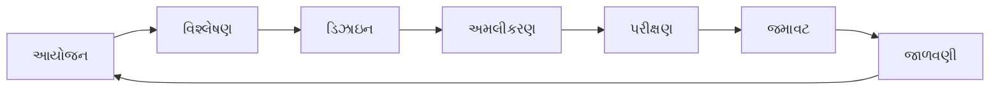

**ટેબલ: SDLC તબક્કાઓ વિગતવાર**

| તબક્કો | પ્રવૃત્તિઓ | ડિલિવરેબલ્સ |
|---|---|---|
| **આયોજન** | પ્રોજેક્ટ આયોજન, શક્યતા અભ્યાસ | પ્રોજેક્ટ પ્લાન |
| **વિશ્લેષણ** | આવશ્યકતા એકત્રીકરણ | SRS દસ્તાવેજ |
| **ડિઝાઇન** | સિસ્ટમ આર્કિટેક્ચર, UI ડિઝાઇન | ડિઝાઇન દસ્તાવેજ |
| **અમલીકરણ** | કોડિંગ, યુનિટ ટેસ્ટિંગ | સોર્સ કોડ |
| **પરીક્ષણ** | સિસ્ટમ ટેસ્ટિંગ, ઇન્ટિગ્રેશન | ટેસ્ટ રિપોર્ટ્સ |
| **જમાવટ** | ઇન્સ્ટોલેશન, વપરાશકર્તા તાલીમ | લાઇવ સિસ્ટમ |
| **જાળવણી** | બગ ફિક્સ, સુધારણાઓ | અપડેટેડ સિસ્ટમ |

**તબક્કો વર્ણન**:

- **આયોજન**: પ્રોજેક્ટ અવકાશ અને સાધનો વ્યાખ્યાયિત કરવા
- **વિશ્લેષણ**: સિસ્ટમ શું કરવું જોઈએ તે સમજવું
- **ડિઝાઇન**: સિસ્ટમ કેવી રીતે કામ કરશે તેનું આયોજન
- **અમલીકરણ**: વાસ્તવિક સિસ્ટમ બનાવવું
- **પરીક્ષણ**: સિસ્ટમ યોગ્ય રીતે કામ કરે છે કે કેમ તે ચકાસવું
- **જમાવટ**: વપરાશકર્તાઓ માટે સિસ્ટમ રિલીઝ કરવું
- **જાળવણી**: ચાલુ સપોર્ટ અને અપડેટ્સ

**મેમરી ટ્રીક:** "People Always Design Implementation, Test Deployment, Maintain"

---

## પ્રશ્ન 3(અ) [3 ગુણ]

**સોફ્ટવૅર પ્રોજેક્ટને મેનેજ કરવાની સ્કિલ વર્ણવો.**

**જવાબ**:

**સોફ્ટવૅર પ્રોજેક્ટ મેનેજમેન્ટ** તકનીકી અને સોફ્ટ સ્કિલ્સના સંયોજનની જરૂર છે.

**ટેબલ: જરૂરી પ્રોજેક્ટ મેનેજમેન્ટ સ્કિલ્સ**

| સ્કિલ કેટેગરી | વિશિષ્ટ સ્કિલ્સ |
|---|---|
| **તકનીકી** | SDLC, ટૂલ્સ, ટેક્નોલોજીઝની સમજ |
| **નેતૃત્વ** | ટીમ પ્રેરણા, નિર્ણય લેવો |
| **સંવાદ** | ટીમ અને ક્લાયન્ટ સાથે સ્પષ્ટ સંવાદ |
| **આયોજન** | સાધન ફાળવણી, શેડ્યુલિંગ |
| **સમસ્યા ઉકેલ** | જોખમ મેનેજમેન્ટ, સંઘર્ષ નિવારણ |

**મુખ્ય સ્કિલ્સ**:

- **લોકો મેનેજમેન્ટ**: ટીમ સભ્યોનું નેતૃત્વ અને પ્રેરણા
- **તકનીકી જ્ઞાન**: વિકાસ પ્રક્રિયા અને ટૂલ્સની સમજ
- **સંવાદ**: તકનીકી ટીમ અને સ્ટેકહોલ્ડર્સ વચ્ચેનો સેતુ

**મેમરી ટ્રીક:** "Technical Leaders Communicate Planning Problems"

---

## પ્રશ્ન 3(બ) [4 ગુણ]

**સોફ્ટવૅર પ્રોજેક્ટ મેનેજરની જવાબદારી ટૂંકમાં લખો.**

**જવાબ**:

**સોફ્ટવૅર પ્રોજેક્ટ મેનેજર** પ્રોજેક્ટની શરૂઆતથી પૂર્ણતા સુધી સમગ્ર પ્રોજેક્ટની દેખરેખ રાખે છે.

**ટેબલ: પ્રોજેક્ટ મેનેજરની જવાબદારીઓ**

| વિસ્તાર | જવાબદારીઓ |
|---|---|
| **આયોજન** | પ્રોજેક્ટ પ્લાન, શેડ્યુલ, બજેટ બનાવવા |
| **ટીમ મેનેજમેન્ટ** | ટીમ સભ્યોને હાયર, ટ્રેન અને મેનેજ કરવા |
| **સંવાદ** | સ્ટેકહોલ્ડર્સને નિયમિત અપડેટ્સ |
| **ગુણવત્તા નિયંત્રણ** | ડિલિવરેબલ્સ ગુણવત્તા ધોરણો પૂરા કરે તે સુનિશ્ચિત કરવું |
| **જોખમ મેનેજમેન્ટ** | પ્રોજેક્ટના જોખમો ઓળખવા અને ઘટાડવા |

**પ્રાથમિક જવાબદારીઓ**:

- **પ્રોજેક્ટ આયોજન**: અવકાશ, સમયસીમા અને સાધનો વ્યાખ્યાયિત કરવા
- **ટીમ નેતૃત્વ**: વિકાસ ટીમને માર્ગદર્શન અને સહાય આપવી
- **સ્ટેકહોલ્ડર સંવાદ**: દરેકને પ્રગતિની માહિતી આપતા રહેવું
- **ગુણવત્તા ખાતરી**: પ્રોજેક્ટ આવશ્યકતાઓ પૂરી કરે તે સુનિશ્ચિત કરવું
- **જોખમ મેનેજમેન્ટ**: પ્રોજેક્ટના જોખમો અને મુદ્દાઓને હેન્ડલ કરવા

**સફળતાના પરિબળો**: સમયસર ડિલિવરી, બજેટની અંદર, આવશ્યકતાઓ પૂરી કરવી

**મેમરી ટ્રીક:** "Plan Team Communication Quality Risk"

---

## પ્રશ્ન 3(ક) [7 ગુણ]

**SRS ની આવશ્યકતાનું વર્ગીકરણ કરો (1) ફંક્શનલ આવશ્યકતાઓ (2) નોન-ફંક્શનલ આવશ્યકતાઓ.**

**જવાબ**:

**આવશ્યકતા વર્ગીકરણ** વિવિધ પ્રકારની સિસ્ટમ જરૂરિયાતોને વ્યવસ્થિત અને સમજવામાં મદદ કરે છે.

**ટેબલ: ફંક્શનલ વિ નોન-ફંક્શનલ આવશ્યકતાઓ**

| પાસું | ફંક્શનલ આવશ્યકતાઓ | નોન-ફંક્શનલ આવશ્યકતાઓ |
|---|---|---|
| **વ્યાખ્યા** | સિસ્ટમ શું કરવું જોઈએ | સિસ્ટમ કેવા પ્રદર્શન કરવું જોઈએ |
| **ફોકસ** | સિસ્ટમ કાર્યક્ષમતા | સિસ્ટમ ગુણવત્તા લક્ષણો |
| **ઉદાહરણો** | લોગિન, સર્ચ, કેલ્ક્યુલેટ | પ્રદર્શન, સુરક્ષા, ઉપયોગિતા |
| **પરીક્ષણ** | ફંક્શનલ ટેસ્ટિંગ | પ્રદર્શન ટેસ્ટિંગ |

**ફંક્શનલ આવશ્યકતાઓ**:

- **વપરાશકર્તા ક્રિયાપ્રતિક્રિયાઓ**: લોગિન, રજિસ્ટ્રેશન, ડેટા એન્ટ્રી
- **બિઝનેસ નિયમો**: વેલિડેશન નિયમો, ગણતરીઓ
- **સિસ્ટમ ફીચર્સ**: રિપોર્ટ્સ, નોટિફિકેશન્સ, વર્કફ્લો
- **ડેટા પ્રોસેસિંગ**: CRUD ઓપરેશન્સ

**ઉદાહરણો**: 

- વપરાશકર્તા યુઝરનેમ/પાસવર્ડ સાથે લોગિન કરી શકે છે
- સિસ્ટમ આપોઆપ ટેક્સની ગણતરી કરે છે
- માસિક વેચાણ રિપોર્ટ જનરેટ કરવી

**નોન-ફંક્શનલ આવશ્યકતાઓ**:

**ટેબલ: નોન-ફંક્શનલ આવશ્યકતા પ્રકારો**

| પ્રકાર | વર્ણન | ઉદાહરણ |
|---|---|---|
| **પ્રદર્શન** | ગતિ અને પ્રતિસાદ | પ્રતિસાદ સમય < 2 સેકન્ડ |
| **સુરક્ષા** | ડેટા સંરક્ષણ | એન્ક્રિપ્ટેડ ડેટા ટ્રાન્સમિશન |
| **ઉપયોગિતા** | વપરાશકર્તા અનુભવ | શીખવા માટે સરળ ઇન્ટરફેસ |
| **વિશ્વસનીયતા** | સિસ્ટમ વિશ્વસનીયતા | 99.9% અપટાઇમ |
| **સ્કેલેબિલિટી** | વૃદ્ધિ હેન્ડલિંગ | 1000+ વપરાશકર્તાઓને સપોર્ટ |

**ગુણવત્તા લક્ષણો**:

- **પ્રદર્શન**: પ્રતિસાદ સમય, થ્રુપુટ
- **સુરક્ષા**: ઓથેન્ટિકેશન, ઓથોરાઇઝેશન, એન્ક્રિપ્શન
- **ઉપયોગિતા**: વપરાશકર્તા-મૈત્રીપૂર્ણ ઇન્ટરફેસ, પહોંચતા
- **વિશ્વસનીયતા**: અપટાઇમ, એરર હેન્ડલિંગ
- **જાળવણીયોગ્યતા**: કોડ ગુણવત્તા, દસ્તાવેજીકરણ

**મેમરી ટ્રીક:** "Performance Security Usability Reliability Maintainability"

---

## પ્રશ્ન 3(અ) OR [3 ગુણ]

**SRS નું મહત્વ દર્શાવો.**

**જવાબ**:

**SRS (સોફ્ટવૅર આવશ્યકતા વિશિષ્ટતા)** એ મહત્વપૂર્ણ દસ્તાવેજ છે જે સોફ્ટવૅર શું કરવું જોઈએ તે વ્યાખ્યાયિત કરે છે.

**ટેબલ: SRS મહત્વ**

| પાસું | ફાયદો |
|---|---|
| **સ્પષ્ટ સંવાદ** | બધા સ્ટેકહોલ્ડર્સ આવશ્યકતાઓ સમજે છે |
| **પ્રોજેક્ટ આયોજન** | અંદાજ અને શેડ્યુલિંગ માટે આધાર |
| **ગુણવત્તા ખાતરી** | પરીક્ષણ માટે પાયો |
| **ફેરફાર મેનેજમેન્ટ** | નિયંત્રિત આવશ્યકતા ફેરફારો |
| **કાનૂની સંરક્ષણ** | કરાર સંદર્ભ દસ્તાવેજ |

**મુખ્ય મહત્વ**:

- **સંવાદ સાધન**: ક્લાયન્ટ્સ અને ડેવલપર્સ વચ્ચેનો સેતુ
- **આયોજન પાયો**: સમય, ખર્ચ અને સાધનોનો અંદાજ કાઢવામાં મદદ કરે છે
- **પરીક્ષણ આધાર**: SRS આવશ્યકતાઓમાંથી ટેસ્ટ કેસ મેળવવા

**મેમરી ટ્રીક:** "Clear Planning Quality Change Legal"

---

## પ્રશ્ન 3(બ) OR [4 ગુણ]

**Gantt ચાર્ટ વિશે સમજાવો.**

**જવાબ**:

**Gantt ચાર્ટ** એ દ્રશ્ય પ્રોજેક્ટ મેનેજમેન્ટ ટૂલ છે જે કાર્યો, સમયસીમા અને નિર્ભરતા દર્શાવે છે.

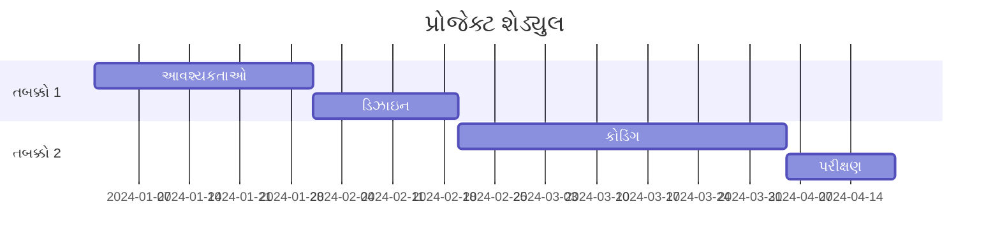

**ટેબલ: Gantt ચાર્ટ ઘટકો**

| ઘટક | વર્ણન |
|---|---|
| **કાર્યો** | પૂર્ણ કરવાના કાર્ય આઇટમ્સ |
| **ટાઇમલાઇન** | આડી સમય સ્કેલ |
| **બાર્સ** | કાર્યની અવધિ અને પ્રગતિ |
| **નિર્ભરતા** | કાર્યો વચ્ચેના સંબંધો |
| **માઇલસ્ટોન્સ** | મહત્વપૂર્ણ પ્રોજેક્ટ ઇવેન્ટ્સ |

**ફાયદા**:

- **દ્રશ્ય ટાઇમલાઇન**: પ્રોજેક્ટ શેડ્યુલ જોવા સરળ
- **પ્રગતિ ટ્રેકિંગ**: કાર્ય પૂર્ણતાનું નિરીક્ષણ
- **સાધન આયોજન**: સાધનોને અસરકારક રીતે ફાળવવા
- **નિર્ભરતા મેનેજમેન્ટ**: કાર્ય સંબંધો સમજવા

**મેમરી ટ્રીક:** "Tasks Timeline Bars Dependencies Milestones"

---

## પ્રશ્ન 3(ક) OR [7 ગુણ]

**રિસ્ક મેનેજમેન્ટ પર ટૂંક નોંધ લખો.**

**જવાબ**:

**રિસ્ક મેનેજમેન્ટ** એ પ્રોજેક્ટના જોખમોને ઓળખવા, વિશ્લેષણ કરવા અને નિયંત્રિત કરવાની વ્યવસ્થિત પ્રક્રિયા છે.

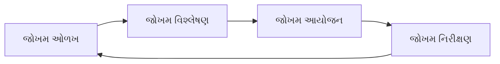

**ટેબલ: રિસ્ક મેનેજમેન્ટ પ્રક્રિયા**

| તબક્કો | પ્રવૃત્તિઓ | આઉટપુટ |
|---|---|---|
| **ઓળખ** | સંભવિત જોખમો શોધવા | જોખમ યાદી |
| **વિશ્લેષણ** | સંભાવના અને અસરનું મૂલ્યાંકન | જોખમ પ્રાથમિકતા |
| **આયોજન** | પ્રતિસાદ વ્યૂહરચના વિકસાવવી | જોખમ પ્રતિસાદ પ્લાન |
| **નિરીક્ષણ** | જોખમોને ટ્રેક અને નિયંત્રિત કરવા | અપડેટેડ જોખમ સ્થિતિ |

**જોખમ કેટેગરીઓ**:

**ટેબલ: સોફ્ટવૅર જોખમોના પ્રકારો**

| કેટેગરી | ઉદાહરણો |
|---|---|
| **તકનીકી** | ટેક્નોલોજી ફેરફારો, જટિલતા |
| **પ્રોજેક્ટ** | શેડ્યુલ વિલંબ, સાધન અછત |
| **બિઝનેસ** | બજાર ફેરફારો, ફંડિંગ મુદ્દાઓ |
| **બાહ્ય** | વિક્રેતા સમસ્યાઓ, નિયમનકારી ફેરફારો |

**જોખમ પ્રતિસાદ વ્યૂહરચના**:

- **ટાળવું**: જોખમ સ્ત્રોતને દૂર કરવું
- **ઘટાડવું**: સંભાવના અથવા અસર ઘટાડવી  
- **સ્થાનાંતરિત કરવું**: અન્ય લોકો સાથે જોખમ વહેંચવું
- **સ્વીકારવું**: જોખમ સાથે જીવવું

**જોખમ મૂલ્યાંકન**: સંભાવના × અસર = જોખમ એક્સપોઝર

**ફાયદા**: પ્રો-એક્ટિવ સમસ્યા ઉકેલ, વધુ સારી પ્રોજેક્ટ સફળતા દર, સ્ટેકહોલ્ડર વિશ્વાસ

**મેમરી ટ્રીક:** "Identify Analyze Plan Monitor" પ્રક્રિયા માટે, "Avoid Mitigate Transfer Accept" વ્યૂહરચના માટે

---

## પ્રશ્ન 4(અ) [3 ગુણ]

**પ્રોજેક્ટની સાઇઝના અંદાજ માટેના મેટ્રિક શું છે? FP ઉદાહરણ સાથે સમજાવો.**

**જવાબ**:

**સાઇઝ અંદાજ મેટ્રિક્સ** સોફ્ટવૅર પ્રોજેક્ટના સાઇઝ અને પ્રયત્નોની આગાહી કરવામાં મદદ કરે છે.

**ટેબલ: સાઇઝ અંદાજ મેટ્રિક્સ**

| મેટ્રિક | વર્ણન |
|---|---|
| **LOC** | કોડની લાઇન્સ |
| **Function Points** | કાર્યક્ષમતા-આધારિત માપ |
| **Object Points** | ઑબ્જેક્ટ-ઓરિએન્ટેડ સિસ્ટમ્સ માટે |
| **Feature Points** | વિસ્તૃત Function Points |

**Function Points (FP)** વપરાશકર્તા કાર્યક્ષમતાના આધારે સોફ્ટવૅર સાઇઝ માપે છે.

**FP ઘટકો**:

- **External Inputs**: ડેટા એન્ટ્રી સ્ક્રીન્સ
- **External Outputs**: રિપોર્ટ્સ, સંદેશાઓ  
- **External Queries**: ડેટાબેસ ક્વેરીઝ
- **Internal Files**: ડેટા સ્ટોર્સ
- **External Interfaces**: સિસ્ટમ કનેક્શન્સ

**FP ગણતરી ઉદાહરણ**:
લાઇબ્રેરી મેનેજમેન્ટ સિસ્ટમ માટે:

- External Inputs: 5 (પુસ્તક એન્ટ્રી, સભ્ય એન્ટ્રી, વગેરે)
- External Outputs: 3 (રિપોર્ટ્સ)
- External Queries: 4 (સર્ચ ફંક્શન્સ)
- Internal Files: 2 (પુસ્તક DB, સભ્ય DB)
- External Interfaces: 1 (ઓનલાઇન કેટલોગ)

**સિમ્પલ FP = 5 + 3 + 4 + 2 + 1 = 15 Function Points**

**મેમરી ટ્રીક:** "Inputs Outputs Queries Files Interfaces"

---

## પ્રશ્ન 4(બ) [4 ગુણ]

**પ્રોજેક્ટ અંદાજની બેસિક ટેકનિક COCOMO મોડેલ સમજાવો.**

**જવાબ**:

**COCOMO (COnstructive COst MOdel)** સોફ્ટવૅર ડેવલપમેન્ટ પ્રયત્ન અને શેડ્યુલનો અંદાજ લગાવે છે.

**ટેબલ: COCOMO મોડેલ પ્રકારો**

| પ્રકાર | વર્ણન | ચોકસાઈ |
|---|---|---|
| **બેસિક** | સરળ સાઇઝ-આધારિત અંદાજ | ±75% |
| **મધ્યવર્તી** | કોસ્ટ ડ્રાઇવર્સ સમાવે છે | ±25% |
| **વિગતવાર** | તબક્કા-સ્તરીય અંદાજ | ±10% |

**બેસિક COCOMO ફોર્મુલા**:

- **પ્રયત્ન** = a × (KLOC)^b person-months
- **સમય** = c × (પ્રયત્ન)^d months
- **લોકો** = પ્રયત્ન / સમય

**ટેબલ: COCOMO કોન્સ્ટન્ટ્સ**

| પ્રોજેક્ટ પ્રકાર | a | b | c | d |
|---|---|---|---|---|
| **Organic** | 2.4 | 1.05 | 2.5 | 0.38 |
| **Semi-detached** | 3.0 | 1.12 | 2.5 | 0.35 |
| **Embedded** | 3.6 | 1.20 | 2.5 | 0.32 |

**ઉદાહરણ**: 10 KLOC organic પ્રોજેક્ટ માટે

- પ્રયત્ન = 2.4 × (10)^1.05 = 25.47 person-months
- સમય = 2.5 × (25.47)^0.38 = 8.64 months
- લોકો = 25.47 / 8.64 = 3 લોકો

**મેમરી ટ્રીક:** "Organic Semi Embedded" પ્રોજેક્ટ પ્રકારો માટે

---

## પ્રશ્ન 4(ક) [7 ગુણ]

**તમારી પસંદગીની સિસ્ટમ માટે સ્પ્રિન્ટ બર્ન ડાઉન ચાર્ટ તૈયાર કરો.**

**જવાબ**:

**સ્પ્રિન્ટ બર્ન ડાઉન ચાર્ટ** **ઓનલાઇન શોપિંગ સિસ્ટમ** માટે સ્પ્રિન્ટ દરમિયાન બાકી કામને ટ્રેક કરે છે.

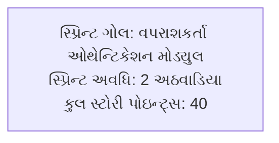

**સ્પ્રિન્ટ બેકલોગ**:

**ટેબલ: સ્પ્રિન્ટ કાર્યો**

| કાર્ય | સ્ટોરી પોઇન્ટ્સ | દિવસ સોંપાયેલ |
|---|---|---|
| **વપરાશકર્તા રજિસ્ટ્રેશન** | 8 | દિવસ 1-2 |
| **વપરાશકર્તા લોગિન** | 6 | દિવસ 3-4 |
| **પાસવર્ડ રીસેટ** | 5 | દિવસ 5-6 |
| **પ્રોફાઇલ મેનેજમેન્ટ** | 8 | દિવસ 7-8 |
| **સેશન મેનેજમેન્ટ** | 6 | દિવસ 9-10 |
| **ટેસ્ટિંગ અને બગ ફિક્સ** | 7 | દિવસ 11-14 |

**બર્ન ડાઉન ચાર્ટ ડેટા**:

**ટેબલ: દૈનિક પ્રગતિ**

| દિવસ | આદર્શ બાકી | વાસ્તવિક બાકી | પૂર્ણ થયેલ કામ |
|---|---|---|---|
| **દિવસ 0** | 40 | 40 | સ્પ્રિન્ટ શરૂઆત |
| **દિવસ 2** | 36 | 38 | રજિસ્ટ્રેશન વિલંબ |
| **દિવસ 4** | 32 | 32 | લોગિન પૂર્ણ |
| **દિવસ 6** | 28 | 27 | પાસવર્ડ રીસેટ જલ્દી પૂર્ણ |
| **દિવસ 8** | 24 | 26 | પ્રોફાઇલ મેનેજમેન્ટ મુદ્દાઓ |
| **દિવસ 10** | 20 | 20 | પાછા ટ્રેક પર |
| **દિવસ 12** | 16 | 15 | ટેસ્ટિંગ સારી પ્રગતિ |
| **દિવસ 14** | 0 | 0 | સ્પ્રિન્ટ પૂર્ણ |

**ચાર્ટ વિશ્લેષણ**:

- **લીલી લાઇન**: આદર્શ બર્ન ડાઉન
- **લાલ લાઇન**: વાસ્તવિક પ્રગતિ  
- **વિવિધતાઓ**: પડકારો અને પુનઃપ્રાપ્તિ દર્શાવે છે
- **પૂર્ણતા**: સ્પ્રિન્ટ સમયસર પૂર્ણ થયું

**ફાયદા**: દ્રશ્ય પ્રગતિ ટ્રેકિંગ, પ્રારંભિક સમસ્યા ઓળખ, ટીમ પ્રેરણા

**મેમરી ટ્રીક:** "Track Progress Daily, Identify Issues Early"

---

## પ્રશ્ન 4(અ) OR [3 ગુણ]

**USE CASE ડાયાગ્રામના ઘટકો સમજાવો.**

**જવાબ**:

**યુઝ કેસ ડાયાગ્રામ** વપરાશકર્તાના દૃષ્ટિકોણથી સિસ્ટમ કાર્યક્ષમતા દર્શાવે છે.

**ટેબલ: યુઝ કેસ ડાયાગ્રામ ઘટકો**

| ઘટક | સિમ્બોલ | વર્ણન |
|---|---|---|
| **એક્ટર** | Stick figure | સિસ્ટમ સાથે વાતચીત કરતી બાહ્ય એન્ટિટી |
| **યુઝ કેસ** | ઓવલ | સિસ્ટમ કાર્યક્ષમતા |
| **સિસ્ટમ બાઉન્ડરી** | રેક્ટેંગલ | સિસ્ટમ અવકાશ |
| **એસોસિએશન** | લાઇન | એક્ટર-યુઝ કેસ સંબંધ |
| **જનરલાઇઝેશન** | એરો | વારસા સંબંધ |

**સંબંધો**:

- **ઇન્ક્લૂડ**: એક યુઝ કેસ બીજાને સમાવે છે (ફરજિયાત)
- **એક્સટેન્ડ**: વૈકલ્પિક યુઝ કેસ વિસ્તરણ
- **જનરલાઇઝેશન**: માતા-પિતા-બાળક સંબંધ

**ઉદાહરણ ઘટકો**:

- **પ્રાથમિક એક્ટર**: ગ્રાહક, એડમિન
- **યુઝ કેસ**: લોગિન, પ્રોડક્ટ્સ સર્ચ કરો, ઓર્ડર આપો
- **સિસ્ટમ**: ઓનલાઇન શોપિંગ સિસ્ટમ

**મેમરી ટ્રીક:** "Actors Use Systems, Associate Generally"

---

## પ્રશ્ન 4(બ) OR [4 ગુણ]

**કોહેસન અને કપલિંગની સરખામણી કરો.**

**જવાબ**:

**કોહેસન અને કપલિંગ** જાળવણીયોગ્યતાને અસર કરતા મહત્વપૂર્ણ સોફ્ટવૅર ડિઝાઇન સિદ્ધાંતો છે.

**ટેબલ: કોહેસન વિ કપલિંગ સરખામણી**

| પાસું | કોહેસન | કપલિંગ |
|---|---|---|
| **વ્યાખ્યા** | મોડ્યુલની અંદર એકતા | મોડ્યુલો વચ્ચે નિર્ભરતા |
| **ઇચ્છનીય સ્તર** | ઉચ્ચ કોહેસન પસંદ | નીચું કપલિંગ પસંદ |
| **ફોકસ** | આંતરિક મોડ્યુલ એકતા | આંતર-મોડ્યુલ સંબંધો |
| **અસર** | મોડ્યુલ વિશ્વસનીયતા | સિસ્ટમ લવચીકતા |
| **માપ** | મોડ્યુલ તત્વો કેટલા સંબંધિત છે | મોડ્યુલો કેટલા નિર્ભર છે |

**કોહેસન પ્રકારો** (નીચાથી ઉચ્ચા સુધી):

- **સંયોગજન્ય**: રેન્ડમ ગ્રુપિંગ
- **તાર્કિક**: સમાન લોજિક
- **ટેમ્પોરલ**: સમાન સમય અમલ
- **પ્રોસેજ્યોરલ**: ક્રમિક પગલાં
- **કમ્યુનિકેશનલ**: સમાન ડેટા
- **સિક્વેન્શિયલ**: એકનું આઉટપુટ બીજાનું ઇનપુટ
- **ફંક્શનલ**: એક જ હેતુ

**કપલિંગ પ્રકારો** (ઉચ્ચાથી નીચા સુધી):

- **કન્ટેન્ટ**: મોડ્યુલ આંતરિક બાબતોને સીધો એક્સેસ
- **કોમન**: વહેંચાયેલ ગ્લોબલ ડેટા
- **એક્સટર્નલ**: વહેંચાયેલ બાહ્ય ઇન્ટરફેસ
- **કન્ટ્રોલ**: કન્ટ્રોલ માહિતી પાસ
- **સ્ટેમ્પ**: ડેટા સ્ટ્રક્ચર પાસ
- **ડેટા**: સરળ ડેટા પાસ

**ગોલ**: **ઉચ્ચ કોહેસન + નીચું કપલિંગ = સારી ડિઝાઇન**

**મેમરી ટ્રીક:** "High Cohesion, Low Coupling" સારી ડિઝાઇન માટે

---

## પ્રશ્ન 4(ક) OR [7 ગુણ]

**રિસ્ક એસેસમેન્ટને વિસ્તારથી સમજાવો.**

**જવાબ**:

**રિસ્ક એસેસમેન્ટ** મેનેજમેન્ટ પ્રયત્નોને પ્રાથમિકતા આપવા માટે ઓળખાયેલા જોખમોનું મૂલ્યાંકન કરે છે.

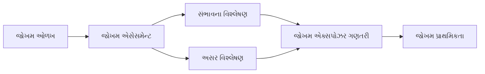

**રિસ્ક એસેસમેન્ટ ઘટકો**:

**ટેબલ: જોખમ એસેસમેન્ટ તત્વો**

| તત્વ | વર્ણન | સ્કેલ |
|---|---|---|
| **સંભાવના** | જોખમ થવાની શક્યતા | 0.1 થી 1.0 |
| **અસર** | જોખમ થાય તો પરિણામો | 1 થી 10 |
| **જોખમ એક્સપોઝર** | સંભાવના × અસર | ગણતરીયુક્ત મૂલ્ય |
| **જોખમ સ્તર** | પ્રાથમિકતા વર્ગીકરણ | ઉચ્ચ/મધ્યમ/નીચું |

**એસેસમેન્ટ પ્રક્રિયા**:

**1. સંભાવના એસેસમેન્ટ**:

- **ખૂબ નીચી (0.1)**: થવાની શક્યતા નથી
- **નીચી (0.3)**: શક્ય પણ સંભવિત નથી  
- **મધ્યમ (0.5)**: થઈ શકે કે ન પણ થાય
- **ઉચ્ચ (0.7)**: થવાની શક્યતા છે
- **ખૂબ ઉચ્ચ (0.9)**: લગભગ નિશ્ચિત

**2. અસર એસેસમેન્ટ**:

- **વિનાશકારી (9-10)**: પ્રોજેક્ટ નિષ્ફળતા
- **ગંભીર (7-8)**: મોટા વિલંબ/કોસ્ટ ઓવરરન
- **સીમાંત (4-6)**: શેડ્યુલ/બજેટ પર થોડી અસર
- **નગણ્ય (1-3)**: ઓછી અસર

**3. જોખમ એક્સપોઝર ગણતરી**:
**જોખમ એક્સપોઝર = સંભાવના × અસર**

**ઉદાહરણ જોખમ એસેસમેન્ટ**:

**ટેબલ: નમૂના જોખમ વિશ્લેષણ**

| જોખમ | સંભાવના | અસર | એક્સપોઝર | પ્રાથમિકતા |
|---|---|---|---|---|
| **મુખ્ય ડેવલપર છોડી જાય** | 0.3 | 8 | 2.4 | મધ્યમ |
| **આવશ્યકતા ફેરફાર** | 0.7 | 6 | 4.2 | ઉચ્ચ |
| **ટેક્નોલોજી નિષ્ફળતા** | 0.2 | 9 | 1.8 | નીચું |
| **બજેટ કાપ** | 0.4 | 7 | 2.8 | મધ્યમ |

**રિસ્ક મેટ્રિક્સ**:

- **ઉચ્ચ પ્રાથમિકતા**: એક્સપોઝર > 4.0
- **મધ્યમ પ્રાથમિકતા**: એક્સપોઝર 2.0-4.0  
- **નીચી પ્રાથમિકતા**: એક્સપોઝર < 2.0

**એસેસમેન્ટ ફાયદા**:

- **ઉદ્દેશ્ય પ્રાથમિકતા**: ડેટા-આધારિત નિર્ણયો
- **સાધન ફાળવણી**: ઉચ્ચ-જોખમ આઇટમ્સ પર ફોકસ
- **સંવાદ સાધન**: સ્પષ્ટ જોખમ સંવાદ
- **આયોજન ઇનપુટ**: પ્રોજેક્ટ આયોજનને પ્રભાવિત કરે છે

**મેમરી ટ્રીક:** "Probability Impact Exposure Priority"

---

## પ્રશ્ન 5(અ) [3 ગુણ]

**કોડ રિવ્યુની કોડ ઇન્સ્પેક્શન ટેકનિક સમજાવો.**

**જવાબ**:

**કોડ ઇન્સ્પેક્શન** એ ખામીઓ શોધવા માટે કોડની ઔપચારિક, વ્યવસ્થિત તપાસ છે.

**ટેબલ: કોડ ઇન્સ્પેક્શન પ્રક્રિયા**

| તબક્કો | સહભાગીઓ | પ્રવૃત્તિઓ |
|---|---|---|
| **આયોજન** | મોડરેટર | ઇન્સ્પેક્શન શેડ્યુલ કરવું, કોડ વિતરિત કરવો |
| **ઓવરવ્યૂ** | લેખક, ટીમ | લેખક કોડ સમજાવે છે |
| **તૈયારી** | વ્યક્તિગત | દરેક રિવ્યુઅર કોડનો અભ્યાસ કરે છે |
| **ઇન્સ્પેક્શન** | બધા રિવ્યુઅર્સ | વ્યવસ્થિત રીતે ખામીઓ શોધવી |
| **રિવર્ક** | લેખક | ઓળખાયેલી ખામીઓ સુધારવી |
| **ફોલો-અપ** | મોડરેટર | સુધારાઓ ચકાસવા |

**મુખ્ય લક્ષણો**:

- **ઔપચારિક પ્રક્રિયા**: વ્યાખ્યાયિત ભૂમિકાઓ સાથે માળખાગત અભિગમ
- **વ્યવસ્થિત સમીક્ષા**: લાઇન-બાય-લાઇન તપાસ
- **ખામી કેન્દ્રિત**: ભૂલો શોધવી, ઉકેલો નહીં
- **લેખકની ટીકા નહીં**: કોડ પર ફોકસ, કોડર પર નહીં

**ફાયદા**: પ્રારંભિક ખામી શોધ, જ્ઞાન વહેંચણી, કોડ ગુણવત્તા સુધારણા

**મેમરી ટ્રીક:** "Plan Overview Prepare Inspect Rework Follow-up"

---

## પ્રશ્ન 5(બ) [4 ગુણ]

**ATM ના ઓછામાં ઓછા ચાર ટેસ્ટ કેસ તૈયાર કરો.**

**જવાબ**:

**ATM ટેસ્ટ કેસ** ઓટોમેટેડ ટેલર મશીનની કાર્યક્ષમતા ચકાસે છે.

**ટેબલ: ATM ટેસ્ટ કેસ**

| ટેસ્ટ કેસ ID | ટેસ્ટ સિનેરિયો | ઇનપુટ | અપેક્ષિત આઉટપુટ | પરિણામ |
|---|---|---|---|---|
| **TC001** | માન્ય PIN એન્ટ્રી | સાચો 4-અંકનો PIN | પ્રવેશ મંજૂર, મુખ્ય મેનુ દર્શાવવું | Pass/Fail |
| **TC002** | અમાન્ય PIN એન્ટ્રી | ખોટો PIN (3 પ્રયાસ) | કાર્ડ બ્લોક, એરર સંદેશ | Pass/Fail |
| **TC003** | રોકડ ઉપાડ | રકમ ≤ ખાતા બેલેન્સ | રોકડ આપવી, રસીદ પ્રિન્ટ કરવી | Pass/Fail |
| **TC004** | અપૂરતો બેલેન્સ | રકમ > ખાતા બેલેન્સ | વ્યવહાર નકારવો, બેલેન્સ બતાવવો | Pass/Fail |

**વિગતવાર ટેસ્ટ કેસ**:

**ટેસ્ટ કેસ 1: માન્ય લોગિન**

- **પૂર્વશરત**: ATM કાર્યરત છે, કાર્ડ દાખલ કર્યું
- **પગલાં**: સાચો PIN દાખલ કરો → Enter દબાવો
- **અપેક્ષિત**: વિકલ્પો સાથે મુખ્ય મેનુ દર્શાવવું

**ટેસ્ટ કેસ 2: રોકડ ઉપાડ**

- **પૂર્વશરત**: વપરાશકર્તા લોગ ઇન, પૂરતો બેલેન્સ
- **પગલાં**: ઉપાડ પસંદ કરો → રકમ દાખલ કરો → કન્ફર્મ કરો
- **અપેક્ષિત**: રોકડ આપવી, બેલેન્સ અપડેટ કરવો

**ટેસ્ટ કેસ 3: બેલેન્સ પૂછપરછ**

- **પૂર્વશરત**: વપરાશકર્તા લોગ ઇન
- **પગલાં**: બેલેન્સ પૂછપરછ પસંદ કરો
- **અપેક્ષિત**: વર્તમાન બેલેન્સ સ્ક્રીન પર દર્શાવવો

**ટેસ્ટ કેસ 4: PIN ફેરફાર**

- **પૂર્વશરત**: વપરાશકર્તા લોગ ઇન
- **પગલાં**: PIN ફેરફાર પસંદ કરો → જૂનો PIN દાખલ કરો → નવો PIN દાખલ કરો → કન્ફર્મ કરો
- **અપેક્ષિત**: PIN સફળતાપૂર્વક બદલાયો, પુષ્ટિ સંદેશ

**મેમરી ટ્રીક:** "Login Withdraw Inquiry Change"

---

## પ્રશ્ન 5(ક) [7 ગુણ]

**white box ટેસ્ટિંગ વર્ણવો.**

**જવાબ**:

**વ્હાઇટ બોક્સ ટેસ્ટિંગ** આંતરિક કોડ માળખું અને લોજિક પાથ્સની તપાસ કરે છે.

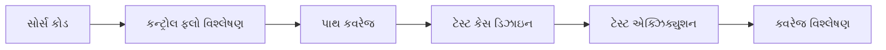

**ટેબલ: વ્હાઇટ બોક્સ ટેસ્ટિંગ લાક્ષણિકતાઓ**

| પાસું | વર્ણન |
|---|---|
| **ફોકસ** | આંતરિક કોડ માળખું |
| **જ્ઞાન** | કોડ અમલીકરણ વિગતો |
| **કવરેજ** | સ્ટેટમેન્ટ્સ, બ્રાન્ચ, પાથ્સ |
| **ટેકનિક્સ** | બેસિસ પાથ, લુપ ટેસ્ટિંગ |
| **ટૂલ્સ** | કોડ કવરેજ એનાલાઇઝર્સ |

**કવરેજ માપદંડો**:

**ટેબલ: કવરેજ પ્રકારો**

| કવરેજ પ્રકાર | વર્ણન | ગોલ |
|---|---|---|
| **સ્ટેટમેન્ટ કવરેજ** | દરેક સ્ટેટમેન્ટ એક્ઝિક્યુટ કરવું | 100% સ્ટેટમેન્ટ્સ |
| **બ્રાન્ચ કવરેજ** | દરેક બ્રાન્ચ એક્ઝિક્યુટ કરવું | બધા if-else પાથ્સ |
| **પાથ કવરેજ** | દરેક પાથ એક્ઝિક્યુટ કરવું | બધા શક્ય પાથ્સ |
| **કન્ડિશન કવરેજ** | બધી શરતો ટેસ્ટ કરવી | દરેક કન્ડિશન માટે true/false |

**વ્હાઇટ બોક્સ ટેસ્ટિંગ ટેકનિક્સ**:

**1. બેસિસ પાથ ટેસ્ટિંગ**:

- **સાયક્લોમેટિક કોમ્પ્લેક્સિટી** ગણવી: V(G) = E - N + 2
- E = એજ્સ, N = કન્ટ્રોલ ફ્લો ગ્રાફમાં નોડ્સ
- V(G) બરાબર સ્વતંત્ર પાથ્સ જનરેટ કરવા

**2. લુપ ટેસ્ટિંગ**:

- **સિમ્પલ લુપ્સ**: 0, 1, 2, સામાન્ય, મહત્તમ પુનરાવર્તનો ટેસ્ટ કરવા
- **નેસ્ટેડ લુપ્સ**: પહેલા આંતરિક લુપ, પછી બાહ્ય
- **કોન્કેટેનેટેડ લુપ્સ**: અલગ લુપ્સ તરીકે ટેસ્ટ કરવા

**3. કન્ડિશન ટેસ્ટિંગ**:

- બધી લોજિકલ કન્ડિશન્સ ટેસ્ટ કરવી (AND, OR, NOT)
- દરેક કન્ડિશન true અને false બંને માટે મૂલ્યાંકન સુનિશ્ચિત કરવું

**ઉદાહરણ: સિમ્પલ કોડ ટેસ્ટિંગ**
```
if (age >= 18 AND income > 25000)
    approve_loan();
else
    reject_loan();
```

**ટેસ્ટ કેસ**:

- age=20, income=30000 (બંને true) → approve
- age=16, income=30000 (પહેલું false) → reject  
- age=20, income=20000 (બીજું false) → reject
- age=16, income=20000 (બંને false) → reject

**ફાયદા**:

- **સંપૂર્ણ ટેસ્ટિંગ**: આંતરિક લોજિક ટેસ્ટ કરે છે
- **પ્રારંભિક ખામી શોધ**: લોજિક એરર્સ શોધે છે
- **કવરેજ માપ**: મૂર્ત ટેસ્ટિંગ પ્રગતિ

**ગેરફાયદા**:

- **સમય લેતું**: કોડ જ્ઞાનની જરૂર
- **મોંઘું**: કુશળ ટેસ્ટર્સની જરૂર
- **જાળવણી**: કોડ સાથે ફેરફારો

**ટૂલ્સ**: JUnit (Java), NUnit (.NET), Coverage.py (Python)

**મેમરી ટ્રીક:** "Statement Branch Path Condition" કવરેજ પ્રકારો માટે

---

## પ્રશ્ન 5(અ) OR [3 ગુણ]

**કોડ રિવ્યુની કોડ વોક થ્રુ ટેકનિક સમજાવો.**

**જવાબ**:

**કોડ વોક થ્રુ** એ અનૌપચારિક કોડ રિવ્યુ ટેકનિક છે જ્યાં લેખક ટીમને કોડ રજૂ કરે છે.

**ટેબલ: વોક થ્રુ પ્રક્રિયા**

| તબક્કો | વર્ણન | અવધિ |
|---|---|---|
| **તૈયારી** | લેખક પ્રેઝન્ટેશન તૈયાર કરે છે | 30 મિનિટ |
| **પ્રેઝન્ટેશન** | લેખક કોડ લોજિક સમજાવે છે | 1-2 કલાક |
| **ચર્ચા** | ટીમ પ્રશ્નો પૂછે છે, સુધારાઓ સૂચવે છે | 30 મિનિટ |
| **દસ્તાવેજીકરણ** | મુદ્દાઓ અને એક્શન આઇટમ્સ રેકોર્ડ કરવા | 15 મિનિટ |

**મુખ્ય લાક્ષણિકતાઓ**:

- **લેખક-આગેવાની**: કોડ લેખક સેશન ચલાવે છે
- **અનૌપચારિક પ્રક્રિયા**: ઇન્સ્પેક્શન કરતાં ઓછું માળખાગત
- **શિક્ષણાત્મક**: ટીમ કોડ કાર્યક્ષમતા વિશે શીખે છે
- **સહયોગી**: ખુલ્લી ચર્ચાને પ્રોત્સાહન

**સહભાગીઓ**:

- **લેખક**: કોડ રજૂ કરે છે અને સમજાવે છે
- **રિવ્યુઅર્સ**: પ્રશ્નો પૂછે છે અને ફીડબેક આપે છે
- **મોડરેટર**: ચર્ચાને કેન્દ્રિત રાખે છે (વૈકલ્પિક)

**ફાયદા**: જ્ઞાન વહેંચણી, પ્રારંભિક સમસ્યા શોધ, ટીમ સહયોગ, શીખવાની તક

**મેમરી ટ્રીક:** "Prepare Present Discuss Document"

---

## પ્રશ્ન 5(બ) OR [4 ગુણ]

**સોફ્ટવૅર ડોક્યુમેન્ટેશન વિશે સમજાવો.**

**જવાબ**:

**સોફ્ટવૅર ડોક્યુમેન્ટેશન** વિવિધ સ્ટેકહોલ્ડર્સ માટે સોફ્ટવૅર સિસ્ટમ વિશે માહિતી પ્રદાન કરે છે.

**ટેબલ: ડોક્યુમેન્ટેશન પ્રકારો**

| પ્રકાર | હેતુ | પ્રેક્ષકો |
|---|---|---|
| **વપરાશકર્તા ડોક્યુમેન્ટેશન** | સોફ્ટવૅરનો ઉપયોગ કેવી રીતે કરવો | અંતિમ વપરાશકર્તાઓ |
| **સિસ્ટમ ડોક્યુમેન્ટેશન** | તકનીકી વિગતો | ડેવલપર્સ, જાળવણીકર્તાઓ |
| **પ્રોસેસ ડોક્યુમેન્ટેશન** | વિકાસ પ્રક્રિયા | પ્રોજેક્ટ ટીમ |
| **આવશ્યકતા ડોક્યુમેન્ટેશન** | સિસ્ટમ શું કરવું જોઈએ | બધા સ્ટેકહોલ્ડર્સ |

**આંતરિક ડોક્યુમેન્ટેશન**:

- **કોડ કોમેન્ટ્સ**: જટિલ લોજિક સમજાવવી
- **ફંક્શન હેડર્સ**: હેતુ અને પેરામીટર્સ વર્ણવવા  
- **વેરિએબલ નામો**: સ્વ-દસ્તાવેજીકરણ ઓળખકર્તાઓ
- **README ફાઇલ્સ**: પ્રોજેક્ટ ઓવરવ્યુ અને સેટઅપ

**બાહ્ય ડોક્યુમેન્ટેશન**:

- **વપરાશકર્તા માન્યુઅલ્સ**: ચરણ-દર-ચરણ ઉપયોગ સૂચનાઓ
- **ઇન્સ્ટોલેશન ગાઇડ્સ**: સેટઅપ પ્રક્રિયાઓ
- **API ડોક્યુમેન્ટેશન** : ઇન્ટરફેસ વિશિષ્ટતાઓ
- **તાલીમ સામગ્રી**: શિક્ષણાત્મક સામગ્રી

**ફાયદા**:

- **જાળવણીયોગ્યતા**: કોડ અપડેટ્સ સરળ
- **જ્ઞાન સ્થાનાંતરણ**: નવા ટીમ સભ્યો ઝડપથી શીખે છે
- **વપરાશકર્તા સપોર્ટ**: સપોર્ટ વિનંતીઓ ઘટાડે છે
- **ગુણવત્તા ખાતરી**: આવશ્યકતાઓ અને ડિઝાઇન દસ્તાવેજીકરણ કરે છે

**ડોક્યુમેન્ટેશન ધોરણો**: સુસંગત ફોર્મેટ, નિયમિત અપડેટ્સ, વર્ઝન કન્ટ્રોલ, પહોંચતા

**મેમરી ટ્રીક:** "User System Process Requirements" પ્રકારો માટે

---

## પ્રશ્ન 5(ક) OR [7 ગુણ]

**black box ટેસ્ટિંગ પર ટૂંક નોંધ લખો.**

**જવાબ**:

**બ્લેક બોક્સ ટેસ્ટિંગ** આંતરિક કોડ માળખાના જ્ઞાન વિના સોફ્ટવૅર કાર્યક્ષમતાની તપાસ કરે છે.

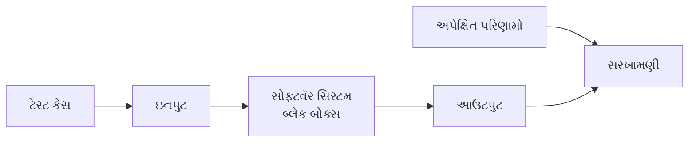

**ટેબલ: બ્લેક બોક્સ ટેસ્ટિંગ લાક્ષણિકતાઓ**

| પાસું | વર્ણન |
|---|---|
| **ફોકસ** | બાહ્ય વર્તન |
| **જ્ઞાન** | આવશ્યકતાઓ અને વિશિષ્ટતાઓ |
| **અભિગમ** | ઇનપુટ-આઉટપુટ સંબંધ |
| **કવરેજ** | કાર્યાત્મક આવશ્યકતાઓ |
| **દૃષ્ટિકોણ** | વપરાશકર્તા દૃષ્ટિકોણ |

**બ્લેક બોક્સ ટેસ્ટિંગ ટેકનિક્સ**:

**ટેબલ: ટેસ્ટિંગ ટેકનિક્સ**

| ટેકનિક | વર્ણન | ઉદાહરણ |
|---|---|---|
| **ઇક્વિવેલન્સ પાર્ટિશનિંગ** | ઇનપુટ્સને માન્ય/અમાન્ય વર્ગોમાં વહેંચવા | વય: 0-17, 18-65, >65 |
| **બાઉન્ડરી વેલ્યુ એનાલિસિસ** | સીમાઓ પર ટેસ્ટ કરવું | વય ટેસ્ટ: 17, 18, 65, 66 |
| **ડિસિઝન ટેબલ** | જટિલ બિઝનેસ નિયમો | ઇન્શ્યોરન્સ પ્રીમિયમ ગણતરી |
| **સ્ટેટ ટ્રાન્ઝિશન** | સિસ્ટમ સ્ટેટ ફેરફારો | ATM સ્ટેટ્સ: idle, processing, error |

**1. ઇક્વિવેલન્સ પાર્ટિશનિંગ**:

- **માન્ય પાર્ટિશન્સ**: સ્વીકૃત ઇનપુટ્સ
- **અમાન્ય પાર્ટિશન્સ**: નકારેલા ઇનપુટ્સ
- દરેક પાર્ટિશનમાંથી **એક વેલ્યુ ટેસ્ટ** કરવી

**ઉદાહરણ**: પાસવર્ડ લંબાઈ (6-12 અક્ષરો)

- માન્ય: 6-12 અક્ષરો
- અમાન્ય: <6 અક્ષરો, >12 અક્ષરો

**2. બાઉન્ડરી વેલ્યુ એનાલિસિસ**:

- **લઘુત્તમ, મહત્તમ, લઘુત્તમથી થોડું નીચે, મહત્તમથી થોડું ઉપર** ટેસ્ટ કરવું
- મોટાભાગની ભૂલો સીમાઓ પર થાય છે

**ઉદાહરણ**: રેન્જ 1-100 માટે

- ટેસ્ટ: 0, 1, 2, 99, 100, 101

**3. ડિસિઝન ટેબલ ટેસ્ટિંગ**:

- **કન્ડિશન્સ**: ઇનપુટ કન્ડિશન્સ
- **એક્શન્સ**: અપેક્ષિત આઉટપુટ્સ
- **નિયમો**: કન્ડિશન-એક્શન સંયોજનો

**ફાયદા**:

- **વપરાશકર્તા દૃષ્ટિકોણ**: વપરાશકર્તાના દૃષ્ટિકોણથી ટેસ્ટ કરે છે
- **કોડ જ્ઞાનની જરૂર નથી**: ટેસ્ટર્સને પ્રોગ્રામિંગ સ્કિલ્સની જરૂર નથી
- **નિષ્પક્ષ**: કોડ અમલીકરણથી પ્રભાવિત નથી
- **પ્રારંભિક ટેસ્ટિંગ**: આવશ્યકતાઓ સાથે શરૂ કરી શકાય છે

**ગેરફાયદા**:

- **મર્યાદિત કવરેજ**: કેટલાક કોડ પાથ્સ ચૂકાવી શકે છે
- **રિડન્ડન્ટ ટેસ્ટિંગ**: સમાન લોજિકને વધુ વખત ટેસ્ટ કરી શકે છે
- **મુશ્કેલ ટેસ્ટ કેસ ડિઝાઇન**: આંતરિક જ્ઞાન વિના મુશ્કેલ

**બ્લેક બોક્સ ટેસ્ટિંગના પ્રકારો**:

- **ફંક્શનલ ટેસ્ટિંગ**: મુખ્ય કાર્યક્ષમતા
- **નોન-ફંક્શનલ ટેસ્ટિંગ**: પ્રદર્શન, ઉપયોગિતા
- **રીગ્રેશન ટેસ્ટિંગ**: ફેરફારો પછી
- **યુઝર એક્સેપ્ટન્સ ટેસ્ટિંગ**: અંતિમ વેલિડેશન

**ટૂલ્સ**: Selenium (વેબ), Appium (મોબાઇલ), TestComplete, QTP

**ક્યારે ઉપયોગ કરવો**: 

- સિસ્ટમ ટેસ્ટિંગ તબક્કો
- યુઝર એક્સેપ્ટન્સ ટેસ્ટિંગ
- ઇન્ટિગ્રેશન ટેસ્ટિંગ
- રીગ્રેશન ટેસ્ટિંગ

**મેમરી ટ્રીક:** "Equivalence Boundary Decision State" ટેકનિક્સ માટે
