## Question 1(a) [3 marks]

**Define software and explain its characteristics.**

**Answer**:

**Software** is a collection of computer programs, procedures, and documentation that performs tasks on a computer system.

**Table: Software Characteristics**

| Characteristic | Description |
|---|---|
| **Intangible** | Cannot be touched, only experienced |
| **Developed** | Engineered, not manufactured |
| **Maintainable** | Can be modified and updated |
| **Reliable** | Should work consistently |
| **Efficient** | Uses resources optimally |

- **Key point**: Software = Programs + Documentation + Procedures
- **Mnemonic**: "I Don't Make Reliable Electronics" (Intangible, Developed, Maintainable, Reliable, Efficient)

---

## Question 1(b) [4 marks]

**Explain classical waterfall model.**

**Answer**:

**Waterfall Model** is a linear sequential software development approach where each phase must be completed before the next begins.

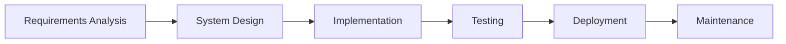

**Key Features**:

- **Sequential phases**: No overlap between phases
- **Documentation-driven**: Heavy documentation at each phase
- **Simple structure**: Easy to understand and manage
- **Fixed requirements**: Changes are difficult once started

**Mnemonic**: "Real Systems Include Testing, Deployment, Maintenance"

---

## Question 1(c) [7 marks]

**Explain software process framework and umbrella activities.**

**Answer**:

**Software Process Framework** provides the foundation for complete software engineering process by identifying key process areas.

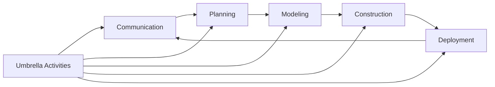

**Table: Framework Activities vs Umbrella Activities**

| Framework Activities | Umbrella Activities |
|---|---|
| Communication | Software project tracking |
| Planning | Risk management |
| Modeling | Quality assurance |
| Construction | Technical reviews |
| Deployment | Configuration management |

**Framework Activities**:

- **Communication**: Gather requirements from stakeholders
- **Planning**: Create project plan and schedule
- **Modeling**: Create design models
- **Construction**: Code generation and testing
- **Deployment**: Software delivery and feedback

**Umbrella Activities** run throughout the project:

- **Project tracking**: Monitor progress
- **Risk management**: Identify and control risks
- **Quality assurance**: Ensure quality standards
- **Configuration management**: Control changes

**Mnemonic**: "Can People Make Construction Deploy" (Communication, Planning, Modeling, Construction, Deployment)

---

## Question 1(c) OR [7 marks]

**Write a short note on SCRUM.**

**Answer**:

**SCRUM** is an agile framework for managing software development projects using iterative and incremental practices.

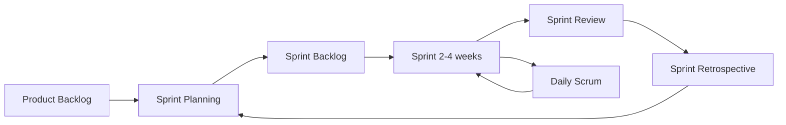

**Table: SCRUM Roles and Artifacts**

| Component | Description |
|---|---|
| **Product Owner** | Defines requirements and priorities |
| **Scrum Master** | Facilitates process and removes obstacles |
| **Development Team** | Self-organizing team that builds product |
| **Product Backlog** | Prioritized list of features |
| **Sprint Backlog** | Tasks selected for current sprint |

**Key Events**:

- **Sprint Planning**: Select work for upcoming sprint
- **Daily Scrum**: 15-minute daily synchronization
- **Sprint Review**: Demonstrate completed work
- **Sprint Retrospective**: Reflect and improve process

**Benefits**: Fast delivery, flexibility, continuous improvement, customer collaboration

**Mnemonic**: "People Sprint Daily Reviewing Retrospectively"

---

## Question 2(a) [3 marks]

**Explain characteristic of good SRS.**

**Answer**:

**SRS (Software Requirements Specification)** document should have specific qualities to be effective.

**Table: Good SRS Characteristics**

| Characteristic | Meaning |
|---|---|
| **Complete** | All requirements included |
| **Consistent** | No contradictory requirements |
| **Unambiguous** | Clear and single interpretation |
| **Verifiable** | Can be tested and validated |
| **Modifiable** | Easy to change when needed |

- **Complete**: Contains all functional and non-functional requirements
- **Consistent**: No conflicts between different requirements
- **Unambiguous**: Each requirement has only one interpretation

**Mnemonic**: "Complete Computers Use Verified Modifications"

---

## Question 2(b) [4 marks]

**Describe advantage and disadvantages of prototype model.**

**Answer**:

**Prototype Model** creates a working model of software to understand requirements better.

**Table: Prototype Model - Pros and Cons**

| Advantages | Disadvantages |
|---|---|
| **Better requirement understanding** | **Time consuming** |
| **User involvement** | **Cost increase** |
| **Early error detection** | **Incomplete analysis** |
| **User satisfaction** | **Prototype confusion** |

**Advantages**:

- **Clear requirements**: Users see working model
- **Early feedback**: Reduces final product risks
- **User involvement**: Better user acceptance

**Disadvantages**:

- **Extra time**: Building prototype takes time
- **Additional cost**: Resources needed for prototype
- **Scope creep**: Users may expect prototype features

**Mnemonic**: "Better Users Experience" vs "Time Costs Increase"

---

## Question 2(c) [7 marks]

**Design and describe Spiral model and give advantages and disadvantages.**

**Answer**:

**Spiral Model** combines iterative development with systematic risk management through repeated cycles.

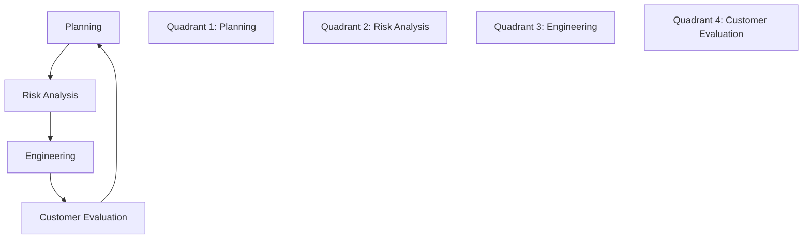

**Table: Spiral Model Phases**

| Phase | Activities |
|---|---|
| **Planning** | Requirements gathering, resource planning |
| **Risk Analysis** | Identify and resolve risks |
| **Engineering** | Development and testing |
| **Customer Evaluation** | Customer reviews and feedback |

**Advantages**:

- **Risk management**: Early risk identification
- **Flexibility**: Accommodates changes easily
- **Customer involvement**: Regular customer feedback
- **Quality focus**: Continuous testing and validation

**Disadvantages**:

- **Complex management**: Difficult to manage
- **High cost**: Expensive due to risk analysis
- **Time consuming**: Long development cycles
- **Risk expertise needed**: Requires risk assessment skills

**Best for**: Large, complex, high-risk projects

**Mnemonic**: "Plan Risks Engineering Customer" for phases

---

## Question 2(a) OR [3 marks]

**Explain Incremental model.**

**Answer**:

**Incremental Model** delivers software in small, functional pieces called increments.

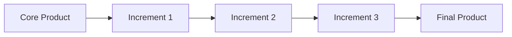

**Key Features**:

- **Partial implementation**: Each increment adds functionality
- **Early delivery**: Core features delivered first
- **Parallel development**: Multiple increments can be developed simultaneously

**Table: Incremental Model Characteristics**

| Aspect | Description |
|---|---|
| **Delivery** | Multiple releases |
| **Functionality** | Grows with each increment |
| **Risk** | Reduced through early delivery |
| **Feedback** | Continuous user feedback |

**Mnemonic**: "Deliver Functionality Reducing Feedback"

---

## Question 2(b) OR [4 marks]

**Write concept of Rapid Application Development model and explain it.**

**Answer**:

**RAD (Rapid Application Development)** emphasizes rapid prototyping and quick feedback over extensive planning.

**Table: RAD Model Phases**

| Phase | Duration | Activities |
|---|---|---|
| **Business Modeling** | Short | Define business functions |
| **Data Modeling** | Short | Define data requirements |
| **Process Modeling** | Short | Convert data to business info |
| **Application Generation** | Short | Use tools to create software |
| **Testing & Turnover** | Short | Test and deploy |

**Key Concepts**:

- **Reusable components**: Pre-built components speed development
- **Powerful tools**: CASE tools and code generators
- **Small teams**: 2-6 people per team
- **Time-boxed**: Strict time limits (60-90 days)

**Requirements for RAD**:

- **Well-defined business requirements**
- **User involvement** throughout process
- **Skilled developers** familiar with RAD tools

**Mnemonic**: "Business Data Process Application Testing"

---

## Question 2(c) OR [7 marks]

**Define SDLC and explain each phase.**

**Answer**:

**SDLC (Software Development Life Cycle)** is a systematic process for building software through well-defined phases.

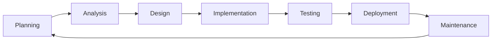

**Table: SDLC Phases Detailed**

| Phase | Activities | Deliverables |
|---|---|---|
| **Planning** | Project planning, feasibility study | Project plan |
| **Analysis** | Requirement gathering | SRS document |
| **Design** | System architecture, UI design | Design document |
| **Implementation** | Coding, unit testing | Source code |
| **Testing** | System testing, integration | Test reports |
| **Deployment** | Installation, user training | Live system |
| **Maintenance** | Bug fixes, enhancements | Updated system |

**Phase Descriptions**:

- **Planning**: Define project scope and resources
- **Analysis**: Understand what system should do
- **Design**: Plan how system will work
- **Implementation**: Build the actual system
- **Testing**: Verify system works correctly
- **Deployment**: Release system to users
- **Maintenance**: Ongoing support and updates

**Mnemonic**: "People Always Design Implementation, Test Deployment, Maintain"

---

## Question 3(a) [3 marks]

**Describe skills to manage software projects.**

**Answer**:

**Software Project Management** requires combination of technical and soft skills.

**Table: Essential Project Management Skills**

| Skill Category | Specific Skills |
|---|---|
| **Technical** | Understanding SDLC, tools, technologies |
| **Leadership** | Team motivation, decision making |
| **Communication** | Clear communication with team and clients |
| **Planning** | Resource allocation, scheduling |
| **Problem-solving** | Risk management, conflict resolution |

**Key Skills**:

- **People management**: Lead and motivate team members
- **Technical knowledge**: Understand development process and tools
- **Communication**: Bridge between technical team and stakeholders

**Mnemonic**: "Technical Leaders Communicate Planning Problems"

---

## Question 3(b) [4 marks]

**Briefly write responsibility of Software Project manager.**

**Answer**:

**Software Project Manager** oversees entire project from initiation to completion.

**Table: Project Manager Responsibilities**

| Area | Responsibilities |
|---|---|
| **Planning** | Create project plans, schedules, budgets |
| **Team Management** | Hire, train, and manage team members |
| **Communication** | Regular updates to stakeholders |
| **Quality Control** | Ensure deliverables meet quality standards |
| **Risk Management** | Identify and mitigate project risks |

**Primary Responsibilities**:

- **Project Planning**: Define scope, timeline, and resources
- **Team Leadership**: Guide and support development team
- **Stakeholder Communication**: Keep everyone informed of progress
- **Quality Assurance**: Ensure project meets requirements
- **Risk Management**: Handle project risks and issues

**Success Factors**: On-time delivery, within budget, meeting requirements

**Mnemonic**: "Plan Team Communication Quality Risk"

---

## Question 3(c) [7 marks]

**Classify types of Requirements in SRS (1) Functional Requirements (2) Non-Functional Requirements.**

**Answer**:

**Requirements Classification** helps organize and understand different types of system needs.

**Table: Functional vs Non-Functional Requirements**

| Aspect | Functional Requirements | Non-Functional Requirements |
|---|---|---|
| **Definition** | What system should do | How system should perform |
| **Focus** | System functionality | System quality attributes |
| **Examples** | Login, search, calculate | Performance, security, usability |
| **Testing** | Functional testing | Performance testing |

**Functional Requirements**:

- **User interactions**: Login, registration, data entry
- **Business rules**: Validation rules, calculations
- **System features**: Reports, notifications, workflows
- **Data processing**: CRUD operations

**Examples**: 

- User can login with username/password
- System calculates tax automatically
- Generate monthly sales report

**Non-Functional Requirements**:

**Table: Non-Functional Requirement Types**

| Type | Description | Example |
|---|---|---|
| **Performance** | Speed and responsiveness | Response time < 2 seconds |
| **Security** | Data protection | Encrypted data transmission |
| **Usability** | User experience | Easy to learn interface |
| **Reliability** | System dependability | 99.9% uptime |
| **Scalability** | Growth handling | Support 1000+ users |

**Quality Attributes**:

- **Performance**: Response time, throughput
- **Security**: Authentication, authorization, encryption
- **Usability**: User-friendly interface, accessibility
- **Reliability**: Uptime, error handling
- **Maintainability**: Code quality, documentation

**Mnemonic**: "Performance Security Usability Reliability Maintainability"

---

## Question 3(a) OR [3 marks]

**Illustrate importance of SRS.**

**Answer**:

**SRS (Software Requirements Specification)** is crucial document that defines what software should do.

**Table: SRS Importance**

| Aspect | Benefit |
|---|---|
| **Clear Communication** | All stakeholders understand requirements |
| **Project Planning** | Basis for estimation and scheduling |
| **Quality Assurance** | Foundation for testing |
| **Change Management** | Controlled requirement changes |
| **Legal Protection** | Contract reference document |

**Key Importance**:

- **Communication tool**: Bridge between clients and developers
- **Planning foundation**: Helps estimate time, cost, and resources
- **Testing basis**: Test cases derived from SRS requirements

**Mnemonic**: "Clear Planning Quality Change Legal"

---

## Question 3(b) OR [4 marks]

**Explain Gantt Chart.**

**Answer**:

**Gantt Chart** is a visual project management tool showing tasks, timelines, and dependencies.

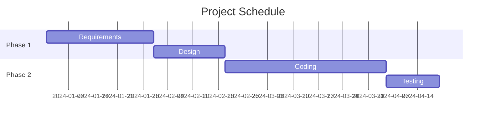

**Table: Gantt Chart Components**

| Component | Description |
|---|---|
| **Tasks** | Work items to be completed |
| **Timeline** | Horizontal time scale |
| **Bars** | Task duration and progress |
| **Dependencies** | Task relationships |
| **Milestones** | Important project events |

**Benefits**:

- **Visual timeline**: Easy to see project schedule
- **Progress tracking**: Monitor task completion
- **Resource planning**: Allocate resources effectively
- **Dependency management**: Understand task relationships

**Mnemonic**: "Tasks Timeline Bars Dependencies Milestones"

---

## Question 3(c) OR [7 marks]

**Write a short note on Risk Management.**

**Answer**:

**Risk Management** is systematic process of identifying, analyzing, and controlling project risks.

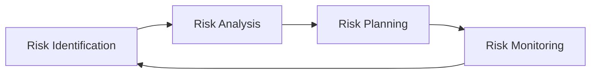

**Table: Risk Management Process**

| Phase | Activities | Output |
|---|---|---|
| **Identification** | Find potential risks | Risk list |
| **Analysis** | Assess probability and impact | Risk priority |
| **Planning** | Develop response strategies | Risk response plan |
| **Monitoring** | Track and control risks | Updated risk status |

**Risk Categories**:

**Table: Types of Software Risks**

| Category | Examples |
|---|---|
| **Technical** | Technology changes, complexity |
| **Project** | Schedule delays, resource shortage |
| **Business** | Market changes, funding issues |
| **External** | Vendor problems, regulatory changes |

**Risk Response Strategies**:

- **Avoid**: Eliminate risk source
- **Mitigate**: Reduce probability or impact  
- **Transfer**: Share risk with others
- **Accept**: Live with the risk

**Risk Assessment**: Probability × Impact = Risk Exposure

**Benefits**: Proactive problem solving, better project success rate, stakeholder confidence

**Mnemonic**: "Identify Analyze Plan Monitor" for process, "Avoid Mitigate Transfer Accept" for strategies

---

## Question 4(a) [3 marks]

**What is metric for size estimation? Explain FP with example.**

**Answer**:

**Size Estimation Metrics** help predict software project size and effort.

**Table: Size Estimation Metrics**

| Metric | Description |
|---|---|
| **LOC** | Lines of Code |
| **Function Points** | Functionality-based measurement |
| **Object Points** | For object-oriented systems |
| **Feature Points** | Enhanced function points |

**Function Points (FP)** measure software size based on user functionality.

**FP Components**:

- **External Inputs**: Data entry screens
- **External Outputs**: Reports, messages  
- **External Queries**: Database queries
- **Internal Files**: Data stores
- **External Interfaces**: System connections

**FP Calculation Example**:
For a Library Management System:

- External Inputs: 5 (Book entry, Member entry, etc.)
- External Outputs: 3 (Reports)
- External Queries: 4 (Search functions)
- Internal Files: 2 (Book DB, Member DB)
- External Interfaces: 1 (Online catalog)

**Simple FP = 5 + 3 + 4 + 2 + 1 = 15 Function Points**

**Mnemonic**: "Inputs Outputs Queries Files Interfaces"

---

## Question 4(b) [4 marks]

**Explain project estimation techniques using basic COCOMO model.**

**Answer**:

**COCOMO (COnstructive COst MOdel)** estimates software development effort and schedule.

**Table: COCOMO Model Types**

| Type | Description | Accuracy |
|---|---|---|
| **Basic** | Simple size-based estimation | ±75% |
| **Intermediate** | Includes cost drivers | ±25% |
| **Detailed** | Phase-level estimation | ±10% |

**Basic COCOMO Formula**:

- **Effort** = a × (KLOC)^b person-months
- **Time** = c × (Effort)^d months
- **People** = Effort / Time

**Table: COCOMO Constants**

| Project Type | a | b | c | d |
|---|---|---|---|---|
| **Organic** | 2.4 | 1.05 | 2.5 | 0.38 |
| **Semi-detached** | 3.0 | 1.12 | 2.5 | 0.35 |
| **Embedded** | 3.6 | 1.20 | 2.5 | 0.32 |

**Example**: For 10 KLOC organic project

- Effort = 2.4 × (10)^1.05 = 25.47 person-months
- Time = 2.5 × (25.47)^0.38 = 8.64 months
- People = 25.47 / 8.64 = 3 people

**Mnemonic**: "Organic Semi Embedded" for project types

---

## Question 4(c) [7 marks]

**Prepare Sprint burn down chart for system of your choice.**

**Answer**:

**Sprint Burn Down Chart** tracks remaining work during a sprint for **Online Shopping System**.

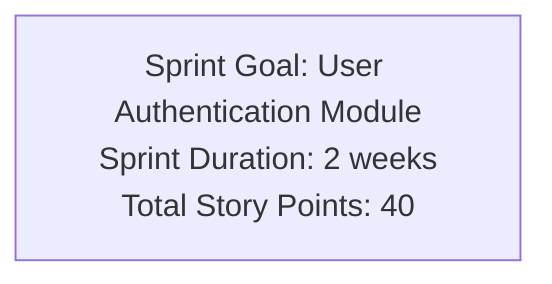

**Sprint Backlog**:

**Table: Sprint Tasks**

| Task | Story Points | Day Assigned |
|---|---|---|
| **User Registration** | 8 | Day 1-2 |
| **User Login** | 6 | Day 3-4 |
| **Password Reset** | 5 | Day 5-6 |
| **Profile Management** | 8 | Day 7-8 |
| **Session Management** | 6 | Day 9-10 |
| **Testing & Bug Fixes** | 7 | Day 11-14 |

**Burn Down Chart Data**:

**Table: Daily Progress**

| Day | Ideal Remaining | Actual Remaining | Work Completed |
|---|---|---|---|
| **Day 0** | 40 | 40 | Sprint Start |
| **Day 2** | 36 | 38 | Registration delay |
| **Day 4** | 32 | 32 | Login completed |
| **Day 6** | 28 | 27 | Password reset done early |
| **Day 8** | 24 | 26 | Profile management issues |
| **Day 10** | 20 | 20 | Back on track |
| **Day 12** | 16 | 15 | Testing progressing well |
| **Day 14** | 0 | 0 | Sprint completed |

**Chart Analysis**:

- **Green line**: Ideal burn down
- **Red line**: Actual progress  
- **Variations**: Show challenges and recoveries
- **Completion**: Sprint finished on time

**Benefits**: Visual progress tracking, early problem identification, team motivation

**Mnemonic**: "Track Progress Daily, Identify Issues Early"

---

## Question 4(a) OR [3 marks]

**Explain the component of USE CASE diagram.**

**Answer**:

**Use Case Diagram** shows system functionality from user perspective.

**Table: Use Case Diagram Components**

| Component | Symbol | Description |
|---|---|---|
| **Actor** | Stick figure | External entity interacting with system |
| **Use Case** | Oval | System functionality |
| **System Boundary** | Rectangle | System scope |
| **Association** | Line | Actor-Use Case relationship |
| **Generalization** | Arrow | Inheritance relationship |

**Relationships**:

- **Include**: One use case includes another (mandatory)
- **Extend**: Optional use case extension
- **Generalization**: Parent-child relationship

**Example Components**:

- **Primary Actor**: Customer, Admin
- **Use Cases**: Login, Search Products, Place Order
- **System**: Online Shopping System

**Mnemonic**: "Actors Use Systems, Associate Generally"

---

## Question 4(b) OR [4 marks]

**Compare Cohesion and Coupling.**

**Answer**:

**Cohesion and Coupling** are important software design principles affecting maintainability.

**Table: Cohesion vs Coupling Comparison**

| Aspect | Cohesion | Coupling |
|---|---|---|
| **Definition** | Unity within module | Dependency between modules |
| **Desirable Level** | High cohesion preferred | Low coupling preferred |
| **Focus** | Internal module unity | Inter-module relationships |
| **Impact** | Module reliability | System flexibility |
| **Measurement** | How related are module elements | How dependent modules are |

**Cohesion Types** (Low to High):

- **Coincidental**: Random grouping
- **Logical**: Similar logic
- **Temporal**: Same time execution
- **Procedural**: Sequential steps
- **Communicational**: Same data
- **Sequential**: Output of one is input of next
- **Functional**: Single purpose

**Coupling Types** (High to Low):

- **Content**: Direct access to module internals
- **Common**: Shared global data
- **External**: Shared external interface
- **Control**: Control information passed
- **Stamp**: Data structure passed
- **Data**: Simple data passed

**Goal**: **High Cohesion + Low Coupling = Good Design**

**Mnemonic**: "High Cohesion, Low Coupling" for good design

---

## Question 4(c) OR [7 marks]

**Explain Risk Assessment in detail.**

**Answer**:

**Risk Assessment** evaluates identified risks to prioritize management efforts.

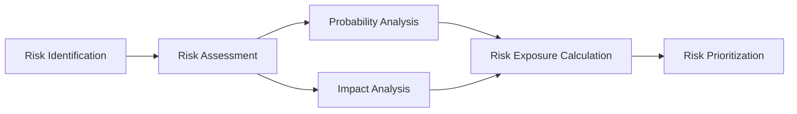

**Risk Assessment Components**:

**Table: Risk Assessment Elements**

| Element | Description | Scale |
|---|---|---|
| **Probability** | Likelihood of risk occurring | 0.1 to 1.0 |
| **Impact** | Consequences if risk occurs | 1 to 10 |
| **Risk Exposure** | Probability × Impact | Calculated value |
| **Risk Level** | Priority classification | High/Medium/Low |

**Assessment Process**:

**1. Probability Assessment**:

- **Very Low (0.1)**: Unlikely to happen
- **Low (0.3)**: Possible but not probable  
- **Medium (0.5)**: May or may not happen
- **High (0.7)**: Likely to happen
- **Very High (0.9)**: Almost certain

**2. Impact Assessment**:

- **Catastrophic (9-10)**: Project failure
- **Critical (7-8)**: Major delays/cost overrun
- **Marginal (4-6)**: Some impact on schedule/budget
- **Negligible (1-3)**: Little impact

**3. Risk Exposure Calculation**:
**Risk Exposure = Probability × Impact**

**Example Risk Assessment**:

**Table: Sample Risk Analysis**

| Risk | Probability | Impact | Exposure | Priority |
|---|---|---|---|---|
| **Key developer leaves** | 0.3 | 8 | 2.4 | Medium |
| **Requirements change** | 0.7 | 6 | 4.2 | High |
| **Technology failure** | 0.2 | 9 | 1.8 | Low |
| **Budget cuts** | 0.4 | 7 | 2.8 | Medium |

**Risk Matrix**:

- **High Priority**: Exposure > 4.0
- **Medium Priority**: Exposure 2.0-4.0  
- **Low Priority**: Exposure < 2.0

**Assessment Benefits**:

- **Objective prioritization**: Data-driven decisions
- **Resource allocation**: Focus on high-risk items
- **Communication tool**: Clear risk communication
- **Planning input**: Influences project planning

**Mnemonic**: "Probability Impact Exposure Priority"

---

## Question 5(a) [3 marks]

**Explain code inspection technique in code review.**

**Answer**:

**Code Inspection** is formal, systematic examination of code to find defects.

**Table: Code Inspection Process**

| Phase | Participants | Activities |
|---|---|---|
| **Planning** | Moderator | Schedule inspection, distribute code |
| **Overview** | Author, Team | Author explains code |
| **Preparation** | Individual | Each reviewer studies code |
| **Inspection** | All reviewers | Find defects systematically |
| **Rework** | Author | Fix identified defects |
| **Follow-up** | Moderator | Verify fixes |

**Key Features**:

- **Formal process**: Structured approach with defined roles
- **Systematic review**: Line-by-line examination
- **Defect focused**: Find errors, not solutions
- **No author criticism**: Focus on code, not coder

**Benefits**: Early defect detection, knowledge sharing, improved code quality

**Mnemonic**: "Plan Overview Prepare Inspect Rework Follow-up"

---

## Question 5(b) [4 marks]

**Prepare at least four test cases of ATM.**

**Answer**:

**ATM Test Cases** verify automated teller machine functionality.

**Table: ATM Test Cases**

| Test Case ID | Test Scenario | Input | Expected Output | Result |
|---|---|---|---|---|
| **TC001** | Valid PIN Entry | Correct 4-digit PIN | Access granted, main menu displayed | Pass/Fail |
| **TC002** | Invalid PIN Entry | Wrong PIN (3 attempts) | Card blocked, error message | Pass/Fail |
| **TC003** | Cash Withdrawal | Amount ≤ Account balance | Cash dispensed, receipt printed | Pass/Fail |
| **TC004** | Insufficient Balance | Amount > Account balance | Transaction declined, balance shown | Pass/Fail |

**Detailed Test Cases**:

**Test Case 1: Valid Login**

- **Precondition**: ATM is operational, card inserted
- **Steps**: Enter correct PIN → Press Enter
- **Expected**: Main menu with options displayed

**Test Case 2: Cash Withdrawal**

- **Precondition**: User logged in, sufficient balance
- **Steps**: Select Withdrawal → Enter amount → Confirm
- **Expected**: Cash dispensed, balance updated

**Test Case 3: Balance Inquiry**

- **Precondition**: User logged in
- **Steps**: Select Balance Inquiry
- **Expected**: Current balance displayed on screen

**Test Case 4: PIN Change**

- **Precondition**: User logged in
- **Steps**: Select Change PIN → Enter old PIN → Enter new PIN → Confirm
- **Expected**: PIN changed successfully, confirmation message

**Mnemonic**: "Login Withdraw Inquiry Change"

---

## Question 5(c) [7 marks]

**Describe white box testing.**

**Answer**:

**White Box Testing** examines internal code structure and logic paths.

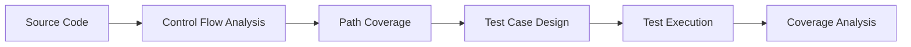

**Table: White Box Testing Characteristics**

| Aspect | Description |
|---|---|
| **Focus** | Internal code structure |
| **Knowledge** | Code implementation details |
| **Coverage** | Statements, branches, paths |
| **Techniques** | Basis path, loop testing |
| **Tools** | Code coverage analyzers |

**Coverage Criteria**:

**Table: Coverage Types**

| Coverage Type | Description | Goal |
|---|---|---|
| **Statement Coverage** | Execute every statement | 100% statements |
| **Branch Coverage** | Execute every branch | All if-else paths |
| **Path Coverage** | Execute every path | All possible paths |
| **Condition Coverage** | Test all conditions | True/false for each condition |

**White Box Testing Techniques**:

**1. Basis Path Testing**:

- Calculate **Cyclomatic Complexity**: V(G) = E - N + 2
- E = Edges, N = Nodes in control flow graph
- Generate independent paths equal to V(G)

**2. Loop Testing**:

- **Simple loops**: Test 0, 1, 2, typical, max iterations
- **Nested loops**: Test inner loop first, then outer
- **Concatenated loops**: Test as separate loops

**3. Condition Testing**:

- Test all logical conditions (AND, OR, NOT)
- Ensure each condition evaluates to true and false

**Example: Simple Code Testing**
```
if (age >= 18 AND income > 25000)
    approve_loan();
else
    reject_loan();
```

**Test Cases**:

- age=20, income=30000 (both true) → approve
- age=16, income=30000 (first false) → reject  
- age=20, income=20000 (second false) → reject
- age=16, income=20000 (both false) → reject

**Advantages**:

- **Thorough testing**: Tests internal logic
- **Early defect detection**: Finds logic errors
- **Coverage measurement**: Quantifiable testing progress

**Disadvantages**:

- **Time consuming**: Requires code knowledge
- **Expensive**: Needs skilled testers
- **Maintenance**: Changes with code updates

**Tools**: JUnit (Java), NUnit (.NET), Coverage.py (Python)

**Mnemonic**: "Statement Branch Path Condition" for coverage types

---

## Question 5(a) OR [3 marks]

**Explain code walk through Technique in code review.**

**Answer**:

**Code Walk Through** is informal code review technique where author presents code to team.

**Table: Walk Through Process**

| Phase | Description | Duration |
|---|---|---|
| **Preparation** | Author prepares presentation | 30 minutes |
| **Presentation** | Author explains code logic | 1-2 hours |
| **Discussion** | Team asks questions, suggests improvements | 30 minutes |
| **Documentation** | Record issues and action items | 15 minutes |

**Key Characteristics**:

- **Author-led**: Code author drives the session
- **Informal process**: Less structured than inspection
- **Educational**: Team learns about code functionality
- **Collaborative**: Open discussion encouraged

**Participants**:

- **Author**: Presents and explains code
- **Reviewers**: Ask questions and provide feedback
- **Moderator**: Keeps discussion focused (optional)

**Benefits**: Knowledge sharing, early problem detection, team collaboration, learning opportunity

**Mnemonic**: "Prepare Present Discuss Document"

---

## Question 5(b) OR [4 marks]

**Explain software documentation.**

**Answer**:

**Software Documentation** provides information about software system for various stakeholders.

**Table: Documentation Types**

| Type | Purpose | Audience |
|---|---|---|
| **User Documentation** | How to use software | End users |
| **System Documentation** | Technical details | Developers, maintainers |
| **Process Documentation** | Development process | Project team |
| **Requirements Documentation** | What system should do | All stakeholders |

**Internal Documentation**:

- **Code comments**: Explain complex logic
- **Function headers**: Describe purpose and parameters  
- **Variable names**: Self-documenting identifiers
- **README files**: Project overview and setup

**External Documentation**:

- **User manuals**: Step-by-step usage instructions
- **Installation guides**: Setup procedures
- **API documentation**: Interface specifications
- **Training materials**: Educational content

**Benefits**:

- **Maintainability**: Easier code updates
- **Knowledge transfer**: New team members learn faster
- **User support**: Reduces support requests
- **Quality assurance**: Documents requirements and design

**Documentation Standards**: Consistent format, regular updates, version control, accessibility

**Mnemonic**: "User System Process Requirements" for types

---

## Question 5(c) OR [7 marks]

**Write a short note on black box testing.**

**Answer**:

**Black Box Testing** examines software functionality without knowledge of internal code structure.

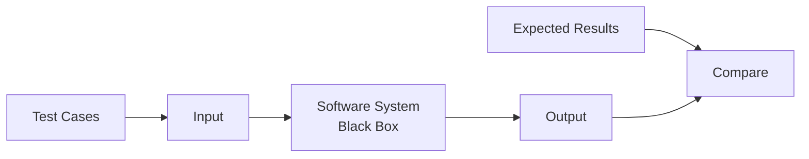

**Table: Black Box Testing Characteristics**

| Aspect | Description |
|---|---|
| **Focus** | External behavior |
| **Knowledge** | Requirements and specifications |
| **Approach** | Input-output relationship |
| **Coverage** | Functional requirements |
| **Perspective** | User viewpoint |

**Black Box Testing Techniques**:

**Table: Testing Techniques**

| Technique | Description | Example |
|---|---|---|
| **Equivalence Partitioning** | Divide inputs into valid/invalid classes | Age: 0-17, 18-65, >65 |
| **Boundary Value Analysis** | Test at boundaries | Test age: 17, 18, 65, 66 |
| **Decision Table** | Complex business rules | Insurance premium calculation |
| **State Transition** | System state changes | ATM states: idle, processing, error |

**1. Equivalence Partitioning**:

- **Valid partitions**: Accepted inputs
- **Invalid partitions**: Rejected inputs
- **Test one value** from each partition

**Example**: Password length (6-12 characters)

- Valid: 6-12 characters
- Invalid: <6 characters, >12 characters

**2. Boundary Value Analysis**:

- Test **minimum, maximum, just below minimum, just above maximum**
- Most errors occur at boundaries

**Example**: For range 1-100

- Test: 0, 1, 2, 99, 100, 101

**3. Decision Table Testing**:

- **Conditions**: Input conditions
- **Actions**: Expected outputs
- **Rules**: Condition-action combinations

**Advantages**:

- **User perspective**: Tests from user viewpoint
- **No code knowledge needed**: Testers don't need programming skills
- **Unbiased**: Not influenced by code implementation
- **Early testing**: Can start with requirements

**Disadvantages**:

- **Limited coverage**: May miss some code paths
- **Redundant testing**: Might test same logic multiple times
- **Difficult test case design**: Hard without internal knowledge

**Types of Black Box Testing**:

- **Functional Testing**: Core functionality
- **Non-functional Testing**: Performance, usability
- **Regression Testing**: After changes
- **User Acceptance Testing**: Final validation

**Tools**: Selenium (web), Appium (mobile), TestComplete, QTP

**When to Use**: 

- System testing phase
- User acceptance testing
- Integration testing
- Regression testing

**Mnemonic**: "Equivalence Boundary Decision State" for techniques
