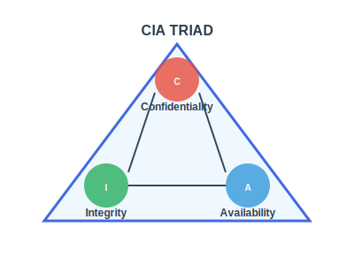
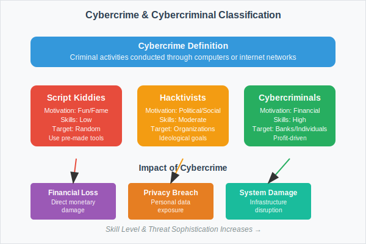
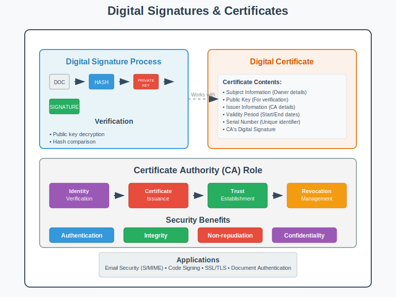

## પ્રશ્ન 1(અ) [3 ગુણ]

**ઉદાહરણ સાથે CIA ત્રિપુટીનું વર્ણન કરો.**

**જવાબ:**

**CIA ત્રિપુટીના ઘટકો:**

| ઘટક | વ્યાખ્યા | ઉદાહરણ |
|-----|--------|---------|
| **કન્ફિડેન્શિયાલિટી** | અનધિકૃત એક્સેસથી ડેટાનું રક્ષણ | બેંક એકાઉન્ટ પર પાસવર્ડ પ્રોટેક્શન |
| **ઇન્ટેગ્રિટી** | ડેટાની ચોકસાઈ અને સંપૂર્ણતા | ડોક્યુમેન્ટ પર ડિજિટલ સહી |
| **એવેઇલેબિલિટી** | જરૂરિયાત મુજબ સિસ્ટમની ઉપલબ્ધતા | 24/7 ઓનલાઇન બેંકિંગ સેવાઓ |

- **કન્ફિડેન્શિયાલિટી**: માત્ર અધિકૃત વપરાશકર્તાઓ જ સંવેદનશીલ માહિતી એક્સેસ કરી શકે
- **ઇન્ટેગ્રિટી**: ટ્રાન્સમિશન દરમિયાન ડેટા ચોક્કસ અને અપરિવર્તિત રહે
- **એવેઇલેબિલિટી**: સિસ્ટમો કાયદેસર વપરાશકર્તાઓ માટે કાર્યરત અને સુલભ રહે

**મેમરી ટ્રીક:** "CIA માહિતી ને સુરક્ષિત રાખે"

## પ્રશ્ન 1(બ) [4 ગુણ]

**પબ્લિક કી અને પ્રાઇવેટ કી ક્રિપ્ટોગ્રાફી સમજાવો.**

**જવાબ:**

**પબ્લિક કી ક્રિપ્ટોગ્રાફી (એસિમેટ્રિક):**

**મુખ્ય લક્ષણો:**

| વિશેષતા | પબ્લિક કી | પ્રાઇવેટ કી |
|---------|-----------|-------------|
| **વિતરણ** | મુક્તપણે શેર કરાય | ગુપ્ત રાખાય |
| **ઉપયોગ** | એન્ક્રિપ્શન/વેરિફિકેશન | ડિક્રિપ્શન/સાઇનિંગ |
| **સુરક્ષા** | જાહેર હોઈ શકે | સુરક્ષિત રાખવી જરૂરી |

- **પબ્લિક કી**: એન્ક્રિપ્શન અને સિગ્નેચર વેરિફિકેશન માટે
- **પ્રાઇવેટ કી**: ડિક્રિપ્શન અને ડિજિટલ સાઇનિંગ માટે
- **સુરક્ષા**: ગાણિતિક જટિલતા પર આધારિત (RSA, ECC અલ્ગોરિધમ)

**મેમરી ટ્રીક:** "પબ્લિક એન્ક્રિપ્ટ કરે, પ્રાઇવેટ ડિક્રિપ્ટ કરે"

## પ્રશ્ન 1(ક) [7 ગુણ]

**OSI મોડેલના દરેક સ્તર સાથે સંકળાયેલ વિવિધ સુરક્ષા હુમલાઓ, પદ્ધતિઓ અને સેવાઓ સમજાવો.**

**જવાબ:**

**OSI સુરક્ષા ફ્રેમવર્ક:**

| સ્તર | હુમલાઓ | પદ્ધતિઓ | સેવાઓ |
|-----|---------|----------|--------|
| **ફિઝિકલ** | વાયરટેપિંગ, જેમિંગ | ફિઝિકલ સિક્યોરિટી, શિલ્ડિંગ | એક્સેસ કંટ્રોલ |
| **ડેટા લિંક** | MAC ફ્લડિંગ, ARP પોઇઝનિંગ | એન્ક્રિપ્શન, ઓથેન્ટિકેશન | ફ્રેમ ઇન્ટેગ્રિટી |
| **નેટવર્ક** | IP સ્પૂફિંગ, રાઉટિંગ એટેક | IPSec, ફાયરવોલ | પેકેટ ફિલ્ટરિંગ |
| **ટ્રાન્સપોર્ટ** | સેશન હાઇજેકિંગ, SYN ફ્લડિંગ | SSL/TLS, પોર્ટ સિક્યોરિટી | એન્ડ-ટુ-એન્ડ સિક્યોરિટી |
| **સેશન** | સેશન રિપ્લે, હાઇજેકિંગ | સેશન ટોકન, ટાઇમઆઉટ | સેશન મેનેજમેન્ટ |
| **પ્રેઝન્ટેશન** | ડેટા કરપ્શન, ફોર્મેટ એટેક | એન્ક્રિપ્શન, કમ્પ્રેશન | ડેટા ટ્રાન્સફોર્મેશન |
| **એપ્લિકેશન** | મેલવેર, સોશિયલ એન્જિનિયરિંગ | એન્ટિવાયરસ, યુઝર ટ્રેનિંગ | એપ્લિકેશન સિક્યોરિટી |

**મુખ્ય સુરક્ષા સેવાઓ:**

- **ઓથેન્ટિકેશન**: યુઝર આઇડેન્ટિટી વેરિફિકેશન
- **ઓથોરાઇઝેશન**: એક્સેસ પરમિશન કંટ્રોલ
- **નોન-રિપ્યુડિએશન**: ક્રિયાઓનો ઇનકાર અટકાવવો
- **ડેટા ઇન્ટેગ્રિટી**: ડેટાની ચોકસાઈ સુનિશ્ચિત કરવી

**મેમરી ટ્રીક:** "બધા લોકોને ડેટા પ્રોટેક્શનની જરૂર છે"

## પ્રશ્ન 1(ક અથવા) [7 ગુણ]

**MD5 હેશિંગ અને સિક્યોર હેશ ફંક્શન (SHA) અલ્ગોરિધમ સમજાવો.**

**જવાબ:**

**હેશ ફંક્શન સરખામણી:**

| વિશેષતા | MD5 | SHA-1 | SHA-256 |
|---------|-----|-------|---------|
| **આઉટપુટ સાઇઝ** | 128 બિટ્સ | 160 બિટ્સ | 256 બિટ્સ |
| **સુરક્ષા સ્તર** | નબળું | નબળું | મજબૂત |
| **ઝડપ** | ઝડપી | મધ્યમ | ધીમું |
| **વર્તમાન સ્થિતિ** | અપ્રચલિત | અપ્રચલિત | ભલામણ કરેલ |

**હેશ ગુણધર્મો:**

- **ડિટર્મિનિસ્ટિક**: સમાન ઇનપુટ સમાન હેશ આપે
- **એવેલાન્ચ ઇફેક્ટ**: નાનો ઇનપુટ ફેરફાર મોટો હેશ ફેરફાર લાવે
- **વન-વે ફંક્શન**: હેશથી મૂળ ડેટા મેળવી શકાતો નથી
- **કોલિઝન રેઝિસ્ટન્ટ**: બે અલગ ઇનપુટ માટે સમાન હેશ મળવો મુશ્કેલ

**એપ્લિકેશન:**

- પાસવર્ડ સ્ટોરેજ અને વેરિફિકેશન
- ડિજિટલ સિગ્નેચર અને સર્ટિફિકેટ
- ડેટા ઇન્ટેગ્રિટી ચેકિંગ

**મેમરી ટ્રીક:** "હેશ હંમેશા સમાન આઉટપુટ આપે"

## પ્રશ્ન 2(અ) [3 ગુણ]

**ફાયરવોલ શું છે? તેના પ્રકારોની યાદી આપો.**

**જવાબ:**

**ફાયરવોલ વ્યાખ્યા:**
નેટવર્ક સિક્યોરિટી ડિવાઇસ જે સુરક્ષા નિયમોના આધારે આવતા-જતા ટ્રાફિકને મોનિટર અને કંટ્રોલ કરે છે.

**ફાયરવોલના પ્રકારો:**

| પ્રકાર | ફંક્શન | સ્તર |
|------|-------|-----|
| **પેકેટ ફિલ્ટર** | પેકેટ હેડર તપાસે | નેટવર્ક લેયર |
| **સ્ટેટફુલ** | કનેક્શન સ્ટેટ ટ્રેક કરે | ટ્રાન્સપોર્ટ લેયર |
| **એપ્લિકેશન પ્રોક્સી** | એપ્લિકેશન ડેટા તપાસે | એપ્લિકેશન લેયર |
| **પર્સનલ ફાયરવોલ** | વ્યક્તિગત ડિવાઇસ સુરક્ષા | હોસ્ટ-બેસ્ડ |

- **હાર્ડવેર ફાયરવોલ**: સમર્પિત નેટવર્ક ઉપકરણ
- **સોફ્ટવેર ફાયરવોલ**: વ્યક્તિગત કમ્પ્યુટર પર ઇન્સ્ટોલ
- **ક્લાઉડ ફાયરવોલ**: સેવા તરીકે પૂરો પાડવામાં આવે (FWaaS)

**મેમરી ટ્રીક:** "ફાયરવોલ હંમેશા નેટવર્કનું રક્ષણ કરે"

## પ્રશ્ન 2(બ) [4 ગુણ]

**વ્યાખ્યાયિત કરો: HTTPS અને HTTPS ના કાર્યનું વર્ણન કરો.**

**જવાબ:**

**HTTPS વ્યાખ્યા:**
Hypertext Transfer Protocol Secure - SSL/TLS એન્ક્રિપ્શન પર HTTP.

**HTTPS કાર્ય પ્રક્રિયા:**

**HTTPS ઘટકો:**

- **પોર્ટ 443**: સ્ટાન્ડર્ડ HTTPS પોર્ટ
- **SSL/TLS**: એન્ક્રિપ્શન પ્રોટોકોલ
- **ડિજિટલ સર્ટિફિકેટ**: સર્વર ઓથેન્ટિકેશન
- **સિમેટ્રિક એન્ક્રિપ્શન**: ડેટા ટ્રાન્સમિશન

**ફાયદાઓ:**

- ટ્રાન્સમિશન દરમિયાન ડેટા એન્ક્રિપ્શન
- સર્વર ઓથેન્ટિકેશન વેરિફિકેશન
- ડેટા ઇન્ટેગ્રિટી પ્રોટેક્શન
- SEO રેંકિંગ સુધારો

**મેમરી ટ્રીક:** "HTTPS વેબ ટ્રાફિકને સુરક્ષિત કરે"

## પ્રશ્ન 2(ક) [7 ગુણ]

**વિવિધ પ્રકારના દુર્ભાવનાપૂર્ણ સોફ્ટવેર અને તેમની અસર સમજાવો.**

**જવાબ:**

**મેલવેર વર્કિંગ્રેડ:**

| પ્રકાર | વર્તન | અસર | ઉદાહરણ |
|------|-------|-----|---------|
| **વાયરસ** | ફાઇલો સાથે જોડાય | ફાઇલ કરપ્શન | બૂટ સેક્ટર વાયરસ |
| **વોર્મ** | સ્વ-પ્રતિકૃતિ | નેટવર્ક ભીડ | કન્ફિકર વોર્મ |
| **ટ્રોજન** | છદ્મવેશી મેલવેર | ડેટા ચોરી | બેંકિંગ ટ્રોજન |
| **રેન્સમવેર** | ફાઇલો એન્ક્રિપ્ટ કરે | ડેટા બંધક | WannaCry |
| **સ્પાયવેર** | પ્રવૃત્તિ મોનિટર કરે | ગોપનીયતા ભંગ | કીલોગર |
| **એડવેર** | અનચાહેલી જાહેરાતો | પ્રદર્શન ઘટાડો | પોપ-અપ જાહેરાતો |
| **રૂટકિટ** | હાજરી છુપાવે | સિસ્ટમ સમાધાન | કર્નલ રૂટકિટ |

**સિસ્ટમ પર અસરો:**

- **પ્રદર્શન**: ધીમી સિસ્ટમ પ્રતિક્રિયા
- **ડેટા**: નુકસાન, કરપ્શન અથવા ચોરી
- **ગોપનીયતા**: અનધિકૃત મોનિટરિંગ
- **નાણાકીય**: પ્રત્યક્ષ નાણાકીય નુકસાન

**રોકથામના પદ્ધતિઓ:**

- નિયમિત એન્ટિવાયરસ અપડેટ
- સુરક્ષિત બ્રાઉઝિંગ પ્રેક્ટિસ
- ઇમેઇલ એટેચમેન્ટમાં સાવધાની
- સિસ્ટમ સિક્યોરિટી પેચ

**મેમરી ટ્રીક:** "વાયરસ વોર્મ ટ્રોજન ખરેખર બધા સંસાધનો ચોરે"

## પ્રશ્ન 2(અ અથવા) [3 ગુણ]

**પ્રમાણીકરણ(ઓથેન્ટિકેશન) શું છે? પ્રમાણીકરણ(ઓથેન્ટિકેશન) ની વિવિધ પદ્ધતિઓ સમજાવો.**

**જવાબ:**

**ઓથેન્ટિકેશન વ્યાખ્યા:**
સિસ્ટમ એક્સેસ આપતા પહેલા યુઝર આઇડેન્ટિટી વેરિફાઇ કરવાની પ્રક્રિયા.

**ઓથેન્ટિકેશન પદ્ધતિઓ:**

| પદ્ધતિ | વર્ણન | ઉદાહરણ |
|-------|--------|---------|
| **પાસવર્ડ** | તમે જે જાણો છો | PIN, પાસફ્રેઝ |
| **બાયોમેટ્રિક** | તમે જે છો | ફિંગરપ્રિન્ટ, આઇરિસ |
| **ટોકન** | તમારી પાસે જે છે | સ્માર્ટ કાર્ડ, USB કી |

- **સિંગલ-ફેક્ટર**: એક ઓથેન્ટિકેશન પદ્ધતિ વાપરે
- **મલ્ટિ-ફેક્ટર**: અનેક પદ્ધતિઓ જોડે
- **ટુ-ફેક્ટર (2FA)**: બરાબર બે ફેક્ટર વાપરે

**મેમરી ટ્રીક:** "પાસવર્ડ બાયોમેટ્રિક ટોકન ઓથેન્ટિકેશન"

## પ્રશ્ન 2(બ અથવા) [4 ગુણ]

**વ્યાખ્યાયિત કરો: ટ્રોજન્સ, રૂટકિટ, બેકડોર્સ, કીલોગર**

**જવાબ:**

**મેલવેર વ્યાખ્યાઓ:**

| શબ્દ | વ્યાખ્યા | લક્ષણો |
|-----|--------|---------|
| **ટ્રોજન્સ** | કાયદેસર સોફ્ટવેરના છદ્મવેશમાં મેલવેર | હાનિકારક દેખાય, છુપાયેલ પેલોડ |
| **રૂટકિટ** | મેલવેરની હાજરી છુપાવતો સોફ્ટવેર | ઊંડી સિસ્ટમ એક્સેસ, સ્ટેલ્થ ઓપરેશન |
| **બેકડોર્સ** | અનધિકૃત એક્સેસ પદ્ધતિ | સામાન્ય ઓથેન્ટિકેશન બાયપાસ કરે |
| **કીલોગર** | કીબોર્ડ ઇનપુટ રેકોર્ડ કરે | પાસવર્ડ, સંવેદનશીલ ડેટા કેપ્ચર કરે |

- **ટ્રોજન્સ**: ગ્રીક ટ્રોજન હોર્સ પરથી નામ
- **રૂટકિટ**: કર્નલ લેવલ પર કામ કરે
- **બેકડોર્સ**: હાર્ડવેર અથવા સોફ્ટવેર આધારિત હોઈ શકે
- **કીલોગર**: સોફ્ટવેર અથવા હાર્ડવેર ડિવાઇસ હોઈ શકે

**મેમરી ટ્રીક:** "ટ્રોજન રૂટ બેકડોર કીલોગ"

## પ્રશ્ન 2(ક અથવા) [7 ગુણ]

**સિક્યોર સોકેટ લેયર (SSL) અને ટ્રાન્સપોર્ટ લેયર સિક્યોરિટી (TLS) પ્રોટોકોલ સમજાવો.**

**જવાબ:**

**SSL/TLS પ્રોટોકોલ ઉત્ક્રાંતિ:**

| વર્ઝન | વર્ષ | સ્થિતિ | સુરક્ષા સ્તર |
|--------|-----|-------|-------------|
| **SSL 2.0** | 1995 | અપ્રચલિત | નબળું |
| **SSL 3.0** | 1996 | અપ્રચલિત | સંવેદનશીલ |
| **TLS 1.0** | 1999 | લેગસી | મર્યાદિત |
| **TLS 1.2** | 2008 | વ્યાપક ઉપયોગ | સારું |
| **TLS 1.3** | 2018 | વર્તમાન | મજબૂત |

**TLS હેન્ડશેક પ્રક્રિયા:**

**મુખ્ય વિશેષતાઓ:**

- **એન્ક્રિપ્શન**: સિમેટ્રિક અને એસિમેટ્રિક અલ્ગોરિધમ
- **ઓથેન્ટિકેશન**: સર્વર અને ક્લાયન્ટ વેરિફિકેશન
- **ઇન્ટેગ્રિટી**: મેસેજ ઓથેન્ટિકેશન કોડ
- **ફોરવર્ડ સિક્રેસી**: સેશન કી પ્રોટેક્શન

**એપ્લિકેશન:**

- HTTPS વેબ બ્રાઉઝિંગ
- ઇમેઇલ સિક્યોરિટી (SMTPS)
- VPN કનેક્શન
- સુરક્ષિત ફાઇલ ટ્રાન્સફર

**મેમરી ટ્રીક:** "TLS બધા નેટવર્ક ટ્રાફિકને એન્ક્રિપ્ટ કરે"

## પ્રશ્ન 3(અ) [3 ગુણ]

**સાયબર ક્રાઇમ અને સાયબરક્રિમિનલ ને વિગતવાર સમજાવો.**

**જવાબ:**

**સાયબર ક્રાઇમ વ્યાખ્યા:**
કમ્પ્યુટર અથવા ઇન્ટરનેટ નેટવર્ક દ્વારા કરવામાં આવતી ગુનાહિત પ્રવૃત્તિઓ.

**ડાયાગ્રામ:**

**સાયબરક્રિમિનલ પ્રકારો:**

| પ્રકાર | પ્રેરણા | કુશળતા | લક્ષ્ય |
|------|-------|---------|-------|
| **સ્ક્રિપ્ટ કિડીઝ** | મજા/પ્રસિદ્ધિ | ઓછી | અવ્યવસ્થિત |
| **હેક્ટિવિસ્ટ** | રાજકીય/સામાજિક | મધ્યમ | સંસ્થાઓ |
| **સાયબરક્રિમિનલ** | નાણાકીય લાભ | ઉચ્ચ | વ્યક્તિઓ/બેંકો |

- **સાયબર ક્રાઇમ**: ડિજિટલ ટેકનોલોજીનો ઉપયોગ કરીને ગેરકાયદેસર પ્રવૃત્તિઓ
- **સાયબરક્રિમિનલ**: સાયબર ક્રાઇમ કરનાર વ્યક્તિ
- **અસર**: નાણાકીય નુકસાન, ગોપનીયતા ભંગ, સિસ્ટમ નુકસાન

**મેમરી ટ્રીક:** "સાયબર ક્રિમિનલો અરાજકતા સર્જે છે"

## પ્રશ્ન 3(બ) [4 ગુણ]

**સાયબર સ્ટોકિંગ અને સાયબર બુલીંગ નું વર્ણન કરો.**

**જવાબ:**

**ડિજિટલ પજવણી સરખામણી:**

| પાસું | સાયબર સ્ટોકિંગ | સાયબર બુલીંગ |
|------|----------------|---------------|
| **લક્ષ્ય** | વિશિષ્ટ વ્યક્તિ | મોટેભાગે નાબાલિગો |
| **અવધિ** | સતત, લાંબા ગાળાની | એપિસોડિક હોઈ શકે |
| **હેતુ** | ભીતિ, નિયંત્રણ | પજવણી, અપમાન |
| **પ્લેટફોર્મ** | સોશિયલ મીડિયા, ઇમેઇલ | શાળાઓ, ગેમિંગ પ્લેટફોર્મ |

**સાયબર સ્ટોકિંગ લક્ષણો:**

- સતત અનચાહેલ સંપર્ક
- પીડિતની ઓનલાઇન પ્રવૃત્તિનું મોનિટરિંગ
- ધમકીભર્યા સંદેશાઓ અથવા વર્તન
- ઓળખની ચોરી અથવા ઢોંગ

**સાયબર બુલીંગ સ્વરૂપો:**

- ઓનલાઇન જાહેર અપમાન
- ડિજિટલ જૂથોમાંથી બાકાત
- ખોટી માહિતી ફેલાવવી
- સંમતિ વિના ખાનગી સામગ્રી શેર કરવી

**રોકથામના પગલાં:**

- સોશિયલ મીડિયા પર ગોપનીયતા સેટિંગ્સ
- પ્લેટફોર્મને પજવણીની જાણ કરવી
- જરૂર પડે ત્યારે કાયદેસીની કાર્યવાહી
- ડિજિટલ સાક્ષરતા શિક્ષણ

**મેમરી ટ્રીક:** "બુલીંગ બંધ કરો, સ્ટોકિંગની જાણ કરો"

## પ્રશ્ન 3(ક) [7 ગુણ]

**સાયબર ક્રાઇમમાં પ્રોપર્ટી બેઇઝ્ડ ક્લાસિફિકેશન સમજાવો.**

**જવાબ:**

**પ્રોપર્ટી-આધારિત સાયબર ક્રાઇમ શ્રેણીઓ:**

| શ્રેણી | ક્રાઇમ પ્રકાર | વર્ણન | ઉદાહરણ |
|-------|-------------|-------|---------|
| **બૌદ્ધિક સંપત્તિ** | કોપીરાઇટ ઉલ્લંઘન | કોપીરાઇટ સામગ્રીનો અનધિકૃત ઉપયોગ | સોફ્ટવેર પાયરેસી |
| **નાણાકીય સંપત્તિ** | ક્રેડિટ કાર્ડ ફ્રોડ | નાણાકીય માહિતીનો અનધિકૃત ઉપયોગ | ઓનલાઇન શોપિંગ ફ્રોડ |
| **ડિજિટલ સંપત્તિ** | ડેટા ચોરી | ડિજિટલ માહિતીની ચોરી | ડેટાબેસ બ્રીચ |
| **વર્ચ્યુઅલ સંપત્તિ** | ગેમિંગ એસેટ ચોરી | વર્ચ્યુઅલ વસ્તુઓની ચોરી | ઓનલાઇન ગેમ કરન્સી ચોરી |

**ડાયાગ્રામ:**

**કાયદેસરના પાસાઓ:**

- **કોપીરાઇટ કાયદાઓ**: સર્જનાત્મક કાર્યોનું રક્ષણ
- **ટ્રેડમાર્ક કાયદાઓ**: બ્રાન્ડ ઓળખનું રક્ષણ
- **પેટન્ટ કાયદાઓ**: આવિષ્કારોનું રક્ષણ
- **ટ્રેડ સિક્રેટ કાયદાઓ**: ગોપનીય માહિતીનું રક્ષણ

**અર્થતંત્ર પર અસર:**

- કાયદેસર વ્યવસાયો માટે આવકનું નુકસાન
- નવીનતાની પ્રેરણામાં ઘટાડો
- ગ્રાહક વિશ્વાસનું ધોવાણ
- કાયદેસર અમલીકરણના ખર્ચ

**રોકથામ વ્યૂહરચનાઓ:**

- ડિજિટલ રાઇટ્સ મેનેજમેન્ટ (DRM)
- વોટરમાર્કિંગ અને ટ્રેકિંગ
- કાયદેસર અમલીકરણ મિકેનિઝમ
- જાહેર જાગૃતિ ઝુંબેશ

**મેમરી ટ્રીક:** "પ્રોપર્ટી પ્રોટેક્શન પાયરેસી અટકાવે"

## પ્રશ્ન 3(અ અથવા) [3 ગુણ]

**ડેટા ડિડલિંગ સમજાવો.**

**જવાબ:**

**ડેટા ડિડલિંગ વ્યાખ્યા:**
કમ્પ્યુટર સિસ્ટમમાં ડેટા દાખલ કરતા પહેલા અથવા દરમિયાન અનધિકૃત ફેરફાર.

**લક્ષણો:**

| પાસું | વર્ણન |
|------|-------|
| **પદ્ધતિ** | ડેટા વેલ્યુમાં ફેરફાર |
| **સમય** | સિસ્ટમ પ્રોસેસિંગ પહેલા |
| **શોધ** | ઘણીવાર ઓળખવું મુશ્કેલ |

- **ઉદાહરણો**: સેલેરી આંકડાઓમાં ફેરફાર, પરીક્ષાના સ્કોરમાં ફેરફાર
- **લક્ષ્ય**: એન્ટ્રી પ્રક્રિયા દરમિયાન ઇનપુટ ડેટા
- **અસર**: નાણાકીય નુકસાન, ખોટા રેકોર્ડ

**મેમરી ટ્રીક:** "ડેટા ડિડલિંગ ડેટાબેસને નુકસાન પહોંચાડે"

## પ્રશ્ન 3(બ અથવા) [4 ગુણ]

**સાયબર સ્પાઇંગ અને સાયબર ટેરરીઝમ સમજાવો.**

**જવાબ:**

**સાયબર ધમકીઓની સરખામણી:**

| પાસું | સાયબર સ્પાઇંગ | સાયબર ટેરરીઝમ |
|------|-------------|---------------|
| **હેતુ** | માહિતી એકત્રીકરણ | ભય/વિક્ષેપ સર્જવો |
| **લક્ષ્ય** | સરકાર, કોર્પોરેશન | નિર્ધારક ઇન્ફ્રાસ્ટ્રક્ચર |
| **પદ્ધતિઓ** | છુપી ઘૂસણખોરી | વિનાશક હુમલાઓ |
| **અસર** | ગુપ્ત માહિતીનું નુકસાન | જાહેર સુરક્ષા જોખમ |

**સાયબર સ્પાઇંગ પ્રવૃત્તિઓ:**

- કોર્પોરેટ જાસૂસી
- સરકારી દેખરેખ
- ટ્રેડ સિક્રેટ ચોરી
- વ્યક્તિગત માહિતી એકત્રીકરણ

**સાયબર ટેરરીઝમ પદ્ધતિઓ:**

- ઇન્ફ્રાસ્ટ્રક્ચર હુમલાઓ
- મોટા પાયે વિક્ષેપ ઝુંબેશ
- મનોવૈજ્ઞાનિક યુદ્ધ
- આર્થિક નુકસાન

**રોકથામના પગલાં:**

- નેટવર્ક સિક્યોરિટી મોનિટરિંગ
- ઘટના પ્રતિક્રિયા આયોજન
- આંતરરાષ્ટ્રીય સહયોગ
- જાહેર-ખાનગી ભાગીદારી

**મેમરી ટ્રીક:** "જાસૂસો ચોરે, આતંકવાદીઓ આતંક"

## પ્રશ્ન 3(ક અથવા) [7 ગુણ]

**સાયબર સુરક્ષામાં ડિજિટલ સહીઓ અને ડિજિટલ પ્રમાણપત્રોની ભૂમિકા સમજાવો.**

**જવાબ:**

**ડિજિટલ સુરક્ષા ઘટકો:**

| ઘટક | હેતુ | ફંક્શન | ફાયદો |
|-----|-----|--------|-------|
| **ડિજિટલ સિગ્નેચર** | ઓથેન્ટિકેશન | મોકલનારની ઓળખ સાબિત કરે | નોન-રિપ્યુડિએશન |
| **ડિજિટલ સર્ટિફિકેટ** | વેરિફિકેશન | પબ્લિક કીની માન્યતા | વિશ્વાસ સ્થાપના |

**ડિજિટલ સિગ્નેચર પ્રક્રિયા:**

**ડિજિટલ સર્ટિફિકેટ ઘટકો:**

- **વિષય માહિતી**: સર્ટિફિકેટ માલિકની વિગતો
- **પબ્લિક કી**: એન્ક્રિપ્શન/વેરિફિકેશન માટે
- **ડિજિટલ સિગ્નેચર**: CA ની સહી
- **માન્યતા અવધિ**: સર્ટિફિકેટની સમાપ્તિ તારીખ

**સર્ટિફિકેટ ઓથોરિટી (CA) ભૂમિકા:**

- ડિજિટલ સર્ટિફિકેટ જારી કરે
- જારી કરતા પહેલા ઓળખ ચકાસે
- સર્ટિફિકેટ રદ કરવાની યાદીઓ જાળવે
- વિશ્વાસ ઇન્ફ્રાસ્ટ્રક્ચર પૂરું પાડે

**સાયબર સિક્યોરિટીમાં એપ્લિકેશન:**

- ઇમેઇલ સિક્યોરિટી (S/MIME)
- સોફ્ટવેર માટે કોડ સાઇનિંગ
- વેબસાઇટો માટે SSL/TLS સર્ટિફિકેટ
- ડોક્યુમેન્ટ ઓથેન્ટિકેશન

**સુરક્ષા ફાયદાઓ:**

- **ઓથેન્ટિકેશન**: મોકલનારની ઓળખ ચકાસે
- **ઇન્ટેગ્રિટી**: ડેટામાં ફેરફાર થયો નથી તેની ખાતરી
- **નોન-રિપ્યુડિએશન**: ક્રિયાઓનો ઇનકાર અટકાવે
- **ગોપનીયતા**: સુરક્ષિત કમ્યુનિકેશન સક્ષમ કરે

**મેમરી ટ્રીક:** "ડિજિટલ સિગ્નેચર ડોક્યુમેન્ટને સુરક્ષિત રીતે પ્રમાણિત કરે"

## પ્રશ્ન 4(અ) [3 ગુણ]

**હેકિંગ શું છે? હેકર્સના પ્રકારોની યાદી બનાવો.**

**જવાબ:**

**હેકિંગ વ્યાખ્યા:**
નબળાઈઓનો ફાયદો ઉઠાવવા માટે કમ્પ્યુટર સિસ્ટમ અથવા નેટવર્કમાં અનધિકૃત એક્સેસ.

**હેકર વર્ગીકરણ:**

| પ્રકાર | હેતુ | કાયદેસર સ્થિતિ |
|------|-----|---------------|
| **વ્હાઇટ હેટ** | સુરક્ષા સુધારણા | કાયદેસર |
| **બ્લેક હેટ** | દુર્ભાવનાપૂર્ણ પ્રવૃત્તિઓ | ગેરકાયદેસર |
| **ગ્રે હેટ** | મિશ્ર પ્રેરણા | શંકાસ્પદ |

- **વ્હાઇટ હેટ**: નૈતિક હેકર, સુરક્ષા સંશોધકો
- **બ્લેક હેટ**: સાયબરક્રિમિનલ, દુર્ભાવનાપૂર્ણ હેતુ
- **ગ્રે હેટ**: કેટલીકવાર કાયદેસર, કેટલીકવાર નહીં

**મેમરી ટ્રીક:** "સફેદ સારું, કાળું ખરાબ, ગ્રે શંકાસ્પદ"

## પ્રશ્ન 4(બ) [4 ગુણ]

**હેકિંગની વલ્નરેબિલિટી અને 0-દિવસની પરિભાષા સમજાવો.**

**જવાબ:**

**સુરક્ષા પરિભાષા:**

| શબ્દ | વ્યાખ્યા | જોખમ સ્તર | ઉદાહરણ |
|--------|-----------|------------|---------|
| **વલ્નરેબિલિટી** | સિસ્ટમની નબળાઈ | વિવિધ | અનપેચ્ડ સોફ્ટવેર |
| **0-દિવસ** | અજાણી નબળાઈ | ગંભીર | અશોધાયેલી ખામી |

**વલ્નરેબિલિટી લક્ષણો:**

- **શોધ**: સુરક્ષા પરીક્ષણ દ્વારા મળે
- **જાહેરાત**: વેન્ડરને જવાબદાર રિપોર્ટિંગ
- **પેચિંગ**: વેન્ડર સુરક્ષા અપડેટ પૂરું પાડે
- **વિંડો**: શોધ અને પેચ વચ્ચેનો સમય

**0-દિવસ હુમલો પ્રક્રિયા:**

- હેકર અજાણી નબળાઈ શોધે
- વેન્ડરની જાણકારી પહેલા ખામીનો ફાયદો ઉઠાવે
- કોઈ ઉપલબ્ધ પેચ અથવા સંરક્ષણ નથી
- આશ્ચર્યના કારણે ઉચ્ચ સફળતા દર

**સંરક્ષણ વ્યૂહરચના:**

- નિયમિત સુરક્ષા અપડેટ
- ઇન્ટ્રુઝન ડિટેક્શન સિસ્ટમ
- વર્તણૂકીય વિશ્લેષણ સાધનો
- ઝીરો-ટ્રસ્ટ સુરક્ષા મોડેલ

**મેમરી ટ્રીક:** "નબળાઈઓને પેચની જરૂર, ઝીરો-ડેને સાવચેતીની જરૂર"

## પ્રશ્ન 4(ક) [7 ગુણ]

**હેકિંગના પાંચ સ્ટેપ્સ સમજાવો.**

**જવાબ:**

**હેકિંગ પદ્ધતિ:**

**વિગતવાર પગલાંઓ:**

| પગલું | વર્ણન | સાધનો/પદ્ધતિઓ | ઉદ્દેશ્ય |
|-------|-------|----------------|--------|
| **રિકોનેસન્સ** | માહિતી એકત્રીકરણ | Google dorking, સોશિયલ મીડિયા | લક્ષ્ય પ્રોફાઇલિંગ |
| **સ્કેનિંગ** | સિસ્ટમ ગણતરી | Nmap, Nessus | નબળાઈ ઓળખ |
| **એક્સેસ મેળવવી** | નબળાઈઓનો ફાયદો | Metasploit, કસ્ટમ એક્સપ્લોઇટ | સિસ્ટમ સમાધાન |
| **એક્સેસ જાળવી રાખવી** | સતત હાજરી | બેકડોર, રૂટકિટ | લાંબા ગાળાનું નિયંત્રણ |
| **ટ્રેક્સ ઢાંકવા** | પુરાવા દૂર કરવા | લોગ સફાઇ, ફાઇલ કાઢવી | શોધ ટાળવી |

**માહિતી એકત્રીકરણ પ્રકારો:**

- **પેસિવ**: લક્ષ્ય સાથે સીધો સંપર્ક નહીં
- **એક્ટિવ**: લક્ષ્ય સિસ્ટમ સાથે સીધી ક્રિયાપ્રતિક્રિયા

**સ્કેનિંગ તકનીકો:**

- ખુલ્લી સેવાઓ માટે પોર્ટ સ્કેનિંગ
- નબળાઈઓ માટે વલ્નરેબિલિટી સ્કેનિંગ
- ટોપોલોજી માટે નેટવર્ક મેપિંગ

**એક્સેસ પદ્ધતિઓ:**

- પાસવર્ડ હુમલાઓ (બ્રુટ ફોર્સ, ડિક્શનેરી)
- નબળાઈઓનો ફાયદો ઉઠાવવો
- સોશિયલ એન્જિનિયરિંગ
- ભૌતિક એક્સેસ

**સ્થાયિત્વ મિકેનિઝમ:**

- બેકડોર ઇન્સ્ટોલ કરવા
- યુઝર એકાઉન્ટ બનાવવા
- ટાસ્ક શેડ્યુલ કરવા
- રજિસ્ટ્રી ફેરફારો

**ટ્રેક કવરિંગ પદ્ધતિઓ:**

- સિસ્ટમ લોગ સાફ કરવા
- કામચલાઉ ફાઇલો કાઢવી
- ટાઇમસ્ટેમ્પ ફેરવવા
- એન્ક્રિપ્શનનો ઉપયોગ

**મેમરી ટ્રીક:** "રિકોનેસન્સ સ્કેન્સ એક્સેસ જનરેટ કરે, કવરેજ જાળવે"

## પ્રશ્ન 4(અ અથવા) [3 ગુણ]

**કાલી લિનક્સના કોઈપણ ત્રણ બેઝિક કમાન્ડ યોગ્ય ઉદાહરણ સાથે સમજાવો.**

**જવાબ:**

**અત્યાવશ્યક કાલી લિનક્સ કમાન્ડ્સ:**

| કમાન્ડ | ફંક્શન | ઉદાહરણ |
|---------|--------|---------|
| **nmap** | નેટવર્ક સ્કેનિંગ | `nmap -sS 192.168.1.1` |
| **netcat** | નેટવર્ક કમ્યુનિકેશન | `nc -l -p 1234` |
| **hydra** | પાસવર્ડ ક્રેકિંગ | `hydra -l admin -P passwords.txt ssh://target` |

- **Nmap**: નેટવર્ક પર હોસ્ટ અને સેવાઓ શોધે છે
- **Netcat**: ડેટા ટ્રાન્સફર માટે નેટવર્ક કનેક્શન બનાવે છે
- **Hydra**: બ્રુટ-ફોર્સ પાસવર્ડ હુમલાઓ કરે છે

**મેમરી ટ્રીક:** "નેટવર્ક મેપ, કનેક્ટ, ક્રેક"

## પ્રશ્ન 4(બ) [4 ગુણ]

**સેશન હાઇજેકિંગનું વિગતવાર વર્ણન કરો.**

**જવાબ:**

**સેશન હાઇજેકિંગ ઓવરવ્યુ:**
હુમલાખોર કાયદેસર યુઝરના સેશનને કબજે કરે છે તે હુમલો.

**સેશન હાઇજેકિંગના પ્રકારો:**

| પ્રકાર | પદ્ધતિ | રોકથામ |
|-------|-------|---------|
| **એક્ટિવ** | સેશન કબજે કરે | મજબૂત સેશન મેનેજમેન્ટ |
| **પેસિવ** | સેશન મોનિટર કરે | એન્ક્રિપ્શન (HTTPS) |
| **નેટવર્ક-લેવલ** | TCP હાઇજેકિંગ | સુરક્ષિત પ્રોટોકોલ |
| **એપ્લિકેશન-લેવલ** | કુકી ચોરી | સુરક્ષિત કુકી એટ્રિબ્યુટ |

**હુમલાની પ્રક્રિયા:**

1. નેટવર્ક ટ્રાફિક મોનિટર કરવું
2. સેશન ઓળખકર્તાઓ કેપ્ચર કરવા
3. સેશન ટોકન્સ રિપ્લે કરવા
4. યુઝર એકાઉન્ટ એક્સેસ કરવું

**રોકથામના પગલાં:**

- બધા કમ્યુનિકેશન માટે HTTPS નો ઉપયોગ
- સુરક્ષિત સેશન મેનેજમેન્ટ અમલીકરણ
- સુરક્ષિત કુકી એટ્રિબ્યુટ સેટ કરવા
- શંકાસ્પદ પ્રવૃત્તિ માટે મોનિટરિંગ

**મેમરી ટ્રીક:** "સેશન હાઇજેકને સુરક્ષિત હેન્ડલિંગની જરૂર"

## પ્રશ્ન 4(ક અથવા) [7 ગુણ]

**વર્ચ્યુઅલ પ્રાઇવેટ નેટવર્ક્સ (VPNs) જાહેર નેટવર્ક્સ પર કેવી રીતે સુરક્ષિત, એન્ક્રિપ્ટેડ કનેક્શન બનાવે છે તે સમજાવો.**

**જવાબ:**

**VPN આર્કિટેક્ચર:**

**VPN ઘટકો:**

| ઘટક | ફંક્શન | ફાયદો |
|-----|--------|-------|
| **ટનલિંગ** | સુરક્ષિત પાથવે બનાવે | ડેટા પ્રોટેક્શન |
| **એન્ક્રિપ્શન** | ડેટાને ઝીણવટથી બદલે | ગોપનીયતા |
| **ઓથેન્ટિકેશન** | ઓળખ ચકાસે | એક્સેસ કંટ્રોલ |
| **IP માસ્કિંગ** | વાસ્તવિક IP છુપાવે | અનામત્વ |

**VPN પ્રોટોકોલ:**

| પ્રોટોકોલ | સુરક્ષા સ્તર | ઝડપ | ઉપયોગ કેસ |
|-----------|-------------|------|----------|
| **OpenVPN** | ઉચ્ચ | સારી | સામાન્ય હેતુ |
| **IPSec** | અત્યંત ઉચ્ચ | મધ્યમ | એન્ટરપ્રાઇઝ |
| **WireGuard** | ઉચ્ચ | ઉત્કૃષ્ટ | આધુનિક સોલ્યુશન |
| **PPTP** | ઓછું | ઝડપી | લેગસી (અપ્રચલિત) |

**VPN કાર્ય પ્રક્રિયા:**

1. **કનેક્શન**: ક્લાઇન્ટ VPN સર્વર સાથે જોડાય
2. **ઓથેન્ટિકેશન**: યુઝર ક્રેડેન્શિયલ ચકાસાય
3. **ટનલ ક્રિએશન**: એન્ક્રિપ્ટેડ પાથવે સ્થાપિત થાય
4. **ડેટા એન્ક્રિપ્શન**: બધો ટ્રાફિક એન્ક્રિપ્ટ થાય
5. **રાઉટિંગ**: ટ્રાફિક VPN સર્વર દ્વારા રાઉટ થાય
6. **ડિક્રિપ્શન**: ગંતવ્ય પર ડેટા ડિક્રિપ્ટ થાય

**સુરક્ષા ફાયદાઓ:**

- **ડેટા પ્રોટેક્શન**: એન્ક્રિપ્શન ઇવ્સડ્રોપિંગ અટકાવે
- **ગોપનીયતા**: IP એડ્રેસ માસ્કિંગ
- **એક્સેસ કંટ્રોલ**: કનેક્શન પહેલા ઓથેન્ટિકેટ કરવું
- **પ્રતિબંધો બાયપાસ**: જીઓ-બ્લોક્ડ કન્ટેન્ટ એક્સેસ કરવું

**વ્યાવસાયિક એપ્લિકેશન:**

- રિમોટ વર્કર એક્સેસ
- સાઇટ-ટુ-સાઇટ કનેક્ટિવિટી
- સુરક્ષિત ક્લાઉડ એક્સેસ
- અનુપાલન આવશ્યકતાઓ

**વ્યક્તિગત ઉપયોગ કેસ:**

- પબ્લિક વાઇ-ફાઇ પ્રોટેક્શન
- ગોપનીયતા વૃદ્ધિ
- કન્ટેન્ટ એક્સેસ
- લોકેશન ગોપનીયતા

**મેમરી ટ્રીક:** "VPN નેટવર્ક પ્રાઇવસી પ્રદાન કરે"

## પ્રશ્ન 5(અ) [3 ગુણ]

**નેટવર્ક ફોરેન્સિક્સ સમજાવો.**

**જવાબ:**

**નેટવર્ક ફોરેન્સિક્સ વ્યાખ્યા:**
સુરક્ષા ઘટનાઓ શોધવા અને વિશ્લેષણ કરવા માટે નેટવર્ક ટ્રાફિકની તપાસ.

**મુખ્ય ઘટકો:**

| ઘટક | હેતુ | સાધનો |
|-----|-----|-------|
| **ટ્રાફિક કેપ્ચર** | નેટવર્ક ડેટા રેકોર્ડ કરવો | Wireshark, tcpdump |
| **વિશ્લેષણ** | પેટર્ન તપાસવા | NetworkMiner, Snort |
| **પુરાવા** | શોધોનો ઇનકાર અટકાવવો | ફોરેન્સિક રિપોર્ટ |

- **અવકાશ**: પેકેટ્સ, ફ્લોઝ અને નેટવર્ક વર્તણૂકનું વિશ્લેષણ
- **ઉદ્દેશ્ય**: સુરક્ષા ભંગ અને હુમલાના પેટર્ન ઓળખવા
- **પડકાર**: મોટા ડેટા વોલ્યુમ અને રીઅલ-ટાઇમ પ્રોસેસિંગ

**મેમરી ટ્રીક:** "નેટવર્ક ફોરેન્સિક્સ તથ્યો શોધે"

## પ્રશ્ન 5(બ) [4 ગુણ]

**ડિજિટલ ફોરેન્સિક તપાસમાં પુરાવા તરીકે CCTV શા માટે મહત્વની ભૂમિકા ભજવે છે તે સમજાવો.**

**જવાબ:**

**ડિજિટલ ફોરેન્સિક્સમાં CCTV:**

| પાસું | મહત્વ | મૂલ્ય |
|------|-------|------|
| **વિઝ્યુઅલ પુરાવા** | સીધું અવલોકન | ઉચ્ચ વિશ્વસનીયતા |
| **ટાઇમલાઇન** | સમય-સ્ટેમ્પ રેકોર્ડ | ઘટના સહસંબંધ |
| **ડિજિટલ ફોર્મેટ** | વિશ્લેષણ કરવામાં સરળ | મેટાડેટા એક્સટ્રેક્શન |
| **બેકઅપ** | બહુવિધ કોપીઓ | પુરાવા સંરક્ષણ |

**પુરાવાનું મૂલ્ય:**

- **સમર્થન**: અન્ય ડિજિટલ પુરાવાઓને સમર્થન આપે
- **ટાઇમલાઇન**: ઘટનાઓનો ક્રમ સ્થાપિત કરે
- **ઓળખ**: ગુનેગારની ઓળખ પ્રગટ કરી શકે
- **સંદર્ભ**: ઘટના દરમિયાન ભૌતિક વાતાવરણ દર્શાવે

**ફોરેન્સિક વિચારણાઓ:**

- **ચેઇન ઓફ કસ્ટોડી**: યોગ્ય પુરાવા હેન્ડલિંગ
- **ઓથેન્ટિકેશન**: વિડિયો અખંડિતતા ચકાસવી
- **વિશ્લેષણ**: વૃદ્ધિ અને અર્થઘટન
- **કાયદેસરી સ્વીકાર્યતા**: કોર્ટ-સ્વીકાર્ય ફોર્મેટ

**મેમરી ટ્રીક:** "CCTV ગુનાહિત વર્તણૂકને સ્પષ્ટ રીતે કેપ્ચર કરે"

## પ્રશ્ન 5(ક) [7 ગુણ]

**ડિજિટલ ફોરેન્સિક તપાસના તબક્કાઓ સમજાવો.**

**જવાબ:**

**ડિજિટલ ફોરેન્સિક્સ તપાસના તબક્કાઓ:**

**વિગતવાર તબક્કાનું વિભાજન:**

| તબક્કો | પ્રવૃત્તિઓ | સાધનો | ઉદ્દેશ્ય |
|--------|-----------|-------|--------|
| **ઓળખ** | સંભવિત પુરાવાઓ ઓળખવા | વિઝ્યુઅલ નિરીક્ષણ | અવકાશ વ્યાખ્યા |
| **સંરક્ષણ** | પુરાવા દૂષણ અટકાવવું | રાઇટ બ્લોકર | પુરાવા અખંડતા |
| **સંગ્રહ** | ડિજિટલ પુરાવા મેળવવા | ફોરેન્સિક ઇમેજિંગ | સંપૂર્ણ ડેટા કેપ્ચર |
| **પરીક્ષા** | સંબંધિત ડેટા એક્સટ્રેક્ટ કરવો | Autopsy, FTK | ડેટા રિકવરી |
| **વિશ્લેષણ** | શોધોનું અર્થઘટન | ટાઇમલાઇન સાધનો | પેટર્ન ઓળખ |
| **પ્રસ્તુતિ** | પરિણામોનો દસ્તાવેજ | રિપોર્ટ જનરેટર | કાયદેસર પ્રસ્તુતિ |

**તબક્કો 1 - ઓળખ:**

- દૃશ્યનું સર્વેક્ષણ કરવું
- સંભવિત પુરાવા સ્ત્રોતોની ઓળખ
- પ્રારંભિક અવલોકનોનો દસ્તાવેજ
- તપાસનો અવકાશ સ્થાપિત કરવો

**તબક્કો 2 - સંરક્ષણ:**

- અપરાધ સ્થળ સુરક્ષિત કરવું
- પુરાવા દૂષણ અટકાવવું
- રાઇટ-પ્રોટેક્શન મિકેનિઝમનો ઉપયોગ
- પુરાવાની સ્થિતિનો દસ્તાવેજ

**તબક્કો 3 - સંગ્રહ:**

- ફોરેન્સિક ઇમેજ બનાવવી
- ચેઇન ઓફ કસ્ટડી જાળવે
- યોગ્ય સંગ્રહ તકનીકોનો ઉપયોગ
- વેરિફિકેશન માટે હેશ વેલ્યુ જનરેટ કરવી

**તબક્કો 4 - પરીક્ષા:**

- ફાઇલ સિસ્ટમ એક્સટ્રેક્ટ કરવી
- કાઢી નાખેલ ડેટા રિકવર કરવો
- સંબંધિત ફાઇલો ઓળખવી
- શોધોનો દસ્તાવેજ

**તબક્કો 5 - વિશ્લેષણ:**

- પુરાવાઓને સહસંબંધિત કરવા
- ઘટનાઓનું પુનઃનિર્માણ
- પેટર્ન ઓળખવા
- નિષ્કર્ષ ખખડાવવા

**તબક્કો 6 - પ્રસ્તુતિ:**

- વિગતવાર રિપોર્ટ તૈયાર કરવો
- વિઝ્યુઅલ પ્રસ્તુતિઓ બનાવવી
- તકનીકી શોધો સમજાવવા
- કાયદેસરની કાર્યવાહીનું સમર્થન

**ગુણવત્તા ખાતરી:**

- **દસ્તાવેજીકરણ**: દરેક તબક્કે વિગતવાર રેકોર્ડ
- **માન્યતા**: પ્રક્રિયાઓ અને પરિણામો ચકાસવા
- **પુનઃઉત્પાદનક્ષમતા**: પરિણામો ડુપ્લિકેટ કરી શકાય તેની ખાતરી
- **કાયદેસર અનુપાલન**: ન્યાયક્ષેત્રીય આવશ્યકતાઓનું પાલન

**મેમરી ટ્રીક:** "તપાસકર્તાઓ સંરક્ષિત કરે, એકત્ર કરે, તપાસે, વિશ્લેષણ કરે, પ્રસ્તુત કરે"

## પ્રશ્ન 5(અ અથવા) [3 ગુણ]

**સાયબર સુરક્ષા સંબંધિત વિવિધ ક્ષેત્રોમાં માઇક્રોકન્ટ્રોલરની એપ્લિકેશનોની યાદી બનાવો.**

**જવાબ:**

**માઇક્રોકન્ટ્રોલર સુરક્ષા એપ્લિકેશન:**

| ક્ષેત્ર | એપ્લિકેશન | સુરક્ષા ફંક્શન |
|-------|------------|----------------|
| **IoT સુરક્ષા** | સ્માર્ટ હોમ ડિવાઇસ | ઓથેન્ટિકેશન, એન્ક્રિપ્શન |
| **એક્સેસ કંટ્રોલ** | કી કાર્ડ, બાયોમેટ્રિક | ઓળખ ચકાસણી |
| **નેટવર્ક સુરક્ષા** | હાર્ડવેર ફાયરવોલ | પેકેટ ફિલ્ટરિંગ |

- **સ્માર્ટ કાર્ડ**: સુરક્ષિત ઓથેન્ટિકેશન ટોકન
- **HSM (હાર્ડવેર સિક્યોરિટી મોડ્યુલ)**: ક્રિપ્ટોગ્રાફિક પ્રોસેસિંગ
- **એમ્બેડેડ સિસ્ટમ**: સિક્યોર બૂટ, ટેમ્પર ડિટેક્શન

**મેમરી ટ્રીક:** "માઇક્રોકન્ટ્રોલર બહુવિધ સુરક્ષા ફંક્શન મેનેજ કરે"

## પ્રશ્ન 5(બ અથવા) [4 ગુણ]

**નૈતિક (એથિકલ) હેકિંગમાં પોર્ટ સ્કેનિંગનું મહત્વ સમજાવો.**

**જવાબ:**

**એથિકલ હેકિંગમાં પોર્ટ સ્કેનિંગ:**

| પાસું | મહત્વ | ફાયદો |
|------|-------|-------|
| **સેવા શોધ** | ચાલતી સેવાઓ ઓળખવી | હુમલા સપાટીનું મેપિંગ |
| **વલ્નરેબિલિટી એસેસમેન્ટ** | ખુલ્લા પોર્ટ શોધવા | સુરક્ષા ગેપ ઓળખ |
| **નેટવર્ક મેપિંગ** | ટોપોલોજી સમજવી | ઇન્ફ્રાસ્ટ્રક્ચર વિશ્લેષણ |
| **સુરક્ષા પરીક્ષણ** | કોન્ફિગરેશન માન્ય કરવી | અનુપાલન ચકાસણી |

**પોર્ટ સ્કેનિંગ તકનીકો:**

- **TCP કનેક્ટ**: સંપૂર્ણ કનેક્શન સ્થાપના
- **SYN સ્કેન**: સ્ટેલ્થ સ્કેનિંગ પદ્ધતિ
- **UDP સ્કેન**: યુઝર ડેટાગ્રામ પ્રોટોકોલ સ્કેનિંગ
- **સેવા ડિટેક્શન**: સેવા વર્ઝન ઓળખવી

**નૈતિક વિચારણાઓ:**

- **અધિકૃતતા**: યોગ્ય પરવાનગી મેળવવી
- **અવકાશ**: નિર્ધારિત સીમાઓમાં રહેવું
- **દસ્તાવેજીકરણ**: બધી પ્રવૃત્તિઓ રેકોર્ડ કરવી
- **રિપોર્ટિંગ**: વિગતવાર શોધો પ્રદાન કરવા

**મેમરી ટ્રીક:** "પોર્ટ સ્કેનિંગ સુરક્ષા આંતરદૃષ્ટિ પ્રદાન કરે"

## પ્રશ્ન 5(ક અથવા) [7 ગુણ]

**કાલી લિનક્સ ટૂલ્સનો ઉપયોગ કરીને વલ્નરેબિલિટી એસેસમેન્ટ કરવાની પ્રક્રિયાનું વર્ણન કરો.**

**જવાબ:**

**વલ્નરેબિલિટી એસેસમેન્ટ પ્રક્રિયા:**

**પગલું-દર-પગલું પ્રક્રિયા:**

| પગલું | કાલી ટૂલ | કમાન્ડ ઉદાહરણ | હેતુ |
|-------|----------|----------------|------|
| **રિકોનેસન્સ** | Nmap | `nmap -sn 192.168.1.0/24` | હોસ્ટ શોધ |
| **પોર્ટ સ્કેનિંગ** | Nmap | `nmap -sS -O target` | ખુલ્લા પોર્ટની ઓળખ |
| **સેવા ગણતરી** | Nmap, બેનર ગ્રેબિંગ | `nmap -sV target` | સેવા વર્ઝન ડિટેક્શન |
| **વલ્નરેબિલિટી સ્કેનિંગ** | OpenVAS, Nessus | `openvas-start` | ઓટોમેટેડ વલ્નરેબિલિટી ડિટેક્શન |
| **વેબ એપ્લિકેશન પરીક્ષણ** | Nikto, Dirb | `nikto -h target` | વેબ વલ્નરેબિલિટી સ્કેનિંગ |

**વિગતવાર પ્રક્રિયા:**

**તબક્કો 1 - લક્ષ્ય ઓળખ:**

- નેટવર્ક ડિસ્કવરી માટે Nmap નો ઉપયોગ
- લાઇવ હોસ્ટ અને તેમના IP એડ્રેસની ઓળખ
- નેટવર્ક ટોપોલોજીનો દસ્તાવેજ
- લક્ષ્ય અવકાશ નિર્ધારણ

**તબક્કો 2 - પોર્ટ અને સેવા વિશ્લેષણ:**

- વ્યાપક પોર્ટ સ્કેન કરવા
- ચાલતી સેવાઓ અને વર્ઝન ઓળખવા
- ડિફોલ્ટ ક્રેડેન્શિયલ ચકાસવા
- સેવા કોન્ફિગરેશન વિશ્લેષણ

**તબક્કો 3 - ઓટોમેટેડ વલ્નરેબિલિટી સ્કેનિંગ:**

- વલ્નરેબિલિટી સ્કેનર (OpenVAS) કોન્ફિગર કરવા
- વ્યાપક સ્કેન ચલાવવા
- સ્કેન પરિણામોનું વિશ્લેષણ
- ગંભીરતા અનુસાર શોધોને પ્રાથમિકતા આપવી

**તબક્કો 4 - મેન્યુઅલ પરીક્ષણ:**

- ઓટોમેટેડ શોધોની ચકાસણી
- લક્ષિત પરીક્ષણ કરવું
- વિશિષ્ટ વલ્નરેબિલિટી માટે પરીક્ષણ
- ફોલ્સ પોઝિટિવ માન્ય કરવા

**તબક્કો 5 - વેબ એપ્લિકેશન એસેસમેન્ટ:**

- વેબ વલ્નરેબિલિટી સ્કેનરનો ઉપયોગ
- OWASP ટોપ 10 વલ્નરેબિલિટી માટે પરીક્ષણ
- એપ્લિકેશન લોજિકનું વિશ્લેષણ
- મિસકોન્ફિગરેશન ચકાસવા

**સામાન્ય કાલી ટૂલ્સ:**

| ટૂલ | ફંક્શન | ઉપયોગ કેસ |
|-----|--------|-----------|
| **Nmap** | નેટવર્ક સ્કેનિંગ | પોર્ટ અને સેવા શોધ |
| **OpenVAS** | વલ્નરેબિલિટી સ્કેનિંગ | ઓટોમેટેડ એસેસમેન્ટ |
| **Nikto** | વેબ સ્કેનિંગ | વેબ સર્વર વલ્નરેબિલિટી |
| **Dirb** | ડિરેક્ટરી બ્રુટ ફોર્સિંગ | છુપાયેલ ફાઇલ શોધ |
| **SQLmap** | SQL ઇન્જેક્શન પરીક્ષણ | ડેટાબેસ વલ્નરેબિલિટી |
| **Burp Suite** | વેબ પ્રોક્સી | મેન્યુઅલ વેબ પરીક્ષણ |
| **Metasploit** | એક્સપ્લોઇટેશન ફ્રેમવર્ક | વલ્નરેબિલિટી માન્યતા |

**એસેસમેન્ટ પદ્ધતિ:**

- **અવકાશ વ્યાખ્યા**: એસેસમેન્ટ સીમાઓ સ્પષ્ટ રીતે વ્યાખ્યાયિત કરવી
- **માહિતી એકત્રીકરણ**: લક્ષ્ય ઇન્ટેલિજન્સ એકત્ર કરવી
- **વલ્નરેબિલિટી ડિટેક્શન**: બહુવિધ સ્કેનિંગ પદ્ધતિઓનો ઉપયોગ
- **જોખમ એસેસમેન્ટ**: અસર અને સંભાવનાનું મૂલ્યાંકન
- **રેમેડિએશન પ્લાનિંગ**: કાર્યક્ષમ ભલામણો પ્રદાન કરવી

**રિપોર્ટિંગ ઘટકો:**

- **એક્ઝિક્યુટિવ સમરી**: મેનેજમેન્ટ માટે ઉચ્ચ-સ્તરીય શોધો
- **તકનીકી વિગતો**: વલ્નરેબિલિટીના વિગતવાર વર્ણનો
- **જોખમ રેટિંગ**: CVSS સ્કોર અને બિઝનેસ અસર
- **રેમેડિએશન સ્ટેપ્સ**: વિશિષ્ટ મિટિગેશન ભલામણો
- **સપોર્ટિંગ એવિડન્સ**: સ્ક્રીનશોટ અને પ્રૂફ-ઓફ-કોન્સેપ્ટ

**બેસ્ટ પ્રેક્ટિસિસ:**

- **અધિકૃતતા**: હંમેશા લેખિત પરવાનગી મેળવવી
- **દસ્તાવેજીકરણ**: બધી પ્રવૃત્તિઓના વિગતવાર લોગ જાળવવા
- **ન્યૂનતમ અસર**: પ્રોડક્શન સિસ્ટમને ખલેલ પહોંચાડવાનું ટાળવું
- **ગોપનીયતા**: શોધાયેલ સંવેદનશીલ માહિતીનું રક્ષણ કરવું

**મેમરી ટ્રીક:** "વલ્નરેબિલિટી એસેસમેન્ટ એપ્લિકેશન સિક્યોરિટીને માન્ય કરે"
