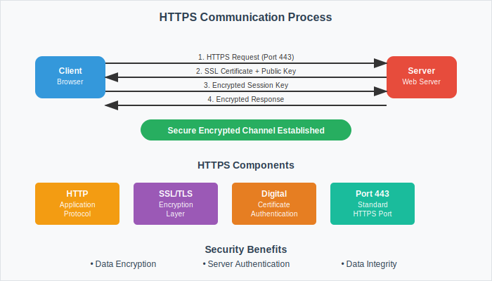
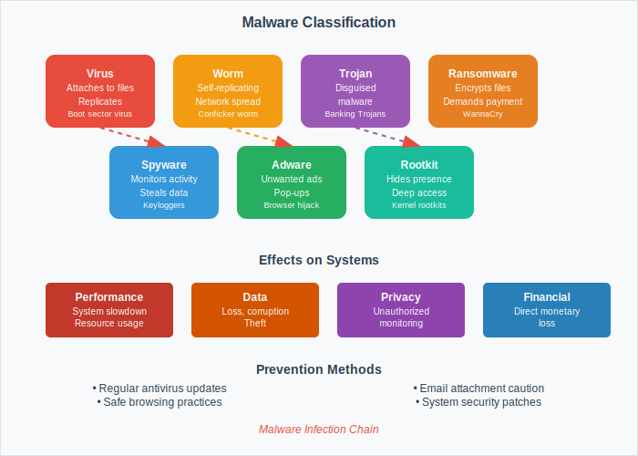
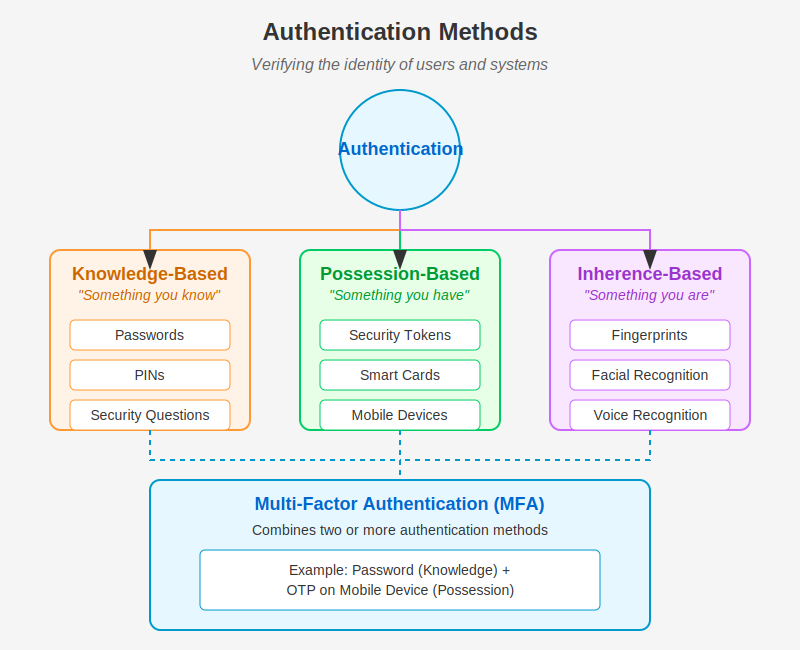
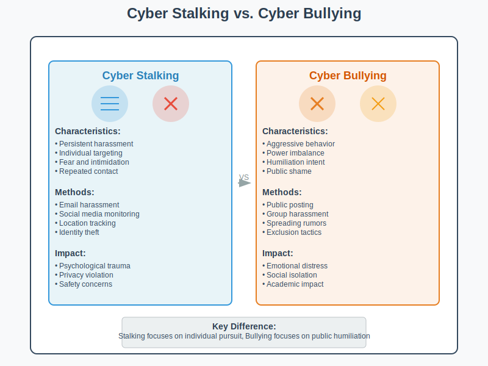
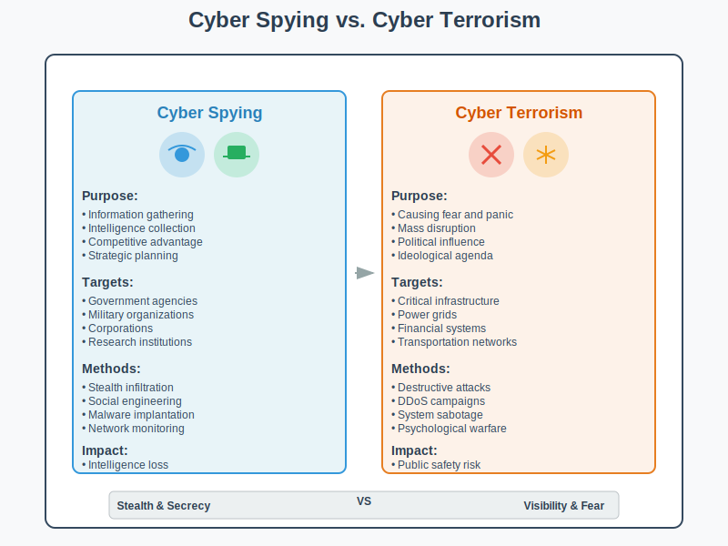
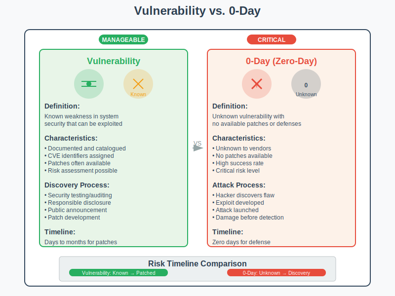
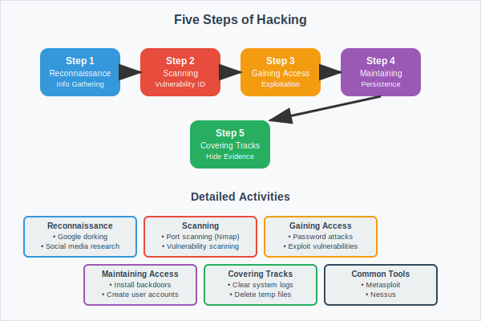
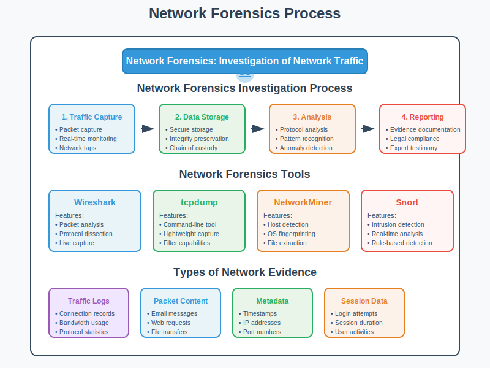
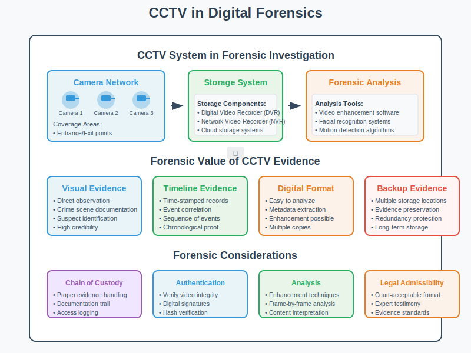
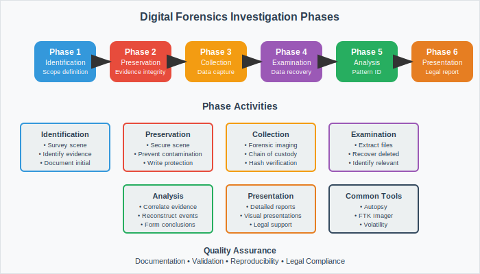

## Question 1(a) [3 marks]

**Describe CIA triad with example.**

**Answer**:

**CIA Triad Components:**

| Component | Definition | Example |
|-----------|------------|---------|
| **Confidentiality** | Protecting data from unauthorized access | Password protection on bank accounts |
| **Integrity** | Ensuring data accuracy and completeness | Digital signatures on documents |
| **Availability** | Ensuring systems are accessible when needed | 24/7 online banking services |

- **Confidentiality**: Only authorized users can access sensitive information
- **Integrity**: Data remains accurate and unaltered during transmission
- **Availability**: Systems remain operational and accessible to legitimate users

**Mnemonic**: "CIA Keeps Information Safe"

## Question 1(b) [4 marks]

**Explain Public key and Private Key cryptography.**

**Answer**:

**Public Key Cryptography (Asymmetric):**

**Key Characteristics:**

| Feature | Public Key | Private Key |
|---------|------------|-------------|
| **Distribution** | Freely shared | Kept secret |
| **Usage** | Encryption/Verification | Decryption/Signing |
| **Security** | Can be public | Must be protected |

- **Public Key**: Used for encryption and signature verification
- **Private Key**: Used for decryption and digital signing
- **Security**: Based on mathematical complexity (RSA, ECC algorithms)

**Mnemonic**: "Public Encrypts, Private Decrypts"

## Question 1(c) [7 marks]

**Explain various security attacks, mechanisms, and services associated with each layer of the OSI model.**

**Answer**:

**OSI Security Framework:**

| Layer | Attacks | Mechanisms | Services |
|-------|---------|------------|----------|
| **Physical** | Wiretapping, Jamming | Physical security, Shielding | Access control |
| **Data Link** | MAC flooding, ARP poisoning | Encryption, Authentication | Frame integrity |
| **Network** | IP spoofing, Routing attacks | IPSec, Firewalls | Packet filtering |
| **Transport** | Session hijacking, SYN flooding | SSL/TLS, Port security | End-to-end security |
| **Session** | Session replay, Hijacking | Session tokens, Timeouts | Session management |
| **Presentation** | Data corruption, Format attacks | Encryption, Compression | Data transformation |
| **Application** | Malware, Social engineering | Antivirus, User training | Application security |

**Key Security Services:**

- **Authentication**: Verifying user identity
- **Authorization**: Controlling access permissions
- **Non-repudiation**: Preventing denial of actions
- **Data integrity**: Ensuring data accuracy

**Mnemonic**: "All People Seem To Need Data Protection"

## Question 1(c OR) [7 marks]

**Explain MD5 hashing and Secure Hash Function (SHA) algorithms.**

**Answer**:

**Hash Function Comparison:**

| Feature | MD5 | SHA-1 | SHA-256 |
|---------|-----|-------|---------|
| **Output Size** | 128 bits | 160 bits | 256 bits |
| **Security Level** | Weak | Weak | Strong |
| **Speed** | Fast | Moderate | Slower |
| **Current Status** | Deprecated | Deprecated | Recommended |

**Hash Properties:**

- **Deterministic**: Same input produces same hash
- **Avalanche Effect**: Small input change causes major hash change
- **One-way Function**: Cannot reverse hash to original data
- **Collision Resistant**: Difficult to find two inputs with same hash

**Applications:**

- Password storage and verification
- Digital signatures and certificates
- Data integrity verification

**Mnemonic**: "Hash Always Produces Same Output"

## Question 2(a) [3 marks]

**What is firewall? List out types of firewall.**

**Answer**:

**Firewall Definition:**
Network security device that monitors and controls incoming/outgoing traffic based on security rules.

**Types of Firewalls:**

| Type | Function | Level |
|------|----------|-------|
| **Packet Filter** | Examines packet headers | Network Layer |
| **Stateful** | Tracks connection state | Transport Layer |
| **Application Proxy** | Inspects application data | Application Layer |
| **Personal Firewall** | Protects individual devices | Host-based |

- **Hardware Firewall**: Dedicated network appliance
- **Software Firewall**: Installed on individual computers
- **Cloud Firewall**: Delivered as a service (FWaaS)

**Mnemonic**: "Firewalls Protect Networks Always"

## Question 2(b) [4 marks]

**Define: HTTPS and describe working of HTTPS.**

**Answer**:

**HTTPS Definition:**
Hypertext Transfer Protocol Secure - HTTP over SSL/TLS encryption.

**HTTPS Working Process:**

**HTTPS Components:**

- **Port 443**: Standard HTTPS port
- **SSL/TLS**: Encryption protocols
- **Digital Certificates**: Server authentication
- **Symmetric Encryption**: Data transmission security

**Benefits:**

- Data encryption during transmission
- Server authentication verification
- Data integrity protection
- SEO ranking improvement

**Mnemonic**: "HTTPS Secures Web Traffic"

## Question 2(c) [7 marks]

**Explain different types of malicious software and their effect.**

**Answer**:

**Malware Classification:**

| Type | Behavior | Effect | Example |
|------|----------|--------|---------|
| **Virus** | Attaches to files | File corruption | Boot sector virus |
| **Worm** | Self-replicating | Network congestion | Conficker worm |
| **Trojan** | Disguised malware | Data theft | Banking Trojans |
| **Ransomware** | Encrypts files | Data hostage | WannaCry |
| **Spyware** | Monitors activity | Privacy breach | Keyloggers |
| **Adware** | Shows unwanted ads | Performance degradation | Pop-up ads |
| **Rootkit** | Hides presence | System compromise | Kernel rootkits |

**Effects on Systems:**

- **Performance**: Slow system response
- **Data**: Loss, corruption, or theft
- **Privacy**: Unauthorized monitoring
- **Financial**: Direct monetary loss

**Prevention Methods:**

- Regular antivirus updates
- Safe browsing practices
- Email attachment caution
- System security patches

**Mnemonic**: "Viruses Worms Trojans Really Steal All Resources"

## Question 2(a OR) [3 marks]

**What is authentication? Explain different methods of authentication.**

**Answer**:

**Authentication Definition:**
Process of verifying user identity before granting system access.

**Authentication Methods:**

| Method | Description | Example |
|--------|-------------|---------|
| **Password** | Something you know | PIN, passphrase |
| **Biometric** | Something you are | Fingerprint, iris |
| **Token** | Something you have | Smart card, USB key |

- **Single-Factor**: Uses one authentication method
- **Multi-Factor**: Combines multiple methods
- **Two-Factor (2FA)**: Uses exactly two factors

**Mnemonic**: "Password Biometric Token Authentication"

## Question 2(b OR) [4 marks]

**Define: Trojans, Rootkit, Backdoors, Keylogger**

**Answer**:

**Malware Definitions:**

| Term | Definition | Characteristics |
|------|------------|-----------------|
| **Trojans** | Malware disguised as legitimate software | Appears harmless, hidden payload |
| **Rootkit** | Software that hides malware presence | Deep system access, stealth operation |
| **Backdoors** | Unauthorized access method | Bypasses normal authentication |
| **Keylogger** | Records keyboard input | Captures passwords, sensitive data |

- **Trojans**: Named after Greek Trojan Horse
- **Rootkit**: Operates at kernel level
- **Backdoors**: Can be hardware or software based
- **Keylogger**: Can be software or hardware device

**Mnemonic**: "Trojans Root Backdoors Keylog"

## Question 2(c OR) [7 marks]

**Explain Secure Socket Layer (SSL) and Transport Layer Security (TLS) protocols.**

**Answer**:

**SSL/TLS Protocol Evolution:**

| Version | Year | Status | Security Level |
|---------|------|--------|----------------|
| **SSL 2.0** | 1995 | Deprecated | Weak |
| **SSL 3.0** | 1996 | Deprecated | Vulnerable |
| **TLS 1.0** | 1999 | Legacy | Limited |
| **TLS 1.2** | 2008 | Widely used | Good |
| **TLS 1.3** | 2018 | Current | Strong |

**TLS Handshake Process:**

**Key Features:**

- **Encryption**: Symmetric and asymmetric algorithms
- **Authentication**: Server and client verification
- **Integrity**: Message authentication codes
- **Forward Secrecy**: Session key protection

**Applications:**

- HTTPS web browsing
- Email security (SMTPS)
- VPN connections
- Secure file transfers

**Mnemonic**: "TLS Encrypts All Network Traffic"

## Question 3(a) [3 marks]

**Explain in detail cybercrime and cybercriminal.**

**Answer**:

**Cybercrime Definition:**
Criminal activities conducted through computers or internet networks.

**Diagram:**

**Cybercriminal Types:**

| Type | Motivation | Skills | Target |
|------|------------|--------|--------|
| **Script Kiddies** | Fun/Fame | Low | Random |
| **Hacktivists** | Political/Social | Moderate | Organizations |
| **Cybercriminals** | Financial Gain | High | Individuals/Banks |

- **Cybercrime**: Illegal activities using digital technology
- **Cybercriminal**: Person who commits cybercrimes
- **Impact**: Financial loss, privacy breach, system damage

**Mnemonic**: "Cyber Criminals Create Chaos"

## Question 3(b) [4 marks]

**Describe cyber stalking and cyber bullying in detail.**

**Answer**:

**Digital Harassment Comparison:**

| Aspect | Cyber Stalking | Cyber Bullying |
|--------|----------------|----------------|
| **Target** | Specific individual | Often minors |
| **Duration** | Persistent, long-term | Can be episodic |
| **Intent** | Intimidation, control | Harassment, humiliation |
| **Platform** | Social media, email | Schools, gaming platforms |

**Cyber Stalking Characteristics:**

- Persistent unwanted contact
- Monitoring victim's online activity
- Threatening messages or behavior
- Identity theft or impersonation

**Cyber Bullying Forms:**

- Public humiliation online
- Exclusion from digital groups
- Spreading false information
- Sharing private content without consent

**Prevention Measures:**

- Privacy settings on social media
- Reporting harassment to platforms
- Legal action when necessary
- Digital literacy education

**Mnemonic**: "Stop Bullying, Report Stalking"

## Question 3(c) [7 marks]

**Explain Property based classification in cybercrime.**

**Answer**:

**Property-Based Cybercrime Categories:**

| Category | Crime Type | Description | Example |
|----------|------------|-------------|---------|
| **Intellectual Property** | Copyright infringement | Unauthorized use of copyrighted material | Software piracy |
| **Financial Property** | Credit card fraud | Unauthorized use of financial information | Online shopping fraud |
| **Digital Property** | Data theft | Stealing digital information | Database breaches |
| **Virtual Property** | Gaming asset theft | Stealing virtual goods | Online game currency theft |

**Diagram:**

**Legal Aspects:**

- **Copyright Laws**: Protect creative works
- **Trademark Laws**: Protect brand identity
- **Patent Laws**: Protect inventions
- **Trade Secret Laws**: Protect confidential information

**Impact on Economy:**

- Revenue loss for legitimate businesses
- Reduced innovation incentives
- Consumer trust erosion
- Legal enforcement costs

**Prevention Strategies:**

- Digital rights management (DRM)
- Watermarking and tracking
- Legal enforcement mechanisms
- Public awareness campaigns

**Mnemonic**: "Property Protection Prevents Piracy"

## Question 3(a OR) [3 marks]

**Explain Data diddling.**

**Answer**:

**Data Diddling Definition:**
Unauthorized alteration of data before or during input into computer systems.

**Characteristics:**

| Aspect | Description |
|--------|-------------|
| **Method** | Changing data values |
| **Timing** | Before system processing |
| **Detection** | Often difficult to identify |

- **Examples**: Changing salary figures, altering exam scores
- **Target**: Input data during entry process
- **Impact**: Financial loss, incorrect records

**Mnemonic**: "Data Diddling Damages Databases"

## Question 3(b OR) [4 marks]

**Explain cyber spying and cyber terrorism.**

**Answer**:

**Cyber Threats Comparison:**

| Aspect | Cyber Spying | Cyber Terrorism |
|--------|--------------|-----------------|
| **Purpose** | Information gathering | Causing fear/disruption |
| **Target** | Government, corporations | Critical infrastructure |
| **Methods** | Stealth infiltration | Destructive attacks |
| **Impact** | Intelligence loss | Public safety risk |

**Cyber Spying Activities:**

- Corporate espionage
- Government surveillance
- Trade secret theft
- Personal information gathering

**Cyber Terrorism Methods:**

- Infrastructure attacks
- Mass disruption campaigns
- Psychological warfare
- Economic damage

**Prevention Measures:**

- Network security monitoring
- Incident response planning
- International cooperation
- Public-private partnerships

**Mnemonic**: "Spies Steal, Terrorists Terror"

## Question 3(c OR) [7 marks]

**Explain the role of digital signatures and digital certificates in cybersecurity.**

**Answer**:

**Digital Security Components:**

| Component | Purpose | Function | Benefit |
|-----------|---------|----------|---------|
| **Digital Signature** | Authentication | Proves sender identity | Non-repudiation |
| **Digital Certificate** | Verification | Validates public keys | Trust establishment |

**Digital Signature Process:**

**Digital Certificate Components:**

- **Subject Information**: Certificate owner details
- **Public Key**: For encryption/verification
- **Digital Signature**: CA's signature
- **Validity Period**: Certificate expiration date

**Certificate Authority (CA) Role:**

- Issues digital certificates
- Verifies identity before issuance
- Maintains certificate revocation lists
- Provides trust infrastructure

**Applications in Cybersecurity:**

- Email security (S/MIME)
- Code signing for software
- SSL/TLS certificates for websites
- Document authentication

**Security Benefits:**

- **Authentication**: Verifies sender identity
- **Integrity**: Ensures data hasn't been modified
- **Non-repudiation**: Prevents denial of actions
- **Confidentiality**: Enables secure communication

**Mnemonic**: "Digital Signatures Authenticate Documents Securely"

## Question 4(a) [3 marks]

**What is Hacking? List out types of Hackers.**

**Answer**:

**Hacking Definition:**
Unauthorized access to computer systems or networks to exploit vulnerabilities.

**Hacker Classifications:**

| Type | Intent | Legal Status |
|------|--------|--------------|
| **White Hat** | Security improvement | Legal |
| **Black Hat** | Malicious activities | Illegal |
| **Gray Hat** | Mixed motivations | Questionable |

- **White Hat**: Ethical hackers, security researchers
- **Black Hat**: Cybercriminals, malicious intent
- **Gray Hat**: Sometimes legal, sometimes not

**Mnemonic**: "White Good, Black Bad, Gray Questionable"

## Question 4(b) [4 marks]

**Explain Vulnerability and 0-Day terminology of Hacking.**

**Answer**:

**Security Terminology:**

| Term | Definition | Risk Level | Example |
|------|------------|------------|---------|
| **Vulnerability** | System weakness | Varies | Unpatched software |
| **0-Day** | Unknown vulnerability | Critical | Undiscovered flaw |

**Vulnerability Characteristics:**

- **Discovery**: Found through security testing
- **Disclosure**: Responsible reporting to vendors
- **Patching**: Vendor provides security updates
- **Window**: Time between discovery and patch

**0-Day Attack Process:**

- Hacker discovers unknown vulnerability
- Exploits flaw before vendor awareness
- No available patches or defenses
- High success rate due to surprise element

**Protection Strategies:**

- Regular security updates
- Intrusion detection systems
- Behavioral analysis tools
- Zero-trust security models

**Mnemonic**: "Vulnerabilities Need Patches, Zero-Days Need Vigilance"

## Question 4(c) [7 marks]

**Explain Five Steps of Hacking.**

**Answer**:

**Hacking Methodology:**

**Detailed Steps:**

| Step | Description | Tools/Methods | Objective |
|------|-------------|---------------|-----------|
| **Reconnaissance** | Information gathering | Google dorking, Social media | Target profiling |
| **Scanning** | System enumeration | Nmap, Nessus | Vulnerability identification |
| **Gaining Access** | Exploit vulnerabilities | Metasploit, Custom exploits | System compromise |
| **Maintaining Access** | Persistent presence | Backdoors, Rootkits | Long-term control |
| **Covering Tracks** | Evidence removal | Log cleaning, File deletion | Avoid detection |

**Information Gathering Types:**

- **Passive**: No direct target contact
- **Active**: Direct interaction with target systems

**Scanning Techniques:**

- Port scanning for open services
- Vulnerability scanning for weaknesses
- Network mapping for topology

**Access Methods:**

- Password attacks (brute force, dictionary)
- Exploit vulnerabilities
- Social engineering
- Physical access

**Persistence Mechanisms:**

- Installing backdoors
- Creating user accounts
- Scheduling tasks
- Registry modifications

**Track Covering Methods:**

- Clearing system logs
- Deleting temporary files
- Modifying timestamps
- Using encryption

**Mnemonic**: "Reconnaissance Scans Generate Access, Maintain Coverage"

## Question 4(a OR) [3 marks]

**Explain any three basic commands of Kali Linux with suitable example.**

**Answer**:

**Essential Kali Linux Commands:**

| Command | Function | Example |
|---------|----------|---------|
| **nmap** | Network scanning | `nmap -sS 192.168.1.1` |
| **netcat** | Network communication | `nc -l -p 1234` |
| **hydra** | Password cracking | `hydra -l admin -P passwords.txt ssh://target` |

- **Nmap**: Discovers hosts and services on network
- **Netcat**: Creates network connections for data transfer
- **Hydra**: Performs brute-force password attacks

**Mnemonic**: "Network Map, Connect, Crack"

## Question 4(b OR) [4 marks]

**Describe Session Hijacking in detail.**

**Answer**:

**Session Hijacking Overview:**
Attack where attacker takes over legitimate user's session.

**Types of Session Hijacking:**

| Type | Method | Prevention |
|------|--------|------------|
| **Active** | Takes over session | Strong session management |
| **Passive** | Monitors session | Encryption (HTTPS) |
| **Network-level** | TCP hijacking | Secure protocols |
| **Application-level** | Cookie theft | Secure cookie attributes |

**Attack Process:**

1. Monitor network traffic
2. Capture session identifiers
3. Replay session tokens
4. Access user account

**Prevention Measures:**

- Use HTTPS for all communications
- Implement secure session management
- Set secure cookie attributes
- Monitor for suspicious activity

**Mnemonic**: "Sessions Hijacked Need Secure Handling"

## Question 4(c OR) [7 marks]

**Explain how Virtual Private Networks (VPNs) create secure, encrypted connections over public networks.**

**Answer**:

**VPN Architecture:**

**VPN Components:**

| Component | Function | Benefit |
|-----------|----------|---------|
| **Tunneling** | Creates secure pathway | Data protection |
| **Encryption** | Scrambles data | Confidentiality |
| **Authentication** | Verifies identity | Access control |
| **IP Masking** | Hides real IP | Anonymity |

**VPN Protocols:**

| Protocol | Security Level | Speed | Use Case |
|----------|----------------|-------|----------|
| **OpenVPN** | High | Good | General purpose |
| **IPSec** | Very High | Moderate | Enterprise |
| **WireGuard** | High | Excellent | Modern solution |
| **PPTP** | Low | Fast | Legacy (deprecated) |

**VPN Working Process:**

1. **Connection**: Client connects to VPN server
2. **Authentication**: User credentials verified
3. **Tunnel Creation**: Encrypted pathway established
4. **Data Encryption**: All traffic encrypted
5. **Routing**: Traffic routed through VPN server
6. **Decryption**: Data decrypted at destination

**Security Benefits:**

- **Data Protection**: Encryption prevents eavesdropping
- **Privacy**: IP address masking
- **Access Control**: Authenticate before connection
- **Bypass Restrictions**: Access geo-blocked content

**Business Applications:**

- Remote worker access
- Site-to-site connectivity
- Secure cloud access
- Compliance requirements

**Personal Use Cases:**

- Public Wi-Fi protection
- Privacy enhancement
- Content access
- Location privacy

**Mnemonic**: "VPNs Provide Network Privacy"

## Question 5(a) [3 marks]

**Explain Network forensics.**

**Answer**:

**Network Forensics Definition:**
Investigation of network traffic to detect and analyze security incidents.

**Key Components:**

| Component | Purpose | Tools |
|-----------|---------|-------|
| **Traffic Capture** | Record network data | Wireshark, tcpdump |
| **Analysis** | Examine patterns | NetworkMiner, Snort |
| **Evidence** | Document findings | Forensic reports |

- **Scope**: Analyzes packets, flows, and network behavior
- **Objective**: Identify security breaches and attack patterns
- **Challenge**: Large data volumes and real-time processing

**Mnemonic**: "Network Forensics Finds Facts"

## Question 5(b) [4 marks]

**Explain why CCTV plays an important role as evidence in digital forensics investigations.**

**Answer**:

**CCTV in Digital Forensics:**

| Aspect | Importance | Value |
|--------|------------|-------|
| **Visual Evidence** | Direct observation | High credibility |
| **Timeline** | Time-stamped records | Event correlation |
| **Digital Format** | Easy to analyze | Metadata extraction |
| **Backup** | Multiple copies | Evidence preservation |

**Evidence Value:**

- **Corroboration**: Supports other digital evidence
- **Timeline**: Establishes sequence of events
- **Identity**: May reveal perpetrator identity
- **Context**: Shows physical environment during incident

**Forensic Considerations:**

- **Chain of Custody**: Proper evidence handling
- **Authentication**: Verify video integrity
- **Analysis**: Enhancement and interpretation
- **Legal Admissibility**: Court-acceptable format

**Mnemonic**: "CCTV Captures Criminal Conduct Clearly"

## Question 5(c) [7 marks]

**Explain phases of Digital forensic investigation.**

**Answer**:

**Digital Forensics Investigation Phases:**

**Detailed Phase Breakdown:**

| Phase | Activities | Tools | Objective |
|-------|------------|-------|-----------|
| **Identification** | Recognize potential evidence | Visual inspection | Scope definition |
| **Preservation** | Prevent evidence contamination | Write blockers | Evidence integrity |
| **Collection** | Acquire digital evidence | Forensic imaging | Complete data capture |
| **Examination** | Extract relevant data | Autopsy, FTK | Data recovery |
| **Analysis** | Interpret findings | Timeline tools | Pattern identification |
| **Presentation** | Document results | Report generators | Legal presentation |

**Phase 1 - Identification:**

- Survey the scene
- Identify potential evidence sources
- Document initial observations
- Establish investigation scope

**Phase 2 - Preservation:**

- Secure the crime scene
- Prevent evidence contamination
- Use write-protection mechanisms
- Document evidence condition

**Phase 3 - Collection:**

- Create forensic images
- Maintain chain of custody
- Use proper collection techniques
- Generate hash values for verification

**Phase 4 - Examination:**

- Extract file systems
- Recover deleted data
- Identify relevant files
- Document findings

**Phase 5 - Analysis:**

- Correlate evidence
- Reconstruct events
- Identify patterns
- Form conclusions

**Phase 6 - Presentation:**

- Prepare detailed reports
- Create visual presentations
- Explain technical findings
- Support legal proceedings

**Quality Assurance:**

- **Documentation**: Detailed records at each phase
- **Validation**: Verify procedures and results
- **Reproducibility**: Ensure results can be replicated
- **Legal Compliance**: Follow jurisdictional requirements

**Mnemonic**: "Investigators Preserve, Collect, Examine, Analyze, Present"

## Question 5(a OR) [3 marks]

**List applications of microcontrollers in various fields related to cybersecurity.**

**Answer**:

**Microcontroller Security Applications:**

| Field | Application | Security Function |
|-------|-------------|-------------------|
| **IoT Security** | Smart home devices | Authentication, encryption |
| **Access Control** | Key cards, biometric | Identity verification |
| **Network Security** | Hardware firewalls | Packet filtering |

- **Smart Cards**: Secure authentication tokens
- **HSM (Hardware Security Modules)**: Cryptographic processing
- **Embedded Systems**: Secure boot, tamper detection

**Mnemonic**: "Microcontrollers Manage Multiple Security Functions"

## Question 5(b OR) [4 marks]

**Explain the importance of port scanning in ethical hacking.**

**Answer**:

**Port Scanning in Ethical Hacking:**

| Aspect | Importance | Benefit |
|--------|------------|---------|
| **Service Discovery** | Identify running services | Attack surface mapping |
| **Vulnerability Assessment** | Find open ports | Security gap identification |
| **Network Mapping** | Understand topology | Infrastructure analysis |
| **Security Testing** | Validate configurations | Compliance verification |

**Port Scanning Techniques:**

- **TCP Connect**: Full connection establishment
- **SYN Scan**: Stealth scanning method
- **UDP Scan**: User Datagram Protocol scanning
- **Service Detection**: Identify service versions

**Ethical Considerations:**

- **Authorization**: Obtain proper permissions
- **Scope**: Stay within defined boundaries
- **Documentation**: Record all activities
- **Reporting**: Provide detailed findings

**Mnemonic**: "Port Scanning Provides Security Insights"

## Question 5(c OR) [7 marks]

**Describe the process of conducting a vulnerability assessment using Kali Linux tools.**

**Answer**:

**Vulnerability Assessment Process:**

**Kali Linux Tools and Commands:**

**Step-by-Step Process:**

| Step | Kali Tool | Command Example | Purpose |
|------|-----------|-----------------|---------|
| **Reconnaissance** | Nmap | `nmap -sn 192.168.1.0/24` | Host discovery |
| **Port Scanning** | Nmap | `nmap -sS -O target` | Open port identification |
| **Service Enumeration** | Nmap, Banner grabbing | `nmap -sV target` | Service version detection |
| **Vulnerability Scanning** | OpenVAS, Nessus | `openvas-start` | Automated vulnerability detection |
| **Web Application Testing** | Nikto, Dirb | `nikto -h target` | Web vulnerability scanning |

**Detailed Process:**

**Phase 1 - Target Identification:**

- Use Nmap for network discovery
- Identify live hosts and their IP addresses
- Document network topology
- Determine target scope

**Phase 2 - Port and Service Analysis:**

- Perform comprehensive port scans
- Identify running services and versions
- Check for default credentials
- Analyze service configurations

**Phase 3 - Automated Vulnerability Scanning:**

- Configure vulnerability scanners (OpenVAS)
- Run comprehensive scans
- Analyze scan results
- Prioritize findings by severity

**Phase 4 - Manual Testing:**

- Verify automated findings
- Perform targeted testing
- Test for specific vulnerabilities
- Validate false positives

**Phase 5 - Web Application Assessment:**

- Use web vulnerability scanners
- Test for OWASP Top 10 vulnerabilities
- Analyze application logic
- Check for misconfigurations

**Common Kali Tools:**

| Tool | Function | Use Case |
|------|----------|----------|
| **Nmap** | Network scanning | Port and service discovery |
| **OpenVAS** | Vulnerability scanning | Automated assessment |
| **Nikto** | Web scanning | Web server vulnerabilities |
| **Dirb** | Directory brute forcing | Hidden file discovery |
| **SQLmap** | SQL injection testing | Database vulnerabilities |
| **Burp Suite** | Web proxy | Manual web testing |
| **Metasploit** | Exploitation framework | Vulnerability validation |

**Assessment Methodology:**

- **Scope Definition**: Clearly define assessment boundaries
- **Information Gathering**: Collect target intelligence
- **Vulnerability Detection**: Use multiple scanning methods
- **Risk Assessment**: Evaluate impact and likelihood
- **Remediation Planning**: Provide actionable recommendations

**Reporting Components:**

- **Executive Summary**: High-level findings for management
- **Technical Details**: Detailed vulnerability descriptions
- **Risk Ratings**: CVSS scores and business impact
- **Remediation Steps**: Specific mitigation recommendations
- **Supporting Evidence**: Screenshots and proof-of-concept

**Best Practices:**

- **Authorization**: Always obtain written permission
- **Documentation**: Maintain detailed logs of all activities
- **Minimal Impact**: Avoid disrupting production systems
- **Confidentiality**: Protect sensitive information discovered

**Mnemonic**: "Vulnerability Assessment Validates Application Security"
