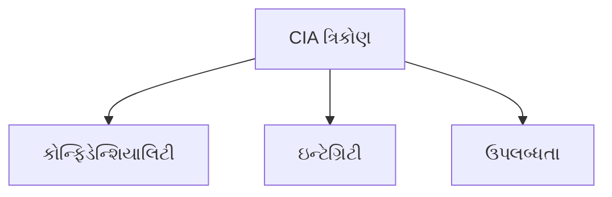
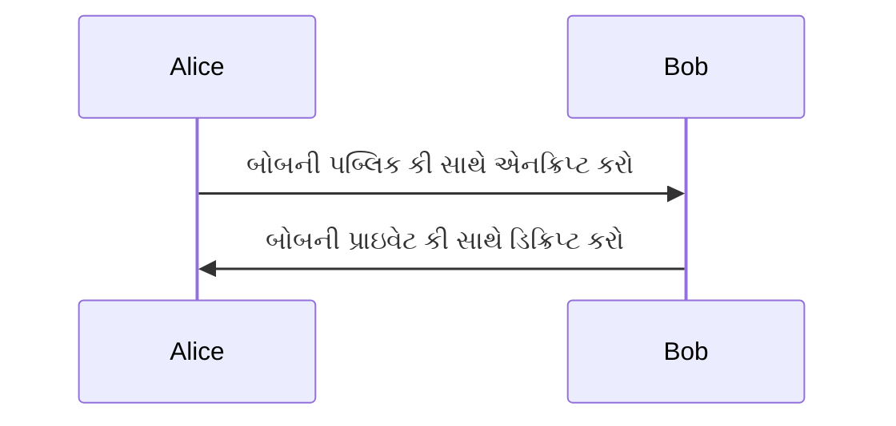
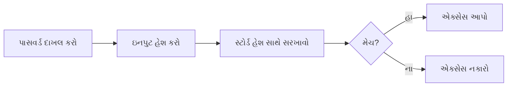
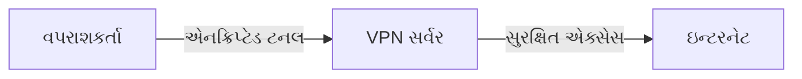
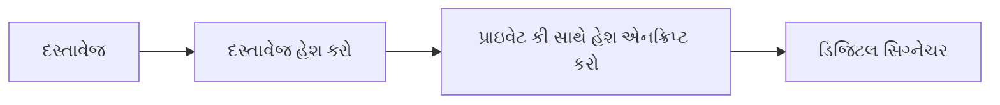
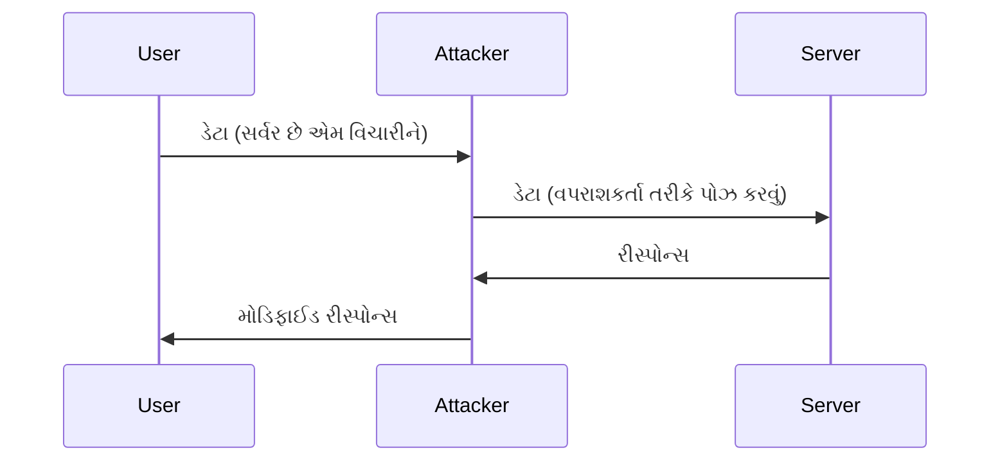
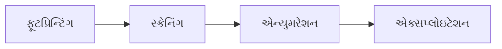
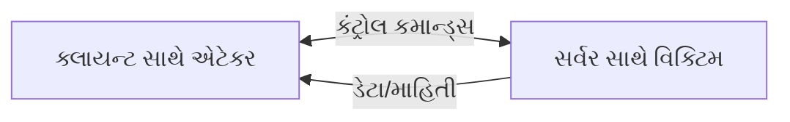

## પ્રશ્ન 1(અ) [3 ગુણ]

**સાયબર સુરક્ષા અને કમ્પ્યુટર સુરક્ષા વ્યાખ્યાયિત કરો.**

**જવાબ**:

| ટર્મ | વ્યાખ્યા |
|------|------------|
| **સાયબર સુરક્ષા** | ઇન્ટરનેટ સાથે જોડાયેલા સિસ્ટમ, હાર્ડવેર, સોફ્ટવેર અને ડેટાને સાયબર હુમલાઓથી સુરક્ષા આપવી |
| **કમ્પ્યુટર સુરક્ષા** | કમ્પ્યુટર સિસ્ટમને હાર્ડવેર, સોફ્ટવેર અથવા ડેટાની ચોરી કે નુકસાનથી રક્ષણ આપવું |

**મેમરી ટ્રીક:** "સાયબર સંજોગે, કમ્પ્યુટર કલેક્ટ કરે" - સાયબર સુરક્ષા જોડાયેલી સિસ્ટમને રક્ષે, કમ્પ્યુટર સુરક્ષા સમાયેલી સિસ્ટમને રક્ષે.

## પ્રશ્ન 1(બ) [4 ગુણ]

**CIA tirad સમજાવો.**

**જવાબ**:

**કોષ્ટક: CIA ત્રિકોણ ઘટકો**

| ઘટક | વર્ણન |
|-----------|-------------|
| **કોન્ફિડેન્શિયાલિટી** (Confidentiality) | સુનિશ્ચિત કરે છે કે માહિતી અનધિકૃત વ્યક્તિઓ કે સિસ્ટમને જાહેર ન થાય |
| **ઇન્ટેગ્રિટી** (Integrity) | ડેટાની જીવનચક્ર દરમિયાન તેની સુસંગતતા, ચોકસાઈ અને વિશ્વસનીયતા જાળવી રાખે છે |
| **ઉપલબ્ધતા** (Availability) | સુનિશ્ચિત કરે છે કે જ્યારે જરૂર હોય ત્યારે અધિકૃત વપરાશકર્તાઓ માટે માહિતી અને સંસાધનો ઉપલબ્ધ હોય |



**મેમરી ટ્રીક:** "CIA કરે માહિતી સલામત" - કોન્ફિડેન્શિયાલિટી, ઇન્ટેગ્રિટી, અને અવેલેબિલિટી એ ત્રણ મુખ્ય સુરક્ષા સિદ્ધાંતો છે.

## પ્રશ્ન 1(ક) [7 ગુણ]

**કોમ્પ્યુટર સુરક્ષાના સંદર્ભમાં એડ્વર્સરી, એટેક, કાઉન્ટરમેઝર, રિસ્ક, સિક્યુરીટી પોલિસી, સિસ્ટમ રીસોર્સ અને થ્રેટ ને વ્યાખ્યાયિત કરો.**

**જવાબ**:

**કોષ્ટક: કમ્પ્યુટર સુરક્ષાના મુખ્ય ખ્યાલો**

| ટર્મ | વ્યાખ્યા |
|------|------------|
| **એડ્વર્સરી** (Adversary) | વ્યક્તિ કે જૂથ જે સુરક્ષાને સમાધાન કરવાનો પ્રયાસ કરે છે |
| **એટેક** (Attack) | સિસ્ટમની નબળાઈઓનો ફાયદો ઉઠાવવા માટે જાણી જોઈને કરવામાં આવતી ક્રિયા |
| **કાઉન્ટરમેઝર** (Countermeasure) | ક્રિયા કે તકનીક જે ખતરા કે નબળાઈને ઘટાડે છે |
| **રિસ્ક** (Risk) | જોખમ દ્વારા નબળાઈનો ફાયદો ઉઠાવવાથી થતા નુકસાનની સંભાવના |
| **સિક્યુરીટી પોલિસી** (Security Policy) | નિયમો જે સંસાધનોના સ્વીકાર્ય ઉપયોગ અને સુરક્ષાને પરિભાષિત કરે છે |
| **સિસ્ટમ રીસોર્સ** (System Resource) | કોઈપણ ઘટક (હાર્ડવેર/સોફ્ટવેર/ડેટા) જેને સુરક્ષાની જરૂર છે |
| **થ્રેટ** (Threat) | સંભવિત ખતરો જે નબળાઈનો ફાયદો ઉઠાવી શકે છે |

**મેમરી ટ્રીક:** "એક રાજાને સપનુ થ્રેટ" - એડ્વર્સરી, રિસ્ક, જોખમ, સિક્યુરીટી પોલિસી, નેટવર્ક, ટૂલ, થ્રેટ.

## પ્રશ્ન 1(ક OR) [7 ગુણ]

**MD5 હેશિંગ અલ્ગોરિધમ સમજાવો.**

**જવાબ**:

**MD5 હેશિંગ પ્રક્રિયા**

| સ્ટેપ | વર્ણન |
|------|-------------|
| **સ્ટેપ 1** | સંદેશને પેડિંગ કરવું જેથી લંબાઈ 512 થી વિભાજ્ય હોય |
| **સ્ટેપ 2** | સંદેશને 512-બિટ બ્લોક્સમાં વિભાજિત કરવું |
| **સ્ટેપ 3** | 4 રજિસ્ટર્સ (A, B, C, D) પૂર્વનિર્ધારિત મૂલ્યો સાથે ઇનિશિયલાઇઝ કરવા |
| **સ્ટેપ 4** | દરેક બ્લોકને 4 રાઉન્ડ્સ ઓપરેશન્સમાંથી પસાર કરવું |
| **સ્ટેપ 5** | 128-બિટ (16-બાઇટ) હેશ વેલ્યુ આઉટપુટ તરીકે ઉત્પન્ન કરવી |

```
MD5(message) → 128-bit hash value regardless of input size
```

**મેમરી ટ્રીક:** "પેડિંગ, ડિવાઇડ, ઇનિશિયલાઇઝ, પ્રોસેસ, આઉટપુટ" - પેડિંગ, ડિવિઝન, ઇનિશિયલાઇઝેશન, પ્રોસેસિંગ, આઉટપુટ.

## પ્રશ્ન 2(અ) [3 ગુણ]

**સાયબર સુરક્ષાના સંદર્ભમાં ઓથેંટીકેશન વ્યાખ્યાયિત કરો.**

**જવાબ**:

**ઓથેંટીકેશન** એ કોઈ સ્ત્રોતને એક્સેસ કરવાનો પ્રયાસ કરતા વપરાશકર્તા, સિસ્ટમ અથવા એકમની ઓળખની ચકાસણી કરવાની પ્રક્રિયા છે. તે "તમે જે કહો છો તે જ છો" તેની પુષ્ટિ કરે છે:

| ઓથેંટીકેશન ફેક્ટર્સ |
|---------------------|
| કંઈક જે તમે જાણો છો (પાસવર્ડ) |
| કંઈક જે તમારી પાસે છે (કાર્ડ) |
| કંઈક જે તમે છો (બાયોમેટ્રિક્સ) |

**મેમરી ટ્રીક:** "જાણો, ધરાવો, છો" - ત્રણ મૂળભૂત ઓથેંટીકેશન ફેક્ટર્સ.

## પ્રશ્ન 2(બ) [4 ગુણ]

**સાર્વજનિક કી ક્રિપ્ટોગ્રાફી ઉદાહરણ સાથે સમજાવો.**

**જવાબ**:

**પબ્લિક કી ક્રિપ્ટોગ્રાફી પ્રક્રિયા**

| ઘટક | વર્ણન |
|-----------|-------------|
| **પબ્લિક કી** | ખુલ્લેઆમ શેર કરાય છે, ડેટા એનક્રિપ્ટ કરવા માટે વપરાય છે |
| **પ્રાઇવેટ કી** | ગુપ્ત રાખવામાં આવે છે, ડેટા ડિક્રિપ્ટ કરવા માટે વપરાય છે |
| **ઉદાહરણ** | એલિસ બોબની પબ્લિક કી સાથે સંદેશને એનક્રિપ્ટ કરે છે → માત્ર બોબ જ તેની પ્રાઇવેટ કી સાથે ડિક્રિપ્ટ કરી શકે છે |



**મેમરી ટ્રીક:** "પબ્લિક પ્રોટેક્ટ, પ્રાઇવેટ પ્રૂવ" - પબ્લિક કી એનક્રિપ્ટ કરે છે, પ્રાઇવેટ કી ડિક્રિપ્ટ કરે છે.

## પ્રશ્ન 2(ક) [7 ગુણ]

**પેકેટ ફિલ્ટર અને એપ્લિકેશન પ્રોક્સીની કામગીરી સમજાવો.**

**જવાબ**:

**કોષ્ટક: પેકેટ ફિલ્ટર vs એપ્લિકેશન પ્રોક્સી**

| ફીચર | પેકેટ ફિલ્ટર | એપ્લિકેશન પ્રોક્સી |
|---------|--------------|-------------------|
| **લેયર** | નેટવર્ક લેયર | એપ્લિકેશન લેયર |
| **ઇન્સ્પેક્શન** | IP હેડર્સ, પોર્ટ્સ | કન્ટેન્ટ એનાલિસિસ |
| **ઓપરેશન** | નિયમો આધારિત પેકેટ્સ મંજૂર/અવરોધ કરે છે | ક્લાયન્ટ અને સર્વર વચ્ચે મધ્યસ્થી તરીકે કાર્ય કરે છે |
| **પરફોર્મન્સ** | વધુ ઝડપી, ઓછા સંસાધન-તીવ્ર | ધીમું, વધુ સંસાધન-તીવ્ર |
| **સુરક્ષા સ્તર** | નીચું, હેડર-આધારિત વિશ્લેષણ | ઉચ્ચ, કન્ટેન્ટ-આધારિત વિશ્લેષણ |

**મેમરી ટ્રીક:** "PATCH" - પેકેટ ફિલ્ટર્સ એડ્રેસ ટ્રાફિક, કન્ટેન્ટ પ્રોક્સી હેન્ડલ એપ્લિકેશન્સ.

## પ્રશ્ન 2(અ OR) [3 ગુણ]

**મલ્ટી ફેક્ટર ઓથેંટીકેશન સમજાવો**

**જવાબ**:

**મલ્ટી-ફેક્ટર ઓથેંટીકેશન (MFA)** બે અથવા વધુ સ્વતંત્ર ક્રેડેન્શિયલ્સને જોડે છે:

| ઓથેંટીકેશન ફેક્ટર પ્રકારો |
|---------------------------|
| **નોલેજ ફેક્ટર** (પાસવર્ડ) |
| **પઝેશન ફેક્ટર** (સિક્યુરિટી ટોકન) |
| **ઇનહેરન્સ ફેક્ટર** (બાયોમેટ્રિક) |
| **લોકેશન ફેક્ટર** (જિયોલોકેશન) |

**મેમરી ટ્રીક:** "મલ્ટિપલ કી સિક્યોર બેસ્ટ" - મલ્ટિપલ વેરિફિકેશન ફેક્ટર્સ વધુ સારી સુરક્ષા પ્રદાન કરે છે.

## પ્રશ્ન 2(બ OR) [4 ગુણ]

**પાસવર્ડ વેરિફિકેશનની પ્રક્રિયા સમજાવો.**

**જવાબ**:

**પાસવર્ડ વેરિફિકેશન પ્રક્રિયા**

| સ્ટેપ | વર્ણન |
|------|-------------|
| **ઇનપુટ** | વપરાશકર્તા યુઝરનેમ અને પાસવર્ડ દાખલ કરે છે |
| **હેશ** | સિસ્ટમ દાખલ કરેલા પાસવર્ડને હેશ કરે છે |
| **કમ્પેર** | સિસ્ટમ હેશને સ્ટોર્ડ હેશ સાથે સરખાવે છે |
| **રિઝલ્ટ** | મેચના આધારે એક્સેસ આપવામાં કે નકારવામાં આવે છે |



**મેમરી ટ્રીક:** "HICS" - હેશ, ઇનપુટ, કમ્પેર, સક્સેસ/સ્ટોપ.

## પ્રશ્ન 2(ક OR) [7 ગુણ]

**દૂષિત સૉફ્ટવેરની સૂચિ બનાવો અને કોઈપણ ત્રણ દૂષિત સૉફ્ટવેર હુમલાઓ સમજાવો.**

**જવાબ**:

**દૂષિત સૉફ્ટવેરના પ્રકારો**

| પ્રકાર | વર્ણન |
|------|-------------|
| **વાઇરસ** | સ્વ-પ્રતિકૃતિ કોડ જે કાયદેસર પ્રોગ્રામ્સ સાથે જોડાય છે |
| **વોર્મ** | સ્વ-પ્રચાર કરતું મેલવેર જે નેટવર્ક્સ દ્વારા ફેલાય છે |
| **ટ્રોજન** | કાયદેસર સૉફ્ટવેર તરીકે છદ્મવેશ ધારણ કરે છે પરંતુ દૂષિત કોડ ધરાવે છે |
| **રેન્સમવેર** | પીડિતની ફાઇલોને એનક્રિપ્ટ કરે છે અને ડિક્રિપ્શન માટે ચુકવણીની માંગ કરે છે |
| **સ્પાયવેર** | વપરાશકર્તાની જાણ વિના માહિતી એકત્રિત કરે છે |
| **એડવેર** | અનિચ્છનીય જાહેરાતો દર્શાવે છે |
| **રૂટકિટ** | કમ્પ્યુટર પર સતત વિશેષાધિકૃત એક્સેસ પ્રદાન કરે છે |

**મેમરી ટ્રીક:** "VWTR-SAR" - વાઇરસ, વોર્મ, ટ્રોજન, રેન્સમવેર, સ્પાયવેર, એડવેર, રૂટકિટ તમારી સિસ્ટમ પર હુમલો કરે છે.

## પ્રશ્ન 3(અ) [3 ગુણ]

**સાયબર સુરક્ષામાં પોર્ટનું મહત્વ સમજાવો.**

**જવાબ**:

**સાયબર સુરક્ષામાં પોર્ટ્સ**

| પાસું | મહત્વ |
|--------|------------|
| **એક્સેસ કંટ્રોલ** | કઈ સેવાઓ એક્સેસિબલ છે તેનું નિયંત્રણ |
| **એટેક સરફેસ** | ઓછા ખુલ્લા પોર્ટ્સનો અર્થ નાના એટેક સરફેસ |
| **સર્વિસ આઇડેન્ટિફિકેશન** | ચાલતી સેવાઓને ઓળખવામાં મદદ કરે છે (દા.ત. HTTP:80, HTTPS:443) |

**મેમરી ટ્રીક:** "SAP" - સિક્યુરિટીને પોર્ટ્સના એક્સેસનું નિયંત્રણ જરૂરી છે.

## પ્રશ્ન 3(બ) [4 ગુણ]

**વર્ચ્યુઅલ પ્રાઇવેટ નેટવર્ક સમજાવો.**

**જવાબ**:

**વર્ચ્યુઅલ પ્રાઇવેટ નેટવર્ક (VPN)**

| ફીચર | વર્ણન |
|---------|-------------|
| **એનક્રિપ્શન** | ક્લાયન્ટ અને સર્વર વચ્ચે ટ્રાન્ઝિટમાં ડેટાને એનક્રિપ્ટ કરે છે |
| **ટનલિંગ** | જાહેર નેટવર્ક્સ દ્વારા સુરક્ષિત કનેક્શન બનાવે છે |
| **પ્રાઇવસી** | વપરાશકર્તાના IP એડ્રેસ અને સ્થાનને છુપાવે છે |
| **સિક્યુરિટી** | જાહેર નેટવર્ક્સ પર ડેટાને ઇન્ટરસેપ્શનથી બચાવે છે |



**મેમરી ટ્રીક:** "PETS" - પ્રાઇવેટ એનક્રિપ્ટેડ ટનલ સિક્યોર ડેટા.

## પ્રશ્ન 3(ક) [7 ગુણ]

**વેબ સુરક્ષા જોખમોની અસર સમજાવો.**

**જવાબ**:

**વેબ સુરક્ષા જોખમોની અસર**

| જોખમ | અસર |
|--------|--------|
| **ડેટા બ્રીચ** | સંવેદનશીલ વપરાશકર્તા માહિતીનું પ્રકટીકરણ |
| **આર્થિક નુકસાન** | સીધા નાણાકીય નુકસાન અને રિકવરી ખર્ચ |
| **પ્રતિષ્ઠાને નુકસાન** | ગ્રાહક વિશ્વાસ અને બ્રાન્ડ મૂલ્યનો નુકસાન |
| **નિયમનકારી દંડ** | સુરક્ષા ધોરણોના અનુપાલન ન કરવા બદલ દંડ |
| **સેવા વિક્ષેપ** | વેબસાઇટ ડાઉનટાઇમ અને વ્યવસાય વિક્ષેપ |

**મેમરી ટ્રીક:** "DFRS" - ડેટા બ્રીચથી આર્થિક નુકસાન, પ્રતિષ્ઠાને નુકસાન અને સેવા વિક્ષેપ થાય છે.

## પ્રશ્ન 3(અ OR) [3 ગુણ]

**ડિજિટલ સિગ્નેચરની કામગીરી સમજાવો.**

**જવાબ**:

**ડિજિટલ સિગ્નેચર પ્રક્રિયા**

| સ્ટેપ | વર્ણન |
|------|-------------|
| **હેશ** | દસ્તાવેજનો હેશ બનાવો |
| **એનક્રિપ્ટ** | મોકલનારની પ્રાઇવેટ કી સાથે હેશને એનક્રિપ્ટ કરો |
| **અટેચ** | એનક્રિપ્ટેડ હેશને દસ્તાવેજ સાથે જોડો |
| **વેરિફાય** | પ્રાપ્તકર્તા મોકલનારની પબ્લિક કી સાથે ડિક્રિપ્ટ કરે છે અને હેશની સરખામણી કરે છે |



**મેમરી ટ્રીક:** "HEAV" - હેશ, એનક્રિપ્ટ, અટેચ, વેરિફાય ડિજિટલ સિગ્નેચર માટે.

## પ્રશ્ન 3(બ OR) [4 ગુણ]

**HTTPS નું વર્ણન કરો.**

**જવાબ**:

**HTTPS (હાયપરટેક્સ્ટ ટ્રાન્સફર પ્રોટોકોલ સિક્યોર)**

| ફીચર | વર્ણન |
|---------|-------------|
| **એનક્રિપ્શન** | કમ્યુનિકેશનને એનક્રિપ્ટ કરવા SSL/TLS નો ઉપયોગ કરે છે |
| **ઓથેન્ટિસિટી** | સર્ટિફિકેટ્સ દ્વારા વેબસાઇટની ઓળખની ચકાસણી કરે છે |
| **ઇન્ટેગ્રિટી** | સુનિશ્ચિત કરે છે કે ટ્રાન્ઝિટમાં ડેટા સુધારવામાં આવ્યો નથી |
| **પોર્ટ** | પોર્ટ 443 (HTTP ના પોર્ટ 80 ની સરખામણીમાં) નો ઉપયોગ કરે છે |

**મેમરી ટ્રીક:** "EAIP" - એનક્રિપ્શન, ઓથેન્ટિસિટી, ઇન્ટેગ્રિટી, પોર્ટ 443.

## પ્રશ્ન 3(ક OR) [7 ગુણ]

**સોશિયલ એન્જિનિયરિંગ, વિશિંગ અને મશીન ઇન મિડલ એટેક સમજાવો.**

**જવાબ**:

**કોષ્ટક: એટેક પ્રકારો અને લક્ષણો**

| એટેક પ્રકાર | વર્ણન | ઉદાહરણ |
|-------------|-------------|---------|
| **સોશિયલ એન્જિનિયરિંગ** | લોકોને માહિતી જાહેર કરવા માટે મેનિપ્યુલેટ કરે છે | પાસવર્ડ્સ મેળવવા માટે IT સપોર્ટ હોવાનો દાવો કરવો |
| **વિશિંગ** | પીડિતોને છેતરવા માટે ફોન કોલ્સનો ઉપયોગ કરીને વોઇસ ફિશિંગ | કોલર બેંકમાંથી હોવાનો દાવો કરીને એકાઉન્ટ વિગતોની વિનંતી કરે છે |
| **મશીન ઇન મિડલ** | બે પક્ષો વચ્ચેના સંચારને અવરોધિત કરે છે | એટેકર વપરાશકર્તા અને વેબસાઇટ વચ્ચેના ટ્રાફિકને અવરોધિત કરે છે |



**મેમરી ટ્રીક:** "SVM" - સોશિયલ એન્જિનિયરિંગ વોઇસ કોલ્સ અને મશીન્સ ઇન ધ મિડલનો ઉપયોગ ડેટા ચોરી કરવા માટે કરે છે.

## પ્રશ્ન 4(અ) [3 ગુણ]

**જોડકા જોડો.**

**જવાબ**:

**સાચા જોડકા**

| કોલમ A | કોલમ B |
|----------|----------|
| 1. ડિનાયલ ઓફ સર્વિસ (DoS) | f. હુમલો જે નેટવર્ક સેવાઓને વિક્ષેપિત કરે છે |
| 2. પોર્ટ 443 | c. HTTPS માટે ડિફૉલ્ટ પોર્ટ |
| 3. સિક્યોર સોકેટ લેયર (SSL) | e. સુરક્ષિત સંચાર માટે TLS નો પુરોગામી |
| 4. પોર્ટ 80 | b. HTTP માટે ડિફોલ્ટ પોર્ટ |
| 5. ઇન્ટેગ્રિટી | a. ટ્રાન્સમિશન દરમિયાન ડેટા બદલાયો નથી તેની ખાતરી કરે છે |
| 6. VPN (વર્ચ્યુઅલ પ્રાઇવેટ નેટવર્ક) | d. ઇન્ટરનેટ પર સુરક્ષિત કનેક્શન બનાવે છે |

**મેમરી ટ્રીક:** "DOS પ્રોટેક્ટ્સ સિક્યુરિટી ઇન્ફોર્મેશન વેરી કેરફુલી" - DOS, પોર્ટ 443, SSL, પોર્ટ 80, ઇન્ટેગ્રિટી, VPN.

## પ્રશ્ન 4(બ) [4 ગુણ]

**હેકર્સના પ્રકારોની યાદી બનાવો અને દરેકની ભૂમિકા સમજાવો.**

**જવાબ**:

**હેકર્સના પ્રકારો**

| પ્રકાર | ભૂમિકા/પ્રેરણા |
|------|----------------|
| **વ્હાઇટ હેટ** | એથિકલ હેકર્સ જે સુરક્ષા સુધારવા માટે નબળાઈઓ શોધે છે |
| **બ્લેક હેટ** | દુર્ભાવનાપૂર્ણ હેકર્સ જે વ્યક્તિગત લાભ માટે સિસ્ટમ્સને અસમંજસ કરે છે |
| **ગ્રે હેટ** | પરવાનગી વિના નૈતિક અને દુર્ભાવનાપૂર્ણ વચ્ચે કામ કરે છે |
| **સ્ક્રિપ્ટ કિડી** | અણઘડ વ્યક્તિઓ જે સમજ્યા વિના હાલના ટૂલ્સનો ઉપયોગ કરે છે |

**મેમરી ટ્રીક:** "WBGS" - વ્હાઇટ, બ્લેક, ગ્રે હેકર્સ અને સ્ક્રિપ્ટ કિડીના અલગ અલગ ઉદ્દેશ્યો છે.

## પ્રશ્ન 4(ક) [7 ગુણ]

**SSH (સિક્યોર શેલ) પ્રોટોકોલ સ્ટેક સમજાવો.**

**જવાબ**:

**SSH પ્રોટોકોલ સ્ટેક**

| લેયર | ફંક્શન |
|-------|----------|
| **ટ્રાન્સપોર્ટ લેયર** | એનક્રિપ્શન, ઓથેન્ટિકેશન, ઇન્ટેગ્રિટી પ્રદાન કરે છે |
| **યુઝર ઓથેન્ટિકેશન લેયર** | સર્વર પર વપરાશકર્તાની ઓળખની ચકાસણી કરે છે |
| **કનેક્શન લેયર** | એક જ SSH કનેક્શનમાં મલ્ટિપલ ચેનલ્સને મેનેજ કરે છે |
| **એપ્લિકેશન્સ** | ટર્મિનલ સેશન્સ, ફાઇલ ટ્રાન્સફર, પોર્ટ ફોરવર્ડિંગ |

```
એપ્લિકેશન -> કનેક્શન -> ઓથેન્ટિકેશન -> ટ્રાન્સપોર્ટ -> નેટવર્ક
```

**મેમરી ટ્રીક:** "TUCAN" - ટ્રાન્સપોર્ટ, યુઝર ઓથેન્ટિકેશન, કનેક્શન લેયર અને એપ્લિકેશન્સ ઓન નેટવર્ક.

## પ્રશ્ન 4(અ OR) [3 ગુણ]

**એથિકલ હેકિંગમાં ફૂટ પ્રિન્ટીંગ સમજાવો.**

**જવાબ**:

**ફૂટ પ્રિન્ટીંગ** એ પ્રારંભિક મોજણી તબક્કો છે જ્યાં હેકર્સ લક્ષ્ય સિસ્ટમ્સ વિશે માહિતી એકત્રિત કરે છે.

| પદ્ધતિ | એકત્રિત માહિતી |
|--------|---------------------|
| **પેસિવ** | જાહેર રેકોર્ડ્સ, વેબસાઇટ્સ, સોશિયલ મીડિયા |
| **એક્ટિવ** | નેટવર્ક સ્કેનિંગ, DNS ક્વેરીઝ |
| **હેતુ** | એટેક સરફેસ મેપ કરવું અને નબળાઈઓ ઓળખવી |

**મેમરી ટ્રીક:** "PAM" - પેસિવ અને એક્ટિવ મેથડ્સ માહિતી પ્રગટ કરે છે.

## પ્રશ્ન 4(બ OR) [4 ગુણ]

**એથિકલ હેકિંગમાં સ્કેનિંગ સમજાવો.**

**જવાબ**:

**એથિકલ હેકિંગમાં સ્કેનિંગ**

| સ્કેનિંગ પ્રકાર | હેતુ |
|---------------|---------|
| **પોર્ટ સ્કેનિંગ** | ખુલ્લા પોર્ટ્સ અને સેવાઓ ઓળખવી |
| **વલ્નરેબિલિટી સ્કેનિંગ** | જાણીતી સુરક્ષા નબળાઈઓ શોધવી |
| **નેટવર્ક સ્કેનિંગ** | નેટવર્ક ટોપોલોજી અને હોસ્ટ્સ મેપ કરવા |
| **OS ફિંગરપ્રિન્ટિંગ** | ઉપયોગમાં લેવાતા ઓપરેટિંગ સિસ્ટમ્સ નક્કી કરવા |



**મેમરી ટ્રીક:** "PVNO" - પોર્ટ્સ, વલ્નરેબિલિટીઝ, નેટવર્ક્સ અને OS આઇડેન્ટિફિકેશન.

## પ્રશ્ન 4(ક OR) [7 ગુણ]

**ઈન્જેક્શન એટેક અને ફિશીંગ એટેકનું વર્ણન કરો.**

**જવાબ**:

**કોષ્ટક: ઇન્જેક્શન vs ફિશિંગ એટેક**

| ફીચર | ઇન્જેક્શન એટેક | ફિશિંગ એટેક |
|---------|-----------------|----------------|
| **ટાર્ગેટ** | એપ્લિકેશન કોડ | માનવ વપરાશકર્તાઓ |
| **પદ્ધતિ** | ઇનપુટ ફીલ્ડ્સમાં દુર્ભાવનાપૂર્ણ કોડ ઇન્સર્ટ કરવો | વિશ્વસનીય સંસ્થાઓની નકલ કરવી |
| **ઉદાહરણ** | SQL ઇન્જેક્શન: `' OR 1=1 --` | બેંક વેબસાઇટ જેવું લાગતું નકલી લોગિન પેજ |
| **પ્રિવેન્શન** | ઇનપુટ વેલિડેશન, પેરામીટરાઇઝ્ડ ક્વેરીઝ | વપરાશકર્તા શિક્ષણ, ઇમેઇલ ફિલ્ટર્સ |
| **અસર** | ડેટા ચોરી, ઓથેન્ટિકેશન બાયપાસ | ક્રેડેન્શિયલ ચોરી, મેલવેર ઇન્સ્ટોલેશન |

**મેમરી ટ્રીક:** "TIP" - ટેકનિકલ એટેક ઇન્જેક્શન વાપરે છે, પીપલ-ફોકસ્ડ એટેક ફિશિંગ વાપરે છે.

## પ્રશ્ન 5(અ) [3 ગુણ]

**ડિસ્ક ફોરેન્સિક્સ સમજાવો.**

**જવાબ**:

**ડિસ્ક ફોરેન્સિક્સ**

| પાસું | વર્ણન |
|--------|-------------|
| **હેતુ** | સ્ટોરેજ ડિવાઇસમાંથી ડેટા રિકવરી અને વિશ્લેષણ |
| **પ્રક્રિયા** | ડિસ્ક ઇમેજ બનાવવી, મૂળ વિના સુધારા વિશ્લેષણ કરવું |
| **ફોકસ** | ડિલીટ કરેલી ફાઇલો રિકવર કરવી, ફાઇલ સિસ્ટમ્સનું વિશ્લેષણ કરવું, પુરાવા શોધવા |

**મેમરી ટ્રીક:** "IPF" - ઇમેજ ક્રિએશન, પ્રિઝર્વેશન અને ફોરેન્સિક એનાલિસિસ.

## પ્રશ્ન 5(બ) [4 ગુણ]

**પાસવર્ડ ક્રેકિંગ પદ્ધતિઓ સમજાવો.**

**જવાબ**:

**પાસવર્ડ ક્રેકિંગ પદ્ધતિઓ**

| પદ્ધતિ | વર્ણન |
|--------|-------------|
| **ડિક્શનરી એટેક** | સામાન્ય શબ્દો અને વેરિએશન્સ પ્રયાસ કરવા |
| **બ્રૂટ ફોર્સ** | બધા સંભવિત અક્ષર સંયોજનો પ્રયાસ કરવા |
| **રેઇનબો ટેબલ** | પ્રી-કમ્પ્યુટેડ હેશ ટેબલનો ઉપયોગ કરવો |
| **સોશિયલ એન્જિનિયરિંગ** | વપરાશકર્તાઓને પાસવર્ડ જાહેર કરવા માટે મેનિપ્યુલેટ કરવા |

**મેમરી ટ્રીક:** "DBRS" - ડિક્શનરી, બ્રૂટ ફોર્સ, રેઇનબો ટેબલ અને સોશિયલ એન્જિનિયરિંગ પાસવર્ડ તોડે છે.

## પ્રશ્ન 5(ક) [7 ગુણ]

**રીમોટ એડમિનિસ્ટ્રેશન ટૂલ (RAT) નું વર્ણન કરો.**

**જવાબ**:

**રીમોટ એડમિનિસ્ટ્રેશન ટૂલ (RAT)**

| ફીચર | વર્ણન |
|---------|-------------|
| **ફંક્શનાલિટી** | લક્ષ્ય સિસ્ટમ પર સંપૂર્ણ નિયંત્રણ પ્રદાન કરે છે |
| **કમ્પોનન્ટ્સ** | ક્લાયન્ટ (એટેકર) અને સર્વર (વિક્ટિમ) કમ્પોનન્ટ્સ |
| **ક્ષમતાઓ** | ફાઇલ એક્સેસ, કીલોગિંગ, સ્ક્રીન કેપ્ચર, માઇક્રોફોન/કેમેરા કંટ્રોલ |
| **ડિલિવરી** | ઘણીવાર ફિશિંગ, ઇન્ફેક્ટેડ સોફ્ટવેર દ્વારા વિતરિત કરવામાં આવે છે |
| **કાયદેસર ઉપયોગ** | IT સપોર્ટ અને રિમોટ આસિસ્ટન્સ |
| **દુર્ભાવનાપૂર્ણ ઉપયોગ** | અનધિકૃત એક્સેસ અને ડેટા ચોરી |



**મેમરી ટ્રીક:** "FCDLM" - ફુલ કંટ્રોલ લિજિટિમેટ કે મેલિશિયસ રીતે ડેટા એક્સેસ પ્રદાન કરે છે.

## પ્રશ્ન 5(અ OR) [3 ગુણ]

**સાયબર ક્રાઈમના પડકારોની યાદી બનાવો.**

**જવાબ**:

**સાયબર ક્રાઈમ પડકારો**

| પડકાર | વર્ણન |
|-----------|-------------|
| **જ્યુરિસ્ડિક્શન** | ગુના રાષ્ટ્રીય સીમાઓને ઓળંગે છે |
| **એટ્રિબ્યુશન** | ગુનેગારોને ઓળખવા મુશ્કેલ છે |
| **એવિડન્સ કલેક્શન** | ડિજિટલ પુરાવા અસ્થિર છે અને સરળતાથી બદલી શકાય છે |
| **રેપિડ ઇવોલ્યુશન** | તકનીકો સતત બદલાય છે અને અનુકૂલ થાય છે |

**મેમરી ટ્રીક:** "JAER" - જ્યુરિસ્ડિક્શન, એટ્રિબ્યુશન, એવિડન્સ અને રેપિડ ઇવોલ્યુશન.

## પ્રશ્ન 5(બ OR) [4 ગુણ]

**મોબાઇલ ફોરેન્સિક્સ સમજાવો.**

**જવાબ**:

**મોબાઇલ ફોરેન્સિક્સ**

| પાસું | વર્ણન |
|--------|-------------|
| **સ્કોપ** | મોબાઇલ ડિવાઇસમાંથી ડેટા એક્સટ્રેક્ટ કરવો (કોલ્સ, મેસેજ, લોકેશન) |
| **ચેલેન્જીસ** | ડિવાઇસ લોક્સ, એનક્રિપ્શન, ક્લાઉડ સ્ટોરેજ, ફ્રિક્વન્ટ અપડેટ્સ |
| **મેથડ્સ** | ફિઝિકલ એક્વિઝિશન, લોજિકલ એક્વિઝિશન, ફાઇલ સિસ્ટમ એક્વિઝિશન |
| **ટૂલ્સ** | ડેટા એક્સટ્રેક્શન માટે સ્પેશિયલાઇઝ્ડ હાર્ડવેર અને સોફ્ટવેર |

**મેમરી ટ્રીક:** "SCMT" - સ્કોપ, ચેલેન્જીસ, મેથડ્સ અને ટૂલ્સ મોબાઇલ ફોરેન્સિક્સ માટે.

## પ્રશ્ન 5(ક OR) [7 ગુણ]

**સલામી એટેક, વેબ જેકિંગ, ડેટા ડિડલિંગ અને રેન્સમવેર એટેક સમજાવો.**

**જવાબ**:

**કોષ્ટક: સાયબર એટેકના પ્રકારો**

| એટેક પ્રકાર | વર્ણન | ઉદાહરણ |
|-------------|-------------|---------|
| **સલામી એટેક** | સમય સાથે નાના, અલક્ષિત ચોરી | ઘણા બેંક એકાઉન્ટમાંથી નાની રકમ લેવી |
| **વેબ જેકિંગ** | URL પર નિયંત્રણ લઈને વેબસાઇટને હાઇજેક કરવી | ડોમેન બદલીને વપરાશકર્તાઓને નકલી સાઇટ પર રીડાયરેક્ટ કરવા |
| **ડેટા ડિડલિંગ** | પ્રોસેસિંગ પહેલા ડેટા બદલવો | ઇન્વેન્ટ્રી સિસ્ટમમાં કિંમતો બદલવી |
| **રેન્સમવેર** | ફાઇલોને એનક્રિપ્ટ કરે છે અને કી માટે ચુકવણીની માંગ કરે છે | હોસ્પિટલ રેકોર્ડ્સ એનક્રિપ્ટ કરવા અને બિટકોઇનની માંગ કરવી |

**મેમરી ટ્રીક:** "SWDR" - સલામી સ્લાઇસ, વેબ કંટ્રોલ, ડેટા ચેન્જીસ અને રેન્સમ ડિમાન્ડ્સ અલગ અલગ એટેક પદ્ધતિઓ છે.
