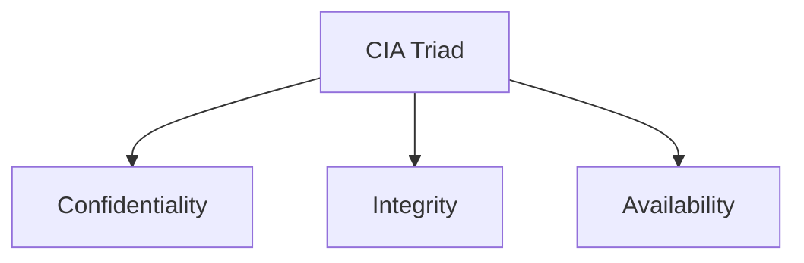
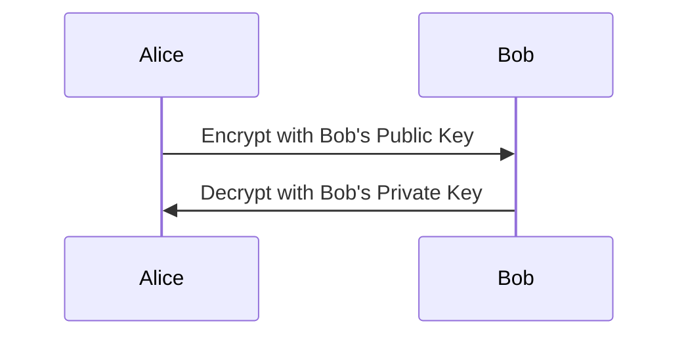
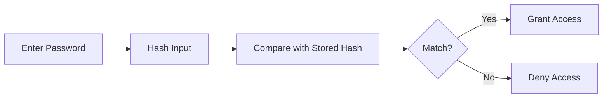
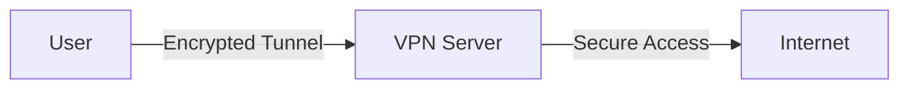
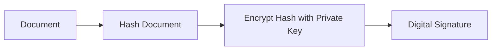
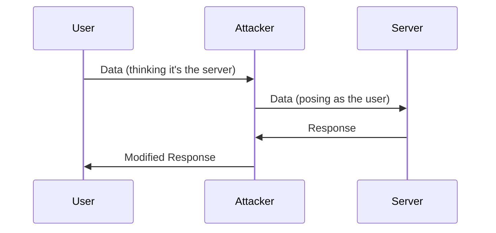
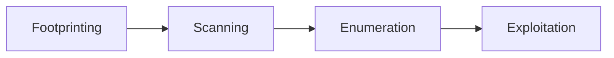
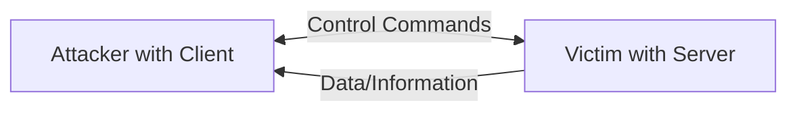

## Question 1(a) [3 marks]

**Define cyber security & computer security.**

**Answer**:

| Term | Definition |
|------|------------|
| **Cyber Security** | Protection of internet-connected systems including hardware, software, and data from cyber attacks |
| **Computer Security** | Protection of computer systems from theft or damage to hardware, software, or data |

**Mnemonic:** "Cyber Connects, Computer Contains" - Cyber security protects connected systems, computer security protects contained systems.

## Question 1(b) [4 marks]

**Explain CIA triad.**

**Answer**:

**Table: CIA Triad Components**

| Component | Description |
|-----------|-------------|
| **Confidentiality** | Ensures that information is not disclosed to unauthorized individuals or systems |
| **Integrity** | Maintains consistency, accuracy, and trustworthiness of data throughout its lifecycle |
| **Availability** | Ensures that information and resources are accessible to authorized users when needed |



**Mnemonic:** "CIA Keeps Information Safe" - Confidentiality, Integrity, and Availability are the three key security principles.

## Question 1(c) [7 marks]

**Define adversary, attack, countermeasure, risk, security policy, system resource, and threat in the context of computer security.**

**Answer**:

**Table: Key Computer Security Concepts**

| Term | Definition |
|------|------------|
| **Adversary** | Individual or group that attempts to compromise security |
| **Attack** | Deliberate action to exploit vulnerabilities in a system |
| **Countermeasure** | Action or technique that reduces a threat or vulnerability |
| **Risk** | Potential for loss or damage when a threat exploits a vulnerability |
| **Security Policy** | Rules that define acceptable use and protection of resources |
| **System Resource** | Any component (hardware/software/data) that needs protection |
| **Threat** | Potential danger that might exploit a vulnerability |

**Mnemonic:** "ARTISTS Create Security Problems" - Adversary, Risk, Threat, Integrity, System Resource, Threat, Security Policy.

## Question 1(c OR) [7 marks]

**Explain MD5 hashing algorithm.**

**Answer**:

**MD5 Hashing Process**

| Step | Description |
|------|-------------|
| **Step 1** | Padding the message to ensure length is divisible by 512 |
| **Step 2** | Dividing message into 512-bit blocks |
| **Step 3** | Initializing 4 registers (A, B, C, D) with predefined values |
| **Step 4** | Processing each block through 4 rounds of operations |
| **Step 5** | Producing a 128-bit (16-byte) hash value as output |

```
MD5(message) → 128-bit hash value regardless of input size
```

**Mnemonic:** "Padding Divides Initial Processing Output" - Padding, Division, Initialization, Processing, Output.

## Question 2(a) [3 marks]

**Define authentication in context of cyber security.**

**Answer**:

**Authentication** is the process of verifying the identity of a user, system, or entity trying to access a resource. It confirms "you are who you say you are" through factors like:

| Authentication Factors |
|---------------------|
| Something you know (password) |
| Something you have (card) |
| Something you are (biometrics) |

**Mnemonic:** "Know, Have, Are" - the three basic authentication factors.

## Question 2(b) [4 marks]

**Explain public key cryptography with example.**

**Answer**:

**Public Key Cryptography Process**

| Component | Description |
|-----------|-------------|
| **Public Key** | Shared openly, used to encrypt data |
| **Private Key** | Kept secret, used to decrypt data |
| **Example** | Alice encrypts message with Bob's public key → Only Bob can decrypt with his private key |



**Mnemonic:** "Public Protects, Private Proves" - Public key encrypts, private key decrypts.

## Question 2(c) [7 marks]

**Explain working of packet filter and application proxy.**

**Answer**:

**Table: Packet Filter vs Application Proxy**

| Feature | Packet Filter | Application Proxy |
|---------|--------------|-------------------|
| **Layer** | Network layer | Application layer |
| **Inspection** | IP headers, ports | Content analysis |
| **Operation** | Allows/blocks packets based on rules | Acts as intermediary between client and server |
| **Performance** | Faster, less resource-intensive | Slower, more resource-intensive |
| **Security Level** | Lower, header-based analysis | Higher, content-based analysis |

**Mnemonic:** "PATCH" - Packet filters Address Traffic, Content proxies Handle applications.

## Question 2(a OR) [3 marks]

**Explain multi-factor authentication**

**Answer**:

**Multi-factor authentication (MFA)** combines two or more independent credentials:

| Authentication Factor Types |
|---------------------------|
| **Knowledge factor** (password) |
| **Possession factor** (security token) |
| **Inherence factor** (biometric) |
| **Location factor** (geolocation) |

**Mnemonic:** "Multiple Keys Secure Best" - Multiple verification factors provide better security.

## Question 2(b OR) [4 marks]

**Explain the process of password verification.**

**Answer**:

**Password Verification Process**

| Step | Description |
|------|-------------|
| **Input** | User enters username and password |
| **Hash** | System hashes the entered password |
| **Compare** | System compares hash with stored hash |
| **Result** | Grant or deny access based on match |



**Mnemonic:** "HICS" - Hash, Input, Compare, Success/Stop.

## Question 2(c OR) [7 marks]

**List out malicious software and explain any three malicious software attacks.**

**Answer**:

**Types of Malicious Software**

| Type | Description |
|------|-------------|
| **Virus** | Self-replicating code that attaches to legitimate programs |
| **Worm** | Self-propagating malware that spreads through networks |
| **Trojan** | Disguises as legitimate software but contains malicious code |
| **Ransomware** | Encrypts victim's files and demands payment for decryption |
| **Spyware** | Collects information without user's knowledge |
| **Adware** | Displays unwanted advertisements |
| **Rootkit** | Provides persistent privileged access to a computer |

**Mnemonic:** "VWTR-SAR" - Viruses, Worms, Trojans, Ransomware, Spyware, Adware, Rootkits attack your system.

## Question 3(a) [3 marks]

**Explain the importance of ports in cyber security.**

**Answer**:

**Ports in Cyber Security**

| Aspect | Importance |
|--------|------------|
| **Access Control** | Controlling which services are accessible |
| **Attack Surface** | Fewer open ports mean smaller attack surface |
| **Service Identification** | Helps identify running services (e.g., HTTP:80, HTTPS:443) |

**Mnemonic:** "SAP" - Security requires controlling Access to Ports.

## Question 3(b) [4 marks]

**Explain Virtual private network.**

**Answer**:

**Virtual Private Network (VPN)**

| Feature | Description |
|---------|-------------|
| **Encryption** | Encrypts data in transit between client and server |
| **Tunneling** | Creates secure connection through public networks |
| **Privacy** | Masks user's IP address and location |
| **Security** | Protects data from interception on public networks |



**Mnemonic:** "PETS" - Private Encrypted Tunnels Secure data.

## Question 3(c) [7 marks]

**Explain the impact of web security threats.**

**Answer**:

**Impact of Web Security Threats**

| Threat | Impact |
|--------|--------|
| **Data Breach** | Exposure of sensitive user information |
| **Financial Loss** | Direct monetary damages and recovery costs |
| **Reputational Damage** | Loss of customer trust and brand value |
| **Regulatory Penalties** | Fines for non-compliance with security standards |
| **Service Disruption** | Website downtime and business interruption |

**Mnemonic:** "DFRS" - Data breaches lead to Financial loss, Reputation damage, and Service disruption.

## Question 3(a OR) [3 marks]

**Explain working of digital signature.**

**Answer**:

**Digital Signature Process**

| Step | Description |
|------|-------------|
| **Hash** | Create hash of the document |
| **Encrypt** | Encrypt hash with sender's private key |
| **Attach** | Attach encrypted hash to document |
| **Verify** | Recipient decrypts with sender's public key and compares hashes |



**Mnemonic:** "HEAV" - Hash, Encrypt, Attach, Verify for digital signatures.

## Question 3(b OR) [4 marks]

**Describe HTTPS.**

**Answer**:

**HTTPS (Hypertext Transfer Protocol Secure)**

| Feature | Description |
|---------|-------------|
| **Encryption** | Uses SSL/TLS to encrypt communications |
| **Authenticity** | Verifies identity of the website via certificates |
| **Integrity** | Ensures data hasn't been modified in transit |
| **Port** | Uses port 443 (vs HTTP's port 80) |

**Mnemonic:** "EAIP" - Encryption, Authenticity, Integrity, Port 443.

## Question 3(c OR) [7 marks]

**Explain social engineering, vishing and machine in the middle attack.**

**Answer**:

**Table: Attack Types and Characteristics**

| Attack Type | Description | Example |
|-------------|-------------|---------|
| **Social Engineering** | Manipulates people into revealing information | Pretending to be IT support to get passwords |
| **Vishing** | Voice phishing using phone calls to trick victims | Caller claims to be from bank requesting account details |
| **Machine in the Middle** | Intercepts communication between two parties | Attacker intercepts traffic between user and website |



**Mnemonic:** "SVM" - Social engineering uses Voice calls and Machines in the middle to steal data.

## Question 4(a) [3 marks]

**Match the following.**

**Answer**:

**Correct Matches**

| Column A | Column B |
|----------|----------|
| 1. Denial of Service (DoS) | f. Attack that disrupts network services |
| 2. Port 443 | c. Default port for HTTPS |
| 3. Secure Socket Layer (SSL) | e. Predecessor of TLS for secure communication |
| 4. Port 80 | b. Default port for HTTP |
| 5. Integrity | a. Ensures data is not altered during transmission |
| 6. VPN (Virtual Private Network) | d. Creates a secure connection over the internet |

**Mnemonic:** "DOS Protects Security Information Very Carefully" - DOS, Port 443, SSL, Port 80, Integrity, VPN.

## Question 4(b) [4 marks]

**List out types of hackers and explain role of each.**

**Answer**:

**Types of Hackers**

| Type | Role/Motivation |
|------|----------------|
| **White Hat** | Ethical hackers who find vulnerabilities to improve security |
| **Black Hat** | Malicious hackers who exploit systems for personal gain |
| **Grey Hat** | Operate between ethical and malicious without permission |
| **Script Kiddie** | Unskilled individuals using existing tools without understanding |

**Mnemonic:** "WBGS" - White, Black, Grey hackers and Script kiddies have different aims.

## Question 4(c) [7 marks]

**Explain SSH (Secure shell) protocol stack.**

**Answer**:

**SSH Protocol Stack**

| Layer | Function |
|-------|----------|
| **Transport Layer** | Provides encryption, authentication, integrity |
| **User Authentication Layer** | Verifies user identity to the server |
| **Connection Layer** | Manages multiple channels within a single SSH connection |
| **Applications** | Terminal sessions, file transfers, port forwarding |

```
Application -> Connection -> Authentication -> Transport -> Network
```

**Mnemonic:** "TUCAN" - Transport, User authentication, Connection layer, and Applications on Network.

## Question 4(a OR) [3 marks]

**Explain foot printing in ethical hacking.**

**Answer**:

**Foot printing** is the initial reconnaissance phase where hackers gather information about target systems.

| Method | Information Gathered |
|--------|---------------------|
| **Passive** | Public records, websites, social media |
| **Active** | Network scanning, DNS queries |
| **Purpose** | Map attack surface and identify vulnerabilities |

**Mnemonic:** "PAM" - Passive and Active Methods reveal information.

## Question 4(b OR) [4 marks]

**Explain scanning in ethical hacking.**

**Answer**:

**Scanning in Ethical Hacking**

| Scanning Type | Purpose |
|---------------|---------|
| **Port Scanning** | Identify open ports and services |
| **Vulnerability Scanning** | Detect known security weaknesses |
| **Network Scanning** | Map network topology and hosts |
| **OS Fingerprinting** | Determine operating systems in use |



**Mnemonic:** "PVNO" - Ports, Vulnerabilities, Networks, and OS identification.

## Question 4(c OR) [7 marks]

**Describe injection attack and phishing attack.**

**Answer**:

**Table: Injection vs Phishing Attacks**

| Feature | Injection Attack | Phishing Attack |
|---------|-----------------|----------------|
| **Target** | Application code | Human users |
| **Method** | Insert malicious code into input fields | Impersonate trusted entities |
| **Example** | SQL injection: `' OR 1=1 --` | Fake login page resembling bank website |
| **Prevention** | Input validation, parameterized queries | User education, email filters |
| **Impact** | Data theft, authentication bypass | Credential theft, malware installation |

**Mnemonic:** "TIP" - Technical attacks use Injection, People-focused attacks use Phishing.

## Question 5(a) [3 marks]

**Explain disk forensics.**

**Answer**:

**Disk Forensics**

| Aspect | Description |
|--------|-------------|
| **Purpose** | Recovery and analysis of data from storage devices |
| **Process** | Create disk image, analyze without modifying original |
| **Focus** | Recover deleted files, analyze file systems, find evidence |

**Mnemonic:** "IPF" - Image creation, Preservation, and Forensic analysis.

## Question 5(b) [4 marks]

**Explain password cracking methods.**

**Answer**:

**Password Cracking Methods**

| Method | Description |
|--------|-------------|
| **Dictionary Attack** | Try common words and variations |
| **Brute Force** | Try all possible character combinations |
| **Rainbow Table** | Use precomputed hash tables |
| **Social Engineering** | Manipulate users to reveal passwords |

**Mnemonic:** "DBRS" - Dictionary, Brute force, Rainbow tables, and Social engineering break passwords.

## Question 5(c) [7 marks]

**Describe Remote Administration Tool (RAT).**

**Answer**:

**Remote Administration Tool (RAT)**

| Feature | Description |
|---------|-------------|
| **Functionality** | Provides complete control over target system |
| **Components** | Client (attacker) and server (victim) components |
| **Capabilities** | File access, keylogging, screen capture, microphone/camera control |
| **Delivery** | Often distributed via phishing, infected software |
| **Legitimate Use** | IT support and remote assistance |
| **Malicious Use** | Unauthorized access and data theft |



**Mnemonic:** "FCDLM" - Full Control provides Data access through Legitimate or Malicious means.

## Question 5(a OR) [3 marks]

**List out challenges of cybercrime.**

**Answer**:

**Cybercrime Challenges**

| Challenge | Description |
|-----------|-------------|
| **Jurisdiction** | Crimes cross national boundaries |
| **Attribution** | Difficult to identify perpetrators |
| **Evidence Collection** | Digital evidence is volatile and easily altered |
| **Rapid Evolution** | Techniques constantly change and adapt |

**Mnemonic:** "JAER" - Jurisdiction, Attribution, Evidence, and Rapid evolution.

## Question 5(b OR) [4 marks]

**Explain mobile forensics.**

**Answer**:

**Mobile Forensics**

| Aspect | Description |
|--------|-------------|
| **Scope** | Extracting data from mobile devices (calls, messages, location) |
| **Challenges** | Device locks, encryption, cloud storage, frequent updates |
| **Methods** | Physical acquisition, logical acquisition, file system acquisition |
| **Tools** | Specialized hardware and software for data extraction |

**Mnemonic:** "SCMT" - Scope, Challenges, Methods, and Tools for mobile forensics.

## Question 5(c OR) [7 marks]

**Explain Salami Attack, Web Jacking, Data diddling and Ransomware attack.**

**Answer**:

**Table: Types of Cyber Attacks**

| Attack Type | Description | Example |
|-------------|-------------|---------|
| **Salami Attack** | Small, unnoticeable thefts over time | Taking tiny amounts from many bank accounts |
| **Web Jacking** | Hijacking a website by taking control of URL | Redirecting users to fake site by changing domain |
| **Data Diddling** | Altering data before processing | Changing prices in inventory system |
| **Ransomware** | Encrypts files and demands payment for key | Encrypting hospital records and demanding bitcoin |

**Mnemonic:** "SWDR" - Salami slices, Web control, Data changes, and Ransom demands are different attack methods.
