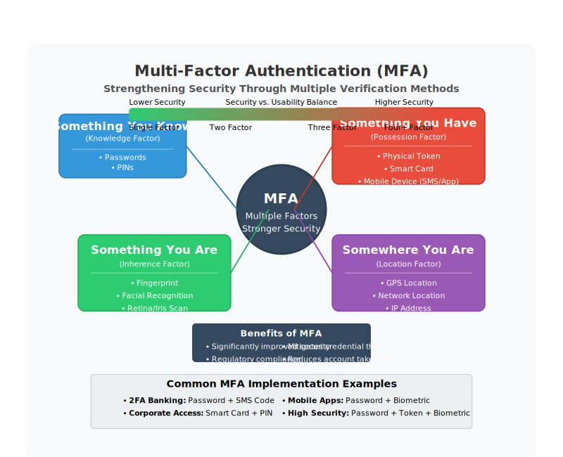
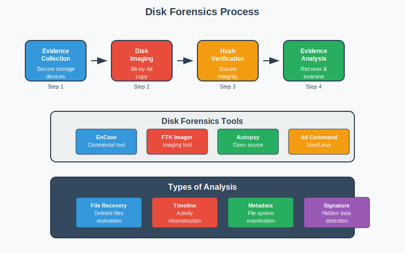

## પ્રશ્ન 1(અ) [3 ગુણ]

**સાયબર સુરક્ષા અને કમ્પ્યુટર સુરક્ષા વ્યાખ્યાયિત કરો.**

**જવાબ**:

- **સાયબર સુરક્ષા**: ઇન્ટરનેટ-કનેક્ટેડ સિસ્ટમ્સની હાર્ડવેર, સોફ્ટવેર અને ડેટાની સાયબર ખતરાઓથી સુરક્ષા. તે નેટવર્ક્સ, ડિવાઇસિસ અને પ્રોગ્રામ્સને અનધિકૃત ડિજિટલ હુમલાઓથી બચાવવા પર ધ્યાન કેન્દ્રિત કરે છે.
- **કમ્પ્યુટર સુરક્ષા**: વ્યક્તિગત કમ્પ્યુટર સિસ્ટમ્સ અને ડેટાને ચોરી, નુકસાન, અથવા અનધિકૃત એક્સેસથી સુરક્ષા. તે ભૌતિક કમ્પ્યુટર હાર્ડવેર અને તેમાં ઇન્સ્ટોલ કરેલ સોફ્ટવેરની સુરક્ષા પર ધ્યાન કેન્દ્રિત કરે છે.

**ડાયાગ્રામ:**

**મેમરી ટ્રીક:** "સાયબર નેટવર્ક સુરક્ષિત કરે, કમ્પ્યુટર મશીન સાચવે"

## પ્રશ્ન 1(બ) [4 ગુણ]

**CIA triad સમજાવો.**

**જવાબ**:
CIA triad માહિતી સુરક્ષાના ત્રણ મૂળભૂત સિદ્ધાંતોનું પ્રતિનિધિત્વ કરે છે:

| સિદ્ધાંત | વિગત |
|-----------|-------------|
| **Confidentiality** | ખાતરી કરે છે કે સંવેદનશીલ માહિતી માત્ર અધિકૃત પક્ષો દ્વારા જ એક્સેસિબલ છે |
| **Integrity** | ડેટા સ્ટોરેજ અને ટ્રાન્સમિશન દરમિયાન સચોટ અને અપરિવર્તિત રહે છે તેની ગેરંટી આપે છે |
| **Availability** | સિસ્ટમ્સ અને ડેટા જરૂર પડે ત્યારે અધિકૃત વપરાશકર્તાઓ માટે એક્સેસિબલ હોય તેની ખાતરી કરે છે |

**ડાયાગ્રામ:**

**મેમરી ટ્રીક:** "CIA માહિતી યોગ્ય રીતે એક્સેસિબલ રાખે"

## પ્રશ્ન 1(ક) [7 ગુણ]

**કોમ્પ્યુટર સુરક્ષાના સંદર્ભમાં એડવર્સરી, એટેક, કાઉન્ટરમેઝર, રિસ્ક, સિક્યુરીટી પોલિસી, સિસ્ટમ રીસોર્સ અને થ્રેટ ને વ્યાખ્યાયિત કરો.**

**જવાબ**:

| શબ્દ | વ્યાખ્યા |
|------|------------|
| **Adversary** | વ્યક્તિ અથવા જૂથ જે દુર્ભાવનાપૂર્ણ હેતુઓ માટે કમજોરીઓનો ફાયદો ઉઠાવવાનો પ્રયાસ કરે છે |
| **Attack** | સિસ્ટમમાં રહેલી કમજોરીઓનો ફાયદો ઉઠાવીને સુરક્ષાને સમાધાન કરવાની જાણીજોઈને કરાયેલી કાર્યવાહી |
| **Countermeasure** | સુરક્ષા કમજોરીઓને ઓછી કરવા અથવા દૂર કરવા માટે લાગુ કરવામાં આવતા નિયંત્રણો |
| **Risk** | જયારે ખતરો કમજોરીનો ફાયદો ઉઠાવે ત્યારે નુકસાન થવાની સંભાવના |
| **Security Policy** | સ્વીકાર્ય ઉપયોગ અને સુરક્ષા જરૂરિયાતોને વ્યાખ્યાયિત કરતા દસ્તાવેજીકૃત નિયમો |
| **System Resource** | હાર્ડવેર, સોફ્ટવેર, ડેટા, અથવા નેટવર્ક ઘટકો જેને સુરક્ષાની જરૂર છે |
| **Threat** | સંભવિત ખતરો જે સુરક્ષાને તોડવા માટે કમજોરીનો ફાયદો ઉઠાવી શકે છે |

**ડાયાગ્રામ:**

**મેમરી ટ્રીક:** "ARTSVSC: અમારા રિસોર્સની ટેકનોલોજી સુરક્ષિત વિવિધ સિસ્ટમ કમ્પોનન્ટ"

## પ્રશ્ન 1(ક OR) [7 ગુણ]

**MD5 હેશિંગ અલ્ગોરિધમ સમજાવો.**

**જવાબ**:
MD5 (Message Digest 5) એક વ્યાપકપણે ઉપયોગમાં લેવાતી ક્રિપ્ટોગ્રાફિક હેશ ફંક્શન છે જે 128-બિટ (16-બાઇટ) હેશ વેલ્યુ આપે છે:

1. **Input Processing**: સંદેશને પેડ કરવામાં આવે છે અને 512-બિટ બ્લોક્સમાં વિભાજિત કરવામાં આવે છે
2. **Initialization**: ચાર 32-બિટ રજિસ્ટર્સને નિશ્ચિત મૂલ્યો સાથે સેટઅપ કરે છે
3. **Compression**: 16-વર્ડ બ્લોક્સમાં સંદેશને ચાર રાઉન્ડના ઓપરેશન્સ દ્વારા પ્રોસેસ કરે છે
4. **Output**: અંતિમ હેશ મૂલ્ય તરીકે 128-બિટ ડાયજેસ્ટ આપે છે

**ડાયાગ્રામ:**

- **નબળાઈ**: કોલિઝન-રેઝિસ્ટન્ટ નથી; સુરક્ષા-ક્રિટિકલ એપ્લિકેશન્સ માટે ઉપયોગ ન કરવો જોઇએ
- **ઉપયોગ**: ફાઇલ ઇન્ટેગ્રિટી વેરિફિકેશન અને નોન-સિક્યુરિટી ક્રિટિકલ એપ્લિકેશન્સ

**મેમરી ટ્રીક:** "પેડ, વિભાજન, પ્રોસેસ, આઉટપુટ - સુરક્ષા માટે વાપરશો નહીં!"

## પ્રશ્ન 2(અ) [3 ગુણ]

**સાયબર સુરક્ષાના સંદર્ભમાં ઓથેન્ટિકેશન વ્યાખ્યાયિત કરો.**

**જવાબ**:
Authentication એ રિસોર્સની એક્સેસ આપતા પહેલાં વપરાશકર્તા, સિસ્ટમ અથવા એન્ટિટીની ઓળખની ચકાસણી કરવાની પ્રક્રિયા છે:

- **પુષ્ટિ કરે છે**: "તમે જે હોવાનો દાવો કરો છો તે જ છો"
- **ચકાસે છે**: ક્રેડેન્શિયલ્સ (પાસવર્ડ, બાયોમેટ્રિક્સ, ટોકન) વડે ઓળખ
- **આગળ આવે છે**: Authorization (ઓથેન્ટિકેશન પછી તમે શેને એક્સેસ કરી શકો છો)

**ડાયાગ્રામ:**

**મેમરી ટ્રીક:** "પ્રવેશ પહેલા ચકાસો"

## પ્રશ્ન 2(બ) [4 ગુણ]

**સાર્વજનિક કી ક્રિપ્ટોગ્રાફી ઉદાહરણ સાથે સમજાવો.**

**જવાબ**:
Public key cryptography સુરક્ષિત કોમ્યુનિકેશન માટે બે ગાણિતિક રીતે સંબંધિત કી વાપરે છે:

| કોમ્પોનન્ટ | કાર્ય |
|-----------|----------|
| **Public Key** | ખુલ્લેઆમ શેર કરવામાં આવે છે અને સંદેશાઓને એન્ક્રિપ્ટ કરવા માટે વપરાય છે |
| **Private Key** | ગુપ્ત રાખવામાં આવે છે અને સંદેશાઓને ડિક્રિપ્ટ કરવા માટે વપરાય છે |

**ઉદાહરણ**: RSA encryption માં, જો Alice Bob ને સંદેશો મોકલવા માંગે છે:

1. Alice, Bob ની public key વડે એન્ક્રિપ્ટ કરે છે
2. માત્ર Bob જ પોતાની private key નો ઉપયોગ કરીને ડિક્રિપ્ટ કરી શકે છે

**ડાયાગ્રામ:**

**મેમરી ટ્રીક:** "પબ્લિક લોક કરે, પ્રાઈવેટ અનલોક કરે"

## પ્રશ્ન 2(ક) [7 ગુણ]

**પેકેટ ફિલ્ટર અને એપ્લિકેશન પ્રોક્સીની કામગીરી સમજાવો.**

**જવાબ**:

| ફાયરવોલ પ્રકાર | કાર્યપદ્ધતિ |
|---------------|---------|
| **Packet Filter** | પૂર્વનિર્ધારિત નિયમોના આધારે પેકેટ હેડર્સની તપાસ કરે છે. સોર્સ/ડેસ્ટિનેશન IP એડ્રેસ, પોર્ટ્સ અને પ્રોટોકોલના આધારે નિર્ણયો લે છે. OSI નેટવર્ક અને ટ્રાન્સપોર્ટ લેયર પર કામ કરે છે. ઓછા રિસોર્સના વપરાશ સાથે હાઈ-સ્પીડ ફિલ્ટરિંગ ઓફર કરે છે. |
| **Application Proxy** | ક્લાયન્ટ અને સર્વર એપ્લિકેશન્સ વચ્ચે મધ્યસ્થી તરીકે કાર્ય કરે છે. એપ્લિકેશન લેયર પર બધા ટ્રાફિકને પ્રોસેસ કરે છે. બે કનેક્શન્સ બનાવે છે (ક્લાયન્ટ-ટુ-પ્રોક્સી અને પ્રોક્સી-ટુ-સર્વર). કન્ટેન્ટ ઇન્સ્પેક્શન અને યુઝર ઓથેન્ટિકેશન ક્ષમતાઓ પ્રદાન કરે છે. |

**ડાયાગ્રામ:**

**મેમરી ટ્રીક:** "પેકેટ હેડર તપાસે, પ્રોક્સી કન્ટેન્ટ ચકાસે"

## પ્રશ્ન 2(અ OR) [3 ગુણ]

**મલ્ટી ફેક્ટર ઓથેન્ટિકેશન સમજાવો.**

**જવાબ**:
Multi-factor authentication (MFA) વપરાશકર્તાઓને રિસોર્સની એક્સેસ મેળવવા માટે બે અથવા વધુ વેરિફિકેશન ફેક્ટર્સ પ્રદાન કરવાની જરૂર પડે છે:

- **જે તમે જાણો છો**: પાસવર્ડ, PIN, સિક્યુરિટી પ્રશ્ન
- **જે તમારી પાસે છે**: મોબાઇલ ફોન, સ્માર્ટ કાર્ડ, સિક્યુરિટી ટોકન
- **જે તમે છો**: ફિંગરપ્રિન્ટ, ચહેરા ઓળખ, અવાજનો પેટર્ન

**ડાયાગ્રામ:**

**મેમરી ટ્રીક:** "જાણો, રાખો, છો - ત્રિવિધ સુરક્ષા"

## પ્રશ્ન 2(બ OR) [4 ગુણ]

**પાસવર્ડ વેરિફિકેશનની પ્રક્રિયા સમજાવો.**

**જવાબ**:
Password verification એ સ્ટોર કરેલા મૂલ્યો સામે યુઝર ક્રેડેન્શિયલ્સને ઓથેન્ટિકેટ કરવાની પ્રક્રિયા છે:

1. **User Input**: યુઝર યુઝરનેમ અને પાસવર્ડ દાખલ કરે છે
2. **Hash Generation**: સિસ્ટમ દાખલ કરેલા પાસવર્ડને હેશ કરે છે
3. **Comparison**: હેશને ડેટાબેસમાં સ્ટોર થયેલ હેશ સાથે સરખાવવામાં આવે છે
4. **Access Decision**: જો હેશ મેળ ખાય તો એક્સેસ આપવામાં આવે છે, નહીં તો નકારવામાં આવે છે

**ડાયાગ્રામ:**

**મેમરી ટ્રીક:** "દાખલ, હેશ, સરખામણી, નિર્ણય"

## પ્રશ્ન 2(ક OR) [7 ગુણ]

**દૂષિત સૉફ્ટવેરની સૂચિ બનાવો અને કોઈપણ ત્રણ દૂષિત સૉફ્ટવેર હુમલાઓ સમજાવો.**

**જવાબ**:

**દૂષિત સૉફ્ટવેરના પ્રકારો**:

- Viruses, Worms, Trojans, Ransomware, Spyware, Adware, Rootkits, Keyloggers, Bots

**ત્રણ સામાન્ય હુમલાઓ**:

| હુમલાનો પ્રકાર | સમજૂતી |
|-------------|-------------|
| **Ransomware** | પીડિતની ફાઇલોને એન્ક્રિપ્ટ કરે છે અને ડિક્રિપ્શન કી માટે ચુકવણીની માંગ કરે છે. ફિશિંગ ઇમેઇલ્સ, દૂષિત ડાઉનલોડ્સ, અથવા કમજોરીઓનો ફાયદો ઉઠાવીને ફેલાય છે. ઉદાહરણ: WannaCry. |
| **Trojans** | કાયદેસર સોફ્ટવેર તરીકે છુપાયેલા પરંતુ દુર્ભાવનાપૂર્ણ કાર્યો કરે છે. હુમલાખોરો માટે સિસ્ટમમાં પ્રવેશવા માટે બેકડોર બનાવે છે. ઉદાહરણ: Remote Access Trojans (RATs). |
| **Spyware** | સંમતિ વિના યુઝર માહિતી એકત્રિત કરે છે. પ્રવૃત્તિઓ, કીસ્ટ્રોક્સ અને બ્રાઉઝિંગ આદતોને મોનિટર કરે છે. પાસવર્ડ અને નાણાકીય માહિતી ચોરી કરી શકે છે. |

**ડાયાગ્રામ:**

**મેમરી ટ્રીક:** "RTS: રેન્સમ સિસ્ટમ લે છે, ટ્રોજન છુપાઈને આવે છે, સ્પાયવેર માહિતી ચોરે છે"

## પ્રશ્ન 3(અ) [3 ગુણ]

**સાયબર સુરક્ષામાં પોર્ટનું મહત્વ સમજાવો.**

**જવાબ**:
Ports એ નેટવર્ક કોમ્યુનિકેશન માટેના વર્ચ્યુઅલ એન્ડપોઇન્ટ્સ છે જે:

- **સેવાઓને ઓળખે છે**: દરેક સેવા ચોક્કસ પોર્ટ નંબરનો ઉપયોગ કરે છે (HTTP:80, HTTPS:443)
- **ફિલ્ટરિંગ સક્ષમ કરે છે**: ફાયરવોલ ચોક્કસ પોર્ટ્સને મંજૂરી/બ્લોક કરીને ટ્રાફિકને નિયંત્રિત કરે છે
- **એટેક સરફેસ ઘટાડે છે**: બિનજરૂરી પોર્ટ્સ બંધ કરવાથી સુરક્ષા વધે છે

**ડાયાગ્રામ:**

**મેમરી ટ્રીક:** "દરેક પોર્ટ એક પ્રવેશદ્વાર છે"

## પ્રશ્ન 3(બ) [4 ગુણ]

**વર્ચ્યુઅલ પ્રાઇવેટ નેટવર્ક સમજાવો.**

**જવાબ**:
Virtual Private Network (VPN) એ એવી ટેકનોલોજી છે જે:

| ફીચર | વિગત |
|---------|-------------|
| **Encrypted Tunnel** | જાહેર નેટવર્ક પર સુરક્ષિત કનેક્શન બનાવે છે |
| **IP Masking** | યુઝરના IP એડ્રેસ અને લોકેશનને છુપાવે છે |
| **Data Protection** | ટ્રાન્સમિશન દરમિયાન ડેટાને એન્ક્રિપ્ટ કરે છે |
| **Remote Access** | પ્રાઇવેટ નેટવર્ક્સમાં સુરક્ષિત કનેક્શન સક્ષમ કરે છે |

**ડાયાગ્રામ:**

**મેમરી ટ્રીક:** "ટનલ, એન્ક્રિપ્ટ, રક્ષણ, કનેક્ટ"

## પ્રશ્ન 3(ક) [7 ગુણ]

**વેબ સુરક્ષા જોખમોની અસર સમજાવો.**

**જવાબ**:
વેબ સુરક્ષા જોખમોની સંસ્થાઓ અને વ્યક્તિઓ પર નોંધપાત્ર અસરો પડે છે:

| અસર | વિગત |
|--------|-------------|
| **Data Breaches** | સંવેદનશીલ માહિતીનો ખુલાસો જે નાણાકીય નુકસાન અને પ્રતિષ્ઠાને નુકસાન તરફ દોરી જાય છે |
| **Financial Loss** | સીધી નાણાકીય ચોરી, છેતરપિંડી, રિકવરી ખર્ચ, અને નિયમનકારી દંડ |
| **Operational Disruption** | સિસ્ટમ ડાઉનટાઇમ જે બિઝનેસ કન્ટિન્યુઇટી અને કસ્ટમર સર્વિસને અસર કરે છે |
| **Reputation Damage** | સુરક્ષા ઘટનાઓ પછી ગ્રાહકોનો વિશ્વાસ અને બ્રાન્ડ વેલ્યુનું નુકસાન |
| **Legal Consequences** | કાનૂની કાર્યવાહી, નિયમનકારી દંડ, અને કમ્પ્લાયન્સ ઉલ્લંઘન |

**ડાયાગ્રામ:**

**મેમરી ટ્રીક:** "DFROL: ડેટા, ફાઇનાન્સ, રિસોર્સ, ઓપિનિયન, લીગલ"

## પ્રશ્ન 3(અ OR) [3 ગુણ]

**ડિજિટલ સિગ્નેચરની કામગીરી સમજાવો.**

**જવાબ**:
Digital signatures ઇલેક્ટ્રોનિક દસ્તાવેજોને પ્રમાણિત કરે છે અને તેમની અખંડિતતાની ચકાસણી કરે છે:

1. **Hash Creation**: દસ્તાવેજને હેશ કરીને અનન્ય ડાયજેસ્ટ બનાવવામાં આવે છે
2. **Encryption**: મોકલનાર પોતાની પ્રાઇવેટ કી વાપરીને હેશને એન્ક્રિપ્ટ કરે છે
3. **Verification**: પ્રાપ્તકર્તા મોકલનારની પબ્લિક કી વાપરીને ડિક્રિપ્ટ કરે છે
4. **Validation**: ડિક્રિપ્ટ થયેલ હેશને નવા જનરેટ કરેલા હેશ સાથે સરખાવવું

**ડાયાગ્રામ:**

**મેમરી ટ્રીક:** "હેશ, સાઇન, મોકલો, ચકાસો"

## પ્રશ્ન 3(બ OR) [4 ગુણ]

**HTTPS નું વર્ણન કરો.**

**જવાબ**:
HTTPS (Hypertext Transfer Protocol Secure) એ HTTP નું સુરક્ષિત વર્ઝન છે:

| ફીચર | વિગત |
|---------|-------------|
| **TLS/SSL** | ડેટાને એન્ક્રિપ્ટ કરવા માટે Transport Layer Security વાપરે છે |
| **Authentication** | સર્ટિફિકેટ્સ દ્વારા વેબસાઇટની ઓળખ ચકાસે છે |
| **Data Integrity** | પ્રસારિત ડેટાના ફેરફારને અટકાવે છે |
| **Port 443** | HTTP ના પોર્ટ 80 ને બદલે ડિફોલ્ટ પોર્ટ 443 વાપરે છે |

**ડાયાગ્રામ:**

**મેમરી ટ્રીક:** "સુરક્ષિત પેજ પાસે પેડલોક હોય છે"

## પ્રશ્ન 3(ક OR) [7 ગુણ]

**સોશિયલ એન્જિનિયરિંગ, વિશિંગ અને મશીન ઇન મિડલ એટેક સમજાવો.**

**જવાબ**:

| હુમલાનો પ્રકાર | સમજૂતી |
|-------------|-------------|
| **Social Engineering** | સંવેદનશીલ માહિતી જાહેર કરવા માટે યુઝર્સને છેતરવા માટેનું માનસિક હેરફેર. તકનીકી કમજોરીઓને બદલે માનવ વિશ્વાસનો ફાયદો ઉઠાવે છે. સામાન્ય તકનીકોમાં pretexting, baiting, અને phishing શામેલ છે. |
| **Vishing** | ફોન કોલ્સનો ઉપયોગ કરીને માહિતી ચોરવા માટે વોઇસ ફિશિંગ. હુમલાખોરો કાયદેસર સંસ્થાઓનું પ્રતિનિધિત્વ કરે છે. પીડિતોને હેરફેર કરવા માટે ઘણીવાર તાત્કાલિકતા અથવા ભયનો ઉપયોગ કરે છે. |
| **Machine in the Middle** | હુમલાખોર ગુપ્તપણે બે પક્ષો વચ્ચેના સંદેશાવ્યવહારને અવરોધે છે અને રિલે કરે છે. પીડિતોને લાગે છે કે તેઓ એકબીજા સાથે સીધો સંદેશાવ્યવહાર કરી રહ્યા છે. હુમલાખોરોને ટ્રાન્સમિશન દરમિયાન સંવેદનશીલ માહિતી ચોરી/ફેરફાર કરવાની મંજૂરી આપે છે. |

**ડાયાગ્રામ:**

**મેમરી ટ્રીક:** "SEVeM: સોશિયલ લોકોને છેતરે, વિશિંગ અવાજ વાપરે, મશીન મધ્યમાં બેસે"

## પ્રશ્ન 4(અ) [3 ગુણ]

**જોડકા જોડો.**

**જવાબ**:

| સ્તંભ A | સ્તંભ B |
|----------|----------|
| 1. Denial of Service (DoS) | f. નેટવર્ક સેવાઓને વિક્ષેપિત કરતો હુમલો |
| 2. Port 443 | c. HTTPS માટે ડિફોલ્ટ પોર્ટ |
| 3. Secure Socket Layer (SSL) | e. સુરક્ષિત સંચાર માટે TLS નો પૂર્વગામી |
| 4. Port 80 | b. HTTP માટે ડિફોલ્ટ પોર્ટ |
| 5. Integrity | a. ટ્રાન્સમિશન દરમિયાન ડેટા બદલાયો નથી તેની ખાતરી કરે છે |
| 6. VPN (Virtual Private Network) | d. ઇન્ટરનેટ પર સુરક્ષિત કનેક્શન બનાવે છે |

**ડાયાગ્રામ:**

**મેમરી ટ્રીક:** "DoS HTTPS, SSL HTTP, Integrity VPN"

**મેમરી ટ્રીક:** "સેવા HTTPS, સુરક્ષિત HTTP, અખંડ VPN"

## પ્રશ્ન 4(બ) [4 ગુણ]

**હેકર્સના પ્રકારોની યાદી બનાવો અને દરેકની ભૂમિકા સમજાવો.**

**જવાબ**:

| હેકરનો પ્રકાર | ભૂમિકા |
|-------------|------|
| **White Hat** | એથિકલ હેકર્સ જે સુરક્ષા સુધારવા માટે પરવાનગી સાથે સિસ્ટમનું પરીક્ષણ કરે છે |
| **Black Hat** | દુર્ભાવનાપૂર્ણ હેકર્સ જે વ્યક્તિગત લાભ અથવા નુકસાન માટે કમજોરીઓનો ફાયદો ઉઠાવે છે |
| **Gray Hat** | નૈતિક અને દુર્ભાવનાપૂર્ણ વચ્ચે કામ કરે છે; પરવાનગી વિના હેક કરી શકે છે પરંતુ જાણકારી જાહેર કરે છે |
| **Script Kiddies** | અનુભવ વગરના હેકર્સ જે ટેક્નોલોજી સમજ્યા વિના પ્રી-રાઇટન સ્ક્રિપ્ટનો ઉપયોગ કરે છે |

**ડાયાગ્રામ:**

**મેમરી ટ્રીક:** "સફેદ રક્ષણ કરે, કાળો હુમલો કરે, ગ્રે મિશ્રિત રહે, બાળકો સ્ક્રિપ્ટ વાપરે"

## પ્રશ્ન 4(ક) [7 ગુણ]

**SSH (સિક્યોર શેલ) પ્રોટોકોલ સ્ટેક સમજાવો.**

**જવાબ**:
SSH (Secure Shell) પ્રોટોકોલ સ્ટેક સુરક્ષિત રિમોટ એક્સેસ અને ફાઇલ ટ્રાન્સફર પ્રદાન કરે છે:

| લેયર | કાર્ય |
|-------|----------|
| **Transport Layer** | એન્ક્રિપ્શન, સર્વર ઓથેન્ટિકેશન, અને ડેટા ઇન્ટેગ્રિટીનું સંચાલન કરે છે |
| **User Authentication Layer** | પાસવર્ડ, કી, અથવા સર્ટિફિકેટનો ઉપયોગ કરીને ક્લાયન્ટની ઓળખની ચકાસણી કરે છે |
| **Connection Layer** | એક SSH કનેક્શનમાં મલ્ટિપલ ચેનલ્સનું સંચાલન કરે છે |

**મુખ્ય ફીચર્સ**:

- મજબૂત એન્ક્રિપ્શન (AES, 3DES)
- પબ્લિક કી ઓથેન્ટિકેશન
- ડેટા ઇન્ટેગ્રિટી ચેકિંગ
- પોર્ટ ફોરવર્ડિંગ અને ટનલિંગ

**ડાયાગ્રામ:**

**મેમરી ટ્રીક:** "ટ્રાન્સપોર્ટ સુરક્ષિત કરે, યુઝર્સ ઓળખાય, કનેક્શન મલ્ટિપ્લેક્સ કરે"

## પ્રશ્ન 4(અ OR) [3 ગુણ]

**એથિકલ હેકિંગમાં ફૂટ પ્રિન્ટિંગ સમજાવો.**

**જવાબ**:
Footprinting એ એથિકલ હેકિંગનો પ્રથમ તબક્કો છે જ્યાં લક્ષ્ય વિશે માહિતી એકત્રિત કરવામાં આવે છે:

- **હેતુ**: નેટવર્ક, સિસ્ટમ્સ, અને સંસ્થા વિશે ડેટા એકત્રિત કરવું
- **પદ્ધતિઓ**: WHOIS લુકઅપ, DNS એનાલિસિસ, સોશિયલ મીડિયા રિસર્ચ
- **પરિણામો**: સંભવિત પ્રવેશબિંદુઓ અને કમજોરીઓની ઓળખ

**ડાયાગ્રામ:**

**મેમરી ટ્રીક:** "હુમલા પહેલા જાણકારી મેળવો"

## પ્રશ્ન 4(બ OR) [4 ગુણ]

**એથિકલ હેકિંગમાં સ્કેનિંગ સમજાવો.**

**જવાબ**:
Scanning એ લાઇવ હોસ્ટ્સ, ઓપન પોર્ટ્સ, અને સર્વિસિસને ઓળખવા માટે લક્ષ્ય સિસ્ટમને સક્રિયપણે પ્રોબિંગ કરવાની પ્રક્રિયા છે:

| તકનીક | હેતુ |
|-----------|---------|
| **Port Scanning** | ખુલ્લા પોર્ટ્સ અને ચાલતી સેવાઓને ઓળખે છે |
| **Vulnerability Scanning** | જાણીતી સુરક્ષા નબળાઈઓને શોધે છે |
| **Network Mapping** | નેટવર્ક ટોપોલોજી અને ડિવાઇસિસ શોધે છે |
| **OS Fingerprinting** | ઓપરેટિંગ સિસ્ટમના વર્ઝન નક્કી કરે છે |

**ડાયાગ્રામ:**

**મેમરી ટ્રીક:** "PONS: પોર્ટ્સ ઓપન, નેટવર્ક સર્વિસિસ"

## પ્રશ્ન 4(ક OR) [7 ગુણ]

**ઈન્જેક્શન એટેક અને ફિશીંગ એટેકનું વર્ણન કરો.**

**જવાબ**:

| હુમલાનો પ્રકાર | વર્ણન |
|-------------|-------------|
| **Injection Attack** | નબળી એપ્લિકેશન્સમાં દુર્ભાવનાપૂર્ણ કોડ દાખલ કરે છે. સામાન્ય પ્રકારોમાં SQL injection, command injection, અને XSS શામેલ છે. ખરાબ ઇનપુટ વેલિડેશનનો ફાયદો ઉઠાવે છે. ડેટા ચોરી, ફેરફાર, અથવા નાશ તરફ દોરી શકે છે. ઇનપુટ સેનિટાઇઝેશન અને પેરામીટરાઇઝ્ડ ક્વેરી દ્વારા અટકાવી શકાય. |
| **Phishing Attack** | ફેક વેબસાઇટ્સ/ઇમેઇલ્સનો ઉપયોગ કરીને સોશિયલ એન્જિનિયરિંગ એટેક. ક્રેડેન્શિયલ્સ, નાણાકીય માહિતી ચોરવાનો, અથવા મેલવેર ઇન્સ્ટોલ કરવાનો પ્રયાસ કરે છે. અવારનવાર વિશ્વસનીય સંસ્થાઓની નકલ કરે છે. ભયજનક સ્થિતિ ઉભી કરવા માટે તાત્કાલિક કૉલ-ટુ-એક્શન ધરાવે છે. શિક્ષણ, ઇમેઇલ ફિલ્ટરિંગ, અને મલ્ટી-ફેક્ટર ઓથેન્ટિકેશન દ્વારા અટકાવી શકાય છે. |

**ડાયાગ્રામ:**

**મેમરી ટ્રીક:** "ઇન્જેક્ટ કોડ, ફિશ લોકોને"

## પ્રશ્ન 5(અ) [3 ગુણ]

**ડિસ્ક ફોરેન્સિક્સ સમજાવો.**

**જવાબ**:
Disk forensics એ ડિજિટલ પુરાવા પુનઃપ્રાપ્ત, વિશ્લેષણ, અને સંરક્ષિત કરવા માટે સ્ટોરેજ મીડિયાનું પરીક્ષણ છે:

- **હેતુ**: ડિલીટ કરેલી ફાઇલો પુનઃપ્રાપ્ત કરવી, ફાઇલ સિસ્ટમ્સનું વિશ્લેષણ, અને ટાઇમલાઇન સ્થાપિત કરવી
- **પદ્ધતિઓ**: બિટ-બાય-બિટ ઇમેજિંગ, હેશ વેરિફિકેશન, અને સ્પેશિયલાઇઝ્ડ ટૂલ્સ
- **એપ્લિકેશન્સ**: ક્રિમિનલ ઇન્વેસ્ટિગેશન, કોર્પોરેટ સિક્યુરિટી ઘટનાઓ, ડેટા રિકવરી

**ડાયાગ્રામ:**

**મેમરી ટ્રીક:** "રિકવર, એનાલાઇઝ, પ્રેઝન્ટ"

## પ્રશ્ન 5(બ) [4 ગુણ]

**પાસવર્ડ ક્રેકિંગ પદ્ધતિઓ સમજાવો.**

**જવાબ**:

| પદ્ધતિ | વિગત |
|--------|-------------|
| **Brute Force** | વ્યવસ્થિતપણે તમામ સંભવિત અક્ષર સંયોજનો પ્રયાસ કરે છે |
| **Dictionary Attack** | સામાન્ય શબ્દો અને વેરિએશન્સની યાદીનો ઉપયોગ કરે છે |
| **Rainbow Table** | ઝડપી લુકઅપ માટે પાસવર્ડ હેશના પ્રી-કમ્પ્યુટેડ ટેબલ્સ |
| **Social Engineering** | પાસવર્ડ જાહેર કરવા માટે યુઝર્સને હેરફેર કરે છે |

**ડાયાગ્રામ:**

**મેમરી ટ્રીક:** "BDRS: બ્રુટ ડિક્શનરી રેઇનબો સોશિયલ"

## પ્રશ્ન 5(ક) [7 ગુણ]

**રીમોટ એડમિનિસ્ટ્રેશન ટૂલ (RAT) નું વર્ણન કરો.**

**જવાબ**:
Remote Administration Tool (RAT) એ એવું સોફ્ટવેર છે જે કોમ્પ્યુટર સિસ્ટમનું રિમોટ કંટ્રોલ સક્ષમ કરે છે:

| પાસું | વિગત |
|--------|-------------|
| **ફંક્શનાલિટી** | ફાઇલ એક્સેસ, સ્ક્રીન જોવા, અને કીલોગિંગ સહિત લક્ષ્ય સિસ્ટમ પર સંપૂર્ણ નિયંત્રણ પ્રદાન કરે છે |
| **ડેપ્લોયમેન્ટ** | ઘણીવાર ફિશિંગ, લેજિટિમેટ સોફ્ટવેર સાથે બંડલ, અથવા કમજોરીઓના ફાયદા દ્વારા ઇન્સ્ટોલ થાય છે |
| **આર્કિટેક્ચર** | ક્લાયન્ટ-સર્વર મોડેલ જ્યાં સર્વર પીડિતના મશીન પર ચાલે છે અને ક્લાયન્ટ હુમલાખોર દ્વારા નિયંત્રિત છે |
| **કાયદેસર ઉપયોગો** | IT સપોર્ટ, રિમોટ વર્ક, અને સિસ્ટમ એડમિનિસ્ટ્રેશન |
| **દુર્ભાવનાપૂર્ણ ઉપયોગો** | અનધિકૃત નિરીક્ષણ, ડેટા ચોરી, અને તોડફોડ |

**ડાયાગ્રામ:**

**મેમરી ટ્રીક:** "RCASD: રિમોટ કંટ્રોલ એક્સેસ ડેટા ચોરે"

## પ્રશ્ન 5(અ OR) [3 ગુણ]

**સાયબર ક્રાઈમના પડકારોની યાદી બનાવો.**

**જવાબ**:
સાયબર ક્રાઈમનો સામનો કરવામાં મુખ્ય પડકારોમાં શામેલ છે:

- **ન્યાયક્ષેત્ર સમસ્યાઓ**: આંતરરાષ્ટ્રીય સીમાઓને ઓળંગતા ગુના
- **તકનીકી જટિલતા**: સતત વિકસિત થતી હુમલાની પદ્ધતિઓ
- **એટ્રિબ્યુશન સમસ્યાઓ**: ગુનેગારોને ઓળખવામાં મુશ્કેલી
- **પુરાવા એકત્રીકરણ**: અસ્થિર અને સરળતાથી બદલી શકાય તેવા ડિજિટલ પુરાવા

**ડાયાગ્રામ:**

**મેમરી ટ્રીક:** "JTAE: ન્યાયક્ષેત્ર, ટેકનોલોજી, એટ્રિબ્યુશન, એવિડન્સ"

## પ્રશ્ન 5(બ OR) [4 ગુણ]

**મોબાઇલ ફોરેન્સિક્સ સમજાવો.**

**જવાબ**:
Mobile forensics એ મોબાઇલ ડિવાઇસમાંથી ડિજિટલ પુરાવા પુનઃપ્રાપ્ત કરવાનું વિજ્ઞાન છે:

| પાસું | વિગત |
|--------|-------------|
| **ડેટા પ્રકારો** | કૉલ લોગ્સ, મેસેજીસ, લોકેશન ડેટા, ફોટા, એપ ડેટા |
| **પડકારો** | એન્ક્રિપ્શન, વિવિધ ઓપરેટિંગ સિસ્ટમ્સ, એન્ટી-ફોરેન્સિક તકનીકો |
| **પદ્ધતિઓ** | ફિઝિકલ એક્સટ્રેક્શન, લોજિકલ એક્વિઝિશન, ફાઇલ સિસ્ટમ એનાલિસિસ |
| **ટૂલ્સ** | Cellebrite UFED, Oxygen Forensic, Magnet AXIOM |

**ડાયાગ્રામ:**

**મેમરી ટ્રીક:** "GEAR: ગેટ એવિડન્સ, એનાલાઇઝ, રિપોર્ટ"

## પ્રશ્ન 5(ક OR) [7 ગુણ]

**સલામી એટેક, વેબ જેકિંગ, ડેટા ડિડલિંગ અને રેન્સમવેર એટેક સમજાવો.**

**જવાબ**:

| હુમલાનો પ્રકાર | વિગત |
|-------------|-------------|
| **Salami Attack** | નાના ચોરીના કાર્યોની શ્રેણી જે વ્યક્તિગત રીતે અણદેખી રહે છે. ઘણીવાર નાની રકમ લઈને નાણાકીય વ્યવહારોમાં ફેરફાર કરવાનો સમાવેશ થાય છે. સમય જતાં સંચિત અસર નોંધપાત્ર હોઈ શકે છે. ઉદાહરણ: બેંક વ્યવહારોને રાઉન્ડિંગ કરીને અપૂર્ણાંકો એકત્રિત કરવા. |
| **Web Jacking** | તેની સામગ્રી બદલીને અથવા નકલી સાઇટ પર રીડાયરેક્ટ કરીને વેબસાઇટને હાઇજેક કરવી. ડોમેન થેફ્ટ અથવા DNS મેનિપ્યુલેશન સામેલ છે. મેલવેર વિતરણ અથવા સંવેદનશીલ માહિતી એકત્રિત કરવા માટે વપરાય છે. |
| **Data Diddling** | સિસ્ટમમાં ઇનપુટ પહેલા/દરમિયાન ડેટામાં અનધિકૃત ફેરફાર. ફેરફારો સામાન્ય રીતે નાના અને શોધવા મુશ્કેલ હોય છે. ડેટા ઇન્ટેગ્રિટીને અસર કરે છે અને ખોટા બિઝનેસ નિર્ણયો તરફ દોરી શકે છે. |
| **Ransomware** | મેલવેર જે પીડિતની ફાઇલોને એન્ક્રિપ્ટ કરે છે અને ડિક્રિપ્શન માટે ચુકવણીની માંગ કરે છે. સામાન્ય રીતે ફિશિંગ અથવા કમજોરીઓના ફાયદા દ્વારા ફેલાય છે. નોંધપાત્ર ઉદાહરણોમાં WannaCry અને Ryuk શામેલ છે. |

**ડાયાગ્રામ:**

**મેમરી ટ્રીક:** "SWDR: સલામી નાના નાના ટુકડા લે, વેબસાઇટ હાઇજેક થાય, ડેટા બદલાય, રેન્સમ માંગે"
