## Question 1(a) [3 marks]

**Define cyber security & computer security.**

**Answer**:

- **Cyber Security**: Protection of internet-connected systems including hardware, software, and data from cyber threats. It focuses on defending networks, devices, and programs from unauthorized digital attacks.
- **Computer Security**: Protection of individual computer systems and data from theft, damage, or unauthorized access. It focuses on safeguarding the physical computer hardware and the software installed on it.

**Diagram:**

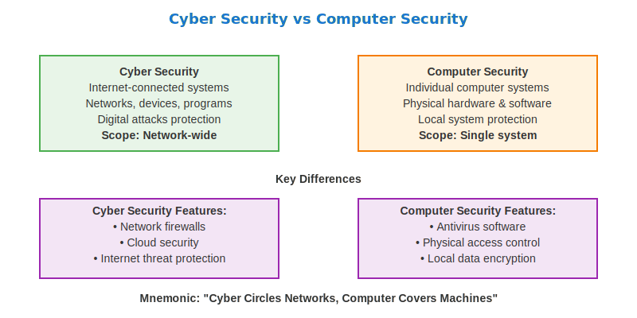

**Mnemonic:** "Cyber Circles Networks, Computer Covers Machines"

## Question 1(b) [4 marks]

**Explain CIA triad.**

**Answer**:
The CIA triad represents the three fundamental principles of information security:

| Principle | Description |
|-----------|-------------|
| **Confidentiality** | Ensures that sensitive information is accessible only to authorized parties |
| **Integrity** | Guarantees that data remains accurate and unaltered during storage and transmission |
| **Availability** | Ensures systems and data are accessible when needed by authorized users |

**Diagram:**

**Mnemonic:** "CIA Keeps Information Properly Accessible"

## Question 1(c) [7 marks]

**Define adversary, attack, countermeasure, risk, security policy, system resource, and threat in the context of computer security.**

**Answer**:

| Term | Definition |
|------|------------|
| **Adversary** | Individual or group that attempts to exploit vulnerabilities for malicious purposes |
| **Attack** | Deliberate action to compromise security by exploiting vulnerabilities in a system |
| **Countermeasure** | Controls implemented to mitigate or eliminate security vulnerabilities |
| **Risk** | Potential for loss or damage when a threat exploits a vulnerability |
| **Security Policy** | Documented rules that define acceptable use and protection requirements |
| **System Resource** | Hardware, software, data, or network components that require protection |
| **Threat** | Potential danger that might exploit a vulnerability to breach security |

**Diagram:**

**Mnemonic:** "ARTSVSC: All Resources Typically Secure Various System Components"

## Question 1(c OR) [7 marks]

**Explain MD5 hashing algorithm.**

**Answer**:
MD5 (Message Digest 5) is a widely used cryptographic hash function that produces a 128-bit (16-byte) hash value:

1. **Input Processing**: Message is padded and divided into 512-bit blocks
2. **Initialization**: Sets up four 32-bit registers with fixed values
3. **Compression**: Processes message in 16-word blocks through four rounds of operations
4. **Output**: Produces 128-bit digest as final hash value

**Diagram:**

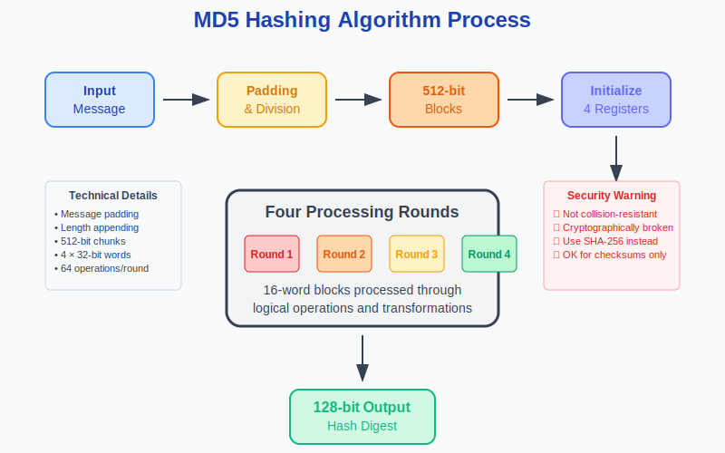

- **Weakness**: Not collision-resistant; shouldn't be used for security-critical applications
- **Usage**: File integrity verification and non-security critical applications

**Mnemonic:** "Pad, Divide, Process, Output - Don't Use For Security!"

## Question 2(a) [3 marks]

**Define authentication in context of cyber security.**

**Answer**:
Authentication is the process of verifying the identity of a user, system, or entity before granting access to resources:

- **Confirms**: "You are who you claim to be"
- **Verifies**: Identity using credentials (passwords, biometrics, tokens)
- **Precedes**: Authorization (what you can access after authentication)

**Diagram:**

**Mnemonic:** "Verify Before Entry"

## Question 2(b) [4 marks]

**Explain public key cryptography with example.**

**Answer**:
Public key cryptography uses two mathematically related keys for secure communication:

| Component | Function |
|-----------|----------|
| **Public Key** | Shared openly and used to encrypt messages |
| **Private Key** | Kept secret and used to decrypt messages |

**Example**: In RSA encryption, if Alice wants to send Bob a message:

1. Alice encrypts with Bob's public key
2. Only Bob can decrypt using his private key

**Diagram:**

**Mnemonic:** "Public to Lock, Private to Unlock"

## Question 2(c) [7 marks]

**Explain working of packet filter and application proxy.**

**Answer**:

| Firewall Type | Working |
|---------------|---------|
| **Packet Filter** | Examines packet headers based on predefined rules. Makes decisions based on source/destination IP addresses, ports, and protocols. Works at OSI network and transport layers. Offers high-speed filtering with low resource usage. |
| **Application Proxy** | Acts as intermediary between client and server applications. Processes all traffic at application layer. Creates two connections (client-to-proxy and proxy-to-server). Provides content inspection and user authentication capabilities. |

**Diagram:**

**Mnemonic:** "Packets Check Headers, Proxies Check Content"

## Question 2(a OR) [3 marks]

**Explain multi-factor authentication.**

**Answer**:
Multi-factor authentication (MFA) requires users to provide two or more verification factors to gain access to a resource:

- **Something you know**: Password, PIN, security question
- **Something you have**: Mobile phone, smart card, security token
- **Something you are**: Fingerprint, facial recognition, voice pattern

**Diagram:**

**Mnemonic:** "Know, Have, Are - Triple Security"

## Question 2(b OR) [4 marks]

**Explain the process of password verification.**

**Answer**:
Password verification is the process of authenticating user credentials against stored values:

1. **User Input**: User enters username and password
2. **Hash Generation**: System hashes the entered password
3. **Comparison**: Hash is compared with stored hash in database
4. **Access Decision**: Access granted if hashes match, denied if not

**Diagram:**

**Mnemonic:** "Enter, Hash, Compare, Decide"

## Question 2(c OR) [7 marks]

**List out malicious software and explain any three malicious software attacks.**

**Answer**:

**Malicious Software Types**:

- Viruses, Worms, Trojans, Ransomware, Spyware, Adware, Rootkits, Keyloggers, Bots

**Three Common Attacks**:

| Attack Type | Explanation |
|-------------|-------------|
| **Ransomware** | Encrypts victim's files and demands payment for decryption key. Spreads through phishing emails, malicious downloads, or exploiting vulnerabilities. Example: WannaCry. |
| **Trojans** | Disguised as legitimate software but performs malicious actions. Creates backdoors for attackers to access systems. Example: Remote Access Trojans (RATs). |
| **Spyware** | Collects user information without consent. Monitors activities, keystrokes, and browsing habits. Can steal passwords and financial information. |

**Diagram:**

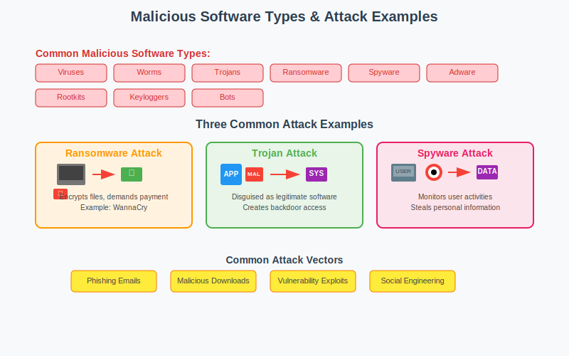

**Mnemonic:** "RTS: Ransom Takes Systems, Trojans Sneak In, Spyware Steals Info"

## Question 3(a) [3 marks]

**Explain the importance of ports in cyber security.**

**Answer**:
Ports are virtual endpoints for network communications that:

- **Identify Services**: Each service uses specific port numbers (HTTP:80, HTTPS:443)
- **Enable Filtering**: Firewalls control traffic by allowing/blocking specific ports
- **Reduce Attack Surface**: Closing unnecessary ports enhances security

**Diagram:**

**Mnemonic:** "Every Port Is An Entry Point"

## Question 3(b) [4 marks]

**Explain Virtual private network.**

**Answer**:
A Virtual Private Network (VPN) is a technology that:

| Feature | Description |
|---------|-------------|
| **Encrypted Tunnel** | Creates secure connection over public networks |
| **IP Masking** | Hides user's IP address and location |
| **Data Protection** | Encrypts data during transmission |
| **Remote Access** | Enables secure connection to private networks |

**Diagram:**

**Mnemonic:** "Tunnel, Encrypt, Protect, Connect"

## Question 3(c) [7 marks]

**Explain the impact of web security threats.**

**Answer**:
Web security threats have significant impacts on organizations and individuals:

| Impact | Description |
|--------|-------------|
| **Data Breaches** | Exposure of sensitive information leading to financial losses and reputation damage |
| **Financial Loss** | Direct monetary theft, fraud, recovery costs, and regulatory fines |
| **Operational Disruption** | System downtime affecting business continuity and customer service |
| **Reputation Damage** | Loss of customer trust and brand value after security incidents |
| **Legal Consequences** | Litigation, regulatory penalties, and compliance violations |

**Diagram:**

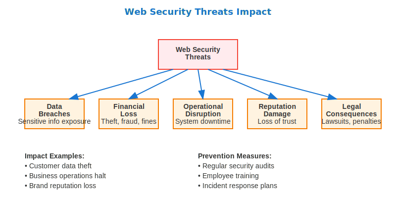

**Mnemonic:** "DFROL: Data, Finances, Resources, Opinion, Legal"

## Question 3(a OR) [3 marks]

**Explain working of digital signature.**

**Answer**:
Digital signatures authenticate electronic documents and verify their integrity:

1. **Hash Creation**: Document is hashed to create a unique digest
2. **Encryption**: Sender encrypts the hash using their private key
3. **Verification**: Recipient decrypts using sender's public key
4. **Validation**: Comparing decrypted hash with newly generated hash

**Diagram:**

**Mnemonic:** "Hash, Sign, Send, Verify"

## Question 3(b OR) [4 marks]

**Describe HTTPS.**

**Answer**:
HTTPS (Hypertext Transfer Protocol Secure) is a secure version of HTTP:

| Feature | Description |
|---------|-------------|
| **TLS/SSL** | Uses Transport Layer Security to encrypt data |
| **Authentication** | Verifies website identity through certificates |
| **Data Integrity** | Prevents tampering of transmitted data |
| **Port 443** | Uses default port 443 instead of HTTP's port 80 |

**Diagram:**

**Mnemonic:** "Secured Pages Show Padlock"

## Question 3(c OR) [7 marks]

**Explain social engineering, vishing and machine in the middle attack.**

**Answer**:

| Attack Type | Explanation |
|-------------|-------------|
| **Social Engineering** | Psychological manipulation to trick users into revealing sensitive information. Exploits human trust rather than technical vulnerabilities. Common techniques include pretexting, baiting, and phishing. |
| **Vishing** | Voice phishing using phone calls to steal information. Attackers impersonate legitimate organizations. Often uses urgency or fear to manipulate victims. |
| **Machine in the Middle** | Attacker secretly intercepts and relays communication between two parties. Victims believe they're communicating directly with each other. Allows attackers to steal/modify sensitive information during transmission. |

**Diagram:**

**Mnemonic:** "SEVeM: Social Engineers Voice Messages and Mediate connections"

## Question 4(a) [3 marks]

**Match the following.**

**Answer**:

| Column A | Column B |
|----------|----------|
| 1. Denial of Service (DoS) | f. Attack that disrupts network services |
| 2. Port 443 | c. Default port for HTTPS |
| 3. Secure Socket Layer (SSL) | e. Predecessor of TLS for secure communication |
| 4. Port 80 | b. Default port for HTTP |
| 5. Integrity | a. Ensures data is not altered during transmission |
| 6. VPN (Virtual Private Network) | d. Creates a secure connection over the internet |

**Diagram:**

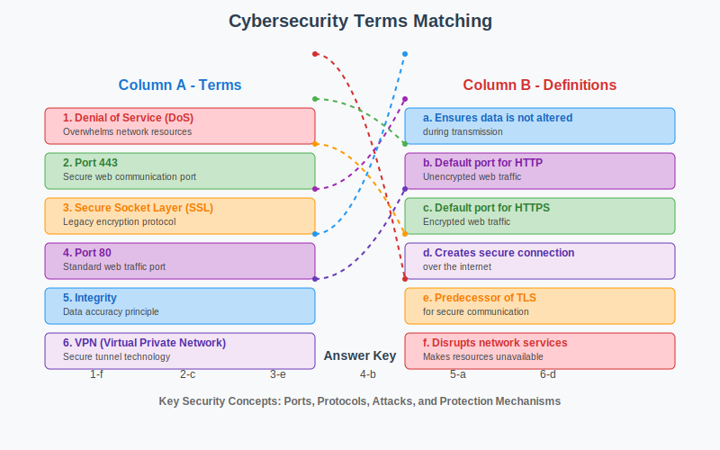

**Mnemonic:** "Disrupt HTTPS, Secure HTTP, Intact VPN"

## Question 4(b) [4 marks]

**List out types of hackers and explain role of each.**

**Answer**:

| Hacker Type | Role |
|-------------|------|
| **White Hat** | Ethical hackers who test systems with permission to improve security |
| **Black Hat** | Malicious hackers who exploit vulnerabilities for personal gain or damage |
| **Gray Hat** | Operate between ethical and malicious; may hack without permission but disclose findings |
| **Script Kiddies** | Inexperienced hackers using pre-written scripts without understanding the technology |

**Diagram:**

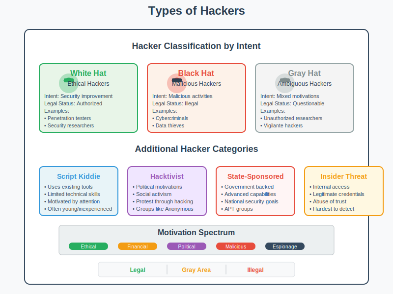

**Mnemonic:** "White Protects, Black Attacks, Gray Mixes, Kids Script"

## Question 4(c) [7 marks]

**Explain SSH (Secure shell) protocol stack.**

**Answer**:
SSH (Secure Shell) protocol stack provides secure remote access and file transfers:

| Layer | Function |
|-------|----------|
| **Transport Layer** | Handles encryption, server authentication, and data integrity |
| **User Authentication Layer** | Verifies client identity using passwords, keys, or certificates |
| **Connection Layer** | Manages multiple channels within a single SSH connection |

**Key Features**:

- Strong encryption (AES, 3DES)
- Public key authentication
- Data integrity checking
- Port forwarding and tunneling

**Diagram:**

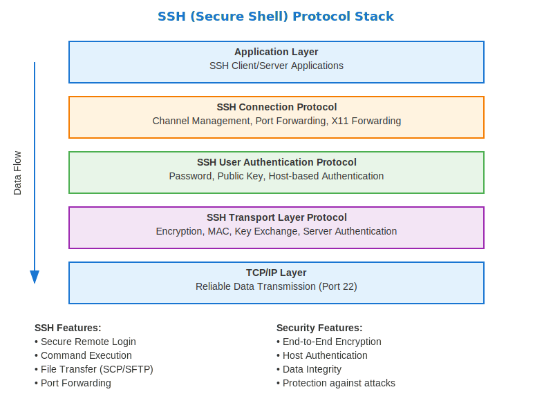

**Mnemonic:** "Transport Secures, Users Authenticate, Connections Multiplex"

## Question 4(a OR) [3 marks]

**Explain foot printing in ethical hacking.**

**Answer**:
Footprinting is the first phase of ethical hacking where information is gathered about the target:

- **Purpose**: Collecting data about network, systems, and organization
- **Methods**: WHOIS lookup, DNS analysis, social media research
- **Outcomes**: Identifying potential entry points and vulnerabilities

**Diagram:**

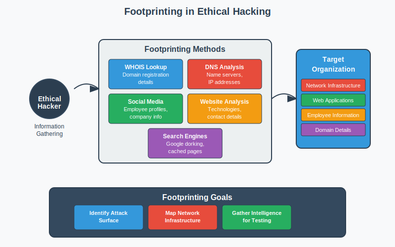

**Mnemonic:** "Gather Before Attack"

## Question 4(b OR) [4 marks]

**Explain scanning in ethical hacking.**

**Answer**:
Scanning is the process of actively probing a target system to identify live hosts, open ports, and services:

| Technique | Purpose |
|-----------|---------|
| **Port Scanning** | Identifies open ports and running services |
| **Vulnerability Scanning** | Detects known security weaknesses |
| **Network Mapping** | Discovers network topology and devices |
| **OS Fingerprinting** | Determines operating system versions |

**Diagram:**

**Mnemonic:** "PONS: Ports Open, Network Services"

## Question 4(c OR) [7 marks]

**Describe injection attack and phishing attack.**

**Answer**:

| Attack Type | Description |
|-------------|-------------|
| **Injection Attack** | Inserts malicious code into vulnerable applications. Common types include SQL injection, command injection, and XSS. Exploits poor input validation. Can lead to data theft, modification, or destruction. Prevented through input sanitization and parameterized queries. |
| **Phishing Attack** | Social engineering attack using fake websites/emails. Attempts to steal credentials, financial information, or install malware. Often mimics trusted organizations. Contains urgent call-to-action to create panic. Prevented through education, email filtering, and multi-factor authentication. |

**Diagram:**

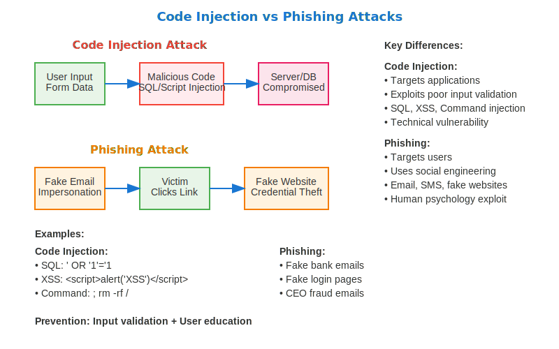

**Mnemonic:** "Inject Code, Phish People"

## Question 5(a) [3 marks]

**Explain disk forensics.**

**Answer**:
Disk forensics is the examination of storage media to recover, analyze, and preserve digital evidence:

- **Purpose**: Recover deleted files, analyze file systems, and establish timelines
- **Methods**: Bit-by-bit imaging, hash verification, and specialized tools
- **Applications**: Criminal investigations, corporate security incidents, data recovery

**Diagram:**

**Mnemonic:** "Recover, Analyze, Present"

## Question 5(b) [4 marks]

**Explain password cracking methods.**

**Answer**:

| Method | Description |
|--------|-------------|
| **Brute Force** | Tries all possible character combinations systematically |
| **Dictionary Attack** | Uses list of common words and variations |
| **Rainbow Table** | Pre-computed tables of password hashes for quick lookup |
| **Social Engineering** | Manipulates users to reveal passwords |

**Diagram:**

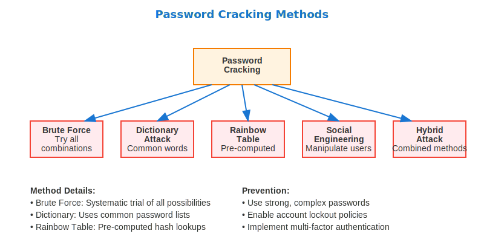

**Mnemonic:** "BDRS: Brute Dictionary Rainbow Social"

## Question 5(c) [7 marks]

**Describe Remote Administration Tool (RAT).**

**Answer**:
A Remote Administration Tool (RAT) is software that enables remote control of a computer system:

| Aspect | Description |
|--------|-------------|
| **Functionality** | Provides complete control over target system including file access, screen viewing, and keylogging |
| **Deployment** | Often installed through phishing, bundled with legitimate software, or via exploited vulnerabilities |
| **Architecture** | Client-server model where server runs on victim's machine and client is controlled by attacker |
| **Legitimate Uses** | IT support, remote work, and system administration |
| **Malicious Uses** | Unauthorized surveillance, data theft, and sabotage |

**Diagram:**

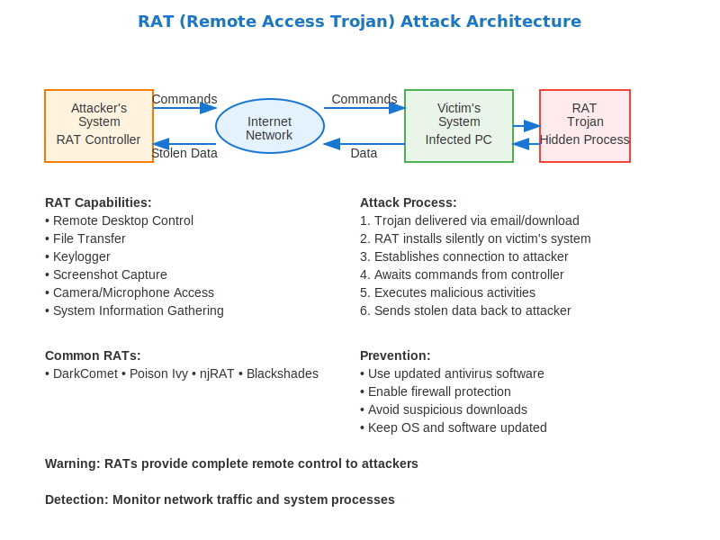

**Mnemonic:** "RCASD: Remote Control Access Steals Data"

## Question 5(a OR) [3 marks]

**List out challenges of cybercrime.**

**Answer**:
Major challenges in combating cybercrime include:

- **Jurisdiction Issues**: Crimes crossing international boundaries
- **Technical Complexity**: Constantly evolving attack methods
- **Attribution Problems**: Difficulty identifying perpetrators
- **Evidence Collection**: Volatile and easily altered digital evidence

**Diagram:**

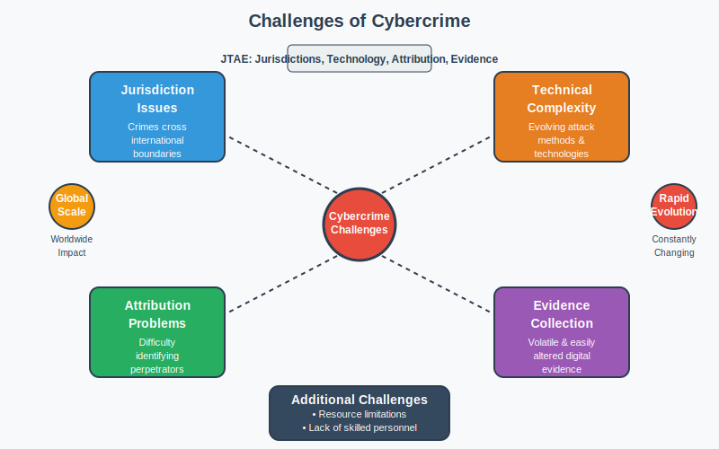

**Mnemonic:** "JTAE: Jurisdictions, Technology, Attribution, Evidence"

## Question 5(b OR) [4 marks]

**Explain mobile forensics.**

**Answer**:
Mobile forensics is the science of recovering digital evidence from mobile devices:

| Aspect | Description |
|--------|-------------|
| **Data Types** | Call logs, messages, location data, photos, app data |
| **Challenges** | Encryption, diverse operating systems, anti-forensic techniques |
| **Methods** | Physical extraction, logical acquisition, file system analysis |
| **Tools** | Cellebrite UFED, Oxygen Forensic, Magnet AXIOM |

**Diagram:**

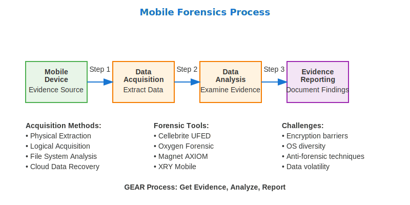

**Mnemonic:** "GEAR: Get Evidence, Analyze, Report"

## Question 5(c OR) [7 marks]

**Explain Salami Attack, Web Jacking, Data diddling and Ransomware attack.**

**Answer**:

| Attack Type | Description |
|-------------|-------------|
| **Salami Attack** | Series of minor theft actions that go unnoticed individually. Often involves modifying financial transactions by taking small amounts. Cumulative effect can be significant over time. Example: Rounding bank transactions and collecting fractions. |
| **Web Jacking** | Hijacking a website by changing its content or redirecting to fake site. Involves domain theft or DNS manipulation. Used for distributing malware or collecting sensitive information. |
| **Data Diddling** | Unauthorized modification of data before/during input to system. Changes are typically small and hard to detect. Affects data integrity and can lead to wrong business decisions. |
| **Ransomware** | Malware that encrypts victim's files and demands payment for decryption. Typically spreads through phishing or exploiting vulnerabilities. Notable examples include WannaCry and Ryuk. |

**Diagram:**

**Mnemonic:** "SWDR: Small slices, Websites hijacked, Data altered, Ransom demanded"
