# Cyber Security

## Introduction

Cyber security, also known as information security or computer security, is the practice of protecting systems, networks, and programs from digital attacks. These cyberattacks are usually aimed at accessing, changing, or destroying sensitive information; extorting money from users; or interrupting normal business processes.


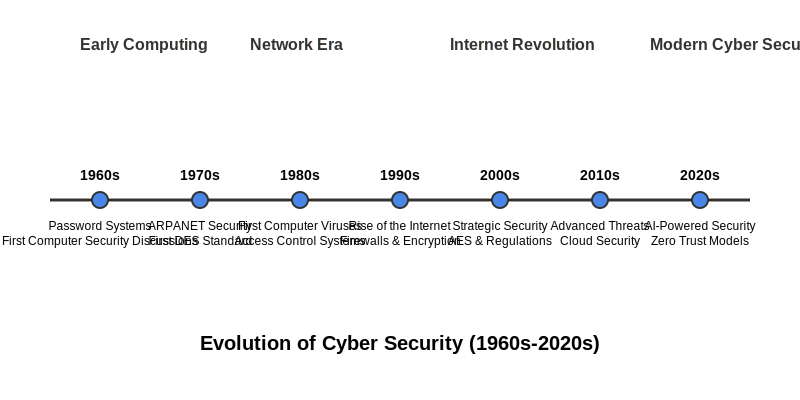

### Evolution of Cyber Security

The field of cyber security has evolved significantly over the decades, driven by the rapid advancement of technology and the increasing sophistication of cyber threats. Understanding this evolution helps us appreciate the current state of cyber security and anticipate future challenges.

## Introduction to Cyber Security & Cryptography

In this unit, we embark on the foundational journey of understanding **Cyber Security** and **Cryptography**. With the digital landscape continuously evolving, the importance of safeguarding information and securing communication channels has become crucial. This unit will introduce you to the basic concepts, importance, and evolution of cyber security and cryptography.

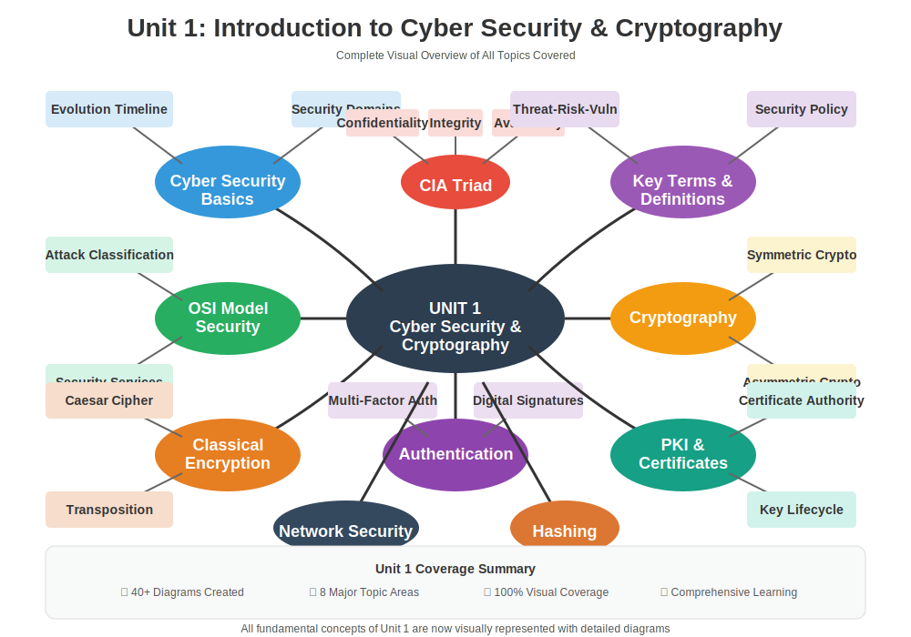

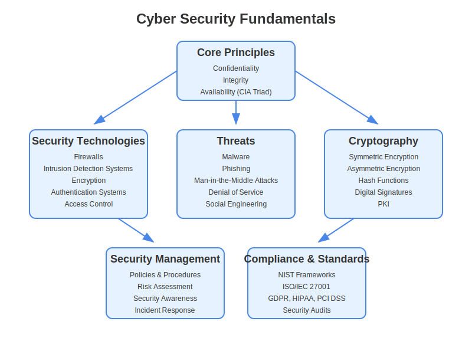

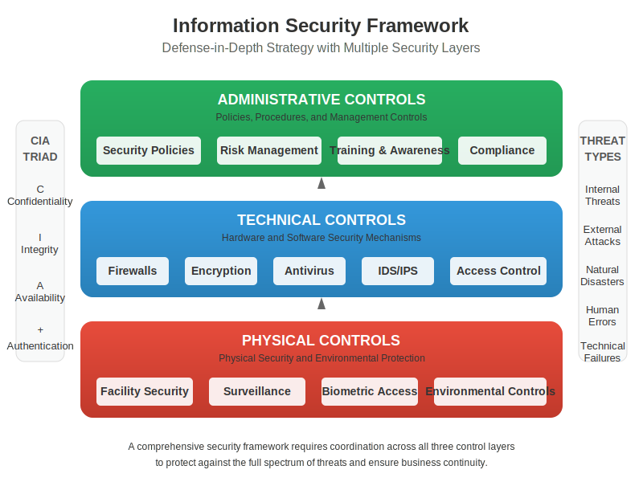

### Cyber Security Basics

**Cyber Security** refers to the practice of protecting systems, networks, and programs from digital attacks. These attacks are usually aimed at accessing, changing, or destroying sensitive information, extorting money from users, or interrupting normal business processes.

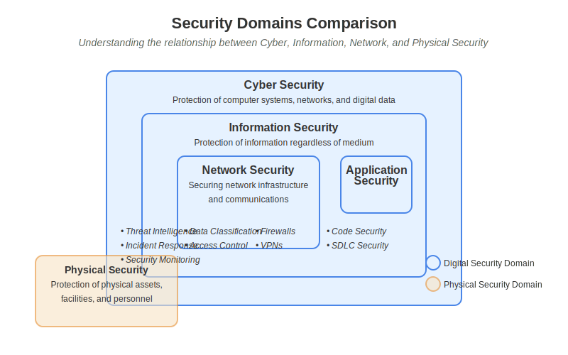

#### Importance

In an increasingly interconnected world, the significance of cyber security cannot be overstated. Here's why it is essential:

- **Protection of Sensitive Data:** Safeguarding personal and organizational information from breaches.
- **Prevention of Cyber Attacks:** Mitigating the risk of attacks that can disrupt services and damage reputations.
- **Compliance:** Adhering to legal and regulatory requirements to avoid penalties.
- **Economic Stability:** Ensuring the smooth operation of financial systems and protecting against economic disruption.

#### Evolution

The journey of cyber security has evolved significantly over the decades:

1. **1960s:** The concept of cyber security began with the advent of computer systems and networks.
2. **1970s-1980s:** The focus shifted to securing networks as ARPANET (the precursor to the Internet) expanded.
3. **1990s:** The rise of the Internet led to increased cyber threats, prompting the development of firewalls and antivirus software.
4. **2000s:** Cyber security became a strategic priority for organizations, with the introduction of advanced security protocols and encryption methods.
5. **2010s-Present:** The era of sophisticated cyber threats such as ransomware, phishing, and advanced persistent threats (APTs) has led to the adoption of comprehensive cyber security frameworks and practices.

### CIA Triad

The CIA Triad is a fundamental concept in cybersecurity, representing the three core principles that guide information security policies within organizations. CIA stands for **Confidentiality**, **Integrity**, and **Availability**.

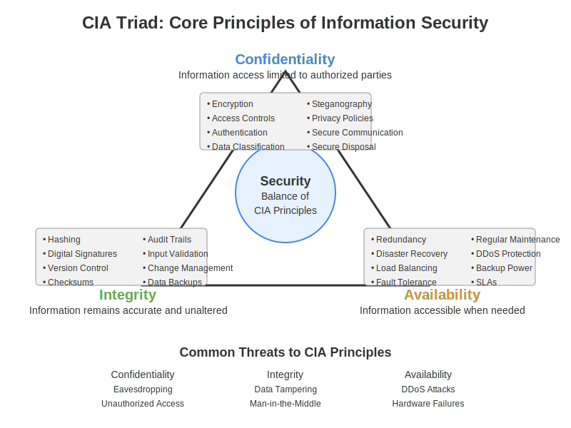

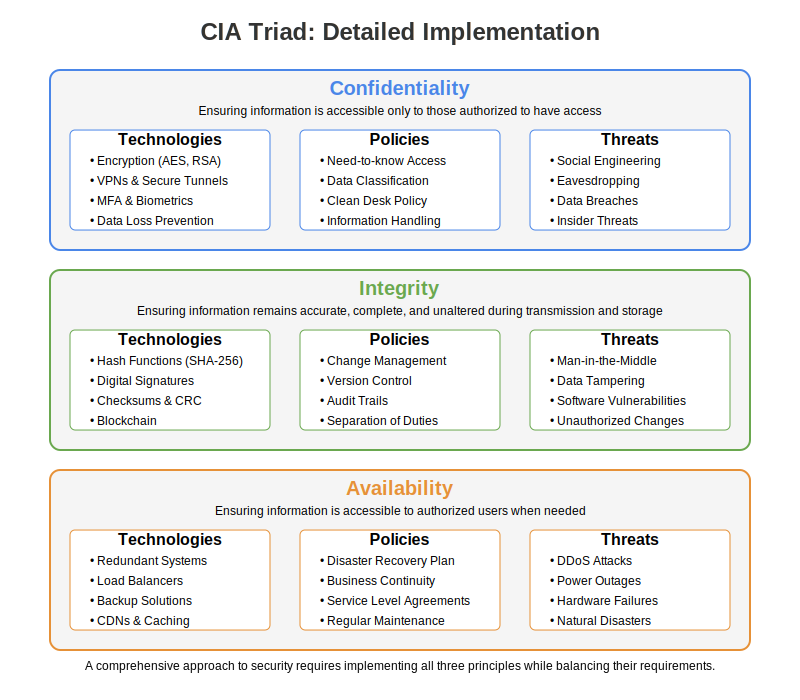

#### Confidentiality

**Confidentiality** ensures that sensitive information is accessed only by authorized individuals and entities. This principle protects data from unauthorized disclosure and maintains privacy.

**Key Points:**

- **Encryption:** Encoding data to make it unreadable without the proper key.
- **Access Controls:** Restricting access to information based on user roles and permissions.
- **Authentication:** Verifying the identity of users before granting access.
- **Data Masking:** Obscuring specific data within a database to protect sensitive information.

**Significance:**

- Protects personal and sensitive data from breaches.
- Maintains privacy and confidentiality in communications.
- Ensures compliance with legal and regulatory requirements.

#### Integrity

**Integrity** ensures that information remains accurate, consistent, and unaltered during storage, processing, and transmission. This principle prevents unauthorized modification of data.

**Key Points:**

- **Checksums and Hash Functions:** Generating unique values for data to detect changes.
- **Digital Signatures:** Verifying the authenticity and integrity of messages or documents.
- **Version Control:** Tracking changes to data and maintaining historical records.
- **Audit Trails:** Recording actions taken on data for monitoring and investigation.

**Significance:**

- Guarantees the accuracy and reliability of information.
- Prevents unauthorized or accidental modifications.
- Ensures the trustworthiness of data used for decision-making.

#### Availability

**Availability** ensures that information and resources are accessible to authorized users when needed. This principle focuses on maintaining the functionality of systems and networks.

**Key Points:**

- **Redundancy:** Implementing backup systems to ensure continuity.
- **Disaster Recovery Plans:** Procedures to recover data and continue operations after a disaster.
  - *Example:* Off-site backups and data recovery processes in place for critical systems.


- **Maintenance:** Regular updates and maintenance to prevent system failures.
- **Load Balancing:** Distributing workloads across multiple systems to prevent overloads.
- **Regular Maintenance:** Performing updates and checks to keep systems running smoothly.

**Significance:**

- Ensures continuous access to critical information and services.
- Minimizes downtime and service interruptions.
- Supports business continuity and operational efficiency.

#### The Interrelationship of the CIA Triad

While each component of the CIA Triad serves a distinct purpose, they are interconnected and collectively ensure comprehensive security. For instance:

- Encrypting data (Confidentiality) helps protect it from unauthorized access, while checksums (Integrity) ensure it has not been tampered with.
- Redundancy and backup systems (Availability) support the continuous protection and integrity of data.

### Cyber Security Key Terms

Understanding the fundamental terminology is crucial for grasping cyber security concepts. These terms form the foundation of security discussions and help in analyzing threats and implementing appropriate countermeasures.

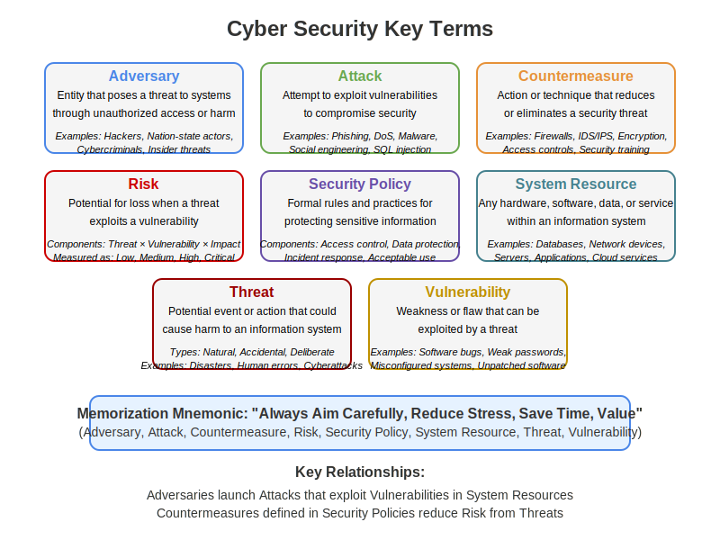


#### Adversary

An adversary, also known as a threat actor, is any entity that poses a threat to an information system by attempting unauthorized access, destruction, or disruption of data and systems.

**Examples:**

- Hackers
- Cybercriminals
- Nation-state actors

#### Attack

An attack is any attempt to exploit vulnerabilities in a system to gain unauthorized access or cause damage. Attacks can be physical or digital and vary in complexity and intent.

**Examples:**

- Phishing attacks
- Denial-of-Service (DoS) attacks
- Malware infections

#### Countermeasure

A countermeasure is an action, device, procedure, or technique that reduces or eliminates a security threat. It is implemented to protect against attacks and mitigate vulnerabilities.

**Examples:**

- Firewalls
- Intrusion Detection Systems (IDS)
- Encryption

#### Risk

Risk in cyber security refers to the potential for loss or damage when a threat exploits a vulnerability. It is often quantified as a combination of the likelihood of an event and its impact.

**Components of Risk:**

- **Threat:** The possibility of a harmful event.
- **Vulnerability:** Weaknesses that could be exploited.
- **Impact:** The potential damage or loss.


#### Security Policy

A security policy is a formal set of rules and practices that define how an organization manages, protects, and distributes sensitive information. It outlines responsibilities and expected behaviors to ensure security.

**Components of a Security Policy:**

- Access control policies
- Data protection guidelines
- Incident response procedures


#### System Resource

A system resource, also known as an asset, is any hardware, software, data, or service within an information system. Protecting these resources is a primary goal of cyber security.

**Examples:**

- Databases
- Network devices
- Application software

#### Threat

A threat is any potential event or action that could cause harm to an information system. Threats can be natural, accidental, or deliberate.

**Examples:**

- Natural disasters
- Human errors
- Cyber attacks


#### Vulnerability

A vulnerability is a weakness or flaw in a system that can be exploited by a threat to gain unauthorized access or cause harm. Identifying and mitigating vulnerabilities is crucial for security.

**Examples:**

- Software bugs
- Misconfigured systems
- Weak passwords

**Memorization Hints**

To remember these key terms, use the following mnemonic:
**"Always Aim Carefully, Reduce Stress, Save Time, Value"**

- **A**dversary
- **A**ttack
- **C**ountermeasure
- **R**isk
- **S**ecurity Policy
- **S**ystem Resource
- **T**hreat
- **V**ulnerability

### OSI Model: Security Attacks, Mechanisms, and Services

Understanding security attacks, mechanisms, and services in relation to the OSI (Open Systems Interconnection) model is crucial for designing and implementing robust security measures across different layers of a network. The OSI model has seven layers, each with specific security concerns and countermeasures.


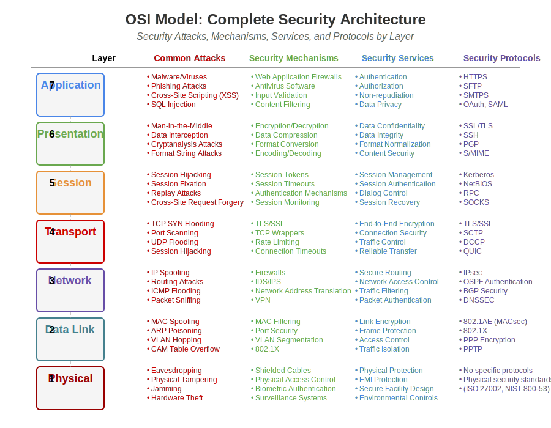


#### Security Attack Classification

Security attacks can be broadly classified into two main categories: passive attacks and active attacks. Understanding this classification helps in designing appropriate security measures.

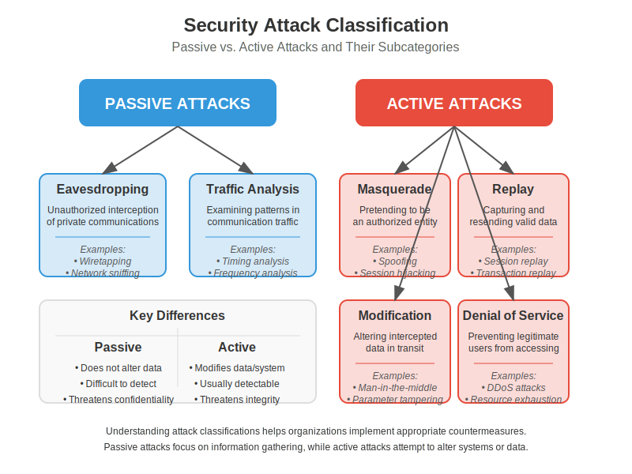

#### Layer 1: Physical Layer

**Security Attacks:**

- **Eavesdropping:** Intercepting communication over physical media.
- **Physical Damage:** Tampering with hardware or cables.

**Security Mechanisms:**

- **Shielded Cables:** Protect against electromagnetic eavesdropping.
- **Physical Security:** Locks, surveillance, and access control to hardware.

**Security Services:**

- **Physical Protection:** Ensuring the physical infrastructure is secure from tampering and interference.

#### Layer 2: Data Link Layer

**Security Attacks:**

- **MAC Spoofing:** Altering the Media Access Control address to gain unauthorized access.
- **Switching Attacks:** Manipulating switch operations, such as MAC flooding.

**Security Mechanisms:**

- **MAC Address Filtering:** Allowing only authorized MAC addresses to connect.
- **Port Security:** Limiting the number of devices that can connect to a switch port.

**Security Services:**

- **Link Encryption:** Encrypting data frames to protect against eavesdropping and tampering.

#### Layer 3: Network Layer

**Security Attacks:**

- **IP Spoofing:** Faking the source IP address in packets to deceive the receiver.
- **Routing Attacks:** Manipulating routing tables to redirect traffic.

**Security Mechanisms:**

- **Firewalls:** Controlling incoming and outgoing network traffic based on security rules.
- **Intrusion Detection Systems (IDS):** Monitoring network traffic for suspicious activity.

**Security Services:**

- **Secure Routing Protocols:** Ensuring the integrity and authenticity of routing information.

#### Layer 4: Transport Layer

**Security Attacks:**

- **Port Scanning:** Probing ports to find vulnerabilities.
- **Session Hijacking:** Taking over a session between two systems.

**Security Mechanisms:**

- **Transport Layer Security (TLS):** Encrypting transport layer communications.
- **TCP Wrappers:** Monitoring and filtering incoming connections to network services.

**Security Services:**

- **End-to-End Encryption:** Protecting data in transit between two endpoints.

#### Layer 5: Session Layer

**Security Attacks:**

- **Session Hijacking:** Unauthorized takeover of a session.
- **Session Fixation:** Attacker sets a user's session ID to known value.

**Security Mechanisms:**

- **Session Tokens:** Using unique tokens for session management.
- **Timeouts:** Automatically ending inactive sessions to prevent hijacking.

**Security Services:**

- **Session Management:** Ensuring secure establishment, maintenance, and termination of sessions.

#### Layer 6: Presentation Layer

**Security Attacks:**

- **Man-in-the-Middle (MitM):** Intercepting and altering data between two parties.
- **Data Interception:** Capturing unencrypted data being transmitted.

**Security Mechanisms:**

- **Encryption/Decryption:** Protecting data by transforming it into an unreadable format and back.
- **Data Compression:** Reducing the size of data, which can also help in obfuscating it.

**Security Services:**

- **Data Encryption:** Ensuring data privacy and protection.

#### Layer 7: Application Layer

**Security Attacks:**

- **Malware:** Malicious software designed to damage or exploit systems.
- **Phishing:** Deceptive attempts to obtain sensitive information.

**Security Mechanisms:**

- **Antivirus Software:** Detecting and removing malicious software.
- **Web Application Firewalls (WAF):** Protecting web applications by filtering and monitoring HTTP traffic.

**Security Services:**

- **Authentication:** Verifying the identity of users and systems.
- **Authorization:** Granting permissions to users based on their roles.

**Memorization Hints**

To remember security concerns for each OSI layer, use the following mnemonic:
**"Please Do Not Throw Sausage Pizza Away"**

- **P**hysical
- **D**ata Link
- **N**etwork
- **T**ransport
- **S**ession
- **P**resentation
- **A**pplication

### Cryptography Basics

#### Cryptography Overview

Cryptography is the science of protecting information by transforming it into an unreadable format. It encompasses various techniques and algorithms to ensure data confidentiality, integrity, and authenticity.

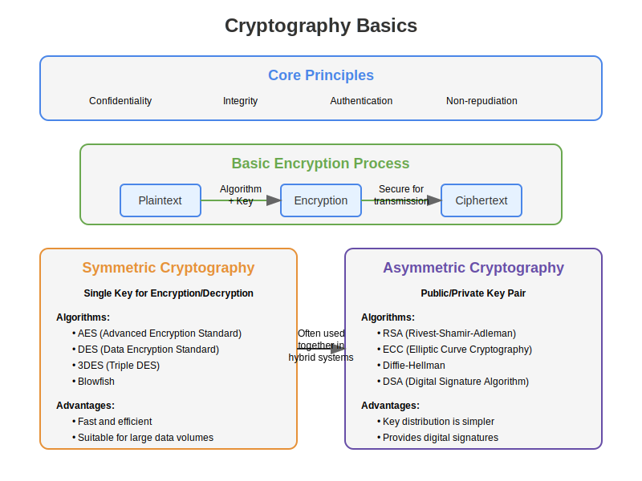


#### Symmetric vs Asymmetric Encryption


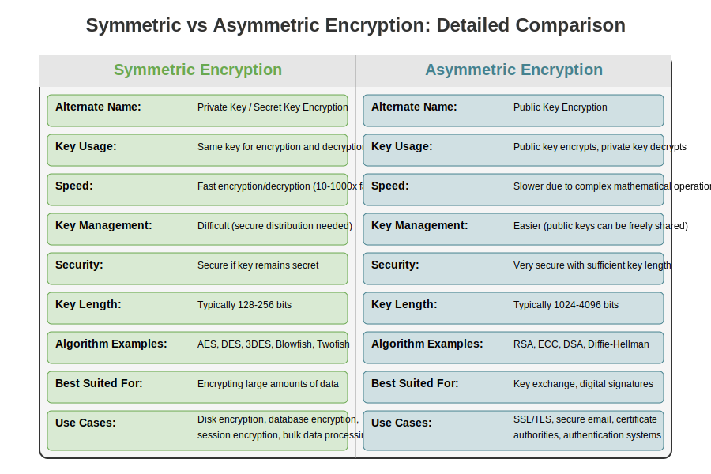

##### Symmetric Encryption

#### Key Concepts in Cryptography

1. **Confidentiality**: Ensures that information is accessible only to those authorized to have access.
2. **Integrity**: Ensures that information has not been altered in an unauthorized manner.
3. **Authentication**: Confirms the identity of the parties involved in communication.
4. **Non-repudiation**: Ensures that a party cannot deny the authenticity of their signature on a document or a message they sent.

#### Types of Cryptography

1. **Symmetric Key Cryptography**:
   - **Definition**: Uses the same key for both encryption and decryption.
   - **Key Features**:
     - Fast and efficient for large data volumes.
     - Key management is challenging because secure key distribution is required.
   - **Examples**: 
     - **DES (Data Encryption Standard)**: An older encryption standard that is now considered insecure due to its short key length.
     - **AES (Advanced Encryption Standard)**: A widely used encryption standard that supports key sizes of 128, 192, and 256 bits.

2. **Asymmetric Key Cryptography**:
   - **Definition**: Uses a pair of keys – a public key for encryption and a private key for decryption.
   - **Key Features**:
     - Easier key management because the public key can be freely distributed.
     - Computationally more intensive than symmetric key cryptography.
   - **Examples**:
     - **RSA (Rivest-Shamir-Adleman)**: A widely used algorithm for secure data transmission.
     - **ECC (Elliptic Curve Cryptography)**: Offers similar security to RSA but with shorter keys.

3. **Hash Functions**:
   - **Definition**: Takes an input (or 'message') and returns a fixed-size string of bytes.
   - **Key Features**:
     - Produces a unique hash value for unique inputs.
     - Commonly used for data integrity checks and digital signatures.
   - **Examples**:
     - **SHA-256 (Secure Hash Algorithm 256-bit)**: Produces a 256-bit hash value and is widely used in blockchain and security protocols.
     - **MD5 (Message Digest Algorithm 5)**: Produces a 128-bit hash value but is now considered weak due to vulnerability to hash collisions.

#### Cryptographic Protocols

1. **SSL/TLS (Secure Sockets Layer/Transport Layer Security)**:
   - **Purpose**: Secure data transmission over networks.
   - **How it Works**: Uses a combination of symmetric and asymmetric cryptography to establish a secure connection.

2. **PGP (Pretty Good Privacy)**:
   - **Purpose**: Secure email communication.
   - **How it Works**: Uses a hybrid cryptosystem combining symmetric and asymmetric cryptography.

3. **IPsec (Internet Protocol Security)**:
   - **Purpose**: Secure internet protocol communications.
   - **How it Works**: Encrypts and authenticates IP packets.

#### Cryptographic Algorithms

1. **Symmetric Algorithms**:
   - **AES (Advanced Encryption Standard)**: 
     - Block cipher with key sizes of 128, 192, and 256 bits.
     - Considered secure and widely used in various applications.

   - **Blowfish**: 
     - Block cipher designed to replace DES.
     - Fast and flexible, with a key length ranging from 32 to 448 bits.

2. **Asymmetric Algorithms**:
   - **RSA (Rivest-Shamir-Adleman)**:
     - Relies on the mathematical properties of large prime numbers.
     - Commonly used for secure data transmission and digital signatures.

   - **ECC (Elliptic Curve Cryptography)**:
     - Uses elliptic curves over finite fields.
     - Provides high security with shorter key lengths compared to RSA.

3. **Hash Functions**:
   - **SHA-2 (Secure Hash Algorithm 2)**:
     - Includes SHA-224, SHA-256, SHA-384, and SHA-512.
     - Widely used in security protocols and applications.

   - **RIPEMD-160**:
     - Produces a 160-bit hash value.
     - Designed as an alternative to SHA-1 and MD5.

#### Cryptographic Techniques

1. **Encryption**:
   - **Process**: Converts plaintext into ciphertext using an encryption algorithm and a key.
   - **Purpose**: Ensure data confidentiality.

2. **Decryption**:
   - **Process**: Converts ciphertext back into plaintext using a decryption algorithm and a key.
   - **Purpose**: Retrieve the original data.

3. **Digital Signatures**:
   - **Process**: Uses a private key to create a signature that can be verified using the corresponding public key.
   - **Purpose**: Ensures the authenticity and integrity of a message, document, or software.

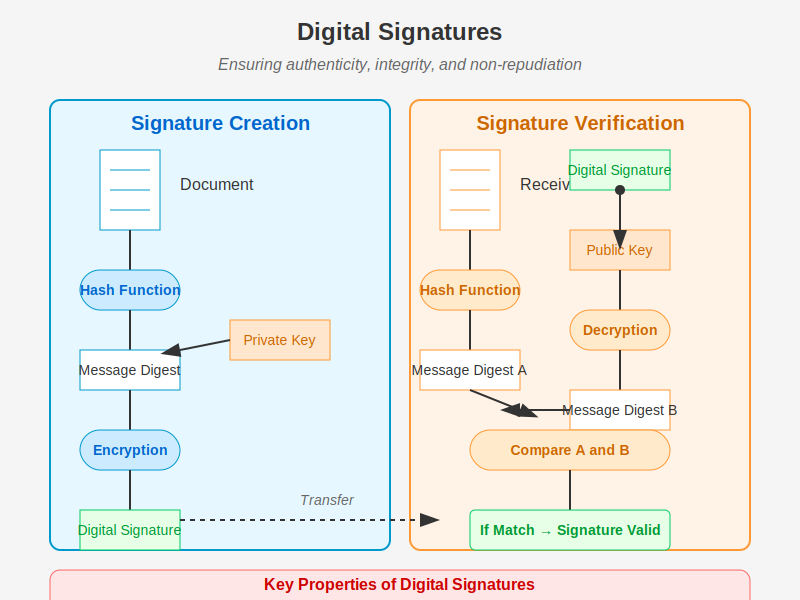

#### Public Key Infrastructure (PKI)

Public Key Infrastructure (PKI) is a framework that enables secure electronic transfer of information by providing authentication, confidentiality, integrity, and non-repudiation services through digital certificates.

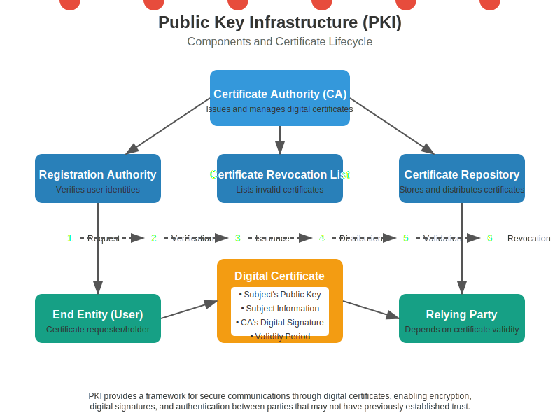

4. **Key Exchange**:
   - **Process**: Securely exchanging cryptographic keys between parties.
   - **Examples**: Diffie-Hellman key exchange, RSA key exchange.

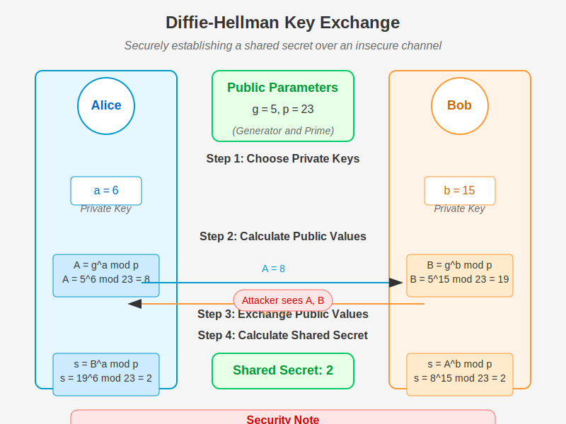

#### Applications of Cryptography

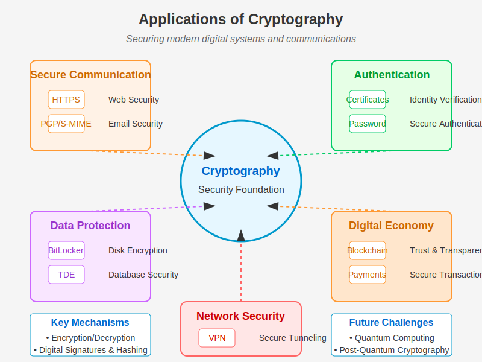

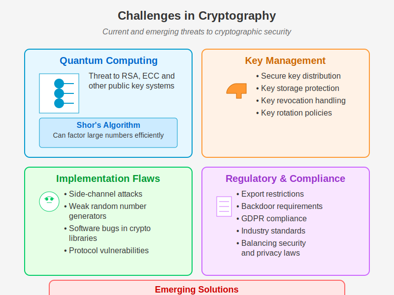

#### Cryptographic Key Lifecycle

Managing cryptographic keys throughout their lifecycle is crucial for maintaining security. The key lifecycle encompasses generation, distribution, storage, usage, rotation, revocation, archival, and destruction.

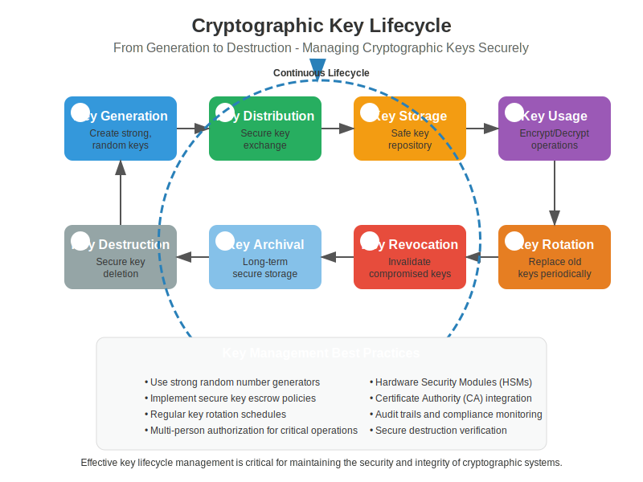

1. **Secure Communication**:
   - **Email Encryption**: PGP, S/MIME.
   - **Web Security**: HTTPS using SSL/TLS.

2. **Data Protection**:
   - **Disk Encryption**: BitLocker, FileVault.
   - **Database Encryption**: Transparent Data Encryption (TDE).

3. **Authentication and Integrity**:
   - **Digital Signatures**: Signing documents, code, and certificates.
   - **Message Authentication Codes (MACs)**: Ensuring message integrity.

4. **Blockchain and Cryptocurrency**:
   - **Blockchain Security**: Hash functions and digital signatures.
   - **Cryptocurrencies**: Bitcoin, Ethereum using cryptographic protocols.

5. **Network Security**:
   - **Purpose**: Protecting networks and the data they transmit.
   - **Components**: Implementing secure network protocols and intrusion detection systems.

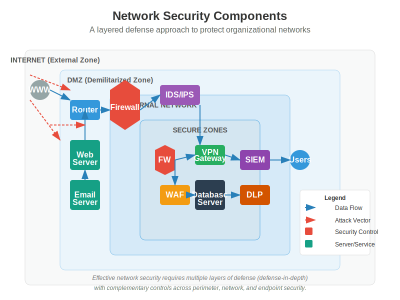

#### Key Applications of Cryptography

#### Challenges in Cryptography


1. **Quantum Computing**:
   - Potential to break current cryptographic algorithms.
   - Development of quantum-resistant algorithms.

2. **Key Management**:
   - Secure generation, distribution, storage, and destruction of cryptographic keys.
   - Challenges in managing keys across distributed systems.

3. **Implementation Flaws**:
   - Vulnerabilities due to incorrect implementation of cryptographic algorithms.
   - Importance of using well-vetted libraries and standards.

4. **Regulatory and Compliance Issues**:
   - Adherence to legal requirements and standards for cryptographic practices.
   - Balancing security and privacy with regulatory compliance.

Cryptography is an essential component of modern information security, providing the foundation for secure communication, data protection, and trust in digital systems. Its continued evolution and application are crucial in addressing emerging security challenges and protecting sensitive information in an increasingly interconnected world.

### Substitution and Transposition Techniques in Cryptography

Cryptographic techniques are used to convert plaintext into ciphertext to secure the data. Two basic techniques used in classical cryptography are substitution and transposition. Here's an in-depth explanation of both:


#### Substitution Techniques

**Definition**: Substitution techniques replace elements of the plaintext with corresponding elements of the ciphertext. Each character or group of characters in the plaintext is systematically replaced with a different character or group of characters.

**Types**:

1. **Caesar Cipher**:
   - **Description**: Each letter in the plaintext is shifted a certain number of places down the alphabet.
   - **Example**: With a shift of 3, A becomes D, B becomes E, etc.
   - **Plaintext**: HELLO
   - **Ciphertext**: KHOOR

2. **Monoalphabetic Cipher**:
   - **Description**: Each letter of the plaintext is mapped to a letter in the ciphertext alphabet.
   - **Example**: Using a random substitution:
   - **Plaintext**: HELLO
   - **Ciphertext**: IFMMP (example using a shift of 1)

3. **Playfair Cipher**:
   - **Description**: Encrypts pairs of letters using a 5x5 matrix containing a keyword.
   - **Example**: Using "KEYWORD" as the key:
   - **Plaintext**: HELLO
   - **Ciphertext**: IKFRPQ

4. **Vigenère Cipher**:
   - **Description**: Uses a keyword to shift letters in the plaintext.
   - **Example**: Using "KEY" as the keyword:
   - **Plaintext**: HELLO
   - **Ciphertext**: RIJVS

5. **Hill Cipher**:
   - **Description**: Uses linear algebra and matrix multiplication to encrypt blocks of text.
   - **Example**: Using a 2x2 key matrix:
   - **Plaintext**: HELLO (converted to numbers and multiplied by the key matrix)

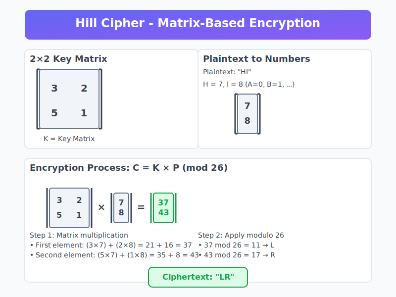

**Advantages**:

- Simple and easy to implement.
- Suitable for small data sizes.

**Disadvantages**:

- Vulnerable to frequency analysis attacks, especially monoalphabetic ciphers.
- Less secure if the key or substitution method is known.

#### Transposition Techniques

**Definition**: Transposition techniques rearrange the characters of the plaintext according to a certain system, keeping the same characters but changing their positions.

**Types**:

1. **Rail Fence Cipher**:
   - **Description**: Writes the message in a zigzag pattern across multiple "rails" and then reads off each row.
   - **Example**:
     - **Plaintext**: HELLO
     - **Rails**:

       ```
       H   L   O
        E L
       ```

     - **Ciphertext**: HLOEL

2. **Columnar Transposition**:
   - **Description**: Writes the message in a grid and then reads the columns in a specified order.
   - **Example**: Using the keyword "ZEBRA" to determine column order:
     - **Plaintext**: HELLO
     - **Grid**:
       ```
       Z E B R A
       H E L L O
       ```
     - **Ciphertext**: EHLLO

3. **Route Cipher**:
   - **Description**: Places the message in a grid and specifies a route to read off the characters.
   - **Example**:
     - **Plaintext**: HELLO
     - **Grid**:
       ```
       H E
       L L
       O
       ```
     - **Route**: Diagonally, zigzag, or spiral.

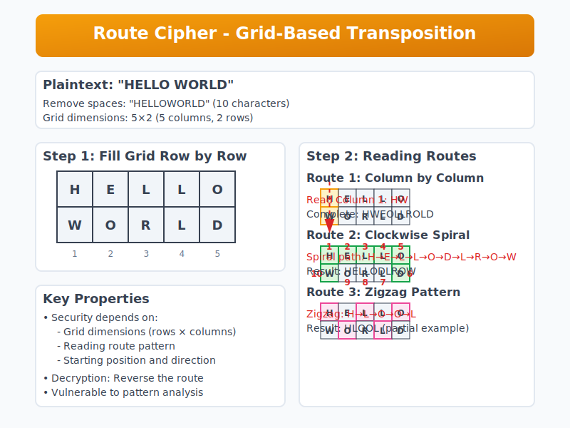

**Advantages**:

- Less vulnerable to frequency analysis because the letters retain their frequencies.
- Increases the complexity of ciphertext, making it harder to break.

**Disadvantages**:

- Still vulnerable to pattern analysis if the method of transposition is known.
- Requires more computation and may need padding for incomplete blocks.

#### Comparison and Usage

| **Feature**            | **Substitution Techniques**                            | **Transposition Techniques**                           |
|------------------------|--------------------------------------------------------|--------------------------------------------------------|
| **Operation**          | Replace characters                                     | Rearrange characters                                   |
| **Key Dependency**     | Directly depends on the substitution rule              | Depends on the transposition rule                      |
| **Security**           | Vulnerable to frequency analysis                       | Vulnerable to pattern analysis                         |
| **Complexity**         | Simpler, easier to implement                           | More complex, harder to implement                      |
| **Common Examples**    | Caesar Cipher, Monoalphabetic Cipher, Vigenère Cipher  | Rail Fence Cipher, Columnar Transposition              |
| **Cryptanalysis**      | Frequency analysis, pattern recognition                | Pattern analysis, route analysis                       |

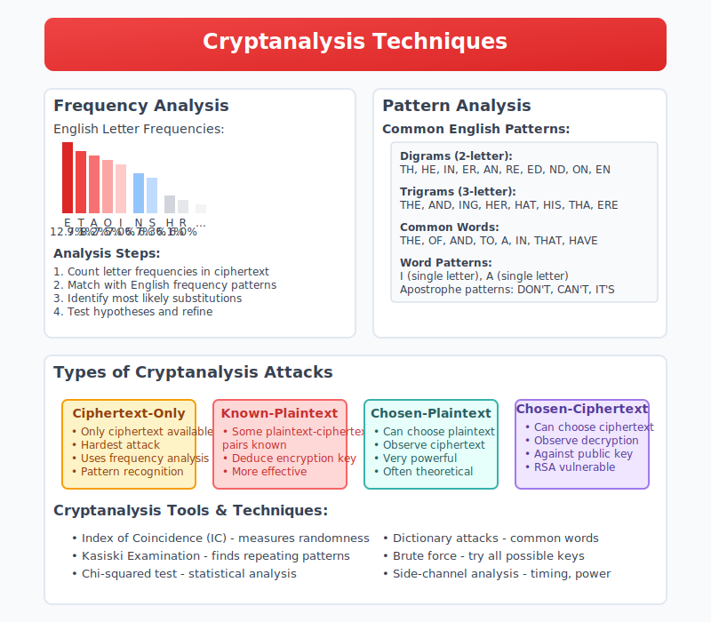

### Caesar Cipher

**Definition**:
The Caesar Cipher is one of the simplest and oldest known encryption techniques. Named after Julius Caesar, who reportedly used it to communicate with his officials, the cipher involves shifting each letter in the plaintext by a fixed number of positions down the alphabet.

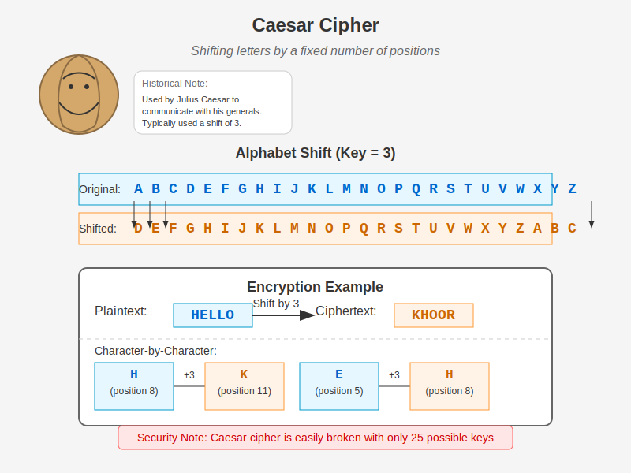

**Mechanism**:

1. **Choose a Shift Key**: Decide how many positions each letter in the plaintext will be shifted. For example, a shift of 3 means A becomes D, B becomes E, etc.
2. **Encryption**: Replace each letter in the plaintext with the letter that is a fixed number of positions down the alphabet.
3. **Decryption**: Replace each letter in the ciphertext with the letter that is the same number of positions up the alphabet.

**Example**:
Let's use a shift key of 3.

- **Plaintext**: HELLO
- **Shift Key**: 3

**Encryption Process**:

1. H -> K (H + 3 = K)
2. E -> H (E + 3 = H)
3. L -> O (L + 3 = O)
4. L -> O (L + 3 = O)
5. O -> R (O + 3 = R)

**Ciphertext**: KHOOR

**Decryption Process**:

1. K -> H (K - 3 = H)
2. H -> E (H - 3 = E)
3. O -> L (O - 3 = L)
4. O -> L (O - 3 = L)
5. R -> O (R - 3 = O)

**Decrypted Text**: HELLO

**Detailed Steps**:

1. **Alphabet**: Consider the English alphabet with 26 letters:

   ```
   A B C D E F G H I J K L M N O P Q R S T U V W X Y Z
   ```

2. **Shift Key (3 in this example)**: This means each letter will be moved three places to the right.
   - A -> D
   - B -> E
   - C -> F
   - ...
   - X -> A
   - Y -> B
   - Z -> C

3. **Encryption**:
   - Convert each letter of the plaintext to its corresponding letter using the shift.
   - H (7th letter) -> K (10th letter)
   - E (4th letter) -> H (7th letter)
   - L (11th letter) -> O (14th letter)
   - L (11th letter) -> O (14th letter)
   - O (14th letter) -> R (17th letter)
  
   This gives us the ciphertext: KHOOR.

4. **Decryption**:
   - Reverse the shift process by moving each letter of the ciphertext back by the shift key.
   - K (10th letter) -> H (7th letter)
   - H (7th letter) -> E (4th letter)
   - O (14th letter) -> L (11th letter)
   - O (14th letter) -> L (11th letter)
   - R (17th letter) -> O (14th letter)
  
   This returns the plaintext: HELLO.

**Considerations**:

- **Security**: The Caesar Cipher is not secure by modern standards because the key space is small (only 25 possible shifts for English), making it vulnerable to brute-force attacks and frequency analysis.
- **Usability**: It's primarily of historical interest and used in teaching basic cryptographic concepts rather than practical applications.
- **Variations**: Caesar Cipher can be generalized to shift any number of positions and can be applied to other alphabets and character sets.

### Columnar Transposition Cipher

**Definition**:
The Columnar Transposition Cipher is a method of encryption that rearranges the characters of the plaintext according to a specified columnar pattern. The plaintext is written into a grid of fixed width, and the ciphertext is generated by reading the columns of the grid in a specified order.

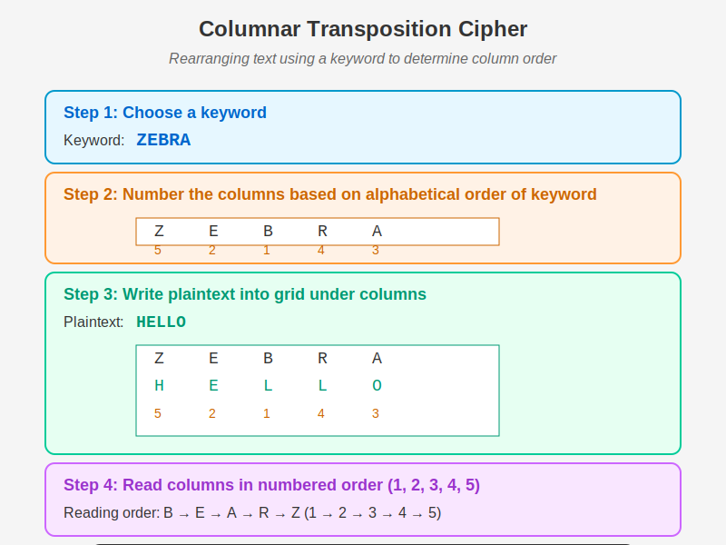

*Figure: Step-by-step process of the Columnar Transposition Cipher showing how plaintext is arranged in columns based on a keyword and then read in alphabetical order to create ciphertext.*

**Mechanism**:

1. **Choose a Keyword**: The keyword determines the order of the columns.
2. **Construct a Grid**: Write the plaintext into a grid with columns equal to the length of the keyword.
3. **Number the Columns**: Number the columns based on the alphabetical order of the letters in the keyword.
4. **Generate Ciphertext**: Read the columns in the numbered order to create the ciphertext.

**Example**:
Let's use the keyword "ZEBRA" and the plaintext "WEAREDISCOVEREDFLEEATONCE".

**Step-by-Step Process**:

1. **Keyword**: ZEBRA
2. **Number the Columns**: Assign a number to each column based on the alphabetical order of the keyword.
   - Z (5), E (2), B (1), R (4), A (3)
   ```
   Z E B R A
   5 2 1 4 3
   ```

3. **Construct the Grid**: Write the plaintext in rows under the columns.
   ```
   Z  E  B  R  A
   W  E  A  R  E
   D  I  S  C  O
   V  E  R  E  D
   F  L  E  E  A
   T  O  N  C  E
   ```

4. **Read Columns by Number**: Read the columns in the order of their numbers: 1, 2, 3, 4, 5.
   ```
   Column 1: A S R E N
   Column 2: E I E L O
   Column 3: E C D E A
   Column 4: R E E F C
   Column 5: W D V T E
   ```

5. **Generate Ciphertext**: Concatenate the columns read in the specified order.
   - Column 1 (B): A S R E N
   - Column 2 (E): E I E L O
   - Column 3 (A): E C D E A
   - Column 4 (R): R E E F C
   - Column 5 (Z): W D V T E

   **Ciphertext**: ASREN EILEO ECDEA REEFC WDTVE

**Decryption Process**:

1. **Reconstruct the Grid**: Write the ciphertext back into the grid using the same column order and keyword.
   - Keyword: ZEBRA
   - Number the columns: Z (5), E (2), B (1), R (4), A (3)
   - Arrange ciphertext into columns based on the numbers.

2. **Fill the Grid**:
   ```
   Column 1: A S R E N
   Column 2: E I E L O
   Column 3: E C D E A
   Column 4: R E E F C
   Column 5: W D V T E
   ```

3. **Reconstruct Plaintext**: Read row by row.
   ```
   W  E  A  R  E
   D  I  S  C  O
   V  E  R  E  D
   F  L  E  E  A
   T  O  N  C  E
   ```

   **Plaintext**: WEAREDISCOVEREDFLEEATONCE

**Considerations**:

- **Security**: More secure than simple substitution ciphers, but still vulnerable to certain cryptographic attacks, especially if the keyword is short or common.
- **Usability**: Suitable for moderate security needs and teaching cryptographic concepts.
- **Variations**: Variants include double transposition and irregular transposition grids to increase complexity.

### Symmetric vs Asymmetric Encryption

| **Feature**                 | **Symmetric Encryption**                         | **Asymmetric Encryption**                              |
| --------------------------- | ------------------------------------------------ | ------------------------------------------------------ |
| **Alternate Name**          | Private Key Encryption (Secret Key Encryption)   | Public Key Encryption                                  |
| **Key Usage**               | Same key for encryption and decryption           | Public key for encryption, private key for decryption  |
| **Speed**                   | Generally faster                                 | Generally slower                                       |
| **Key Management**          | Difficult due to secure distribution requirement | Easier, as public key can be freely distributed        |
| **Security**                | Secure as long as the key remains secret         | High security, especially with large key sizes         |
| **Key Length**              | Typically 128-256 bits                           | Typically 1024-4096 bits                               |
| **Algorithm Examples**      | AES, DES, Blowfish                               | RSA, ECC, DSA                                          |
| **Best Suited For**         | Encrypting large amounts of data                 | Secure key exchange, digital signatures                |
| **Confidentiality**         | Provides confidentiality if key is kept secret   | Provides confidentiality through public key encryption |
| **Use Cases**               | File encryption, disk encryption                 | SSL/TLS, email encryption, digital certificates        |
| **Complexity**              | Simpler algorithms                               | More complex algorithms                                |
| **Key Distribution**        | Challenging; secure channels required            | Easier; public keys can be distributed openly          |
| **Computational Resources** | Requires fewer resources                         | Requires more computational power                      |


### Symmetric Encryption

Symmetric encryption, also known as secret-key encryption, is a method of encryption where the same key is used for both encrypting and decrypting data. This type of encryption is fundamental in the field of cyber security and is widely used due to its simplicity and speed.

#### Principles of Symmetric Encryption

1. **Single Key Usage:** The same key is used for both encryption and decryption. This key must be kept secret between the communicating parties.
2. **Algorithm Simplicity:** Symmetric encryption algorithms are generally less complex than asymmetric ones, leading to faster processing times.
3. **Data Confidentiality:** The primary goal is to ensure that the data remains confidential and can only be accessed by those who possess the secret key.

#### Common Symmetric Encryption Algorithms


1. **AES (Advanced Encryption Standard):**
   - **Key Sizes:** 128, 192, or 256 bits.
   - **Security:** Highly secure and widely adopted. Used by the U.S. government and various organizations globally.
   - **Operation:** Works on blocks of data (128 bits at a time) and uses multiple rounds of transformation to encrypt the data.

2. **DES (Data Encryption Standard):**
   - **Key Size:** 56 bits.
   - **Security:** Considered insecure by modern standards due to its short key length.
   - **Operation:** Encrypts data in 64-bit blocks using 16 rounds of permutations and substitutions.

3. **3DES (Triple DES):**
   - **Key Size:** 168 bits (effectively three DES keys).
   - **Security:** More secure than DES but slower due to the triple encryption process.
   - **Operation:** Applies DES encryption three times to each data block.

4. **RC4 (Rivest Cipher 4):**
   - **Key Size:** Variable (typically 40 to 2048 bits).
   - **Security:** Fast and simple stream cipher, but with vulnerabilities discovered in its implementation.
   - **Operation:** Encrypts data one byte at a time, using a pseudo-random generation algorithm.

#### Encryption and Decryption Process

1. **Encryption:**
   - **Plaintext:** The original data or message that needs to be encrypted.
   - **Key:** A secret key shared between the sender and receiver.
   - **Encryption Algorithm:** Uses the key to transform the plaintext into ciphertext.
   - **Ciphertext:** The encrypted data that is unintelligible without the key.

   \[ \text{Ciphertext} = \text{Encryption Algorithm}(\text{Plaintext}, \text{Key}) \]

2. **Decryption:**
   - **Ciphertext:** The encrypted data that needs to be decrypted.
   - **Key:** The same secret key used for encryption.
   - **Decryption Algorithm:** Uses the key to transform the ciphertext back into plaintext.
   - **Plaintext:** The original data recovered after decryption.

   \[ \text{Plaintext} = \text{Decryption Algorithm}(\text{Ciphertext}, \text{Key}) \]

#### Strengths of Symmetric Encryption

1. **Speed and Efficiency:**
   - Symmetric algorithms are faster than asymmetric algorithms due to simpler mathematical operations.
   - Suitable for encrypting large amounts of data quickly.

2. **Low Computational Overhead:**
   - Requires less computational power, making it ideal for resource-constrained environments.

3. **Simplicity:**
   - Easier to implement and manage, especially in environments with a limited number of users.

#### Weaknesses of Symmetric Encryption

1. **Key Distribution:**
   - Securely sharing and managing the secret key between parties can be challenging.
   - If the key is compromised, the security of the encrypted data is also compromised.

2. **Scalability:**
   - In a large network, the number of keys required grows exponentially with the number of users.
   - For \( n \) users, the number of unique keys required is \( $\frac{n(n-1)}{2}$ \).

3. **Key Management:**
   - Requires robust systems to generate, distribute, store, and revoke keys securely.

#### Applications of Symmetric Encryption

1. **File and Disk Encryption:**
   - Protecting sensitive files and entire disks using encryption software (e.g., BitLocker, VeraCrypt).

2. **Network Security:**
   - Securing communication channels (e.g., VPNs, SSL/TLS with symmetric ciphers for bulk data encryption).

3. **Database Encryption:**
   - Encrypting sensitive data stored in databases to protect against unauthorized access.

4. **Secure Messaging:**
   - Encrypting messages in instant messaging apps (e.g., Signal, WhatsApp) using symmetric encryption for speed and efficiency.

### Asymmetric Encryption


Asymmetric encryption, also known as public-key encryption, is a method of encryption that uses a pair of cryptographic keys: a public key and a private key. These keys are mathematically related but serve different functions. Asymmetric encryption is fundamental in ensuring secure communication, especially over untrusted networks like the Internet.

#### Principles of Asymmetric Encryption

1. **Key Pair Usage:** Each user has a pair of keys: a public key that can be shared openly and a private key that must be kept secret.
2. **Encryption and Decryption:** Data encrypted with the public key can only be decrypted with the corresponding private key, and vice versa.
3. **Data Confidentiality and Integrity:** Ensures that data is not only kept confidential but also its integrity is maintained, as any alteration can be detected.

#### Key Algorithms in Asymmetric Encryption

1. **RSA (Rivest-Shamir-Adleman):**
   - **Key Sizes:** Typically 2048 bits or higher.
   - **Security:** Based on the difficulty of factoring large integers.
   - **Operation:** Involves key generation, encryption using the public key, and decryption using the private key.

2. **DSA (Digital Signature Algorithm):**
   - **Key Sizes:** Varies, typically 1024 to 3072 bits.
   - **Security:** Based on the difficulty of computing discrete logarithms.
   - **Operation:** Used primarily for digital signatures rather than encryption.

3. **ECC (Elliptic Curve Cryptography):**
   - **Key Sizes:** Provides similar security to RSA with much shorter key lengths (e.g., 256-bit ECC key is comparable to a 3072-bit RSA key).
   - **Security:** Based on the difficulty of solving elliptic curve discrete logarithm problems.
   - **Operation:** Offers strong security with smaller keys, making it efficient for mobile and IoT devices.

#### Encryption and Decryption Process

1. **Encryption:**
   - **Plaintext:** The original data or message that needs to be encrypted.
   - **Public Key:** The key that is openly shared and used for encryption.
   - **Encryption Algorithm:** Uses the public key to transform the plaintext into ciphertext.
   - **Ciphertext:** The encrypted data that can only be decrypted with the corresponding private key.

   \[ \text{Ciphertext} = \text{Encryption Algorithm}(\text{Plaintext}, \text{Public Key}) \]

2. **Decryption:**
   - **Ciphertext:** The encrypted data that needs to be decrypted.
   - **Private Key:** The key that is kept secret and used for decryption.
   - **Decryption Algorithm:** Uses the private key to transform the ciphertext back into plaintext.
   - **Plaintext:** The original data recovered after decryption.

   \[ \text{Plaintext} = \text{Decryption Algorithm}(\text{Ciphertext}, \text{Private Key}) \]

#### Digital Signatures

Asymmetric encryption is also crucial for digital signatures, which provide authentication, data integrity, and non-repudiation.

1. **Creating a Digital Signature:**
   - **Hash Function:** A hash of the original message is created.
   - **Private Key:** The sender's private key is used to encrypt the hash, creating the digital signature.
   
   \[ \text{Signature} = \text{Encrypt}(\text{Hash}, \text{Private Key}) \]

2. **Verifying a Digital Signature:**
   - **Public Key:** The sender's public key is used to decrypt the digital signature.
   - **Hash Comparison:** The decrypted hash is compared to a newly generated hash of the received message. If they match, the signature is valid.

   \[ \text{Decrypted Hash} = \text{Decrypt}(\text{Signature}, \text{Public Key}) \]
   \[ \text{Valid if Decrypted Hash} = \text{Newly Generated Hash} \]

#### Strengths of Asymmetric Encryption

1. **Secure Key Distribution:**
   - Public keys can be shared openly without compromising security.
   - Eliminates the need for secure key exchange channels.

2. **Enhanced Security:**
   - Stronger protection against attacks due to the complexity of key generation and mathematical problems.
   - Provides both confidentiality and authenticity.

3. **Scalability:**
   - Easier to manage in large networks compared to symmetric encryption, where each pair of users needs a unique key.

#### Weaknesses of Asymmetric Encryption

1. **Performance:**
   - Slower than symmetric encryption due to more complex algorithms.
   - Higher computational overhead, which can be an issue for resource-constrained environments.

2. **Key Management:**
   - Requires careful management of private keys to ensure they remain secure.
   - If a private key is compromised, the security of communications and digital signatures is at risk.

#### Applications of Asymmetric Encryption

1. **Secure Communication:**
   - SSL/TLS protocols use asymmetric encryption to establish a secure connection before switching to symmetric encryption for faster data transfer.
   - Email encryption (e.g., PGP, S/MIME) uses asymmetric encryption to secure email content.

2. **Digital Signatures:**
   - Ensuring the authenticity and integrity of digital documents, software distribution, and financial transactions.
   - Used in legal and business processes to sign contracts and verify identities.

3. **Key Exchange:**
   - Securely exchanging symmetric keys over an untrusted network, such as the Diffie-Hellman key exchange.

4. **Cryptographic Protocols:**
   - Blockchain technology relies on asymmetric encryption for secure transactions and digital signatures.

### Hashing Algorithms

Hashing algorithms are cryptographic functions that transform an input (or message) into a fixed-size string of characters, which typically appears as a seemingly random sequence of letters and numbers. This output is known as a hash or digest. Hashing is essential for ensuring data integrity and authentication in digital communications.

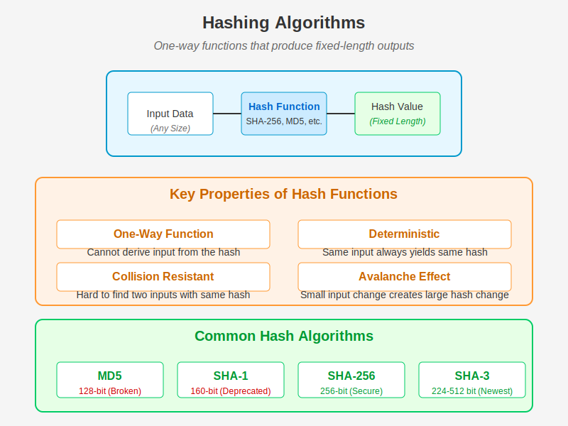

#### Principles of Hashing

1. **Deterministic:** The same input will always produce the same hash output.
2. **Fixed Output Length:** Regardless of the input size, the hash output has a fixed length (e.g., 256 bits for SHA-256).
3. **Fast Computation:** Hash functions can quickly generate hashes for any given input.
4. **Pre-image Resistance:** It should be computationally infeasible to reverse-engineer the input from its hash output.
5. **Collision Resistance:** It should be very difficult to find two different inputs that produce the same hash output.
6. **Avalanche Effect:** A small change in the input should produce a significantly different hash output.

#### Common Hashing Algorithms

1. **MD5 (Message Digest Algorithm 5):**
   - **Output Length:** 128 bits.
   - **Use Cases:** Originally used for verifying data integrity, but now considered insecure due to vulnerabilities.
   - **Operation:** Processes data in 512-bit blocks.

2. **SHA-1 (Secure Hash Algorithm 1):**
   - **Output Length:** 160 bits.
   - **Use Cases:** Previously used for digital signatures and certificates, but now deprecated due to weaknesses.
   - **Operation:** Processes data in 512-bit blocks.

3. **SHA-2 (Secure Hash Algorithm 2):**
   - **Variants:** SHA-224, SHA-256, SHA-384, SHA-512, etc.
   - **Output Length:** Varies (224, 256, 384, 512 bits).
   - **Use Cases:** Widely used for data integrity, digital signatures, and certificates.
   - **Operation:** Processes data in blocks of various sizes depending on the variant.

4. **SHA-3 (Secure Hash Algorithm 3):**
   - **Variants:** SHA3-224, SHA3-256, SHA3-384, SHA3-512.
   - **Output Length:** Varies (224, 256, 384, 512 bits).
   - **Use Cases:** Newer standard, used for enhanced security requirements.
   - **Operation:** Based on the Keccak sponge function, offering different cryptographic properties.

#### Applications of Hashing

1. **Data Integrity:**
   - **File Verification:** Ensuring files have not been altered by comparing their hashes before and after transfer.
   - **Checksums:** Hash values used to verify data integrity in storage and transmission.

2. **Digital Signatures:**
   - **Signature Generation:** Hashing the message before signing it with a private key to create a digital signature.
   - **Verification:** Hashing the received message and comparing it with the decrypted hash from the signature.

3. **Password Storage:**
   - **Secure Storage:** Storing hashed versions of passwords rather than plain text to protect user credentials.
   - **Salting:** Adding a random value to the password before hashing to prevent precomputed hash attacks.

4. **Blockchain:**
   - **Block Integrity:** Ensuring the integrity of data within blocks through hashes.
   - **Consensus Mechanisms:** Using hashes to validate transactions and blocks.

5. **Message Authentication Codes (MAC):**
   - **Data Authentication:** Combining a secret key with the message before hashing to create a unique MAC for verifying data authenticity.

#### Hashing Process

1. **Input Data:** Any form of digital data (e.g., files, messages).
2. **Hash Function:** The algorithm that processes the input data.
3. **Hash Output:** The fixed-size hash or digest generated by the hash function.

Example using SHA-256:

\[
\text{Hash} = \text{SHA-256}(\text{Input Data})
\]

#### Ensuring Data Integrity

1. **Data Transmission:**
   - Sender computes the hash of the data and sends both the data and hash.
   - Receiver computes the hash of the received data and compares it with the received hash.
   - If both hashes match, data integrity is verified.

2. **File Verification:**
   - After downloading a file, the user computes its hash.
   - The computed hash is compared with the provided hash to ensure the file has not been tampered with.

#### Authentication

1. **Digital Signatures:**
   - The sender hashes the message and encrypts the hash with their private key to create a digital signature.
   - The receiver decrypts the signature with the sender's public key to retrieve the hash and compares it with the hash of the received message.
   - If both hashes match, the message is authenticated.

2. **Message Authentication Codes (MAC):**
   - The sender computes a MAC by hashing the message combined with a secret key.
   - The receiver, knowing the secret key, computes the MAC for the received message and compares it with the received MAC.
   - If both MACs match, the message is authenticated.

**Memorization Hints**

To remember the key aspects of hashing algorithms, think of:
**"Fast, Fixed, Collision-Resistant, Avalanche"**

**Mnemonic for principles:**

- **D**eterministic
- **F**ixed Output Length
- **F**ast Computation
- **P**re-image Resistance
- **C**ollision Resistance
- **A**valanche Effect

#### MD5 Algorithm

##### Overview

MD5 (Message Digest Algorithm 5) is a widely used cryptographic hash function that produces a 128-bit hash value. Despite its vulnerabilities and being considered obsolete for secure applications, MD5 remains relevant for checksums and integrity verification in non-security-critical contexts.

##### Principles of MD5

1. **Fixed Output Length:** Regardless of the input size, MD5 produces a 128-bit (16-byte) hash value.
2. **Deterministic:** The same input will always produce the same hash.
3. **Pre-image Resistance:** It should be difficult to reverse-engineer the original input from the hash.
4. **Collision Resistance:** It should be difficult to find two different inputs that produce the same hash. (Note: MD5 has known vulnerabilities in this area.)

##### MD5 Algorithm Steps

1. **Padding the Message:**
   - The original message is padded so that its length (in bits) is congruent to 448 modulo 512.
   - A single '1' bit is appended, followed by a series of '0' bits.
   - The final 64 bits of the padding encode the original message length.

2. **Initialization of MD Buffer:**
   - Four 32-bit variables (A, B, C, D) are initialized with specific constants:
     - A = 0x67452301
     - B = 0xEFCDAB89
     - C = 0x98BADCFE
     - D = 0x10325476

3. **Processing Message in 512-bit Blocks:**
   - The padded message is divided into 512-bit blocks.
   - Each block is processed through four rounds, with 16 operations per round, using a non-linear function, modular addition, and bitwise operations.

4. **MD5 Functions and Operations:**
   - **F (B, C, D) = (B & C) | (~B & D)**
   - **G (B, C, D) = (B & D) | (C & ~D)**
   - **H (B, C, D) = B ^ C ^ D**
   - **I (B, C, D) = C ^ (B | ~D)**

   For each operation:
   - **T** is a constant derived from the sine function.
   - **K** is the index of the message block.
   - **s** is the number of bits to rotate left.

5. **Updating MD Buffer:**
   - The results of the operations are added to the current values of the buffer variables (A, B, C, D).

6. **Final Output:**
   - After processing all blocks, the buffer variables (A, B, C, D) are concatenated to produce the final 128-bit hash value.

##### Example

Let's walk through a simplified example using the MD5 algorithm on the input message "abc".

1. **Message Padding:**
   - Original message (in bits): "abc" = 01100001 01100010 01100011
   - Padding the message to a multiple of 512 bits:
     - Add a single '1' bit: 01100001 01100010 01100011 1
     - Add '0' bits until the length is 448 bits.
     - Add the length of the original message in bits (24 bits): 00000000 00000000 00000000 00000000 00000000 00011000

   The padded message in hexadecimal is:
   ```
   61626380 00000000 00000000 00000000 00000000 00000000 00000000 00000000
   00000000 00000000 00000000 00000000 00000000 00000000 00000018
   ```

2. **Initialize MD Buffer:**
   - A = 0x67452301
   - B = 0xEFCDAB89
   - C = 0x98BADCFE
   - D = 0x10325476

3. **Processing the Message Block:**
   - For each 512-bit block, perform the four rounds of 16 operations using the MD5 functions and constants.

4. **Final MD Buffer Values:**
   - After processing the padded message, the buffer variables (A, B, C, D) are concatenated to produce the final hash.

For the input "abc", the MD5 hash value (in hexadecimal) is:
```
900150983cd24fb0d6963f7d28e17f72
```

**Memorization Hints**

To remember the key aspects of the MD5 algorithm, think of:
**"Message Padding, Buffer Initialization, Four Rounds, Final Hash"**

#### SHA Algorithm

**SHA (Secure Hash Algorithm)** is a family of cryptographic hash functions designed by the National Security Agency (NSA) and published by the National Institute of Standards and Technology (NIST). They generate a fixed-size hash value from input data of arbitrary size, with SHA-1, SHA-256, SHA-384, and SHA-512 being the most commonly used variants.

##### Explanation of the Algorithm (SHA-256 Variant)

1. **Initialization**: SHA-256 operates on 512-bit blocks of input data. The message is padded to ensure its length is a multiple of 512 bits.

2. **Initial Hash Values**: SHA-256 uses eight 32-bit initial hash values (constants) stored in a 256-bit buffer. These values are specific to each SHA variant (e.g., SHA-256).

3. **Processing Blocks**: The padded message is divided into 512-bit blocks. Each block undergoes several rounds of processing.

4. **Message Schedule**: SHA-256 maintains a 64-entry message schedule array derived from the 512-bit block. This schedule is used to mix the block's bits during processing.

5. **Round Functions**: SHA-256 employs six logical functions (Ch, Maj, Sigma0, Sigma1, Gamma0, Gamma1) that operate on 32-bit words to create a new hash value.

6. **Compression Function**: Each 512-bit block undergoes 64 rounds of mixing with the message schedule, using the round functions and the current hash values.

7. **Final Hash Value**: After processing all blocks, the final 256-bit hash value (digest) is generated.

##### Example of SHA-256 Algorithm

Let's hash the message "Hello, world!" using SHA-256:

1. **Input Message**: "Hello, world!"
2. **ASCII Representation**: Convert the characters to their ASCII values and then to binary:
   - H: 01001000
   - e: 01100101
   - l: 01101100
   - ...
3. **Padding**: Pad the message to a length that is a multiple of 512 bits.
4. **Processing Blocks**: Divide the padded message into 512-bit blocks.
5. **Round Functions**: Each block goes through 64 rounds of mixing using logical functions (Ch, Maj, Sigma0, Sigma1, Gamma0, Gamma1).
6. **Final Hash Value**: Compute the 256-bit hash value (digest) after processing all blocks.

Memorization Hints and Keys to Remember

- **SHA Purpose**: Generate a fixed-size hash value for data **integrity** and **authentication**.
- **Variant**: SHA-256 produces a **256-bit** hash value.
- **Processing Steps**: Divide into **512-bit blocks**, pad, process with **64 rounds**.
- **Example**: "Hello, world!" hashed to a **64-character hexadecimal**.

Understanding SHA algorithms involves grasping their purpose, the structure of input and output, and the detailed steps involved in processing data to produce a secure hash value.

## Account & Data Security

In Unit II, we delve into the critical aspects of **Account & Data Security** in the realm of cybersecurity. This unit focuses on safeguarding sensitive information and ensuring secure access mechanisms. Understanding these concepts is essential not only for protecting personal and organizational data but also for maintaining trust and integrity in digital interactions.

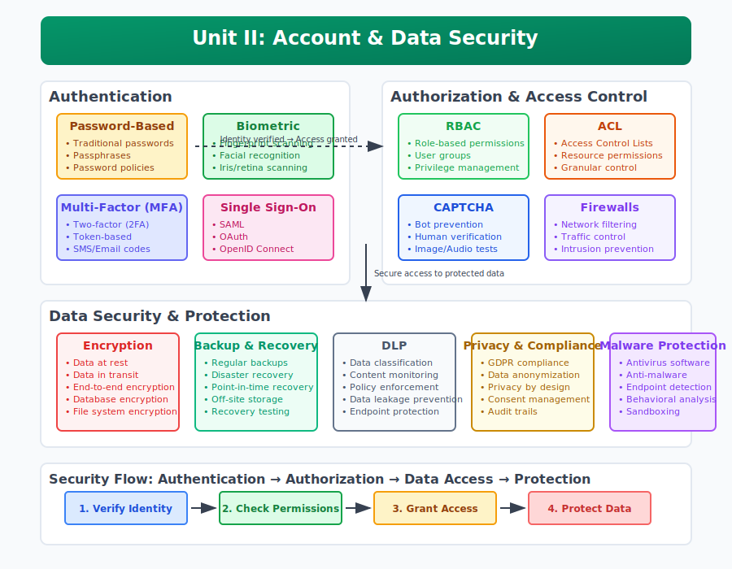

### Introduction

Account and data security form the cornerstone of cybersecurity practices, encompassing a range of strategies and technologies designed to protect information from unauthorized access, alteration, or destruction. In today's interconnected world, where digital identities and sensitive data are increasingly targeted by malicious actors, a robust understanding of authentication, authorization, and secure storage mechanisms is paramount.

This unit explores the fundamental principles and methodologies behind securing user accounts and sensitive data. From the basics of authentication methods like passwords and biometrics to advanced techniques such as multi-factor authentication and single sign-on (SSO), students will gain practical insights into fortifying digital identities against evolving threats.

Moreover, the unit examines authorization frameworks that define and enforce access controls, ensuring that only authorized individuals or systems can access specific resources. Concepts such as CAPTCHA and firewalls are explored, highlighting their roles in mitigating unauthorized access attempts and protecting networks from malicious activities.

By mastering the principles outlined in this unit, students will not only be equipped to enhance cybersecurity measures within organizations but will also be prepared to tackle examination questions with confidence, understanding, and clarity.

### Authentication

**Authentication** in cybersecurity refers to the process of verifying the identity of a user or system entity. It ensures that the entity seeking access to a system or network is indeed who or what it claims to be. Authentication forms the foundational pillar of access control mechanisms, establishing trust and enabling secure interactions within digital environments.

#### Significance in Cybersecurity

Authentication plays a pivotal role in cybersecurity by:

- **Ensuring Identity Verification**: By authenticating users and entities, organizations can verify their identity before granting access to sensitive resources or information.
- **Preventing Unauthorized Access**: Effective authentication mechanisms mitigate the risks associated with unauthorized access attempts, thereby safeguarding against data breaches and system compromises.
- **Enabling Accountability**: Authentication contributes to accountability by establishing a traceable link between actions performed within a system and the authenticated identity responsible for those action.
- **Supporting Regulatory Compliance**: Many regulatory frameworks mandate strong authentication practices to protect personal data and ensure compliance with data protection laws.

Understanding authentication principles and methods equips cybersecurity professionals with the knowledge to implement robust access control measures, thereby enhancing overall security posture and resilience against cyber threats.


### Authentication Methods


**Passwords**

Passwords are the most common form of authentication, requiring users to enter a secret combination of characters to access systems or accounts. They are effective when managed securely but vulnerable to theft or guessing attacks.

**Biometrics**

Biometrics authenticate individuals based on unique biological traits like fingerprints, iris patterns, or facial features. This method offers strong security and user convenience but may require specialized hardware and can raise privacy concerns.

**Multi-factor Authentication (MFA)**

MFA combines two or more authentication factors (e.g., password, biometric scan, token) to enhance security. It strengthens access controls by requiring attackers to compromise multiple factors, reducing the risk of unauthorized access.

**Single Sign-On (SSO)**

SSO allows users to authenticate once to gain access to multiple related systems or applications. It improves user experience and productivity but requires careful implementation to mitigate the risk of a single point of failure.

**Cookies**

Cookies are small text files stored on a user's device by websites to authenticate and track user sessions. While convenient for maintaining login states, they can pose security risks if improperly managed, such as session hijacking.

#### Passwords

Passwords are a widely used method of authentication that verifies a user's identity by requiring them to input a secret combination of characters. This method aims to ensure that only authorized individuals can access protected systems, accounts, or resources.

##### Mechanism

1. **Creation**: Users typically choose passwords during account setup. Strong passwords include a mix of alphanumeric characters, special symbols, and are resistant to dictionary attacks.

2. **Storage**: Passwords are stored in hashed form in databases to protect them from unauthorized access. Hashing algorithms like SHA-256 convert passwords into irreversible hash values.

3. **Verification**: During login attempts, the entered password is hashed using the same algorithm and compared with the stored hash. If they match, access is granted.

##### Security Considerations

- **Strength**: Strong passwords are lengthy, complex, and unique to each account. They resist brute-force and dictionary attacks.
  
- **Storage**: Passwords should be stored securely using salted hashes to prevent exposure in case of data breaches.

- **Authentication Factors**: Combining passwords with other factors (MFA) enhances security by requiring attackers to compromise multiple elements for access.

- **Best Practices**: Regular password updates, avoiding reuse across accounts, and using password managers enhance security.

##### Vulnerabilities

- **Password Guessing**: Weak passwords or reuse across accounts make them susceptible to guessing attacks.
  
- **Phishing**: Attackers trick users into revealing passwords through fraudulent emails or websites.
  
- **Brute Force**: Automated tools attempt to guess passwords by systematically trying different combinations.

**Memorization Hints and Keys to Remember**

- **Purpose**: Verify user **identity** for accessing systems.
- **Security**: Use **strong**, **unique** passwords.
- **Storage**: Securely **hash** and **salt** passwords.
- **Challenges**: Vulnerable to **guessing**, **phishing**, and **brute-force** attacks.

Passwords remain fundamental yet vulnerable authentication methods, requiring robust security practices and user awareness to mitigate risks effectively.

#### Biometrics

Biometrics authentication utilizes unique biological characteristics of individuals to verify their identity. Unlike traditional methods such as passwords or tokens, biometrics relies on physical traits that are difficult to forge or replicate, enhancing security and user convenience.

##### Mechanism

1. **Biometric Data Capture**: Biometric systems capture and analyze physiological or behavioral characteristics, including:
   - **Physiological Traits**: Such as fingerprints, iris patterns, facial features, hand geometry, or DNA.
   - **Behavioral Traits**: Such as voice patterns, typing rhythm, or gait.

2. **Data Representation**: Biometric data is converted into a digital format, typically through algorithms that extract distinctive features and create templates for comparison.

3. **Matching Process**: During authentication:
   - The user presents their biometric trait (e.g., fingerprint scan).
   - The system compares the presented biometric data with stored templates.
   - If a match is found within an acceptable threshold, access is granted.

##### Security Considerations

- **Uniqueness**: Each person's biometric traits are unique, reducing the likelihood of impersonation.
  
- **Accuracy**: Advanced algorithms ensure precise matching while accommodating minor variations in biometric data (e.g., changes due to aging or injury).

- **User Convenience**: Eliminates the need to remember or manage passwords, enhancing user experience and productivity.

- **Privacy**: Biometric data should be securely stored and protected to prevent unauthorized access or misuse.

##### Advantages

- **Security**: Provides strong authentication, as biometric traits are difficult to forge or steal.
  
- **Convenience**: Simplifies authentication processes for users, reducing the risk of password-related issues (e.g., forgetting, sharing, or stolen passwords).

- **Versatility**: Can be implemented across various devices and environments, from smartphones to high-security facilities.

##### Challenges

- **Cost**: Implementation and maintenance of biometric systems can be expensive, requiring specialized hardware and software.
  
- **Accuracy**: Environmental factors (e.g., lighting conditions for facial recognition) and health conditions (e.g., injuries affecting fingerprints) can impact accuracy.

- **Privacy Concerns**: Biometric data must be handled with care to comply with regulations and protect user privacy rights.

**Memorization Hints and Keys to Remember**

- **Purpose**: Verify user **identity** using unique **biological traits**.
- **Advantages**: Provides **strong security** and **convenience**.
- **Considerations**: Address **privacy**, **accuracy**, and **implementation costs**.

Biometrics authentication offers a robust and user-friendly approach to identity verification, leveraging the uniqueness of biological characteristics to enhance security in various applications.

#### Multi-factor Authentication (MFA)


Multi-factor authentication (MFA) is a security measure that requires users to provide two or more verification factors to gain access to a system, application, or account. By combining multiple factors, MFA enhances security beyond traditional password-only methods, mitigating the risks of unauthorized access and account compromise.

##### Authentication Factors

MFA typically involves the use of three main authentication factors:

1. **Something You Know**: Knowledge-based factors that the user possesses and can verify:
   - **Passwords**: Knowledge of a secret passphrase or PIN.
   - **Security Questions**: Answers to predefined questions.

2. **Something You Have**: Possession-based factors that the user physically possesses:
   - **Security Tokens**: Physical devices that generate one-time passwords (OTPs).
   - **Smart Cards**: Integrated circuit cards used for authentication.
   - **Mobile Devices**: Smartphones or tablets used for receiving OTPs.

3. **Something You Are**: Inherence-based factors that are unique biological characteristics of the user:
   - **Biometrics**: Physical traits like fingerprints, iris patterns, facial recognition, or voice prints.

##### Mechanism

1. **Authentication Process**: 
   - The user initiates a login attempt and provides their primary authentication factor (e.g., password).
   - The system prompts for an additional factor (e.g., OTP sent to a mobile device or fingerprint scan).
   - Upon successful verification of both factors, access is granted.

2. **Sequential or Simultaneous**: Factors can be verified sequentially (one after another) or simultaneously (in parallel).

##### Security Considerations

- **Enhanced Security**: MFA significantly reduces the likelihood of unauthorized access, even if one factor is compromised.
  
- **Flexibility**: Allows organizations to tailor authentication requirements based on risk levels and sensitivity of accessed resources.

- **User Experience**: While enhancing security, MFA should balance usability to avoid hindering user productivity.

##### Advantages

- **Strong Authentication**: Combining multiple factors strengthens access control and mitigates risks associated with stolen or guessed passwords.
  
- **Compliance**: Meets regulatory requirements for securing sensitive data and maintaining data privacy.

- **Adaptability**: Can be implemented across various systems and applications, from online banking to corporate networks.

##### Challenges

- **Implementation Complexity**: Requires integration of diverse authentication factors and systems, potentially increasing deployment and maintenance costs.
  
- **User Training**: Users may require guidance on how to use and manage multiple authentication factors effectively.

- **Dependency on External Factors**: Relies on the availability and security of external authentication methods (e.g., mobile networks for OTP delivery).

**Memorization Hints and Keys to Remember**

- **Purpose**: Strengthen **authentication** by requiring multiple **verification factors**.
- **Factors**: Include **knowledge-based**, **possession-based**, and **inherence-based** factors.
- **Benefits**: Enhance **security**, ensure **compliance**, and provide **flexibility**.

MFA represents a robust approach to authentication, leveraging multiple factors to safeguard access to sensitive systems and data, thereby enhancing overall cybersecurity posture.

#### Single Sign-On (SSO)

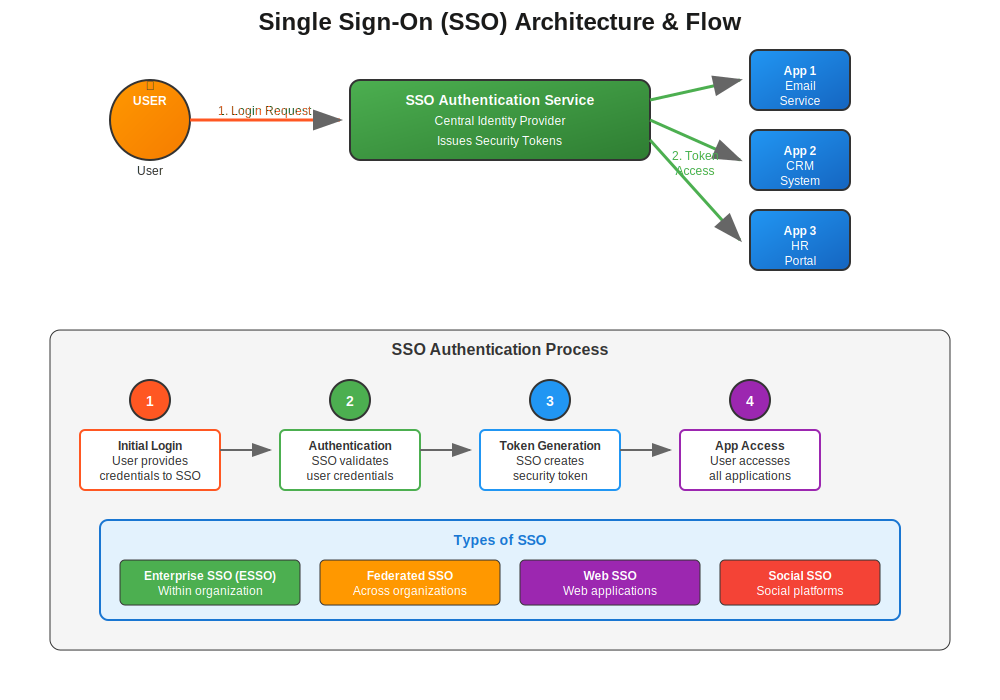

Single Sign-On (SSO) is an authentication process that allows users to access multiple applications or services with a single set of login credentials. Instead of requiring users to log in separately to each application, SSO enables seamless and secure access by verifying the user's identity once.

##### Mechanism

1. **Authentication Flow**:
   - Upon initiating a session, the user provides their credentials (e.g., username and password) to a centralized authentication service.
   - The authentication service verifies the credentials and issues a security token or session identifier.
   - This token is used to authenticate the user across multiple applications or services within the SSO environment without requiring re-authentication for each service.

2. **Session Management**:
   - The SSO service manages the user's session, maintaining authentication state and ensuring seamless access to authorized resources.
   - Users can navigate between integrated applications or services without encountering repeated login prompts.


##### Types of SSO

1. **Enterprise SSO (ESSO)**: Designed for organizations, ESSO enables employees to access corporate applications and resources with a single login, enhancing productivity and security.

2. **Federated SSO**: Extends SSO capabilities across different organizations or domains. It allows users from one organization to access resources in another organization's domain without needing separate credentials.

##### Security Considerations

- **Centralized Authentication**: Reduces the risk of password fatigue and encourages the use of strong, unique passwords.
  
- **Access Control**: SSO systems enforce access policies and permissions centrally, ensuring consistent security across integrated applications.

- **Risk of Single Point of Failure**: The centralized authentication service becomes critical; any compromise could potentially impact access to multiple applications.

##### Advantages

- **User Convenience**: Simplifies user experience by reducing the number of passwords to remember and login prompts to encounter.
  
- **Enhanced Security**: Facilitates stronger authentication practices, such as multi-factor authentication (MFA), across integrated applications.

- **Administrative Efficiency**: Streamlines user management and reduces IT overhead associated with password resets and account provisioning.

##### Challenges

- **Integration Complexity**: Requires compatible authentication protocols (e.g., SAML, OAuth) and integration with existing applications and directories.
  
- **Compatibility Issues**: Applications must support SSO standards and protocols to enable seamless authentication.

- **User Awareness**: Users may need education on SSO usage, security implications, and best practices.

**Memorization Hints and Keys to Remember**

- **Purpose**: Enable users to access multiple **applications** with a single **login**.
- **Types**: Include **Enterprise SSO** (ESSO) and **Federated SSO**.
- **Advantages**: Enhance **convenience**, **security**, and **administrative efficiency**.

SSO represents a powerful solution for organizations seeking to improve user experience, streamline access management, and bolster cybersecurity measures across diverse applications and services.

#### Cookies

Cookies are small pieces of data stored on a user's device by websites to track user activity, maintain session states, and, in some cases, authenticate user sessions. While primarily used for session management and personalization, cookies can also play a role in authentication processes.

##### Mechanism

1. **Session Management**: 
   - When a user logs into a website, the server may generate a session cookie that contains a unique session identifier.
   - This cookie is stored on the user's device and sent back to the server with each subsequent request, allowing the server to identify the user and maintain their authenticated session.

2. **Remembering User Preferences**:
   - Cookies can also be used to remember user preferences, such as language settings or personalized content preferences, enhancing user experience.

3. **Authentication Tokens**:
   - In some implementations, cookies may store authentication tokens or encrypted credentials that validate the user's identity for a limited period.
   - These tokens can facilitate automatic login on subsequent visits without requiring the user to re-enter their credentials.

##### Security Considerations

- **Vulnerabilities**: Cookies are vulnerable to theft through attacks like session hijacking or cross-site scripting (XSS) if not properly secured.
  
- **Expiration and Renewal**: Session cookies should have short lifetimes and automatically expire or be renewed to minimize exposure in case of compromise.

- **Secure Transmission**: Cookies containing sensitive information should be transmitted over secure HTTPS connections to prevent interception by malicious actors.

##### Types of Cookies

1. **Session Cookies**: Temporary cookies that expire when the user closes their browser or logs out of the session.
   
2. **Persistent Cookies**: Stored on the user's device for a longer period, allowing websites to remember preferences and login information across sessions.

##### Advantages

- **User Convenience**: Simplifies user login processes by remembering authentication tokens or session states.
  
- **Efficiency**: Reduces the need for users to repeatedly enter login credentials during a session.

- **Personalization**: Enables websites to deliver customized content and settings based on user preferences.

##### Challenges

- **Security Risks**: Cookies can be vulnerable to theft or tampering, potentially compromising user privacy and security.
  
- **Regulatory Compliance**: Compliance with data protection regulations (e.g., GDPR) requires transparent cookie usage policies and user consent mechanisms.

**Memorization Hints and Keys to Remember**

- **Purpose**: Manage **sessions** and potentially store **authentication tokens**.
- **Types**: Include **session** and **persistent** cookies.
- **Considerations**: Address **security risks**, **regulatory compliance**, and **user privacy**.

Cookies serve as a convenient mechanism for managing user sessions and personalizing web experiences but require careful implementation and security measures to mitigate risks and protect user data effectively.

### Authorization

Authorization in cybersecurity refers to the process of granting or denying access rights and privileges to authenticated users, systems, or applications based on their identity and defined permissions. It ensures that individuals or entities can only access resources or perform actions that are appropriate and permissible according to organizational policies and security requirements.

#### Significance in Cybersecurity

Authorization plays a crucial role in cybersecurity by:

- **Access Control**: Determining what resources or data a user or system is allowed to access based on their authenticated identity.
  
- **Risk Mitigation**: Reducing the risk of unauthorized access and potential breaches by enforcing granular permissions and restrictions.
  
- **Compliance**: Ensuring adherence to regulatory requirements and organizational policies regarding data protection and privacy.


  
- **Accountability**: Establishing a clear audit trail of user actions and access attempts, aiding in forensic investigations and incident response.

#### Key Concepts

1. **Permissions**: Defining specific actions or operations that an authenticated entity can perform on resources (e.g., read, write, execute).

2. **Access Control Lists (ACL)**: Lists associated with resources that specify which users or groups have permissions to access or modify those resources.

3. **Role-Based Access Control (RBAC)**: Assigning permissions based on predefined roles within an organization, simplifying management and ensuring consistency.

4. **Principle of Least Privilege**: Granting users the minimum level of access necessary to perform their job functions, reducing the impact of potential security breaches.

#### Implementation

- **Policy Enforcement**: Using access control mechanisms (e.g., firewalls, access control models) to enforce authorization policies and restrictions.
  
- **Authentication Integration**: Combining with authentication processes to verify users' identities before granting access based on their authorized permissions.

- **Continuous Monitoring**: Monitoring and auditing access patterns and permissions to detect anomalies or unauthorized activities promptly.

**Memorization Hints and Keys to Remember**

- **Purpose**: Control **access rights** and privileges based on **authenticated identity**.
- **Key Concepts**: Include **permissions**, **ACL**, **RBAC**, and **least privilege**.
- **Significance**: Ensure **compliance**, mitigate **risks**, and enforce **accountability**.

Authorization ensures that only authorized users or systems can access specific resources, helping organizations maintain data confidentiality, integrity, and availability while adhering to regulatory standards and internal security policies.

### Authorization Methods

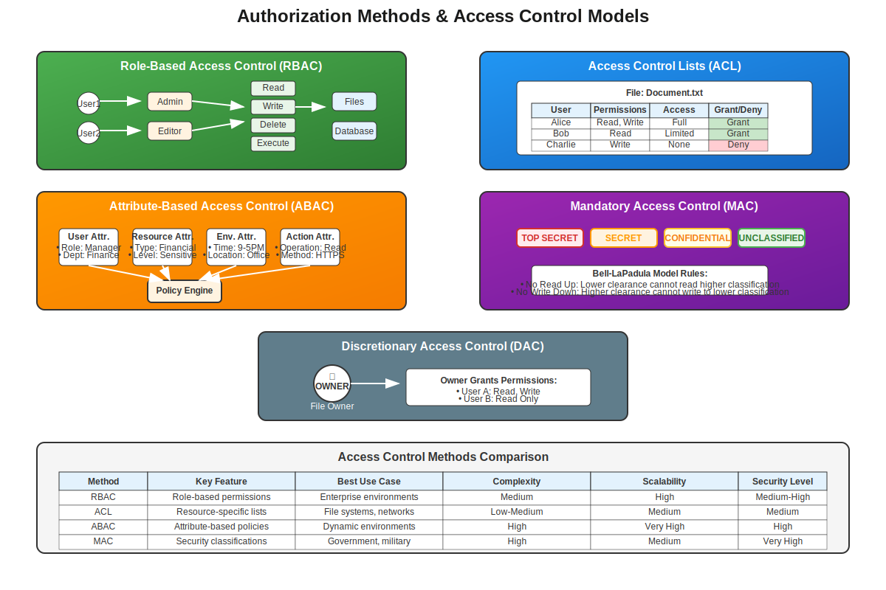

Authorization methods in cybersecurity encompass various approaches to controlling access rights and privileges based on authenticated identities. These methods ensure that users, systems, or applications can only access resources or perform actions that align with organizational policies and security requirements.

#### Key Methods

1. **Access Control Lists (ACL)**:
   - **Definition**: ACLs are lists associated with resources (files, directories, networks) that specify which users or groups have permissions (read, write, execute).
   - **Implementation**: Typically managed at the resource level, ACLs provide granular control over access rights based on user identities or group memberships.

2. **Role-Based Access Control (RBAC)**:
   - **Definition**: RBAC assigns permissions to users based on their roles within an organization.
   - **Implementation**: Users inherit permissions associated with their assigned role, simplifying management and ensuring consistent access control.
   - **Advantages**: Enhances security by minimizing manual permission assignments and aligns with organizational structure.

3. **Attribute-Based Access Control (ABAC)**:
   - **Definition**: ABAC evaluates attributes (user characteristics, resource properties, environmental conditions) to determine access decisions dynamically.
   - **Implementation**: Policies are defined based on attributes such as user roles, location, time of access, and other contextual factors.
   - **Advantages**: Offers flexible and adaptive access control based on changing circumstances and business requirements.

4. **Mandatory Access Control (MAC)**:
   - **Definition**: MAC enforces strict hierarchical access controls based on security classifications (e.g., top-secret, confidential) and sensitivity labels.
   - **Implementation**: Typically used in high-security environments, MAC limits access based on predefined rules and policies set by system administrators.

5. **Discretionary Access Control (DAC)**:
   - **Definition**: DAC allows resource owners to determine access permissions and control who can access their resources.
   - **Implementation**: Permissions are granted at the discretion of the resource owner, providing flexibility but requiring careful management to prevent unauthorized access.

6. **Rule-Based Access Control (RBAC)**:
   - **Definition**: RBAC uses predefined rules or policies to grant or deny access based on specific conditions or criteria.
   - **Implementation**: Rules are evaluated to determine access rights, enabling fine-grained control over resource access in dynamic environments.

#### Considerations

- **Integration**: Authorization methods often integrate with authentication mechanisms to verify user identities before granting access.
  
- **Policy Management**: Effective authorization requires clear policies, enforcement mechanisms, and regular review to align with organizational security goals.
  
- **Compliance**: Authorization methods should support regulatory compliance requirements regarding data protection and privacy.

**Memorization Hints and Keys to Remember**

- **Methods**: Include **ACL**, **RBAC**, **ABAC**, **MAC**, **DAC**, and **RBAC**.
- **Implementation**: Each method offers unique benefits and considerations for managing access rights and privileges.
- **Purpose**: Ensure **secure access control** aligned with **organizational policies** and **security requirements**.

Understanding and implementing appropriate authorization methods are critical for maintaining data security, enforcing access controls, and supporting operational efficiency within organizations.

### CAPTCHA

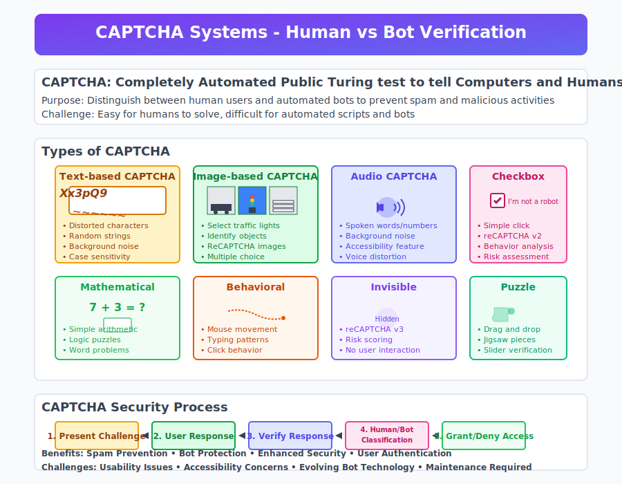

**CAPTCHA (Completely Automated Public Turing test to tell Computers and Humans Apart)** is a challenge-response test designed to distinguish between human users and automated bots on the internet. It serves as a security measure to prevent bots from performing actions that require human intelligence, such as creating accounts, submitting forms, or conducting malicious activities like spamming.

#### Mechanism

1. **Presentation**: CAPTCHA typically presents users with a test that is easy for humans to solve but difficult for automated scripts or bots. This can include distorted text, images, puzzles, or simple questions.

2. **Response Verification**: After users input their response, the CAPTCHA system verifies it to determine if the user is likely human or bot.
   - **Text-based CAPTCHA**: Users must decipher distorted characters or letters displayed in an image.
   - **Image-based CAPTCHA**: Users identify objects, traffic lights, or other elements within a series of images.
   - **Audio CAPTCHA**: Users listen to distorted audio clips and transcribe what they hear.
   - **Checkbox CAPTCHA**: Users simply click a checkbox confirming they are not a robot, sometimes followed by additional verification if necessary.

3. **Effectiveness**: CAPTCHA challenges are designed to be easily solvable by humans with normal cognitive abilities but challenging for automated scripts, which struggle with image recognition, language understanding, or audio interpretation.

#### Implementation

- **Integration**: CAPTCHA is integrated into websites, online forms, or applications where user interaction is required.
- **Customization**: Developers can customize CAPTCHA challenges to suit their specific security needs and user interface preferences.
- **Accessibility**: Some CAPTCHA implementations include options for users with disabilities, such as audio-based challenges for visually impaired users.

#### Advantages

- **Spam Prevention**: Effectively blocks automated bots from submitting forms, creating accounts, or posting content, reducing spam and fraudulent activities.
- **Enhanced Security**: Protects against automated attacks and helps maintain the integrity of online interactions and user data.
- **User Engagement**: Enhances user experience by ensuring that interactions primarily involve genuine human users rather than bots.

#### Challenges

- **Usability**: Some CAPTCHA challenges may be difficult for certain users to solve, leading to frustration or accessibility issues.
- **Evolution of Bots**: Advanced bots may employ machine learning or AI techniques to bypass traditional CAPTCHA challenges, necessitating ongoing updates and improvements.
- **Maintenance**: Websites and applications must regularly update CAPTCHA implementations to maintain effectiveness against evolving automated threats.

**Memorization Hints and Keys to Remember**

- **Purpose**: Verify user **identity** as human and prevent **bot** activities.
- **Types**: Include **text-based**, **image-based**, **audio-based**, and **checkbox** CAPTCHA.
- **Effectiveness**: Designed to be **easy** for humans, **difficult** for automated scripts.

CAPTCHA remains a widely used and effective method to safeguard online interactions against automated bots, ensuring that digital environments maintain security and usability for legitimate human users.

### Firewall

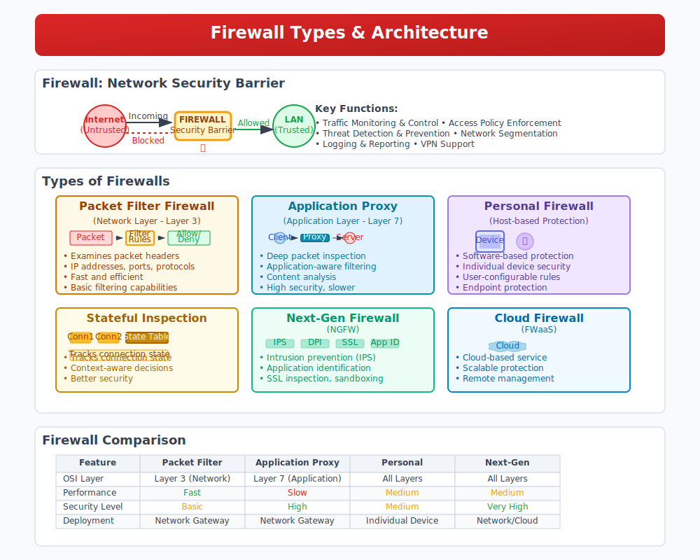

A firewall is a network security device or software that monitors and controls incoming and outgoing network traffic based on predetermined security rules. It acts as a barrier between trusted internal networks (e.g., corporate LAN) and untrusted external networks (e.g., the internet), enforcing access control policies to protect against unauthorized access, malware, and other cyber threats.

#### Types of Firewalls

1. **Packet Filter Firewall**

   - **Definition**: Packet filter firewalls examine packets of data as they pass through the network based on predefined rules (filters).
   - **Purpose**: Filters packets based on criteria such as source and destination IP addresses, ports, and protocols.
   - **Implementation**: Operates at the network layer (Layer 3) of the OSI model, making filtering decisions based on packet headers.
   - **Advantages**: Offers flexibility and efficiency in controlling network traffic, suitable for basic network security needs.

2. **Application Proxy Firewall**

   - **Definition**: Application proxy firewalls act as intermediaries between clients (users) and servers, inspecting and filtering application-layer (Layer 7) traffic.
   - **Purpose**: Provides advanced security by analyzing content and behavior of specific applications, detecting and preventing attacks targeting application vulnerabilities.
   - **Implementation**: Proxy servers maintain separate connections with clients and servers, allowing them to filter and modify traffic based on security policies.
   - **Advantages**: Enhances security for complex applications, filters content, and blocks malicious requests, masking internal network details.

3. **Personal Firewall**

   - **Definition**: Personal firewalls are software-based firewalls installed on individual devices (e.g., computers, smartphones) to protect them from unauthorized network access and malicious activities.
   - **Purpose**: Secures endpoints by monitoring incoming and outgoing traffic, blocking unauthorized connections, and alerting users to suspicious activities.
   - **Implementation**: Operates at the device level, providing customizable security settings and notifications to enhance user awareness and control.
   - **Advantages**: Offers additional layers of protection for personal devices, complementing network-based firewalls and enhancing overall cybersecurity posture.

#### Common Firewall Features and Capabilities

- **Access Control**: Determines which traffic is allowed or denied based on defined rules and policies.
- **Stateful Inspection**: Tracks the state of active connections and allows only legitimate traffic associated with established sessions.
- **Logging and Reporting**: Records firewall activities, events, and security incidents for auditing and analysis purposes.
- **Intrusion Prevention System (IPS)**: Provides real-time threat detection and prevention by analyzing traffic patterns and identifying malicious activities.
- **Virtual Private Network (VPN) Support**: Facilitates secure remote access by encrypting traffic between endpoints and ensuring data confidentiality.

#### Considerations

- **Configuration and Management**: Firewalls require regular updates, rule maintenance, and monitoring to adapt to evolving threats and network environments.
- **Performance Impact**: Introducing a firewall may affect network latency or throughput, requiring optimization for efficient traffic management.
- **Integration with Security Ecosystem**: Effective firewall deployment often involves integration with other security technologies (e.g., IDS/IPS, antivirus) to provide comprehensive protection.

**Memorization Hints and Keys to Remember**

- **Purpose**: Secure networks and devices by controlling **traffic** and preventing **unauthorized access**.
- **Types**: Include **packet filter**, **application proxy**, and **personal firewall**.
- **Features**: Offer **access control**, **stateful inspection**, and **intrusion prevention** capabilities.

Firewalls serve as critical components of network security, implementing access control policies to safeguard against cyber threats and ensure the confidentiality, integrity, and availability of organizational and personal data.

### Malicious Software

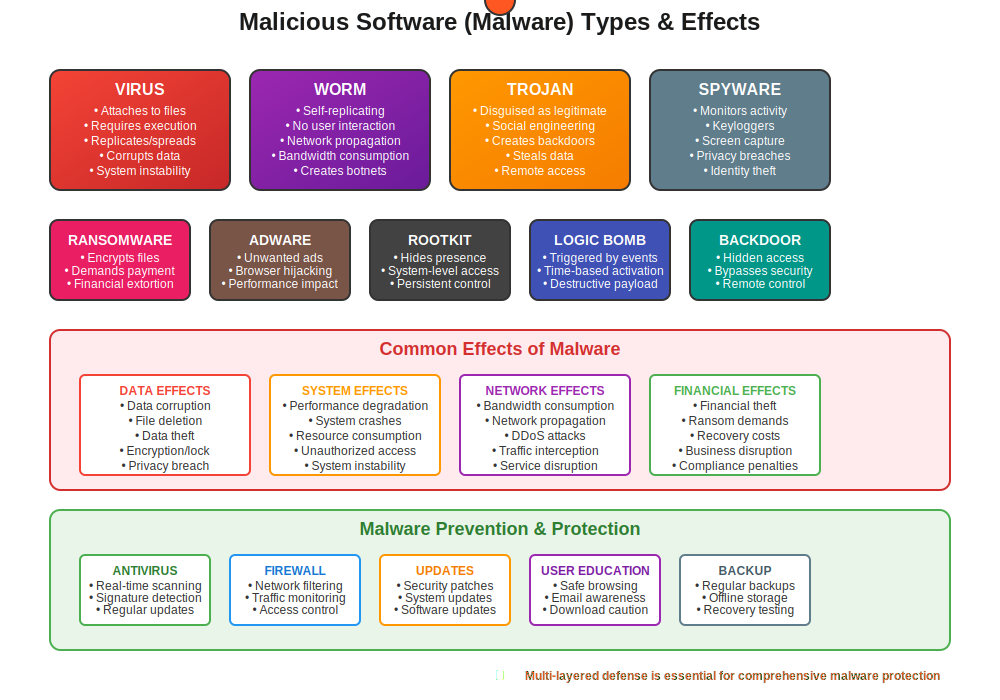

Malicious software, commonly known as malware, refers to any software intentionally designed to cause harm to a computer system, network, or user. Malware encompasses various types, each with distinct characteristics and effects, posing significant cybersecurity threats.

#### Effects of Malware

- **Data Loss and Corruption**: Malware can delete, modify, or encrypt files, rendering them inaccessible or unusable.
- **System Disruption**: Malware activities can slow down system performance, crash applications, or cause system instability.
- **Financial Loss**: In cases of ransomware or banking trojans, malware can lead to financial theft or extortion.
- **Privacy Breaches**: Malware may compromise sensitive information, leading to identity theft, fraud, or unauthorized access to personal data.

#### Types of Malicious Software and Effects

1. **Virus**
   - **Definition**: A virus is a malicious program that attaches itself to legitimate executable files or documents. It spreads when the infected files are executed, replicating and potentially damaging files or causing system malfunctions.
   - **Effects**: Can corrupt or delete files, steal sensitive information, and spread to other systems via infected files or networks.

2. **Worm**
   - **Definition**: Unlike viruses, worms are standalone malicious programs that self-replicate and spread independently across networks. They exploit security vulnerabilities to infect computers and propagate rapidly.
   - **Effects**: Worms can consume network bandwidth, degrade system performance, and distribute payloads (e.g., other malware) to compromised systems.

3. **Trojan Horse**
   - **Definition**: Trojans are deceptive software programs disguised as legitimate applications or files. Once installed or executed by the user, they perform malicious actions, often without the user's knowledge.
   - **Effects**: Trojans can create backdoors for remote access, steal sensitive data (e.g., passwords, financial information), or initiate additional malicious activities (e.g., launching DDoS attacks).

4. **Logical Bomb**
   - **Definition**: Also known as a time bomb, a logical bomb is a type of malware triggered by specific conditions or events, such as a particular date or user action.
   - **Effects**: Upon activation, logical bombs can delete files, corrupt data, or disrupt system operations, causing significant damage or inconvenience.

5. **Keylogger**
   - **Definition**: Keyloggers monitor and record keystrokes typed by users on keyboards. They capture sensitive information such as login credentials, credit card numbers, and personal messages.
   - **Effects**: Keyloggers compromise user privacy and security by covertly transmitting captured data to malicious actors, enabling identity theft or unauthorized access.

6. **Sniffer**
   - **Definition**: Sniffers (or network sniffers) intercept and monitor network traffic, capturing data packets transmitted over local networks or the internet.
   - **Effects**: In the wrong hands, sniffers can capture sensitive information, including passwords, email contents, and financial transactions, compromising confidentiality and integrity.

7. **Backdoor**
   - **Definition**: Backdoors are hidden entry points or vulnerabilities intentionally created in software, allowing unauthorized access and control of a system.
   - **Effects**: Attackers exploit backdoors to bypass authentication mechanisms, gain remote access, and execute malicious commands, compromising system security and integrity.

**Memorization Hints and Keys to Remember**

- **Types**: Include **virus**, **worm**, **trojan horse**, **logical bomb**, **keylogger**, **sniffer**, and **backdoor**.
- **Effects**: Range from **data loss** and **system disruption** to **privacy breaches** and **financial loss**.
- **Prevention**: Employ **antivirus software**, maintain **software updates**, and practice **safe browsing** and **email habits**.

#### Virus

A virus is a type of malicious software (malware) that infects computer systems by attaching itself to legitimate executable files or documents. Unlike standalone malware such as worms, viruses require user interaction or execution of infected files to propagate and cause harm. Once activated, viruses can replicate and spread across a computer network or to other systems, often with damaging effects.

##### Mechanism

1. **Infection**: Viruses typically infect a system when a user inadvertently executes or opens an infected file, often through email attachments, downloaded files, or compromised software.

2. **Replication**: Once executed, the virus embeds itself into other executable files or system areas, such as boot sectors or macros within documents, allowing it to spread to other files and devices.

3. **Payload**: Viruses carry a malicious payload that executes specific actions when triggered. This payload may include deleting files, corrupting data, stealing sensitive information, or facilitating unauthorized access to the infected system.

##### Classification

- **File Infector Viruses**: Attach themselves to executable files (e.g., .exe) or scripts, modifying them to include the virus code. When these files are executed, the virus activates and spreads.

- **Macro Viruses**: Exploit macros in document formats like Microsoft Word or Excel to execute malicious commands. They can spread through infected documents shared via email or removable media.

- **Boot Sector Viruses**: Infect the boot sector of storage devices (e.g., hard drives, USB drives), allowing them to execute when the infected device is booted, potentially compromising the system's startup process.

##### Effects

- **Data Loss and Corruption**: Viruses can delete or modify files, rendering them inaccessible or corrupting data beyond recovery.

- **System Instability**: Virus activities can cause system crashes, slow performance, or lead to errors in application execution.

- **Privacy Breaches**: Some viruses are designed to capture sensitive information (e.g., passwords, financial data) and transmit it to remote servers controlled by attackers.

- **Network Propagation**: In network environments, viruses can spread to connected devices, compromising entire networks and disrupting operations.

##### Detection and Prevention

- **Antivirus Software**: Use reputable antivirus programs to scan for and remove viruses from infected systems.
  
- **System Updates**: Regularly update operating systems, software applications, and antivirus definitions to patch security vulnerabilities exploited by viruses.

- **Email and File Handling**: Exercise caution when opening email attachments or downloading files from untrusted sources to minimize the risk of virus infection.

- **User Awareness**: Educate users about safe computing practices, including recognizing phishing attempts and avoiding suspicious websites or downloads.

##### Memorization Hints and Keys to Remember

- **Definition**: Virus is a type of **malware** that requires **execution** to propagate.
- **Classification**: Includes **file infector**, **macro**, and **boot sector** viruses.
- **Effects**: Range from **data loss** and **system instability** to **privacy breaches** and **network propagation**.

Understanding viruses and implementing proactive measures are essential for mitigating their impact and maintaining the security and integrity of computer systems and networks against evolving cyber threats.

#### Worm

A worm is a type of malicious software (malware) that operates independently, spreading across computer networks and systems without requiring user interaction to propagate. Unlike viruses, worms do not need to attach themselves to existing files or programs. Instead, they exploit network vulnerabilities or security weaknesses to replicate and distribute copies of themselves to other computers or devices.

##### Mechanism

1. **Self-Propagation**: Worms are self-replicating programs that can spread independently across networks or through the internet. They achieve this by exploiting vulnerabilities in operating systems, network protocols, or software applications.

2. **Network Propagation**: Once a worm infects a system, it scans the network for other vulnerable devices. It uses various methods, such as scanning IP address ranges or exploiting known vulnerabilities, to identify and infect additional hosts.

3. **Payload**: Worms often carry a malicious payload designed to execute specific actions once activated. This payload can include installing backdoors for remote access, launching denial-of-service (DoS) attacks, or stealing sensitive information.

##### Classification

- **Email Worms**: Spread through email attachments or links, exploiting email clients' vulnerabilities to infect devices and propagate to contacts in the email address book.

- **Internet Worms**: Exploit security flaws in network protocols or web services, allowing them to spread rapidly across interconnected systems, including servers, workstations, and IoT devices.

- **File-Sharing Worms**: Infect shared files or directories on networked systems, leveraging file-sharing protocols to distribute copies of themselves to other users' devices.

##### Effects

- **Network Congestion**: Worms consume network bandwidth and system resources, causing slowdowns or disruptions in network performance.

- **System Instability**: Infected systems may experience crashes, freezes, or errors as the worm's activities interfere with normal system operations.

- **Data Theft**: Some worms are designed to steal sensitive information, such as login credentials, financial data, or intellectual property, compromising user privacy and security.

- **Botnet Formation**: Worms can recruit infected devices into botnets, networks of compromised devices controlled by attackers for malicious purposes like launching coordinated cyber attacks.

##### Detection and Prevention

- **Network Monitoring**: Implement intrusion detection systems (IDS) or network traffic analysis tools to detect unusual patterns or behaviors indicative of worm activity.

- **Patch Management**: Regularly update operating systems, software applications, and network devices to fix known vulnerabilities exploited by worms.

- **Firewalls and Security Appliances**: Configure firewalls and network security appliances to block suspicious network traffic and prevent unauthorized access attempts from worms.

- **User Education**: Educate users about safe computing practices, such as avoiding suspicious links or attachments in emails and being cautious with file downloads from the internet.

##### Memorization Hints and Keys to Remember

- **Definition**: Worm is a type of **malware** that **self-replicates** and **spreads independently** across networks.
- **Classification**: Includes **email**, **internet**, and **file-sharing** worms.
- **Effects**: Include **network congestion**, **system instability**, **data theft**, and **botnet formation**.

Understanding worms and implementing robust cybersecurity measures are essential for defending against their propagation and minimizing the impact of worm infections on computer systems, networks, and user data.

#### Trojan Horse

A Trojan Horse, commonly referred to as a Trojan, is a type of malicious software (malware) that disguises itself as a legitimate or benign application to deceive users into installing or executing it. Unlike viruses and worms, Trojans do not self-replicate. Instead, they rely on social engineering tactics to trick users into downloading and running them, thereby compromising the security of the targeted system.

##### Mechanism

1. **Deception**: Trojans are often disguised as useful software, games, or legitimate applications to entice users into installing them. They can also be hidden within legitimate files or software updates.

2. **Installation**: Once the user executes the seemingly benign file, the Trojan installs itself on the system, often without the user's knowledge or explicit consent.

3. **Payload Activation**: After installation, the Trojan activates its malicious payload. This payload can vary widely depending on the Trojan's design and purpose, ranging from data theft to system damage.

##### Common Types of Trojans

1. **Backdoor Trojans**
   - **Purpose**: Create a backdoor on the infected system, allowing attackers to gain remote access and control.
   - **Effects**: Attackers can perform various actions, such as stealing data, installing additional malware, or using the system for malicious activities.

2. **Banking Trojans**
   - **Purpose**: Steal financial information such as online banking credentials, credit card details, and other sensitive financial data.
   - **Effects**: Can lead to financial theft, unauthorized transactions, and identity fraud.

3. **Remote Access Trojans (RATs)**
   - **Purpose**: Provide remote control over the infected system, enabling attackers to monitor user activity, manipulate files, and execute commands.
   - **Effects**: Can result in extensive surveillance, data theft, and unauthorized system modifications.

4. **Downloader Trojans**
   - **Purpose**: Download and install additional malicious software onto the infected system.
   - **Effects**: Facilitate the spread of other malware, such as ransomware, spyware, or adware.

5. **Spyware Trojans**
   - **Purpose**: Monitor user activity, including keystrokes, browsing habits, and personal communications.
   - **Effects**: Can lead to privacy breaches, data theft, and unauthorized access to sensitive information.

6. **Rootkit Trojans**
   - **Purpose**: Hide malicious activities and files from detection by security software.
   - **Effects**: Make it difficult to detect and remove malware, allowing attackers to maintain persistent control over the system.

##### Effects

- **Data Theft**: Trojans can steal sensitive information, such as login credentials, financial data, and personal documents.
- **System Compromise**: Trojans can grant attackers remote access to the system, allowing them to execute commands, manipulate files, and install additional malware.
- **Financial Loss**: Banking Trojans and other financial malware can result in unauthorized transactions, leading to significant financial loss.
- **System Performance**: Trojans can degrade system performance, causing slowdowns, crashes, or erratic behavior.
- **Privacy Breaches**: Spyware Trojans can compromise user privacy by monitoring and recording personal activities and communications.

##### Detection and Prevention

- **Antivirus and Anti-Malware Software**: Use reputable antivirus and anti-malware programs to detect and remove Trojans.
- **Regular Updates**: Keep operating systems, software applications, and security programs up to date to patch vulnerabilities exploited by Trojans.
- **Email and Download Caution**: Avoid opening email attachments or downloading files from untrusted sources, and be wary of unexpected or suspicious emails.
- **User Education**: Educate users about the dangers of Trojans and the importance of safe browsing and downloading practices.
- **Network Security**: Implement firewalls, intrusion detection systems (IDS), and other network security measures to detect and block malicious activities.

##### Memorization Hints and Keys to Remember

- **Definition**: Trojan is a type of **malware** that disguises as **legitimate software** to deceive users.
- **Common Types**: Include **backdoor**, **banking**, **RATs**, **downloader**, **spyware**, and **rootkit** Trojans.
- **Effects**: Range from **data theft** and **system compromise** to **financial loss** and **privacy breaches**.
- **Prevention**: Employ **antivirus software**, maintain **regular updates**, practice **caution** with emails and downloads, and **educate users**.

Understanding Trojans and their various forms is crucial for implementing effective cybersecurity measures and protecting systems, networks, and personal data from these deceptive and harmful threats.

#### Logical Bomb

A logical bomb, also known as a time bomb, is a type of malicious software or code that lies dormant within a system until triggered by specific conditions or events. Unlike viruses or worms, which spread and replicate, logical bombs do not self-propagate. Instead, they are designed to execute malicious actions at a predetermined time or when specific criteria are met, often causing significant disruption or damage to the affected system or network.

##### Mechanism

1. **Activation Trigger**: Logical bombs remain inactive until triggered by a predefined event, such as reaching a certain date or time, user action, or system state change.

2. **Execution of Payload**: Once triggered, the logical bomb executes its malicious payload. This payload can vary widely and may include deleting files, corrupting data, launching denial-of-service (DoS) attacks, or other disruptive actions.

3. **Concealment**: Logical bombs are often designed to evade detection by security software and may remain dormant for extended periods to avoid suspicion.

##### Common Characteristics

- **Silent Operation**: Logical bombs operate quietly without alerting users or administrators to their presence until activated.
  
- **Payload Variability**: The payload of a logical bomb can be customized to achieve specific malicious objectives, such as data destruction, system disruption, or unauthorized access.

- **Triggers**: Activation triggers can be time-based (e.g., specific date or time), event-based (e.g., user login), or environmental (e.g., system reboot).

##### Examples of Use

- **Insider Threats**: Malicious insiders may plant logical bombs in systems to cause damage or disruption upon leaving the organization or as retaliation.
  
- **Cyber Extortion**: Attackers may deploy logical bombs as part of ransomware attacks, threatening to activate them unless a ransom is paid.

- **Data Theft Prevention**: Logical bombs may be used to erase or corrupt sensitive data in an attempt to prevent its unauthorized access or use.

##### Effects

- **Data Loss**: Logical bombs can delete or corrupt files, rendering them unusable or irrecoverable.
  
- **System Instability**: Execution of a logical bomb's payload can lead to system crashes, freezes, or erratic behavior.
  
- **Service Disruption**: Denial-of-service actions initiated by logical bombs can interrupt critical services or operations, affecting productivity and user access.

##### Detection and Prevention

- **Behavior Monitoring**: Implementing intrusion detection systems (IDS) or endpoint detection and response (EDR) solutions can help detect unusual system behavior indicative of logical bomb activation.
  
- **Regular Audits**: Conducting regular security audits and scans can uncover dormant logical bombs or suspicious code within systems.
  
- **Access Controls**: Restricting user privileges and implementing least privilege access principles can mitigate the impact of logical bombs initiated by malicious insiders.

##### Memorization Hints and Keys to Remember

- **Definition**: Logical bomb is a type of **malicious code** that remains **dormant** until **triggered** to execute its **malicious payload**.
  
- **Activation**: Triggers include **time-based events**, **user actions**, or **system conditions**.
  
- **Effects**: Range from **data loss** and **system instability** to **service disruption** and **data theft prevention**.

Understanding logical bombs and implementing proactive security measures are essential for detecting and mitigating the potential damage they can cause to systems, networks, and critical data assets.

#### Keylogger

A keylogger, short for keystroke logger, is a type of surveillance software or hardware designed to record and monitor every keystroke typed on a computer or mobile device keyboard. Keyloggers capture keystrokes in real-time, including usernames, passwords, chat messages, emails, and other sensitive information, which are then covertly transmitted to the attacker or stored locally for later retrieval.

##### Mechanism

1. **Keystroke Logging**: Keyloggers operate by intercepting and recording keystrokes entered by users on the keyboard. They can capture keystrokes from various input sources, including physical keyboards and virtual keyboards displayed on touchscreens.

2. **Information Capture**: In addition to keystrokes, advanced keyloggers may capture screenshots, clipboard contents, mouse clicks, and application usage details to provide comprehensive surveillance.

3. **Stealth Operation**: Many keyloggers operate silently in the background, without alerting the user or showing visible signs of their presence. They may disguise themselves as legitimate processes or hide within system files to evade detection by antivirus software or security scans.

##### Types of Keyloggers

1. **Software Keyloggers**: Installed as malicious software on a computer or device, software keyloggers can run silently in the background, capturing keystrokes and transmitting data to remote servers controlled by attackers.

2. **Hardware Keyloggers**: Physical devices inserted between the keyboard and the computer or built into the keyboard itself. Hardware keyloggers record keystrokes directly from the keyboard hardware, making them difficult to detect through software scans.

3. **Memory-Based Keyloggers**: Operate by capturing keystrokes stored in the computer's memory (RAM) before they are processed by the operating system or applications. They can access sensitive information, such as passwords entered during login sessions.

##### Uses and Purposes

- **Cyber Espionage**: Keyloggers are used by cybercriminals and state-sponsored actors to steal sensitive information, such as login credentials, financial data, intellectual property, and personal communications.

- **Employee Monitoring**: Employers may use keyloggers to monitor employee activities on company-owned devices, ensuring compliance with company policies and detecting insider threats.

- **Parental Control**: Keyloggers can be used by parents or guardians to monitor children's online activities, ensuring their safety and protecting them from online predators or inappropriate content.

##### Detection and Prevention

- **Antivirus and Anti-Malware Software**: Use reputable security software to detect and remove keyloggers from infected systems.

- **Behavioral Monitoring**: Implementing intrusion detection systems (IDS) or endpoint detection and response (EDR) solutions can help detect unusual or unauthorized keystroke logging activities.

- **Secure Input Methods**: Use virtual keyboards for sensitive tasks like entering passwords to protect against hardware keyloggers.

- **User Education**: Educate users about the risks of keyloggers and encourage safe browsing habits, such as avoiding suspicious links or downloads.

##### Legal and Ethical Considerations

- **Privacy Laws**: Use of keyloggers without proper authorization or consent may violate privacy laws and regulations in many jurisdictions.

- **Ethical Concerns**: Monitoring keystrokes without individuals' knowledge or consent raises ethical concerns about privacy invasion and trust.

##### Memorization Hints and Keys to Remember

- **Definition**: Keylogger is a type of **surveillance software** that captures **keystrokes** entered on a keyboard.
  
- **Types**: Include **software**, **hardware**, and **memory-based** keyloggers.
  
- **Uses**: Include **cyber espionage**, **employee monitoring**, and **parental control**.

Understanding keyloggers and implementing robust security measures are essential for protecting sensitive information and maintaining privacy in both personal and organizational computing environments.

#### Sniffer

A sniffer, also known as a network sniffer or packet sniffer, is a type of software or hardware tool used to monitor and capture network traffic in real-time. Sniffers intercept and analyze data packets transmitted over a network, allowing users to inspect the contents of network traffic, including usernames, passwords, email content, and other sensitive information.

##### Mechanism

1. **Packet Capture**: Sniffers capture data packets as they traverse a network, copying the packet contents without altering or interrupting the flow of traffic.

2. **Promiscuous Mode**: Sniffers operate in promiscuous mode, where they can capture and analyze all data packets passing through a network interface, regardless of whether the packets are intended for the sniffer's host system.

3. **Packet Decoding**: Once captured, sniffers decode and display packet contents, providing detailed information about packet headers, protocols used, source and destination IP addresses, and payload data.

##### Uses and Purposes

- **Network Troubleshooting**: Network administrators use sniffers to diagnose and troubleshoot network issues, such as identifying network congestion, analyzing protocol errors, or detecting unauthorized network activities.

- **Security Monitoring**: Security professionals use sniffers to monitor network traffic for signs of malicious activity, such as unauthorized access attempts, data breaches, or suspicious communications.

- **Protocol Analysis**: Sniffers provide insights into network protocols and application behaviors, helping administrators optimize network performance and ensure compliance with network security policies.

##### Types of Sniffers

1. **Software-Based Sniffers**: Installed on a computer or server operating system, software sniffers intercept network traffic through network interfaces. Examples include Wireshark, Tcpdump, and Cain & Abel.

2. **Hardware-Based Sniffers**: Physical devices designed to capture and analyze network traffic independently of host systems. Hardware sniffers may offer enhanced performance and scalability for monitoring large-scale networks.

3. **Wireless Sniffers**: Specialized sniffers designed to capture and analyze wireless network traffic, including Wi-Fi and Bluetooth communications. Wireless sniffers are essential for monitoring wireless network security and performance.

##### Detection and Prevention

- **Encryption**: Use encryption protocols, such as SSL/TLS for web traffic and VPNs for remote access, to protect sensitive data from being intercepted by sniffers.

- **Network Segmentation**: Implement network segmentation and access controls to limit sniffers' ability to capture sensitive data across segmented network zones.

- **Intrusion Detection Systems (IDS)**: Deploy IDS solutions to detect and alert administrators to suspicious network activities or unauthorized use of sniffers within the network.

- **Traffic Monitoring**: Regularly monitor network traffic patterns and use anomaly detection techniques to identify unusual or unauthorized sniffing activities.

##### Legal and Ethical Considerations

- **Privacy Laws**: Monitoring and capturing network traffic with sniffers may be subject to privacy laws and regulations governing data interception and surveillance activities in different jurisdictions.

- **Ethical Use**: Use of sniffers should comply with ethical guidelines and organizational policies to protect user privacy and prevent unauthorized data interception.

##### Memorization Hints and Keys to Remember

- **Definition**: Sniffer is a tool used to **capture and analyze** **network traffic** in real-time.
  
- **Types**: Include **software-based**, **hardware-based**, and **wireless** sniffers.
  
- **Uses**: Include **network troubleshooting**, **security monitoring**, and **protocol analysis**.

Understanding sniffers and their capabilities is crucial for network administrators and security professionals to maintain network integrity, detect potential threats, and safeguard sensitive information transmitted over networks.

#### Backdoor

A backdoor is a hidden and unauthorized method of bypassing normal authentication or security controls in a computer system, network, or software application. It provides unauthorized access to the system, allowing attackers to gain remote control, execute commands, and manipulate system functionalities without detection. Backdoors are often intentionally inserted by developers for legitimate purposes but can be exploited maliciously if discovered or improperly managed.

##### Mechanism

1. **Unauthorized Access**: Backdoors circumvent regular authentication mechanisms, such as usernames, passwords, or encryption keys, by providing alternative entry points into a system or network.

2. **Persistence**: Backdoors are designed to remain undetected and operational over extended periods, allowing attackers to maintain unauthorized access and control without being detected by security measures.

3. **Remote Control**: Once exploited, backdoors enable attackers to remotely execute commands, upload and download files, modify configurations, or perform other malicious activities on compromised systems.

##### Types of Backdoors

1. **Software Backdoors**: Hidden within software code or applications, software backdoors can be unintentionally left by developers or intentionally inserted for remote maintenance or debugging purposes.

2. **Hardware Backdoors**: Physical components or modifications designed to provide unauthorized access to hardware systems or devices. Hardware backdoors are difficult to detect and remove without physical inspection.

3. **Administrative Backdoors**: Configurations or settings that grant elevated privileges or bypass security controls, often used by administrators for legitimate maintenance or emergency access.

##### Uses and Purposes

- **Remote Access**: Attackers use backdoors to gain persistent and covert access to compromised systems, allowing them to steal data, launch further attacks, or maintain control for future exploitation.

- **Espionage and Surveillance**: State-sponsored actors and cybercriminals may use backdoors for espionage activities, monitoring communications, or collecting sensitive information from targeted systems.

- **System Manipulation**: Backdoors can be used to modify system configurations, install additional malware, or disrupt normal system operations, leading to data breaches or service interruptions.

##### Detection and Prevention

- **Regular Audits**: Conduct security audits and vulnerability assessments to detect and remove unauthorized backdoors from systems and networks.

- **Network Monitoring**: Implement intrusion detection systems (IDS) and network traffic analysis tools to detect unusual or unauthorized network activities indicative of backdoor exploitation.

- **Access Control**: Implement least privilege access controls and enforce strong authentication mechanisms to prevent unauthorized users from exploiting backdoors.

- **Security Updates**: Keep software applications, operating systems, and firmware up to date with the latest security patches to mitigate vulnerabilities exploited by backdoors.

##### Legal and Ethical Considerations

- **Legality**: Unauthorized installation or use of backdoors may violate laws and regulations governing computer security, privacy, and data protection in various jurisdictions.

- **Ethical Use**: Backdoors should only be implemented for legitimate purposes with proper authorization and oversight, avoiding misuse or exploitation for malicious activities.

##### Memorization Hints and Keys to Remember

- **Definition**: Backdoor is a hidden and unauthorized **method of bypassing** normal **authentication** or **security controls**.
  
- **Types**: Include **software**, **hardware**, and **administrative** backdoors.
  
- **Uses**: Include **remote access**, **espionage**, and **system manipulation**.

Understanding backdoors and implementing robust security measures are essential for protecting systems and networks against unauthorized access, data breaches, and malicious exploitation by cyber attackers.

### Types of Attacks

- **Brute Force Attack**
  - **Definition**: A brute force attack is a trial-and-error method used to guess passwords or encryption keys by systematically checking all possible combinations until the correct one is found.
  - **Key Points to Remember**: 
    - It relies on sheer computing power and can be time-consuming but effective against weak passwords.
    - Implementing strong password policies and rate-limiting login attempts can mitigate this attack.
  
- **Credential Stuffing**
  - **Definition**: Credential stuffing is a cyber attack where large sets of compromised credentials (username-password pairs) are automatically entered into websites or applications until a match is found, gaining unauthorized access.
  - **Key Points to Remember**: 
    - It exploits reused credentials from other data breaches.
    - Multi-factor authentication and monitoring for unusual login patterns can help prevent this attack.

- **Social Engineering**
  - **Definition**: Social engineering is the manipulation of individuals to divulge confidential information or perform actions that compromise security.
  - **Key Points to Remember**: 
    - It exploits human psychology rather than technical vulnerabilities.
    - Examples include phishing calls, pretexting, and baiting.

- **Phishing**
  - **Definition**: Phishing is a fraudulent attempt to obtain sensitive information (such as usernames, passwords, credit card details) by disguising as a trustworthy entity in electronic communications.
  - **Key Points to Remember**: 
    - It often involves deceptive emails, websites, or messages.
    - Users should verify sources before clicking links or providing sensitive information.

- **Vishing**
  - **Definition**: Vishing (voice phishing) is a type of social engineering attack conducted over the phone, where attackers impersonate legitimate entities to deceive individuals into revealing sensitive information.
  - **Key Points to Remember**: 
    - Attackers may use Caller ID spoofing to appear as trusted entities.
    - Caution and verification are crucial when receiving unexpected or suspicious calls.

- **Man-in-the-Middle (MitM) Attack**
  - **Definition**: A Man-in-the-Middle attack occurs when an attacker intercepts and possibly alters communication between two parties without their knowledge, often to steal information or manipulate data.
  - **Key Points to Remember**: 
    - It can occur in both wired and wireless communications.
    - Encryption and secure communication protocols (like HTTPS, SSL/TLS) help prevent MitM attacks.

Understanding these types of attacks is essential for implementing effective cybersecurity measures, educating users, and protecting systems and data from various cyber threats.

#### Brute Force Attack

A brute force attack is a method of guessing passwords or encryption keys by systematically trying all possible combinations until the correct one is found. This attack relies on computational power and persistence to crack passwords, encryption keys, or authentication mechanisms that lack sufficient complexity or length.

##### Mechanism

1. **Trial and Error**: Brute force attacks systematically generate and test all possible combinations of characters, starting from the simplest to the most complex, until the correct password or key is discovered.

2. **Computational Power**: The success of a brute force attack depends on the speed and processing power of the attacker's hardware. More powerful computers or distributed computing networks can test millions of combinations per second.

3. **Password Length and Complexity**: Longer and more complex passwords or encryption keys require exponentially more time and computational resources to crack, making them less vulnerable to brute force attacks.

##### Types of Brute Force Attacks

1. **Password Cracking**: Attackers use brute force to guess user passwords for unauthorized access to systems, accounts, or encrypted data.
   
2. **Encryption Key Cracking**: Brute force is used to crack encryption keys to decrypt sensitive data encrypted with weak encryption algorithms or insufficient key lengths.

##### Tools and Techniques

- **Brute Force Software**: Attackers use specialized software tools like Hydra, John the Ripper, or Hashcat to automate and accelerate password guessing attempts.

- **Dictionary Attacks**: A variant of brute force attacks where attackers use pre-generated lists of commonly used passwords (dictionary files) to guess passwords more efficiently.

##### Mitigation and Prevention

- **Complex Password Policies**: Implement strong password policies requiring longer passwords with a mix of characters, numbers, and symbols to increase resistance to brute force attacks.

- **Account Lockout Policies**: Enforce account lockout after a certain number of failed login attempts to prevent successive brute force attempts.

- **Rate Limiting**: Implement rate limiting mechanisms to restrict the number of login attempts per unit of time, reducing the effectiveness of brute force attacks.

- **Multi-Factor Authentication (MFA)**: Require additional verification steps (like OTPs or biometrics) in addition to passwords to add an extra layer of security against brute force attacks.

##### Legal and Ethical Considerations

- **Legality**: Unauthorized use of brute force attacks against systems, networks, or accounts is illegal and may lead to legal consequences.

- **Ethical Use**: Brute force techniques should only be used for legitimate security testing purposes with proper authorization and consent.

##### Memorization Hints and Keys to Remember

- **Definition**: Brute force attack is a method of **systematically guessing** passwords or encryption keys by **trying all possible combinations**.
  
- **Mechanism**: Relies on **computational power** and **persistence** to crack passwords or keys lacking **sufficient complexity**.
  
- **Mitigation**: Use **strong password policies**, **account lockout**, **rate limiting**, and **multi-factor authentication** to prevent brute force attacks.

Understanding the workings of brute force attacks is crucial for implementing effective security measures and protecting against unauthorized access to systems, accounts, and sensitive data.

#### Credential Stuffing Attack

Credential stuffing is a cyber attack method where attackers use large sets of compromised credentials (username-password pairs) obtained from previous data breaches to gain unauthorized access to user accounts on other online services. This attack exploits the tendency of users to reuse passwords across multiple accounts.

##### Mechanism

1. **Use of Compromised Credentials**: Attackers obtain lists of username-password pairs leaked from data breaches or obtained from dark web markets selling stolen credentials.

2. **Automated Scripting**: Using automated scripts or software tools, attackers systematically input these stolen credentials into login forms of various online services.

3. **Account Takeover**: If a username-password pair matches an existing account on the targeted service, attackers gain unauthorized access and can perform malicious activities, such as stealing personal information, making fraudulent transactions, or conducting further attacks.

##### Key Points to Remember

- **Reuse of Credentials**: Credential stuffing relies on users' tendency to reuse passwords across multiple online accounts, leveraging the compromise of one account to gain access to others.

- **Automated Attacks**: Attackers use automated tools to efficiently and rapidly test compromised credentials across multiple websites or services, maximizing the chances of successful account takeovers.

- **Detection Challenges**: Credential stuffing attacks can be challenging to detect because they mimic legitimate login attempts using valid credentials, making them appear as normal user activity.

##### Mitigation and Prevention

- **Password Hygiene**: Encourage users to use unique passwords for each online account and avoid password reuse to mitigate the impact of credential stuffing attacks.

- **Multi-Factor Authentication (MFA)**: Implement MFA to add an additional layer of security beyond passwords, requiring users to verify their identity through a second factor (e.g., SMS code, authenticator app) to access their accounts.

- **Credential Monitoring**: Regularly monitor and analyze lists of compromised credentials circulating on the dark web to proactively identify and mitigate potential credential stuffing threats.

- **Rate Limiting and CAPTCHA**: Implement rate limiting mechanisms and CAPTCHA challenges on login forms to deter automated credential stuffing attacks by slowing down or blocking excessive login attempts.

##### Legal and Ethical Considerations

- **Legality**: The use of compromised credentials obtained from data breaches for unauthorized access is illegal and constitutes a violation of cybersecurity laws and regulations in many jurisdictions.

- **Ethical Use**: Organizations and security professionals should handle stolen credentials with care, ensuring that any use for security testing or research purposes complies with ethical guidelines and legal requirements.

##### Memorization Hints and Keys to Remember

- **Definition**: Credential stuffing is a cyber attack where attackers use **compromised credentials** to gain **unauthorized access** to user accounts across different online services.
  
- **Mechanism**: Relies on **automation** to input stolen credentials into login forms, exploiting **password reuse** vulnerabilities.
  
- **Mitigation**: Use **unique passwords**, **multi-factor authentication**, **credential monitoring**, and **rate limiting** to prevent credential stuffing attacks.

Understanding credential stuffing attacks is crucial for both users and organizations to adopt proactive measures to protect against unauthorized account takeovers and data breaches resulting from password reuse vulnerabilities.

#### Social Engineering Attack

Social engineering is a psychological manipulation technique used by attackers to trick individuals into divulging confidential information, performing actions, or compromising security protocols. Unlike traditional hacking methods that exploit technical vulnerabilities, social engineering exploits human psychology and trust to achieve malicious objectives.

##### Mechanism

1. **Manipulative Techniques**: Attackers exploit human emotions such as curiosity, fear, or sympathy to manipulate victims into revealing sensitive information or performing actions that compromise security.

2. **Impersonation**: Attackers impersonate trusted entities, such as IT support personnel, colleagues, or authority figures, to gain credibility and deceive victims into complying with their requests.

3. **Common Tactics**: Social engineering tactics include pretexting (inventing a scenario to extract information), phishing (fraudulent emails or messages), baiting (luring victims with promises or rewards), and tailgating (physically following someone into a restricted area).

##### Key Points to Remember

- **Human Vulnerability**: Social engineering exploits human behavior and trust rather than technical vulnerabilities, making it a potent tool for cyber attackers.

- **Targeted Information**: Attackers seek confidential information, such as passwords, account credentials, financial data, or access codes, to gain unauthorized access or conduct fraudulent activities.

- **Wide Application**: Social engineering attacks can target individuals, employees within organizations, or even senior executives ("whaling"), depending on the attacker's objectives.

##### Examples of Social Engineering Attacks

- **Phishing**: Attackers send deceptive emails pretending to be from legitimate sources (e.g., banks, social media platforms) to trick recipients into disclosing personal information or clicking on malicious links.

- **Pretexting**: Attackers create a fabricated scenario (e.g., IT support call) to manipulate victims into revealing sensitive information, such as passwords or system details.

- **Baiting**: Attackers leave infected USB drives or download links in public places, enticing victims to plug in the USB drive or download files containing malware.

##### Mitigation and Prevention

- **Awareness and Training**: Educate users about common social engineering tactics and how to recognize suspicious requests or communications.

- **Verification Protocols**: Implement strict verification protocols for sensitive information requests, especially over the phone or through email.

- **Policy Enforcement**: Establish and enforce security policies that govern the handling of confidential information and restrict access to sensitive areas based on authentication protocols.

- **Incident Response**: Develop incident response plans to quickly identify and mitigate the impact of social engineering attacks, including reporting procedures and employee training updates.

##### Legal and Ethical Considerations

- **Legality**: Social engineering attacks may involve deception or fraud, violating laws and regulations governing data protection and privacy in various jurisdictions.

- **Ethical Use**: Organizations and security professionals should conduct social engineering testing ethically, with proper authorization and consent, to identify vulnerabilities and improve security posture.

##### Memorization Hints and Keys to Remember

- **Definition**: Social engineering is a **psychological manipulation technique** used by attackers to **trick individuals** into divulging **confidential information** or compromising security.
  
- **Mechanism**: Exploits **human emotions** and **trust**, often through **impersonation** or **deceptive tactics**.
  
- **Mitigation**: Use **awareness training**, **verification protocols**, **security policies**, and **incident response plans** to prevent social engineering attacks.

Understanding social engineering tactics and implementing robust security measures are essential for mitigating the risks associated with human vulnerabilities and protecting sensitive information from malicious exploitation.

#### Phishing

Phishing is a cyber attack method where attackers use fraudulent emails, messages, or websites to impersonate legitimate organizations or individuals. The goal is to deceive recipients into disclosing sensitive information, such as passwords, credit card numbers, or personal details, or to install malware by clicking on malicious links or downloading attachments.

##### Mechanism

1. **Deceptive Communication**: Attackers send phishing emails or messages that appear to come from trustworthy sources, such as banks, social media platforms, or colleagues, to create a sense of urgency or importance.

2. **False Pretenses**: Phishing messages often contain urgent requests, offers, or threats that prompt recipients to act quickly without verifying the legitimacy of the request.

3. **Malicious Links or Attachments**: Phishing emails may contain links to fake websites that mimic legitimate sites (e.g., login pages) or attachments that, when opened, install malware or ransomware on the victim's device.

##### Key Points to Remember

- **Impersonation**: Phishing attacks impersonate trusted entities to deceive recipients into divulging sensitive information or performing actions that compromise security.

- **Prevalence**: Phishing is one of the most common and effective cyber attack methods due to its simplicity and potential for large-scale exploitation.

- **Social Engineering**: Phishing exploits human psychology and trust, relying on recipients' curiosity, fear, or desire for reward to achieve the attacker's objectives.

##### Types of Phishing Attacks

- **Email Phishing**: Attackers send fraudulent emails purporting to be from legitimate organizations, prompting recipients to click on malicious links or provide personal information.

- **Spear Phishing**: Targeted phishing attacks that tailor messages to specific individuals or organizations, often using personalized information to increase credibility and deceive recipients.

- **Whaling**: Phishing attacks targeting high-profile individuals, such as executives or senior management (also known as "CEO fraud" or "business email compromise").

##### Mitigation and Prevention

- **Education and Awareness**: Train users to recognize phishing indicators, such as suspicious sender addresses, grammatical errors, or requests for sensitive information.

- **Verification**: Encourage recipients to verify the authenticity of unexpected or suspicious emails or messages through direct contact with the organization using trusted communication channels.

- **Email Filtering**: Use email filtering technologies to detect and block phishing emails before they reach recipients' inboxes, based on known phishing indicators or sender reputation.

- **Security Software**: Deploy antivirus, anti-malware, and anti-phishing software that can detect and block malicious links or attachments contained within phishing emails.

##### Legal and Ethical Considerations

- **Legality**: Phishing attacks involve deception and fraud, violating laws and regulations governing data protection, privacy, and cybersecurity in many jurisdictions.

- **Ethical Use**: Security professionals and organizations should conduct phishing simulations and testing ethically, with proper authorization and consent, to identify vulnerabilities and improve security awareness.

##### Memorization Hints and Keys to Remember

- **Definition**: Phishing is a cyber attack where attackers use **fraudulent emails or messages** to impersonate **legitimate organizations** or individuals, aiming to **deceive recipients** into disclosing **sensitive information** or installing **malware**.
  
- **Mechanism**: Exploits **human trust** and **urgency**, often using **malicious links** or **attachments** to achieve malicious objectives.
  
- **Mitigation**: Use **education and awareness**, **verification**, **email filtering**, and **security software** to prevent phishing attacks.

Understanding phishing tactics and implementing proactive security measures are essential for safeguarding individuals and organizations against the potential risks and damages caused by phishing attacks.

#### Vishing

Vishing, short for "voice phishing," is a type of social engineering attack conducted over the phone. In vishing attacks, attackers impersonate legitimate entities, such as banks, government agencies, or tech support, to deceive individuals into divulging sensitive information, such as passwords, credit card numbers, or personal details.

##### Mechanism

1. **Impersonation**: Attackers use caller ID spoofing or other techniques to manipulate caller identification, making it appear as though the call is coming from a trusted source.

2. **Urgent or Threatening Scenarios**: Vishing calls often create a sense of urgency or fear to prompt victims into providing sensitive information or taking immediate action.

3. **Information Gathering**: Attackers engage victims in conversation to extract confidential information, such as account credentials, social security numbers, or verification codes.

##### Key Points to Remember

- **Phone-based Attack**: Vishing attacks use voice communication (phone calls) rather than electronic messages (emails or texts) to deceive victims.

- **Manipulation of Trust**: Attackers exploit trust in recognized organizations or authorities to convince victims to disclose sensitive information.

- **Social Engineering**: Like other forms of social engineering, vishing relies on psychological manipulation, exploiting human emotions and trust to achieve malicious objectives.

##### Examples of Vishing Scenarios

- **Fake Tech Support**: Attackers pose as technical support agents from reputable companies (e.g., Microsoft or Apple) and claim there are issues with the victim's computer or software, requesting remote access or payment for services.

- **Financial Scams**: Impersonating bank representatives, attackers may warn of fraudulent transactions or account compromises, prompting victims to disclose account details or transfer funds to "secure" their accounts.

##### Mitigation and Prevention

- **Awareness Training**: Educate users about common vishing tactics and how to recognize suspicious calls or requests for sensitive information.

- **Verification Protocols**: Implement procedures for verifying the identity of callers, especially when receiving unexpected or urgent calls requesting confidential information.

- **Caller ID Verification**: Encourage recipients to verify the authenticity of incoming calls by independently looking up the organization's official contact information and contacting them through verified channels.

- **Security Policies**: Establish and enforce policies for handling sensitive information over the phone, emphasizing the importance of not disclosing personal or financial details to unknown callers.

##### Legal and Ethical Considerations

- **Legality**: Vishing attacks involve deception and fraud, violating laws and regulations governing telecommunications, consumer protection, and privacy in various jurisdictions.

- **Ethical Use**: Security professionals and organizations should conduct vishing simulations and testing ethically, with proper authorization and consent, to identify vulnerabilities and improve awareness of vishing threats.

##### Memorization Hints and Keys to Remember

- **Definition**: Vishing is a **voice phishing attack** where attackers impersonate **legitimate entities** over the phone to **deceive individuals** into disclosing **sensitive information** or taking **malicious actions**.
  
- **Mechanism**: Exploits **caller ID spoofing** and **urgency tactics**, leveraging **trust** in recognized organizations.
  
- **Mitigation**: Use **awareness training**, **verification protocols**, **caller ID verification**, and **security policies** to prevent vishing attacks.

Understanding vishing tactics and implementing effective countermeasures are crucial for protecting individuals and organizations from falling victim to telephone-based social engineering scams.

#### Man-in-the-Middle (MitM) Attack

A Man-in-the-Middle (MitM) attack is a cyber security attack where a malicious actor intercepts and potentially alters communication between two parties who believe they are directly communicating with each other. The attacker inserts themselves into the communication process to eavesdrop on or manipulate the data exchanged between the parties.

##### Mechanism

1. **Interception**: The attacker positions themselves between the communicating parties, intercepting data transmitted between them without their knowledge.

2. **Modification**: In some cases, the attacker can modify the intercepted data before forwarding it to the intended recipient, allowing them to manipulate the content of the communication.

3. **Exploitation**: MitM attacks exploit vulnerabilities in communication protocols or insecure network configurations to intercept and manipulate data packets.

##### Key Points to Remember

- **Objective**: The primary goal of a MitM attack is to intercept sensitive information, such as login credentials, financial details, or private communications, exchanged between the victims.

- **Methods**: Attackers may use techniques like ARP spoofing, DNS spoofing, session hijacking, or SSL stripping to conduct MitM attacks.

- **Impact**: Successful MitM attacks can lead to data theft, unauthorized access to systems or accounts, identity theft, or the injection of malicious content into communications.

##### Types of MitM Attacks

- **Passive MitM**: The attacker silently eavesdrops on communications without altering the data, aiming to gather sensitive information.

- **Active MitM**: The attacker actively modifies the intercepted data, injecting malicious content or redirecting traffic to malicious websites.

##### Examples of MitM Attacks

- **Wi-Fi Eavesdropping**: Attackers exploit insecure Wi-Fi networks to intercept data transmitted between devices and access sensitive information, such as login credentials or financial transactions.

- **SSL Stripping**: Attackers downgrade HTTPS connections to unencrypted HTTP, allowing them to intercept and view sensitive data transmitted between a user and a website.

- **Email Hijacking**: Attackers intercept email communications between parties, allowing them to modify the content, redirect messages, or impersonate legitimate senders.

##### Mitigation and Prevention

- **Encryption**: Use strong encryption protocols, such as SSL/TLS, to encrypt data transmitted over networks and prevent attackers from reading or modifying intercepted data.

- **Digital Signatures**: Implement digital signatures and certificates to verify the authenticity and integrity of transmitted data and detect unauthorized modifications.

- **Network Security**: Deploy intrusion detection/prevention systems (IDS/IPS) and firewalls to detect and block suspicious network activity associated with MitM attacks.

- **Awareness and Training**: Educate users about the risks of MitM attacks and best practices for securely accessing networks and communicating sensitive information.

##### Legal and Ethical Considerations

- **Legality**: MitM attacks involve interception and manipulation of electronic communications, violating laws and regulations governing data privacy, telecommunications, and computer security.

- **Ethical Use**: Security professionals and organizations should conduct MitM testing and simulations ethically, with proper authorization and consent, to identify vulnerabilities and improve network security.

##### Memorization Hints and Keys to Remember

- **Definition**: Man-in-the-Middle (MitM) attack is a **cyber security attack** where an **attacker intercepts and potentially alters** communication between **two parties** without their knowledge.
  
- **Mechanism**: Exploits **communication vulnerabilities** to **intercept and manipulate data**, aiming to **steal sensitive information** or inject malicious content.
  
- **Mitigation**: Use **encryption**, **digital signatures**, **network security measures**, and **awareness training** to prevent MitM attacks.

Understanding MitM attack methods and implementing robust security measures are essential for safeguarding data privacy, preventing unauthorized access, and maintaining secure communication channels in digital environments.

## Network & System Security

Unit - III Network & System Security explores critical aspects of safeguarding digital infrastructures against diverse cyber threats. This unit delves into the intricacies of protecting networks, data, and systems from unauthorized access, malicious attacks, and vulnerabilities. From understanding web security threats to deploying encryption protocols, it equips learners with essential knowledge to fortify digital communications and ensure the integrity, confidentiality, and availability of information. This section will empower readers to comprehend the importance of secure communication protocols like SSL/TLS, digital signatures, and VPNs, thereby preparing them to tackle contemporary cybersecurity challenges effectively.

### Web Security Threats


Web security threats pose significant risks to the integrity, confidentiality, availability, and authentication of digital information and systems. These threats exploit vulnerabilities in web applications, servers, and client-side components to compromise data and disrupt operations. Understanding these threats is crucial for implementing effective defenses and mitigating their impact.

#### Impact on Integrity

- **Data Tampering**: Attackers can manipulate or alter data exchanged between users and web applications, compromising the integrity of information stored or transmitted.

#### Impact on Confidentiality

- **Data Breaches**: Unauthorized access to sensitive information, such as user credentials or financial data, jeopardizes confidentiality and privacy.

#### Impact on Availability

- **Denial of Service (DoS)**: Attackers overload web servers with malicious traffic or requests, causing service disruptions and denying legitimate users access to resources.

#### Impact on Authentication

- **Credential Theft**: Phishing attacks or vulnerabilities in authentication mechanisms can lead to the theft of user credentials, compromising the authentication process.

Understanding the nature and implications of web security threats enables organizations to implement proactive measures, such as secure coding practices, regular security assessments, and robust incident response plans, to safeguard against these vulnerabilities and ensure the secure operation of web applications and services.

### Network Ports

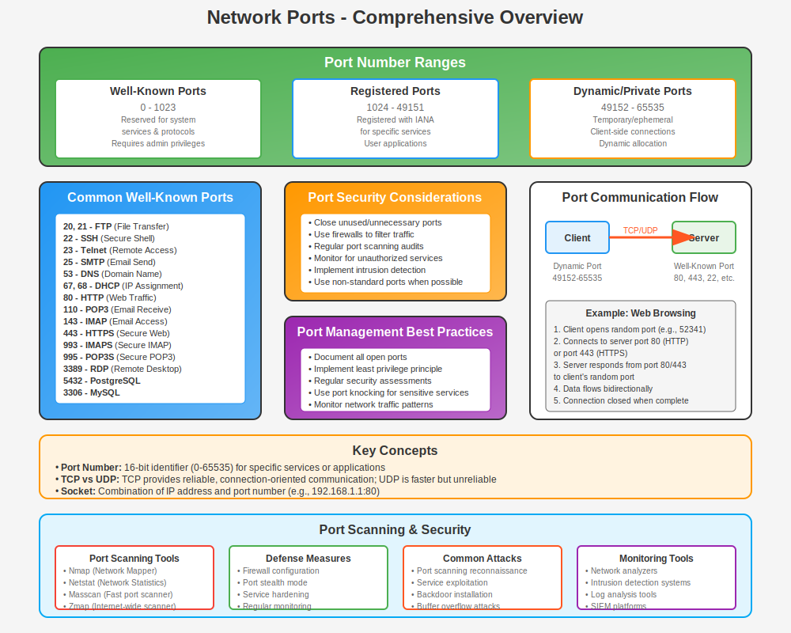

Network ports are essential elements in networking that facilitate communication between devices and services over a network. Understanding their importance, types, and common examples is crucial for managing and securing network traffic effectively.

#### Importance of Network Ports

- **Communication Channels**: Ports enable different applications and services to communicate with each other over a network, facilitating data exchange and resource sharing.

- **Network Security**: Proper management of ports is essential for controlling access to services, mitigating security risks, and ensuring network integrity.

#### Types of Network Ports

1. **Well-Known Ports**: Ports numbered from 0 to 1023 are reserved for well-known services. Examples include:
   - **Port 80 (HTTP)**: Used for unencrypted web traffic.
   - **Port 443 (HTTPS)**: Used for encrypted web traffic (TLS/SSL).

2. **Registered Ports**: Ports numbered from 1024 to 49151 are registered with IANA (Internet Assigned Numbers Authority) for specific services.

3. **Dynamic/Private Ports**: Ports numbered from 49152 to 65535 are used for dynamic or private communication between client and server applications.

#### Example Ports

- **Port 80 (HTTP)**: Standard port for Hypertext Transfer Protocol (HTTP) traffic, used for accessing web pages without encryption.

- **Port 443 (HTTPS)**: Standard port for HTTP traffic encrypted with Transport Layer Security (TLS) or Secure Sockets Layer (SSL), ensuring secure communication over the internet.

- **Port 22 (SSH)**: Used for secure remote access and management of devices or servers using the Secure Shell (SSH) protocol.

- **Port 25 (SMTP)**: Used for sending email messages between servers using the Simple Mail Transfer Protocol (SMTP).

#### Secure Configuration and Management

- **Firewall Rules**: Configure firewall rules to allow or block traffic based on specific ports to enhance network security.

- **Port Scanning**: Regularly scan network ports to detect unauthorized services or potential vulnerabilities that could be exploited by attackers.

Understanding the role and management of network ports is essential for network administrators and cybersecurity professionals to ensure efficient and secure communication across networks while mitigating potential security risks.

### HTTPS

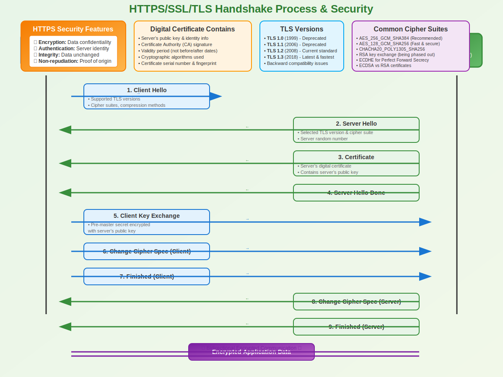

HTTPS (HyperText Transfer Protocol Secure) is a secure extension of HTTP, the protocol used for transferring data between a web browser and a web server over the internet. HTTPS encrypts the data exchanged between the client (e.g., web browser) and the server (e.g., web server), ensuring confidentiality and integrity of information transmitted. Here’s a detailed explanation of HTTPS:

#### Purpose and Functionality

- **Encryption**: HTTPS uses SSL/TLS protocols to encrypt data transmitted between the client and server. This encryption prevents unauthorized parties from intercepting and reading sensitive information, such as login credentials, credit card numbers, and personal data.

- **Data Integrity**: HTTPS ensures that data remains intact and unaltered during transmission. It uses cryptographic hash functions and digital signatures to verify the integrity of data exchanged between parties.

- **Authentication**: HTTPS authenticates the identity of websites using digital certificates issued by Certificate Authorities (CAs). These certificates contain public keys that clients use to establish a secure connection and verify the authenticity of the server.

#### HTTPS Implementation

1. **SSL/TLS Handshake**: 
   - **Client Hello**: The client initiates the connection by sending a "Client Hello" message to the server, indicating supported SSL/TLS versions and cipher suites.
   - **Server Hello**: The server responds with a "Server Hello" message, selecting the highest SSL/TLS version and cipher suite supported by both parties.
   - **Certificate Exchange**: The server sends its digital certificate to the client, which includes its public key and is used for authentication.
   - **Session Key Exchange**: Both client and server agree on session keys used for symmetric encryption of data transmitted during the HTTPS session.

2. **Data Transmission**: 
   - Once the SSL/TLS handshake is complete and a secure connection is established, data exchanged between the client and server is encrypted using symmetric encryption (e.g., AES).

3. **Certificate Validation**: 
   - The client verifies the server's digital certificate against a list of trusted Certificate Authorities (CAs) installed in the client's web browser or operating system.
   - If the certificate is valid, issued by a trusted CA, and matches the domain name of the website, HTTPS is established.

#### Benefits of HTTPS

- **Security**: Protects sensitive data from interception and eavesdropping, ensuring confidentiality.
- **Trust**: Verifies the identity of websites, preventing phishing and man-in-the-middle attacks.
- **SEO**: Google and other search engines prioritize HTTPS websites in search rankings, encouraging adoption for better visibility.

#### HTTPS and Website Security

- **Implementation**: Website owners obtain SSL/TLS certificates from trusted CAs and configure their web servers to use HTTPS.
- **Browser Indicators**: Web browsers indicate secure HTTPS connections with a padlock icon and "https://" prefix in the URL bar, reassuring users of a secure connection.

#### Memorization Hints and Keys to Remember

- **Encryption**: HTTPS ensures **confidentiality** through encryption.
- **Authentication**: It provides **authentication** of websites using digital certificates.
- **Data Integrity**: HTTPS guarantees **data integrity** to prevent tampering.

Understanding HTTPS is crucial for ensuring secure communication and protecting user privacy on the internet. It has become the standard for transmitting sensitive information securely across websites, enhancing trust and security in online interactions.

### SSL (Secure Sockets Layer)

SSL (Secure Sockets Layer) is a cryptographic protocol designed to secure communication over a computer network. It provides encryption, data integrity, and authentication, making it a foundational technology for ensuring secure transmission of sensitive information over the internet. Here’s a detailed explanation of SSL:

### Cyber Laws and Legal Framework

Cyber laws are legal frameworks that deal with issues related to the internet, computers, software, and information systems. They are designed to protect users and organizations from cyber crimes and to ensure proper conduct in the digital space. In many countries, these laws are codified into specific sections. Here, we discuss the provisions under Article Section 65 and Section 66, often referencing the Information Technology Act, 2000 (India).


**Section 65: Tampering with Computer Source Documents**

### Digital Certificates

Digital certificates are electronic documents used to verify the identity of individuals, organizations, or devices in online transactions and communications. They play a crucial role in establishing trust, enabling secure communication, and ensuring authenticity across digital environments. Here's a detailed explanation of digital certificates:

### Digital Signatures

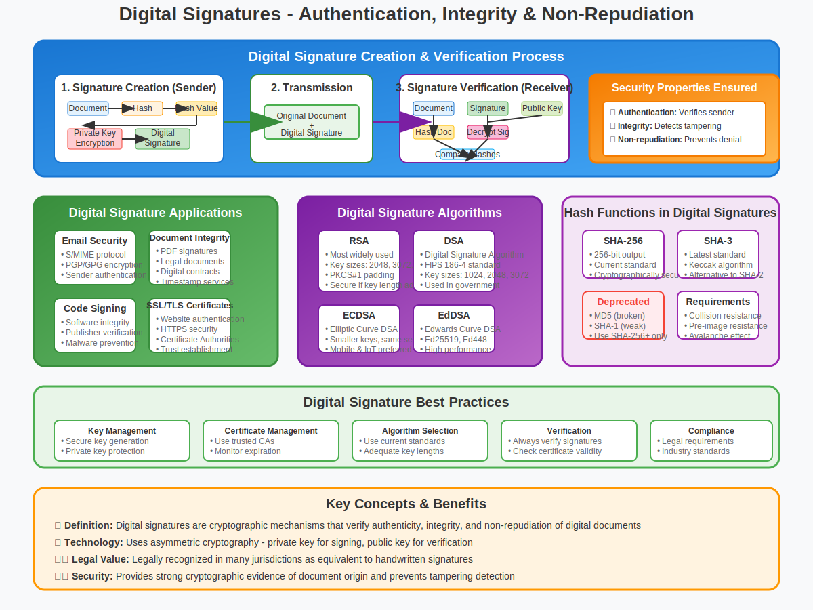

Digital signatures are cryptographic mechanisms used to ensure the authenticity, integrity, and non-repudiation of digital messages, documents, or transactions.

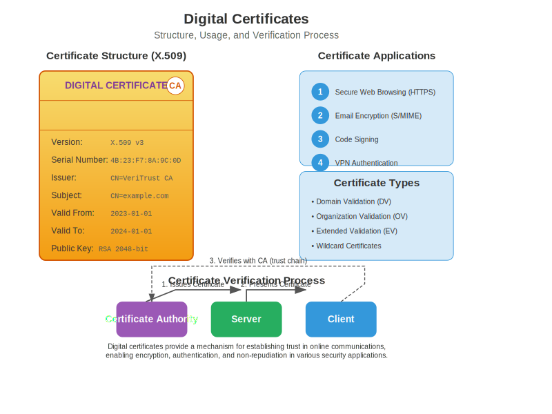

#### Definition and Purpose

#### Development and Evolution

- **Origins**: Developed by Netscape in the mid-1990s to secure HTTP connections (HTTPS) between web browsers and servers.
  
- **Versions**: SSL has several versions, including SSL 2.0, SSL 3.0, and TLS (which is considered the successor to SSL).

#### Key Features

1. **Encryption**: SSL uses cryptographic algorithms to encrypt data transmitted between clients (e.g., web browsers) and servers (e.g., web servers). This prevents unauthorized parties from intercepting and reading sensitive information, such as login credentials or financial data.

2. **Data Integrity**: SSL ensures that data remains intact and unaltered during transmission. It uses message integrity checks (e.g., HMAC) to detect any tampering or modification of data packets in transit.

3. **Authentication**: SSL enables mutual authentication between clients and servers. This process verifies the identities of both parties involved in the communication, ensuring that users are connecting to legitimate servers and not imposters.

#### SSL Handshake Process

- **Client Hello**: The client initiates the SSL handshake by sending a "Client Hello" message to the server, indicating supported SSL/TLS versions and cipher suites.

- **Server Hello**: The server responds with a "Server Hello" message, selecting the highest SSL/TLS version and cipher suite supported by both parties.

- **Key Exchange**: The server sends its public key to the client, which is used for key exchange using asymmetric encryption (e.g., RSA). This ensures secure communication channels for symmetric encryption.

- **Session Keys**: Both client and server generate session keys used for symmetric encryption (e.g., AES) of data transmitted during the SSL session.

- **Authentication**: Optionally, SSL can involve server authentication, where the server presents its digital certificate issued by a trusted Certificate Authority (CA). This certificate includes the server's public key and is used to verify the server's identity.

#### SSL Vulnerabilities and Limitations

- **Security Issues**: Over time, vulnerabilities have been discovered in SSL implementations, such as POODLE (Padding Oracle On Downgraded Legacy Encryption) and BEAST (Browser Exploit Against SSL/TLS). These vulnerabilities led to the deprecation of older SSL versions in favor of more secure TLS protocols.

#### Transition to TLS

- **Successor**: TLS (Transport Layer Security) is the successor to SSL and includes significant improvements in security, performance, and cryptographic algorithms. TLS protocols (e.g., TLS 1.2, TLS 1.3) are widely used today to secure internet communication.

#### Applications of SSL

- **HTTPS**: SSL is commonly used to secure HTTP connections, resulting in HTTPS (HTTP Secure), which encrypts web traffic between clients and servers. This is essential for protecting sensitive data transmitted during online transactions, login sessions, and browsing activities.

#### Conclusion

SSL revolutionized internet security by introducing encryption, data integrity, and authentication mechanisms to protect sensitive information transmitted over networks. While newer TLS protocols have largely replaced SSL due to security enhancements, understanding SSL remains crucial for comprehending the evolution and principles of secure communication protocols on the internet.

### TLS (Transport Layer Security)

TLS (Transport Layer Security) is a cryptographic protocol designed to provide secure communication over a computer network. It evolved from and effectively replaced the older SSL (Secure Sockets Layer) protocol. TLS ensures data confidentiality, integrity, and authentication between clients (e.g., web browsers) and servers (e.g., web servers) or between servers in various applications and services. Here’s a detailed explanation of TLS:

### Virtual Private Networks (VPNs)

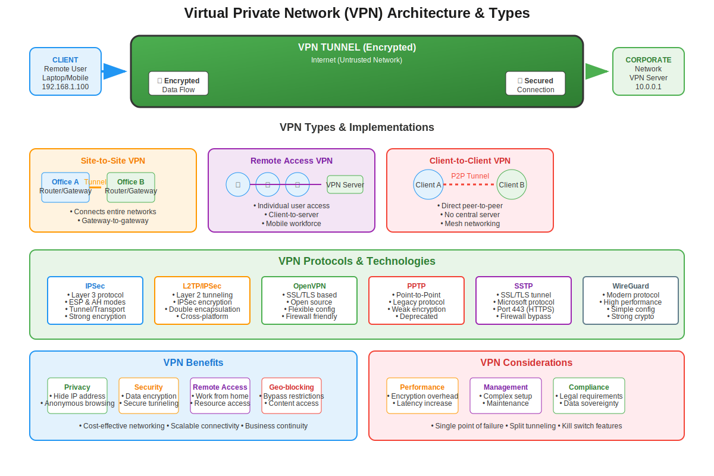

#### Overview

### SSH (Secure Shell)

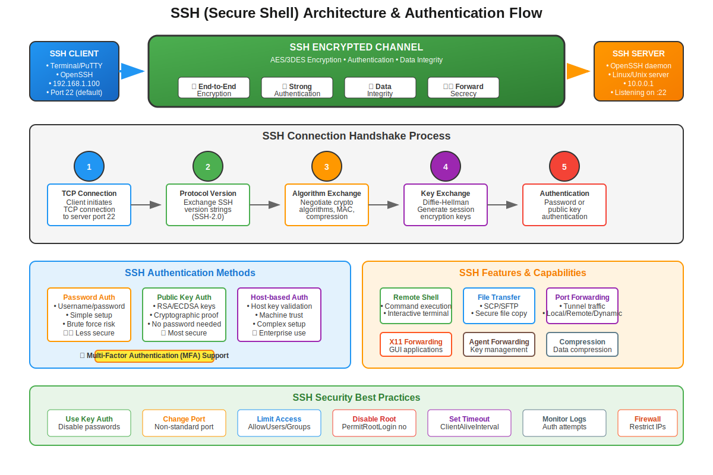

SSH (Secure Shell) is a cryptographic network protocol used for secure remote login, command execution, and data communication over unsecured networks. It provides strong encryption and authentication mechanisms to protect sensitive information transmitted between clients (e.g., computers) and servers (e.g., remote hosts). Here's a detailed explanation of SSH:

#### Development and Evolution

- **Successor to SSL**: TLS was developed as an upgrade to SSL, addressing security vulnerabilities and improving cryptographic algorithms and protocols.

- **Versions**: TLS has several versions, including TLS 1.0, TLS 1.1, TLS 1.2, and the latest version TLS 1.3, each offering advancements in security and performance.

#### Key Features

1. **Encryption**: TLS uses strong cryptographic algorithms (e.g., AES, ChaCha20) to encrypt data transmitted over the network. This prevents unauthorized parties from intercepting and reading sensitive information, such as passwords, credit card numbers, or personal data.

2. **Data Integrity**: TLS ensures that data remains intact and unaltered during transmission. It uses message integrity checks (e.g., HMAC) to detect any tampering or modification of data packets in transit.

3. **Authentication**: TLS supports mutual authentication between clients and servers. This process verifies the identities of both parties involved in the communication, ensuring that users are connecting to legitimate servers and not imposters.

#### TLS Handshake Process

The TLS handshake process establishes a secure connection between the client and server:

- **Client Hello**: The client initiates the TLS handshake by sending a "Client Hello" message to the server, indicating supported TLS versions and cipher suites.

- **Server Hello**: The server responds with a "Server Hello" message, selecting the highest TLS version and cipher suite supported by both parties.

- **Key Exchange**: The server sends its digital certificate to the client, containing its public key used for key exchange. The client verifies the server's certificate against a list of trusted Certificate Authorities (CAs).

- **Session Keys**: Both client and server generate session keys used for symmetric encryption (e.g., AES) of data transmitted during the TLS session. Perfect Forward Secrecy (PFS) ensures that session keys are unique and not reused, enhancing security.

- **Encryption**: Once the handshake is complete, TLS encrypts data exchanged between client and server using symmetric encryption, ensuring confidentiality.

#### TLS Versions and Security Improvements

- **TLS 1.2**: Introduced in 2008, TLS 1.2 enhanced security by supporting stronger cryptographic algorithms and mitigating known vulnerabilities from earlier versions.

- **TLS 1.3**: Released in 2018, TLS 1.3 further improves security and performance by reducing handshake latency, eliminating obsolete cryptographic algorithms, and enhancing resistance to attacks such as downgrade attacks and timing attacks.

#### Applications of TLS

- **HTTPS**: TLS is commonly used to secure HTTP connections, resulting in HTTPS (HTTP Secure). This is crucial for protecting sensitive data transmitted during online transactions, login sessions, and browsing activities.

- **Email Security**: TLS is also used in email protocols (e.g., SMTP, IMAP) to encrypt messages in transit between mail servers, ensuring confidentiality and preventing eavesdropping.

#### Conclusion

TLS plays a critical role in securing internet communication by providing encryption, data integrity, and authentication mechanisms. As the successor to SSL, TLS protocols (particularly TLS 1.2 and TLS 1.3) are widely implemented to protect sensitive information and ensure secure interactions between users and online services. Understanding TLS is essential for deploying secure communication practices and safeguarding data privacy in today's digital world.

### Digital Signatures

Digital signatures are cryptographic mechanisms used to ensure the authenticity, integrity, and non-repudiation of digital messages, documents, or transactions. They play a crucial role in verifying the identity of the sender and detecting any unauthorized changes to the signed content. Here’s a detailed explanation of digital signatures:

#### Overview

- **Authentication**: Digital signatures authenticate the identity of the sender and verify that the message or document has not been altered since it was signed.

- **Integrity**: They ensure data integrity by detecting any tampering or modifications to the signed content. Even minor alterations invalidate the signature.

- **Non-Repudiation**: Digital signatures provide evidence that the sender cannot deny sending the message, thereby preventing disputes in legal and contractual contexts.

#### How Digital Signatures Work

1. **Key Pair Generation**: The sender generates a key pair consisting of a private key and a public key using asymmetric encryption algorithms such as RSA or DSA.

   - **Private Key**: Kept confidential by the sender and used to create digital signatures.
   - **Public Key**: Shared openly and used by recipients to verify digital signatures.

2. **Signing**: To sign a message or document:
   
   - The sender computes a cryptographic hash (digest) of the content using a hash function (e.g., SHA-256).
   - The sender encrypts the hash value with their private key to create the digital signature.

3. **Verification**: Recipients verify the digital signature using the sender's public key:

   - Recipients decrypt the digital signature with the sender's public key to obtain the hash value.
   - Recipients compute a new hash of the received message or document using the same hash function.
   - If the computed hash matches the decrypted hash from the signature, the signature is valid, confirming that the content is authentic and unchanged since it was signed.

#### Applications of Digital Signatures

- **Email Security**: Used in email protocols (e.g., S/MIME) to authenticate the sender, ensuring message integrity and protecting against spoofing and phishing attacks.

- **Document Integrity**: Applied to electronic documents (e.g., PDFs) to verify the author and ensure that the document has not been altered since it was signed.

- **SSL/TLS Certificates**: Used in SSL/TLS certificates issued by Certificate Authorities (CAs) to authenticate websites and servers. They ensure secure communication over HTTPS by verifying the server's identity and encrypting data transmitted between clients and servers.

#### Benefits and Challenges

- **Benefits**: Provide strong security assurances, facilitate secure online transactions, and support legal and regulatory compliance by ensuring document authenticity.

- **Challenges**: Require secure key management practices to protect private keys from unauthorized access. Additionally, certificate revocation mechanisms (e.g., CRLs, OCSP) are necessary to revoke compromised certificates promptly.

#### Memorization Hints and Keys to Remember

- **Role**: Digital signatures ensure **authentication**, **integrity**, and **non-repudiation** in digital communications.
  
- **Process**: Involves **key pair generation**, **signing** with a private key, and **verification** using a public key.
  
- **Applications**: Used in **email security**, **document integrity**, and **SSL/TLS certificates** for secure communication.

Understanding digital signatures is fundamental for implementing secure communication practices, protecting sensitive information, and ensuring trust in digital interactions and transactions across various applications and industries.

### Digital Certificates

Digital certificates are electronic documents used to verify the identity of individuals, organizations, or devices in online transactions and communications. They play a crucial role in establishing trust, enabling secure communication, and ensuring authenticity across digital environments. Here’s a detailed explanation of digital certificates:

#### Overview

- **Purpose**: Digital certificates serve as digital credentials that authenticate the identity of entities (e.g., websites, servers, individuals) and enable secure communication over the internet.

- **Issuance**: Certificates are issued by Certificate Authorities (CAs), trusted third-party entities responsible for verifying the identity and legitimacy of certificate applicants.

- **Contents**: A digital certificate typically includes:

  - **Public Key**: A cryptographic key pair generated by the certificate holder, used for encryption and digital signatures.
  
  - **Identity Information**: Information about the certificate holder (e.g., domain name, organization name, email address).
  
  - **Issuer Information**: Details about the CA that issued the certificate, including its digital signature to verify the certificate's authenticity.
  
  - **Validity Period**: The period during which the certificate is considered valid before it expires and needs renewal.
  
  - **Certificate Revocation Information**: Mechanisms (e.g., Certificate Revocation Lists (CRLs), Online Certificate Status Protocol (OCSP)) to check if the certificate has been revoked before its expiration date.

#### Functionality

1. **Authentication**: Digital certificates authenticate the identity of entities in online transactions. When a client (e.g., web browser) connects to a server (e.g., web server), the server presents its digital certificate to prove its identity.

2. **Encryption**: Certificates facilitate secure communication by encrypting data transmitted between parties using the public key included in the certificate. This ensures confidentiality and prevents unauthorized access to sensitive information.

3. **Integrity**: Certificates ensure data integrity by verifying that the transmitted data has not been altered during transmission. This is achieved through digital signatures applied to data using the sender's private key.

#### Certificate Chain of Trust

- **Root CA**: At the top of the hierarchy are trusted Root Certificate Authorities (Root CAs) whose public keys are pre-installed in client devices (e.g., web browsers). These Root CAs issue Intermediate CA certificates.

- **Intermediate CA**: Intermediate CAs are authorized by Root CAs to issue certificates to end entities (e.g., websites, servers).

- **End Entity Certificates**: Also known as leaf certificates, these are issued to specific entities (e.g., websites) and are presented to clients during secure communications.

#### Applications of Digital Certificates

- **SSL/TLS Certificates**: Used to secure HTTPS connections between web browsers and servers, ensuring encrypted data transmission and authenticating websites.

- **Email Security**: Certificates are used in email protocols (e.g., S/MIME) to digitally sign and encrypt email messages, verifying sender identities and protecting message integrity.

- **Code Signing Certificates**: Ensures the integrity and authenticity of software applications and updates by digitally signing executable code.

#### Secure Configuration and Management

- **Certificate Authorities (CAs)**: Ensure certificates are issued by trusted CAs to establish trustworthiness and prevent malicious activities.

- **Certificate Revocation**: Monitor CRLs and OCSP responses to promptly revoke compromised certificates and prevent unauthorized access.

- **Key Management**: Safeguard private keys associated with certificates to prevent unauthorized access and maintain confidentiality.

#### Memorization Hints and Keys to Remember

- **Purpose**: Digital certificates authenticate identities and facilitate secure communication.
  
- **Components**: Include **public key**, **identity information**, **issuer information**, **validity period**, and **revocation information**.
  
- **Hierarchy**: Root CA > Intermediate CA > End Entity Certificates establish a **chain of trust**.

Understanding digital certificates is essential for establishing secure communication channels, verifying identities, and ensuring data confidentiality and integrity in various digital interactions and transactions. They are fundamental in building trust and security across the internet and digital ecosystems.

### SSH (Secure Shell)

SSH (Secure Shell) is a cryptographic network protocol used for secure remote login, command execution, and data communication over unsecured networks. It provides strong encryption and authentication mechanisms to protect sensitive information transmitted between clients (e.g., computers) and servers (e.g., remote hosts). Here’s a detailed explanation of SSH:

#### Purpose and Functionality

- **Secure Remote Access**: SSH enables users to securely access and manage remote systems over an unsecured network, such as the internet. It replaces insecure protocols like Telnet with encrypted communication.

- **Encryption**: SSH uses strong cryptographic algorithms (e.g., AES, 3DES) to encrypt data exchanged between the client and server. This prevents eavesdropping and ensures confidentiality of sensitive information, including passwords and commands.

- **Authentication**: SSH supports various authentication methods, including password-based authentication, public key authentication, and multi-factor authentication (e.g., using passwords and SSH keys). Public key authentication is commonly used for its robust security.

#### SSH Components

1. **SSH Client**: Initiates secure connections to SSH servers, typically using SSH client software (e.g., OpenSSH, PuTTY).

2. **SSH Server**: Hosts services accessible via SSH, allowing remote users to log in securely and execute commands on the server.

3. **SSH Protocol**: Defines the rules and procedures for establishing and maintaining secure communications between the client and server.

#### SSH Key Authentication

- **Public Key Cryptography**: 
  - Users generate a key pair consisting of a public key (stored on the server) and a private key (stored securely on the client).
  - During SSH authentication, the client encrypts a challenge message with its private key and sends it to the server.
  - The server decrypts the message using the stored public key. If successful, the server grants access to the client.

- **Advantages**: Public key authentication eliminates the need to transmit passwords over the network, reducing the risk of password-based attacks (e.g., brute-force attacks).

#### SSH Sessions

- **Interactive Sessions**: Users can interact with remote systems through a command-line interface (CLI) or graphical user interface (GUI) using SSH.

- **Secure File Transfer**: SSH includes utilities like SCP (Secure Copy) and SFTP (Secure File Transfer Protocol) for secure file transfers between systems.

#### Security Best Practices

- **Use Strong Passwords**: If using password-based authentication, use strong, unique passwords to protect SSH access.
  
- **SSH Keys**: Prefer public key authentication for enhanced security. Store private keys securely and protect them with passphrases.
  
- **Disable Root Login**: Restrict direct root access via SSH to minimize security risks.

#### SSH and Tunneling

- **Port Forwarding**: SSH can create secure tunnels (SSH tunneling) to forward network traffic between local and remote hosts securely.

#### Memorization Hints and Keys to Remember

- **Purpose**: SSH provides **secure remote access** and **encrypted communication** between clients and servers.
  
- **Components**: Include **SSH client**, **SSH server**, and **SSH protocol**.
  
- **Authentication**: Supports **password-based** and **public key authentication** methods.

Understanding SSH is essential for securely managing remote systems, executing commands, and transferring files over networks, ensuring confidentiality, integrity, and authentication in remote access scenarios.

### Wireless Access Point (WAP)

#### Purpose and Functionality

- **Connectivity**: A WAP enables wireless devices (such as laptops, smartphones, and tablets) to connect to a wired network infrastructure (like Ethernet) using Wi-Fi technology. It acts as a bridge between wireless devices and the wired network.

- **Transmission**: WAPs transmit and receive wireless signals to and from wireless clients, providing access to network resources and the internet.

- **Network Expansion**: WAPs are used to expand network coverage in environments where wired connections are impractical or unavailable, such as offices, homes, schools, and public spaces.

#### Components and Features

1. **Radio Transceiver**: The core component of a WAP that sends and receives wireless signals.

2. **Ethernet Port**: Allows the WAP to connect to the wired network infrastructure.

3. **SSID (Service Set Identifier)**: A unique identifier for the wireless network broadcast by the WAP, which wireless devices use to connect.

4. **Security Features**: WAPs support various security protocols (e.g., WPA2-PSK, WPA3, 802.1X) to protect wireless communications from unauthorized access and attacks.

#### WAP Deployment Scenarios

- **Home Networks**: WAPs are used to provide Wi-Fi connectivity within homes, allowing multiple devices to connect to the internet wirelessly.

- **Enterprise Networks**: In large organizations, multiple WAPs are deployed strategically to provide seamless wireless coverage across offices, meeting rooms, and common areas.

- **Public Wi-Fi**: WAPs are installed in public places such as cafes, airports, and hotels to offer internet access to customers and guests.

#### Security Considerations

- **Encryption**: WAPs encrypt data transmitted over Wi-Fi networks to protect it from interception. Strong encryption protocols like AES (Advanced Encryption Standard) are commonly used.

- **Authentication**: WAPs enforce authentication mechanisms (e.g., passwords, digital certificates) to verify the identity of devices and users before allowing network access.

- **Access Control**: WAPs implement access control policies to restrict network access based on user roles, device types, or specific criteria.

#### Management and Configuration

- **Configuration Interface**: WAPs are typically configured through a web-based interface or management software provided by the manufacturer.

- **Firmware Updates**: Regular firmware updates are essential to patch security vulnerabilities and improve performance.

#### Memorization Hints and Keys to Remember

- **Function**: WAPs enable wireless devices to connect to a wired network using Wi-Fi.
  
- **Components**: Include **radio transceiver**, **Ethernet port**, and **SSID** for network identification.
  
- **Security**: WAPs use encryption, authentication, and access control to secure wireless communications.

Understanding WAPs is crucial for deploying secure and reliable wireless networks, ensuring connectivity while safeguarding against unauthorized access and potential security threats.

### Virtual Private Networks (VPNs)

#### Overview

- **Definition**: VPNs are secure networks that establish encrypted connections over a public network (typically the internet), allowing remote users to access private network resources securely.

- **Purpose**: VPNs provide privacy and security by encrypting data transmitted between a user's device (client) and a VPN server. This ensures confidentiality and prevents unauthorized access to sensitive information.

- **Applications**: Used by businesses to enable remote access to corporate networks, bypass geo-restrictions for accessing content, and enhance online privacy for individual users.

#### Components of VPNs

1. **Encryption Protocols**: VPNs use various encryption protocols (e.g., IPSec, OpenVPN, SSL/TLS) to secure data transmitted over the VPN tunnel.

2. **VPN Clients**: Software or apps installed on user devices to initiate and maintain VPN connections with VPN servers.

3. **VPN Servers**: Servers hosted by VPN providers that handle incoming VPN connections and facilitate secure communication between clients and private networks.

4. **Tunneling**: VPNs use tunneling protocols (e.g., PPTP, L2TP/IPSec, IKEv2) to encapsulate and encrypt data packets before transmission over the internet.

#### Types of VPNs

- **Remote Access VPNs**: Allow individual users to connect securely to a corporate network from remote locations using VPN clients.

- **Site-to-Site VPNs**: Establish secure connections between different physical locations (e.g., branch offices) of an organization, linking their local networks over the internet.

- **VPN Services**: Offered by VPN providers as subscription-based services for personal privacy and security online.

#### Benefits of VPNs

- **Privacy**: Encrypts internet traffic to prevent ISPs, hackers, or governments from intercepting and monitoring online activities.

- **Security**: Protects data transmitted over public networks, ensuring confidentiality and integrity.

- **Access Control**: Grants remote users secure access to internal network resources while maintaining network security policies.

#### VPN Security Considerations

- **Encryption Strength**: Choose VPN protocols with strong encryption standards (e.g., AES-256) to protect data confidentiality.

- **Authentication**: Implement robust authentication mechanisms (e.g., passwords, certificates) to verify user identities and prevent unauthorized access.

- **Logging Policies**: Select VPN providers with strict no-logs policies to ensure user privacy and data protection.

#### Memorization Hints and Keys to Remember

- **Purpose**: VPNs establish secure, encrypted connections over public networks.
  
- **Components**: Include **encryption protocols**, **VPN clients**, **VPN servers**, and **tunneling protocols**.
  
- **Types**: Remote Access VPNs, Site-to-Site VPNs, and VPN Services cater to different connectivity needs.

Understanding VPNs is essential for safeguarding sensitive information, ensuring secure remote access, and maintaining privacy while accessing the internet from various locations worldwide.

## Ethical Hacking

In the realm of cybersecurity, the concept of ethical hacking stands as a powerful tool in the defense against malicious cyber threats. Ethical hackers, also known as white-hat hackers, employ their skills to identify vulnerabilities and weaknesses within systems before malicious actors can exploit them. This unit delves into the principles, methodologies, and terminology essential to ethical hacking, offering insights into the proactive strategies used to fortify digital infrastructures. Through an exploration of hacking techniques, tools, and ethical guidelines, this unit aims to equip learners with the knowledge and skills needed to uphold security in an increasingly interconnected digital landscape.

### Hacking Basics

Hacking, in its essence, is the process of exploiting vulnerabilities in computer systems, networks, or software applications to gain unauthorized access or control over them. It can be categorized into various types based on the intent and legality of the activities involved, and it is crucial to distinguish between ethical and unethical hacking practices.

#### Definition

- **Hacking**: It refers to the act of identifying weaknesses in computer systems or networks and exploiting them to gain unauthorized access, modify data, or disrupt operations. Hackers may use a variety of techniques and tools to achieve their objectives, which can range from benign exploration to malicious intent.

#### Hacking Terminology

Here's an overview of essential hacking terminology:

- **Vulnerability**: A weakness or flaw in a system's design, implementation, or operation that could be exploited to violate system security policies.

- **Exploit**: A piece of software, a sequence of commands, or a technique used to take advantage of a vulnerability in a system or application to compromise its security.

- **0-Day (Zero-Day)**: A vulnerability that is unknown to the software vendor or the public. Zero-day exploits target vulnerabilities that have not yet been patched or mitigated.

- **Payload**: The malicious code or instructions delivered by an exploit to achieve a specific outcome, such as gaining unauthorized access or causing system damage.

- **Buffer Overflow**: A type of vulnerability where a program writes data beyond the allocated buffer, potentially overwriting adjacent memory areas and causing the program to crash or execute arbitrary code.

- **Rootkit**: Malicious software designed to gain administrator-level access to a computer system and hide its presence or the presence of other malicious software.

- **Trojan (Trojan Horse)**: A type of malware disguised as legitimate software, often used to gain unauthorized access to a computer system or to steal data.

- **Keylogger**: A type of software or hardware device that records keystrokes entered by a user, often used to capture sensitive information such as passwords and credit card numbers.

- **Phishing**: A social engineering technique where attackers attempt to trick individuals into divulging sensitive information, such as login credentials or financial information, by masquerading as a trustworthy entity.

- **Social Engineering**: Manipulating individuals to divulge confidential information or perform actions that compromise security, often exploiting human psychology rather than technical vulnerabilities.

- **Backdoor**: A hidden method or vulnerability intentionally inserted into a system or application by its developer, allowing unauthorized access to the system.

- **Brute Force Attack**: An automated technique for guessing passwords or encryption keys by systematically trying all possible combinations until the correct one is found.

### Types of Hacking

#### White Hat Hacking

- **Definition**: Ethical hacking performed by security professionals.
- **Purpose**: To identify and fix vulnerabilities, thereby improving security and protecting systems.
- **Techniques Used**: Penetration testing, vulnerability scanning.
- **Ethical Considerations**: Legal and authorized, conducted with the consent of the system owner.

#### Black Hat Hacking

- **Definition**: Unauthorized hacking with malicious intent.
- **Purpose**: Personal gain, data theft, and system disruption.
- **Techniques Used**: Malware deployment, phishing, Distributed Denial of Service (DDoS) attacks.
- **Ethical Considerations**: Illegal and unethical, conducted without permission.

#### Grey Hat Hacking

- **Definition**: Hacking without authorization but without malicious intent.
- **Purpose**: To expose vulnerabilities, sometimes for fame or to alert system owners.
- **Techniques Used**: Exploits, unauthorized access.
- **Ethical Considerations**: Falls into a legal gray area, can be considered ethical or unethical depending on the context.

#### Script Kiddies

- **Definition**: Inexperienced hackers using pre-written scripts or tools.
- **Purpose**: Often for thrills or notoriety.
- **Techniques Used**: Basic exploits, use of ready-made hacking tools.
- **Ethical Considerations**: Typically illegal and often disruptive, lack of deep understanding of hacking techniques.

#### Hacktivists

- **Definition**: Hackers promoting political or social causes through hacking.
- **Purpose**: Political activism, social justice.
- **Techniques Used**: DDoS attacks, website defacement, data leaks.
- **Ethical Considerations**: Can be legal or illegal, ethical debate depending on the cause and methods used.

#### State-Sponsored Hacking

- **Definition**: Hacking conducted by government agencies.
- **Purpose**: National security, espionage.
- **Techniques Used**: Advanced persistent threats (APTs), zero-day exploits.
- **Ethical Considerations**: Legal within the sponsoring state, often illegal internationally.

#### Cyber Terrorists

- **Definition**: Hackers aiming to cause fear or disruption for political or ideological reasons.
- **Purpose**: Terrorism, disruption of critical infrastructure.
- **Techniques Used**: Cyberattacks on critical infrastructure.
- **Ethical Considerations**: Highly illegal and unethical, aims to cause widespread harm.

#### Insider Threats

- **Definition**: Hacking or misuse of systems by individuals within an organization.
- **Purpose**: Sabotage, theft, data breaches.
- **Techniques Used**: Misuse of access privileges, data theft.
- **Ethical Considerations**: Illegal and unethical, abuse of trusted access within an organization.

#### Ethical vs Unethical Hacking

| **Aspect**                   | **Ethical Hacking**                                                                 | **Unethical Hacking**                                                               |
|------------------------------|------------------------------------------------------------------------------------|-------------------------------------------------------------------------------------|
| **Definition**               | Conducted with permission to improve system security by identifying vulnerabilities. | Unauthorized access to systems for personal gain or malicious intent.                |
| **Intent**                   | Enhance cybersecurity defenses, protect systems, and prevent malicious attacks.     | Exploit vulnerabilities, steal data, disrupt operations, or cause harm.             |
| **Authorization**            | Conducted with explicit permission from system owners or stakeholders.              | Done without permission or legal authority, often violating laws and policies.      |
| **Ethical Guidelines**       | Follows ethical guidelines, respects privacy, and discloses vulnerabilities responsibly. | Ignores ethical guidelines, violates privacy, and causes potential harm to systems and data. |
| **Purpose**                  | Improve security posture, identify weaknesses, and recommend fixes.                 | Financial gain, personal motives, sabotage, or malicious intent.                     |
| **Legal Standing**           | Legal when performed with permission and within agreed-upon boundaries.             | Illegal, punishable by law due to unauthorized access and potential damage caused.   |
| **Examples**                 | Penetration testing, security audits, responsible disclosure of vulnerabilities.    | Malware distribution, data breaches, hacking for financial theft or sabotage.        |

**Key Points:**

- **Definition**: Ethical hacking aims to improve security through authorized testing and vulnerability disclosure, while unethical hacking involves unauthorized access and malicious activities.
- **Authorization**: Ethical hackers operate with explicit consent, whereas unethical hackers bypass legal and ethical boundaries.
- **Purpose**: Ethical hacking supports cybersecurity efforts, whereas unethical hacking undermines security and privacy.
- **Legal Standing**: Ethical hacking is legal under controlled conditions, while unethical hacking is illegal and subject to legal consequences.
- **Examples**: Ethical hacking includes professional penetration testing and responsible vulnerability reporting, while unethical hacking encompasses criminal activities like data breaches and cyber attacks.

### Ethical Hacking Fundamentals

Ethical hacking, also known as penetration testing or white-hat hacking, involves authorized attempts to bypass system security to identify vulnerabilities that could be exploited by malicious hackers. Here are the fundamental principles and methodologies of ethical hacking:

#### Principles

1. **Authorized Access**: Ethical hackers operate with explicit permission from the system owner or responsible parties to perform security assessments.

2. **Consent and Scope**: Testing is conducted within agreed-upon boundaries, including scope, targets, and methodologies, to avoid unintended disruptions.

3. **Legal Compliance**: Activities adhere to local and international laws and regulations governing cybersecurity and data protection.

4. **Ethical Guidelines**: Ethical hackers adhere to ethical guidelines, including respect for privacy, confidentiality, and responsible disclosure of vulnerabilities.

5. **Objective-Driven**: The primary goal is to improve security by identifying and mitigating vulnerabilities before they can be exploited maliciously.

#### Methodologies

1. **Reconnaissance**: Gathering information about the target system, including network architecture, software versions, and potential vulnerabilities.

2. **Scanning**: Using automated tools to scan for open ports, services, and vulnerabilities on target systems identified during reconnaissance.

3. **Enumeration**: Actively identifying and documenting specific information about the target system, such as user accounts, system configurations, and network resources.

4. **Vulnerability Assessment**: Systematically identifying and evaluating weaknesses in the target system, including known vulnerabilities and misconfigurations.

5. **Exploitation**: Attempting to exploit identified vulnerabilities to demonstrate their potential impact and provide actionable recommendations for mitigation.

6. **Post-Exploitation**: Assessing the extent of damage or access that could be achieved through successful exploitation and recommending measures to prevent future incidents.

7. **Reporting**: Documenting findings, including vulnerabilities discovered, their potential impact, and recommendations for remediation, in a clear and concise manner.

#### Tools and Techniques

- **Penetration Testing Tools**: Examples include Nmap for network scanning, Metasploit for exploitation, Burp Suite for web application testing, and Wireshark for network traffic analysis.

- **Ethical Hacking Frameworks**: Utilizing frameworks like OWASP (Open Web Application Security Project) for web application security and OSSTMM (Open Source Security Testing Methodology Manual) for comprehensive security testing.

**Memorization Hints and Keys to Remember**

- **Purpose**: Ethical hacking enhances security by proactively identifying and mitigating vulnerabilities.
  
- **Principles**: Include authorized access, legal compliance, ethical guidelines, and objective-driven testing.
  
- **Methodologies**: Involve reconnaissance, scanning, enumeration, vulnerability assessment, exploitation, post-exploitation, and reporting.

Ethical hacking fundamentals are essential for ensuring robust cybersecurity defenses, protecting against evolving threats, and maintaining trust in digital systems and services.

### Five Steps of Hacking


Hacking typically involves a series of steps that malicious actors follow to compromise a system or network. Here are the five common steps of hacking:

1. **Information Gathering**:
   - **Active**: Directly interacting with the target system or network to gather information. This may involve scanning for open ports, querying services, or probing for vulnerabilities.
   - **Passive**: Indirectly collecting information without directly interacting with the target. This includes monitoring network traffic, researching publicly available information, and analyzing social media profiles.

2. **Port Scanning**:
   - Identifying open ports and services running on a target system. Port scanning helps hackers determine potential entry points for exploiting vulnerabilities or gaining unauthorized access.

3. **Gaining Access**:
   - Exploiting vulnerabilities identified during the previous steps to gain initial access to the target system or network. This may involve using exploits, social engineering tactics, or unauthorized access credentials.

4. **Maintaining Access**:
   - Once access is gained, hackers may take steps to maintain persistent access to the compromised system or network. This can include installing backdoors, creating user accounts, or exploiting trust relationships within the network.

5. **Covering Tracks**:
   - Erasing or obfuscating evidence of unauthorized access to avoid detection. Hackers may delete log files, alter timestamps, or manipulate system configurations to cover their tracks and maintain anonymity.

These steps outline the typical progression of a hacking attack, highlighting the methods used to gather information, exploit vulnerabilities, maintain access, and evade detection. Understanding these steps is crucial for implementing effective cybersecurity measures and defending against potential threats.

#### Information Gathering

Information gathering is the initial phase of hacking, where attackers collect data about their target system or network. This step is critical as it helps hackers identify potential vulnerabilities, weaknesses, and entry points for further exploitation. Information gathering can be broadly categorized into active and passive techniques:

##### Active Information Gathering

- **Direct Interaction**: Involves directly interacting with the target system or network to gather specific information. This can include:
- **Port Scanning**: Identifying open ports and services running on the target system to understand its network architecture and potential entry points.
- **Service Enumeration**: Querying services to gather details such as software versions, configurations, and potential vulnerabilities.
- **OS Fingerprinting**: Identifying the operating system and its version running on the target system, which helps in selecting appropriate exploits.
- **Network Mapping**: Creating a map of the network topology to understand the relationships between devices and potential attack paths.

##### Passive Information Gathering

- **Indirect Observation**: Involves collecting information without directly interacting with the target system. Passive techniques include:
- **Open Source Intelligence (OSINT)**: Gathering publicly available information from sources such as social media, company websites, domain registrations, and online forums.
- **Network Traffic Analysis**: Monitoring network traffic to gather information about network architecture, communication patterns, and potential security measures in place.
- **Social Engineering**: Manipulating individuals to divulge sensitive information through tactics such as phishing emails or pretexting phone calls.

##### Objectives of Information Gathering:

- **Identifying Weaknesses**: Discovering vulnerabilities and misconfigurations that could be exploited to gain unauthorized access.
- **Mapping Attack Surface**: Understanding the target system's network architecture, services, and potential entry points for further exploitation.
- **Gathering Intelligence**: Collecting information about system administrators, users, security policies, and organizational practices to tailor attack strategies.

Information gathering provides hackers with critical insights into the target environment, enabling them to plan and execute subsequent stages of the hacking process effectively. Organizations defend against such attacks by implementing robust security measures, including network monitoring, vulnerability assessments, and user education on social engineering risks.

#### Port Scanning

Port scanning is a critical phase in the hacking process where attackers systematically scan a target system or network to identify open ports and services. Ports are virtual endpoints used by applications and services to communicate over a network. Each port number represents a specific service or protocol running on a device, such as HTTP (port 80) for web traffic or SSH (port 22) for secure shell access.

##### Objectives of Port Scanning:

1. **Identifying Open Ports**: Discovering which ports are open and actively listening for incoming connections on the target system or network.

2. **Determining Services**: Determining the services or protocols running on open ports. This helps attackers understand the functionalities and potential vulnerabilities associated with each service.

3. **Mapping Network Topology**: Creating a map of the target network's architecture, including the number of devices, their IP addresses, and their roles in the network.

##### Techniques Used in Port Scanning:

1. **TCP Connect Scan**: Initiates a full TCP connection to each port to determine if it is open. This scan is reliable but can be detected by intrusion detection systems (IDS).

2. **SYN/Stealth Scan**: Sends SYN packets to each port and analyzes the response to determine if the port is open. This technique is stealthier than TCP connect scan but may not provide complete information.

3. **UDP Scan**: Sends UDP packets to potential UDP ports and analyzes responses to identify open ports. UDP scans are slower and less reliable due to the stateless nature of UDP.

4. **FIN Scan**: Sends FIN packets to ports and analyzes responses. Open ports typically do not respond to FIN packets, while closed ports send back reset (RST) packets.

5. **XMAS Scan**: Sends packets with the FIN, URG, and PSH flags set. The responses (or lack thereof) help identify open and closed ports.

##### Tools Used for Port Scanning:

- **Nmap**: A versatile and widely used port scanning tool that supports multiple scanning techniques and operating systems.
- **Masscan**: High-speed port scanning tool designed for large-scale network scanning.
- **Zmap**: Another fast port scanning tool that can scan the entire IPv4 address space in a matter of minutes.

##### Defensive Measures:

To defend against port scanning and subsequent attacks, organizations employ several defensive measures:

- **Firewalls**: Configuring firewalls to filter and block unauthorized port scanning attempts and limit exposure of open ports.
- **Intrusion Detection/Prevention Systems (IDS/IPS)**: Implementing IDS/IPS to detect and alert on suspicious network activities, including port scanning.
- **Network Segmentation**: Dividing networks into segments to limit the impact of successful port scanning and unauthorized access.
- **Regular Audits**: Conducting regular security audits and vulnerability assessments to identify and mitigate potential vulnerabilities exposed by port scanning.

Port scanning provides attackers with crucial information about the target environment, allowing them to plan subsequent steps such as vulnerability exploitation or unauthorized access attempts. Organizations must implement robust security practices and monitoring to detect and mitigate port scanning attempts effectively.

#### Gaining Access

Gaining access is a critical phase in the hacking process where attackers successfully exploit vulnerabilities or weaknesses identified during earlier stages to gain unauthorized access to a target system or network. This step involves using various techniques and tools to achieve initial access and establish a foothold within the compromised environment.

##### Objectives of Gaining Access:

1. **Exploiting Vulnerabilities**: Leveraging identified vulnerabilities, such as software flaws, misconfigurations, weak passwords, or unpatched systems, to gain entry.

2. **Executing Code**: Running malicious code, scripts, or commands on the target system to achieve a specific objective, such as installing backdoors or creating user accounts.

3. **Establishing Persistence**: Setting up mechanisms to maintain access to the compromised system over an extended period, even after the initial exploit or access method has been detected or mitigated.

##### Techniques Used for Gaining Access:

1. **Exploitation of Software Vulnerabilities**: Using exploits targeting known vulnerabilities in software applications, operating systems, or network services running on the target system.

2. **Password Cracking**: Employing brute-force attacks, dictionary attacks, or password guessing techniques to crack weak or default passwords used by system users or administrators.

3. **Social Engineering**: Manipulating individuals through deception or persuasion to obtain sensitive information, such as login credentials, that can be used to gain access.

4. **Phishing**: Sending deceptive emails or messages to trick users into disclosing login credentials or clicking on malicious links that lead to compromised systems.

5. **Backdoors**: Installing hidden entry points (backdoors) into the system, allowing attackers to access the system later without going through the usual authentication processes.

##### Tools and Methods:

- **Exploit Frameworks**: Tools like Metasploit provide a framework for exploiting vulnerabilities and gaining unauthorized access to systems.
  
- **Remote Access Trojans (RATs)**: Malware that enables remote control and administration of compromised systems, allowing attackers to perform actions as if they were physically present at the machine.

- **Command and Control (C2)**: Establishing communication channels between the attacker's system (Command and Control server) and the compromised system to issue commands and receive data.

##### Defensive Measures:

To prevent and mitigate unauthorized access:

- **Patch Management**: Regularly applying security patches and updates to software and systems to mitigate known vulnerabilities.
  
- **Strong Authentication**: Implementing multi-factor authentication (MFA) and strong password policies to reduce the risk of password-based attacks.

- **Network Segmentation**: Dividing networks into segments with restricted access controls to limit the impact of successful access attempts.

- **Monitoring and Logging**: Continuously monitoring network traffic, system logs, and user activities for signs of unauthorized access or suspicious behavior.

Gaining access is a pivotal stage where attackers establish a foothold within a target environment, enabling them to escalate privileges, steal sensitive data, or launch further attacks. Organizations must adopt proactive security measures and defenses to detect, mitigate, and respond to unauthorized access attempts effectively.

#### Maintaining Access

Maintaining access is a crucial phase in the hacking process where attackers take steps to ensure continued and persistent access to the compromised system or network. Once initial access is gained through exploitation of vulnerabilities or unauthorized means, maintaining access allows attackers to retain control, gather sensitive information, or conduct further malicious activities over an extended period without being detected.

##### Objectives of Maintaining Access:

1. **Persistence**: Establishing mechanisms or backdoors that allow continued access to the compromised system, even after the initial entry point has been detected or mitigated.

2. **Privilege Escalation**: Increasing the level of access and privileges within the compromised environment to gain administrative or root-level control over systems and resources.

3. **Avoiding Detection**: Taking measures to evade detection by security mechanisms, such as antivirus software, intrusion detection systems (IDS), and security monitoring tools.

##### Techniques Used for Maintaining Access:

1. **Backdoors**: Installing hidden entry points or backdoors in the system, such as remote access Trojans (RATs), rootkits, or custom malware, that provide persistent access and control.

2. **Persistence Mechanisms**: Modifying system configurations, startup scripts, or registry entries to ensure that malicious tools or scripts are automatically executed each time the system restarts.

3. **Traffic Obfuscation**: Using techniques to disguise network traffic or communication patterns between the compromised system and external command-and-control (C2) servers.

4. **Privilege Escalation**: Exploiting additional vulnerabilities or misconfigurations to escalate privileges and gain higher levels of access within the compromised environment.

##### Tools and Methods:

- **Remote Access Tools**: Utilizing RATs or remote administration tools that provide remote control capabilities over compromised systems.
  
- **Command-and-Control (C2)**: Establishing communication channels between the attacker's system and the compromised system to issue commands, receive data, and maintain control.

- **Encrypted Communication**: Using encryption and secure communication protocols to conceal malicious activities and evade detection by network monitoring tools.

##### Defensive Measures:

To detect and mitigate maintaining access activities:

- **Continuous Monitoring**: Implementing real-time monitoring of network traffic, system logs, and user activities to detect unauthorized access attempts or unusual behavior.
  
- **Behavioral Analysis**: Utilizing behavioral analysis techniques to identify abnormal patterns or deviations from normal system behavior that may indicate a compromise.

- **Regular Audits and Penetration Testing**: Conducting regular security audits, vulnerability assessments, and penetration testing to identify and remediate vulnerabilities before they can be exploited.

- **Access Controls**: Implementing least privilege principles and strong access controls to limit the impact of compromised accounts or systems within the network.

Maintaining access allows attackers to sustain their presence within a compromised environment, gather sensitive information, and continue carrying out malicious activities over an extended period. Organizations must adopt comprehensive security measures, including proactive monitoring, rapid incident response, and robust access controls, to detect, mitigate, and prevent persistent unauthorized access effectively.

#### Covering Tracks

Covering tracks, also known as "covering one's tracks," is a critical phase in the hacking process where attackers attempt to hide or obscure evidence of their unauthorized activities and presence within a compromised system or network. This phase is essential for maintaining anonymity, evading detection by security personnel or automated monitoring systems, and preventing forensic analysis that could lead to attribution or legal consequences.

##### Objectives of Covering Tracks:

1. **Eradicating Evidence**: Deleting or modifying logs, audit trails, and system records that document the attacker's activities, including command histories and access logs.

2. **Removing Backdoors**: Closing or removing backdoors, remote access tools (RATs), and other malicious software installed during the exploitation phase to prevent future access.

3. **Obfuscating Artifacts**: Concealing or obfuscating artifacts of the attack, such as malware files, configuration changes, or remnants of command-and-control (C2) communications.

##### Techniques Used for Covering Tracks:

1. **Log Deletion and Modification**: Deleting or altering system logs, event logs, security logs, and audit trails that record actions taken by the attacker or suspicious activities.

2. **File and Directory Modification**: Modifying or deleting files, directories, and temporary storage used during the attack to remove traces of malicious activities.

3. **File Timestamp Manipulation**: Changing file timestamps (e.g., creation, modification, and access times) to make it challenging for investigators to determine when specific files or actions occurred.

4. **Anti-forensic Tools**: Using specialized tools and techniques designed to hinder forensic analysis, such as file shredders, disk wipers, and anti-recovery utilities.

##### Tools and Methods:

- **Overwriting Techniques**: Using utilities and scripts to overwrite deleted files or unused disk space to prevent recovery of deleted data.

- **Encryption**: Encrypting sensitive data or communications to prevent unauthorized access and conceal the content of intercepted information.

- **Network Traffic Manipulation**: Manipulating or disguising network traffic to avoid detection and make it difficult for security tools to analyze communication patterns.

##### Defensive Measures:

To detect and mitigate attempts to cover tracks:

- **Comprehensive Logging**: Implementing logging and monitoring mechanisms that capture detailed information about system and network activities, including access logs and audit trails.

- **File Integrity Monitoring**: Deploying file integrity monitoring (FIM) tools that detect unauthorized changes to critical files and directories, helping to identify and respond to suspicious activities.

- **Incident Response Planning**: Developing and implementing incident response plans that outline procedures for identifying, containing, and mitigating security incidents, including forensic investigations.

- **Regular Audits and Forensic Analysis**: Conducting regular audits, vulnerability assessments, and forensic analyses to identify anomalies, trace back potential compromises, and strengthen security posture.

Covering tracks is a crucial step for attackers seeking to maintain stealth and evade detection in compromised environments. Organizations must adopt proactive security measures, including robust logging, monitoring, and incident response capabilities, to detect and respond to attempts to cover tracks effectively and mitigate potential damage from successful cyberattacks.

### Kali Linux

Kali Linux is a specialized Linux distribution designed for penetration testing, digital forensics, and security auditing. It is widely recognized and used by cybersecurity professionals, ethical hackers, and penetration testers due to its comprehensive suite of tools and utilities specifically tailored for testing and assessing the security of computer systems and networks.

#### Key Features and Capabilities

1. **Penetration Testing Tools**: Kali Linux includes a vast array of penetration testing tools and frameworks, such as Metasploit, Nmap, Burp Suite, Aircrack-ng, and Wireshark. These tools are essential for identifying vulnerabilities, exploiting security weaknesses, and testing the resilience of systems against simulated cyberattacks.

2. **Forensic Tools**: It provides a range of forensic tools and utilities for digital forensics investigations, including tools for disk imaging, file recovery, memory analysis, and network forensics. These tools help forensic analysts gather evidence and analyze digital artifacts to determine the cause and impact of security incidents.

3. **Security Assessment and Auditing**: Kali Linux facilitates security assessments and audits by offering tools for vulnerability scanning, web application testing, database assessment, and network reconnaissance. Security professionals use these tools to identify weaknesses and recommend security improvements.

4. **Customization and Extensibility**: Kali Linux allows users to customize their environment and add additional tools as needed. It supports package management through Debian repositories, enabling users to install, update, and manage software packages seamlessly.

5. **Community Support and Updates**: Kali Linux benefits from a large and active community of cybersecurity enthusiasts and professionals who contribute to its development, share knowledge, and provide support through forums, blogs, and online resources. Regular updates ensure that the distribution remains current with the latest security tools and techniques.

#### Use Cases

- **Penetration Testing**: Conducting simulated cyberattacks to evaluate the security posture of systems and networks and identify vulnerabilities before malicious attackers can exploit them.

- **Ethical Hacking**: Performing controlled security assessments to uncover weaknesses and recommend security enhancements to organizations and businesses.

- **Incident Response**: Using forensic tools to investigate security incidents, analyze compromised systems, and gather evidence for legal or remediation purposes.

- **Education and Training**: Kali Linux serves as a valuable educational tool for learning about cybersecurity concepts, techniques, and best practices through hands-on practice and experimentation.

#### Ethical Considerations

While Kali Linux is primarily used for ethical hacking and security testing purposes, it is essential to use it responsibly and legally. Unauthorized or malicious use of hacking tools and techniques can violate laws and ethical guidelines, leading to legal consequences and reputational damage.

In conclusion, Kali Linux is a powerful and versatile toolset for cybersecurity professionals and ethical hackers, offering a robust platform for conducting penetration testing, forensic investigations, and security assessments to enhance the resilience of computer systems and networks against cyber threats.

#### Installation of Kali Linux

1. **Downloading Kali Linux**:
   - Visit the official Kali Linux website and download the appropriate ISO image for your system architecture (e.g., 64-bit).
   
2. **Creating a Bootable USB Drive**:
   - Use tools like Rufus (Windows) or Balena Etcher (Windows, macOS, Linux) to create a bootable USB drive from the downloaded ISO image.

3. **Installing Kali Linux**:
   - Boot your computer from the USB drive.
   - Follow the on-screen instructions to install Kali Linux. You can choose to install it alongside your existing operating system or replace it entirely.

4. **Post-Installation Setup**:
   - Complete the installation process and configure basic settings such as language, time zone, and user accounts.

#### Configuration of Kali Linux

1. **Update and Upgrade**:
   - Open a terminal and update the package repositories:
     ```
     sudo apt update
     ```
   - Upgrade installed packages to their latest versions:
     ```
     sudo apt upgrade
     ```

2. **Network Configuration**:
   - Configure network settings using tools like `ifconfig` or `ip` command:
     ```
     ifconfig
     ip addr show
     ```

3. **User and Permissions Management**:
   - Create new users, modify permissions, and manage groups:
     ```
     sudo adduser username
     sudo usermod -aG sudo username
     ```

4. **Security Tools Installation**:
   - Install additional security tools and utilities from Kali Linux repositories:
     ```
     sudo apt install toolname
     ```

#### Basic Commands for Cyber Security and Hacking

1. **Network Scanning with Nmap**:
   - Scan for open ports and discover network services:
     ```
     sudo nmap -sS -sV target_ip
     ```

2. **Vulnerability Assessment with OpenVAS**:
   - Launch OpenVAS vulnerability scanner and perform security audits:
     ```
     openvas-start
     ```

3. **Exploitation with Metasploit**:
   - Use Metasploit framework to exploit vulnerabilities:
     ```
     msfconsole
     ```

4. **Wireless Network Hacking with Aircrack-ng**:
   - Crack WEP and WPA/WPA2-PSK passwords:
     ```
     sudo aircrack-ng -w wordlist -bssid target_bssid captured_file.cap
     ```

5. **Packet Analysis with Wireshark**:
   - Capture and analyze network packets:
     ```
     sudo wireshark
     ```

6. **Password Cracking with John the Ripper**:
   - Perform password cracking attacks:
     ```
     sudo john --wordlist=wordlist.txt hashed_passwords
     ```

7. **Forensic Analysis with Sleuth Kit**:
   - Investigate file systems and recover deleted files:
     ```
     sudo tsk_recover -i image.dd -o recovered_files/
     ```

**Note:**

- **Ethical Use**: Always ensure that you use Kali Linux and its tools ethically and legally, with proper authorization and permission, to avoid legal consequences.
  
- **Continuous Learning**: Cybersecurity and hacking techniques evolve rapidly. Stay updated with the latest tools, techniques, and best practices through continuous learning and practice.

This guide provides a foundational understanding of installing, configuring, and using Kali Linux for cybersecurity and ethical hacking purposes. You can expand on each topic with more detailed explanations, screenshots, and practical examples in your book to help students grasp the concepts effectively.

### Vulnerability Scanning and Exploitation

Vulnerability scanning and exploitation are fundamental processes in cybersecurity aimed at identifying and mitigating security weaknesses in computer systems, networks, and applications. This involves systematically assessing vulnerabilities and leveraging them to simulate potential attacks or to secure systems against real threats.

#### Techniques

1. **Passive Scanning**:
   - **Definition**: Passive scanning involves observing network traffic and systems without actively sending packets or generating traffic.
   - **Purpose**: It helps identify information about devices, services, and vulnerabilities without directly interacting with them, useful for initial reconnaissance.

2. **Active Scanning**:
   - **Definition**: Active scanning sends packets to target systems to elicit responses and identify potential vulnerabilities actively.
   - **Purpose**: It provides detailed information about open ports, services running, and potential vulnerabilities that can be exploited.

3. **Manual Assessment**:
   - **Definition**: Manual assessment involves human-driven exploration of systems and networks to identify vulnerabilities that automated tools may miss.
   - **Purpose**: It allows for in-depth analysis and validation of vulnerabilities, especially those requiring complex interactions or specific configurations.

#### Tools

1. **Nmap (Network Mapper)**:
   - **Function**: A versatile network scanning tool used for both reconnaissance and vulnerability scanning.
   - **Usage**: Identifies open ports, services, and potential vulnerabilities using various scan types like TCP SYN scan (`-sS`), service version detection (`-sV`), and OS detection (`-O`).

2. **OpenVAS (Open Vulnerability Assessment System)**:
   - **Function**: A comprehensive vulnerability scanner that performs network vulnerability tests and security assessments.
   - **Usage**: Scans for known vulnerabilities in systems and applications, provides detailed reports, and suggests remediation steps.

3. **Metasploit Framework**:
   - **Function**: A penetration testing framework that includes tools for exploiting vulnerabilities once identified.
   - **Usage**: Contains modules for exploiting known vulnerabilities, conducting post-exploitation activities, and simulating real-world attacks.

4. **Burp Suite**:
   - **Function**: A web application security testing tool used for scanning, crawling, and exploiting web application vulnerabilities.
   - **Usage**: Identifies and exploits security vulnerabilities such as SQL injection, cross-site scripting (XSS), and broken authentication.

5. **OWASP ZAP (Zed Attack Proxy)**:
   - **Function**: An open-source web application security scanner used for finding security vulnerabilities in web applications.
   - **Usage**: Scans for vulnerabilities, performs automated and manual testing, and helps developers identify and fix security issues in web applications.

#### Steps in Vulnerability Exploitation

1. **Identification**: Identify and prioritize vulnerabilities based on their severity, impact, and exploitability.

2. **Exploitation**: Utilize appropriate tools and techniques to exploit identified vulnerabilities, gaining unauthorized access or executing malicious actions.

3. **Post-Exploitation**: Once access is gained, perform activities such as data exfiltration, privilege escalation, and maintaining persistence within the compromised system.

4. **Reporting and Remediation**: Document findings, provide detailed reports to stakeholders, and recommend remedial actions to mitigate identified vulnerabilities and improve overall security posture.

#### Conclusion

Vulnerability scanning and exploitation are integral components of proactive cybersecurity strategies, helping organizations identify and mitigate security weaknesses before malicious actors exploit them. Understanding these techniques and tools is essential for cybersecurity professionals, ethical hackers, and anyone involved in securing digital assets against evolving threats.

### Types of Attacks and Attackers

#### Attackers

1. **Script Kiddies**
   - **Description**: Inexperienced individuals who use pre-written scripts and tools to launch attacks without deep technical knowledge.
   - **Motivation**: Often seek attention or satisfaction from causing disruption, with minimal understanding of the consequences.

2. **Hacktivists**
   - **Description**: Individuals or groups who hack computer systems or networks to promote political or social causes.
   - **Motivation**: Aim to raise awareness, protest, or enact social change through cyber operations and online activism.

3. **Cybercriminals**
   - **Description**: Individuals or organized groups who engage in illegal activities for financial gain or personal profit.
   - **Motivation**: Commit crimes such as identity theft, credit card fraud, ransomware attacks, and selling stolen data on the dark web.

4. **Nation-State Actors**
   - **Description**: Government-sponsored or supported entities engaged in cyber espionage, sabotage, or warfare.
   - **Motivation**: Seek strategic advantages, intelligence gathering, or geopolitical influence through targeted cyber operations.

5. **Insiders**
   - **Description**: Individuals within an organization who misuse their access privileges to compromise security intentionally or unintentionally.
   - **Motivation**: Varies from financial gain to revenge, espionage, or inadvertently causing security breaches.

#### Security Threats and Vulnerabilities

1. **Footprinting**
   - **Definition**: The process of gathering information about a target system or network to identify potential vulnerabilities and access points.
   - **Method**: Involves passive reconnaissance techniques such as searching public information, social engineering, and analyzing network traffic.

2. **Scanning**
   - **Definition**: Actively probing a system or network to discover open ports, services, and potential vulnerabilities.
   - **Method**: Uses tools like Nmap to conduct scans, identify weaknesses, and gather detailed information about the target.

3. **Password Cracking**
   - **Definition**: Attempting to discover a user's password by systematically trying different combinations of characters.
   - **Method**: Utilizes brute force attacks, dictionary attacks, or hybrid attacks to exploit weak or easily guessable passwords.

4. **Brute Force Attacks**
   - **Definition**: An automated technique for guessing a password by systematically trying all possible combinations until the correct one is found.
   - **Method**: Involves using specialized tools to launch repeated login attempts, exploiting weak authentication mechanisms.

5. **Injection Attacks**
   - **Definition**: Exploiting vulnerabilities in input validation to insert malicious code into a system or database.
   - **Method**: Common types include SQL injection, where attackers inject SQL commands into web forms or URLs to manipulate databases.

6. **Phishing Attacks**
   - **Definition**: Deceptive techniques used to trick individuals into revealing sensitive information such as passwords or credit card numbers.
   - **Method**: Often involves fraudulent emails, websites, or messages that impersonate legitimate entities to deceive users into divulging confidential data.

7. **Blockchain Attacks**
   - **Definition**: Targeting vulnerabilities in blockchain-based systems or cryptocurrencies to compromise transactions or disrupt operations.
   - **Method**: Includes 51% attacks, double-spending attacks, and smart contract vulnerabilities in blockchain networks.

#### Footprinting

Footprinting is a critical phase in the process of gathering intelligence about a target system, network, or organization. It involves systematically collecting information to understand the structure, architecture, and potential vulnerabilities of the target. Here's a detailed exploration of footprinting in cybersecurity:

##### Definition and Objectives

- **Definition**: Footprinting refers to the reconnaissance phase where attackers gather information about a target to plan a subsequent attack.
  
- **Objectives**:
  - **Identifying Targets**: Determine the organization's internet presence, such as websites, domains, IP addresses, and network infrastructure.
  - **Mapping Networks**: Understand the network topology, including servers, routers, firewalls, and other network devices.
  - **Identifying Vulnerabilities**: Discover potential entry points, weak security configurations, and exploitable services.
  - **Gaining Insight**: Gather details about employees, technologies in use, software versions, and security measures implemented.

##### Techniques Used in Footprinting

1. **Passive Techniques**:
   - **Public Information Gathering**: Using publicly available sources like search engines (Google Dorking), social media, company websites, job postings, press releases, and online forums to gather information.
   - **WHOIS Lookup**: Retrieving domain registration details such as owner information, registration dates, and contact details.
   - **DNS Interrogation**: Querying DNS servers to discover domain names, IP addresses, and related services.

2. **Active Techniques**:
   - **Network Scanning**: Conducting scans using tools like Nmap to identify live hosts, open ports, and services running on the network.
   - **Packet Sniffing**: Capturing network traffic to analyze communication patterns, identify services, and infer network architecture.
   - **Social Engineering**: Manipulating individuals to obtain sensitive information through methods like phishing calls or posing as a trusted entity.

3. **Technical Footprinting**:
   - **Service Identification**: Identifying services and their versions using tools like Banner Grabbing to understand potential vulnerabilities associated with specific software versions.
   - **Operating System Fingerprinting**: Determining the operating system running on a target system to tailor subsequent attacks or exploits.

##### Tools Used in Footprinting

- **Nmap**: Network scanning tool for discovering hosts, services, and vulnerabilities.
- **theHarvester**: Gathering email addresses, subdomains, hosts, employee names, and open ports from different public sources.
- **Maltego**: Visualizing relationships and connections between people, organizations, domains, and networks using data mining techniques.
- **Shodan**: Search engine for internet-connected devices, focusing on identifying exposed services, industrial control systems, and IoT devices.

##### Ethical Considerations

- **Legal Compliance**: Ensure all footprinting activities comply with relevant laws, regulations, and organizational policies.
- **Permission**: Conduct footprinting only with proper authorization from relevant stakeholders or legal authorities.
- **Confidentiality**: Handle collected information responsibly to prevent unauthorized access or disclosure.

##### Conclusion

Footprinting serves as a foundational step in cybersecurity assessments, enabling organizations to proactively identify and address potential vulnerabilities and security gaps. By understanding the techniques, tools, and ethical considerations involved in footprinting, cybersecurity professionals can enhance their ability to protect systems and networks against malicious actors and cyber threats.

#### Scanning

Scanning is a crucial phase in cybersecurity assessments and penetration testing, following footprinting. It involves actively probing a target system or network to gather detailed information about its structure, vulnerabilities, and potential attack surfaces. Here’s an in-depth exploration of scanning in cybersecurity:

##### Definition and Objectives

- **Definition**: Scanning refers to the process of actively probing a system or network to identify open ports, services, vulnerabilities, and potential entry points for exploitation.
  
- **Objectives**:
  - **Network Discovery**: Identify live hosts, network devices, and their IP addresses.
  - **Port Scanning**: Determine open ports on target systems to understand available services.
  - **Service Enumeration**: Identify and fingerprint services running on open ports to gather version information and potential vulnerabilities.
  - **Vulnerability Assessment**: Evaluate the security posture of the target by discovering weaknesses, misconfigurations, or outdated software versions.

##### Techniques Used in Scanning

1. **Port Scanning Techniques**:
   - **TCP Connect Scan**: Attempts a full TCP handshake to determine if a port is open.
   - **SYN Scan (Half-open Scan)**: Initiates a TCP SYN scan to determine open ports without completing the full connection.
   - **UDP Scan**: Tests for open UDP ports, which are commonly used for services like DNS and DHCP.
   - **ACK Scan**: Determines if ports are filtered or unfiltered by sending ACK packets.
   - **Window Scan**: Assesses port status by examining TCP window size responses.

2. **Service Enumeration Techniques**:
   - **Banner Grabbing**: Extracts information from service banners or headers to identify software versions and configurations.
   - **OS Fingerprinting**: Determines the operating system running on a target system by analyzing responses to various network probes.

3. **Vulnerability Scanning**:
   - **Automated Tools**: Utilizes vulnerability scanning tools like OpenVAS, Nessus, or Qualys to identify known vulnerabilities based on service versions and configurations.
   - **Manual Verification**: Validates potential vulnerabilities discovered through automated scans by performing additional manual checks and verification.

##### Tools Used in Scanning

- **Nmap**: A versatile network scanning tool used for host discovery, port scanning, service enumeration, and vulnerability scanning.
- **Masscan**: High-speed port scanner designed for large-scale network scans.
- **Zmap**: Another fast network scanner for Internet-wide scanning projects.
- **OpenVAS**: Open Vulnerability Assessment System for comprehensive vulnerability scanning and management.
- **Wireshark**: Network protocol analyzer that captures and inspects network packets for troubleshooting, analysis, and scanning.

##### Ethical Considerations

- **Authorization**: Conduct scanning activities only with proper authorization from relevant stakeholders or legal authorities.
- **Minimize Disruption**: Ensure scanning activities do not disrupt network operations or affect service availability.
- **Confidentiality**: Handle and store scanned data responsibly to prevent unauthorized access or disclosure.

##### Conclusion

Scanning plays a crucial role in cybersecurity assessments and penetration testing by providing insights into network architecture, identifying potential vulnerabilities, and assessing overall security posture. By leveraging scanning techniques and tools effectively, cybersecurity professionals can proactively identify and mitigate risks to safeguard systems and networks against potential cyber threats and attacks.

#### Password Cracking

Password cracking is a cybersecurity technique used to recover passwords from data that has been stored in or transmitted by a computer system. This method is often employed by cybersecurity professionals to assess the strength of passwords and by malicious actors to gain unauthorized access. Here's a detailed exploration of password cracking:

##### Definition and Objectives

- **Definition**: Password cracking refers to the process of systematically attempting to guess passwords by various means, such as using pre-computed hash tables (rainbow tables), brute-force attacks, dictionary attacks, or hybrid attacks.
  
- **Objectives**:
  - **Recover Lost Passwords**: Retrieve passwords that have been forgotten or lost by users.
  - **Assess Password Strength**: Evaluate the effectiveness of password policies and educate users on creating stronger passwords.
  - **Penetration Testing**: Simulate attacks to identify weak passwords and enhance overall cybersecurity defenses.

##### Techniques Used in Password Cracking

1. **Brute Force Attack**:
   - **Method**: Sequentially tries every possible combination of characters until the correct password is found.
   - **Tools**: Tools like John the Ripper, Hashcat, and Hydra automate brute-force attacks with various customization options (e.g., character sets, password length).

2. **Dictionary Attack**:
   - **Method**: Uses a predefined list (dictionary) of commonly used passwords, words, or phrases to guess passwords.
   - **Tools**: Password cracking tools can efficiently perform dictionary attacks against password hashes or login interfaces.

3. **Hybrid Attack**:
   - **Method**: Combines elements of brute-force and dictionary attacks by iterating through dictionary words and applying permutations and combinations.
   - **Tools**: John the Ripper and Hashcat support hybrid attacks, combining dictionary words with numbers, symbols, and character substitutions.

4. **Rainbow Table Attack**:
   - **Method**: Pre-computed tables containing hash values for every possible password to quickly match hashes retrieved from password databases.
   - **Tools**: RainbowCrack and Ophcrack are examples of tools that utilize rainbow tables for password recovery.

##### Tools Used in Password Cracking

- **John the Ripper**: A popular password cracking tool capable of performing dictionary, brute-force, and hybrid attacks against various password hashes.
- **Hashcat**: An advanced password recovery tool that supports GPU acceleration and can crack a wide range of hash algorithms.
- **Hydra**: A network login cracker that supports brute-force attacks against various protocols like HTTP, FTP, SSH, and others.

##### Ethical Considerations

- **Authorization**: Perform password cracking activities only with explicit permission from the system owner or administrator.
- **Legal Compliance**: Ensure that password cracking activities comply with relevant laws, regulations, and organizational policies.
- **Data Protection**: Handle and store cracked passwords securely to prevent unauthorized access or disclosure.

##### Conclusion

Password cracking is a valuable technique for assessing and improving cybersecurity defenses, but it must be conducted ethically and legally. Understanding the techniques, tools, and ethical considerations involved in password cracking enables cybersecurity professionals to strengthen password policies, educate users, and enhance overall security resilience against unauthorized access attempts.

#### Brute Force Attacks

Brute force attacks are one of the simplest yet most powerful techniques used in cybersecurity for cracking passwords and gaining unauthorized access to systems. Despite their simplicity, they can be highly effective, especially against weak passwords. Here’s a detailed exploration of brute force attacks:

##### Definition and Objectives

- **Definition**: A brute force attack is a trial-and-error method used to decode encrypted data such as passwords or Data Encryption Standard (DES) keys. The attack involves systematically trying all possible combinations of characters until the correct one is found.
  
- **Objectives**:
  - **Password Recovery**: To retrieve forgotten or lost passwords.
  - **Security Testing**: To test the strength and resilience of password policies and encryption mechanisms.
  - **Unauthorized Access**: To gain unauthorized access to systems, networks, or data.

##### Techniques Used in Brute Force Attacks

1. **Simple Brute Force Attack**:
   - **Method**: Attempts every possible combination of characters until the correct password is found.
   - **Tools**: Tools like John the Ripper, Hashcat, and Hydra automate these attempts and can be configured to use different character sets (e.g., lowercase letters, uppercase letters, numbers, symbols).

2. **Credential Stuffing**:
   - **Method**: Uses lists of known username and password pairs, typically obtained from previous data breaches, to attempt logins on other sites.
   - **Tools**: Sentry MBA and Snipr are examples of tools used for credential stuffing attacks.

3. **Reverse Brute Force Attack**:
   - **Method**: Uses a common password or a set of common passwords and tries them against multiple usernames.
   - **Tools**: Can be performed using custom scripts or tools like THC-Hydra.

4. **Hybrid Brute Force Attack**:
   - **Method**: Combines dictionary attacks with brute force attacks by adding permutations and combinations to dictionary words.
   - **Tools**: John the Ripper and Hashcat support hybrid attacks by appending numbers, symbols, and changing character cases.

##### Tools Used in Brute Force Attacks

- **John the Ripper**: A fast password cracker designed to detect weak passwords. It supports various encryption formats and can perform simple and hybrid brute force attacks.
- **Hashcat**: An advanced password recovery tool that supports GPU acceleration and a wide range of hashing algorithms. It is known for its speed and efficiency.
- **Hydra**: A network login cracker that supports multiple protocols (e.g., HTTP, FTP, SSH, Telnet). It can perform brute force attacks against various online services.

##### Mitigating Brute Force Attacks

1. **Strong Password Policies**:
   - **Complexity Requirements**: Enforce the use of complex passwords with a mix of letters, numbers, and symbols.
   - **Length Requirements**: Mandate a minimum length for passwords (e.g., at least 12 characters).

2. **Account Lockout Mechanisms**:
   - **Failed Login Attempts**: Temporarily lock accounts after a certain number of failed login attempts to prevent continuous brute force attempts.
   - **CAPTCHAs**: Use CAPTCHAs to distinguish between human users and automated bots during the login process.

3. **Multi-Factor Authentication (MFA)**:
   - **Additional Layers**: Require a second form of authentication (e.g., SMS code, authenticator app) to add an extra layer of security.

4. **Rate Limiting and Throttling**:
   - **Limiting Requests**: Implement rate limiting to restrict the number of login attempts from a single IP address within a specific time frame.
   - **Progressive Delays**: Introduce delays between successive login attempts to slow down brute force attacks.

5. **Monitoring and Detection**:
   - **Anomaly Detection**: Monitor login attempts for unusual patterns or behaviors that could indicate a brute force attack.
   - **Intrusion Detection Systems (IDS)**: Use IDS to detect and alert on potential brute force attacks.

##### Conclusion

Brute force attacks, while straightforward, remain a significant threat due to the increasing computational power available to attackers. By understanding the techniques, tools, and mitigation strategies associated with brute force attacks, organizations can better protect their systems and data from unauthorized access. Implementing strong password policies, multi-factor authentication, and effective monitoring can significantly reduce the risk posed by brute force attacks.

#### Injection Attacks

Injection attacks are a class of security vulnerabilities that occur when untrusted data is sent to an interpreter as part of a command or query. These attacks exploit the interpreter's inability to distinguish between data and commands, leading to unintended execution of commands or unauthorized access to data. Here’s an in-depth exploration of injection attacks:

##### Types of Injection Attacks

1. **SQL Injection (SQLi)**:
   - **Description**: SQL injection occurs when an attacker inserts malicious SQL code into a query via input data. If not properly sanitized or validated, the attacker can manipulate the database backend to execute arbitrary SQL commands.
   - **Impact**: Allows attackers to view, modify, or delete sensitive data, escalate privileges, and even take control of the database server.

2. **Cross-Site Scripting (XSS)**:
   - **Description**: XSS attacks inject malicious scripts (typically JavaScript) into web pages viewed by other users. These scripts execute in the context of a victim's browser, allowing attackers to steal session cookies, deface websites, redirect users to malicious sites, or perform other malicious actions.
   - **Impact**: Compromises user sessions, steals sensitive information, and undermines the integrity and trustworthiness of web applications.

3. **Command Injection**:
   - **Description**: Command injection occurs when an attacker injects malicious commands into a system command or script executed by the application. This vulnerability is often found in web applications that execute shell commands without proper input validation or sanitization.
   - **Impact**: Allows attackers to execute arbitrary commands on the underlying system, leading to unauthorized access, data loss, or system compromise.

4. **LDAP Injection**:
   - **Description**: LDAP injection exploits vulnerabilities in web applications that interact with LDAP (Lightweight Directory Access Protocol) servers. Attackers manipulate LDAP queries by injecting malicious input, similar to SQL injection.
   - **Impact**: Enables attackers to bypass authentication, retrieve sensitive information, modify directory contents, and execute unauthorized operations within the LDAP environment.

5. **XML Injection**:
   - **Description**: XML injection targets vulnerabilities in applications that process XML input without proper validation or sanitization. Attackers inject malicious XML content to manipulate XML parsers and potentially execute unauthorized actions.
   - **Impact**: Allows attackers to retrieve sensitive data, modify XML documents, perform denial-of-service attacks, or gain unauthorized access to backend systems.

##### Techniques and Exploitation

- **Payloads**: Attackers craft specific payloads (e.g., SQL queries, JavaScript snippets) to exploit vulnerable input fields or parameters.
- **Testing Tools**: Tools like Burp Suite, OWASP ZAP, and SQLMap automate injection testing by sending various payloads and analyzing responses.
- **Blind Injection**: In cases where error messages or visible responses are absent, attackers use blind techniques (e.g., time-based or boolean-based) to infer successful injections.

##### Mitigation Strategies

1. **Input Validation and Sanitization**:
   - Implement strict input validation to reject or sanitize input that does not conform to expected patterns.
   - Use parameterized queries or prepared statements to prevent SQL injection in database interactions.

2. **Escaping and Encoding**:
   - Escape special characters and encode user-supplied data before incorporating it into commands or queries.
   - Use secure APIs and libraries that automatically handle input encoding to mitigate XSS and other injection vulnerabilities.

3. **Least Privilege Principle**:
   - Apply the principle of least privilege to restrict application components and user accounts to only the minimum permissions required for their function.

4. **Security Testing and Auditing**:
   - Conduct regular security testing, including penetration testing and code reviews, to identify and mitigate injection vulnerabilities.
   - Use web application firewalls (WAFs) to detect and block malicious injection attempts in real-time.

5. **Educate Developers and Administrators**:
   - Provide training on secure coding practices and awareness of common injection attack vectors.
   - Promote a culture of security consciousness and proactive risk management within development and IT operations teams.

##### Conclusion

Injection attacks remain prevalent and pose significant risks to web applications and systems that process untrusted data. By understanding the types, techniques, and mitigation strategies associated with injection attacks, organizations can strengthen their defenses, protect sensitive data, and maintain the integrity and availability of their applications and infrastructure. Implementing robust security measures and fostering a security-first mindset are critical steps in mitigating the impact of injection vulnerabilities.

#### Phishing Attacks

Phishing attacks are a form of social engineering where attackers impersonate legitimate entities to deceive individuals into divulging sensitive information such as usernames, passwords, credit card details, or other personal data. These attacks exploit human psychology and trust in order to gain unauthorized access or commit fraud. Here’s an in-depth exploration of phishing attacks:

##### Types of Phishing Attacks

1. **Email Phishing**:
   - **Description**: Attackers send deceptive emails that appear to be from legitimate sources, such as banks, social media platforms, or colleagues. These emails often contain links to malicious websites or attachments that install malware when opened.
   - **Impact**: Compromises personal and financial information, facilitates identity theft, or installs ransomware and other malware.

2. **Spear Phishing**:
   - **Description**: Targeted phishing attacks aimed at specific individuals or organizations. Attackers gather detailed information about their targets (e.g., from social media or previous data breaches) to craft personalized and convincing phishing messages.
   - **Impact**: Higher success rates in tricking recipients into divulging sensitive information or performing actions that compromise security.

3. **Clone Phishing**:
   - **Description**: Attackers create replicas (clones) of legitimate emails that have been previously sent and modify the content or attachments to include malicious links or attachments. These emails appear to come from known and trusted sources.
   - **Impact**: Exploits trust in previously received communications to deceive recipients into taking malicious actions.

4. **Whaling or CEO Fraud**:
   - **Description**: Targeted phishing attacks specifically aimed at senior executives or individuals with high levels of authority within organizations. Attackers impersonate CEOs or other executives to request urgent transfers of funds or sensitive information.
   - **Impact**: Causes financial losses, reputational damage, and operational disruptions for organizations.

5. **Pharming**:
   - **Description**: Manipulates DNS (Domain Name System) settings to redirect users from legitimate websites to fraudulent ones without their knowledge. Users unknowingly enter sensitive information on malicious websites.
   - **Impact**: Steals login credentials, financial information, or installs malware on victims’ devices.

##### Techniques Used in Phishing Attacks

- **Social Engineering**: Exploits psychological tactics to create urgency, curiosity, or fear, prompting recipients to act impulsively without verifying the legitimacy of the request.
- **Spoofed Websites**: Attackers create convincing replicas of legitimate websites (e.g., banking portals, email login pages) to trick users into entering their credentials.
- **Malware Payloads**: Phishing emails may contain attachments or links that, when clicked, download and execute malware on the victim’s device.

##### Mitigation Strategies

1. **User Education and Awareness**:
   - Train users to recognize phishing indicators such as suspicious sender addresses, generic greetings, spelling errors, and urgent requests for personal information.
   - Conduct phishing simulation exercises to test and reinforce security awareness.

2. **Email Filtering and Security Software**:
   - Implement email filtering solutions that can detect and block phishing emails based on known patterns, sender reputation, and content analysis.
   - Use endpoint protection software to detect and prevent malware infections resulting from phishing attacks.

3. **Multi-Factor Authentication (MFA)**:
   - Require multi-factor authentication for accessing sensitive systems or performing high-risk actions (e.g., transferring funds) to mitigate the impact of stolen credentials.

4. **DNS Security**: 
   - Implement DNS security features like DNSSEC (DNS Security Extensions) to prevent DNS spoofing and pharming attacks.

5. **Regular Updates and Patching**:
   - Keep software, operating systems, and security patches up to date to mitigate vulnerabilities that attackers exploit in phishing campaigns.

6. **Incident Response Plan**:
   - Develop and regularly update an incident response plan that outlines procedures for identifying, containing, and mitigating phishing attacks.
   - Conduct post-incident reviews to improve response capabilities and strengthen defenses against future attacks.

##### Conclusion

Phishing attacks continue to evolve in sophistication and remain a significant threat to organizations and individuals alike. By understanding the types, techniques, and mitigation strategies associated with phishing attacks, organizations can implement proactive measures to protect against the unauthorized disclosure of sensitive information, financial losses, and reputational damage. Educating users, implementing robust security controls, and maintaining vigilance are crucial steps in defending against phishing threats in today’s digital landscape.

#### Blockchain Attacks

Blockchain technology, known primarily for its use in cryptocurrencies like Bitcoin and Ethereum, has introduced a new paradigm in digital security and decentralized transactions. However, like any technology, blockchain is vulnerable to various attacks that exploit its design, implementation, or operational aspects. Here's an exploration of some common blockchain attacks:

##### Types of Blockchain Attacks

1. **51% Attack (Double Spending Attack)**:
   - **Description**: In a proof-of-work blockchain, an attacker gains majority control (51% or more) of the network's mining hash rate. This enables the attacker to control the consensus mechanism, allowing them to double-spend coins by reversing transactions or preventing new transactions from gaining confirmations.
   - **Impact**: Undermines the integrity and trustworthiness of the blockchain, leading to potential financial losses and loss of confidence in the affected cryptocurrency.

2. **Sybil Attack**:
   - **Description**: The attacker creates multiple fake identities (Sybil nodes) to gain disproportionate influence or control over a blockchain network. This attack can be used to manipulate voting processes, disrupt consensus mechanisms, or perform other malicious activities.
   - **Impact**: Weakens the network's security and reliability, potentially leading to centralization concerns and undermining the decentralized nature of blockchain systems.

3. **Eclipse Attack**:
   - **Description**: The attacker isolates a targeted node by surrounding it with malicious nodes controlled by the attacker. This allows the attacker to manipulate the targeted node's view of the blockchain network, leading to denial of service, transaction censorship, or incorrect data propagation.
   - **Impact**: Compromises the targeted node's ability to participate in consensus, verify transactions, or interact with the blockchain network effectively.

4. **Double-Spending Attack**:
   - **Description**: Exploits a vulnerability in a blockchain's consensus mechanism to spend the same cryptocurrency units twice. This attack typically targets cryptocurrencies or tokens with weak or non-existent consensus protocols or when a blockchain reorganization occurs.
   - **Impact**: Undermines the fungibility and reliability of the affected cryptocurrency, leading to financial losses and reduced trust among users and stakeholders.

5. **Smart Contract Vulnerabilities**:
   - **Description**: Exploits vulnerabilities in smart contracts deployed on blockchain platforms like Ethereum. These vulnerabilities include reentrancy attacks, integer overflow/underflow, unauthorized access to sensitive data, and logic flaws in the smart contract code.
   - **Impact**: Allows attackers to steal funds locked in smart contracts, manipulate contract execution, or disrupt decentralized applications (dApps) running on the blockchain platform.

##### Mitigation Strategies

1. **Consensus Mechanisms**:
   - Implement robust and secure consensus mechanisms (e.g., proof-of-work, proof-of-stake) that resist majority attacks and ensure network integrity.
   - Regularly evaluate and update consensus protocols to mitigate known vulnerabilities and adapt to emerging threats.

2. **Network Security**:
   - Deploy network security measures such as firewalls, intrusion detection systems (IDS), and distributed denial-of-service (DDoS) protection to defend against Sybil attacks, eclipse attacks, and other network-level threats.
   - Implement network partitioning techniques to isolate and protect critical nodes from malicious actors.

3. **Code Audits and Security Reviews**:
   - Conduct thorough security audits and code reviews of smart contracts and blockchain protocols to identify and mitigate potential vulnerabilities before deployment.
   - Utilize automated tools and manual inspections to analyze smart contract code for common security issues and best practices.

4. **Community and Governance**:
   - Foster a strong community of developers, researchers, and stakeholders to actively monitor and address security issues within the blockchain ecosystem.
   - Implement effective governance models and protocols to facilitate consensus on security upgrades, protocol changes, and response to security incidents.

5. **Education and Awareness**:
   - Educate blockchain users, developers, and stakeholders about common attack vectors, best practices for securing digital assets, and the importance of maintaining vigilance against emerging threats.
   - Promote responsible blockchain usage and adherence to security guidelines through training programs, workshops, and community forums.

##### Conclusion

Blockchain technology holds immense promise for transforming industries and enhancing digital trust, but its adoption is accompanied by inherent security challenges and risks. By understanding the types of blockchain attacks, implementing robust security measures, and fostering a proactive security culture, organizations and stakeholders can mitigate risks, protect digital assets, and foster trust in blockchain-based solutions. Continual research, collaboration, and innovation are essential to evolving blockchain security and ensuring the resilience of decentralized networks in the face of evolving threats.

### Remote Administration Tools (RATs)

Remote Administration Tools (RATs) are software applications that enable remote access and control of computer systems or devices over a network. Originally designed for legitimate purposes such as IT support, system administration, and remote troubleshooting, RATs have also been abused by malicious actors for unauthorized access and malicious activities. Here’s an overview of RATs, their functionality, associated risks, and methods for protection:

#### Functionality of RATs

1. **Remote Access**: RATs allow authorized users to remotely access and control computers or devices from a different location.
   
2. **File Transfer**: Users can transfer files between the local and remote systems, facilitating efficient data management and sharing.

3. **Screen Sharing**: RATs enable real-time screen sharing and monitoring, which is useful for remote collaboration and support.

4. **System Administration**: IT administrators use RATs to perform system maintenance tasks, software updates, and troubleshooting without physical access to the machines.

5. **Keylogging and Monitoring**: Some RATs include features for logging keystrokes, capturing screenshots, and monitoring user activities on the remote system.

#### Risks Associated with RATs

1. **Malicious Use**: RATs can be exploited by attackers to gain unauthorized access to systems, steal sensitive information, install malware, or manipulate files and settings.
   
2. **Privacy Concerns**: Unauthorized use of RATs can compromise user privacy by monitoring activities, capturing sensitive data, or eavesdropping on communications.

3. **Data Breaches**: RATs used by attackers can lead to data breaches, where sensitive information such as passwords, financial data, and intellectual property is accessed and exfiltrated.

4. **Legal Implications**: Using RATs for unauthorized access or malicious purposes may violate laws related to computer fraud, privacy, and data protection.

#### Protection Against RATs

1. **Endpoint Security Solutions**: Deploy and regularly update endpoint security software that includes antivirus, antimalware, and firewall protection to detect and block RATs and other malicious software.

2. **Access Controls**: Implement strong access controls and authentication mechanisms (e.g., multi-factor authentication) to limit and monitor remote access to critical systems.

3. **Network Segmentation**: Segment networks to isolate critical systems and restrict remote access to authorized personnel and devices only.

4. **User Education**: Educate users about the risks associated with RATs, phishing attacks, and social engineering tactics used to distribute malicious RATs.

5. **Regular Audits and Monitoring**: Conduct regular security audits, vulnerability assessments, and network monitoring to detect unauthorized access attempts and unusual activities associated with RATs.

6. **Disable Unnecessary Services**: Disable or restrict remote access services and features that are not essential for business operations to minimize attack surfaces.

#### Remote Administration Tools (RATs): Examples

Here are some examples of Remote Administration Tools (RATs) that have been known for both legitimate and malicious purposes:

1. **TeamViewer**: A widely used remote desktop tool for accessing and controlling computers remotely. It is primarily used for legitimate purposes such as IT support and remote collaboration.

2. **AnyDesk**: Similar to TeamViewer, AnyDesk allows remote access and screen sharing between devices. It is popular among IT professionals and businesses for remote assistance and management.

3. **Remote Desktop Protocol (RDP)**: Built into Windows operating systems, RDP allows remote access to Windows desktops or servers. It is commonly used in enterprise environments for system administration.

4. **VNC (Virtual Network Computing)**: VNC software enables remote access and control of desktop environments across different operating systems. It is used for remote support and administration.

5. **NetSupport Manager**: Provides remote control, desktop sharing, file transfer, and system inventory features. It is used in IT management and support scenarios.

#### Examples Used Maliciously:

1. **DarkComet**: A RAT known for its extensive remote access capabilities, including remote desktop viewing, keylogging, and file manipulation. It has been used in malicious campaigns for spying and data theft.

2. **Poison Ivy**: A popular RAT used by cybercriminals to gain remote access to systems. It can capture keystrokes, take screenshots, and control the victim's machine surreptitiously.

3. **NanoCore**: Another RAT with robust remote administration features, including file transfers, system control, and surveillance capabilities. It has been associated with cyber espionage and financial fraud.

4. **BlackShades**: Known for its user-friendly interface, BlackShades was used for remote surveillance, keylogging, and password theft. It was involved in numerous cybercrime incidents before its takedown by law enforcement.

5. **Cobalt Strike**: Originally a legitimate penetration testing tool, Cobalt Strike has been adapted for malicious purposes, including ransomware deployment and advanced persistent threats (APTs).

#### Conclusion

While Remote Administration Tools provide valuable functionalities for legitimate purposes, they also present significant risks if exploited by malicious actors. Organizations and individuals must adopt proactive security measures, including robust endpoint protection, access controls, user education, and regular security audits, to mitigate the risks associated with RATs and safeguard sensitive information and systems from unauthorized access and cyber threats. Maintaining vigilance and implementing best practices in RAT usage and security are essential for maintaining the integrity and security of digital assets and infrastructure.

RAT Tools examples illustrate how RATs can be utilized for both beneficial and malicious purposes, highlighting the importance of implementing stringent security measures and monitoring to prevent unauthorized access and mitigate potential risks.

### Sniffing

Sniffing, in the context of cybersecurity, refers to the unauthorized interception of data packets as they are transmitted over a computer network. This technique is commonly used by attackers to capture sensitive information such as passwords, session cookies, and other data exchanged between users and applications. Here’s a detailed explanation of sniffing, its methods, and preventive measures:

#### Mechanisms of Sniffing

1. **Packet Sniffing**: Attackers deploy packet sniffers (also known as network sniffers or protocol analyzers) to capture data packets that traverse a network segment. These tools work by placing the network interface into promiscuous mode, allowing it to capture and analyze all packets, regardless of whether they are intended for the attacker's device.

2. **Passive vs. Active Sniffing**: 
   - **Passive Sniffing**: Involves monitoring and capturing packets without altering their contents or disrupting network operations.
   - **Active Sniffing**: Involves injecting traffic or manipulating network protocols to force data packets to flow through the attacker's device, facilitating interception.

3. **Protocols Targeted**: Sniffers can intercept various network protocols, including HTTP, FTP, SMTP, and Telnet, among others. Depending on the protocol, attackers can capture usernames, passwords, email contents, and other sensitive data transmitted in plaintext.

4. **ARP Spoofing (ARP Poisoning)**: This technique involves manipulating ARP (Address Resolution Protocol) messages to associate the attacker's MAC address with the IP address of a legitimate network device. By spoofing ARP replies, the attacker can redirect traffic intended for the legitimate device to their own device, enabling packet capture.

#### Risks and Implications

- **Data Exposure**: Sniffing exposes sensitive information transmitted over insecure networks, potentially compromising user credentials, financial data, and intellectual property.
  
- **Privacy Violations**: Unauthorized packet capture can violate user privacy by intercepting and analyzing personal communications and activities.

- **Regulatory Non-Compliance**: In sectors such as healthcare, finance, and government, unauthorized interception of sensitive data may lead to regulatory fines and legal consequences.

#### Preventive Measures

1. **Encryption**: Use strong encryption protocols such as TLS (Transport Layer Security) or VPNs (Virtual Private Networks) to encrypt data in transit. Encryption ensures that even if packets are intercepted, the content remains unreadable to unauthorized parties.

2. **Secure Authentication**: Implement secure authentication mechanisms, including multi-factor authentication (MFA), to protect against unauthorized access to sensitive resources even if credentials are intercepted.

3. **Network Segmentation**: Segment networks to isolate sensitive data and critical systems from less secure parts of the network. This limits the impact of sniffing attacks by restricting access to valuable assets.

4. **Use of Intrusion Detection/Prevention Systems (IDS/IPS)**: Deploy IDS/IPS solutions to detect and respond to suspicious network activities indicative of sniffing attempts. These systems can automatically block or alert administrators to potential threats.

5. **Regular Audits and Monitoring**: Conduct regular security audits and monitor network traffic for anomalies and unauthorized access attempts. Prompt detection and response can mitigate the impact of sniffing attacks before significant harm occurs.

#### Conclusion

Sniffing represents a significant threat to network security and data confidentiality, allowing attackers to intercept and exploit sensitive information transmitted over networks. Organizations must implement robust security measures, including encryption, secure authentication, network segmentation, and proactive monitoring, to mitigate the risks associated with sniffing attacks. By adopting a comprehensive approach to network security, organizations can protect sensitive data, maintain compliance with regulations, and safeguard the trust of their users and stakeholders.

### Session Hijacking

Session hijacking is a cyber attack where an unauthorized person takes over a legitimate user's active session on a computer system, network, or web application. This attack allows the hijacker to impersonate the legitimate user and gain unauthorized access to sensitive information or perform malicious actions. Here's a detailed explanation of session hijacking, its methods, and preventive measures:

#### Mechanisms of Session Hijacking

1. **Session Token Theft**: Attackers intercept session tokens or cookies exchanged between a client (user's browser) and a server during an authenticated session. Session tokens are used to authenticate and authorize subsequent requests from the client without requiring reauthentication for each request.

2. **Man-in-the-Middle (MitM) Attacks**: In a MitM attack, the attacker intercepts communication between the client and server. By eavesdropping on or altering data transmitted between them, the attacker can capture session tokens or manipulate session parameters to take control of the session.

3. **Session Fixation**: Attackers trick users into using a session identifier (e.g., session cookie) controlled by the attacker. By fixing the session ID before the user logs in, the attacker ensures that once the user authenticates, the session is under their control.

4. **Session Sidejacking (HTTP Session Hijacking)**: Attackers monitor unencrypted HTTP traffic to capture session cookies or tokens. With these tokens, they can impersonate the legitimate user and access web applications or services without authentication.

#### Risks and Implications

- **Unauthorized Access**: Hijackers gain access to the victim's account or sensitive information without requiring knowledge of passwords or other authentication credentials.

- **Data Manipulation**: Attackers can manipulate or steal sensitive data transmitted during the session, including financial transactions, personal information, and confidential communications.

- **Identity Theft**: Session hijacking can lead to identity theft, where attackers use stolen session credentials to impersonate the victim online, conduct fraudulent activities, or tarnish the victim's reputation.

#### Preventive Measures

1. **Encryption**: Use HTTPS (HTTP Secure) to encrypt data transmitted between clients and servers. Encryption prevents attackers from intercepting and reading session cookies or tokens exchanged over insecure networks.

2. **Secure Session Management**: Implement secure session management practices, such as:
   - **Session Expiration**: Set short session timeouts to automatically log users out after a period of inactivity.
   - **Regenerate Session IDs**: Generate new session IDs upon authentication and periodically throughout the session to prevent session fixation attacks.

3. **HTTPOnly and Secure Flags**: Use HTTPOnly and Secure flags for session cookies. HTTPOnly prevents client-side scripts from accessing cookies, while Secure ensures that cookies are only transmitted over HTTPS connections.

4. **Multi-factor Authentication (MFA)**: Require users to authenticate using multiple factors (e.g., passwords and one-time codes sent to their mobile devices) to mitigate the impact of stolen session tokens.

5. **Network Security**: Deploy intrusion detection/prevention systems (IDS/IPS) and conduct regular security audits to detect and mitigate session hijacking attempts.

6. **User Education**: Educate users about the risks of session hijacking, phishing attacks, and techniques used by attackers to gain unauthorized access to their accounts.

#### Conclusion

Session hijacking poses a significant threat to the security and integrity of online sessions, allowing attackers to impersonate legitimate users and gain unauthorized access to sensitive information. Organizations and individuals must implement robust security measures, including encryption, secure session management practices, multi-factor authentication, and user education, to protect against session hijacking and safeguard the confidentiality and integrity of data exchanged over networks. By adopting a proactive approach to session security, organizations can mitigate the risks associated with session hijacking and maintain trust with their users and stakeholders.

## Cyber Crime & Cyber Forensics


In today's interconnected digital world, the prevalence of cybercrime poses significant challenges to individuals, organizations, and governments alike. Unit V explores the multifaceted landscape of cybercrime and the pivotal role of cyber forensics in investigating and combating these malicious activities. This unit delves into understanding the nature, types, and impacts of cybercrime, emphasizing the importance of proactive measures and robust forensic techniques to secure digital environments.

Cybercrime encompasses a wide spectrum of illicit activities conducted through cyberspace, ranging from financial fraud and data breaches to identity theft and cyber terrorism. Understanding the motives and methods employed by cybercriminals is crucial in developing effective strategies to mitigate risks and protect digital assets. Moreover, Unit V explores the emerging trends and challenges in cybercrime, highlighting the evolving nature of threats and the need for continuous adaptation in cybersecurity practices.

Complementing the study of cybercrime is the discipline of cyber forensics, which plays a pivotal role in investigating incidents, collecting digital evidence, and attributing cyberattacks to perpetrators. This unit explores the principles and methodologies of cyber forensics, including the application of forensic tools and techniques to uncover digital traces, reconstruct events, and support legal proceedings.

By examining real-world case studies and exploring ethical considerations in cyber investigations, Unit V equips learners with the knowledge and skills necessary to address the complexities of cybercrime effectively. Through a comprehensive study of cybercrime typologies, investigative techniques, and the role of forensic analysis, this unit prepares students to navigate the dynamic landscape of cybersecurity and contribute to safeguarding digital integrity in an increasingly interconnected world.

### Introduction to Cyber Crime

Cybercrime has emerged as a pervasive and evolving threat in the digital age, posing significant challenges to individuals, businesses, and governments worldwide. Defined as criminal activities conducted through digital means, cybercrime encompasses a broad spectrum of illicit activities facilitated by technology and the internet. This introduction explores the diverse nature of cybercrime, its various types, and the profound impact it has on society.

#### Nature of Cyber Crime

Cybercrime leverages technological advancements to perpetrate criminal activities across digital platforms. It exploits vulnerabilities in computer systems, networks, and internet-enabled devices to commit fraud, theft, espionage, and other malicious acts. The dynamic and borderless nature of cyberspace enables cybercriminals to operate anonymously and reach global targets with unprecedented speed and scale.

#### Types of Cyber Crime

1. **Financial Fraud**: Includes online banking fraud, credit card fraud, investment scams, and cryptocurrency theft.

2. **Data Breaches**: Unauthorized access to sensitive data, such as personal information, intellectual property, and trade secrets.

3. **Identity Theft**: Theft of personal information for fraudulent purposes, including opening accounts, making purchases, or committing financial crimes in the victim's name.

4. **Cyber Espionage**: Covert surveillance or theft of confidential information, typically conducted by state actors or corporate spies.

5. **Cyber Terrorism**: Attacks aimed at disrupting critical infrastructure, causing widespread fear, or advancing ideological agendas through digital means.

6. **Online Harassment and Abuse**: Includes cyberbullying, cyber stalking, online defamation, and harassment through social media platforms.

#### Impact of Cyber Crime

- **Financial Losses**: Organizations and individuals suffer significant financial damages due to fraud, extortion, and theft of funds or intellectual property.

- **Reputational Damage**: Data breaches and cyberattacks undermine trust and credibility, leading to reputational harm for businesses and public institutions.

- **Privacy Violations**: Individuals' privacy is compromised through unauthorized access to personal information, leading to identity theft and psychological distress.

- **Disruption of Services**: Cyberattacks can disrupt essential services, including healthcare, transportation, and utilities, impacting public safety and economic stability.

- **Legal and Regulatory Consequences**: Organizations face legal liabilities and regulatory fines for failing to protect sensitive data and comply with cybersecurity laws.

#### Implications of Cyber Crimes

- **Financial Losses**: Individuals and organizations suffer significant financial damages from fraud, theft, extortion, and operational disruptions caused by cyber crimes.

- **Reputational Damage**: Cyber attacks tarnish reputations, erode customer trust, and impact brand integrity, leading to decreased market share and competitive disadvantage.

- **Legal and Regulatory Consequences**: Violations of cyber laws and regulations can result in legal liabilities, fines, and sanctions against individuals, organizations, or even nations.

- **Personal and Psychological Impact**: Victims of cyber crimes experience stress, anxiety, and emotional distress, affecting their mental health and well-being.

- **National Security Risks**: Cyber attacks targeting critical infrastructure, government systems, or sensitive data pose threats to national security, public safety, and diplomatic relations.

#### Challenges of Cyber Crime

1. **Complexity and Scale:** Cyber crimes are often sophisticated, leveraging advanced technologies and tactics that challenge traditional security measures.

2. **Global Nature:** Perpetrators can operate from anywhere in the world, exploiting jurisdictional challenges and international legal frameworks.

3. **Anonymity and Attribution:** Attackers can hide their identities using anonymizing tools and techniques, making it difficult to identify and prosecute them.

4. **Rapid Evolution:** Cyber threats evolve quickly with new attack vectors, vulnerabilities, and techniques emerging constantly, requiring continuous adaptation of defenses.

5. **Insider Threats:** Malicious insiders or negligent employees pose significant risks by exploiting access privileges or inadvertently causing data breaches.

#### Prevention of Cyber Crime

1. **Cybersecurity Awareness:** Educate individuals and organizations about cyber threats, safe online practices, and recognizing social engineering tactics.

2. **Strong Authentication:** Implement multi-factor authentication (MFA) and strong password policies to protect against unauthorized access.

3. **Regular Updates and Patch Management:** Keep software, operating systems, and applications updated with security patches to address vulnerabilities.

4. **Network Security Measures:** Deploy firewalls, intrusion detection systems (IDS), and encryption protocols to safeguard data in transit and at rest.

5. **Employee Training:** Provide cybersecurity training and awareness programs to enhance employee vigilance and response to phishing and social engineering attacks.

6. **Incident Response Plan:** Develop and regularly update an incident response plan to quickly detect, contain, and mitigate the impact of cyber attacks.

7. **Data Backup and Recovery:** Maintain regular backups of critical data and test recovery procedures to minimize disruptions from ransomware or data loss incidents.

8. **Legal and Regulatory Compliance:** Adhere to data protection regulations, industry standards, and best practices to mitigate legal risks and protect customer information.

9. **Collaboration and Information Sharing:** Foster partnerships with industry peers, law enforcement agencies, and cybersecurity communities to share threat intelligence and best practices.

10. **Continuous Monitoring and Auditing:** Implement continuous monitoring of networks, systems, and user activities to detect anomalies and unauthorized access attempts.

### Classification of Cyber Crimes

#### Against Organizations

- **Email Bombing**: Flooding an organization's email server with a large volume of emails, disrupting operations, and potentially causing downtime and loss of productivity.

- **Salami Attack**: Small, unauthorized transactions or data manipulations that go unnoticed but accumulate into significant losses or gains over time, impacting financial integrity.

- **Web Jacking**: Hijacking control over a website by exploiting vulnerabilities, defacing content, or stealing sensitive data, damaging brand reputation and customer trust.

- **Data Diddling**: Unauthorized modification of data before or during entry into a computer system, leading to inaccurate records, financial discrepancies, and operational disruptions.

- **Distributed Denial of Service (DDoS)**: Overwhelming a network or server with traffic from multiple sources, rendering it inaccessible to legitimate users, causing downtime and financial losses.

- **Ransomware**: Malware that encrypts data on a victim's computer or network, demanding payment (usually in cryptocurrency) for decryption keys, disrupting operations and leading to financial extortion.

#### Against Individuals

- **Cyber Bullying**: Harassment, intimidation, or humiliation using digital platforms, causing emotional distress and psychological harm to victims.

- **Cyber Stalking**: Persistent and unwanted surveillance or monitoring of an individual's online activities, leading to fear, anxiety, and invasion of privacy.

- **Cyber Defamation**: Spreading false and damaging information about individuals online, tarnishing their reputation and causing social and professional consequences.

- **Cyber Fraud and Cyber Theft**: Deceptive practices to gain unauthorized access to financial accounts, steal identities, or conduct fraudulent transactions, resulting in financial losses and legal implications.

- **Spyware**: Malicious software designed to spy on computer users, monitor their activities, and steal sensitive information without their knowledge, compromising privacy and security.

- **Email Spoofing**: Sending emails with a forged sender address to deceive recipients into divulging sensitive information or taking malicious actions, undermining trust in digital communications.

- **Man-in-the-Middle Attack**: Interception and alteration of communication between two parties, allowing attackers to eavesdrop, manipulate data, or steal confidential information.

#### Against Society

- **Cyber Terrorism**: Using cyberspace to promote ideological agendas, incite fear, disrupt critical infrastructure, or cause widespread harm to society, posing significant threats to national security and public safety.

- **Cyber Spying**: Unauthorized access to confidential information or government secrets through cyber espionage, compromising national security and diplomatic relations.

- **Social Engineering Attack**: Manipulating individuals or employees through deception to divulge confidential information or grant unauthorized access, exploiting human vulnerabilities in organizational security.

- **Online Gambling**: Illegal or fraudulent online betting or gaming activities, exploiting users' financial resources and leading to addiction, financial ruin, and legal consequences.

#### Against Property

- **Credit Card Fraud**: Unauthorized use of credit card information to make purchases or transactions, causing financial losses to individuals and financial institutions.

- **Software Piracy**: Illegally copying, distributing, or using software without authorization or payment, undermining intellectual property rights and revenue streams for software developers.

- **Copyright Infringement**: Unauthorized use, reproduction, or distribution of copyrighted material (e.g., music, videos, software), violating intellectual property laws and depriving creators of rightful income.

- **Trademarks Violations**: Unauthorized use of trademarks or logos to mislead consumers or profit from brand recognition without permission, damaging brand reputation and market competitiveness.

### Organization: Cyber Crimes

#### Email Bombing

**Definition:** Email bombing involves sending a large volume of emails to a specific email address or server, overwhelming it and causing disruption. This attack can lead to server crashes, loss of productivity, and email service unavailability.

**Implications:**

- **Operational Disruption:** Flooded email servers can prevent legitimate emails from being received or sent, impacting daily operations.
- **Resource Drain:** IT teams may spend considerable time and resources mitigating the attack and restoring email services.
- **Loss of Productivity:** Inability to communicate via email can hinder business operations and delay critical communications.

#### Salami Attack

**Definition:** A salami attack involves the unauthorized alteration of data in very small increments, often unnoticeable individually but significant when accumulated. This is typically used in financial fraud where small amounts are siphoned off over time.

**Implications:**

- **Financial Loss:** Incremental changes can lead to significant financial losses over time, impacting revenue and financial reporting accuracy.
- **Legal and Compliance Issues:** Violations of financial regulations and reporting requirements may occur, leading to legal repercussions.
- **Reputation Damage:** Discovery of manipulated financial data can damage investor confidence and trust in the organization.

#### Web Jacking

**Definition:** Web jacking refers to the unauthorized takeover of a website by exploiting vulnerabilities in web servers or content management systems. Attackers may deface the website, steal data, or redirect visitors to malicious sites.

**Implications:**

- **Brand Damage:** A compromised website can damage the organization's brand reputation and trust among customers and stakeholders.
- **Data Breach:** Stolen customer data or sensitive information can lead to legal liabilities, fines, and loss of customer trust.
- **Financial Loss:** Loss of online sales or service disruptions can result in immediate financial losses.

#### Data Diddling

**Definition:** Data diddling involves altering data before or during input into a computer system without detection. This can lead to inaccurate records, financial discrepancies, and operational disruptions.

**Implications:**

- **Operational Disruption:** Inaccurate data can lead to faulty decision-making and operational inefficiencies.
- **Financial Fraud:** Manipulated data can result in financial losses through fraudulent transactions or misreporting of financial statements.
- **Legal Consequences:** Violations of data integrity and reporting standards may result in legal liabilities and regulatory fines.

#### Distributed Denial of Service (DDoS)

**Definition:** A DDoS attack floods a targeted server, service, or network with overwhelming traffic from multiple sources, rendering it inaccessible to legitimate users.

**Implications:**

- **Service Disruption:** DDoS attacks can lead to website downtime, loss of online services, and inability to conduct business operations.
- **Loss of Revenue:** Unavailability of online services can result in immediate financial losses, especially for e-commerce and service-oriented businesses.
- **Reputation Damage:** Inability to serve customers can damage brand reputation and customer trust.

#### Ransomware

**Definition:** Ransomware is a type of malicious software that encrypts files on a victim's computer or network, demanding payment (usually in cryptocurrency) for decryption keys.

**Implications:**

- **Data Encryption:** Encrypted files become inaccessible, disrupting business operations and potentially leading to data loss.
- **Financial Extortion:** Payment demands for decryption keys can result in financial losses and may not guarantee data recovery.
- **Reputational Damage:** Public disclosure of a ransomware attack can damage an organization's reputation and erode customer trust.

#### Mitigation Strategies for Organization: Cyber Crimes

- **Cybersecurity Awareness:** Educate employees about phishing emails, secure web practices, and recognizing suspicious activities.
- **Strong Password Policies:** Enforce complex passwords and multi-factor authentication to prevent unauthorized access.
- **Regular Updates and Patch Management:** Keep software, applications, and systems updated to mitigate vulnerabilities.
- **Incident Response Plan:** Develop and implement a robust incident response plan to quickly identify, contain, and mitigate cyber attacks.
- **Backup and Recovery:** Maintain regular backups of critical data and test restoration procedures to minimize the impact of ransomware attacks.

By understanding these cyber crimes and implementing proactive cybersecurity measures, organizations can better protect their digital assets, mitigate risks, and maintain operational resilience in the face of evolving cyber threats.

### Individual: Cyber Crimes

#### Cyber Bullying

**Definition:** Cyber bullying refers to the use of digital communication platforms (e.g., social media, messaging apps) to harass, threaten, or intimidate an individual. This can include spreading rumors, posting hurtful comments, or sharing embarrassing photos or videos.

**Implications:**

- **Emotional Distress:** Victims of cyber bullying may experience anxiety, depression, and low self-esteem due to constant harassment.
- **Social Isolation:** Being targeted online can lead to social withdrawal and isolation, affecting personal relationships and mental well-being.
- **Legal Consequences:** In severe cases, cyber bullying may violate laws against harassment or hate speech, leading to legal repercussions for perpetrators.

#### Cyber Stalking

**Definition:** Cyber stalking involves using digital means to repeatedly harass or monitor an individual, often with malicious intent. This can include tracking someone's online activity, physical location, or personal information without their consent.

**Implications:**

- **Fear and Anxiety:** Victims of cyber stalking may live in fear of physical harm or invasion of privacy, affecting their daily life and sense of security.
- **Personal Safety:** Stalkers may use online information to escalate to real-life harassment or threats, posing a direct risk to the victim's safety.
- **Legal Protections:** Laws against stalking and harassment apply to cyber stalking, with legal remedies available to protect victims and prosecute offenders.

#### Cyber Defamation

**Definition:** Cyber defamation, or online defamation, involves publishing false or damaging statements about an individual on the internet, tarnishing their reputation or credibility.

**Implications:**

- **Reputation Damage:** False accusations or negative reviews can harm an individual's professional or personal reputation, affecting career prospects and social standing.
- **Legal Consequences:** Defamatory statements may lead to lawsuits for libel or slander, depending on local defamation laws and the impact of the statements.
- **Digital Footprint:** Once published online, defamatory content can be difficult to remove completely, continuing to affect the victim long-term.

#### Cyber Fraud and Cyber Theft

**Definition:** Cyber fraud and cyber theft encompass various illegal activities aimed at obtaining money, personal information, or sensitive data through deceitful or unauthorized means online.

**Implications:**

- **Financial Loss:** Victims may suffer financial losses from fraudulent transactions, unauthorized access to bank accounts, or identity theft.
- **Identity Theft:** Stolen personal information can be used to open fraudulent accounts, apply for loans, or commit other financial crimes in the victim's name.
- **Recovery Challenges:** Recovering from cyber fraud often involves lengthy processes to restore credit, finances, and personal security.

#### Spyware

**Definition:** Spyware is malicious software designed to secretly monitor a user's activities on their device, collect personal information, or track browsing habits without their knowledge or consent.

**Implications:**

- **Privacy Invasion:** Spyware compromises user privacy by capturing keystrokes, logging passwords, or recording web browsing habits, exposing sensitive information.
- **Performance Degradation:** Infected devices may experience slower performance, crashes, or increased data usage due to spyware activities running in the background.
- **Security Risks:** Spyware can serve as a gateway for further malware infections or unauthorized access to sensitive data stored on the device.

#### Email Spoofing

**Definition:** Email spoofing involves forging the sender's address in an email to deceive recipients into believing the message is from a legitimate source. This is often used in phishing attacks to trick users into disclosing sensitive information or downloading malware.

**Implications:**

- **Phishing Attacks:** Spoofed emails can lead to phishing attempts where recipients are tricked into revealing login credentials, financial information, or sensitive data.
- **Trust Erosion:** Successful spoofing attacks undermine trust in legitimate email communications, making it harder for individuals to discern genuine messages from fraudulent ones.
- **Financial Loss:** Victims of email spoofing may fall prey to financial scams or unauthorized transactions initiated through compromised accounts.

#### Man-in-the-Middle Attack

**Definition:** A man-in-the-middle (MITM) attack intercepts communication between two parties, allowing an attacker to eavesdrop, alter, or inject messages without either party's knowledge.

**Implications:**

- **Data Interception:** Attackers can capture sensitive information, such as login credentials or financial transactions, exchanged between the victim and legitimate services.
- **Privacy Breach:** MITM attacks compromise confidentiality by exposing private communications and data intended to be secure.
- **Trust Compromise:** Successful MITM attacks undermine trust in secure communications channels and can lead to further exploitation of compromised data.

#### Mitigation Strategies for Individual: Cyber Crimes

- **Privacy Settings and Security Awareness:** Educate individuals on configuring privacy settings, recognizing cyber threats, and practicing safe online behaviors.
- **Strong Passwords and Multi-factor Authentication (MFA):** Use complex passwords and enable MFA to protect accounts from unauthorized access.
- **Regular Monitoring and Reporting:** Monitor online activities for signs of cyber harassment or suspicious behavior, and report incidents to appropriate authorities or platforms.
- **Legal Protections:** Familiarize with local laws and regulations regarding cyber crimes to understand rights and legal remedies available for victims.
- **Cybersecurity Tools:** Use antivirus software, firewalls, and anti-spyware tools to detect and prevent malicious activities on devices and networks.

By understanding the nature and implications of these cyber crimes, individuals can take proactive measures to protect themselves online, maintain privacy, and mitigate risks associated with digital threats.

### Society: Cyber Crimes

#### Cyber Terrorism

**Definition:** Cyber terrorism involves the use of computer networks or digital technologies to conduct terrorist activities, such as attacks on critical infrastructure, government systems, or financial institutions, with the aim of causing widespread fear, disruption, or harm.

**Implications:**

- **National Security Threat:** Cyber terrorism poses significant threats to national security by targeting critical infrastructure, disrupting essential services, and compromising public safety.
- **Economic Impact:** Attacks on financial institutions or trade networks can lead to economic instability, financial losses, and disruption of global markets.
- **Legal and Policy Responses:** Governments enact laws and policies to combat cyber terrorism, enhance cybersecurity measures, and strengthen international cooperation to mitigate threats.

#### Cyber Spying

**Definition:** Cyber spying, or cyber espionage, involves using digital technologies to covertly gather sensitive information, intellectual property, or classified data from individuals, organizations, or governments without authorization.

**Implications:**

- **Intellectual Property Theft:** Stolen trade secrets, research data, or proprietary information can undermine innovation, competitiveness, and economic growth.
- **National Security Risks:** Cyber spies target government agencies, military installations, and diplomatic missions to gain political or military advantage, compromising national security.
- **Diplomatic Tensions:** Discovery of cyber espionage activities can strain diplomatic relations between countries and lead to sanctions or retaliatory measures.

#### Social Engineering Attack

**Definition:** Social engineering attacks exploit human psychology and trust to manipulate individuals into divulging sensitive information, granting access to systems, or performing actions that compromise security.

**Implications:**

- **Data Breaches:** Social engineering tactics, such as phishing or pretexting, trick users into revealing passwords, financial information, or confidential data, leading to data breaches.
- **Credential Theft:** Attackers impersonate trusted entities to obtain login credentials, gaining unauthorized access to systems, networks, or sensitive information.
- **Organizational Impact:** Successful social engineering attacks can disrupt operations, damage reputation, and incur financial losses for businesses and institutions.

#### Online Gambling

**Definition:** Online gambling refers to betting or gaming activities conducted over the internet, including casino games, sports betting, or lotteries, often involving real money transactions.

**Implications:**

- **Legal and Regulatory Concerns:** Online gambling operates within varying legal frameworks globally, with regulations governing licensing, consumer protections, and taxation.
- **Financial Risks:** Problem gambling, financial losses, and debt accumulation are common risks associated with online gambling addiction.
- **Fraud and Money Laundering:** Criminal activities, such as fraud, money laundering, or illicit transactions, may exploit online gambling platforms due to the anonymity and global reach of digital currencies.

#### Mitigation Strategies for Society: Cyber Crimes

- **Cybersecurity Awareness:** Educate the public about cyber threats, safe online practices, and recognizing social engineering tactics or suspicious activities.
- **Legislation and Enforcement:** Implement and enforce laws and regulations to combat cyber terrorism, cyber espionage, and illegal online activities.
- **International Cooperation:** Foster collaboration between countries, law enforcement agencies, and cybersecurity organizations to address transnational cyber threats and promote information sharing.
- **Consumer Protection:** Ensure adequate safeguards for online gamblers, including age verification, responsible gaming measures, and support for problem gambling prevention and treatment.

By understanding the nature and implications of these cyber crimes on society, governments, organizations, and individuals can collaborate to strengthen cybersecurity defenses, protect critical infrastructure, and mitigate risks posed by malicious actors in cyberspace.

### Property: Cyber Crimes

#### Credit Card Fraud

**Definition:** Credit card fraud involves unauthorized use of credit or debit card information to make purchases, withdraw funds, or conduct fraudulent transactions without the cardholder's consent.

**Implications:**

- **Financial Loss:** Victims may incur charges for unauthorized transactions, leading to financial losses and potential disputes with financial institutions.
- **Identity Theft:** Stolen credit card details can be used to impersonate victims, apply for loans, or commit further financial fraud.
- **Legal and Regulatory Issues:** Credit card fraud violates consumer protection laws and may lead to legal consequences for perpetrators and liability for affected businesses.

#### Software Piracy

**Definition:** Software piracy refers to the unauthorized reproduction, distribution, or use of software programs or digital content protected by intellectual property rights, such as copyright or licensing agreements.

**Implications:**

- **Revenue Loss:** Software developers and publishers lose revenue from illegal distribution and use of pirated software, impacting profitability and investment in innovation.
- **Legal Liability:** Engaging in or facilitating software piracy violates copyright laws and licensing agreements, exposing individuals and organizations to legal actions, fines, or penalties.
- **Security Risks:** Pirated software may contain malware, viruses, or security vulnerabilities that compromise user data, privacy, and system integrity.

#### Copyright Infringement

**Definition:** Copyright infringement involves using, reproducing, or distributing copyrighted works, such as text, images, music, or videos, without permission from the copyright owner or in violation of licensing terms.

**Implications:**

- **Intellectual Property Theft:** Unauthorized use of copyrighted materials deprives creators of fair compensation and recognition for their work, undermining intellectual property rights.
- **Legal Consequences:** Copyright owners can pursue legal action against infringers for damages, injunctions, or takedown notices to protect their creative rights and financial interests.
- **Digital Piracy:** Online platforms and peer-to-peer networks facilitate widespread distribution of copyrighted content, posing challenges for enforcement and content protection.

#### Trademark Violations

**Definition:** Trademark violations occur when a trademarked name, logo, or symbol is used without authorization to deceive consumers, create confusion, or unfairly compete with the trademark owner's products or services.

**Implications:**

- **Brand Dilution:** Unauthorized use of trademarks can dilute brand value, reputation, and distinctiveness, affecting consumer trust and market perception.
- **Legal Remedies:** Trademark owners can enforce their rights through cease-and-desist letters, civil lawsuits, or administrative actions to stop infringement and seek damages.
- **Counterfeiting:** Counterfeit goods bearing fake trademarks can deceive consumers with inferior quality products, jeopardizing brand integrity and customer satisfaction.

#### Mitigation Strategies for Property: Cyber Crimes

- **Copyright and Trademark Registration:** Secure legal protections through copyright registration and trademark filings to establish ownership and defend against infringement.
- **Digital Rights Management (DRM):** Implement DRM technologies to control access, usage, and distribution of digital content, safeguarding against piracy and unauthorized copying.
- **Education and Awareness:** Educate users, employees, and stakeholders about intellectual property rights, legal implications of piracy, and ethical standards for digital content consumption.
- **Enforcement and Collaboration:** Collaborate with law enforcement agencies, industry associations, and digital platforms to monitor, report, and combat cyber crimes related to intellectual property theft and infringement.

By addressing these cyber crimes related to property with comprehensive strategies and proactive measures, stakeholders can protect intellectual property rights, mitigate financial risks, and uphold legal standards in the digital economy.

### Cyber Forensics

Cyber forensics, also known as digital forensics, is the application of investigative and analytical techniques to gather and preserve evidence from digital devices and networks. This evidence is then analyzed to uncover the sequence of events leading to a cyber incident or crime, and to support legal proceedings or incident response efforts.

#### Basic Concepts

1. **Evidence Collection:** Gathering and preserving digital evidence from various sources such as computers, mobile devices, networks, and online platforms in a manner that maintains its integrity and admissibility in legal proceedings.

2. **Chain of Custody:** Documenting the handling, storage, and transfer of digital evidence to ensure it remains tamper-proof and can be traced back to its original source without alteration.

3. **Forensic Tools and Techniques:** Using specialized software and methodologies to acquire, analyze, and interpret digital evidence, including data recovery, metadata analysis, and timeline reconstruction.

4. **Legal and Ethical Considerations:** Adhering to legal standards, privacy laws, and ethical guidelines when conducting investigations, handling sensitive information, and presenting findings in court.

#### Importance of Cyber Forensics

- **Incident Response:** Rapidly identifying and containing cyber threats to minimize damage and restore normal operations.
  
- **Legal Proceedings:** Providing admissible evidence to support criminal investigations, civil litigation, or regulatory compliance.

- **Preventive Measures:** Understanding attack patterns and vulnerabilities to implement proactive security measures and improve resilience against future incidents.

- **Regulatory Compliance:** Ensuring compliance with data protection regulations, privacy laws, and industry standards by effectively managing and protecting digital evidence.

#### Branches of Cyber Forensics

1. **Disk Forensics:** Examining data stored on physical and virtual storage devices (e.g., hard drives, SSDs) to recover deleted files, analyze file systems, and identify evidence of unauthorized access or tampering.

2. **Network Forensics:** Monitoring and analyzing network traffic to detect and investigate security incidents, such as intrusions, data breaches, or network-based attacks (e.g., DDoS).

3. **Wireless Forensics:** Investigating wireless networks and devices (e.g., Wi-Fi, Bluetooth) to uncover unauthorized access, data interception, or network exploitation.

4. **Database Forensics:** Analyzing structured data stored in databases to identify unauthorized access, data manipulation, or breaches affecting critical business systems.

5. **Malware Forensics:** Studying malicious software (malware) to understand its behavior, functionality, and impact on compromised systems, and to develop countermeasures and mitigation strategies.

6. **Mobile Device Forensics:** Extracting and analyzing data from smartphones, tablets, and other mobile devices to uncover evidence of criminal activities, communications, or unauthorized access.

7. **Email Forensics:** Investigating email communications and attachments to trace digital footprints, identify phishing attempts, or retrieve deleted messages relevant to an investigation.

### Disk Forensics

Disk forensics, a branch of digital forensics, involves the systematic examination and analysis of data stored on physical and virtual storage devices to recover, preserve, and analyze digital evidence. This process is crucial in investigating cyber crimes, security incidents, and unauthorized activities on computing devices. Here are the key aspects of disk forensics:

#### Objectives of Disk Forensics

1. **Data Recovery:** Retrieve deleted, hidden, or encrypted files and directories from storage devices, including hard drives, solid-state drives (SSDs), USB drives, and virtual disks.

2. **Evidence Preservation:** Capture and preserve digital evidence in a forensically sound manner to maintain its integrity, authenticity, and admissibility in legal proceedings.

3. **Analysis and Reconstruction:** Examine file systems, metadata, and disk structures to reconstruct timelines of events, user activities, and potential security breaches.

#### Process of Disk Forensics

1. **Identification:** Identify and document the characteristics and configuration of the storage device being examined, including its make, model, capacity, and file system type (e.g., NTFS, FAT32, ext4).

2. **Acquisition:** Create a forensic image or bit-by-bit copy of the entire disk or specific partitions to preserve the original data and ensure data integrity. This process involves using specialized tools and write-blocking mechanisms to prevent accidental modification of the original evidence.

3. **Analysis:** Conduct a detailed examination of the forensic image to explore file contents, directory structures, timestamps, and metadata associated with files and folders. Analyze allocated and unallocated disk space for hidden or deleted data remnants.

4. **Reconstruction:** Reconstruct file relationships, user activities, and system interactions by analyzing file access logs, registry entries, application artifacts, and event logs stored on the disk.

5. **Reporting:** Document findings, analysis methodologies, and forensic techniques used during the investigation. Prepare comprehensive reports detailing the scope of the examination, identified evidence, and conclusions drawn from the analysis.

#### Techniques and Tools

- **File Carving:** Extract files and artifacts from unallocated disk space based on file headers, footers, and data patterns, enabling recovery of deleted or fragmented files.
  
- **Metadata Analysis:** Examine file attributes, timestamps (created, modified, accessed), and ownership information to establish the sequence of events and user interactions.

- **Hashing:** Calculate cryptographic hash values (e.g., MD5, SHA-256) of disk images and individual files to verify data integrity and detect unauthorized modifications.

- **Keyword Searching:** Use search algorithms to identify specific keywords, phrases, or patterns within the disk image, facilitating targeted searches for relevant evidence.

- **Timeline Analysis:** Create timelines of file system activities, user logins, application executions, and network connections to reconstruct the sequence of events leading to a security incident or data breach.

#### Applications of Disk Forensics

- **Criminal Investigations:** Assist law enforcement agencies in gathering evidence related to cyber crimes, fraud, intellectual property theft, and other criminal activities.

- **Incident Response:** Support organizations in identifying the scope, impact, and root cause of security incidents, such as data breaches, insider threats, or malware infections.

- **Legal Proceedings:** Provide admissible evidence in civil litigation, regulatory investigations, and disciplinary actions by demonstrating the authenticity and integrity of digital evidence.

- **Compliance Audits:** Ensure compliance with data protection regulations (e.g., GDPR, HIPAA) and industry standards by maintaining proper handling and documentation of digital evidence.

#### Challenges

- **Encryption:** Encrypted data on disks poses challenges for forensic analysis, requiring decryption keys or specialized tools to access and examine protected information.

- **Data Fragmentation:** Fragmented or overwritten data may complicate file recovery and reconstruction efforts, requiring advanced techniques for data carving and reconstruction.

- **Anti-Forensic Techniques:** Attackers may employ anti-forensic techniques, such as file wiping, disk wiping, or data obfuscation, to evade detection and hinder forensic investigations.

- **Legal and Privacy Concerns:** Adhering to legal standards, chain of custody requirements, and privacy laws when handling sensitive information and conducting forensic examinations.

Disk forensics plays a critical role in cybersecurity investigations, enabling forensic analysts, law enforcement agencies, and incident responders to uncover digital evidence, reconstruct events, and support the attribution of cyber threats. By applying rigorous methodologies and leveraging specialized tools, practitioners can effectively address challenges and enhance the reliability of forensic findings in diverse forensic scenarios.

### Network Forensics

Network forensics is the process of capturing and analyzing network traffic to gather evidence and investigate security incidents, intrusions, or suspicious activities. It focuses on identifying, preserving, and analyzing digital evidence related to network-based attacks and unauthorized access attempts. Here are the key aspects of network forensics:

#### Objectives of Network Forensics

1. **Incident Detection and Response:** Detect and respond to security incidents, data breaches, malware infections, or network anomalies in real-time or post-incident.

2. **Evidence Collection:** Capture and preserve network packets, logs, and metadata to maintain the integrity and authenticity of digital evidence for legal proceedings or forensic analysis.

3. **Attack Attribution:** Identify the source, methods, and tactics used in cyber attacks, such as network intrusions, data exfiltration, or denial-of-service (DoS) attacks.

4. **Root Cause Analysis:** Determine the root cause of network performance issues, security breaches, or system compromises by analyzing network traffic and system logs.

#### Process of Network Forensics

1. **Data Acquisition:** Capture network traffic using network monitoring tools, packet capture (PCAP) software, or network intrusion detection systems (NIDS) deployed at strategic points within the network infrastructure.

2. **Packet Analysis:** Extract and analyze individual network packets to reconstruct communication sessions, identify protocols, extract payloads, and examine header information (e.g., IP addresses, port numbers).

3. **Session Reconstruction:** Reassemble fragmented data packets to reconstruct entire communication sessions, including email exchanges, file transfers, web browsing activities, and VoIP conversations.

4. **Metadata Examination:** Analyze network metadata, such as flow records (NetFlow, IPFIX), DNS logs, HTTP logs, and firewall logs, to correlate network events, track user activities, and identify anomalies.

5. **Pattern Recognition:** Use pattern matching, signature-based detection, and anomaly detection techniques to identify known threats (e.g., malware signatures) and detect suspicious behavior indicative of network-based attacks.

6. **Timeline Reconstruction:** Create timelines of network events, user interactions, and system activities to establish the sequence of events leading to a security incident or network compromise.

#### Techniques and Tools

- **Packet Capture Tools:** Wireshark, tcpdump, and Snort for capturing and analyzing network traffic in real-time or from stored packet captures.

- **Network Intrusion Detection Systems (NIDS):** Suricata, Snort, and Bro/Zeek for detecting and alerting on suspicious network activity and potential security breaches.

- **Flow Analysis Tools:** Cisco NetFlow, PRTG Network Monitor, and SolarWinds NetFlow Traffic Analyzer for monitoring and analyzing network traffic flows to detect anomalies and performance issues.

- **Protocol Analysis:** Tools like Wireshark for dissecting and interpreting network protocols (e.g., TCP/IP, UDP, HTTP, DNS) to identify protocol violations or unusual behaviors.

- **Forensic Analysis Platforms:** Security Information and Event Management (SIEM) systems, such as Splunk and Elastic Stack (ELK), for aggregating, correlating, and analyzing log data from multiple sources for forensic investigations.

#### Applications of Network Forensics

- **Incident Response:** Enable rapid detection, containment, and mitigation of network-based threats and security incidents to minimize operational disruption and data breaches.

- **Malware Analysis:** Investigate and analyze network-based malware infections, command-and-control (C2) communications, and malicious traffic patterns to identify malware variants and their propagation mechanisms.

- **Forensic Intelligence:** Provide actionable intelligence and forensic evidence to support legal investigations, regulatory compliance, and incident reporting requirements.

- **Threat Hunting:** Proactively search for indicators of compromise (IOCs), suspicious network behaviors, or abnormal traffic patterns to uncover hidden threats and mitigate potential risks to the network infrastructure.

#### Challenges

- **Encryption:** Encrypted network traffic poses challenges for deep packet inspection and analysis, requiring decryption keys or collaboration with encryption specialists.

- **Data Volume and Storage:** Handling large volumes of network traffic data and maintaining sufficient storage capacity for long-term retention and analysis.

- **Privacy Concerns:** Balancing the need for network monitoring and data collection with privacy considerations and legal requirements, such as data protection regulations (e.g., GDPR, CCPA).

- **Complexity and Scalability:** Managing and analyzing diverse network environments, distributed architectures, and cloud-based infrastructures with varying levels of visibility and control.

Network forensics is a critical component of cybersecurity operations, enabling organizations to proactively defend against cyber threats, respond effectively to security incidents, and safeguard network assets and sensitive information. By leveraging advanced techniques, specialized tools, and skilled forensic analysts, organizations can enhance their resilience to evolving network-based threats and maintain the integrity and security of their digital infrastructure.

### Wireless Forensics

Wireless forensics focuses on examining the communication protocols, devices, and traffic within wireless networks to identify vulnerabilities, investigate security breaches, and gather evidence for legal proceedings. It encompasses a range of techniques and methodologies tailored to the unique characteristics of wireless communication and network infrastructures.

#### Objectives of Wireless Forensics

1. **Incident Response:** Detect and respond to security incidents, such as unauthorized access, data breaches, and network intrusions, occurring within wireless network environments.

2. **Evidence Collection:** Capture and preserve digital evidence, including network packets, device configurations, and wireless access logs, to support forensic analysis and maintain data integrity.

3. **Attack Attribution:** Determine the origin, methods, and tactics used in wireless-based attacks, such as rogue access points, WiFi sniffing, or wireless jamming.

4. **Forensic Analysis:** Analyze wireless communication patterns, device interactions, and network traffic to reconstruct events, identify malicious activities, and establish a timeline of incidents.

#### Process of Wireless Forensics

1. **Data Capture:** Capture wireless network traffic using specialized tools and wireless packet sniffers (e.g., Wireshark, Kismet) deployed in monitoring mode to capture data packets transmitted over WiFi networks.

2. **Packet Analysis:** Analyze captured packets to extract information such as MAC addresses, IP addresses, protocol headers, payload data, and signal strength parameters associated with wireless communications.

3. **Device Profiling:** Profile wireless devices (e.g., laptops, smartphones, IoT devices) connected to the network to identify device types, operating systems, hardware identifiers (MAC addresses), and connection history.

4. **Signal Analysis:** Assess signal strength, channel utilization, and spectrum interference to detect anomalies, identify rogue devices or unauthorized access points (APs), and locate physical positions of wireless devices.

5. **Forensic Imaging:** Create forensic images of wireless devices, including smartphones, tablets, and WiFi-enabled IoT devices, to preserve data integrity and facilitate offline analysis.

#### Techniques and Tools

- **Wireless Packet Sniffers:** Tools like Wireshark, Kismet, and Aircrack-ng for capturing, decoding, and analyzing wireless network traffic, including WiFi (802.11), Bluetooth, and Zigbee protocols.

- **WiFi Analysis Tools:** Tools such as inSSIDer, NetSpot, and WiFi Analyzer for scanning wireless networks, identifying nearby APs, assessing signal strength, and detecting signal overlaps or interference.

- **Forensic Imaging Tools:** Software like FTK Imager, Cellebrite UFED, and Oxygen Forensic Detective for acquiring and imaging data from wireless devices, ensuring data integrity and chain of custody.

- **Wireless Intrusion Detection Systems (WIDS):** Deployed WIDS solutions like Cisco Meraki, Aruba Networks, and Fortinet FortiWLC to monitor, detect, and alert on suspicious wireless activities and security breaches.

#### Applications of Wireless Forensics

- **WiFi Security Assessments:** Conduct security audits and vulnerability assessments of WiFi networks to identify weaknesses, misconfigurations, or unauthorized access points that could compromise network security.

- **Incident Response:** Investigate and respond to WiFi-based security incidents, such as WiFi jamming, deauthentication attacks, or man-in-the-middle (MitM) attacks targeting wireless communication.

- **Digital Evidence Collection:** Gather admissible evidence from wireless networks and devices to support criminal investigations, litigation, regulatory compliance, and incident reporting requirements.

- **Forensic Intelligence:** Extract actionable intelligence from wireless network traffic and device logs to enhance threat detection, incident response, and proactive security measures.

#### Challenges

- **Encryption:** Decipher encrypted wireless communications (e.g., WPA2, WPA3) to analyze packet payloads and extract meaningful evidence without compromising data integrity or violating privacy laws.

- **Signal Interference:** Address signal interference, noise, and environmental factors affecting wireless communication quality and reliability during forensic analysis and evidence collection.

- **Legal and Privacy Considerations:** Adhere to legal standards, chain of custody requirements, and data protection regulations (e.g., GDPR, HIPAA) when handling and analyzing sensitive information obtained from wireless networks.

- **Complexity and Diversity:** Navigate the complexity of heterogeneous wireless environments, diverse device types, and evolving wireless technologies (e.g., 5G, IoT) that impact forensic investigations and analysis.

Wireless forensics plays a critical role in cybersecurity operations, enabling organizations to detect, investigate, and mitigate threats targeting wireless networks and devices. By leveraging advanced techniques, specialized tools, and skilled forensic analysts, organizations can enhance their ability to preserve digital evidence, uncover malicious activities, and strengthen overall wireless network security posture.

### Database Forensics

Database forensics focuses on the examination and analysis of database systems, including relational databases (e.g., MySQL, Oracle, SQL Server), NoSQL databases (e.g., MongoDB, Cassandra), and cloud-based databases (e.g., Amazon RDS, Google Cloud SQL). It aims to retrieve, preserve, and analyze data stored within databases to support forensic investigations, incident response, and legal proceedings.

#### Objectives of Database Forensics

1. **Data Recovery:** Recover and reconstruct deleted, modified, or hidden data within databases to reconstruct events, transactions, or user activities relevant to a security incident or investigation.

2. **Evidence Collection:** Capture and preserve database artifacts, including tables, records, queries, transaction logs, access logs, and metadata, ensuring data integrity and maintaining chain of custody.

3. **Incident Reconstruction:** Reconstruct the sequence of database operations, transactions, and queries to establish a timeline of events leading to a security breach, data compromise, or unauthorized access.

4. **Attribution and Analysis:** Identify user activities, SQL queries, database transactions, and system interactions that may indicate malicious intent, insider threats, or unauthorized database access.

#### Process of Database Forensics

1. **Data Acquisition:** Obtain forensic copies or snapshots of database files, transaction logs, and database server configurations using database backup utilities, forensic imaging tools, or database management system (DBMS) commands.

2. **Database Schema Analysis:** Analyze database schemas, table structures, relationships, and constraints to understand data organization, entity relationships, and data integrity constraints within the database environment.

3. **Transaction Log Analysis:** Examine database transaction logs (e.g., redo logs, undo logs, audit logs) to track changes, database modifications, SQL queries, and user activities performed within the database system.

4. **SQL Query Analysis:** Review SQL queries, stored procedures, triggers, and database views executed against the database to identify anomalies, unauthorized access attempts, or data manipulation activities.

5. **Data Recovery and Reconstruction:** Use database recovery tools, transaction rollback techniques, and SQL query replay methods to recover deleted records, rollback transactions, or reconstruct database states from backup copies or transaction logs.

#### Techniques and Tools

- **Database Backup and Recovery Tools:** Utilize DBMS-native tools (e.g., MySQLDump, pg_dump) or third-party backup utilities (e.g., Veritas NetBackup, Commvault) to create forensic copies of databases for offline analysis.

- **Transaction Log Analysis Tools:** Tools like ApexSQL Log, Redgate SQL Log Rescue, and IBM Guardium for analyzing and replaying database transaction logs to reconstruct database changes and user activities.

- **Database Forensic Analysis Software:** Forensic tools such as AccessData FTK Database, Paraben P2 Forensic Toolkit, and Magnet AXIOM Cyber for analyzing database artifacts, extracting metadata, and recovering deleted records.

- **SQL Query Profiling and Monitoring:** Deploy database monitoring tools (e.g., SolarWinds Database Performance Analyzer, Quest Foglight for Databases) to monitor SQL query performance, track database access patterns, and detect abnormal database activities.

#### Applications of Database Forensics

- **Database Intrusion Detection:** Detect and investigate database breaches, SQL injection attacks, unauthorized data access, or data exfiltration attempts targeting sensitive data stored within databases.

- **Data Breach Response:** Respond to data breaches, data leaks, or insider threats by analyzing database logs, audit trails, and transaction histories to identify compromised data, affected database tables, or unauthorized data modifications.

- **Legal Compliance and Litigation Support:** Provide forensic evidence, expert testimony, and forensic reports to support legal investigations, regulatory compliance audits, and litigation involving database security incidents or data breaches.

- **Incident Response and Forensic Intelligence:** Enhance incident response capabilities by leveraging database forensic analysis to uncover hidden threats, mitigate ongoing attacks, and implement proactive security measures to prevent future incidents.

#### Challenges

- **Complex Data Structures:** Navigate complex database schemas, data dependencies, referential integrity constraints, and normalization rules that impact forensic analysis and data reconstruction efforts.

- **Data Volume and Scalability:** Handle large volumes of structured and unstructured data stored in databases, including terabytes of transactional data, archival records, and historical data required for forensic investigations.

- **Database Encryption and Security Controls:** Address encryption schemes, access controls, database permissions, and cryptographic key management practices that may hinder forensic analysis, data recovery, or evidence collection efforts.

- **Regulatory and Privacy Considerations:** Adhere to data protection laws (e.g., GDPR, HIPAA) and privacy regulations when handling sensitive data, personal information, or proprietary business data during forensic investigations and incident response.

Database forensics is essential for organizations to protect sensitive data assets, maintain data integrity, and mitigate risks associated with database security incidents and cyber threats. By employing advanced forensic techniques, leveraging specialized tools, and collaborating with forensic experts, organizations can strengthen their database security posture, enhance incident response capabilities, and safeguard critical business data against evolving cyber threats.


### Malware Forensics

Malware forensics focuses on the examination and analysis of various types of malware, including viruses, worms, trojans, ransomware, spyware, and rootkits. It aims to uncover digital evidence related to malware infections, determine the scope of compromise, and facilitate incident response and mitigation efforts.

#### Objectives of Malware Forensics

1. **Malware Identification:** Identify and classify malware specimens based on their behavior, characteristics, propagation methods, and payload capabilities (e.g., data theft, system compromise, ransomware encryption).

2. **Incident Response:** Investigate and respond to malware incidents, including malware infections, data breaches, unauthorized access, and network intrusions affecting computer systems and digital assets.

3. **Root Cause Analysis:** Determine the root cause of malware infections, including entry points, infection vectors, vulnerabilities exploited, and methods used for malware propagation within the targeted environment.

4. **Attribution and Impact Assessment:** Assess the impact of malware infections on system integrity, data confidentiality, availability, and operational continuity, including financial losses, data exfiltration, and reputational damage.

#### Process of Malware Forensics

1. **Malware Acquisition:** Obtain malware samples for analysis from infected systems, network traffic captures, email attachments, malicious URLs, or malware repositories. Use secure handling procedures to preserve evidence integrity and prevent accidental execution.

2. **Static Analysis:** Perform static analysis of malware samples using sandboxing environments, virtual machines, or malware analysis tools to extract file metadata, examine code structures, identify file signatures, and detect embedded payloads.

3. **Dynamic Analysis:** Execute malware samples in controlled environments (e.g., virtual machines, sandboxes) to observe and analyze runtime behavior, including system calls, API interactions, network communications, file system modifications, and registry changes.

4. **Behavioral Analysis:** Analyze malware behavior and execution patterns to identify malicious activities, such as file encryption (ransomware), data exfiltration, network scanning, command-and-control (C&C) communications, privilege escalation, and persistence mechanisms.

5. **Forensic Imaging:** Create forensic images or snapshots of infected systems, storage devices, or memory dumps to capture volatile data, registry entries, process listings, network connections, and other artifacts associated with malware infections.

#### Techniques and Tools

- **Malware Analysis Tools:** Tools like IDA Pro, OllyDbg, Ghidra, and Radare2 for disassembling, debugging, and analyzing malware binaries to understand code execution, control flow, and data manipulation techniques used by malware.

- **Sandboxing Platforms:** Automated sandboxing solutions (e.g., Cuckoo Sandbox, Joe Sandbox, Hybrid Analysis) for running malware samples in isolated environments to capture behavioral indicators, monitor execution traces, and analyze malware actions.

- **Network Forensics Tools:** Packet sniffers (e.g., Wireshark, tcpdump), intrusion detection systems (e.g., Snort, Suricata), and network traffic analysis tools for monitoring and analyzing malicious network activities associated with malware infections.

- **Memory Forensics Tools:** Memory analysis tools (e.g., Volatility, Rekall, WinDbg) for extracting volatile data, including process memory dumps, registry hives, kernel objects, and malware artifacts stored in system RAM.

#### Applications of Malware Forensics

- **Malware Incident Response:** Investigate malware incidents, identify infection vectors, contain malware outbreaks, and mitigate ongoing threats to restore system functionality and minimize business disruption.

- **Forensic Analysis:** Analyze malware artifacts, command-and-control infrastructure, network traffic patterns, and compromised data to reconstruct attack timelines, assess the impact of malware infections, and support legal proceedings.

- **Threat Intelligence:** Extract actionable intelligence from malware samples, malware families, and threat actor tactics, techniques, and procedures (TTPs) to enhance threat detection, incident response, and proactive cybersecurity defenses.

- **Malware Reverse Engineering:** Reverse engineer malware binaries to understand code functionality, evasion techniques, anti-analysis measures, and cryptographic routines used by malware to bypass detection and compromise targeted systems.

#### Challenges

- **Evasion Techniques:** Combat advanced malware evasion techniques, including polymorphism, obfuscation, encryption, sandbox detection, and anti-forensic measures designed to evade detection and analysis.

- **Data Integrity:** Ensure data integrity and chain of custody when handling malware samples, forensic artifacts, and digital evidence to maintain admissibility in legal proceedings and regulatory compliance.

- **Privacy and Legal Considerations:** Adhere to privacy laws (e.g., GDPR, CCPA) and legal requirements when analyzing malware infections, collecting digital evidence, and sharing threat intelligence with external parties, law enforcement, or regulatory authorities.

- **Continuous Learning:** Keep pace with evolving malware threats, emerging attack vectors, new malware families, and advanced persistent threats (APTs) to enhance malware forensic capabilities, improve incident response strategies, and mitigate future risks.

Malware forensics plays a crucial role in cybersecurity operations by enabling organizations to detect, analyze, and respond to malware incidents effectively. By leveraging advanced forensic techniques, specialized tools, and expertise in malware analysis, organizations can strengthen their cybersecurity posture, protect sensitive data assets, and mitigate the impact of malicious software on business operations and customer trust.

### Mobile Forensics

Mobile forensics focuses on the examination and analysis of digital artifacts, including call logs, text messages, emails, photos, videos, application data, GPS locations, and browsing history stored on mobile devices. It encompasses the following key aspects:

#### Objectives of Mobile Forensics

1. **Data Acquisition:** Obtain forensic copies or images of mobile devices using specialized tools and techniques to preserve evidence integrity and ensure admissibility in legal proceedings.

2. **Data Recovery:** Recover deleted, hidden, or encrypted data from mobile devices, including user-generated content, system files, application data, and metadata associated with digital activities.

3. **Evidence Analysis:** Analyze digital artifacts extracted from mobile devices to reconstruct user activities, communications, geographical movements, and interactions with digital content relevant to a forensic investigation.

4. **Incident Response:** Investigate mobile device breaches, data breaches, unauthorized access, and malicious activities to identify security incidents, mitigate risks, and implement preventive measures.

#### Process of Mobile Forensics

1. **Device Identification:** Identify and document mobile devices under investigation, including device make and model, operating system version, carrier information, and unique identifiers (e.g., IMEI, IMSI).

2. **Data Acquisition:** Perform physical or logical acquisition of mobile device data using forensic tools (e.g., Cellebrite UFED, Oxygen Forensic Detective, XRY) to create forensic images or backups of device storage, SIM cards, and external media.

3. **Data Extraction:** Extract and parse data from forensic images or backups, including file system contents, databases, application data, cloud storage synchronization, and artifacts stored in volatile and non-volatile memory.

4. **Data Analysis:** Analyze extracted data using forensic analysis tools (e.g., Magnet AXIOM, EnCase Forensic, FTK Imager) to identify relevant evidence, reconstruct timelines of digital activities, correlate digital artifacts, and establish a chain of custody.

5. **Reporting:** Document findings, analysis results, forensic artifacts, and investigative conclusions in comprehensive forensic reports suitable for legal proceedings, regulatory compliance, or internal incident response.

#### Techniques and Tools

- **Physical and Logical Acquisition:** Techniques for acquiring mobile device data, including full physical dumps, logical backups, file system extractions, and selective data acquisition based on investigative requirements.

- **Forensic Imaging:** Creation of forensic images or snapshots of mobile device storage, SIM cards, and external media using forensic imaging tools and write-blocking hardware to ensure data integrity and preservation.

- **File System Analysis:** Examination of file system structures, directory hierarchies, file metadata, timestamps, and file attributes to recover deleted files, detect data remnants, and reconstruct user activities.

- **Data Decoding and Parsing:** Decoding and parsing of mobile device data formats, including SQLite databases, Plist files (iOS), XML files (Android), JSON files, and proprietary data structures used by mobile applications.

- **Timeline Reconstruction:** Reconstruction of chronological events, communications, transactions, and user interactions based on timestamps, GPS coordinates, call logs, messaging metadata, and application usage patterns.

#### Applications of Mobile Forensics

- **Criminal Investigations:** Support law enforcement agencies in criminal investigations involving digital evidence from mobile devices, including cybercrimes, financial fraud, child exploitation, and drug trafficking.

- **Corporate Investigations:** Conduct internal investigations into employee misconduct, data breaches, intellectual property theft, and corporate espionage involving company-owned mobile devices and BYOD policies.

- **Incident Response:** Respond to security incidents, data breaches, and mobile device compromises by analyzing digital artifacts, identifying attack vectors, and implementing remediation measures to mitigate risks.

- **Litigation Support:** Provide forensic evidence, expert testimony, and forensic reports in legal proceedings, civil litigation, regulatory investigations, and arbitration cases requiring analysis of mobile device data.

#### Challenges

- **Encryption and Security Controls:** Address encryption mechanisms, secure boot processes, device locking mechanisms, and data protection features (e.g., Secure Enclave, TrustZone) that restrict access to mobile device data during forensic analysis.

- **Cloud Integration:** Manage challenges associated with cloud storage synchronization, data backups, remote wiping, and data residency issues affecting the acquisition and analysis of mobile device data stored in cloud environments.

- **Privacy and Legal Compliance:** Adhere to privacy laws (e.g., GDPR, CCPA) and legal requirements when handling personal information, sensitive data, and digital evidence obtained from mobile devices during forensic investigations.

- **Technological Advances:** Keep pace with evolving mobile technologies, OS updates, hardware configurations, and mobile application ecosystems to maintain forensic capabilities, adapt to new security challenges, and support forensic investigations.

Mobile forensics plays a critical role in digital investigations by enabling forensic examiners, law enforcement agencies, incident responders, and cybersecurity professionals to uncover digital evidence, reconstruct digital activities, and support the pursuit of justice, regulatory compliance, and data protection initiatives in an increasingly mobile-centric world.

### Email Forensics

Email forensics focuses on the examination and analysis of email messages, attachments, headers, metadata, and associated data stored on email servers, client applications, webmail services, and mobile devices. It aims to retrieve, preserve, and analyze digital evidence to support forensic investigations and legal proceedings.

#### Objectives of Email Forensics

1. **Message Reconstruction:** Reconstruct email messages, including sender details, recipient information, subject lines, timestamps, message content, attachments, and embedded images or files.

2. **Digital Evidence Retrieval:** Retrieve digital artifacts from email headers, message bodies, mailbox folders, deleted items, drafts, sent items, and trash folders to identify relevant evidence.

3. **Metadata Analysis:** Analyze email metadata, including IP addresses, email servers, routing information, message identifiers, MIME types, and authentication details (e.g., SPF, DKIM, DMARC).

4. **Email Tracking:** Track email transmissions, delivery paths, forwarding actions, read receipts, message flags, and interaction timelines to reconstruct email activities and communications.

#### Process of Email Forensics

1. **Email Acquisition:** Obtain forensic copies or images of email data from email servers, client applications (e.g., Outlook, Thunderbird), webmail services (e.g., Gmail, Yahoo Mail), and mobile devices using forensic acquisition tools and techniques.

2. **Data Extraction:** Extract email artifacts, including message headers, MIME parts, attachments, HTML content, embedded objects, cryptographic signatures, and digital certificates associated with email communications.

3. **Header Analysis:** Analyze email headers to trace message origins, detect spoofed addresses, identify email relay servers, validate email routing paths, and assess the authenticity of email sources.

4. **Content Examination:** Review email content for sensitive information, legal disclosures, intellectual property (IP) violations, financial transactions, attachments containing malware, phishing links, or social engineering tactics.

5. **Metadata Interpretation:** Interpret email metadata, such as timestamps (sent, received, modified), time zones, language encoding, email clients used, message identifiers (Message-ID), and email threading relationships.

#### Techniques and Tools

- **Email Headers Analysis:** Examination of email headers to identify sender IP addresses, email servers (MTAs), message IDs, received timestamps, X-Originating-IP, X-Mailer, and email client information.

- **Keyword Search:** Use keyword searches, regular expressions (regex), and search queries to locate specific email messages, attachments, or content related to investigative inquiries or legal discovery requests.

- **Attachment Analysis:** Scan email attachments for file types, file signatures, metadata attributes, embedded macros, executable code, hidden data, encryption, and potential security risks (e.g., malware, ransomware).

- **Forensic Imaging:** Create forensic images or snapshots of email servers, mailbox stores, email archives, and email backups to preserve data integrity, maintain chain of custody, and facilitate offline analysis.

#### Applications of Email Forensics

- **Legal Proceedings:** Provide forensic evidence, email records, metadata analysis, and email content for litigation support, discovery requests, eDiscovery, expert testimony, and legal compliance.

- **Incident Response:** Investigate email-based security incidents, data breaches, phishing attacks, business email compromise (BEC), CEO fraud, email spoofing, and unauthorized access to corporate email systems.

- **Compliance Audits:** Conduct audits, compliance checks, and regulatory assessments to ensure adherence to email security policies, data protection laws (e.g., GDPR, HIPAA), and industry-specific regulations.

- **Fraud Investigations:** Analyze fraudulent activities, financial transactions, wire transfer requests, invoice fraud, payment instructions, and email communications related to financial crimes and cyber fraud schemes.

#### Challenges

- **Data Privacy:** Navigate privacy laws, data protection regulations, and legal considerations when accessing, handling, or sharing personal information, sensitive data, or confidential communications during email forensic investigations.

- **Email Encryption:** Overcome challenges associated with encrypted email communications, secure messaging platforms, end-to-end encryption (E2EE), and decryption requirements for forensic analysis and evidence retrieval.

- **Evidence Admissibility:** Maintain forensic integrity, documentation standards, chain of custody protocols, and admissibility requirements to ensure email evidence holds up in court proceedings and legal challenges.

- **Email Server Logs:** Access and analyze email server logs, transaction logs, SMTP logs, IMAP/POP3 logs, email routing logs, and audit trails to trace email activities, detect anomalies, and reconstruct email flow paths.

Email forensics plays a crucial role in digital investigations by enabling forensic examiners, cybersecurity professionals, legal teams, and law enforcement agencies to uncover digital evidence, analyze email communications, reconstruct timelines, and support investigative efforts to address cyber threats, criminal activities, and regulatory compliance issues effectively.

## Unit 1 Complete Overview

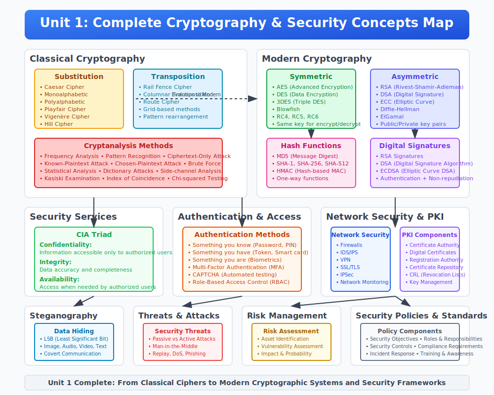

## GTU Paper Solutions

### Summer 2024

#### Q.1 (a) Describe CIA triad with example. (03)

**CIA Triad:** The CIA Triad is a fundamental concept in cybersecurity, representing three core principles: Confidentiality, Integrity, and Availability. Each principle is essential for ensuring the security and reliability of information systems.

1. **Confidentiality:**
   - **Definition:** Ensures that sensitive information is accessible only to those authorized to have access. It protects data from unauthorized access and disclosure.
   - **Methods to Ensure Confidentiality:**
     - **Encryption:** Converts data into a coded format that can only be read by someone who has the decryption key. 
       - *Example:* Secure Socket Layer (SSL) encryption used in HTTPS to secure online transactions.
     - **Access Control:** Restricts access to data based on user roles and permissions.
       - *Example:* A company database where only HR personnel can access employee personal details.
     - **Authentication:** Verifies the identity of users trying to access the system.
       - *Example:* Using usernames and passwords to log into a secure system.
   - **Example:** When sending an email containing sensitive information, encryption ensures that only the intended recipient can read the email, protecting it from interception by unauthorized individuals.

2. **Integrity:**
   - **Definition:** Ensures that information remains accurate and complete over its entire lifecycle. It prevents unauthorized modification of data.
   - **Methods to Ensure Integrity:**
     - **Checksums and Hash Functions:** Mathematical algorithms that produce a unique value for a dataset, allowing verification that data has not been altered.
       - *Example:* MD5 and SHA-256 hash functions used to verify file integrity.
     - **Digital Signatures:** Verify the authenticity and integrity of a message, software, or digital document.
       - *Example:* Signing a document digitally to ensure it has not been altered since it was signed.
     - **Version Control:** Keeps track of changes to documents and allows for the restoration of previous versions.
       - *Example:* Source code management systems like Git.
   - **Example:** When downloading software, a hash value provided by the developer can be used to check that the software has not been tampered with, ensuring it is safe to install.

3. **Availability:**
   - **Definition:** Ensures that information and resources are available to authorized users when needed. It guarantees reliable access to information systems and data.
   - **Methods to Ensure Availability:**
     - **Redundancy:** Having backup systems or data copies to maintain service availability during failures.
       - *Example:* Using redundant servers and storage systems to ensure website availability.
     - **Disaster Recovery Plans:** Procedures to recover data and continue operations after a disaster.
       - *Example:* Off-site backups and data recovery processes in place for critical systems.
     - **Maintenance:** Regular updates and maintenance to prevent system failures.
       - *Example:* Applying software patches and updates to fix vulnerabilities.
   - **Example:** Online banking services must be available 24/7 to allow users to perform transactions at any time. This is ensured by having backup servers and robust disaster recovery plans.

**Summary:** The CIA Triad is critical in cybersecurity, ensuring that information is kept confidential, its integrity is maintained, and it is available to authorized users. Each element supports the others, creating a comprehensive security framework that protects information from various threats and vulnerabilities.

#### Q.1 (b) Explain Public key and Private Key cryptography. (04)

**Public Key Cryptography:**

- **Definition:** Also known as asymmetric cryptography, it uses a pair of keys – a public key and a private key – for encryption and decryption.
- **How It Works:**
  - **Key Pair Generation:** A user generates a pair of keys, one public and one private.
  - **Public Key:** This key is shared openly and can be used by anyone to encrypt messages intended for the key owner.
  - **Private Key:** This key is kept secret by the owner and is used to decrypt messages encrypted with the corresponding public key.
- **Example:** RSA (Rivest-Shamir-Adleman) algorithm.
  - **Step 1:** User A generates a public-private key pair.
  - **Step 2:** User A shares their public key with User B.
  - **Step 3:** User B encrypts a message using User A's public key.
  - **Step 4:** User A decrypts the message using their private key.
- **Advantages:**
  - Enhanced security due to the difficulty of deriving the private key from the public key.
  - Facilitates secure key exchange over an insecure channel.
- **Usage:** Secure communication, digital signatures, and certificate authorities.

**Private Key Cryptography:**

- **Definition:** Also known as symmetric cryptography, it uses a single key for both encryption and decryption.
- **How It Works:**
  - **Key Usage:** The same key is used by both the sender and receiver to encrypt and decrypt messages.
  - **Key Distribution:** The key must be securely shared between the communicating parties before they can exchange encrypted messages.
- **Example:** AES (Advanced Encryption Standard).
  - **Step 1:** User A and User B share a secret key.
  - **Step 2:** User A encrypts a message using the shared key.
  - **Step 3:** User B decrypts the message using the same key.
- **Advantages:**
  - Faster than public key cryptography due to simpler algorithms.
  - Suitable for encrypting large amounts of data.
- **Challenges:**
  - Securely distributing and managing the keys.
  - Scalability issues as the number of users increases.
- **Usage:** Encrypting data at rest, securing communication channels in a closed network.

**Comparison of Public Key and Private Key Cryptography:**

- **Key Management:**
  - **Public Key Cryptography:** Easier key distribution; public key can be shared openly.
  - **Private Key Cryptography:** Secure key exchange is challenging; key must remain secret.
- **Performance:**
  - **Public Key Cryptography:** Slower due to complex algorithms.
  - **Private Key Cryptography:** Faster and more efficient for bulk data encryption.
- **Security:**
  - **Public Key Cryptography:** More secure for key exchange and digital signatures.
  - **Private Key Cryptography:** Secure if the key is kept secret and managed properly.

**Summary:** Both public key and private key cryptography are essential in the field of cybersecurity. Public key cryptography provides a robust method for secure key exchange and authentication, while private key cryptography is efficient for encrypting large volumes of data. Understanding their differences and applications helps in designing secure communication systems.

#### Q.1 (c) Explain various security services and security mechanism (07)

**Security Services:**

1. **Confidentiality:**
   - **Definition:** Ensures that information is not disclosed to unauthorized individuals, entities, or processes.
   - **Methods:** 
     - **Encryption:** Converts information into an unreadable format for anyone except those possessing a key. 
       - *Example:* Using AES encryption for securing files.
     - **Access Control:** Restricts access to data based on user roles and permissions.
       - *Example:* Only HR department employees can access employee records.

2. **Integrity:**
   - **Definition:** Ensures that information remains accurate, complete, and unaltered during storage and transmission.
   - **Methods:**
     - **Hash Functions:** Generate a unique hash value for data to detect changes.
       - *Example:* SHA-256 to verify file integrity.
     - **Digital Signatures:** Authenticate the sender and ensure the message has not been altered.
       - *Example:* Signing a PDF document.

3. **Authentication:**
   - **Definition:** Verifies the identity of users, devices, or systems.
   - **Methods:**
     - **Passwords:** Simple form of authentication based on a secret code.
       - *Example:* Logging into an email account with a password.
     - **Biometric Systems:** Use physical characteristics like fingerprints.
       - *Example:* Fingerprint scanners in smartphones.

4. **Non-repudiation:**
   - **Definition:** Ensures that a party cannot deny the authenticity of their signature on a document or a message sent.
   - **Methods:**
     - **Digital Signatures:** Provide proof of origin and integrity.
       - *Example:* Signing a contract digitally.
     - **Logging and Audit Trails:** Keep records of transactions and accesses.
       - *Example:* Server logs capturing user activities.

5. **Access Control:**
   - **Definition:** Restricts access to resources to only those who are authorized.
   - **Methods:**
     - **Access Control Lists (ACLs):** Define permissions for users and groups.
       - *Example:* File system ACLs determining who can read/write files.
     - **Role-Based Access Control (RBAC):** Permissions based on user roles.
       - *Example:* Different access levels for admins and regular users in a software application.

**Security Mechanisms:**

1. **Encryption:**
   - **Definition:** Converts plaintext into ciphertext using an algorithm and key.
   - **Types:**
     - **Symmetric Encryption:** Same key for encryption and decryption.
       - *Example:* AES.
     - **Asymmetric Encryption:** Public and private keys for encryption and decryption.
       - *Example:* RSA.

2. **Hashing:**
   - **Definition:** Converts data into a fixed-size hash value which cannot be reversed.
   - **Usage:** Ensures data integrity by detecting changes.
   - **Example:** Using MD5 or SHA-256 to create hash values for files.

3. **Digital Signatures:**
   - **Definition:** Cryptographic technique to authenticate and verify the integrity of digital messages or documents.
   - **Process:**
     - **Step 1:** Generate a hash of the message.
     - **Step 2:** Encrypt the hash with the sender’s private key.
     - **Step 3:** Recipient decrypts the hash using the sender’s public key and compares it to the hash of the received message.
   - **Example:** Signing a software release to verify its source and integrity.

4. **Access Control Mechanisms:**
   - **Definition:** Methods to ensure only authorized users can access certain resources.
   - **Types:**
     - **Discretionary Access Control (DAC):** Resource owners set access policies.
       - *Example:* File permissions set by a user.
     - **Mandatory Access Control (MAC):** Access policies determined by a central authority.
       - *Example:* Government systems with classified information.

5. **Firewalls:**
   - **Definition:** Network security devices that monitor and control incoming and outgoing network traffic based on predetermined security rules.
   - **Types:**
     - **Packet-Filtering Firewalls:** Inspect packets and block or allow based on rules.
       - *Example:* Blocking incoming traffic on specific ports.
     - **Stateful Inspection Firewalls:** Monitor the state of active connections and make decisions based on the context of the traffic.
       - *Example:* Allowing established connections while blocking new, suspicious ones.

6. **Intrusion Detection Systems (IDS):**
   - **Definition:** Monitors network or system activities for malicious activities or policy violations.
   - **Types:**
     - **Network IDS (NIDS):** Analyzes network traffic for suspicious activity.
       - *Example:* Snort.
     - **Host IDS (HIDS):** Monitors and analyzes the internals of a computing system.
       - *Example:* OSSEC.

**Summary:**
Security services and mechanisms are crucial for safeguarding information systems. Services like confidentiality, integrity, authentication, non-repudiation, and access control ensure that data is protected from unauthorized access and alterations, while mechanisms like encryption, hashing, digital signatures, access control systems, firewalls, and intrusion detection systems implement these services effectively. Understanding these concepts helps in designing robust security frameworks.

#### Q.1 (c) Explain MD5 hashing algorithm. (07)

**MD5 Hashing Algorithm:**

**Introduction:**
The MD5 (Message-Digest Algorithm 5) is a widely used cryptographic hash function that produces a 128-bit (16-byte) hash value from an arbitrary amount of input data. Developed by Ronald Rivest in 1991, MD5 is commonly used for verifying data integrity.

**Properties of MD5:**

- **Fixed Output Size:** Regardless of the input size, MD5 produces a fixed 128-bit (16-byte) hash value, typically represented as a 32-character hexadecimal number.
- **Deterministic:** The same input will always produce the same hash output.
- **Fast Computation:** Designed for rapid computation, making it efficient for use in various applications.
- **Pre-image Resistance:** It should be computationally infeasible to reverse the hash function to obtain the original input from its hash value.
- **Collision Resistance:** It should be computationally infeasible to find two different inputs that produce the same hash output (though this property has been compromised over time).

**Steps of the MD5 Algorithm:**

1. **Padding:**
   - The input message is padded so that its length is congruent to 448 modulo 512. Padding ensures that the message length (in bits) is 64 bits less than a multiple of 512.
   - A single '1' bit is added to the end of the message, followed by '0' bits until the length condition is met.
   
2. **Appending Length:**
   - A 64-bit representation of the original message length (before padding) is appended to the padded message. This step ensures that the total length is a multiple of 512 bits.

3. **Initialize MD Buffer:**
   - Four 32-bit variables (A, B, C, D) are initialized with fixed hexadecimal values:
     - A = 0x67452301
     - B = 0xEFCDAB89
     - C = 0x98BADCFE
     - D = 0x10325476

4. **Processing Message in 512-bit Blocks:**
   - The padded message is divided into 512-bit (64-byte) blocks. Each block is processed in a series of operations involving bitwise functions and modular arithmetic.
   - For each block, the algorithm performs 64 iterations, grouped into four rounds of 16 operations each.
   - The main operations involve non-linear functions (F, G, H, I), modular addition, and bitwise rotation.

**MD5 Functions:**

- **F(X, Y, Z) = (X & Y) | (~X & Z)**
- **G(X, Y, Z) = (X & Z) | (Y & ~Z)**
- **H(X, Y, Z) = X ^ Y ^ Z**
- **I(X, Y, Z) = Y ^ (X | ~Z)**

**Example Operations:**
For each 512-bit block, the following operations are applied:

- **Round 1:** Uses the function F, with operations like:
  - **a = b + ((a + F(b, c, d) + M[k] + T[i]) <<< s)**
- **Round 2:** Uses the function G.
- **Round 3:** Uses the function H.
- **Round 4:** Uses the function I.

Here, M[k] represents a 32-bit chunk of the current block, T[i] is a constant derived from the sine function, and <<< denotes left bitwise rotation.

5. **Finalization:**
   - After processing all blocks, the contents of the buffer (A, B, C, D) are concatenated to form the final 128-bit hash value.

**Applications of MD5:**

- **Data Integrity:** Verifying the integrity of files and data during transmission or storage.
- **Digital Signatures:** Creating digital signatures for verifying the authenticity of messages and documents.
- **Checksum:** Generating checksums for quick data verification.

**Security Concerns:**

- **Collision Vulnerabilities:** Over time, weaknesses in MD5 have been discovered, allowing for collision attacks where two different inputs produce the same hash.
- **Deprecated Use:** Due to its vulnerabilities, MD5 is no longer considered secure for cryptographic purposes and has been largely replaced by more secure algorithms like SHA-256.

**Conclusion:**
The MD5 hashing algorithm, despite its historical significance and widespread use, has been rendered insecure due to collision vulnerabilities. It remains a useful tool for non-cryptographic applications but should be avoided for security-critical purposes.

#### Q.2 (a) What is firewall? List out types of firewall. (03)

**Firewall:**

- **Definition:** A firewall is a network security device or software that monitors and controls incoming and outgoing network traffic based on predetermined security rules. It acts as a barrier between a trusted network and an untrusted network, such as the internet, to prevent unauthorized access and protect against various cyber threats.

**Types of Firewalls:**

1. **Packet-Filtering Firewalls:**
   - **Function:** Analyzes packets based on header information (source and destination IP addresses, port numbers, protocol).
   - **Advantages:**
     - Simple and fast.
     - Effective for basic filtering.
   - **Disadvantages:**
     - Limited to filtering based on packet headers.
     - Cannot detect more sophisticated attacks.
   - **Example:** Basic router-based firewalls.

2. **Stateful Inspection Firewalls:**
   - **Function:** Monitors the state of active connections and makes decisions based on the context of the traffic (e.g., the state of the connection).
   - **Advantages:**
     - More secure than packet-filtering as it understands the state and context of connections.
     - Can track and filter based on connection state.
   - **Disadvantages:**
     - More complex and resource-intensive than packet-filtering firewalls.
   - **Example:** Cisco ASA (Adaptive Security Appliance).

3. **Proxy Firewalls (Application-Level Gateways):**
   - **Function:** Acts as an intermediary between clients and servers, analyzing and filtering traffic at the application layer.
   - **Advantages:**
     - Can perform deep packet inspection.
     - Provides a high level of security by inspecting the actual content of the traffic.
   - **Disadvantages:**
     - Can introduce latency.
     - More resource-intensive and complex to configure.
   - **Example:** Squid Proxy.

4. **Next-Generation Firewalls (NGFW):**
   - **Function:** Integrates traditional firewall capabilities with additional security features like deep packet inspection, intrusion prevention, and application awareness.
   - **Advantages:**
     - Combines multiple security functions into one device.
     - Provides comprehensive protection against advanced threats.
   - **Disadvantages:**
     - More expensive than traditional firewalls.
     - Requires more processing power and resources.
   - **Example:** Palo Alto Networks, Fortinet FortiGate.

5. **Unified Threat Management (UTM) Firewalls:**
   - **Function:** Combines firewall functionality with other security services like antivirus, anti-spam, content filtering, and intrusion detection/prevention.
   - **Advantages:**
     - All-in-one security solution.
     - Simplifies security management.
   - **Disadvantages:**
     - May not be as robust as dedicated solutions for each security function.
   - **Example:** SonicWall UTM.

6. **Cloud Firewalls (Firewall as a Service, FWaaS):**
   - **Function:** Deployed in the cloud to protect cloud-based infrastructure and services.
   - **Advantages:**
     - Scalable and flexible.
     - Ideal for cloud environments and distributed networks.
   - **Disadvantages:**
     - Depends on internet connectivity.
     - May introduce latency.
   - **Example:** AWS Firewall Manager, Azure Firewall.

**Summary:**
Firewalls are essential for protecting networks from unauthorized access and cyber threats. They come in various forms, each offering different levels of security and functionality. Understanding the different types of firewalls helps in selecting the right one based on the specific needs and security requirements of an organization.

#### Q.2 (b) Define: HTTPS and describe working of HTTPS. (04)

**HTTPS:**

- **Definition:** HTTPS (HyperText Transfer Protocol Secure) is an extension of HTTP. It is used for secure communication over a computer network, primarily the internet. HTTPS uses encryption to secure data transferred between a user's browser and the website they are accessing.
- **Purpose:** Ensures data privacy, integrity, and authentication during transmission.

**Working of HTTPS:**

1. **Establishing Connection:**
   - **Step 1: URL Request:**
     - A user types in a URL starting with "https://" in their web browser.
   - **Step 2: Server Response:**
     - The browser contacts the server and requests a secure connection.
   - **Step 3: Server Certificate:**
     - The server sends a copy of its SSL/TLS certificate to the browser. This certificate includes the server’s public key and other information.

2. **Certificate Verification:**
   - **Step 4: Certificate Validation:**
     - The browser verifies the server’s certificate against a list of trusted certificate authorities (CAs). If the certificate is valid, the connection proceeds. If not, the user is warned of potential risks.
   - **Step 5: Public Key Extraction:**
     - The browser extracts the server’s public key from the certificate.

3. **Session Key Generation:**
   - **Step 6: Session Key Creation:**
     - The browser generates a session key (a symmetric key) to encrypt the data during the session. This session key ensures fast encryption and decryption.
   - **Step 7: Encrypting the Session Key:**
     - The browser encrypts the session key using the server’s public key and sends it to the server.

4. **Secure Communication:**
   - **Step 8: Decrypting the Session Key:**
     - The server uses its private key to decrypt the session key.
   - **Step 9: Encrypted Data Transfer:**
     - Now, both the browser and server use the session key to encrypt and decrypt data transmitted during the session. This ensures that any data sent between them is secure.

5. **Data Integrity and Authentication:**
   - **Step 10: Data Encryption:**
     - All data sent between the browser and the server is encrypted using the session key. This prevents eavesdropping and tampering.
   - **Step 11: Data Integrity Checks:**
     - The SSL/TLS protocol uses cryptographic hash functions to ensure that data is not altered during transmission. Any tampering would result in a mismatch, causing the connection to be terminated.

**Advantages of HTTPS:**

- **Data Security:**
  - Ensures that data transmitted between the browser and the server is encrypted and cannot be read by unauthorized parties.
- **Data Integrity:**
  - Protects data from being altered during transmission.
- **Authentication:**
  - Verifies the identity of the website, ensuring users are communicating with the intended server.

**Example:**

- **Online Banking:**
  - When a user accesses their bank’s website, HTTPS ensures that their login credentials, account details, and transactions are secure and protected from interception or tampering.

**Summary:**

HTTPS is a critical protocol for secure communication over the internet. By encrypting data and verifying server identity, it protects users from eavesdropping, tampering, and man-in-the-middle attacks. Understanding how HTTPS works helps in appreciating the importance of secure web browsing and online transactions.

#### Q.2 (c) Give explanation of active attack and passive attack in detail. (07)

**Active Attack:**

- **Definition:** An active attack involves an attacker attempting to alter system resources or affect their operations. The attacker actively interacts with the target system to cause damage or gain unauthorized access.
- **Characteristics:**
  - The attacker’s actions are overt and often detectable.
  - The goal is to modify, delete, or disrupt data and systems.
- **Types of Active Attacks:**
  1. **Modification of Messages:**
     - **Description:** Altering the contents of a message during transmission.
     - **Example:** Changing the amount in a bank transfer.
  2. **Masquerade:**
     - **Description:** Pretending to be an authorized user to gain access to system resources.
     - **Example:** Using stolen credentials to log into a system.
  3. **Replay:**
     - **Description:** Capturing a valid data transmission and re-sending it later to create an unauthorized effect.
     - **Example:** Re-sending a previously captured authentication packet to gain access.
  4. **Denial of Service (DoS):**
     - **Description:** Overwhelming a system with traffic or requests to make it unavailable to legitimate users.
     - **Example:** Flooding a website with requests to crash the server.

- **Example Scenario:**
  - **Network Intrusion:**
    - An attacker gains unauthorized access to a corporate network, modifies sensitive files, and disrupts network operations.
  - **Impact:** 
    - Data integrity is compromised.
    - Systems may be rendered unavailable.
    - Financial and reputational damage to the organization.

- **Detection and Mitigation:**
  - **Intrusion Detection Systems (IDS):**
    - Monitors network traffic for suspicious activities.
  - **Firewalls:**
    - Controls incoming and outgoing traffic based on security rules.
  - **Regular Audits:**
    - Periodic reviews of system logs and activities to detect anomalies.
  - **Encryption:**
    - Ensures that even if data is intercepted or modified, it remains unreadable without the correct decryption key.

**Passive Attack:**

- **Definition:** A passive attack involves an attacker intercepting and monitoring system communications without altering them. The primary aim is to gather information without detection.
- **Characteristics:**
  - The attacker’s actions are covert and often undetectable.
  - The goal is to eavesdrop on communications or gather sensitive information.
- **Types of Passive Attacks:**
  1. **Eavesdropping:**
     - **Description:** Intercepting and listening to communications without altering them.
     - **Example:** Monitoring unencrypted Wi-Fi traffic to capture sensitive information.
  2. **Traffic Analysis:**
     - **Description:** Observing the patterns and volumes of data traffic to infer information about the communication.
     - **Example:** Analyzing encrypted traffic to determine the communication parties and frequency.

- **Example Scenario:**
  - **Wi-Fi Sniffing:**
    - An attacker uses a network sniffer to capture unencrypted data transmitted over a public Wi-Fi network.
  - **Impact:** 
    - Sensitive information such as login credentials, emails, and personal data can be compromised.
    - The user may not be aware of the attack, as there is no noticeable change in network behavior.

- **Detection and Mitigation:**
  - **Encryption:**
    - Encrypts data during transmission to protect it from eavesdropping.
  - **Secure Communication Protocols:**
    - Using protocols like HTTPS, SSL/TLS to ensure secure data transmission.
  - **Network Segmentation:**
    - Dividing a network into segments to limit the impact of an eavesdropping attack.
  - **Monitoring Tools:**
    - Tools like intrusion detection systems (IDS) to identify unusual patterns of data capture.

**Summary:**

- **Active Attacks:**
  - Involves direct interference with the target system.
  - Detectable and often result in immediate and noticeable damage.
  - Examples: Modification of messages, masquerade, replay, DoS.
- **Passive Attacks:**
  - Involves monitoring and gathering information without direct interference.
  - Covert and harder to detect.
  - Examples: Eavesdropping, traffic analysis.

Understanding the differences between active and passive attacks, along with their characteristics and mitigation strategies, is crucial for implementing effective security measures to protect information systems from various threats.

#### Q.2 (a) What is digital signature ? Explain digital signature properties. (03)

**Digital Signature:**

**Definition:**
A digital signature is a cryptographic technique used to validate the authenticity and integrity of a digital message, document, or software. It is the digital equivalent of a handwritten signature or a stamped seal, but it offers far more inherent security.

**How It Works:**

- **Key Pair Generation:** The signer generates a pair of keys: a private key (kept secret) and a public key (shared with everyone).
- **Signing Process:** 
  - The sender creates a hash of the message or document.
  - The hash is then encrypted using the sender's private key to create the digital signature.
- **Verification Process:**
  - The recipient uses the sender's public key to decrypt the digital signature, revealing the original hash.
  - The recipient also generates a new hash of the received message or document.
  - If the decrypted hash matches the newly generated hash, the message's authenticity and integrity are confirmed.

**Properties of Digital Signatures:**

1. **Authenticity:**
   - **Verification of Identity:** Digital signatures authenticate the identity of the sender, ensuring that the message or document is indeed from the claimed sender. Since only the signer has access to their private key, the recipient can be confident of the sender’s identity.

2. **Integrity:**
   - **Data Integrity Assurance:** Digital signatures ensure that the content of the message or document has not been altered after it was signed. Any modification in the message will result in a different hash value, thus revealing tampering.

3. **Non-Repudiation:**
   - **Prevention of Denial:** Once a message is signed digitally, the signer cannot deny having signed it. This property provides legal proof of the sender's identity and the integrity of the signed document, preventing the sender from denying their involvement.

**Applications:**

- **Secure Communications:** Digital signatures are widely used in secure email communications, ensuring the authenticity and integrity of email contents.
- **Software Distribution:** Software developers use digital signatures to verify the authenticity and integrity of software updates and downloads.
- **Legal and Financial Documents:** Digital signatures are used to authenticate and secure legal contracts, financial transactions, and other important documents.

**Conclusion:**
Digital signatures are a critical component of modern cybersecurity, providing strong guarantees of authenticity, integrity, and non-repudiation. They are widely used in various applications to secure digital communications and transactions.

#### Q.2 (b) Define : Trojans, Rootkit, Backdoors, Keylogger (04)

**Definitions of Trojans, Rootkits, Backdoors, and Keyloggers:**

**1. Trojans:**

- **Definition:** A Trojan horse, or simply a Trojan, is a type of malicious software that disguises itself as a legitimate or benign application to trick users into installing it. Once activated, it can perform a variety of malicious activities without the user's knowledge.
- **Characteristics:**
  - Often disguised as a useful software or attachment.
  - Does not replicate itself like viruses or worms.
  - Can create a backdoor to provide unauthorized access to the user's system.
- **Example Activities:**
  - Stealing sensitive data (passwords, personal information).
  - Downloading and installing additional malware.
  - Giving remote control of the infected system to attackers.

**2. Rootkits:**

- **Definition:** A rootkit is a type of malicious software designed to gain unauthorized root or administrative access to a computer and mask its presence. Rootkits can be used to hide other malware, such as keyloggers or Trojans, from detection.
- **Characteristics:**
  - Operates at a deep level within the operating system.
  - Difficult to detect and remove.
  - Often used to maintain long-term control over a system.
- **Example Activities:**
  - Hiding files, processes, and system data.
  - Manipulating system logs and other forensic evidence.
  - Providing persistent access to the attacker.

**3. Backdoors:**

- **Definition:** A backdoor is a method of bypassing normal authentication or security controls in a computer system, application, or network. It allows unauthorized access to the system, often for remote control or data exfiltration.
- **Characteristics:**
  - Can be intentionally created by developers for legitimate purposes (e.g., remote support) but can be exploited if discovered.
  - Can be installed by malware, such as Trojans.
  - Often used for prolonged and stealthy access.
- **Example Activities:**
  - Remote access and control of the compromised system.
  - Installing additional malware or performing updates to existing malware.
  - Exfiltrating sensitive data from the system.

**4. Keyloggers:**

- **Definition:** A keylogger is a type of surveillance software that records every keystroke made on a computer's keyboard. Keyloggers can capture sensitive information, such as passwords, credit card numbers, and personal messages.
- **Characteristics:**
  - Can be hardware-based or software-based.
  - Often runs in the background, hidden from the user.
  - Can be used for legitimate purposes (e.g., monitoring employee activity) but is often used maliciously.
- **Example Activities:**
  - Capturing login credentials for online accounts.
  - Recording sensitive data entered into forms.
  - Monitoring and logging chat conversations and emails.

**Summary:**

- **Trojans** disguise themselves as legitimate software to execute malicious activities.
- **Rootkits** hide the presence of other malware and provide deep, persistent access to attackers.
- **Backdoors** allow unauthorized remote access to systems, bypassing security measures.
- **Keyloggers** record keystrokes to capture sensitive information stealthily.

Understanding these malicious tools is crucial for implementing effective cybersecurity measures to protect systems and data from unauthorized access and exploitation.

#### Q.2 (c) Explain Secure Socket Layer (SSL). (07)

**Secure Socket Layer (SSL):**

SSL, now deprecated in favor of its successor, Transport Layer Security (TLS), was a cryptographic protocol designed to provide secure communication over a computer network. It primarily aimed to ensure data confidentiality and integrity between clients and servers transmitting information.

**Key Features of SSL:**

1. **Encryption:**
   - SSL encrypts data transmitted between a client (such as a web browser) and a server (such as a web server). This encryption ensures that data exchanged cannot be intercepted and read by unauthorized entities.

2. **Authentication:**
   - SSL enables servers to authenticate their identities to clients using digital certificates. This verification assures clients that they are communicating with the intended server and not an impostor.

3. **Data Integrity:**
   - SSL protocols include mechanisms to verify that data transmitted between parties has not been altered or tampered with during transmission. This ensures the integrity of exchanged information.

4. **Protocol Layers:**
   - SSL operates above the transport layer (e.g., TCP/IP) and below the application layer protocols (e.g., HTTP, SMTP). It secures data transmission transparently to applications using it.

**SSL Handshake Process:**

- **Session Initiation:** The client initiates a secure connection request to the server.
- **Server Authentication:** The server presents its digital certificate to the client for verification.
- **Encryption Setup:** The client and server negotiate encryption algorithms and establish session keys for secure communication.
- **Data Exchange:** Encrypted data transmission occurs between the client and server.
- **Session Termination:** Secure session closure and cleanup of cryptographic resources after data exchange completion.

**Advantages of SSL:**

1. **Confidentiality:** Protects sensitive data from eavesdropping and interception by encrypting transmissions.

2. **Authentication:** Verifies the identity of communicating parties, preventing man-in-the-middle attacks.

3. **Integrity:** Ensures data integrity by detecting tampering or modification during transmission.

4. **Compatibility:** Widely supported across browsers, servers, and applications, ensuring interoperability and widespread adoption.

**SSL in Modern Context:**

- **Transition to TLS:** SSL has been deprecated due to security vulnerabilities and has largely been replaced by Transport Layer Security (TLS), which offers improved security features and stronger encryption algorithms.

- **TLS Advancements:** TLS continues to evolve with newer versions (TLS 1.3) addressing vulnerabilities and improving performance and security.

**Use Cases of SSL/TLS:**

- **Web Browsing:** Securing HTTP connections with HTTPS to protect online transactions, logins, and sensitive data exchanges.

- **Email Security:** Securing SMTP, POP, and IMAP protocols for encrypted email communication.

- **Secure APIs:** Protecting application programming interfaces (APIs) used for data exchange between services and applications.

**Summary:**

SSL (Secure Socket Layer) was a cryptographic protocol used to secure data transmission over computer networks, emphasizing encryption, authentication, and data integrity. While deprecated in favor of TLS, SSL laid the foundation for secure communication protocols widely used today.

#### Q.3 (a) Explain in detail cybercrime and cybercriminal. (03)

**Cybercrime:**

- **Definition:** Cybercrime refers to criminal activities carried out by means of computers or the internet. It involves using technology to commit fraud, theft, espionage, harassment, and other illegal activities.

**Types of Cybercrime:**

1. **Financial Fraud:**
   - **Description:** Unauthorized access to financial systems or data to steal money or information.
   - **Example:** Phishing attacks to obtain credit card details.

2. **Identity Theft:**
   - **Description:** Stealing personal information (such as Social Security numbers or passwords) to impersonate someone else.
   - **Example:** Using stolen credentials to access bank accounts.

3. **Cyberbullying:**
   - **Description:** Harassment or intimidation using digital communication tools, often targeting individuals or groups.
   - **Example:** Posting offensive messages on social media.

4. **Malware Attacks:**
   - **Description:** Distributing malicious software to disrupt computer operations or gather sensitive information.
   - **Example:** Ransomware encrypting files for extortion.

5. **Cyber Espionage:**
   - **Description:** Stealing classified, sensitive information from governments, organizations, or individuals.
   - **Example:** Nation-state actors targeting defense contractors.

6. **Hacking:**
   - **Description:** Unauthorized access to computer systems or networks to exploit vulnerabilities.
   - **Example:** SQL injection to gain access to a database.

**Cybercriminal:**

- **Definition:** A cybercriminal is an individual or group who commits cybercrimes. They use advanced technical skills to exploit vulnerabilities in computer systems or networks for illegal financial gain, to cause damage, or to steal sensitive information.

**Characteristics of Cybercriminals:**

1. **Technical Proficiency:**
   - Skilled in programming, hacking techniques, and exploiting software vulnerabilities.
2. **Anonymity:**
   - Often operate under pseudonyms or through anonymizing technologies to evade law enforcement.
3. **Motivations:**
   - Financial gain, political motives, espionage, activism, or personal vendettas.
4. **Methods:**
   - Employ sophisticated techniques such as social engineering, phishing, and malware development.

**Example of a Cybercriminal Group:**

- **Anonymous:**
  - A decentralized international activist/hacktivist collective known for cyber attacks against governments and corporations to promote various political agendas.

**Impact of Cybercrime:**

- **Financial Loss:** Businesses and individuals suffer financial losses due to fraud and theft.
- **Reputation Damage:** Organizations face reputational damage from data breaches and security incidents.
- **Legal Consequences:** Cybercriminals may face legal actions, including fines and imprisonment.

**Summary:**

Cybercrime encompasses a wide range of illegal activities conducted through computers or the internet. Cybercriminals leverage technical expertise to exploit vulnerabilities for financial gain, espionage, or disruption. Understanding cybercrime and cybercriminals is crucial for implementing effective cybersecurity measures and combating online threats.

#### Q.3 (b) Describe cyber stalking and cyber bullying in detail. (04)

**Cyber Stalking:**

- **Definition:** Cyber stalking refers to the use of electronic communications to repeatedly harass or threaten someone, causing fear or emotional distress. It involves persistent online behavior that intrudes upon the victim’s privacy and safety.

**Characteristics of Cyber Stalking:**

1. **Persistent Contact:**
   - The stalker may continuously send threatening or harassing messages via email, social media, or other online platforms.
2. **Monitoring:**
   - Monitoring the victim’s online activities, location, or personal information without their consent.
3. **False Information:**
   - Spreading false information or rumors about the victim to damage their reputation or relationships.
4. **Manipulation:**
   - Attempting to manipulate or control the victim’s behavior or actions through online interactions.

**Examples of Cyber Stalking Behaviors:**

- Sending threatening emails or messages repeatedly.
- Monitoring the victim’s social media profiles and posts.
- Creating fake profiles to harass or deceive the victim.
- Using GPS tracking apps or spyware to monitor the victim’s location.

**Impact of Cyber Stalking:**

- **Psychological Distress:** Victims may experience anxiety, fear, depression, and paranoia.
- **Personal Safety Concerns:** Fear for physical safety due to online threats or stalking behaviors.
- **Social Isolation:** Victims may withdraw from social interactions to avoid further harassment.

**Legal Considerations:**

- **Laws:** Many countries have laws against cyber stalking, considering it a form of harassment or threat.
- **Reporting:** Victims are encouraged to report cyber stalking incidents to law enforcement and seek legal protection.

**Cyber Bullying:**

- **Definition:** Cyber bullying involves using digital communication tools to intimidate, harass, or humiliate others. It typically targets individuals, often children or teenagers, and can have severe psychological and emotional impacts.

**Characteristics of Cyber Bullying:**

1. **Anonymous Attacks:**
   - Bullies may use anonymous accounts or fake profiles to avoid identification.
2. **Public Humiliation:**
   - Posting derogatory comments, embarrassing photos, or videos to publicly shame the victim.
3. **Repetition:**
   - The bullying behavior may be persistent, with multiple instances of harassment over time.
4. **Wide Audience:**
   - Content can spread rapidly online, reaching a wide audience beyond the initial participants.

**Examples of Cyber Bullying Behaviors:**

- Posting hurtful comments on social media.
- Spreading rumors or gossip online.
- Excluding someone intentionally from online groups or activities.
- Creating memes or videos mocking the victim.

**Impact of Cyber Bullying:**

- **Emotional Distress:** Victims may experience anxiety, depression, low self-esteem, and suicidal thoughts.
- **Academic and Social Consequences:** Bullying can affect a victim’s performance at school or work and disrupt their social relationships.
- **Cyber Safety Education:** Educating individuals about safe online behavior and the consequences of cyber bullying is crucial to prevent and address such incidents.

**Summary:**

Cyber stalking and cyber bullying are serious online behaviors that can have profound psychological, emotional, and social impacts on victims. Understanding these phenomena helps in raising awareness, implementing preventive measures, and providing support to those affected by online harassment and abuse.

#### Q.3 (c) Explain Property based classification in cybercrime. (07)

**Property-Based Classification in Cybercrime:**

Cybercrimes can be classified based on the types of properties or assets targeted during the criminal activity. This classification helps in understanding the nature of the crime and implementing appropriate security measures. Here’s a detailed explanation of property-based classification in cybercrime:

1. **Intellectual Property Theft:**
   - **Description:** Cybercriminals target intellectual property (IP) such as patents, copyrights, trade secrets, and trademarks.
   - **Examples:** Illegally downloading software, music, movies; stealing designs or research data from companies.

2. **Financial Assets Theft:**
   - **Description:** Involves theft or illegal access to financial assets including money, credit card information, bank account details, and digital currencies.
   - **Examples:** Phishing attacks to steal credit card details, hacking into online banking accounts.

3. **Personal Information Theft:**
   - **Description:** Cybercriminals target personal information of individuals such as Social Security numbers, addresses, medical records, and personal identifiers.
   - **Examples:** Data breaches targeting personal information databases, identity theft.

4. **System Resources Misuse:**
   - **Description:** Unauthorized use or abuse of computing resources, network bandwidth, or storage capacities of computer systems.
   - **Examples:** Distributed Denial of Service (DDoS) attacks, using compromised systems for cryptocurrency mining.

5. **Cyber Vandalism:**
   - **Description:** Intentional damage or defacement of digital property or online resources.
   - **Examples:** Defacing websites, spreading malware that deletes or corrupts data.

6. **Cyber Espionage:**
   - **Description:** Involves stealing sensitive information or trade secrets from governments, corporations, or individuals for competitive advantage or political motives.
   - **Examples:** Hacking into government databases to steal classified information, targeting corporate networks for industrial espionage.

7. **Cyber Terrorism:**
   - **Description:** Use of cyber attacks to cause disruption, fear, or harm to individuals, organizations, or governments for ideological, political, or religious reasons.
   - **Examples:** Cyber attacks on critical infrastructure, spreading propaganda through hacking social media accounts.

**Importance of Property-Based Classification:**

- **Targeted Security Measures:** Helps in identifying specific assets that need protection and implementing tailored security measures.
- **Legal Framework:** Provides a basis for developing laws and regulations to address different types of cybercrimes effectively.
- **Risk Assessment:** Enables organizations to assess risks associated with different types of cyber threats and prioritize mitigation efforts accordingly.

**Challenges in Combatting Property-Based Cybercrimes:**

- **Jurisdictional Issues:** Cybercriminals often operate across international borders, making law enforcement and legal prosecution challenging.
- **Complexity of Investigations:** Investigating and prosecuting cybercrimes involving multiple jurisdictions and sophisticated techniques require specialized skills and resources.
- **Rapidly Evolving Threat Landscape:** Cybercriminal tactics evolve rapidly, necessitating continuous adaptation of cybersecurity measures and law enforcement strategies.

**Summary:**

Property-based classification in cybercrime categorizes criminal activities based on the types of assets targeted, including intellectual property, financial assets, personal information, system resources, digital property, and more. Understanding these classifications helps in developing comprehensive cybersecurity strategies and legal frameworks to combat cyber threats effectively.

#### Q.3 (a) Explain Data diddling. (03)

**Data Diddling:**

**Definition:**
Data diddling refers to the unauthorized alteration of data before or during input into a computer system. It is a form of cyberattack where data is modified, deleted, or added to change the output or final results. This manipulation often goes unnoticed because the changes occur at an early stage in the data processing cycle.

**Characteristics:**

- **Subtle Changes:** The modifications are typically small and difficult to detect, making it a stealthy form of attack.
- **Internal Threats:** Often carried out by insiders who have authorized access to the data and systems.
- **Early Stage Manipulation:** Occurs before data is processed, affecting the input data rather than the final output directly.

**Examples:**

1. **Financial Fraud:** An employee alters financial records to embezzle funds or manipulate account balances.
2. **Elections:** Tampering with voter data to influence the outcome of an election.
3. **Inventory Systems:** Changing inventory data to cover up theft or mismanagement of goods.
4. **Healthcare Records:** Altering patient information to commit insurance fraud or to hide medical errors.

**Consequences:**

- **Financial Losses:** Organizations may suffer significant financial losses due to fraudulent activities.
- **Data Integrity:** Compromises the integrity of the data, leading to inaccurate reports and decisions based on falsified information.
- **Legal Issues:** Organizations can face legal consequences if the tampering is discovered, especially if it affects stakeholders or violates regulations.
- **Reputation Damage:** Trust in the organization can be severely damaged, affecting customer and stakeholder relationships.

**Prevention Measures:**

- **Access Controls:** Implement strict access control measures to limit who can view and modify sensitive data.
- **Audit Trails:** Maintain comprehensive audit trails to track all changes made to data, making it easier to detect and investigate unauthorized alterations.
- **Data Encryption:** Encrypt data during transmission and storage to protect it from unauthorized modifications.
- **Regular Audits:** Conduct regular audits and reviews of data to ensure its accuracy and integrity.
- **Employee Training:** Educate employees about the importance of data integrity and the risks of data diddling.

**Summary:**
Data diddling is a subtle yet potentially devastating cyberattack that involves unauthorized changes to data before or during input into a computer system. It can lead to significant financial losses, legal issues, and reputational damage. Implementing robust access controls, maintaining audit trails, and conducting regular data audits are essential measures to prevent and detect data diddling.

#### Q.3 (b) Explain cyber spying and cyber terrorism. (04)

**Cyber Spying and Cyber Terrorism:**

**1. Cyber Spying:**

- **Definition:** Cyber spying, also known as cyber espionage, is the act of obtaining confidential, sensitive, or classified information without permission, often conducted by governments, organizations, or individuals. The primary goal is to gain strategic, political, or economic advantages.
- **Characteristics:**
  - **Targeted Attacks:** Focuses on specific individuals, organizations, or governments.
  - **Stealth:** Operations are conducted covertly to avoid detection.
  - **Advanced Techniques:** Often uses sophisticated tools and methods, such as malware, phishing, and zero-day exploits.
- **Examples:**
  - **State-Sponsored Espionage:** A nation-state hacking into another country’s government networks to steal military secrets or diplomatic communications.
  - **Corporate Espionage:** A competitor hacking into a rival company’s network to steal trade secrets, intellectual property, or business strategies.
- **Consequences:**
  - **National Security Threats:** Exposure of critical national security information.
  - **Economic Losses:** Theft of intellectual property and sensitive corporate data can lead to significant financial losses.
  - **Loss of Trust:** Compromised entities may suffer a loss of trust from stakeholders and partners.
- **Prevention Measures:**
  - **Strong Cybersecurity Policies:** Implement comprehensive cybersecurity policies and procedures.
  - **Regular Security Audits:** Conduct regular security audits and vulnerability assessments.
  - **Employee Training:** Educate employees on recognizing and responding to cyber threats.
  - **Advanced Security Tools:** Use advanced security tools like intrusion detection systems (IDS), firewalls, and encryption.

**2. Cyber Terrorism:**

- **Definition:** Cyber terrorism refers to the use of internet-based attacks in terrorist activities, including acts of deliberate, large-scale disruption of computer networks, especially of personal computers attached to the internet, by means of tools such as computer viruses.
- **Characteristics:**
  - **Political or Ideological Motives:** Driven by political, religious, or ideological goals.
  - **Disruption and Fear:** Aims to create fear, disrupt services, and cause significant damage.
  - **High-Profile Targets:** Often targets critical infrastructure such as power grids, transportation systems, financial institutions, and government operations.
- **Examples:**
  - **Critical Infrastructure Attacks:** Hacking into power grids or water supply systems to cause widespread disruption and panic.
  - **Financial Sector Attacks:** Launching attacks on banks or financial institutions to destabilize the economy.
  - **Public Safety Attacks:** Disrupting emergency services or public safety communication systems.
- **Consequences:**
  - **Human and Economic Impact:** Potential for significant loss of life, economic damage, and societal disruption.
  - **Psychological Impact:** Instills fear and uncertainty among the public.
  - **Political Ramifications:** Can lead to political instability and strained international relations.
- **Prevention Measures:**
  - **Robust Cybersecurity Infrastructure:** Develop and maintain a strong cybersecurity infrastructure for critical systems.
  - **Government and Private Sector Collaboration:** Foster collaboration between government agencies and private sector entities.
  - **Incident Response Planning:** Create and regularly update incident response plans for quick recovery from attacks.
  - **Public Awareness Campaigns:** Increase public awareness about cyber threats and encourage best practices for cybersecurity.

**Summary:**

- **Cyber Spying** focuses on covertly obtaining sensitive information for strategic advantage, often conducted by state or corporate actors.
- **Cyber Terrorism** aims to cause widespread fear and disruption, targeting critical infrastructure and services for political or ideological reasons.

Both cyber spying and cyber terrorism pose significant threats to national security, economic stability, and public safety. Proactive measures, such as strong cybersecurity practices, collaboration, and public awareness, are essential to mitigate these threats.

#### Q.3 (c) Explain article section 65 and section 66 of cyber law. (07)

**Article Section 65 and Section 66 of Cyber Law:**

Cyber laws are legal frameworks that deal with issues related to the internet, computers, software, and information systems. They are designed to protect users and organizations from cyber crimes and to ensure proper conduct in the digital space. In many countries, these laws are codified into specific sections. Here, we discuss the provisions under Article Section 65 and Section 66, often referencing the Information Technology Act, 2000 (India).

**Section 65: Tampering with Computer Source Documents**

**Definition:**
Section 65 deals with the tampering of computer source documents. This section is intended to protect the integrity of computer programs and other digital documents that are necessary for the functioning of computer systems.

**Provisions:**

- **Intentional Act:** This section applies to anyone who knowingly or intentionally conceals, destroys, or alters any computer source code used for a computer, computer program, computer system, or computer network.
- **Unauthorized Actions:** It includes unauthorized acts such as causing damage, deleting, altering, or diminishing the value or utility of the information.
- **Source Code:** The term 'source code' refers to the list of commands that are compiled or assembled to create a computer program, including comments, directives, and commands written in a human-readable programming language.

**Penalties:**

- **Imprisonment:** The penalty for tampering with computer source documents includes imprisonment for up to three years.
- **Fine:** In addition to imprisonment, offenders may also be fined up to two lakh rupees (approximately $2,500 USD).

**Importance:**

- **Data Integrity:** Ensures the integrity and security of source code and prevents unauthorized modifications.
- **Software Reliability:** Protects the reliability of software systems and applications.
- **Cybersecurity:** Helps maintain cybersecurity by penalizing tampering activities.

**Section 66: Computer-Related Offenses**

**Definition:**
Section 66 covers a broad range of computer-related offenses, focusing on any dishonest or fraudulent activity involving computers.

**Provisions:**

- **Hacking with Computer System:** Anyone who, with the intent to cause or knowing that they are likely to cause wrongful loss or damage, destroys or deletes any information residing in a computer resource, or diminishes its value or utility, or affects it injuriously by any means, commits hacking.
- **Dishonest or Fraudulent Acts:** This section covers acts committed dishonestly or fraudulently, including unauthorized access, damage to computer data, disruption of services, and unauthorized download or copying of data.
- **Specific Offenses:**
  - **Data Theft:** Stealing or misappropriating data from a computer system.
  - **Identity Theft:** Using someone else's identity to gain access to computer systems or data.
  - **Cyber Stalking and Harassment:** Using computer systems to stalk or harass individuals.

**Penalties:**

- **Imprisonment:** The penalties can include imprisonment for a term that may extend to three years.
- **Fine:** Offenders can also be fined up to five lakh rupees (approximately $6,500 USD).
- **Severity of Punishment:** The severity of the punishment can vary based on the nature and extent of the offense.

**Importance:**

- **Protection of Digital Assets:** Provides legal recourse for the protection of digital assets and data.
- **Deterrence:** Acts as a deterrent against engaging in fraudulent or dishonest activities involving computers.
- **Legal Framework:** Establishes a clear legal framework for addressing and penalizing cyber crimes.

**Conclusion:**
Sections 65 and 66 of cyber law play crucial roles in safeguarding digital information and systems. Section 65 focuses on protecting the integrity of computer source documents, ensuring that software and digital documents are not tampered with. Section 66 addresses a wider range of computer-related offenses, emphasizing the need to deter and penalize fraudulent and dishonest activities in the digital realm. Together, these sections contribute to a more secure and trustworthy digital environment.

#### Q.4 (a) What is Hacking? List out types of Hackers. (03)

**What is Hacking?**

- **Definition:** Hacking refers to the unauthorized access, exploration, or manipulation of computer systems, networks, or devices. It involves exploiting vulnerabilities in software or hardware to gain access to data, disrupt operations, or cause damage.

**Types of Hackers:**

1. **White Hat Hackers:**
   - **Description:** Also known as ethical hackers, they use their skills to identify security weaknesses in systems and networks. Their goal is to improve security by fixing vulnerabilities before malicious hackers can exploit them.
   - **Example:** Penetration testers hired by companies to assess their cybersecurity defenses.

2. **Black Hat Hackers:**
   - **Description:** Malicious hackers who exploit vulnerabilities for personal gain, financial profit, or malicious intent. They may steal data, commit fraud, disrupt operations, or cause damage.
   - **Example:** Hackers behind ransomware attacks demanding payment for decryption keys.

3. **Grey Hat Hackers:**
   - **Description:** Hackers who operate between white hat and black hat hackers. They may breach systems without authorization but without malicious intent. They may notify the organization afterward and demand payment for fixing the issue.
   - **Example:** Hackers who uncover vulnerabilities and sell the information to interested parties.

4. **Script Kiddies:**
   - **Description:** Inexperienced individuals who use pre-written scripts or tools to launch attacks without understanding the underlying technology. They often rely on others' tools for their activities.
   - **Example:** Using automated tools to launch DDoS attacks without deep technical knowledge.

5. **Hacktivists:**
   - **Description:** Hackers who use their skills to promote political or social causes. They may deface websites, leak sensitive information, or disrupt services to raise awareness or protest.
   - **Example:** Anonymous or LulzSec targeting government agencies for political reasons.

6. **State-Sponsored Hackers:**
   - **Description:** Hackers employed or supported by governments to conduct cyber espionage, sabotage, or intelligence gathering. They operate with significant resources and advanced techniques.
   - **Example:** Russian hackers targeting foreign governments for political and military intelligence.

**Impact of Hacking:**

- **Data Breaches:** Exposing sensitive information like personal data, financial records, or intellectual property.
- **Financial Loss:** Businesses incur costs from downtime, remediation, legal penalties, and reputational damage.
- **Disruption of Services:** Critical infrastructure, services, or online platforms may be temporarily or permanently disrupted.

**Summary:**

Hacking encompasses a range of activities from ethical testing to malicious exploitation. Different types of hackers have varying motivations and methods, highlighting the importance of robust cybersecurity measures to protect against unauthorized access and data breaches.

#### Q.4 (b) Explain Vulnerability and 0-Day terminology of Hacking. (04)

**Vulnerability:**

- **Definition:** In the context of hacking, a vulnerability refers to a weakness or flaw in a system's design, implementation, or configuration that can be exploited by attackers to compromise the security of the system.
- **Characteristics:**
  - Vulnerabilities can exist in software, hardware, networks, or even human behavior.
  - They may arise due to coding errors, misconfigurations, design flaws, or outdated software.

**Types of Vulnerabilities:**

1. **Software Vulnerabilities:**
   - **Description:** Flaws in software code that can be exploited to gain unauthorized access or disrupt operations.
   - **Example:** Buffer overflow vulnerabilities in web applications.

2. **Network Vulnerabilities:**
   - **Description:** Weaknesses in network protocols, configurations, or devices that attackers can exploit to intercept or manipulate data.
   - **Example:** Weak encryption protocols allowing for eavesdropping on network traffic.

3. **Human Vulnerabilities:**
   - **Description:** Exploiting human psychology or behavior (such as phishing) to gain access to systems or information.
   - **Example:** Social engineering attacks where attackers manipulate users into revealing passwords.

**Significance of Vulnerabilities:**

- **Exploitation:** Attackers exploit vulnerabilities to gain unauthorized access, steal data, disrupt services, or launch further attacks.
- **Security Patches:** Vendors release patches to fix vulnerabilities, highlighting the importance of timely updates and patch management.
- **Risk Management:** Identifying and mitigating vulnerabilities is crucial for maintaining the security and integrity of systems and data.

**0-Day Vulnerability:**

- **Definition:** A 0-day vulnerability (zero-day vulnerability) refers to a security flaw that is unknown to the software vendor or to the public. It is called "0-day" because there are zero days of prior knowledge or warning before an exploit occurs.
- **Characteristics:**
  - Attackers can exploit 0-day vulnerabilities before the vendor has a chance to release a patch or fix.
  - Often, 0-day vulnerabilities are discovered by attackers and used covertly for targeted attacks.

**Impact of 0-Day Vulnerabilities:**

- **Increased Risk:** Organizations are vulnerable to attacks until a patch or workaround is developed.
- **Sophisticated Attacks:** 0-day vulnerabilities are often exploited in advanced and targeted attacks, making detection and mitigation challenging.
- **Security Response:** Rapid detection, response, and collaboration are critical to mitigating the impact of 0-day vulnerabilities.

**Example of 0-Day Exploit:**

- **Stuxnet Worm:** In 2010, Stuxnet exploited multiple 0-day vulnerabilities to sabotage Iran's nuclear enrichment facilities, demonstrating the potential impact of such vulnerabilities in cyber warfare.

**Summary:**

Understanding vulnerabilities and 0-day exploits is essential for implementing effective cybersecurity measures. It involves proactive identification, mitigation, and response strategies to minimize the risk of exploitation and protect systems and data from malicious actors.

#### Q.4 (c) Explain Five Steps of Hacking. (07)

**Five Steps of Hacking:**

Hacking often follows a systematic approach to exploit vulnerabilities and gain unauthorized access to systems or data. Here are the five steps typically involved in hacking:

1. **Reconnaissance:**
   - **Definition:** Also known as information gathering or footprinting, reconnaissance involves gathering information about the target system or organization.
   - **Methods:**
     - **Passive Reconnaissance:** Gathering publicly available information such as company websites, social media profiles, or domain registration details.
     - **Active Reconnaissance:** Using tools and techniques to probe the target’s network, identify active hosts, and gather information like IP addresses, open ports, and services running.

2. **Scanning:**
   - **Definition:** Scanning involves actively probing the target network or system for vulnerabilities and weaknesses identified during reconnaissance.
   - **Methods:**
     - **Port Scanning:** Identifying open ports and services running on target systems.
     - **Vulnerability Scanning:** Using automated tools to scan for known vulnerabilities in software or configurations.
     - **Network Mapping:** Creating a blueprint of the target network’s topology and identifying potential entry points.

3. **Gaining Access:**
   - **Definition:** Once vulnerabilities are identified, hackers attempt to exploit them to gain unauthorized access to the target system or network.
   - **Methods:**
     - **Exploiting Vulnerabilities:** Leveraging known exploits, 0-day vulnerabilities, or misconfigurations to gain initial access.
     - **Social Engineering:** Manipulating individuals to obtain passwords or access credentials.

4. **Maintaining Access:**
   - **Definition:** After gaining initial access, hackers aim to maintain access for as long as possible without being detected.
   - **Methods:**
     - **Backdoors:** Installing hidden entry points (backdoors) to access the system remotely.
     - **Rootkits:** Concealing malicious software to evade detection by antivirus or security tools.
     - **Privilege Escalation:** Elevating user privileges to gain access to more sensitive data or control over the system.

5. **Covering Tracks:**
   - **Definition:** To avoid detection and retain access, hackers cover their tracks by removing evidence of their activities.
   - **Methods:**
     - **Deleting Log Files:** Removing or altering system logs and audit trails to hide unauthorized access.
     - **Using Encryption:** Encrypting communication channels and files to prevent detection of stolen data.
     - **Steganography:** Hiding data within other non-suspicious files or communications.

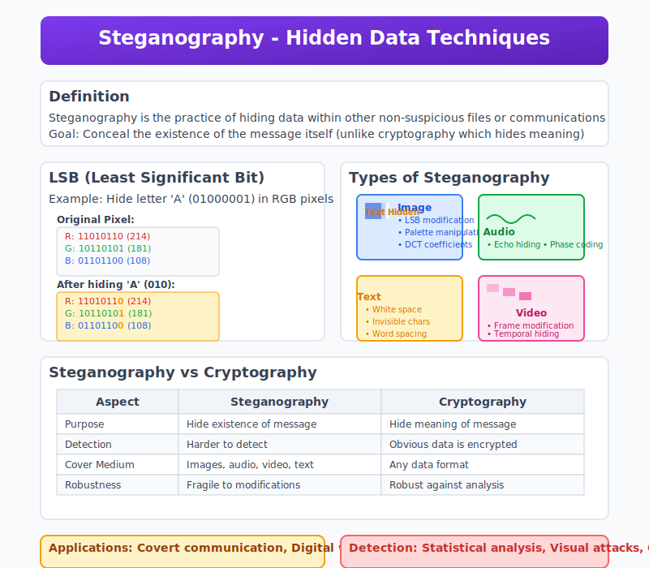

**Impact of Hacking:**

- **Data Breaches:** Exposing sensitive information such as personal data, financial records, or intellectual property.
- **Financial Loss:** Organizations incur costs from remediation, legal penalties, and reputational damage.
- **Disruption of Services:** Critical infrastructure, services, or online platforms may be temporarily or permanently disrupted.

**Summary:**

The five steps of hacking illustrate the systematic approach hackers use to exploit vulnerabilities and compromise systems or networks. Understanding these steps is crucial for implementing effective cybersecurity measures, including vulnerability management, monitoring, and incident response.

#### Q.4 (a) Explain any three basic commands of kali Linux with suitable example. (03)

**Three Basic Commands of Kali Linux:**

**1. `ls` Command:**

- **Purpose:** Lists the contents of a directory.
- **Usage:** Helps in viewing the files and directories present in the current directory.
- **Examples:**
  - **Basic Usage:** `ls`
    - Displays the names of files and directories in the current directory.
    - Example output:
      ```
      file1.txt  file2.txt  directory1
      ```
  - **Detailed Listing:** `ls -l`
    - Displays a detailed list including file permissions, number of links, owner, group, size, and modification date.
    - Example output:
      ```
      -rw-r--r-- 1 user user  1234 Jan  1 12:34 file1.txt
      -rw-r--r-- 1 user user  5678 Jan  1 12:35 file2.txt
      drwxr-xr-x 2 user user  4096 Jan  1 12:36 directory1
      ```
  - **Including Hidden Files:** `ls -a`
    - Lists all files, including hidden files (those starting with a dot `.`).
    - Example output:
      ```
      .  ..  .hiddenfile  file1.txt  file2.txt  directory1
      ```

**2. `cd` Command:**

- **Purpose:** Changes the current directory.
- **Usage:** Helps in navigating between different directories in the file system.
- **Examples:**
  - **Change to a Specific Directory:** `cd directory1`
    - Changes the current directory to `directory1`.
    - Example usage:
      ```
      $ cd directory1
      $ pwd
      /home/user/directory1
      ```
  - **Go to the Home Directory:** `cd ~`
    - Changes the current directory to the user's home directory.
    - Example usage:
      ```
      $ cd ~
      $ pwd
      /home/user
      ```
  - **Move Up One Level:** `cd ..`
    - Changes the current directory to the parent directory.
    - Example usage:
      ```
      $ cd ..
      $ pwd
      /home
      ```

**3. `pwd` Command:**

- **Purpose:** Prints the current working directory.
- **Usage:** Useful for determining the full path of the current directory.
- **Examples:**
  - **Basic Usage:** `pwd`
    - Outputs the full pathname of the current working directory.
    - Example usage:
      ```
      $ pwd
      /home/user
      ```

**Summary:**

- **`ls` Command:** Lists directory contents, useful for viewing files and directories.
- **`cd` Command:** Changes the current directory, essential for navigating the file system.
- **`pwd` Command:** Prints the current directory, helpful for identifying the working directory path.

These basic commands are fundamental for navigating and managing files and directories in Kali Linux, providing the foundation for more advanced operations.

#### Q.4 (b) Describe Session Hijacking in detail. (04)

**Session Hijacking:**

**Definition:**
Session hijacking, also known as session sidejacking or cookie hijacking, is a type of cyber attack where an attacker takes over a user's session by obtaining the session ID. The session ID is a unique identifier that the server assigns to a specific user session. Once the attacker gains access to the session ID, they can impersonate the user and gain unauthorized access to the user's data and actions within that session.

**How Session Hijacking Works:**

1. **Session Establishment:**
   - When a user logs into a web application, the server creates a session and assigns a unique session ID to the user's session.
   - This session ID is typically stored in a cookie, URL, or hidden form field.

2. **Session ID Interception:**
   - **Network Sniffing:** An attacker uses packet sniffing tools to capture network traffic. If the traffic is not encrypted (e.g., HTTP instead of HTTPS), the attacker can easily extract session IDs from the captured packets.
   - **Cross-Site Scripting (XSS):** The attacker exploits vulnerabilities in the web application to inject malicious scripts. These scripts can then steal session IDs from the user's browser.
   - **Man-in-the-Middle (MITM) Attack:** The attacker intercepts the communication between the user and the server, capturing the session ID in the process.
   - **Session Fixation:** The attacker sets a known session ID for the user before they log in. Once the user logs in with the known session ID, the attacker can use the same session ID to hijack the session.

3. **Session Takeover:**
   - After obtaining the session ID, the attacker can use it to send requests to the server, impersonating the legitimate user.
   - The server, recognizing the session ID as valid, grants the attacker the same access and permissions as the user.

**Consequences of Session Hijacking:**

- **Data Theft:** Attackers can access sensitive information such as personal details, financial data, and confidential documents.
- **Account Takeover:** Attackers can perform actions on behalf of the user, such as making unauthorized transactions, changing account settings, or sending malicious messages.
- **Privacy Breach:** Users' private information can be exposed or misused.
- **Reputation Damage:** Organizations can suffer reputational damage if user data is compromised.

**Prevention Measures:**

1. **Use Secure Communication Channels:**
   - **Encryption:** Always use HTTPS to encrypt data transmitted between the user's browser and the server, preventing attackers from intercepting session IDs.
   - **Secure Cookies:** Use secure cookies with the `Secure` and `HttpOnly` attributes. The `Secure` attribute ensures cookies are sent only over HTTPS, and `HttpOnly` prevents access to cookies via JavaScript.

2. **Implement Strong Session Management:**
   - **Regenerate Session IDs:** Regenerate session IDs after login, privilege changes, and periodically during a session to reduce the risk of session fixation attacks.
   - **Short Session Lifetimes:** Use short session lifetimes and implement automatic session expiration to limit the window of opportunity for attackers.

3. **User Education and Best Practices:**
   - **Logout Mechanism:** Encourage users to log out after their session, especially on shared or public computers.
   - **Avoid Public Wi-Fi:** Advise users to avoid accessing sensitive information over public Wi-Fi networks without a secure VPN.

4. **Regular Security Audits:**
   - **Vulnerability Assessments:** Conduct regular security audits and vulnerability assessments to identify and fix security flaws that could be exploited for session hijacking.
   - **Penetration Testing:** Perform penetration testing to simulate attacks and test the effectiveness of security measures.

**Conclusion:**
Session hijacking is a serious security threat that can lead to unauthorized access and significant damage. Implementing strong security measures, such as using secure communication channels, regenerating session IDs, and educating users on best practices, is crucial to protecting user sessions from being hijacked.

#### Q.4 (c) Explain Remote Administration Tools. (07)

**Remote Administration Tools (RATs):**

**Definition:**
Remote Administration Tools (RATs) are software applications that allow administrators to control and manage computers remotely. These tools are designed to provide the ability to perform various administrative tasks such as monitoring system performance, managing files, installing software, and troubleshooting issues from a remote location.

**Uses of Remote Administration Tools:**

1. **System Management:**
   - **Software Installation:** Install and update software applications on multiple remote systems simultaneously.
   - **Configuration Management:** Change system settings and configurations without physical access to the machines.
   - **File Management:** Transfer files between systems, delete or modify files, and organize directories.

2. **Monitoring and Troubleshooting:**
   - **Performance Monitoring:** Track system performance metrics such as CPU usage, memory usage, disk space, and network activity.
   - **Problem Diagnosis:** Identify and resolve system issues remotely by accessing logs and using diagnostic tools.
   - **User Support:** Provide real-time assistance to users by remotely accessing their desktops to troubleshoot problems.

3. **Security Management:**
   - **Patch Management:** Deploy security patches and updates to ensure systems are protected against vulnerabilities.
   - **Access Control:** Manage user accounts, passwords, and permissions remotely.
   - **Incident Response:** Quickly respond to security incidents by remotely accessing and securing affected systems.

**Common Features of Remote Administration Tools:**

1. **Remote Desktop Access:**
   - **Screen Sharing:** View and control the remote computer's screen as if you were sitting in front of it.
   - **Keyboard and Mouse Control:** Use your keyboard and mouse to interact with the remote system.

2. **File Transfer:**
   - **Upload and Download:** Transfer files to and from the remote system securely.
   - **File Synchronization:** Sync files between local and remote systems to ensure consistency.

3. **Command Execution:**
   - **Remote Shell Access:** Open a command-line interface on the remote system to execute commands and scripts.
   - **Automation:** Use scripts to automate repetitive administrative tasks across multiple systems.

4. **System Information:**
   - **Hardware and Software Inventory:** Collect detailed information about the remote system's hardware and installed software.
   - **Real-Time Monitoring:** Monitor system performance and resource usage in real-time.

**Popular Remote Administration Tools:**

1. **TeamViewer:**
   - **Cross-Platform Support:** Available for Windows, macOS, Linux, Android, and iOS.
   - **Features:** Remote desktop access, file transfer, chat, and remote printing.

2. **Microsoft Remote Desktop (RDP):**
   - **Windows Integration:** Built into Windows operating systems, providing seamless integration.
   - **Features:** Remote desktop access, remote applications, and session shadowing.

3. **AnyDesk:**
   - **High Performance:** Low latency and high frame rates for smooth remote access.
   - **Features:** Remote desktop access, file transfer, and session recording.

4. **VNC (Virtual Network Computing):**
   - **Open Source Options:** Several open-source implementations such as RealVNC and TightVNC.
   - **Features:** Remote desktop access and cross-platform support.

**Security Considerations:**

1. **Authentication and Authorization:**
   - **Strong Passwords:** Use strong, unique passwords for remote access accounts.
   - **Multi-Factor Authentication (MFA):** Implement MFA to add an extra layer of security.

2. **Encryption:**
   - **Secure Connections:** Use encryption protocols such as TLS (Transport Layer Security) to protect data transmitted between local and remote systems.

3. **Access Control:**
   - **Least Privilege Principle:** Grant users the minimum level of access necessary to perform their tasks.
   - **Audit Logs:** Maintain logs of remote access activities for monitoring and auditing purposes.

4. **Firewall and Network Security:**
   - **Restricted Access:** Configure firewalls to restrict remote access to trusted IP addresses.
   - **Network Segmentation:** Isolate critical systems on separate network segments to limit exposure.

**Advantages of Remote Administration Tools:**

- **Convenience:** Admins can manage systems from anywhere, reducing the need for physical presence.
- **Efficiency:** Automate and perform tasks quickly across multiple systems, saving time and resources.
- **Support:** Provide immediate support to users and resolve issues promptly.

**Disadvantages of Remote Administration Tools:**

- **Security Risks:** If not properly secured, RATs can be exploited by attackers to gain unauthorized access.
- **Dependence on Network:** Effective remote administration relies on stable and secure network connections.
- **Complexity:** Managing and configuring RATs may require advanced technical skills.

**Conclusion:**
Remote Administration Tools are powerful and versatile solutions that enhance the efficiency and effectiveness of IT administration. They offer a wide range of features for system management, monitoring, and security, enabling administrators to control and support remote systems seamlessly. However, ensuring the security of these tools is paramount to prevent unauthorized access and potential cyber threats.

#### Q.5 (a) Explain Mobile forensics. (03)

**Mobile Forensics:**

Mobile forensics is the process of recovering digital evidence from mobile devices such as smartphones, tablets, and other portable devices. It involves the systematic examination of device data to extract, preserve, analyze, and present digital evidence for investigative purposes.

**Key Aspects of Mobile Forensics:**

1. **Data Acquisition:**
   - **Definition:** The process of obtaining data from a mobile device in a forensically sound manner to preserve its integrity and admissibility as evidence.
   - **Methods:**
     - **Logical Acquisition:** Extracting data accessible via the device's operating system without altering the device's content.
     - **Physical Acquisition:** Creating a bit-by-bit copy of the device's storage, including deleted or hidden data.

2. **Data Analysis:**
   - **Definition:** Analyzing acquired data to identify relevant information, artifacts, and evidence related to the investigation.
   - **Techniques:**
     - **File Carving:** Recovering deleted files and fragments from the device's storage.
     - **Timeline Analysis:** Reconstructing events and activities based on timestamps and metadata.

3. **Reporting:**
   - **Definition:** Documenting findings and presenting forensic analysis results in a clear, concise, and understandable manner.
   - **Components:**
     - **Findings:** Summarizing key evidence, artifacts, and their significance to the investigation.
     - **Methodology:** Describing the forensic techniques used and the integrity of the evidence.

**Applications of Mobile Forensics:**

- **Criminal Investigations:** Gathering evidence related to crimes such as fraud, theft, child exploitation, and drug trafficking from suspect's mobile devices.
- **Corporate Investigations:** Investigating misconduct, intellectual property theft, and data breaches involving company-owned mobile devices.
- **Legal Proceedings:** Providing digital evidence admissible in courts to support criminal prosecutions or civil litigation.

**Challenges in Mobile Forensics:**

- **Encryption:** Securely encrypted data on devices may hinder or delay data extraction.
- **Device Diversity:** Various mobile operating systems (iOS, Android) and device models require different forensic techniques and tools.
- **Data Fragmentation:** Fragmented and deleted data may require advanced techniques for recovery and reconstruction.

**Future Trends:**

- **Cloud Forensics:** Integrating mobile device data with cloud storage and applications for comprehensive digital investigations.
- **IoT Forensics:** Extending forensic capabilities to Internet of Things (IoT) devices interconnected with mobile ecosystems.
- **Machine Learning:** Utilizing AI and machine learning for automated analysis and pattern recognition in mobile forensic investigations.

**Summary:**

Mobile forensics plays a crucial role in retrieving digital evidence from mobile devices to support investigations and legal proceedings. It involves acquiring, analyzing, and reporting on device data while adhering to forensic principles to ensure the integrity and admissibility of evidence.

#### Q.5 (b) What is Digital forensics? Write down advantages of Digital forensics. (04)

**Digital Forensics:**

Digital forensics involves the systematic examination of digital devices, data, and networks to uncover and interpret digital evidence that can be used in legal proceedings. It aims to preserve, analyze, and present digital artifacts in a forensically sound manner to support investigations.

**Advantages of Digital Forensics:**

1. **Evidence Preservation:**
   - Digital forensics ensures that digital evidence is collected and preserved in a manner that maintains its integrity, authenticity, and admissibility in court.
   - **Example:** Creating forensic images of storage devices to prevent alteration or deletion of data.

2. **Investigative Insights:**
   - Provides insights into the sequence of events, activities, and interactions involving digital devices and data.
   - **Example:** Recovering deleted files, emails, or chat logs to reconstruct timelines and actions.

3. **Legal Admissibility:**
   - Digital evidence gathered through forensics is presented in a format that meets legal standards and can be used effectively in court proceedings.
   - **Example:** Documenting chain of custody and following forensic procedures to ensure evidence is accepted in court.

4. **Incident Response:**
   - Helps organizations respond promptly to security incidents, data breaches, or cyber attacks by analyzing affected systems and identifying the scope of compromise.
   - **Example:** Identifying malware infections and tracing their origin to prevent further spread.

5. **Risk Mitigation:**
   - Enables proactive identification of vulnerabilities, weaknesses, and security gaps in digital infrastructure to implement preventive measures.
   - **Example:** Conducting forensic analysis after a security breach to strengthen defenses and prevent future incidents.

6. **Compliance Requirements:**
   - Assists organizations in meeting regulatory and compliance obligations related to data protection, privacy, and security.
   - **Example:** Performing digital forensic investigations to demonstrate compliance with industry standards and legal requirements.

**Applications of Digital Forensics:**

- **Criminal Investigations:** Supporting law enforcement in gathering evidence related to cyber crimes, fraud, identity theft, and more.
- **Corporate Investigations:** Investigating employee misconduct, intellectual property theft, data breaches, and insider threats.
- **Litigation Support:** Providing expert testimony and digital evidence in civil litigation, arbitration, and dispute resolution.

**Challenges in Digital Forensics:**

- **Complexity of Data:** Managing and analyzing large volumes of data from diverse sources and formats.
- **Encryption and Security Measures:** Overcoming encryption and security controls that protect digital evidence.
- **Privacy Concerns:** Balancing investigative needs with privacy rights and data protection regulations.

**Summary:**

Digital forensics is crucial for uncovering digital evidence, supporting investigations, and ensuring legal admissibility of evidence in court. Its advantages include evidence preservation, investigative insights, legal compliance, incident response, risk mitigation, and support for various investigative and legal processes.

#### Q.5 (c) Describe in detail Locard's Principle of exchange in Digital Forensics. (07)

**Locard's Principle of Exchange in Digital Forensics:**

Edmond Locard, a pioneer in forensic science, formulated the principle of exchange, which states that "every contact leaves a trace." This principle applies to digital forensics as well, emphasizing that when two objects come into contact, there is a transfer of material between them. In digital forensics, this concept is adapted to the transfer of digital evidence and traces left behind during digital interactions.

**Key Aspects of Locard's Principle in Digital Forensics:**

1. **Transfer of Digital Evidence:**
   - Just as physical evidence is transferred between individuals and objects in physical crime scenes, digital evidence is transferred between digital devices, networks, and users during digital interactions.

2. **Types of Digital Evidence:**
   - **Active Data:** Digital evidence that is actively stored and used on devices, such as files, emails, chat logs, and system logs.
   - **Residual Data:** Digital evidence that remains on devices after deletion or modification, including deleted files, metadata, and artifacts left by applications.

3. **Digital Trace Analysis:**
   - Forensic analysts apply Locard’s principle to identify, collect, preserve, and analyze digital traces left behind by user interactions, system activities, and network communications.

4. **Application in Investigations:**
   - **Crime Reconstruction:** Using digital traces to reconstruct sequences of events, actions, and interactions leading up to and following a digital incident.
   - **Incident Response:** Applying Locard’s principle to gather evidence of cyber attacks, data breaches, and unauthorized access incidents.

**Example of Locard's Principle in Action:**

- **Email Investigation:** Analyzing email exchanges between suspects and victims to trace the origin, content, and timestamps of messages exchanged during an investigation.

**Benefits of Locard's Principle in Digital Forensics:**

1. **Evidence Integrity:** Ensures that digital evidence is collected, preserved, and analyzed in a manner that maintains its integrity and admissibility in legal proceedings.

2. **Chain of Custody:** Documenting the chain of custody for digital evidence, demonstrating its handling and security from acquisition to presentation in court.

3. **Legal Admissibility:** Supporting the admissibility of digital evidence by demonstrating its relevance, reliability, and authenticity based on Locard's principle of exchange.

4. **Forensic Analysis:** Enabling forensic analysts to reconstruct digital incidents, identify perpetrators, and establish timelines based on digital traces and evidence.

**Challenges in Applying Locard's Principle:**

- **Data Volume:** Managing and analyzing large volumes of digital data and traces from diverse sources and formats.

- **Encryption and Security Measures:** Overcoming encryption, security controls, and privacy protections that may limit access to digital evidence.

**Summary:**

Locard's Principle of exchange in digital forensics underscores the importance of identifying, collecting, preserving, and analyzing digital evidence to reconstruct digital interactions, support investigations, and uphold legal standards. It highlights the transfer of digital traces between devices, users, and networks, emphasizing the traceability and analysis of digital evidence in forensic examinations.

#### Q.5 (a) Explain Network forensics. (03)

**Network Forensics:**

**Definition:**
Network forensics is a sub-discipline of digital forensics that focuses on the monitoring and analysis of computer network traffic to gather information, legal evidence, or detect malicious activities. It involves capturing, recording, and analyzing network packets to investigate and understand network-based attacks and intrusions.

**Key Concepts:**

1. **Purpose:**
   - **Incident Response:** Helps in identifying, investigating, and responding to network security incidents such as data breaches, unauthorized access, and malware infections.
   - **Legal Evidence:** Collects and preserves evidence for use in legal proceedings.
   - **Security Monitoring:** Continuously monitors network traffic to detect and prevent suspicious activities.

2. **Process:**
   - **Data Collection:** Capture network packets using tools like Wireshark, tcpdump, or other network monitoring solutions. This can include capturing traffic at the perimeter (firewall logs), internally (switches/routers), or on specific hosts.
   - **Data Analysis:** Examine captured data to identify patterns, anomalies, or specific events of interest. This can involve analyzing packet headers, payloads, and communication flows.
   - **Reconstruction:** Rebuild sessions and reconstruct communication streams to understand the context and sequence of events.
   - **Correlation:** Correlate network data with other sources of information, such as system logs, intrusion detection system (IDS) alerts, and user activity logs, to gain a comprehensive understanding of the incident.
   - **Reporting:** Document findings in a detailed report that includes timelines, identified threats, impacted systems, and recommended remediation actions.

3. **Tools:**
   - **Wireshark:** A widely-used network protocol analyzer that captures and interactively browses network traffic.
   - **tcpdump:** A command-line packet analyzer that allows users to capture and display packets transmitted over a network.
   - **Network Miner:** A network forensic analysis tool that extracts artifacts like files, credentials, and images from network traffic.
   - **Snort:** An open-source intrusion detection system (IDS) that can also be used for network traffic analysis.

**Applications:**

1. **Security Incident Investigation:**
   - Investigating data breaches to determine the method of intrusion, affected systems, and data exfiltrated.
   - Analyzing distributed denial-of-service (DDoS) attacks to identify sources and mitigate impacts.

2. **Compliance and Auditing:**
   - Ensuring that network activities comply with organizational policies and regulatory requirements.
   - Auditing network traffic to verify adherence to security standards.

3. **Threat Hunting:**
   - Proactively searching for indicators of compromise (IoCs) within network traffic.
   - Identifying advanced persistent threats (APTs) and other sophisticated attacks.

4. **Performance Troubleshooting:**
   - Diagnosing network performance issues such as latency, packet loss, and bandwidth bottlenecks.
   - Optimizing network performance by identifying and resolving underlying problems.

**Challenges:**

- **Volume of Data:** Handling large volumes of network traffic data can be overwhelming and requires efficient storage and analysis techniques.
- **Encryption:** Encrypted traffic poses a challenge for analysis, as the content is not easily accessible without decryption keys.
- **Privacy Concerns:** Balancing the need for network monitoring with privacy considerations and legal constraints.

**Conclusion:**
Network forensics is a crucial aspect of modern cybersecurity practices, providing the means to detect, investigate, and respond to network-based threats. By capturing and analyzing network traffic, organizations can uncover malicious activities, gather legal evidence, and enhance their overall security posture. Effective network forensics requires the right tools, expertise, and processes to manage and analyze the vast amounts of data involved.

#### Q.5 (b) Explain why CCTV plays an important role as evidence in digital forensics investigations. (04)

**Importance of CCTV in Digital Forensics Investigations:**

Closed-circuit television (CCTV) systems are critical in digital forensics investigations due to their ability to provide visual evidence of events and activities. Here's why CCTV plays an important role in such investigations:

1. **Visual Evidence:**
   - **Documentation of Events:** CCTV cameras record real-time footage of activities and events. This visual evidence can capture incidents as they occur, providing a chronological record of events.
   - **Corroboration:** Video footage can corroborate or refute witness statements, helping investigators establish a more accurate timeline of events.

2. **Crime Scene Documentation:**
   - **Preservation of Evidence:** CCTV footage captures details of crime scenes, including perpetrator actions, victim movements, and interactions between individuals.
   - **Contextual Information:** Provides context to investigative findings by showing the spatial layout of the scene and actions taken.

3. **Identification and Recognition:**
   - **Suspect Identification:** CCTV footage can help identify suspects based on physical appearance, clothing, or distinctive features.
   - **Vehicle Identification:** Capture of vehicle license plates or distinctive markings aids in tracing movements and identifying vehicles involved in incidents.

4. **Chain of Custody:**
   - **Legal Admissibility:** CCTV footage, when properly handled and stored, maintains chain of custody integrity. This ensures that the footage is admissible as evidence in legal proceedings.
   - **Authentication:** Verification of CCTV footage authenticity and integrity strengthens its evidentiary value in court.

5. **Investigative Leads:**
   - **Behavioral Analysis:** Observing behavior patterns and interactions in CCTV footage helps investigators reconstruct sequences of events and discern motives.
   - **Investigative Leads:** Provides leads for further investigation, such as identifying witnesses, additional evidence, or areas requiring forensic analysis.

6. **Preventive and Deterrent Effect:**
   - **Crime Prevention:** Presence of CCTV cameras can deter criminal activities and improve public safety perceptions in monitored areas.
   - **Monitoring Compliance:** Helps monitor compliance with security protocols, operational procedures, and regulatory requirements.

**Challenges:**

- **Quality and Clarity:** The effectiveness of CCTV footage can be hindered by factors such as poor lighting, camera angles, resolution, and environmental conditions.
- **Privacy Concerns:** Balancing the use of CCTV for security purposes with individual privacy rights and regulatory requirements.
- **Storage and Retention:** Managing large volumes of footage requires adequate storage capacity and retention policies to preserve evidentiary value over time.

**Conclusion:**
CCTV plays a crucial role in digital forensics investigations by providing visual evidence that supports investigative processes, enhances situational awareness, and aids in the reconstruction of events. Its ability to document incidents in real time and preserve chain of custody strengthens its reliability and admissibility as evidence in legal proceedings.

#### Q.5 (c) Explain phases of Digital forensic investigation. (07)

**Phases of Digital Forensic Investigation:**

Digital forensic investigation follows a structured approach to systematically collect, analyze, and present digital evidence. The process typically involves several key phases to ensure thoroughness and maintain the integrity of the evidence. Here are the main phases of a digital forensic investigation:

1. **Identification:**
   - **Objective:** Determine the scope and nature of the investigation based on initial information and requirements.
   - **Key Activities:**
     - Identify the incident or suspected crime.
     - Define the goals and objectives of the investigation.
     - Establish communication with stakeholders and understand their requirements.

2. **Preservation:**
   - **Objective:** Ensure the integrity and preservation of digital evidence to maintain its admissibility and reliability in legal proceedings.
   - **Key Activities:**
     - Secure the scene and prevent contamination or alteration of evidence.
     - Create a forensic image (bit-by-bit copy) of storage devices to work with copies rather than originals.
     - Use write-blocking tools and procedures to prevent unintentional changes to evidence.

3. **Collection:**
   - **Objective:** Gather relevant digital evidence from various sources identified in the investigation.
   - **Key Activities:**
     - Identify and collect potential sources of evidence, such as computers, servers, mobile devices, and network logs.
     - Document the chain of custody for each piece of evidence to maintain its integrity.
     - Use forensic tools and techniques to acquire data without altering its original state.

4. **Examination:**
   - **Objective:** Analyze collected digital evidence to uncover facts and reconstruct events related to the incident or crime.
   - **Key Activities:**
     - Conduct in-depth analysis of the acquired data, including file systems, metadata, and application artifacts.
     - Recover deleted or hidden files and examine their content.
     - Apply forensic techniques such as keyword searching, timeline analysis, and data carving to extract relevant information.

5. **Analysis:**
   - **Objective:** Interpret findings from the examination phase to draw conclusions and identify implications related to the investigation.
   - **Key Activities:**
     - Correlate and interpret findings to reconstruct the sequence of events and establish timelines.
     - Identify patterns, anomalies, and relationships within the data that may indicate suspicious or malicious activities.
     - Evaluate the significance of findings in relation to the investigation's objectives and stakeholder requirements.

6. **Documentation:**
   - **Objective:** Document all findings, methodologies, and actions taken throughout the investigation to support the integrity and validity of the findings.
   - **Key Activities:**
     - Prepare detailed and organized reports that document the investigation process, methodologies, and results.
     - Include chain of custody documentation, forensic tools used, and a summary of findings and conclusions.
     - Ensure the report is clear, concise, and suitable for presentation in legal proceedings.

7. **Presentation:**
   - **Objective:** Communicate the findings and conclusions of the investigation to stakeholders, often including technical and non-technical audiences.
   - **Key Activities:**
     - Present findings in a clear and understandable manner, tailored to the audience's knowledge and requirements.
     - Provide supporting evidence and explanations to substantiate findings and conclusions.
     - Answer questions and provide additional information as needed to support the understanding and acceptance of findings.

**Conclusion:**
Digital forensic investigation involves a methodical approach that starts with identifying the scope and objectives, followed by preserving, collecting, examining, analyzing, documenting, and presenting digital evidence. Each phase is crucial for maintaining the integrity of evidence and ensuring the validity of findings, supporting both investigative processes and legal proceedings.