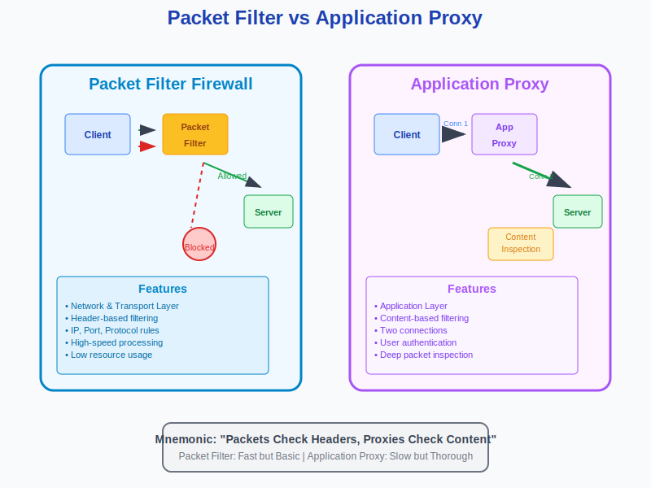
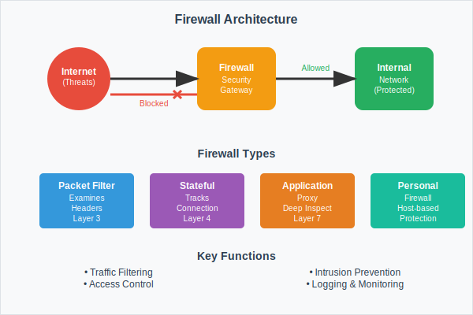

## Government Polytechnic Palanpur

### Information & Communication Technology

### Cyber Security (4353204) - Unit 1 & Unit 2 Question Bank

**Subject Name & Code:** Cyber Security (4353204)  
**Semester:** 5  
**Coverage:** Unit 1 & Unit 2  
**Question Types:** Short Answer & Long Answer

---

## Unit I: Introduction to Cyber Security & Cryptography

### Important Questions from Unit 1

#### Question 1 [7 marks]

**Explain various security attacks, mechanisms, and services associated with each layer of the OSI model.**

**Answer**:

**OSI Security Framework:**

| Layer | Attacks | Mechanisms | Services |
|-------|---------|------------|----------|
| **Physical** | Wiretapping, Jamming | Physical security, Shielding | Access control |
| **Data Link** | MAC flooding, ARP poisoning | Encryption, Authentication | Frame integrity |
| **Network** | IP spoofing, Routing attacks | IPSec, Firewalls | Packet filtering |
| **Transport** | Session hijacking, SYN flooding | SSL/TLS, Port security | End-to-end security |
| **Session** | Session replay, Hijacking | Session tokens, Timeouts | Session management |
| **Presentation** | Data corruption, Format attacks | Encryption, Compression | Data transformation |
| **Application** | Malware, Social engineering | Antivirus, User training | Application security |

**Key Security Services:**

- **Authentication**: Verifying user identity
- **Authorization**: Controlling access permissions
- **Non-repudiation**: Preventing denial of actions
- **Data integrity**: Ensuring data accuracy

**Mnemonic**: "All People Seem To Need Data Protection"

#### Question 2 [3 marks]

**Describe CIA triad with example.**

**Answer**:

**CIA Triad Components:**

| Component | Definition | Example |
|-----------|------------|---------|
| **Confidentiality** | Protecting data from unauthorized access | Password protection on bank accounts |
| **Integrity** | Ensuring data accuracy and completeness | Digital signatures on documents |
| **Availability** | Ensuring systems are accessible when needed | 24/7 online banking services |

- **Confidentiality**: Only authorized users can access sensitive information
- **Integrity**: Data remains accurate and unaltered during transmission
- **Availability**: Systems remain operational and accessible to legitimate users

**Mnemonic**: "CIA Keeps Information Safe"

#### Question 3 [7 marks]

**Explain MD5 hashing and Secure Hash Function (SHA) algorithms.**

**Answer**:

| Firewall Type | Working |
|---------------|---------|
| **Packet Filter** | Examines packet headers based on predefined rules. Makes decisions based on source/destination IP addresses, ports, and protocols. Works at OSI network and transport layers. Offers high-speed filtering with low resource usage. |
| **Application Proxy** | Acts as intermediary between client and server applications. Processes all traffic at application layer. Creates two connections (client-to-proxy and proxy-to-server). Provides content inspection and user authentication capabilities. |

**Diagram:**

**Key Differences:**

| Feature | Packet Filter | Application Proxy |
|---------|---------------|-------------------|
| **Speed** | Fast | Slower |
| **Security** | Basic | Advanced |
| **Resource Usage** | Low | High |
| **Content Inspection** | Header only | Full content |

**Answer**:

**Hash Function Comparison:**

| Feature | MD5 | SHA-1 | SHA-256 |
|---------|-----|-------|---------|
| **Output Size** | 128 bits | 160 bits | 256 bits |
| **Security Level** | Weak | Weak | Strong |
| **Speed** | Fast | Moderate | Slower |
| **Current Status** | Deprecated | Deprecated | Recommended |

**MD5 Algorithm Process:**

1. **Input Processing**: Message is padded and divided into 512-bit blocks
2. **Initialization**: Sets up four 32-bit registers with fixed values
3. **Compression**: Processes message in 16-word blocks through four rounds of operations
4. **Output**: Produces 128-bit digest as final hash value

**SHA Algorithm Features:**

- **Deterministic**: Same input produces same hash
- **Avalanche Effect**: Small input change causes major hash change
- **One-way Function**: Cannot reverse hash to original data
- **Collision Resistant**: Difficult to find two inputs with same hash

**Applications:**

- Password storage and verification
- Digital signatures and certificates
- Data integrity verification

**Mnemonic**: "Hash Always Produces Same Output"

#### Question 4 [3 marks]

**Explain Public key and Private Key cryptography.**

**Answer**:

**Public Key Cryptography (Asymmetric):**

**Key Characteristics:**

| Feature | Public Key | Private Key |
|---------|------------|-------------|
| **Distribution** | Freely shared | Kept secret |
| **Usage** | Encryption/Verification | Decryption/Signing |
| **Security** | Can be public | Must be protected |

- **Public Key**: Used for encryption and signature verification
- **Private Key**: Used for decryption and digital signing
- **Security**: Based on mathematical complexity (RSA, ECC algorithms)

**Example**: In RSA encryption, if Alice wants to send Bob a message:

1. Alice encrypts with Bob's public key
2. Only Bob can decrypt using his private key

**Mnemonic**: "Public Encrypts, Private Decrypts"

---

## Unit II: Account and Data Security

### Important Questions from Unit 2

#### Question 5 [7 marks]

**Explain working of packet filter and application proxy.**

**Answer**:

| Firewall Type | Working |
|---------------|---------|
| **Packet Filter** | Examines packet headers based on predefined rules. Makes decisions based on source/destination IP addresses, ports, and protocols. Works at OSI network and transport layers. Offers high-speed filtering with low resource usage. |
| **Application Proxy** | Acts as intermediary between client and server applications. Processes all traffic at application layer. Creates two connections (client-to-proxy and proxy-to-server). Provides content inspection and user authentication capabilities. |

**Diagram:**

**Key Differences:**

| Feature | Packet Filter | Application Proxy |
|---------|---------------|-------------------|
| **Speed** | Fast | Slower |
| **Security** | Basic | Advanced |
| **Resource Usage** | Low | High |
| **Content Inspection** | Header only | Full content |

**Mnemonic**: "Packets Check Headers, Proxies Check Content"

#### Question 6 [3 marks]

**What is authentication? Explain different methods of authentication.**

**Answer**:

**Authentication Definition:**
Process of verifying user identity before granting system access.

**Authentication Methods:**

| Method | Description | Example |
|--------|-------------|---------|
| **Password** | Something you know | PIN, passphrase |
| **Biometric** | Something you are | Fingerprint, iris |
| **Token** | Something you have | Smart card, USB key |

- **Single-Factor**: Uses one authentication method
- **Multi-Factor**: Combines multiple methods
- **Two-Factor (2FA)**: Uses exactly two factors

**Mnemonic**: "Password Biometric Token Authentication"

#### Question 7 [7 marks]

**Explain different types of malicious software and their effect.**

**Answer**:

**Malware Classification:**

| Type | Behavior | Effect | Example |
|------|----------|--------|---------|
| **Virus** | Attaches to files | File corruption | Boot sector virus |
| **Worm** | Self-replicating | Network congestion | Conficker worm |
| **Trojan** | Disguised malware | Data theft | Banking Trojans |
| **Ransomware** | Encrypts files | Data hostage | WannaCry |
| **Spyware** | Monitors activity | Privacy breach | Keyloggers |
| **Adware** | Shows unwanted ads | Performance degradation | Pop-up ads |
| **Rootkit** | Hides presence | System compromise | Kernel rootkits |

**Effects on Systems:**

- **Performance**: Slow system response
- **Data**: Loss, corruption, or theft
- **Privacy**: Unauthorized monitoring
- **Financial**: Direct monetary loss

**Prevention Methods:**

- Regular antivirus updates
- Safe browsing practices
- Email attachment caution
- System security patches

**Mnemonic**: "Viruses Worms Trojans Really Steal All Resources"

#### Question 8 [3 marks]

**What is firewall? List out types of firewalls.**

**Answer**:

**Firewall Definition:**
Network security device that monitors and controls incoming/outgoing traffic based on security rules.

**Types of Firewalls:**

| Type | Function | Level |
|------|----------|-------|
| **Packet Filter** | Examines packet headers | Network Layer |
| **Stateful** | Tracks connection state | Transport Layer |
| **Application Proxy** | Inspects application data | Application Layer |
| **Personal Firewall** | Protects individual devices | Host-based |

- **Hardware Firewall**: Dedicated network appliance
- **Software Firewall**: Installed on individual computers
- **Cloud Firewall**: Delivered as a service (FWaaS)

**Mnemonic**: "Firewalls Protect Networks Always"

---

## Study Tips for Unit 1 & Unit 2

### Unit 1 Focus Areas

1. **Security Fundamentals** - OSI model security layers
2. **CIA Triad** - Core principles of information security
3. **Cryptography Basics** - Hash functions and encryption types

### Unit 2 Focus Areas

1. **Network Security** - Firewalls, packet filtering, proxies
2. **Authentication Systems** - Methods and multi-factor authentication
3. **Malware Analysis** - Types, effects, and prevention strategies

### Exam Preparation Tips

- Practice drawing network diagrams and security frameworks
- Memorize comparison tables for different security technologies
- Understand real-world applications of theoretical concepts
- Focus on the working principles behind security mechanisms
- Review mnemonics for better concept recall

### Key Topics Coverage

- **Unit 1**: Introduction to Cyber Security, Security Models, Cryptographic Foundations
- **Unit 2**: Network Security, Authentication Mechanisms, Threat Analysis

---

**Note**: These questions cover fundamental concepts from Unit 1 and Unit 2 that are commonly asked in examinations. Practice these thoroughly for better understanding of cyber security principles.
