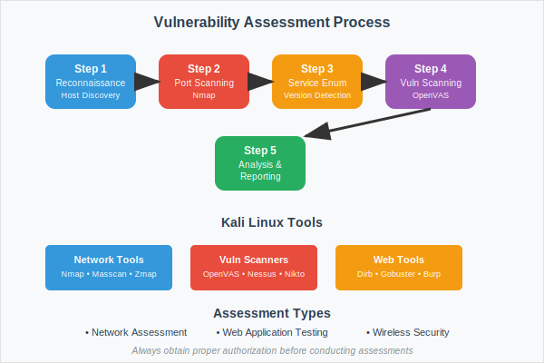

## Question 1 [4 marks]

**Describe cyber stalking and cyber bullying in detail.**

**Answer**:

**Digital Harassment Comparison:**

| Aspect | Cyber Stalking | Cyber Bullying |
|--------|----------------|----------------|
| **Target** | Specific individual | Often minors |
| **Duration** | Persistent, long-term | Can be episodic |
| **Intent** | Intimidation, control | Harassment, humiliation |
| **Platform** | Social media, email | Schools, gaming platforms |

**Cyber Stalking Characteristics:**

- Persistent unwanted contact
- Monitoring victim's online activity
- Threatening messages or behavior
- Identity theft or impersonation

**Cyber Bullying Forms:**

- Public humiliation online
- Exclusion from digital groups
- Spreading false information
- Sharing private content without consent

**Prevention Measures:**

- Privacy settings on social media
- Reporting harassment to platforms
- Legal action when necessary
- Digital literacy education

**Mnemonic**: "Stop Bullying, Report Stalking"

## Question 2 [3 marks]

**Explain Property based classification in cybercrime.**

**Answer**:

**Property-Based Cybercrime Categories:**

| Category | Crime Type | Description | Example |
|----------|------------|-------------|---------|
| **Intellectual Property** | Copyright infringement | Unauthorized use of copyrighted material | Software piracy |
| **Financial Property** | Credit card fraud | Unauthorized use of financial information | Online shopping fraud |
| **Digital Property** | Data theft | Stealing digital information | Database breaches |
| **Virtual Property** | Gaming asset theft | Stealing virtual goods | Online game currency theft |

**Diagram:**

**Legal Aspects:**

- **Copyright Laws**: Protect creative works
- **Trademark Laws**: Protect brand identity
- **Patent Laws**: Protect inventions
- **Trade Secret Laws**: Protect confidential information

**Impact on Economy:**

- Revenue loss for legitimate businesses
- Reduced innovation incentives
- Consumer trust erosion
- Legal enforcement costs

**Prevention Strategies:**

- Digital rights management (DRM)
- Watermarking and tracking
- Legal enforcement mechanisms
- Public awareness campaigns

**Mnemonic**: "Property Protection Prevents Piracy"

## Question 3 [7 marks]

**Explain the role of digital signatures and digital certificates in cybersecurity.**

**Answer**:

**Digital Security Components:**

| Component | Purpose | Function | Benefit |
|-----------|---------|----------|---------|
| **Digital Signature** | Authentication | Proves sender identity | Non-repudiation |
| **Digital Certificate** | Verification | Validates public keys | Trust establishment |

**Digital Signature Process:**

**Digital Certificate Components:**

- **Subject Information**: Certificate owner details
- **Public Key**: For encryption/verification
- **Digital Signature**: CA's signature
- **Validity Period**: Certificate expiration date

**Certificate Authority (CA) Role:**

- Issues digital certificates
- Verifies identity before issuance
- Maintains certificate revocation lists
- Provides trust infrastructure

**Applications in Cybersecurity:**

- Email security (S/MIME)
- Code signing for software
- SSL/TLS certificates for websites
- Document authentication

**Security Benefits:**

- **Authentication**: Verifies sender identity
- **Integrity**: Ensures data hasn't been modified
- **Non-repudiation**: Prevents denial of actions
- **Confidentiality**: Enables secure communication

**Mnemonic**: "Digital Signatures Authenticate Documents Securely"

## Question 4 [4 marks]

**Explain Vulnerability and 0-Day terminology of Hacking.**

**Answer**:

**Security Terminology:**

| Term | Definition | Risk Level | Example |
|------|------------|------------|---------|
| **Vulnerability** | System weakness | Varies | Unpatched software |
| **0-Day** | Unknown vulnerability | Critical | Undiscovered flaw |

**Vulnerability Characteristics:**

- **Discovery**: Found through security testing
- **Disclosure**: Responsible reporting to vendors
- **Patching**: Vendor provides security updates
- **Window**: Time between discovery and patch

**0-Day Attack Process:**

- Hacker discovers unknown vulnerability
- Exploits flaw before vendor awareness
- No available patches or defenses
- High success rate due to surprise element

**Protection Strategies:**

- Regular security updates
- Intrusion detection systems
- Behavioral analysis tools
- Zero-trust security models

**Mnemonic**: "Vulnerabilities Need Patches, Zero-Days Need Vigilance"

## Question 5 [3 marks]

**Explain any three basic commands of Kali Linux with suitable example.**

**Answer**:

**Essential Kali Linux Commands:**

| Command | Function | Example |
|---------|----------|---------|
| **nmap** | Network scanning | `nmap -sS 192.168.1.1` |
| **netcat** | Network communication | `nc -l -p 1234` |
| **hydra** | Password cracking | `hydra -l admin -P passwords.txt ssh://target` |

- **Nmap**: Discovers hosts and services on network
- **Netcat**: Creates network connections for data transfer
- **Hydra**: Performs brute-force password attacks

**Mnemonic**: "Network Map, Connect, Crack"

## Question 6 [7 marks]

**Explain Five Steps of Hacking.**

**Answer**:

**Hacking Methodology:**

**Detailed Steps:**

| Step | Description | Tools/Methods | Objective |
|------|-------------|---------------|-----------|
| **Reconnaissance** | Information gathering | Google dorking, Social media | Target profiling |
| **Scanning** | System enumeration | Nmap, Nessus | Vulnerability identification |
| **Gaining Access** | Exploit vulnerabilities | Metasploit, Custom exploits | System compromise |
| **Maintaining Access** | Persistent presence | Backdoors, Rootkits | Long-term control |
| **Covering Tracks** | Evidence removal | Log cleaning, File deletion | Avoid detection |

**Information Gathering Types:**

- **Passive**: No direct target contact
- **Active**: Direct interaction with target systems

**Scanning Techniques:**

- Port scanning for open services
- Vulnerability scanning for weaknesses
- Network mapping for topology

**Access Methods:**

- Password attacks (brute force, dictionary)
- Exploit vulnerabilities
- Social engineering
- Physical access

**Persistence Mechanisms:**

- Installing backdoors
- Creating user accounts
- Scheduling tasks
- Registry modifications

**Track Covering Methods:**

- Clearing system logs
- Deleting temporary files
- Modifying timestamps
- Using encryption

**Mnemonic**: "Reconnaissance Scans Generate Access, Maintain Coverage"

## Question 7 [3 marks]

**Explain Network forensics.**

**Answer**:

**Network Forensics Definition:**
Investigation of network traffic to detect and analyze security incidents.

**Key Components:**

| Component | Purpose | Tools |
|-----------|---------|-------|
| **Traffic Capture** | Record network data | Wireshark, tcpdump |
| **Analysis** | Examine patterns | NetworkMiner, Snort |
| **Evidence** | Document findings | Forensic reports |

- **Scope**: Analyzes packets, flows, and network behavior
- **Objective**: Identify security breaches and attack patterns
- **Challenge**: Large data volumes and real-time processing

**Mnemonic**: "Network Forensics Finds Facts"

## Question 8 [4 marks]

**Explain the importance of port scanning in ethical hacking.**

**Answer**:

**Port Scanning in Ethical Hacking:**

| Aspect | Importance | Benefit |
|--------|------------|---------|
| **Service Discovery** | Identify running services | Attack surface mapping |
| **Vulnerability Assessment** | Find open ports | Security gap identification |
| **Network Mapping** | Understand topology | Infrastructure analysis |
| **Security Testing** | Validate configurations | Compliance verification |

**Port Scanning Techniques:**

- **TCP Connect**: Full connection establishment
- **SYN Scan**: Stealth scanning method
- **UDP Scan**: User Datagram Protocol scanning
- **Service Detection**: Identify service versions

**Ethical Considerations:**

- **Authorization**: Obtain proper permissions
- **Scope**: Stay within defined boundaries
- **Documentation**: Record all activities
- **Reporting**: Provide detailed findings

**Mnemonic**: "Port Scanning Provides Security Insights"

## Question 9 [7 marks]

**Describe the process of conducting a vulnerability assessment using Kali Linux tools.**

**Answer**:

**Vulnerability Assessment Process:**

**Kali Linux Tools and Commands:**

**Step-by-Step Process:**

| Step | Kali Tool | Command Example | Purpose |
|------|-----------|-----------------|---------|
| **Reconnaissance** | Nmap | `nmap -sn 192.168.1.0/24` | Host discovery |
| **Port Scanning** | Nmap | `nmap -sS -O target` | Open port identification |
| **Service Enumeration** | Nmap, Banner grabbing | `nmap -sV target` | Service version detection |
| **Vulnerability Scanning** | OpenVAS, Nessus | `openvas-start` | Automated vulnerability detection |
| **Web Application Testing** | Nikto, Dirb | `nikto -h target` | Web vulnerability scanning |

**Detailed Process:**

**Phase 1 - Target Identification:**

- Use Nmap for network discovery
- Identify live hosts and their IP addresses
- Document network topology
- Determine target scope

**Phase 2 - Port and Service Analysis:**

- Perform comprehensive port scans
- Identify running services and versions
- Check for default credentials
- Analyze service configurations

**Phase 3 - Automated Vulnerability Scanning:**

- Configure vulnerability scanners (OpenVAS)
- Run comprehensive scans
- Analyze scan results
- Prioritize findings by severity

**Phase 4 - Manual Testing:**

- Verify automated findings
- Perform targeted testing
- Test for specific vulnerabilities
- Validate false positives

**Phase 5 - Web Application Assessment:**

- Use web vulnerability scanners
- Test for OWASP Top 10 vulnerabilities
- Analyze application logic
- Check for misconfigurations

**Common Kali Tools:**

| Tool | Function | Use Case |
|------|----------|----------|
| **Nmap** | Network scanning | Port and service discovery |
| **OpenVAS** | Vulnerability scanning | Automated assessment |
| **Nikto** | Web scanning | Web server vulnerabilities |
| **Dirb** | Directory brute forcing | Hidden file discovery |
| **SQLmap** | SQL injection testing | Database vulnerabilities |
| **Burp Suite** | Web proxy | Manual web testing |
| **Metasploit** | Exploitation framework | Vulnerability validation |

**Assessment Methodology:**

- **Scope Definition**: Clearly define assessment boundaries
- **Information Gathering**: Collect target intelligence
- **Vulnerability Detection**: Use multiple scanning methods
- **Risk Assessment**: Evaluate impact and likelihood
- **Remediation Planning**: Provide actionable recommendations

**Reporting Components:**

- **Executive Summary**: High-level findings for management
- **Technical Details**: Detailed vulnerability descriptions
- **Risk Ratings**: CVSS scores and business impact
- **Remediation Steps**: Specific mitigation recommendations
- **Supporting Evidence**: Screenshots and proof-of-concept

**Best Practices:**

- **Authorization**: Always obtain written permission
- **Documentation**: Maintain detailed logs of all activities
- **Minimal Impact**: Avoid disrupting production systems
- **Confidentiality**: Protect sensitive information discovered

**Mnemonic**: "Vulnerability Assessment Validates Application Security"
