# Computer Security Fundamentals

## Lecture 2: CIA Triad & Information Security Principles

  
    Press Space for next page <carbon:arrow-right class="inline"/>
  

  
🔠Understanding Security Fundamentals

  
📊 CIA Triad Deep Dive

  
🛡️ Real-world Applications

<!--
Welcome to today's lecture on Computer Security Fundamentals. This is Lecture 2.

[click] Today we will explore the CIA Triad and Information Security Principles.

[click] These three fundamental concepts - Confidentiality, Integrity, and Availability - form the cornerstone of all cybersecurity practices.

[click] Today's session will give you a comprehensive understanding of how these principles work together to protect digital assets and information systems.
-->

---
layout: default
---

# Recap: Previous Lecture

## 🔄 What We Covered

<v-clicks>

- **Cyber security definition**
- **Digital asset protection**
- **Current threat landscape**
- **Career opportunities**
- **Regulatory requirements**

</v-clicks>

## 🎯 Today's Learning Objectives

<v-clicks at="7">

- **Understand CIA Triad** fundamentals
- **Apply security principles** in practice
- **Analyze real-world examples**
- **Design secure systems** using CIA principles

</v-clicks>

<!--
Let's begin with a comprehensive recap of our previous lecture.

[click] In our first session, we covered several fundamental concepts in cybersecurity including cyber security definitions, digital asset protection, and the current threat landscape.

[click] We also explored career opportunities in cybersecurity and reviewed regulatory requirements that organizations must meet.

[click] Today's learning objectives focus on understanding CIA Triad fundamentals, applying security principles in practice, analyzing real-world examples, and learning to design secure systems using CIA principles.
-->

---
layout: center
class: text-center
---

# The CIA Triad

```mermaid
graph TD
    A[CIA TRIAD] --> B[Confidentiality]
    A --> C[Integrity] 
    A --> D[Availability]
    
    B --> B1["🔒 Privacy<br/>Access Control<br/>Encryption"]
    C --> C1["✅ Accuracy<br/>Completeness<br/>Trustworthiness"]
    D --> D1["⚡ Accessibility<br/>Uptime<br/>Reliability"]
    
    style A fill:#e1f5fe
    style B fill:#f3e5f5
    style C fill:#e8f5e8
    style D fill:#fff3e0
```

## The Foundation of Information Security

  

    <h3 class="text-purple-400">🔒 Confidentiality</h3>
    
Privacy & Access Control

  

  

    <h3 class="text-green-400">✅ Integrity</h3>
    
Accuracy & Trustworthiness

  

  

    <h3 class="text-orange-400">⚡ Availability</h3>
    
Accessibility & Reliability

  

<!--
Now we come to the central topic of today's lecture: The CIA Triad.

[click] The CIA Triad represents the three fundamental pillars of information security that every cybersecurity professional must understand.

[click] These three principles - Confidentiality, Integrity, and Availability - work together to provide comprehensive protection for information systems.

[click] Confidentiality focuses on privacy and access control through encryption.

[click] Integrity ensures accuracy, completeness, and trustworthiness of data.

[click] Availability addresses accessibility, uptime, and reliability of systems. This triangle diagram shows how these concepts interconnect to form the foundation of information security.
-->

---
layout: default
---

# Confidentiality: Keeping Secrets Secret

## 🔒 Definition
**Confidentiality** ensures that sensitive information is accessible only to authorized individuals and remains hidden from unauthorized parties.

## 🎯 Key Principles

<v-clicks at="3">

- **Need-to-know basis**
- **Least privilege access**
- **Data classification**
- **Privacy protection**

</v-clicks>

## 🛠️ Implementation Methods

<v-clicks at="8">

- **Encryption** (at rest and in transit)
- **Access controls** and permissions
- **Authentication** mechanisms
- **Data masking** and anonymization

</v-clicks>

## 📊 Real-World Examples

### ✅ Good Confidentiality

<v-clicks at="14">

- **Banking:** Account numbers encrypted
- **Healthcare:** Patient records protected
- **Government:** Classified documents secured
- **Corporate:** Trade secrets protected

</v-clicks>

### ❌ Confidentiality Breaches

<v-clicks at="19">

- **Equifax (2017):** 147M records exposed
- **Facebook (2018):** 87M users affected
- **Yahoo (2013-2014):** 3B accounts compromised
- **Marriott (2018):** 500M guests' data stolen

</v-clicks>

### 🔍 Impact Assessment

<v-clicks at="24">

- **Financial losses**
- **Identity theft**
- **Reputation damage**
- **Legal consequences**

</v-clicks>

<!--
Let's dive deep into the first pillar: Confidentiality, which is about keeping secrets secret.

[click] Confidentiality ensures that sensitive information is accessible only to authorized individuals and remains hidden from unauthorized parties.

[click] The key principles include need-to-know basis, least privilege access, data classification, and privacy protection.

[click] Implementation methods involve encryption both at rest and in transit, access controls and permissions, authentication mechanisms, and data masking and anonymization.

[click] We can see real-world examples of good confidentiality practices in banking with encrypted account numbers, healthcare with protected patient records, government with secured classified documents, and corporate trade secrets protection.

[click] Unfortunately, we've also seen major confidentiality breaches like Equifax in 2017 affecting 147 million records, Facebook in 2018 with 87 million users affected, Yahoo from 2013-2014 compromising 3 billion accounts, and Marriott in 2018 with 500 million guests' data stolen.

[click] These breaches result in financial losses, identity theft, reputation damage, and legal consequences.
-->

---
layout: default
---

# Integrity: Ensuring Data Accuracy

## ✅ Definition
**Integrity** ensures that data remains accurate, complete, and unaltered during storage, processing, and transmission, whether by accident or malicious intent.

## 🎯 Key Aspects

<v-clicks at="3">

- **Data accuracy** - Information is correct
- **Data completeness** - Nothing is missing
- **Data consistency** - No contradictions
- **Non-repudiation** - Actions are undeniable

</v-clicks>

## 🛡️ Threat Scenarios

<v-clicks at="8">

- **Unauthorized modifications**
- **System errors and bugs**
- **Hardware failures**
- **Malicious attacks**
- **Human errors**

</v-clicks>

## 🔧 Integrity Protection Mechanisms

### 🏗️ Technical Controls

<v-clicks at="14">

- **Hash functions** (MD5, SHA-256)
- **Digital signatures**
- **Checksums** and CRC
- **Version control systems**
- **Database constraints**

</v-clicks>

### 📋 Procedural Controls

<v-clicks at="20">

- **Change management**
- **Audit trails**
- **Input validation**
- **Backup verification**
- **Data reconciliation**

</v-clicks>

### 📊 Integrity Violations Examples

<v-clicks at="26">

- **SQL injection** - Database manipulation
- **Man-in-the-middle** - Data alteration
- **Insider threats** - Unauthorized changes
- **System corruption** - Hardware/software failures

</v-clicks>

<!--
The second pillar is Integrity, which ensures data remains accurate, complete, and unaltered.

[click] Integrity protects against unauthorized modifications, whether by accident or malicious intent, during storage, processing, and transmission.

[click] Key aspects include data accuracy ensuring information is correct, data completeness ensuring nothing is missing, data consistency preventing contradictions, and non-repudiation making actions undeniable.

[click] Technical controls include hash functions like MD5 and SHA-256, digital signatures, checksums and CRC, version control systems, and database constraints.

[click] Procedural controls involve change management, audit trails, input validation, backup verification, and data reconciliation.

[click] Common integrity violations include SQL injection for database manipulation, man-in-the-middle attacks for data alteration, insider threats causing unauthorized changes, and system corruption from hardware or software failures.
-->

---
layout: default
---

# Availability: Ensuring System Access

## ⚡ Definition
**Availability** ensures that information and resources are accessible to authorized users when needed, maintaining system uptime and responsiveness.

## 📈 Availability Metrics

<v-clicks at="3">

- **Uptime percentage** (99.9% = 8.76 hours downtime/year)
- **Mean Time Between Failures (MTBF)**
- **Mean Time To Recovery (MTTR)**
- **Recovery Point Objective (RPO)**
- **Recovery Time Objective (RTO)**

</v-clicks>

## 💡 Availability Requirements

<v-clicks at="9">

- **24/7 critical systems** (hospitals, emergency services)
- **Business hours** (standard office applications)
- **Scheduled maintenance** windows
- **Disaster recovery** capabilities

</v-clicks>

## 🛠️ Availability Solutions

### 🏗️ Infrastructure Design

<v-clicks at="14">

- **Redundancy** - No single points of failure
- **Load balancing** - Distribute traffic
- **Clustering** - Multiple servers
- **Geographic distribution** - Multiple locations

</v-clicks>

### 🔄 Backup Strategies

<v-clicks at="19">

- **3-2-1 Rule:** 3 copies, 2 different media, 1 offsite
- **Full backups** - Complete data copy
- **Incremental backups** - Changes only
- **Differential backups** - Changes since last full

</v-clicks>

### 🚨 Threat Mitigation

<v-clicks at="24">

- **DDoS protection**
- **Hardware monitoring**
- **Capacity planning**
- **Incident response**

</v-clicks>

<!--
The third pillar is Availability, ensuring information and resources are accessible to authorized users when needed.

[click] Availability maintains system uptime and responsiveness, measured by uptime percentage where 99.9% means only 8.76 hours downtime per year.

[click] Metrics include Mean Time Between Failures, Mean Time To Recovery, Recovery Point Objective, and Recovery Time Objective.

[click] Critical systems like hospitals and emergency services require 24/7 availability, while business applications may only need business hours coverage.

[click] Infrastructure design includes redundancy to eliminate single points of failure, load balancing to distribute traffic, clustering with multiple servers, and geographic distribution across multiple locations.

[click] Backup strategies follow the 3-2-1 rule: 3 copies of data, 2 different media types, and 1 offsite location, with options for full, incremental, and differential backups.

[click] Threat mitigation includes DDoS protection, hardware monitoring, capacity planning, and incident response capabilities.
-->

---
layout: center
class: text-center
---

# Thank You!

## Next Lecture: Computer Security Terminology
### Understanding Threats, Risks, and Countermeasures

  
Cyber Security (4353204) - Lecture 2 Complete

  
Confidentiality + Integrity + Availability = Security! 🛡️

<!--
Thank you for attending today's lecture on the CIA Triad.

[click] Next lecture will cover Computer Security Terminology, including threats, risks, and countermeasures.

[click] Remember: Confidentiality plus Integrity plus Availability equals Security!
-->