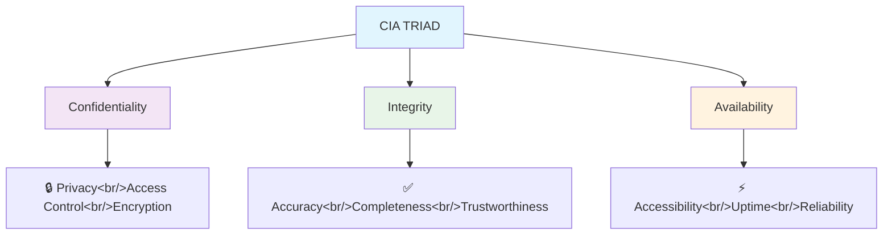
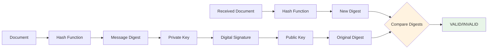
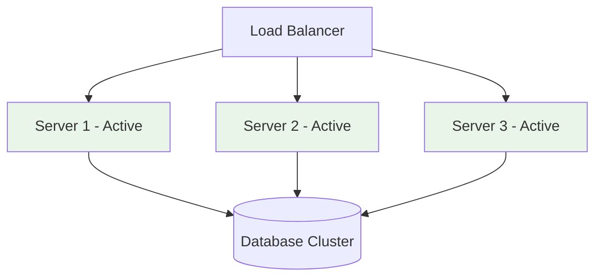
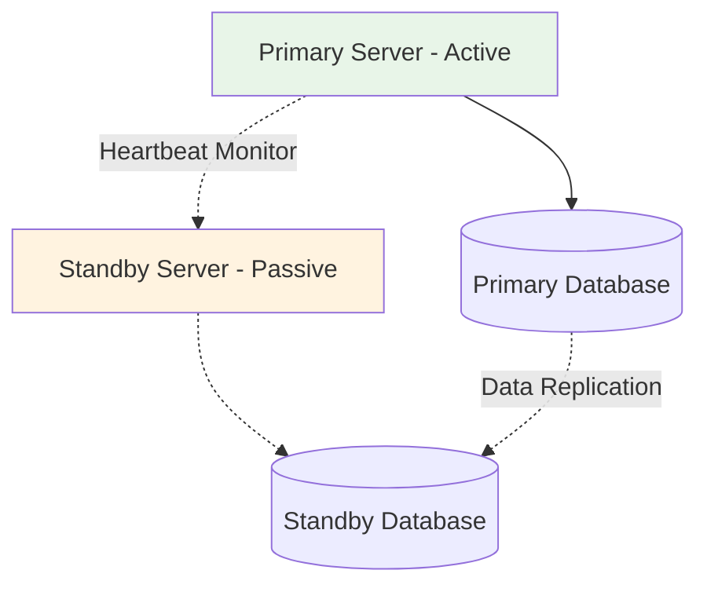
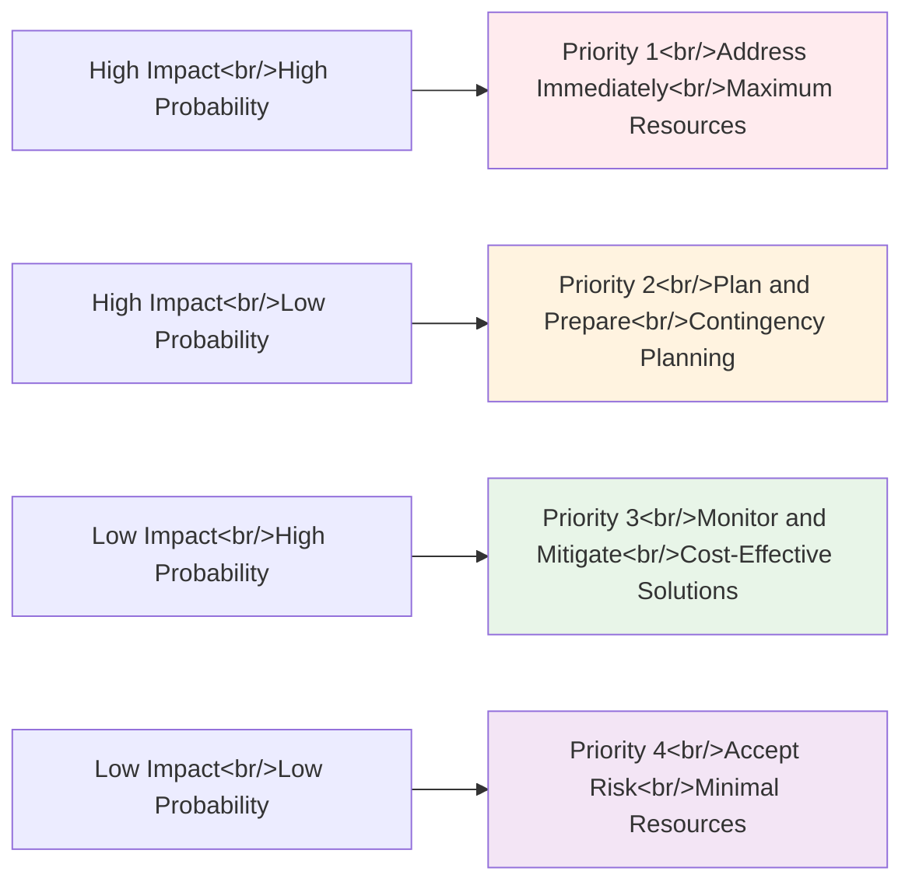
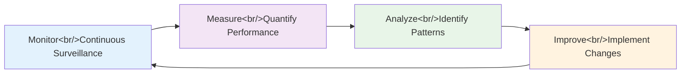

# Computer Security Fundamentals

## Lecture 2: CIA Triad & Information Security Principles

<div class="pt-12">
  <span @click="$slidev.nav.next" class="px-2 py-1 rounded cursor-pointer" hover="bg-white bg-opacity-10">
    Press Space for next page <carbon:arrow-right class="inline"/>
  </span>
</div>

<div v-click="1">
  <p class="text-blue-400">🔐 Understanding Security Fundamentals</p>
</div>

<div v-click="2">
  <p class="text-green-400">📊 CIA Triad Deep Dive</p>
</div>

<div v-click="3">
  <p class="text-purple-400">🛡️ Real-world Applications</p>
</div>

<!--
Welcome to today's lecture on Computer Security Fundamentals. This is Lecture 2, where we will dive deep into the most fundamental concepts of cybersecurity.

[click] Today we will explore the CIA Triad and Information Security Principles, building upon the foundation we established in our first lecture.

[click] These three fundamental concepts - Confidentiality, Integrity, and Availability - form the cornerstone of all cybersecurity practices and decision-making processes.

[click] Today's session will give you a comprehensive understanding of how these principles work together to protect digital assets and information systems in real-world scenarios.
-->

---
layout: default
---

# Recap: Previous Lecture

<div class="grid grid-cols-2 gap-8">

<div>

## 🔄 What We Covered

<v-clicks>

- **Cyber security definition** and importance
- **Digital asset protection** strategies  
- **Current threat landscape** analysis
- **Career opportunities** in cybersecurity
- **Regulatory requirements** and compliance

</v-clicks>

</div>

<div v-click="6">

## 🎯 Today's Learning Objectives

<v-clicks at="7">

- **Understand CIA Triad** fundamentals and interdependencies
- **Apply security principles** in practical scenarios
- **Analyze real-world examples** of CIA implementations
- **Design secure systems** using CIA principles effectively

</v-clicks>

</div>

</div>

<!--
Let's begin with a comprehensive recap of our previous lecture to ensure we're all on the same page before diving into today's advanced topics.

[click] In our first session, we covered several fundamental concepts in cybersecurity. We established a solid understanding of cyber security definitions and explored why cybersecurity has become critical in today's interconnected digital world.

[click] We examined digital asset protection strategies and discussed how organizations must safeguard their most valuable information resources.

[click] We analyzed the current threat landscape, understanding the evolving nature of cyber threats and attack vectors that organizations face today.

[click] We explored the exciting career opportunities available in cybersecurity and discussed the various paths professionals can take in this growing field.

[click] Finally, we reviewed regulatory requirements and compliance frameworks that organizations must navigate to maintain legal and ethical security standards.

[click] Now, let's focus on today's learning objectives, which build directly upon this foundation.

[click] Today we'll understand CIA Triad fundamentals and how these three principles create interdependencies that must be carefully balanced.

[click] We'll apply security principles in practical scenarios, moving beyond theory to real-world implementation challenges.

[click] We'll analyze comprehensive real-world examples of CIA implementations across different industries and use cases.

[click] Finally, we'll learn to design secure systems using CIA principles effectively, giving you the tools to make informed security decisions.
-->

---
layout: center
class: text-center
---

# The CIA Triad

<p v-click="1" class="text-xl">## The Foundation of Information Security</p>

<div class="cia-triangle mt-12" v-click="2">



</div>

<div class="grid grid-cols-3 gap-4 mt-8">
  <div v-click="3" class="text-center">
    <h3 class="text-purple-400">🔒 Confidentiality</h3>
    <p class="text-sm">Privacy & Access Control</p>
  </div>
  <div v-click="4" class="text-center">
    <h3 class="text-green-400">✅ Integrity</h3>
    <p class="text-sm">Accuracy & Trustworthiness</p>
  </div>
  <div v-click="5" class="text-center">
    <h3 class="text-orange-400">⚡ Availability</h3>
    <p class="text-sm">Accessibility & Reliability</p>
  </div>
</div>

<!--
Now we come to the central topic of today's lecture: The CIA Triad, which forms the absolute foundation of information security theory and practice.

[click] The CIA Triad represents the three fundamental pillars of information security that every cybersecurity professional must understand, internalize, and apply in their daily work.

[click] This diagram illustrates how these three principles work together as an interconnected system. Notice that each component supports and depends upon the others, creating a balanced approach to security.

[click] Confidentiality focuses on privacy and access control, ensuring that sensitive information remains protected from unauthorized disclosure through techniques like encryption and access management.

[click] Integrity ensures accuracy, completeness, and trustworthiness of data, protecting against unauthorized modification and ensuring data remains reliable throughout its lifecycle.

[click] Availability addresses accessibility, uptime, and reliability of systems, ensuring that authorized users can access information and services when needed. This triangle diagram shows how these concepts interconnect to form the foundation of information security decision-making.
-->

---
layout: default
---

# Confidentiality: Keeping Secrets Secret

<div class="grid grid-cols-2 gap-8">

<div>

<div v-click="1">

## 🔒 Definition
**Confidentiality** ensures that sensitive information is accessible only to authorized individuals and remains hidden from unauthorized parties, preventing data breaches and privacy violations.

</div>

<div v-click="2">

## 🎯 Key Principles

<v-clicks at="3">

- **Need-to-know basis** - Access only to required information
- **Least privilege access** - Minimum necessary permissions
- **Data classification** - Categorizing information sensitivity
- **Privacy protection** - Safeguarding personal information

</v-clicks>

</div>

<div v-click="7">

## 🛠️ Implementation Methods

<v-clicks at="8">

- **Encryption** (at rest and in transit) - AES, RSA, TLS
- **Access controls** and permissions - RBAC, ACLs
- **Authentication** mechanisms - MFA, biometrics
- **Data masking** and anonymization - Protecting sensitive fields

</v-clicks>

</div>

</div>

<div v-click="12">

## 📊 Real-World Examples

<div v-click="13">

### ✅ Good Confidentiality Practices

<v-clicks at="14">

- **Banking:** Account numbers encrypted with AES-256
- **Healthcare:** Patient records protected under HIPAA
- **Government:** Classified documents with security clearances
- **Corporate:** Trade secrets protected with NDAs and encryption

</v-clicks>

</div>

<div v-click="18">

### ❌ Major Confidentiality Breaches

<v-clicks at="19">

- **Equifax (2017):** 147M records exposed - SSNs, credit data
- **Facebook (2018):** 87M users affected by Cambridge Analytica
- **Yahoo (2013-2014):** 3B accounts compromised - passwords, emails
- **Marriott (2018):** 500M guests' data stolen - passports, payment cards

</v-clicks>

</div>

<div v-click="23">

### 🔍 Impact Assessment

<v-clicks at="24">

- **Financial losses** - Regulatory fines, legal costs, remediation
- **Identity theft** - Personal information misuse
- **Reputation damage** - Loss of customer trust and market value
- **Legal consequences** - Lawsuits, regulatory sanctions

</v-clicks>

</div>

</div>

</div>

<!--
Let's dive deep into the first pillar: Confidentiality, which is fundamentally about keeping secrets secret and protecting sensitive information from unauthorized disclosure.

[click] Confidentiality ensures that sensitive information is accessible only to authorized individuals and remains completely hidden from unauthorized parties. This goes beyond simple password protection to encompass comprehensive data protection strategies that prevent breaches and privacy violations.

[click] The key principles of confidentiality form the foundation of how we approach information protection in practice.

[click] Need-to-know basis means individuals should only have access to the specific information required to perform their job functions, nothing more.

[click] Least privilege access ensures users receive the minimum necessary permissions to accomplish their tasks, reducing the attack surface.

[click] Data classification involves categorizing information based on its sensitivity level and applying appropriate protection measures accordingly.

[click] Privacy protection focuses specifically on safeguarding personal information and ensuring compliance with privacy regulations.

[click] Now let's examine the technical implementation methods that make confidentiality possible in real-world systems.

[click] Encryption, both at rest and in transit, uses algorithms like AES for data storage and TLS for network communication.

[click] Access controls and permissions implement role-based access control and access control lists to manage who can access what resources.

[click] Authentication mechanisms, including multi-factor authentication and biometrics, verify user identities before granting access.

[click] Data masking and anonymization protect sensitive fields in databases and testing environments.

[click] Now let's examine real-world examples to see how confidentiality works in practice and what happens when it fails.

[click] First, let's look at examples of good confidentiality practices across different industries.

[click] Banking institutions encrypt account numbers using AES-256 encryption, ensuring customer financial data remains protected.

[click] Healthcare organizations protect patient records under HIPAA regulations, implementing comprehensive privacy safeguards.

[click] Government agencies protect classified documents through security clearance systems and need-to-know access controls.

[click] Corporate organizations protect trade secrets using non-disclosure agreements combined with encryption and access controls.

[click] Unfortunately, we've also witnessed major confidentiality breaches that demonstrate the consequences of inadequate protection.

[click] The Equifax breach in 2017 exposed 147 million records including Social Security numbers and credit information, demonstrating the catastrophic impact of poor security practices.

[click] Facebook's Cambridge Analytica scandal in 2018 affected 87 million users, showing how personal data can be misused for political manipulation.

[click] Yahoo's massive breaches from 2013-2014 compromised 3 billion accounts, including passwords and email content, representing one of the largest data breaches in history.

[click] Marriott's 2018 breach affected 500 million guests, exposing passport numbers and payment card information, highlighting vulnerabilities in the hospitality industry.

[click] These breaches result in severe consequences that organizations must consider when implementing confidentiality measures.

[click] Financial losses include regulatory fines that can reach hundreds of millions of dollars, plus legal costs and remediation expenses.

[click] Identity theft occurs when personal information is misused by criminals to impersonate victims and commit fraud.

[click] Reputation damage leads to loss of customer trust and decreased market value, sometimes taking years to recover.

[click] Legal consequences include lawsuits from affected individuals and regulatory sanctions that can impact business operations.
-->

---
layout: default
---

# Confidentiality: Technical Implementation

<div class="grid grid-cols-2 gap-8">

<div>

<div v-click="1">

## 🔐 Encryption Technologies

### Symmetric Encryption Example
```python
# AES Encryption Implementation
from cryptography.fernet import Fernet

# Generate encryption key
key = Fernet.generate_key()
cipher_suite = Fernet(key)

# Encrypt confidential data
plain_text = b"Confidential Customer Data"
encrypted_data = cipher_suite.encrypt(plain_text)

# Decrypt when authorized
decrypted_data = cipher_suite.decrypt(encrypted_data)
```

</div>

<div v-click="2">

### Access Control Models

<v-clicks at="3">

- **Discretionary (DAC)** - Owner controls access
- **Mandatory (MAC)** - System enforces access rules
- **Role-Based (RBAC)** - Access based on user roles
- **Attribute-Based (ABAC)** - Context-aware access control

</v-clicks>

</div>

</div>

<div>

<div v-click="7">

## 🚪 Access Control Systems

<div v-click="8">

### Authentication Factors

<v-clicks at="9">

1. **Something you know** (passwords, PINs, security questions)
2. **Something you have** (tokens, smart cards, mobile devices)
3. **Something you are** (biometrics, fingerprints, retina scans)

</v-clicks>

</div>

<div v-click="12">

### Authorization Framework
```yaml
User Permission Levels:
  - Read: View information only
  - Write: Modify existing information
  - Execute: Run programs and scripts
  - Delete: Remove information permanently
  - Admin: Full system control

Data Classification Levels:
  - Public: No access restrictions
  - Internal: Company employees only
  - Confidential: Limited role-based access
  - Restricted: Highest security clearance required
```

</div>

</div>

</div>

</div>

<!--
Now let's examine the technical implementation details that make confidentiality possible in modern information systems.

[click] Encryption technologies form the backbone of confidentiality protection. This Python example demonstrates AES encryption, one of the most widely used symmetric encryption algorithms. Notice how we generate a secure key, encrypt sensitive data, and only decrypt it when proper authorization is provided. This same principle applies whether we're protecting data at rest in databases or data in transit across networks.

[click] Access control models provide different approaches to managing who can access what information, each with distinct advantages and use cases.

[click] Discretionary Access Control allows data owners to control who can access their information, providing flexibility but requiring careful management.

[click] Mandatory Access Control uses system-enforced rules based on security labels, providing strong security but less flexibility.

[click] Role-Based Access Control assigns permissions based on user roles within the organization, balancing security with administrative efficiency.

[click] Attribute-Based Access Control considers multiple factors like time, location, and context to make access decisions, providing the most granular control.

[click] Access control systems implement these models through comprehensive authentication and authorization frameworks.

[click] Authentication systems verify user identity before granting any access to protected resources.

[click] The first factor, something you know, includes passwords, PINs, and security questions that test the user's knowledge.

[click] The second factor, something you have, involves physical tokens, smart cards, or mobile devices that generate unique codes.

[click] The third factor, something you are, uses biometric characteristics like fingerprints or retina scans that are unique to each individual.

[click] Authorization frameworks then determine what authenticated users can actually do with the resources they access. This YAML configuration shows how we can implement granular permission levels, from basic read access to full administrative control, while also classifying data based on sensitivity levels to ensure appropriate protection measures are applied.
-->

---
layout: default
---

# Integrity: Ensuring Data Accuracy

<div class="grid grid-cols-2 gap-8">

<div>

<div v-click="1">

## ✅ Definition
**Integrity** ensures that data remains accurate, complete, and unaltered during storage, processing, and transmission, protecting against both accidental corruption and malicious tampering.

</div>

<div v-click="2">

## 🎯 Key Aspects

<v-clicks at="3">

- **Data accuracy** - Information reflects reality correctly
- **Data completeness** - No missing or truncated information
- **Data consistency** - No contradictory information exists
- **Non-repudiation** - Actions cannot be denied later

</v-clicks>

</div>

<div v-click="7">

## 🛡️ Common Threat Scenarios

<v-clicks at="8">

- **Unauthorized modifications** - Insider threats, privilege escalation
- **System errors and bugs** - Software defects, configuration issues
- **Hardware failures** - Disk corruption, memory errors
- **Malicious attacks** - SQL injection, man-in-the-middle
- **Human errors** - Accidental deletion, incorrect data entry

</v-clicks>

</div>

</div>

<div>

<div v-click="13">

## 🔧 Integrity Protection Mechanisms

### 🏗️ Technical Controls

<v-clicks at="14">

- **Hash functions** (SHA-256, SHA-3) - Data fingerprinting
- **Digital signatures** - Cryptographic authentication
- **Checksums and CRC** - Error detection codes
- **Version control systems** - Change tracking and rollback
- **Database constraints** - Data validation rules

</v-clicks>

</div>

<div v-click="19">

### 📋 Procedural Controls

<v-clicks at="20">

- **Change management** - Controlled modification processes
- **Audit trails** - Comprehensive activity logging
- **Input validation** - Data sanitization and verification
- **Backup verification** - Regular restore testing
- **Data reconciliation** - Cross-system consistency checks

</v-clicks>

</div>

<div v-click="25">

### 📊 Real-World Violation Examples

<v-clicks at="26">

- **SQL injection** - Database manipulation via malicious queries
- **Man-in-the-middle** - Network traffic interception and alteration
- **Insider threats** - Authorized users making unauthorized changes
- **System corruption** - Hardware or software failures causing data loss

</v-clicks>

</div>

</div>

</div>

<!--
The second pillar of the CIA Triad is Integrity, which ensures that data remains trustworthy and unaltered throughout its entire lifecycle.

[click] Integrity ensures that data remains accurate, complete, and unaltered during storage, processing, and transmission. This protection applies whether the threat comes from accidental corruption due to system failures or deliberate tampering by malicious actors. Integrity is critical because decisions based on corrupted data can have severe consequences.

[click] Understanding the key aspects of integrity helps us implement comprehensive protection strategies.

[click] Data accuracy means that information correctly reflects reality and hasn't been corrupted or modified inappropriately.

[click] Data completeness ensures that no information has been lost, truncated, or is missing from what should be a complete dataset.

[click] Data consistency prevents contradictory information from existing within systems, ensuring that related data elements remain logically coherent.

[click] Non-repudiation ensures that individuals cannot deny actions they have performed, providing accountability and legal protection.

[click] To protect integrity effectively, we must understand the various threat scenarios that can compromise data accuracy and completeness.

[click] Unauthorized modifications can occur through insider threats where trusted individuals abuse their access, or through privilege escalation attacks where attackers gain elevated permissions.

[click] System errors and bugs represent unintentional threats, including software defects that corrupt data or configuration issues that lead to data inconsistencies.

[click] Hardware failures, such as disk corruption or memory errors, can physically damage stored data or cause processing errors.

[click] Malicious attacks like SQL injection deliberately manipulate data, while man-in-the-middle attacks can alter data during transmission.

[click] Human errors, including accidental deletion or incorrect data entry, represent a significant source of integrity violations that proper procedures can help prevent.

[click] Protecting integrity requires a comprehensive approach combining technical and procedural controls.

[click] Technical controls provide automated protection mechanisms that operate continuously without human intervention.

[click] Hash functions like SHA-256 create unique digital fingerprints that can detect any changes to data, no matter how small.

[click] Digital signatures provide cryptographic authentication, ensuring that data comes from a trusted source and hasn't been tampered with.

[click] Checksums and cyclic redundancy checks offer lightweight error detection for routine data verification.

[click] Version control systems track all changes to data and allow rollback to previous versions if corruption is detected.

[click] Database constraints enforce data validation rules at the storage level, preventing invalid data from being saved.

[click] Procedural controls complement technical measures by establishing human processes and oversight.

[click] Change management processes ensure that all modifications follow controlled procedures with proper authorization and documentation.

[click] Audit trails provide comprehensive logging of all activities, enabling detection of unauthorized changes and forensic analysis.

[click] Input validation sanitizes and verifies all data before processing, preventing malicious or malformed data from entering systems.

[click] Backup verification includes regular testing of restore procedures to ensure that backup data maintains its integrity.

[click] Data reconciliation performs cross-system consistency checks to identify and resolve discrepancies between related systems.

[click] Understanding real-world integrity violations helps us recognize threats and implement appropriate defenses.

[click] SQL injection attacks manipulate database queries to modify data inappropriately, representing one of the most common web application vulnerabilities.

[click] Man-in-the-middle attacks can intercept and alter network traffic, compromising data integrity during transmission.

[click] Insider threats involve authorized users making unauthorized changes, highlighting the need for proper access controls and monitoring.

[click] System corruption from hardware or software failures can cause widespread data loss, emphasizing the importance of robust backup and recovery procedures.
-->

---
layout: default
---

# Integrity: Hash Functions & Digital Signatures

<div class="grid grid-cols-2 gap-8">

<div>

<div v-click="1">

## 🔢 Hash Functions in Practice

### Data Integrity Verification
```python
import hashlib

# Original financial record
data = "Transaction: $1,500.00 to Account #12345"
original_hash = hashlib.sha256(data.encode()).hexdigest()

# Someone modifies the amount
modified_data = "Transaction: $15,000.00 to Account #12345"
modified_hash = hashlib.sha256(modified_data.encode()).hexdigest()

print(f"Original:  {original_hash[:32]}...")
print(f"Modified:  {modified_hash[:32]}...")
print(f"Integrity: {'VALID' if original_hash == modified_hash else 'COMPROMISED'}")
# Output: Integrity: COMPROMISED
```

</div>

<div v-click="2">

### Hash Properties

<v-clicks at="3">

- **Deterministic** - Same input always produces same hash
- **Fast computation** - Efficient for large datasets
- **Avalanche effect** - Tiny change creates completely different hash
- **One-way function** - Cannot reverse engineer original data
- **Collision resistant** - Extremely difficult to find two inputs with same hash

</v-clicks>

</div>

</div>

<div v-click="8">

## ✍️ Digital Signatures Workflow

<div v-click="9">

### Authentication Process


</div>

<div v-click="10">

### Digital Signature Benefits

<v-clicks at="11">

- **Authentication** - Cryptographically proves sender identity
- **Integrity** - Detects any tampering with signed content
- **Non-repudiation** - Signer cannot deny having signed document
- **Timestamping** - Proves when document was signed

</v-clicks>

</div>

</div>

</div>

<!--
Let's examine the technical mechanisms that make integrity protection possible, focusing on hash functions and digital signatures as fundamental tools.

[click] Hash functions serve as digital fingerprints for data, providing a mathematically reliable way to detect any changes. This Python example demonstrates how even a small modification to financial data creates a completely different hash value, immediately revealing that the data has been compromised. This technique is used extensively in banking, legal documents, and any situation where data accuracy is critical.

[click] Understanding the mathematical properties of hash functions helps us appreciate why they're so effective for integrity protection.

[click] The deterministic property ensures that the same input will always produce the same hash value, making verification reliable and consistent.

[click] Fast computation allows hash functions to process large datasets efficiently, making them practical for real-world applications.

[click] The avalanche effect means that changing even a single bit in the input creates a completely different hash, making tampering immediately detectable.

[click] The one-way function property means it's computationally infeasible to reverse-engineer the original data from the hash, protecting data confidentiality.

[click] Collision resistance makes it extremely difficult for attackers to find two different inputs that produce the same hash, preventing sophisticated forgery attempts.

[click] Digital signatures combine hash functions with public-key cryptography to provide comprehensive authentication and integrity protection.

[click] This diagram illustrates the complete digital signature workflow, showing how the sender creates a signature and how the receiver verifies it.

[click] The process begins with the sender creating a hash of the document, then encrypting that hash with their private key to create the digital signature. The receiver can then use the sender's public key to decrypt the signature and compare it with a fresh hash of the received document. If the hashes match, the signature is valid.

[click] Digital signatures provide multiple security benefits that make them essential for high-security applications.

[click] Authentication cryptographically proves the identity of the document signer, preventing impersonation attacks.

[click] Integrity detection reveals any tampering with the signed content, no matter how subtle the changes.

[click] Non-repudiation means the signer cannot later deny having signed the document, providing legal accountability.

[click] Timestamping capabilities prove when the document was signed, which can be crucial for legal and regulatory compliance purposes.
-->

---
layout: default
---

# Availability: Ensuring System Access

<div class="grid grid-cols-2 gap-8">

<div>

<div v-click="1">

## ⚡ Definition
**Availability** ensures that information and resources are accessible to authorized users when needed, maintaining system uptime, responsiveness, and reliability even under adverse conditions.

</div>

<div v-click="2">

## 📈 Availability Metrics

<v-clicks at="3">

- **Uptime percentage** (99.9% = 8.76 hours downtime/year)
- **Mean Time Between Failures (MTBF)** - System reliability measure
- **Mean Time To Recovery (MTTR)** - How quickly systems are restored
- **Recovery Point Objective (RPO)** - Maximum acceptable data loss
- **Recovery Time Objective (RTO)** - Maximum acceptable downtime

</v-clicks>

</div>

<div v-click="8">

## 💡 Availability Requirements by Industry

<v-clicks at="9">

- **24/7 critical systems** - Hospitals, emergency services, power grids
- **Business hours coverage** - Standard office applications, internal tools
- **Scheduled maintenance windows** - Planned downtime for updates
- **Disaster recovery capabilities** - Geographic redundancy and failover

</v-clicks>

</div>

</div>

<div>

<div v-click="13">

## 🛠️ Availability Solutions

### 🏗️ Infrastructure Design

<v-clicks at="14">

- **Redundancy** - Eliminate single points of failure completely
- **Load balancing** - Distribute traffic across multiple servers
- **Clustering** - Multiple servers working as unified system
- **Geographic distribution** - Multi-region deployment strategies

</v-clicks>

</div>

<div v-click="18">

### 🔄 Backup and Recovery Strategies

<v-clicks at="19">

- **3-2-1 Rule:** 3 copies of data, 2 different media types, 1 offsite location
- **Full backups** - Complete data snapshots for comprehensive recovery
- **Incremental backups** - Only changes since last backup for efficiency
- **Differential backups** - All changes since last full backup

</v-clicks>

</div>

<div v-click="23">

### 🚨 Threat Mitigation

<v-clicks at="24">

- **DDoS protection** - Traffic filtering and rate limiting
- **Hardware monitoring** - Proactive failure detection and alerts
- **Capacity planning** - Ensuring adequate resources for peak loads
- **Incident response** - Rapid reaction to availability threats

</v-clicks>

</div>

</div>

</div>

<!--
The third pillar of the CIA Triad is Availability, which ensures that information and resources remain accessible when authorized users need them.

[click] Availability ensures that information and resources are accessible to authorized users when needed, maintaining system uptime, responsiveness, and reliability even under adverse conditions such as hardware failures, cyberattacks, or natural disasters. This is critical because even the most secure and accurate data is useless if users cannot access it when needed.

[click] Measuring availability requires specific metrics that help organizations understand and improve their system reliability.

[click] Uptime percentage is the most common availability metric, where 99.9% uptime means only 8.76 hours of downtime per year, which might sound good but could still represent significant business impact.

[click] Mean Time Between Failures measures how reliable systems are by tracking the average time between system failures.

[click] Mean Time To Recovery measures how quickly systems can be restored after failures, which is crucial for minimizing business impact.

[click] Recovery Point Objective defines the maximum amount of data loss that's acceptable, helping determine backup frequency.

[click] Recovery Time Objective specifies the maximum acceptable downtime, influencing the design of recovery procedures and infrastructure investments.

[click] Different industries have vastly different availability requirements based on the criticality of their operations.

[click] 24/7 critical systems in hospitals, emergency services, and power grids require near-perfect availability because failures can literally be matters of life and death.

[click] Business hours coverage may be sufficient for standard office applications and internal tools that aren't needed outside normal working hours.

[click] Scheduled maintenance windows allow for planned downtime during low-usage periods to perform necessary updates and improvements.

[click] Disaster recovery capabilities ensure that systems can continue operating even when primary facilities are compromised by natural disasters or other catastrophic events.

[click] Achieving high availability requires comprehensive solutions that address all potential failure points.

[click] Infrastructure design forms the foundation of availability by building systems that can withstand various types of failures.

[click] Redundancy eliminates single points of failure by ensuring that if any component fails, backup components can immediately take over without service interruption.

[click] Load balancing distributes traffic across multiple servers, preventing any single server from becoming overwhelmed and ensuring continued service even if servers fail.

[click] Clustering allows multiple servers to work together as a unified system, providing both performance benefits and automatic failover capabilities.

[click] Geographic distribution protects against localized disasters by deploying systems across multiple regions, ensuring service continuity even if entire data centers become unavailable.

[click] Backup and recovery strategies protect against data loss and enable rapid restoration of services after failures.

[click] The 3-2-1 rule is a fundamental backup strategy: maintain 3 copies of important data, store them on 2 different types of media, and keep 1 copy offsite to protect against local disasters.

[click] Full backups create complete snapshots of all data, providing comprehensive recovery capabilities but requiring significant storage space and time.

[click] Incremental backups only capture changes since the last backup, improving efficiency but requiring more complex recovery procedures.

[click] Differential backups capture all changes since the last full backup, balancing recovery simplicity with storage efficiency.

[click] Proactive threat mitigation helps prevent availability issues before they occur.

[click] DDoS protection uses traffic filtering and rate limiting to prevent distributed denial-of-service attacks from overwhelming systems.

[click] Hardware monitoring provides proactive failure detection and alerts, allowing administrators to replace failing components before they cause outages.

[click] Capacity planning ensures that systems have adequate resources to handle peak loads without degradation or failure.

[click] Incident response procedures enable rapid reaction to availability threats, minimizing downtime through coordinated and practiced response protocols.
-->

---
layout: default
---

# Availability: High Availability Architectures

<div class="grid grid-cols-2 gap-8">

<div>

<div v-click="1">

## 🏗️ Redundancy Models

### Active-Active Configuration


<v-clicks at="2">

- **All servers actively processing** requests simultaneously
- **Load distributed** evenly across all available resources
- **Higher resource utilization** and better performance
- **Immediate failover** without service interruption

</v-clicks>

</div>

<div v-click="6">

### Active-Passive Configuration


<v-clicks at="7">

- **One server active**, others in standby mode
- **Automatic failover** when primary server fails
- **Resource inefficient** but simpler to manage
- **Brief service interruption** during failover

</v-clicks>

</div>

</div>

<div>

<div v-click="11">

## 📊 Availability Service Level Agreements

| **Availability Level** | **Uptime %** | **Downtime/Year** | **Typical Use Cases** |
|------------------------|--------------|-------------------|-----------------------|
| Basic | 90% | 36.5 days | Development environments |
| Managed | 95% | 18.25 days | Internal business tools |
| Improved | 99% | 3.65 days | Standard business applications |
| High | 99.9% | 8.76 hours | E-commerce platforms |
| Very High | 99.99% | 52.6 minutes | Financial trading systems |
| Extreme | 99.999% | 5.26 minutes | Emergency services, life support |

<div v-click="12">

### 💰 Cost vs Availability Trade-offs

<v-clicks at="13">

- **Higher availability requires exponentially higher costs** for infrastructure and staffing
- **Diminishing returns** become significant after 99.9% availability
- **Business impact analysis** essential to determine appropriate availability level
- **Risk tolerance assessment** must balance costs against potential losses

</v-clicks>

</div>

</div>

</div>

</div>

<!--
Understanding different high availability architectures helps organizations choose the right approach for their specific needs and constraints.

[click] Redundancy models provide different approaches to ensuring continuous service availability when individual components fail.

[click] Active-Active configurations represent the gold standard for high availability, where all servers actively process requests simultaneously.

[click] Load is distributed evenly across all available resources, maximizing performance and resource utilization.

[click] Higher resource utilization means organizations get more value from their infrastructure investments.

[click] Immediate failover occurs automatically without any service interruption because remaining servers simply absorb the load from failed components.

[click] Active-Passive configurations offer a simpler but less efficient approach to high availability.

[click] In this model, one server actively handles all requests while others remain in standby mode, ready to take over if needed.

[click] Automatic failover activates standby servers when the primary server fails, but this process may cause brief service interruptions.

[click] While resource inefficient because standby servers sit idle, this architecture is simpler to manage and troubleshoot.

[click] Brief service interruptions during failover are acceptable for many business applications but may not meet the requirements of critical systems.

[click] Understanding availability service level agreements helps organizations set realistic expectations and make informed decisions about infrastructure investments.

[click] This table shows the relationship between availability percentages and actual downtime, revealing how small percentage improvements translate to dramatically different service levels. Notice how extreme availability levels require massive investments for minimal additional uptime improvement.

[click] Cost versus availability trade-offs become critical considerations for any organization implementing high availability systems.

[click] Higher availability requires exponentially higher costs for infrastructure, software licensing, specialized staff, and ongoing maintenance.

[click] Diminishing returns become significant after 99.9% availability, where each additional nine costs dramatically more than the previous one.

[click] Business impact analysis becomes essential to determine the appropriate availability level by calculating the actual cost of downtime versus the cost of prevention.

[click] Risk tolerance assessment must carefully balance the costs of high availability infrastructure against the potential losses from system outages, considering both financial impact and reputation damage.
-->

---
layout: default
---

# CIA Triad Relationships & Trade-offs

<div class="grid grid-cols-2 gap-8">

<div>

<div v-click="1">

## ⚖️ The Balancing Challenge

### Confidentiality vs Availability

<v-clicks at="2">

- **Strong encryption** may slow system access and response times
- **Complex authentication** reduces user experience and system usability
- **Strict access controls** can limit legitimate access during emergencies
- **VPN requirements** may prevent access during network outages

</v-clicks>

</div>

<div v-click="6">

### Integrity vs Performance

<v-clicks at="7">

- **Hash calculations** consume CPU resources and processing time
- **Digital signatures** add computational overhead to every transaction
- **Audit logging** requires significant storage and database resources
- **Input validation** increases response latency for user interactions

</v-clicks>

</div>

<div v-click="11">

### Security vs Usability

<v-clicks at="12">

- **Enhanced security measures** often reduce convenience and efficiency
- **User experience optimization** may compromise security controls
- **Balance requires** understanding business needs and risk tolerance
- **Stakeholder alignment** essential for successful implementation

</v-clicks>

</div>

</div>

<div v-click="16">

## 🎯 Decision-Making Framework

<div v-click="17">

### Critical Assessment Questions

<v-clicks at="18">

1. **What specific data requires protection** and at what sensitivity level?
2. **Who needs access** and under what circumstances?
3. **What threats** pose the greatest risk to our operations?
4. **What would be the business impact** of confidentiality, integrity, or availability failures?
5. **What resources and budget** are available for security measures?

</v-clicks>

</div>

<div v-click="23">

### Risk-Based Prioritization Matrix


</div>

</div>

</div>

<!--
Understanding the relationships and trade-offs between CIA components is crucial for making informed security decisions in real-world environments.

[click] The balancing challenge reveals that maximizing one aspect of the CIA Triad often requires compromising others, making security decision-making a complex optimization problem.

[click] Confidentiality versus Availability trade-offs appear frequently in system design and operations.

[click] Strong encryption algorithms may significantly slow system access and response times, particularly for mobile devices or older hardware.

[click] Complex authentication mechanisms, while improving security, can reduce user experience and system usability, potentially leading to user resistance or workaround behaviors.

[click] Strict access controls designed to protect sensitive information can unfortunately limit legitimate access during emergency situations when rapid response is critical.

[click] VPN requirements that protect network communications may prevent essential access during network outages or in remote locations with limited connectivity.

[click] Integrity versus Performance trade-offs require careful consideration of computational overhead against data protection needs.

[click] Hash calculations for data integrity verification consume CPU resources and processing time, which can impact system performance under heavy loads.

[click] Digital signatures provide excellent authentication and integrity protection but add computational overhead to every transaction, potentially slowing high-volume systems.

[click] Comprehensive audit logging supports integrity monitoring and forensic analysis but requires significant storage space and database resources.

[click] Thorough input validation prevents many integrity attacks but increases response latency for user interactions, particularly in real-time applications.

[click] Security versus Usability represents one of the most challenging balance points in cybersecurity implementation.

[click] Enhanced security measures often reduce convenience and efficiency, potentially impacting productivity and user satisfaction.

[click] User experience optimization may compromise security controls if not carefully managed, creating vulnerabilities that attackers can exploit.

[click] Achieving the right balance requires deep understanding of business needs, risk tolerance, and user behavior patterns.

[click] Stakeholder alignment becomes essential for successful implementation, ensuring that security decisions have buy-in from all affected parties.

[click] A structured decision-making framework helps organizations navigate these complex trade-offs systematically.

[click] Critical assessment questions provide a foundation for informed security decision-making.

[click] Understanding what specific data requires protection and at what sensitivity level helps determine appropriate security controls and resource allocation.

[click] Identifying who needs access and under what circumstances enables the design of appropriate authentication and authorization systems.

[click] Analyzing what threats pose the greatest risk helps prioritize security investments and countermeasures.

[click] Assessing the potential business impact of different types of security failures helps justify security expenditures and guide resource allocation.

[click] Understanding available resources and budget constraints ensures that security solutions are practical and sustainable.

[click] A risk-based prioritization matrix helps organizations allocate limited security resources most effectively by focusing on the highest-risk scenarios first. This systematic approach ensures that the most critical threats receive immediate attention while lower-priority risks are managed through cost-effective monitoring and mitigation strategies.
-->

---
layout: default
---

# Real-World CIA Triad Applications

<div class="grid grid-cols-3 gap-6">

<div class="sector-example" v-click="1">

## 🏦 Banking System Analysis

<div v-click="2">

### Confidentiality Implementation
- **Account data encryption** with AES-256 standards
- **PII protection** compliance with financial regulations
- **Transaction privacy** through secure communication channels
- **Customer identity** protection with multi-layered authentication

</div>

<div v-click="3">

### Integrity Assurance
- **Transaction accuracy** with real-time validation systems
- **Comprehensive audit trails** for regulatory compliance
- **Non-repudiation** through digital signatures and timestamps
- **Data consistency** across distributed banking networks

</div>

<div v-click="4">

### Availability Requirements
- **24/7 ATM network** access for customer convenience
- **Online banking uptime** with 99.99% SLA targets
- **Disaster recovery** with geographic redundancy
- **Peak load handling** during high-transaction periods

</div>

<div v-click="5">

**Priority Balance:** All three components equally critical for regulatory compliance and customer trust

</div>

</div>

<div class="sector-example" v-click="6">

## 🏥 Healthcare System Analysis

<div v-click="7">

### Confidentiality Focus
- **HIPAA compliance** with strict patient privacy controls
- **Medical record protection** through role-based access
- **Patient identity** safeguarding with anonymization
- **Research data** de-identification for privacy protection

</div>

<div v-click="8">

### Integrity Considerations
- **Medical record accuracy** critical for patient safety
- **Prescription correctness** to prevent medication errors
- **Treatment history** completeness for continuity of care
- **Diagnostic data** reliability for medical decision-making

</div>

<div v-click="9">

### Availability Imperatives
- **Emergency system access** for life-threatening situations
- **Life support systems** requiring 99.999% uptime
- **Medical device connectivity** for continuous monitoring
- **Critical care** systems with zero tolerance for downtime

</div>

<div v-click="10">

**Priority Ranking:** Availability > Integrity > Confidentiality (Life safety takes precedence)

</div>

</div>

<div class="sector-example" v-click="11">

## 🎓 Educational System Analysis

<div v-click="12">

### Confidentiality Requirements
- **Student records** protection under FERPA regulations
- **Grade privacy** ensuring academic confidentiality
- **Research data** protection for intellectual property
- **Personal information** safeguarding for minors

</div>

<div v-click="13">

### Integrity Priorities
- **Grade accuracy** fundamental to academic credibility
- **Academic transcripts** requiring tamper-proof systems
- **Research results** integrity for scientific validity
- **Assessment data** reliability for educational outcomes

</div>

<div v-click="14">

### Availability Needs
- **Learning management systems** supporting online education
- **Registration systems** during enrollment periods
- **Student services** accessibility for support functions
- **Research systems** uptime for ongoing projects

</div>

<div v-click="15">

**Priority Ranking:** Integrity > Confidentiality > Availability (Academic credibility is paramount)

</div>

</div>

</div>

<style>
.sector-example {
  @apply border-2 border-blue-200 rounded-lg p-4 bg-blue-50 shadow-sm;
}
</style>

<!--
Examining real-world applications across different sectors reveals how organizations prioritize and implement CIA components based on their specific operational requirements and regulatory constraints.

[click] Banking systems represent one of the most comprehensive implementations of CIA principles, where all three components are critically important for business success and regulatory compliance.

[click] Confidentiality implementation in banking systems uses military-grade encryption standards, with AES-256 encryption protecting account data both at rest and in transit.

[click] Integrity assurance mechanisms ensure that every financial transaction is accurately recorded and validated, with comprehensive audit trails supporting regulatory compliance and fraud detection.

[click] Availability requirements demand 24/7 operation with extremely high uptime targets, as customers expect constant access to their financial resources through ATMs and online banking platforms.

[click] The banking sector requires equal prioritization of all three CIA components because regulatory requirements, customer trust, and business operations depend on comprehensive security across all dimensions.

[click] Healthcare systems demonstrate how life-safety considerations can fundamentally alter CIA prioritization, with availability taking precedence over other security concerns.

[click] Confidentiality focus centers on HIPAA compliance and patient privacy protection, implementing strict role-based access controls and comprehensive audit logging.

[click] Integrity considerations ensure that medical records maintain accuracy and completeness, as incorrect medical information can directly impact patient safety and treatment effectiveness.

[click] Availability imperatives in healthcare often override other security concerns, as emergency situations require immediate access to patient information and life support systems cannot tolerate any downtime.

[click] Healthcare systems prioritize availability first because life-threatening situations require immediate system access, followed by integrity to ensure medical decision-making relies on accurate information, with confidentiality important but secondary to life safety.

[click] Educational systems show how institutional mission and regulatory requirements shape CIA implementation priorities.

[click] Confidentiality requirements focus on student privacy protection under FERPA regulations, ensuring that academic records and personal information remain appropriately protected.

[click] Integrity priorities center on academic credibility, as the institution's reputation depends on maintaining accurate grades, transcripts, and research results that stakeholders can trust.

[click] Availability needs support educational operations through learning management systems and student services, but planned maintenance windows are generally acceptable.

[click] Educational institutions typically prioritize integrity first to maintain academic credibility and institutional reputation, followed by confidentiality to meet regulatory requirements, with availability important but more flexible due to scheduled academic calendars.
-->

---
layout: default
---

# Extended Security Principles

<div class="grid grid-cols-2 gap-8">

<div>

<div v-click="1">

## 🔐 Foundational Security Principles

### Non-Repudiation

<v-clicks at="2">

- **Undeniable proof** of actions and transactions
- **Digital signatures** provide cryptographic evidence
- **Comprehensive audit trails** track all system activities
- **Legal admissibility** for dispute resolution and compliance

</v-clicks>

</div>

<div v-click="6">

### Authentication Excellence

<v-clicks at="7">

- **Identity verification** before granting any system access
- **Multi-factor authentication** combining multiple verification methods
- **Strong credential policies** enforcing complexity and rotation
- **Identity management** systems providing centralized control

</v-clicks>

</div>

<div v-click="11">

### Authorization Framework

<v-clicks at="12">

- **Granular permissions** determined after successful authentication
- **Role-based access control** aligning permissions with job functions
- **Principle of least privilege** minimizing unnecessary access rights
- **Regular access reviews** ensuring permissions remain appropriate

</v-clicks>

</div>

</div>

<div>

<div v-click="16">

## 🎯 Architectural Design Principles

### Defense in Depth

<v-clicks at="17">

- **Layered security controls** providing overlapping protection
- **No single point of failure** in security architecture
- **Multiple independent barriers** against potential attacks
- **Comprehensive coverage** across all system components

</v-clicks>

</div>

<div v-click="21">

### Fail-Safe Design

<v-clicks at="22">

- **Secure failure modes** when systems encounter errors
- **Default deny policies** requiring explicit permission grants
- **Graceful degradation** maintaining security during partial failures
- **Error handling** that doesn't reveal sensitive information

</v-clicks>

</div>

<div v-click="26">

### Separation of Duties

<v-clicks at="27">

- **Distributed control** preventing single-person system compromise
- **Multiple approval requirements** for critical operations
- **Fraud prevention** through independent verification steps
- **Accountability mechanisms** ensuring transparent operations

</v-clicks>

</div>

<div v-click="31">

### Security by Design

<v-clicks at="32">

- **Built-in security** from initial system architecture
- **Proactive approach** rather than reactive security additions
- **Secure default configurations** requiring explicit relaxation
- **Privacy and security** considerations in every design decision

</v-clicks>

</div>

</div>

</div>

<!--
Beyond the CIA Triad, several additional security principles provide comprehensive protection and guide secure system design and implementation.

[click] Foundational security principles complement the CIA Triad by addressing specific aspects of secure system operation and management.

[click] Non-repudiation ensures accountability by providing undeniable proof of actions and transactions.

[click] Digital signatures provide cryptographic evidence that specific individuals performed particular actions, creating legally admissible proof.

[click] Comprehensive audit trails track all system activities, creating a permanent record of who did what and when.

[click] Legal admissibility ensures that security evidence can be used effectively in dispute resolution and regulatory compliance scenarios.

[click] Authentication excellence forms the foundation of secure access control by verifying user identities before granting any system privileges.

[click] Identity verification processes must occur before granting any system access, establishing trust in user identity claims.

[click] Multi-factor authentication combines multiple verification methods, dramatically increasing security by requiring something you know, have, and are.

[click] Strong credential policies enforce complexity requirements and regular rotation to prevent credential-based attacks.

[click] Identity management systems provide centralized control over user accounts, permissions, and authentication policies across the entire organization.

[click] Authorization frameworks determine what authenticated users can actually do within systems once their identity has been verified.

[click] Granular permissions allow fine-tuned control over user capabilities, ensuring users can only perform actions necessary for their job functions.

[click] Role-based access control aligns permissions with organizational roles, simplifying administration while maintaining security.

[click] The principle of least privilege minimizes unnecessary access rights, reducing the potential impact of compromised accounts.

[click] Regular access reviews ensure that permissions remain appropriate as job responsibilities and organizational structures change.

[click] Architectural design principles guide the creation of inherently secure systems that resist attack even when individual components fail.

[click] Defense in depth creates multiple layers of protection that work together to provide comprehensive security coverage.

[click] Layered security controls provide overlapping protection, ensuring that if one layer fails, others continue providing protection.

[click] Eliminating single points of failure prevents attackers from compromising entire systems by defeating one security control.

[click] Multiple independent barriers force attackers to overcome numerous obstacles, significantly increasing the difficulty and cost of successful attacks.

[click] Comprehensive coverage ensures that security controls protect all system components, preventing attackers from exploiting unprotected areas.

[click] Fail-safe design ensures that systems remain secure even when they encounter unexpected errors or attack conditions.

[click] Secure failure modes ensure that when systems encounter errors, they default to secure states rather than failing open.

[click] Default deny policies require explicit permission grants, preventing unauthorized access through configuration errors or oversights.

[click] Graceful degradation maintains security controls even when systems experience partial failures or resource constraints.

[click] Proper error handling prevents information disclosure that could assist attackers in planning more sophisticated attacks.

[click] Separation of duties prevents any single individual from having complete control over critical system functions or sensitive operations.

[click] Distributed control prevents single-person system compromise by requiring multiple individuals to collaborate for sensitive operations.

[click] Multiple approval requirements for critical operations ensure that important decisions receive appropriate oversight and validation.

[click] Fraud prevention mechanisms use independent verification steps to detect and prevent both internal and external fraudulent activities.

[click] Accountability mechanisms ensure transparent operations with clear responsibility assignment and audit trails.

[click] Security by design integrates security considerations into every aspect of system architecture and development from the very beginning.

[click] Built-in security creates systems that are inherently secure rather than relying on security additions after development completion.

[click] A proactive approach anticipates security threats and builds defenses before vulnerabilities can be exploited.

[click] Secure default configurations require administrators to explicitly relax security controls rather than strengthen insecure defaults.

[click] Privacy and security considerations in every design decision ensure that protection remains a priority throughout the development lifecycle.
-->

---
layout: default
---

# Security Controls Classification

<div class="grid grid-cols-3 gap-6">

<div class="control-type" v-click="1">

## 🛡️ Preventive Controls
**Proactively stop security incidents before they occur**

<div v-click="2">

### Implementation Examples:

<v-clicks at="3">

- **Network firewalls** - Block unauthorized traffic patterns
- **Access control systems** - Prevent unauthorized user access
- **Data encryption** - Protect information confidentiality
- **Security awareness training** - Prevent human error incidents
- **Security policies** - Guide appropriate user behavior

</v-clicks>

</div>

<div v-click="8">

### Key Characteristics:

<v-clicks at="9">

- **Proactive security approach** reducing overall risk exposure
- **First line of defense** against potential threats
- **Cost-effective investment** preventing expensive incidents
- **Risk mitigation focus** addressing threats before impact

</v-clicks>

</div>

</div>

<div class="control-type" v-click="13">

## 🔍 Detective Controls
**Identify and alert on security incidents as they occur**

<div v-click="14">

### Monitoring Technologies:

<v-clicks at="15">

- **Intrusion Detection Systems** - Network traffic analysis
- **SIEM platforms** - Centralized log analysis and correlation
- **Antivirus software** - Real-time malware detection
- **Security audits** - Compliance and vulnerability assessment
- **Surveillance systems** - Physical security monitoring

</v-clicks>

</div>

<div v-click="20">

### Operational Benefits:

<v-clicks at="21">

- **Real-time threat monitoring** across all system components
- **Automated alert generation** for immediate response
- **Evidence collection** supporting forensic investigation
- **Incident identification** enabling rapid containment

</v-clicks>

</div>

</div>

<div class="control-type" v-click="25">

## 🔧 Corrective Controls
**Respond to and recover from security incidents effectively**

<div v-click="26">

### Recovery Mechanisms:

<v-clicks at="27">

- **Backup and restore systems** - Data recovery capabilities
- **Incident response procedures** - Coordinated reaction protocols
- **Security patches** - Vulnerability remediation processes
- **Quarantine systems** - Threat isolation and containment
- **Digital forensics** - Investigation and evidence analysis

</v-clicks>

</div>

<div v-click="32">

### Strategic Value:

<v-clicks at="33">

- **Reactive damage control** minimizing incident impact
- **Business continuity** through rapid service restoration
- **Recovery-focused approach** returning to normal operations
- **Learning opportunities** improving future security posture

</v-clicks>

</div>

</div>

</div>

<style>
.control-type {
  @apply border-2 border-gray-300 rounded-lg p-4 bg-gray-50 shadow-sm;
}
</style>

<!--
Understanding the classification of security controls helps organizations build comprehensive defense strategies that address threats at every stage of the attack lifecycle.

[click] Preventive controls represent the most cost-effective approach to cybersecurity by stopping incidents before they occur, eliminating the need for expensive incident response and recovery activities.

[click] Implementation examples demonstrate how preventive controls work in practice across different domains of cybersecurity.

[click] Network firewalls analyze and block unauthorized traffic patterns, preventing malicious communications from reaching protected systems.

[click] Access control systems prevent unauthorized users from gaining system access through authentication and authorization mechanisms.

[click] Data encryption protects information confidentiality by making data unreadable to unauthorized parties, even if they gain access to storage systems.

[click] Security awareness training educates users about threats and proper security practices, preventing human error incidents that represent a significant attack vector.

[click] Security policies provide clear guidance for appropriate user behavior and establish consequences for security violations.

[click] Key characteristics of preventive controls explain why they should form the foundation of any comprehensive security strategy.

[click] A proactive security approach reduces overall risk exposure by addressing vulnerabilities before they can be exploited by attackers.

[click] Serving as the first line of defense, preventive controls stop the vast majority of routine attacks before they can impact business operations.

[click] Cost-effective investment in preventive controls typically provides much better return on investment than reactive incident response activities.

[click] Risk mitigation focus addresses root causes of security threats rather than merely treating their symptoms after incidents occur.

[click] Detective controls provide the situational awareness necessary to identify threats that bypass preventive measures, enabling rapid response before minor incidents become major breaches.

[click] Monitoring technologies form the technical foundation of detective controls, providing automated threat identification across all system components.

[click] Intrusion Detection Systems analyze network traffic patterns to identify suspicious activities and potential attack attempts.

[click] SIEM platforms provide centralized log analysis and correlation, identifying patterns that might indicate coordinated attacks across multiple systems.

[click] Antivirus software performs real-time malware detection, identifying and blocking malicious software before it can cause damage.

[click] Security audits conduct systematic compliance and vulnerability assessments, identifying weaknesses before attackers discover them.

[click] Surveillance systems provide physical security monitoring, detecting unauthorized access to facilities and equipment.

[click] Operational benefits of detective controls enable organizations to respond quickly and effectively to security incidents.

[click] Real-time threat monitoring across all system components provides comprehensive visibility into the organization's security posture.

[click] Automated alert generation ensures that security incidents receive immediate attention, reducing the time attackers have to cause damage.

[click] Evidence collection capabilities support forensic investigation, helping organizations understand attack methods and improve future defenses.

[click] Incident identification enables rapid containment, preventing minor security events from escalating into major business disruptions.

[click] Corrective controls ensure that organizations can recover quickly from security incidents and return to normal operations with minimal business impact.

[click] Recovery mechanisms provide the technical capabilities necessary to restore systems and data after security incidents.

[click] Backup and restore systems enable data recovery from known-good states, eliminating the impact of data corruption or destruction.

[click] Incident response procedures establish coordinated reaction protocols, ensuring that all stakeholders understand their roles during security emergencies.

[click] Security patches provide vulnerability remediation processes, addressing newly discovered weaknesses before they can be exploited.

[click] Quarantine systems enable threat isolation and containment, preventing malware or compromised systems from affecting other network resources.

[click] Digital forensics capabilities support investigation and evidence analysis, helping organizations understand the scope and impact of security incidents.

[click] Strategic value of corrective controls extends beyond immediate incident response to include long-term security improvement.

[click] Reactive damage control minimizes the impact of successful attacks, reducing financial losses and reputation damage.

[click] Business continuity planning ensures rapid service restoration, maintaining customer confidence and operational effectiveness.

[click] Recovery-focused approaches prioritize returning to normal operations while maintaining security integrity throughout the restoration process.

[click] Learning opportunities from security incidents improve future security posture by identifying weaknesses and updating defensive strategies accordingly.
-->

---
layout: default
---

# Information Classification Systems

<div class="grid grid-cols-2 gap-8">

<div>

<div v-click="1">

## 📊 Government Classification Framework

### 🔴 Top Secret Classification

<v-clicks at="2">

- **Exceptionally grave damage** to national security if disclosed
- **Highest protection** requirements with specialized handling
- **Extremely limited** access with comprehensive background checks
- **Special facilities** and security procedures required

</v-clicks>

</div>

<div v-click="6">

### 🟠 Secret Classification

<v-clicks at="7">

- **Serious damage** to national security if disclosed
- **Restricted access** requiring security clearance verification
- **Background investigations** mandatory for all personnel
- **Controlled environments** with physical security measures

</v-clicks>

</div>

<div v-click="11">

### 🟡 Confidential Classification

<v-clicks at="12">

- **Damage** to national security if disclosed inappropriately
- **Limited distribution** with documented access controls
- **Basic security measures** including secure storage requirements
- **Access logging** and accountability mechanisms

</v-clicks>

</div>

<div v-click="16">

### 🟢 Unclassified Information

<v-clicks at="17">

- **No damage** to national security from public disclosure
- **Public release** possible without security review
- **Minimal protection** requirements for routine handling
- **Standard administrative** controls sufficient

</v-clicks>

</div>

</div>

<div>

<div v-click="21">

## 🏢 Commercial Classification Framework

### 🔴 Restricted Commercial Data

<v-clicks at="22">

- **Trade secrets** and proprietary business information
- **Financial data** including confidential accounting records
- **Legal documents** with attorney-client privilege
- **Executive communications** and strategic planning materials

</v-clicks>

</div>

<div v-click="26">

### 🟠 Confidential Business Information

<v-clicks at="27">

- **Employee records** with personal information
- **Customer databases** and contact information
- **Business plans** and competitive analysis
- **Internal procedures** and operational documentation

</v-clicks>

</div>

<div v-click="31">

### 🟡 Internal Use Information

<v-clicks at="32">

- **Company policies** and procedure manuals
- **Internal directories** and organizational charts
- **Training materials** and educational resources
- **Internal announcements** and communications

</v-clicks>

</div>

<div v-click="36">

### 🟢 Public Information

<v-clicks at="37">

- **Marketing materials** and promotional content
- **Press releases** and public statements
- **Corporate websites** and public documentation
- **Annual reports** and regulatory filings

</v-clicks>

</div>

</div>

</div>

<!--
Information classification systems provide structured approaches for categorizing and protecting data based on its sensitivity level and potential impact if disclosed inappropriately.

[click] Government classification frameworks establish standardized approaches for protecting national security information with different levels of sensitivity.

[click] Top Secret classification represents the highest level of government information protection.

[click] Information classified at this level could cause exceptionally grave damage to national security if disclosed, requiring the most stringent protection measures.

[click] Highest protection requirements include specialized handling procedures, secure facilities, and comprehensive personnel vetting processes.

[click] Extremely limited access is granted only to individuals with specific need-to-know and the highest level security clearances.

[click] Special facilities and security procedures include secured rooms, encrypted communications, and continuous monitoring of access and handling.

[click] Secret classification protects information that could cause serious damage to national security if disclosed inappropriately.

[click] Information at this level could cause serious damage to national security, requiring substantial but less extreme protection measures than Top Secret information.

[click] Restricted access requires security clearance verification and ongoing monitoring of authorized personnel.

[click] Background investigations are mandatory for all personnel handling Secret information, including periodic reinvestigation requirements.

[click] Controlled environments include physical security measures such as restricted access areas, secure storage, and supervision requirements.

[click] Confidential classification protects information that could damage national security but doesn't require the extensive measures of higher classifications.

[click] Information that could cause damage to national security if disclosed, but the potential impact is less severe than Secret or Top Secret levels.

[click] Limited distribution requires documented access controls and justification for information sharing.

[click] Basic security measures include secure storage requirements, handling procedures, and protection from unauthorized disclosure.

[click] Access logging and accountability mechanisms track who accesses information and ensure appropriate use.

[click] Unclassified information includes government information that can be shared publicly without security concerns.

[click] Information that poses no damage to national security from public disclosure, allowing broad distribution and use.

[click] Public release is possible without extensive security review processes, though some administrative controls may apply.

[click] Minimal protection requirements focus on routine administrative handling rather than security measures.

[click] Standard administrative controls are sufficient for managing unclassified information without special security considerations.

[click] Commercial classification frameworks help businesses protect their most valuable information assets while enabling appropriate information sharing for business operations.

[click] Restricted commercial data represents the highest level of business information protection.

[click] Trade secrets and proprietary business information require the highest level of commercial protection to maintain competitive advantage.

[click] Financial data includes confidential accounting records, business performance information, and strategic financial planning materials.

[click] Legal documents with attorney-client privilege require special handling to maintain legal protections and confidentiality.

[click] Executive communications and strategic planning materials contain sensitive business direction and competitive intelligence that could harm the organization if disclosed.

[click] Confidential business information includes sensitive operational data that requires protection but may be shared with appropriate business partners or employees.

[click] Employee records contain personal information that must be protected for privacy and legal compliance reasons.

[click] Customer databases and contact information require protection to maintain customer trust and comply with privacy regulations.

[click] Business plans and competitive analysis contain strategic information that could benefit competitors if disclosed inappropriately.

[click] Internal procedures and operational documentation provide operational intelligence that should remain within the organization.

[click] Internal use information includes operational materials that should remain within the organization but don't require the highest levels of protection.

[click] Company policies and procedure manuals provide operational guidance that should be available to employees but not external parties.

[click] Internal directories and organizational charts contain business structure information that could be useful to competitors or attackers.

[click] Training materials and educational resources support business operations and should remain available to appropriate personnel.

[click] Internal announcements and communications keep employees informed about business developments that may not be ready for public disclosure.

[click] Public information includes materials that can be freely shared without business or security concerns.

[click] Marketing materials and promotional content are designed for public consumption and widespread distribution.

[click] Press releases and public statements represent official organizational communications intended for public audiences.

[click] Corporate websites and public documentation provide information that the organization actively shares with stakeholders and the public.

[click] Annual reports and regulatory filings fulfill legal requirements for public disclosure and transparency.
-->

---
layout: default
---

# Practical Exercise: CIA Analysis Workshop

<div class="exercise-container">

<div v-click="1">

## 🎯 Interactive Group Activity (25 minutes)

### Scenario 1: E-commerce Platform Security Design

<div v-click="2">

**Business Context:** Multi-million dollar online retail platform processing 10,000+ daily transactions

**Your Assignment:**

<v-clicks at="3">

1. **Analyze CIA requirements** for each system component:
   - Customer account management system
   - Shopping cart and session management  
   - Payment processing and PCI compliance
   - Order fulfillment and tracking
   - Inventory management system
   - Customer support and returns

</v-clicks>

<v-clicks at="9">

2. **Prioritize CIA components** (1=highest, 3=lowest) for each component with justification
3. **Design specific security controls** addressing each CIA requirement
4. **Identify potential conflicts** between CIA components and propose solutions

</v-clicks>

</div>

</div>

<div v-click="13">

### Scenario 2: Hospital Information System Security

<div v-click="14">

**Healthcare Context:** Regional medical center with emergency services and research facilities

**Critical Analysis Points:**

<v-clicks at="15">

- **Patient Electronic Health Records** - HIPAA compliance and medical accuracy
- **Medical imaging and diagnostics** - Life-critical data integrity requirements  
- **Prescription and medication systems** - Safety and regulatory compliance
- **Emergency department access** - Life-safety versus security trade-offs
- **Medical research databases** - Privacy protection and data integrity
- **Billing and insurance systems** - Financial accuracy and fraud prevention

</v-clicks>

</div>

<div v-click="21">

**Deliverable:** 10-minute team presentation with specific recommendations and trade-off justifications

</div>

</div>

</div>

<style>
.exercise-container {
  @apply bg-green-50 border-2 border-green-300 rounded-lg p-6 shadow-lg;
}
</style>

<!--
This practical exercise provides hands-on experience applying CIA Triad principles to real-world scenarios, helping solidify theoretical knowledge through active problem-solving.

[click] Our interactive group activity will challenge you to think critically about CIA implementation in complex, real-world environments where multiple requirements must be balanced.

[click] Scenario 1 focuses on e-commerce platform security design, representing one of the most common and challenging environments for CIA implementation.

[click] The business context involves a multi-million dollar online retail platform processing over 10,000 daily transactions, creating significant CIA requirements across multiple system components.

[click] Your first task is to analyze CIA requirements for the customer account management system, considering user privacy, data accuracy, and system availability needs.

[click] Examine shopping cart and session management requirements, focusing on transaction integrity and system responsiveness during peak shopping periods.

[click] Evaluate payment processing and PCI compliance needs, where all three CIA components are critically important for regulatory compliance and customer trust.

[click] Consider order fulfillment and tracking systems, where availability and integrity directly impact customer satisfaction and business operations.

[click] Analyze inventory management systems, where accuracy is crucial for business operations but availability requirements may vary based on business processes.

[click] Review customer support and returns systems, balancing customer service needs with data protection requirements.

[click] Your second task involves prioritizing CIA components for each system component, ranking them from 1 (highest priority) to 3 (lowest priority) with clear business justification.

[click] Design specific security controls that address each identified CIA requirement, considering both technical and procedural approaches.

[click] Identify potential conflicts between CIA components and propose practical solutions that balance competing requirements while maintaining business functionality.

[click] Scenario 2 examines hospital information system security, where life safety considerations create unique CIA prioritization challenges.

[click] The healthcare context involves a regional medical center with emergency services and research facilities, creating diverse security requirements across different operational areas.

[click] Patient Electronic Health Records must balance HIPAA compliance requirements with medical accuracy needs and emergency access requirements.

[click] Medical imaging and diagnostic systems have life-critical data integrity requirements where accuracy directly impacts patient safety and treatment decisions.

[click] Prescription and medication systems require perfect accuracy to prevent medication errors while maintaining availability for emergency situations.

[click] Emergency department access creates the classic security versus life-safety trade-off, where immediate access needs may override standard security protocols.

[click] Medical research databases must protect patient privacy through anonymization while maintaining data integrity for scientific validity.

[click] Billing and insurance systems require financial accuracy and fraud prevention while supporting complex healthcare payment processes.

[click] Your final deliverable is a 10-minute team presentation that provides specific recommendations for each scenario, including clear justification for CIA trade-off decisions and practical implementation strategies that address real-world constraints and requirements.
-->

---
layout: default
---

# Common CIA Implementation Mistakes & Best Practices

<div class="grid grid-cols-2 gap-8">

<div>

<div v-click="1">

## ❌ Critical Implementation Mistakes

### Confidentiality Failures

<v-clicks at="2">

- **Weak encryption algorithms** still using deprecated standards like DES or MD5
- **Poor key management** with hardcoded keys or insecure storage
- **Excessive user permissions** violating least privilege principles  
- **Unencrypted data transmission** over public networks
- **Inadequate access logging** preventing accountability and forensics

</v-clicks>

</div>

<div v-click="7">

### Integrity Vulnerabilities

<v-clicks at="8">

- **Missing input validation** allowing injection attacks and data corruption
- **Absent checksums** failing to detect data corruption or tampering
- **Inadequate change control** permitting unauthorized system modifications
- **Poor audit trail implementation** lacking comprehensive activity logging
- **Unsigned software** creating opportunities for malicious code execution

</v-clicks>

</div>

<div v-click="13">

### Availability Weaknesses

<v-clicks at="14">

- **Single points of failure** in critical system components
- **Inadequate backup strategies** with untested restoration procedures
- **Missing disaster recovery** plans and geographic redundancy
- **Poor capacity planning** leading to performance degradation under load
- **Insufficient monitoring** preventing proactive issue identification

</v-clicks>

</div>

</div>

<div>

<div v-click="19">

## ✅ Implementation Best Practices

### Strategic Design Phase

<v-clicks at="20">

- **Comprehensive security requirements** gathering with stakeholder input
- **Systematic threat modeling** identifying potential attack vectors
- **Thorough risk assessment** quantifying likelihood and impact
- **Security architecture review** ensuring defense-in-depth principles
- **Careful control selection** balancing security needs with operational requirements

</v-clicks>

</div>

<div v-click="25">

### Tactical Implementation Phase

<v-clicks at="26">

- **Secure coding practices** following industry standards and guidelines
- **System hardening** removing unnecessary services and securing configurations
- **Comprehensive testing** including security validation and penetration testing
- **Detailed documentation** supporting maintenance and incident response
- **User training programs** ensuring proper security practice adoption

</v-clicks>

</div>

<div v-click="31">

### Operational Maintenance Phase

<v-clicks at="32">

- **Regular security assessments** identifying new vulnerabilities and threats
- **Continuous monitoring** providing real-time security posture visibility
- **Incident response capabilities** ensuring rapid reaction to security events
- **Timely updates and patches** addressing newly discovered vulnerabilities
- **Performance reviews** measuring security effectiveness and identifying improvements

</v-clicks>

</div>

</div>

</div>

<!--
Understanding common implementation mistakes and proven best practices helps organizations avoid costly security failures while building robust CIA implementations.

[click] Critical implementation mistakes represent the most common ways that CIA implementations fail, often with severe business consequences.

[click] Confidentiality failures often stem from fundamental misunderstandings about encryption and access control implementation.

[click] Weak encryption algorithms continue to plague organizations that haven't updated their security standards, using deprecated approaches like DES or MD5 that provide inadequate protection.

[click] Poor key management practices, including hardcoded encryption keys or insecure storage methods, can completely undermine even strong encryption implementations.

[click] Excessive user permissions violate the principle of least privilege, creating unnecessary risk by granting broader access than required for job functions.

[click] Unencrypted data transmission over public networks exposes sensitive information to interception and modification by attackers.

[click] Inadequate access logging prevents organizations from detecting unauthorized access and conducting effective forensic investigations after security incidents.

[click] Integrity vulnerabilities often result from insufficient attention to data validation and change control processes.

[click] Missing input validation represents one of the most common web application vulnerabilities, allowing injection attacks that can corrupt databases and compromise system integrity.

[click] Absent checksums fail to detect data corruption or tampering, preventing organizations from identifying integrity violations before they cause business impact.

[click] Inadequate change control processes permit unauthorized system modifications that can introduce vulnerabilities or compromise system functionality.

[click] Poor audit trail implementation lacks the comprehensive activity logging necessary to detect unauthorized changes and support forensic analysis.

[click] Unsigned software creates opportunities for malicious code execution by allowing attackers to substitute legitimate programs with malicious alternatives.

[click] Availability weaknesses typically stem from insufficient attention to redundancy, backup, and disaster recovery planning.

[click] Single points of failure in critical system components can cause complete service outages when individual components fail.

[click] Inadequate backup strategies with untested restoration procedures may fail when organizations most need them during actual disaster scenarios.

[click] Missing disaster recovery plans and geographic redundancy leave organizations vulnerable to localized disasters and extended service outages.

[click] Poor capacity planning leads to performance degradation under load, effectively creating availability issues even when systems remain technically functional.

[click] Insufficient monitoring prevents proactive issue identification, allowing minor problems to escalate into major service disruptions.

[click] Implementation best practices provide proven approaches for building robust CIA implementations that withstand real-world threats and operational challenges.

[click] Strategic design phase practices establish the foundation for successful CIA implementation through careful planning and analysis.

[click] Comprehensive security requirements gathering with stakeholder input ensures that CIA implementations address actual business needs and operational constraints.

[click] Systematic threat modeling identifies potential attack vectors and informs the selection of appropriate countermeasures and security controls.

[click] Thorough risk assessment quantifies the likelihood and impact of different threats, enabling informed decisions about security investments and control implementation.

[click] Security architecture review ensures that overall system design follows defense-in-depth principles and eliminates single points of failure.

[click] Careful control selection balances security needs with operational requirements, ensuring that security measures support rather than hinder business objectives.

[click] Tactical implementation phase practices focus on the technical aspects of building secure systems that implement CIA requirements effectively.

[click] Secure coding practices following industry standards and guidelines prevent the introduction of vulnerabilities during software development.

[click] System hardening removes unnecessary services and secures configurations, reducing the attack surface and eliminating potential entry points for attackers.

[click] Comprehensive testing, including security validation and penetration testing, identifies vulnerabilities before systems go into production.

[click] Detailed documentation supports ongoing maintenance and incident response by providing clear guidance for system administrators and security personnel.

[click] User training programs ensure proper security practice adoption by educating end users about their role in maintaining CIA requirements.

[click] Operational maintenance phase practices ensure that CIA implementations remain effective over time as threats evolve and systems change.

[click] Regular security assessments identify new vulnerabilities and threats, enabling proactive updates to security controls and procedures.

[click] Continuous monitoring provides real-time visibility into security posture, enabling rapid detection of and response to potential threats.

[click] Incident response capabilities ensure rapid reaction to security events, minimizing the impact of successful attacks and enabling quick recovery.

[click] Timely updates and patches address newly discovered vulnerabilities before they can be exploited by attackers.

[click] Performance reviews measure security effectiveness and identify opportunities for improvement, ensuring that CIA implementations continue meeting organizational needs.
-->

---
layout: default
---

# Measuring Security Effectiveness

<div class="grid grid-cols-2 gap-8">

<div>

<div v-click="1">

## 📊 Quantitative Security Metrics

### Confidentiality Measurement

<v-clicks at="2">

- **Data breach incidents** per year with severity classification
- **Unauthorized access attempts** detected and blocked
- **Encryption coverage** percentage across all sensitive data
- **Access review completion** rate for user permissions
- **Privacy compliance** audit scores and regulatory ratings

</v-clicks>

</div>

<div v-click="7">

### Integrity Assessment

<v-clicks at="8">

- **Data corruption incidents** identified and resolved
- **Hash verification failures** indicating potential tampering
- **Change control violations** bypassing approval processes
- **Audit finding resolution** time for identified discrepancies
- **Backup verification** success rate for restore procedures

</v-clicks>

</div>

<div v-click="13">

### Availability Monitoring

<v-clicks at="14">

- **System uptime percentage** measured against SLA targets
- **Mean Time To Recovery (MTTR)** for service restoration
- **Incident response time** from detection to resolution
- **Capacity utilization** monitoring for performance optimization
- **Performance benchmarks** comparing actual versus expected response times

</v-clicks>

</div>

</div>

<div>

<div v-click="19">

## 📈 Continuous Security Improvement

<div v-click="20">

### Security Management Lifecycle


</div>

<div v-click="21">

### Strategic Performance Indicators

<v-clicks at="22">

- **Security ROI calculation** measuring cost-effectiveness of investments
- **Risk reduction percentage** quantifying threat mitigation success
- **Compliance rating improvements** tracking regulatory adherence
- **User satisfaction scores** balancing security with usability
- **Cost per incident** measuring efficiency of security operations

</v-clicks>

</div>

<div v-click="27">

### Executive Reporting Framework

<v-clicks at="28">

- **Executive dashboards** providing high-level security posture visibility
- **Technical reports** supporting operational security decisions
- **Trend analysis** identifying emerging threats and vulnerabilities
- **Benchmarking studies** comparing performance against industry standards
- **Risk assessments** communicating business impact and mitigation strategies

</v-clicks>

</div>

</div>

</div>

</div>

<!--
Measuring security effectiveness requires comprehensive metrics that quantify how well CIA implementations protect organizational assets and support business objectives.

[click] Quantitative security metrics provide objective measures of CIA implementation effectiveness, enabling data-driven security management decisions.

[click] Confidentiality measurement focuses on preventing unauthorized access and information disclosure.

[click] Data breach incidents per year with severity classification track the organization's success in protecting sensitive information and provide trending data for improvement initiatives.

[click] Unauthorized access attempts detected and blocked demonstrate the effectiveness of access controls and monitoring systems in preventing security violations.

[click] Encryption coverage percentage across all sensitive data ensures that confidentiality controls are comprehensively implemented and maintained.

[click] Access review completion rate for user permissions measures the organization's effectiveness in maintaining appropriate access controls and preventing privilege creep.

[click] Privacy compliance audit scores and regulatory ratings provide external validation of confidentiality program effectiveness and legal compliance.

[click] Integrity assessment metrics measure the organization's ability to maintain data accuracy and prevent unauthorized modifications.

[click] Data corruption incidents identified and resolved track the organization's ability to detect and remediate integrity violations before they impact business operations.

[click] Hash verification failures indicating potential tampering provide early warning of integrity attacks and system vulnerabilities.

[click] Change control violations bypassing approval processes identify weaknesses in procedural controls that could lead to unauthorized system modifications.

[click] Audit finding resolution time for identified discrepancies measures the organization's responsiveness to integrity issues and commitment to maintaining data accuracy.

[click] Backup verification success rate for restore procedures ensures that data recovery capabilities remain functional and reliable when needed.

[click] Availability monitoring metrics track system uptime and responsiveness to ensure that authorized users can access resources when needed.

[click] System uptime percentage measured against SLA targets provides clear accountability for availability commitments and identifies areas needing improvement.

[click] Mean Time To Recovery for service restoration measures the organization's efficiency in responding to availability incidents and restoring normal operations.

[click] Incident response time from detection to resolution tracks the speed and effectiveness of security operations in addressing availability threats.

[click] Capacity utilization monitoring for performance optimization helps prevent availability issues by identifying resource constraints before they impact service levels.

[click] Performance benchmarks comparing actual versus expected response times identify degradation trends that could indicate developing availability problems.

[click] Continuous security improvement requires systematic processes that transform security metrics into actionable improvements and enhanced protection capabilities.

[click] The security management lifecycle provides a structured approach to ongoing security improvement through continuous monitoring, measurement, analysis, and enhancement activities.

[click] Strategic performance indicators help organizations understand the business value and effectiveness of their security investments.

[click] Security ROI calculation measures the cost-effectiveness of security investments by comparing the cost of security controls against the value of losses prevented.

[click] Risk reduction percentage quantifies the success of threat mitigation efforts and helps justify continued security investments.

[click] Compliance rating improvements track the organization's progress in meeting regulatory requirements and industry standards.

[click] User satisfaction scores help balance security requirements with usability needs, ensuring that security controls don't unnecessarily impede business operations.

[click] Cost per incident measures the efficiency of security operations and helps identify opportunities for process improvement and cost optimization.

[click] Executive reporting frameworks ensure that security information reaches appropriate stakeholders in formats that support effective decision-making.

[click] Executive dashboards provide high-level security posture visibility that enables senior leadership to understand overall security effectiveness and make strategic decisions.

[click] Technical reports support operational security decisions by providing detailed analysis and recommendations for security personnel and system administrators.

[click] Trend analysis identifies emerging threats and vulnerabilities, enabling proactive security improvements before threats become actual incidents.

[click] Benchmarking studies compare organizational performance against industry standards, identifying opportunities for improvement and validating security investment decisions.

[click] Risk assessments communicate business impact and mitigation strategies to stakeholders, ensuring that security decisions align with business objectives and risk tolerance.
-->

---
layout: default
---

# Case Study: Banking System CIA Implementation

<div class="grid grid-cols-2 gap-8">

<div>

<div v-click="1">

## 🏦 Implementation Context

### Organizational Profile

<v-clicks at="2">

- **Customer base:** 12 million account holders worldwide
- **Asset management:** $75 billion in total deposits and investments
- **Operations:** 24/7/365 global banking services
- **Regulatory scope:** PCI DSS, SOX, Basel III, GDPR compliance
- **Threat landscape:** Nation-state actors, organized crime, insider threats

</v-clicks>

</div>

<div v-click="7">

### Comprehensive CIA Strategy

#### Confidentiality Implementation

<v-clicks at="8">

- **AES-256 encryption** for data at rest with hardware security modules
- **TLS 1.3** with perfect forward secrecy for all data transmission
- **Multi-factor authentication** mandatory for all user access
- **Zero-trust architecture** with continuous verification
- **Data masking** in non-production environments and analytics

</v-clicks>

</div>

<div v-click="13">

#### Integrity Assurance

<v-clicks at="14">

- **Digital signatures** for all financial transactions with timestamping
- **Real-time hash validation** for critical data transfers
- **Comprehensive audit logging** with immutable storage
- **Database integrity constraints** preventing data corruption
- **Daily reconciliation** processes across all systems

</v-clicks>

</div>

</div>

<div>

<div v-click="19">

#### Availability Architecture

<v-clicks at="20">

- **99.99% uptime** SLA with financial penalties for non-compliance
- **Active-active** data centers across three geographic regions
- **Real-time database replication** with automatic failover
- **Global load balancing** with intelligent traffic routing
- **DDoS protection** capable of handling 100+ Gbps attacks

</v-clicks>

</div>

<div v-click="25">

### Measurable Business Results

<v-clicks at="26">

- **Zero successful data breaches** in 36 months of operation
- **99.997% actual uptime** exceeding SLA commitments
- **$4.2M fraud prevention** through integrity controls
- **100% regulatory compliance** across all jurisdictions
- **Customer trust score** increased 23% post-implementation

</v-clicks>

</div>

<div v-click="31">

### Strategic Lessons Learned

<v-clicks at="32">

- **Balanced CIA approach** achieves superior business outcomes
- **Upfront investment** provides exceptional ROI through risk reduction
- **Regular penetration testing** essential for continuous validation
- **Employee security training** critical for maintaining human controls
- **Continuous improvement** required as threat landscape evolves

</v-clicks>

</div>

</div>

</div>

<!--
This comprehensive case study demonstrates how a major financial institution successfully implemented CIA principles to achieve exceptional security outcomes while meeting demanding business requirements.

[click] The implementation context establishes the scale and complexity of the CIA implementation challenge.

[click] The organizational profile reveals the massive scope of this implementation.

[click] A customer base of 12 million account holders worldwide creates enormous confidentiality and availability requirements.

[click] Asset management of $75 billion in total deposits and investments demands the highest levels of integrity and security controls.

[click] 24/7/365 global banking operations require extreme availability with no tolerance for extended outages.

[click] Regulatory scope including PCI DSS, SOX, Basel III, and GDPR creates complex compliance requirements across all CIA components.

[click] The threat landscape includes nation-state actors, organized crime, and insider threats, requiring comprehensive defense strategies.

[click] The comprehensive CIA strategy demonstrates how each component was implemented with enterprise-grade solutions.

[click] Confidentiality implementation used multiple layers of protection to ensure customer data remained secure.

[click] AES-256 encryption for data at rest with hardware security modules provides military-grade protection for stored customer information.

[click] TLS 1.3 with perfect forward secrecy ensures that all data transmission remains secure even if encryption keys are later compromised.

[click] Multi-factor authentication mandatory for all user access eliminates the risk of credential-based attacks.

[click] Zero-trust architecture with continuous verification ensures that no user or system is automatically trusted based on network location.

[click] Data masking in non-production environments and analytics protects customer privacy while enabling business intelligence and system testing.

[click] Integrity assurance mechanisms provide comprehensive protection against data tampering and unauthorized modifications.

[click] Digital signatures for all financial transactions with timestamping create legally admissible proof of transaction authenticity and prevent repudiation.

[click] Real-time hash validation for critical data transfers detects any corruption or tampering immediately during processing.

[click] Comprehensive audit logging with immutable storage provides complete visibility into all system activities and prevents log tampering.

[click] Database integrity constraints prevent data corruption at the storage level by enforcing business rules and data validation.

[click] Daily reconciliation processes across all systems identify any discrepancies between related systems and ensure data consistency.

[click] Availability architecture ensures that banking services remain accessible to customers and regulators around the clock.

[click] The 99.99% uptime SLA with financial penalties demonstrates the organization's commitment to availability and creates accountability for performance.

[click] Active-active data centers across three geographic regions provide redundancy that can withstand regional disasters and network outages.

[click] Real-time database replication with automatic failover ensures that no transaction data is lost and service continues even during infrastructure failures.

[click] Global load balancing with intelligent traffic routing optimizes performance while providing seamless failover capabilities.

[click] DDoS protection capable of handling 100+ Gbps attacks protects against even the most sophisticated availability attacks.

[click] Measurable business results demonstrate the concrete value delivered by comprehensive CIA implementation.

[click] Zero successful data breaches in 36 months of operation proves the effectiveness of confidentiality controls against real-world threats.

[click] 99.997% actual uptime exceeding SLA commitments demonstrates that availability targets are not only achievable but sustainable.

[click] $4.2 million in fraud prevention through integrity controls shows the direct financial benefit of data accuracy and authentication measures.

[click] 100% regulatory compliance across all jurisdictions eliminates legal risk and enables global operations without regulatory restrictions.

[click] Customer trust score increased 23% post-implementation demonstrates that strong security actually improves customer relationships and business outcomes.

[click] Strategic lessons learned provide guidance for other organizations implementing comprehensive CIA programs.

[click] A balanced CIA approach that addresses all three components simultaneously achieves superior business outcomes compared to focusing on individual components.

[click] Upfront investment in comprehensive security controls provides exceptional return on investment through risk reduction and incident prevention.

[click] Regular penetration testing by external experts remains essential for continuous validation of security controls as threats evolve.

[click] Employee security training proves critical for maintaining human controls and preventing social engineering attacks that could bypass technical measures.

[click] Continuous improvement processes are required as the threat landscape evolves and new attack techniques emerge, ensuring that security controls remain effective over time.
-->

---
layout: default
---

# Industry Standards & Regulatory Frameworks

<div class="grid grid-cols-2 gap-8">

<div>

<div v-click="1">

## 📋 International Security Standards

### ISO/IEC 27001 Information Security Management

<v-clicks at="2">

- **Comprehensive ISMS** establishing organizational security governance
- **Risk-based approach** aligning security controls with business threats
- **Continuous improvement** through Plan-Do-Check-Act methodology
- **Management commitment** ensuring executive support and resources
- **Global recognition** facilitating international business relationships

</v-clicks>

</div>

<div v-click="7">

### NIST Cybersecurity Framework

<v-clicks at="8">

- **Five core functions:** Identify, Protect, Detect, Respond, Recover
- **Risk management focus** integrating security with business operations
- **Voluntary guidelines** adaptable to any organization size or sector
- **Widely adopted** by government agencies and private organizations
- **Continuous evolution** incorporating emerging threats and technologies

</v-clicks>

</div>

<div v-click="13">

### COBIT IT Governance Framework

<v-clicks at="14">

- **IT governance structure** aligning technology with business objectives
- **Business alignment** ensuring IT supports organizational strategy
- **Risk optimization** balancing security requirements with business needs
- **Resource management** maximizing value from technology investments
- **Performance measurement** through key performance indicators

</v-clicks>

</div>

</div>

<div>

<div v-click="19">

## 🏭 Industry-Specific Compliance Requirements

### Healthcare Sector Regulations

<v-clicks at="20">

- **HIPAA Privacy Rule** protecting patient health information
- **HITECH Act** strengthening healthcare data security requirements
- **FDA Medical Device** security guidance for connected healthcare equipment
- **State privacy laws** adding additional patient protection requirements
- **International standards** for global healthcare organizations

</v-clicks>

</div>

<div v-click="25">

### Financial Services Compliance

<v-clicks at="26">

- **PCI DSS** securing payment card transaction processing
- **Sarbanes-Oxley Act** ensuring financial reporting accuracy and controls
- **Basel III** managing operational risk and capital requirements  
- **GDPR** protecting EU customer personal data
- **Regional regulations** varying by jurisdiction and business scope

</v-clicks>

</div>

<div v-click="31">

### Government and Public Sector

<v-clicks at="32">

- **FISMA** securing federal information systems and data
- **Common Criteria** providing security evaluation standards
- **NIST SP 800 series** offering detailed security implementation guidance
- **FedRAMP** authorizing cloud services for government use
- **State and local** regulations complementing federal requirements

</v-clicks>

</div>

</div>

</div>

<!--
Industry standards and regulatory frameworks provide structured approaches for implementing CIA principles while meeting legal and business requirements across different sectors.

[click] International security standards establish globally recognized approaches to information security management that support CIA implementation.

[click] ISO/IEC 27001 represents the most widely recognized international standard for information security management systems.

[click] Comprehensive Information Security Management Systems establish organizational security governance that encompasses all CIA components.

[click] Risk-based approaches align security controls with actual business threats, ensuring that CIA implementations address real-world risks.

[click] Continuous improvement through Plan-Do-Check-Act methodology ensures that CIA implementations evolve with changing threat landscapes.

[click] Management commitment ensures executive support and adequate resources for comprehensive CIA implementation.

[click] Global recognition facilitates international business relationships by demonstrating commitment to internationally accepted security standards.

[click] The NIST Cybersecurity Framework provides practical guidance for implementing comprehensive security programs that address CIA requirements.

[click] Five core functions of Identify, Protect, Detect, Respond, and Recover provide a complete lifecycle approach to cybersecurity that encompasses all CIA components.

[click] Risk management focus integrates security decision-making with business operations, ensuring that CIA implementations support rather than hinder business objectives.

[click] Voluntary guidelines make the framework adaptable to organizations of any size or sector, providing flexibility in CIA implementation approaches.

[click] Widespread adoption by government agencies and private organizations demonstrates the framework's practical effectiveness and industry acceptance.

[click] Continuous evolution incorporates emerging threats and technologies, ensuring that CIA guidance remains current and effective.

[click] COBIT provides IT governance structure that ensures technology investments, including security controls, align with business objectives.

[click] IT governance structure aligns technology investments with business objectives, ensuring that CIA implementations support organizational strategy.

[click] Business alignment ensures that IT security supports organizational strategy rather than creating unnecessary obstacles to business operations.

[click] Risk optimization balances security requirements with business needs, helping organizations find the right CIA balance for their specific situation.

[click] Resource management maximizes value from technology investments by ensuring that security expenditures provide appropriate business value.

[click] Performance measurement through key performance indicators enables organizations to assess the effectiveness of their CIA implementations.

[click] Industry-specific compliance requirements create mandatory CIA implementation requirements that vary by sector and jurisdiction.

[click] Healthcare sector regulations create specific CIA requirements designed to protect patient information and ensure medical data accuracy.

[click] HIPAA Privacy Rule protects patient health information through comprehensive confidentiality requirements and access controls.

[click] HITECH Act strengthens healthcare data security requirements by adding breach notification and enhanced penalty provisions.

[click] FDA Medical Device security guidance addresses the unique CIA requirements for connected healthcare equipment that could impact patient safety.

[click] State privacy laws add additional patient protection requirements that may exceed federal standards in some jurisdictions.

[click] International standards create additional compliance requirements for healthcare organizations operating across national borders.

[click] Financial services compliance creates some of the most stringent CIA requirements due to the critical nature of financial data and operations.

[click] PCI DSS secures payment card transaction processing through detailed technical requirements that address all CIA components.

[click] Sarbanes-Oxley Act ensures financial reporting accuracy and controls through comprehensive integrity and availability requirements.

[click] Basel III manages operational risk and capital requirements, including cybersecurity risks that could impact financial stability.

[click] GDPR protects EU customer personal data through comprehensive privacy requirements that affect global financial institutions.

[click] Regional regulations vary by jurisdiction and business scope, creating complex compliance landscapes for multinational financial organizations.

[click] Government and public sector organizations face unique CIA requirements due to their responsibility for protecting citizen data and critical infrastructure.

[click] FISMA secures federal information systems and data through comprehensive CIA requirements tailored to government operations.

[click] Common Criteria provides security evaluation standards that enable government agencies to assess and validate CIA implementations.

[click] NIST SP 800 series offers detailed security implementation guidance that translates high-level CIA principles into specific technical requirements.

[click] FedRAMP authorizes cloud services for government use by establishing CIA requirements for cloud service providers.

[click] State and local regulations complement federal requirements, creating multi-layered compliance obligations for government organizations at all levels.
-->

---
layout: default
---

# Future Perspectives: Building on CIA Foundations

<div class="grid grid-cols-2 gap-8">

<div>

<div v-click="1">

## 🔜 Advanced Security Topics

### Lecture 3: Computer Security Terminology

<v-clicks at="2">

- **Threat actors and adversaries** - Understanding the human element
- **Attack vectors and methodologies** - How threats become reality
- **Vulnerability assessment** - Identifying security weaknesses
- **Risk management frameworks** - Quantifying and managing security risks
- **Security policies and procedures** - Translating CIA into operational practice

</v-clicks>

</div>

<div v-click="7">

### Preparation for Next Session

<v-clicks at="8">

- **Read Chapter 3** of the course textbook on security terminology
- **Research recent security incidents** and analyze them using CIA framework
- **Identify organizational threats** relevant to your work environment
- **Consider risk scenarios** that could impact your systems or data
- **Prepare questions** about threat classification and risk assessment

</v-clicks>

</div>

<div v-click="13">

### Course Progression

<v-clicks at="14">

- **Foundation established** - CIA Triad principles and implementation
- **Next phase** - Threat landscape and risk assessment
- **Future topics** - Technical security controls and advanced protection
- **Final integration** - Comprehensive security program design

</v-clicks>

</div>

</div>

<div>

<div v-click="18">

## 🎯 Essential CIA Takeaways

### Fundamental Principles to Remember

<v-clicks at="19">

- **CIA Triad foundation** - All security decisions must consider Confidentiality, Integrity, and Availability
- **Balance is crucial** - Perfect security in one area may compromise others
- **Context determines priorities** - Different industries and situations require different CIA emphasis
- **Measurement enables improvement** - Quantitative metrics drive security program enhancement
- **Continuous evolution** - Security requirements change as threats and business needs evolve

</v-clicks>

</div>

<div v-click="24">

### Practical Application Guidelines

<v-clicks at="25">

- **Every system decision** has CIA implications that must be considered
- **Risk-based approach** - Focus resources on highest-impact, highest-probability threats
- **Stakeholder alignment** - Ensure security decisions have business support
- **Document security rationale** - Maintain clear justification for CIA trade-offs
- **Regular assessment** - Continuously evaluate and adjust CIA implementations
- **Learn from incidents** - Use security events to improve future CIA design

</v-clicks>

</div>

<div v-click="31">

### Professional Development

<v-clicks at="32">

- **Industry certifications** - CISSP, CISM, Security+ validate CIA knowledge
- **Hands-on experience** - Apply CIA principles in real projects and internships
- **Continuous learning** - Stay current with evolving threats and technologies
- **Professional networks** - Join cybersecurity communities and organizations

</v-clicks>

</div>

</div>

</div>

<!--
Building on the solid foundation of CIA principles, we now look ahead to advanced topics and practical applications that will complete your cybersecurity education.

[click] Advanced security topics build directly upon the CIA foundation we've established today, expanding your knowledge into specialized areas of cybersecurity practice.

[click] Lecture 3 on Computer Security Terminology will introduce the vocabulary and concepts that cybersecurity professionals use daily to describe and manage security challenges.

[click] Understanding threat actors and adversaries reveals the human element behind cyber attacks, helping you appreciate the motivations and capabilities of different types of attackers.

[click] Attack vectors and methodologies show how theoretical CIA threats become real-world security incidents, bridging the gap between principles and practice.

[click] Vulnerability assessment teaches systematic approaches to identifying security weaknesses before attackers can exploit them.

[click] Risk management frameworks provide structured methods for quantifying and managing security risks across entire organizations.

[click] Security policies and procedures translate high-level CIA principles into specific operational practices that employees can follow consistently.

[click] Preparation for next session will help you connect today's CIA concepts with upcoming advanced topics.

[click] Reading Chapter 3 of the course textbook will introduce you to the standard terminology used throughout the cybersecurity profession.

[click] Researching recent security incidents and analyzing them using the CIA framework will help you see how these principles apply to real-world situations.

[click] Identifying organizational threats relevant to your work environment will make the concepts personally relevant and practically applicable.

[click] Considering risk scenarios that could impact your systems or data will help you think proactively about security challenges.

[click] Preparing questions about threat classification and risk assessment will ensure you get maximum value from our next interactive session.

[click] Course progression shows how each topic builds upon previous knowledge to create comprehensive cybersecurity expertise.

[click] We've established a solid foundation with CIA Triad principles and implementation strategies that will support all future learning.

[click] The next phase focuses on threat landscape and risk assessment, showing you how to identify and prioritize security challenges.

[click] Future topics will cover technical security controls and advanced protection mechanisms that implement CIA principles.

[click] Final integration brings everything together through comprehensive security program design that encompasses all aspects of organizational cybersecurity.

[click] Essential CIA takeaways provide the core concepts you must remember and apply throughout your cybersecurity career.

[click] Fundamental principles form the bedrock of professional cybersecurity practice.

[click] CIA Triad foundation means that all security decisions must consider Confidentiality, Integrity, and Availability implications, even when focusing on specific areas.

[click] Balance is crucial because perfect security in one area may compromise others, requiring careful trade-off decisions based on business requirements.

[click] Context determines priorities, as different industries and situations require different CIA emphasis based on regulatory requirements and business criticality.

[click] Measurement enables improvement through quantitative metrics that drive security program enhancement and demonstrate business value.

[click] Continuous evolution acknowledges that security requirements change as threats and business needs evolve, requiring ongoing adaptation.

[click] Practical application guidelines help you translate CIA knowledge into effective professional practice.

[click] Every system decision has CIA implications that must be considered, making CIA analysis a fundamental skill for all technology professionals.

[click] Risk-based approaches focus limited resources on highest-impact, highest-probability threats, maximizing security investment effectiveness.

[click] Stakeholder alignment ensures that security decisions have business support and can be implemented successfully.

[click] Documenting security rationale maintains clear justification for CIA trade-offs, supporting future decisions and audit requirements.

[click] Regular assessment continuously evaluates and adjusts CIA implementations as business and threat conditions change.

[click] Learning from incidents uses security events to improve future CIA design, turning negative experiences into positive improvements.

[click] Professional development opportunities help you build upon this CIA foundation throughout your cybersecurity career.

[click] Industry certifications like CISSP, CISM, and Security+ validate your CIA knowledge and demonstrate professional competence to employers.

[click] Hands-on experience applying CIA principles in real projects and internships transforms theoretical knowledge into practical expertise.

[click] Continuous learning keeps you current with evolving threats and technologies that affect CIA implementation strategies.

[click] Professional networks through cybersecurity communities and organizations provide ongoing learning opportunities and career advancement support.
-->

---
layout: center
class: text-center
---

# Questions & Discussion

<div class="pt-12">

<div v-click="1">

## 🤔 Critical Thinking Discussion Points

<v-clicks at="2">

- **Which CIA component** presents the greatest implementation challenge in your experience or field?
- **How would you resolve** CIA conflicts when requirements directly oppose each other?
- **What emerging threats** pose the greatest risk to CIA principles in modern organizations?
- **How do cultural and organizational factors** influence CIA implementation success?

</v-clicks>

</div>

<div v-click="6">

### 💡 Workshop Results Presentation
**Share your group findings** from the CIA analysis exercise with specific recommendations and trade-off justifications

</div>

<div v-click="7">

### 🎯 Real-World Application
**Describe a situation** where you've observed CIA principles in action or where better CIA implementation could have prevented problems

</div>

</div>

<!--
Our discussion session provides an opportunity to explore CIA concepts more deeply through interactive dialogue and practical application of today's learning.

[click] Critical thinking discussion points challenge you to apply CIA knowledge to complex scenarios and emerging challenges.

[click] Consider which CIA component presents the greatest implementation challenge based on your experience or field of study. Different industries and organizational contexts may face unique challenges with confidentiality, integrity, or availability requirements.

[click] Explore how you would resolve CIA conflicts when requirements directly oppose each other, such as when maximum security would prevent emergency access or when availability requirements conflict with confidentiality controls.

[click] Analyze what emerging threats pose the greatest risk to CIA principles in modern organizations, considering new attack vectors, changing technology landscapes, and evolving business models.

[click] Discuss how cultural and organizational factors influence CIA implementation success, including leadership support, user adoption, regulatory environment, and resource constraints.

[click] Workshop results presentation allows you to share insights from the hands-on CIA analysis exercise, demonstrating how theoretical principles apply to real-world scenarios with specific recommendations and justified trade-off decisions.

[click] Real-world application discussion encourages you to connect CIA concepts with personal or professional experiences, describing situations where you've observed CIA principles in action or where better implementation could have prevented security problems.
-->

---
layout: center
class: text-center
---

# Thank You!

<div v-click="1">

## Next Lecture: Computer Security Terminology
### Understanding Threats, Risks, and Countermeasures

</div>

<div class="pt-12 text-gray-500" v-click="2">
  <p>Cyber Security (4353204) - Lecture 2 Complete</p>
  <p>Confidentiality + Integrity + Availability = Security! 🛡️</p>
</div>

<!--
Thank you for your active participation in today's comprehensive exploration of the CIA Triad and Information Security Principles.

[click] Next lecture will focus on Computer Security Terminology, where we'll build upon today's CIA foundation by exploring the language and concepts used to describe threats, risks, and countermeasures in professional cybersecurity practice.

[click] Remember our key takeaway: Confidentiality plus Integrity plus Availability equals Security! These three components work together to create comprehensive protection for digital assets and information systems. Mastering their implementation and balance is essential for success in any cybersecurity role.
-->