# Computer Security Fundamentals

## Lecture 2: CIA Triad & Information Security Principles

<div class="pt-12">
  <span @click="$slidev.nav.next" class="px-2 py-1 rounded cursor-pointer" hover="bg-white bg-opacity-10">
    Press Space for next page <carbon:arrow-right class="inline"/>
  </span>
</div>

<!-- Welcome to today's lecture on Computer Security Fundamentals. This is Lecture 2, where we will explore the CIA Triad and Information Security Principles. These three fundamental concepts - Confidentiality, Integrity, and Availability - form the cornerstone of all cybersecurity practices. Today's session will give you a comprehensive understanding of how these principles work together to protect digital assets and information systems. -->

---
layout: default
---

# Recap: Previous Lecture

<div class="grid grid-cols-2 gap-8">

<div>

## 🔄 What We Covered
- **Cyber security definition**
- **Digital asset protection**
- **Current threat landscape**
- **Career opportunities**
- **Regulatory requirements**

</div>

<div>

## 🎯 Today's Learning Objectives
- **Understand CIA Triad** fundamentals
- **Apply security principles** in practice
- **Analyze real-world examples**
- **Design secure systems** using CIA principles

</div>

</div>

<!-- Let's begin with a comprehensive recap of our previous lecture. In our first session, we covered several fundamental concepts in cybersecurity. We examined the cyber security definition and its importance in today's digital world. We discussed digital asset protection strategies, analyzed the current threat landscape, explored career opportunities in cybersecurity, and reviewed regulatory requirements that organizations must meet. Today's learning objectives focus on understanding CIA Triad fundamentals, applying security principles in practice, analyzing real-world examples, and learning to design secure systems using CIA principles. -->

---
layout: center
class: text-center
---

# The CIA Triad

## The Foundation of Information Security

```mermaid
graph TD
    A[CIA TRIAD] --> B[Confidentiality]
    A --> C[Integrity] 
    A --> D[Availability]
    
    B --> B1["🔒 Privacy<br/>Access Control<br/>Encryption"]
    C --> C1["✅ Accuracy<br/>Completeness<br/>Trustworthiness"]
    D --> D1["⚡ Accessibility<br/>Uptime<br/>Reliability"]
    
    style A fill:#e1f5fe
    style B fill:#f3e5f5
    style C fill:#e8f5e8
    style D fill:#fff3e0
```

<div class="cia-triangle mt-12">



</div>

<!-- Now we come to the central topic of today's lecture: The CIA Triad. The CIA Triad represents the three fundamental pillars of information security that every cybersecurity professional must understand. These three principles - Confidentiality, Integrity, and Availability - work together to provide comprehensive protection for information systems. Confidentiality focuses on privacy and access control through encryption. Integrity ensures accuracy, completeness, and trustworthiness of data. Availability addresses accessibility, uptime, and reliability of systems. This triangle diagram shows how these concepts interconnect to form the foundation of information security. -->

---
layout: default
---

# Confidentiality: Keeping Secrets Secret

<div class="grid grid-cols-2 gap-8">

<div>

## 🔒 Definition
**Confidentiality** ensures that sensitive information is accessible only to authorized individuals and remains hidden from unauthorized parties.

## 🎯 Key Principles
- **Need-to-know basis**
- **Least privilege access**
- **Data classification**
- **Privacy protection**

## 🛠️ Implementation Methods
- **Encryption** (at rest and in transit)
- **Access controls** and permissions
- **Authentication** mechanisms
- **Data masking** and anonymization

</div>

<div>

## 📊 Real-World Examples

### ✅ Good Confidentiality
- **Banking:** Account numbers encrypted
- **Healthcare:** Patient records protected
- **Government:** Classified documents secured
- **Corporate:** Trade secrets protected

### ❌ Confidentiality Breaches
- **Equifax (2017):** 147M records exposed
- **Facebook (2018):** 87M users affected
- **Yahoo (2013-2014):** 3B accounts compromised
- **Marriott (2018):** 500M guests' data stolen

### 🔍 Impact Assessment
- **Financial losses**
- **Identity theft**
- **Reputation damage**
- **Legal consequences**

</div>

</div>

<!-- Let's dive deep into the first pillar: Confidentiality, which is about keeping secrets secret. Confidentiality ensures that sensitive information is accessible only to authorized individuals and remains hidden from unauthorized parties. The key principles include need-to-know basis, least privilege access, data classification, and privacy protection. Implementation methods involve encryption both at rest and in transit, access controls and permissions, authentication mechanisms, and data masking and anonymization. We can see real-world examples of good confidentiality practices in banking with encrypted account numbers, healthcare with protected patient records, government with secured classified documents, and corporate trade secrets protection. Unfortunately, we've also seen major confidentiality breaches like Equifax in 2017 affecting 147 million records, Facebook in 2018 with 87 million users affected, Yahoo from 2013-2014 compromising 3 billion accounts, and Marriott in 2018 with 500 million guests' data stolen. These breaches result in financial losses, identity theft, reputation damage, and legal consequences. -->

---
layout: default
---

# Confidentiality: Technical Implementation

<div class="grid grid-cols-2 gap-8">

<div>

## 🔐 Encryption Technologies

### Symmetric Encryption
```python
# Example: AES Encryption
from cryptography.fernet import Fernet

key = Fernet.generate_key()
cipher_suite = Fernet(key)

# Encrypt data
plain_text = b"Confidential Information"
encrypted_data = cipher_suite.encrypt(plain_text)

# Decrypt data
decrypted_data = cipher_suite.decrypt(encrypted_data)
```

### Access Control Models
- **Discretionary (DAC)**
- **Mandatory (MAC)**
- **Role-Based (RBAC)**
- **Attribute-Based (ABAC)**

</div>

<div>

## 🚪 Access Control Systems

### Authentication Factors
1. **Something you know** (passwords)
2. **Something you have** (tokens, cards)
3. **Something you are** (biometrics)

### Authorization Levels
```yaml
User Permissions:
  - Read: View information
  - Write: Modify information
  - Execute: Run programs
  - Delete: Remove information
  - Admin: Full control

Resource Classification:
  - Public: No restrictions
  - Internal: Company only
  - Confidential: Limited access
  - Restricted: Highest protection
```

</div>

</div>

---
layout: default
---

# Integrity: Ensuring Data Accuracy

<div class="grid grid-cols-2 gap-8">

<div>

## ✅ Definition
**Integrity** ensures that data remains accurate, complete, and unaltered during storage, processing, and transmission, whether by accident or malicious intent.

## 🎯 Key Aspects
- **Data accuracy** - Information is correct
- **Data completeness** - Nothing is missing
- **Data consistency** - No contradictions
- **Non-repudiation** - Actions are undeniable

## 🛡️ Threat Scenarios
- **Unauthorized modifications**
- **System errors and bugs**
- **Hardware failures**
- **Malicious attacks**
- **Human errors**

</div>

<div>

## 🔧 Integrity Protection Mechanisms

### 🏗️ Technical Controls
- **Hash functions** (MD5, SHA-256)
- **Digital signatures**
- **Checksums** and CRC
- **Version control systems**
- **Database constraints**

### 📋 Procedural Controls
- **Change management**
- **Audit trails**
- **Input validation**
- **Backup verification**
- **Data reconciliation**

### 📊 Integrity Violations Examples
- **SQL injection** - Database manipulation
- **Man-in-the-middle** - Data alteration
- **Insider threats** - Unauthorized changes
- **System corruption** - Hardware/software failures

</div>

</div>

---
layout: default
---

# Integrity: Hash Functions & Digital Signatures

<div class="grid grid-cols-2 gap-8">

<div>

## 🔢 Hash Functions

### Purpose
Generate unique fingerprints for data to detect changes

```python
import hashlib

# Original data
data = "Important financial record"
original_hash = hashlib.sha256(data.encode()).hexdigest()

# Modified data
modified_data = "Important financial record MODIFIED"
modified_hash = hashlib.sha256(modified_data.encode()).hexdigest()

print(f"Original: {original_hash[:16]}...")
print(f"Modified: {modified_hash[:16]}...")
print(f"Match: {original_hash == modified_hash}")
# Output: Match: False
```

### Properties
- **Deterministic** - Same input = same hash
- **Fast computation**
- **Avalanche effect** - Small change = big difference
- **One-way function** - Cannot reverse

</div>

<div>

## ✍️ Digital Signatures

### Process Flow


### Benefits
- **Authentication** - Proves sender identity
- **Integrity** - Detects tampering
- **Non-repudiation** - Cannot deny signing
- **Timestamping** - Proves when signed

</div>

</div>

---
layout: default
---

# Availability: Ensuring System Access

<div class="grid grid-cols-2 gap-8">

<div>

## ⚡ Definition
**Availability** ensures that information and resources are accessible to authorized users when needed, maintaining system uptime and responsiveness.

## 📈 Availability Metrics
- **Uptime percentage** (99.9% = 8.76 hours downtime/year)
- **Mean Time Between Failures (MTBF)**
- **Mean Time To Recovery (MTTR)**
- **Recovery Point Objective (RPO)**
- **Recovery Time Objective (RTO)**

## 💡 Availability Requirements
- **24/7 critical systems** (hospitals, emergency services)
- **Business hours** (standard office applications)
- **Scheduled maintenance** windows
- **Disaster recovery** capabilities

</div>

<div>

## 🛠️ Availability Solutions

### 🏗️ Infrastructure Design
- **Redundancy** - No single points of failure
- **Load balancing** - Distribute traffic
- **Clustering** - Multiple servers
- **Geographic distribution** - Multiple locations

### 🔄 Backup Strategies
- **3-2-1 Rule:** 3 copies, 2 different media, 1 offsite
- **Full backups** - Complete data copy
- **Incremental backups** - Changes only
- **Differential backups** - Changes since last full

### 🚨 Threat Mitigation
- **DDoS protection**
- **Hardware monitoring**
- **Capacity planning**
- **Incident response**

</div>

</div>

---
layout: default
---

# Availability: High Availability Architectures

<div class="grid grid-cols-2 gap-8">

<div>

## 🏗️ Redundancy Models

### Active-Active Configuration

- **All servers active**
- **Load distributed**
- **Higher resource utilization**

### Active-Passive Configuration

- **One server active**
- **Automatic failover**
- **Resource inefficient but simpler**

</div>

<div>

## 📊 Availability Levels

| Level | Uptime | Downtime/Year | Use Cases |
|-------|--------|---------------|-----------|
| 90% | Basic | 36.5 days | Development |
| 95% | Managed | 18.25 days | Internal tools |
| 99% | Improved | 3.65 days | Business apps |
| 99.9% | High | 8.76 hours | E-commerce |
| 99.99% | Very High | 52.6 minutes | Financial |
| 99.999% | Extreme | 5.26 minutes | Emergency |

### 💰 Cost vs Availability
- **Higher availability = Higher cost**
- **Diminishing returns** after 99.9%
- **Business impact analysis** required
- **Risk tolerance** consideration

</div>

</div>

---
layout: default
---

# CIA Triad Relationships & Trade-offs

<div class="grid grid-cols-2 gap-8">

<div>

## ⚖️ Balancing Act

### Confidentiality vs Availability
- **Strong encryption** may slow access
- **Complex authentication** reduces usability
- **Access controls** can limit availability

### Integrity vs Performance
- **Hash calculations** consume resources
- **Digital signatures** add processing time
- **Audit logging** requires storage

### Security vs Usability
- **More security** often means less convenience
- **User experience** vs protection needs
- **Finding the right balance**

</div>

<div>

## 🎯 Decision Framework

### Risk Assessment Questions
1. **What data needs protection?**
2. **Who needs access?**
3. **What are the threats?**
4. **What's the business impact?**
5. **What's the budget?**

### Prioritization Matrix


</div>

</div>

---
layout: default
---

# Real-World CIA Triad Application

<div class="grid grid-cols-3 gap-6">

<div class="sector-example">

## 🏦 Banking System

### Confidentiality
- **Account encryption**
- **PII protection**
- **Transaction privacy**

### Integrity
- **Transaction accuracy**
- **Audit trails**
- **Non-repudiation**

### Availability
- **24/7 ATM access**
- **Online banking uptime**
- **Disaster recovery**

**Priority:** All three equally critical

</div>

<div class="sector-example">

## 🏥 Healthcare System

### Confidentiality
- **HIPAA compliance**
- **Patient record privacy**
- **Medical history protection**

### Integrity
- **Medical record accuracy**
- **Prescription correctness**
- **Treatment history**

### Availability
- **Emergency access**
- **Life support systems**
- **Medical device uptime**

**Priority:** Availability > Integrity > Confidentiality

</div>

<div class="sector-example">

## 🎓 Educational System

### Confidentiality
- **Student records (FERPA)**
- **Grade privacy**
- **Research data**

### Integrity
- **Grade accuracy**
- **Academic transcripts**
- **Research results**

### Availability
- **Learning management systems**
- **Online classes**
- **Student services**

**Priority:** Integrity > Confidentiality > Availability

</div>

</div>

<style>
.sector-example {
  @apply border-2 border-blue-200 rounded-lg p-4 bg-blue-50;
}
</style>

---
layout: default
---

# Extended Security Principles

<div class="grid grid-cols-2 gap-8">

<div>

## 🔐 Additional Security Principles

### Non-Repudiation
- **Cannot deny** performed actions
- **Digital signatures** provide proof
- **Audit trails** track activities
- **Legal evidence** in disputes

### Authentication
- **Verify identity** before access
- **Multi-factor** authentication
- **Strong credentials** required
- **Identity management** systems

### Authorization
- **Determine permissions** after authentication
- **Role-based** access control
- **Principle of least privilege**
- **Regular access** reviews

</div>

<div>

## 🎯 Design Principles

### Defense in Depth
- **Multiple security layers**
- **No single point of failure**
- **Overlapping controls**

### Fail Secure
- **System fails to secure state**
- **Default deny** policies
- **Safe failure modes**

### Separation of Duties
- **No single person** has complete control
- **Require multiple** approvals
- **Prevent fraud** and errors

### Security by Design
- **Build security in** from start
- **Not an afterthought**
- **Secure by default** configurations

</div>

</div>

---
layout: default
---

# Security Controls Classification

<div class="grid grid-cols-3 gap-6">

<div class="control-type">

## 🛡️ Preventive Controls
**Stop security incidents from occurring**

### Examples:
- **Firewalls** - Block unauthorized traffic
- **Access controls** - Prevent unauthorized access
- **Encryption** - Protect data confidentiality
- **Training** - Prevent human errors
- **Policies** - Guide behavior

### Characteristics:
- **Proactive** approach
- **First line of defense**
- **Cost-effective**
- **Reduce risk** exposure

</div>

<div class="control-type">

## 🔍 Detective Controls
**Identify security incidents when they occur**

### Examples:
- **IDS/IPS** - Network monitoring
- **SIEM** - Log analysis
- **Antivirus** - Malware detection
- **Audits** - Compliance checking
- **Cameras** - Physical monitoring

### Characteristics:
- **Real-time** monitoring
- **Alert generation**
- **Evidence collection**
- **Incident identification**

</div>

<div class="control-type">

## 🔧 Corrective Controls
**Respond to and recover from security incidents**

### Examples:
- **Backups** - Data recovery
- **IRP** - Incident response
- **Patches** - Vulnerability fixes
- **Quarantine** - Isolate threats
- **Forensics** - Investigation

### Characteristics:
- **Reactive** approach
- **Damage limitation**
- **Recovery focus**
- **Learning opportunity**

</div>

</div>

<style>
.control-type {
  @apply border-2 border-gray-300 rounded-lg p-4 bg-gray-50;
}
</style>

---
layout: default
---

# Information Classification Systems

<div class="grid grid-cols-2 gap-8">

<div>

## 📊 Government Classification

### 🔴 Top Secret
- **Gravest damage** to national security
- **Highest protection** required
- **Very limited** access
- **Special handling** procedures

### 🟠 Secret
- **Serious damage** to national security
- **Restricted access** required
- **Background checks** needed
- **Controlled environments**

### 🟡 Confidential
- **Damage** to national security
- **Limited distribution**
- **Basic security** measures
- **Access controls** applied

### 🟢 Unclassified
- **No damage** to national security
- **Public release** possible
- **Minimal protection** needed

</div>

<div>

## 🏢 Commercial Classification

### 🔴 Restricted
- **Trade secrets**
- **Financial data**
- **Legal documents**
- **Executive communications**

### 🟠 Confidential
- **Employee records**
- **Customer data**
- **Business plans**
- **Internal procedures**

### 🟡 Internal Use
- **Company policies**
- **Phone directories**
- **Internal announcements**
- **Training materials**

### 🟢 Public
- **Marketing materials**
- **Press releases**
- **Public websites**
- **Annual reports**

</div>

</div>

---
layout: default
---

# Practical Exercise: CIA Analysis

<div class="exercise-container">

## 🎯 Group Activity (20 minutes)

### Scenario 1: E-commerce Website
**Context:** Online shopping platform handling customer orders and payments

**Your Task:**
1. **Identify CIA requirements** for each component:
   - Customer account system
   - Shopping cart
   - Payment processing
   - Order management
   - Inventory system

2. **Rank CIA priorities** (1-3) for each component
3. **Suggest specific controls** for each CIA requirement

### Scenario 2: Hospital Information System
**Context:** Electronic health records system for patient care

**Your Task:**
1. **Analyze CIA needs** for:
   - Patient records
   - Medical imaging
   - Prescription system
   - Emergency access
   - Billing system

</div>

<style>
.exercise-container {
  @apply bg-green-50 border-2 border-green-300 rounded-lg p-6;
}
</style>

---
layout: default
---

# Common CIA Implementation Mistakes

<div class="grid grid-cols-2 gap-8">

<div>

## ❌ Common Mistakes

### Confidentiality Errors
- **Weak encryption** algorithms
- **Poor key management**
- **Excessive permissions**
- **Data in plain text**
- **Insecure communications**

### Integrity Failures
- **No input validation**
- **Missing checksums**
- **Inadequate change control**
- **Poor audit trails**
- **Unsigned software**

### Availability Issues
- **Single points of failure**
- **Inadequate backups**
- **No disaster recovery**
- **Poor capacity planning**
- **Insufficient monitoring**

</div>

<div>

## ✅ Best Practices

### Design Phase
- **Security requirements** gathering
- **Threat modeling** exercises
- **Risk assessment** completion
- **Security architecture** review
- **Control selection** process

### Implementation Phase
- **Secure coding** practices
- **Configuration hardening**
- **Testing and validation**
- **Documentation creation**
- **Training provision**

### Maintenance Phase
- **Regular assessments**
- **Continuous monitoring**
- **Incident response**
- **Updates and patches**
- **Performance review**

</div>

</div>

---
layout: default
---

# Measuring Security Effectiveness

<div class="grid grid-cols-2 gap-8">

<div>

## 📊 Security Metrics

### Confidentiality Metrics
- **Data loss incidents** per year
- **Unauthorized access** attempts
- **Encryption coverage** percentage
- **Access review** completion rate
- **Privacy compliance** score

### Integrity Metrics
- **Data corruption** incidents
- **Hash verification** failures
- **Change control** violations
- **Audit finding** resolution time
- **Backup verification** success rate

### Availability Metrics
- **System uptime** percentage
- **Mean time to recovery** (MTTR)
- **Incident response** time
- **Capacity utilization**
- **Performance benchmarks**

</div>

<div>

## 📈 Continuous Improvement

### Monitoring Process


### Key Performance Indicators (KPIs)
- **Security ROI** calculation
- **Risk reduction** percentage
- **Compliance rating**
- **User satisfaction** scores
- **Cost per incident**

### Reporting Framework
- **Executive dashboards**
- **Technical reports**
- **Trend analysis**
- **Benchmarking studies**

</div>

</div>

---
layout: default
---

# Case Study: CIA in Practice

<div class="grid grid-cols-2 gap-8">

<div>

## 🏦 Case: Online Banking System

### Background
- **10 million customers**
- **$50 billion in deposits**
- **24/7 operations required**
- **Regulatory compliance** (PCI DSS, SOX)

### CIA Implementation

#### Confidentiality
- **AES-256 encryption** for data at rest
- **TLS 1.3** for data in transit
- **MFA** for all access
- **Role-based** access control
- **Data masking** in non-production

#### Integrity
- **Digital signatures** for transactions
- **Hash validation** for data transfers
- **Audit logging** all activities
- **Database constraints** prevent corruption
- **Regular reconciliation** processes

</div>

<div>

#### Availability
- **99.99% uptime** requirement
- **Active-active** data centers
- **Real-time replication**
- **Load balancing** across regions
- **DDoS protection** implemented

### Results Achieved
- **Zero data breaches** in 2 years
- **99.995% actual uptime**
- **$2M saved** in fraud prevention
- **Full regulatory compliance**
- **Customer trust** maintained

### Lessons Learned
- **CIA balance** is achievable
- **Investment pays off** in risk reduction
- **Regular testing** is essential
- **Staff training** is critical
- **Continuous improvement** required

</div>

</div>

---
layout: default
---

# Industry Standards & Frameworks

<div class="grid grid-cols-2 gap-8">

<div>

## 📋 International Standards

### ISO/IEC 27001
- **Information Security Management**
- **Risk-based approach**
- **Continuous improvement**
- **Management commitment**

### NIST Framework
- **Identify, Protect, Detect, Respond, Recover**
- **Risk management focus**
- **Voluntary guidelines**
- **Widely adopted**

### COBIT
- **IT Governance framework**
- **Business alignment**
- **Risk optimization**
- **Resource management**

</div>

<div>

## 🏭 Industry-Specific

### Healthcare
- **HIPAA** - Patient privacy
- **HITECH** - Security requirements
- **FDA** - Medical device security

### Finance
- **PCI DSS** - Payment card security
- **SOX** - Financial reporting
- **Basel III** - Risk management

### Government
- **FISMA** - Federal information systems
- **Common Criteria** - Security evaluation
- **NIST SP 800 series** - Security guidelines

</div>

</div>

---
layout: default
---

# Next Steps: Building on CIA

<div class="grid grid-cols-2 gap-8">

<div>

## 🔜 Upcoming Topics

### Lecture 3: Security Terminology
- **Adversary** and threat actors
- **Attack** vectors and methods
- **Countermeasures** and controls
- **Risk** assessment and management
- **Security policies** and procedures

### Preparation Tasks
- Read Chapter 2 of textbook
- Research recent security incidents
- Think about threats to your organization
- Consider risk scenarios

</div>

<div>

## 🎯 Key Takeaways

### Remember the CIA Triad
- **Foundation** of all security decisions
- **Balance** is key to practical implementation
- **Context matters** in prioritization
- **Measurement** enables improvement

### Apply in Practice
- **Every system decision** has CIA implications
- **Consider all three** aspects
- **Document your reasoning**
- **Test your implementations**
- **Monitor and adjust**

</div>

</div>

---
layout: center
class: text-center
---

# Questions & Discussion

<div class="pt-12">

## 🤔 Discussion Points:
- Which CIA aspect is most challenging to implement?
- How would you handle CIA conflicts in design?
- What are the biggest CIA threats in your experience?

### 💡 Practical Exercise Results
Share your group findings from the CIA analysis exercise

</div>

---
layout: center
class: text-center
---

# Thank You!

## Next Lecture: Computer Security Terminology
### Understanding Threats, Risks, and Countermeasures

<div class="pt-12 text-gray-500">
  <p>Cyber Security (4353204) - Lecture 2 Complete</p>
  <p>Confidentiality + Integrity + Availability = Security! 🛡️</p>
</div>