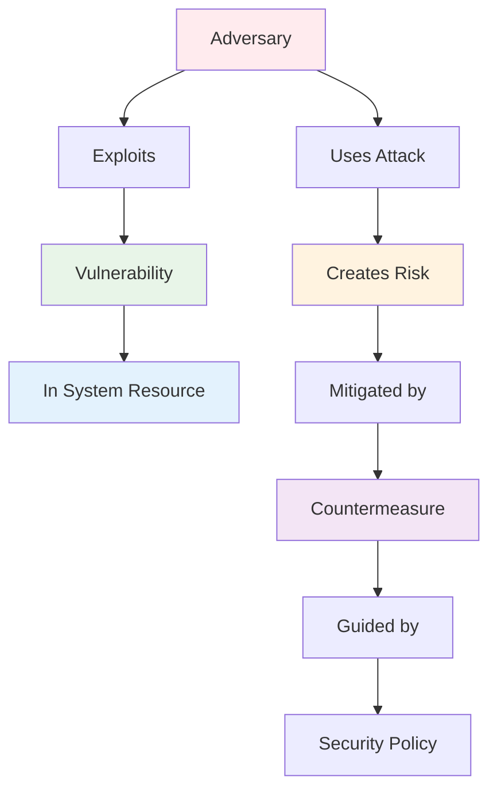
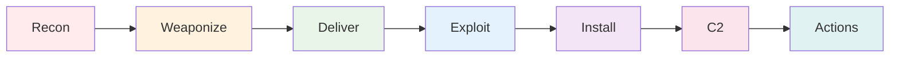
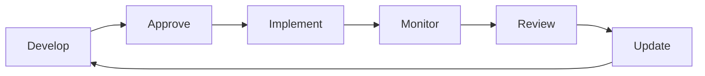
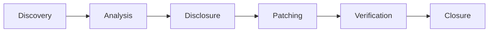
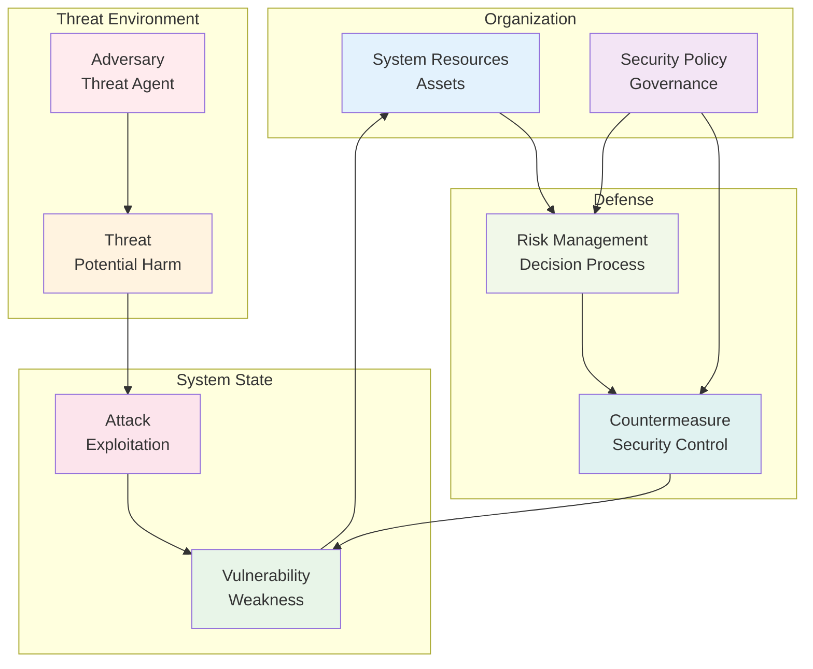

# Computer Security Terminology

## Lecture 3: Essential Security Vocabulary

<div class="pt-12">
  <span @click="$slidev.nav.next" class="px-2 py-1 rounded cursor-pointer" hover="bg-white bg-opacity-10">
    Press Space for next page <carbon:arrow-right class="inline"/>
  </span>
</div>

---
layout: default
---

# Why Security Terminology Matters

<div class="grid grid-cols-2 gap-8">

<div>

## 🎯 Learning Objectives
- **Define** key security terms accurately
- **Understand relationships** between concepts
- **Apply terminology** in practical scenarios
- **Communicate effectively** with security professionals

## 📚 Today's Key Terms
- **Adversary** (Threat Agent)
- **Attack** and Attack Vectors
- **Countermeasure** and Controls
- **Risk** and Risk Management
- **Security Policy**
- **System Resource** (Asset)
- **Threat** and Threat Modeling
- **Vulnerability** Assessment

</div>

<div>

## 🔗 Term Relationships



</div>

</div>

---
layout: default
---

# Adversary (Threat Agent)

<div class="grid grid-cols-2 gap-8">

<div>

## 🎭 Definition
An **adversary** (or threat agent) is any individual, group, or entity that poses a potential threat to an information system by attempting unauthorized access, disruption, or destruction.

## 🏷️ Classification by Motivation
- **Financial gain** - Cybercriminals
- **Political agenda** - Hacktivists  
- **National interests** - Nation-state actors
- **Personal reasons** - Disgruntled employees
- **Fame/recognition** - Script kiddies
- **Espionage** - Corporate spies

## 🎯 Classification by Skills
- **Novice** - Limited technical skills
- **Advanced** - Sophisticated techniques
- **Expert** - Nation-state level capabilities

</div>

<div>

## 👥 Types of Adversaries

### 🏴‍☠️ External Threat Actors
- **Cybercriminals** - Organized crime groups
- **Nation-states** - Government-sponsored
- **Hacktivists** - Politically motivated
- **Competitors** - Industrial espionage
- **Script kiddies** - Amateur hackers

### 🏢 Internal Threat Actors
- **Malicious insiders** - Intentional harm
- **Careless employees** - Accidental exposure
- **Compromised accounts** - Hijacked credentials
- **Third-party vendors** - Supply chain risks

### 📊 Adversary Capabilities Matrix
| Type | Resources | Skills | Persistence | Examples |
|------|-----------|--------|-------------|----------|
| Script Kiddie | Low | Low | Low | Individual hackers |
| Cybercriminal | Medium | High | Medium | Ransomware groups |
| Nation-State | High | Expert | High | APT groups |

</div>

</div>

---
layout: default
---

# Attack: Methods and Vectors

<div class="grid grid-cols-2 gap-8">

<div>

## ⚔️ Definition
An **attack** is a deliberate action taken by an adversary to compromise the security of a system by exploiting vulnerabilities to gain unauthorized access, disrupt operations, or steal information.

## 🎯 Attack Classifications

### By Target
- **Network attacks** - Infrastructure focused
- **Application attacks** - Software focused  
- **Physical attacks** - Hardware/facility focused
- **Social engineering** - Human focused

### By Method
- **Active attacks** - Modify system/data
- **Passive attacks** - Monitor/eavesdrop
- **Direct attacks** - Target specific system
- **Indirect attacks** - Use intermediate systems

</div>

<div>

## 🚀 Common Attack Vectors

### 📧 Email-based Attacks
- **Phishing** - Deceptive emails
- **Spear phishing** - Targeted attacks
- **Malware attachments**
- **Business Email Compromise (BEC)**

### 🌐 Network-based Attacks
- **DDoS** - Service disruption
- **Man-in-the-Middle** - Traffic interception
- **DNS poisoning** - Traffic redirection
- **Port scanning** - Reconnaissance

### 💻 Application Attacks
- **SQL injection** - Database manipulation
- **Cross-site scripting (XSS)** - Web exploitation
- **Buffer overflow** - Memory corruption
- **Zero-day exploits** - Unknown vulnerabilities

### 👤 Social Engineering
- **Pretexting** - False scenarios
- **Baiting** - Malicious media/downloads
- **Tailgating** - Physical access following

</div>

</div>

---
layout: default
---

# Attack Lifecycle & Kill Chain

<div class="grid grid-cols-2 gap-8">

<div>

## 🔗 Cyber Kill Chain

### 7-Stage Attack Process
1. **Reconnaissance** - Target research
2. **Weaponization** - Malware creation
3. **Delivery** - Attack transmission
4. **Exploitation** - Vulnerability execution
5. **Installation** - Malware deployment
6. **Command & Control** - Remote access
7. **Actions on Objectives** - Goal achievement



</div>

<div>

## ⏱️ Attack Timeline Analysis

### Stage 1-3: Pre-Exploitation
- **Duration:** Days to months
- **Detection:** Often missed
- **Prevention:** Most effective
- **Cost:** Lowest to defend

### Stage 4-5: Initial Compromise  
- **Duration:** Minutes to hours
- **Detection:** Possible with good tools
- **Prevention:** Some options available
- **Cost:** Moderate to defend

### Stage 6-7: Post-Exploitation
- **Duration:** Weeks to years
- **Detection:** Most visible activity
- **Prevention:** Limited options
- **Cost:** Highest to remediate

## 🛡️ Defense Strategies
- **Early detection** is most cost-effective
- **Multiple layers** increase difficulty
- **Threat intelligence** improves reconnaissance detection
- **User training** disrupts social engineering

</div>

</div>

---
layout: default
---

# Countermeasure: Security Controls

<div class="grid grid-cols-2 gap-8">

<div>

## 🛡️ Definition
A **countermeasure** (or security control) is any action, device, procedure, or technique that reduces or eliminates a security threat or vulnerability.

## 📊 Control Classifications

### By Function
- **Preventive** - Stop incidents before they occur
- **Detective** - Identify ongoing/completed incidents  
- **Corrective** - Respond to and recover from incidents
- **Deterrent** - Discourage potential attackers
- **Compensating** - Alternative when primary fails

### By Implementation
- **Administrative** - Policies, procedures, training
- **Technical** - Hardware, software, technology
- **Physical** - Locks, cameras, barriers

</div>

<div>

## 🔧 Control Examples by Type

### 🔒 Preventive Controls
- **Firewalls** - Block unauthorized traffic
- **Access controls** - Limit system access
- **Encryption** - Protect data confidentiality
- **Input validation** - Prevent malicious data
- **Security awareness training**

### 🔍 Detective Controls  
- **Intrusion Detection Systems (IDS)**
- **Security Information Event Management (SIEM)**
- **Audit logs and monitoring**
- **Vulnerability scanning**
- **Security cameras**

### 🔧 Corrective Controls
- **Incident response procedures**
- **Backup and recovery systems**
- **Antivirus and anti-malware**
- **Patch management**
- **Business continuity plans**

</div>

</div>

---
layout: default
---

# Risk: Understanding and Managing Uncertainty

<div class="grid grid-cols-2 gap-8">

<div>

## ⚡ Definition
**Risk** is the potential for loss or damage when a threat exploits a vulnerability. It represents the likelihood and impact of adverse events.

## 🧮 Risk Formula
```
Risk = Threat × Vulnerability × Impact
```

### Risk Components
- **Threat** - Source of potential harm
- **Vulnerability** - Weakness that can be exploited
- **Impact** - Potential consequences
- **Likelihood** - Probability of occurrence

## 📊 Risk Assessment Process
1. **Asset identification** - What needs protection?
2. **Threat identification** - What can cause harm?
3. **Vulnerability assessment** - Where are weaknesses?
4. **Impact analysis** - What are consequences?
5. **Risk calculation** - Quantify the risk
6. **Risk treatment** - How to respond?

</div>

<div>

## 🎯 Risk Management Strategies

### 1. Risk Avoidance
- **Eliminate** the risk entirely
- **Don't engage** in risky activities
- **Example:** Not connecting critical systems to internet

### 2. Risk Mitigation  
- **Reduce** likelihood or impact
- **Implement** security controls
- **Example:** Install firewalls and antivirus

### 3. Risk Transfer
- **Shift** risk to another party
- **Insurance** or outsourcing
- **Example:** Cyber insurance policies

### 4. Risk Acceptance
- **Accept** the risk as-is
- **Cost of control** > value protected
- **Example:** Legacy system with low value

## 📈 Risk Appetite vs Risk Tolerance
- **Risk Appetite** - Desired risk level
- **Risk Tolerance** - Maximum acceptable risk
- **Risk Capacity** - Ability to absorb risk

</div>

</div>

---
layout: default
---

# Security Policy: The Foundation of Security

<div class="grid grid-cols-2 gap-8">

<div>

## 📋 Definition
A **security policy** is a formal set of rules, guidelines, and procedures that define how an organization manages, protects, and distributes sensitive information and resources.

## 🎯 Policy Purposes
- **Establish** security requirements
- **Define** acceptable behavior
- **Assign** responsibilities and roles
- **Provide** legal protection
- **Guide** security decisions
- **Ensure** compliance with regulations

## 📚 Types of Security Policies
- **Organizational** - High-level strategy
- **Functional** - Specific areas (email, internet)
- **Technical** - Implementation details
- **Regulatory** - Compliance requirements

</div>

<div>

## 📖 Policy Components

### 1. Policy Statement
- **Purpose** and scope
- **Applicability** (who, what, when)
- **Authority** and responsibilities

### 2. Standards
- **Specific requirements** to meet policy
- **Measurable criteria**
- **Technical specifications**

### 3. Procedures
- **Step-by-step instructions**
- **Implementation guidelines**
- **Operational details**

### 4. Guidelines
- **Best practices** and recommendations
- **Flexible suggestions**
- **Context-specific advice**

## 🔄 Policy Lifecycle


</div>

</div>

---
layout: default
---

# System Resource (Asset): What We Protect

<div class="grid grid-cols-2 gap-8">

<div>

## 💎 Definition
A **system resource** (or asset) is any hardware, software, data, facility, person, or service that has value to an organization and requires protection from threats.

## 📊 Asset Classification

### 🏷️ By Type
- **Information assets** - Data, databases, files
- **Software assets** - Applications, systems, code
- **Physical assets** - Hardware, facilities, equipment
- **Human assets** - Personnel, contractors, partners
- **Service assets** - Utilities, communications, cloud

### 💰 By Value
- **Critical** - Mission essential
- **Important** - Business impact
- **Useful** - Convenience/efficiency
- **Non-essential** - Minimal impact

</div>

<div>

## 🔍 Asset Inventory Process

### 1. Asset Discovery
- **Network scanning** for IT assets
- **Interviews** for information assets
- **Physical surveys** for equipment
- **Documentation review**

### 2. Asset Classification
- **Categorize** by type and criticality
- **Assign** ownership and custodianship
- **Determine** protection requirements
- **Document** dependencies

### 3. Asset Valuation
- **Replacement cost** - Cost to replace
- **Revenue impact** - Lost business
- **Competitive advantage** - Strategic value
- **Legal/regulatory** - Compliance costs

## 📋 Asset Management
- **Maintain** accurate inventory
- **Track** asset lifecycle
- **Monitor** asset usage
- **Update** valuations regularly
- **Retire** obsolete assets

</div>

</div>

---
layout: default
---

# Threat: Sources of Potential Harm

<div class="grid grid-cols-2 gap-8">

<div>

## ⚡ Definition
A **threat** is any potential event, action, or circumstance that could cause harm to an information system, its users, or the organization by exploiting vulnerabilities.

## 🏷️ Threat Categories

### 🌊 Natural Threats
- **Weather** - Floods, hurricanes, earthquakes
- **Fire** - Electrical, human-caused
- **Environmental** - Temperature, humidity

### 👤 Human Threats
- **Intentional** - Malicious actors
- **Unintentional** - Human error, accidents
- **Negligence** - Failure to follow procedures

### 🔧 Technical Threats
- **Hardware failures** - Equipment breakdown
- **Software bugs** - Programming errors
- **System crashes** - Overload, corruption

</div>

<div>

## 🎯 Threat Modeling Process

### 1. System Understanding
- **Identify** system components
- **Map** data flows
- **Document** trust boundaries
- **List** assumptions

### 2. Threat Identification
- **Brainstorm** potential threats
- **Use** threat libraries (STRIDE)
- **Consider** attack trees
- **Research** current threats

### 3. Threat Analysis
- **Assess** likelihood and impact
- **Prioritize** by risk level
- **Consider** existing controls
- **Identify** gaps

### 4. Mitigation Planning
- **Select** appropriate countermeasures
- **Balance** cost vs. benefit
- **Plan** implementation
- **Document** decisions

## 📊 STRIDE Threat Model
- **Spoofing** - Identity theft
- **Tampering** - Data modification
- **Repudiation** - Denying actions
- **Information Disclosure** - Data leakage
- **Denial of Service** - Availability loss
- **Elevation of Privilege** - Unauthorized access

</div>

</div>

---
layout: default
---

# Vulnerability: System Weaknesses

<div class="grid grid-cols-2 gap-8">

<div>

## 🔍 Definition
A **vulnerability** is a weakness or flaw in a system that can be exploited by a threat to gain unauthorized access, cause harm, or compromise security.

## 📊 Vulnerability Types

### 🖥️ Technical Vulnerabilities
- **Software bugs** - Programming errors
- **Misconfigurations** - Improper settings
- **Unpatched systems** - Missing updates
- **Weak cryptography** - Poor algorithms/keys
- **Design flaws** - Architectural issues

### 👥 Human Vulnerabilities
- **Lack of training** - Security unawareness
- **Social engineering susceptibility**
- **Poor password practices**
- **Insider threats**
- **Process violations**

### 🏢 Physical Vulnerabilities
- **Unsecured facilities**
- **Environmental hazards**
- **Hardware tampering**
- **Inadequate access controls**

</div>

<div>

## 🔍 Vulnerability Assessment

### 1. Discovery Methods
- **Automated scanning** - Network/web/database
- **Manual testing** - Penetration testing
- **Code review** - Source code analysis
- **Configuration review** - Settings audit
- **Documentation review** - Policy gaps

### 2. Scoring Systems
```yaml
CVSS (Common Vulnerability Scoring System):
  Base Score: 0.0 - 10.0
  - None: 0.0
  - Low: 0.1 - 3.9
  - Medium: 4.0 - 6.9
  - High: 7.0 - 8.9
  - Critical: 9.0 - 10.0
```

### 3. Vulnerability Lifecycle


</div>

</div>

---
layout: default
---

# Putting It All Together: The Security Ecosystem

<div class="comprehensive-diagram">

## 🔄 Security Relationship Model



</div>

<style>
.comprehensive-diagram {
  @apply bg-gray-50 border-2 border-gray-300 rounded-lg p-6;
}
</style>

---
layout: default
---

# Real-World Terminology Application

<div class="grid grid-cols-2 gap-8">

<div>

## 🏦 Banking Scenario

### 📋 Situation
Online banking platform experiencing unusual login attempts

### 🔍 Terminology Application
- **Asset:** Customer account database
- **Adversary:** Cybercriminal organization  
- **Threat:** Credential stuffing attack
- **Vulnerability:** Weak account lockout policy
- **Attack:** Automated login attempts using stolen credentials
- **Risk:** High - potential financial theft and reputation damage
- **Countermeasures:** 
  - Multi-factor authentication
  - Account lockout after failed attempts
  - Real-time monitoring and alerting
- **Policy:** Authentication and access control standards

</div>

<div>

## 🏥 Healthcare Scenario

### 📋 Situation  
Hospital staff received phishing emails requesting login credentials

### 🔍 Terminology Application
- **Asset:** Electronic health records system
- **Adversary:** Potentially nation-state actor
- **Threat:** Spear-phishing campaign
- **Vulnerability:** Insufficient security awareness training
- **Attack:** Email with malicious links targeting healthcare workers
- **Risk:** Critical - patient safety and HIPAA violations
- **Countermeasures:**
  - Email security filtering
  - Security awareness training
  - Incident response procedures
  - Network segmentation
- **Policy:** Email security and user awareness policy

</div>

</div>

---
layout: default
---

# Practical Exercise: Terminology Mapping

<div class="exercise-container">

## 🎯 Individual Activity (15 minutes)

### Scenario: E-Learning Platform
Your organization operates an online learning platform with:
- 50,000 student accounts
- Course content and video lectures
- Payment processing system
- Student grade databases
- Mobile applications

### Your Task: Complete the Security Analysis

1. **Identify Assets** (at least 5)
2. **List Potential Adversaries** (3 types)
3. **Describe Threats** (5 different threats)
4. **Find Vulnerabilities** (common weaknesses)
5. **Suggest Attacks** (how threats exploit vulnerabilities)
6. **Calculate Risk** (likelihood × impact for top 3)
7. **Recommend Countermeasures** (preventive, detective, corrective)
8. **Policy Requirements** (what policies are needed)

</div>

<style>
.exercise-container {
  @apply bg-blue-50 border-2 border-blue-300 rounded-lg p-6;
}
</style>

---
layout: default
---

# Common Terminology Mistakes

<div class="grid grid-cols-2 gap-8">

<div>

## ❌ Frequent Errors

### Threat vs Risk Confusion
- **Wrong:** "The risk is hackers"
- **Right:** "The threat is hackers, the risk is data breach"

### Vulnerability vs Attack Mix-up
- **Wrong:** "SQL injection is a vulnerability"
- **Right:** "SQL injection is an attack that exploits input validation vulnerabilities"

### Asset vs Data Confusion
- **Wrong:** "Our asset is customer information"
- **Right:** "Our information asset includes customer data stored in the CRM database"

### Countermeasure Overuse
- **Wrong:** "Firewalls are the countermeasure"
- **Right:** "Firewalls are one countermeasure in a layered security approach"

</div>

<div>

## ✅ Best Practices

### Precise Language
- Use **specific terms** rather than generic ones
- **Define context** when terms could be ambiguous
- **Distinguish** between related concepts
- **Verify understanding** in communications

### Documentation Standards
- **Maintain** glossaries for organizational terms
- **Update** terminology as industry evolves
- **Train** staff on proper usage
- **Review** communications for accuracy

### Communication Tips
- **Tailor vocabulary** to audience knowledge level
- **Explain technical terms** to non-technical stakeholders
- **Use examples** to illustrate abstract concepts
- **Confirm comprehension** before proceeding

</div>

</div>

---
layout: default
---

# Industry Terminology Standards

<div class="grid grid-cols-2 gap-8">

<div>

## 📚 Standard Vocabularies

### NIST SP 800-39
**Risk Management Terminology**
- Comprehensive risk definitions
- Federal government standard
- Widely adopted framework

### ISO/IEC 27000
**Information Security Vocabulary**
- International standard
- Detailed security terminology
- Management system focus

### NIST Cybersecurity Framework
**Framework-specific Terms**
- Identify, Protect, Detect, Respond, Recover
- Industry-neutral language
- Practical implementation focus

</div>

<div>

## 🏭 Industry-Specific Terms

### Financial Services
- **PCI DSS** - Payment card terminology
- **Basel III** - Risk management terms
- **SOX** - Financial reporting security

### Healthcare
- **HIPAA** - Privacy and security terms
- **HITECH** - Health information technology
- **FDA** - Medical device security

### Government
- **FISMA** - Federal information systems
- **Common Criteria** - Security evaluation
- **CNSSI** - National security systems

### Key Benefits
- **Consistency** across organizations
- **Regulatory compliance**
- **Professional communication**
- **Knowledge transfer**

</div>

</div>

---
layout: default
---

# Building Your Security Vocabulary

<div class="grid grid-cols-2 gap-8">

<div>

## 📖 Continuous Learning

### Daily Practice
- **Read** security news and reports
- **Join** professional forums and groups
- **Attend** webinars and conferences
- **Take** online courses and certifications

### Professional Development
- **Security certifications** (Security+, CISSP)
- **Industry publications** (CSO, Dark Reading)
- **Research papers** and white papers
- **Vendor documentation** and guides

### Practical Application
- **Use terms correctly** in documentation
- **Explain concepts** to colleagues
- **Participate** in security discussions
- **Mentor** others learning security

</div>

<div>

## 🎯 Mastery Indicators

### You Know You're Proficient When:
- **Explain** security concepts to non-technical audiences
- **Distinguish** between similar terms accurately
- **Use** terminology consistently in documentation
- **Understand** context-specific meanings
- **Recognize** when terms are misused

### Career Benefits
- **Clear communication** with stakeholders
- **Professional credibility**
- **Effective documentation**
- **Better problem-solving**
- **Leadership readiness**

### Assessment Tools
- **Self-evaluation** checklists
- **Peer review** of communications
- **Certification exams**
- **Professional feedback**

</div>

</div>

---
layout: default
---

# Next Lecture Preview

<div class="grid grid-cols-2 gap-8">

<div>

## 🔜 Lecture 4: Advanced Security Concepts

### 🎯 Topics Coming Up:
- **Security policies** in depth
- **System resources** management
- **Threat modeling** methodologies  
- **Vulnerability management** lifecycle

### 📝 Preparation Tasks:
- Review today's terminology definitions
- Research a recent security incident
- Identify the terminology elements in the incident
- Think about your organization's assets

</div>

<div>

## 🎓 Key Takeaways

### Master the Fundamentals
- **Terminology** is the foundation of security knowledge
- **Precise language** improves communication
- **Relationships** between terms matter
- **Context** determines appropriate usage

### Practice Application
- **Use terms** correctly in daily work
- **Build** comprehensive security vocabulary
- **Stay current** with evolving terminology
- **Teach others** to reinforce learning

</div>

</div>

---
layout: center
class: text-center
---

# Questions & Discussion

<div class="pt-12">

## 🤔 Discussion Questions:
- Which terminology concept was most challenging?
- How do you see these terms applying in your field?
- What terminology gaps exist in your organization?

### 💡 Exercise Review
Share findings from your e-learning platform analysis

</div>

---
layout: center
class: text-center
---

# Thank You!

## Next Lecture: Advanced Security Concepts
### Deep Dive into Policies, Resources, and Threat Modeling

<div class="pt-12 text-gray-500">
  <p>Cyber Security (4353204) - Lecture 3 Complete</p>
  <p>Words matter in security! 📚🔒</p>
</div>