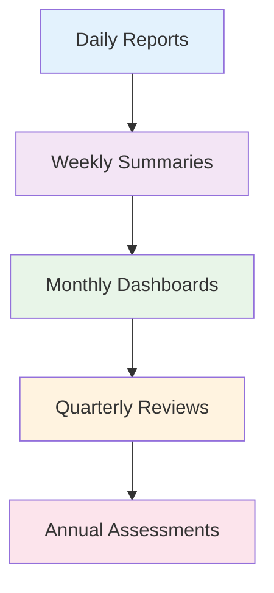
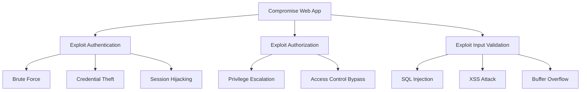

# Advanced Security Concepts
## Unit I: Introduction to Cyber Security & Cryptography
### Lecture 4: Security Policies, Resources & Threat Modeling

<div class="absolute bottom-5 left-5 text-xs text-gray-500">
Course: Cyber Security (4353204) | Semester V | Diploma ICT | Author: Milav Dabgar
</div>

---
layout: default
---

# Recap: Previous Lectures

<div class="grid grid-cols-3 gap-4">

<div>

## Lecture 1: Introduction
- Cyber security definition
- Digital asset protection
- Current threat landscape
- Career opportunities

</div>

<div>

## Lecture 2: CIA Triad
- Confidentiality principles
- Integrity mechanisms
- Availability requirements
- Practical applications

</div>

<div>

## Lecture 3: Terminology
- Key security terms
- Adversary classification
- Attack vectors
- Risk management

</div>

</div>

## 🎯 Today's Learning Objectives
- **Design** comprehensive security policies
- **Manage** system resources effectively
- **Implement** threat modeling methodologies
- **Apply** vulnerability management lifecycle

<div class="absolute bottom-5 left-5 text-xs text-gray-500">
Course: Cyber Security (4353204) | Unit I | Lecture 4 | Author: Milav Dabgar
</div>

---
layout: default
---

# Security Policy Deep Dive

<div class="grid grid-cols-2 gap-6">

<div>

## 📋 Policy Hierarchy

### 1. **Organizational Policy**
- High-level strategic direction
- Board and executive approved
- Broad scope and principles
- Rarely changes

### 2. **Functional Policies**
- Specific security areas
- Department level implementation
- Detailed requirements
- Regular updates

### 3. **Technical Standards**
- Implementation specifications
- Technology-focused
- Measurable criteria
- Frequent revisions

</div>

<div>

## 🏗️ Policy Development Process

### Phase 1: Planning
- **Identify** business requirements
- **Assess** current state
- **Define** scope and objectives
- **Assemble** development team

### Phase 2: Development
- **Research** best practices
- **Draft** policy content
- **Review** with stakeholders
- **Incorporate** feedback

### Phase 3: Implementation
- **Approve** through governance
- **Communicate** to organization
- **Train** affected personnel
- **Monitor** compliance

</div>

</div>

<div class="absolute bottom-5 left-5 text-xs text-gray-500">
Course: Cyber Security (4353204) | Unit I | Lecture 4 | Author: Milav Dabgar
</div>

---
layout: default
---

# Essential Security Policies

<div class="grid grid-cols-2 gap-6">

<div>

## 🔐 Core Security Policies

### **Information Security Policy**
- Data classification standards
- Access control requirements
- Incident response procedures
- Employee responsibilities

### **Acceptable Use Policy**
- Authorized system usage
- Prohibited activities
- Personal device guidelines
- Internet and email usage

### **Access Control Policy**
- User provisioning process
- Role-based permissions
- Regular access reviews
- Termination procedures

</div>

<div>

## 📱 Technology-Specific Policies

### **Mobile Device Policy**
- BYOD requirements
- Device encryption standards
- App installation restrictions
- Remote wipe capabilities

### **Cloud Security Policy**
- Approved cloud services
- Data residency requirements
- Shared responsibility model
- Vendor assessment process

### **Network Security Policy**
- Firewall configurations
- Wireless network standards
- VPN usage requirements
- Network monitoring protocols

</div>

</div>

<div class="absolute bottom-5 left-5 text-xs text-gray-500">
Course: Cyber Security (4353204) | Unit I | Lecture 4 | Author: Milav Dabgar
</div>

---
layout: default
---

# Policy Enforcement & Compliance

<div class="grid grid-cols-2 gap-6">

<div>

## 🎯 Enforcement Mechanisms

### **Technical Controls**
- Automated policy enforcement
- System configurations
- Access restrictions
- Monitoring and alerting

### **Administrative Controls**
- Training and awareness
- Regular audits
- Performance reviews
- Disciplinary procedures

### **Physical Controls**
- Facility access restrictions
- Equipment protection
- Environmental controls
- Visitor management

</div>

<div>

## 📊 Compliance Monitoring

### **Key Performance Indicators**
- Policy violation incidents
- Training completion rates
- Audit findings resolution
- Risk assessment results

### **Reporting Structure**


</div>

</div>

<div class="absolute bottom-5 left-5 text-xs text-gray-500">
Course: Cyber Security (4353204) | Unit I | Lecture 4 | Author: Milav Dabgar
</div>

---
layout: default
---

# System Resource Management

<div class="grid grid-cols-2 gap-6">

<div>

## 💎 Asset Classification Framework

### **Critical Assets**
- Mission-essential systems
- High business impact
- Maximum protection required
- Immediate response priority

### **Important Assets**
- Significant business value
- Moderate impact if compromised
- Standard protection measures
- Planned response procedures

### **Standard Assets**
- Regular business operations
- Limited impact potential
- Basic protection sufficient
- Standard response timeframes

</div>

<div>

## 🔍 Asset Inventory Process

### **Discovery Methods**
- **Network scanning** tools
- **Agent-based** collection
- **Manual** documentation
- **Integration** with CMDB

### **Asset Attributes**
- **Technical:** OS, versions, configs
- **Business:** Owner, criticality, location
- **Security:** Vulnerabilities, controls
- **Lifecycle:** Purchase, support, EOL

### **Maintenance Tasks**
- **Regular** inventory updates
- **Automated** discovery scans
- **Change** management integration
- **Retirement** procedures

</div>

</div>

<div class="absolute bottom-5 left-5 text-xs text-gray-500">
Course: Cyber Security (4353204) | Unit I | Lecture 4 | Author: Milav Dabgar
</div>

---
layout: default
---

# Threat Modeling Fundamentals

<div class="grid grid-cols-2 gap-6">

<div>

## 🎯 What is Threat Modeling?

**Threat modeling** is a systematic approach to identifying, analyzing, and mitigating security threats to applications, systems, or networks.

### **Core Objectives**
- **Identify** potential threats
- **Understand** attack vectors
- **Prioritize** security risks
- **Design** effective countermeasures

### **When to Apply**
- **System design** phase
- **Architecture** reviews
- **Security** assessments
- **Incident** investigations

</div>

<div>

## 📋 Threat Modeling Process

### **Step 1: Define Scope**
- System boundaries
- Assets to protect
- Assumptions and constraints
- Success criteria

### **Step 2: Create Models**
- Data flow diagrams
- System architecture
- Trust boundaries
- Entry/exit points

### **Step 3: Identify Threats**
- STRIDE methodology
- Attack trees
- Threat libraries
- Expert brainstorming

</div>

</div>

<div class="absolute bottom-5 left-5 text-xs text-gray-500">
Course: Cyber Security (4353204) | Unit I | Lecture 4 | Author: Milav Dabgar
</div>

---
layout: default
---

# STRIDE Threat Model

<div class="grid grid-cols-2 gap-6">

<div>

## 🏷️ STRIDE Categories

### **S - Spoofing**
- **Definition:** Pretending to be someone else
- **Examples:** Fake certificates, IP spoofing
- **Countermeasures:** Authentication, digital signatures

### **T - Tampering**
- **Definition:** Modifying data or code
- **Examples:** File modification, packet alteration
- **Countermeasures:** Integrity checks, digital signatures

### **R - Repudiation**
- **Definition:** Denying performed actions
- **Examples:** Claiming actions weren't performed
- **Countermeasures:** Audit logs, digital signatures

</div>

<div>

### **I - Information Disclosure**
- **Definition:** Exposing protected information
- **Examples:** Data leaks, eavesdropping
- **Countermeasures:** Encryption, access controls

### **D - Denial of Service**
- **Definition:** Making systems unavailable
- **Examples:** DDoS attacks, resource exhaustion
- **Countermeasures:** Load balancing, rate limiting

### **E - Elevation of Privilege**
- **Definition:** Gaining unauthorized access levels
- **Examples:** Buffer overflows, privilege escalation
- **Countermeasures:** Input validation, least privilege

</div>

</div>

<div class="absolute bottom-5 left-5 text-xs text-gray-500">
Course: Cyber Security (4353204) | Unit I | Lecture 4 | Author: Milav Dabgar
</div>

---
layout: default
---

# Attack Trees & Modeling

<div class="grid grid-cols-2 gap-6">

<div>

## 🌳 Attack Tree Concepts

**Attack trees** are hierarchical diagrams showing how security attacks can be decomposed into sub-attacks.

### **Structure Components**
- **Root node:** Primary attack goal
- **Sub-goals:** Ways to achieve parent goal
- **Leaf nodes:** Basic attack steps
- **AND/OR logic:** Relationship types

### **Benefits**
- **Visual** representation of threats
- **Systematic** attack analysis
- **Risk** quantification support
- **Communication** tool for stakeholders

</div>

<div>

## 📊 Example: Web Application Attack



### **Analysis Questions**
- Which paths are most likely?
- What are the costs/skills required?
- Which countermeasures are most effective?

</div>

</div>

<div class="absolute bottom-5 left-5 text-xs text-gray-500">
Course: Cyber Security (4353204) | Unit I | Lecture 4 | Author: Milav Dabgar
</div>

---
layout: default
---

# Vulnerability Management Lifecycle

<div class="grid grid-cols-2 gap-6">

<div>

## 🔄 Lifecycle Phases

### **1. Discovery**
- **Vulnerability scanning**
- **Penetration testing**
- **Code reviews**
- **Threat intelligence**

### **2. Assessment**
- **Risk evaluation**
- **Impact analysis**
- **Exploitability assessment**
- **Business context**

### **3. Prioritization**
- **CVSS scoring**
- **Business criticality**
- **Threat likelihood**
- **Available exploits**

</div>

<div>

### **4. Remediation**
- **Patch deployment**
- **Configuration changes**
- **Compensating controls**
- **System isolation**

### **5. Verification**
- **Patch validation**
- **Re-scanning**
- **Penetration testing**
- **Control effectiveness**

### **6. Monitoring**
- **Continuous scanning**
- **Threat monitoring**
- **Metrics tracking**
- **Process improvement**

</div>

</div>

<div class="absolute bottom-5 left-5 text-xs text-gray-500">
Course: Cyber Security (4353204) | Unit I | Lecture 4 | Author: Milav Dabgar
</div>

---
layout: default
---

# Risk Assessment Methodologies

<div class="grid grid-cols-2 gap-6">

<div>

## 📊 Quantitative Assessment

### **Components**
- **Asset Value (AV):** Dollar value of asset
- **Exposure Factor (EF):** % of asset lost
- **Single Loss Expectancy:** AV × EF
- **Annual Rate of Occurrence:** Frequency
- **Annual Loss Expectancy:** SLE × ARO

### **Example Calculation**
```
Server Value: $50,000
Fire Risk Exposure: 60%
SLE = $50,000 × 0.60 = $30,000
Fire Frequency: 0.1/year
ALE = $30,000 × 0.1 = $3,000/year
```

</div>

<div>

## 🎯 Qualitative Assessment

### **Risk Levels**
- **Critical:** Immediate action required
- **High:** Address within 30 days
- **Medium:** Address within 90 days
- **Low:** Address when resources allow

### **Risk Matrix**
| Impact/Likelihood | Low | Medium | High |
|-------------------|-----|--------|------|
| **High Impact** | Medium | High | Critical |
| **Medium Impact** | Low | Medium | High |
| **Low Impact** | Low | Low | Medium |

### **Advantages**
- **Easier** to understand
- **Faster** to complete
- **Less precise** data required

</div>

</div>

<div class="absolute bottom-5 left-5 text-xs text-gray-500">
Course: Cyber Security (4353204) | Unit I | Lecture 4 | Author: Milav Dabgar
</div>

---
layout: default
---

# Security Governance Framework

<div class="grid grid-cols-2 gap-6">

<div>

## 🏛️ Governance Structure

### **Board Level**
- **Strategic oversight**
- **Risk appetite setting**
- **Resource allocation**
- **Performance monitoring**

### **Executive Level**
- **Policy development**
- **Program management**
- **Risk management**
- **Incident response**

### **Operational Level**
- **Daily operations**
- **Technical implementation**
- **Monitoring and reporting**
- **User support**

</div>

<div>

## 📋 Key Governance Processes

### **Risk Management**
- **Risk identification**
- **Risk assessment**
- **Risk treatment**
- **Risk monitoring**

### **Compliance Management**
- **Regulatory mapping**
- **Control implementation**
- **Audit coordination**
- **Remediation tracking**

### **Performance Management**
- **KPI development**
- **Metrics collection**
- **Trend analysis**
- **Improvement planning**

</div>

</div>

<div class="absolute bottom-5 left-5 text-xs text-gray-500">
Course: Cyber Security (4353204) | Unit I | Lecture 4 | Author: Milav Dabgar
</div>

---
layout: default
---

# Practical Exercise: Security Policy Design

<div class="exercise-container">

## 🎯 Group Activity (15 minutes)

### Scenario: Remote Work Policy
Your organization is implementing a permanent remote work policy post-pandemic.

### Your Team's Task:
1. **Identify** key security concerns for remote work
2. **Design** policy sections covering:
   - Device requirements
   - Network security
   - Data protection
   - Incident reporting

3. **Define** enforcement mechanisms
4. **Create** compliance metrics

### Deliverable:
Present a 2-minute summary of your policy framework

</div>

<style>
.exercise-container {
  @apply bg-green-50 border-2 border-green-300 rounded-lg p-4;
}
</style>

<div class="absolute bottom-5 left-5 text-xs text-gray-500">
Course: Cyber Security (4353204) | Unit I | Lecture 4 | Author: Milav Dabgar
</div>

---
layout: default
---

# Implementation Challenges

<div class="grid grid-cols-2 gap-6">

<div>

## ⚠️ Common Challenges

### **Policy Development**
- **Competing priorities**
- **Resource constraints**
- **Stakeholder alignment**
- **Technical complexity**

### **Implementation**
- **User resistance**
- **Technology limitations**
- **Process integration**
- **Change management**

### **Maintenance**
- **Regular updates**
- **Compliance monitoring**
- **Performance measurement**
- **Continuous improvement**

</div>

<div>

## ✅ Success Factors

### **Leadership Support**
- **Executive sponsorship**
- **Clear communication**
- **Resource allocation**
- **Cultural change**

### **Stakeholder Engagement**
- **Early involvement**
- **Regular communication**
- **Feedback incorporation**
- **Training provision**

### **Technology Integration**
- **Automation opportunities**
- **Tool consolidation**
- **Process streamlining**
- **Monitoring capabilities**

</div>

</div>

<div class="absolute bottom-5 left-5 text-xs text-gray-500">
Course: Cyber Security (4353204) | Unit I | Lecture 4 | Author: Milav Dabgar
</div>

---
layout: default
---

# Measuring Security Effectiveness

<div class="grid grid-cols-2 gap-6">

<div>

## 📊 Security Metrics Categories

### **Leading Indicators**
- **Training completion** rates
- **Vulnerability scan** frequency
- **Patch deployment** time
- **Security awareness** levels

### **Lagging Indicators**
- **Security incidents** count
- **Data breach** impact
- **Audit findings**
- **Compliance violations**

### **Operational Metrics**
- **Mean time to detection** (MTTD)
- **Mean time to response** (MTTR)
- **False positive** rates
- **System availability**

</div>

<div>

## 🎯 Metric Development Process

### **Step 1: Define Objectives**
- **Business alignment**
- **Stakeholder needs**
- **Success criteria**
- **Baseline establishment**

### **Step 2: Select Metrics**
- **Relevance** to objectives
- **Data availability**
- **Collection feasibility**
- **Actionability**

### **Step 3: Implement Collection**
- **Automated** data gathering
- **Standardized** reporting
- **Quality** assurance
- **Regular** reviews

</div>

</div>

<div class="absolute bottom-5 left-5 text-xs text-gray-500">
Course: Cyber Security (4353204) | Unit I | Lecture 4 | Author: Milav Dabgar
</div>

---
layout: default
---

# Next Lecture Preview

<div class="grid grid-cols-2 gap-6">

<div>

## 🔜 Lecture 5: OSI Security Architecture - Part 1

### 🎯 Focus Topics:
- **OSI model layers** overview
- **Security attacks** at different layers
- **Layer-specific vulnerabilities**
- **Attack classification** methods

### 📝 Preparation:
- Review OSI 7-layer model
- Research layer-specific security issues
- Think about network protocols you use daily

</div>

<div>

## 🎓 Key Takeaways Today

### Security Management Foundations
- **Policies** provide governance framework
- **Asset management** enables protection prioritization
- **Threat modeling** identifies security gaps
- **Vulnerability management** reduces risk exposure

### Practice Application
- **Develop** comprehensive policies
- **Implement** systematic asset management
- **Apply** threat modeling techniques
- **Establish** vulnerability management processes

</div>

</div>

<div class="absolute bottom-5 left-5 text-xs text-gray-500">
Course: Cyber Security (4353204) | Unit I | Lecture 4 | Author: Milav Dabgar
</div>

---
layout: center
class: text-center
---

# Questions & Discussion

## 🤔 Discussion Points:
- Which policy areas are most challenging to implement?
- How do you balance security with business needs?
- What are the biggest asset management challenges?

### 💡 Exercise Results
Share your remote work policy frameworks

<div class="absolute bottom-5 left-5 text-xs text-gray-500">
Course: Cyber Security (4353204) | Unit I | Lecture 4 | Author: Milav Dabgar
</div>

---
layout: center
class: text-center
---

# Thank You!

## Next Lecture: OSI Security Architecture - Part 1
### Understanding Security at Every Network Layer

<div class="pt-8 text-gray-500">
  <p>Cyber Security (4353204) - Lecture 4 Complete</p>
  <p>Security by design, not by accident! 🏗️🔒</p>
</div>

<div class="absolute bottom-5 left-5 text-xs text-gray-500">
Course: Cyber Security (4353204) | Unit I | Lecture 4 | Author: Milav Dabgar
</div>