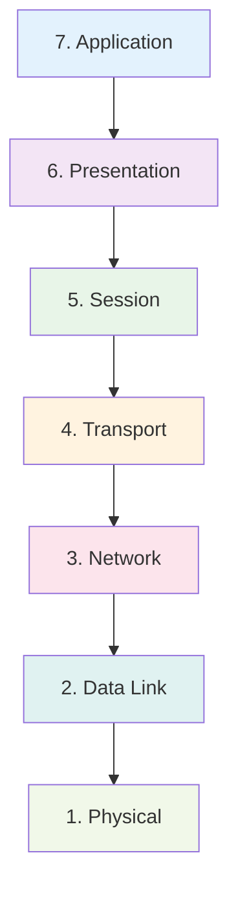
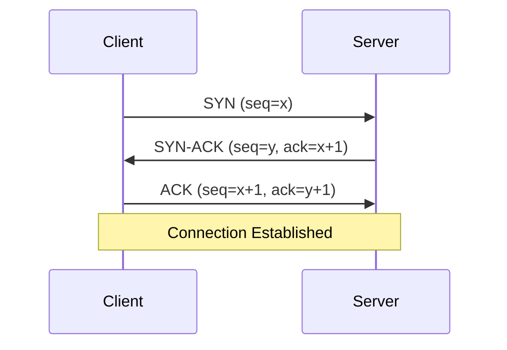
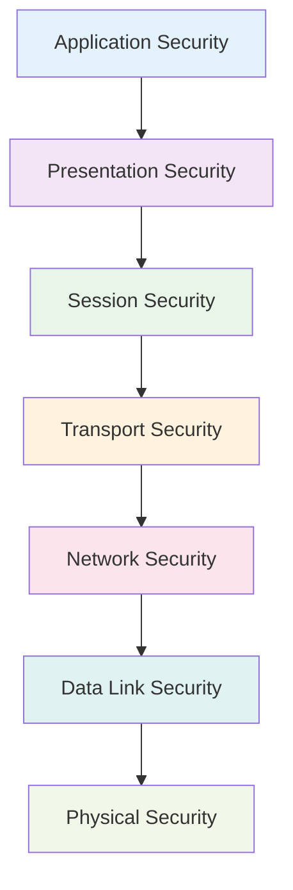

# OSI Security Architecture - Part 1
## Unit I: Introduction to Cyber Security & Cryptography
### Lecture 5: Network Layer Security Framework

<div class="absolute bottom-5 left-5 text-xs text-gray-500">
Course: Cyber Security (4353204) | Semester V | Diploma ICT | Author: Milav Dabgar
</div>

---
layout: default
---

# Recap: Previous Lectures

<div class="grid grid-cols-2 gap-6">

<div>

## 🔄 What We've Covered

### Lecture 1: Introduction
- Cyber security fundamentals
- Current threat landscape
- Career opportunities

### Lecture 2: CIA Triad
- Confidentiality, Integrity, Availability
- Security principles and design
- Real-world applications

</div>

<div>

### Lecture 3: Terminology
- Key security vocabulary
- Threat modeling concepts
- Risk management basics

### Lecture 4: Advanced Concepts
- Security policies and governance
- Asset management
- Vulnerability lifecycle

## 🎯 Today's Focus
Understanding security from a **network architecture** perspective

</div>

</div>

<div class="absolute bottom-5 left-5 text-xs text-gray-500">
Course: Cyber Security (4353204) | Unit I | Lecture 5 | Author: Milav Dabgar
</div>

---
layout: default
---

# OSI Model: Foundation of Network Communication

<div class="grid grid-cols-2 gap-6">

<div>

## 📚 What is the OSI Model?

The **Open Systems Interconnection (OSI)** reference model is a conceptual framework that standardizes network communication functions into seven distinct layers.

### 🎯 Purpose
- **Standardize** network protocols
- **Enable interoperability** between systems
- **Simplify** network troubleshooting
- **Guide** security implementation

### 📈 Benefits for Security
- **Layer-specific** threat analysis
- **Targeted** security controls
- **Comprehensive** protection strategy
- **Clear** responsibility boundaries

</div>

<div>

## 🏗️ The Seven Layers



### 🧠 Memory Aid
**"All People Seem To Need Data Processing"**
- **A**pplication, **P**resentation, **S**ession
- **T**ransport, **N**etwork, **D**ata Link, **P**hysical

</div>

</div>

<div class="absolute bottom-5 left-5 text-xs text-gray-500">
Course: Cyber Security (4353204) | Unit I | Lecture 5 | Author: Milav Dabgar
</div>

---
layout: default
---

# Layer 1: Physical Layer Security

<div class="grid grid-cols-2 gap-6">

<div>

## ⚡ Physical Layer Overview

### 🔧 What It Does
- **Transmits** raw binary data
- **Manages** electrical signals
- **Controls** hardware interfaces
- **Handles** cable and wireless transmission

### 🌐 Components
- **Cables** (fiber, copper, coaxial)
- **Wireless** signals and frequencies
- **Network adapters** and interfaces
- **Repeaters** and hubs
- **Physical connectors**

### 📊 Key Characteristics
- **No addressing** or routing
- **Bit-level** transmission
- **Hardware dependent**
- **Foundation** for all higher layers

</div>

<div>

## 🚨 Physical Layer Threats

### 👥 Physical Access Attacks
- **Cable tapping** - Intercepting signals
- **Electromagnetic eavesdropping** (TEMPEST)
- **Hardware tampering**
- **Device theft**
- **Facility intrusion**

### 🌊 Environmental Threats
- **Power outages** and surges
- **Natural disasters**
- **Temperature/humidity** extremes
- **Electromagnetic interference (EMI)**

### 🛡️ Physical Layer Countermeasures
- **Secure facilities** with access control
- **Cable protection** (conduits, underground)
- **EMI shielding** and Faraday cages
- **Uninterruptible Power Supply (UPS)**
- **Environmental monitoring**
- **Tamper-evident** seals and devices

</div>

</div>

<div class="absolute bottom-5 left-5 text-xs text-gray-500">
Course: Cyber Security (4353204) | Unit I | Lecture 5 | Author: Milav Dabgar
</div>

---
layout: default
---

# Layer 2: Data Link Layer Security

<div class="grid grid-cols-2 gap-6">

<div>

## 🔗 Data Link Layer Overview

### 🎯 Primary Functions
- **Frame formation** from bits
- **Error detection** and correction
- **Flow control** between adjacent nodes
- **MAC addressing** for local delivery

### 🏗️ Sub-layers
- **LLC (Logical Link Control)**
  - Error recovery
  - Flow control
  - Interface to Network layer
- **MAC (Media Access Control)**
  - Frame addressing
  - Channel access control

### 📋 Key Protocols
- **Ethernet** (IEEE 802.3)
- **Wi-Fi** (IEEE 802.11)
- **Bluetooth** (IEEE 802.15)
- **Token Ring** (IEEE 802.5)

</div>

<div>

## ⚠️ Data Link Layer Threats

### 🎭 MAC Address Attacks
- **MAC spoofing** - Impersonating devices
- **MAC flooding** - Switch table overflow
- **CAM table attacks** - Memory exhaustion

### 📡 Wireless Attacks
- **War driving** - Unauthorized access scanning
- **Rogue access points** - Fake wireless networks
- **Jamming** - Signal interference
- **Bluetooth attacks** - Bluejacking, bluesnarfing

### 🔧 Switching Attacks
- **VLAN hopping** - Unauthorized VLAN access
- **STP manipulation** - Spanning Tree attacks
- **ARP poisoning** - Address resolution attacks

</div>

</div>

<div class="absolute bottom-5 left-5 text-xs text-gray-500">
Course: Cyber Security (4353204) | Unit I | Lecture 5 | Author: Milav Dabgar
</div>

---
layout: default
---

# Data Link Layer: Ethernet Security

<div class="grid grid-cols-2 gap-6">

<div>

## 🌐 Ethernet Frame Structure

```
|Preamble|Dest MAC|Src MAC|Type|Data|FCS|
|   8B   |   6B   |  6B   | 2B |Variable|4B|
```

### 🔍 Security Considerations
- **MAC addresses** are easily spoofed
- **Broadcast** nature enables eavesdropping
- **No built-in** authentication or encryption
- **Switch learning** can be exploited

## 🚨 Common Ethernet Attacks

### MAC Flooding Attack
```bash
# Attacker floods switch with fake MAC addresses
for i in {1..65000}; do
    send_frame(random_mac(), target_port)
done
# Result: Switch fails open to hub mode
```

</div>

<div>

## 🛡️ Ethernet Security Countermeasures

### 🔒 Port Security
- **MAC address binding** to ports
- **Maximum MAC** address limits
- **Violation actions** (shutdown, restrict, protect)
- **Sticky MAC** learning

### 🎯 VLAN Security
- **Network segmentation**
- **Private VLANs** for isolation
- **VLAN Access Control Lists**
- **802.1X** authentication

### 📊 Monitoring and Detection
- **Network monitoring** tools
- **Anomaly detection** systems
- **MAC address** tracking
- **Switch security** features

</div>

</div>

<div class="absolute bottom-5 left-5 text-xs text-gray-500">
Course: Cyber Security (4353204) | Unit I | Lecture 5 | Author: Milav Dabgar
</div>

---
layout: default
---

# Layer 3: Network Layer Security

<div class="grid grid-cols-2 gap-6">

<div>

## 🌍 Network Layer Overview

### 🎯 Core Functions
- **Routing** packets between networks
- **Logical addressing** (IP addresses)
- **Path determination** across networks
- **Packet forwarding**
- **Fragmentation** and reassembly

### 📋 Key Protocols
- **IPv4/IPv6** - Internet Protocol
- **ICMP** - Internet Control Message Protocol
- **ARP** - Address Resolution Protocol
- **RIP, OSPF, BGP** - Routing protocols

### 🏗️ Network Devices
- **Routers** - Inter-network communication
- **Layer 3 switches** - High-speed routing
- **Firewalls** - Security gateways

</div>

<div>

## 🚨 Network Layer Threats

### 📍 IP-Based Attacks
- **IP spoofing** - Fake source addresses
- **Routing attacks** - Protocol manipulation
- **ARP spoofing** - Address resolution poisoning
- **ICMP attacks** - Protocol abuse

### 🌐 Routing Vulnerabilities
- **Route hijacking** - Traffic misdirection
- **Black hole attacks** - Traffic dropping
- **Distance vector** attacks
- **Link-state** database corruption

### 🎯 Advanced Threats
- **DDoS attacks** - Distributed denial of service
- **Man-in-the-middle** - Traffic interception
- **Smurf attacks** - ICMP amplification
- **Fragmentation** attacks

</div>

</div>

<div class="absolute bottom-5 left-5 text-xs text-gray-500">
Course: Cyber Security (4353204) | Unit I | Lecture 5 | Author: Milav Dabgar
</div>

---
layout: default
---

# Network Layer: IP Security Deep Dive

<div class="grid grid-cols-2 gap-6">

<div>

## 📦 IPv4 Header Analysis

```
 0                   1                   2                   3
 0 1 2 3 4 5 6 7 8 9 0 1 2 3 4 5 6 7 8 9 0 1 2 3 4 5 6 7 8 9 0 1
+-+-+-+-+-+-+-+-+-+-+-+-+-+-+-+-+-+-+-+-+-+-+-+-+-+-+-+-+-+-+-+-+
|Version|  IHL  |Type of Service|          Total Length         |
+-+-+-+-+-+-+-+-+-+-+-+-+-+-+-+-+-+-+-+-+-+-+-+-+-+-+-+-+-+-+-+-+
|         Identification        |Flags|      Fragment Offset    |
+-+-+-+-+-+-+-+-+-+-+-+-+-+-+-+-+-+-+-+-+-+-+-+-+-+-+-+-+-+-+-+-+
|  Time to Live |    Protocol   |         Header Checksum       |
+-+-+-+-+-+-+-+-+-+-+-+-+-+-+-+-+-+-+-+-+-+-+-+-+-+-+-+-+-+-+-+-+
|                       Source Address                          |
+-+-+-+-+-+-+-+-+-+-+-+-+-+-+-+-+-+-+-+-+-+-+-+-+-+-+-+-+-+-+-+-+
|                    Destination Address                        |
+-+-+-+-+-+-+-+-+-+-+-+-+-+-+-+-+-+-+-+-+-+-+-+-+-+-+-+-+-+-+-+-+
```

### 🔍 Security Vulnerabilities
- **Source address** easily spoofed
- **No authentication** mechanism
- **No encryption** of payload
- **Fragmentation** can hide attacks

</div>

<div>

## 🛡️ Network Layer Security Solutions

### 🔒 IPSec Protocol Suite
- **Authentication Header (AH)**
  - Data integrity
  - Source authentication
  - Anti-replay protection

- **Encapsulating Security Payload (ESP)**
  - Data confidentiality
  - Optional authentication
  - Optional anti-replay

### 🚪 IPSec Modes
- **Transport Mode**
  - Protects payload only
  - End-to-end security
  - Host-to-host communication

- **Tunnel Mode**
  - Protects entire packet
  - Gateway-to-gateway
  - VPN implementations

### 🔧 Additional Countermeasures
- **Ingress/Egress filtering**
- **Route authentication**
- **Network segmentation**
- **Intrusion detection systems**

</div>

</div>

<div class="absolute bottom-5 left-5 text-xs text-gray-500">
Course: Cyber Security (4353204) | Unit I | Lecture 5 | Author: Milav Dabgar
</div>

---
layout: default
---

# Layer 4: Transport Layer Security

<div class="grid grid-cols-2 gap-6">

<div>

## 🚛 Transport Layer Overview

### 🎯 Core Responsibilities
- **End-to-end** communication
- **Reliability** and error recovery
- **Flow control** and congestion control
- **Port-based** service addressing
- **Connection management**

### 📋 Key Protocols
- **TCP** (Transmission Control Protocol)
  - Reliable, connection-oriented
  - Acknowledgments and retransmission
  - Flow and congestion control

- **UDP** (User Datagram Protocol)
  - Unreliable, connectionless
  - Low overhead
  - Real-time applications

### 🔢 Port Numbers
- **Well-known ports** (0-1023)
- **Registered ports** (1024-49151)
- **Dynamic/Private ports** (49152-65535)

</div>

<div>

## ⚠️ Transport Layer Threats

### 🎭 TCP-Specific Attacks
- **SYN flooding** - Connection state exhaustion
- **TCP hijacking** - Session takeover
- **Sequence number** prediction
- **RST attacks** - Connection termination
- **TCP steganography** - Covert channels

### 📡 UDP-Based Attacks
- **UDP flooding** - Bandwidth exhaustion
- **UDP amplification** - Reflection attacks
- **Spoofed UDP** packets
- **Port scanning** via UDP

### 🌊 General Transport Attacks
- **Port scanning** - Service discovery
- **Banner grabbing** - Service fingerprinting
- **Connection flooding** - Resource exhaustion
- **Covert channels** - Hidden communication

</div>

</div>

<div class="absolute bottom-5 left-5 text-xs text-gray-500">
Course: Cyber Security (4353204) | Unit I | Lecture 5 | Author: Milav Dabgar
</div>

---
layout: default
---

# Transport Layer: TCP Security Analysis

<div class="grid grid-cols-2 gap-6">

<div>

## 🤝 TCP Three-Way Handshake



### 🔍 Security Implications
- **State tracking** required on server
- **Sequence numbers** must be unpredictable
- **Resource allocation** on SYN reception
- **Connection state** stored in memory

## 💥 SYN Flood Attack

### Attack Process
1. **Attacker sends** massive SYN packets
2. **Server allocates** connection state
3. **Server waits** for ACK (never comes)
4. **Connection table** fills up
5. **Legitimate connections** rejected

</div>

<div>

## 🛡️ TCP Security Countermeasures

### 🔒 SYN Flood Protection
- **SYN cookies** - Stateless connection tracking
- **Rate limiting** - Connection attempts per IP
- **SYN proxy** - Intermediate validation
- **Connection timeouts** - Faster cleanup

### 📊 Example: SYN Cookies
```python
# Simplified SYN cookie generation
def generate_syn_cookie(src_ip, src_port, dst_port, timestamp):
    secret = get_server_secret()
    cookie = hash(src_ip + src_port + dst_port + timestamp + secret)
    return cookie & 0xFFFFFFFF

# Validation on ACK
def validate_syn_cookie(cookie, src_ip, src_port, dst_port, timestamp):
    expected = generate_syn_cookie(src_ip, src_port, dst_port, timestamp)
    return cookie == expected
```

### 🔧 Additional Protections
- **Firewall connection** tracking
- **Intrusion detection** systems
- **Load balancing** and rate limiting
- **Network segmentation**

</div>

</div>

<div class="absolute bottom-5 left-5 text-xs text-gray-500">
Course: Cyber Security (4353204) | Unit I | Lecture 5 | Author: Milav Dabgar
</div>

---
layout: default
---

# Cross-Layer Security Considerations

<div class="grid grid-cols-2 gap-6">

<div>

## 🔗 Layer Interactions

### 📊 Security Dependencies


### 🎯 Defense in Depth Principle
- **Each layer** provides protection
- **Failure at one layer** doesn't compromise all
- **Redundant controls** increase security
- **Comprehensive coverage** of attack vectors

</div>

<div>

## 🚨 Multi-Layer Attack Scenarios

### 📡 Example: Wi-Fi Attack Chain
1. **Physical** - War driving to find networks
2. **Data Link** - WEP/WPA cracking
3. **Network** - ARP spoofing for MITM
4. **Transport** - TCP session hijacking
5. **Application** - Credential theft

### 🛡️ Layered Defense Strategy
- **Physical** - Secure facilities
- **Data Link** - WPA3 encryption
- **Network** - VPN tunneling
- **Transport** - TLS encryption
- **Application** - Strong authentication

### 📈 Security Benefits
- **Early attack** detection
- **Attack chain** disruption
- **Reduced impact** of breaches
- **Better incident** response

</div>

</div>

<div class="absolute bottom-5 left-5 text-xs text-gray-500">
Course: Cyber Security (4353204) | Unit I | Lecture 5 | Author: Milav Dabgar
</div>

---
layout: default
---

# Security Protocols by Layer

<div class="grid grid-cols-2 gap-6">

<div>

## 🔒 Layer-Specific Security Protocols

### Layer 1 (Physical)
- **Fiber optic** cables (hard to tap)
- **Spread spectrum** radio
- **Tempest shielding**
- **Physical access** controls

### Layer 2 (Data Link)
- **WEP/WPA/WPA3** (Wi-Fi security)
- **802.1X** (Port-based authentication)
- **MACsec** (MAC security)
- **PPP authentication** (CHAP/PAP)

### Layer 3 (Network)
- **IPSec** (IP security)
- **GRE** (Generic Routing Encapsulation)
- **L2TP** (Layer 2 Tunneling Protocol)

### Layer 4 (Transport)
- **TLS/SSL** (Transport Layer Security)
- **SSH** (Secure Shell)

</div>

<div>

## 📊 Protocol Comparison Matrix

| Layer | Protocol | Authentication | Encryption | Key Management |
|-------|----------|----------------|------------|----------------|
| 2 | WPA3 | ✅ Strong | ✅ AES | ✅ SAE |
| 2 | 802.1X | ✅ EAP | ❌ No | ✅ RADIUS |
| 3 | IPSec | ✅ IKE | ✅ AES/3DES | ✅ IKE |
| 4 | TLS | ✅ Certificates | ✅ AES | ✅ Handshake |

### 🎯 Selection Criteria
- **Security requirements**
- **Performance impact**
- **Implementation complexity**
- **Interoperability needs**
- **Management overhead**

### 💡 Best Practices
- **Multiple layer** protection
- **Protocol compatibility** checking
- **Regular security** updates
- **Key management** planning

</div>

</div>

<div class="absolute bottom-5 left-5 text-xs text-gray-500">
Course: Cyber Security (4353204) | Unit I | Lecture 5 | Author: Milav Dabgar
</div>

---
layout: default
---

# Practical Exercise: Layer Security Analysis

<div class="exercise-container">

## 🎯 Group Activity (20 minutes)

### Scenario: Corporate Network Security Audit

Your team is conducting a security assessment of a corporate network with:
- **1000 employees** across 3 buildings
- **Wireless and wired** infrastructure
- **Internet connectivity** via ISP
- **Web servers** in DMZ
- **Internal servers** for file/email/database

### Task: Layer-by-Layer Analysis

**For each of the first 4 OSI layers, identify:**

1. **Layer 1 (Physical):**
   - What physical threats exist?
   - What security controls are needed?
   - How would you secure the infrastructure?

2. **Layer 2 (Data Link):**
   - What switching vulnerabilities exist?
   - How would you secure wireless access?
   - What monitoring is needed?

3. **Layer 3 (Network):**
   - What routing security issues exist?
   - How would you implement network segmentation?
   - What firewall rules are needed?

4. **Layer 4 (Transport):**
   - What transport-level attacks are possible?
   - How would you secure different services?
   - What monitoring would you implement?

</div>

<style>
.exercise-container {
  @apply bg-blue-50 border-2 border-blue-300 rounded-lg p-6;
}
</style>

<div class="absolute bottom-5 left-5 text-xs text-gray-500">
Course: Cyber Security (4353204) | Unit I | Lecture 5 | Author: Milav Dabgar
</div>

---
layout: default
---

# Network Security Architecture Best Practices

<div class="grid grid-cols-2 gap-6">

<div>

## 🏗️ Design Principles

### 🎯 Defense in Depth
- **Multiple security layers**
- **Redundant controls**
- **Fail-safe mechanisms**
- **Comprehensive coverage**

### 🚫 Zero Trust Network
- **Never trust, always verify**
- **Assume breach mentality**
- **Microsegmentation**
- **Continuous monitoring**

### 📊 Network Segmentation
- **DMZ zones** for public services
- **Internal networks** by function
- **Guest networks** isolation
- **Management networks** separation

</div>

<div>

## 🔧 Implementation Guidelines

### 📋 Security Controls Checklist
- [ ] **Physical security** of network infrastructure
- [ ] **Network device** hardening and updates
- [ ] **Access control** and authentication
- [ ] **Encryption** for sensitive communications
- [ ] **Monitoring** and logging systems
- [ ] **Incident response** procedures
- [ ] **Regular security** assessments
- [ ] **Staff training** on network security

### 🎯 Monitoring Strategy
- **Real-time** network traffic analysis
- **Anomaly detection** systems
- **Security incident** correlation
- **Threat intelligence** integration
- **Regular** vulnerability assessments

</div>

</div>

<div class="absolute bottom-5 left-5 text-xs text-gray-500">
Course: Cyber Security (4353204) | Unit I | Lecture 5 | Author: Milav Dabgar
</div>

---
layout: default
---

# Next Lecture Preview

<div class="grid grid-cols-2 gap-6">

<div>

## 🔜 Lecture 6: OSI Security Architecture - Part 2

### 🎯 Focus Topics:
- **Session Layer** security (Layer 5)
- **Presentation Layer** security (Layer 6)
- **Application Layer** security (Layer 7)
- **End-to-end** security implementation
- **Security protocol** integration

### 📝 Preparation Tasks:
- Review today's Layer 1-4 concepts
- Research common application protocols
- Think about session management security
- Consider encryption and data formatting

</div>

<div>

## 🎓 Key Takeaways Today

### Network Security Foundations
- **OSI model** provides security framework
- **Each layer** has unique vulnerabilities
- **Layered defense** is most effective
- **Cross-layer** attacks require comprehensive protection

### Critical Concepts
- **Physical security** is the foundation
- **Data link attacks** target local networks
- **Network layer** handles routing security
- **Transport layer** manages reliable delivery
- **Defense in depth** principle applies

</div>

</div>

<div class="absolute bottom-5 left-5 text-xs text-gray-500">
Course: Cyber Security (4353204) | Unit I | Lecture 5 | Author: Milav Dabgar
</div>

---
layout: center
class: text-center
---

# Questions & Discussion

## 🤔 Discussion Points:
- Which OSI layer presents the biggest security challenges?
- How do layer interactions affect security design?
- What are the trade-offs between security and performance?

### 💡 Exercise Review
Share your findings from the layer security analysis

<div class="absolute bottom-5 left-5 text-xs text-gray-500">
Course: Cyber Security (4353204) | Unit I | Lecture 5 | Author: Milav Dabgar
</div>

---
layout: center
class: text-center
---

# Thank You!

## Next Lecture: OSI Security Architecture - Part 2
### Completing the Upper Layers (5-7)

<div class="pt-8 text-gray-500">
  <p>Cyber Security (4353204) - Lecture 5 Complete</p>
  <p>Layer by layer, we build security! 🏗️🔒</p>
</div>

<div class="absolute bottom-5 left-5 text-xs text-gray-500">
Course: Cyber Security (4353204) | Unit I | Lecture 5 | Author: Milav Dabgar
</div>