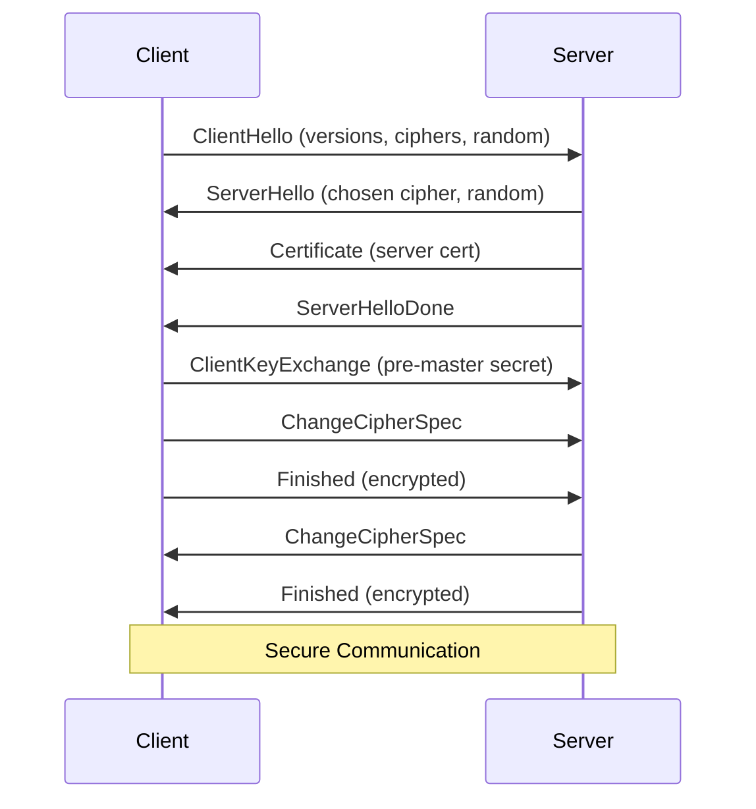
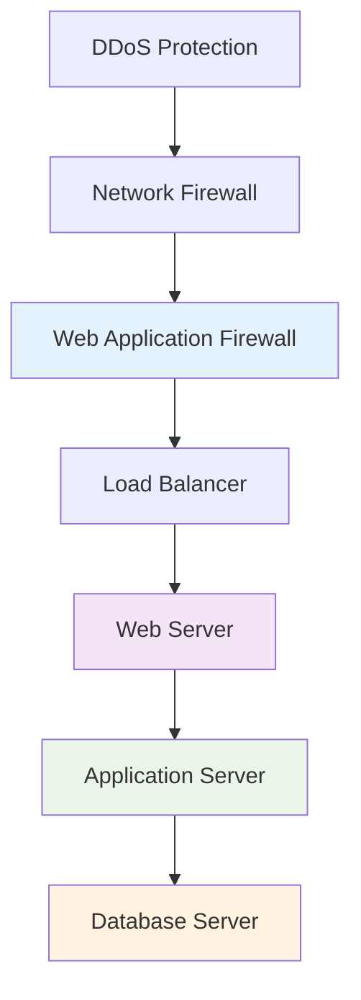
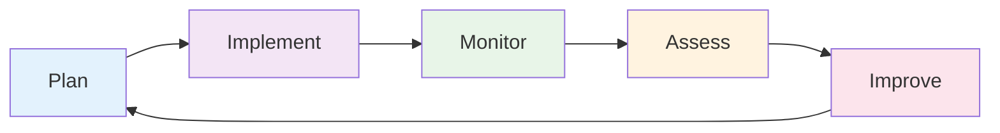

# OSI Security Architecture - Part 2
## Unit I: Introduction to Cyber Security & Cryptography
### Lecture 6: Upper Layers Security (5-7)

<div class="absolute bottom-5 left-5 text-xs text-gray-500">
Course: Cyber Security (4353204) | Semester V | Diploma ICT | Author: Milav Dabgar
</div>

---
layout: default
---

# Recap: Lower Layers (1-4) Security

<div class="grid grid-cols-2 gap-6">

<div>

## 🔄 What We Covered

### Layer 1: Physical Security
- Cable tapping and physical access
- Environmental threats
- Facility security controls

### Layer 2: Data Link Security
- MAC spoofing and flooding
- VLAN security
- Wireless network protection

</div>

<div>

### Layer 3: Network Security
- IP spoofing and routing attacks
- IPSec implementation
- Network segmentation

### Layer 4: Transport Security
- TCP/UDP vulnerabilities
- SYN flood protection
- Port-based security

## 🎯 Today's Focus
**Upper layer security** and **end-to-end** protection

</div>

</div>

<div class="absolute bottom-5 left-5 text-xs text-gray-500">
Course: Cyber Security (4353204) | Unit I | Lecture 6 | Author: Milav Dabgar
</div>

---
layout: default
---

# Layer 5: Session Layer Security

<div class="grid grid-cols-2 gap-6">

<div>

## 💬 Session Layer Overview

### 🎯 Core Functions
- **Session establishment** and termination
- **Dialog control** (duplex management)
- **Session checkpointing** and recovery
- **Session synchronization**
- **Token management** for exclusive access

### 🔧 Key Responsibilities
- **Manage conversations** between applications
- **Coordinate data exchange**
- **Handle session failures** and recovery
- **Provide synchronization** points

### 📋 Session Types
- **Simplex** - One-way communication
- **Half-duplex** - Two-way, alternating
- **Full-duplex** - Simultaneous two-way

</div>

<div>

## 🚨 Session Layer Threats

### 🎭 Session Management Attacks
- **Session hijacking** - Taking over active sessions
- **Session fixation** - Forcing known session IDs
- **Session replay** - Reusing captured sessions
- **Cross-site request forgery** (CSRF)
- **Session timeout** exploitation

### 🔓 Authentication Bypass
- **Session token** prediction
- **Weak session** management
- **Concurrent session** abuse
- **Session state** manipulation

### 📊 Session Information Disclosure
- **Session ID** leakage in URLs
- **Unencrypted session** data
- **Session storage** vulnerabilities
- **Cross-domain** session sharing

</div>

</div>

<div class="absolute bottom-5 left-5 text-xs text-gray-500">
Course: Cyber Security (4353204) | Unit I | Lecture 6 | Author: Milav Dabgar
</div>

---
layout: default
---

# Session Layer: Security Implementation

<div class="grid grid-cols-2 gap-6">

<div>

## 🔒 Session Security Best Practices

### 🎯 Secure Session Management
- **Strong session ID** generation
- **Session expiration** policies
- **Secure session** storage
- **Session invalidation** on logout
- **Concurrent session** control

### 🔐 Session Token Security
```python
import secrets
import hashlib
import time

def generate_secure_session_id():
    # Cryptographically secure random generation
    random_part = secrets.token_hex(16)
    timestamp = str(int(time.time()))
    user_info = get_user_context()
    
    # Combine with server secret
    session_data = f"{random_part}:{timestamp}:{user_info}"
    session_id = hashlib.sha256(session_data.encode()).hexdigest()
    
    return session_id
```

### ⏰ Session Lifecycle Management
- **Creation** with strong entropy
- **Validation** on each request
- **Renewal** for long sessions
- **Destruction** on logout/timeout

</div>

<div>

## 🛡️ Session Protection Mechanisms

### 🔧 Technical Controls
- **HTTPS-only** session cookies
- **HttpOnly flag** prevents XSS access
- **Secure flag** for encrypted transmission
- **SameSite attribute** for CSRF protection
- **Session binding** to IP/User-Agent

### 📊 Session Monitoring
```javascript
// Session anomaly detection
class SessionMonitor {
    detectAnomalies(sessionData) {
        const anomalies = [];
        
        // IP address changes
        if (sessionData.currentIP !== sessionData.originalIP) {
            anomalies.push('IP_CHANGE');
        }
        
        // Unusual access patterns
        if (sessionData.requestRate > THRESHOLD) {
            anomalies.push('HIGH_RATE');
        }
        
        // Concurrent sessions
        if (sessionData.concurrentSessions > MAX_SESSIONS) {
            anomalies.push('TOO_MANY_SESSIONS');
        }
        
        return anomalies;
    }
}
```

</div>

</div>

<div class="absolute bottom-5 left-5 text-xs text-gray-500">
Course: Cyber Security (4353204) | Unit I | Lecture 6 | Author: Milav Dabgar
</div>

---
layout: default
---

# Layer 6: Presentation Layer Security

<div class="grid grid-cols-2 gap-6">

<div>

## 🎨 Presentation Layer Overview

### 🎯 Core Functions
- **Data format** translation
- **Encryption and decryption**
- **Data compression**
- **Character encoding** conversion
- **Data structure** formatting

### 🔄 Data Transformations
- **ASCII/Unicode** encoding
- **Image/Video** format conversion
- **Compression algorithms** (ZIP, GZIP)
- **Serialization** (JSON, XML, Binary)
- **Protocol buffer** encoding

### 🔒 Security Services
- **Symmetric encryption** (AES, 3DES)
- **Asymmetric encryption** (RSA, ECC)
- **Digital signatures**
- **Certificate management**
- **Key exchange** protocols

</div>

<div>

## ⚠️ Presentation Layer Threats

### 🔓 Encryption Weaknesses
- **Weak cryptographic** algorithms
- **Poor key management**
- **Implementation vulnerabilities**
- **Side-channel attacks**
- **Cryptographic oracle** attacks

### 📄 Data Format Attacks
- **XML injection** attacks
- **JSON parsing** vulnerabilities
- **Serialization attacks**
- **Buffer overflow** in parsers
- **Zip bomb** attacks

### 🎭 Protocol Manipulation
- **SSL stripping** attacks
- **Downgrade attacks**
- **Certificate spoofing**
- **Man-in-the-middle** TLS
- **Compression attacks** (CRIME, BREACH)

</div>

</div>

<div class="absolute bottom-5 left-5 text-xs text-gray-500">
Course: Cyber Security (4353204) | Unit I | Lecture 6 | Author: Milav Dabgar
</div>

---
layout: default
---

# Presentation Layer: TLS/SSL Security

<div class="grid grid-cols-2 gap-6">

<div>

## 🔐 TLS Handshake Process



### 🔍 Security Features
- **Server authentication** via certificates
- **Data encryption** with symmetric keys
- **Data integrity** with MAC
- **Perfect forward secrecy**

</div>

<div>

## 🛡️ TLS Security Best Practices

### 📊 Cipher Suite Selection
```yaml
Recommended Ciphers:
  - TLS_AES_256_GCM_SHA384 (TLS 1.3)
  - TLS_CHACHA20_POLY1305_SHA256 (TLS 1.3)
  - TLS_AES_128_GCM_SHA256 (TLS 1.3)
  - ECDHE-RSA-AES256-GCM-SHA384 (TLS 1.2)
  - ECDHE-RSA-CHACHA20-POLY1305 (TLS 1.2)

Avoid:
  - RC4 (broken)
  - 3DES (weak)
  - MD5 (collision attacks)
  - Export ciphers (weak)
```

### 🔧 Implementation Security
- **Strong certificate** validation
- **Certificate pinning** for mobile apps
- **HSTS** (HTTP Strict Transport Security)
- **OCSP stapling** for revocation
- **Regular certificate** rotation

### 🚨 Common TLS Vulnerabilities
- **POODLE** - SSL 3.0 padding oracle
- **BEAST** - CBC cipher vulnerability
- **HEARTBLEED** - OpenSSL buffer overflow
- **FREAK** - Export cipher downgrade

</div>

</div>

<div class="absolute bottom-5 left-5 text-xs text-gray-500">
Course: Cyber Security (4353204) | Unit I | Lecture 6 | Author: Milav Dabgar
</div>

---
layout: default
---

# Layer 7: Application Layer Security

<div class="grid grid-cols-2 gap-6">

<div>

## 🌐 Application Layer Overview

### 🎯 Core Functions
- **User interface** to network services
- **Application protocols** (HTTP, SMTP, FTP)
- **Data presentation** to users
- **Network service** access
- **Application-specific** logic

### 📋 Common Protocols
- **HTTP/HTTPS** - Web browsing
- **SMTP/POP/IMAP** - Email services
- **FTP/SFTP** - File transfer
- **DNS** - Name resolution
- **DHCP** - IP configuration
- **SNMP** - Network management

### 🔧 Application Types
- **Web applications**
- **Email clients**
- **File transfer** tools
- **Remote access** applications
- **Network management** tools

</div>

<div>

## 🚨 Application Layer Threats

### 🌐 Web Application Attacks
- **SQL injection** - Database manipulation
- **Cross-site scripting** (XSS)
- **Cross-site request forgery** (CSRF)
- **Remote code execution** (RCE)
- **File inclusion** vulnerabilities

### 📧 Email-Based Attacks
- **Phishing** and spear phishing
- **Email spoofing**
- **Malware attachments**
- **Business email compromise** (BEC)
- **Email bombing**

### 🔍 Protocol-Specific Attacks
- **HTTP response** splitting
- **DNS poisoning**
- **FTP bounce** attacks
- **SMTP relay** abuse
- **SNMP community** string attacks

</div>

</div>

<div class="absolute bottom-5 left-5 text-xs text-gray-500">
Course: Cyber Security (4353204) | Unit I | Lecture 6 | Author: Milav Dabgar
</div>

---
layout: default
---

# Application Layer: OWASP Top 10 Security Risks

<div class="grid grid-cols-2 gap-6">

<div>

## 🔝 OWASP Top 10 (2021)

### 1. **A01: Broken Access Control**
- **Vertical privilege** escalation
- **Horizontal privilege** escalation
- **Missing access** controls
- **CORS misconfigurations**

### 2. **A02: Cryptographic Failures**
- **Weak encryption** algorithms
- **Poor key management**
- **Unencrypted sensitive** data
- **Weak random number** generation

### 3. **A03: Injection**
- **SQL injection**
- **NoSQL injection**
- **LDAP injection**
- **Command injection**

### 4. **A04: Insecure Design**
- **Threat modeling** gaps
- **Secure design** principles ignored
- **Missing security** controls

</div>

<div>

### 5. **A05: Security Misconfiguration**
- **Default credentials** unchanged
- **Unnecessary features** enabled
- **Missing security** headers
- **Verbose error** messages

### 6. **A06: Vulnerable Components**
- **Outdated libraries**
- **Known vulnerabilities**
- **Unsupported components**

### 7. **A07: Authentication Failures**
- **Weak password** policies
- **Session management** flaws
- **Brute force** vulnerabilities

### 8. **A08: Software Integrity Failures**
- **Untrusted sources**
- **Missing integrity** checks
- **Supply chain** attacks

### 9. **A09: Logging/Monitoring Failures**
### 10. **A10: Server-Side Request Forgery**

</div>

</div>

<div class="absolute bottom-5 left-5 text-xs text-gray-500">
Course: Cyber Security (4353204) | Unit I | Lecture 6 | Author: Milav Dabgar
</div>

---
layout: default
---

# Application Security: Input Validation

<div class="grid grid-cols-2 gap-6">

<div>

## 🔍 Input Validation Principles

### 🎯 Validation Strategies
- **Allow-list** (whitelist) approach
- **Input sanitization**
- **Length restrictions**
- **Type validation**
- **Format validation**
- **Boundary checking**

### 📊 Common Input Sources
- **User forms** and fields
- **URL parameters**
- **HTTP headers**
- **Cookies**
- **File uploads**
- **API requests**

### ✅ Validation Best Practices
- **Server-side** validation (never trust client)
- **Early validation** at entry points
- **Consistent validation** across application
- **Error handling** without information leakage

</div>

<div>

## 🛡️ SQL Injection Prevention

### ❌ Vulnerable Code
```php
// DON'T DO THIS - SQL Injection vulnerable
$username = $_POST['username'];
$password = $_POST['password'];

$query = "SELECT * FROM users WHERE username = '$username' 
          AND password = '$password'";
$result = mysql_query($query);

// Attacker input: username = admin' --
// Result: SELECT * FROM users WHERE username = 'admin' --
```

### ✅ Secure Implementation
```php
// Secure approach using prepared statements
$stmt = $pdo->prepare("SELECT * FROM users WHERE username = ? 
                       AND password = ?");
$stmt->execute([$username, $hashed_password]);
$result = $stmt->fetch();

// Additional validation
function validateInput($input, $type) {
    switch($type) {
        case 'username':
            return preg_match('/^[a-zA-Z0-9_]{3,20}$/', $input);
        case 'email':
            return filter_var($input, FILTER_VALIDATE_EMAIL);
    }
}
```

</div>

</div>

<div class="absolute bottom-5 left-5 text-xs text-gray-500">
Course: Cyber Security (4353204) | Unit I | Lecture 6 | Author: Milav Dabgar
</div>

---
layout: default
---

# Cross-Site Scripting (XSS) Prevention

<div class="grid grid-cols-2 gap-6">

<div>

## 🎭 Types of XSS Attacks

### 1. **Reflected XSS**
- **User input** reflected in response
- **Immediate execution**
- **Social engineering** required
- **URL-based** attacks

### 2. **Stored XSS**
- **Malicious script** stored on server
- **Persistent** across sessions
- **Affects multiple** users
- **Most dangerous** type

### 3. **DOM-based XSS**
- **Client-side** code vulnerability
- **JavaScript manipulation**
- **No server involvement**
- **Difficult to detect**

</div>

<div>

## 🛡️ XSS Prevention Techniques

### 🔒 Output Encoding
```javascript
// HTML Entity Encoding
function htmlEncode(str) {
    return str.replace(/[&<>"']/g, function(match) {
        return {
            '&': '&amp;',
            '<': '&lt;',
            '>': '&gt;',
            '"': '&quot;',
            "'": '&#x27;'
        }[match];
    });
}

// Safe DOM manipulation
const safeDiv = document.createElement('div');
safeDiv.textContent = userInput; // Safe - no HTML parsing
document.body.appendChild(safeDiv);
```

### 🔧 Security Headers
```http
Content-Security-Policy: default-src 'self'; 
    script-src 'self' 'unsafe-inline'
X-XSS-Protection: 1; mode=block
X-Content-Type-Options: nosniff
X-Frame-Options: DENY
```

### 📊 Input Validation
- **Allow-list** of safe characters
- **Length restrictions**
- **Context-aware** encoding
- **Regular expression** validation

</div>

</div>

<div class="absolute bottom-5 left-5 text-xs text-gray-500">
Course: Cyber Security (4353204) | Unit I | Lecture 6 | Author: Milav Dabgar
</div>

---
layout: default
---

# Secure Application Architecture

<div class="grid grid-cols-2 gap-6">

<div>

## 🏗️ Security Architecture Patterns

### 🛡️ Defense in Depth


### 🔒 Zero Trust Model
- **Never trust, always verify**
- **Least privilege** access
- **Microsegmentation**
- **Continuous monitoring**
- **Context-aware** access

### 📊 Secure Development Lifecycle
- **Security requirements** gathering
- **Threat modeling**
- **Secure coding** practices
- **Security testing**
- **Deployment security**

</div>

<div>

## 🔧 Application Security Controls

### 🎯 Preventive Controls
- **Input validation**
- **Output encoding**
- **Authentication mechanisms**
- **Authorization systems**
- **Secure communications** (HTTPS)

### 🔍 Detective Controls
- **Application monitoring**
- **Log analysis**
- **Intrusion detection**
- **Vulnerability scanning**
- **Security information** correlation

### 🚨 Corrective Controls
- **Incident response** procedures
- **Backup and recovery**
- **Patch management**
- **Configuration management**
- **Emergency procedures**

### 📈 Security Metrics
- **Vulnerability density**
- **Time to patch**
- **Authentication success** rates
- **Security incident** frequency
- **User security** awareness

</div>

</div>

<div class="absolute bottom-5 left-5 text-xs text-gray-500">
Course: Cyber Security (4353204) | Unit I | Lecture 6 | Author: Milav Dabgar
</div>

---
layout: default
---

# OSI Security Integration

<div class="grid grid-cols-2 gap-6">

<div>

## 🔗 End-to-End Security

### 📊 Multi-Layer Protection Matrix

| Layer | Security Focus | Key Protocols | Main Threats |
|-------|---------------|---------------|--------------|
| **7 - Application** | Input validation, authentication | HTTP/S, SMTP | Injection, XSS |
| **6 - Presentation** | Encryption, data formats | TLS, SSL | Weak crypto, parsing |
| **5 - Session** | Session management | NetBIOS, RPC | Session hijacking |
| **4 - Transport** | Reliable delivery | TCP, UDP | SYN floods, hijacking |
| **3 - Network** | Routing, addressing | IP, IPSec | Spoofing, routing |
| **2 - Data Link** | Local delivery | Ethernet, Wi-Fi | MAC flooding, wireless |
| **1 - Physical** | Signal transmission | Fiber, copper | Tapping, physical access |

### 🎯 Security Integration Principles
- **Complementary controls** at each layer
- **Consistent security** policies
- **Coordinated incident** response
- **Unified monitoring** and management

</div>

<div>

## 🛡️ Comprehensive Security Strategy

### 📋 Security Architecture Checklist
- [ ] **Physical security** perimeter
- [ ] **Network segmentation** and firewalls
- [ ] **Secure protocols** (TLS, IPSec)
- [ ] **Strong authentication** and authorization
- [ ] **Input validation** and output encoding
- [ ] **Security monitoring** and logging
- [ ] **Incident response** procedures
- [ ] **Regular security** assessments

### 🔄 Continuous Security Process


### 💡 Success Factors
- **Executive support**
- **Security awareness** training
- **Regular updates** and patches
- **Third-party** risk management
- **Compliance** monitoring

</div>

</div>

<div class="absolute bottom-5 left-5 text-xs text-gray-500">
Course: Cyber Security (4353204) | Unit I | Lecture 6 | Author: Milav Dabgar
</div>

---
layout: default
---

# Practical Exercise: Complete OSI Security Design

<div class="exercise-container">

## 🎯 Group Activity (25 minutes)

### Scenario: E-Commerce Platform Security Design

Your team must design comprehensive security for an e-commerce platform with:
- **Customer web interface** (online shopping)
- **Mobile applications** (iOS/Android)
- **Payment processing** system
- **Admin dashboard** for management
- **API interfaces** for partners
- **Database servers** with customer/product data

### Task: Design Security for All 7 OSI Layers

**Create a security architecture covering:**

**Upper Layers (Today's Focus):**
- **Layer 7 (Application):** Web app security, API security, input validation
- **Layer 6 (Presentation):** TLS implementation, data encryption, certificate management
- **Layer 5 (Session):** Session management, authentication, user state

**Lower Layers (Previous Lecture):**
- **Layer 4 (Transport):** TCP/UDP security, port management
- **Layer 3 (Network):** Network segmentation, firewall rules
- **Layer 2 (Data Link):** Switch security, VLAN implementation
- **Layer 1 (Physical):** Facility security, cable protection

**Deliverables:**
1. **Security control** for each layer
2. **Integration strategy** between layers
3. **Monitoring approach** for each layer
4. **Incident response** plan

</div>

<style>
.exercise-container {
  @apply bg-green-50 border-2 border-green-300 rounded-lg p-6;
}
</style>

<div class="absolute bottom-5 left-5 text-xs text-gray-500">
Course: Cyber Security (4353204) | Unit I | Lecture 6 | Author: Milav Dabgar
</div>

---
layout: default
---

# Common OSI Security Mistakes

<div class="grid grid-cols-2 gap-6">

<div>

## ❌ Frequent Errors

### Layer-Specific Mistakes
- **Physical:** Ignoring environmental security
- **Data Link:** Default VLAN configurations
- **Network:** Overly permissive firewall rules
- **Transport:** Ignoring UDP security
- **Session:** Weak session management
- **Presentation:** Weak encryption implementation
- **Application:** Insufficient input validation

### Integration Problems
- **Security gaps** between layers
- **Inconsistent policies** across layers
- **Poor monitoring** coordination
- **Inadequate incident** response integration

</div>

<div>

## ✅ Best Practices

### Design Principles
- **Start with physical** security foundation
- **Build security** into each layer
- **Implement defense** in depth
- **Regular security** assessments
- **Staff training** on all layers

### Implementation Guidelines
- **Document security** architecture
- **Test security** controls regularly
- **Monitor all** layers continuously
- **Update security** controls as needed
- **Integrate with** business processes

### Success Metrics
- **Reduced security** incidents
- **Faster incident** detection
- **Improved compliance**
- **Lower security** costs
- **Better user** experience

</div>

</div>

<div class="absolute bottom-5 left-5 text-xs text-gray-500">
Course: Cyber Security (4353204) | Unit I | Lecture 6 | Author: Milav Dabgar
</div>

---
layout: default
---

# Next Lecture Preview

<div class="grid grid-cols-2 gap-6">

<div>

## 🔜 Lecture 7: Introduction to Cryptography

### 🎯 Focus Topics:
- **Cryptography fundamentals**
- **Symmetric encryption** algorithms
- **Asymmetric encryption** systems
- **Key management** principles
- **Digital signatures** and certificates
- **Cryptographic applications**

### 📝 Preparation Tasks:
- Review mathematical basics (modular arithmetic)
- Research historical encryption methods
- Think about data protection needs
- Consider key distribution challenges

</div>

<div>

## 🎓 Key Takeaways Today

### OSI Upper Layers Security
- **Session layer** manages communication state
- **Presentation layer** handles encryption and data formats
- **Application layer** faces the most diverse threats
- **Integration** across all layers is essential

### Critical Security Concepts
- **Defense in depth** applies to network architecture
- **Each layer** has unique security responsibilities
- **Application security** requires comprehensive approach
- **End-to-end security** needs all layers working together

</div>

</div>

<div class="absolute bottom-5 left-5 text-xs text-gray-500">
Course: Cyber Security (4353204) | Unit I | Lecture 6 | Author: Milav Dabgar
</div>

---
layout: center
class: text-center
---

# Questions & Discussion

## 🤔 Discussion Points:
- Which upper layer presents the biggest security challenges?
- How do you balance security with application performance?
- What are the most critical application security controls?

### 💡 Exercise Review
Share your comprehensive OSI security designs

<div class="absolute bottom-5 left-5 text-xs text-gray-500">
Course: Cyber Security (4353204) | Unit I | Lecture 6 | Author: Milav Dabgar
</div>

---
layout: center
class: text-center
---

# Thank You!

## Next Lecture: Introduction to Cryptography
### The Foundation of Modern Security

<div class="pt-8 text-gray-500">
  <p>Cyber Security (4353204) - Lecture 6 Complete</p>
  <p>From physical to application - security at every layer! 🏗️🔐</p>
</div>

<div class="absolute bottom-5 left-5 text-xs text-gray-500">
Course: Cyber Security (4353204) | Unit I | Lecture 6 | Author: Milav Dabgar
</div>