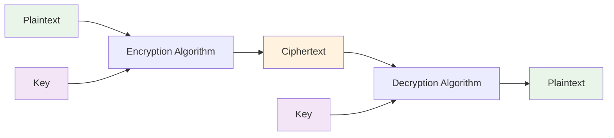
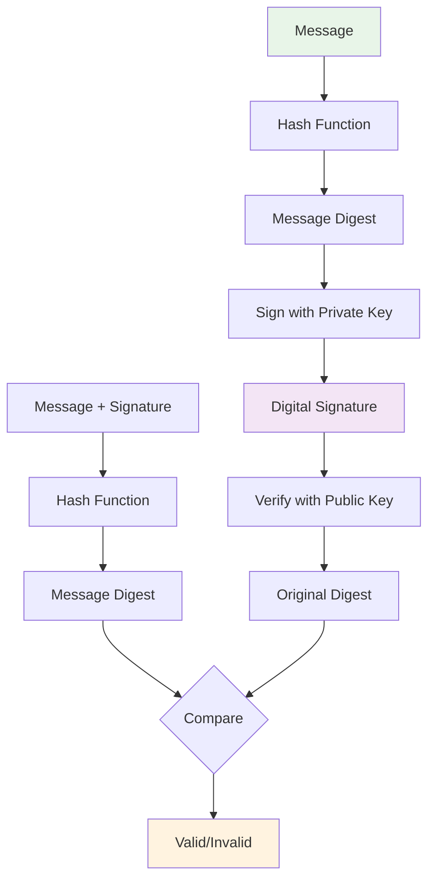

# Introduction to Cryptography
## Unit I: Introduction to Cyber Security & Cryptography
### Lecture 7: The Science of Secret Communication

<div class="absolute bottom-5 left-5 text-xs text-gray-500">
Course: Cyber Security (4353204) | Semester V | Diploma ICT | Author: Milav Dabgar
</div>

---
layout: default
---

# What is Cryptography?

<div class="grid grid-cols-2 gap-6">

<div>

## 🔐 Definition

**Cryptography** is the science of protecting information by transforming it into an unreadable format for unauthorized users, while allowing authorized users to access the original information.

### 🎯 Core Objectives
- **Confidentiality** - Keep information secret
- **Integrity** - Ensure data hasn't been altered
- **Authentication** - Verify identity of sender
- **Non-repudiation** - Prevent denial of actions

### 📚 Etymology
- **Crypto** (Greek) = Hidden, Secret
- **Graphy** (Greek) = Writing
- **Cryptography** = Secret Writing

</div>

<div>

## 🔄 Cryptographic Process



### 🔑 Key Components
- **Plaintext** - Original readable message
- **Ciphertext** - Encrypted unreadable message
- **Algorithm** - Mathematical process
- **Key** - Secret parameter that controls encryption
- **Keyspace** - Set of all possible keys

</div>

</div>

<div class="absolute bottom-5 left-5 text-xs text-gray-500">
Course: Cyber Security (4353204) | Unit I | Lecture 7 | Author: Milav Dabgar
</div>

---
layout: default
---

# Historical Cryptography

<div class="grid grid-cols-2 gap-6">

<div>

## 🏛️ Ancient Cryptography

### Caesar Cipher (50 BC)
```
Plaintext:  HELLO WORLD
Key:        3 (shift by 3)
Ciphertext: KHOOR ZRUOG

A B C D E F G H I J K L M
↓ ↓ ↓ ↓ ↓ ↓ ↓ ↓ ↓ ↓ ↓ ↓ ↓
D E F G H I J K L M N O P
```

### Atbash Cipher
- **Hebrew origin** - reverse alphabet
- **A↔Z, B↔Y, C↔X...**
- Used in Biblical texts

### Scytale (Ancient Greece)
- **Physical device** - rod with leather strip
- **Transposition** cipher
- **Military communications**

</div>

<div>

## 🕰️ Evolution Timeline

### Middle Ages (500-1500 AD)
- **Polyalphabetic ciphers**
- **Vigenère cipher** (1553)
- **Frequency analysis** attacks

### Renaissance (1400-1600)
- **Diplomatic cryptography**
- **Cipher wheels** and devices
- **Code breaking** emergence

### Modern Era (1900-1950)
- **Mechanical devices** (Enigma)
- **World War** cryptography
- **Breaking Enigma** - Turing's work

### Computer Age (1950+)
- **DES** (1976) - Data Encryption Standard
- **Public key** cryptography (1976)
- **AES** (2001) - Advanced Encryption Standard

</div>

</div>

<div class="absolute bottom-5 left-5 text-xs text-gray-500">
Course: Cyber Security (4353204) | Unit I | Lecture 7 | Author: Milav Dabgar
</div>

---
layout: default
---

# Types of Cryptographic Systems

<div class="grid grid-cols-2 gap-6">

<div>

## 🔑 Symmetric Cryptography

### 🎯 Characteristics
- **Same key** for encryption and decryption
- **Fast** and efficient
- **Shared secret** required
- **Key distribution** problem

### 📊 Process Flow


### 🔧 Common Algorithms
- **AES** (Advanced Encryption Standard)
- **3DES** (Triple Data Encryption Standard)
- **ChaCha20** (Stream cipher)
- **Blowfish** (Block cipher)

</div>

<div>

## 🔐 Asymmetric Cryptography

### 🎯 Characteristics
- **Different keys** (public/private pair)
- **Slower** than symmetric
- **No shared secret** needed
- **Solves key distribution** problem

### 📊 Process Flow


### 🔧 Common Algorithms
- **RSA** (Rivest-Shamir-Adleman)
- **ECC** (Elliptic Curve Cryptography)
- **DSA** (Digital Signature Algorithm)
- **Diffie-Hellman** (Key exchange)

</div>

</div>

<div class="absolute bottom-5 left-5 text-xs text-gray-500">
Course: Cyber Security (4353204) | Unit I | Lecture 7 | Author: Milav Dabgar
</div>

---
layout: default
---

# Symmetric Encryption: AES Algorithm

<div class="grid grid-cols-2 gap-6">

<div>

## 🏆 AES Overview

### 📋 Specifications
- **Block size:** 128 bits
- **Key sizes:** 128, 192, 256 bits
- **Rounds:** 10, 12, 14 (based on key size)
- **Standard:** NIST FIPS 197

### 🔄 AES Operations
1. **SubBytes** - Byte substitution using S-box
2. **ShiftRows** - Cyclic shift of rows
3. **MixColumns** - Linear transformation
4. **AddRoundKey** - XOR with round key

### 📊 AES Structure
```
Round 1-9:  SubBytes → ShiftRows → MixColumns → AddRoundKey
Round 10:   SubBytes → ShiftRows → AddRoundKey
```

</div>

<div>

## 🔧 AES Implementation Example

```python
from cryptography.fernet import Fernet
from cryptography.hazmat.primitives.ciphers import Cipher, algorithms, modes
from cryptography.hazmat.backends import default_backend
import os

# AES encryption example
def aes_encrypt(plaintext, key):
    # Generate random IV
    iv = os.urandom(16)
    
    # Create cipher object
    cipher = Cipher(
        algorithms.AES(key),
        modes.CBC(iv),
        backend=default_backend()
    )
    
    encryptor = cipher.encryptor()
    
    # Pad plaintext to block size
    padded_text = pad(plaintext.encode(), 16)
    
    # Encrypt
    ciphertext = encryptor.update(padded_text) + encryptor.finalize()
    
    return iv + ciphertext

# Key generation
key = os.urandom(32)  # 256-bit key
```

### 🛡️ Security Features
- **Proven security** through extensive analysis
- **Resistant** to known attacks
- **Hardware optimization** available
- **Government approved** (FIPS 140-2)

</div>

</div>

<div class="absolute bottom-5 left-5 text-xs text-gray-500">
Course: Cyber Security (4353204) | Unit I | Lecture 7 | Author: Milav Dabgar
</div>

---
layout: default
---

# Asymmetric Encryption: RSA Algorithm

<div class="grid grid-cols-2 gap-6">

<div>

## 🔢 RSA Mathematical Foundation

### 🎯 Key Generation Process
1. **Choose** two large prime numbers p and q
2. **Compute** n = p × q (modulus)
3. **Compute** φ(n) = (p-1)(q-1)
4. **Choose** e such that gcd(e, φ(n)) = 1
5. **Compute** d such that e × d ≡ 1 (mod φ(n))

### 🔑 Keys
- **Public Key:** (n, e)
- **Private Key:** (n, d)

### 📊 RSA Operations
```
Encryption: C = M^e mod n
Decryption: M = C^d mod n

Where:
- M = Message (plaintext)
- C = Ciphertext
- e = Public exponent
- d = Private exponent
- n = Modulus
```

</div>

<div>

## 🔒 RSA Security & Applications

### 🛡️ Security Basis
- **Integer factorization** problem
- **Large prime** factorization difficulty
- **Computational complexity** theory

### ⚡ Performance Considerations
- **Slow** compared to symmetric encryption
- **Key size** affects performance (1024, 2048, 4096 bits)
- **Hybrid cryptography** common approach

### 🔧 RSA Applications
- **Digital signatures**
- **Key exchange** protocols
- **Certificate authorities**
- **Secure communications** (TLS/SSL)

### 📈 Hybrid Cryptography Example
```
1. Generate random AES key
2. Encrypt data with AES (fast)
3. Encrypt AES key with RSA (secure)
4. Send both encrypted data and encrypted key
```

</div>

</div>

<div class="absolute bottom-5 left-5 text-xs text-gray-500">
Course: Cyber Security (4353204) | Unit I | Lecture 7 | Author: Milav Dabgar
</div>

---
layout: default
---

# Digital Signatures

<div class="grid grid-cols-2 gap-6">

<div>

## ✍️ Digital Signature Concept

### 🎯 Purpose
- **Authentication** - Verify sender identity
- **Integrity** - Detect message tampering
- **Non-repudiation** - Prevent denial of signing

### 🔄 Signature Process


</div>

<div>

## 🔧 Digital Signature Implementation

### 📋 Common Algorithms
- **RSA signatures**
- **DSA** (Digital Signature Algorithm)
- **ECDSA** (Elliptic Curve DSA)
- **EdDSA** (Edwards-curve DSA)

### 💻 Example: RSA Signature
```python
from cryptography.hazmat.primitives import hashes
from cryptography.hazmat.primitives.asymmetric import rsa, padding
from cryptography.hazmat.primitives.serialization import Encoding, PublicFormat

# Generate key pair
private_key = rsa.generate_private_key(
    public_exponent=65537,
    key_size=2048
)
public_key = private_key.public_key()

# Sign message
message = b"Important document content"
signature = private_key.sign(
    message,
    padding.PSS(
        mgf=padding.MGF1(hashes.SHA256()),
        salt_length=padding.PSS.MAX_LENGTH
    ),
    hashes.SHA256()
)

# Verify signature
try:
    public_key.verify(signature, message, ...)
    print("Signature valid")
except:
    print("Signature invalid")
```

</div>

</div>

<div class="absolute bottom-5 left-5 text-xs text-gray-500">
Course: Cyber Security (4353204) | Unit I | Lecture 7 | Author: Milav Dabgar
</div>

---
layout: default
---

# Key Management

<div class="grid grid-cols-2 gap-6">

<div>

## 🗝️ Key Management Lifecycle

### 🔄 Key Lifecycle Phases
1. **Generation** - Create cryptographic keys
2. **Distribution** - Securely share keys
3. **Storage** - Protect keys at rest
4. **Usage** - Apply keys for cryptographic operations
5. **Rotation** - Replace keys periodically
6. **Revocation** - Invalidate compromised keys
7. **Destruction** - Securely delete old keys

### ⚡ Key Generation Requirements
- **True randomness** (entropy)
- **Sufficient length**
- **Proper algorithms**
- **Secure random generators**

### 🔒 Key Storage Options
- **Hardware Security Modules** (HSM)
- **Key management systems**
- **Secure software storage**
- **Cloud key management**

</div>

<div>

## 🛡️ Key Management Best Practices

### 📋 Security Principles
- **Separation of duties** in key handling
- **Least privilege** access
- **Key escrow** for recovery
- **Audit trails** for key operations
- **Regular key rotation**

### 🔧 Key Distribution Methods
- **Public Key Infrastructure** (PKI)
- **Key exchange** protocols
- **Symmetric key** pre-distribution
- **Key derivation** functions

### 📊 Key Management Challenges
- **Scalability** - Managing thousands of keys
- **Compliance** - Meeting regulatory requirements
- **Integration** - Working with existing systems
- **Cost** - Hardware and operational expenses
- **Availability** - Ensuring key access when needed

### 💡 Best Practice Example
```yaml
Key Management Policy:
  Generation: FIPS 140-2 Level 3 HSM
  Storage: Encrypted key vault with RBAC
  Rotation: Every 90 days for signing keys
  Backup: Encrypted offsite storage
  Destruction: Crypto-shredding approved methods
```

</div>

</div>

<div class="absolute bottom-5 left-5 text-xs text-gray-500">
Course: Cyber Security (4353204) | Unit I | Lecture 7 | Author: Milav Dabgar
</div>

---
layout: default
---

# Cryptographic Applications

<div class="grid grid-cols-2 gap-6">

<div>

## 🌐 Modern Applications

### 💳 E-Commerce Security
- **Payment card** encryption (PCI DSS)
- **Transaction** integrity
- **Customer data** protection
- **Secure communications** (TLS)

### 📱 Mobile Security
- **Device encryption** (full disk)
- **App data** protection
- **Secure messaging**
- **Mobile payments** (Apple Pay, Google Pay)

### ☁️ Cloud Security
- **Data at rest** encryption
- **Data in transit** protection
- **Key management** as a service
- **Homomorphic encryption** (future)

### 🏦 Financial Services
- **Banking transactions**
- **ATM communications**
- **Trading systems**
- **Regulatory compliance**

</div>

<div>

## 🔮 Emerging Cryptography

### 🧮 Quantum Cryptography
- **Quantum key distribution** (QKD)
- **Post-quantum cryptography**
- **Quantum-resistant** algorithms
- **NIST standardization** process

### 🔐 Advanced Techniques
- **Zero-knowledge proofs**
- **Homomorphic encryption**
- **Multi-party computation**
- **Blockchain cryptography**

### 🛡️ Cryptography Challenges
- **Quantum computing** threat
- **Implementation** vulnerabilities
- **Side-channel** attacks
- **Performance** vs. security trade-offs

### 📈 Future Trends
- **Quantum-safe** migration
- **Lightweight cryptography** for IoT
- **Privacy-preserving** technologies
- **Automated key** management

</div>

</div>

<div class="absolute bottom-5 left-5 text-xs text-gray-500">
Course: Cyber Security (4353204) | Unit I | Lecture 7 | Author: Milav Dabgar
</div>

---
layout: default
---

# Practical Exercise: Cryptographic Analysis

<div class="exercise-container">

## 🎯 Individual Activity (20 minutes)

### Scenario: Secure Communication System Design

You're designing a secure communication system for a healthcare organization that needs to:
- **Exchange patient** records between hospitals
- **Store sensitive** medical data
- **Authenticate** healthcare providers
- **Ensure compliance** with HIPAA regulations
- **Support mobile** devices for doctors

### Task: Design Cryptographic Solution

**Address these requirements:**

1. **Data Protection:**
   - What encryption algorithms would you use?
   - How would you protect data at rest vs. in transit?
   - What key sizes are appropriate?

2. **Authentication:**
   - How would you verify healthcare provider identities?
   - What digital signature approach would you use?
   - How would you handle user certificates?

3. **Key Management:**
   - How would you generate and distribute keys?
   - What key rotation schedule would you implement?
   - How would you handle key recovery?

4. **Implementation:**
   - Symmetric vs. asymmetric encryption usage
   - Performance considerations
   - Mobile device constraints

**Deliverables:**
- Cryptographic architecture diagram
- Algorithm selection justification
- Key management plan
- Security analysis

</div>

<style>
.exercise-container {
  @apply bg-purple-50 border-2 border-purple-300 rounded-lg p-6;
}
</style>

<div class="absolute bottom-5 left-5 text-xs text-gray-500">
Course: Cyber Security (4353204) | Unit I | Lecture 7 | Author: Milav Dabgar
</div>

---
layout: default
---

# Cryptography Best Practices

<div class="grid grid-cols-2 gap-6">

<div>

## ✅ Do's

### 🔒 Algorithm Selection
- **Use proven** algorithms (AES, RSA, ECC)
- **Follow current** standards (NIST, FIPS)
- **Adequate key** sizes (AES-256, RSA-2048+)
- **Regular algorithm** reviews

### 🔑 Key Management
- **Strong key** generation
- **Secure key** storage
- **Regular key** rotation
- **Proper key** disposal

### 🛡️ Implementation
- **Use established** libraries
- **Follow secure** coding practices
- **Regular security** updates
- **Proper error** handling

</div>

<div>

## ❌ Don'ts

### 🚫 Common Mistakes
- **Don't create** custom algorithms
- **Don't use** deprecated algorithms (MD5, SHA-1, DES)
- **Don't hardcode** keys in code
- **Don't ignore** side-channel attacks
- **Don't implement** crypto from scratch

### ⚠️ Security Anti-patterns
- **Insufficient** key lengths
- **Poor random** number generation
- **Improper** padding schemes
- **Inadequate** key storage
- **Missing** integrity checks

### 💡 Success Factors
- **Security by** design
- **Regular security** audits
- **Compliance** monitoring
- **Incident response** planning
- **Continuous learning**

</div>

</div>

<div class="absolute bottom-5 left-5 text-xs text-gray-500">
Course: Cyber Security (4353204) | Unit I | Lecture 7 | Author: Milav Dabgar
</div>

---
layout: default
---

# Next Lecture Preview

<div class="grid grid-cols-2 gap-6">

<div>

## 🔜 Lecture 8: Hash Algorithms

### 🎯 Focus Topics:
- **Hash function** properties and applications
- **SHA family** algorithms (SHA-1, SHA-2, SHA-3)
- **Message authentication** codes (MAC)
- **Digital fingerprints** and integrity checking
- **Hash-based** applications
- **Collision attacks** and resistance

### 📝 Preparation Tasks:
- Review hash function mathematical properties
- Research recent hash algorithm developments
- Think about data integrity use cases
- Consider hash function security requirements

</div>

<div>

## 🎓 Key Takeaways Today

### Cryptography Fundamentals
- **Cryptography** is essential for modern security
- **Symmetric** encryption is fast and efficient
- **Asymmetric** encryption solves key distribution
- **Digital signatures** provide authentication and non-repudiation

### Critical Concepts
- **Key management** is crucial for security
- **Algorithm selection** impacts overall security
- **Implementation** quality matters as much as algorithms
- **Regular updates** and rotation are essential

</div>

</div>

<div class="absolute bottom-5 left-5 text-xs text-gray-500">
Course: Cyber Security (4353204) | Unit I | Lecture 7 | Author: Milav Dabgar
</div>

---
layout: center
class: text-center
---

# Questions & Discussion

## 🤔 Discussion Points:
- What are the main challenges in implementing cryptography?
- How do you balance security and performance in encryption?
- What role will quantum computing play in future cryptography?

### 💡 Exercise Review
Share your cryptographic system designs for the healthcare scenario

<div class="absolute bottom-5 left-5 text-xs text-gray-500">
Course: Cyber Security (4353204) | Unit I | Lecture 7 | Author: Milav Dabgar
</div>

---
layout: center
class: text-center
---

# Thank You!

## Next Lecture: Hash Algorithms
### Digital Fingerprints and Data Integrity

<div class="pt-8 text-gray-500">
  <p>Cyber Security (4353204) - Lecture 7 Complete</p>
  <p>The art of keeping secrets! 🔐✨</p>
</div>

<div class="absolute bottom-5 left-5 text-xs text-gray-500">
Course: Cyber Security (4353204) | Unit I | Lecture 7 | Author: Milav Dabgar
</div>