# Hash Algorithms
## Unit I: Introduction to Cyber Security & Cryptography
### Lecture 8: Digital Fingerprints and Data Integrity

<div class="absolute bottom-5 left-5 text-xs text-gray-500">
Course: Cyber Security (4353204) | Semester V | Diploma ICT | Author: Milav Dabgar
</div>

---
layout: default
---

# What are Hash Functions?

<div class="grid grid-cols-2 gap-6">

<div>

## 🔍 Definition

A **hash function** is a mathematical algorithm that transforms input data of any size into a fixed-size string of characters, called a **hash digest** or **fingerprint**.

### 🎯 Key Properties
- **Deterministic** - Same input always produces same hash
- **Fixed output size** - Regardless of input length
- **Fast computation** - Efficient to calculate
- **Avalanche effect** - Small input change = big output change
- **One-way function** - Cannot reverse to get original input

### 📊 Hash Function Process
```
Input: "Hello World" (11 characters)
SHA-256 Hash: a591a6d40bf420404a011733cfb7b190d62c65bf0bcda32b57b277d9ad9f146e
Output: 64 hex characters (256 bits)
```

</div>

<div>

## 🔄 Hash Function Operation

```mermaid
graph LR
    A[Variable Length Input] --> B[Hash Function]
    B --> C[Fixed Length Output]
    
    D["Any size data:<br/>• Documents<br/>• Images<br/>• Software<br/>• Passwords"] --> B
    
    B --> E["Fixed size hash:<br/>• 128 bits (MD5)<br/>• 160 bits (SHA-1)<br/>• 256 bits (SHA-256)<br/>• 512 bits (SHA-512)"]
    
    style A fill:#e8f5e8
    style C fill:#f3e5f5
    style D fill:#e3f2fd
    style E fill:#fff3e0
```



### 🎭 Collision Resistance
- **Weak collision resistance** - Hard to find input that produces given hash
- **Strong collision resistance** - Hard to find two inputs with same hash

</div>

</div>

<div class="absolute bottom-5 left-5 text-xs text-gray-500">
Course: Cyber Security (4353204) | Unit I | Lecture 8 | Author: Milav Dabgar
</div>

---
layout: default
---

# Cryptographic Hash Properties

<div class="grid grid-cols-2 gap-6">

<div>

## 🛡️ Security Properties

### 1. Pre-image Resistance
- **Given hash h**, hard to find message m such that hash(m) = h
- **One-way property**
- **Prevents password** recovery from hash

### 2. Second Pre-image Resistance
- **Given message m1**, hard to find different m2 such that hash(m1) = hash(m2)
- **Weak collision** resistance
- **Prevents message** substitution

### 3. Strong Collision Resistance
- **Hard to find** any two messages m1, m2 such that hash(m1) = hash(m2)
- **Strong security** property
- **Most difficult** to achieve

</div>

<div>

## ⚡ Avalanche Effect Example

```python
import hashlib

# Small input change = Large hash change
message1 = "Hello World"
message2 = "Hello World!"  # Added one character

hash1 = hashlib.sha256(message1.encode()).hexdigest()
hash2 = hashlib.sha256(message2.encode()).hexdigest()

print(f"Message1: {message1}")
print(f"Hash1:    {hash1}")
print()
print(f"Message2: {message2}")
print(f"Hash2:    {hash2}")

# Compare hashes - completely different!
differences = sum(c1 != c2 for c1, c2 in zip(hash1, hash2))
print(f"Different characters: {differences}/64")
```

### 📊 Expected Output
```
Message1: Hello World
Hash1:    a591a6d40bf420404a011733cfb7b190...

Message2: Hello World!
Hash2:    7f83b1657ff1fc53b92dc18148a1d65d...

Different characters: 62/64 (96.9% different)
```

</div>

</div>

<div class="absolute bottom-5 left-5 text-xs text-gray-500">
Course: Cyber Security (4353204) | Unit I | Lecture 8 | Author: Milav Dabgar
</div>

---
layout: default
---

# SHA Family of Hash Functions

<div class="grid grid-cols-2 gap-6">

<div>

## 📚 SHA Evolution

### SHA-0 (1993)
- **First SHA** standard
- **Withdrawn** due to security flaws
- **Never widely** implemented

### SHA-1 (1995)
- **160-bit** hash output
- **Widely used** for years
- **Now deprecated** (2017)
- **Collision attacks** demonstrated

### SHA-2 Family (2001)
- **SHA-224** - 224-bit output
- **SHA-256** - 256-bit output  
- **SHA-384** - 384-bit output
- **SHA-512** - 512-bit output
- **Currently secure** and widely used

### SHA-3 (2015)
- **Keccak algorithm** winner
- **Different design** from SHA-2
- **Future-proof** alternative

</div>

<div>

## 🔧 SHA-2 Technical Details

### SHA-256 Specifications
- **Block size:** 512 bits
- **Word size:** 32 bits  
- **Rounds:** 64
- **Output size:** 256 bits
- **Internal state:** 256 bits

### SHA-256 Algorithm Steps
1. **Message padding** to multiple of 512 bits
2. **Parse message** into 512-bit blocks
3. **Initialize** hash values (8 × 32-bit words)
4. **Process each** block with compression function
5. **Produce final** hash value

### 📊 SHA Family Comparison
| Algorithm | Output Size | Block Size | Security Level |
|-----------|-------------|------------|----------------|
| SHA-1 | 160 bits | 512 bits | Broken |
| SHA-256 | 256 bits | 512 bits | 128 bits |
| SHA-384 | 384 bits | 1024 bits | 192 bits |
| SHA-512 | 512 bits | 1024 bits | 256 bits |

</div>

</div>

<div class="absolute bottom-5 left-5 text-xs text-gray-500">
Course: Cyber Security (4353204) | Unit I | Lecture 8 | Author: Milav Dabgar
</div>

---
layout: default
---

# Hash Function Applications

<div class="grid grid-cols-2 gap-6">

<div>

## 🔐 Password Storage

### ❌ Insecure Approach
```sql
-- DON'T DO THIS - Plain text passwords
CREATE TABLE users (
    username VARCHAR(50),
    password VARCHAR(50)  -- Stored as plain text
);

INSERT INTO users VALUES ('alice', 'mypassword123');
```

### ✅ Secure Approach with Salted Hashes
```python
import hashlib
import os
import base64

def hash_password(password):
    # Generate random salt
    salt = os.urandom(32)  # 32 bytes = 256 bits
    
    # Hash password with salt
    pwdhash = hashlib.pbkdf2_hmac(
        'sha256',           # Hash algorithm
        password.encode(),  # Password as bytes
        salt,              # Salt
        100000             # Iterations
    )
    
    # Store salt + hash
    return base64.b64encode(salt + pwdhash).decode('utf-8')

def verify_password(stored_password, provided_password):
    # Decode stored password
    decoded = base64.b64decode(stored_password.encode('utf-8'))
    salt = decoded[:32]  # First 32 bytes is salt
    stored_hash = decoded[32:]  # Rest is hash
    
    # Hash provided password with same salt
    pwdhash = hashlib.pbkdf2_hmac(
        'sha256',
        provided_password.encode(),
        salt,
        100000
    )
    
    return pwdhash == stored_hash
```

</div>

<div>

## 🔍 File Integrity Verification

### 📄 Document Integrity
```bash
# Generate hash of important document
sha256sum important_contract.pdf > contract.sha256

# Later, verify integrity
sha256sum -c contract.sha256
```

### 💾 Software Distribution
```bash
# Download software and hash file
wget https://example.com/software.tar.gz
wget https://example.com/software.tar.gz.sha256

# Verify integrity
sha256sum -c software.tar.gz.sha256
# software.tar.gz: OK
```

### 🔄 Version Control (Git)
```bash
# Git uses SHA-1 hashes for commits
git log --oneline
# a1b2c3d Fix security vulnerability
# e4f5g6h Add new feature
# i7j8k9l Initial commit

# Each commit has unique hash identifier
git show a1b2c3d
```

### 📊 Digital Forensics
- **Evidence integrity** verification
- **Timeline reconstruction**
- **Chain of custody** maintenance
- **File deduplication**

</div>

</div>

<div class="absolute bottom-5 left-5 text-xs text-gray-500">
Course: Cyber Security (4353204) | Unit I | Lecture 8 | Author: Milav Dabgar
</div>

---
layout: default
---

# Message Authentication Codes (MAC)

<div class="grid grid-cols-2 gap-6">

<div>

## 🔑 MAC Overview

### 🎯 Purpose
- **Message authentication** - Verify sender
- **Message integrity** - Detect tampering
- **Keyed hash function** - Requires secret key

### 🔄 MAC Process


### 📋 MAC Types
- **HMAC** - Hash-based MAC
- **CMAC** - Cipher-based MAC
- **GMAC** - Galois/Counter Mode MAC
- **Poly1305** - High-speed MAC

</div>

<div>

## 🛡️ HMAC Implementation

### 🔧 HMAC Algorithm
```
HMAC(K, m) = H((K ⊕ opad) || H((K ⊕ ipad) || m))

Where:
- H = Hash function (SHA-256)
- K = Secret key
- m = Message
- opad = 0x5c repeated
- ipad = 0x36 repeated
- || = Concatenation
- ⊕ = XOR
```

### 💻 Python HMAC Example
```python
import hmac
import hashlib

def create_hmac(key, message):
    # Create HMAC using SHA-256
    mac = hmac.new(
        key.encode(),
        message.encode(),
        hashlib.sha256
    )
    return mac.hexdigest()

def verify_hmac(key, message, received_mac):
    # Calculate expected MAC
    expected_mac = create_hmac(key, message)
    
    # Use secure comparison to prevent timing attacks
    return hmac.compare_digest(expected_mac, received_mac)

# Example usage
secret_key = "my_secret_key"
message = "Important message"
mac_tag = create_hmac(secret_key, message)

print(f"Message: {message}")
print(f"MAC: {mac_tag}")
print(f"Valid: {verify_hmac(secret_key, message, mac_tag)}")
```

</div>

</div>

<div class="absolute bottom-5 left-5 text-xs text-gray-500">
Course: Cyber Security (4353204) | Unit I | Lecture 8 | Author: Milav Dabgar
</div>

---
layout: default
---

# Hash Attacks and Vulnerabilities

<div class="grid grid-cols-2 gap-6">

<div>

## 🎭 Types of Hash Attacks

### 1. Collision Attacks
- **Find two inputs** with same hash
- **Birthday paradox** - √n complexity
- **SHA-1 collision** found in 2017

### 2. Pre-image Attacks
- **Given hash**, find original input
- **Brute force** approach
- **Dictionary attacks** on passwords

### 3. Length Extension Attacks
- **Exploit hash** construction
- **Add data** to existing hash
- **Affects MD5, SHA-1, SHA-2**

### 4. Rainbow Table Attacks
- **Pre-computed hash** tables
- **Time-memory** trade-off
- **Defeated by salting**

</div>

<div>

## 🛡️ Hash Attack Prevention

### 🧂 Salt Usage
```python
# Prevent rainbow table attacks
import os
import hashlib

def secure_hash(password):
    # Generate unique salt for each password
    salt = os.urandom(16)
    
    # Combine password and salt
    salted_password = salt + password.encode()
    
    # Hash the combination
    hash_obj = hashlib.sha256(salted_password)
    
    # Store salt + hash
    return salt + hash_obj.digest()
```

### 🔄 Key Stretching
```python
import hashlib

def pbkdf2_hash(password, salt, iterations=100000):
    # Slow down brute force attacks
    return hashlib.pbkdf2_hmac(
        'sha256',
        password.encode(),
        salt,
        iterations
    )
```

### 📊 Defense Strategies
- **Use current** hash algorithms (SHA-3, SHA-256)
- **Always salt** password hashes
- **Use key stretching** (PBKDF2, bcrypt, Argon2)
- **Implement pepper** for additional security
- **Regular algorithm** updates

</div>

</div>

<div class="absolute bottom-5 left-5 text-xs text-gray-500">
Course: Cyber Security (4353204) | Unit I | Lecture 8 | Author: Milav Dabgar
</div>

---
layout: default
---

# Blockchain and Hash Functions

<div class="grid grid-cols-2 gap-6">

<div>

## ⛓️ Blockchain Hash Usage

### 🔗 Block Structure
```
Block Header:
- Previous Block Hash: 32 bytes
- Merkle Root Hash: 32 bytes  
- Timestamp: 4 bytes
- Difficulty Target: 4 bytes
- Nonce: 4 bytes

Block Hash = SHA-256(SHA-256(Block Header))
```

### 🎯 Hash Functions in Blockchain
- **Block linking** - Previous block hash
- **Merkle trees** - Transaction integrity
- **Proof of work** - Mining difficulty
- **Address generation** - Public key hashing

### 📊 Merkle Tree Example


</div>

<div>

## ⚡ Proof of Work Mining

### 🔨 Mining Process
```python
import hashlib
import time

def mine_block(data, difficulty):
    target = "0" * difficulty  # Target hash prefix
    nonce = 0
    start_time = time.time()
    
    while True:
        # Create block data with nonce
        block_data = f"{data}{nonce}"
        
        # Calculate hash
        hash_result = hashlib.sha256(
            block_data.encode()
        ).hexdigest()
        
        # Check if hash meets difficulty requirement
        if hash_result.startswith(target):
            end_time = time.time()
            return {
                'data': data,
                'nonce': nonce,
                'hash': hash_result,
                'time': end_time - start_time
            }
        
        nonce += 1

# Example: Mine a block with difficulty 4
result = mine_block("Block data here", 4)
print(f"Mined block: {result}")
```

### 🔍 Security Properties
- **Immutability** - Cannot change without redoing work
- **Transparency** - All transactions verifiable
- **Decentralization** - No single point of failure

</div>

</div>

<div class="absolute bottom-5 left-5 text-xs text-gray-500">
Course: Cyber Security (4353204) | Unit I | Lecture 8 | Author: Milav Dabgar
</div>

---
layout: default
---

# Practical Exercise: Hash Function Applications

<div class="exercise-container">

## 🎯 Group Activity (25 minutes)

### Scenario: Digital Document Management System

Your organization needs a secure document management system that:
- **Stores thousands** of sensitive documents
- **Tracks document** changes and versions
- **Ensures document** integrity over time
- **Provides audit** trails for compliance
- **Supports digital** signatures
- **Prevents unauthorized** modifications

### Task: Design Hash-Based Security Solution

**Address these requirements:**

1. **Document Integrity:**
   - How would you detect document tampering?
   - What hash algorithms would you use and why?
   - How would you handle large files efficiently?

2. **Version Control:**
   - How would you track document changes?
   - How would you create unique document identifiers?
   - How would you handle version comparison?

3. **User Authentication:**
   - How would you securely store user passwords?
   - What salting strategy would you implement?
   - How would you handle password policies?

4. **Audit System:**
   - How would you create tamper-proof audit logs?
   - What information would you hash and store?
   - How would you ensure log integrity?

**Deliverables:**
- System architecture with hash functions
- Security analysis and threat model
- Implementation recommendations
- Performance considerations

</div>

<style>
.exercise-container {
  @apply bg-indigo-50 border-2 border-indigo-300 rounded-lg p-6;
}
</style>

<div class="absolute bottom-5 left-5 text-xs text-gray-500">
Course: Cyber Security (4353204) | Unit I | Lecture 8 | Author: Milav Dabgar
</div>

---
layout: default
---

# Hash Function Best Practices

<div class="grid grid-cols-2 gap-6">

<div>

## ✅ Recommended Practices

### 🔒 Algorithm Selection
- **Use SHA-256** or SHA-3 for new systems
- **Avoid MD5** and SHA-1 completely
- **Consider SHA-512** for high-security applications
- **Plan for** algorithm migration

### 🧂 Password Hashing
- **Always use** salt (unique per password)
- **Implement key** stretching (PBKDF2, bcrypt, Argon2)
- **Use sufficient** iterations (>100,000)
- **Consider pepper** for additional security

### 🔧 Implementation Security
- **Use established** cryptographic libraries
- **Implement constant-time** comparisons
- **Proper error** handling
- **Regular security** updates

</div>

<div>

## ❌ Common Mistakes

### 🚫 What NOT to Do
- **Don't create** custom hash functions
- **Don't use** fast hashes for passwords
- **Don't ignore** salt requirements
- **Don't use** predictable salts
- **Don't store** plaintext passwords

### ⚠️ Security Anti-patterns
- **Single-round** hashing for passwords
- **Global salt** usage
- **Hash function** misuse
- **Insufficient** iterations
- **Poor entropy** in salts

### 💡 Success Factors
- **Regular security** reviews
- **Performance vs. security** balance
- **Compliance** requirements consideration
- **Future-proofing** with newer algorithms
- **Monitoring** for attacks

</div>

</div>

<div class="absolute bottom-5 left-5 text-xs text-gray-500">
Course: Cyber Security (4353204) | Unit I | Lecture 8 | Author: Milav Dabgar
</div>

---
layout: default
---

# Unit I Summary & Next Steps

<div class="grid grid-cols-2 gap-6">

<div>

## 🎓 Unit I: Complete Review

### ✅ Topics Covered
1. **Introduction to Cyber Security**
2. **Computer Security Fundamentals** (CIA Triad)
3. **Computer Security Terminology**
4. **Advanced Security Concepts**
5. **OSI Security Architecture** (Part 1 & 2)
6. **Introduction to Cryptography**
7. **Hash Algorithms** (Today)

### 🔑 Key Learning Outcomes
- **Security fundamentals** and terminology
- **Network layer** security analysis
- **Cryptographic** principles and applications
- **Hash function** properties and uses
- **Digital integrity** and authentication

</div>

<div>

## 🔜 Coming Next: Unit II - Account & Data Security

### 📋 Preview of Lectures 9-15:
- **Authentication Methods** and Systems
- **Authorization** and Access Control
- **Single Sign-On** (SSO) and Identity Management
- **Malware Analysis** and Detection
- **Virus Protection** Mechanisms
- **Attack Prevention** Strategies
- **Security Monitoring** and Response

### 📝 Unit I Assessment Preparation
- **Review all** lecture materials
- **Practice cryptographic** calculations
- **Understand OSI** security layers
- **Know hash function** applications
- **Prepare for** practical scenarios

</div>

</div>

<div class="absolute bottom-5 left-5 text-xs text-gray-500">
Course: Cyber Security (4353204) | Unit I | Lecture 8 | Author: Milav Dabgar
</div>

---
layout: center
class: text-center
---

# Questions & Discussion

## 🤔 Discussion Points:
- Which hash function would you choose for different applications?
- How do you balance security and performance in hashing?
- What are the implications of quantum computing on hash functions?

### 💡 Exercise Review
Share your document management system designs using hash functions

<div class="absolute bottom-5 left-5 text-xs text-gray-500">
Course: Cyber Security (4353204) | Unit I | Lecture 8 | Author: Milav Dabgar
</div>

---
layout: center
class: text-center
---

# Thank You!

## Unit I Complete! 🎉
## Next: Unit II - Account & Data Security

<div class="pt-8 text-gray-500">
  <p>Cyber Security (4353204) - Unit I Complete</p>
  <p>Hash functions: The fingerprints of the digital world! 🔍🔐</p>
</div>

<div class="absolute bottom-5 left-5 text-xs text-gray-500">
Course: Cyber Security (4353204) | Unit I | Lecture 8 | Author: Milav Dabgar
</div>