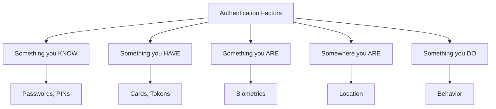
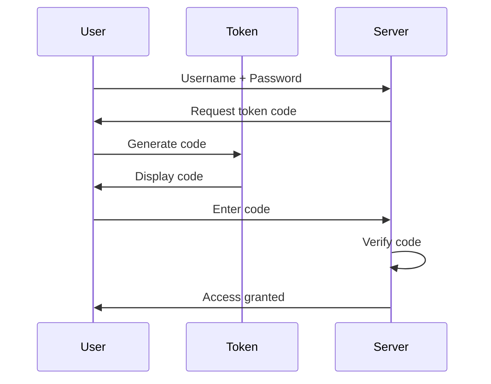
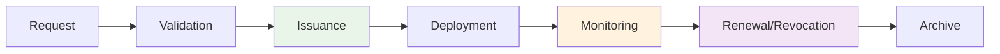
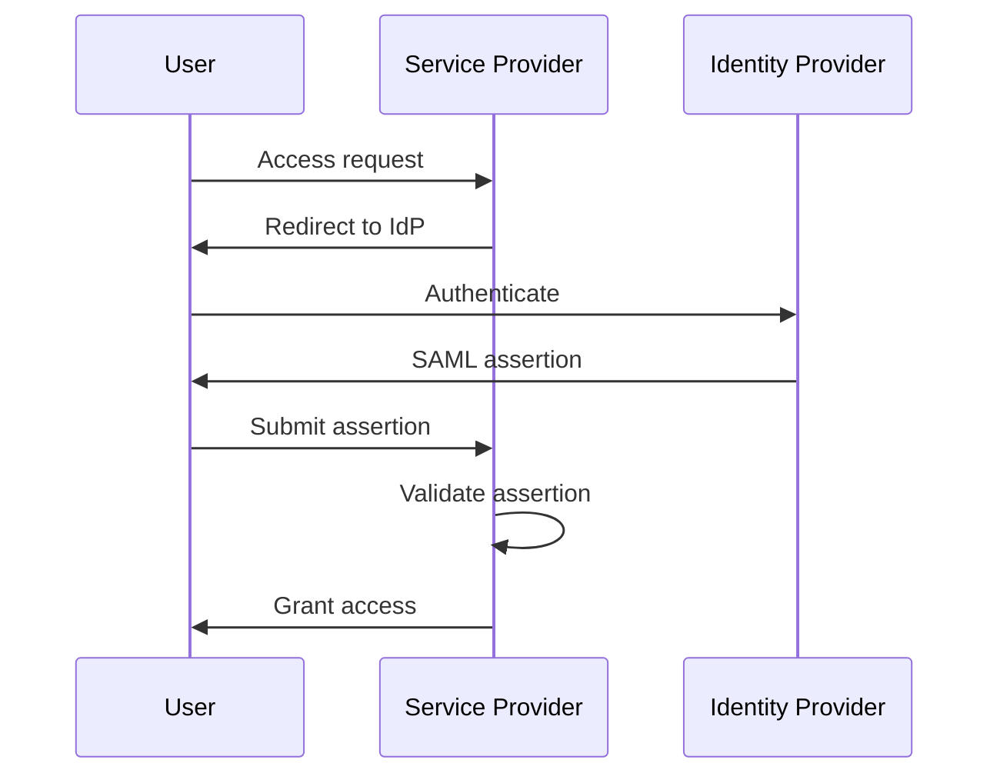

# Authentication Methods
## Unit II: Account & Data Security
### Lecture 9: Verifying Identity in Digital Systems

<div class="absolute bottom-5 left-5 text-xs text-gray-500">
Course: Cyber Security (4353204) | Semester V | Diploma ICT | Author: Milav Dabgar
</div>

---
layout: default
---

# What is Authentication?

<div class="grid grid-cols-2 gap-6">

<div>

## 🔐 Definition

**Authentication** is the process of verifying the identity of a user, device, or system to ensure they are who they claim to be before granting access to resources.

### 🎯 Authentication vs Authorization
- **Authentication** - "Who are you?"
- **Authorization** - "What can you do?"
- **Accounting** - "What did you do?"

### 📊 Authentication Factors


</div>

<div>

## 🔑 Types of Authentication

### 1️⃣ Single-Factor Authentication (SFA)
- **One authentication** factor only
- **Most common** - password only
- **Weakest security** level
- **Easy to implement**

### 2️⃣ Two-Factor Authentication (2FA)
- **Two different** authentication factors
- **Significantly stronger** than SFA
- **Common combinations:**
  - Password + SMS code
  - Password + hardware token
  - Password + biometric

### 🔢 Multi-Factor Authentication (MFA)
- **Three or more** authentication factors
- **Highest security** level
- **Complex implementation**
- **Enterprise environments**

</div>

</div>

<div class="absolute bottom-5 left-5 text-xs text-gray-500">
Course: Cyber Security (4353204) | Unit II | Lecture 9 | Author: Milav Dabgar
</div>

---
layout: default
---

# Password-Based Authentication

<div class="grid grid-cols-2 gap-6">

<div>

## 🔤 Password Security

### ✅ Strong Password Characteristics
- **Length:** 12+ characters minimum
- **Complexity:** Upper, lower, numbers, symbols
- **Uniqueness:** Different for each account
- **Unpredictability:** No personal information
- **Regular updates:** Change periodically

### 📊 Password Strength Examples
```
Weak:     password123        (11 chars)
Better:   P@ssw0rd2024!      (13 chars)
Strong:   Tr0ub4dor&3        (11 chars)
Stronger: correct-horse-battery-staple (28 chars)
```

### 🛡️ Password Storage Best Practices
```python
import bcrypt
import hashlib

# Secure password hashing with bcrypt
def hash_password(password):
    salt = bcrypt.gensalt(rounds=12)
    return bcrypt.hashpw(password.encode(), salt)

def verify_password(password, hashed):
    return bcrypt.checkpw(password.encode(), hashed)
```

</div>

<div>

## ⚠️ Password Vulnerabilities

### 🎭 Common Attack Methods
- **Brute force** - Try all combinations
- **Dictionary attacks** - Common passwords
- **Credential stuffing** - Reused passwords
- **Rainbow tables** - Pre-computed hashes
- **Social engineering** - Trick users
- **Keyloggers** - Capture keystrokes

### 📈 Password Attack Statistics
- **81% of breaches** involve weak/stolen passwords
- **Average user** has 100+ accounts
- **65% of users** reuse passwords
- **Top 25 passwords** account for 10% of all passwords

### 🔒 Password Protection Measures
- **Password managers** (LastPass, 1Password)
- **Regular updates** and rotation
- **Account lockout** policies
- **CAPTCHA** implementation
- **Monitoring** for breaches
- **User education** and training

</div>

</div>

<div class="absolute bottom-5 left-5 text-xs text-gray-500">
Course: Cyber Security (4353204) | Unit II | Lecture 9 | Author: Milav Dabgar
</div>

---
layout: default
---

# Biometric Authentication

<div class="grid grid-cols-2 gap-6">

<div>

## 👤 Biometric Types

### 🔍 Physiological Biometrics
- **Fingerprints** - Ridge patterns
- **Iris scanning** - Eye patterns
- **Retinal scanning** - Blood vessel patterns
- **Facial recognition** - Facial features
- **Hand geometry** - Hand measurements
- **DNA analysis** - Genetic markers

### 🎭 Behavioral Biometrics
- **Voice recognition** - Speech patterns
- **Signature dynamics** - Writing patterns
- **Keystroke dynamics** - Typing rhythm
- **Gait analysis** - Walking patterns
- **Mouse dynamics** - Movement patterns

### 📊 Biometric Accuracy Metrics
- **False Acceptance Rate (FAR)** - Wrong person accepted
- **False Rejection Rate (FRR)** - Right person rejected
- **Equal Error Rate (EER)** - FAR = FRR point
- **Failure to Enroll (FTE)** - Cannot capture template

</div>

<div>

## 🛡️ Biometric Implementation

### ✅ Advantages
- **Cannot be forgotten** or lost
- **Difficult to forge** or steal
- **Unique to individual**
- **Always available**
- **Non-transferable**

### ❌ Disadvantages
- **Privacy concerns** - permanent data
- **Expensive implementation**
- **False positives/negatives**
- **Cannot be changed** if compromised
- **Cultural/religious** objections
- **Physical changes** over time

### 🔧 Implementation Considerations
```python
# Biometric template storage (conceptual)
class BiometricTemplate:
    def __init__(self, user_id, biometric_type):
        self.user_id = user_id
        self.type = biometric_type
        self.template = self.extract_features()
        self.quality_score = self.assess_quality()
        
    def authenticate(self, live_sample):
        similarity = self.match(live_sample)
        return similarity > self.threshold
```

</div>

</div>

<div class="absolute bottom-5 left-5 text-xs text-gray-500">
Course: Cyber Security (4353204) | Unit II | Lecture 9 | Author: Milav Dabgar
</div>

---
layout: default
---

# Token-Based Authentication

<div class="grid grid-cols-2 gap-6">

<div>

## 🎫 Hardware Tokens

### 🔑 Types of Hardware Tokens
- **Hardware Security Keys** (YubiKey, Titan)
- **Smart Cards** with embedded chips
- **USB tokens** with cryptographic functions
- **RFID/NFC cards** for proximity access
- **Time-based tokens** (RSA SecurID)

### 📱 Software Tokens
- **Mobile authenticator** apps (Google, Microsoft)
- **SMS-based** codes (less secure)
- **Email-based** tokens
- **Push notifications** for approval

### 🔄 Token Authentication Process


</div>

<div>

## 🛡️ Token Security Features

### 🔒 TOTP (Time-Based One-Time Password)
```python
import hmac
import hashlib
import time
import base64

def generate_totp(secret, time_step=30):
    # Get current time step
    current_time = int(time.time() // time_step)
    
    # Convert to bytes
    time_bytes = current_time.to_bytes(8, 'big')
    
    # Generate HMAC
    secret_bytes = base64.b32decode(secret)
    digest = hmac.new(secret_bytes, time_bytes, hashlib.sha1).digest()
    
    # Extract 6-digit code
    offset = digest[-1] & 0x0f
    code = ((digest[offset] & 0x7f) << 24 |
            (digest[offset + 1] & 0xff) << 16 |
            (digest[offset + 2] & 0xff) << 8 |
            (digest[offset + 3] & 0xff))
    
    return f"{code % 1000000:06d}"
```

### 🎯 Token Advantages
- **Time-synchronized** or event-based
- **Offline generation** possible
- **Difficult to intercept**
- **No network dependency**
- **Standardized protocols** (OATH)

</div>

</div>

<div class="absolute bottom-5 left-5 text-xs text-gray-500">
Course: Cyber Security (4353204) | Unit II | Lecture 9 | Author: Milav Dabgar
</div>

---
layout: default
---

# Certificate-Based Authentication

<div class="grid grid-cols-2 gap-6">

<div>

## 📜 Digital Certificates

### 🔐 Public Key Infrastructure (PKI)
- **Certificate Authority** (CA) issues certificates
- **Registration Authority** (RA) verifies identities  
- **Certificate Repository** stores public certificates
- **Certificate Revocation** List (CRL) tracks invalid certs

### 📊 Certificate Structure (X.509)
```
Certificate:
  Version: 3
  Serial Number: 12345678
  Signature Algorithm: SHA-256 with RSA
  Issuer: CN=Example CA, O=Example Org
  Validity:
    Not Before: Jan 1, 2024
    Not After: Dec 31, 2025
  Subject: CN=John Doe, O=Example Corp
  Public Key: RSA 2048-bit
  Extensions:
    Key Usage: Digital Signature, Key Encipherment
    Subject Alt Name: john.doe@example.com
```

### 🔄 Certificate Authentication Process
1. **Client presents** certificate
2. **Server validates** certificate chain
3. **Server checks** CRL/OCSP status
4. **Client proves** private key ownership
5. **Authentication** successful

</div>

<div>

## 🛡️ Certificate Management

### 📋 Certificate Lifecycle


### 🔧 Implementation Example
```python
from cryptography import x509
from cryptography.hazmat.primitives import hashes

def validate_certificate(cert_data):
    try:
        # Parse certificate
        cert = x509.load_pem_x509_certificate(cert_data)
        
        # Check validity period
        now = datetime.utcnow()
        if now < cert.not_valid_before or now > cert.not_valid_after:
            return False, "Certificate expired"
        
        # Verify signature (simplified)
        # In practice, verify against CA certificate
        return True, "Certificate valid"
        
    except Exception as e:
        return False, f"Certificate invalid: {e}"
```

### 🎯 Certificate Advantages
- **Strong cryptographic** foundation
- **Non-repudiation** support
- **Scalable** for large organizations
- **Standards-based** (X.509, PKCS)
- **Revocation** mechanisms available

</div>

</div>

<div class="absolute bottom-5 left-5 text-xs text-gray-500">
Course: Cyber Security (4353204) | Unit II | Lecture 9 | Author: Milav Dabgar
</div>

---
layout: default
---

# Single Sign-On (SSO) Systems

<div class="grid grid-cols-2 gap-6">

<div>

## 🔑 SSO Overview

### 🎯 What is SSO?
**Single Sign-On** allows users to authenticate once and gain access to multiple systems without re-entering credentials.

### ✅ SSO Benefits
- **User convenience** - One login for all systems
- **Reduced password** fatigue
- **Centralized** user management
- **Improved security** - Fewer passwords to manage
- **Cost reduction** - Lower help desk calls

### 📊 SSO Protocols
- **SAML** (Security Assertion Markup Language)
- **OAuth 2.0** - Authorization framework
- **OpenID Connect** - Identity layer on OAuth 2.0
- **Kerberos** - Network authentication protocol
- **LDAP/Active Directory** integration

</div>

<div>

## 🔄 SAML Authentication Flow



### 🛡️ SSO Security Considerations
- **Single point of failure** - IdP compromise affects all systems
- **Session management** complexity
- **Token security** and lifetime
- **Cross-domain** security policies
- **Logout synchronization** challenges

### 🔧 SSO Implementation
```xml
<!-- SAML Assertion Example -->
<saml:Assertion xmlns:saml="urn:oasis:names:tc:SAML:2.0:assertion">
  <saml:Issuer>https://idp.example.com</saml:Issuer>
  <saml:Subject>
    <saml:NameID>john.doe@example.com</saml:NameID>
  </saml:Subject>
  <saml:AuthnStatement>
    <saml:AuthnContext>
      <saml:AuthnContextClassRef>
        urn:oasis:names:tc:SAML:2.0:ac:classes:Password
      </saml:AuthnContextClassRef>
    </saml:AuthnContext>
  </saml:AuthnStatement>
</saml:Assertion>
```

</div>

</div>

<div class="absolute bottom-5 left-5 text-xs text-gray-500">
Course: Cyber Security (4353204) | Unit II | Lecture 9 | Author: Milav Dabgar
</div>

---
layout: default
---

# Modern Authentication Trends

<div class="grid grid-cols-2 gap-6">

<div>

## 🚀 Emerging Technologies

### 🔐 Passwordless Authentication
- **FIDO2/WebAuthn** standards
- **Windows Hello** biometric login
- **Apple Touch/Face ID** integration
- **Hardware security** keys only
- **Magic links** via email

### 🤖 Adaptive Authentication
- **Risk-based** authentication
- **Behavioral analysis** 
- **Device fingerprinting**
- **Geolocation** factors
- **Machine learning** algorithms

### ☁️ Cloud Authentication
- **Azure Active Directory**
- **AWS Identity Center**
- **Google Cloud Identity**
- **Identity as a Service** (IDaaS)
- **Zero Trust** architecture

</div>

<div>

## 📱 Mobile Authentication

### 📲 Mobile-Specific Methods
- **Push notifications** for approval
- **QR code** authentication
- **Mobile biometrics** (fingerprint, face)
- **SIM-based** authentication
- **App-to-app** authentication

### 🔒 Mobile Security Challenges
- **Device theft/loss**
- **Malware** on devices
- **Network** interception
- **App** vulnerabilities
- **Jailbreaking/rooting** risks

### 🛡️ Best Practices
```yaml
Mobile Auth Security:
  - Device encryption mandatory
  - App certificate pinning
  - Root/jailbreak detection
  - Secure element usage
  - Regular security updates
  - Remote wipe capability
```

</div>

</div>

<div class="absolute bottom-5 left-5 text-xs text-gray-500">
Course: Cyber Security (4353204) | Unit II | Lecture 9 | Author: Milav Dabgar
</div>

---
layout: default
---

# Practical Exercise: Authentication Design

<div class="exercise-container">

## 🎯 Group Activity (20 minutes)

### Scenario: Enterprise Authentication System

Your company needs to design an authentication system for:
- **5,000 employees** across multiple locations
- **Mix of office workers** and remote workers
- **Various devices:** Windows, Mac, mobile phones, tablets
- **Multiple applications:** Email, CRM, HR system, file servers
- **Compliance requirements:** SOX, HIPAA
- **Budget constraints:** $50 per user annually

### Task: Design Comprehensive Authentication Solution

**Address these requirements:**

1. **Authentication Methods:**
   - What authentication factors would you implement?
   - How would you handle different user types?
   - What about temporary/contractor access?

2. **Technology Selection:**
   - Which authentication protocols would you use?
   - How would you implement SSO?
   - What about mobile device authentication?

3. **Security Policies:**
   - Password policy requirements
   - Multi-factor authentication rules
   - Session management policies
   - Account lockout procedures

4. **Implementation Plan:**
   - Phased rollout strategy
   - User training approach
   - Help desk preparation
   - Monitoring and maintenance

**Deliverables:**
- Authentication architecture diagram
- Technology selection justification
- Security policy framework
- Implementation timeline and costs

</div>

<style>
.exercise-container {
  @apply bg-cyan-50 border-2 border-cyan-300 rounded-lg p-6;
}
</style>

<div class="absolute bottom-5 left-5 text-xs text-gray-500">
Course: Cyber Security (4353204) | Unit II | Lecture 9 | Author: Milav Dabgar
</div>

---
layout: center
class: text-center
---

# Questions & Discussion

## 🤔 Discussion Points:
- Which authentication method provides the best balance of security and usability?
- How do you handle authentication for different user risk levels?
- What are the challenges of implementing passwordless authentication?

### 💡 Exercise Review
Share your enterprise authentication system designs

<div class="absolute bottom-5 left-5 text-xs text-gray-500">
Course: Cyber Security (4353204) | Unit II | Lecture 9 | Author: Milav Dabgar
</div>

---
layout: center
class: text-center
---

# Thank You!

## Next Lecture: Authorization and Access Control
### Determining What Users Can Do

<div class="pt-8 text-gray-500">
  <p>Cyber Security (4353204) - Lecture 9 Complete</p>
  <p>Authentication: Proving you are who you say you are! 🔐👤</p>
</div>

<div class="absolute bottom-5 left-5 text-xs text-gray-500">
Course: Cyber Security (4353204) | Unit II | Lecture 9 | Author: Milav Dabgar
</div>