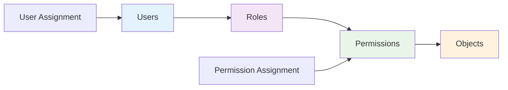
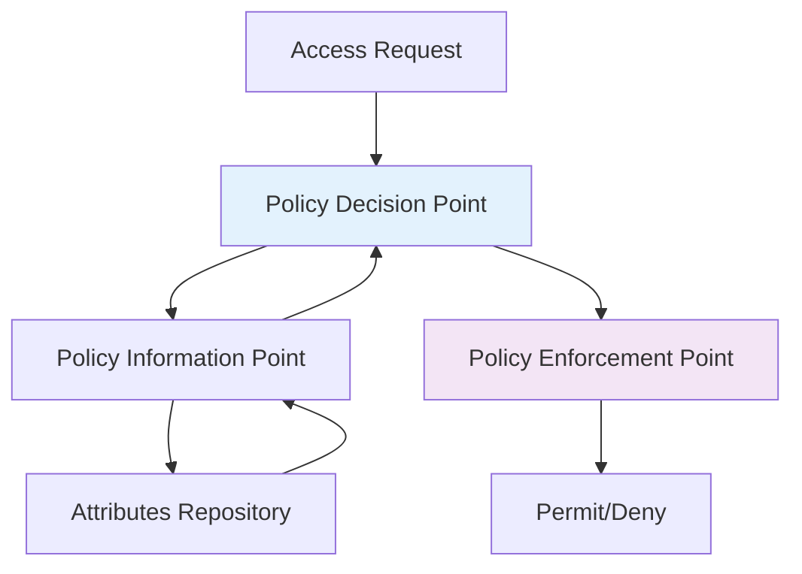
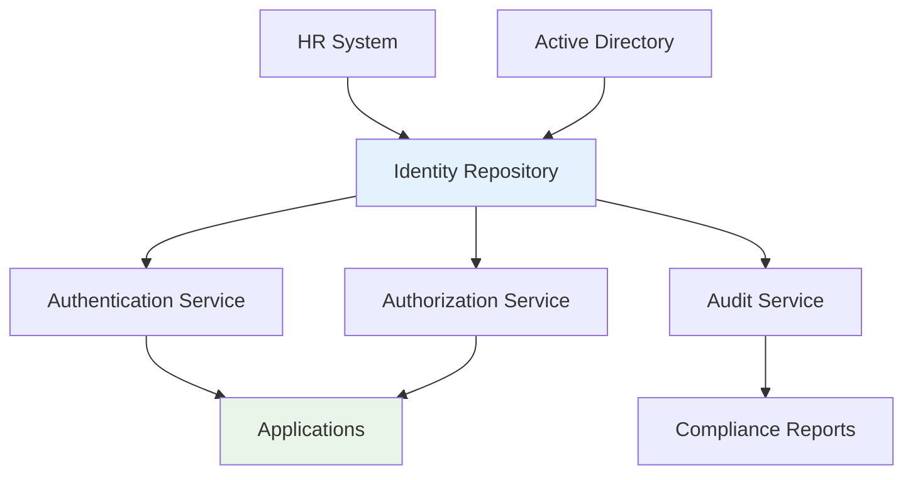
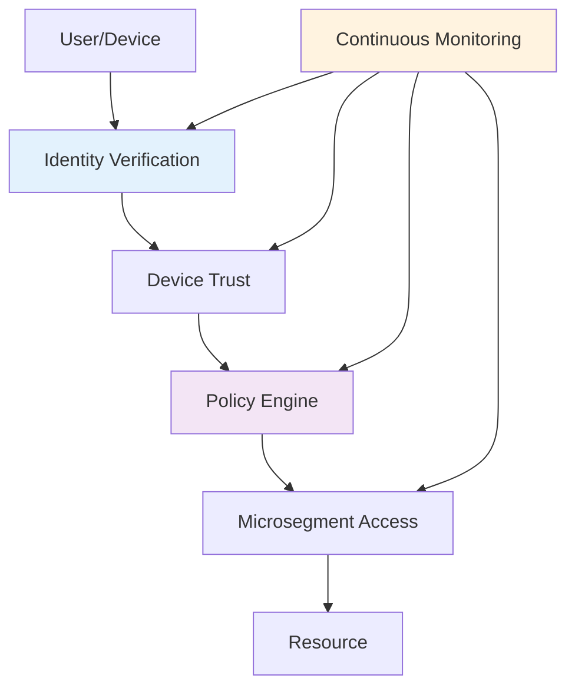

# Authorization and Access Control
## Unit II: Account & Data Security
### Lecture 10: Controlling What Users Can Access

<div class="absolute bottom-5 left-5 text-xs text-gray-500">
Course: Cyber Security (4353204) | Semester V | Diploma ICT | Author: Milav Dabgar
</div>

---
layout: default
---

# Access Control Models

<div class="grid grid-cols-2 gap-6">

<div>

## 🔐 Discretionary Access Control (DAC)

### 🎯 Characteristics
- **Owner controls** access permissions
- **Flexible** permission assignment
- **Identity-based** access decisions
- **Common in** operating systems (Windows, Linux)

### 📊 DAC Implementation
```bash
# Linux file permissions example
-rwxr--r-- 1 owner group 1024 file.txt
# Owner: read, write, execute
# Group: read only
# Others: read only

chmod 755 file.txt  # rwxr-xr-x
chmod 644 file.txt  # rw-r--r--
```

### ✅ Advantages
- **Easy to understand** and implement
- **User-friendly** for resource owners
- **Flexible** permission management

### ❌ Disadvantages
- **Information flow** not controlled
- **Vulnerable to** Trojan horse attacks
- **Difficult to manage** at scale

</div>

<div>

## 🏛️ Mandatory Access Control (MAC)

### 🎯 Characteristics
- **System enforces** access policy
- **Labels/classifications** required
- **Non-discretionary** - users cannot change
- **High security** environments

### 🔒 Security Labels
```
Classification Levels:
- Top Secret    (Level 4)
- Secret        (Level 3) 
- Confidential  (Level 2)
- Unclassified  (Level 1)

Categories:
- Nuclear
- Intelligence
- Military
```

### 🛡️ Bell-LaPadula Model
- **No read up** - cannot read higher classification
- **No write down** - cannot write to lower classification
- **Preserves confidentiality**

### 🏥 Biba Integrity Model  
- **No read down** - cannot read lower integrity
- **No write up** - cannot write to higher integrity
- **Preserves integrity**

</div>

</div>

<div class="absolute bottom-5 left-5 text-xs text-gray-500">
Course: Cyber Security (4353204) | Unit II | Lecture 10 | Author: Milav Dabgar
</div>

---
layout: default
---

# Role-Based Access Control (RBAC)

<div class="grid grid-cols-2 gap-6">

<div>

## 👥 RBAC Overview

### 🎯 Core Components
- **Users** - Individual people or entities
- **Roles** - Job functions or positions  
- **Permissions** - System operations
- **Sessions** - User-role activations

### 🔄 RBAC Relationships


### 📋 RBAC Principles
- **Least privilege** - Minimum necessary access
- **Role hierarchy** - Inheritance of permissions
- **Separation of duties** - Conflicting roles separated
- **Role cardinality** - Limits on role assignments

</div>

<div>

## 🏢 RBAC Implementation

### 💼 Example Role Structure
```yaml
Organization Roles:
  CEO:
    - All system access
    - Financial reports
    - Strategic planning
    
  HR Manager:
    - Employee records
    - Payroll system
    - Recruitment tools
    
  Developer:
    - Code repositories
    - Development tools
    - Testing environments
    
  Accountant:
    - Financial systems
    - Invoice processing
    - Audit reports
```

### 🔧 RBAC Database Schema
```sql
CREATE TABLE Users (
    user_id INT PRIMARY KEY,
    username VARCHAR(50),
    email VARCHAR(100)
);

CREATE TABLE Roles (
    role_id INT PRIMARY KEY,
    role_name VARCHAR(50),
    description TEXT
);

CREATE TABLE User_Roles (
    user_id INT,
    role_id INT,
    assigned_date DATE,
    FOREIGN KEY (user_id) REFERENCES Users(user_id),
    FOREIGN KEY (role_id) REFERENCES Roles(role_id)
);

CREATE TABLE Permissions (
    permission_id INT PRIMARY KEY,
    resource VARCHAR(50),
    operation VARCHAR(20)
);
```

</div>

</div>

<div class="absolute bottom-5 left-5 text-xs text-gray-500">
Course: Cyber Security (4353204) | Unit II | Lecture 10 | Author: Milav Dabgar
</div>

---
layout: default
---

# Attribute-Based Access Control (ABAC)

<div class="grid grid-cols-2 gap-6">

<div>

## 🏷️ ABAC Concepts

### 🎯 Key Components
- **Subject attributes** - User properties
- **Resource attributes** - Object properties
- **Environment attributes** - Context factors
- **Action attributes** - Operation properties

### 📊 ABAC Example
```yaml
Access Policy:
  Rule: "Financial Reports Access"
  
  Subject Attributes:
    - Department: Finance
    - Clearance Level: >= Confidential
    - Employment Status: Active
    
  Resource Attributes:
    - Document Type: Financial Report
    - Classification: Confidential
    - Owner Department: Finance
    
  Environment Attributes:
    - Time: Business Hours (8AM-6PM)
    - Location: Corporate Network
    - Day: Monday-Friday
    
  Action: Read, Download
```

</div>

<div>

## 🔧 ABAC Implementation

### 🛡️ Policy Decision Process


### 💻 XACML Policy Example
```xml
<Policy>
  <Rule RuleId="FinanceAccess" Effect="Permit">
    <Target>
      <Subjects>
        <Subject>
          <SubjectMatch MatchId="string-equal">
            <AttributeValue DataType="string">Finance</AttributeValue>
            <SubjectAttributeDesignator 
              AttributeId="Department"/>
          </SubjectMatch>
        </Subject>
      </Subjects>
    </Target>
    <Condition>
      <Apply FunctionId="time-in-range">
        <AttributeValue DataType="time">08:00:00</AttributeValue>
        <AttributeValue DataType="time">18:00:00</AttributeValue>
      </Apply>
    </Condition>
  </Rule>
</Policy>
```

### ✅ ABAC Advantages
- **Fine-grained** control
- **Dynamic** decision making
- **Context-aware** policies
- **Scalable** for complex environments

</div>

</div>

<div class="absolute bottom-5 left-5 text-xs text-gray-500">
Course: Cyber Security (4353204) | Unit II | Lecture 10 | Author: Milav Dabgar
</div>

---
layout: default
---

# Access Control Lists and Capabilities

<div class="grid grid-cols-2 gap-6">

<div>

## 📋 Access Control Lists (ACL)

### 🎯 ACL Structure
**Subject-centered** approach listing permissions per object

```
File: /documents/budget.xlsx
ACL:
  john.doe:     read, write
  jane.smith:   read
  finance-group: read, write
  everyone:     (no access)
```

### 💻 Windows ACL Example
```powershell
# View file ACL
Get-Acl C:\Documents\Budget.xlsx

# Set ACL entry
$acl = Get-Acl C:\Documents\Budget.xlsx
$permission = "Domain\User","FullControl","Allow"
$rule = New-Object System.Security.AccessControl.FileSystemAccessRule $permission
$acl.SetAccessRule($rule)
Set-Acl C:\Documents\Budget.xlsx $acl
```

### ✅ ACL Advantages
- **Simple** to understand
- **Direct** object protection
- **Flexible** permission assignment

### ❌ ACL Disadvantages
- **Large storage** requirements
- **Difficult** to revoke user access
- **Hard to audit** user permissions

</div>

<div>

## 🎫 Capability-Based Systems

### 🎯 Capability Structure
**Object-centered** approach with unforgeable tokens

```
User john.doe holds capabilities:
  Cap1: /documents/budget.xlsx [read, write]
  Cap2: /database/customers [read]
  Cap3: /printer/hp-laser [print]
```

### 🔐 Capability Properties
- **Unforgeable** tokens
- **Transferable** between users
- **Revocable** by issuer
- **Time-limited** validity

### 💡 Capability Implementation
```python
class Capability:
    def __init__(self, resource, permissions, expiry=None):
        self.resource = resource
        self.permissions = permissions
        self.expiry = expiry
        self.signature = self._generate_signature()
    
    def _generate_signature(self):
        # Digital signature to prevent forgery
        data = f"{self.resource}:{self.permissions}:{self.expiry}"
        return sign_with_server_key(data)
    
    def is_valid(self):
        return (self.expiry is None or 
                datetime.now() < self.expiry) and \
               self._verify_signature()
```

### ✅ Capability Advantages
- **Distributed** systems friendly
- **Easy** access revocation
- **Support** for delegation

</div>

</div>

<div class="absolute bottom-5 left-5 text-xs text-gray-500">
Course: Cyber Security (4353204) | Unit II | Lecture 10 | Author: Milav Dabgar
</div>

---
layout: default
---

# Identity and Access Management (IAM)

<div class="grid grid-cols-2 gap-6">

<div>

## 🏛️ IAM Components

### 🎯 Core Functions
- **Identity governance** - User lifecycle management
- **Authentication** - Identity verification
- **Authorization** - Access control
- **Auditing** - Activity monitoring

### 📊 IAM Architecture


### 🔄 User Lifecycle
1. **Provisioning** - Account creation
2. **Authentication** - Identity verification
3. **Authorization** - Access granting
4. **Monitoring** - Activity tracking
5. **Maintenance** - Updates and changes
6. **Deprovisioning** - Account removal

</div>

<div>

## ☁️ Cloud IAM Services

### 🔧 AWS IAM Structure
```json
{
  "Version": "2012-10-17",
  "Statement": [
    {
      "Effect": "Allow",
      "Action": [
        "s3:GetObject",
        "s3:PutObject"
      ],
      "Resource": "arn:aws:s3:::mybucket/*",
      "Condition": {
        "IpAddress": {
          "aws:SourceIp": "203.0.113.0/24"
        }
      }
    }
  ]
}
```

### 🏢 Azure Active Directory
```powershell
# Create user
New-AzureADUser -DisplayName "John Doe" -UserPrincipalName "john@company.com"

# Assign role
Add-AzureADDirectoryRoleMember -ObjectId $roleId -RefObjectId $userId

# Create conditional access policy
New-AzureADMSConditionalAccessPolicy -DisplayName "Require MFA"
```

### 🎯 IAM Best Practices
- **Principle of least privilege**
- **Regular access reviews**
- **Automated provisioning/deprovisioning**
- **Multi-factor authentication**
- **Segregation of duties**

</div>

</div>

<div class="absolute bottom-5 left-5 text-xs text-gray-500">
Course: Cyber Security (4353204) | Unit II | Lecture 10 | Author: Milav Dabgar
</div>

---
layout: default
---

# Zero Trust Access Model

<div class="grid grid-cols-2 gap-6">

<div>

## 🚫 Zero Trust Principles

### 🎯 Core Tenets
- **Never trust, always verify**
- **Assume breach** mentality
- **Least privilege** access
- **Microsegmentation**
- **Continuous monitoring**

### 📊 Zero Trust Architecture


### 🛡️ Zero Trust Components
- **Identity and access** management
- **Device security** and compliance
- **Network segmentation**
- **Data protection**
- **Application security**

</div>

<div>

## 🔧 Zero Trust Implementation

### 📋 Implementation Steps
1. **Inventory assets** and data flows
2. **Map transaction** flows
3. **Design Zero Trust** architecture
4. **Create policies**
5. **Monitor and maintain**

### 💻 Policy Example
```yaml
Zero Trust Policy:
  User: john.doe@company.com
  Device: Corporate laptop (trusted)
  Location: Corporate office
  Time: Business hours
  
  Conditions:
    - Device encryption: Required
    - OS patches: Current
    - Antivirus: Active
    - VPN: Not required (office)
    
  Access Granted:
    - Email system: Full access
    - CRM: Department data only  
    - Financial system: Read-only
    - Admin tools: Denied
```

### ✅ Zero Trust Benefits
- **Reduced attack** surface
- **Better visibility**
- **Improved compliance**
- **Enhanced security** posture
- **Cloud-ready** architecture

</div>

</div>

<div class="absolute bottom-5 left-5 text-xs text-gray-500">
Course: Cyber Security (4353204) | Unit II | Lecture 10 | Author: Milav Dabgar
</div>

---
layout: default
---

# Practical Exercise: Access Control Design

<div class="exercise-container">

## 🎯 Group Activity (25 minutes)

### Scenario: Healthcare Organization Access Control

Design access control for a hospital system with:
- **Medical staff:** Doctors, nurses, specialists
- **Administrative staff:** Reception, billing, HR
- **IT staff:** System administrators, help desk
- **Patients:** Online portal access
- **External partners:** Insurance companies, labs
- **Systems:** Electronic health records, billing, pharmacy, lab results

### Task: Complete Access Control Solution

**Requirements to Address:**

1. **Access Control Model Selection:**
   - Which model(s) would you use and why?
   - How would you handle HIPAA compliance?
   - What about emergency access scenarios?

2. **Role Design:**
   - Define roles for each user type
   - Create role hierarchy if needed
   - Handle conflicting duties (e.g., prescribing vs. dispensing)

3. **Policy Framework:**
   - Time-based access restrictions
   - Location-based access controls
   - Device requirements
   - Data classification levels

4. **Implementation Strategy:**
   - Technology selection (RBAC, ABAC, etc.)
   - Integration with existing systems
   - Audit and monitoring approach
   - User training and support

**Deliverables:**
- Access control architecture diagram
- Role and permission matrix
- Policy document outline
- Implementation and monitoring plan

</div>

<style>
.exercise-container {
  @apply bg-emerald-50 border-2 border-emerald-300 rounded-lg p-6;
}
</style>

<div class="absolute bottom-5 left-5 text-xs text-gray-500">
Course: Cyber Security (4353204) | Unit II | Lecture 10 | Author: Milav Dabgar
</div>

---
layout: center
class: text-center
---

# Questions & Discussion

## 🤔 Discussion Points:
- Which access control model works best for your organization type?
- How do you balance security with usability in access control?
- What are the challenges of implementing Zero Trust?

### 💡 Exercise Review
Share your healthcare access control system designs

<div class="absolute bottom-5 left-5 text-xs text-gray-500">
Course: Cyber Security (4353204) | Unit II | Lecture 10 | Author: Milav Dabgar
</div>

---
layout: center
class: text-center
---

# Thank You!

## Next Lecture: Single Sign-On Systems
### Seamless Access Across Applications

<div class="pt-8 text-gray-500">
  <p>Cyber Security (4353204) - Lecture 10 Complete</p>
  <p>Authorization: Controlling access to protect resources! 🔐🚪</p>
</div>

<div class="absolute bottom-5 left-5 text-xs text-gray-500">
Course: Cyber Security (4353204) | Unit II | Lecture 10 | Author: Milav Dabgar
</div>