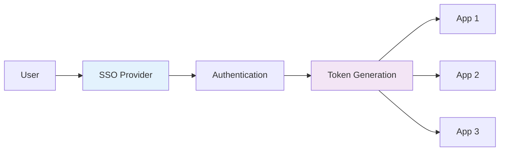
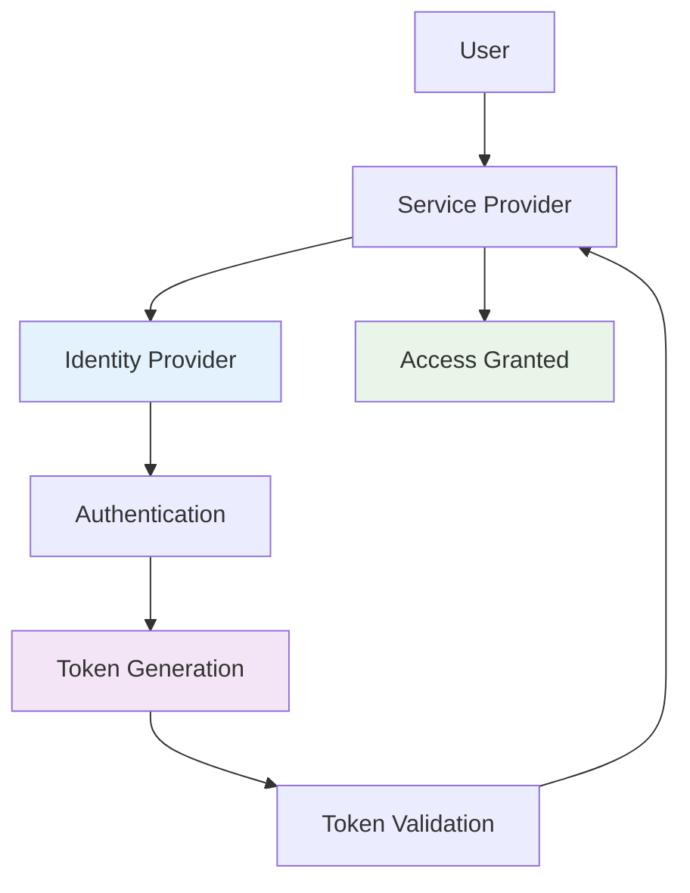
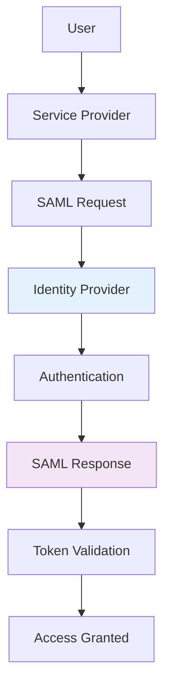
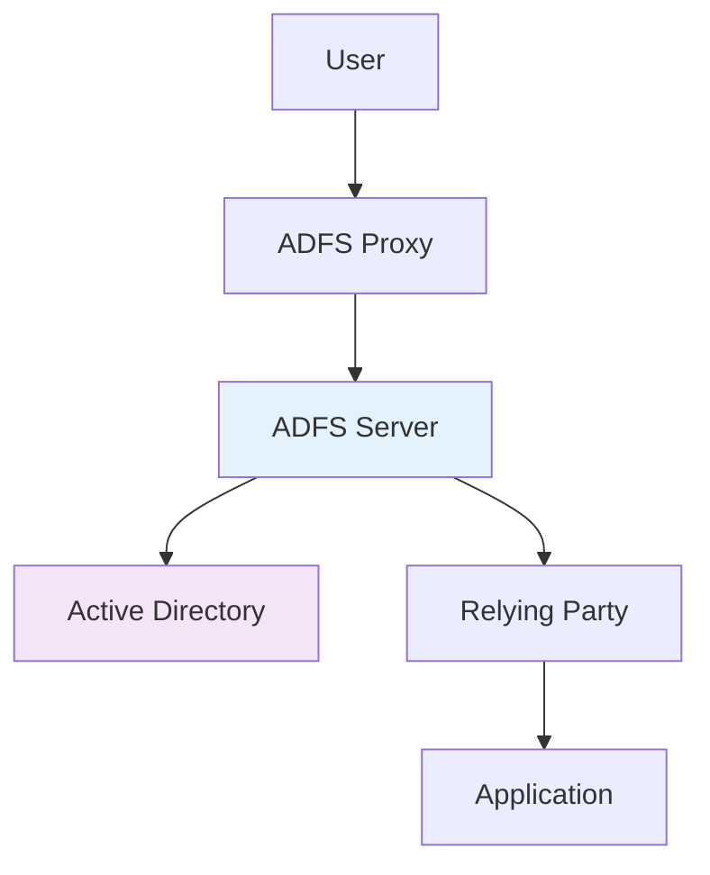

# Single Sign-On (SSO) Systems
## Unit II: Account & Data Security
### Lecture 11: Seamless Authentication Across Applications

<div class="absolute bottom-5 left-5 text-xs text-gray-500">
Course: Cyber Security (4353204) | Semester V | Diploma ICT | Author: Milav Dabgar
</div>

---
layout: default
---

# What is Single Sign-On (SSO)?

<div class="grid grid-cols-2 gap-6">

<div>

## 🔐 SSO Definition

**Single Sign-On (SSO)** is an authentication process that allows users to access multiple applications with one set of login credentials.

### 🎯 Key Characteristics
- **One authentication** for multiple services
- **Centralized identity** management
- **Seamless user experience**
- **Reduced password fatigue**
- **Enhanced security** through centralization

### 📊 SSO Workflow


</div>

<div>

## ✅ Benefits of SSO

### 👤 User Benefits
- **Single password** to remember
- **Faster access** to applications
- **Reduced login friction**
- **Better user experience**
- **Less password-related** help desk calls

### 🏢 Organization Benefits
- **Centralized access** control
- **Enhanced security** monitoring
- **Reduced IT overhead**
- **Improved compliance**
- **Better audit capabilities**

### 📈 Security Advantages
- **Stronger password** policies
- **Multi-factor authentication** integration
- **Centralized logout**
- **Session management**
- **Reduced credential exposure**

</div>

</div>

<div class="absolute bottom-5 left-5 text-xs text-gray-500">
Course: Cyber Security (4353204) | Unit II | Lecture 11 | Author: Milav Dabgar
</div>

---
layout: default
---

# SSO Architecture and Components

<div class="grid grid-cols-2 gap-6">

<div>

## 🏗️ SSO Architecture

### 🔧 Core Components
- **Identity Provider (IdP)** - Authentication service
- **Service Provider (SP)** - Applications/services
- **User Agent** - Browser or client application
- **Security Token** - Authentication proof

### 📊 SSO Flow Diagram


### 🎯 SSO Participants
- **Principal** - User seeking access
- **Identity Provider** - Authenticates users
- **Service Provider** - Provides services
- **Token** - Proof of authentication

</div>

<div>

## 🔄 SSO Process Flow

### 📋 Step-by-Step Process
1. **User requests** access to application
2. **Application redirects** to SSO provider
3. **User authenticates** with SSO provider
4. **SSO provider generates** security token
5. **Token sent** back to application
6. **Application validates** token
7. **Access granted** to user

### 🎫 Token Types
```yaml
Security Tokens:
  SAML Token:
    - XML-based
    - Enterprise focused
    - Rich attribute support
    
  OAuth Token:
    - JSON-based
    - Web/mobile friendly
    - Limited scope
    
  JWT Token:
    - Self-contained
    - Stateless
    - Compact format
```

### ⏱️ Session Management
- **Session establishment**
- **Session tracking**
- **Session timeout**
- **Global logout**

</div>

</div>

<div class="absolute bottom-5 left-5 text-xs text-gray-500">
Course: Cyber Security (4353204) | Unit II | Lecture 11 | Author: Milav Dabgar
</div>

---
layout: default
---

# SAML-Based SSO

<div class="grid grid-cols-2 gap-6">

<div>

## 🌐 SAML Overview

### 🎯 SAML Characteristics
- **XML-based** standard
- **Enterprise-grade** SSO solution
- **Cross-domain** authentication
- **Rich metadata** support
- **Strong security** features

### 📊 SAML Components
- **Assertions** - Authentication statements
- **Protocols** - Request/response messages
- **Bindings** - Transport mechanisms
- **Profiles** - Use case specifications

### 🔧 SAML Assertion Structure
```xml
<saml:Assertion>
  <saml:Subject>
    <saml:NameID>user@company.com</saml:NameID>
  </saml:Subject>
  <saml:AuthnStatement>
    <saml:AuthnContext>
      <saml:AuthnContextClassRef>
        urn:oasis:names:tc:SAML:2.0:ac:classes:Password
      </saml:AuthnContextClassRef>
    </saml:AuthnContext>
  </saml:AuthnStatement>
  <saml:AttributeStatement>
    <saml:Attribute Name="Department">
      <saml:AttributeValue>Engineering</saml:AttributeValue>
    </saml:Attribute>
  </saml:AttributeStatement>
</saml:Assertion>
```

</div>

<div>

## 🔄 SAML SSO Flow

### 📋 SP-Initiated Flow


### 🚀 IdP-Initiated Flow
1. **User logs** into IdP portal
2. **User selects** target application
3. **IdP generates** SAML assertion
4. **Assertion posted** to service provider
5. **SP validates** assertion
6. **Access granted** to user

### 🛡️ SAML Security Features
- **Digital signatures** for integrity
- **Encryption** for confidentiality
- **Time stamps** for replay protection
- **Audience restrictions**
- **Certificate-based** trust

### 💻 SAML Configuration Example
```yaml
SAML Configuration:
  Entity ID: https://company.com/sso
  SSO URL: https://idp.company.com/sso
  Certificate: -----BEGIN CERTIFICATE-----
  Attribute Mapping:
    - Email: http://schemas.xmlsoap.org/ws/2005/05/identity/claims/emailaddress
    - Name: http://schemas.xmlsoap.org/ws/2005/05/identity/claims/name
    - Role: http://schemas.microsoft.com/ws/2008/06/identity/claims/role
```

</div>

</div>

<div class="absolute bottom-5 left-5 text-xs text-gray-500">
Course: Cyber Security (4353204) | Unit II | Lecture 11 | Author: Milav Dabgar
</div>

---
layout: default
---

# OAuth and OpenID Connect

<div class="grid grid-cols-2 gap-6">

<div>

## 🔐 OAuth 2.0 Framework

### 🎯 OAuth Purpose
- **Authorization framework** (not authentication)
- **Third-party access** delegation
- **API access** control
- **Token-based** authorization

### 🎭 OAuth Roles
- **Resource Owner** - User who owns data
- **Client** - Application requesting access
- **Authorization Server** - Issues tokens
- **Resource Server** - Hosts protected resources

### 🔄 OAuth Flow Types
```yaml
Grant Types:
  Authorization Code:
    - Most secure
    - For web applications
    - Requires client secret
    
  Implicit:
    - For public clients
    - Browser-based apps
    - No client secret
    
  Client Credentials:
    - Service-to-service
    - No user involvement
    - Backend applications
    
  Resource Owner Password:
    - Legacy applications
    - Direct username/password
    - Not recommended
```

</div>

<div>

## 🆔 OpenID Connect (OIDC)

### 🎯 OIDC Features
- **Built on OAuth 2.0**
- **Authentication layer** added
- **ID tokens** for identity
- **Standardized user** info
- **JWT-based** tokens

### 🎫 OIDC Tokens
```json
// ID Token (JWT)
{
  "header": {
    "alg": "RS256",
    "typ": "JWT"
  },
  "payload": {
    "iss": "https://accounts.company.com",
    "sub": "1234567890",
    "aud": "client_id_123",
    "exp": 1234567890,
    "iat": 1234567890,
    "email": "user@company.com",
    "name": "John Doe"
  }
}
```

### 🔧 OIDC Endpoints
- **Authorization Endpoint** - User consent
- **Token Endpoint** - Token exchange
- **UserInfo Endpoint** - User profile data
- **JWKS Endpoint** - Key verification

### 💻 OIDC Configuration
```json
{
  "client_id": "your-client-id",
  "client_secret": "your-client-secret",
  "issuer": "https://accounts.company.com",
  "authorization_endpoint": "https://accounts.company.com/auth",
  "token_endpoint": "https://accounts.company.com/token",
  "userinfo_endpoint": "https://accounts.company.com/userinfo"
}
```

</div>

</div>

<div class="absolute bottom-5 left-5 text-xs text-gray-500">
Course: Cyber Security (4353204) | Unit II | Lecture 11 | Author: Milav Dabgar
</div>

---
layout: default
---

# Enterprise SSO Solutions

<div class="grid grid-cols-2 gap-6">

<div>

## 🏢 Active Directory Federation Services (ADFS)

### 🎯 ADFS Overview
- **Microsoft's SSO** solution
- **Active Directory** integration
- **Claims-based** authentication
- **On-premises** or hybrid deployment

### 🔧 ADFS Components
- **Federation Service** - Core authentication
- **Federation Proxy** - External access
- **Claims Provider** - Identity source
- **Relying Party** - Target application

### 💻 ADFS Configuration
```powershell
# Add relying party trust
Add-ADFSRelyingPartyTrust `
  -Name "Company App" `
  -MetadataUrl "https://app.company.com/metadata" `
  -IssuanceTransformRules @'
    c:[Type == "http://schemas.microsoft.com/ws/2008/06/identity/claims/windowsaccountname"]
    => issue(Type = "http://schemas.xmlsoap.org/ws/2005/05/identity/claims/name", Value = c.Value);
'@
```

### 📊 ADFS Architecture


</div>

<div>

## ☁️ Cloud SSO Providers

### 🔧 Azure Active Directory
```yaml
Azure AD Features:
  - Conditional Access
  - Multi-Factor Authentication
  - Device Compliance
  - Risk-Based Authentication
  - Application Gallery (5000+ apps)
```

### 🌟 Okta Platform
```yaml
Okta Capabilities:
  - Universal Directory
  - Adaptive MFA
  - Lifecycle Management
  - API Access Management
  - Advanced Server Access
```

### 🔑 Google Workspace SSO
```yaml
Google Identity:
  - G Suite Integration
  - Cloud Identity
  - Context Aware Access
  - Security Keys
  - Mobile Device Management
```

### 💡 Ping Identity
```yaml
PingIdentity Features:
  - PingOne Cloud Platform
  - PingFederate
  - PingAccess
  - PingDirectory
  - API Intelligence
```

### 📋 Comparison Matrix
| Feature | Azure AD | Okta | Google | Ping |
|---------|----------|------|---------|------|
| Apps | 5000+ | 7000+ | 1000+ | 3000+ |
| MFA | ✅ | ✅ | ✅ | ✅ |
| Risk | ✅ | ✅ | ✅ | ✅ |
| API | ✅ | ✅ | ✅ | ✅ |

</div>

</div>

<div class="absolute bottom-5 left-5 text-xs text-gray-500">
Course: Cyber Security (4353204) | Unit II | Lecture 11 | Author: Milav Dabgar
</div>

---
layout: default
---

# SSO Security Considerations

<div class="grid grid-cols-2 gap-6">

<div>

## 🛡️ Security Benefits

### ✅ Enhanced Security
- **Stronger password** policies
- **Centralized MFA** implementation
- **Better audit** trails
- **Consistent security** policies
- **Reduced attack** surface

### 🔒 Risk Mitigation
- **Password reuse** elimination
- **Credential theft** reduction
- **Phishing attack** protection
- **Insider threat** monitoring
- **Compliance** improvements

### 📊 Security Monitoring
```yaml
SSO Security Metrics:
  - Failed authentication attempts
  - Unusual login patterns
  - Device compliance status
  - Geographic access patterns
  - Application usage patterns
```

</div>

<div>

## ⚠️ Security Risks

### 🎯 Single Point of Failure
- **SSO provider** compromise affects all apps
- **Identity provider** availability issues
- **Token theft** gives broad access
- **Session hijacking** risks

### 🔧 Mitigation Strategies
```yaml
Risk Mitigation:
  High Availability:
    - Redundant SSO infrastructure
    - Load balancing
    - Disaster recovery plans
    
  Token Security:
    - Short token lifetimes
    - Token encryption
    - Secure transmission (HTTPS)
    
  Session Protection:
    - Session timeout policies
    - Concurrent session limits
    - Device binding
    
  Monitoring:
    - Real-time threat detection
    - Anomaly detection
    - Incident response procedures
```

### 🚨 Common Attacks
- **Token replay** attacks
- **Man-in-the-middle** attacks
- **Cross-site request** forgery
- **Session fixation**
- **XML signature** wrapping (SAML)

</div>

</div>

<div class="absolute bottom-5 left-5 text-xs text-gray-500">
Course: Cyber Security (4353204) | Unit II | Lecture 11 | Author: Milav Dabgar
</div>

---
layout: default
---

# SSO Implementation Best Practices

<div class="grid grid-cols-2 gap-6">

<div>

## 🏗️ Planning and Design

### 📋 Implementation Steps
1. **Assess current** authentication landscape
2. **Choose appropriate** SSO technology
3. **Design integration** architecture
4. **Plan phased** rollout
5. **Prepare user** training

### 🎯 Technical Requirements
- **Certificate management**
- **Network connectivity**
- **Application integration**
- **User directory** synchronization
- **Backup and recovery**

### 🔧 Configuration Standards
```yaml
SSO Configuration:
  Certificate Management:
    - Key rotation schedule
    - Certificate validation
    - Trust store management
    
  Network Security:
    - HTTPS enforcement
    - Network segmentation
    - Firewall rules
    
  Application Integration:
    - Standard protocols (SAML/OIDC)
    - Attribute mapping
    - Error handling
```

</div>

<div>

## 🎯 Operational Excellence

### 📊 Monitoring and Metrics
```yaml
SSO Monitoring:
  Performance Metrics:
    - Authentication response time
    - Token validation latency
    - System availability
    
  Security Metrics:
    - Failed authentication rate
    - Anomalous login patterns
    - Token compromise indicators
    
  User Experience:
    - Login success rate
    - Help desk tickets
    - User satisfaction scores
```

### 🔄 Maintenance Procedures
- **Regular security** assessments
- **Certificate renewal** automation
- **Configuration backup**
- **Disaster recovery** testing
- **Performance optimization**

### 👥 User Onboarding
1. **Identity provisioning** automation
2. **Application access** assignment
3. **User training** delivery
4. **Support documentation**
5. **Feedback collection**

### 📈 Success Metrics
- **Reduced password** reset requests
- **Improved user** productivity
- **Enhanced security** posture
- **Compliance achievement**
- **Cost savings**

</div>

</div>

<div class="absolute bottom-5 left-5 text-xs text-gray-500">
Course: Cyber Security (4353204) | Unit II | Lecture 11 | Author: Milav Dabgar
</div>

---
layout: default
---

# SSO Integration Examples

<div class="grid grid-cols-2 gap-6">

<div>

## 🌐 Web Application Integration

### 💻 SAML Integration Code
```javascript
// Express.js with Passport SAML
const passport = require('passport');
const SamlStrategy = require('passport-saml').Strategy;

passport.use(new SamlStrategy({
    path: '/login/callback',
    entryPoint: 'https://idp.company.com/sso',
    issuer: 'https://app.company.com',
    cert: process.env.SAML_CERT,
    privateCert: process.env.SAML_PRIVATE_KEY
  },
  function(profile, done) {
    // User profile processing
    const user = {
      id: profile.nameID,
      email: profile.email,
      name: profile.displayName,
      role: profile.role
    };
    return done(null, user);
  }
));

// Routes
app.get('/login', passport.authenticate('saml'));
app.post('/login/callback', passport.authenticate('saml'), 
  (req, res) => {
    res.redirect('/dashboard');
  }
);
```

### 🔐 OAuth Integration
```python
# Flask with OAuth
from authlib.integrations.flask_client import OAuth

oauth = OAuth(app)
oauth.register(
    name='company_sso',
    client_id='your-client-id',
    client_secret='your-client-secret',
    server_metadata_url='https://sso.company.com/.well-known/openid_configuration',
    client_kwargs={
        'scope': 'openid email profile'
    }
)

@app.route('/login')
def login():
    return oauth.company_sso.authorize_redirect(
        redirect_uri=url_for('callback', _external=True)
    )

@app.route('/callback')
def callback():
    token = oauth.company_sso.authorize_access_token()
    user = oauth.company_sso.parse_id_token(token)
    session['user'] = user
    return redirect('/dashboard')
```

</div>

<div>

## 📱 Mobile Application Integration

### 🍎 iOS OIDC Implementation
```swift
import AuthenticationServices

class SSOManager: NSObject {
    func authenticateWithSSO() {
        let authURL = URL(string: "https://sso.company.com/auth")!
        let callbackURL = URL(string: "companyapp://callback")!
        
        let session = ASWebAuthenticationSession(
            url: authURL,
            callbackURLScheme: "companyapp"
        ) { callbackURL, error in
            if let callbackURL = callbackURL {
                self.handleCallback(url: callbackURL)
            }
        }
        
        session.presentationContextProvider = self
        session.start()
    }
    
    private func handleCallback(url: URL) {
        // Extract authorization code
        // Exchange for tokens
        // Store securely in Keychain
    }
}
```

### 🤖 Android OIDC Integration
```java
// Using AppAuth library
public class SSOActivity extends AppCompatActivity {
    private AuthorizationService authService;
    
    private void performSSO() {
        AuthorizationServiceConfiguration config = 
            new AuthorizationServiceConfiguration(
                Uri.parse("https://sso.company.com/auth"),
                Uri.parse("https://sso.company.com/token")
            );
        
        AuthorizationRequest request = 
            new AuthorizationRequest.Builder(
                config,
                "client-id",
                ResponseTypeValues.CODE,
                Uri.parse("com.company.app://callback")
            )
            .setScope("openid email profile")
            .build();
        
        Intent intent = authService.getAuthorizationRequestIntent(request);
        startActivityForResult(intent, AUTH_REQUEST_CODE);
    }
}
```

</div>

</div>

<div class="absolute bottom-5 left-5 text-xs text-gray-500">
Course: Cyber Security (4353204) | Unit II | Lecture 11 | Author: Milav Dabgar
</div>

---
layout: default
---

# Practical Exercise: SSO Implementation Planning

<div class="exercise-container">

## 🎯 Group Activity (30 minutes)

### Scenario: Multi-Application SSO Design

Your organization needs to implement SSO for:

**Applications to Integrate:**
- **Email System** (Microsoft Exchange Online)
- **CRM Platform** (Salesforce)
- **Custom Web Application** (Internal development)
- **File Sharing** (SharePoint Online)
- **Project Management** (Jira/Confluence)
- **HR System** (Workday)

**Organization Requirements:**
- 500 employees across 3 locations
- Mixed Windows/Mac/Mobile environment
- Compliance requirements (SOX, GDPR)
- High availability needed (99.9% uptime)
- Budget constraints (cost-effective solution)

### Task: Complete SSO Implementation Plan

**Phase 1: Analysis and Design (10 minutes)**
1. **Technology Selection:**
   - Which SSO protocol(s) would you recommend?
   - Cloud vs. on-premises vs. hybrid approach?
   - Identity provider selection criteria

2. **Architecture Design:**
   - Draw high-level SSO architecture
   - Identify integration points
   - Plan network requirements

**Phase 2: Security and Risk Assessment (10 minutes)**
1. **Security Requirements:**
   - Multi-factor authentication strategy
   - Session management policies
   - Certificate and key management

2. **Risk Mitigation:**
   - Single point of failure mitigation
   - Disaster recovery planning
   - Security monitoring approach

**Phase 3: Implementation Planning (10 minutes)**
1. **Rollout Strategy:**
   - Phased implementation plan
   - User training approach
   - Pilot group selection

2. **Success Metrics:**
   - How will you measure success?
   - Monitoring and alerting setup
   - Compliance verification

**Deliverables:**
- SSO architecture diagram
- Technology selection rationale
- Implementation timeline
- Risk assessment matrix
- Success criteria definition

</div>

<style>
.exercise-container {
  @apply bg-blue-50 border-2 border-blue-300 rounded-lg p-6;
}
</style>

<div class="absolute bottom-5 left-5 text-xs text-gray-500">
Course: Cyber Security (4353204) | Unit II | Lecture 11 | Author: Milav Dabgar
</div>

---
layout: center
class: text-center
---

# Questions & Discussion

## 🤔 Discussion Points:
- What are the biggest challenges in SSO implementation?
- How do you balance security with user experience?
- What would you prioritize: SAML or OIDC for enterprise SSO?

### 💡 Exercise Review
Share your SSO implementation plans and discuss different approaches

<div class="absolute bottom-5 left-5 text-xs text-gray-500">
Course: Cyber Security (4353204) | Unit II | Lecture 11 | Author: Milav Dabgar
</div>

---
layout: center
class: text-center
---

# Thank You!

## Next Lecture: Malware Analysis and Detection
### Understanding and Combating Malicious Software

<div class="pt-8 text-gray-500">
  <p>Cyber Security (4353204) - Lecture 11 Complete</p>
  <p>SSO: One login to rule them all! 🔐🚪</p>
</div>

<div class="absolute bottom-5 left-5 text-xs text-gray-500">
Course: Cyber Security (4353204) | Unit II | Lecture 11 | Author: Milav Dabgar
</div>