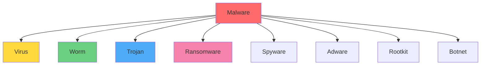

# Malware Analysis and Detection
## Unit II: Account & Data Security
### Lecture 12: Understanding and Analyzing Malicious Software

<div class="absolute bottom-5 left-5 text-xs text-gray-500">
Course: Cyber Security (4353204) | Semester V | Diploma ICT | Author: Milav Dabgar
</div>

---
layout: default
---

# Understanding Malware

<div class="grid grid-cols-2 gap-6">

<div>

## 🦠 What is Malware?

**Malware** (Malicious Software) is any software intentionally designed to cause damage to computers, servers, clients, or computer networks.

### 🎯 Malware Characteristics
- **Malicious intent** - Designed to harm
- **Unauthorized access** - Operates without permission
- **Data theft** or destruction capabilities
- **System disruption** functionality
- **Self-replication** or propagation

### 📊 Malware Statistics (2024)
- **5.6 billion** malware attacks annually
- **560,000** new malware samples daily
- **Ransomware** attacks every 11 seconds
- **$6 trillion** global cybercrime cost
- **95% of attacks** target Windows systems

</div>

<div>

## 🦠 Types of Malware

### 💀 Primary Categories


### 🔍 Malware Classification
- **By propagation method**
- **By payload type**
- **By target platform**
- **By concealment technique**
- **By infection vector**

### 📈 Evolution Timeline
- **1970s:** First computer worms
- **1980s:** Boot sector viruses
- **1990s:** Macro viruses
- **2000s:** Internet worms
- **2010s:** Advanced persistent threats
- **2020s:** AI-powered malware

</div>

</div>

<div class="absolute bottom-5 left-5 text-xs text-gray-500">
Course: Cyber Security (4353204) | Unit II | Lecture 12 | Author: Milav Dabgar
</div>

---
layout: default
---

# Malware Types in Detail

<div class="grid grid-cols-2 gap-6">

<div>

## 🦠 Virus

### 🎯 Virus Characteristics
- **Requires host** program to execute
- **Self-replicating** code
- **Infects other** files/programs
- **Activated by** user action

### 📁 Virus Types
```yaml
File Infector Viruses:
  - Executable files (.exe, .com)
  - Dynamic Link Libraries (.dll)
  - Script files (.bat, .cmd)

Boot Sector Viruses:
  - Master Boot Record (MBR)
  - Boot sector infection
  - System startup infection

Macro Viruses:
  - Office documents
  - Email attachments
  - Template infection
```

## 🐛 Worm

### 🎯 Worm Characteristics
- **Self-contained** program
- **Network propagation**
- **No host** program required
- **Automatic spreading**

### 🌐 Famous Worms
- **Morris Worm (1988)** - First internet worm
- **ILOVEYOU (2000)** - Email worm
- **Code Red (2001)** - IIS web server worm
- **Stuxnet (2010)** - Industrial control systems
- **WannaCry (2017)** - Ransomware worm

</div>

<div>

## 🐎 Trojan Horse

### 🎯 Trojan Characteristics
- **Disguised** as legitimate software
- **Social engineering** component
- **No self-replication**
- **User installation** required

### 🕵️ Trojan Categories
```yaml
Remote Access Trojans (RAT):
  - System remote control
  - Data theft capabilities
  - Keylogger functionality
  
Banking Trojans:
  - Financial data theft
  - Transaction manipulation
  - Credential harvesting
  
Downloader Trojans:
  - Additional payload delivery
  - Multi-stage infection
  - Evasion techniques
```

## 🔒 Ransomware

### 🎯 Ransomware Operation
1. **Infection** - Initial compromise
2. **Encryption** - File encryption
3. **Notification** - Ransom demand
4. **Payment** - Cryptocurrency demanded
5. **Recovery** - Files potentially restored

### 💰 Ransomware Economics
- **Average ransom:** $812,000
- **Downtime cost:** $1.85 million
- **Recovery time:** 287 days average
- **Success rate:** 70% of victims pay

</div>

</div>

<div class="absolute bottom-5 left-5 text-xs text-gray-500">
Course: Cyber Security (4353204) | Unit II | Lecture 12 | Author: Milav Dabgar
</div>

---
layout: default
---

# Malware Analysis Fundamentals

<div class="grid grid-cols-2 gap-6">

<div>

## 🔍 Analysis Types

### 🏃‍♂️ Static Analysis
- **No code execution**
- **File structure** examination
- **String analysis**
- **Signature identification**
- **Metadata extraction**

### 🏃‍♂️ Dynamic Analysis
- **Controlled execution**
- **Behavior monitoring**
- **System interaction** observation
- **Network traffic** analysis
- **Registry changes** tracking

### 🧬 Hybrid Analysis
- **Combines both** approaches
- **Automated sandboxing**
- **Comprehensive results**
- **Better evasion** detection

</div>

<div>

## 🛠️ Analysis Tools

### 📊 Static Analysis Tools
```yaml
Disassemblers:
  - IDA Pro: Advanced disassembly
  - Ghidra: NSA open-source tool
  - Radare2: Reverse engineering
  - x64dbg: Windows debugger

File Analysis:
  - PE Explorer: PE file analysis
  - Hex Workshop: Hex editor
  - Strings: Text extraction
  - File: File type identification
```

### 🔬 Dynamic Analysis Tools
```yaml
Sandboxes:
  - Cuckoo Sandbox: Open source
  - Joe Sandbox: Commercial
  - Any.run: Cloud-based
  - Hybrid Analysis: Online

Monitoring Tools:
  - Process Monitor: System activity
  - Wireshark: Network traffic
  - RegShot: Registry changes
  - API Monitor: API calls
```

### 🌐 Online Analysis Services
- **VirusTotal** - Multi-engine scanning
- **Hybrid Analysis** - Automated sandbox
- **Joe Sandbox** - Professional analysis
- **Any.run** - Interactive analysis

</div>

</div>

<div class="absolute bottom-5 left-5 text-xs text-gray-500">
Course: Cyber Security (4353204) | Unit II | Lecture 12 | Author: Milav Dabgar
</div>

---
layout: default
---

# Static Analysis Techniques

<div class="grid grid-cols-2 gap-6">

<div>

## 📋 File Structure Analysis

### 🔍 PE Header Inspection
```bash
# Using pefile Python library
import pefile

pe = pefile.PE('malware.exe')

# Basic information
print(f"Architecture: {pe.FILE_HEADER.Machine}")
print(f"Timestamp: {pe.FILE_HEADER.TimeDateStamp}")
print(f"Entry Point: {hex(pe.OPTIONAL_HEADER.AddressOfEntryPoint)}")

# Sections
for section in pe.sections:
    print(f"Section: {section.Name.decode().strip()}")
    print(f"Virtual Size: {hex(section.Misc_VirtualSize)}")
    print(f"Characteristics: {hex(section.Characteristics)}")
```

### 🧵 String Extraction
```bash
# Extract readable strings
strings malware.exe | grep -E "(http|ftp|\.exe|\.dll|registry)"

# Python implementation
import re

def extract_strings(filename, min_length=4):
    with open(filename, 'rb') as f:
        data = f.read()
    
    # ASCII strings
    ascii_pattern = b'[!-~]{%d,}' % min_length
    strings = re.findall(ascii_pattern, data)
    
    return [s.decode('ascii', errors='ignore') for s in strings]
```

</div>

<div>

## 🔐 Cryptographic Analysis

### 🔑 Entropy Calculation
```python
import math
from collections import Counter

def calculate_entropy(data):
    if not data:
        return 0
    
    # Count byte frequencies
    byte_counts = Counter(data)
    data_len = len(data)
    
    # Calculate entropy
    entropy = 0
    for count in byte_counts.values():
        probability = count / data_len
        entropy -= probability * math.log2(probability)
    
    return entropy

# High entropy (>7.5) may indicate encryption/packing
entropy = calculate_entropy(file_data)
if entropy > 7.5:
    print("File may be packed or encrypted")
```

### 🏷️ Hash Analysis
```python
import hashlib

def generate_hashes(filename):
    hashes = {}
    
    with open(filename, 'rb') as f:
        data = f.read()
    
    hashes['md5'] = hashlib.md5(data).hexdigest()
    hashes['sha1'] = hashlib.sha1(data).hexdigest()
    hashes['sha256'] = hashlib.sha256(data).hexdigest()
    
    return hashes

# Check against threat intelligence databases
hashes = generate_hashes('suspicious_file.exe')
```

### 📊 YARA Rules
```c
rule Suspicious_Strings {
    meta:
        description = "Detects suspicious strings"
        author = "Security Analyst"
        
    strings:
        $s1 = "CreateRemoteThread"
        $s2 = "WriteProcessMemory"
        $s3 = "VirtualAllocEx"
        $s4 = "SetWindowsHookEx"
        
    condition:
        2 of ($s*)
}
```

</div>

</div>

<div class="absolute bottom-5 left-5 text-xs text-gray-500">
Course: Cyber Security (4353204) | Unit II | Lecture 12 | Author: Milav Dabgar
</div>

---
layout: default
---

# Dynamic Analysis Techniques

<div class="grid grid-cols-2 gap-6">

<div>

## 🏃‍♂️ Sandbox Analysis

### 🔧 Sandbox Setup
```bash
# Cuckoo Sandbox installation
pip install cuckoo

# Initialize Cuckoo
cuckoo init

# Configure virtual machines
cuckoo machine --add windows7 \
  --label "Windows 7" \
  --ip 192.168.1.100 \
  --snapshot "clean"

# Submit malware sample
cuckoo submit malware.exe --options "full-memory-dump=yes"
```

### 📊 Behavioral Indicators
```yaml
File System Activity:
  - File creation/modification
  - Directory traversal
  - Temporary file usage
  - System file modification

Registry Activity:
  - Startup entries
  - Configuration changes
  - Persistence mechanisms
  - Service installations

Network Activity:
  - DNS queries
  - HTTP/HTTPS requests
  - P2P communications
  - Command & control traffic
```

</div>

<div>

## 🔍 Runtime Monitoring

### 🖥️ Process Monitoring
```python
import psutil
import time

def monitor_processes():
    initial_processes = set(p.pid for p in psutil.process_iter())
    
    time.sleep(5)  # Wait for malware execution
    
    current_processes = set(p.pid for p in psutil.process_iter())
    new_processes = current_processes - initial_processes
    
    for pid in new_processes:
        try:
            process = psutil.Process(pid)
            print(f"New Process: {process.name()} (PID: {pid})")
            print(f"Command Line: {process.cmdline()}")
            print(f"Parent PID: {process.ppid()}")
        except psutil.NoSuchProcess:
            continue
```

### 🌐 Network Analysis
```bash
# Monitor network connections
netstat -an | grep ESTABLISHED

# Capture traffic with tcpdump
tcpdump -i eth0 -w malware_traffic.pcap

# Wireshark analysis
wireshark malware_traffic.pcap
```

### 📝 API Call Monitoring
```python
# Using API Monitor or similar tools
api_calls = [
    "CreateFile",
    "WriteFile", 
    "RegSetValue",
    "InternetConnect",
    "CreateProcess",
    "VirtualAlloc"
]

# Monitor these API calls during execution
```

</div>

</div>

<div class="absolute bottom-5 left-5 text-xs text-gray-500">
Course: Cyber Security (4353204) | Unit II | Lecture 12 | Author: Milav Dabgar
</div>

---
layout: default
---

# Malware Detection Techniques

<div class="grid grid-cols-2 gap-6">

<div>

## 🔍 Signature-Based Detection

### 🧬 Pattern Matching
```python
class SignatureDetector:
    def __init__(self):
        self.signatures = {
            'virus_a': b'\x4d\x5a\x90\x00\x03\x00\x00\x00',
            'trojan_b': b'\xff\xd0\x68\x00\x40\x00\x00',
            'worm_c': b'\x55\x8b\xec\x83\xec\x10\x56\x57'
        }
    
    def scan_file(self, filepath):
        with open(filepath, 'rb') as f:
            content = f.read()
        
        threats = []
        for name, signature in self.signatures.items():
            if signature in content:
                threats.append(name)
        
        return threats
```

### 📊 Hash-Based Detection
```python
import hashlib
import requests

def check_virus_total(file_hash):
    url = f"https://www.virustotal.com/vtapi/v2/file/report"
    params = {
        'apikey': 'YOUR_API_KEY',
        'resource': file_hash
    }
    
    response = requests.get(url, params=params)
    return response.json()

# Calculate file hash
with open('suspicious_file.exe', 'rb') as f:
    file_hash = hashlib.sha256(f.read()).hexdigest()

result = check_virus_total(file_hash)
```

</div>

<div>

## 🤖 Heuristic Detection

### 🧠 Behavioral Heuristics
```yaml
Suspicious Behaviors:
  File Operations:
    - Mass file encryption
    - System file modification
    - Hidden file creation
    
  Network Operations:
    - Unknown server connections
    - Data exfiltration patterns
    - Botnet communication
    
  System Operations:
    - Registry persistence
    - Service installation
    - Process injection
```

### 🔬 Machine Learning Detection
```python
from sklearn.ensemble import RandomForestClassifier
import pandas as pd

# Feature extraction for ML
def extract_features(pe_file):
    features = {
        'file_size': pe_file.size,
        'num_sections': len(pe_file.sections),
        'num_imports': len(pe_file.imports),
        'has_debug_info': pe_file.has_debug,
        'entropy': calculate_entropy(pe_file.data),
        'num_strings': len(extract_strings(pe_file.data))
    }
    return features

# Train classifier
clf = RandomForestClassifier(n_estimators=100)
clf.fit(training_features, training_labels)

# Predict malware
prediction = clf.predict([file_features])
confidence = clf.predict_proba([file_features])
```

### 📈 Anomaly Detection
```python
from sklearn.svm import OneClassSVM

# Train on benign samples only
detector = OneClassSVM(nu=0.1)
detector.fit(benign_features)

# Detect anomalies (potential malware)
anomaly_score = detector.decision_function([test_features])
is_anomaly = detector.predict([test_features])
```

</div>

</div>

<div class="absolute bottom-5 left-5 text-xs text-gray-500">
Course: Cyber Security (4353204) | Unit II | Lecture 12 | Author: Milav Dabgar
</div>

---
layout: default
---

# Advanced Malware Evasion

<div class="grid grid-cols-2 gap-6">

<div>

## 🕳️ Evasion Techniques

### 🎭 Anti-Analysis Methods
```yaml
Anti-Static Analysis:
  - Code obfuscation
  - String encryption
  - Control flow flattening
  - Dead code insertion

Anti-Dynamic Analysis:
  - Virtual machine detection
  - Debugger detection
  - Sandbox evasion
  - Time-delayed execution

Anti-Disassembly:
  - Opaque predicates
  - Junk code insertion
  - Self-modifying code
  - Code encryption
```

### 🔍 VM Detection Code
```asm
; Check for VMware
mov eax, 564D5868h    ; VMware magic value
mov ebx, 00000000h
mov ecx, 0000000Ah
mov edx, 5658h        ; VX port
in  eax, dx
cmp ebx, 564D5868h    ; Check response
je  vm_detected

; Check for VirtualBox
cpuid
mov eax, ebx
xor eax, 0x786c7265   ; "xler"
jz  vm_detected
```

</div>

<div>

## 🛡️ Counter-Evasion Techniques

### 🔧 Analysis Environment Hardening
```bash
# Modify VM characteristics
vmware-vmx -s "mainMem.hideHypervisorFromGuest = TRUE"
vmware-vmx -s "isolation.tools.getPtrLocation.disable = TRUE"
vmware-vmx -s "isolation.tools.setPtrLocation.disable = TRUE"

# Change MAC address prefix
ifconfig eth0 hw ether 00:11:22:33:44:55

# Modify registry entries (Windows)
reg add "HKLM\HARDWARE\DESCRIPTION\System" /v SystemBiosVersion /t REG_SZ /d "Custom BIOS"
```

### 🎯 Behavioral Forcing
```python
# Force malware execution
import time
import threading

def create_user_activity():
    """Simulate user activity to trigger malware"""
    while True:
        # Simulate mouse movement
        # Simulate keyboard input
        # Create temporary files
        time.sleep(1)

# Start activity simulation
activity_thread = threading.Thread(target=create_user_activity)
activity_thread.daemon = True
activity_thread.start()
```

### 🔬 Advanced Monitoring
```yaml
Kernel-Level Monitoring:
  - System call interception
  - Memory access monitoring
  - Hardware performance counters
  - Hypervisor-based analysis

Multi-Path Analysis:
  - Multiple execution paths
  - Different input values
  - Various system configurations
  - Time-delayed triggers
```

</div>

</div>

<div class="absolute bottom-5 left-5 text-xs text-gray-500">
Course: Cyber Security (4353204) | Unit II | Lecture 12 | Author: Milav Dabgar
</div>

---
layout: default
---

# Threat Intelligence Integration

<div class="grid grid-cols-2 gap-6">

<div>

## 🌐 Threat Intelligence Sources

### 📊 Commercial Sources
```yaml
Threat Intelligence Platforms:
  - CrowdStrike: Falcon Intelligence
  - FireEye: Mandiant Threat Intelligence
  - Recorded Future: Real-time intelligence
  - ThreatConnect: Collaborative platform

Malware Databases:
  - VirusTotal: Multi-engine scanning
  - Hybrid Analysis: Automated sandbox
  - Malware Bazaar: Sample sharing
  - URLVoid: URL reputation
```

### 🆓 Open Source Intelligence
```python
# MISP integration
from pymisp import PyMISP

misp = PyMISP('https://misp.local', 'API_KEY')

# Search for IoCs
results = misp.search(
    eventinfo="malware campaign",
    type_attribute="sha256",
    to_ids=True
)

# Extract indicators
iocs = []
for event in results:
    for attribute in event['Attribute']:
        if attribute['type'] == 'sha256':
            iocs.append(attribute['value'])
```

</div>

<div>

## 🔄 Intelligence Automation

### 🤖 Automated Analysis Pipeline
```python
class MalwareAnalysisPipeline:
    def __init__(self):
        self.static_analyzers = []
        self.dynamic_analyzers = []
        self.threat_intel = ThreatIntelligence()
    
    def analyze_sample(self, sample_path):
        results = {
            'static': {},
            'dynamic': {},
            'intelligence': {}
        }
        
        # Static analysis
        results['static'] = self.run_static_analysis(sample_path)
        
        # Dynamic analysis
        results['dynamic'] = self.run_dynamic_analysis(sample_path)
        
        # Threat intelligence lookup
        results['intelligence'] = self.threat_intel.lookup(
            results['static']['hashes']
        )
        
        # Generate report
        return self.generate_report(results)
    
    def generate_report(self, results):
        report = {
            'verdict': self.calculate_verdict(results),
            'confidence': self.calculate_confidence(results),
            'details': results
        }
        return report
```

### 📈 Intelligence Scoring
```python
def calculate_threat_score(indicators):
    score = 0
    weights = {
        'known_malware_hash': 100,
        'suspicious_behavior': 50,
        'malicious_domain': 75,
        'packer_detected': 25,
        'anti_analysis': 40
    }
    
    for indicator, present in indicators.items():
        if present and indicator in weights:
            score += weights[indicator]
    
    return min(score, 100)  # Cap at 100
```

</div>

</div>

<div class="absolute bottom-5 left-5 text-xs text-gray-500">
Course: Cyber Security (4353204) | Unit II | Lecture 12 | Author: Milav Dabgar
</div>

---
layout: default
---

# Practical Exercise: Malware Analysis Lab

<div class="exercise-container">

## 🎯 Hands-on Activity (35 minutes)

### Lab Setup and Safety

**⚠️ IMPORTANT SAFETY NOTICE:**
- Use isolated virtual machines only
- No real malware on production systems
- Use harmless test files or simulators
- Implement proper network isolation

### Phase 1: Static Analysis (15 minutes)

**Sample File:** Download a test PE file or use a harmless executable

**Tasks:**
1. **File Analysis:**
   - Calculate MD5, SHA1, SHA256 hashes
   - Check file size and type
   - Examine PE header information

2. **String Analysis:**
   - Extract readable strings
   - Look for URLs, IP addresses, file paths
   - Identify suspicious API calls

3. **Online Lookup:**
   - Check hashes on VirusTotal
   - Analyze reputation scores
   - Review community comments

**Tools to Use:**
```bash
# Command line tools
file sample.exe
strings sample.exe | head -20
md5sum sample.exe
sha256sum sample.exe

# Python analysis
python3 pe_analyzer.py sample.exe
```

### Phase 2: Behavioral Analysis (15 minutes)

**Simulation Tasks:**
1. **Process Monitoring:**
   - Monitor running processes before/after
   - Track new processes created
   - Check process relationships

2. **File System Monitoring:**
   - Watch for file creation/modification
   - Monitor directory changes
   - Check temporary file usage

3. **Network Monitoring:**
   - Monitor network connections
   - Capture DNS queries
   - Watch for unusual traffic patterns

### Phase 3: Detection Rule Creation (5 minutes)

**Create YARA Rule:**
```c
rule Your_Detection_Rule {
    meta:
        author = "Your Name"
        description = "Detects your analyzed sample"
        
    strings:
        $s1 = "suspicious_string_1"
        $s2 = "suspicious_string_2"
        
    condition:
        any of ($s*)
}
```

**Deliverables:**
- Analysis report with findings
- Hash values and file properties
- String analysis results
- Behavioral observations
- Custom YARA detection rule

</div>

<style>
.exercise-container {
  @apply bg-red-50 border-2 border-red-300 rounded-lg p-6;
}
</style>

<div class="absolute bottom-5 left-5 text-xs text-gray-500">
Course: Cyber Security (4353204) | Unit II | Lecture 12 | Author: Milav Dabgar
</div>

---
layout: center
class: text-center
---

# Questions & Discussion

## 🤔 Discussion Points:
- What challenges did you face during the analysis lab?
- How effective are signature-based vs. behavioral detection methods?
- What role does threat intelligence play in malware analysis?

### 💡 Lab Review
Share your analysis findings and detection rules

<div class="absolute bottom-5 left-5 text-xs text-gray-500">
Course: Cyber Security (4353204) | Unit II | Lecture 12 | Author: Milav Dabgar
</div>

---
layout: center
class: text-center
---

# Thank You!

## Next Lecture: Virus Protection Mechanisms
### Building Effective Antivirus and Anti-malware Systems

<div class="pt-8 text-gray-500">
  <p>Cyber Security (4353204) - Lecture 12 Complete</p>
  <p>Know your enemy: Analyze to protect! 🔍🛡️</p>
</div>

<div class="absolute bottom-5 left-5 text-xs text-gray-500">
Course: Cyber Security (4353204) | Unit II | Lecture 12 | Author: Milav Dabgar
</div>