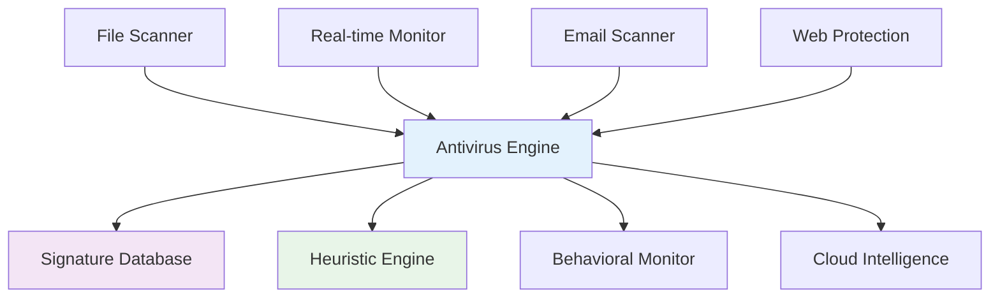
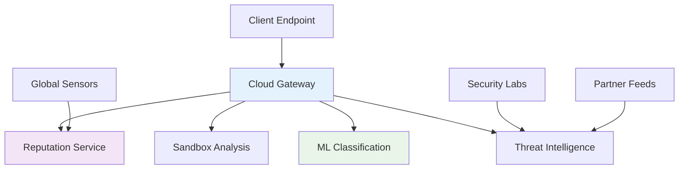
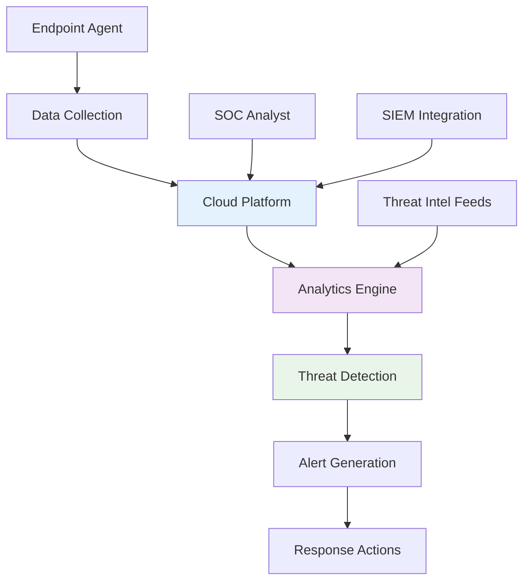

# Virus Protection Mechanisms
## Unit II: Account & Data Security
### Lecture 13: Building Effective Antivirus and Anti-malware Systems

<div class="absolute bottom-5 left-5 text-xs text-gray-500">
Course: Cyber Security (4353204) | Semester V | Diploma ICT | Author: Milav Dabgar
</div>

---
layout: default
---

# Introduction to Antivirus Systems

<div class="grid grid-cols-2 gap-6">

<div>

## 🛡️ What is Antivirus Software?

**Antivirus software** is a program designed to detect, prevent, and remove malicious software from computer systems.

### 🎯 Core Functions
- **Detection** - Identify malicious code
- **Prevention** - Block malware execution
- **Removal** - Clean infected systems
- **Monitoring** - Real-time protection
- **Recovery** - Restore damaged files

### 📊 Market Overview (2024)
- **Global market:** $4.5 billion
- **Enterprise segment:** 65% of market
- **Detection rate:** 99.7% (top products)
- **False positive rate:** <0.1%
- **Performance impact:** <5% system resources

</div>

<div>

## 🏗️ Antivirus Architecture

### 📋 System Components


### 🔧 Protection Layers
1. **File System Monitor** - Real-time scanning
2. **Network Monitor** - Traffic inspection
3. **Email Gateway** - Email protection
4. **Web Filter** - URL filtering
5. **Application Control** - Program execution
6. **Device Control** - USB/external devices

### 📈 Evolution Timeline
- **1987:** First commercial antivirus
- **1990s:** Signature-based detection
- **2000s:** Heuristic analysis
- **2010s:** Cloud-based protection
- **2020s:** AI-powered detection

</div>

</div>

<div class="absolute bottom-5 left-5 text-xs text-gray-500">
Course: Cyber Security (4353204) | Unit II | Lecture 13 | Author: Milav Dabgar
</div>

---
layout: default
---

# Detection Mechanisms

<div class="grid grid-cols-2 gap-6">

<div>

## 🔍 Signature-Based Detection

### 🧬 How Signatures Work
- **Unique patterns** identify malware
- **Database matching** against known threats
- **Fast and accurate** for known malware
- **Regular updates** required

### 📊 Signature Creation Process


### 💻 Signature Example
```python
# Simple signature matching
class SignatureEngine:
    def __init__(self):
        self.signatures = {
            'virus_a': {
                'pattern': b'\x4d\x5a\x90\x00\x03\x00\x00\x00',
                'offset': 0,
                'name': 'Win32.Virus.A'
            },
            'trojan_b': {
                'pattern': b'\x68\x00\x40\x00\x00\xff\xd0',
                'offset': -1,  # anywhere in file
                'name': 'Win32.Trojan.B'
            }
        }
    
    def scan_file(self, file_path):
        with open(file_path, 'rb') as f:
            data = f.read()
        
        detections = []
        for sig_id, sig_info in self.signatures.items():
            if self._match_signature(data, sig_info):
                detections.append(sig_info['name'])
        
        return detections
    
    def _match_signature(self, data, sig_info):
        pattern = sig_info['pattern']
        offset = sig_info['offset']
        
        if offset >= 0:
            # Fixed offset
            if len(data) > offset + len(pattern):
                return data[offset:offset+len(pattern)] == pattern
        else:
            # Search anywhere
            return pattern in data
        
        return False
```

</div>

<div>

## 🧠 Heuristic Analysis

### 🎯 Heuristic Principles
- **Behavioral patterns** analysis
- **Suspicious characteristics** detection
- **Statistical analysis** of code
- **Unknown threat** detection

### 📋 Heuristic Rules
```yaml
Suspicious File Characteristics:
  - High entropy (>7.5)
  - Packed/compressed executable
  - No digital signature
  - Hidden file attributes
  - Unusual file locations

Suspicious Code Patterns:
  - Self-modifying code
  - API call sequences
  - Encryption/decryption loops
  - Anti-debugging techniques
  - Registry manipulation

Behavioral Indicators:
  - Mass file modifications
  - Network connections to unknown IPs
  - Process injection attempts
  - System file modifications
  - Privilege escalation attempts
```

### 🔬 Heuristic Scoring
```python
class HeuristicEngine:
    def __init__(self):
        self.rules = {
            'high_entropy': {'weight': 30, 'threshold': 7.5},
            'packed_executable': {'weight': 25, 'threshold': None},
            'no_signature': {'weight': 20, 'threshold': None},
            'suspicious_imports': {'weight': 35, 'threshold': 5},
            'obfuscated_strings': {'weight': 40, 'threshold': 10}
        }
        self.malware_threshold = 70
    
    def analyze_file(self, file_analysis):
        total_score = 0
        
        for rule, config in self.rules.items():
            if self._evaluate_rule(rule, file_analysis, config):
                total_score += config['weight']
        
        verdict = 'MALWARE' if total_score >= self.malware_threshold else 'CLEAN'
        return {'verdict': verdict, 'score': total_score}
```

</div>

</div>

<div class="absolute bottom-5 left-5 text-xs text-gray-500">
Course: Cyber Security (4353204) | Unit II | Lecture 13 | Author: Milav Dabgar
</div>

---
layout: default
---

# Behavioral and Cloud-Based Protection

<div class="grid grid-cols-2 gap-6">

<div>

## 🎭 Behavioral Analysis

### 🔍 Real-Time Monitoring
- **System API calls** monitoring
- **File system activity** tracking
- **Network communication** analysis
- **Registry modifications** detection
- **Process behavior** evaluation

### 📊 Behavioral Patterns
```python
class BehavioralMonitor:
    def __init__(self):
        self.suspicious_patterns = {
            'mass_encryption': {
                'description': 'Rapid file encryption (ransomware)',
                'indicators': [
                    'high_file_write_rate',
                    'file_extension_changes',
                    'crypto_api_usage'
                ],
                'threshold': 100  # files per minute
            },
            'data_exfiltration': {
                'description': 'Large data transmission',
                'indicators': [
                    'high_network_upload',
                    'file_archive_creation',
                    'encrypted_communication'
                ],
                'threshold': 50  # MB per hour
            },
            'privilege_escalation': {
                'description': 'Attempt to gain admin rights',
                'indicators': [
                    'token_manipulation',
                    'service_installation',
                    'system_file_modification'
                ],
                'threshold': 1  # single attempt
            }
        }
    
    def evaluate_process(self, process_activity):
        threats = []
        
        for pattern_name, pattern_config in self.suspicious_patterns.items():
            if self._matches_pattern(process_activity, pattern_config):
                threats.append({
                    'type': pattern_name,
                    'description': pattern_config['description'],
                    'severity': self._calculate_severity(process_activity, pattern_config)
                })
        
        return threats
```

</div>

<div>

## ☁️ Cloud-Based Protection

### 🌐 Cloud Intelligence Benefits
- **Real-time updates** - Instant protection
- **Global threat** visibility
- **Machine learning** models
- **Reduced local** resources
- **Collective intelligence** sharing

### 🔧 Cloud Architecture


### 📡 Cloud Integration
```python
import requests
import hashlib

class CloudProtection:
    def __init__(self, api_key, cloud_endpoint):
        self.api_key = api_key
        self.endpoint = cloud_endpoint
    
    def check_file_reputation(self, file_path):
        # Calculate file hash
        with open(file_path, 'rb') as f:
            file_hash = hashlib.sha256(f.read()).hexdigest()
        
        # Query cloud reputation
        response = self._query_reputation(file_hash)
        return self._parse_reputation_response(response)
    
    def _query_reputation(self, file_hash):
        headers = {'Authorization': f'Bearer {self.api_key}'}
        params = {'hash': file_hash, 'hash_type': 'sha256'}
        
        response = requests.get(
            f'{self.endpoint}/reputation',
            headers=headers,
            params=params
        )
        
        return response.json()
    
    def _parse_reputation_response(self, response):
        if response['status'] == 'success':
            reputation = response['data']['reputation']
            confidence = response['data']['confidence']
            
            return {
                'verdict': 'MALWARE' if reputation < 30 else 'CLEAN',
                'reputation_score': reputation,
                'confidence': confidence
            }
        
        return {'verdict': 'UNKNOWN', 'error': response.get('error')}
```

</div>

</div>

<div class="absolute bottom-5 left-5 text-xs text-gray-500">
Course: Cyber Security (4353204) | Unit II | Lecture 13 | Author: Milav Dabgar
</div>

---
layout: default
---

# Modern AI-Powered Protection

<div class="grid grid-cols-2 gap-6">

<div>

## 🤖 Machine Learning in Antivirus

### 🧬 ML-Based Detection
- **Feature extraction** from executables
- **Training models** on malware datasets
- **Classification algorithms** (RF, SVM, NN)
- **Deep learning** for complex patterns
- **Continuous learning** from new samples

### 📊 Feature Engineering
```python
import pandas as pd
from sklearn.ensemble import RandomForestClassifier
from sklearn.metrics import accuracy_score

class MLMalwareDetector:
    def __init__(self):
        self.model = RandomForestClassifier(n_estimators=100)
        self.features = [
            'file_size', 'num_sections', 'num_imports',
            'entropy', 'has_debug_info', 'is_packed',
            'num_strings', 'suspicious_apis', 'has_signature'
        ]
    
    def extract_features(self, pe_file):
        # Extract PE file features
        features = {
            'file_size': len(pe_file.get_memory_mapped_image()),
            'num_sections': len(pe_file.sections),
            'num_imports': self._count_imports(pe_file),
            'entropy': self._calculate_entropy(pe_file),
            'has_debug_info': hasattr(pe_file, 'DIRECTORY_ENTRY_DEBUG'),
            'is_packed': self._detect_packing(pe_file),
            'num_strings': len(self._extract_strings(pe_file)),
            'suspicious_apis': self._count_suspicious_apis(pe_file),
            'has_signature': hasattr(pe_file, 'DIRECTORY_ENTRY_SECURITY')
        }
        return features
    
    def train_model(self, training_data, labels):
        """Train the model on labeled malware/benign samples"""
        df = pd.DataFrame(training_data)
        X = df[self.features]
        y = labels
        
        self.model.fit(X, y)
        return self.model
    
    def predict_malware(self, pe_file):
        features = self.extract_features(pe_file)
        feature_vector = [features[f] for f in self.features]
        
        prediction = self.model.predict([feature_vector])[0]
        confidence = self.model.predict_proba([feature_vector])[0].max()
        
        return {
            'verdict': 'MALWARE' if prediction == 1 else 'CLEAN',
            'confidence': confidence
        }
```

</div>

<div>

## 🔮 Deep Learning Approaches

### 🧠 Neural Network Architectures
```yaml
CNN for Binary Classification:
  - Convolutional layers for pattern detection
  - Binary representation of executables
  - Local pattern recognition
  - Translation invariant features

RNN for Sequence Analysis:
  - API call sequence analysis
  - System call patterns
  - Temporal behavior modeling
  - LSTM for long-term dependencies

Transformer Models:
  - Attention mechanisms
  - Code structure understanding
  - Multi-scale feature extraction
  - Transfer learning capabilities
```

### 🔬 Adversarial ML Defense
```python
import torch
import torch.nn as nn
import torch.optim as optim

class RobustMalwareClassifier(nn.Module):
    def __init__(self, input_size, hidden_size=128):
        super().__init__()
        self.network = nn.Sequential(
            nn.Linear(input_size, hidden_size),
            nn.ReLU(),
            nn.Dropout(0.5),
            nn.Linear(hidden_size, hidden_size),
            nn.ReLU(),
            nn.Dropout(0.5),
            nn.Linear(hidden_size, 2)  # Binary classification
        )
    
    def forward(self, x):
        return self.network(x)
    
    def adversarial_training(self, data_loader, epsilon=0.01):
        """Train with adversarial examples"""
        optimizer = optim.Adam(self.parameters())
        criterion = nn.CrossEntropyLoss()
        
        for batch_idx, (data, target) in enumerate(data_loader):
            # Generate adversarial examples
            adv_data = self._generate_adversarial(data, target, epsilon)
            
            # Train on both clean and adversarial examples
            optimizer.zero_grad()
            
            clean_output = self(data)
            adv_output = self(adv_data)
            
            clean_loss = criterion(clean_output, target)
            adv_loss = criterion(adv_output, target)
            
            total_loss = (clean_loss + adv_loss) / 2
            total_loss.backward()
            optimizer.step()
```

### 🎯 Explainable AI
```python
import shap

def explain_prediction(model, sample_features):
    """Explain why a file was classified as malware"""
    explainer = shap.TreeExplainer(model)
    shap_values = explainer.shap_values(sample_features)
    
    # Get feature importance
    feature_importance = dict(zip(
        model.feature_names_,
        shap_values[1]  # SHAP values for malware class
    ))
    
    return sorted(
        feature_importance.items(),
        key=lambda x: abs(x[1]),
        reverse=True
    )
```

</div>

</div>

<div class="absolute bottom-5 left-5 text-xs text-gray-500">
Course: Cyber Security (4353204) | Unit II | Lecture 13 | Author: Milav Dabgar
</div>

---
layout: default
---

# Endpoint Detection and Response (EDR)

<div class="grid grid-cols-2 gap-6">

<div>

## 🎯 EDR Capabilities

### 🔍 Advanced Monitoring
- **Continuous monitoring** of endpoints
- **Detailed activity** logging
- **Real-time alerting** on threats
- **Incident investigation** tools
- **Automated response** capabilities

### 📊 EDR Architecture


### 🛠️ EDR vs Traditional AV
| Feature | Traditional AV | EDR |
|---------|---------------|-----|
| Detection | Signature-based | Behavioral + ML |
| Response | Quarantine | Investigation + Remediation |
| Visibility | File-level | Process-level |
| Analytics | Local | Cloud-based |
| Threat Hunting | Limited | Advanced |

</div>

<div>

## 🔧 EDR Implementation

### 📡 Data Collection
```python
class EDRAgent:
    def __init__(self):
        self.collectors = {
            'process_monitor': ProcessCollector(),
            'file_monitor': FileCollector(),
            'network_monitor': NetworkCollector(),
            'registry_monitor': RegistryCollector()
        }
        self.cloud_endpoint = "https://edr.company.com/api"
    
    def collect_telemetry(self):
        """Collect endpoint telemetry data"""
        telemetry = {}
        
        for collector_name, collector in self.collectors.items():
            try:
                data = collector.collect()
                telemetry[collector_name] = data
            except Exception as e:
                logging.error(f"Collection error in {collector_name}: {e}")
        
        return telemetry
    
    def send_telemetry(self, telemetry_data):
        """Send data to cloud platform"""
        try:
            response = requests.post(
                f"{self.cloud_endpoint}/telemetry",
                json=telemetry_data,
                headers={'Content-Type': 'application/json'}
            )
            return response.status_code == 200
        except Exception as e:
            logging.error(f"Failed to send telemetry: {e}")
            return False

class ProcessCollector:
    def collect(self):
        """Collect process information"""
        processes = []
        for proc in psutil.process_iter(['pid', 'name', 'cmdline', 'create_time']):
            try:
                proc_info = proc.info
                proc_info['connections'] = len(proc.connections())
                proc_info['memory_percent'] = proc.memory_percent()
                processes.append(proc_info)
            except (psutil.NoSuchProcess, psutil.AccessDenied):
                continue
        
        return processes
```

### 🚨 Threat Detection Rules
```yaml
EDR Detection Rules:
  lateral_movement:
    description: "Detect lateral movement attempts"
    conditions:
      - remote_process_creation: true
      - network_share_access: true
      - credential_theft_tools: true
    severity: HIGH
    
  data_exfiltration:
    description: "Large data transfer to external IP"
    conditions:
      - network_upload_size: ">100MB"
      - destination_reputation: "unknown"
      - file_archive_creation: true
    severity: HIGH
    
  persistence_mechanism:
    description: "Malware persistence establishment"
    conditions:
      - registry_autorun_keys: true
      - scheduled_task_creation: true
      - service_installation: true
    severity: MEDIUM
```

</div>

</div>

<div class="absolute bottom-5 left-5 text-xs text-gray-500">
Course: Cyber Security (4353204) | Unit II | Lecture 13 | Author: Milav Dabgar
</div>

---
layout: default
---

# Protection Deployment Strategies

<div class="grid grid-cols-2 gap-6">

<div>

## 🏢 Enterprise Deployment

### 📋 Deployment Planning
```yaml
Phase 1: Assessment (Week 1-2)
  - Current security audit
  - Infrastructure inventory
  - Performance requirements
  - Compliance mapping

Phase 2: Pilot Deployment (Week 3-4)
  - Test environment setup
  - Pilot group selection (10% of users)
  - Performance monitoring
  - Policy configuration

Phase 3: Phased Rollout (Week 5-12)
  - Department-by-department deployment
  - User training sessions
  - Policy refinement
  - Incident response testing

Phase 4: Full Production (Week 13+)
  - Complete deployment
  - Monitoring and maintenance
  - Regular updates
  - Continuous improvement
```

### 🔧 Configuration Management
```python
class AntivirusConfigManager:
    def __init__(self):
        self.policies = {
            'executives': {
                'real_time_protection': True,
                'scan_frequency': 'daily',
                'quarantine_action': 'prompt',
                'cloud_lookup': True,
                'performance_mode': 'balanced'
            },
            'developers': {
                'real_time_protection': True,
                'scan_frequency': 'weekly',
                'quarantine_action': 'automatic',
                'cloud_lookup': True,
                'performance_mode': 'gaming',  # Reduced overhead
                'exclusions': ['/build/', '/node_modules/']
            },
            'general_users': {
                'real_time_protection': True,
                'scan_frequency': 'daily',
                'quarantine_action': 'automatic',
                'cloud_lookup': True,
                'performance_mode': 'maximum_protection'
            }
        }
    
    def deploy_policy(self, computer_group, policy_name):
        """Deploy antivirus policy to computer group"""
        if policy_name not in self.policies:
            raise ValueError(f"Policy {policy_name} not found")
        
        policy = self.policies[policy_name]
        
        # Generate configuration file
        config = self._generate_config(policy)
        
        # Deploy to endpoints
        return self._deploy_to_group(computer_group, config)
```

</div>

<div>

## 🏠 Consumer Protection

### 👥 Home User Considerations
```yaml
Key Requirements:
  - Easy installation and setup
  - Minimal user interaction
  - Automatic updates
  - Performance optimization
  - Multi-device protection

Features for Home Users:
  - Real-time web protection
  - Email security
  - USB device scanning
  - Parental controls
  - Identity theft protection
```

### 📱 Multi-Platform Protection
```python
class UnifiedProtectionManager:
    def __init__(self):
        self.platforms = {
            'windows': WindowsProtection(),
            'macos': MacOSProtection(),
            'android': AndroidProtection(),
            'ios': IOSProtection()
        }
    
    def deploy_protection(self, device_info):
        """Deploy appropriate protection based on device"""
        platform = device_info['platform'].lower()
        
        if platform in self.platforms:
            protector = self.platforms[platform]
            return protector.install_and_configure(device_info)
        else:
            raise UnsupportedPlatformError(f"Platform {platform} not supported")

class WindowsProtection:
    def install_and_configure(self, device_info):
        config = {
            'real_time_scanning': True,
            'web_protection': True,
            'email_scanning': True,
            'usb_scanning': True,
            'firewall_integration': True,
            'automatic_updates': True
        }
        
        return self._deploy_windows_av(config)
```

### 🔄 Update Management
```python
class UpdateManager:
    def __init__(self):
        self.update_channels = {
            'critical': {'frequency': 'hourly', 'auto_apply': True},
            'security': {'frequency': '4hours', 'auto_apply': True},
            'definition': {'frequency': '15min', 'auto_apply': True},
            'feature': {'frequency': 'weekly', 'auto_apply': False}
        }
    
    def check_updates(self):
        """Check for available updates"""
        available_updates = []
        
        for channel, config in self.update_channels.items():
            updates = self._check_channel_updates(channel)
            if updates:
                available_updates.extend(updates)
        
        return available_updates
    
    def apply_updates(self, update_list, force=False):
        """Apply selected updates"""
        success_count = 0
        
        for update in update_list:
            if update['auto_apply'] or force:
                if self._apply_update(update):
                    success_count += 1
        
        return success_count
```

</div>

</div>

<div class="absolute bottom-5 left-5 text-xs text-gray-500">
Course: Cyber Security (4353204) | Unit II | Lecture 13 | Author: Milav Dabgar
</div>

---
layout: default
---

# Performance and Optimization

<div class="grid grid-cols-2 gap-6">

<div>

## ⚡ Performance Considerations

### 📊 Resource Impact Metrics
```yaml
Performance Metrics:
  CPU Usage:
    - Idle: <2%
    - Scanning: <25%
    - Full scan: <50%
    
  Memory Usage:
    - Base: <150MB
    - Active scanning: <300MB
    - Maximum: <500MB
    
  Disk I/O:
    - Background: <1MB/s
    - Scanning: <10MB/s
    - Updates: <5MB/s
    
  Boot Impact:
    - Additional time: <10 seconds
    - Service startup: <30 seconds
```

### 🔧 Optimization Techniques
```python
class PerformanceOptimizer:
    def __init__(self):
        self.optimization_rules = {
            'scan_scheduling': {
                'avoid_peak_hours': True,
                'cpu_threshold': 80,  # Pause if CPU > 80%
                'battery_aware': True  # Reduce scanning on battery
            },
            'file_exclusions': {
                'system_files': [
                    'C:\\Windows\\System32\\',
                    'C:\\Windows\\SysWOW64\\'
                ],
                'development_folders': [
                    '/node_modules/',
                    '/build/',
                    '/.git/'
                ]
            },
            'caching': {
                'scan_results_ttl': 3600,  # 1 hour
                'reputation_cache_ttl': 1800,  # 30 minutes
                'max_cache_size': '256MB'
            }
        }
    
    def optimize_for_system(self, system_profile):
        """Optimize antivirus for specific system"""
        if system_profile['ram'] < 4096:  # Less than 4GB RAM
            self._apply_low_memory_optimizations()
        
        if system_profile['cpu_cores'] <= 2:
            self._apply_low_cpu_optimizations()
        
        if system_profile['disk_type'] == 'hdd':
            self._apply_hdd_optimizations()
        
        return self._generate_optimized_config()
    
    def _apply_low_memory_optimizations(self):
        """Optimize for systems with limited RAM"""
        self.optimization_rules['caching']['max_cache_size'] = '64MB'
        self.optimization_rules['scan_scheduling']['concurrent_scans'] = 1
    
    def monitor_performance_impact(self):
        """Monitor and adjust based on system performance"""
        cpu_usage = psutil.cpu_percent(interval=1)
        memory_usage = psutil.virtual_memory().percent
        
        if cpu_usage > 80:
            self._reduce_scan_intensity()
        
        if memory_usage > 90:
            self._clear_caches()
```

</div>

<div>

## 📈 Effectiveness Measurement

### 🎯 Detection Rate Metrics
```python
class EffectivenessMonitor:
    def __init__(self):
        self.metrics = {
            'detection_rate': 0.0,
            'false_positive_rate': 0.0,
            'false_negative_rate': 0.0,
            'performance_impact': 0.0,
            'user_satisfaction': 0.0
        }
    
    def calculate_detection_rate(self, test_results):
        """Calculate detection effectiveness"""
        total_malware = test_results['malware_samples']
        detected_malware = test_results['detected_samples']
        false_positives = test_results['false_positives']
        
        detection_rate = detected_malware / total_malware
        fp_rate = false_positives / test_results['clean_samples']
        
        return {
            'detection_rate': detection_rate,
            'false_positive_rate': fp_rate,
            'effectiveness_score': detection_rate * (1 - fp_rate)
        }
    
    def benchmark_performance(self, benchmark_suite):
        """Run standardized performance tests"""
        results = {}
        
        # File operation tests
        results['file_operations'] = self._test_file_operations()
        
        # Application startup tests
        results['app_startup'] = self._test_application_startup()
        
        # Network performance tests
        results['network_impact'] = self._test_network_performance()
        
        return results
```

### 📊 Industry Benchmarks
```yaml
Industry Standards (2024):
  Detection Rate:
    - Excellent: >99.5%
    - Good: >98.0%
    - Acceptable: >95.0%
    
  False Positive Rate:
    - Excellent: <0.1%
    - Good: <0.5%
    - Acceptable: <1.0%
    
  Performance Impact:
    - Excellent: <3%
    - Good: <5%
    - Acceptable: <10%
    
  AV-TEST Certification:
    - Protection: 6/6 points
    - Performance: 6/6 points
    - Usability: 6/6 points
```

### 📈 Continuous Improvement
```python
def generate_improvement_recommendations(metrics_history):
    """Analyze metrics and suggest improvements"""
    recommendations = []
    
    # Analyze trends
    recent_metrics = metrics_history[-30:]  # Last 30 days
    
    if is_trending_down(recent_metrics, 'detection_rate'):
        recommendations.append({
            'category': 'Detection',
            'priority': 'HIGH',
            'recommendation': 'Update detection signatures and rules',
            'expected_impact': 'Improve detection rate by 2-5%'
        })
    
    if is_trending_up(recent_metrics, 'false_positive_rate'):
        recommendations.append({
            'category': 'Accuracy',
            'priority': 'MEDIUM',
            'recommendation': 'Refine heuristic rules',
            'expected_impact': 'Reduce false positives by 20-30%'
        })
    
    return recommendations
```

</div>

</div>

<div class="absolute bottom-5 left-5 text-xs text-gray-500">
Course: Cyber Security (4353204) | Unit II | Lecture 13 | Author: Milav Dabgar
</div>

---
layout: default
---

# Practical Exercise: Antivirus Evaluation Lab

<div class="exercise-container">

## 🎯 Group Activity (30 minutes)

### Lab Scenario: Enterprise Antivirus Selection

Your organization needs to select and deploy antivirus software for 1000+ endpoints across multiple departments with varying security requirements.

**Organization Profile:**
- **Departments:** Finance, IT, Marketing, Sales, HR
- **Platforms:** Windows (70%), macOS (20%), Mobile (10%)
- **Compliance:** SOX, GDPR, HIPAA (healthcare data)
- **Performance Requirements:** Minimal impact on productivity
- **Budget:** $50,000 annually for endpoint protection

### Phase 1: Requirements Analysis (10 minutes)

**Task 1: Define Requirements Matrix**
Create a requirements matrix for each department:

| Requirement | Finance | IT | Marketing | Sales | HR |
|-------------|---------|----|-----------|---------|----|
| Real-time Protection | | | | | |
| Web Filtering | | | | | |
| Email Security | | | | | |
| USB Control | | | | | |
| Performance Impact | | | | | |

**Task 2: Technical Specifications**
- Define minimum detection rate requirements
- Set maximum performance impact limits
- Identify integration requirements (SIEM, AD, etc.)
- Specify update and management requirements

### Phase 2: Solution Evaluation (15 minutes)

**Task 3: Vendor Comparison**
Evaluate three antivirus solutions based on:
1. **Detection Capabilities:**
   - Signature-based detection
   - Heuristic analysis
   - Behavioral monitoring
   - Machine learning features

2. **Management Features:**
   - Central management console
   - Policy deployment
   - Reporting capabilities
   - Remote configuration

3. **Performance Impact:**
   - Resource utilization
   - Scan speed
   - User experience impact

**Task 4: Cost-Benefit Analysis**
- Calculate total cost of ownership (TCO)
- Estimate potential cost savings from threat prevention
- Consider deployment and training costs

### Phase 3: Implementation Planning (5 minutes)

**Task 5: Deployment Strategy**
- Design phased rollout plan
- Identify pilot group
- Plan user training approach
- Define success metrics

**Deliverables:**
- Requirements matrix by department
- Vendor evaluation scorecard
- Cost-benefit analysis
- Implementation timeline
- Risk assessment and mitigation plan

</div>

<style>
.exercise-container {
  @apply bg-green-50 border-2 border-green-300 rounded-lg p-6;
}
</style>

<div class="absolute bottom-5 left-5 text-xs text-gray-500">
Course: Cyber Security (4353204) | Unit II | Lecture 13 | Author: Milav Dabgar
</div>

---
layout: center
class: text-center
---

# Questions & Discussion

## 🤔 Discussion Points:
- How do you balance security effectiveness with system performance?
- What role should AI/ML play in modern antivirus solutions?
- How important is cloud-based protection vs. on-premise solutions?

### 💡 Exercise Review
Share your antivirus evaluation results and implementation strategies

<div class="absolute bottom-5 left-5 text-xs text-gray-500">
Course: Cyber Security (4353204) | Unit II | Lecture 13 | Author: Milav Dabgar
</div>

---
layout: center
class: text-center
---

# Thank You!

## Next Lecture: Attack Prevention Strategies
### Proactive Security Measures and Defense in Depth

<div class="pt-8 text-gray-500">
  <p>Cyber Security (4353204) - Lecture 13 Complete</p>
  <p>Protection through detection and prevention! 🛡️🔍</p>
</div>

<div class="absolute bottom-5 left-5 text-xs text-gray-500">
Course: Cyber Security (4353204) | Unit II | Lecture 13 | Author: Milav Dabgar
</div>