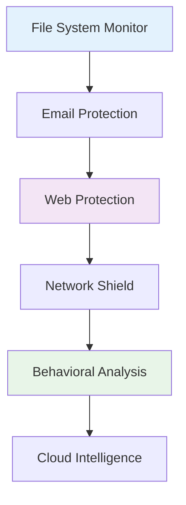
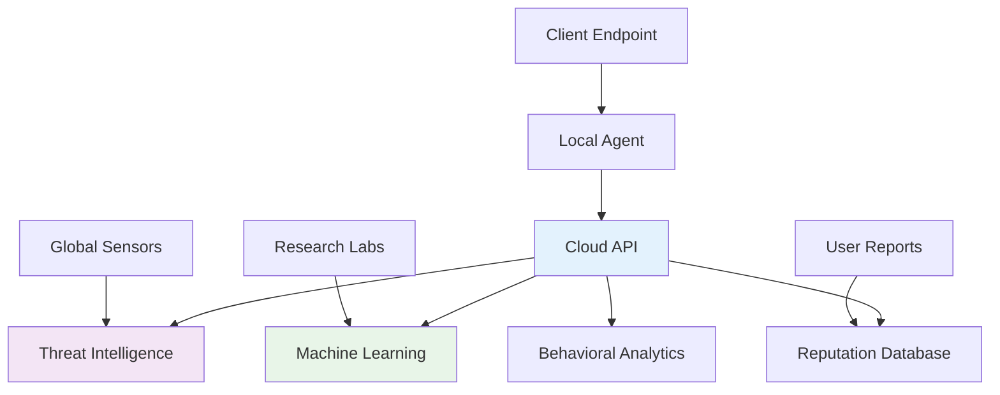
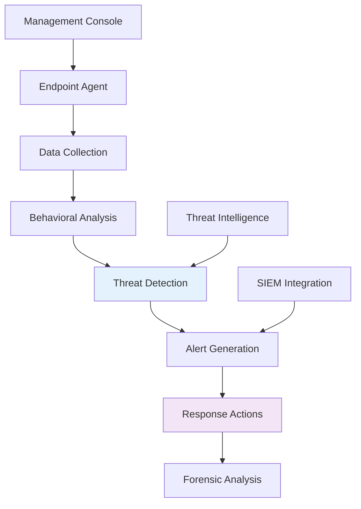
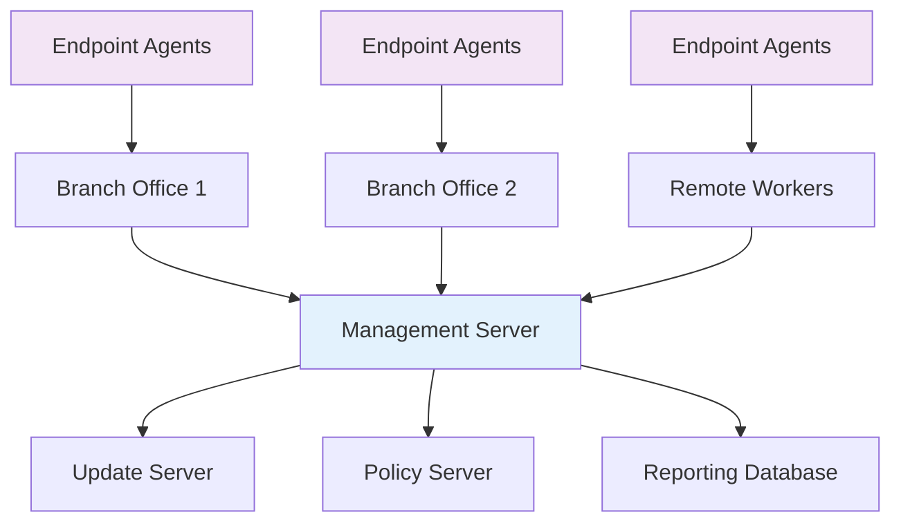

# Virus Protection Mechanisms
## Unit II: Account & Data Security  
### Lecture 13: Building Robust Defense Systems

<div class="absolute bottom-5 left-5 text-xs text-gray-500">
Course: Cyber Security (4353204) | Semester V | Diploma ICT | Author: Milav Dabgar
</div>

---
layout: default
---

# Antivirus Fundamentals

<div class="grid grid-cols-2 gap-6">

<div>

## 🛡️ What is Antivirus Software?

**Antivirus software** is a program designed to detect, prevent, and remove malicious software from computer systems.

### 🎯 Core Functions
- **Real-time scanning** - Continuous monitoring
- **On-demand scanning** - Manual/scheduled scans
- **Automatic updates** - Latest threat definitions
- **Quarantine management** - Isolate suspicious files
- **System restoration** - Repair infected systems

### 📊 Protection Layers


</div>

<div>

## 🔍 Detection Methods Evolution

### 📈 Generation Timeline
```yaml
First Generation (1987-1995):
  - Signature-based only
  - Static pattern matching
  - Simple string searches
  - Limited effectiveness
  
Second Generation (1995-2005):
  - Heuristic analysis added
  - Behavioral monitoring
  - Generic detection rules
  - Better unknown threat handling
  
Third Generation (2005-2015):
  - Cloud-based intelligence
  - Real-time reputation
  - Machine learning basics
  - Proactive protection
  
Fourth Generation (2015-Present):
  - AI/ML integration
  - Advanced behavioral analysis
  - Zero-day protection
  - Threat hunting capabilities
```

### 🎯 Modern Requirements
- **Zero-day protection**
- **Minimal system impact**
- **Cloud integration**
- **Multi-platform support**
- **Automated response**

</div>

</div>

<div class="absolute bottom-5 left-5 text-xs text-gray-500">
Course: Cyber Security (4353204) | Unit II | Lecture 13 | Author: Milav Dabgar
</div>

---
layout: default
---

# Signature-Based Detection

<div class="grid grid-cols-2 gap-6">

<div>

## 🔍 How Signature Detection Works

### 📋 Process Overview
1. **Malware analysis** - Extract unique patterns
2. **Signature creation** - Define detection rules
3. **Database update** - Distribute to clients
4. **File scanning** - Compare against signatures
5. **Threat identification** - Match found patterns

### 💻 Signature Types
```yaml
Hash-based Signatures:
  - MD5, SHA-1, SHA-256 hashes
  - Exact file matching
  - Fast comparison
  - Easily evaded by modification
  
String-based Signatures:
  - Text patterns in malware
  - Hexadecimal byte sequences
  - Regular expressions
  - More flexible than hashes
  
Structural Signatures:
  - File structure patterns
  - Import table analysis
  - Section characteristics
  - PE header anomalies
```

### 🔧 YARA Rules Example
```c
rule Trojan_Banker_Generic
{
    meta:
        author = "Security Analyst"
        date = "2024-01-01"
        description = "Generic banking trojan"
        
    strings:
        $a = "GetWindowText" ascii
        $b = "keylog" ascii nocase
        $c = { 48 89 5C 24 08 48 89 74 24 10 }
        $d = /https:\/\/[a-z0-9]+\.onion\//
        
    condition:
        2 of them and filesize < 5MB
}
```

</div>

<div>

## ⚡ Advantages and Limitations

### ✅ Signature Detection Advantages
- **High accuracy** for known threats
- **Fast scanning** performance
- **Low false positive** rate
- **Minimal resource** usage
- **Well-established** technology

### ❌ Signature Detection Limitations
- **Zero-day threats** undetected
- **Polymorphic malware** evasion
- **Packed/encrypted** malware bypass
- **Large signature** database size
- **Frequent updates** required

### 🔄 Evasion Techniques
```python
# Example: Simple polymorphic technique
import random
import string

def generate_variant(malware_code):
    # Add random junk code
    junk = ''.join(random.choices(string.ascii_letters, k=100))
    
    # Insert NOPs (No Operation instructions)
    nops = 'NOP ' * random.randint(10, 50)
    
    # Change variable names
    old_vars = ['temp', 'data', 'buffer']
    new_vars = [''.join(random.choices(string.ascii_letters, k=8)) 
                for _ in old_vars]
    
    # Return modified code
    return modify_code(malware_code, junk, nops, old_vars, new_vars)
```

### 📊 Signature Update Frequency
- **Critical threats** - Within hours
- **High-priority** - Daily updates
- **Regular threats** - Weekly updates
- **Comprehensive** - Monthly releases

</div>

</div>

<div class="absolute bottom-5 left-5 text-xs text-gray-500">
Course: Cyber Security (4353204) | Unit II | Lecture 13 | Author: Milav Dabgar
</div>

---
layout: default
---

# Heuristic and Behavioral Analysis

<div class="grid grid-cols-2 gap-6">

<div>

## 🧠 Heuristic Analysis

### 🔍 Static Heuristics
**Analyze file** structure and code without execution.

### 📊 Static Analysis Techniques
```yaml
Code Analysis:
  - Suspicious API imports
  - Unusual file structure
  - Encrypted/packed sections
  - Anti-debugging techniques
  
Entropy Analysis:
  - File randomness measurement
  - Packed/encrypted detection
  - Normal range: 1.0-7.0
  - Suspicious: 7.5-8.0
  
Import Analysis:
  - Dangerous API calls
  - CreateProcess, WriteFile
  - Registry modification
  - Network communication
  
Pattern Recognition:
  - Known malware families
  - Compiler signatures
  - Development patterns
  - Obfuscation techniques
```

### 💻 Entropy Calculation
```python
import math
from collections import Counter

def calculate_entropy(data):
    if not data:
        return 0
    
    # Count byte frequencies
    byte_counts = Counter(data)
    data_length = len(data)
    
    # Calculate entropy
    entropy = 0
    for count in byte_counts.values():
        probability = count / data_length
        entropy -= probability * math.log2(probability)
    
    return entropy

# Example usage
with open('suspicious.exe', 'rb') as f:
    file_data = f.read()
    entropy = calculate_entropy(file_data)
    
    if entropy > 7.5:
        print("High entropy - possible packing/encryption")
```

</div>

<div>

## 🏃 Dynamic Behavioral Analysis

### ⚡ Runtime Monitoring
**Monitor system** during malware execution to detect malicious behavior.

### 📋 Behavioral Indicators
```yaml
Process Behavior:
  - Unusual process creation
  - Code injection attempts
  - Memory manipulation
  - Privilege escalation
  - DLL hijacking
  
File System Activity:
  - Mass file encryption
  - Hidden file creation
  - System file modification
  - Autostart registry entries
  - Shadow copy deletion
  
Network Behavior:
  - C2 server communication
  - DNS tunneling
  - Data exfiltration
  - Port scanning
  - Protocol anomalies
  
System Modifications:
  - Security software disabling
  - Firewall rule changes
  - Service installations
  - Boot sector modifications
  - System file replacements
```

### 🔧 Behavioral Analysis Engine
```python
class BehaviorAnalyzer:
    def __init__(self):
        self.risk_score = 0
        self.detected_behaviors = []
    
    def analyze_process_creation(self, parent, child):
        suspicious_patterns = [
            ('cmd.exe', 'powershell.exe'),
            ('winword.exe', 'cmd.exe'),
            ('excel.exe', 'wscript.exe')
        ]
        
        if (parent, child) in suspicious_patterns:
            self.risk_score += 30
            self.detected_behaviors.append("Suspicious process chain")
    
    def analyze_file_activity(self, file_operations):
        encryption_extensions = ['.locked', '.encrypted', '.crypto']
        mass_file_changes = len([op for op in file_operations 
                                if op.type == 'modify']) > 100
        
        if mass_file_changes:
            self.risk_score += 50
            self.detected_behaviors.append("Mass file modification")
    
    def get_verdict(self):
        if self.risk_score > 70:
            return "MALWARE"
        elif self.risk_score > 40:
            return "SUSPICIOUS"
        else:
            return "CLEAN"
```

</div>

</div>

<div class="absolute bottom-5 left-5 text-xs text-gray-500">
Course: Cyber Security (4353204) | Unit II | Lecture 13 | Author: Milav Dabgar
</div>

---
layout: default
---

# Cloud-Based Protection

<div class="grid grid-cols-2 gap-6">

<div>

## ☁️ Cloud Intelligence

### 🌐 Cloud AV Architecture


### 🔍 Cloud Benefits
- **Real-time** threat intelligence
- **Collective defense** - Global visibility
- **Lightweight client** - Minimal local processing
- **Instant updates** - No signature downloads
- **Advanced analytics** - ML/AI processing power

### 📊 Reputation Systems
```yaml
File Reputation:
  - Global file prevalence
  - First seen timestamp
  - Digital signatures
  - Certification authority
  - Download sources
  
URL Reputation:
  - Website categorization
  - Malware hosting history
  - Phishing attempts
  - Suspicious redirects
  - Geographic anomalies
  
IP Reputation:
  - Botnet participation
  - C2 server hosting
  - Spam source
  - Attack participation
  - Geographic location
```

</div>

<div>

## 🤖 Machine Learning Integration

### 🧠 ML-Powered Detection
**Artificial intelligence** to identify unknown and evolving threats.

### 📊 ML Model Types
```yaml
Supervised Learning:
  - Known malware training
  - Feature extraction
  - Classification models
  - High accuracy on known patterns
  
Unsupervised Learning:
  - Anomaly detection
  - Clustering similar samples
  - Zero-day identification
  - Behavioral pattern discovery
  
Deep Learning:
  - Neural networks
  - Image recognition (visualization)
  - Natural language processing
  - Advanced pattern recognition
```

### 🔧 Feature Engineering
```python
# ML feature extraction for PE files
import pefile
import numpy as np

def extract_pe_features(filename):
    try:
        pe = pefile.PE(filename)
        features = {}
        
        # Basic PE information
        features['num_sections'] = len(pe.sections)
        features['size_of_image'] = pe.OPTIONAL_HEADER.SizeOfImage
        features['entry_point'] = pe.OPTIONAL_HEADER.AddressOfEntryPoint
        
        # Import table analysis
        if hasattr(pe, 'DIRECTORY_ENTRY_IMPORT'):
            features['num_imported_dlls'] = len(pe.DIRECTORY_ENTRY_IMPORT)
            features['num_imported_functions'] = sum(
                len(entry.imports) for entry in pe.DIRECTORY_ENTRY_IMPORT
            )
        else:
            features['num_imported_dlls'] = 0
            features['num_imported_functions'] = 0
        
        # Section analysis
        section_entropies = []
        for section in pe.sections:
            data = section.get_data()
            entropy = calculate_entropy(data)
            section_entropies.append(entropy)
        
        features['max_section_entropy'] = max(section_entropies)
        features['avg_section_entropy'] = np.mean(section_entropies)
        
        return features
        
    except Exception as e:
        return None
```

### 🎯 Hybrid Approach
- **Multiple detection** engines
- **Signature + Heuristic** + ML
- **Cloud + Local** processing
- **Consensus-based** decisions

</div>

</div>

<div class="absolute bottom-5 left-5 text-xs text-gray-500">
Course: Cyber Security (4353204) | Unit II | Lecture 13 | Author: Milav Dabgar
</div>

---
layout: default
---

# Real-Time Protection Systems

<div class="grid grid-cols-2 gap-6">

<div>

## ⚡ Real-Time Scanning

### 🔄 On-Access Scanning
**Monitor file** operations in real-time to prevent malware execution.

### 📊 Monitoring Points
```yaml
File System Events:
  - File creation/modification
  - File execution attempts
  - Archive extractions
  - Downloads completion
  - USB/removable media
  
Process Events:
  - Process creation
  - DLL loading
  - Memory allocation
  - Code injection
  - Privilege escalation
  
Network Events:
  - HTTP/HTTPS requests
  - Email attachments
  - File transfers
  - P2P connections
  - DNS resolutions
  
Registry Events:
  - Autorun modifications
  - Security setting changes
  - Service installations
  - Policy modifications
  - Browser settings
```

### 💻 Windows File System Filter
```c
// Simplified file system filter driver
NTSTATUS FileSystemFilter(
    PDEVICE_OBJECT DeviceObject,
    PIRP Irp
) {
    PIO_STACK_LOCATION stack = IoGetCurrentIrpStackLocation(Irp);
    
    switch (stack->MajorFunction) {
        case IRP_MJ_CREATE:
            // File open/create operation
            return HandleFileOpen(Irp);
            
        case IRP_MJ_WRITE:
            // File write operation
            return HandleFileWrite(Irp);
            
        case IRP_MJ_SET_INFORMATION:
            // File modification
            return HandleFileModify(Irp);
    }
    
    // Pass through to next driver
    return PassThroughIrp(DeviceObject, Irp);
}
```

</div>

<div>

## 🛡️ Proactive Defense

### 🔒 Application Control
**Whitelist-based** approach allowing only trusted applications.

### 📋 Application Control Methods
```yaml
Digital Signatures:
  - Certificate validation
  - Publisher verification
  - Code signing checks
  - Revocation status
  
Path-based Rules:
  - Trusted directories
  - System locations
  - Application folders
  - User-defined paths
  
Hash-based Rules:
  - File hash allowlists
  - Known good binaries
  - Approved versions
  - Custom applications
  
Behavioral Rules:
  - Application behavior patterns
  - Normal operation profiles
  - Resource usage limits
  - Network communication rules
```

### 🔧 Windows Defender Application Control
```powershell
# Create WDAC policy
New-CIPolicy -Level Publisher -FilePath "C:\Policy\BasePolicy.xml" `
  -UserPEs -ScanPath "C:\Program Files\"

# Convert to binary format
ConvertFrom-CIPolicy -XmlFilePath "C:\Policy\BasePolicy.xml" `
  -BinaryFilePath "C:\Policy\Policy.bin"

# Deploy policy
Copy-Item "C:\Policy\Policy.bin" `
  "C:\Windows\System32\CodeIntegrity\SiPolicy.p7b"

# Enable policy enforcement
Set-ItemProperty -Path "HKLM:\SYSTEM\CurrentControlSet\Control\CI\Config" `
  -Name "VirtualizationBasedProtection" -Value 1
```

### 🎯 Zero Trust Execution
- **Default deny** policy
- **Explicit allow** rules
- **Continuous monitoring**
- **Adaptive policies**
- **Machine learning** integration

</div>

</div>

<div class="absolute bottom-5 left-5 text-xs text-gray-500">
Course: Cyber Security (4353204) | Unit II | Lecture 13 | Author: Milav Dabgar
</div>

---
layout: default
---

# Endpoint Detection and Response (EDR)

<div class="grid grid-cols-2 gap-6">

<div>

## 🔍 EDR Overview

### 🎯 EDR Capabilities
**Advanced endpoint** security platform providing continuous monitoring and response.

### 📊 EDR Components


### 🔧 EDR Features
- **Continuous monitoring** - 24/7 endpoint visibility
- **Threat hunting** - Proactive threat search
- **Incident response** - Automated containment
- **Forensic analysis** - Detailed investigation
- **Threat intelligence** - Context-aware detection

### 📋 EDR vs Traditional AV
| Feature | Traditional AV | EDR |
|---------|---------------|-----|
| Detection | Signature-based | Behavioral + ML |
| Response | Block/Remove | Investigate + Contain |
| Visibility | Limited | Complete endpoint |
| Analysis | Basic | Advanced forensics |
| Threat Hunting | No | Yes |
| Timeline | No | Complete attack chain |

</div>

<div>

## 🎯 Advanced Response Capabilities

### ⚡ Automated Response Actions
```yaml
Containment:
  - Network isolation
  - Process termination
  - File quarantine
  - User account suspension
  
Investigation:
  - Process tree analysis
  - Network connection mapping
  - File system timeline
  - Registry change tracking
  
Remediation:
  - Malware removal
  - System restoration
  - Patch deployment
  - Configuration hardening
```

### 🔧 EDR Response Automation
```python
class EDRResponseEngine:
    def __init__(self):
        self.threat_threshold = 75
        self.response_actions = []
    
    def analyze_alert(self, alert):
        risk_score = self.calculate_risk(alert)
        
        if risk_score > self.threat_threshold:
            # Immediate containment
            self.isolate_endpoint(alert.endpoint_id)
            
            # Kill malicious processes
            for process in alert.malicious_processes:
                self.terminate_process(process.pid)
            
            # Quarantine files
            for file in alert.malicious_files:
                self.quarantine_file(file.path)
            
            # Notify analysts
            self.create_incident(alert, risk_score)
    
    def calculate_risk(self, alert):
        score = 0
        
        # Process-based indicators
        if alert.has_code_injection():
            score += 30
        if alert.has_lateral_movement():
            score += 25
        if alert.has_privilege_escalation():
            score += 20
            
        # Network indicators
        if alert.has_c2_communication():
            score += 40
        if alert.has_data_exfiltration():
            score += 35
            
        return score
    
    def isolate_endpoint(self, endpoint_id):
        # Remove network access
        self.firewall_block_all(endpoint_id)
        # Maintain management connection only
        self.allow_management_traffic(endpoint_id)
```

</div>

</div>

<div class="absolute bottom-5 left-5 text-xs text-gray-500">
Course: Cyber Security (4353204) | Unit II | Lecture 13 | Author: Milav Dabgar
</div>

---
layout: default
---

# Antivirus Deployment and Management

<div class="grid grid-cols-2 gap-6">

<div>

## 🏢 Enterprise Deployment

### 📊 Deployment Architecture


### 🔧 Deployment Considerations
```yaml
Scalability:
  - Number of endpoints
  - Geographic distribution
  - Network bandwidth
  - Server capacity
  
Performance:
  - System resource usage
  - Scan scheduling
  - Update distribution
  - Real-time protection impact
  
Management:
  - Centralized console
  - Policy deployment
  - Reporting and alerts
  - Compliance monitoring
```

### 📋 Group Policy Deployment
```powershell
# Deploy antivirus via Group Policy
$GPO = New-GPO -Name "Antivirus Deployment"
$OU = "OU=Computers,DC=company,DC=com"

# Link GPO to OU
New-GPLink -Name "Antivirus Deployment" -Target $OU

# Configure software installation
Set-GPPrefRegistryValue -Name "Antivirus Deployment" `
  -Context Computer `
  -Key "HKLM\Software\Policies\Microsoft\Windows\Installer" `
  -ValueName "AlwaysInstallElevated" -Value 1 -Type DWord
```

</div>

<div>

## 📊 Performance Optimization

### ⚡ Optimization Strategies
```yaml
Scan Optimization:
  - Intelligent scheduling
  - File type exclusions
  - Path exclusions
  - Priority-based scanning
  
Resource Management:
  - CPU throttling
  - Memory limits
  - I/O throttling
  - Background operations
  
Update Optimization:
  - Delta updates
  - Peer-to-peer distribution
  - Local caching servers
  - Bandwidth controls
  
False Positive Reduction:
  - Whitelist management
  - Application profiling
  - Custom signatures
  - Behavioral tuning
```

### 💻 Performance Monitoring
```python
import psutil
import time

class AVPerformanceMonitor:
    def __init__(self, av_process_name="antivirus.exe"):
        self.av_process_name = av_process_name
        self.metrics = []
    
    def monitor_performance(self, duration=3600):  # 1 hour
        start_time = time.time()
        
        while time.time() - start_time < duration:
            try:
                # Find AV process
                for proc in psutil.process_iter(['pid', 'name']):
                    if proc.info['name'] == self.av_process_name:
                        # Collect metrics
                        metrics = {
                            'timestamp': time.time(),
                            'cpu_percent': proc.cpu_percent(),
                            'memory_mb': proc.memory_info().rss / 1024 / 1024,
                            'disk_io': proc.io_counters()._asdict(),
                            'num_handles': proc.num_handles()
                        }
                        
                        self.metrics.append(metrics)
                        break
                
                time.sleep(60)  # Collect every minute
                
            except psutil.NoSuchProcess:
                continue
    
    def generate_report(self):
        if not self.metrics:
            return "No data collected"
        
        avg_cpu = sum(m['cpu_percent'] for m in self.metrics) / len(self.metrics)
        avg_memory = sum(m['memory_mb'] for m in self.metrics) / len(self.metrics)
        
        return f"Average CPU: {avg_cpu:.2f}%, Average Memory: {avg_memory:.2f} MB"
```

### 🎯 Best Practices
- **Regular performance** reviews
- **Baseline establishment**
- **Tuning based** on workload
- **Impact assessment**
- **User feedback** integration

</div>

</div>

<div class="absolute bottom-5 left-5 text-xs text-gray-500">
Course: Cyber Security (4353204) | Unit II | Lecture 13 | Author: Milav Dabgar
</div>

---
layout: default
---

# Modern Challenges and Solutions

<div class="grid grid-cols-2 gap-6">

<div>

## 🚨 Contemporary Threats

### 🔥 Evolving Threat Landscape
```yaml
Fileless Malware:
  - Memory-only execution
  - Living-off-the-land techniques
  - PowerShell/WMI abuse
  - Registry-based persistence
  
AI-Powered Attacks:
  - Machine learning evasion
  - Adaptive malware
  - Deepfake social engineering
  - Automated exploit development
  
Supply Chain Attacks:
  - Software build processes
  - Third-party components
  - Update mechanisms
  - Hardware implants
  
Zero-Day Exploits:
  - Unknown vulnerabilities
  - Advanced exploitation
  - Targeted campaigns
  - Nation-state actors
```

### 🔧 Evasion Techniques
```python
# Example: Advanced evasion technique
import time
import random
import ctypes

class AdvancedEvasion:
    def __init__(self):
        self.sandbox_checks = [
            self.check_virtual_environment,
            self.check_debugging,
            self.check_analysis_tools,
            self.check_execution_delay
        ]
    
    def check_virtual_environment(self):
        # Check for VM artifacts
        vm_artifacts = [
            "VirtualBox", "VMware", "QEMU", 
            "Xen", "Parallels", "Hyper-V"
        ]
        
        system_info = self.get_system_info()
        return any(artifact in system_info for artifact in vm_artifacts)
    
    def check_analysis_tools(self):
        # Check for analysis tools
        analysis_tools = [
            "wireshark.exe", "procmon.exe", "regshot.exe",
            "ida.exe", "ollydbg.exe", "x64dbg.exe"
        ]
        
        running_processes = self.get_process_list()
        return any(tool in running_processes for tool in analysis_tools)
    
    def evade_detection(self):
        # Perform evasion checks
        if any(check() for check in self.sandbox_checks):
            # Exit quietly if analysis environment detected
            return False
        
        # Proceed with malicious payload
        return True
```

</div>

<div>

## 🛡️ Next-Generation Solutions

### 🤖 AI-Powered Defense
```yaml
Machine Learning Integration:
  - Deep neural networks
  - Ensemble methods
  - Anomaly detection
  - Behavioral clustering
  
Automated Threat Hunting:
  - Proactive threat search
  - Hypothesis-driven investigation
  - Pattern recognition
  - IoC correlation
  
Predictive Analytics:
  - Risk scoring
  - Threat forecasting
  - Attack path analysis
  - Impact assessment
  
Adaptive Defenses:
  - Dynamic policy adjustment
  - Contextual security
  - Risk-based responses
  - Learning from attacks
```

### 🔒 Zero Trust Security
```python
class ZeroTrustEngine:
    def __init__(self):
        self.trust_levels = {
            'UNTRUSTED': 0,
            'LIMITED': 25,
            'STANDARD': 50,
            'ELEVATED': 75,
            'PRIVILEGED': 100
        }
    
    def calculate_trust_score(self, context):
        score = 0
        
        # Device trust
        if context.device.is_managed():
            score += 20
        if context.device.is_compliant():
            score += 15
        if context.device.has_certificate():
            score += 10
            
        # User behavior
        if context.user.normal_location():
            score += 15
        if context.user.normal_time():
            score += 10
        if context.user.mfa_authenticated():
            score += 20
            
        # Network context
        if context.network.is_corporate():
            score += 10
            
        return min(score, 100)
    
    def make_access_decision(self, request):
        trust_score = self.calculate_trust_score(request.context)
        required_trust = self.get_required_trust(request.resource)
        
        if trust_score >= required_trust:
            return self.grant_access(request, trust_score)
        else:
            return self.challenge_or_deny(request, trust_score)
```

### 🌐 Cloud-Native Security
- **Container security**
- **Serverless protection**
- **DevSecOps integration**
- **API security**
- **Multi-cloud visibility**

</div>

</div>

<div class="absolute bottom-5 left-5 text-xs text-gray-500">
Course: Cyber Security (4353204) | Unit II | Lecture 13 | Author: Milav Dabgar
</div>

---
layout: default
---

# Practical Exercise: Antivirus Strategy Design

<div class="exercise-container">

## 🎯 Group Activity (25 minutes)

### Scenario: Multi-Site Organization Protection

Your organization requires comprehensive antivirus protection for:

**Environment Details:**
- **3 office locations** (Mumbai, Delhi, Bangalore)
- **500 Windows workstations**
- **50 Linux servers**
- **200 mobile devices** (BYOD policy)
- **Cloud infrastructure** (AWS/Azure)
- **Remote workers** (150 employees)

**Business Requirements:**
- **99.9% uptime** requirement
- **Minimal performance** impact
- **Compliance** needs (ISO 27001, SOC 2)
- **Budget constraint** (₹50 per endpoint/month)
- **Centralized management**

### Task: Design Comprehensive Protection Strategy

**Phase 1: Solution Architecture (8 minutes)**

**Technology Selection:**
1. Which antivirus approach would you recommend? (Signature + Heuristic + ML?)
2. Cloud-based vs. on-premises vs. hybrid deployment?
3. How would you handle different operating systems?
4. What about mobile device protection?

**Deployment Strategy:**
1. How would you roll out to 500+ endpoints?
2. What's your update and management strategy?
3. How would you handle remote workers?

**Phase 2: Performance and Management (8 minutes)**

**Performance Optimization:**
1. How would you minimize system impact?
2. What exclusions and optimizations would you implement?
3. How would you schedule scans across time zones?

**Centralized Management:**
1. What management infrastructure is needed?
2. How would you handle policy distribution?
3. What monitoring and alerting would you implement?

**Phase 3: Advanced Protection (9 minutes)**

**Modern Threat Protection:**
1. How would you handle fileless malware?
2. What behavioral analysis would you implement?
3. How would you integrate threat intelligence?
4. What about zero-day protection?

**Incident Response:**
1. How would you automate threat response?
2. What containment strategies would you use?
3. How would you handle false positives?

**Deliverables:**
- Protection architecture diagram
- Technology selection justification
- Deployment and management plan
- Performance optimization strategy
- Incident response procedures

</div>

<style>
.exercise-container {
  @apply bg-green-50 border-2 border-green-300 rounded-lg p-6;
}
</style>

<div class="absolute bottom-5 left-5 text-xs text-gray-500">
Course: Cyber Security (4353204) | Unit II | Lecture 13 | Author: Milav Dabgar
</div>

---
layout: center
class: text-center
---

# Questions & Discussion

## 🤔 Discussion Points:
- How do you balance security effectiveness with system performance?
- What role will AI play in future antivirus solutions?
- How do you handle the false positive vs. false negative trade-off?

### 💡 Exercise Review
Share your antivirus strategies and discuss implementation approaches

<div class="absolute bottom-5 left-5 text-xs text-gray-500">
Course: Cyber Security (4353204) | Unit II | Lecture 13 | Author: Milav Dabgar
</div>

---
layout: center
class: text-center
---

# Thank You!

## Next Lecture: Attack Prevention Strategies
### Proactive Security Measures and Defense

<div class="pt-8 text-gray-500">
  <p>Cyber Security (4353204) - Lecture 13 Complete</p>
  <p>Strong defenses: Building walls against digital threats! 🛡️⚔️</p>
</div>

<div class="absolute bottom-5 left-5 text-xs text-gray-500">
Course: Cyber Security (4353204) | Unit II | Lecture 13 | Author: Milav Dabgar
</div>