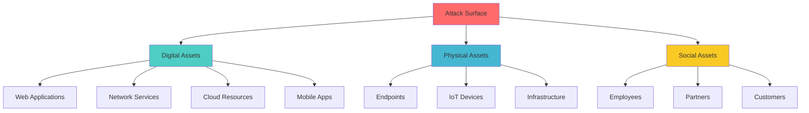
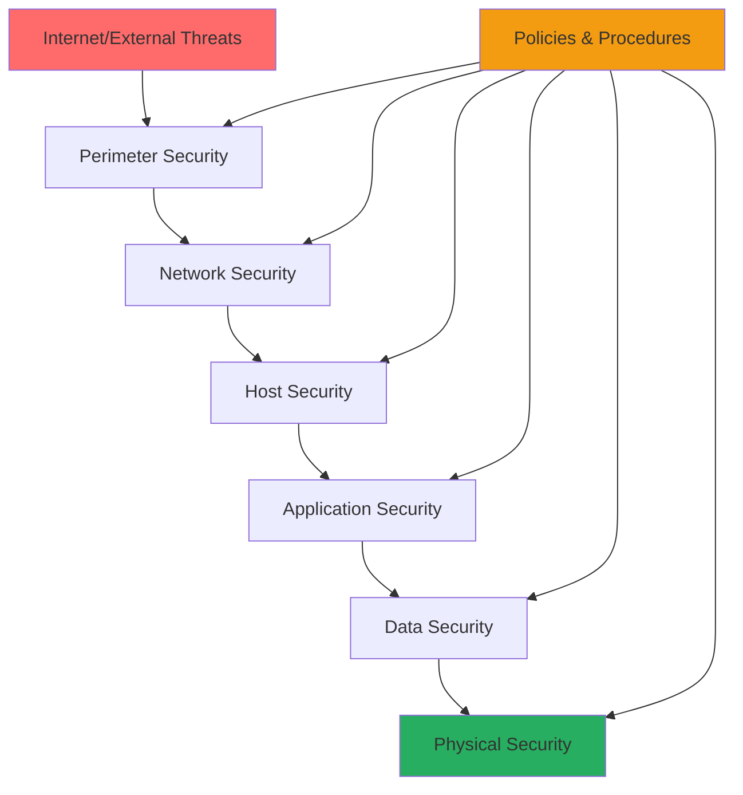

# Attack Prevention Strategies
## Unit II: Account & Data Security
### Lecture 14: Proactive Security Measures and Defense in Depth

<div class="absolute bottom-5 left-5 text-xs text-gray-500">
Course: Cyber Security (4353204) | Semester V | Diploma ICT | Author: Milav Dabgar
</div>

---
layout: default
---

# Introduction to Attack Prevention

<div class="grid grid-cols-2 gap-6">

<div>

## 🛡️ Prevention Philosophy

**Attack Prevention** focuses on stopping security threats before they can cause damage to systems and data.

### 🎯 Prevention Principles
- **Proactive defense** over reactive response
- **Defense in depth** - Multiple security layers
- **Assume breach** mentality
- **Continuous improvement** of defenses
- **Risk-based** security approach

### 📊 Prevention vs. Response Costs
```yaml
Cost Comparison (Per Incident):
  Prevention:
    - Security tools: $1,000-$5,000
    - Training: $500-$2,000
    - Monitoring: $1,000-$3,000
    
  Incident Response:
    - Direct costs: $50,000-$500,000
    - Business disruption: $100,000-$2M
    - Reputation damage: $500,000-$5M
    
  ROI of Prevention: 10:1 to 100:1
```

</div>

<div>

## 🎯 Attack Surface Management

### 📋 Attack Surface Components


### 🔍 Surface Reduction Strategies
- **Asset inventory** and classification
- **Unnecessary service** elimination
- **Access control** implementation
- **Security hardening** of systems
- **Regular vulnerability** assessments

### 📈 Threat Landscape Evolution
- **Cloud-first** attack strategies
- **Supply chain** compromises
- **AI-powered** attacks
- **Zero-day** exploitation
- **Living-off-the-land** techniques

</div>

</div>

<div class="absolute bottom-5 left-5 text-xs text-gray-500">
Course: Cyber Security (4353204) | Unit II | Lecture 14 | Author: Milav Dabgar
</div>

---
layout: default
---

# Defense in Depth Strategy

<div class="grid grid-cols-2 gap-6">

<div>

## 🏗️ Layered Security Model

### 📊 Defense Layers


### 🛡️ Layer Implementation
```yaml
Defense Layers:
  Perimeter Security:
    - Firewalls (Network, Web Application)
    - DDoS protection
    - VPN gateways
    - Email security gateways
    
  Network Security:
    - Network segmentation
    - Intrusion Detection/Prevention
    - Network Access Control (NAC)
    - Wireless security
    
  Host Security:
    - Endpoint protection
    - Host-based firewalls
    - Anti-malware solutions
    - Configuration management
    
  Application Security:
    - Secure coding practices
    - Application firewalls
    - Input validation
    - Authentication systems
    
  Data Security:
    - Encryption at rest/transit
    - Data Loss Prevention (DLP)
    - Access controls
    - Backup and recovery
```

</div>

<div>

## 🔧 Implementation Framework

### 📋 Security Control Categories
```python
class SecurityControlFramework:
    def __init__(self):
        self.control_types = {
            'preventive': {
                'description': 'Stop security incidents',
                'examples': ['Firewalls', 'Access controls', 'Encryption'],
                'effectiveness': 'High prevention, Low detection'
            },
            'detective': {
                'description': 'Identify security incidents',
                'examples': ['SIEM', 'IDS', 'Log monitoring'],
                'effectiveness': 'Low prevention, High detection'
            },
            'corrective': {
                'description': 'Fix security incidents',
                'examples': ['Incident response', 'Patches', 'Backups'],
                'effectiveness': 'Post-incident recovery'
            },
            'deterrent': {
                'description': 'Discourage attacks',
                'examples': ['Security policies', 'Legal warnings'],
                'effectiveness': 'Psychological barrier'
            },
            'compensating': {
                'description': 'Alternative controls',
                'examples': ['Manual reviews', 'Additional monitoring'],
                'effectiveness': 'Risk mitigation'
            }
        }
    
    def design_control_mix(self, risk_profile):
        """Design appropriate control mix based on risk"""
        recommended_controls = []
        
        if risk_profile['threat_level'] == 'HIGH':
            recommended_controls.extend([
                'Multi-layered preventive controls',
                'Real-time detective controls',
                'Automated corrective controls'
            ])
        
        return self._optimize_control_selection(recommended_controls)
```

### 🎯 Control Effectiveness Matrix
| Control Type | Prevention | Detection | Response | Cost |
|--------------|------------|-----------|----------|------|
| Firewall | High | Low | Low | Medium |
| IDS/IPS | Medium | High | Medium | Medium |
| SIEM | Low | High | High | High |
| Endpoint Protection | High | High | Medium | Low |
| User Training | High | Low | Low | Low |

</div>

</div>

<div class="absolute bottom-5 left-5 text-xs text-gray-500">
Course: Cyber Security (4353204) | Unit II | Lecture 14 | Author: Milav Dabgar
</div>

---
layout: default
---

# Network Security Prevention

<div class="grid grid-cols-2 gap-6">

<div>

## 🌐 Network Perimeter Defense

### 🔥 Advanced Firewall Systems
```python
class NextGenFirewall:
    def __init__(self):
        self.capabilities = {
            'traditional_filtering': True,
            'application_awareness': True,
            'user_identification': True,
            'threat_prevention': True,
            'ssl_inspection': True
        }
        self.rules = []
    
    def create_security_rule(self, rule_config):
        """Create comprehensive security rule"""
        rule = {
            'source_zone': rule_config['from_zone'],
            'destination_zone': rule_config['to_zone'],
            'source_address': rule_config['source'],
            'destination_address': rule_config['destination'],
            'application': rule_config['app'],
            'service': rule_config['service'],
            'user': rule_config.get('user', 'any'),
            'action': rule_config['action'],
            'security_profiles': {
                'antivirus': rule_config.get('av_profile', 'default'),
                'anti_spyware': rule_config.get('as_profile', 'default'),
                'vulnerability': rule_config.get('vuln_profile', 'default'),
                'url_filtering': rule_config.get('url_profile', 'default'),
                'file_blocking': rule_config.get('file_profile', 'default')
            }
        }
        
        self.rules.append(rule)
        return rule

# Example firewall rule configuration
firewall_rules = [
    {
        'from_zone': 'untrust',
        'to_zone': 'DMZ',
        'source': 'any',
        'destination': 'web-servers',
        'app': 'web-browsing',
        'service': 'service-https',
        'action': 'allow',
        'av_profile': 'strict',
        'url_profile': 'block-malicious'
    }
]
```

### 🕳️ Network Segmentation
```yaml
Network Segmentation Strategy:
  DMZ (Demilitarized Zone):
    - Web servers
    - Email servers
    - DNS servers
    - Security: Medium trust
    
  Internal Network:
    - User workstations
    - Internal applications
    - File servers
    - Security: High trust
    
  Critical Assets Zone:
    - Database servers
    - Domain controllers
    - Financial systems
    - Security: Highest trust
    
  Guest Network:
    - Visitor access
    - IoT devices
    - Temporary systems
    - Security: No trust
```

</div>

<div>

## 🚨 Intrusion Prevention Systems

### 🔍 IPS Detection Methods
```python
class IntrusionPreventionSystem:
    def __init__(self):
        self.detection_methods = {
            'signature_based': SignatureEngine(),
            'anomaly_based': AnomalyEngine(),
            'protocol_analysis': ProtocolEngine(),
            'behavioral_analysis': BehavioralEngine()
        }
        self.response_actions = [
            'block_ip',
            'drop_packets',
            'reset_connection',
            'alert_admin',
            'quarantine_host'
        ]
    
    def analyze_traffic(self, network_packet):
        """Analyze network traffic for threats"""
        threat_indicators = []
        
        for method_name, engine in self.detection_methods.items():
            result = engine.analyze(network_packet)
            if result['threat_detected']:
                threat_indicators.append({
                    'method': method_name,
                    'threat_type': result['threat_type'],
                    'confidence': result['confidence'],
                    'severity': result['severity']
                })
        
        if threat_indicators:
            return self._determine_response(threat_indicators)
        
        return {'action': 'allow', 'reason': 'no_threats_detected'}
    
    def _determine_response(self, threats):
        """Determine appropriate response based on threat level"""
        max_severity = max(t['severity'] for t in threats)
        
        if max_severity >= 8:  # Critical
            return {
                'action': 'block_ip',
                'duration': 3600,  # 1 hour
                'alert_level': 'critical'
            }
        elif max_severity >= 6:  # High
            return {
                'action': 'drop_packets',
                'alert_level': 'high'
            }
        else:  # Medium/Low
            return {
                'action': 'alert_admin',
                'alert_level': 'medium'
            }
```

### 📊 IPS Signature Categories
```yaml
Attack Signatures:
  Network Attacks:
    - Port scans
    - DoS/DDoS attempts
    - Protocol anomalies
    - Network reconnaissance
    
  Application Attacks:
    - SQL injection
    - Cross-site scripting
    - Buffer overflows
    - Command injection
    
  Malware Signatures:
    - Botnet communications
    - Malware downloads
    - C2 traffic patterns
    - Data exfiltration
    
  Policy Violations:
    - Unauthorized protocols
    - Forbidden applications
    - Suspicious file transfers
    - Policy compliance
```

</div>

</div>

<div class="absolute bottom-5 left-5 text-xs text-gray-500">
Course: Cyber Security (4353204) | Unit II | Lecture 14 | Author: Milav Dabgar
</div>

---
layout: default
---

# Endpoint Protection Strategies

<div class="grid grid-cols-2 gap-6">

<div>

## 💻 Endpoint Hardening

### 🔒 System Hardening Checklist
```yaml
Operating System Hardening:
  Windows:
    - Disable unnecessary services
    - Configure Windows Defender
    - Enable Windows Firewall
    - Implement AppLocker policies
    - Configure User Account Control (UAC)
    - Disable autorun for removable media
    
  Linux:
    - Remove unused packages
    - Configure iptables/netfilter
    - Implement SELinux/AppArmor
    - Secure SSH configuration
    - Configure file permissions
    - Enable audit logging
    
  macOS:
    - Enable System Integrity Protection
    - Configure Gatekeeper
    - Enable FileVault encryption
    - Configure built-in firewall
    - Disable automatic login
    - Enable security updates
```

### 🛠️ Configuration Management
```python
class EndpointHardeningManager:
    def __init__(self):
        self.hardening_profiles = {
            'high_security': {
                'password_policy': {
                    'min_length': 14,
                    'complexity': True,
                    'expiration_days': 90,
                    'history_count': 24
                },
                'account_lockout': {
                    'threshold': 3,
                    'duration_minutes': 30,
                    'reset_time_minutes': 30
                },
                'services': {
                    'unnecessary_services': 'disable',
                    'remote_desktop': 'disable',
                    'file_sharing': 'disable'
                },
                'network': {
                    'firewall_enabled': True,
                    'ping_response': False,
                    'admin_shares': False
                }
            },
            'standard': {
                # Standard security configuration
            },
            'developer': {
                # Developer-friendly configuration
            }
        }
    
    def apply_hardening_profile(self, endpoint, profile_name):
        """Apply hardening profile to endpoint"""
        if profile_name not in self.hardening_profiles:
            raise ValueError(f"Profile {profile_name} not found")
        
        profile = self.hardening_profiles[profile_name]
        results = {}
        
        # Apply password policy
        results['password_policy'] = self._apply_password_policy(
            endpoint, profile['password_policy']
        )
        
        # Configure services
        results['services'] = self._configure_services(
            endpoint, profile['services']
        )
        
        # Network configuration
        results['network'] = self._configure_network(
            endpoint, profile['network']
        )
        
        return results
    
    def validate_compliance(self, endpoint, profile_name):
        """Validate endpoint compliance with hardening profile"""
        profile = self.hardening_profiles[profile_name]
        compliance_results = []
        
        # Check each configuration item
        for category, settings in profile.items():
            for setting, expected_value in settings.items():
                actual_value = self._get_current_setting(endpoint, category, setting)
                is_compliant = actual_value == expected_value
                
                compliance_results.append({
                    'category': category,
                    'setting': setting,
                    'expected': expected_value,
                    'actual': actual_value,
                    'compliant': is_compliant
                })
        
        return compliance_results
```

</div>

<div>

## 🔐 Application Control

### 📋 Application Whitelisting
```python
class ApplicationControlManager:
    def __init__(self):
        self.whitelist_policies = {
            'executable_paths': [
                'C:\\Program Files\\*',
                'C:\\Program Files (x86)\\*',
                'C:\\Windows\\System32\\*',
                'C:\\Windows\\SysWOW64\\*'
            ],
            'trusted_publishers': [
                'Microsoft Corporation',
                'Adobe Systems Incorporated',
                'Google LLC'
            ],
            'file_hash_whitelist': set(),
            'script_policies': {
                'powershell_execution_policy': 'RemoteSigned',
                'allow_unsigned_scripts': False,
                'block_office_macros': True
            }
        }
    
    def evaluate_application(self, app_info):
        """Evaluate if application should be allowed to execute"""
        checks = []
        
        # Path-based check
        path_allowed = any(
            app_info['path'].startswith(allowed_path.replace('*', ''))
            for allowed_path in self.whitelist_policies['executable_paths']
        )
        checks.append(('path_check', path_allowed))
        
        # Publisher check
        publisher_trusted = app_info.get('publisher') in \
                           self.whitelist_policies['trusted_publishers']
        checks.append(('publisher_check', publisher_trusted))
        
        # Hash check
        hash_whitelisted = app_info.get('hash') in \
                          self.whitelist_policies['file_hash_whitelist']
        checks.append(('hash_check', hash_whitelisted))
        
        # Overall decision
        allow_execution = any(result for check, result in checks)
        
        return {
            'decision': 'ALLOW' if allow_execution else 'BLOCK',
            'checks_performed': checks,
            'reason': self._generate_reason(checks)
        }

# Example usage
app_control = ApplicationControlManager()

suspicious_app = {
    'path': 'C:\\Users\\user\\Downloads\\suspicious.exe',
    'publisher': 'Unknown Publisher',
    'hash': 'abc123...'
}

result = app_control.evaluate_application(suspicious_app)
# Result: {'decision': 'BLOCK', 'reason': 'Untrusted location and publisher'}
```

### 🛡️ Privilege Management
```yaml
Privilege Escalation Prevention:
  User Account Control (UAC):
    - Admin approval mode
    - Secure desktop prompts
    - Application elevation requests
    - Built-in administrator account handling
    
  Principle of Least Privilege:
    - Standard user accounts for daily work
    - Separate admin accounts for administration
    - Just-in-time (JIT) privilege elevation
    - Time-limited administrative sessions
    
  Privileged Access Management (PAM):
    - Password vaulting for admin accounts
    - Session recording and monitoring
    - Automated password rotation
    - Emergency access procedures
```

</div>

</div>

<div class="absolute bottom-5 left-5 text-xs text-gray-500">
Course: Cyber Security (4353204) | Unit II | Lecture 14 | Author: Milav Dabgar
</div>

---
layout: default
---

# Email and Web Security

<div class="grid grid-cols-2 gap-6">

<div>

## 📧 Email Security Gateways

### 🔒 Multi-Layer Email Protection
```python
class EmailSecurityGateway:
    def __init__(self):
        self.security_layers = [
            'reputation_filtering',
            'content_filtering',
            'attachment_scanning',
            'url_protection',
            'advanced_threat_protection'
        ]
        self.threat_categories = {
            'spam': {'action': 'quarantine', 'threshold': 85},
            'phishing': {'action': 'block', 'threshold': 70},
            'malware': {'action': 'block', 'threshold': 1},
            'ransomware': {'action': 'block', 'threshold': 1}
        }
    
    def process_email(self, email_message):
        """Process incoming email through security layers"""
        results = {}
        overall_risk_score = 0
        
        # Layer 1: Reputation filtering
        sender_reputation = self._check_sender_reputation(email_message)
        results['sender_reputation'] = sender_reputation
        overall_risk_score += sender_reputation['risk_score']
        
        # Layer 2: Content analysis
        content_analysis = self._analyze_content(email_message)
        results['content_analysis'] = content_analysis
        overall_risk_score += content_analysis['risk_score']
        
        # Layer 3: Attachment scanning
        attachment_results = self._scan_attachments(email_message)
        results['attachment_scan'] = attachment_results
        overall_risk_score += attachment_results['risk_score']
        
        # Layer 4: URL analysis
        url_analysis = self._analyze_urls(email_message)
        results['url_analysis'] = url_analysis
        overall_risk_score += url_analysis['risk_score']
        
        # Layer 5: Advanced threat detection
        atp_results = self._advanced_threat_protection(email_message)
        results['atp_analysis'] = atp_results
        overall_risk_score += atp_results['risk_score']
        
        # Make final decision
        final_action = self._determine_action(overall_risk_score, results)
        
        return {
            'action': final_action,
            'risk_score': overall_risk_score,
            'layer_results': results,
            'threat_summary': self._generate_threat_summary(results)
        }
    
    def _analyze_attachments(self, email):
        """Analyze email attachments for threats"""
        risk_score = 0
        attachment_results = []
        
        for attachment in email.get('attachments', []):
            # File type analysis
            file_type_risk = self._assess_file_type_risk(attachment['filename'])
            
            # Malware scanning
            malware_scan = self._scan_for_malware(attachment['content'])
            
            # Sandbox analysis for executables
            if attachment['filename'].endswith(('.exe', '.scr', '.bat')):
                sandbox_result = self._sandbox_analyze(attachment['content'])
                risk_score += sandbox_result['risk_score']
            
            attachment_results.append({
                'filename': attachment['filename'],
                'file_type_risk': file_type_risk,
                'malware_detected': malware_scan['detected'],
                'risk_score': file_type_risk + malware_scan['risk_score']
            })
            
            risk_score += file_type_risk + malware_scan['risk_score']
        
        return {
            'risk_score': min(risk_score, 100),  # Cap at 100
            'attachments': attachment_results
        }
```

</div>

<div>

## 🌐 Web Security Controls

### 🔍 Web Content Filtering
```yaml
Web Filtering Categories:
  Security Threats:
    - Malware distribution sites
    - Phishing websites
    - Botnet command & control
    - Exploit kits
    - Suspicious downloads
    
  Productivity Control:
    - Social media platforms
    - Streaming services
    - Gaming websites
    - Personal email
    - Shopping sites
    
  Compliance Requirements:
    - Adult content
    - Gambling sites
    - Illegal content
    - Copyright infringement
    - Regulatory violations
    
  Bandwidth Management:
    - Video streaming
    - File sharing (P2P)
    - Cloud storage uploads
    - Software updates
    - Large downloads
```

### 🛡️ Web Application Firewall (WAF)
```python
class WebApplicationFirewall:
    def __init__(self):
        self.attack_patterns = {
            'sql_injection': [
                r'(\%27)|(\')|(\-\-)|(\%23)|(#)',
                r'((\%3D)|(=))[^\n]*((\%27)|(\')|(\-\-)|(\%3B)|(;))',
                r'\w*((\%27)|(\'))((\%6F)|o|(\%4F))((\%72)|r|(\%52))'
            ],
            'xss': [
                r'<[^>]*script[^>]*>',
                r'javascript:',
                r'vbscript:',
                r'onload\s*=',
                r'onerror\s*='
            ],
            'path_traversal': [
                r'\.\./',
                r'\.\.\\',
                r'%2e%2e%2f',
                r'%2e%2e%5c'
            ],
            'command_injection': [
                r';.*ls.*',
                r';.*cat.*',
                r';.*rm.*',
                r'\|.*whoami.*'
            ]
        }
        self.rate_limiting = {
            'requests_per_minute': 100,
            'burst_threshold': 20,
            'blacklist_duration': 300  # 5 minutes
        }
    
    def analyze_request(self, http_request):
        """Analyze HTTP request for attacks"""
        threat_indicators = []
        
        # Check for attack patterns
        for attack_type, patterns in self.attack_patterns.items():
            for pattern in patterns:
                if self._pattern_matches(pattern, http_request):
                    threat_indicators.append({
                        'type': attack_type,
                        'pattern': pattern,
                        'severity': self._get_attack_severity(attack_type)
                    })
        
        # Rate limiting check
        rate_limit_exceeded = self._check_rate_limiting(http_request['client_ip'])
        if rate_limit_exceeded:
            threat_indicators.append({
                'type': 'rate_limit_exceeded',
                'severity': 'medium'
            })
        
        # Determine action
        if threat_indicators:
            max_severity = max(t['severity'] for t in threat_indicators)
            if max_severity == 'high':
                return {'action': 'block', 'threats': threat_indicators}
            else:
                return {'action': 'monitor', 'threats': threat_indicators}
        
        return {'action': 'allow', 'threats': []}
```

</div>

</div>

<div class="absolute bottom-5 left-5 text-xs text-gray-500">
Course: Cyber Security (4353204) | Unit II | Lecture 14 | Author: Milav Dabgar
</div>

---
layout: default
---

# Identity and Access Prevention

<div class="grid grid-cols-2 gap-6">

<div>

## 🔐 Multi-Factor Authentication

### 🛡️ MFA Implementation Strategy
```python
class MultiFactorAuthentication:
    def __init__(self):
        self.factors = {
            'something_you_know': [
                'password', 'pin', 'security_questions', 'passphrase'
            ],
            'something_you_have': [
                'sms_token', 'hardware_token', 'mobile_app', 'smart_card'
            ],
            'something_you_are': [
                'fingerprint', 'face_recognition', 'iris_scan', 'voice_print'
            ]
        }
        self.risk_levels = {
            'low': {'factors_required': 1, 'factor_types': 1},
            'medium': {'factors_required': 2, 'factor_types': 2},
            'high': {'factors_required': 3, 'factor_types': 2},
            'critical': {'factors_required': 3, 'factor_types': 3}
        }
    
    def evaluate_authentication_request(self, user, resource, context):
        """Evaluate authentication requirements based on risk"""
        risk_score = self._calculate_risk_score(user, resource, context)
        risk_level = self._determine_risk_level(risk_score)
        
        requirements = self.risk_levels[risk_level]
        
        return {
            'risk_level': risk_level,
            'factors_required': requirements['factors_required'],
            'factor_types_required': requirements['factor_types'],
            'recommended_factors': self._recommend_factors(user, risk_level)
        }
    
    def _calculate_risk_score(self, user, resource, context):
        """Calculate authentication risk score"""
        risk_score = 0
        
        # User risk factors
        if user['account_age_days'] < 30:
            risk_score += 20
        if user['failed_logins_24h'] > 3:
            risk_score += 30
        if user['privileged_account']:
            risk_score += 25
        
        # Resource risk factors
        if resource['classification'] == 'confidential':
            risk_score += 30
        if resource['contains_pii']:
            risk_score += 25
        
        # Context risk factors
        if context['location_new']:
            risk_score += 35
        if context['device_new']:
            risk_score += 25
        if context['time_unusual']:
            risk_score += 15
        if context['network_untrusted']:
            risk_score += 40
        
        return min(risk_score, 100)  # Cap at 100
    
    def validate_mfa_factors(self, provided_factors):
        """Validate provided MFA factors"""
        validation_results = []
        
        for factor in provided_factors:
            result = self._validate_individual_factor(factor)
            validation_results.append(result)
        
        # Check if requirements are met
        valid_factors = [r for r in validation_results if r['valid']]
        unique_types = set(f['type'] for f in valid_factors)
        
        return {
            'authentication_successful': len(valid_factors) >= 2 and len(unique_types) >= 2,
            'factors_validated': len(valid_factors),
            'factor_types_validated': len(unique_types),
            'validation_details': validation_results
        }
```

</div>

<div>

## 🚫 Privileged Access Controls

### 👑 Privileged Account Management
```yaml
PAM Implementation:
  Account Discovery:
    - Automated scanning for privileged accounts
    - Service account identification
    - Shared account detection
    - Orphaned account cleanup
    
  Password Management:
    - Centralized password vault
    - Automated password rotation
    - Complex password generation
    - Secure password sharing
    
  Session Management:
    - Just-in-time access provisioning
    - Session recording and monitoring
    - Time-limited access grants
    - Automatic session termination
    
  Access Control:
    - Dual approval workflows
    - Emergency access procedures
    - Risk-based access decisions
    - Segregation of duties enforcement
```

### 🔒 Zero Trust Access Model
```python
class ZeroTrustAccessControl:
    def __init__(self):
        self.trust_factors = {
            'user_identity': {'weight': 25, 'verified': False},
            'device_health': {'weight': 20, 'score': 0},
            'network_location': {'weight': 15, 'trusted': False},
            'behavior_analysis': {'weight': 25, 'anomaly_score': 0},
            'resource_sensitivity': {'weight': 15, 'classification': 'public'}
        }
        self.access_threshold = 70  # Minimum trust score for access
    
    def evaluate_access_request(self, access_request):
        """Evaluate access request using Zero Trust principles"""
        trust_score = 0
        evaluation_details = {}
        
        # User identity verification
        identity_score = self._verify_user_identity(access_request['user'])
        trust_score += identity_score * (self.trust_factors['user_identity']['weight'] / 100)
        evaluation_details['identity'] = identity_score
        
        # Device health assessment
        device_score = self._assess_device_health(access_request['device'])
        trust_score += device_score * (self.trust_factors['device_health']['weight'] / 100)
        evaluation_details['device_health'] = device_score
        
        # Network location verification
        location_score = self._verify_network_location(access_request['source_ip'])
        trust_score += location_score * (self.trust_factors['network_location']['weight'] / 100)
        evaluation_details['network_location'] = location_score
        
        # Behavioral analysis
        behavior_score = self._analyze_user_behavior(access_request['user'], access_request['context'])
        trust_score += behavior_score * (self.trust_factors['behavior_analysis']['weight'] / 100)
        evaluation_details['behavior'] = behavior_score
        
        # Resource sensitivity assessment
        resource_score = self._assess_resource_sensitivity(access_request['resource'])
        # For sensitive resources, we decrease the trust score
        sensitivity_penalty = (100 - resource_score) * (self.trust_factors['resource_sensitivity']['weight'] / 100)
        trust_score -= sensitivity_penalty
        evaluation_details['resource_sensitivity'] = resource_score
        
        # Make access decision
        access_granted = trust_score >= self.access_threshold
        
        return {
            'access_granted': access_granted,
            'trust_score': round(trust_score, 2),
            'threshold': self.access_threshold,
            'evaluation_details': evaluation_details,
            'additional_verification': self._determine_additional_verification(trust_score)
        }
    
    def _determine_additional_verification(self, trust_score):
        """Determine if additional verification is needed"""
        if trust_score < 40:
            return ['multi_factor_authentication', 'manager_approval']
        elif trust_score < 60:
            return ['multi_factor_authentication']
        else:
            return []
```

</div>

</div>

<div class="absolute bottom-5 left-5 text-xs text-gray-500">
Course: Cyber Security (4353204) | Unit II | Lecture 14 | Author: Milav Dabgar
</div>

---
layout: default
---

# Data Protection Strategies

<div class="grid grid-cols-2 gap-6">

<div>

## 🔒 Data Loss Prevention (DLP)

### 📊 DLP Implementation Framework
```python
class DataLossPreventionSystem:
    def __init__(self):
        self.data_classifications = {
            'public': {'protection_level': 1, 'actions': ['log']},
            'internal': {'protection_level': 2, 'actions': ['log', 'encrypt']},
            'confidential': {'protection_level': 3, 'actions': ['log', 'encrypt', 'approve']},
            'restricted': {'protection_level': 4, 'actions': ['log', 'encrypt', 'approve', 'block']}
        }
        self.detection_patterns = {
            'credit_card': r'\b\d{4}[\s\-]?\d{4}[\s\-]?\d{4}[\s\-]?\d{4}\b',
            'ssn': r'\b\d{3}-\d{2}-\d{4}\b',
            'email': r'\b[A-Za-z0-9._%+-]+@[A-Za-z0-9.-]+\.[A-Z|a-z]{2,}\b',
            'phone': r'\b\d{3}[\-\.]?\d{3}[\-\.]?\d{4}\b',
            'ip_address': r'\b(?:[0-9]{1,3}\.){3}[0-9]{1,3}\b'
        }
        self.channels = ['email', 'web', 'usb', 'print', 'cloud']
    
    def scan_content(self, content, channel, user_context):
        """Scan content for sensitive data"""
        findings = []
        
        # Pattern-based detection
        for data_type, pattern in self.detection_patterns.items():
            matches = re.findall(pattern, content)
            if matches:
                findings.append({
                    'type': 'pattern_match',
                    'data_type': data_type,
                    'matches': len(matches),
                    'confidence': 0.9
                })
        
        # Machine learning classification
        ml_classification = self._classify_content_ml(content)
        if ml_classification['confidence'] > 0.7:
            findings.append({
                'type': 'ml_classification',
                'data_type': ml_classification['class'],
                'confidence': ml_classification['confidence']
            })
        
        # Determine overall classification and actions
        if findings:
            classification = self._determine_classification(findings)
            required_actions = self.data_classifications[classification]['actions']
            
            return {
                'sensitive_data_detected': True,
                'classification': classification,
                'findings': findings,
                'required_actions': required_actions,
                'recommended_response': self._generate_response(channel, classification, user_context)
            }
        
        return {
            'sensitive_data_detected': False,
            'classification': 'public',
            'required_actions': ['log']
        }
    
    def enforce_policy(self, scan_result, transmission_details):
        """Enforce DLP policy based on scan results"""
        actions_taken = []
        
        for action in scan_result['required_actions']:
            if action == 'log':
                self._log_transmission(transmission_details, scan_result)
                actions_taken.append('logged')
            
            elif action == 'encrypt':
                if self._encrypt_content(transmission_details):
                    actions_taken.append('encrypted')
            
            elif action == 'approve':
                approval_result = self._request_approval(transmission_details, scan_result)
                if not approval_result['approved']:
                    return {'blocked': True, 'reason': 'approval_denied'}
                actions_taken.append('approved')
            
            elif action == 'block':
                return {'blocked': True, 'reason': 'policy_violation'}
        
        return {'blocked': False, 'actions_taken': actions_taken}
```

</div>

<div>

## 💾 Backup and Recovery Prevention

### 🔄 Backup Strategy Framework
```yaml
3-2-1 Backup Rule:
  3 Copies: Original + 2 backups
  2 Media Types: Different storage technologies
  1 Offsite: Geographic separation
  
Backup Types:
  Full Backup:
    - Complete data copy
    - Frequency: Weekly/Monthly
    - Recovery: Single restore point
    - Storage: High requirement
    
  Incremental Backup:
    - Changes since last backup
    - Frequency: Daily
    - Recovery: Multiple restore points
    - Storage: Low requirement
    
  Differential Backup:
    - Changes since last full backup
    - Frequency: Daily
    - Recovery: Full + last differential
    - Storage: Medium requirement
    
  Continuous Data Protection:
    - Real-time backup
    - Frequency: Continuous
    - Recovery: Point-in-time
    - Storage: Very high requirement
```

### 🛡️ Ransomware-Resistant Backups
```python
class RansomwareResistantBackup:
    def __init__(self):
        self.backup_tiers = {
            'tier_1': {  # Production backups
                'immutable_period': 30,  # days
                'encryption': True,
                'air_gapped': False,
                'retention': 90  # days
            },
            'tier_2': {  # Long-term retention
                'immutable_period': 365,  # days
                'encryption': True,
                'air_gapped': True,
                'retention': 2555  # 7 years
            }
        }
        self.integrity_checks = ['hash_verification', 'digital_signatures', 'blockchain_anchoring']
    
    def create_immutable_backup(self, data, tier='tier_1'):
        """Create ransomware-resistant immutable backup"""
        tier_config = self.backup_tiers[tier]
        
        # Encrypt data
        encrypted_data = self._encrypt_backup_data(data)
        
        # Create integrity hashes
        integrity_hash = self._calculate_integrity_hash(encrypted_data)
        
        # Store in immutable storage
        backup_id = self._store_immutable(
            encrypted_data, 
            tier_config['immutable_period']
        )
        
        # Create backup metadata
        metadata = {
            'backup_id': backup_id,
            'timestamp': datetime.now().isoformat(),
            'tier': tier,
            'integrity_hash': integrity_hash,
            'encryption_key_id': self._get_encryption_key_id(),
            'immutable_until': self._calculate_immutable_expiry(
                tier_config['immutable_period']
            )
        }
        
        # Store metadata separately
        self._store_backup_metadata(backup_id, metadata)
        
        return {
            'backup_id': backup_id,
            'success': True,
            'immutable_until': metadata['immutable_until']
        }
    
    def verify_backup_integrity(self, backup_id):
        """Verify backup hasn't been tampered with"""
        metadata = self._retrieve_backup_metadata(backup_id)
        backup_data = self._retrieve_backup_data(backup_id)
        
        # Verify integrity hash
        current_hash = self._calculate_integrity_hash(backup_data)
        if current_hash != metadata['integrity_hash']:
            return {
                'integrity_verified': False,
                'issue': 'hash_mismatch',
                'backup_compromised': True
            }
        
        # Check immutable period
        if datetime.now() < datetime.fromisoformat(metadata['immutable_until']):
            immutable_status = 'protected'
        else:
            immutable_status = 'expired'
        
        return {
            'integrity_verified': True,
            'immutable_status': immutable_status,
            'backup_compromised': False
        }
    
    def automated_recovery_testing(self):
        """Automated testing of backup recovery procedures"""
        test_results = []
        
        for backup_id in self._get_recent_backups():
            try:
                # Test backup integrity
                integrity_result = self.verify_backup_integrity(backup_id)
                
                # Test recovery process
                recovery_result = self._test_recovery_process(backup_id)
                
                test_results.append({
                    'backup_id': backup_id,
                    'integrity_test': integrity_result,
                    'recovery_test': recovery_result,
                    'overall_status': 'PASS' if integrity_result['integrity_verified'] and 
                                                recovery_result['successful'] else 'FAIL'
                })
                
            except Exception as e:
                test_results.append({
                    'backup_id': backup_id,
                    'overall_status': 'ERROR',
                    'error_message': str(e)
                })
        
        return test_results
```

</div>

</div>

<div class="absolute bottom-5 left-5 text-xs text-gray-500">
Course: Cyber Security (4353204) | Unit II | Lecture 14 | Author: Milav Dabgar
</div>

---
layout: default
---

# Practical Exercise: Defense Strategy Design

<div class="exercise-container">

## 🎯 Comprehensive Activity (35 minutes)

### Scenario: Multi-Layered Defense Implementation

Design a comprehensive attack prevention strategy for a mid-size financial services company with the following profile:

**Company Profile:**
- **Industry:** Financial Services (Investment Management)
- **Size:** 500 employees, $2B assets under management
- **Locations:** Main office + 3 branch offices
- **Compliance:** SEC, SOX, PCI-DSS, GDPR
- **Technology:** Mixed cloud/on-premise infrastructure
- **Threat Level:** High (financial sector targeting)

**Current Security Incidents (Last 12 Months):**
- 15 phishing attempts (3 successful)
- 2 ransomware attempts (1 successful, minimal impact)
- 8 malware infections (all contained)
- 12 policy violations (USB usage, unauthorized software)
- 1 insider threat incident (terminated employee)

### Phase 1: Threat Assessment and Prioritization (10 minutes)

**Task 1: Threat Modeling**
1. **Primary Threat Vectors:**
   - Identify the top 5 attack vectors for this organization
   - Rank by likelihood and potential impact
   - Consider industry-specific threats

2. **Attack Surface Analysis:**
   - Map the organization's attack surface
   - Identify critical assets requiring protection
   - Prioritize protection efforts

**Deliverable:** Threat assessment matrix with risk scores

### Phase 2: Defense Strategy Design (15 minutes)

**Task 2: Layered Defense Architecture**
Design defense-in-depth strategy covering:

1. **Perimeter Security:**
   - Firewall configuration strategy
   - Email security requirements
   - Web filtering policies

2. **Network Security:**
   - Network segmentation plan
   - IDS/IPS deployment strategy
   - Network access control requirements

3. **Endpoint Protection:**
   - Endpoint security solution selection
   - Device hardening standards
   - Application control policies

4. **Data Protection:**
   - DLP implementation strategy
   - Encryption requirements
   - Backup and recovery procedures

5. **Identity and Access:**
   - MFA implementation plan
   - Privileged access management
   - Zero trust considerations

**Deliverable:** Defense architecture diagram and policy framework

### Phase 3: Implementation and Monitoring (10 minutes)

**Task 3: Implementation Roadmap**
1. **Phased Implementation:**
   - 90-day quick wins
   - 6-month strategic initiatives  
   - 12-month advanced capabilities

2. **Success Metrics:**
   - Define KPIs for each defense layer
   - Establish monitoring and alerting
   - Plan regular assessments

3. **Budget and Resources:**
   - Estimate implementation costs
   - Identify required personnel
   - Calculate ROI projections

**Deliverable:** Implementation timeline with budget estimates

### Group Presentation Format:
- 5 minutes per group
- Focus on most critical recommendations
- Justify technology and strategy choices
- Address compliance requirements

</div>

<style>
.exercise-container {
  @apply bg-purple-50 border-2 border-purple-300 rounded-lg p-6;
}
</style>

<div class="absolute bottom-5 left-5 text-xs text-gray-500">
Course: Cyber Security (4353204) | Unit II | Lecture 14 | Author: Milav Dabgar
</div>

---
layout: center
class: text-center
---

# Questions & Discussion

## 🤔 Discussion Points:
- Which defense layer provides the best ROI for this organization?
- How do you balance security controls with business productivity?
- What are the biggest challenges in implementing defense-in-depth?

### 💡 Exercise Review
Present your defense strategies and discuss different approaches to multi-layered security

<div class="absolute bottom-5 left-5 text-xs text-gray-500">
Course: Cyber Security (4353204) | Unit II | Lecture 14 | Author: Milav Dabgar
</div>

---
layout: center
class: text-center
---

# Thank You!

## Next Lecture: Security Monitoring and Response
### Detecting and Responding to Security Incidents

<div class="pt-8 text-gray-500">
  <p>Cyber Security (4353204) - Lecture 14 Complete</p>
  <p>Prevention is better than cure! 🛡️⚡</p>
</div>

<div class="absolute bottom-5 left-5 text-xs text-gray-500">
Course: Cyber Security (4353204) | Unit II | Lecture 14 | Author: Milav Dabgar
</div>