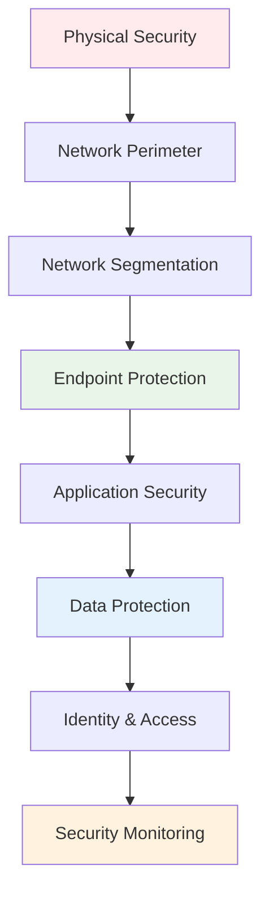
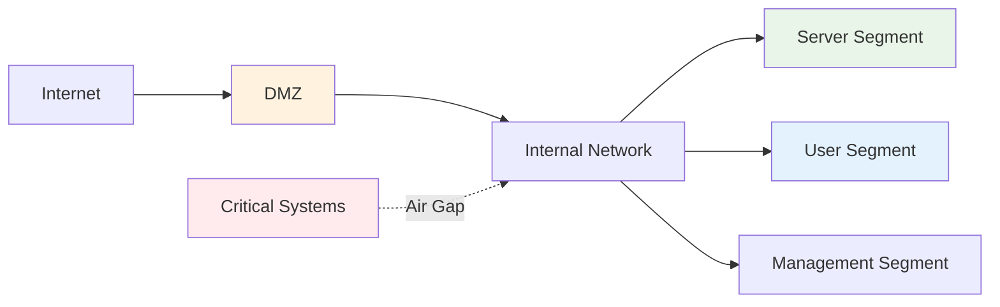
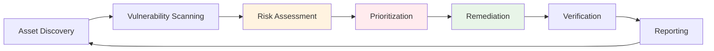
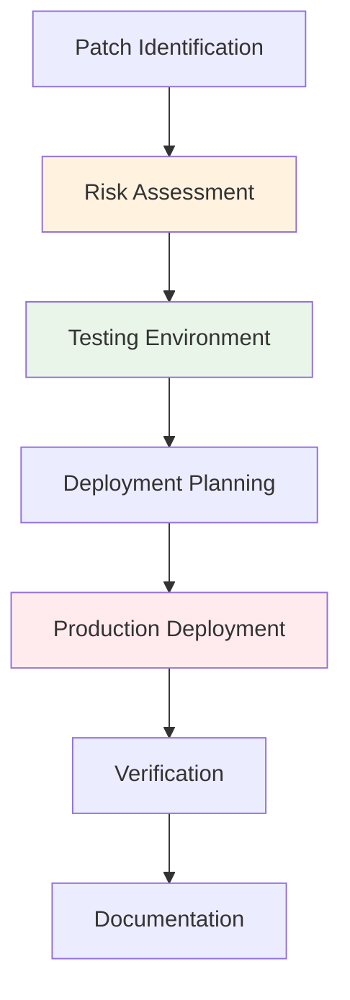
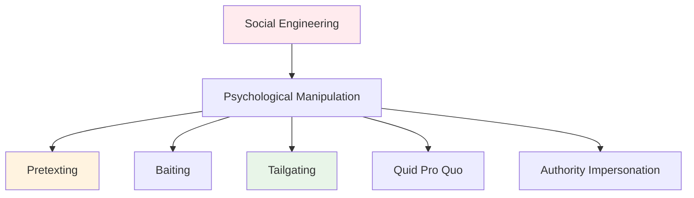

# Attack Prevention Strategies
## Unit II: Account & Data Security
### Lecture 14: Proactive Security Measures and Defense

<div class="absolute bottom-5 left-5 text-xs text-gray-500">
Course: Cyber Security (4353204) | Semester V | Diploma ICT | Author: Milav Dabgar
</div>

---
layout: default
---

# Defense-in-Depth Strategy

<div class="grid grid-cols-2 gap-6">

<div>

## 🛡️ What is Defense-in-Depth?

**Defense-in-Depth** is a layered security approach that uses multiple security controls to protect information and systems.

### 🎯 Core Principles
- **Multiple layers** of protection
- **Redundant controls** - No single point of failure
- **Diverse technologies** - Different detection methods
- **Comprehensive coverage** - All attack vectors
- **Coordinated response** - Integrated security ecosystem

### 📊 Security Layer Model


</div>

<div>

## 🔒 Layer Implementation

### 📋 Security Control Categories
```yaml
Preventive Controls:
  - Firewalls and access controls
  - Antivirus and anti-malware
  - Encryption and authentication
  - Security awareness training
  - Patch management systems
  
Detective Controls:
  - Intrusion detection systems
  - Security monitoring (SIEM)
  - Log analysis and correlation
  - Vulnerability scanning
  - Security audits
  
Corrective Controls:
  - Incident response procedures
  - Backup and recovery systems
  - System restoration processes
  - Forensic investigation tools
  - Business continuity plans
```

### ⚡ Benefits of Layered Security
- **Attack complexity** - Harder for attackers
- **Time advantage** - More time to detect/respond
- **Risk reduction** - Multiple failure points needed
- **Comprehensive protection** - Various attack vectors covered
- **Compliance alignment** - Meets regulatory requirements

### 🎯 Implementation Strategy
1. **Risk assessment** - Identify threats and vulnerabilities
2. **Control selection** - Choose appropriate security controls
3. **Layered deployment** - Implement controls at each layer
4. **Integration** - Ensure controls work together
5. **Monitoring** - Continuous assessment and improvement

</div>

</div>

<div class="absolute bottom-5 left-5 text-xs text-gray-500">
Course: Cyber Security (4353204) | Unit II | Lecture 14 | Author: Milav Dabgar
</div>

---
layout: default
---

# Network Security Fundamentals

<div class="grid grid-cols-2 gap-6">

<div>

## 🌐 Network Perimeter Defense

### 🔥 Firewall Technologies
**Network firewalls** control traffic between networks based on predetermined security rules.

### 📊 Firewall Types
```yaml
Packet Filtering Firewalls:
  - Examines packet headers
  - IP addresses and ports
  - Basic access control
  - Fast but limited inspection
  
Stateful Inspection Firewalls:
  - Tracks connection state
  - Context-aware decisions
  - Better security than packet filtering
  - Moderate performance impact
  
Application Layer Firewalls:
  - Deep packet inspection
  - Application protocol analysis
  - Content filtering capabilities
  - Higher resource requirements
  
Next-Generation Firewalls (NGFW):
  - Integrated security features
  - Intrusion prevention (IPS)
  - Application awareness
  - Threat intelligence integration
```

### 🔧 Firewall Rule Example
```bash
# iptables rule examples
# Allow HTTP traffic
iptables -A INPUT -p tcp --dport 80 -j ACCEPT

# Block specific IP range
iptables -A INPUT -s 192.168.1.0/24 -j DROP

# Allow established connections
iptables -A INPUT -m state --state ESTABLISHED,RELATED -j ACCEPT

# Default deny policy
iptables -P INPUT DROP
iptables -P FORWARD DROP
```

</div>

<div>

## 🛡️ Network Segmentation

### 🏗️ Segmentation Strategies
**Network segmentation** divides networks into smaller, isolated segments to limit attack spread.

### 📊 Segmentation Methods
```yaml
VLAN Segmentation:
  - Virtual network isolation
  - Layer 2 separation
  - Cost-effective approach
  - Limited security (same broadcast domain)
  
Subnet Segmentation:
  - Layer 3 network isolation
  - Router-based separation
  - Better security than VLANs
  - Requires routing configuration
  
Micro-segmentation:
  - Application-level isolation
  - Software-defined networking
  - Granular access control
  - Zero-trust network architecture
  
Air-gap Segmentation:
  - Physical network separation
  - Highest security level
  - Limited connectivity
  - Critical system protection
```

### 🔍 Segmentation Benefits


### 💻 Software-Defined Perimeter (SDP)
```python
# SDP implementation example
class SDPGateway:
    def __init__(self):
        self.authenticated_users = {}
        self.authorized_resources = {}
        self.security_policies = {}
    
    def authenticate_user(self, user_credentials):
        # Multi-factor authentication
        if self.verify_credentials(user_credentials):
            session_token = self.create_secure_session()
            self.authenticated_users[session_token] = user_credentials.user_id
            return session_token
        return None
    
    def authorize_access(self, session_token, resource_request):
        user_id = self.authenticated_users.get(session_token)
        if not user_id:
            return False
            
        # Check authorization policies
        user_policies = self.get_user_policies(user_id)
        resource_requirements = self.get_resource_requirements(resource_request.resource_id)
        
        return self.evaluate_policies(user_policies, resource_requirements)
```

</div>

</div>

<div class="absolute bottom-5 left-5 text-xs text-gray-500">
Course: Cyber Security (4353204) | Unit II | Lecture 14 | Author: Milav Dabgar
</div>

---
layout: default
---

# Endpoint Security Strategies

<div class="grid grid-cols-2 gap-6">

<div>

## 💻 Comprehensive Endpoint Protection

### 🛡️ Endpoint Security Stack
```yaml
Antivirus/Anti-malware:
  - Signature-based detection
  - Heuristic analysis
  - Real-time protection
  - Automatic updates
  
Endpoint Detection & Response (EDR):
  - Behavioral monitoring
  - Threat hunting capabilities
  - Incident response automation
  - Forensic analysis
  
Host-based Firewall:
  - Application-level control
  - Network traffic filtering
  - Port and protocol restrictions
  - Advanced threat protection
  
Data Loss Prevention (DLP):
  - Sensitive data identification
  - Data classification
  - Transfer monitoring
  - Policy enforcement
```

### 🔒 Application Control
```yaml
Whitelisting Approach:
  - Allow only approved applications
  - Digital signature verification
  - Path-based rules
  - Hash-based identification
  
Blacklisting Approach:
  - Block known malicious software
  - Reputation-based blocking
  - Pattern matching
  - Behavioral analysis
  
Sandboxing:
  - Isolated execution environment
  - Safe malware analysis
  - Unknown file testing
  - Behavioral observation
```

</div>

<div>

## 🔧 System Hardening

### ⚡ Operating System Hardening
**System hardening** reduces attack surface by removing unnecessary services and securing configurations.

### 📋 Windows Hardening Checklist
```powershell
# Disable unnecessary services
Set-Service -Name "Spooler" -StartupType Disabled
Set-Service -Name "Fax" -StartupType Disabled
Set-Service -Name "Telnet" -StartupType Disabled

# Configure Windows Firewall
netsh advfirewall set allprofiles state on
netsh advfirewall firewall set rule group="File and Printer Sharing" new enable=no

# Set strong password policy
net accounts /minpwlen:12 /maxpwage:90 /lockoutthreshold:5

# Enable audit policies
auditpol /set /category:"Logon/Logoff" /success:enable /failure:enable
auditpol /set /category:"Account Management" /success:enable /failure:enable

# Disable anonymous access
reg add "HKLM\SYSTEM\CurrentControlSet\Control\Lsa" /v restrictanonymous /t REG_DWORD /d 1

# Configure User Account Control (UAC)
reg add "HKLM\SOFTWARE\Microsoft\Windows\CurrentVersion\Policies\System" /v ConsentPromptBehaviorAdmin /t REG_DWORD /d 2
```

### 🐧 Linux Hardening Example
```bash
#!/bin/bash
# Linux system hardening script

# Update system
apt update && apt upgrade -y

# Remove unnecessary packages
apt purge -y telnet rsh-client rsh-server

# Configure SSH securely
sed -i 's/#PermitRootLogin yes/PermitRootLogin no/' /etc/ssh/sshd_config
sed -i 's/#PasswordAuthentication yes/PasswordAuthentication no/' /etc/ssh/sshd_config
sed -i 's/#Port 22/Port 2222/' /etc/ssh/sshd_config
systemctl restart ssh

# Configure firewall
ufw enable
ufw default deny incoming
ufw default allow outgoing
ufw allow 2222/tcp  # SSH on custom port

# Set file permissions
chmod 600 /etc/ssh/sshd_config
chmod 644 /etc/passwd
chmod 600 /etc/shadow

# Enable fail2ban
apt install -y fail2ban
systemctl enable fail2ban
```

</div>

</div>

<div class="absolute bottom-5 left-5 text-xs text-gray-500">
Course: Cyber Security (4353204) | Unit II | Lecture 14 | Author: Milav Dabgar
</div>

---
layout: default
---

# Vulnerability Management

<div class="grid grid-cols-2 gap-6">

<div>

## 🔍 Vulnerability Assessment Process

### 📊 Vulnerability Management Lifecycle


### 🛠️ Scanning Tools and Techniques
```yaml
Network Vulnerability Scanners:
  - Nessus (Commercial)
  - OpenVAS (Open Source)
  - Qualys VMDR (Cloud)
  - Rapid7 Nexpose (Commercial)
  
Web Application Scanners:
  - OWASP ZAP (Free)
  - Burp Suite (Commercial)
  - Acunetix (Commercial)
  - Netsparker (Commercial)
  
Database Scanners:
  - SQLmap (Free)
  - AppScan (IBM)
  - Database Security Scanner
  
Infrastructure Scanners:
  - Nmap (Network mapping)
  - Masscan (Fast port scanner)
  - Shodan (Internet-wide scanning)
```

### 💻 Nmap Scanning Examples
```bash
# Basic network discovery
nmap -sn 192.168.1.0/24

# Service version detection
nmap -sV -p- target.example.com

# OS detection and script scanning
nmap -O -sC target.example.com

# Vulnerability scanning with NSE scripts
nmap --script vuln target.example.com

# Stealth SYN scan
nmap -sS -T4 target.example.com
```

</div>

<div>

## 📈 Risk-Based Prioritization

### 🎯 CVSS Scoring System
**Common Vulnerability Scoring System** provides standardized vulnerability severity ratings.

### 📊 CVSS v3.1 Metrics
```yaml
Base Score Metrics:
  Attack Vector (AV):
    - Network (N) - 0.85
    - Adjacent (A) - 0.62
    - Local (L) - 0.55
    - Physical (P) - 0.2
    
  Attack Complexity (AC):
    - Low (L) - 0.77
    - High (H) - 0.44
    
  Privileges Required (PR):
    - None (N) - 0.85
    - Low (L) - 0.62/0.68
    - High (H) - 0.27/0.50
    
  User Interaction (UI):
    - None (N) - 0.85
    - Required (R) - 0.62
    
  Impact Metrics:
    - Confidentiality (C)
    - Integrity (I) 
    - Availability (A)
    - None/Low/High - 0.0/0.22/0.56
```

### 🔧 Risk Calculation Example
```python
# CVSS Base Score Calculator
class CVSSCalculator:
    def __init__(self):
        self.av_scores = {'N': 0.85, 'A': 0.62, 'L': 0.55, 'P': 0.2}
        self.ac_scores = {'L': 0.77, 'H': 0.44}
        self.pr_scores = {'N': 0.85, 'L': 0.62, 'H': 0.27}
        self.ui_scores = {'N': 0.85, 'R': 0.62}
        self.impact_scores = {'N': 0.0, 'L': 0.22, 'H': 0.56}
    
    def calculate_base_score(self, av, ac, pr, ui, c, i, a):
        # Exploitability Score
        exploitability = 8.22 * self.av_scores[av] * self.ac_scores[ac] * \
                        self.pr_scores[pr] * self.ui_scores[ui]
        
        # Impact Score
        iss = 1 - ((1 - self.impact_scores[c]) * 
                   (1 - self.impact_scores[i]) * 
                   (1 - self.impact_scores[a]))
        
        if iss <= 0:
            impact = 0
        else:
            impact = 6.42 * iss
        
        # Base Score
        if impact <= 0:
            base_score = 0
        else:
            base_score = min(10, (impact + exploitability))
        
        return round(base_score, 1)
    
    def get_severity_rating(self, score):
        if score == 0.0:
            return "None"
        elif score <= 3.9:
            return "Low"
        elif score <= 6.9:
            return "Medium" 
        elif score <= 8.9:
            return "High"
        else:
            return "Critical"
```

</div>

</div>

<div class="absolute bottom-5 left-5 text-xs text-gray-500">
Course: Cyber Security (4353204) | Unit II | Lecture 14 | Author: Milav Dabgar
</div>

---
layout: default
---

# Patch Management Strategies

<div class="grid grid-cols-2 gap-6">

<div>

## 🔄 Systematic Patch Management

### 📋 Patch Management Process


### ⏰ Patch Categorization
```yaml
Critical Patches:
  - Zero-day exploits
  - Active exploitation
  - Remote code execution
  - Timeline: Within 72 hours
  
High Priority Patches:
  - Privilege escalation
  - Data exposure risks
  - Network accessible vulnerabilities  
  - Timeline: Within 1 week
  
Medium Priority Patches:
  - Local vulnerabilities
  - Limited impact
  - Authentication required
  - Timeline: Within 1 month
  
Low Priority Patches:
  - Cosmetic fixes
  - Performance improvements
  - Minimal security impact
  - Timeline: Next maintenance window
```

### 🛠️ Automated Patch Management
```powershell
# Windows Update via PowerShell
Import-Module PSWindowsUpdate

# Check for updates
Get-WUList

# Install critical updates only
Get-WUInstall -Category "Critical Updates" -AcceptAll -AutoReboot

# Schedule patch installation
Get-WUInstall -Category "Security Updates" -ScheduleJob -RunNow

# Generate patch report
Get-WUHistory | Export-CSV "C:\PatchReport.csv"
```

</div>

<div>

## 📊 Change Management Integration

### 🎯 Change Control Process
**Integrate patching** with formal change management to ensure controlled deployments.

### 📋 Change Management Workflow
```yaml
Change Request:
  - Patch details and justification
  - Risk assessment
  - Rollback plan
  - Testing results
  - Approval workflow
  
Change Review Board:
  - Technical review
  - Business impact assessment  
  - Security implications
  - Resource requirements
  - Approval/rejection decision
  
Implementation:
  - Scheduled maintenance window
  - Phased deployment
  - Real-time monitoring
  - Rollback triggers
  - Success criteria verification
```

### 🔧 Patch Testing Framework
```python
class PatchTestingFramework:
    def __init__(self):
        self.test_environments = ['dev', 'staging', 'pre-prod']
        self.test_criteria = {
            'functionality': ['core_features', 'integrations', 'performance'],
            'security': ['vulnerability_scan', 'penetration_test'],
            'compatibility': ['application_compatibility', 'system_compatibility']
        }
    
    def run_patch_tests(self, patch_info, environment):
        results = {}
        
        # Deploy patch to test environment
        deployment_success = self.deploy_patch(patch_info, environment)
        if not deployment_success:
            return {'status': 'FAILED', 'reason': 'Deployment failed'}
        
        # Run functionality tests
        func_results = self.run_functionality_tests(environment)
        results['functionality'] = func_results
        
        # Run security tests  
        sec_results = self.run_security_tests(environment)
        results['security'] = sec_results
        
        # Run compatibility tests
        compat_results = self.run_compatibility_tests(environment)
        results['compatibility'] = compat_results
        
        # Determine overall result
        overall_status = self.evaluate_results(results)
        
        return {
            'status': overall_status,
            'detailed_results': results,
            'recommendations': self.generate_recommendations(results)
        }
    
    def evaluate_results(self, results):
        critical_failures = 0
        
        for category, tests in results.items():
            for test, result in tests.items():
                if result['severity'] == 'CRITICAL' and result['status'] == 'FAILED':
                    critical_failures += 1
        
        if critical_failures > 0:
            return 'FAILED'
        elif any(r['status'] == 'WARNING' for category in results.values() 
                for r in category.values()):
            return 'WARNING'
        else:
            return 'PASSED'
```

</div>

</div>

<div class="absolute bottom-5 left-5 text-xs text-gray-500">
Course: Cyber Security (4353204) | Unit II | Lecture 14 | Author: Milav Dabgar
</div>

---
layout: default
---

# Security Awareness and Training

<div class="grid grid-cols-2 gap-6">

<div>

## 👥 Human Factor Security

### 🎯 Why Security Awareness Matters
**Humans are often** the weakest link in security, but with proper training, they become the strongest defense.

### 📊 Human-Related Security Statistics
```yaml
Threat Statistics:
  - 95% of breaches involve human error
  - 91% of cyberattacks start with phishing
  - 43% of employees click suspicious links
  - 30% open phishing emails
  - 12% click malicious attachments
  
Common Attack Vectors:
  - Social engineering (85%)
  - Phishing emails (78%)
  - Malicious websites (45%)
  - USB baiting (32%)
  - Phone-based attacks (28%)
  
Training Impact:
  - 70% reduction in successful phishing
  - 50% faster incident reporting
  - 60% improvement in password practices
  - 40% increase in suspicious activity reporting
```

### 🧠 Social Engineering Techniques


</div>

<div>

## 📚 Comprehensive Training Program

### 🎓 Training Components
```yaml
Core Security Topics:
  - Password security best practices
  - Phishing identification and reporting
  - Social engineering awareness
  - Data classification and handling
  - Incident reporting procedures
  - Physical security measures
  - Remote work security
  - Mobile device security
  
Role-Specific Training:
  - IT administrators - Advanced threats
  - Executives - Targeted attacks
  - HR personnel - Data privacy
  - Finance - Financial fraud
  - Remote workers - Home office security
  
Training Methods:
  - Interactive e-learning modules
  - Simulated phishing campaigns
  - Security awareness videos
  - Hands-on workshops
  - Lunch-and-learn sessions
  - Security newsletters
  - Gamification elements
  - Regular assessments
```

### 🔧 Phishing Simulation Platform
```python
class PhishingSimulationPlatform:
    def __init__(self):
        self.templates = {
            'banking': 'Account verification required',
            'it_support': 'Password reset needed',
            'shipping': 'Package delivery notification',
            'social_media': 'Suspicious login detected',
            'hr': 'Update your personal information'
        }
        self.difficulty_levels = ['easy', 'medium', 'hard']
    
    def create_campaign(self, target_groups, template_type, difficulty):
        campaign = {
            'id': self.generate_campaign_id(),
            'template': self.templates[template_type],
            'targets': target_groups,
            'difficulty': difficulty,
            'launch_date': self.schedule_campaign(),
            'metrics': {
                'emails_sent': 0,
                'emails_opened': 0,
                'links_clicked': 0,
                'credentials_entered': 0,
                'reported_suspicious': 0
            }
        }
        
        return campaign
    
    def track_user_action(self, campaign_id, user_id, action):
        # Track user interactions with phishing simulation
        actions = {
            'opened_email': self.record_email_open,
            'clicked_link': self.record_link_click,
            'entered_credentials': self.record_credential_entry,
            'reported_phishing': self.record_phishing_report
        }
        
        if action in actions:
            actions[action](campaign_id, user_id)
            self.update_user_training_record(user_id, action)
    
    def generate_training_recommendations(self, user_id):
        user_history = self.get_user_simulation_history(user_id)
        
        recommendations = []
        
        if user_history['click_rate'] > 0.3:
            recommendations.append('Advanced phishing awareness training')
        
        if user_history['credential_entry'] > 0:
            recommendations.append('Password security reinforcement')
        
        if user_history['report_rate'] < 0.1:
            recommendations.append('Incident reporting procedures')
        
        return recommendations
```

</div>

</div>

<div class="absolute bottom-5 left-5 text-xs text-gray-500">
Course: Cyber Security (4353204) | Unit II | Lecture 14 | Author: Milav Dabgar
</div>

---
layout: default
---

# Incident Prevention and Response Planning

<div class="grid grid-cols-2 gap-6">

<div>

## 🚨 Proactive Incident Prevention

### 🔍 Threat Intelligence Integration
**Threat intelligence** helps organizations proactively defend against emerging threats.

### 📊 Intelligence Sources
```yaml
Internal Sources:
  - Security logs and events
  - Incident history analysis
  - Vulnerability assessments
  - Penetration test results
  - User behavior analytics
  
External Sources:
  - Commercial threat feeds
  - Government advisories
  - Industry sharing groups
  - Open source intelligence
  - Vendor security bulletins
  
Threat Intelligence Platforms:
  - MISP (Open source)
  - ThreatConnect (Commercial)
  - Anomali (Commercial)  
  - CrowdStrike Falcon X
  - IBM X-Force Exchange
```

### 🔧 STIX/TAXII Implementation
```python
# STIX (Structured Threat Information eXpression) example
from stix2 import Indicator, Malware, Relationship, Bundle

# Create malware object
malware = Malware(
    name="Banking Trojan X",
    labels=["trojan"],
    description="Financial information stealing malware"
)

# Create indicator
indicator = Indicator(
    pattern="[file:hashes.MD5 = 'd41d8cd98f00b204e9800998ecf8427e']",
    labels=["malicious-activity"],
    description="MD5 hash of Banking Trojan X sample"
)

# Create relationship
relationship = Relationship(
    relationship_type="indicates",
    source_ref=indicator.id,
    target_ref=malware.id
)

# Bundle everything
bundle = Bundle(malware, indicator, relationship)

# Convert to JSON for sharing
threat_intelligence = bundle.serialize(pretty=True)
```

</div>

<div>

## 📋 Incident Response Preparation

### ⚡ IR Team Structure
```yaml
Core IR Team Roles:
  Incident Commander:
    - Overall response coordination
    - Decision making authority
    - External communication
    - Resource allocation
    
  Technical Lead:
    - Technical analysis coordination
    - Tool deployment
    - Evidence preservation
    - System recovery oversight
    
  Security Analyst:
    - Initial triage and assessment
    - Log analysis and correlation
    - Threat intelligence research
    - IOC identification
    
  Forensics Specialist:
    - Digital evidence collection
    - Forensic analysis
    - Chain of custody
    - Expert witness testimony
    
  Communications Manager:
    - Internal communications
    - External notifications
    - Media relations
    - Regulatory reporting
```

### 🛠️ IR Toolkit Preparation
```python
class IncidentResponseToolkit:
    def __init__(self):
        self.forensic_tools = {
            'memory_analysis': ['Volatility', 'Rekall'],
            'disk_analysis': ['Autopsy', 'Sleuth Kit', 'FTK'],
            'network_analysis': ['Wireshark', 'NetworkMiner'],
            'log_analysis': ['Splunk', 'ELK Stack', 'LogRhythm']
        }
        
        self.containment_tools = {
            'network_isolation': ['Firewall rules', 'VLAN isolation'],
            'endpoint_isolation': ['EDR tools', 'Remote wipe'],
            'account_management': ['AD tools', 'Identity management']
        }
        
        self.communication_tools = {
            'secure_channels': ['Signal', 'Encrypted email'],
            'documentation': ['Incident tracking system', 'Digital notebooks'],
            'coordination': ['War room setup', 'Conference bridges']
        }
    
    def prepare_incident_response(self, incident_type):
        toolkit = {
            'immediate_response': self.get_immediate_tools(incident_type),
            'investigation_tools': self.get_investigation_tools(incident_type),
            'containment_options': self.get_containment_tools(incident_type),
            'communication_plan': self.get_communication_plan(incident_type)
        }
        
        return toolkit
    
    def create_incident_playbook(self, threat_type):
        playbook_steps = {
            'detection': self.get_detection_procedures(threat_type),
            'analysis': self.get_analysis_procedures(threat_type),
            'containment': self.get_containment_procedures(threat_type),
            'eradication': self.get_eradication_procedures(threat_type),
            'recovery': self.get_recovery_procedures(threat_type),
            'lessons_learned': self.get_documentation_requirements(threat_type)
        }
        
        return playbook_steps
```

</div>

</div>

<div class="absolute bottom-5 left-5 text-xs text-gray-500">
Course: Cyber Security (4353204) | Unit II | Lecture 14 | Author: Milav Dabgar
</div>

---
layout: default
---

# Practical Exercise: Attack Prevention Design

<div class="exercise-container">

## 🎯 Group Activity (30 minutes)

### Scenario: Financial Services Company Security

Your team is tasked with designing comprehensive attack prevention strategies for a financial services company with:

**Organization Profile:**
- **Regional bank** with 50 branches
- **2,000 employees** (bank tellers, loan officers, IT staff, executives)
- **Online banking** platform serving 100,000 customers  
- **Core banking** systems and ATM networks
- **Regulatory requirements** (PCI DSS, SOX, local banking regulations)
- **High-value target** for cybercriminals

**Recent Threat Intelligence:**
- Increased targeting of financial institutions
- Sophisticated phishing campaigns
- APT groups focusing on wire transfer systems
- Ransomware attacks on similar organizations
- Insider threat incidents reported in sector

### Task: Comprehensive Prevention Strategy

**Phase 1: Threat Assessment (10 minutes)**

**Threat Landscape Analysis:**
1. What are the primary threats facing this organization?
2. Which attack vectors are most concerning?
3. What are the high-value assets that need protection?
4. How would you assess the current risk posture?

**Risk Prioritization:**
1. Which systems require the highest protection?
2. What would be the impact of different attack scenarios?
3. How would you categorize threats by likelihood and impact?

**Phase 2: Defense Strategy Design (15 minutes)**

**Layered Defense Architecture:**
1. Design a defense-in-depth strategy for each layer:
   - Perimeter security (firewalls, IPS)
   - Network segmentation (VLANs, microsegmentation)  
   - Endpoint protection (AV, EDR, application control)
   - Data protection (encryption, DLP, access controls)
   - Identity security (MFA, privileged access)

**Technical Controls:**
1. What network security controls would you implement?
2. How would you secure endpoints and mobile devices?
3. What monitoring and detection capabilities are needed?
4. How would you implement vulnerability management?

**Administrative Controls:**
1. What security policies and procedures are required?
2. How would you structure security awareness training?
3. What incident response capabilities are needed?
4. How would you handle third-party risk management?

**Phase 3: Implementation Planning (5 minutes)**

**Deployment Strategy:**
1. What's the priority order for implementing controls?
2. How would you phase the implementation?
3. What resources and budget considerations are involved?
4. How would you measure the effectiveness of controls?

**Continuous Improvement:**
1. How would you maintain and update the security posture?
2. What metrics would you track?
3. How would you handle emerging threats?

**Deliverables:**
- Layered defense architecture diagram  
- Risk assessment and mitigation matrix
- Implementation roadmap and priorities
- Security awareness training plan
- Incident response preparation checklist

</div>

<style>
.exercise-container {
  @apply bg-orange-50 border-2 border-orange-300 rounded-lg p-6;
}
</style>

<div class="absolute bottom-5 left-5 text-xs text-gray-500">
Course: Cyber Security (4353204) | Unit II | Lecture 14 | Author: Milav Dabgar
</div>

---
layout: center
class: text-center
---

# Questions & Discussion

## 🤔 Discussion Points:
- How do you balance security controls with business operations?
- What's the most effective layer in a defense-in-depth strategy?
- How do you keep up with evolving attack techniques?

### 💡 Exercise Review
Share your financial services security strategies and discuss implementation challenges

<div class="absolute bottom-5 left-5 text-xs text-gray-500">
Course: Cyber Security (4353204) | Unit II | Lecture 14 | Author: Milav Dabgar
</div>

---
layout: center
class: text-center
---

# Thank You!

## Next Lecture: Security Monitoring and Response
### Detecting and Responding to Security Threats

<div class="pt-8 text-gray-500">
  <p>Cyber Security (4353204) - Lecture 14 Complete</p>
  <p>Prevention is better than cure: Building strong defenses! 🛡️🏰</p>
</div>

<div class="absolute bottom-5 left-5 text-xs text-gray-500">
Course: Cyber Security (4353204) | Unit II | Lecture 14 | Author: Milav Dabgar
</div>