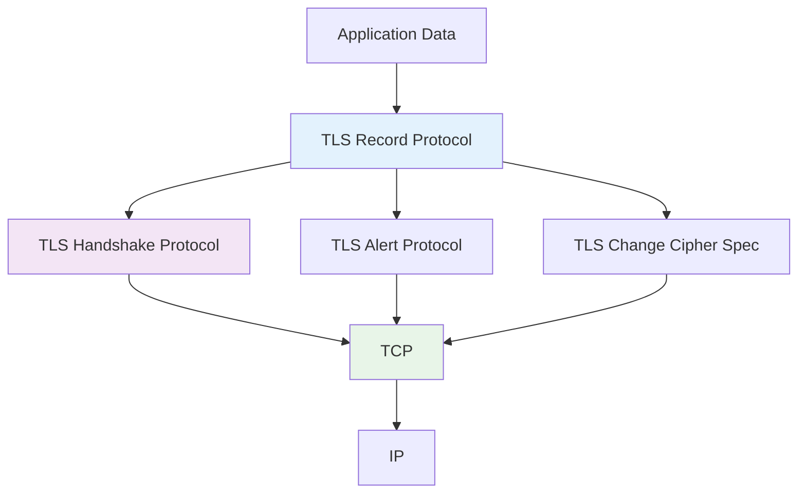
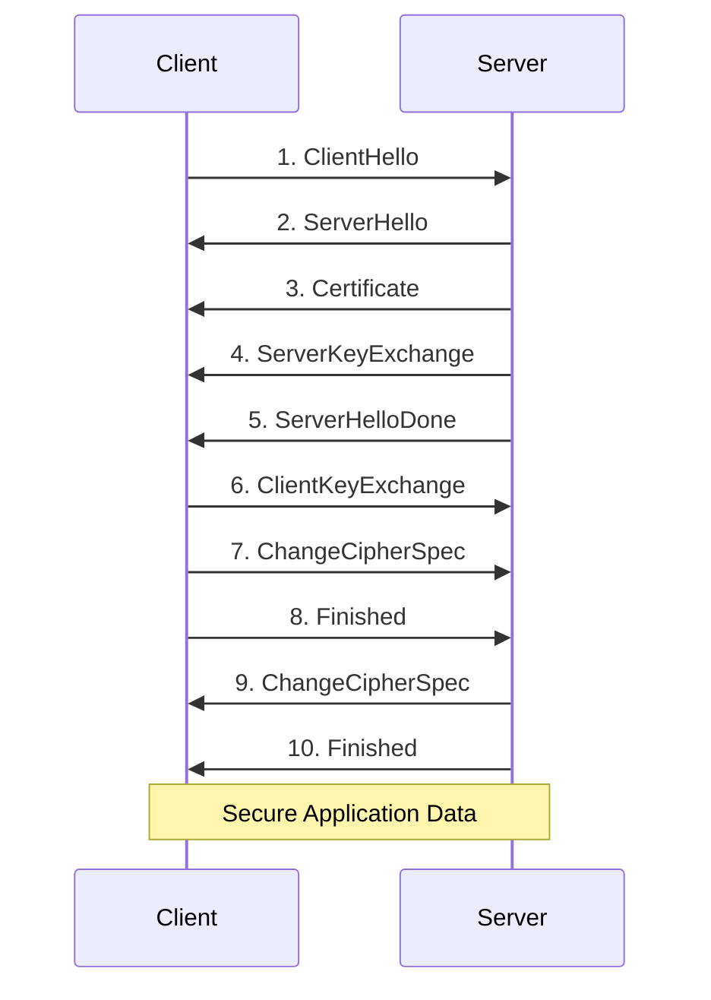
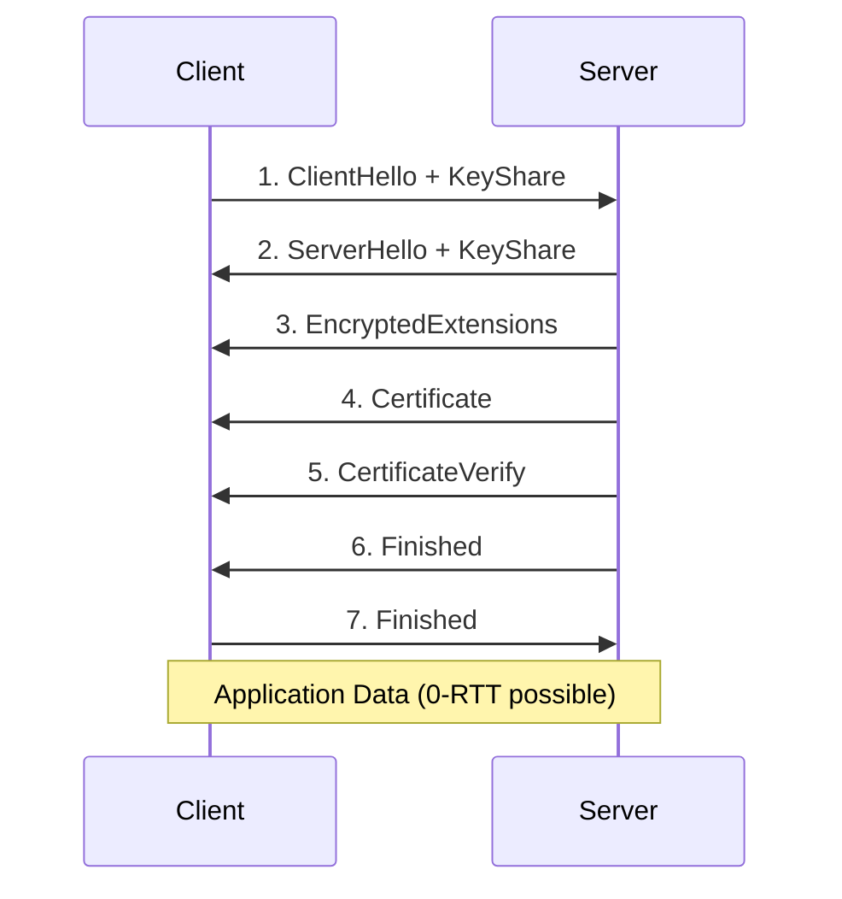
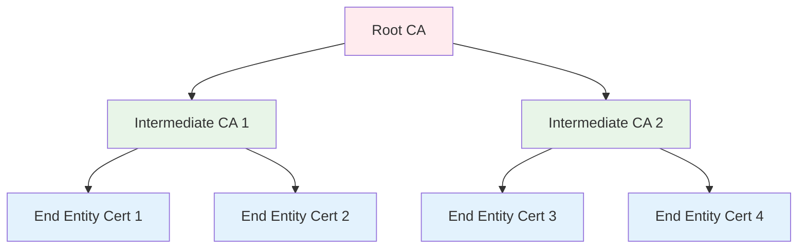

# SSL/TLS Protocols
## Unit III: Network & System Security
### Lecture 17: Secure Communication Foundations

<div class="absolute bottom-5 left-5 text-xs text-gray-500">
Course: Cyber Security (4353204) | Semester V | Diploma ICT | Author: Milav Dabgar
</div>

---
layout: default
---

# Understanding SSL/TLS

<div class="grid grid-cols-2 gap-6">

<div>

## 🔐 What is SSL/TLS?

**SSL/TLS** (Secure Sockets Layer/Transport Layer Security) provides secure communication over computer networks.

### 🎯 Primary Purposes
- **Data confidentiality** - Encryption
- **Data integrity** - Tamper detection  
- **Authentication** - Identity verification
- **Non-repudiation** - Action accountability

### 📊 Evolution Timeline
```yaml
SSL 1.0 (1994):
  - Never released publicly
  - Security flaws identified
  
SSL 2.0 (1995):
  - First public release
  - Multiple vulnerabilities
  - Deprecated in 2011
  
SSL 3.0 (1996):
  - Complete redesign
  - POODLE vulnerability (2014)
  - Deprecated in 2015
  
TLS 1.0 (1999):
  - IETF standard (RFC 2246)
  - Based on SSL 3.0
  - Minor improvements
  
TLS 1.1 (2006):
  - Protection against CBC attacks
  - Implicit IV handling
  
TLS 1.2 (2008):
  - Current widespread standard
  - SHA-256 support
  - AEAD cipher suites
  
TLS 1.3 (2018):
  - Latest version
  - Performance improvements
  - Enhanced security
```

</div>

<div>

## 🏗️ Protocol Architecture

### 📋 TLS Protocol Stack


### 🔧 Protocol Components
```yaml
Record Protocol:
  - Fragmentation and reassembly
  - Compression (deprecated)
  - Message authentication
  - Encryption and decryption
  
Handshake Protocol:
  - Authentication negotiation
  - Key establishment
  - Cipher suite selection
  - Certificate exchange
  
Alert Protocol:
  - Error reporting
  - Warning messages
  - Connection termination
  - Security notifications
  
Change Cipher Spec:
  - Cipher suite activation
  - Security parameter updates
  - Protocol state changes
```

### 🛡️ Security Services
- **Confidentiality** via symmetric encryption
- **Integrity** via MAC/AEAD
- **Authentication** via digital certificates
- **Forward secrecy** via ephemeral keys

</div>

</div>

<div class="absolute bottom-5 left-5 text-xs text-gray-500">
Course: Cyber Security (4353204) | Unit III | Lecture 17 | Author: Milav Dabgar
</div>

---
layout: default
---

# TLS Handshake Process

<div class="grid grid-cols-2 gap-6">

<div>

## 🤝 TLS 1.2 Handshake

### 📊 Full Handshake Flow


### 🔧 Handshake Messages Explained
```yaml
ClientHello:
  - Supported TLS versions
  - Random number (Client Random)
  - Session ID
  - Cipher suites list
  - Compression methods
  - Extensions (SNI, ALPN, etc.)
  
ServerHello:
  - Selected TLS version
  - Random number (Server Random)
  - Session ID
  - Chosen cipher suite
  - Compression method
  - Extensions
  
Certificate:
  - X.509 certificate chain
  - Server public key
  - Certificate authority validation
  
ServerKeyExchange:
  - Key exchange parameters
  - Digital signature
  - Forward secrecy support
```

</div>

<div>

## ⚡ TLS 1.3 Improvements

### 🚀 Enhanced Handshake


### 📈 TLS 1.3 Benefits
```yaml
Performance:
  - Reduced handshake latency
  - 1-RTT handshake (vs 2-RTT)
  - 0-RTT resumption support
  - Fewer round trips
  
Security:
  - Forward secrecy mandatory
  - Removed weak algorithms
  - Encrypted server certificate
  - Improved key derivation
  
Simplification:
  - Fewer cipher suites
  - Removed legacy features
  - Cleaner protocol design
  - Better security defaults
```

### 🔒 Key Exchange Methods
```yaml
TLS 1.2 Options:
  - RSA key transport
  - Diffie-Hellman (DHE)
  - Elliptic Curve DH (ECDHE)
  - PSK (Pre-Shared Key)
  
TLS 1.3 (Forward Secrecy Only):
  - DHE (Finite Field)
  - ECDHE (Elliptic Curve)
  - PSK with (EC)DHE
  - PSK-only mode
```

### 💻 Handshake Implementation
```python
# Simplified TLS handshake simulation
import hashlib
import secrets

class TLSHandshake:
    def __init__(self):
        self.client_random = secrets.token_bytes(32)
        self.server_random = secrets.token_bytes(32)
        self.cipher_suites = [
            'TLS_AES_256_GCM_SHA384',
            'TLS_AES_128_GCM_SHA256',
            'TLS_CHACHA20_POLY1305_SHA256'
        ]
    
    def client_hello(self):
        return {
            'version': 'TLS 1.3',
            'random': self.client_random,
            'cipher_suites': self.cipher_suites,
            'extensions': ['server_name', 'supported_groups']
        }
    
    def server_hello(self, client_hello):
        return {
            'version': 'TLS 1.3',
            'random': self.server_random,
            'cipher_suite': 'TLS_AES_256_GCM_SHA384',
            'key_share': self.generate_key_share()
        }
    
    def derive_keys(self, shared_secret):
        # Simplified key derivation
        handshake_context = self.client_random + self.server_random
        return self.hkdf_expand(shared_secret, handshake_context)
```

</div>

</div>

<div class="absolute bottom-5 left-5 text-xs text-gray-500">
Course: Cyber Security (4353204) | Unit III | Lecture 17 | Author: Milav Dabgar
</div>

---
layout: default
---

# Cryptographic Components

<div class="grid grid-cols-2 gap-6">

<div>

## 🔐 Cipher Suites

### 📋 Cipher Suite Format
```yaml
TLS_RSA_WITH_AES_256_CBC_SHA256:
  Key Exchange: RSA
  Authentication: RSA
  Bulk Encryption: AES-256-CBC
  MAC: HMAC-SHA256
  
TLS_ECDHE_RSA_WITH_AES_128_GCM_SHA256:
  Key Exchange: ECDHE
  Authentication: RSA
  Bulk Encryption: AES-128-GCM
  MAC: GCM (AEAD)
```

### 🎯 Modern Cipher Suites
```yaml
TLS 1.3 Cipher Suites:
  TLS_AES_256_GCM_SHA384:
    - AEAD: AES-256-GCM
    - Hash: SHA-384
    - Key Exchange: Separate negotiation
    
  TLS_AES_128_GCM_SHA256:
    - AEAD: AES-128-GCM
    - Hash: SHA-256
    - Widely supported
    
  TLS_CHACHA20_POLY1305_SHA256:
    - AEAD: ChaCha20-Poly1305
    - Hash: SHA-256
    - Mobile-optimized
```

### 🔧 Encryption Algorithms
```python
# AES-GCM example implementation
from cryptography.hazmat.primitives.ciphers import Cipher, algorithms, modes
import os

class AESGCMCipher:
    def __init__(self, key):
        self.key = key
    
    def encrypt(self, plaintext, associated_data=b''):
        # Generate random IV
        iv = os.urandom(12)
        
        # Create cipher
        cipher = Cipher(
            algorithms.AES(self.key),
            modes.GCM(iv)
        )
        encryptor = cipher.encryptor()
        
        # Add associated data for authentication
        if associated_data:
            encryptor.authenticate_additional_data(associated_data)
        
        # Encrypt and finalize
        ciphertext = encryptor.update(plaintext) + encryptor.finalize()
        
        return {
            'iv': iv,
            'ciphertext': ciphertext,
            'tag': encryptor.tag
        }
    
    def decrypt(self, iv, ciphertext, tag, associated_data=b''):
        cipher = Cipher(
            algorithms.AES(self.key),
            modes.GCM(iv, tag)
        )
        decryptor = cipher.decryptor()
        
        if associated_data:
            decryptor.authenticate_additional_data(associated_data)
        
        return decryptor.update(ciphertext) + decryptor.finalize()
```

</div>

<div>

## 🔑 Key Management

### 🎯 Key Derivation Function (KDF)
```yaml
HKDF (HMAC-based KDF):
  Extract Phase:
    - Salt + Input Keying Material
    - Produces Pseudo-Random Key (PRK)
    
  Expand Phase:
    - PRK + Info + Length
    - Produces Output Keying Material
    
TLS 1.3 Key Schedule:
  Early Secret:
    - Derived from PSK or zeros
    - Used for 0-RTT keys
    
  Handshake Secret:
    - Derived from (EC)DHE shared secret
    - Used for handshake protection
    
  Master Secret:
    - Final secret derivation
    - Used for application data
```

### 💻 Key Derivation Implementation
```python
import hashlib
import hmac

class HKDF:
    def __init__(self, hash_func=hashlib.sha256):
        self.hash_func = hash_func
        self.hash_len = hash_func().digest_size
    
    def extract(self, salt, ikm):
        """Extract phase of HKDF"""
        if not salt:
            salt = b'\x00' * self.hash_len
        return hmac.new(salt, ikm, self.hash_func).digest()
    
    def expand(self, prk, info=b'', length=32):
        """Expand phase of HKDF"""
        n = (length + self.hash_len - 1) // self.hash_len
        t = b''
        okm = b''
        
        for i in range(1, n + 1):
            t = hmac.new(prk, t + info + bytes([i]), self.hash_func).digest()
            okm += t
        
        return okm[:length]
    
    def derive(self, ikm, salt=b'', info=b'', length=32):
        """Complete HKDF operation"""
        prk = self.extract(salt, ikm)
        return self.expand(prk, info, length)

# TLS 1.3 key derivation example
def derive_tls13_keys(shared_secret, handshake_context):
    hkdf = HKDF()
    
    # Extract handshake secret
    handshake_secret = hkdf.extract(b'', shared_secret)
    
    # Derive client/server handshake keys
    client_key = hkdf.expand(handshake_secret, b'tls13 client handshake' + handshake_context, 32)
    server_key = hkdf.expand(handshake_secret, b'tls13 server handshake' + handshake_context, 32)
    
    return client_key, server_key
```

### 🔄 Perfect Forward Secrecy
```yaml
Forward Secrecy Benefits:
  - Past communications remain secure
  - Compromise of long-term keys doesn't affect past sessions
  - Ephemeral key exchange required
  - Mandatory in TLS 1.3
  
Implementation:
  - ECDHE (Elliptic Curve Diffie-Hellman Ephemeral)
  - DHE (Diffie-Hellman Ephemeral)
  - Generate new keys per session
  - Discard keys after use
```

</div>

</div>

<div class="absolute bottom-5 left-5 text-xs text-gray-500">
Course: Cyber Security (4353204) | Unit III | Lecture 17 | Author: Milav Dabgar
</div>

---
layout: default
---

# Digital Certificates and PKI

<div class="grid grid-cols-2 gap-6">

<div>

## 📜 X.509 Certificates

### 🏗️ Certificate Structure
```yaml
Certificate:
  Version: 3
  Serial Number: Unique identifier
  Signature Algorithm: SHA256-RSA
  Issuer: Certificate Authority DN
  Validity:
    Not Before: Start date
    Not After: End date
  Subject: Certificate holder DN
  Subject Public Key Info:
    Algorithm: RSA/ECC
    Public Key: Key material
  Extensions:
    Subject Alternative Name: DNS names, IPs
    Key Usage: Digital signature, key encipherment
    Extended Key Usage: Server authentication
    Certificate Policies: OIDs and policies
  Signature: CA's digital signature
```

### 🔧 Certificate Validation Process
```python
from cryptography import x509
from cryptography.hazmat.backends import default_backend
import datetime

class CertificateValidator:
    def __init__(self, trusted_cas):
        self.trusted_cas = trusted_cas
    
    def validate_certificate(self, cert_pem, hostname):
        cert = x509.load_pem_x509_certificate(cert_pem, default_backend())
        
        # Check validity period
        now = datetime.datetime.utcnow()
        if now < cert.not_valid_before or now > cert.not_valid_after:
            raise ValueError("Certificate expired or not yet valid")
        
        # Check hostname
        if not self.check_hostname(cert, hostname):
            raise ValueError("Hostname mismatch")
        
        # Verify certificate chain
        if not self.verify_chain(cert):
            raise ValueError("Certificate chain validation failed")
        
        return True
    
    def check_hostname(self, cert, hostname):
        try:
            san_ext = cert.extensions.get_extension_for_oid(
                x509.ExtensionOID.SUBJECT_ALTERNATIVE_NAME
            )
            dns_names = san_ext.value.get_values_for_type(x509.DNSName)
            return hostname in dns_names
        except x509.ExtensionNotFound:
            # Fall back to CN in subject
            cn = cert.subject.get_attributes_for_oid(x509.NameOID.COMMON_NAME)[0].value
            return hostname == cn
    
    def verify_chain(self, cert):
        # Simplified chain verification
        # In practice, build full chain and verify each certificate
        return True  # Placeholder
```

</div>

<div>

## 🏛️ Certificate Authorities

### 📊 CA Hierarchy


### 🔐 Certificate Types
```yaml
Domain Validation (DV):
  - Basic domain ownership verification
  - Automated issuance
  - Quick and inexpensive
  - No identity verification
  
Organization Validation (OV):
  - Domain ownership verification
  - Organization identity verification
  - Business registration checks
  - Higher trust level
  
Extended Validation (EV):
  - Rigorous identity verification
  - Legal entity validation
  - Physical address verification
  - Highest trust level (green bar)
  
Wildcard Certificates:
  - Covers subdomains (*.example.com)
  - Single certificate for multiple hosts
  - Cost-effective for large deployments
  - Security considerations
```

### 🛡️ Certificate Pinning
```python
# HPKP (HTTP Public Key Pinning) example
import hashlib
import base64
from cryptography import x509

class CertificatePinner:
    def __init__(self):
        self.pinned_keys = {}
    
    def add_pin(self, hostname, public_key_hash):
        if hostname not in self.pinned_keys:
            self.pinned_keys[hostname] = []
        self.pinned_keys[hostname].append(public_key_hash)
    
    def verify_pin(self, hostname, cert_chain):
        if hostname not in self.pinned_keys:
            return True  # No pins configured
        
        # Check if any certificate in chain matches pinned keys
        for cert_pem in cert_chain:
            cert = x509.load_pem_x509_certificate(cert_pem)
            pub_key = cert.public_key()
            
            # Calculate SPKI hash
            spki_hash = self.calculate_spki_hash(pub_key)
            
            if spki_hash in self.pinned_keys[hostname]:
                return True
        
        return False
    
    def calculate_spki_hash(self, public_key):
        # Subject Public Key Info hash for pinning
        spki_der = public_key.public_bytes(
            encoding=serialization.Encoding.DER,
            format=serialization.PublicFormat.SubjectPublicKeyInfo
        )
        sha256_hash = hashlib.sha256(spki_der).digest()
        return base64.b64encode(sha256_hash).decode()
```

### 📋 Certificate Transparency
```yaml
CT Log Requirements:
  - Public, append-only logs
  - All certificates must be logged
  - Monitors can detect mis-issued certificates
  - Provides accountability for CAs
  
CT Process:
  1. CA issues certificate
  2. Certificate logged in CT log
  3. SCT (Signed Certificate Timestamp) returned
  4. SCT included in TLS handshake
  5. Clients verify SCT
```

</div>

</div>

<div class="absolute bottom-5 left-5 text-xs text-gray-500">
Course: Cyber Security (4353204) | Unit III | Lecture 17 | Author: Milav Dabgar
</div>

---
layout: default
---

# TLS Security Vulnerabilities

<div class="grid grid-cols-2 gap-6">

<div>

## 🚨 Historical Vulnerabilities

### 💀 Major TLS Attacks
```yaml
BEAST (2011):
  - Browser Exploit Against SSL/TLS
  - CBC mode vulnerability in TLS 1.0
  - Plaintext recovery attack
  - Fixed in TLS 1.1+
  
CRIME (2012):
  - Compression Ratio Info-leak Made Easy
  - Exploits TLS compression
  - Session token recovery
  - Compression disabled
  
BREACH (2013):
  - Browser Reconnaissance & Exfiltration via Adaptive Compression of Hypertext
  - HTTP compression attack
  - Application-level vulnerability
  - Requires HTTP compression
  
Heartbleed (2014):
  - OpenSSL implementation flaw
  - Buffer over-read vulnerability
  - Private key extraction possible
  - Affected 17% of internet servers
  
POODLE (2014):
  - Padding Oracle On Downgraded Legacy Encryption
  - SSL 3.0 CBC padding attack
  - Forces protocol downgrade
  - SSL 3.0 deprecated
  
FREAK (2015):
  - Factoring RSA Export Keys
  - Export-grade cryptography attack
  - 512-bit RSA key factorization
  - Client implementation flaw
```

### 🔧 Attack Demonstration
```python
# Simplified BEAST attack concept
class BEASTAttack:
    def __init__(self, target_url):
        self.target_url = target_url
        self.known_plaintext = []
        self.recovered_bytes = b''
    
    def exploit_cbc_vulnerability(self, session_cookie):
        """
        BEAST attack exploits predictable IV in TLS 1.0 CBC mode
        This is for educational purposes only
        """
        # Attacker controls part of the request
        controlled_data = b'GET /secret HTTP/1.1\r\nCookie: '
        
        # Try to guess each byte of the session cookie
        for position in range(len(session_cookie)):
            for guess_byte in range(256):
                # Craft malicious request
                crafted_request = self.craft_request(
                    controlled_data, 
                    position, 
                    guess_byte
                )
                
                # Send request and analyze encrypted response
                if self.check_encryption_pattern(crafted_request):
                    self.recovered_bytes += bytes([guess_byte])
                    break
        
        return self.recovered_bytes
    
    def craft_request(self, known_data, position, guess):
        # Align data to block boundary for CBC attack
        padding = b'X' * (16 - ((len(known_data) + position) % 16))
        return known_data + padding + bytes([guess])
```

</div>

<div>

## 🛡️ Modern Mitigations

### ✅ Security Best Practices
```yaml
Protocol Configuration:
  - Use TLS 1.2 minimum (TLS 1.3 preferred)
  - Disable SSL 2.0/3.0 and TLS 1.0/1.1
  - Strong cipher suites only
  - Forward secrecy mandatory
  
Certificate Security:
  - Use certificates from trusted CAs
  - Implement certificate pinning
  - Regular certificate rotation
  - Certificate Transparency monitoring
  
Implementation Security:
  - Keep TLS libraries updated
  - Secure random number generation
  - Proper error handling
  - Constant-time operations
```

### 🔧 Secure TLS Configuration
```python
import ssl
import socket

def create_secure_tls_context():
    """Create a secure TLS context with best practices"""
    context = ssl.create_default_context()
    
    # Set minimum protocol version
    context.minimum_version = ssl.TLSVersion.TLSv1_2
    
    # Prefer strong ciphers
    context.set_ciphers('ECDHE+AESGCM:ECDHE+CHACHA20:DHE+AESGCM:DHE+CHACHA20:!aNULL:!MD5:!DSS')
    
    # Enable hostname checking
    context.check_hostname = True
    context.verify_mode = ssl.CERT_REQUIRED
    
    # Disable compression to prevent CRIME
    context.options |= ssl.OP_NO_COMPRESSION
    
    return context

def secure_https_request(hostname, port=443):
    context = create_secure_tls_context()
    
    with socket.create_connection((hostname, port)) as sock:
        with context.wrap_socket(sock, server_hostname=hostname) as tls_sock:
            # Verify certificate details
            cert = tls_sock.getpeercert()
            print(f"Certificate subject: {cert['subject']}")
            print(f"Certificate issuer: {cert['issuer']}")
            
            # Check cipher suite
            cipher = tls_sock.cipher()
            print(f"Cipher suite: {cipher}")
            
            # Send HTTP request
            request = f"GET / HTTP/1.1\r\nHost: {hostname}\r\nConnection: close\r\n\r\n"
            tls_sock.send(request.encode())
            
            response = tls_sock.recv(4096)
            return response.decode()
```

### 🔍 TLS Testing Tools
```bash
# OpenSSL testing commands
# Test supported protocols
openssl s_client -connect example.com:443 -tls1_2

# Test cipher suites
nmap --script ssl-enum-ciphers -p 443 example.com

# Check certificate details
openssl s_client -connect example.com:443 -showcerts

# Test for vulnerabilities
nmap --script ssl-heartbleed -p 443 example.com
nmap --script ssl-poodle -p 443 example.com

# SSL Labs online testing
# https://www.ssllabs.com/ssltest/

# testssl.sh comprehensive testing
./testssl.sh https://example.com
```

</div>

</div>

<div class="absolute bottom-5 left-5 text-xs text-gray-500">
Course: Cyber Security (4353204) | Unit III | Lecture 17 | Author: Milav Dabgar
</div>

---
layout: default
---

# TLS Implementation and Deployment

<div class="grid grid-cols-2 gap-6">

<div>

## 🚀 Web Server Configuration

### 🔧 Apache HTTPD Configuration
```apache
# Enable SSL module
LoadModule ssl_module modules/mod_ssl.so

<VirtualHost *:443>
    ServerName example.com
    DocumentRoot /var/www/html
    
    # SSL Configuration
    SSLEngine on
    SSLCertificateFile /path/to/certificate.crt
    SSLCertificateKeyFile /path/to/private.key
    SSLCertificateChainFile /path/to/chain.crt
    
    # Security Headers
    Header always set Strict-Transport-Security "max-age=63072000; includeSubdomains; preload"
    Header always set X-Content-Type-Options nosniff
    Header always set X-Frame-Options DENY
    
    # TLS Protocol Configuration
    SSLProtocol -all +TLSv1.2 +TLSv1.3
    SSLCipherSuite ECDHE-ECDSA-AES256-GCM-SHA384:ECDHE-RSA-AES256-GCM-SHA384:ECDHE-ECDSA-CHACHA20-POLY1305:ECDHE-RSA-CHACHA20-POLY1305
    SSLHonorCipherOrder on
    
    # OCSP Stapling
    SSLUseStapling on
    SSLStaplingCache shmcb:/var/run/ocsp(128000)
</VirtualHost>
```

### 🌐 Nginx Configuration
```nginx
server {
    listen 443 ssl http2;
    server_name example.com;
    
    # SSL Configuration
    ssl_certificate /path/to/certificate.crt;
    ssl_certificate_key /path/to/private.key;
    
    # Security Configuration
    ssl_protocols TLSv1.2 TLSv1.3;
    ssl_ciphers ECDHE-ECDSA-AES256-GCM-SHA384:ECDHE-RSA-AES256-GCM-SHA384:ECDHE-ECDSA-CHACHA20-POLY1305:ECDHE-RSA-CHACHA20-POLY1305;
    ssl_prefer_server_ciphers off;
    
    # Performance Optimization
    ssl_session_cache shared:SSL:10m;
    ssl_session_timeout 10m;
    ssl_session_tickets off;
    
    # OCSP Stapling
    ssl_stapling on;
    ssl_stapling_verify on;
    resolver 8.8.8.8 8.8.4.4 valid=300s;
    
    # Security Headers
    add_header Strict-Transport-Security "max-age=63072000; includeSubdomains; preload" always;
    add_header X-Content-Type-Options nosniff always;
    add_header X-Frame-Options DENY always;
    
    location / {
        root /var/www/html;
        index index.html;
    }
}
```

</div>

<div>

## 📱 Application Integration

### 💻 Python TLS Client
```python
import ssl
import urllib3
from urllib3.util import ssl_

# Create secure SSL context
def create_secure_context():
    context = ssl_.create_urllib3_context()
    context.minimum_version = ssl.TLSVersion.TLSv1_2
    context.maximum_version = ssl.TLSVersion.TLSv1_3
    return context

# HTTP client with TLS
import requests
from requests.adapters import HTTPAdapter
from urllib3.util.retry import Retry

class SecureHTTPSAdapter(HTTPAdapter):
    def init_poolmanager(self, *args, **kwargs):
        kwargs['ssl_context'] = create_secure_context()
        return super().init_poolmanager(*args, **kwargs)

# Usage example
session = requests.Session()
session.mount('https://', SecureHTTPSAdapter())

response = session.get('https://example.com')
print(f"Status: {response.status_code}")
print(f"TLS Version: {response.raw.connection.sock.version()}")
```

### ☕ Java TLS Configuration
```java
import javax.net.ssl.*;
import java.security.*;

public class SecureTLSClient {
    public static void main(String[] args) throws Exception {
        // Create secure SSL context
        SSLContext sslContext = SSLContext.getInstance("TLSv1.2");
        
        // Initialize with secure parameters
        sslContext.init(null, null, new SecureRandom());
        
        // Set as default
        SSLContext.setDefault(sslContext);
        
        // Configure protocols
        System.setProperty("https.protocols", "TLSv1.2,TLSv1.3");
        System.setProperty("jdk.tls.client.protocols", "TLSv1.2,TLSv1.3");
        
        // Disable weak algorithms
        System.setProperty("jdk.tls.disabledAlgorithms", 
            "SSLv2, SSLv3, TLSv1, TLSv1.1, RC4, DES, MD5withRSA, DH keySize < 1024");
        
        // Create connection
        URL url = new URL("https://example.com");
        HttpsURLConnection connection = (HttpsURLConnection) url.openConnection();
        
        // Verify hostname
        connection.setHostnameVerifier((hostname, session) -> {
            return HttpsURLConnection.getDefaultHostnameVerifier()
                .verify(hostname, session);
        });
        
        // Make request
        int responseCode = connection.getResponseCode();
        System.out.println("Response Code: " + responseCode);
        
        // Get TLS details
        SSLSession session = connection.getSSLSession();
        System.out.println("Protocol: " + session.getProtocol());
        System.out.println("Cipher Suite: " + session.getCipherSuite());
    }
}
```

### 🔧 Performance Optimization
```yaml
Session Resumption:
  - Reduce handshake overhead
  - Server-side session cache
  - Session tickets (RFC 5077)
  - 0-RTT in TLS 1.3
  
Connection Optimization:
  - HTTP/2 multiplexing
  - Connection keep-alive
  - TCP Fast Open
  - Early data transmission
  
Certificate Optimization:
  - OCSP stapling
  - Certificate compression
  - Shorter certificate chains
  - ECDSA certificates (smaller)
```

</div>

</div>

<div class="absolute bottom-5 left-5 text-xs text-gray-500">
Course: Cyber Security (4353204) | Unit III | Lecture 17 | Author: Milav Dabgar
</div>

---
layout: default
---

# Practical Exercise: TLS Security Assessment

<div class="exercise-container">

## 🎯 Group Activity (30 minutes)

### Scenario: E-commerce Platform TLS Security

Your team is responsible for securing TLS communications for an e-commerce platform that handles:

**Application Details:**
- **Customer portal** with login and payment processing
- **Admin interface** for order management
- **API endpoints** for mobile applications
- **Third-party integrations** (payment gateways, shipping)
- **Compliance requirements** (PCI DSS, GDPR)

**Current Environment:**
- **Multiple subdomains** (www, api, admin, m.example.com)
- **Mixed client** devices (browsers, mobile apps, IoT devices)
- **Global user base** with latency concerns
- **Legacy systems** requiring backward compatibility
- **High availability** requirements (99.9% uptime)

### Task: Complete TLS Security Strategy

**Phase 1: Certificate Management (10 minutes)**

**Certificate Planning:**
1. What type of certificates would you deploy (DV, OV, EV)?
2. Single certificate vs. multiple certificates vs. wildcard?
3. How would you handle certificate lifecycle management?
4. What Certificate Authority would you choose and why?

**Implementation Strategy:**
1. How would you implement certificate pinning?
2. What's your certificate rotation strategy?
3. How would you handle certificate transparency?
4. What monitoring would you put in place?

**Phase 2: Protocol Configuration (10 minutes)**

**TLS Version Strategy:**
1. Which TLS versions would you support and why?
2. How would you handle legacy client compatibility?
3. What's your migration plan to TLS 1.3?
4. How would you deprecate older protocols?

**Cipher Suite Selection:**
1. Which cipher suites would you prioritize?
2. How would you handle forward secrecy requirements?
3. What's your approach to cipher suite ordering?
4. How would you handle performance vs. security trade-offs?

**Phase 3: Security Hardening (10 minutes)**

**Vulnerability Prevention:**
1. How would you protect against known TLS attacks?
2. What security headers would you implement?
3. How would you handle HSTS implementation?
4. What's your approach to security monitoring?

**Performance Optimization:**
1. How would you optimize TLS handshake performance?
2. What session resumption strategy would you use?
3. How would you implement OCSP stapling?
4. What caching strategies would you employ?

**Deliverables:**
- TLS configuration recommendations
- Certificate management plan
- Security testing checklist
- Performance optimization strategy
- Monitoring and alerting setup

</div>

<style>
.exercise-container {
  @apply bg-blue-50 border-2 border-blue-300 rounded-lg p-6;
}
</style>

<div class="absolute bottom-5 left-5 text-xs text-gray-500">
Course: Cyber Security (4353204) | Unit III | Lecture 17 | Author: Milav Dabgar
</div>

---
layout: center
class: text-center
---

# Questions & Discussion

## 🤔 Discussion Points:
- How do you balance TLS security with performance requirements?
- What's your approach to handling legacy system TLS support?
- How do you stay updated with evolving TLS security best practices?

### 💡 Exercise Review
Share your TLS security strategies and discuss implementation challenges

<div class="absolute bottom-5 left-5 text-xs text-gray-500">
Course: Cyber Security (4353204) | Unit III | Lecture 17 | Author: Milav Dabgar
</div>

---
layout: center
class: text-center
---

# Thank You!

## Next Lecture: Firewall and Network Security
### Building Network Defense Perimeters

<div class="pt-8 text-gray-500">
  <p>Cyber Security (4353204) - Lecture 17 Complete</p>
  <p>Secure communications: The foundation of digital trust! 🔐🌐</p>
</div>

<div class="absolute bottom-5 left-5 text-xs text-gray-500">
Course: Cyber Security (4353204) | Unit III | Lecture 17 | Author: Milav Dabgar
</div>