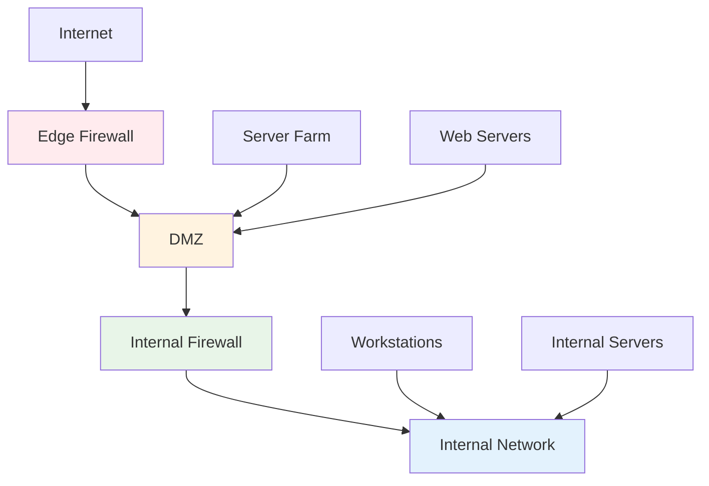
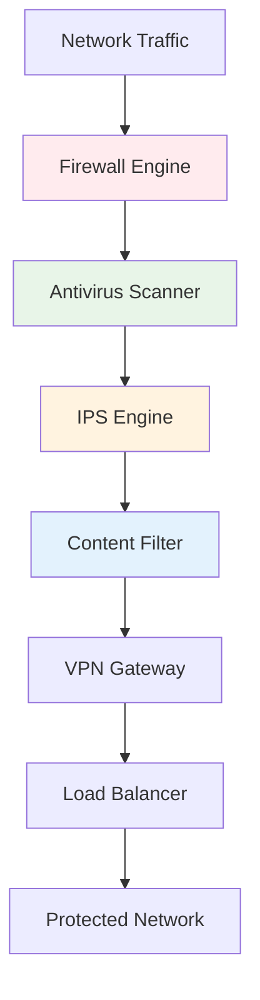
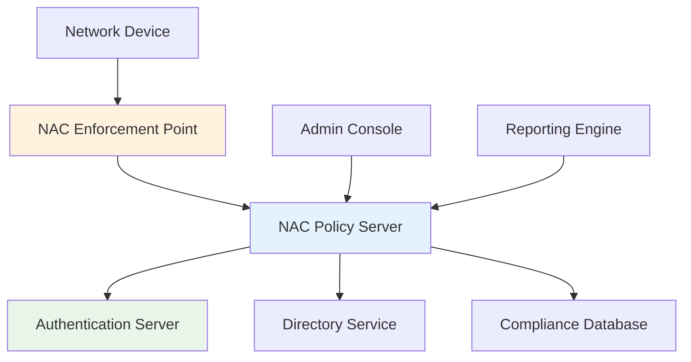
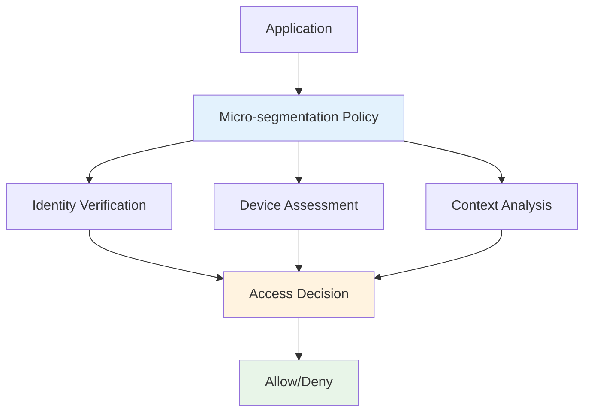

# Firewall and Network Security
## Unit III: Network & System Security
### Lecture 18: Building Network Defense Perimeters

<div class="absolute bottom-5 left-5 text-xs text-gray-500">
Course: Cyber Security (4353204) | Semester V | Diploma ICT | Author: Milav Dabgar
</div>

---
layout: default
---

# Understanding Firewalls

<div class="grid grid-cols-2 gap-6">

<div>

## 🛡️ What is a Firewall?

**Firewall** is a network security device that monitors and controls incoming and outgoing network traffic based on predetermined security rules.

### 🎯 Core Functions
- **Access control** - Allow/deny traffic
- **Network isolation** - Separate network segments
- **Traffic monitoring** - Log network activity
- **Attack prevention** - Block malicious traffic
- **Policy enforcement** - Implement security rules

### 📊 Firewall Statistics
- **95%** of organizations use firewalls
- **Average reduction** in attacks: 60-80%
- **Network breach** prevention: 85%
- **Cost savings** from prevented incidents: $2.4M
- **NGFW market** size: $4.5B globally

</div>

<div>

## 🏗️ Firewall Architecture

### 📋 Network Placement


### 🔧 Deployment Models
```yaml
Perimeter Firewall:
  - Edge protection
  - Internet gateway
  - First line of defense
  - External threat protection
  
Internal Firewall:
  - Network segmentation
  - East-west traffic control
  - Privilege escalation prevention
  - Lateral movement blocking
  
Host-based Firewall:
  - Endpoint protection
  - Application-level control
  - Last line of defense
  - Personal device protection
  
Distributed Firewall:
  - Software-defined networking
  - Micro-segmentation
  - Policy follows workload
  - Cloud-native security
```

### 📊 Firewall Evolution
- **1980s:** Packet filtering
- **1990s:** Stateful inspection
- **2000s:** Application awareness
- **2010s:** Next-generation firewalls
- **2020s:** AI-powered security

</div>

</div>

<div class="absolute bottom-5 left-5 text-xs text-gray-500">
Course: Cyber Security (4353204) | Unit III | Lecture 18 | Author: Milav Dabgar
</div>

---
layout: default
---

# Firewall Types and Technologies

<div class="grid grid-cols-2 gap-6">

<div>

## 📦 Packet Filtering Firewalls

### 🔍 How Packet Filtering Works
**Examines individual packets** based on header information without context.

### 📊 Filtering Criteria
```yaml
Source Information:
  - Source IP address
  - Source port number
  - Network interface
  - MAC address (layer 2)
  
Destination Information:
  - Destination IP address
  - Destination port number
  - Target interface
  - Service type
  
Protocol Information:
  - Protocol type (TCP/UDP/ICMP)
  - Packet flags (SYN, ACK, FIN)
  - Fragment information
  - Packet size
```

### 💻 iptables Example
```bash
# Allow HTTP traffic
iptables -A INPUT -p tcp --dport 80 -j ACCEPT

# Allow HTTPS traffic
iptables -A INPUT -p tcp --dport 443 -j ACCEPT

# Block specific IP range
iptables -A INPUT -s 192.168.1.0/24 -j DROP

# Allow established connections
iptables -A INPUT -m state --state ESTABLISHED,RELATED -j ACCEPT

# Allow SSH from specific network
iptables -A INPUT -p tcp -s 10.0.0.0/8 --dport 22 -j ACCEPT

# Default deny policy
iptables -P INPUT DROP
iptables -P FORWARD DROP

# Save rules
iptables-save > /etc/iptables/rules.v4
```

### ⚡ Advantages and Limitations
```yaml
Advantages:
  - Fast performance
  - Low resource usage
  - Simple configuration
  - Hardware acceleration
  - Cost-effective
  
Limitations:
  - No context awareness
  - Vulnerable to spoofing
  - Cannot inspect payload
  - Limited application control
  - No session tracking
```

</div>

<div>

## 🧠 Stateful Inspection Firewalls

### 🔄 Connection State Tracking
**Maintains connection state** and makes decisions based on traffic context.

### 📊 State Table Structure
```yaml
TCP Connection States:
  NEW: First packet of connection
  ESTABLISHED: Connection confirmed
  RELATED: Related to existing connection
  INVALID: Packet doesn't match any state
  
Connection Information:
  - Source/destination IPs
  - Source/destination ports
  - Protocol type
  - Sequence numbers
  - Connection flags
  - Timeout values
```

### 💻 Stateful Firewall Rules
```python
# Conceptual stateful firewall implementation
class StatefulFirewall:
    def __init__(self):
        self.connection_table = {}
        self.rules = []
        self.default_action = 'DROP'
    
    def add_rule(self, rule):
        self.rules.append(rule)
    
    def process_packet(self, packet):
        # Check if packet belongs to existing connection
        connection_key = self.generate_connection_key(packet)
        
        if connection_key in self.connection_table:
            # Existing connection
            connection = self.connection_table[connection_key]
            if self.is_valid_state_transition(packet, connection):
                self.update_connection_state(packet, connection)
                return 'ACCEPT'
            else:
                return 'DROP'
        
        # New connection - check rules
        for rule in self.rules:
            if self.rule_matches(packet, rule):
                if rule.action == 'ACCEPT':
                    self.create_connection_entry(packet)
                return rule.action
        
        return self.default_action
    
    def create_connection_entry(self, packet):
        connection_key = self.generate_connection_key(packet)
        self.connection_table[connection_key] = {
            'state': 'NEW',
            'created': time.time(),
            'last_seen': time.time(),
            'packets': 1,
            'bytes': len(packet)
        }
    
    def cleanup_expired_connections(self):
        current_time = time.time()
        expired_connections = []
        
        for key, connection in self.connection_table.items():
            if current_time - connection['last_seen'] > 300:  # 5 minutes
                expired_connections.append(key)
        
        for key in expired_connections:
            del self.connection_table[key]
```

</div>

</div>

<div class="absolute bottom-5 left-5 text-xs text-gray-500">
Course: Cyber Security (4353204) | Unit III | Lecture 18 | Author: Milav Dabgar
</div>

---
layout: default
---

# Next-Generation Firewalls (NGFW)

<div class="grid grid-cols-2 gap-6">

<div>

## 🚀 NGFW Capabilities

### 🎯 Advanced Features
```yaml
Application Awareness:
  - Layer 7 inspection
  - Application identification
  - Protocol analysis
  - Content filtering
  
Intrusion Prevention:
  - Signature-based detection
  - Anomaly detection
  - Protocol validation
  - Attack blocking
  
User Identity:
  - User-based policies
  - Active Directory integration
  - Single sign-on support
  - Role-based access
  
Threat Intelligence:
  - Real-time updates
  - Cloud-based reputation
  - IOC correlation
  - Behavioral analysis
```

### 🔧 Deep Packet Inspection (DPI)
```python
class DeepPacketInspector:
    def __init__(self):
        self.application_signatures = self.load_signatures()
        self.threat_patterns = self.load_threat_patterns()
        self.url_categories = self.load_url_categories()
    
    def inspect_packet(self, packet):
        inspection_result = {
            'application': None,
            'threats': [],
            'url_category': None,
            'action': 'ALLOW'
        }
        
        # Application identification
        application = self.identify_application(packet)
        inspection_result['application'] = application
        
        # Threat detection
        threats = self.detect_threats(packet)
        inspection_result['threats'] = threats
        
        # URL categorization
        if packet.protocol == 'HTTP' or packet.protocol == 'HTTPS':
            url = self.extract_url(packet)
            category = self.categorize_url(url)
            inspection_result['url_category'] = category
        
        # Policy decision
        inspection_result['action'] = self.make_policy_decision(inspection_result)
        
        return inspection_result
    
    def identify_application(self, packet):
        payload = packet.payload
        
        # Check against application signatures
        for app_name, signatures in self.application_signatures.items():
            for signature in signatures:
                if self.pattern_match(payload, signature):
                    return app_name
        
        # Heuristic analysis
        if packet.dst_port == 80:
            return 'HTTP'
        elif packet.dst_port == 443:
            return 'HTTPS'
        elif packet.dst_port == 25:
            return 'SMTP'
        
        return 'UNKNOWN'
    
    def detect_threats(self, packet):
        threats = []
        payload = packet.payload
        
        for threat_name, pattern in self.threat_patterns.items():
            if self.pattern_match(payload, pattern):
                threats.append({
                    'name': threat_name,
                    'severity': pattern.severity,
                    'confidence': pattern.confidence
                })
        
        return threats
```

</div>

<div>

## 🛡️ Unified Threat Management (UTM)

### 📊 UTM Components


### 🔧 UTM Integration
```yaml
Firewall Functions:
  - Stateful packet inspection
  - Access control policies
  - Network address translation
  - Virtual private networks
  
Security Services:
  - Antivirus/anti-malware
  - Intrusion prevention
  - Web content filtering
  - Email security
  - Data loss prevention
  
Network Services:
  - Load balancing
  - Quality of service
  - Bandwidth management
  - Network monitoring
  
Management Features:
  - Centralized console
  - Reporting and analytics
  - Policy management
  - Firmware updates
```

### 💻 NGFW Configuration Example
```yaml
# Palo Alto Networks NGFW configuration
firewall:
  zones:
    trust:
      interfaces: [ethernet1/1]
      subnets: [192.168.1.0/24]
    untrust:
      interfaces: [ethernet1/2]
      subnets: [0.0.0.0/0]
    dmz:
      interfaces: [ethernet1/3]
      subnets: [10.0.1.0/24]

  security_policies:
    - name: allow_web_browsing
      from_zone: trust
      to_zone: untrust
      source: [192.168.1.0/24]
      destination: any
      application: [web-browsing, ssl]
      action: allow
      profile_group: security_profiles
      
    - name: allow_email
      from_zone: trust
      to_zone: untrust
      application: [smtp, pop3, imap]
      action: allow
      profile_group: email_security
      
    - name: block_social_media
      from_zone: trust
      to_zone: untrust
      application: [facebook, twitter, instagram]
      action: deny
      log: yes

  security_profiles:
    antivirus:
      action: block
      packet_capture: yes
    vulnerability:
      action: block_ip
      track_by: source
    spyware:
      action: block_ip
    url_filtering:
      categories:
        social_networking: block
        malware: block
        adult: block
```

</div>

</div>

<div class="absolute bottom-5 left-5 text-xs text-gray-500">
Course: Cyber Security (4353204) | Unit III | Lecture 18 | Author: Milav Dabgar
</div>

---
layout: default
---

# Network Access Control (NAC)

<div class="grid grid-cols-2 gap-6">

<div>

## 🔐 NAC Fundamentals

### 🎯 NAC Components
```yaml
Authentication:
  - 802.1X authentication
  - RADIUS/LDAP integration
  - Certificate-based auth
  - Multi-factor authentication
  
Authorization:
  - Role-based access control
  - Dynamic VLAN assignment
  - Policy enforcement
  - Privilege escalation prevention
  
Accounting:
  - Session monitoring
  - Bandwidth usage tracking
  - Compliance reporting
  - Audit trail maintenance
  
Assessment:
  - Device health checking
  - Compliance validation
  - Vulnerability scanning
  - Patch status verification
```

### 🏗️ NAC Architecture


### 💻 802.1X Implementation
```python
# Simplified 802.1X authentication process
class IEEE8021X_Authenticator:
    def __init__(self, radius_server):
        self.radius_server = radius_server
        self.authenticated_clients = {}
        self.pending_authentications = {}
    
    def handle_client_connection(self, client_mac, switch_port):
        # Start 802.1X authentication process
        session_id = self.generate_session_id()
        
        # Send EAP-Request Identity
        self.send_eap_request_identity(client_mac, session_id)
        
        # Store pending authentication
        self.pending_authentications[session_id] = {
            'client_mac': client_mac,
            'switch_port': switch_port,
            'state': 'IDENTITY_REQUESTED',
            'timestamp': time.time()
        }
    
    def process_eap_response(self, session_id, eap_response):
        if session_id not in self.pending_authentications:
            return False
        
        session = self.pending_authentications[session_id]
        
        # Forward to RADIUS server
        radius_request = self.create_radius_request(session, eap_response)
        radius_response = self.radius_server.authenticate(radius_request)
        
        if radius_response.access_accept:
            # Authentication successful
            client_mac = session['client_mac']
            switch_port = session['switch_port']
            
            # Apply authorized policies
            self.apply_access_policies(client_mac, switch_port, radius_response.attributes)
            
            # Move to authenticated state
            self.authenticated_clients[client_mac] = {
                'session_id': session_id,
                'switch_port': switch_port,
                'vlan': radius_response.attributes.get('vlan'),
                'acl': radius_response.attributes.get('acl'),
                'auth_time': time.time()
            }
            
            # Send EAP-Success
            self.send_eap_success(client_mac)
            return True
        else:
            # Authentication failed
            self.send_eap_failure(client_mac)
            return False
```

</div>

<div>

## 🔍 Device Compliance Assessment

### 🛡️ Compliance Checking
```yaml
Operating System:
  - OS version and patches
  - Security configuration
  - Service pack level
  - Vulnerability status
  
Antivirus Protection:
  - AV software installed
  - Signature updates current
  - Real-time protection enabled
  - Scan results clean
  
Host Firewall:
  - Firewall enabled
  - Proper configuration
  - Rule set compliance
  - Logging enabled
  
Applications:
  - Approved software only
  - Current versions
  - Security patches applied
  - Unauthorized software blocked
```

### 🔧 Compliance Enforcement
```python
class ComplianceAssessment:
    def __init__(self):
        self.compliance_policies = self.load_policies()
        self.remediation_actions = {}
    
    def assess_device(self, device_info):
        compliance_result = {
            'device_id': device_info['device_id'],
            'compliant': True,
            'violations': [],
            'score': 0,
            'remediation_required': []
        }
        
        # Check each compliance policy
        for policy in self.compliance_policies:
            result = self.check_policy(device_info, policy)
            
            if not result.compliant:
                compliance_result['compliant'] = False
                compliance_result['violations'].append({
                    'policy': policy.name,
                    'severity': policy.severity,
                    'description': result.description
                })
                
                if policy.auto_remediate:
                    compliance_result['remediation_required'].append(policy.remediation_action)
        
        # Calculate compliance score
        compliance_result['score'] = self.calculate_compliance_score(compliance_result)
        
        return compliance_result
    
    def check_policy(self, device_info, policy):
        if policy.type == 'antivirus':
            return self.check_antivirus_compliance(device_info, policy)
        elif policy.type == 'patches':
            return self.check_patch_compliance(device_info, policy)
        elif policy.type == 'firewall':
            return self.check_firewall_compliance(device_info, policy)
        
    def check_antivirus_compliance(self, device_info, policy):
        av_info = device_info.get('antivirus', {})
        
        if not av_info.get('installed'):
            return ComplianceResult(False, "Antivirus not installed")
        
        if not av_info.get('enabled'):
            return ComplianceResult(False, "Antivirus not enabled")
        
        signature_age = av_info.get('signature_age_hours', 999)
        if signature_age > policy.max_signature_age:
            return ComplianceResult(False, f"Antivirus signatures outdated ({signature_age} hours)")
        
        return ComplianceResult(True, "Antivirus compliant")
    
    def apply_remediation(self, device_id, remediation_actions):
        for action in remediation_actions:
            if action.type == 'quarantine':
                self.quarantine_device(device_id)
            elif action.type == 'limited_access':
                self.apply_limited_access_policy(device_id)
            elif action.type == 'update_required':
                self.redirect_to_update_server(device_id)
```

### 🌐 VLAN-based Enforcement
```yaml
Network Segmentation:
  Compliant Devices:
    - Full network access
    - Production VLAN
    - All services available
    - Standard policies
    
  Non-compliant Devices:
    - Quarantine VLAN
    - Limited internet access
    - Remediation servers only
    - Restricted bandwidth
    
  Guest Devices:
    - Guest VLAN
    - Internet access only
    - No internal resources
    - Time-limited access
    
  Unknown Devices:
    - Registration VLAN
    - Captive portal redirect
    - Device enrollment required
    - Basic connectivity only
```

</div>

</div>

<div class="absolute bottom-5 left-5 text-xs text-gray-500">
Course: Cyber Security (4353204) | Unit III | Lecture 18 | Author: Milav Dabgar
</div>

---
layout: default
---

# Intrusion Detection and Prevention Systems

<div class="grid grid-cols-2 gap-6">

<div>

## 🕵️ IDS/IPS Overview

### 📊 IDS vs IPS Comparison
| Feature | IDS | IPS |
|---------|-----|-----|
| **Deployment** | Out-of-band | Inline |
| **Action** | Detect & Alert | Detect & Block |
| **Performance Impact** | Minimal | Moderate |
| **Response Time** | After attack | Real-time |
| **False Positives** | Low impact | High impact |
| **Availability** | High | Critical |

### 🎯 Detection Methods
```yaml
Signature-based Detection:
  - Known attack patterns
  - Exact pattern matching
  - Low false positives
  - Cannot detect zero-days
  
Anomaly-based Detection:
  - Baseline behavior analysis
  - Statistical deviation detection
  - Can detect unknown attacks
  - Higher false positive rate
  
Behavioral Analysis:
  - User/entity behavior
  - Machine learning algorithms
  - Adaptive thresholds
  - Context-aware detection
  
Heuristic Analysis:
  - Rule-based logic
  - Expert system rules
  - Pattern recognition
  - Fuzzy logic implementation
```

### 🔧 Snort IDS Rules
```bash
# Snort rule syntax examples

# Detect SQL injection attempts
alert tcp any any -> any 80 (msg:"SQL Injection Attempt"; content:"union select"; nocase; sid:1000001;)

# Detect cross-site scripting
alert tcp any any -> any 80 (msg:"XSS Attempt Detected"; content:"<script>"; nocase; sid:1000002;)

# Detect port scanning
alert tcp any any -> 192.168.1.0/24 any (msg:"Port Scan Detected"; flags:S; threshold:type threshold, track by_src, count 10, seconds 60; sid:1000003;)

# Detect DNS tunneling
alert udp any any -> any 53 (msg:"DNS Tunneling Suspected"; content:"|01 00 00 01 00 00 00 00 00 00|"; depth:10; pcre:"/[a-f0-9]{32,}/i"; sid:1000004;)

# Custom malware detection
alert tcp any any -> any any (msg:"Custom Malware Communication"; content:"|deadbeef|"; sid:1000005;)
```

</div>

<div>

## 🛡️ Advanced IPS Capabilities

### 🚀 Real-time Analysis Engine
```python
class IntrusionPreventionSystem:
    def __init__(self):
        self.signature_database = self.load_signatures()
        self.anomaly_detectors = self.initialize_detectors()
        self.blocked_ips = set()
        self.rate_limiters = {}
    
    def analyze_packet(self, packet):
        analysis_result = {
            'threats_detected': [],
            'anomalies': [],
            'action': 'ALLOW',
            'confidence': 0.0
        }
        
        # Signature-based detection
        signatures = self.match_signatures(packet)
        analysis_result['threats_detected'] = signatures
        
        # Anomaly detection
        anomalies = self.detect_anomalies(packet)
        analysis_result['anomalies'] = anomalies
        
        # Calculate overall threat score
        threat_score = self.calculate_threat_score(signatures, anomalies)
        analysis_result['confidence'] = threat_score
        
        # Determine action based on threat level
        if threat_score > 0.8:
            analysis_result['action'] = 'BLOCK'
            self.add_to_blocklist(packet.src_ip, duration=3600)  # 1 hour
        elif threat_score > 0.6:
            analysis_result['action'] = 'RATE_LIMIT'
            self.apply_rate_limit(packet.src_ip)
        elif threat_score > 0.3:
            analysis_result['action'] = 'ALERT'
            self.generate_alert(packet, signatures, anomalies)
        
        return analysis_result
    
    def match_signatures(self, packet):
        matches = []
        payload = packet.payload
        
        for signature in self.signature_database:
            if self.signature_match(payload, signature):
                matches.append({
                    'name': signature.name,
                    'severity': signature.severity,
                    'category': signature.category,
                    'cve_id': signature.cve_id
                })
        
        return matches
    
    def detect_anomalies(self, packet):
        anomalies = []
        
        # Traffic volume anomaly
        if self.is_traffic_anomaly(packet):
            anomalies.append({
                'type': 'traffic_volume',
                'description': 'Unusual traffic volume detected',
                'severity': 'medium'
            })
        
        # Protocol anomaly
        if self.is_protocol_anomaly(packet):
            anomalies.append({
                'type': 'protocol',
                'description': 'Protocol violation detected',
                'severity': 'high'
            })
        
        # Behavioral anomaly
        if self.is_behavioral_anomaly(packet):
            anomalies.append({
                'type': 'behavioral',
                'description': 'Unusual communication pattern',
                'severity': 'medium'
            })
        
        return anomalies
```

### 📊 Machine Learning Integration
```python
import numpy as np
from sklearn.ensemble import IsolationForest
from sklearn.preprocessing import StandardScaler

class MLAnomalyDetector:
    def __init__(self):
        self.model = IsolationForest(contamination=0.1, random_state=42)
        self.scaler = StandardScaler()
        self.is_trained = False
        self.feature_buffer = []
    
    def extract_features(self, packet):
        """Extract numerical features from network packet"""
        features = [
            packet.size,
            packet.src_port,
            packet.dst_port,
            packet.protocol_number,
            packet.tcp_flags if hasattr(packet, 'tcp_flags') else 0,
            packet.ttl,
            len(packet.payload) if packet.payload else 0,
            packet.inter_arrival_time,
            packet.bytes_per_second,
            packet.packets_per_second
        ]
        return np.array(features)
    
    def train_model(self, training_packets):
        """Train anomaly detection model on normal traffic"""
        features = []
        for packet in training_packets:
            feature_vector = self.extract_features(packet)
            features.append(feature_vector)
        
        features_array = np.array(features)
        scaled_features = self.scaler.fit_transform(features_array)
        
        self.model.fit(scaled_features)
        self.is_trained = True
    
    def detect_anomaly(self, packet):
        """Detect if packet is anomalous"""
        if not self.is_trained:
            return {'anomaly': False, 'score': 0.0}
        
        features = self.extract_features(packet).reshape(1, -1)
        scaled_features = self.scaler.transform(features)
        
        # Predict anomaly (-1 for anomaly, 1 for normal)
        prediction = self.model.predict(scaled_features)[0]
        
        # Get anomaly score (lower scores indicate anomalies)
        score = self.model.decision_function(scaled_features)[0]
        
        return {
            'anomaly': prediction == -1,
            'score': abs(score),
            'confidence': 1.0 - (score + 0.5)  # Normalize to 0-1
        }
```

</div>

</div>

<div class="absolute bottom-5 left-5 text-xs text-gray-500">
Course: Cyber Security (4353204) | Unit III | Lecture 18 | Author: Milav Dabgar
</div>

---
layout: default
---

# Network Segmentation and Micro-segmentation

<div class="grid grid-cols-2 gap-6">

<div>

## 🏗️ Traditional Network Segmentation

### 🌐 VLAN-based Segmentation
```yaml
Corporate Network VLANs:
  Management VLAN (10):
    - Network infrastructure
    - Network management systems
    - Administrative access
    - Restricted access policies
    
  Server VLAN (20):
    - Production servers
    - Database systems  
    - Application servers
    - Inter-server communication
    
  User VLAN (30):
    - Employee workstations
    - Shared resources access
    - Internet connectivity
    - Standard user policies
    
  Guest VLAN (40):
    - Visitor devices
    - Internet-only access
    - No internal resources
    - Time-limited sessions
    
  DMZ VLAN (50):
    - Public-facing servers
    - Web servers
    - Email servers
    - External communication
```

### 🔧 VLAN Configuration
```bash
# Cisco Switch VLAN Configuration
# Create VLANs
vlan 10
 name MANAGEMENT
vlan 20
 name SERVERS
vlan 30
 name USERS
vlan 40
 name GUEST

# Configure access ports
interface FastEthernet0/1
 switchport mode access
 switchport access vlan 30
 spanning-tree portfast

# Configure trunk port
interface GigabitEthernet0/1
 switchport mode trunk
 switchport trunk allowed vlan 10,20,30,40

# Inter-VLAN routing ACL
ip access-list extended INTER_VLAN_FILTER
 permit tcp 192.168.30.0 0.0.0.255 192.168.20.0 0.0.0.255 eq 80
 permit tcp 192.168.30.0 0.0.0.255 192.168.20.0 0.0.0.255 eq 443
 deny ip 192.168.30.0 0.0.0.255 192.168.20.0 0.0.0.255
 permit ip any any
```

</div>

<div>

## 🔬 Micro-segmentation

### 🎯 Zero Trust Architecture


### 🛡️ Software-Defined Perimeter (SDP)
```yaml
SDP Components:
  SDP Controller:
    - Authentication server
    - Policy enforcement point
    - Connection broker
    - Trust evaluation
    
  SDP Gateway:
    - Cryptographic tunnel endpoint
    - Traffic inspection
    - Policy enforcement
    - Access mediation
    
  SDP Client:
    - Device authentication
    - Tunnel establishment
    - Traffic encryption
    - Policy compliance
    
Benefits:
  - Default deny architecture
  - Encrypted communications
  - Identity-based access
  - Dynamic policy adjustment
```

### 💻 Micro-segmentation Implementation
```python
class MicroSegmentationEngine:
    def __init__(self):
        self.policies = {}
        self.identity_store = IdentityStore()
        self.device_assessment = DeviceAssessment()
        self.context_analyzer = ContextAnalyzer()
    
    def evaluate_access_request(self, request):
        """Evaluate access request using zero trust principles"""
        evaluation = {
            'identity': self.verify_identity(request.user_id),
            'device': self.assess_device(request.device_id),
            'context': self.analyze_context(request),
            'policy': self.check_policies(request)
        }
        
        # Calculate trust score
        trust_score = self.calculate_trust_score(evaluation)
        
        # Make access decision
        decision = self.make_access_decision(trust_score, request.resource_sensitivity)
        
        return {
            'access_granted': decision.granted,
            'trust_score': trust_score,
            'restrictions': decision.restrictions,
            'monitoring_level': decision.monitoring_level,
            'session_duration': decision.session_duration
        }
    
    def verify_identity(self, user_id):
        """Verify user identity and get risk profile"""
        user = self.identity_store.get_user(user_id)
        
        return {
            'authenticated': user.is_authenticated(),
            'mfa_verified': user.has_valid_mfa(),
            'risk_score': user.get_risk_score(),
            'last_login': user.last_login_time,
            'login_anomaly': self.detect_login_anomaly(user)
        }
    
    def assess_device(self, device_id):
        """Assess device trustworthiness"""
        device = self.device_assessment.get_device(device_id)
        
        return {
            'managed': device.is_managed(),
            'compliant': device.is_compliant(),
            'encrypted': device.is_encrypted(),
            'patched': device.is_up_to_date(),
            'risk_score': device.get_risk_score()
        }
    
    def analyze_context(self, request):
        """Analyze request context"""
        return {
            'location': self.analyze_location(request),
            'time': self.analyze_time_context(request),
            'network': self.analyze_network_context(request),
            'behavior': self.analyze_behavioral_context(request)
        }
```

### 🔒 Policy Enforcement Points
```yaml
Network Layer:
  - Software-defined networking (SDN)
  - Network function virtualization (NFV)
  - Overlay networks
  - Virtual extensible LANs (VXLANs)
  
Application Layer:
  - API gateways
  - Service mesh
  - Container security
  - Serverless security
  
Endpoint Layer:
  - Host-based firewalls
  - Endpoint detection and response
  - Application control
  - Data loss prevention
```

</div>

</div>

<div class="absolute bottom-5 left-5 text-xs text-gray-500">
Course: Cyber Security (4353204) | Unit III | Lecture 18 | Author: Milav Dabgar
</div>

---
layout: default
---

# Practical Exercise: Network Security Design

<div class="exercise-container">

## 🎯 Group Activity (35 minutes)

### Scenario: Enterprise Network Security Architecture

Your team is designing network security for a medium-sized enterprise with:

**Organization Profile:**
- **Corporate headquarters** with 500 employees
- **Branch offices** in 3 different cities (100 employees each)
- **Remote workforce** of 200 employees
- **Data center** hosting critical business applications
- **Cloud infrastructure** (AWS/Azure hybrid)
- **Compliance requirements** (SOX, HIPAA, PCI DSS)

**Network Infrastructure:**
- **Multiple VLANs** for different departments
- **DMZ** for public-facing services
- **Internal servers** (file, email, database)
- **Wireless networks** (corporate and guest)
- **VPN access** for remote workers
- **Internet connectivity** through dual ISPs

### Task: Comprehensive Security Architecture Design

**Phase 1: Perimeter Security Design (12 minutes)**

**Firewall Architecture:**
1. How would you design the firewall topology?
2. What types of firewalls would you deploy and where?
3. How would you handle high availability and redundancy?
4. What firewall rules would you implement for different zones?

**Network Segmentation:**
1. How would you segment the network using VLANs?
2. What inter-VLAN communication would you allow?
3. How would you implement network access control?
4. What would be your DMZ architecture?

**Phase 2: Access Control Implementation (12 minutes)**

**Authentication and Authorization:**
1. How would you implement 802.1X authentication?
2. What NAC policies would you establish?
3. How would you handle guest network access?
4. What device compliance requirements would you enforce?

**Network Monitoring:**
1. Where would you place IDS/IPS sensors?
2. What detection methods would you prioritize?
3. How would you handle security event correlation?
4. What network traffic analysis would you perform?

**Phase 3: Advanced Security Features (11 minutes)**

**Zero Trust Implementation:**
1. How would you implement micro-segmentation?
2. What trust verification mechanisms would you use?
3. How would you handle identity-based access control?
4. What continuous monitoring would you implement?

**Incident Response:**
1. How would you design automated response capabilities?
2. What isolation procedures would you establish?
3. How would you handle network forensics?
4. What backup communication channels would you maintain?

**Deliverables:**
- Network security architecture diagram
- Firewall rule matrix
- Network access control policy
- IDS/IPS deployment plan
- Security monitoring strategy

</div>

<style>
.exercise-container {
  @apply bg-orange-50 border-2 border-orange-300 rounded-lg p-6;
}
</style>

<div class="absolute bottom-5 left-5 text-xs text-gray-500">
Course: Cyber Security (4353204) | Unit III | Lecture 18 | Author: Milav Dabgar
</div>

---
layout: center
class: text-center
---

# Questions & Discussion

## 🤔 Discussion Points:
- How do you balance network security with performance requirements?
- What's the future of firewall technology in cloud environments?
- How do you handle the complexity of modern network security?

### 💡 Exercise Review
Share your network security architectures and discuss implementation strategies

<div class="absolute bottom-5 left-5 text-xs text-gray-500">
Course: Cyber Security (4353204) | Unit III | Lecture 18 | Author: Milav Dabgar
</div>

---
layout: center
class: text-center
---

# Thank You!

## Next Lecture: Wireless Network Security
### Securing Wireless Communications and Networks

<div class="pt-8 text-gray-500">
  <p>Cyber Security (4353204) - Lecture 18 Complete</p>
  <p>Defense in depth: Building layered network protection! 🛡️🌐</p>
</div>

<div class="absolute bottom-5 left-5 text-xs text-gray-500">
Course: Cyber Security (4353204) | Unit III | Lecture 18 | Author: Milav Dabgar
</div>