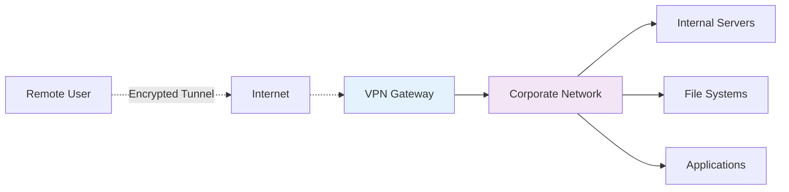
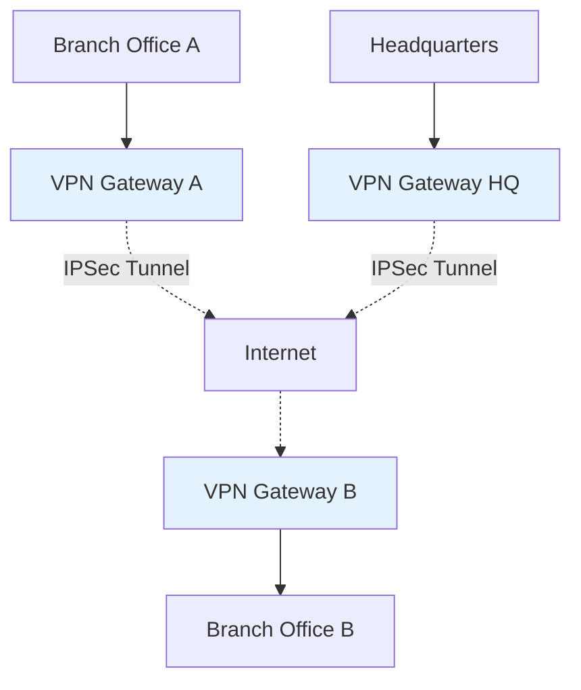
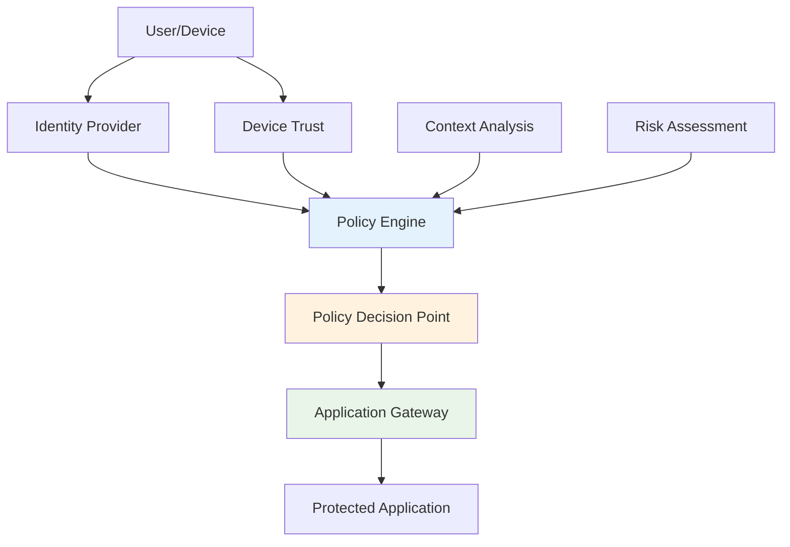

# VPN and Remote Access Security
## Unit III: Network & System Security
### Lecture 20: Securing Remote Connectivity and Access

<div class="absolute bottom-5 left-5 text-xs text-gray-500">
Course: Cyber Security (4353204) | Semester V | Diploma ICT | Author: Milav Dabgar
</div>

---
layout: default
---

# Virtual Private Networks Overview

<div class="grid grid-cols-2 gap-6">

<div>

## 🔐 What is a VPN?

**Virtual Private Network (VPN)** creates a secure, encrypted connection over an untrusted network, typically the internet.

### 🎯 Core VPN Functions
- **Data encryption** - Confidentiality protection
- **Authentication** - Identity verification
- **Data integrity** - Tamper detection
- **Access control** - Network resource protection
- **Anonymity** - Location and identity masking

### 📊 VPN Market Statistics
- **Global VPN market**: $31.1 billion (2020)
- **Expected growth**: 15.1% CAGR (2021-2028)
- **Enterprise adoption**: 89% of organizations
- **Remote work**: 300% increase in VPN usage
- **Security incidents**: 68% reduction with VPN

### 🌐 VPN Use Cases
```yaml
Enterprise Remote Access:
  - Work from home employees
  - Branch office connectivity
  - Business partner access
  - Mobile workforce support
  
Site-to-Site Connectivity:
  - Inter-office connections
  - Data center connectivity
  - Cloud integration
  - Backup site access
  
Consumer Privacy:
  - Internet privacy protection
  - Geo-restriction bypass
  - Public WiFi security
  - Online anonymity
```

</div>

<div>

## 🏗️ VPN Architecture Types

### 🌐 Remote Access VPN


### 🏢 Site-to-Site VPN


### 📊 VPN Protocols Comparison
| Protocol | Security | Speed | Compatibility | Use Case |
|----------|----------|-------|---------------|----------|
| **IPSec** | High | Medium | Universal | Site-to-Site |
| **OpenVPN** | High | Medium | Good | Flexibility |
| **IKEv2/IPSec** | High | Fast | Mobile | Mobile Users |
| **PPTP** | Low | Fast | Legacy | Deprecated |
| **L2TP/IPSec** | Medium | Medium | Wide | General Use |
| **WireGuard** | High | Very Fast | Growing | Modern |

### 🔧 VPN Deployment Models
```yaml
Hardware VPN:
  - Dedicated appliances
  - High performance
  - Enterprise features
  - Scalability support
  
Software VPN:
  - Application-based
  - Cost-effective
  - Flexible deployment
  - Easy management
  
Cloud VPN:
  - Managed service
  - Scalable infrastructure
  - Reduced maintenance
  - Global presence
```

</div>

</div>

<div class="absolute bottom-5 left-5 text-xs text-gray-500">
Course: Cyber Security (4353204) | Unit III | Lecture 20 | Author: Milav Dabgar
</div>

---
layout: default
---

# VPN Protocols and Technologies

<div class="grid grid-cols-2 gap-6">

<div>

## 🛡️ IPSec (Internet Protocol Security)

### 🔧 IPSec Architecture
```yaml
IPSec Components:
  Authentication Header (AH):
    - Data integrity
    - Authentication
    - Anti-replay protection
    - No encryption
  
  Encapsulating Security Payload (ESP):
    - Data confidentiality
    - Authentication
    - Integrity
    - Anti-replay protection
  
  Internet Key Exchange (IKE):
    - Key management
    - Security associations
    - Authentication methods
    - Perfect forward secrecy
```

### 📊 IPSec Modes
```yaml
Transport Mode:
  - End-to-end protection
  - Original IP header preserved
  - Payload encryption only
  - Host-to-host communication
  
Tunnel Mode:
  - Gateway-to-gateway protection
  - Entire IP packet encapsulated
  - New IP header added
  - Site-to-site VPNs
```

### 💻 IPSec Configuration Example
```bash
# Linux strongSwan IPSec configuration
# /etc/ipsec.conf
config setup
    charondebug="ike 1, knl 1, cfg 0"
    uniqueids=no

conn tunnel
    auto=start
    left=192.168.1.1
    leftsubnet=192.168.1.0/24
    leftfirewall=yes
    right=203.0.113.1
    rightsubnet=10.0.0.0/24
    ike=aes256-sha256-modp2048!
    esp=aes256-sha256!
    keyexchange=ikev2
    ikelifetime=86400s
    lifetime=3600s
    dpddelay=30s
    dpdtimeout=120s
    dpdaction=restart

# /etc/ipsec.secrets
192.168.1.1 203.0.113.1 : PSK "StrongPreSharedKey123!"

# Start IPSec
systemctl enable strongswan
systemctl start strongswan
ipsec up tunnel
```

</div>

<div>

## 🌐 SSL/TLS VPN (OpenVPN)

### 🔒 SSL VPN Advantages
```yaml
Benefits:
  - No client software installation required
  - Firewall and NAT friendly
  - Granular application access
  - Web-based administration
  - User-friendly interface
  
Use Cases:
  - Remote employee access
  - Contractor/partner access
  - BYOD environments
  - Application-specific access
  - Temporary access needs
```

### 💻 OpenVPN Configuration
```bash
# OpenVPN server configuration
# /etc/openvpn/server.conf
port 1194
proto udp
dev tun

ca ca.crt
cert server.crt
key server.key
dh dh2048.pem
tls-auth ta.key 0

server 10.8.0.0 255.255.255.0
ifconfig-pool-persist ipp.txt

# Push routes to clients
push "route 192.168.1.0 255.255.255.0"
push "redirect-gateway def1 bypass-dhcp"
push "dhcp-option DNS 8.8.8.8"
push "dhcp-option DNS 8.8.4.4"

# Security settings
cipher AES-256-CBC
auth SHA256
tls-version-min 1.2
tls-cipher TLS-ECDHE-RSA-WITH-AES-256-GCM-SHA384

# Connection settings
keepalive 10 120
comp-lzo
persist-key
persist-tun

# Privilege settings
user nobody
group nogroup

# Logging
status openvpn-status.log
log openvpn.log
verb 3

# Client configuration template
# client.ovpn
client
dev tun
proto udp
remote vpn.company.com 1194
resolv-retry infinite
nobind
persist-key
persist-tun
ca ca.crt
cert client.crt
key client.key
tls-auth ta.key 1
cipher AES-256-CBC
auth SHA256
verb 3
```

### 🔧 OpenVPN Key Management
```bash
# Certificate Authority setup
./easyrsa init-pki
./easyrsa build-ca nopass
./easyrsa gen-req server nopass
./easyrsa sign-req server server
./easyrsa gen-dh

# Client certificate generation
./easyrsa gen-req client1 nopass
./easyrsa sign-req client client1

# TLS authentication key
openvpn --genkey --secret ta.key

# Certificate revocation
./easyrsa revoke client1
./easyrsa gen-crl
```

</div>

</div>

<div class="absolute bottom-5 left-5 text-xs text-gray-500">
Course: Cyber Security (4353204) | Unit III | Lecture 20 | Author: Milav Dabgar
</div>

---
layout: default
---

# Modern VPN Technologies

<div class="grid grid-cols-2 gap-6">

<div>

## ⚡ WireGuard Protocol

### 🚀 WireGuard Advantages
```yaml
Modern Cryptography:
  - ChaCha20 for encryption
  - Poly1305 for authentication
  - Curve25519 for key exchange
  - BLAKE2s for hashing
  
Performance Benefits:
  - Minimal codebase (~4,000 lines)
  - Kernel-space implementation
  - UDP-based protocol
  - Reduced CPU overhead
  
Security Features:
  - Perfect forward secrecy
  - Cryptokey routing
  - Built-in roaming support
  - Resistance to timing attacks
```

### 💻 WireGuard Configuration
```bash
# Server configuration - /etc/wireguard/wg0.conf
[Interface]
PrivateKey = SERVER_PRIVATE_KEY
Address = 10.0.0.1/24
ListenPort = 51820
PostUp = iptables -A FORWARD -i %i -j ACCEPT; iptables -A FORWARD -o %i -j ACCEPT; iptables -t nat -A POSTROUTING -o eth0 -j MASQUERADE
PostDown = iptables -D FORWARD -i %i -j ACCEPT; iptables -D FORWARD -o %i -j ACCEPT; iptables -t nat -D POSTROUTING -o eth0 -j MASQUERADE
SaveConfig = true

[Peer]
PublicKey = CLIENT_PUBLIC_KEY
AllowedIPs = 10.0.0.2/32

# Client configuration
[Interface]
PrivateKey = CLIENT_PRIVATE_KEY
Address = 10.0.0.2/32
DNS = 8.8.8.8

[Peer]
PublicKey = SERVER_PUBLIC_KEY
Endpoint = vpn.company.com:51820
AllowedIPs = 0.0.0.0/0
PersistentKeepalive = 25

# Key generation
wg genkey | tee privatekey | wg pubkey > publickey

# Start WireGuard
systemctl enable wg-quick@wg0
systemctl start wg-quick@wg0
```

</div>

<div>

## 🔐 Zero Trust Network Access (ZTNA)

### 🎯 ZTNA Principles
```yaml
Never Trust, Always Verify:
  - Identity verification required
  - Device trust assessment
  - Application-level access
  - Continuous monitoring
  
Least Privilege Access:
  - Minimal necessary permissions
  - Application-specific access
  - Time-bound sessions
  - Just-in-time access
  
Assume Breach:
  - Micro-segmentation
  - Encrypted communications
  - Continuous verification
  - Behavioral analysis
```

### 🏗️ ZTNA Architecture


### 💻 ZTNA Implementation
```python
# Zero Trust Network Access Policy Engine
import hashlib
import time
from dataclasses import dataclass
from typing import List, Dict, Optional

@dataclass
class AccessRequest:
    user_id: str
    device_id: str
    application: str
    source_ip: str
    timestamp: float
    user_agent: str

@dataclass
class TrustScore:
    identity_score: float
    device_score: float
    behavior_score: float
    context_score: float
    overall_score: float

class ZTNAPolicyEngine:
    def __init__(self):
        self.trust_threshold = 0.7
        self.identity_provider = IdentityProvider()
        self.device_manager = DeviceTrustManager()
        self.behavior_analyzer = BehaviorAnalyzer()
        self.context_analyzer = ContextAnalyzer()
    
    def evaluate_access_request(self, request: AccessRequest) -> Dict:
        """Evaluate access request using Zero Trust principles"""
        
        # Calculate trust scores
        trust_score = self.calculate_trust_score(request)
        
        # Make access decision
        decision = self.make_access_decision(trust_score, request)
        
        return {
            'access_granted': decision.granted,
            'trust_score': trust_score.overall_score,
            'conditions': decision.conditions,
            'session_duration': decision.session_duration,
            'monitoring_level': decision.monitoring_level
        }
    
    def calculate_trust_score(self, request: AccessRequest) -> TrustScore:
        """Calculate comprehensive trust score"""
        
        # Identity trust (authentication, MFA, etc.)
        identity_score = self.identity_provider.get_trust_score(request.user_id)
        
        # Device trust (compliance, certificates, etc.)
        device_score = self.device_manager.get_trust_score(request.device_id)
        
        # Behavioral trust (normal patterns, anomalies)
        behavior_score = self.behavior_analyzer.analyze_behavior(request)
        
        # Context trust (location, time, network)
        context_score = self.context_analyzer.analyze_context(request)
        
        # Weighted overall score
        overall_score = (
            identity_score * 0.3 +
            device_score * 0.25 +
            behavior_score * 0.25 +
            context_score * 0.2
        )
        
        return TrustScore(
            identity_score=identity_score,
            device_score=device_score,
            behavior_score=behavior_score,
            context_score=context_score,
            overall_score=overall_score
        )
    
    def make_access_decision(self, trust_score: TrustScore, request: AccessRequest):
        """Make access decision based on trust score and policies"""
        
        class AccessDecision:
            def __init__(self):
                self.granted = False
                self.conditions = []
                self.session_duration = 0
                self.monitoring_level = 'normal'
        
        decision = AccessDecision()
        
        if trust_score.overall_score >= 0.9:
            # High trust - full access
            decision.granted = True
            decision.session_duration = 8 * 3600  # 8 hours
            decision.monitoring_level = 'low'
            
        elif trust_score.overall_score >= 0.7:
            # Medium trust - conditional access
            decision.granted = True
            decision.session_duration = 4 * 3600  # 4 hours
            decision.monitoring_level = 'normal'
            decision.conditions = ['require_mfa', 'limited_resources']
            
        elif trust_score.overall_score >= 0.5:
            # Low trust - restricted access
            decision.granted = True
            decision.session_duration = 1 * 3600  # 1 hour
            decision.monitoring_level = 'high'
            decision.conditions = ['require_mfa', 'restricted_access', 'continuous_auth']
            
        else:
            # Very low trust - deny access
            decision.granted = False
            decision.monitoring_level = 'critical'
        
        return decision
```

</div>

</div>

<div class="absolute bottom-5 left-5 text-xs text-gray-500">
Course: Cyber Security (4353204) | Unit III | Lecture 20 | Author: Milav Dabgar
</div>

---
layout: default
---

# Remote Access Authentication

<div class="grid grid-cols-2 gap-6">

<div>

## 🔐 Multi-Factor Authentication (MFA)

### 🎯 Authentication Factors
```yaml
Something You Know (Knowledge):
  - Passwords
  - PINs
  - Security questions
  - Passphrases
  
Something You Have (Possession):
  - Hardware tokens
  - Smart cards
  - Mobile devices
  - Software tokens
  
Something You Are (Inherence):
  - Fingerprints
  - Facial recognition
  - Voice recognition
  - Retinal scans
  
Something You Do (Behavior):
  - Typing patterns
  - Mouse movements
  - Walking gait
  - Signature dynamics
```

### 🛠️ RADIUS Authentication
```python
# RADIUS authentication for VPN access
import hashlib
import struct
import secrets
from typing import Dict, Optional

class RADIUSServer:
    def __init__(self):
        self.users = {}
        self.shared_secrets = {}
        self.mfa_required = True
    
    def add_user(self, username: str, password: str, attributes: Dict = None):
        """Add user to RADIUS database"""
        password_hash = hashlib.sha256(password.encode()).hexdigest()
        self.users[username] = {
            'password_hash': password_hash,
            'attributes': attributes or {},
            'failed_attempts': 0,
            'locked_until': None
        }
    
    def authenticate_user(self, username: str, password: str, 
                         client_ip: str, mfa_token: str = None) -> Dict:
        """Authenticate user with optional MFA"""
        
        # Check if user exists
        if username not in self.users:
            return {'success': False, 'reason': 'user_not_found'}
        
        user = self.users[username]
        
        # Check if account is locked
        if user.get('locked_until') and time.time() < user['locked_until']:
            return {'success': False, 'reason': 'account_locked'}
        
        # Verify password
        password_hash = hashlib.sha256(password.encode()).hexdigest()
        if password_hash != user['password_hash']:
            user['failed_attempts'] += 1
            if user['failed_attempts'] >= 3:
                user['locked_until'] = time.time() + 1800  # 30 minutes
            return {'success': False, 'reason': 'invalid_credentials'}
        
        # MFA verification if required
        if self.mfa_required:
            if not mfa_token:
                return {'success': False, 'reason': 'mfa_required'}
            
            if not self.verify_mfa_token(username, mfa_token):
                return {'success': False, 'reason': 'invalid_mfa'}
        
        # Reset failed attempts on successful auth
        user['failed_attempts'] = 0
        user['locked_until'] = None
        
        # Generate session attributes
        session_attributes = {
            'Session-Timeout': 3600,  # 1 hour
            'Idle-Timeout': 900,      # 15 minutes
            'Framed-IP-Address': self.allocate_ip_address(client_ip),
            'Filter-ID': self.get_user_filter(username),
            'Class': f"user:{username}:session:{secrets.token_hex(8)}"
        }
        
        return {
            'success': True,
            'attributes': session_attributes,
            'user_info': user['attributes']
        }
    
    def verify_mfa_token(self, username: str, token: str) -> bool:
        """Verify TOTP MFA token"""
        import pyotp
        
        user = self.users[username]
        if 'mfa_secret' not in user['attributes']:
            return False
        
        totp = pyotp.TOTP(user['attributes']['mfa_secret'])
        return totp.verify(token, valid_window=1)
    
    def allocate_ip_address(self, client_ip: str) -> str:
        """Allocate VPN IP address to client"""
        # Simplified IP allocation
        import ipaddress
        
        vpn_network = ipaddress.IPv4Network('10.8.0.0/24')
        for ip in vpn_network.hosts():
            if str(ip) not in self.allocated_ips:
                self.allocated_ips.add(str(ip))
                return str(ip)
        
        raise Exception("No available IP addresses")
```

</div>

<div>

## 🎫 Certificate-Based Authentication

### 🏗️ PKI for VPN Authentication
```yaml
Certificate Authority (CA):
  - Root CA certificate
  - Certificate signing requests
  - Certificate revocation lists
  - OCSP responder
  
User Certificates:
  - Personal certificates
  - Smart card certificates
  - Mobile device certificates
  - Machine certificates
  
Certificate Validation:
  - Certificate chain verification
  - Expiration checking
  - Revocation status (CRL/OCSP)
  - Key usage validation
```

### 💻 Certificate Management
```bash
# OpenSSL certificate management for VPN

# Create CA private key and certificate
openssl genpkey -algorithm RSA -out ca-key.pem -pkcs8 -aes256 -pass pass:ca-password
openssl req -new -x509 -key ca-key.pem -out ca-cert.pem -days 3650 \
    -subj "/C=US/ST=CA/L=San Francisco/O=Company/CN=VPN-CA"

# Generate server certificate
openssl genpkey -algorithm RSA -out server-key.pem -pkcs8
openssl req -new -key server-key.pem -out server-csr.pem \
    -subj "/C=US/ST=CA/L=San Francisco/O=Company/CN=vpn.company.com"
openssl x509 -req -in server-csr.pem -CA ca-cert.pem -CAkey ca-key.pem \
    -CAcreateserial -out server-cert.pem -days 365

# Generate client certificate
openssl genpkey -algorithm RSA -out client-key.pem -pkcs8
openssl req -new -key client-key.pem -out client-csr.pem \
    -subj "/C=US/ST=CA/L=San Francisco/O=Company/CN=user@company.com"
openssl x509 -req -in client-csr.pem -CA ca-cert.pem -CAkey ca-key.pem \
    -CAcreateserial -out client-cert.pem -days 365

# Create PKCS#12 file for client
openssl pkcs12 -export -out client.p12 \
    -inkey client-key.pem -in client-cert.pem -certfile ca-cert.pem

# Revoke certificate (create CRL)
openssl ca -config openssl.conf -revoke client-cert.pem
openssl ca -config openssl.conf -gencrl -out crl.pem
```

### 🔧 Smart Card Authentication
```yaml
Smart Card Components:
  Hardware Token:
    - Tamper-resistant hardware
    - Cryptographic processor
    - Secure key storage
    - PIN protection
  
  Certificate Storage:
    - X.509 digital certificates
    - Private key protection
    - Multiple certificates
    - Certificate chaining
  
  Authentication Process:
    - Card insertion/detection
    - PIN verification
    - Certificate selection
    - Cryptographic operations
  
  Integration:
    - PKCS#11 interface
    - Microsoft CAPI
    - macOS Keychain
    - Linux OpenSC
```

</div>

</div>

<div class="absolute bottom-5 left-5 text-xs text-gray-500">
Course: Cyber Security (4353204) | Unit III | Lecture 20 | Author: Milav Dabgar
</div>

---
layout: default
---

# VPN Security Best Practices

<div class="grid grid-cols-2 gap-6">

<div>

## 🛡️ VPN Configuration Security

### 🔧 Security Hardening
```yaml
Encryption Standards:
  - AES-256 for data encryption
  - SHA-256 for authentication
  - RSA 2048+ or ECDSA P-256+ for key exchange
  - Perfect Forward Secrecy (PFS)
  - Disable weak ciphers (DES, RC4, MD5)
  
Authentication:
  - Multi-factor authentication
  - Certificate-based authentication
  - Strong password policies
  - Account lockout policies
  - Session timeout limits
  
Network Security:
  - Split tunneling controls
  - DNS leak protection
  - Kill switch functionality
  - IP leak prevention
  - Traffic routing policies
```

### 💻 Secure VPN Policy Template
```yaml
# Corporate VPN Security Policy
vpn_security_policy:
  authentication:
    methods: [certificate, mfa]
    password_requirements:
      min_length: 12
      complexity: high
      expiry_days: 90
    mfa_required: true
    failed_login_threshold: 3
    lockout_duration: 1800  # 30 minutes
  
  encryption:
    algorithms:
      symmetric: AES-256
      asymmetric: RSA-2048
      hash: SHA-256
    protocols: [IKEv2, OpenVPN, WireGuard]
    pfs_required: true
  
  session_management:
    max_duration: 28800  # 8 hours
    idle_timeout: 1800   # 30 minutes
    concurrent_sessions: 1
    reconnect_attempts: 3
  
  network_controls:
    split_tunneling: disabled
    dns_servers: [8.8.8.8, 8.8.4.4]
    allowed_protocols: [https, ssh, rdp]
    blocked_ports: [22, 23, 135, 445]
  
  monitoring:
    session_logging: enabled
    traffic_analysis: enabled
    failed_auth_alerting: enabled
    bandwidth_monitoring: enabled
```

</div>

<div>

## 📊 VPN Monitoring and Logging

### 🔍 Security Monitoring
```python
# VPN Security Monitoring System
import json
import time
from collections import defaultdict
from dataclasses import dataclass
from typing import List, Dict

@dataclass
class VPNSession:
    session_id: str
    username: str
    client_ip: str
    vpn_ip: str
    start_time: float
    last_activity: float
    bytes_in: int
    bytes_out: int
    protocol: str

class VPNSecurityMonitor:
    def __init__(self):
        self.active_sessions = {}
        self.failed_logins = defaultdict(list)
        self.suspicious_activities = []
        self.alert_thresholds = {
            'failed_login_count': 5,
            'failed_login_window': 900,  # 15 minutes
            'unusual_traffic_threshold': 1000000000,  # 1GB
            'session_duration_limit': 28800,  # 8 hours
            'concurrent_session_limit': 1
        }
    
    def log_authentication_attempt(self, username: str, client_ip: str, 
                                  success: bool, method: str):
        """Log authentication attempt"""
        log_entry = {
            'timestamp': time.time(),
            'username': username,
            'client_ip': client_ip,
            'success': success,
            'method': method,
            'event_type': 'authentication'
        }
        
        # Store failed attempts for analysis
        if not success:
            self.failed_logins[client_ip].append(time.time())
            self.check_brute_force_attack(client_ip, username)
        
        self.write_security_log(log_entry)
    
    def track_session(self, session: VPNSession):
        """Track active VPN session"""
        self.active_sessions[session.session_id] = session
        
        # Check for suspicious activities
        self.check_concurrent_sessions(session.username)
        self.check_unusual_traffic(session)
        self.check_session_duration(session)
    
    def check_brute_force_attack(self, client_ip: str, username: str):
        """Detect brute force authentication attacks"""
        now = time.time()
        window_start = now - self.alert_thresholds['failed_login_window']
        
        # Count failed attempts in time window
        recent_failures = [
            ts for ts in self.failed_logins[client_ip] 
            if ts > window_start
        ]
        
        if len(recent_failures) >= self.alert_thresholds['failed_login_count']:
            self.generate_security_alert(
                'BRUTE_FORCE_ATTACK',
                f"Multiple failed login attempts from {client_ip} for user {username}",
                {'client_ip': client_ip, 'username': username, 'attempts': len(recent_failures)}
            )
    
    def check_concurrent_sessions(self, username: str):
        """Check for concurrent session violations"""
        user_sessions = [
            s for s in self.active_sessions.values() 
            if s.username == username
        ]
        
        if len(user_sessions) > self.alert_thresholds['concurrent_session_limit']:
            self.generate_security_alert(
                'CONCURRENT_SESSION_VIOLATION',
                f"User {username} has {len(user_sessions)} concurrent sessions",
                {'username': username, 'session_count': len(user_sessions)}
            )
    
    def check_unusual_traffic(self, session: VPNSession):
        """Detect unusual traffic patterns"""
        total_traffic = session.bytes_in + session.bytes_out
        
        if total_traffic > self.alert_thresholds['unusual_traffic_threshold']:
            self.generate_security_alert(
                'UNUSUAL_TRAFFIC_VOLUME',
                f"High traffic volume detected for session {session.session_id}",
                {'username': session.username, 'traffic_bytes': total_traffic}
            )
    
    def generate_security_alert(self, alert_type: str, message: str, details: Dict):
        """Generate security alert"""
        alert = {
            'timestamp': time.time(),
            'type': alert_type,
            'message': message,
            'details': details,
            'severity': self.get_alert_severity(alert_type)
        }
        
        self.suspicious_activities.append(alert)
        self.send_alert_notification(alert)
        
        print(f"[SECURITY ALERT] {alert_type}: {message}")
    
    def get_alert_severity(self, alert_type: str) -> str:
        """Determine alert severity"""
        high_severity = ['BRUTE_FORCE_ATTACK', 'MALWARE_DETECTED']
        medium_severity = ['CONCURRENT_SESSION_VIOLATION', 'POLICY_VIOLATION']
        
        if alert_type in high_severity:
            return 'HIGH'
        elif alert_type in medium_severity:
            return 'MEDIUM'
        else:
            return 'LOW'
    
    def write_security_log(self, log_entry: Dict):
        """Write security log entry"""
        with open('/var/log/vpn-security.log', 'a') as f:
            f.write(json.dumps(log_entry) + '\n')
```

### 📈 Performance Monitoring
```yaml
Key Metrics:
  Connection Metrics:
    - Active sessions count
    - Authentication success rate
    - Connection establishment time
    - Session duration average
  
  Performance Metrics:
    - Throughput per tunnel
    - Latency measurements
    - Packet loss rates
    - CPU/memory utilization
  
  Security Metrics:
    - Failed authentication attempts
    - Policy violations
    - Suspicious activity events
    - Certificate expiration status
```

</div>

</div>

<div class="absolute bottom-5 left-5 text-xs text-gray-500">
Course: Cyber Security (4353204) | Unit III | Lecture 20 | Author: Milav Dabgar
</div>

---
layout: default
---

# Practical Exercise: VPN Security Design

<div class="exercise-container">

## 🎯 Group Activity (35 minutes)

### Scenario: Enterprise Remote Access Solution

Your organization needs to design a comprehensive VPN solution for:

**Organization Profile:**
- **Global corporation** with 5000 employees
- **Remote workforce** of 2000+ employees worldwide
- **Branch offices** in 25 countries
- **Third-party contractors** requiring temporary access
- **Mobile workforce** using various devices
- **Compliance requirements** (SOX, HIPAA, PCI DSS, GDPR)

**Technical Requirements:**
- **High availability** with 99.9% uptime SLA
- **Scalability** to support 10,000 concurrent connections
- **Performance** with minimal latency impact
- **Security** with zero-trust principles
- **Cost optimization** with efficient resource usage
- **Management** through centralized console

### Task: Comprehensive VPN Architecture Design

**Phase 1: Architecture Planning (12 minutes)**

**VPN Technology Selection:**
1. Which VPN protocols would you recommend and why?
2. How would you design the VPN gateway architecture?
3. What redundancy and load balancing would you implement?
4. How would you handle different client types and devices?

**Network Design:**
1. How would you structure the VPN addressing scheme?
2. What routing policies would you implement?
3. How would you handle split tunneling requirements?
4. What DNS and name resolution strategy would you use?

**Phase 2: Security Implementation (12 minutes)**

**Authentication Strategy:**
1. What multi-factor authentication methods would you deploy?
2. How would you implement certificate-based authentication?
3. What identity provider integration would you use?
4. How would you handle privileged user access?

**Security Policies:**
1. What encryption standards would you enforce?
2. How would you implement zero-trust network access?
3. What session management policies would you establish?
4. How would you handle device compliance requirements?

**Phase 3: Operations and Monitoring (11 minutes)**

**Monitoring and Logging:**
1. What VPN security monitoring would you implement?
2. How would you detect and respond to security incidents?
3. What performance metrics would you track?
4. How would you handle compliance reporting?

**Management and Maintenance:**
1. How would you handle certificate lifecycle management?
2. What automated provisioning and deprovisioning would you implement?
3. How would you manage software updates and patches?
4. What disaster recovery procedures would you establish?

**Deliverables:**
- VPN architecture diagram
- Security policy framework
- Authentication and authorization design
- Monitoring and incident response plan
- Implementation roadmap with phases

</div>

<style>
.exercise-container {
  @apply bg-green-50 border-2 border-green-300 rounded-lg p-6;
}
</style>

<div class="absolute bottom-5 left-5 text-xs text-gray-500">
Course: Cyber Security (4353204) | Unit III | Lecture 20 | Author: Milav Dabgar
</div>

---
layout: center
class: text-center
---

# Questions & Discussion

## 🤔 Discussion Points:
- How do you balance VPN security with user experience?
- What's your approach to securing BYOD VPN access?
- How do you handle VPN scalability challenges?

### 💡 Exercise Review
Share your VPN architecture designs and discuss implementation strategies

<div class="absolute bottom-5 left-5 text-xs text-gray-500">
Course: Cyber Security (4353204) | Unit III | Lecture 20 | Author: Milav Dabgar
</div>

---
layout: center
class: text-center
---

# Thank You!

## Next Lecture: Cloud Security Fundamentals
### Securing Cloud Computing Environments

<div class="pt-8 text-gray-500">
  <p>Cyber Security (4353204) - Lecture 20 Complete</p>
  <p>Secure connections: Bridging trust across distances! 🌐🔐</p>
</div>

<div class="absolute bottom-5 left-5 text-xs text-gray-500">
Course: Cyber Security (4353204) | Unit III | Lecture 20 | Author: Milav Dabgar
</div>