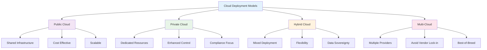
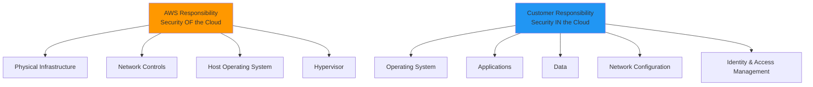

# Cloud Security Fundamentals
## Unit III: Network & System Security
### Lecture 21: Securing Cloud Computing Environments

<div class="absolute bottom-5 left-5 text-xs text-gray-500">
Course: Cyber Security (4353204) | Semester V | Diploma ICT | Author: Milav Dabgar
</div>

---
layout: default
---

# Cloud Computing Security Overview

<div class="grid grid-cols-2 gap-6">

<div>

## ☁️ What is Cloud Security?

**Cloud Security** encompasses the policies, technologies, and controls designed to protect cloud computing environments, data, applications, and infrastructure.

### 🎯 Cloud Security Objectives
- **Data protection** - Confidentiality and privacy
- **Identity management** - Access control and authentication
- **Compliance** - Regulatory requirements
- **Availability** - Service uptime and reliability
- **Incident response** - Threat detection and mitigation

### 📊 Cloud Adoption Statistics
- **94%** of enterprises use cloud services
- **$482 billion** global cloud market (2022)
- **23%** increase in cloud spending annually
- **60%** of organizations have multi-cloud strategy
- **$4.45 million** average cost of cloud data breach

### 🌐 Cloud Service Models
```yaml
Infrastructure as a Service (IaaS):
  - Virtual machines and storage
  - Network components
  - Operating system management
  - Examples: AWS EC2, Azure VMs, GCP Compute
  
Platform as a Service (PaaS):
  - Development platforms
  - Runtime environments
  - Database services
  - Examples: AWS Lambda, Azure App Service
  
Software as a Service (SaaS):
  - Ready-to-use applications
  - Web-based software
  - Subscription model
  - Examples: Office 365, Salesforce, Google Workspace
```

</div>

<div>

## 🏗️ Cloud Deployment Models

### 📊 Deployment Model Comparison


### 🔧 Security Implications by Model
```yaml
Public Cloud:
  Benefits:
    - Professional security teams
    - Regular security updates
    - Compliance certifications
    - Advanced security tools
  Challenges:
    - Shared responsibility model
    - Limited control
    - Data residency concerns
    - Multi-tenancy risks
  
Private Cloud:
  Benefits:
    - Complete control
    - Customizable security
    - Data sovereignty
    - Dedicated resources
  Challenges:
    - Higher costs
    - Resource requirements
    - Security expertise needed
    - Maintenance overhead
  
Hybrid Cloud:
  Benefits:
    - Flexibility in placement
    - Gradual migration
    - Cost optimization
    - Compliance options
  Challenges:
    - Complex security management
    - Integration challenges
    - Consistent policies
    - Multiple attack surfaces
```

</div>

</div>

<div class="absolute bottom-5 left-5 text-xs text-gray-500">
Course: Cyber Security (4353204) | Unit III | Lecture 21 | Author: Milav Dabgar
</div>

---
layout: default
---

# Shared Responsibility Model

<div class="grid grid-cols-2 gap-6">

<div>

## 🤝 Understanding Shared Responsibility

### 📊 AWS Shared Responsibility Model


### 🔧 Responsibility Matrix by Service Type
```yaml
IaaS (e.g., EC2):
  AWS Manages:
    - Physical security
    - Network infrastructure
    - Hypervisor
    - Host operating system
    
  Customer Manages:
    - Guest operating system
    - Applications
    - Data encryption
    - Network traffic protection
    - IAM policies
  
PaaS (e.g., RDS):
  AWS Manages:
    - Database engine
    - Operating system patching
    - Backup management
    - High availability
    
  Customer Manages:
    - Database access controls
    - Data encryption
    - Network security
    - Application-level security
  
SaaS (e.g., WorkMail):
  AWS Manages:
    - Application security
    - Infrastructure security
    - Platform maintenance
    - Data durability
    
  Customer Manages:
    - User access management
    - Data classification
    - Client-side data protection
    - Usage monitoring
```

</div>

<div>

## 🛡️ Customer Security Responsibilities

### 💻 Infrastructure Security Configuration
```yaml
# AWS CloudFormation template for secure infrastructure
Resources:
  VPC:
    Type: AWS::EC2::VPC
    Properties:
      CidrBlock: 10.0.0.0/16
      EnableDnsHostnames: true
      EnableDnsSupport: true
      
  PrivateSubnet:
    Type: AWS::EC2::Subnet
    Properties:
      VpcId: !Ref VPC
      CidrBlock: 10.0.1.0/24
      MapPublicIpOnLaunch: false
      
  SecurityGroup:
    Type: AWS::EC2::SecurityGroup
    Properties:
      GroupDescription: Secure application security group
      VpcId: !Ref VPC
      SecurityGroupIngress:
        - IpProtocol: tcp
          FromPort: 443
          ToPort: 443
          CidrIp: 10.0.0.0/16
          Description: HTTPS from VPC only
      SecurityGroupEgress:
        - IpProtocol: tcp
          FromPort: 443
          ToPort: 443
          CidrIp: 0.0.0.0/0
          Description: HTTPS outbound only
          
  KMSKey:
    Type: AWS::KMS::Key
    Properties:
      Description: Encryption key for application data
      KeyPolicy:
        Statement:
          - Effect: Allow
            Principal:
              AWS: !Sub "arn:aws:iam::${AWS::AccountId}:root"
            Action: "kms:*"
            Resource: "*"
          - Effect: Allow
            Principal:
              AWS: !Sub "arn:aws:iam::${AWS::AccountId}:role/ApplicationRole"
            Action:
              - "kms:Encrypt"
              - "kms:Decrypt"
              - "kms:ReEncrypt*"
              - "kms:GenerateDataKey*"
              - "kms:DescribeKey"
            Resource: "*"
```

### 🔐 Identity and Access Management
```python
# AWS IAM policy automation
import boto3
import json

class CloudSecurityManager:
    def __init__(self):
        self.iam = boto3.client('iam')
        self.sts = boto3.client('sts')
    
    def create_least_privilege_policy(self, user_role, required_actions, resources):
        """Create IAM policy with least privilege principle"""
        policy_document = {
            "Version": "2012-10-17",
            "Statement": []
        }
        
        # Group actions by resource type
        resource_actions = {}
        for action in required_actions:
            resource_type = action.split(':')[0]
            if resource_type not in resource_actions:
                resource_actions[resource_type] = []
            resource_actions[resource_type].append(action)
        
        # Create statements for each resource type
        for resource_type, actions in resource_actions.items():
            statement = {
                "Effect": "Allow",
                "Action": actions,
                "Resource": resources.get(resource_type, "*"),
                "Condition": self.get_security_conditions(resource_type)
            }
            policy_document["Statement"].append(statement)
        
        # Add explicit deny for dangerous actions
        deny_statement = {
            "Effect": "Deny",
            "Action": [
                "iam:DeleteRole",
                "iam:DeletePolicy",
                "iam:PutRolePolicy",
                "*:DeleteSecurityGroup",
                "kms:ScheduleKeyDeletion"
            ],
            "Resource": "*"
        }
        policy_document["Statement"].append(deny_statement)
        
        return policy_document
    
    def get_security_conditions(self, resource_type):
        """Add security conditions to IAM policies"""
        base_conditions = {
            "Bool": {
                "aws:SecureTransport": "true"
            },
            "IpAddress": {
                "aws:SourceIp": ["10.0.0.0/8", "172.16.0.0/12"]
            }
        }
        
        # Add MFA requirement for sensitive actions
        if resource_type in ['iam', 'kms', 'sts']:
            base_conditions["Bool"]["aws:MultiFactorAuthPresent"] = "true"
            base_conditions["NumericLessThan"] = {
                "aws:MultiFactorAuthAge": "3600"  # MFA within 1 hour
            }
        
        return base_conditions
    
    def audit_permissions(self, username):
        """Audit user permissions for security compliance"""
        try:
            # Get user policies
            user_policies = self.iam.list_attached_user_policies(UserName=username)
            group_policies = self.get_user_group_policies(username)
            
            # Analyze permissions
            permissions_analysis = {
                'excessive_permissions': [],
                'missing_conditions': [],
                'compliance_issues': []
            }
            
            # Check for overly permissive policies
            for policy in user_policies['AttachedPolicies']:
                policy_version = self.iam.get_policy(PolicyArn=policy['PolicyArn'])
                policy_document = self.iam.get_policy_version(
                    PolicyArn=policy['PolicyArn'],
                    VersionId=policy_version['Policy']['DefaultVersionId']
                )
                
                # Check for wildcards in actions or resources
                statements = policy_document['PolicyVersion']['Document']['Statement']
                for statement in statements:
                    if statement.get('Effect') == 'Allow':
                        if '*' in statement.get('Action', []):
                            permissions_analysis['excessive_permissions'].append(
                                f"Wildcard action in policy {policy['PolicyName']}"
                            )
                        if '*' in statement.get('Resource', []):
                            permissions_analysis['excessive_permissions'].append(
                                f"Wildcard resource in policy {policy['PolicyName']}"
                            )
                        if 'Condition' not in statement:
                            permissions_analysis['missing_conditions'].append(
                                f"Missing conditions in policy {policy['PolicyName']}"
                            )
            
            return permissions_analysis
            
        except Exception as e:
            return {'error': f"Failed to audit permissions: {str(e)}"}
```

</div>

</div>

<div class="absolute bottom-5 left-5 text-xs text-gray-500">
Course: Cyber Security (4353204) | Unit III | Lecture 21 | Author: Milav Dabgar
</div>

---
layout: default
---

# Cloud Security Threats and Risks

<div class="grid grid-cols-2 gap-6">

<div>

## 🚨 Top Cloud Security Threats

### 💀 OWASP Cloud Top 10 (2019)
```yaml
1. Insufficient Identity, Credential, and Access Management:
   - Weak authentication mechanisms
   - Poor credential management
   - Inadequate access controls
   - Privilege escalation risks
   
2. Insecure Interfaces and APIs:
   - Authentication bypass
   - Injection vulnerabilities
   - Insufficient authorization
   - Data exposure through APIs
   
3. Misconfiguration and Inadequate Change Control:
   - Default credentials
   - Open cloud storage buckets
   - Unnecessary services enabled
   - Poor configuration management
   
4. Lack of Cloud Security Architecture and Strategy:
   - No security design principles
   - Inadequate threat modeling
   - Insufficient security controls
   - Poor incident response planning
   
5. Insufficient Identity, Credential, Access Management:
   - Weak password policies
   - Lack of multi-factor authentication
   - Inadequate privilege management
   - Poor key management
```

### 🔍 Data Breach Examples
```yaml
Capital One (2019):
  Impact: 100 million customers affected
  Cause: Misconfigured web application firewall
  Cost: $80 million in fines
  Lesson: Proper configuration management
  
Equifax (2017):
  Impact: 147 million records exposed
  Cause: Unpatched Apache Struts vulnerability
  Cost: $700 million settlement
  Lesson: Timely patch management
  
Accenture (2017):
  Impact: 40,000 documents exposed
  Cause: Misconfigured AWS S3 bucket
  Cost: Reputation damage
  Lesson: Default security settings review
```

</div>

<div>

## 🛡️ Cloud Attack Vectors

### 🎯 Common Attack Methods
```yaml
Account Hijacking:
  Techniques:
    - Credential stuffing attacks
    - Social engineering
    - Malware keyloggers
    - Session hijacking
  Prevention:
    - Multi-factor authentication
    - Strong password policies
    - Session management
    - Behavioral monitoring
    
Data Breaches:
  Techniques:
    - Misconfigured storage
    - Unencrypted data
    - Weak access controls
    - SQL injection
  Prevention:
    - Encryption at rest/transit
    - Access controls
    - Regular security audits
    - Data classification
    
Insider Threats:
  Techniques:
    - Privileged access abuse
    - Data exfiltration
    - Malicious activities
    - Negligent behavior
  Prevention:
    - Least privilege access
    - Activity monitoring
    - Background checks
    - Security awareness training
```

### 💻 Attack Simulation
```python
# Cloud security threat detection simulation
import boto3
import json
import time
from datetime import datetime, timedelta

class CloudThreatDetector:
    def __init__(self):
        self.cloudtrail = boto3.client('cloudtrail')
        self.guardduty = boto3.client('guardduty')
        self.s3 = boto3.client('s3')
        self.threat_indicators = {}
    
    def detect_unusual_api_activity(self, user_name, time_window=3600):
        """Detect unusual API call patterns"""
        end_time = datetime.utcnow()
        start_time = end_time - timedelta(seconds=time_window)
        
        # Get CloudTrail events
        response = self.cloudtrail.lookup_events(
            LookupAttributes=[
                {
                    'AttributeKey': 'Username',
                    'AttributeValue': user_name
                }
            ],
            StartTime=start_time,
            EndTime=end_time
        )
        
        events = response['Events']
        
        # Analyze API call patterns
        api_calls = {}
        for event in events:
            event_name = event['EventName']
            api_calls[event_name] = api_calls.get(event_name, 0) + 1
        
        # Check for suspicious patterns
        threats = []
        
        # High-frequency API calls
        for api_call, count in api_calls.items():
            if count > 100:  # Threshold for unusual activity
                threats.append({
                    'type': 'HIGH_FREQUENCY_API_CALLS',
                    'description': f'User {user_name} made {count} {api_call} calls',
                    'severity': 'MEDIUM'
                })
        
        # Dangerous API calls
        dangerous_apis = [
            'DeleteBucket', 'DeleteSecurityGroup', 'DeleteRole',
            'AttachUserPolicy', 'CreateUser', 'ModifyDBInstance'
        ]
        
        for api_call in api_calls:
            if any(dangerous in api_call for dangerous in dangerous_apis):
                threats.append({
                    'type': 'DANGEROUS_API_CALL',
                    'description': f'User {user_name} performed {api_call}',
                    'severity': 'HIGH'
                })
        
        return threats
    
    def check_public_s3_buckets(self):
        """Check for publicly accessible S3 buckets"""
        public_buckets = []
        
        try:
            # List all buckets
            buckets = self.s3.list_buckets()
            
            for bucket in buckets['Buckets']:
                bucket_name = bucket['Name']
                
                # Check bucket ACL
                try:
                    acl = self.s3.get_bucket_acl(Bucket=bucket_name)
                    
                    for grant in acl['Grants']:
                        grantee = grant.get('Grantee', {})
                        if grantee.get('URI') == 'http://acs.amazonaws.com/groups/global/AllUsers':
                            public_buckets.append({
                                'bucket_name': bucket_name,
                                'permissions': grant['Permission'],
                                'risk_level': 'HIGH'
                            })
                
                except Exception:
                    # Access denied or other error
                    continue
        
        except Exception as e:
            return {'error': f'Failed to check S3 buckets: {str(e)}'}
        
        return public_buckets
    
    def detect_privilege_escalation(self, events):
        """Detect potential privilege escalation attempts"""
        escalation_indicators = [
            'AttachUserPolicy',
            'AttachRolePolicy', 
            'PutUserPolicy',
            'PutRolePolicy',
            'CreateRole',
            'AddUserToGroup'
        ]
        
        threats = []
        
        for event in events:
            event_name = event['EventName']
            if event_name in escalation_indicators:
                source_ip = event.get('SourceIPAddress', 'Unknown')
                user_identity = event.get('UserIdentity', {})
                
                threats.append({
                    'type': 'PRIVILEGE_ESCALATION_ATTEMPT',
                    'event': event_name,
                    'user': user_identity.get('userName', 'Unknown'),
                    'source_ip': source_ip,
                    'timestamp': event['EventTime'],
                    'severity': 'HIGH'
                })
        
        return threats
```

</div>

</div>

<div class="absolute bottom-5 left-5 text-xs text-gray-500">
Course: Cyber Security (4353204) | Unit III | Lecture 21 | Author: Milav Dabgar
</div>

---
layout: default
---

# Cloud Security Controls and Best Practices

<div class="grid grid-cols-2 gap-6">

<div>

## 🔐 Identity and Access Management

### 🎯 IAM Best Practices
```yaml
Principle of Least Privilege:
  - Grant minimum necessary permissions
  - Regular access reviews
  - Time-limited access
  - Just-in-time privileges
  
Strong Authentication:
  - Multi-factor authentication (MFA)
  - Strong password policies
  - Certificate-based authentication
  - Conditional access policies
  
Account Management:
  - Regular user audits
  - Automated provisioning/deprovisioning
  - Role-based access control (RBAC)
  - Privileged account management
  
Monitoring and Logging:
  - Access logging
  - Failed login monitoring
  - Privilege usage tracking
  - Anomaly detection
```

### 💻 AWS IAM Security Configuration
```python
# Automated IAM security baseline
import boto3
import json

class IAMSecurityBaseline:
    def __init__(self):
        self.iam = boto3.client('iam')
    
    def enforce_password_policy(self):
        """Enforce strong password policy"""
        try:
            self.iam.update_account_password_policy(
                MinimumPasswordLength=14,
                RequireSymbols=True,
                RequireNumbers=True,
                RequireUppercaseCharacters=True,
                RequireLowercaseCharacters=True,
                AllowUsersToChangePassword=True,
                MaxPasswordAge=90,
                PasswordReusePrevention=12,
                HardExpiry=False
            )
            return {"status": "success", "message": "Password policy enforced"}
        except Exception as e:
            return {"status": "error", "message": str(e)}
    
    def enable_mfa_for_users(self, user_list):
        """Enable MFA requirement for specified users"""
        mfa_policy = {
            "Version": "2012-10-17",
            "Statement": [
                {
                    "Effect": "Deny",
                    "Action": "*",
                    "Resource": "*",
                    "Condition": {
                        "BoolIfExists": {
                            "aws:MultiFactorAuthPresent": "false"
                        }
                    }
                }
            ]
        }
        
        policy_name = "EnforceMFAPolicy"
        
        # Create or update MFA policy
        try:
            self.iam.create_policy(
                PolicyName=policy_name,
                PolicyDocument=json.dumps(mfa_policy),
                Description="Enforces MFA for all operations"
            )
        except self.iam.exceptions.EntityAlreadyExistsException:
            # Policy already exists, update it
            policies = self.iam.list_policies(Scope='Local', OnlyAttached=False)
            for policy in policies['Policies']:
                if policy['PolicyName'] == policy_name:
                    self.iam.create_policy_version(
                        PolicyArn=policy['Arn'],
                        PolicyDocument=json.dumps(mfa_policy),
                        SetAsDefault=True
                    )
                    break
        
        # Attach policy to users
        results = []
        for user in user_list:
            try:
                self.iam.attach_user_policy(
                    UserName=user,
                    PolicyArn=f"arn:aws:iam::{self.get_account_id()}:policy/{policy_name}"
                )
                results.append({"user": user, "status": "success"})
            except Exception as e:
                results.append({"user": user, "status": "error", "message": str(e)})
        
        return results
    
    def create_security_audit_role(self):
        """Create role for security auditing with read-only permissions"""
        trust_policy = {
            "Version": "2012-10-17",
            "Statement": [
                {
                    "Effect": "Allow",
                    "Principal": {
                        "Service": "ec2.amazonaws.com"
                    },
                    "Action": "sts:AssumeRole",
                    "Condition": {
                        "StringEquals": {
                            "aws:RequestedRegion": ["us-east-1", "us-west-2"]
                        }
                    }
                }
            ]
        }
        
        try:
            # Create role
            role = self.iam.create_role(
                RoleName="SecurityAuditRole",
                AssumeRolePolicyDocument=json.dumps(trust_policy),
                Description="Role for security auditing with read-only access",
                MaxSessionDuration=3600  # 1 hour maximum
            )
            
            # Attach read-only policies
            readonly_policies = [
                "arn:aws:iam::aws:policy/SecurityAudit",
                "arn:aws:iam::aws:policy/ReadOnlyAccess"
            ]
            
            for policy_arn in readonly_policies:
                self.iam.attach_role_policy(
                    RoleName="SecurityAuditRole",
                    PolicyArn=policy_arn
                )
            
            return {"status": "success", "role_arn": role['Role']['Arn']}
        
        except Exception as e:
            return {"status": "error", "message": str(e)}
```

</div>

<div>

## 🔒 Data Protection in Cloud

### 📊 Encryption Strategy
```yaml
Data at Rest Encryption:
  AWS Services:
    - S3: Server-side encryption (SSE-S3, SSE-KMS, SSE-C)
    - EBS: Volume encryption with KMS
    - RDS: Database encryption
    - DynamoDB: Encryption at rest
  
  Key Management:
    - AWS KMS (Key Management Service)
    - Customer managed keys
    - Key rotation policies
    - Cross-region key replication
  
Data in Transit Encryption:
  - TLS/SSL for all communications
  - VPC endpoints for internal traffic
  - Certificate management
  - Perfect forward secrecy
  
Data in Use Encryption:
  - Application-level encryption
  - Homomorphic encryption
  - Secure enclaves
  - Confidential computing
```

### 🛡️ Data Loss Prevention
```python
# Cloud DLP implementation
import boto3
import re
import hashlib

class CloudDLP:
    def __init__(self):
        self.s3 = boto3.client('s3')
        self.comprehend = boto3.client('comprehend')
        self.macie = boto3.client('macie2')
        
        # Common PII patterns
        self.pii_patterns = {
            'ssn': r'\b\d{3}-\d{2}-\d{4}\b',
            'credit_card': r'\b\d{4}[\s-]?\d{4}[\s-]?\d{4}[\s-]?\d{4}\b',
            'email': r'\b[A-Za-z0-9._%+-]+@[A-Za-z0-9.-]+\.[A-Z|a-z]{2,}\b',
            'phone': r'\b\d{3}[-.]?\d{3}[-.]?\d{4}\b',
            'ip_address': r'\b\d{1,3}\.\d{1,3}\.\d{1,3}\.\d{1,3}\b'
        }
    
    def scan_s3_bucket_for_pii(self, bucket_name):
        """Scan S3 bucket for PII data"""
        findings = []
        
        try:
            # List objects in bucket
            response = self.s3.list_objects_v2(Bucket=bucket_name)
            
            if 'Contents' not in response:
                return findings
            
            for obj in response['Contents']:
                key = obj['Key']
                
                # Skip binary files
                if not self.is_text_file(key):
                    continue
                
                try:
                    # Get object content
                    response = self.s3.get_object(Bucket=bucket_name, Key=key)
                    content = response['Body'].read().decode('utf-8', errors='ignore')
                    
                    # Scan for PII patterns
                    pii_found = self.detect_pii_patterns(content)
                    
                    if pii_found:
                        findings.append({
                            'bucket': bucket_name,
                            'object_key': key,
                            'pii_types': list(pii_found.keys()),
                            'pii_count': sum(pii_found.values()),
                            'risk_level': self.calculate_risk_level(pii_found)
                        })
                
                except Exception as e:
                    # Handle access errors gracefully
                    continue
        
        except Exception as e:
            return {'error': f'Failed to scan bucket: {str(e)}'}
        
        return findings
    
    def detect_pii_patterns(self, text):
        """Detect PII patterns in text"""
        found_pii = {}
        
        for pii_type, pattern in self.pii_patterns.items():
            matches = re.findall(pattern, text, re.IGNORECASE)
            if matches:
                found_pii[pii_type] = len(matches)
        
        return found_pii
    
    def is_text_file(self, filename):
        """Check if file is likely to contain text"""
        text_extensions = ['.txt', '.csv', '.json', '.xml', '.log', '.py', '.js', '.html']
        return any(filename.lower().endswith(ext) for ext in text_extensions)
    
    def calculate_risk_level(self, pii_found):
        """Calculate risk level based on PII types found"""
        risk_scores = {
            'ssn': 10,
            'credit_card': 10,
            'email': 3,
            'phone': 5,
            'ip_address': 2
        }
        
        total_score = sum(risk_scores.get(pii_type, 1) * count 
                         for pii_type, count in pii_found.items())
        
        if total_score >= 20:
            return 'HIGH'
        elif total_score >= 10:
            return 'MEDIUM'
        else:
            return 'LOW'
    
    def remediate_pii_exposure(self, bucket_name, object_key, action='quarantine'):
        """Remediate PII exposure"""
        try:
            if action == 'quarantine':
                # Move to quarantine bucket
                quarantine_bucket = f"{bucket_name}-quarantine"
                
                # Copy to quarantine bucket
                self.s3.copy_object(
                    CopySource={'Bucket': bucket_name, 'Key': object_key},
                    Bucket=quarantine_bucket,
                    Key=f"quarantined/{object_key}"
                )
                
                # Delete from original location
                self.s3.delete_object(Bucket=bucket_name, Key=object_key)
                
            elif action == 'encrypt':
                # Apply server-side encryption
                self.s3.copy_object(
                    CopySource={'Bucket': bucket_name, 'Key': object_key},
                    Bucket=bucket_name,
                    Key=object_key,
                    ServerSideEncryption='aws:kms',
                    SSEKMSKeyId='alias/aws/s3',
                    MetadataDirective='REPLACE'
                )
            
            return {'status': 'success', 'action_taken': action}
        
        except Exception as e:
            return {'status': 'error', 'message': str(e)}
```

</div>

</div>

<div class="absolute bottom-5 left-5 text-xs text-gray-500">
Course: Cyber Security (4353204) | Unit III | Lecture 21 | Author: Milav Dabgar
</div>

---
layout: default
---

# Cloud Security Monitoring and Compliance

<div class="grid grid-cols-2 gap-6">

<div>

## 📊 Security Monitoring Tools

### 🔍 AWS Security Services
```yaml
AWS CloudTrail:
  - API call logging
  - User activity tracking
  - Resource change monitoring
  - Compliance auditing
  
AWS GuardDuty:
  - Threat detection service
  - Machine learning based
  - Malware detection
  - Anomaly detection
  
AWS Security Hub:
  - Centralized security findings
  - Compliance status dashboard
  - Security standard checks
  - Integration with third-party tools
  
AWS Config:
  - Resource configuration tracking
  - Compliance rule evaluation
  - Configuration change alerts
  - Resource relationship mapping
  
AWS Macie:
  - Data privacy service
  - PII discovery and protection
  - S3 bucket security analysis
  - Data access monitoring
```

### 💻 Security Monitoring Implementation
```python
# Cloud security monitoring dashboard
import boto3
import json
from datetime import datetime, timedelta

class CloudSecurityDashboard:
    def __init__(self):
        self.cloudtrail = boto3.client('cloudtrail')
        self.guardduty = boto3.client('guardduty')
        self.securityhub = boto3.client('securityhub')
        self.config = boto3.client('config')
        
    def get_security_overview(self):
        """Get comprehensive security overview"""
        overview = {
            'timestamp': datetime.utcnow().isoformat(),
            'threat_detection': self.get_threat_detection_summary(),
            'compliance_status': self.get_compliance_status(),
            'recent_activities': self.get_recent_security_activities(),
            'risk_score': 0
        }
        
        # Calculate overall risk score
        overview['risk_score'] = self.calculate_risk_score(overview)
        
        return overview
    
    def get_threat_detection_summary(self):
        """Get threat detection summary from GuardDuty"""
        try:
            # Get GuardDuty detector
            detectors = self.guardduty.list_detectors()
            if not detectors['DetectorIds']:
                return {'status': 'disabled', 'findings': []}
            
            detector_id = detectors['DetectorIds'][0]
            
            # Get recent findings
            findings = self.guardduty.list_findings(
                DetectorId=detector_id,
                FindingCriteria={
                    'Criterion': {
                        'updatedAt': {
                            'Gte': int((datetime.utcnow() - timedelta(days=7)).timestamp() * 1000)
                        }
                    }
                },
                MaxResults=50
            )
            
            # Get finding details
            if findings['FindingIds']:
                finding_details = self.guardduty.get_findings(
                    DetectorId=detector_id,
                    FindingIds=findings['FindingIds'][:10]  # Limit to 10 for performance
                )
                
                threat_summary = {
                    'total_findings': len(findings['FindingIds']),
                    'high_severity': len([f for f in finding_details['Findings'] if f['Severity'] >= 7.0]),
                    'medium_severity': len([f for f in finding_details['Findings'] if 4.0 <= f['Severity'] < 7.0]),
                    'low_severity': len([f for f in finding_details['Findings'] if f['Severity'] < 4.0]),
                    'recent_findings': [
                        {
                            'type': f['Type'],
                            'severity': f['Severity'],
                            'description': f['Description'],
                            'updated_at': f['UpdatedAt']
                        } for f in finding_details['Findings'][:5]
                    ]
                }
            else:
                threat_summary = {
                    'total_findings': 0,
                    'high_severity': 0,
                    'medium_severity': 0,
                    'low_severity': 0,
                    'recent_findings': []
                }
            
            return threat_summary
            
        except Exception as e:
            return {'error': f'Failed to get threat detection summary: {str(e)}'}
    
    def get_compliance_status(self):
        """Get compliance status from AWS Config"""
        try:
            # Get compliance summary
            compliance_summary = self.config.get_compliance_summary_by_config_rule()
            
            summary = {
                'compliant_rules': compliance_summary['ComplianceSummary']['ComplianceByConfigRule']['COMPLIANT'],
                'non_compliant_rules': compliance_summary['ComplianceSummary']['ComplianceByConfigRule']['NON_COMPLIANT'],
                'insufficient_data': compliance_summary['ComplianceSummary']['ComplianceByConfigRule'].get('INSUFFICIENT_DATA', 0)
            }
            
            # Calculate compliance percentage
            total_rules = sum(summary.values())
            if total_rules > 0:
                summary['compliance_percentage'] = (summary['compliant_rules'] / total_rules) * 100
            else:
                summary['compliance_percentage'] = 0
            
            # Get non-compliant resources details
            non_compliant_resources = self.config.get_compliance_details_by_config_rule(
                ComplianceTypes=['NON_COMPLIANT'],
                MaxResults=10
            )
            
            summary['non_compliant_resources'] = [
                {
                    'resource_type': result['EvaluationResultIdentifier']['EvaluationResultQualifier']['ResourceType'],
                    'resource_id': result['EvaluationResultIdentifier']['EvaluationResultQualifier']['ResourceId'],
                    'annotation': result.get('Annotation', 'No details available')
                }
                for result in non_compliant_resources.get('EvaluationResults', [])
            ]
            
            return summary
            
        except Exception as e:
            return {'error': f'Failed to get compliance status: {str(e)}'}
    
    def get_recent_security_activities(self):
        """Get recent security activities from CloudTrail"""
        try:
            end_time = datetime.utcnow()
            start_time = end_time - timedelta(hours=24)
            
            # Get security-relevant events
            security_events = self.cloudtrail.lookup_events(
                LookupAttributes=[
                    {
                        'AttributeKey': 'EventName',
                        'AttributeValue': 'ConsoleLogin'
                    }
                ],
                StartTime=start_time,
                EndTime=end_time
            )
            
            activities = []
            for event in security_events['Events'][:10]:
                activities.append({
                    'event_name': event['EventName'],
                    'user': event.get('Username', 'Unknown'),
                    'source_ip': event.get('SourceIPAddress', 'Unknown'),
                    'event_time': event['EventTime'].isoformat(),
                    'aws_region': event.get('AwsRegion', 'Unknown')
                })
            
            return activities
            
        except Exception as e:
            return {'error': f'Failed to get recent activities: {str(e)}'}
    
    def calculate_risk_score(self, overview):
        """Calculate overall security risk score"""
        risk_score = 0
        
        # Threat detection risk
        threat_data = overview['threat_detection']
        if isinstance(threat_data, dict) and 'high_severity' in threat_data:
            risk_score += threat_data['high_severity'] * 10
            risk_score += threat_data['medium_severity'] * 5
            risk_score += threat_data['low_severity'] * 1
        
        # Compliance risk
        compliance_data = overview['compliance_status']
        if isinstance(compliance_data, dict) and 'compliance_percentage' in compliance_data:
            risk_score += (100 - compliance_data['compliance_percentage']) * 0.5
        
        # Cap risk score at 100
        return min(risk_score, 100)
```

</div>

<div>

## 📋 Compliance Frameworks

### 🏛️ Major Compliance Standards
```yaml
SOC 2 (Service Organization Control 2):
  Focus: Security, availability, processing integrity
  Requirements:
    - Access controls
    - System monitoring
    - Data encryption
    - Incident response
  Cloud Relevance: SaaS and cloud service providers
  
PCI DSS (Payment Card Industry Data Security Standard):
  Focus: Payment card data protection
  Requirements:
    - Network security
    - Data encryption
    - Access controls
    - Regular monitoring
  Cloud Relevance: E-commerce and payment processing
  
HIPAA (Health Insurance Portability and Accountability Act):
  Focus: Healthcare data protection
  Requirements:
    - Administrative safeguards
    - Physical safeguards
    - Technical safeguards
    - Breach notification
  Cloud Relevance: Healthcare cloud services
  
GDPR (General Data Protection Regulation):
  Focus: Personal data protection
  Requirements:
    - Data minimization
    - Consent management
    - Right to be forgotten
    - Data portability
  Cloud Relevance: EU citizen data processing
```

### 🔧 Automated Compliance Checking
```python
# Automated compliance assessment
import boto3
import json

class ComplianceChecker:
    def __init__(self):
        self.s3 = boto3.client('s3')
        self.ec2 = boto3.client('ec2')
        self.iam = boto3.client('iam')
        self.rds = boto3.client('rds')
        
    def check_pci_dss_compliance(self):
        """Check PCI DSS compliance requirements"""
        findings = []
        
        # Check 1: Network segmentation
        findings.extend(self.check_network_segmentation())
        
        # Check 2: Encryption at rest
        findings.extend(self.check_encryption_at_rest())
        
        # Check 3: Access controls
        findings.extend(self.check_access_controls())
        
        # Check 4: Logging and monitoring
        findings.extend(self.check_logging_monitoring())
        
        return {
            'framework': 'PCI DSS',
            'total_checks': len(findings),
            'passed': len([f for f in findings if f['status'] == 'PASS']),
            'failed': len([f for f in findings if f['status'] == 'FAIL']),
            'findings': findings
        }
    
    def check_network_segmentation(self):
        """Check network segmentation requirements"""
        findings = []
        
        try:
            # Check VPC configuration
            vpcs = self.ec2.describe_vpcs()
            
            for vpc in vpcs['Vpcs']:
                vpc_id = vpc['VpcId']
                
                # Check if VPC has proper subnets
                subnets = self.ec2.describe_subnets(
                    Filters=[{'Name': 'vpc-id', 'Values': [vpc_id]}]
                )
                
                if len(subnets['Subnets']) < 2:
                    findings.append({
                        'check': 'Network Segmentation',
                        'resource': vpc_id,
                        'status': 'FAIL',
                        'message': 'VPC should have at least 2 subnets for proper segmentation'
                    })
                else:
                    findings.append({
                        'check': 'Network Segmentation',
                        'resource': vpc_id,
                        'status': 'PASS',
                        'message': 'VPC has proper subnet segmentation'
                    })
        
        except Exception as e:
            findings.append({
                'check': 'Network Segmentation',
                'resource': 'N/A',
                'status': 'ERROR',
                'message': f'Failed to check network segmentation: {str(e)}'
            })
        
        return findings
    
    def check_encryption_at_rest(self):
        """Check encryption at rest for data stores"""
        findings = []
        
        # Check S3 bucket encryption
        try:
            buckets = self.s3.list_buckets()
            
            for bucket in buckets['Buckets']:
                bucket_name = bucket['Name']
                
                try:
                    encryption = self.s3.get_bucket_encryption(Bucket=bucket_name)
                    findings.append({
                        'check': 'S3 Encryption at Rest',
                        'resource': bucket_name,
                        'status': 'PASS',
                        'message': 'S3 bucket has encryption enabled'
                    })
                except self.s3.exceptions.ClientError:
                    findings.append({
                        'check': 'S3 Encryption at Rest',
                        'resource': bucket_name,
                        'status': 'FAIL',
                        'message': 'S3 bucket does not have encryption enabled'
                    })
        
        except Exception as e:
            findings.append({
                'check': 'S3 Encryption at Rest',
                'resource': 'N/A',
                'status': 'ERROR',
                'message': f'Failed to check S3 encryption: {str(e)}'
            })
        
        # Check RDS encryption
        try:
            db_instances = self.rds.describe_db_instances()
            
            for db in db_instances['DBInstances']:
                db_id = db['DBInstanceIdentifier']
                
                if db.get('StorageEncrypted', False):
                    findings.append({
                        'check': 'RDS Encryption at Rest',
                        'resource': db_id,
                        'status': 'PASS',
                        'message': 'RDS instance has encryption enabled'
                    })
                else:
                    findings.append({
                        'check': 'RDS Encryption at Rest',
                        'resource': db_id,
                        'status': 'FAIL',
                        'message': 'RDS instance does not have encryption enabled'
                    })
        
        except Exception as e:
            findings.append({
                'check': 'RDS Encryption at Rest',
                'resource': 'N/A',
                'status': 'ERROR',
                'message': f'Failed to check RDS encryption: {str(e)}'
            })
        
        return findings
```

</div>

</div>

<div class="absolute bottom-5 left-5 text-xs text-gray-500">
Course: Cyber Security (4353204) | Unit III | Lecture 21 | Author: Milav Dabgar
</div>

---
layout: default
---

# Practical Exercise: Cloud Security Architecture

<div class="exercise-container">

## 🎯 Group Activity (30 minutes)

### Scenario: Multi-Cloud Enterprise Security Strategy

Your team is designing cloud security for a financial services company with:

**Organization Profile:**
- **Global operations** in 15 countries
- **Sensitive financial data** (customer records, transactions)
- **Regulatory compliance** (PCI DSS, SOX, GDPR, local banking laws)
- **24/7 operations** with high availability requirements
- **Multi-cloud strategy** (AWS, Azure, Google Cloud)
- **Hybrid architecture** with on-premises data centers

**Current Environment:**
- **1000+ cloud workloads** across multiple providers
- **500TB+ sensitive data** in cloud storage
- **200+ developers** with cloud access
- **50+ third-party integrations**
- **Real-time transaction processing** systems
- **Customer-facing mobile and web applications**

### Task: Comprehensive Cloud Security Strategy

**Phase 1: Security Architecture Design (10 minutes)**

**Multi-Cloud Strategy:**
1. How would you design identity and access management across multiple clouds?
2. What approach would you take for consistent security policies?
3. How would you handle data sovereignty and residency requirements?
4. What network security architecture would you implement?

**Shared Responsibility Model:**
1. How would you define responsibilities between your team and cloud providers?
2. What security controls would you implement for each service type (IaaS, PaaS, SaaS)?
3. How would you ensure compliance across different cloud environments?
4. What governance framework would you establish?

**Phase 2: Data Protection and Compliance (10 minutes)**

**Data Security:**
1. What encryption strategy would you implement for data at rest and in transit?
2. How would you handle key management across multiple clouds?
3. What data classification and loss prevention measures would you deploy?
4. How would you ensure secure data backup and disaster recovery?

**Compliance Framework:**
1. How would you implement automated compliance checking?
2. What audit and reporting mechanisms would you establish?
3. How would you handle regulatory requirements across different jurisdictions?
4. What processes would you implement for compliance violations?

**Phase 3: Security Operations (10 minutes)**

**Threat Detection and Response:**
1. How would you implement unified security monitoring across clouds?
2. What threat detection and response capabilities would you deploy?
3. How would you handle incident response in a multi-cloud environment?
4. What security automation would you implement?

**Continuous Security:**
1. How would you implement DevSecOps practices?
2. What security testing would you integrate into CI/CD pipelines?
3. How would you handle vulnerability management across cloud resources?
4. What metrics would you use to measure cloud security effectiveness?

**Deliverables:**
- Multi-cloud security architecture diagram
- Identity and access management strategy
- Data protection and encryption plan
- Compliance framework and audit strategy
- Security operations and incident response procedures

</div>

<style>
.exercise-container {
  @apply bg-cyan-50 border-2 border-cyan-300 rounded-lg p-6;
}
</style>

<div class="absolute bottom-5 left-5 text-xs text-gray-500">
Course: Cyber Security (4353204) | Unit III | Lecture 21 | Author: Milav Dabgar
</div>

---
layout: center
class: text-center
---

# Questions & Discussion

## 🤔 Discussion Points:
- How do you handle the complexity of multi-cloud security management?
- What's your approach to balancing cloud convenience with security requirements?
- How do you ensure consistent security posture across different cloud providers?

### 💡 Exercise Review
Share your cloud security strategies and discuss implementation challenges

<div class="absolute bottom-5 left-5 text-xs text-gray-500">
Course: Cyber Security (4353204) | Unit III | Lecture 21 | Author: Milav Dabgar
</div>

---
layout: center
class: text-center
---

# Thank You!

## Next Lecture: Database Security
### Protecting Data Stores and Database Systems

<div class="pt-8 text-gray-500">
  <p>Cyber Security (4353204) - Lecture 21 Complete</p>
  <p>Cloud security: Securing the digital frontier! ☁️🔐</p>
</div>

<div class="absolute bottom-5 left-5 text-xs text-gray-500">
Course: Cyber Security (4353204) | Unit III | Lecture 21 | Author: Milav Dabgar
</div>