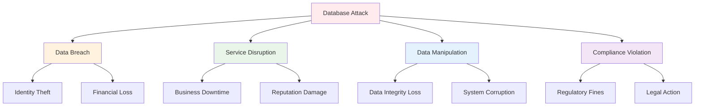

# Database Security
## Unit III: Network & System Security
### Lecture 22: Protecting Data Stores and Database Systems

<div class="absolute bottom-5 left-5 text-xs text-gray-500">
Course: Cyber Security (4353204) | Semester V | Diploma ICT | Author: Milav Dabgar
</div>

---
layout: default
---

# Database Security Overview

<div class="grid grid-cols-2 gap-6">

<div>

## 🛡️ What is Database Security?

**Database Security** involves protecting databases from compromises, unauthorized access, and malicious threats while maintaining data availability for authorized users.

### 🎯 Core Security Objectives
- **Data confidentiality** - Prevent unauthorized access
- **Data integrity** - Maintain data accuracy and consistency
- **Data availability** - Ensure authorized access to data
- **Authentication** - Verify user identities
- **Authorization** - Control access permissions
- **Auditing** - Track database activities

### 📊 Database Security Statistics
- **80%** of data breaches involve databases
- **$4.24 million** average cost of database breach
- **287 days** average time to identify/contain breach
- **43%** of breaches target small businesses
- **95%** of breaches due to human error

### 🗄️ Common Database Types
```yaml
Relational Databases:
  - MySQL
  - PostgreSQL
  - Oracle Database
  - Microsoft SQL Server
  - IBM Db2
  
NoSQL Databases:
  - MongoDB
  - Cassandra
  - Redis
  - Elasticsearch
  - DynamoDB
  
NewSQL Databases:
  - CockroachDB
  - TiDB
  - VoltDB
  - MemSQL
```

</div>

<div>

## 🚨 Database Security Threats

### 💀 Common Attack Vectors
```yaml
SQL Injection:
  - Most common database attack
  - Malicious SQL code execution
  - Data extraction/manipulation
  - Privilege escalation
  
Insider Threats:
  - Privileged user abuse
  - Data theft by employees
  - Accidental data exposure
  - Malicious administrators
  
Weak Authentication:
  - Default credentials
  - Weak password policies
  - Lack of multi-factor authentication
  - Session management flaws
  
Privilege Escalation:
  - Excessive user privileges
  - Unauthorized access elevation
  - Administrative account compromise
  - Service account abuse
  
Data Exposure:
  - Unencrypted sensitive data
  - Backup security issues
  - Network traffic interception
  - Storage misconfiguration
  
Denial of Service:
  - Database resource exhaustion
  - Query bombing
  - Connection flooding
  - Storage consumption attacks
```

### 📊 Attack Impact Assessment


</div>

</div>

<div class="absolute bottom-5 left-5 text-xs text-gray-500">
Course: Cyber Security (4353204) | Unit III | Lecture 22 | Author: Milav Dabgar
</div>

---
layout: default
---

# SQL Injection Attacks and Prevention

<div class="grid grid-cols-2 gap-6">

<div>

## 💉 Understanding SQL Injection

### 🎯 SQL Injection Types
```yaml
Classic SQL Injection:
  Union-based:
    - UNION SELECT statements
    - Data extraction from multiple tables
    - Column number enumeration
    - Database structure discovery
  
  Boolean-based Blind:
    - True/false response analysis
    - Character-by-character extraction
    - Time-intensive process
    - Conditional queries
  
  Time-based Blind:
    - Response time analysis
    - Sleep/delay functions
    - Conditional time delays
    - No direct output required
  
  Error-based:
    - Database error messages
    - Information disclosure
    - Error message analysis
    - Database fingerprinting
  
Second-Order Injection:
  - Stored malicious input
  - Later execution context
  - Harder to detect
  - Persistence required
```

### 💻 SQL Injection Examples
```sql
-- Original vulnerable query
SELECT * FROM users WHERE username = '$username' AND password = '$password'

-- Attack 1: Authentication bypass
username: admin' --
password: anything
-- Result: SELECT * FROM users WHERE username = 'admin' -- ' AND password = 'anything'

-- Attack 2: Union-based data extraction  
username: ' UNION SELECT table_name,NULL,NULL FROM information_schema.tables --
password: anything
-- Result: Extracts all table names

-- Attack 3: Boolean-based blind injection
username: admin' AND (SELECT SUBSTR(password,1,1) FROM users WHERE username='admin')='a' --
-- Result: Tests if first character of admin password is 'a'

-- Attack 4: Time-based blind injection
username: admin' AND IF((SELECT COUNT(*) FROM users)>5, SLEEP(5), 0) --
-- Result: Delays response by 5 seconds if user count > 5

-- Attack 5: Error-based injection
username: ' AND (SELECT * FROM (SELECT COUNT(*),CONCAT(version(),FLOOR(RAND(0)*2))x FROM information_schema.tables GROUP BY x)a) --
-- Result: Forces error message containing database version
```

</div>

<div>

## 🛡️ SQL Injection Prevention

### ✅ Secure Coding Practices

#### 1. Parameterized Queries (Prepared Statements)
```python
# Vulnerable code (DON'T DO THIS)
def get_user_vulnerable(username, password):
    query = f"SELECT * FROM users WHERE username = '{username}' AND password = '{password}'"
    cursor.execute(query)
    return cursor.fetchone()

# Secure code with parameterized queries
def get_user_secure(username, password):
    query = "SELECT * FROM users WHERE username = %s AND password = %s"
    cursor.execute(query, (username, password))
    return cursor.fetchone()

# Using SQLAlchemy ORM (Python)
from sqlalchemy.orm import Session
from sqlalchemy import text

def get_user_orm(db: Session, username: str, password: str):
    # Using ORM (automatically parameterized)
    user = db.query(User).filter(
        User.username == username,
        User.password == password
    ).first()
    
    # Using raw SQL with parameters
    result = db.execute(
        text("SELECT * FROM users WHERE username = :username AND password = :password"),
        {"username": username, "password": password}
    )
    return result.fetchone()
```

#### 2. Input Validation and Sanitization
```python
import re
from typing import Optional

class InputValidator:
    @staticmethod
    def validate_username(username: str) -> bool:
        """Validate username format"""
        pattern = r'^[a-zA-Z0-9_]{3,20}$'
        return bool(re.match(pattern, username))
    
    @staticmethod
    def validate_email(email: str) -> bool:
        """Validate email format"""
        pattern = r'^[a-zA-Z0-9._%+-]+@[a-zA-Z0-9.-]+\.[a-zA-Z]{2,}$'
        return bool(re.match(pattern, email))
    
    @staticmethod
    def sanitize_input(input_str: str) -> str:
        """Sanitize input by removing dangerous characters"""
        # Remove SQL injection dangerous characters
        dangerous_chars = ["'", '"', ';', '--', '/*', '*/', 'xp_', 'sp_']
        
        sanitized = input_str
        for char in dangerous_chars:
            sanitized = sanitized.replace(char, '')
        
        return sanitized.strip()
    
    @staticmethod
    def validate_numeric_input(input_str: str) -> Optional[int]:
        """Validate and convert numeric input"""
        try:
            value = int(input_str)
            if value < 0 or value > 999999:  # Reasonable range check
                return None
            return value
        except ValueError:
            return None

# Usage example
def secure_user_lookup(username: str, user_id: str):
    validator = InputValidator()
    
    # Validate inputs
    if not validator.validate_username(username):
        raise ValueError("Invalid username format")
    
    numeric_id = validator.validate_numeric_input(user_id)
    if numeric_id is None:
        raise ValueError("Invalid user ID")
    
    # Use parameterized query
    query = "SELECT * FROM users WHERE username = %s AND user_id = %s"
    cursor.execute(query, (username, numeric_id))
    return cursor.fetchall()
```

#### 3. Stored Procedures (When Properly Implemented)
```sql
-- Secure stored procedure (MySQL)
DELIMITER //

CREATE PROCEDURE GetUserByCredentials(
    IN p_username VARCHAR(50),
    IN p_password_hash VARCHAR(255)
)
READS SQL DATA
DETERMINISTIC
SQL SECURITY DEFINER
BEGIN
    DECLARE EXIT HANDLER FOR SQLEXCEPTION
    BEGIN
        ROLLBACK;
        RESIGNAL;
    END;
    
    -- Input validation within procedure
    IF LENGTH(p_username) < 3 OR LENGTH(p_username) > 50 THEN
        SIGNAL SQLSTATE '45000' SET MESSAGE_TEXT = 'Invalid username length';
    END IF;
    
    SELECT user_id, username, email, created_at, last_login
    FROM users 
    WHERE username = p_username 
    AND password_hash = p_password_hash
    AND status = 'active'
    LIMIT 1;
END //

DELIMITER ;

-- Usage from application
CALL GetUserByCredentials('john_doe', SHA2(CONCAT('mypassword', 'salt'), 256));
```

</div>

</div>

<div class="absolute bottom-5 left-5 text-xs text-gray-500">
Course: Cyber Security (4353204) | Unit III | Lecture 22 | Author: Milav Dabgar
</div>

---
layout: default
---

# Database Access Controls

<div class="grid grid-cols-2 gap-6">

<div>

## 🔐 Authentication and Authorization

### 🎯 Authentication Methods
```yaml
Username/Password:
  - Traditional authentication
  - Password complexity requirements
  - Password rotation policies
  - Account lockout mechanisms
  
Certificate-based Authentication:
  - X.509 digital certificates
  - PKI infrastructure
  - Client certificate authentication
  - Certificate revocation checking
  
Multi-factor Authentication:
  - Something you know (password)
  - Something you have (token)
  - Something you are (biometrics)
  - Time-based one-time passwords
  
Integrated Authentication:
  - Windows Authentication (SQL Server)
  - Kerberos authentication
  - LDAP/Active Directory
  - Single sign-on (SSO)
```

### 💻 MySQL User Management
```sql
-- Create database users with specific privileges
CREATE USER 'app_reader'@'localhost' IDENTIFIED BY 'StrongPassword123!';
CREATE USER 'app_writer'@'localhost' IDENTIFIED BY 'AnotherStrongPass456!';
CREATE USER 'backup_user'@'localhost' IDENTIFIED BY 'BackupPassword789!';
CREATE USER 'audit_user'@'localhost' IDENTIFIED BY 'AuditPassword000!';

-- Grant minimum necessary privileges
-- Read-only access for reporting applications
GRANT SELECT ON company_db.* TO 'app_reader'@'localhost';

-- Read/write access for application
GRANT SELECT, INSERT, UPDATE ON company_db.users TO 'app_writer'@'localhost';
GRANT SELECT, INSERT, UPDATE ON company_db.orders TO 'app_writer'@'localhost';
GRANT SELECT ON company_db.products TO 'app_writer'@'localhost';

-- Backup privileges
GRANT SELECT, LOCK TABLES, EVENT, TRIGGER ON company_db.* TO 'backup_user'@'localhost';

-- Audit privileges (read-only)
GRANT SELECT ON mysql.general_log TO 'audit_user'@'localhost';
GRANT SELECT ON information_schema.* TO 'audit_user'@'localhost';

-- Apply password policy
ALTER USER 'app_reader'@'localhost' PASSWORD EXPIRE INTERVAL 90 DAY;
ALTER USER 'app_writer'@'localhost' PASSWORD EXPIRE INTERVAL 90 DAY;

-- Create roles for better management (MySQL 8.0+)
CREATE ROLE 'application_role';
GRANT SELECT, INSERT, UPDATE ON company_db.* TO 'application_role';

CREATE ROLE 'readonly_role';
GRANT SELECT ON company_db.* TO 'readonly_role';

-- Assign roles to users
GRANT 'readonly_role' TO 'app_reader'@'localhost';
SET DEFAULT ROLE 'readonly_role' TO 'app_reader'@'localhost';
```

</div>

<div>

## 🏛️ Role-Based Access Control (RBAC)

### 📊 RBAC Implementation
```python
# Database RBAC implementation
from enum import Enum
from typing import List, Set
import hashlib
import secrets

class Permission(Enum):
    READ = "read"
    WRITE = "write"
    DELETE = "delete"
    EXECUTE = "execute"
    ADMIN = "admin"

class Role:
    def __init__(self, name: str, permissions: Set[Permission]):
        self.name = name
        self.permissions = permissions
        self.created_at = time.time()

class User:
    def __init__(self, username: str, email: str, password_hash: str):
        self.username = username
        self.email = email
        self.password_hash = password_hash
        self.roles: Set[Role] = set()
        self.is_active = True
        self.last_login = None
        self.failed_login_attempts = 0
        self.locked_until = None

class DatabaseACL:
    def __init__(self):
        self.users = {}
        self.roles = {}
        self.sessions = {}
        self.failed_login_threshold = 5
        self.lockout_duration = 1800  # 30 minutes
        
        # Initialize default roles
        self._create_default_roles()
    
    def _create_default_roles(self):
        """Create default database roles"""
        self.roles['db_admin'] = Role('db_admin', {
            Permission.READ, Permission.WRITE, Permission.DELETE, 
            Permission.EXECUTE, Permission.ADMIN
        })
        
        self.roles['db_user'] = Role('db_user', {
            Permission.READ, Permission.WRITE
        })
        
        self.roles['db_readonly'] = Role('db_readonly', {
            Permission.READ
        })
        
        self.roles['db_backup'] = Role('db_backup', {
            Permission.READ, Permission.EXECUTE
        })
    
    def create_user(self, username: str, email: str, password: str) -> bool:
        """Create new database user"""
        if username in self.users:
            return False
        
        # Hash password with salt
        salt = secrets.token_hex(16)
        password_hash = hashlib.pbkdf2_hmac('sha256', 
                                           password.encode('utf-8'),
                                           salt.encode('utf-8'),
                                           100000)
        
        user = User(username, email, salt + password_hash.hex())
        self.users[username] = user
        return True
    
    def authenticate_user(self, username: str, password: str) -> Optional[str]:
        """Authenticate user and return session token"""
        if username not in self.users:
            return None
        
        user = self.users[username]
        
        # Check if account is locked
        if user.locked_until and time.time() < user.locked_until:
            return None
        
        # Verify password
        stored_hash = user.password_hash
        salt = stored_hash[:32]  # First 32 chars are salt
        stored_password_hash = stored_hash[32:]
        
        password_hash = hashlib.pbkdf2_hmac('sha256',
                                           password.encode('utf-8'),
                                           salt.encode('utf-8'),
                                           100000)
        
        if password_hash.hex() != stored_password_hash:
            user.failed_login_attempts += 1
            if user.failed_login_attempts >= self.failed_login_threshold:
                user.locked_until = time.time() + self.lockout_duration
            return None
        
        # Reset failed attempts on successful login
        user.failed_login_attempts = 0
        user.locked_until = None
        user.last_login = time.time()
        
        # Create session
        session_token = secrets.token_urlsafe(32)
        self.sessions[session_token] = {
            'username': username,
            'created_at': time.time(),
            'expires_at': time.time() + 3600  # 1 hour
        }
        
        return session_token
    
    def check_permission(self, session_token: str, required_permission: Permission) -> bool:
        """Check if user has required permission"""
        if session_token not in self.sessions:
            return False
        
        session = self.sessions[session_token]
        
        # Check session expiry
        if time.time() > session['expires_at']:
            del self.sessions[session_token]
            return False
        
        username = session['username']
        user = self.users[username]
        
        # Check if user is active
        if not user.is_active:
            return False
        
        # Check permissions across all roles
        for role in user.roles:
            if required_permission in role.permissions:
                return True
        
        return False
    
    def assign_role(self, username: str, role_name: str) -> bool:
        """Assign role to user"""
        if username not in self.users or role_name not in self.roles:
            return False
        
        user = self.users[username]
        role = self.roles[role_name]
        user.roles.add(role)
        return True
```

</div>

</div>

<div class="absolute bottom-5 left-5 text-xs text-gray-500">
Course: Cyber Security (4353204) | Unit III | Lecture 22 | Author: Milav Dabgar
</div>

---
layout: default
---

# Database Encryption and Data Protection

<div class="grid grid-cols-2 gap-6">

<div>

## 🔐 Encryption Strategies

### 📊 Encryption Types
```yaml
Transparent Data Encryption (TDE):
  - Database-level encryption
  - Automatic encryption/decryption
  - No application changes required
  - File-level protection
  - Supported: SQL Server, Oracle, MySQL
  
Column-level Encryption:
  - Specific column protection
  - Granular control
  - Application-aware encryption
  - Field-level security
  - Custom encryption keys
  
Cell-level Encryption:
  - Individual cell protection
  - Maximum granularity
  - Complex key management
  - Performance overhead
  - Fine-grained access control
  
Backup Encryption:
  - Encrypted backup files
  - Secure backup storage
  - Restore verification
  - Key management for backups
  - Compliance requirements
```

### 💻 MySQL Encryption Implementation
```sql
-- Enable transparent data encryption (MySQL 8.0+)
-- Create encrypted tablespace
CREATE TABLESPACE encrypted_space
ADD DATAFILE 'encrypted_space.ibd'
ENGINE=InnoDB
ENCRYPTION='Y';

-- Create table in encrypted tablespace
CREATE TABLE sensitive_data (
    id INT PRIMARY KEY AUTO_INCREMENT,
    user_id INT NOT NULL,
    ssn VARCHAR(11) NOT NULL,
    credit_card VARCHAR(20) NOT NULL,
    created_at TIMESTAMP DEFAULT CURRENT_TIMESTAMP
) TABLESPACE encrypted_space;

-- Column-level encryption using AES
-- Create table with encrypted columns
CREATE TABLE user_secrets (
    id INT PRIMARY KEY AUTO_INCREMENT,
    username VARCHAR(50) NOT NULL,
    encrypted_ssn VARBINARY(255),
    encrypted_cc VARBINARY(255),
    salt VARCHAR(32)
);

-- Insert encrypted data
SET @key = 'MySecretEncryptionKey123!';
SET @salt = 'RandomSalt456';

INSERT INTO user_secrets (username, encrypted_ssn, encrypted_cc, salt) VALUES (
    'john_doe',
    AES_ENCRYPT('123-45-6789', SHA2(CONCAT(@key, @salt), 256)),
    AES_ENCRYPT('1234-5678-9012-3456', SHA2(CONCAT(@key, @salt), 256)),
    @salt
);

-- Retrieve and decrypt data
SELECT 
    username,
    AES_DECRYPT(encrypted_ssn, SHA2(CONCAT(@key, salt), 256)) as ssn,
    AES_DECRYPT(encrypted_cc, SHA2(CONCAT(@key, salt), 256)) as credit_card
FROM user_secrets 
WHERE username = 'john_doe';
```

### 🔑 Key Management
```python
# Database encryption key management
import os
import boto3
from cryptography.fernet import Fernet
from cryptography.hazmat.primitives import hashes
from cryptography.hazmat.primitives.kdf.pbkdf2 import PBKDF2HMAC
import base64

class DatabaseKeyManager:
    def __init__(self):
        self.kms = boto3.client('kms')
        self.key_cache = {}
        self.master_key_id = os.getenv('DB_MASTER_KEY_ID')
    
    def generate_data_encryption_key(self) -> dict:
        """Generate new data encryption key using AWS KMS"""
        try:
            response = self.kms.generate_data_key(
                KeyId=self.master_key_id,
                KeySpec='AES_256'
            )
            
            return {
                'plaintext_key': response['Plaintext'],
                'encrypted_key': response['CiphertextBlob'],
                'key_id': response['KeyId']
            }
        except Exception as e:
            raise Exception(f"Failed to generate data key: {str(e)}")
    
    def decrypt_data_key(self, encrypted_key: bytes) -> bytes:
        """Decrypt data encryption key"""
        try:
            response = self.kms.decrypt(CiphertextBlob=encrypted_key)
            return response['Plaintext']
        except Exception as e:
            raise Exception(f"Failed to decrypt data key: {str(e)}")
    
    def create_table_encryption_key(self, table_name: str) -> str:
        """Create encryption key for specific table"""
        key_data = self.generate_data_encryption_key()
        
        # Store encrypted key in secure location (e.g., database metadata)
        key_metadata = {
            'table_name': table_name,
            'encrypted_key': base64.b64encode(key_data['encrypted_key']).decode(),
            'key_id': key_data['key_id'],
            'created_at': time.time()
        }
        
        self.store_key_metadata(table_name, key_metadata)
        
        # Return key for immediate use
        return base64.b64encode(key_data['plaintext_key']).decode()
    
    def get_table_encryption_key(self, table_name: str) -> str:
        """Get encryption key for table"""
        if table_name in self.key_cache:
            return self.key_cache[table_name]
        
        key_metadata = self.get_key_metadata(table_name)
        if not key_metadata:
            raise Exception(f"No encryption key found for table {table_name}")
        
        encrypted_key = base64.b64decode(key_metadata['encrypted_key'])
        plaintext_key = self.decrypt_data_key(encrypted_key)
        
        # Cache for future use
        key_string = base64.b64encode(plaintext_key).decode()
        self.key_cache[table_name] = key_string
        
        return key_string
    
    def rotate_table_key(self, table_name: str) -> bool:
        """Rotate encryption key for table"""
        try:
            # Generate new key
            new_key = self.create_table_encryption_key(f"{table_name}_new")
            old_key = self.get_table_encryption_key(table_name)
            
            # Re-encrypt data with new key
            self.re_encrypt_table_data(table_name, old_key, new_key)
            
            # Update key metadata
            self.update_table_key_metadata(table_name, f"{table_name}_new")
            
            # Clear cache
            if table_name in self.key_cache:
                del self.key_cache[table_name]
            
            return True
        except Exception as e:
            raise Exception(f"Key rotation failed: {str(e)}")
```

</div>

<div>

## 🛡️ Data Masking and Tokenization

### 🎭 Data Masking Techniques
```python
# Database data masking implementation
import re
import random
import string
import hashlib
from typing import Optional

class DataMasker:
    def __init__(self):
        self.masking_rules = {
            'ssn': self.mask_ssn,
            'credit_card': self.mask_credit_card,
            'email': self.mask_email,
            'phone': self.mask_phone,
            'name': self.mask_name
        }
    
    def mask_ssn(self, ssn: str) -> str:
        """Mask Social Security Number"""
        if not ssn or len(ssn) < 9:
            return ssn
        
        # Keep format but mask middle digits
        clean_ssn = re.sub(r'[^\d]', '', ssn)
        if len(clean_ssn) == 9:
            return f"XXX-XX-{clean_ssn[-4:]}"
        return "XXX-XX-XXXX"
    
    def mask_credit_card(self, cc: str) -> str:
        """Mask credit card number"""
        if not cc:
            return cc
        
        clean_cc = re.sub(r'[^\d]', '', cc)
        if len(clean_cc) >= 12:
            return f"XXXX-XXXX-XXXX-{clean_cc[-4:]}"
        return "XXXX-XXXX-XXXX-XXXX"
    
    def mask_email(self, email: str) -> str:
        """Mask email address"""
        if not email or '@' not in email:
            return email
        
        local, domain = email.split('@', 1)
        if len(local) <= 2:
            masked_local = 'X' * len(local)
        else:
            masked_local = local[0] + 'X' * (len(local) - 2) + local[-1]
        
        return f"{masked_local}@{domain}"
    
    def mask_phone(self, phone: str) -> str:
        """Mask phone number"""
        if not phone:
            return phone
        
        clean_phone = re.sub(r'[^\d]', '', phone)
        if len(clean_phone) == 10:
            return f"XXX-XXX-{clean_phone[-4:]}"
        elif len(clean_phone) == 11:
            return f"X-XXX-XXX-{clean_phone[-4:]}"
        return "XXX-XXX-XXXX"
    
    def mask_name(self, name: str) -> str:
        """Mask personal name"""
        if not name:
            return name
        
        parts = name.split()
        masked_parts = []
        
        for part in parts:
            if len(part) <= 2:
                masked_parts.append('X' * len(part))
            else:
                masked_parts.append(part[0] + 'X' * (len(part) - 2) + part[-1])
        
        return ' '.join(masked_parts)
    
    def apply_masking(self, data_type: str, value: str) -> str:
        """Apply appropriate masking based on data type"""
        masking_func = self.masking_rules.get(data_type)
        if masking_func:
            return masking_func(value)
        return value
    
    def mask_dataset(self, records: list, field_mappings: dict) -> list:
        """Mask entire dataset"""
        masked_records = []
        
        for record in records:
            masked_record = record.copy()
            
            for field, data_type in field_mappings.items():
                if field in masked_record:
                    masked_record[field] = self.apply_masking(
                        data_type, masked_record[field]
                    )
            
            masked_records.append(masked_record)
        
        return masked_records

# Tokenization implementation
class TokenizationService:
    def __init__(self):
        self.token_store = {}  # In production, use secure database
        self.reverse_token_store = {}
        
    def tokenize(self, sensitive_value: str) -> str:
        """Convert sensitive value to token"""
        if sensitive_value in self.reverse_token_store:
            return self.reverse_token_store[sensitive_value]
        
        # Generate random token
        token = self.generate_token()
        
        # Store mapping
        self.token_store[token] = sensitive_value
        self.reverse_token_store[sensitive_value] = token
        
        return token
    
    def detokenize(self, token: str) -> Optional[str]:
        """Convert token back to sensitive value"""
        return self.token_store.get(token)
    
    def generate_token(self) -> str:
        """Generate random token"""
        return ''.join(random.choices(string.ascii_uppercase + string.digits, k=16))
    
    def tokenize_dataset(self, records: list, tokenize_fields: list) -> list:
        """Tokenize specific fields in dataset"""
        tokenized_records = []
        
        for record in records:
            tokenized_record = record.copy()
            
            for field in tokenize_fields:
                if field in tokenized_record:
                    tokenized_record[field] = self.tokenize(tokenized_record[field])
            
            tokenized_records.append(tokenized_record)
        
        return tokenized_records

# Usage example
def create_test_environment():
    """Create masked test data from production"""
    masker = DataMasker()
    tokenizer = TokenizationService()
    
    # Sample production data
    production_data = [
        {
            'id': 1,
            'name': 'John Doe',
            'ssn': '123-45-6789',
            'email': 'john.doe@example.com',
            'credit_card': '1234-5678-9012-3456',
            'phone': '555-123-4567'
        },
        {
            'id': 2,
            'name': 'Jane Smith',
            'ssn': '987-65-4321',
            'email': 'jane.smith@example.com',
            'credit_card': '9876-5432-1098-7654',
            'phone': '555-987-6543'
        }
    ]
    
    # Field mapping for masking
    mask_fields = {
        'name': 'name',
        'ssn': 'ssn',
        'email': 'email',
        'phone': 'phone'
    }
    
    # Tokenize credit card numbers
    tokenize_fields = ['credit_card']
    
    # Apply masking
    masked_data = masker.mask_dataset(production_data, mask_fields)
    
    # Apply tokenization
    test_data = tokenizer.tokenize_dataset(masked_data, tokenize_fields)
    
    return test_data
```

</div>

</div>

<div class="absolute bottom-5 left-5 text-xs text-gray-500">
Course: Cyber Security (4353204) | Unit III | Lecture 22 | Author: Milav Dabgar
</div>

---
layout: default
---

# Database Auditing and Monitoring

<div class="grid grid-cols-2 gap-6">

<div>

## 📊 Database Auditing

### 🔍 Audit Requirements
```yaml
Access Auditing:
  - User login/logout events
  - Failed authentication attempts
  - Privilege escalation attempts
  - Administrative access tracking
  
Data Access Auditing:
  - Data reads (SELECT queries)
  - Data modifications (INSERT/UPDATE/DELETE)
  - Schema changes (DDL operations)
  - Bulk data operations
  
System Auditing:
  - Database startup/shutdown
  - Configuration changes
  - User creation/deletion
  - Permission changes
  
Compliance Auditing:
  - Regulatory requirement tracking
  - Data retention compliance
  - Privacy regulation compliance
  - Industry standard adherence
```

### 💻 MySQL Audit Configuration
```sql
-- Enable MySQL audit logging (MySQL Enterprise)
INSTALL PLUGIN audit_log SONAME 'audit_log.so';

-- Configure audit settings
SET GLOBAL audit_log_policy = 'ALL';
SET GLOBAL audit_log_format = 'JSON';
SET GLOBAL audit_log_rotate_on_size = 52428800; -- 50MB

-- Create audit rules for sensitive tables
CREATE TABLE audit_rules (
    rule_id INT AUTO_INCREMENT PRIMARY KEY,
    table_name VARCHAR(64),
    operation VARCHAR(20),
    user_pattern VARCHAR(64),
    created_at TIMESTAMP DEFAULT CURRENT_TIMESTAMP
);

-- Audit specific operations
INSERT INTO audit_rules (table_name, operation, user_pattern) VALUES
('users', 'SELECT', '%'),
('financial_data', 'ALL', '%'),
('audit_log', 'ALL', '%');

-- Custom audit trigger for sensitive data
DELIMITER //

CREATE TRIGGER audit_financial_data_changes
    AFTER UPDATE ON financial_data
    FOR EACH ROW
BEGIN
    INSERT INTO audit_trail (
        table_name,
        operation,
        record_id,
        user_name,
        old_values,
        new_values,
        change_timestamp
    ) VALUES (
        'financial_data',
        'UPDATE',
        NEW.id,
        USER(),
        JSON_OBJECT('balance', OLD.balance, 'account_id', OLD.account_id),
        JSON_OBJECT('balance', NEW.balance, 'account_id', NEW.account_id),
        NOW()
    );
END //

DELIMITER ;
```

</div>

<div>

## 🚨 Real-time Monitoring

### 💻 Database Security Monitor
```python
# Database security monitoring system
import mysql.connector
import json
import time
import threading
from collections import defaultdict
from datetime import datetime, timedelta

class DatabaseSecurityMonitor:
    def __init__(self, connection_params):
        self.connection_params = connection_params
        self.alert_thresholds = {
            'failed_login_count': 5,
            'failed_login_window': 300,  # 5 minutes
            'unusual_query_count': 100,
            'large_result_set': 10000,
            'suspicious_query_patterns': [
                'UNION SELECT',
                "'; DROP",
                '1=1',
                'OR 1=1',
                'AND 1=1'
            ]
        }
        self.failed_logins = defaultdict(list)
        self.query_counts = defaultdict(int)
        self.alerts = []
    
    def monitor_connections(self):
        """Monitor database connections for suspicious activity"""
        try:
            conn = mysql.connector.connect(**self.connection_params)
            cursor = conn.cursor(dictionary=True)
            
            while True:
                # Monitor current connections
                cursor.execute("""
                    SELECT 
                        ID, USER, HOST, DB, COMMAND, TIME, STATE, INFO
                    FROM INFORMATION_SCHEMA.PROCESSLIST 
                    WHERE USER != 'system user'
                """)
                
                processes = cursor.fetchall()
                
                for process in processes:
                    self.analyze_connection(process)
                
                time.sleep(10)  # Check every 10 seconds
                
        except Exception as e:
            self.generate_alert('MONITORING_ERROR', f'Failed to monitor connections: {str(e)}')
    
    def analyze_connection(self, process):
        """Analyze individual database connection"""
        user = process['USER']
        host = process['HOST']
        query = process['INFO']
        connection_time = process['TIME']
        
        # Check for long-running queries
        if connection_time > 300:  # 5 minutes
            self.generate_alert(
                'LONG_RUNNING_QUERY',
                f'Long-running query from {user}@{host}: {query[:100]}...',
                {'user': user, 'host': host, 'duration': connection_time}
            )
        
        # Check for suspicious query patterns
        if query:
            for pattern in self.alert_thresholds['suspicious_query_patterns']:
                if pattern.upper() in query.upper():
                    self.generate_alert(
                        'SUSPICIOUS_QUERY',
                        f'Suspicious query pattern detected from {user}@{host}',
                        {'user': user, 'host': host, 'query': query, 'pattern': pattern}
                    )
    
    def monitor_audit_logs(self, log_file_path):
        """Monitor database audit logs for security events"""
        try:
            with open(log_file_path, 'r') as f:
                # Go to end of file
                f.seek(0, 2)
                
                while True:
                    line = f.readline()
                    if not line:
                        time.sleep(1)
                        continue
                    
                    try:
                        audit_event = json.loads(line)
                        self.analyze_audit_event(audit_event)
                    except json.JSONDecodeError:
                        continue
                        
        except Exception as e:
            self.generate_alert('LOG_MONITORING_ERROR', f'Failed to monitor audit logs: {str(e)}')
    
    def analyze_audit_event(self, event):
        """Analyze audit log event for security issues"""
        event_type = event.get('class', '')
        user = event.get('account', {}).get('user', 'unknown')
        host = event.get('account', {}).get('host', 'unknown')
        
        if event_type == 'connection':
            if event.get('event') == 'connect':
                if event.get('connection_data', {}).get('status') != 0:
                    # Failed connection
                    self.track_failed_login(user, host)
            
        elif event_type == 'general':
            query = event.get('general_data', {}).get('query', '')
            self.analyze_query_security(query, user, host)
    
    def track_failed_login(self, user, host):
        """Track failed login attempts"""
        now = time.time()
        key = f"{user}@{host}"
        
        # Clean old entries
        self.failed_logins[key] = [
            timestamp for timestamp in self.failed_logins[key]
            if now - timestamp < self.alert_thresholds['failed_login_window']
        ]
        
        # Add current failure
        self.failed_logins[key].append(now)
        
        # Check threshold
        if len(self.failed_logins[key]) >= self.alert_thresholds['failed_login_count']:
            self.generate_alert(
                'BRUTE_FORCE_ATTACK',
                f'Multiple failed login attempts from {key}',
                {'user': user, 'host': host, 'attempts': len(self.failed_logins[key])}
            )
    
    def analyze_query_security(self, query, user, host):
        """Analyze query for security issues"""
        if not query:
            return
        
        query_upper = query.upper()
        
        # Check for SQL injection patterns
        injection_patterns = [
            'UNION SELECT',
            "'; DROP",
            '1=1',
            'OR 1=1',
            'BENCHMARK(',
            'SLEEP(',
            'WAITFOR DELAY'
        ]
        
        for pattern in injection_patterns:
            if pattern in query_upper:
                self.generate_alert(
                    'SQL_INJECTION_ATTEMPT',
                    f'Potential SQL injection from {user}@{host}',
                    {'user': user, 'host': host, 'query': query[:200], 'pattern': pattern}
                )
        
        # Check for data exfiltration patterns
        if 'SELECT' in query_upper and ('*' in query_upper or 'LIMIT' not in query_upper):
            if any(table in query_upper for table in ['USERS', 'CUSTOMERS', 'FINANCIAL']):
                self.generate_alert(
                    'DATA_EXFILTRATION_ATTEMPT',
                    f'Large data selection attempt from {user}@{host}',
                    {'user': user, 'host': host, 'query': query[:200]}
                )
    
    def generate_alert(self, alert_type, message, details=None):
        """Generate security alert"""
        alert = {
            'timestamp': datetime.utcnow().isoformat(),
            'type': alert_type,
            'message': message,
            'details': details or {},
            'severity': self.get_alert_severity(alert_type)
        }
        
        self.alerts.append(alert)
        
        # Log alert
        print(f"[{alert['severity']}] {alert_type}: {message}")
        
        # Send notifications for high-severity alerts
        if alert['severity'] == 'HIGH':
            self.send_alert_notification(alert)
    
    def get_alert_severity(self, alert_type):
        """Determine alert severity"""
        high_severity = [
            'SQL_INJECTION_ATTEMPT',
            'BRUTE_FORCE_ATTACK', 
            'DATA_EXFILTRATION_ATTEMPT'
        ]
        
        if alert_type in high_severity:
            return 'HIGH'
        elif 'ERROR' in alert_type:
            return 'MEDIUM'
        else:
            return 'LOW'
    
    def send_alert_notification(self, alert):
        """Send alert notification"""
        # Implementation depends on notification system
        # Could be email, Slack, SMS, etc.
        pass
    
    def start_monitoring(self, audit_log_path):
        """Start comprehensive monitoring"""
        # Start connection monitoring thread
        connection_thread = threading.Thread(target=self.monitor_connections)
        connection_thread.daemon = True
        connection_thread.start()
        
        # Start audit log monitoring thread
        audit_thread = threading.Thread(target=self.monitor_audit_logs, args=(audit_log_path,))
        audit_thread.daemon = True
        audit_thread.start()
        
        print("Database security monitoring started...")
        return connection_thread, audit_thread
```

</div>

</div>

<div class="absolute bottom-5 left-5 text-xs text-gray-500">
Course: Cyber Security (4353204) | Unit III | Lecture 22 | Author: Milav Dabgar
</div>

---
layout: default
---

# Practical Exercise: Database Security Implementation

<div class="exercise-container">

## 🎯 Group Activity (30 minutes)

### Scenario: Healthcare Database Security

Your team is implementing security for a healthcare organization's patient database system with:

**Database Environment:**
- **Patient records database** with 500,000+ records
- **Electronic Health Records (EHR)** system
- **Billing and insurance** information
- **Medical imaging** and lab results
- **Prescription tracking** system
- **Healthcare provider** access requirements

**Compliance Requirements:**
- **HIPAA compliance** for patient data protection
- **State healthcare** regulations
- **Insurance industry** standards (for billing)
- **Audit trail** requirements
- **Data retention** policies (7+ years)
- **Breach notification** requirements

**Security Challenges:**
- **Multiple user types** (doctors, nurses, administrators, billing staff)
- **24/7 access** requirements for emergency care
- **Mobile device** access for healthcare providers
- **Third-party integrations** (labs, pharmacies, insurance)
- **Legacy system** integration requirements
- **High-value target** for cybercriminals

### Task: Comprehensive Database Security Strategy

**Phase 1: Access Control Design (10 minutes)**

**Authentication and Authorization:**
1. How would you design role-based access control for different healthcare roles?
2. What authentication methods would you implement for different access scenarios?
3. How would you handle emergency access when normal authentication isn't possible?
4. What session management policies would you establish?

**Privilege Management:**
1. How would you implement the principle of least privilege?
2. What approval processes would you establish for privilege escalation?
3. How would you handle temporary access for contractors or consultants?
4. What regular access review processes would you implement?

**Phase 2: Data Protection Strategy (10 minutes)**

**Encryption Implementation:**
1. What data encryption strategies would you implement for different data types?
2. How would you handle encryption key management and rotation?
3. What encryption would you use for data in transit and at rest?
4. How would you balance encryption with performance requirements?

**Data Privacy and Masking:**
1. How would you implement data masking for test environments?
2. What tokenization strategies would you use for sensitive identifiers?
3. How would you handle data anonymization for research purposes?
4. What data retention and destruction policies would you establish?

**Phase 3: Monitoring and Compliance (10 minutes)**

**Audit and Monitoring:**
1. What database activities would you audit and log?
2. How would you implement real-time security monitoring?
3. What automated alerts and responses would you configure?
4. How would you handle audit log security and integrity?

**Compliance Management:**
1. How would you implement automated compliance checking?
2. What reporting mechanisms would you establish for regulators?
3. How would you handle breach detection and notification?
4. What regular security assessments would you perform?

**Deliverables:**
- Database security architecture diagram
- Role-based access control matrix
- Data encryption and privacy protection plan
- Audit and monitoring strategy
- Compliance framework and procedures

</div>

<style>
.exercise-container {
  @apply bg-teal-50 border-2 border-teal-300 rounded-lg p-6;
}
</style>

<div class="absolute bottom-5 left-5 text-xs text-gray-500">
Course: Cyber Security (4353204) | Unit III | Lecture 22 | Author: Milav Dabgar
</div>

---
layout: center
class: text-center
---

# Questions & Discussion

## 🤔 Discussion Points:
- How do you balance database security with performance requirements?
- What's your approach to handling legacy database security challenges?
- How do you ensure consistent security across different database platforms?

### 💡 Exercise Review
Share your database security strategies and discuss implementation approaches

<div class="absolute bottom-5 left-5 text-xs text-gray-500">
Course: Cyber Security (4353204) | Unit III | Lecture 22 | Author: Milav Dabgar
</div>

---
layout: center
class: text-center
---

# Thank You!

## Next Lecture: System Hardening and Patch Management
### Securing Operating Systems and Infrastructure

<div class="pt-8 text-gray-500">
  <p>Cyber Security (4353204) - Lecture 22 Complete</p>
  <p>Data protection: Securing the digital treasure! 🗄️🔐</p>
</div>

<div class="absolute bottom-5 left-5 text-xs text-gray-500">
Course: Cyber Security (4353204) | Unit III | Lecture 22 | Author: Milav Dabgar
</div>