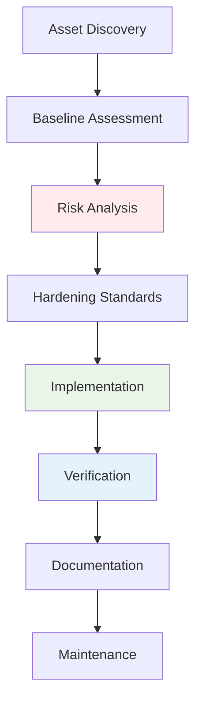
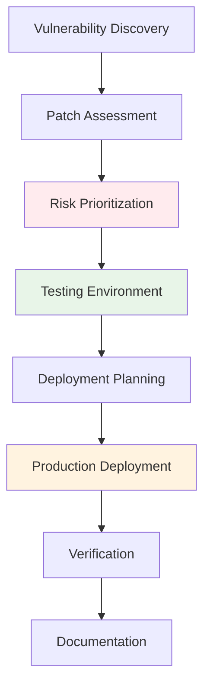

# System Hardening and Patch Management
## Unit III: Network & System Security
### Lecture 23: Securing Operating Systems and Infrastructure

<div class="absolute bottom-5 left-5 text-xs text-gray-500">
Course: Cyber Security (4353204) | Semester V | Diploma ICT | Author: Milav Dabgar
</div>

---
layout: default
---

# System Hardening Fundamentals

<div class="grid grid-cols-2 gap-6">

<div>

## 🛡️ What is System Hardening?

**System Hardening** is the process of reducing security vulnerabilities by removing unnecessary software, services, and configurations while implementing security controls.

### 🎯 Hardening Objectives
- **Reduce attack surface** - Minimize potential entry points
- **Eliminate vulnerabilities** - Remove known security weaknesses  
- **Implement security controls** - Add protective mechanisms
- **Enforce security policies** - Apply organizational standards
- **Maintain compliance** - Meet regulatory requirements

### 📊 Hardening Statistics
- **60%** reduction in vulnerabilities with proper hardening
- **45%** decrease in successful attacks
- **$2.6 million** average savings from preventing breaches
- **30%** reduction in incident response time
- **70%** improvement in compliance scores

### 🏗️ Hardening Scope
```yaml
Operating System Hardening:
  - Remove unnecessary services
  - Configure security settings
  - Implement access controls
  - Enable security features
  
Application Hardening:
  - Secure configurations
  - Remove default accounts
  - Disable unnecessary features
  - Update security patches
  
Network Hardening:
  - Firewall configuration
  - Port security
  - Protocol restrictions
  - Network segmentation
  
Database Hardening:
  - Access controls
  - Encryption configuration
  - Audit settings
  - User management
```

</div>

<div>

## 🎯 Hardening Methodology

### 📋 Systematic Approach


### 🔧 Industry Standards
```yaml
CIS (Center for Internet Security) Benchmarks:
  - Operating systems (Windows, Linux, macOS)
  - Applications (Apache, IIS, MySQL)
  - Cloud platforms (AWS, Azure, GCP)
  - Mobile devices (iOS, Android)
  
NIST Guidelines:
  - SP 800-123: Windows Security
  - SP 800-68: Cisco Router Security
  - SP 800-70: Security Configuration Checklists
  - SP 800-117: Firewall Configuration
  
SANS Hardening Guides:
  - Step-by-step procedures
  - Platform-specific guidance
  - Security tool recommendations
  - Best practice documentation
  
Vendor Security Guides:
  - Microsoft Security Baselines
  - Red Hat Security Guide
  - Oracle Security Configuration
  - VMware Security Hardening
```

### ⚡ Hardening Benefits
- **Vulnerability reduction** - Fewer security weaknesses
- **Attack prevention** - Stronger defense posture
- **Compliance achievement** - Meet regulatory standards
- **Performance improvement** - Optimized system resources
- **Operational efficiency** - Reduced security incidents

</div>

</div>

<div class="absolute bottom-5 left-5 text-xs text-gray-500">
Course: Cyber Security (4353204) | Unit III | Lecture 23 | Author: Milav Dabgar
</div>

---
layout: default
---

# Windows System Hardening

<div class="grid grid-cols-2 gap-6">

<div>

## 🪟 Windows Security Configuration

### 🔧 Core Hardening Steps
```yaml
User Account Control (UAC):
  - Enable UAC for all users
  - Set to highest security level
  - Require administrator consent
  - Secure desktop prompting
  
Account Security:
  - Disable default accounts (Guest)
  - Rename Administrator account
  - Implement strong password policy
  - Enable account lockout policy
  
Service Management:
  - Disable unnecessary services
  - Change service account permissions
  - Configure service recovery options
  - Monitor service startup types
  
Windows Defender:
  - Enable real-time protection
  - Configure cloud protection
  - Set up exclusions properly
  - Schedule regular scans
```

### 💻 PowerShell Hardening Script
```powershell
# Windows 10/11 Security Hardening Script
# Run as Administrator

Write-Host "Starting Windows Security Hardening..." -ForegroundColor Green

# 1. Enable Windows Defender features
Write-Host "Configuring Windows Defender..." -ForegroundColor Yellow
Set-MpPreference -DisableRealtimeMonitoring $false
Set-MpPreference -DisableBehaviorMonitoring $false
Set-MpPreference -DisableBlockAtFirstSeen $false
Set-MpPreference -DisableIOAVProtection $false
Set-MpPreference -DisablePrivacyMode $false
Set-MpPreference -DisableIntrusionPreventionSystem $false
Set-MpPreference -DisableScriptScanning $false
Set-MpPreference -SubmitSamplesConsent 2

# 2. Configure User Account Control
Write-Host "Configuring User Account Control..." -ForegroundColor Yellow
Set-ItemProperty -Path "HKLM:\SOFTWARE\Microsoft\Windows\CurrentVersion\Policies\System" -Name "EnableLUA" -Value 1
Set-ItemProperty -Path "HKLM:\SOFTWARE\Microsoft\Windows\CurrentVersion\Policies\System" -Name "ConsentPromptBehaviorAdmin" -Value 2
Set-ItemProperty -Path "HKLM:\SOFTWARE\Microsoft\Windows\CurrentVersion\Policies\System" -Name "PromptOnSecureDesktop" -Value 1

# 3. Disable unnecessary services
Write-Host "Disabling unnecessary services..." -ForegroundColor Yellow
$servicesToDisable = @(
    "Fax",
    "TelnetClient", 
    "RemoteRegistry",
    "RemoteAccess",
    "Spooler"  # Only if no printing required
)

foreach ($service in $servicesToDisable) {
    $serviceExists = Get-Service -Name $service -ErrorAction SilentlyContinue
    if ($serviceExists) {
        Set-Service -Name $service -StartupType Disabled
        Stop-Service -Name $service -Force -ErrorAction SilentlyContinue
        Write-Host "Disabled service: $service" -ForegroundColor Gray
    }
}

# 4. Configure Windows Firewall
Write-Host "Configuring Windows Firewall..." -ForegroundColor Yellow
Set-NetFirewallProfile -Profile Domain,Public,Private -Enabled True
Set-NetFirewallProfile -Profile Domain,Public,Private -DefaultInboundAction Block
Set-NetFirewallProfile -Profile Domain,Public,Private -DefaultOutboundAction Allow

# Block dangerous ports
$dangerousPorts = @(135, 137, 138, 139, 445, 1433, 1434, 3389)
foreach ($port in $dangerousPorts) {
    New-NetFirewallRule -DisplayName "Block_Port_$port" -Direction Inbound -Protocol TCP -LocalPort $port -Action Block -ErrorAction SilentlyContinue
}

# 5. Registry security settings
Write-Host "Applying registry security settings..." -ForegroundColor Yellow

# Disable anonymous enumeration
Set-ItemProperty -Path "HKLM:\SYSTEM\CurrentControlSet\Control\Lsa" -Name "RestrictAnonymous" -Value 1

# Disable SMBv1
Set-ItemProperty -Path "HKLM:\SYSTEM\CurrentControlSet\Services\LanmanServer\Parameters" -Name "SMB1" -Value 0

# Enable DEP for all programs
Set-ItemProperty -Path "HKLM:\SOFTWARE\Policies\Microsoft\Windows\Explorer" -Name "NoDataExecutionPrevention" -Value 0

# Disable autorun for all drives
Set-ItemProperty -Path "HKLM:\SOFTWARE\Microsoft\Windows\CurrentVersion\Policies\Explorer" -Name "NoDriveTypeAutoRun" -Value 255

# 6. Set strong password policy
Write-Host "Configuring password policy..." -ForegroundColor Yellow
net accounts /minpwlen:12 /maxpwage:90 /minpwage:1 /lockoutthreshold:5 /lockoutduration:30

# 7. Enable audit policies
Write-Host "Enabling audit policies..." -ForegroundColor Yellow
auditpol /set /category:"Logon/Logoff" /success:enable /failure:enable
auditpol /set /category:"Account Management" /success:enable /failure:enable
auditpol /set /category:"Privilege Use" /success:enable /failure:enable
auditpol /set /category:"System" /success:enable /failure:enable

# 8. Configure automatic updates
Write-Host "Configuring automatic updates..." -ForegroundColor Yellow
Set-ItemProperty -Path "HKLM:\SOFTWARE\Policies\Microsoft\Windows\WindowsUpdate\AU" -Name "NoAutoUpdate" -Value 0
Set-ItemProperty -Path "HKLM:\SOFTWARE\Policies\Microsoft\Windows\WindowsUpdate\AU" -Name "AUOptions" -Value 4

# 9. Disable unnecessary features
Write-Host "Disabling unnecessary Windows features..." -ForegroundColor Yellow
$featuresToDisable = @(
    "SMB1Protocol",
    "IIS-WebServerRole",
    "IIS-WebServer",
    "TelnetClient",
    "TFTP"
)

foreach ($feature in $featuresToDisable) {
    Disable-WindowsOptionalFeature -Online -FeatureName $feature -NoRestart -ErrorAction SilentlyContinue
}

# 10. Configure security templates
Write-Host "Applying security templates..." -ForegroundColor Yellow
# Download and apply Microsoft Security Compliance Toolkit templates
# This would typically involve secedit commands

Write-Host "Windows Security Hardening Complete!" -ForegroundColor Green
Write-Host "Please reboot the system to ensure all changes take effect." -ForegroundColor Red
```

</div>

<div>

## 🔐 Advanced Windows Security

### 🛡️ Security Features Configuration
```powershell
# Advanced Windows Security Configuration

# 1. Configure BitLocker Drive Encryption
Write-Host "Configuring BitLocker..." -ForegroundColor Yellow
$bitlockerStatus = Get-BitLockerVolume -MountPoint "C:"
if ($bitlockerStatus.ProtectionStatus -eq "Off") {
    # Enable BitLocker with TPM + PIN
    Enable-BitLocker -MountPoint "C:" -EncryptionMethod XtsAes256 -TpmAndPinProtector
    Add-BitLockerKeyProtector -MountPoint "C:" -RecoveryPasswordProtector
    Write-Host "BitLocker enabled with TPM + PIN protection" -ForegroundColor Green
}

# 2. Configure Windows Defender Application Control (WDAC)
Write-Host "Configuring Application Control..." -ForegroundColor Yellow
$wdacPolicyPath = "C:\Windows\System32\CodeIntegrity\SiPolicy.p7b"
if (!(Test-Path $wdacPolicyPath)) {
    # Create base policy
    New-CIPolicy -Level Publisher -FilePath "C:\BasePolicy.xml" -UserPEs
    ConvertFrom-CIPolicy -XmlFilePath "C:\BasePolicy.xml" -BinaryFilePath $wdacPolicyPath
    Write-Host "WDAC policy created and deployed" -ForegroundColor Green
}

# 3. Configure Credential Guard
Write-Host "Enabling Credential Guard..." -ForegroundColor Yellow
Set-ItemProperty -Path "HKLM:\SYSTEM\CurrentControlSet\Control\LSA" -Name "LsaCfgFlags" -Value 1

# 4. Configure Device Guard
Write-Host "Configuring Device Guard..." -ForegroundColor Yellow
Set-ItemProperty -Path "HKLM:\SYSTEM\CurrentControlSet\Control\DeviceGuard" -Name "EnableVirtualizationBasedSecurity" -Value 1
Set-ItemProperty -Path "HKLM:\SYSTEM\CurrentControlSet\Control\DeviceGuard" -Name "RequirePlatformSecurityFeatures" -Value 1

# 5. Configure AppLocker policies
Write-Host "Configuring AppLocker..." -ForegroundColor Yellow
$applockerPolicy = @"
<AppLockerPolicy Version="1">
  <RuleCollection Type="Exe" EnforcementMode="Enabled">
    <FilePublisherRule Id="a9e18c21-ff8f-43cf-b9fc-db40eed693ba" Name="All files signed by Microsoft" Description="" UserOrGroupSid="S-1-1-0" Action="Allow">
      <Conditions>
        <FilePublisherCondition PublisherName="O=MICROSOFT CORPORATION, L=REDMOND, S=WASHINGTON, C=US" ProductName="*" BinaryName="*">
          <BinaryVersionRange LowSection="*" HighSection="*" />
        </FilePublisherCondition>
      </Conditions>
    </FilePublisherRule>
  </RuleCollection>
</AppLockerPolicy>
"@

$applockerPolicy | Out-File -FilePath "C:\AppLockerPolicy.xml" -Encoding UTF8
Set-AppLockerPolicy -XmlPolicy "C:\AppLockerPolicy.xml"

# 6. Configure Advanced Threat Protection
Write-Host "Configuring Windows Defender ATP..." -ForegroundColor Yellow
Set-MpPreference -EnableNetworkProtection Enabled
Set-MpPreference -EnableControlledFolderAccess Enabled
Set-MpPreference -AttackSurfaceReductionRules_Actions Enabled

# 7. Secure PowerShell configuration
Write-Host "Securing PowerShell..." -ForegroundColor Yellow
Set-ItemProperty -Path "HKLM:\SOFTWARE\Policies\Microsoft\Windows\PowerShell\ScriptBlockLogging" -Name "EnableScriptBlockLogging" -Value 1
Set-ItemProperty -Path "HKLM:\SOFTWARE\Policies\Microsoft\Windows\PowerShell\ModuleLogging" -Name "EnableModuleLogging" -Value 1

# 8. Configure Exploit Protection
Write-Host "Configuring Exploit Protection..." -ForegroundColor Yellow
Set-ProcessMitigation -System -Enable DEP,SEHOP,ASLR,CFG

Write-Host "Advanced Windows Security Configuration Complete!" -ForegroundColor Green
```

### 📊 Security Compliance Check
```powershell
# Windows Security Compliance Verification Script
function Test-WindowsSecurityCompliance {
    $complianceResults = @{}
    
    # Check UAC configuration
    $uacEnabled = Get-ItemProperty -Path "HKLM:\SOFTWARE\Microsoft\Windows\CurrentVersion\Policies\System" -Name "EnableLUA"
    $complianceResults["UAC_Enabled"] = ($uacEnabled.EnableLUA -eq 1)
    
    # Check Windows Defender status
    $defenderStatus = Get-MpComputerStatus
    $complianceResults["Defender_RealTime"] = $defenderStatus.RealTimeProtectionEnabled
    $complianceResults["Defender_Updated"] = ((Get-Date) - $defenderStatus.AntivirusSignatureLastUpdated).Days -le 1
    
    # Check firewall status
    $firewallProfiles = Get-NetFirewallProfile
    $complianceResults["Firewall_Enabled"] = $firewallProfiles | ForEach-Object { $_.Enabled -eq $true }
    
    # Check for dangerous services
    $dangerousServices = @("Fax", "TelnetClient", "RemoteRegistry")
    foreach ($service in $dangerousServices) {
        $serviceStatus = Get-Service -Name $service -ErrorAction SilentlyContinue
        $complianceResults["Service_${service}_Disabled"] = ($serviceStatus.StartType -eq 'Disabled')
    }
    
    # Check BitLocker status
    $bitlockerStatus = Get-BitLockerVolume -MountPoint "C:" -ErrorAction SilentlyContinue
    $complianceResults["BitLocker_Enabled"] = ($bitlockerStatus.ProtectionStatus -eq 'On')
    
    # Generate compliance report
    $totalChecks = $complianceResults.Count
    $passedChecks = ($complianceResults.Values | Where-Object { $_ -eq $true }).Count
    $compliancePercentage = [Math]::Round(($passedChecks / $totalChecks) * 100, 2)
    
    $report = @{
        'CompliancePercentage' = $compliancePercentage
        'PassedChecks' = $passedChecks
        'TotalChecks' = $totalChecks
        'DetailedResults' = $complianceResults
        'Recommendations' = @()
    }
    
    # Generate recommendations for failed checks
    foreach ($check in $complianceResults.Keys) {
        if (-not $complianceResults[$check]) {
            $report.Recommendations += "Fix: $check"
        }
    }
    
    return $report
}

# Run compliance check
$compliance = Test-WindowsSecurityCompliance
Write-Host "Security Compliance: $($compliance.CompliancePercentage)%" -ForegroundColor $(if($compliance.CompliancePercentage -ge 80) {"Green"} else {"Red"})
```

</div>

</div>

<div class="absolute bottom-5 left-5 text-xs text-gray-500">
Course: Cyber Security (4353204) | Unit III | Lecture 23 | Author: Milav Dabgar
</div>

---
layout: default
---

# Linux System Hardening

<div class="grid grid-cols-2 gap-6">

<div>

## 🐧 Linux Security Configuration

### 🔧 Core Hardening Steps
```yaml
System Updates:
  - Update package repositories
  - Install security patches
  - Configure automatic updates
  - Remove unnecessary packages
  
User Management:
  - Disable root login via SSH
  - Create dedicated service accounts
  - Implement sudo access controls
  - Configure password policies
  
Service Management:
  - Disable unnecessary services
  - Configure service permissions
  - Implement service monitoring
  - Use systemd security features
  
Network Security:
  - Configure iptables/firewalld
  - Disable unused network services
  - Secure SSH configuration
  - Implement port knocking
```

### 💻 Linux Hardening Script
```bash
#!/bin/bash
# Linux Security Hardening Script
# Compatible with Ubuntu/Debian and RHEL/CentOS

set -euo pipefail

# Colors for output
RED='\033[0;31m'
GREEN='\033[0;32m'
YELLOW='\033[1;33m'
NC='\033[0m' # No Color

log() {
    echo -e "${GREEN}[$(date +'%Y-%m-%d %H:%M:%S')] $1${NC}"
}

warn() {
    echo -e "${YELLOW}[WARNING] $1${NC}"
}

error() {
    echo -e "${RED}[ERROR] $1${NC}"
}

# Detect OS
if [ -f /etc/debian_version ]; then
    OS="debian"
    PACKAGE_MANAGER="apt"
elif [ -f /etc/redhat-release ]; then
    OS="redhat"
    PACKAGE_MANAGER="yum"
else
    error "Unsupported operating system"
    exit 1
fi

log "Starting Linux security hardening for $OS..."

# 1. System Updates
log "Updating system packages..."
if [ "$OS" = "debian" ]; then
    apt update && apt upgrade -y
    apt autoremove -y
    apt autoclean
elif [ "$OS" = "redhat" ]; then
    yum update -y
    package-cleanup --oldkernels --count=2
fi

# 2. Install essential security tools
log "Installing security tools..."
if [ "$OS" = "debian" ]; then
    apt install -y fail2ban ufw aide rkhunter chkrootkit lynis
elif [ "$OS" = "redhat" ]; then
    yum install -y fail2ban firewalld aide rkhunter chkrootkit lynis
fi

# 3. Configure SSH security
log "Configuring SSH security..."
SSH_CONFIG="/etc/ssh/sshd_config"
cp "$SSH_CONFIG" "${SSH_CONFIG}.backup.$(date +%Y%m%d)"

# SSH hardening settings
cat << 'EOF' > /etc/ssh/sshd_config.hardened
# SSH Hardened Configuration
Port 2222
Protocol 2

# Authentication
PermitRootLogin no
MaxAuthTries 3
MaxSessions 2
PasswordAuthentication no
PermitEmptyPasswords no
ChallengeResponseAuthentication no
UsePAM yes

# Host-based authentication
HostbasedAuthentication no
IgnoreUserKnownHosts yes
IgnoreRhosts yes

# Security settings
X11Forwarding no
AllowTcpForwarding no
AllowAgentForwarding no
PermitTunnel no
GatewayPorts no

# Logging
SyslogFacility AUTHPRIV
LogLevel INFO

# Connection settings
ClientAliveInterval 300
ClientAliveCountMax 2
LoginGraceTime 60

# Allowed users (customize as needed)
# AllowUsers admin

# Key exchange algorithms
KexAlgorithms curve25519-sha256@libssh.org,diffie-hellman-group16-sha512
Ciphers chacha20-poly1305@openssh.com,aes256-gcm@openssh.com,aes128-gcm@openssh.com,aes256-ctr,aes192-ctr,aes128-ctr
MACs hmac-sha2-256-etm@openssh.com,hmac-sha2-512-etm@openssh.com,hmac-sha2-256,hmac-sha2-512
EOF

mv /etc/ssh/sshd_config.hardened "$SSH_CONFIG"
systemctl restart ssh || systemctl restart sshd

# 4. Configure firewall
log "Configuring firewall..."
if [ "$OS" = "debian" ]; then
    ufw --force reset
    ufw default deny incoming
    ufw default allow outgoing
    ufw allow 2222/tcp  # SSH on custom port
    ufw allow 80/tcp    # HTTP
    ufw allow 443/tcp   # HTTPS
    ufw --force enable
elif [ "$OS" = "redhat" ]; then
    systemctl enable firewalld
    systemctl start firewalld
    firewall-cmd --set-default-zone=drop
    firewall-cmd --permanent --add-port=2222/tcp
    firewall-cmd --permanent --add-port=80/tcp
    firewall-cmd --permanent --add-port=443/tcp
    firewall-cmd --reload
fi

# 5. Kernel hardening
log "Applying kernel hardening..."
cat << 'EOF' > /etc/sysctl.d/99-security.conf
# Network security
net.ipv4.ip_forward = 0
net.ipv4.conf.all.send_redirects = 0
net.ipv4.conf.default.send_redirects = 0
net.ipv4.conf.all.accept_redirects = 0
net.ipv4.conf.default.accept_redirects = 0
net.ipv4.conf.all.secure_redirects = 0
net.ipv4.conf.default.secure_redirects = 0
net.ipv4.conf.all.accept_source_route = 0
net.ipv4.conf.default.accept_source_route = 0
net.ipv4.conf.all.log_martians = 1
net.ipv4.conf.default.log_martians = 1
net.ipv4.icmp_echo_ignore_broadcasts = 1
net.ipv4.icmp_ignore_bogus_error_responses = 1
net.ipv4.tcp_syncookies = 1

# Memory protection
kernel.exec-shield = 1
kernel.randomize_va_space = 2
kernel.kptr_restrict = 2
kernel.dmesg_restrict = 1
kernel.yama.ptrace_scope = 1

# File system protection
fs.suid_dumpable = 0
fs.protected_hardlinks = 1
fs.protected_symlinks = 1
EOF

sysctl -p /etc/sysctl.d/99-security.conf

# 6. Configure fail2ban
log "Configuring fail2ban..."
cat << 'EOF' > /etc/fail2ban/jail.local
[DEFAULT]
bantime = 3600
findtime = 600
maxretry = 3
backend = systemd

[sshd]
enabled = true
port = 2222
logpath = %(sshd_log)s

[http-get-dos]
enabled = true
port = http,https
filter = http-get-dos
logpath = /var/log/apache*/access.log
maxretry = 300
findtime = 300
bantime = 600
action = iptables[name=HTTP, port=http, protocol=tcp]
EOF

systemctl enable fail2ban
systemctl restart fail2ban

# 7. File permissions hardening
log "Securing file permissions..."
chmod 700 /root
chmod 600 /etc/ssh/sshd_config
chmod 644 /etc/passwd
chmod 644 /etc/group
chmod 600 /etc/shadow
chmod 600 /etc/gshadow
chmod 644 /etc/hosts
chmod 600 /boot/grub/grub.cfg 2>/dev/null || chmod 600 /boot/grub2/grub.cfg 2>/dev/null || true

# 8. Disable unnecessary services
log "Disabling unnecessary services..."
SERVICES_TO_DISABLE=(
    "telnet"
    "rsh"
    "rlogin"
    "cups"
    "avahi-daemon"
    "bluetooth"
)

for service in "${SERVICES_TO_DISABLE[@]}"; do
    if systemctl is-enabled "$service" >/dev/null 2>&1; then
        systemctl disable "$service"
        systemctl stop "$service"
        log "Disabled service: $service"
    fi
done

# 9. Configure audit system
log "Configuring audit system..."
if [ "$OS" = "debian" ]; then
    apt install -y auditd audispd-plugins
elif [ "$OS" = "redhat" ]; then
    yum install -y audit audit-libs
fi

cat << 'EOF' > /etc/audit/rules.d/99-security.rules
# Security audit rules

# Monitor authentication events
-w /var/log/auth.log -p wa -k authentication
-w /etc/passwd -p wa -k identity
-w /etc/group -p wa -k identity
-w /etc/shadow -p wa -k identity
-w /etc/gshadow -p wa -k identity

# Monitor system configuration changes
-w /etc/ssh/sshd_config -p wa -k ssh_config
-w /etc/sudoers -p wa -k sudo_config
-w /etc/hosts -p wa -k network_config

# Monitor file access
-w /etc/crontab -p wa -k cron
-w /var/spool/cron/ -p wa -k cron
-w /etc/cron.d/ -p wa -k cron

# Monitor privilege escalation
-a always,exit -F arch=b64 -S setuid -S setgid -S setreuid -S setregid -k privilege_esc
-a always,exit -F arch=b32 -S setuid -S setgid -S setreuid -S setregid -k privilege_esc

# Make rules immutable
-e 2
EOF

systemctl enable auditd
systemctl restart auditd

# 10. Set password policy
log "Configuring password policy..."
if [ "$OS" = "debian" ]; then
    apt install -y libpam-pwquality
elif [ "$OS" = "redhat" ]; then
    yum install -y libpwquality
fi

cat << 'EOF' > /etc/security/pwquality.conf
# Password quality configuration
minlen = 12
minclass = 3
maxrepeat = 2
dcredit = -1
ucredit = -1
lcredit = -1
ocredit = -1
difok = 8
maxclassrepeat = 2
gecoscheck = 1
dictcheck = 1
usercheck = 1
enforcing = 1
EOF

log "Linux security hardening completed successfully!"
log "Please reboot the system to ensure all changes take effect."
log "SSH port has been changed to 2222 - update your connection settings."
```

</div>

<div>

## 🔐 Advanced Linux Security

### 🛡️ SELinux/AppArmor Configuration
```bash
#!/bin/bash
# Advanced Linux Security Configuration

log "Configuring Mandatory Access Controls..."

# Configure SELinux (RHEL/CentOS/Fedora)
configure_selinux() {
    if command -v getenforce >/dev/null 2>&1; then
        log "Configuring SELinux..."
        
        # Set SELinux to enforcing mode
        setenforce 1
        sed -i 's/^SELINUX=.*/SELINUX=enforcing/' /etc/selinux/config
        
        # Install SELinux management tools
        yum install -y policycoreutils-python-utils setroubleshoot-server
        
        # Configure SELinux booleans for common services
        setsebool -P httpd_can_network_connect on
        setsebool -P ssh_sysadm_login on
        
        # Generate custom SELinux policy if needed
        cat << 'EOF' > /tmp/custom_app.te
module custom_app 1.0;

require {
    type user_home_t;
    type httpd_t;
    class file { read write };
}

allow httpd_t user_home_t:file { read write };
EOF
        
        checkmodule -M -m -o /tmp/custom_app.mod /tmp/custom_app.te
        semodule_package -o /tmp/custom_app.pp -m /tmp/custom_app.mod
        semodule -i /tmp/custom_app.pp
        
        log "SELinux configured in enforcing mode"
    fi
}

# Configure AppArmor (Ubuntu/Debian)
configure_apparmor() {
    if command -v aa-status >/dev/null 2>&1; then
        log "Configuring AppArmor..."
        
        # Install AppArmor utilities
        apt install -y apparmor-utils apparmor-profiles apparmor-profiles-extra
        
        # Enable AppArmor
        systemctl enable apparmor
        systemctl start apparmor
        
        # Set profiles to enforce mode
        aa-enforce /etc/apparmor.d/usr.bin.firefox
        aa-enforce /etc/apparmor.d/usr.sbin.sshd
        
        # Create custom profile for application
        cat << 'EOF' > /etc/apparmor.d/usr.bin.custom-app
#include <tunables/global>

/usr/bin/custom-app {
  #include <abstractions/base>
  #include <abstractions/nameservice>
  
  capability net_bind_service,
  
  /usr/bin/custom-app mr,
  /etc/custom-app/** r,
  /var/log/custom-app/* w,
  /tmp/** rw,
  
  deny /etc/shadow r,
  deny /etc/passwd w,
}
EOF
        
        apparmor_parser -r /etc/apparmor.d/usr.bin.custom-app
        
        log "AppArmor configured with enforced profiles"
    fi
}

# Container security with gVisor or Kata Containers
configure_container_security() {
    log "Configuring container security..."
    
    # Install gVisor (runsc)
    if ! command -v runsc >/dev/null 2>&1; then
        curl -fsSL https://gvisor.dev/archive.key | sudo gpg --dearmor -o /usr/share/keyrings/gvisor-archive-keyring.gpg
        echo "deb [arch=$(dpkg --print-architecture) signed-by=/usr/share/keyrings/gvisor-archive-keyring.gpg] https://storage.googleapis.com/gvisor/releases release main" | sudo tee /etc/apt/sources.list.d/gvisor.list > /dev/null
        
        apt update && apt install -y runsc
        
        # Configure Docker to use runsc
        cat << 'EOF' > /etc/docker/daemon.json
{
  "default-runtime": "runc",
  "runtimes": {
    "runsc": {
      "path": "/usr/bin/runsc"
    }
  }
}
EOF
        
        systemctl restart docker
        
        log "gVisor (runsc) installed and configured"
    fi
    
    # Configure container image scanning
    docker run --rm -v /var/run/docker.sock:/var/run/docker.sock \
        -v $HOME/Library/Caches:/root/.cache/ \
        aquasec/trivy:latest image --exit-code 1 --severity HIGH,CRITICAL alpine:latest
}

# Implement file integrity monitoring
configure_file_integrity() {
    log "Configuring file integrity monitoring..."
    
    # Initialize AIDE database
    if command -v aide >/dev/null 2>&1; then
        # Configure AIDE
        cat << 'EOF' > /etc/aide/aide.conf.d/99-security
# Custom AIDE configuration for security monitoring

# Monitor critical system files
/bin/                   NORMAL
/sbin/                  NORMAL
/usr/bin/               NORMAL
/usr/sbin/              NORMAL
/etc/                   NORMAL
/boot/                  NORMAL

# Monitor user directories
/root/                  NORMAL
/home/                  NORMAL

# Monitor log files (but allow size changes)
/var/log/               LOG

# Exclude temporary and cache directories
!/tmp/
!/var/tmp/
!/var/cache/
!/proc/
!/sys/
!/dev/

# Rules
NORMAL = p+i+n+u+g+s+m+c+md5+sha256
LOG = p+i+n+u+g+S
EOF
        
        # Initialize AIDE database
        aide --init
        mv /var/lib/aide/aide.db.new /var/lib/aide/aide.db
        
        # Create daily check script
        cat << 'EOF' > /etc/cron.daily/aide-check
#!/bin/bash
/usr/bin/aide --check | mail -s "AIDE Report $(hostname)" admin@company.com
EOF
        
        chmod +x /etc/cron.daily/aide-check
        
        log "AIDE file integrity monitoring configured"
    fi
    
    # Configure OSSEC HIDS (optional)
    install_ossec() {
        wget -U ossec https://github.com/ossec/ossec-hids/archive/3.6.0.tar.gz
        tar -xzf 3.6.0.tar.gz
        cd ossec-hids-3.6.0/
        
        # Automated installation
        echo -e "\n\n\n\ny\ny\ny\ny\ny\ny\ny\n" | ./install.sh
        
        # Start OSSEC
        /var/ossec/bin/ossec-control start
        
        log "OSSEC HIDS installed and started"
    }
}

# Network security hardening
configure_network_security() {
    log "Configuring advanced network security..."
    
    # Configure intrusion detection with Suricata
    if [ "$OS" = "debian" ]; then
        apt install -y suricata
    elif [ "$OS" = "redhat" ]; then
        yum install -y suricata
    fi
    
    # Configure Suricata
    cat << 'EOF' > /etc/suricata/suricata.yaml
vars:
  address-groups:
    HOME_NET: "[192.168.0.0/16,10.0.0.0/8,172.16.0.0/12]"
    EXTERNAL_NET: "!$HOME_NET"

default-log-dir: /var/log/suricata/

outputs:
  - fast:
      enabled: yes
      filename: fast.log
  - eve-log:
      enabled: yes
      filetype: regular
      filename: eve.json

rule-files:
  - suricata.rules
  - emerging-threats.rules

runmode: autofp
host-mode: auto
max-pending-packets: 1024
EOF
    
    # Update Suricata rules
    suricata-update
    
    systemctl enable suricata
    systemctl start suricata
    
    log "Suricata IDS configured and started"
}

# Run configurations based on system type
if [ -f /etc/redhat-release ]; then
    configure_selinux
elif [ -f /etc/debian_version ]; then
    configure_apparmor
fi

configure_container_security
configure_file_integrity
configure_network_security

log "Advanced Linux security configuration completed!"
```

</div>

</div>

<div class="absolute bottom-5 left-5 text-xs text-gray-500">
Course: Cyber Security (4353204) | Unit III | Lecture 23 | Author: Milav Dabgar
</div>

---
layout: default
---

# Patch Management Strategy

<div class="grid grid-cols-2 gap-6">

<div>

## 🔄 Patch Management Process

### 📊 Patch Management Lifecycle


### 🎯 Patch Classification
```yaml
Critical Patches:
  Severity: Critical/High
  Exploitability: Active exploitation
  Timeline: Within 72 hours
  Examples:
    - Zero-day vulnerabilities
    - Wormable vulnerabilities
    - Remote code execution
    - Authentication bypass
  
Important Patches:
  Severity: Important/Medium
  Exploitability: Proof of concept exists
  Timeline: Within 2 weeks
  Examples:
    - Privilege escalation
    - Information disclosure
    - Denial of service
    - Cross-site scripting
  
Moderate Patches:
  Severity: Moderate/Low
  Exploitability: Limited impact
  Timeline: Within 1 month
  Examples:
    - Performance improvements
    - Minor security fixes
    - Feature updates
    - Cosmetic issues
```

### 💻 Automated Patch Management
```python
# Enterprise Patch Management System
import subprocess
import json
import sqlite3
from datetime import datetime, timedelta
from enum import Enum
import logging

class PatchPriority(Enum):
    CRITICAL = 1
    HIGH = 2
    MEDIUM = 3
    LOW = 4

class PatchStatus(Enum):
    PENDING = "pending"
    TESTING = "testing"
    APPROVED = "approved"
    DEPLOYED = "deployed"
    FAILED = "failed"
    ROLLBACK = "rollback"

class PatchManager:
    def __init__(self, db_path="patch_management.db"):
        self.db_path = db_path
        self.init_database()
        self.logger = logging.getLogger(__name__)
        
        # Patch windows (when patches can be installed)
        self.patch_windows = {
            'critical': 'anytime',  # Critical patches can be installed anytime
            'maintenance': {
                'weekday': 'Sunday',
                'start_time': '02:00',
                'end_time': '06:00'
            }
        }
    
    def init_database(self):
        """Initialize patch management database"""
        conn = sqlite3.connect(self.db_path)
        cursor = conn.cursor()
        
        cursor.execute('''
            CREATE TABLE IF NOT EXISTS patches (
                id INTEGER PRIMARY KEY AUTOINCREMENT,
                kb_number TEXT UNIQUE,
                title TEXT NOT NULL,
                description TEXT,
                priority TEXT NOT NULL,
                category TEXT,
                severity_rating REAL,
                release_date TEXT,
                status TEXT DEFAULT 'pending',
                assigned_to TEXT,
                test_results TEXT,
                deployment_date TEXT,
                rollback_plan TEXT,
                affected_systems TEXT,
                created_at TIMESTAMP DEFAULT CURRENT_TIMESTAMP,
                updated_at TIMESTAMP DEFAULT CURRENT_TIMESTAMP
            )
        ''')
        
        cursor.execute('''
            CREATE TABLE IF NOT EXISTS systems (
                id INTEGER PRIMARY KEY AUTOINCREMENT,
                hostname TEXT UNIQUE,
                ip_address TEXT,
                os_type TEXT,
                os_version TEXT,
                patch_group TEXT,
                maintenance_window TEXT,
                last_patched TIMESTAMP,
                status TEXT DEFAULT 'active',
                created_at TIMESTAMP DEFAULT CURRENT_TIMESTAMP
            )
        ''')
        
        cursor.execute('''
            CREATE TABLE IF NOT EXISTS patch_deployments (
                id INTEGER PRIMARY KEY AUTOINCREMENT,
                patch_id INTEGER,
                system_id INTEGER,
                deployment_status TEXT,
                deployment_date TIMESTAMP,
                error_message TEXT,
                rollback_date TIMESTAMP,
                FOREIGN KEY (patch_id) REFERENCES patches (id),
                FOREIGN KEY (system_id) REFERENCES systems (id)
            )
        ''')
        
        conn.commit()
        conn.close()
    
    def discover_patches(self, system_type="windows"):
        """Discover available patches for systems"""
        if system_type.lower() == "windows":
            return self._discover_windows_patches()
        elif system_type.lower() == "linux":
            return self._discover_linux_patches()
    
    def _discover_windows_patches(self):
        """Discover Windows patches using PowerShell"""
        powershell_script = '''
        Get-WUList | Select-Object Title, Size, Description, RebootRequired, 
                                  @{Name="Severity";Expression={$_.MsrcSeverity}},
                                  @{Name="KB";Expression={$_.KBArticleIDs}} | 
        ConvertTo-Json
        '''
        
        try:
            result = subprocess.run(
                ["powershell", "-Command", powershell_script],
                capture_output=True, text=True, check=True
            )
            
            patches = json.loads(result.stdout)
            return self._process_windows_patches(patches)
            
        except subprocess.CalledProcessError as e:
            self.logger.error(f"Failed to discover Windows patches: {e}")
            return []
    
    def _discover_linux_patches(self):
        """Discover Linux patches using package manager"""
        try:
            # For Ubuntu/Debian
            result = subprocess.run(
                ["apt", "list", "--upgradable"],
                capture_output=True, text=True, check=True
            )
            
            patches = []
            for line in result.stdout.split('\n')[1:]:  # Skip header
                if line.strip():
                    parts = line.split()
                    if len(parts) >= 2:
                        patches.append({
                            'package': parts[0].split('/')[0],
                            'available_version': parts[1],
                            'current_version': parts[2] if len(parts) > 2 else 'unknown'
                        })
            
            return self._process_linux_patches(patches)
            
        except subprocess.CalledProcessError:
            # Try for RHEL/CentOS
            try:
                result = subprocess.run(
                    ["yum", "check-update"],
                    capture_output=True, text=True
                )
                
                # yum check-update returns exit code 100 if updates are available
                if result.returncode in [0, 100]:
                    return self._parse_yum_output(result.stdout)
                    
            except subprocess.CalledProcessError as e:
                self.logger.error(f"Failed to discover Linux patches: {e}")
        
        return []
    
    def assess_patch_risk(self, patch_info):
        """Assess risk level of a patch"""
        risk_score = 0
        
        # Base severity scoring
        severity_scores = {
            'Critical': 10,
            'Important': 7,
            'Moderate': 4,
            'Low': 2
        }
        
        severity = patch_info.get('severity', 'Low')
        risk_score += severity_scores.get(severity, 2)
        
        # Exploitability factors
        if 'remote' in patch_info.get('description', '').lower():
            risk_score += 3
        if 'authentication' in patch_info.get('description', '').lower():
            risk_score += 4
        if 'elevation' in patch_info.get('description', '').lower():
            risk_score += 3
        
        # System criticality (would be configurable)
        system_criticality = patch_info.get('system_criticality', 'medium')
        criticality_multipliers = {'high': 1.5, 'medium': 1.0, 'low': 0.7}
        risk_score *= criticality_multipliers.get(system_criticality, 1.0)
        
        return min(risk_score, 10)  # Cap at 10
    
    def create_deployment_plan(self, patches):
        """Create deployment plan based on risk assessment"""
        deployment_plan = {
            'immediate': [],  # Critical patches
            'next_maintenance': [],  # Important patches
            'scheduled': []  # Low-priority patches
        }
        
        for patch in patches:
            risk_score = self.assess_patch_risk(patch)
            
            if risk_score >= 8:
                deployment_plan['immediate'].append(patch)
            elif risk_score >= 5:
                deployment_plan['next_maintenance'].append(patch)
            else:
                deployment_plan['scheduled'].append(patch)
        
        return deployment_plan
    
    def test_patch(self, patch_id, test_systems):
        """Test patch on designated test systems"""
        test_results = {
            'patch_id': patch_id,
            'test_systems': test_systems,
            'results': [],
            'overall_status': 'pending'
        }
        
        for system in test_systems:
            system_result = self._deploy_patch_to_system(patch_id, system, test_mode=True)
            test_results['results'].append(system_result)
        
        # Determine overall test status
        failed_tests = [r for r in test_results['results'] if r['status'] == 'failed']
        if len(failed_tests) == 0:
            test_results['overall_status'] = 'passed'
        elif len(failed_tests) < len(test_systems) / 2:
            test_results['overall_status'] = 'partial_success'
        else:
            test_results['overall_status'] = 'failed'
        
        self._update_patch_test_results(patch_id, test_results)
        return test_results
    
    def deploy_patches(self, deployment_plan):
        """Deploy patches according to the deployment plan"""
        deployment_results = []
        
        # Deploy immediate (critical) patches first
        for patch in deployment_plan['immediate']:
            result = self._deploy_patch_immediate(patch)
            deployment_results.append(result)
        
        # Schedule maintenance window patches
        for patch in deployment_plan['next_maintenance']:
            result = self._schedule_patch_deployment(patch, 'next_maintenance')
            deployment_results.append(result)
        
        # Schedule low-priority patches
        for patch in deployment_plan['scheduled']:
            result = self._schedule_patch_deployment(patch, 'regular_maintenance')
            deployment_results.append(result)
        
        return deployment_results
    
    def verify_patch_deployment(self, patch_id, systems):
        """Verify patch deployment was successful"""
        verification_results = []
        
        for system in systems:
            result = {
                'system': system,
                'patch_id': patch_id,
                'status': 'unknown',
                'verification_time': datetime.utcnow().isoformat()
            }
            
            # System-specific verification logic
            if self._is_windows_system(system):
                result['status'] = self._verify_windows_patch(patch_id, system)
            elif self._is_linux_system(system):
                result['status'] = self._verify_linux_patch(patch_id, system)
            
            verification_results.append(result)
        
        return verification_results
    
    def rollback_patch(self, patch_id, systems, reason):
        """Rollback patch from specified systems"""
        rollback_results = []
        
        for system in systems:
            result = {
                'system': system,
                'patch_id': patch_id,
                'rollback_status': 'initiated',
                'reason': reason,
                'timestamp': datetime.utcnow().isoformat()
            }
            
            try:
                if self._is_windows_system(system):
                    success = self._rollback_windows_patch(patch_id, system)
                elif self._is_linux_system(system):
                    success = self._rollback_linux_patch(patch_id, system)
                else:
                    success = False
                
                result['rollback_status'] = 'success' if success else 'failed'
                
            except Exception as e:
                result['rollback_status'] = 'failed'
                result['error'] = str(e)
                self.logger.error(f"Rollback failed for {system}: {e}")
            
            rollback_results.append(result)
        
        return rollback_results
    
    def generate_compliance_report(self, start_date, end_date):
        """Generate patch management compliance report"""
        conn = sqlite3.connect(self.db_path)
        cursor = conn.cursor()
        
        # Get patch statistics
        cursor.execute('''
            SELECT 
                COUNT(*) as total_patches,
                SUM(CASE WHEN status = 'deployed' THEN 1 ELSE 0 END) as deployed,
                SUM(CASE WHEN priority = 'CRITICAL' AND status = 'deployed' THEN 1 ELSE 0 END) as critical_deployed,
                SUM(CASE WHEN status = 'failed' THEN 1 ELSE 0 END) as failed
            FROM patches
            WHERE release_date BETWEEN ? AND ?
        ''', (start_date, end_date))
        
        stats = cursor.fetchone()
        
        # Get system compliance
        cursor.execute('''
            SELECT 
                hostname,
                os_type,
                last_patched,
                CASE 
                    WHEN last_patched > datetime('now', '-30 days') THEN 'compliant'
                    ELSE 'non_compliant'
                END as compliance_status
            FROM systems
        ''')
        
        systems = cursor.fetchall()
        
        conn.close()
        
        report = {
            'report_period': f"{start_date} to {end_date}",
            'patch_statistics': {
                'total_patches': stats[0],
                'deployed_patches': stats[1],
                'critical_patches_deployed': stats[2],
                'failed_deployments': stats[3],
                'deployment_success_rate': (stats[1] / stats[0] * 100) if stats[0] > 0 else 0
            },
            'system_compliance': {
                'total_systems': len(systems),
                'compliant_systems': len([s for s in systems if s[3] == 'compliant']),
                'non_compliant_systems': len([s for s in systems if s[3] == 'non_compliant']),
                'compliance_percentage': (len([s for s in systems if s[3] == 'compliant']) / len(systems) * 100) if systems else 0
            },
            'generated_at': datetime.utcnow().isoformat()
        }
        
        return report

# Usage example
if __name__ == "__main__":
    patch_manager = PatchManager()
    
    # Discover available patches
    patches = patch_manager.discover_patches("windows")
    
    # Create deployment plan
    plan = patch_manager.create_deployment_plan(patches)
    
    # Test critical patches first
    for patch in plan['immediate']:
        test_results = patch_manager.test_patch(patch['id'], ['test-server-01'])
        if test_results['overall_status'] == 'passed':
            # Deploy to production
            patch_manager.deploy_patches({'immediate': [patch]})
```

</div>

<div>

## ⏰ Patch Deployment Strategies

### 🎯 Deployment Models
```yaml
Ring-based Deployment:
  Ring 0 (Canary):
    - IT test systems
    - Non-critical development
    - 1% of total systems
    - Immediate deployment
  
  Ring 1 (Early Adopters):
    - IT production systems
    - Power users
    - 10% of total systems
    - After 24-48 hour soak time
  
  Ring 2 (Broad Deployment):
    - General business systems
    - Standard users
    - 70% of total systems
    - After 1 week soak time
  
  Ring 3 (Final Wave):
    - Critical systems
    - Special environments
    - 19% of total systems
    - After 2 weeks validation

Maintenance Windows:
  Emergency Patches:
    - Critical vulnerabilities
    - Active exploitation
    - Immediate deployment
    - Business approval bypass
  
  Scheduled Maintenance:
    - Monthly patch Tuesday
    - Planned downtime
    - Full regression testing
    - Change management approval
  
  Application-Specific:
    - Vendor release cycles
    - Application maintenance
    - Coordinated deployments
    - User communication
```

### 💻 Automated Deployment Framework
```bash
#!/bin/bash
# Enterprise Patch Deployment Framework

# Configuration
CONFIG_FILE="/etc/patch-deploy/config.conf"
LOG_FILE="/var/log/patch-deploy.log"
ROLLBACK_DIR="/var/backups/patch-rollback"

# Load configuration
source "$CONFIG_FILE"

# Logging function
log() {
    echo "[$(date +'%Y-%m-%d %H:%M:%S')] $1" | tee -a "$LOG_FILE"
}

error() {
    echo "[$(date +'%Y-%m-%d %H:%M:%S')] ERROR: $1" | tee -a "$LOG_FILE"
    exit 1
}

# Pre-deployment checks
pre_deployment_checks() {
    local system_name="$1"
    local patch_list="$2"
    
    log "Running pre-deployment checks for $system_name"
    
    # Check system health
    if ! ping -c 3 "$system_name" >/dev/null 2>&1; then
        error "System $system_name is not reachable"
    fi
    
    # Check disk space
    local disk_usage=$(ssh "$system_name" "df / | awk 'NR==2 {print \$5}' | sed 's/%//'")
    if [ "$disk_usage" -gt 90 ]; then
        error "Insufficient disk space on $system_name (${disk_usage}% used)"
    fi
    
    # Check running services
    ssh "$system_name" "systemctl is-active --quiet networking" || error "Networking service not running"
    
    # Create rollback point
    create_rollback_point "$system_name"
    
    log "Pre-deployment checks passed for $system_name"
    return 0
}

# Create system rollback point
create_rollback_point() {
    local system_name="$1"
    local timestamp=$(date +%Y%m%d_%H%M%S)
    local rollback_file="${ROLLBACK_DIR}/${system_name}_${timestamp}.tar.gz"
    
    log "Creating rollback point for $system_name"
    
    # Create rollback directory if it doesn't exist
    mkdir -p "$ROLLBACK_DIR"
    
    # Backup critical system files
    ssh "$system_name" "tar -czf /tmp/rollback_${timestamp}.tar.gz \
        /etc/passwd /etc/shadow /etc/group /etc/gshadow \
        /etc/sudoers /etc/ssh/sshd_config \
        /boot/grub/grub.cfg 2>/dev/null || /boot/grub2/grub.cfg 2>/dev/null \
        /var/lib/dpkg/status* 2>/dev/null || /var/lib/rpm/Packages 2>/dev/null"
    
    # Copy rollback file locally
    scp "$system_name:/tmp/rollback_${timestamp}.tar.gz" "$rollback_file"
    ssh "$system_name" "rm -f /tmp/rollback_${timestamp}.tar.gz"
    
    log "Rollback point created: $rollback_file"
}

# Deploy patches to system
deploy_patches() {
    local system_name="$1"
    local patch_list="$2"
    local deployment_mode="$3"
    
    log "Deploying patches to $system_name (mode: $deployment_mode)"
    
    # Determine system type
    local os_type=$(ssh "$system_name" "cat /etc/os-release | grep '^ID=' | cut -d'=' -f2 | tr -d '\"'")
    
    case "$os_type" in
        "ubuntu"|"debian")
            deploy_debian_patches "$system_name" "$patch_list" "$deployment_mode"
            ;;
        "rhel"|"centos"|"fedora")
            deploy_rhel_patches "$system_name" "$patch_list" "$deployment_mode"
            ;;
        *)
            error "Unsupported OS type: $os_type"
            ;;
    esac
}

# Deploy patches on Debian/Ubuntu systems
deploy_debian_patches() {
    local system_name="$1"
    local patch_list="$2"
    local deployment_mode="$3"
    
    log "Deploying Debian/Ubuntu patches on $system_name"
    
    # Update package lists
    ssh "$system_name" "apt update" || error "Failed to update package lists"
    
    if [ "$deployment_mode" = "security-only" ]; then
        # Install only security updates
        ssh "$system_name" "apt -s upgrade | grep -i security | cut -d' ' -f2 > /tmp/security_updates.list"
        ssh "$system_name" "apt install -y \$(cat /tmp/security_updates.list)" || error "Failed to install security updates"
    elif [ "$deployment_mode" = "all" ]; then
        # Install all updates
        ssh "$system_name" "DEBIAN_FRONTEND=noninteractive apt upgrade -y" || error "Failed to install all updates"
    elif [ "$deployment_mode" = "specific" ]; then
        # Install specific patches
        for patch in $patch_list; do
            ssh "$system_name" "apt install -y $patch" || error "Failed to install patch: $patch"
        done
    fi
    
    # Check if reboot is required
    if ssh "$system_name" "[ -f /var/run/reboot-required ]"; then
        log "Reboot required for $system_name"
        if [ "$AUTO_REBOOT" = "true" ]; then
            schedule_reboot "$system_name"
        else
            log "Auto-reboot disabled, manual reboot required for $system_name"
        fi
    fi
}

# Deploy patches on RHEL/CentOS systems
deploy_rhel_patches() {
    local system_name="$1"
    local patch_list="$2"
    local deployment_mode="$3"
    
    log "Deploying RHEL/CentOS patches on $system_name"
    
    if [ "$deployment_mode" = "security-only" ]; then
        # Install only security updates
        ssh "$system_name" "yum update -y --security" || error "Failed to install security updates"
    elif [ "$deployment_mode" = "all" ]; then
        # Install all updates
        ssh "$system_name" "yum update -y" || error "Failed to install all updates"
    elif [ "$deployment_mode" = "specific" ]; then
        # Install specific patches
        for patch in $patch_list; do
            ssh "$system_name" "yum install -y $patch" || error "Failed to install patch: $patch"
        done
    fi
    
    # Check if reboot is required
    if ssh "$system_name" "needs-restarting -r"; then
        log "Reboot required for $system_name"
        if [ "$AUTO_REBOOT" = "true" ]; then
            schedule_reboot "$system_name"
        else
            log "Auto-reboot disabled, manual reboot required for $system_name"
        fi
    fi
}

# Schedule system reboot
schedule_reboot() {
    local system_name="$1"
    local reboot_delay="${REBOOT_DELAY:-5}"
    
    log "Scheduling reboot for $system_name in $reboot_delay minutes"
    ssh "$system_name" "shutdown -r +$reboot_delay 'Automated patch reboot - system will be back online shortly'"
    
    # Wait for system to go down
    sleep $((reboot_delay * 60 + 60))
    
    # Wait for system to come back up
    local max_wait=600  # 10 minutes
    local wait_time=0
    
    while [ $wait_time -lt $max_wait ]; do
        if ping -c 3 "$system_name" >/dev/null 2>&1; then
            if ssh "$system_name" "echo 'System online'" >/dev/null 2>&1; then
                log "System $system_name is back online after reboot"
                return 0
            fi
        fi
        sleep 30
        wait_time=$((wait_time + 30))
    done
    
    error "System $system_name did not come back online after reboot"
}

# Post-deployment verification
post_deployment_verification() {
    local system_name="$1"
    
    log "Running post-deployment verification for $system_name"
    
    # Check system health
    if ! ping -c 3 "$system_name" >/dev/null 2>&1; then
        error "System $system_name is not reachable after deployment"
    fi
    
    # Check critical services
    for service in $CRITICAL_SERVICES; do
        if ! ssh "$system_name" "systemctl is-active --quiet $service"; then
            error "Critical service $service is not running on $system_name"
        fi
    done
    
    # Check system load
    local load_avg=$(ssh "$system_name" "uptime | awk -F'load average:' '{print \$2}' | awk '{print \$1}' | sed 's/,//'")
    if (( $(echo "$load_avg > 5.0" | bc -l) )); then
        error "High system load detected on $system_name: $load_avg"
    fi
    
    # Run application-specific health checks
    if [ -n "$HEALTH_CHECK_SCRIPT" ]; then
        ssh "$system_name" "$HEALTH_CHECK_SCRIPT" || error "Application health check failed on $system_name"
    fi
    
    log "Post-deployment verification passed for $system_name"
}

# Main deployment function
deploy_to_ring() {
    local ring_number="$1"
    local patch_list="$2"
    local deployment_mode="$3"
    
    log "Starting deployment to Ring $ring_number"
    
    # Get systems for this ring
    local systems=$(get_ring_systems "$ring_number")
    
    for system in $systems; do
        log "Processing system: $system"
        
        # Run pre-deployment checks
        pre_deployment_checks "$system" "$patch_list"
        
        # Deploy patches
        deploy_patches "$system" "$patch_list" "$deployment_mode"
        
        # Run post-deployment verification
        post_deployment_verification "$system"
        
        log "Successfully deployed patches to $system"
        
        # Add delay between systems in the same ring
        if [ "$INTER_SYSTEM_DELAY" -gt 0 ]; then
            sleep "$INTER_SYSTEM_DELAY"
        fi
    done
    
    log "Completed deployment to Ring $ring_number"
}

# Rollback deployment
rollback_deployment() {
    local system_name="$1"
    local rollback_point="$2"
    
    log "Rolling back deployment on $system_name to $rollback_point"
    
    if [ ! -f "$rollback_point" ]; then
        error "Rollback point not found: $rollback_point"
    fi
    
    # Copy rollback point to system
    scp "$rollback_point" "$system_name:/tmp/rollback.tar.gz"
    
    # Extract rollback files
    ssh "$system_name" "cd / && tar -xzf /tmp/rollback.tar.gz"
    
    # Restart services
    ssh "$system_name" "systemctl daemon-reload"
    
    # Reboot if necessary
    if [ "$ROLLBACK_REBOOT" = "true" ]; then
        schedule_reboot "$system_name"
    fi
    
    log "Rollback completed for $system_name"
}

# Main execution
main() {
    case "$1" in
        "deploy")
            deploy_to_ring "$2" "$3" "$4"
            ;;
        "rollback")
            rollback_deployment "$2" "$3"
            ;;
        "verify")
            post_deployment_verification "$2"
            ;;
        *)
            echo "Usage: $0 {deploy|rollback|verify} [parameters]"
            exit 1
            ;;
    esac
}

main "$@"
```

</div>

</div>

<div class="absolute bottom-5 left-5 text-xs text-gray-500">
Course: Cyber Security (4353204) | Unit III | Lecture 23 | Author: Milav Dabgar
</div>

---
layout: default
---

# Practical Exercise: System Hardening Implementation

<div class="exercise-container">

## 🎯 Group Activity (35 minutes)

### Scenario: Critical Infrastructure Hardening

Your team is responsible for hardening critical infrastructure systems for a power utility company with:

**Infrastructure Environment:**
- **SCADA systems** controlling power generation
- **Windows Server** infrastructure (Active Directory, file servers)
- **Linux servers** running monitoring applications
- **Industrial control systems** (HMI, PLCs)
- **Network infrastructure** (switches, routers, firewalls)
- **Remote monitoring** stations in substations

**Security Requirements:**
- **NERC CIP compliance** (North American Electric Reliability Corporation)
- **24/7 operations** with minimal downtime tolerance
- **Air-gapped networks** for critical systems
- **Multi-level security** (corporate, operational, safety systems)
- **Incident response** capability
- **Business continuity** planning

**Challenges:**
- **Legacy systems** with limited security features
- **Real-time requirements** where updates can't interrupt operations
- **Vendor dependencies** for specialized industrial software
- **Remote locations** with limited IT support
- **Regulatory oversight** and audit requirements
- **Nation-state threat actors** targeting critical infrastructure

### Task: Comprehensive Hardening Strategy

**Phase 1: Risk Assessment and Planning (12 minutes)**

**Asset Classification:**
1. How would you classify and prioritize systems based on criticality?
2. What security zones would you establish for different system types?
3. How would you handle legacy systems that cannot be easily hardened?
4. What compliance requirements would drive your hardening approach?

**Threat Analysis:**
1. What are the primary threats facing critical infrastructure systems?
2. How would you assess the attack surface for different system types?
3. What nation-state attack patterns should you prepare for?
4. How would you evaluate insider threat risks?

**Phase 2: Hardening Implementation (12 minutes)**

**Windows Systems Hardening:**
1. What Windows hardening measures would you prioritize for domain controllers?
2. How would you implement Group Policy for security baseline enforcement?
3. What application whitelisting strategy would you deploy?
4. How would you handle privileged access management?

**Linux Systems Hardening:**
1. What kernel hardening measures would you implement?
2. How would you configure mandatory access controls (SELinux/AppArmor)?
3. What service hardening would you prioritize?
4. How would you implement file integrity monitoring?

**Industrial Systems Security:**
1. How would you secure SCADA and HMI systems?
2. What network segmentation would you implement?
3. How would you handle vendor remote access requirements?
4. What backup and recovery procedures would you establish?

**Phase 3: Patch Management and Maintenance (11 minutes)**

**Patch Management Strategy:**
1. How would you handle patching for 24/7 critical systems?
2. What testing procedures would you establish for industrial systems?
3. How would you coordinate patches across interconnected systems?
4. What rollback procedures would you implement?

**Continuous Monitoring:**
1. What security monitoring would you implement for hardened systems?
2. How would you detect unauthorized changes to system configurations?
3. What compliance monitoring and reporting would you establish?
4. How would you handle security incident response in critical environments?

**Deliverables:**
- System classification and risk matrix
- Hardening implementation roadmap
- Patch management procedures
- Security monitoring and compliance framework
- Incident response procedures for hardened environments

</div>

<style>
.exercise-container {
  @apply bg-red-50 border-2 border-red-300 rounded-lg p-6;
}
</style>

<div class="absolute bottom-5 left-5 text-xs text-gray-500">
Course: Cyber Security (4353204) | Unit III | Lecture 23 | Author: Milav Dabgar
</div>

---
layout: center
class: text-center
---

# Questions & Discussion

## 🤔 Discussion Points:
- How do you balance security hardening with system performance and usability?
- What's your approach to maintaining hardening standards across diverse environments?
- How do you handle the challenge of patching critical systems with uptime requirements?

### 💡 Exercise Review
Share your hardening strategies and discuss implementation approaches for critical infrastructure

<div class="absolute bottom-5 left-5 text-xs text-gray-500">
Course: Cyber Security (4353204) | Unit III | Lecture 23 | Author: Milav Dabgar
</div>

---
layout: center
class: text-center
---

# Thank You!

## Unit III Complete! 🎉
## Next: Unit IV - Ethical Hacking

<div class="pt-8 text-gray-500">
  <p>Cyber Security (4353204) - Lecture 23 Complete</p>
  <p>System hardening: Building fortress-like defenses! 🏰🛡️</p>
</div>

<div class="absolute bottom-5 left-5 text-xs text-gray-500">
Course: Cyber Security (4353204) | Unit III | Lecture 23 | Author: Milav Dabgar
</div>