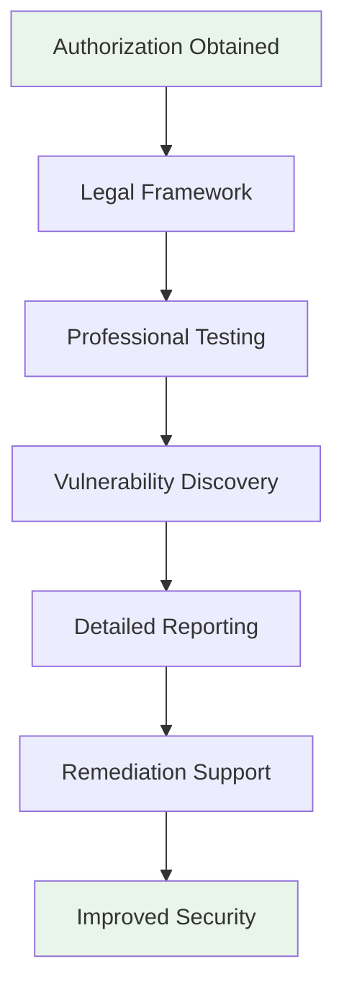
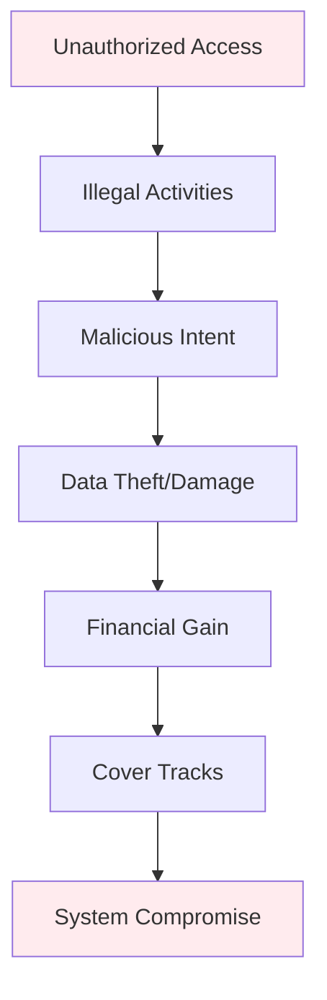

# Introduction to Ethical Hacking
## Unit IV: Ethical Hacking
### Lecture 24: Fundamentals of Ethical Hacking and Penetration Testing

<div class="absolute bottom-5 left-5 text-xs text-gray-500">
Course: Cyber Security (4353204) | Semester V | Diploma ICT | Author: Milav Dabgar
</div>

---
layout: default
---

# What is Ethical Hacking?

<div class="grid grid-cols-2 gap-6">

<div>

## 🎯 Definition and Purpose

**Ethical Hacking** is the practice of intentionally probing systems, networks, and applications to find security vulnerabilities using the same techniques as malicious hackers, but with proper authorization and for legitimate security purposes.

### 🔍 Key Characteristics
- **Authorized access** - Written permission required
- **Legal compliance** - Follows laws and regulations
- **Professional conduct** - Ethical standards maintained
- **Documentation** - Detailed reporting of findings
- **Confidentiality** - Information protection assured
- **Remediation focus** - Helps improve security posture

### 📊 Industry Statistics
- **Global penetration testing market**: $1.7 billion (2021)
- **Expected growth**: 15.1% CAGR (2021-2028)
- **Data breaches prevented**: 67% through ethical hacking
- **Average cost saving**: $3.86 million per avoided breach
- **Security vulnerabilities found**: 85% through pen testing
- **Time to patch**: Reduced by 60% with ethical hacking

### 🏆 Benefits of Ethical Hacking
```yaml
Security Benefits:
  - Proactive vulnerability identification
  - Real-world attack simulation
  - Security posture assessment
  - Risk quantification
  - Compliance validation

Business Benefits:
  - Reduced security incidents
  - Lower breach costs
  - Enhanced customer trust
  - Regulatory compliance
  - Competitive advantage

Technical Benefits:
  - System hardening guidance
  - Security control effectiveness
  - Incident response testing
  - Security awareness improvement
  - Training opportunities
```

</div>

<div>

## ⚖️ Ethical Hacking vs Malicious Hacking

### 🔐 Ethical Hacker (White Hat)


### 🚨 Malicious Hacker (Black Hat)


### 📋 Comparison Table
| Aspect | Ethical Hacker | Malicious Hacker |
|--------|----------------|-------------------|
| **Authorization** | Written permission | Unauthorized |
| **Intent** | Improve security | Personal gain |
| **Methodology** | Structured process | Opportunistic |
| **Documentation** | Comprehensive reports | Hidden activities |
| **Disclosure** | Responsible disclosure | No disclosure |
| **Legal Status** | Legal and authorized | Illegal activities |
| **Outcome** | Enhanced security | System compromise |

### 🎨 Gray Hat Hackers
```yaml
Gray Hat Characteristics:
  - Find vulnerabilities without permission
  - No malicious intent
  - May demand payment for fixes
  - Operate in legal gray area
  - Often security researchers
  - May violate terms of service
  
Examples:
  - Bug bounty hunters (sometimes)
  - Security researchers
  - Whistleblowers
  - Activists (hacktivists)
```

</div>

</div>

<div class="absolute bottom-5 left-5 text-xs text-gray-500">
Course: Cyber Security (4353204) | Unit IV | Lecture 24 | Author: Milav Dabgar
</div>

---
layout: default
---

# Ethical Hacking Methodology

<div class="grid grid-cols-2 gap-6">

<div>

## 🔄 Penetration Testing Lifecycle

### 📋 Phase 1: Pre-Engagement
```yaml
Scope Definition:
  - Target systems identification
  - Testing boundaries
  - Rules of engagement
  - Success criteria
  
Legal Agreements:
  - Statement of work (SOW)
  - Non-disclosure agreement (NDA)
  - Master service agreement (MSA)
  - Liability limitations
  
Timeline Planning:
  - Testing schedule
  - Milestone deliverables
  - Resource allocation
  - Communication protocols
```

### 🕵️ Phase 2: Information Gathering
```yaml
Passive Reconnaissance:
  - Public information gathering
  - Social media research
  - DNS enumeration
  - WHOIS queries
  
Active Reconnaissance:
  - Network scanning
  - Port enumeration
  - Service fingerprinting
  - Vulnerability scanning
  
Social Engineering:
  - Human intelligence (HUMINT)
  - Phishing campaigns
  - Physical reconnaissance
  - Dumpster diving
```

### 🎯 Phase 3: Vulnerability Assessment
```yaml
Automated Scanning:
  - Network vulnerability scanners
  - Web application scanners
  - Database scanners
  - Wireless scanners
  
Manual Testing:
  - Code review
  - Configuration analysis
  - Logic flaw identification
  - Business logic testing
  
Risk Assessment:
  - Vulnerability prioritization
  - Exploitability analysis
  - Impact assessment
  - Risk rating assignment
```

</div>

<div>

## 🚀 Exploitation and Post-Exploitation

### 💥 Phase 4: Exploitation
```yaml
Exploit Development:
  - Proof of concept creation
  - Exploit customization
  - Payload development
  - Delivery mechanism design
  
Attack Execution:
  - Controlled exploitation
  - Access verification
  - Impact demonstration
  - Evidence collection
  
Privilege Escalation:
  - Local privilege escalation
  - Horizontal movement
  - Domain escalation
  - Root/Administrator access
```

### 🔍 Phase 5: Post-Exploitation
```yaml
System Analysis:
  - Operating system enumeration
  - Installed software inventory
  - User account analysis
  - Network configuration review
  
Data Gathering:
  - Sensitive data identification
  - Database enumeration
  - File system analysis
  - Configuration extraction
  
Persistence Maintenance:
  - Backdoor installation
  - Service creation
  - Scheduled task setup
  - Registry modifications
  
Lateral Movement:
  - Network traversal
  - Additional system compromise
  - Domain controller access
  - Cross-network penetration
```

### 📊 Phase 6: Reporting
```yaml
Executive Summary:
  - Business risk overview
  - Key findings summary
  - Remediation priorities
  - Strategic recommendations
  
Technical Details:
  - Vulnerability descriptions
  - Exploitation procedures
  - Evidence screenshots
  - Impact assessments
  
Remediation Guidance:
  - Step-by-step fixes
  - Configuration changes
  - Security controls
  - Best practices
```

</div>

</div>

<div class="absolute bottom-5 left-5 text-xs text-gray-500">
Course: Cyber Security (4353204) | Unit IV | Lecture 24 | Author: Milav Dabgar
</div>

---
layout: default
---

# Types of Penetration Testing

<div class="grid grid-cols-2 gap-6">

<div>

## 🌐 Network Penetration Testing

### 🔧 External Network Testing
```yaml
Scope:
  - Internet-facing systems
  - Public IP addresses
  - DMZ infrastructure
  - Remote access points
  
Testing Objectives:
  - Perimeter security assessment
  - Firewall effectiveness
  - VPN security evaluation
  - Web application security
  
Common Vulnerabilities:
  - Unpatched systems
  - Weak authentication
  - Misconfigured services
  - Default credentials
  
Tools Used:
  - Nmap for port scanning
  - Nessus for vulnerability scanning
  - Metasploit for exploitation
  - Burp Suite for web testing
```

### 🏢 Internal Network Testing
```yaml
Scope:
  - Internal network segments
  - LAN infrastructure
  - Internal servers
  - Workstations and endpoints
  
Testing Scenarios:
  - Insider threat simulation
  - Lateral movement testing
  - Privilege escalation
  - Data exfiltration paths
  
Assessment Areas:
  - Network segmentation
  - Internal firewalls
  - Access controls
  - Monitoring capabilities
  
Common Findings:
  - Flat network topology
  - Excessive privileges
  - Unencrypted communications
  - Weak internal controls
```

## 💻 Application Security Testing

### 🌐 Web Application Testing
```yaml
OWASP Top 10 Testing:
  1. Injection vulnerabilities
  2. Broken authentication
  3. Sensitive data exposure
  4. XML external entities (XXE)
  5. Broken access control
  6. Security misconfigurations
  7. Cross-site scripting (XSS)
  8. Insecure deserialization
  9. Known vulnerabilities
  10. Insufficient logging/monitoring
  
Testing Techniques:
  - Input validation testing
  - Authentication bypass
  - Session management analysis
  - SQL injection testing
  - Cross-site scripting
  - File upload vulnerabilities
```

</div>

<div>

## 📱 Mobile Application Testing

### 🔐 Mobile Security Assessment
```yaml
iOS Application Testing:
  - Binary analysis
  - Runtime manipulation
  - Keychain analysis
  - Network communication
  - Code obfuscation bypass
  
Android Application Testing:
  - APK reverse engineering
  - Intent analysis
  - SQLite database review
  - SharedPreferences analysis
  - Root detection bypass
  
Common Mobile Vulnerabilities:
  - Insecure data storage
  - Weak cryptography
  - Insecure communication
  - Poor authentication
  - Code tampering
  - Reverse engineering
```

## ☁️ Cloud Penetration Testing

### 🌩️ Cloud Security Assessment
```yaml
AWS Security Testing:
  - S3 bucket permissions
  - IAM policy analysis
  - EC2 security groups
  - Lambda function security
  - CloudTrail monitoring
  
Azure Security Testing:
  - Storage account access
  - Active Directory assessment
  - Virtual machine security
  - Key Vault analysis
  - Security Center review
  
Cloud-Specific Risks:
  - Misconfigurations
  - Excessive permissions
  - Data exposure
  - Insecure APIs
  - Shared responsibility gaps
```

## 🏗️ Infrastructure Testing

### 📡 Wireless Security Testing
```yaml
WiFi Security Assessment:
  - WPA/WPA2/WPA3 testing
  - Rogue access point detection
  - Captive portal bypass
  - Enterprise wireless testing
  - Bluetooth security analysis
  
Physical Security Testing:
  - Badge cloning
  - Lock picking
  - RFID/NFC testing
  - Social engineering
  - Facility reconnaissance
```

</div>

</div>

<div class="absolute bottom-5 left-5 text-xs text-gray-500">
Course: Cyber Security (4353204) | Unit IV | Lecture 24 | Author: Milav Dabgar
</div>

---
layout: default
---

# Ethical Hacking Tools and Frameworks

<div class="grid grid-cols-2 gap-6">

<div>

## 🐧 Kali Linux - The Penetration Testing Platform

### 🛠️ Essential Kali Tools
```bash
# Information Gathering
nmap -sS -sV -O target.com    # Network scanning
whois target.com              # Domain information
theHarvester -d target.com -l 500 -b google  # Email harvesting
recon-ng                      # Reconnaissance framework
maltego                       # Link analysis

# Vulnerability Scanning
nessus                        # Comprehensive vulnerability scanner
openvas                       # Open source vulnerability scanner
nikto -h target.com          # Web vulnerability scanner
sqlmap -u "http://target.com/page.php?id=1" # SQL injection testing

# Exploitation Frameworks
msfconsole                    # Metasploit Framework
searchsploit apache          # Exploit database search
armitage                     # Graphical cyber attack tool
cobalt strike               # Advanced threat simulation

# Web Application Testing
burpsuite                    # Web application security testing
owasp-zap                   # OWASP Zed Attack Proxy
dirb http://target.com      # Directory brute forcing
gobuster dir -u http://target.com -w wordlist.txt  # Fast directory/file brute forcer

# Password Attacks
hydra -l admin -P passwords.txt ssh://target.com  # Password brute forcing
john --wordlist=passwords.txt hashes.txt  # Password cracking
hashcat -m 0 -a 0 hashes.txt wordlist.txt  # Advanced password recovery

# Post-Exploitation
mimikatz                     # Credential extraction
bloodhound                  # Active Directory attack paths
empire                      # PowerShell post-exploitation
```

### 💻 Custom Penetration Testing Script
```python
#!/usr/bin/env python3
"""
Automated Penetration Testing Framework
Educational purposes only - Use with proper authorization
"""

import subprocess
import sys
import json
import time
from datetime import datetime
from pathlib import Path

class EthicalPenTest:
    def __init__(self, target, output_dir="results"):
        self.target = target
        self.output_dir = Path(output_dir)
        self.output_dir.mkdir(exist_ok=True)
        self.results = {}
        
    def banner(self):
        """Display banner and legal notice"""
        print("""
╔══════════════════════════════════════════════════════════════╗
║                   ETHICAL PENETRATION TESTING                ║
║                                                              ║
║  WARNING: This tool is for authorized testing only!         ║
║  Ensure you have written permission before proceeding.      ║
║                                                              ║
║  Target: {:<50} ║
║  Date: {:<52} ║
╚══════════════════════════════════════════════════════════════╝
        """.format(self.target, datetime.now().strftime("%Y-%m-%d %H:%M:%S")))
    
    def reconnaissance(self):
        """Phase 1: Information Gathering"""
        print("\n[+] Starting Reconnaissance Phase...")
        
        # Network discovery
        print("  [*] Performing network discovery...")
        nmap_cmd = f"nmap -sn {self.target}"
        result = subprocess.run(nmap_cmd.split(), capture_output=True, text=True)
        self.results['network_discovery'] = result.stdout
        
        # Port scanning
        print("  [*] Scanning common ports...")
        nmap_cmd = f"nmap -sS -sV -O -T4 --top-ports 1000 {self.target}"
        result = subprocess.run(nmap_cmd.split(), capture_output=True, text=True)
        self.results['port_scan'] = result.stdout
        
        # Service enumeration
        print("  [*] Enumerating services...")
        nmap_cmd = f"nmap -sC -sV {self.target}"
        result = subprocess.run(nmap_cmd.split(), capture_output=True, text=True)
        self.results['service_enum'] = result.stdout
        
        # DNS enumeration
        print("  [*] DNS enumeration...")
        try:
            dig_cmd = f"dig {self.target} ANY"
            result = subprocess.run(dig_cmd.split(), capture_output=True, text=True)
            self.results['dns_enum'] = result.stdout
        except:
            self.results['dns_enum'] = "DNS enumeration failed"
    
    def vulnerability_scanning(self):
        """Phase 2: Vulnerability Assessment"""
        print("\n[+] Starting Vulnerability Scanning Phase...")
        
        # Web vulnerability scanning (if web server detected)
        if "http" in str(self.results.get('port_scan', '')).lower():
            print("  [*] Web vulnerability scanning...")
            nikto_cmd = f"nikto -h {self.target}"
            try:
                result = subprocess.run(nikto_cmd.split(), capture_output=True, text=True)
                self.results['web_vulns'] = result.stdout
            except:
                self.results['web_vulns'] = "Nikto scan failed"
        
        # SSL/TLS testing
        print("  [*] SSL/TLS configuration testing...")
        try:
            sslscan_cmd = f"sslscan {self.target}"
            result = subprocess.run(sslscan_cmd.split(), capture_output=True, text=True)
            self.results['ssl_scan'] = result.stdout
        except:
            self.results['ssl_scan'] = "SSL scan not available"
    
    def generate_report(self):
        """Generate comprehensive penetration testing report"""
        report_file = self.output_dir / f"pentest_report_{self.target}_{datetime.now().strftime('%Y%m%d_%H%M%S')}.txt"
        
        with open(report_file, 'w') as f:
            f.write(f"""
ETHICAL PENETRATION TESTING REPORT
==================================

Target: {self.target}
Date: {datetime.now().strftime('%Y-%m-%d %H:%M:%S')}
Tester: Authorized Security Professional

EXECUTIVE SUMMARY
================
This report contains findings from an authorized penetration test performed against {self.target}.
All testing was conducted with proper authorization and following ethical guidelines.

TECHNICAL FINDINGS
==================

1. NETWORK DISCOVERY
{self.results.get('network_discovery', 'No data')}

2. PORT SCAN RESULTS
{self.results.get('port_scan', 'No data')}

3. SERVICE ENUMERATION
{self.results.get('service_enum', 'No data')}

4. DNS ENUMERATION
{self.results.get('dns_enum', 'No data')}

5. WEB VULNERABILITIES
{self.results.get('web_vulns', 'No web services detected')}

6. SSL/TLS ASSESSMENT
{self.results.get('ssl_scan', 'No SSL services detected')}

RECOMMENDATIONS
==============
1. Implement network segmentation
2. Apply security patches regularly
3. Disable unnecessary services
4. Implement strong authentication
5. Configure proper SSL/TLS settings
6. Deploy intrusion detection systems
7. Regular security assessments

DISCLAIMER
==========
This assessment was performed for educational and security improvement purposes only.
All findings should be verified and remediated according to organization policies.
""")
        
        print(f"\n[+] Report generated: {report_file}")
    
    def run_assessment(self):
        """Execute complete penetration testing assessment"""
        self.banner()
        
        # Confirm authorization
        confirm = input("\nDo you have written authorization to test this target? (yes/no): ")
        if confirm.lower() != 'yes':
            print("[!] Testing requires proper authorization. Exiting...")
            sys.exit(1)
        
        try:
            self.reconnaissance()
            self.vulnerability_scanning()
            self.generate_report()
            
            print("\n[+] Penetration testing assessment completed successfully!")
            print(f"[+] Results saved in: {self.output_dir}")
            
        except KeyboardInterrupt:
            print("\n[!] Assessment interrupted by user")
        except Exception as e:
            print(f"\n[!] Error during assessment: {e}")

# Example usage
if __name__ == "__main__":
    if len(sys.argv) != 2:
        print("Usage: python3 ethical_pentest.py <target>")
        print("Example: python3 ethical_pentest.py 192.168.1.0/24")
        sys.exit(1)
    
    target = sys.argv[1]
    pentest = EthicalPenTest(target)
    pentest.run_assessment()
```

</div>

<div>

## 🎯 Professional Penetration Testing Frameworks

### 🏗️ OWASP Testing Framework
```yaml
OWASP Testing Methodology:
  1. Information Gathering:
     - Conduct search engine discovery
     - Fingerprint web server
     - Review webserver metafiles
     - Enumerate applications on webserver
  
  2. Configuration Management:
     - Test network/infrastructure configuration
     - Test application platform configuration
     - Test handling of file extensions
     - Review old, backup and unreferenced files
  
  3. Identity Management:
     - Test role definitions
     - Test user registration process
     - Test account provisioning process
     - Test account suspension/resumption
  
  4. Input Validation:
     - Test for reflected cross site scripting
     - Test for stored cross site scripting
     - Test for HTTP verb tampering
     - Test for HTTP parameter pollution
     - Test for SQL injection
     - Test for LDAP injection
     - Test for ORM injection
     - Test for XML injection
     - Test for SSI injection
     - Test for XPath injection
     - Test for IMAP/SMTP injection
     - Test for code injection
     - Test for command injection
```

### 🔄 PTES (Penetration Testing Execution Standard)
```yaml
PTES Methodology:
  Pre-engagement Interactions:
    - Scope agreements
    - Rules of engagement
    - Timeline definition
    - Resource requirements
  
  Intelligence Gathering:
    - OSINT collection
    - Social engineering
    - Physical reconnaissance
    - Technical reconnaissance
  
  Threat Modeling:
    - Business asset analysis
    - Threat agent identification
    - Attack vector analysis
    - Attack tree development
  
  Vulnerability Analysis:
    - Automated scanning
    - Manual verification
    - Validation testing
    - Categorization and prioritization
  
  Exploitation:
    - Precise exploitation
    - Anti-virus evasion
    - Circumventing controls
    - Privilege escalation
  
  Post Exploitation:
    - Infrastructure analysis
    - Pillaging
    - Business impact
    - Persistence
    - Cleanup
  
  Reporting:
    - Executive summary
    - Technical report
    - Remediation recommendations
    - Strategic roadmap
```

### 🛡️ Vulnerability Assessment Tools
```python
# Professional vulnerability scanning script
import nmap
import requests
import ssl
import socket
from urllib.parse import urlparse

class VulnerabilityScanner:
    def __init__(self, target):
        self.target = target
        self.nm = nmap.PortScanner()
        self.vulnerabilities = []
    
    def network_scan(self):
        """Comprehensive network vulnerability scan"""
        print(f"[*] Scanning {self.target} for network vulnerabilities...")
        
        # Port scan with service detection
        self.nm.scan(self.target, '1-65535', '-sV -sC --script vuln')
        
        for host in self.nm.all_hosts():
            for proto in self.nm[host].all_protocols():
                ports = self.nm[host][proto].keys()
                for port in ports:
                    port_info = self.nm[host][proto][port]
                    if 'script' in port_info:
                        for script_id, output in port_info['script'].items():
                            if 'VULNERABLE' in output:
                                self.vulnerabilities.append({
                                    'host': host,
                                    'port': port,
                                    'vulnerability': script_id,
                                    'details': output
                                })
    
    def web_security_scan(self):
        """Web application security scanning"""
        if self.target.startswith('http'):
            print(f"[*] Scanning web application: {self.target}")
            
            # Check for common web vulnerabilities
            self.check_http_methods()
            self.check_ssl_configuration()
            self.check_security_headers()
            self.check_directory_traversal()
            self.check_xss_vulnerability()
    
    def check_http_methods(self):
        """Check for dangerous HTTP methods"""
        dangerous_methods = ['PUT', 'DELETE', 'TRACE', 'CONNECT']
        
        for method in dangerous_methods:
            try:
                response = requests.request(method, self.target, timeout=5)
                if response.status_code != 405:  # Method Not Allowed
                    self.vulnerabilities.append({
                        'type': 'HTTP Method',
                        'method': method,
                        'status': response.status_code,
                        'risk': 'Medium'
                    })
            except:
                pass
    
    def check_security_headers(self):
        """Check for missing security headers"""
        security_headers = [
            'X-Content-Type-Options',
            'X-Frame-Options',
            'X-XSS-Protection',
            'Strict-Transport-Security',
            'Content-Security-Policy'
        ]
        
        try:
            response = requests.get(self.target, timeout=5)
            missing_headers = []
            
            for header in security_headers:
                if header not in response.headers:
                    missing_headers.append(header)
            
            if missing_headers:
                self.vulnerabilities.append({
                    'type': 'Missing Security Headers',
                    'headers': missing_headers,
                    'risk': 'Medium'
                })
        except:
            pass
    
    def generate_report(self):
        """Generate vulnerability assessment report"""
        print("\n" + "="*60)
        print("VULNERABILITY ASSESSMENT REPORT")
        print("="*60)
        print(f"Target: {self.target}")
        print(f"Total Vulnerabilities Found: {len(self.vulnerabilities)}")
        print("\nVULNERABILITIES:")
        print("-" * 60)
        
        for i, vuln in enumerate(self.vulnerabilities, 1):
            print(f"\n{i}. {vuln.get('type', 'Network Vulnerability')}")
            for key, value in vuln.items():
                if key != 'type':
                    print(f"   {key}: {value}")
        
        print("\nRECOMMENDATIONS:")
        print("-" * 60)
        print("1. Patch all identified vulnerabilities")
        print("2. Implement security headers")
        print("3. Disable unnecessary services")
        print("4. Regular security assessments")
        print("5. Security awareness training")

# Usage example
# scanner = VulnerabilityScanner("192.168.1.1")
# scanner.network_scan()
# scanner.generate_report()
```

</div>

</div>

<div class="absolute bottom-5 left-5 text-xs text-gray-500">
Course: Cyber Security (4353204) | Unit IV | Lecture 24 | Author: Milav Dabgar
</div>

---
layout: default
---

# Legal and Ethical Considerations

<div class="grid grid-cols-2 gap-6">

<div>

## ⚖️ Legal Framework for Ethical Hacking

### 📜 Key Legal Principles
```yaml
Authorization Requirements:
  - Written consent from system owner
  - Scope clearly defined
  - Testing boundaries established
  - Legal liability addressed
  
International Laws:
  - Computer Fraud and Abuse Act (USA)
  - Computer Misuse Act (UK)
  - Cybercrime laws (EU)
  - Local cybersecurity regulations
  
Compliance Considerations:
  - GDPR data protection
  - HIPAA healthcare data
  - PCI DSS payment systems
  - SOX financial reporting
  - Industry-specific regulations
```

### 📋 Legal Documentation
```yaml
Statement of Work (SOW):
  - Project scope and objectives
  - Testing methodology
  - Deliverables and timeline
  - Payment terms
  
Rules of Engagement (RoE):
  - Authorized testing hours
  - Systems in/out of scope
  - Emergency contacts
  - Escalation procedures
  - Data handling requirements
  
Non-Disclosure Agreement (NDA):
  - Confidentiality obligations
  - Data protection requirements
  - Information retention limits
  - Disclosure restrictions
```

### 💼 Professional Liability
```yaml
Insurance Coverage:
  - Professional liability insurance
  - Errors and omissions coverage
  - Cyber liability protection
  - Legal defense costs
  
Risk Mitigation:
  - Clear contractual terms
  - Limitation of liability clauses
  - Indemnification agreements
  - Regular legal review
```

## 🎯 Ethical Guidelines and Standards

### 🏆 Professional Certifications
```yaml
CEH (Certified Ethical Hacker):
  - EC-Council certification
  - Global recognition
  - Ethical hacking methodology
  - Industry standards
  
OSCP (Offensive Security Certified Professional):
  - Hands-on penetration testing
  - Practical exploitation skills
  - Try harder methodology
  - Real-world scenarios
  
CISSP (Certified Information Systems Security Professional):
  - Comprehensive security knowledge
  - Management-level certification
  - Security architecture focus
  - International recognition
  
GCIH (GIAC Certified Incident Handler):
  - Incident response skills
  - Forensics capabilities
  - Threat hunting techniques
  - Defense-oriented approach
```

</div>

<div>

## 📊 Professional Ethics Code

### 🤝 Ethical Principles
```python
# Ethical Hacking Code of Conduct
class EthicalHackerCode:
    def __init__(self):
        self.principles = {
            "authorization": "Always obtain proper authorization",
            "confidentiality": "Protect client information",
            "integrity": "Report findings accurately",
            "professionalism": "Maintain professional standards",
            "disclosure": "Practice responsible disclosure",
            "education": "Share knowledge responsibly"
        }
    
    def check_authorization(self, target, documentation):
        """Verify proper authorization before testing"""
        required_docs = [
            "signed_contract",
            "scope_statement",
            "emergency_contacts",
            "legal_approval"
        ]
        
        if not all(doc in documentation for doc in required_docs):
            return False, "Missing required authorization documents"
        
        print(f"✅ Authorization verified for {target}")
        return True, "Authorized to proceed"
    
    def responsible_disclosure(self, vulnerability, severity):
        """Handle vulnerability disclosure ethically"""
        disclosure_timeline = {
            "critical": 1,    # 1 day
            "high": 7,        # 1 week
            "medium": 30,     # 1 month
            "low": 90         # 3 months
        }
        
        timeline = disclosure_timeline.get(severity, 30)
        
        print(f"Vulnerability disclosure timeline: {timeline} days")
        print("1. Report to client immediately")
        print("2. Provide remediation guidance")
        print("3. Verify fixes implemented")
        print("4. Public disclosure (if applicable)")
        
        return timeline
    
    def data_protection(self, sensitive_data):
        """Protect sensitive data discovered during testing"""
        protection_measures = [
            "encrypt_data_at_rest",
            "secure_data_transmission",
            "limited_access_controls",
            "automatic_deletion_schedule",
            "audit_trail_logging"
        ]
        
        for measure in protection_measures:
            print(f"✅ Implementing: {measure}")
        
        return "Data protection measures implemented"

# Example usage
ethics = EthicalHackerCode()
authorized = ethics.check_authorization("target.com", {
    "signed_contract": True,
    "scope_statement": True,
    "emergency_contacts": True,
    "legal_approval": True
})

if authorized[0]:
    print("Ethical hacking assessment authorized to proceed")
else:
    print("Authorization insufficient - cannot proceed")
```

### 🔒 Responsible Disclosure Process
```yaml
Vulnerability Discovery:
  1. Document vulnerability details
  2. Assess potential impact
  3. Create proof of concept
  4. Prepare remediation guidance
  
Client Notification:
  1. Immediate notification for critical issues
  2. Secure communication channels
  3. Detailed technical report
  4. Remediation recommendations
  
Remediation Support:
  1. Technical assistance
  2. Validation testing
  3. Progress monitoring
  4. Documentation updates
  
Public Disclosure:
  1. Wait for client remediation
  2. Coordinate disclosure timeline
  3. Sanitize sensitive information
  4. Educational value consideration
```

### 🛡️ Professional Standards
```yaml
Testing Standards:
  - Follow established methodologies
  - Use current industry frameworks
  - Document all activities
  - Maintain evidence integrity
  
Reporting Standards:
  - Clear vulnerability descriptions
  - Accurate risk assessments
  - Actionable recommendations
  - Executive and technical sections
  
Communication Standards:
  - Regular status updates
  - Clear escalation procedures
  - Professional presentation
  - Stakeholder management
```

</div>

</div>

<div class="absolute bottom-5 left-5 text-xs text-gray-500">
Course: Cyber Security (4353204) | Unit IV | Lecture 24 | Author: Milav Dabgar
</div>

---
layout: default
---

# Practical Exercise: Ethical Hacking Assessment Planning

<div class="exercise-container">

## 🎯 Group Activity (35 minutes)

### Scenario: Corporate Security Assessment

Your cybersecurity consulting firm has been contracted to perform a comprehensive ethical hacking assessment for **TechCorp Industries**, a mid-sized financial services company.

**Company Profile:**
- **1,200 employees** across 5 office locations
- **Web-based banking platform** serving 50,000+ customers
- **Mixed infrastructure**: On-premises and AWS cloud
- **Compliance requirements**: PCI DSS, SOX, state banking regulations
- **Previous security incidents**: Minor phishing attacks, no major breaches
- **Security maturity**: Basic firewalls, antivirus, some employee training

### Task: Develop Comprehensive Penetration Testing Plan

**Phase 1: Pre-Engagement Planning (12 minutes)**

**Legal and Ethical Preparation:**
1. What legal documents and agreements would you require?
2. How would you define the scope and rules of engagement?
3. What authorization levels would you need from different stakeholders?
4. How would you handle potential service disruptions during testing?

**Scope Definition:**
1. Which systems and networks should be included in/excluded from testing?
2. How would you prioritize different testing areas (external, internal, applications)?
3. What testing methods would be most appropriate for this environment?
4. How would you coordinate testing schedules to minimize business impact?

**Phase 2: Methodology and Testing Strategy (12 minutes)**

**Testing Approach:**
1. What penetration testing methodology would you follow and why?
2. How would you structure the testing phases and timeline?
3. What tools and techniques would be most effective for this target?
4. How would you handle discovered vulnerabilities during active testing?

**Risk Management:**
1. How would you ensure testing doesn't disrupt critical banking services?
2. What backup and rollback plans would you implement?
3. How would you handle emergency situations during testing?
4. What communication protocols would you establish?

**Phase 3: Reporting and Remediation (11 minutes)**

**Reporting Strategy:**
1. How would you structure reports for different audiences (executives, IT, compliance)?
2. What vulnerability classification and risk rating system would you use?
3. How would you prioritize remediation recommendations?
4. What evidence and documentation standards would you maintain?

**Post-Assessment Activities:**
1. How would you support the client's remediation efforts?
2. What follow-up testing or validation would you recommend?
3. How would you handle responsible disclosure if applicable?
4. What ongoing security improvement recommendations would you provide?

**Deliverables:**
- Pre-engagement checklist and documentation requirements
- Detailed penetration testing methodology and timeline
- Risk mitigation and communication plan
- Reporting framework and remediation roadmap
- Professional ethics compliance checklist

</div>

<style>
.exercise-container {
  @apply bg-blue-50 border-2 border-blue-300 rounded-lg p-6;
}
</style>

<div class="absolute bottom-5 left-5 text-xs text-gray-500">
Course: Cyber Security (4353204) | Unit IV | Lecture 24 | Author: Milav Dabgar
</div>

---
layout: center
class: text-center
---

# Questions & Discussion

## 🤔 Discussion Points:
- How do you balance thoroughness with minimizing business disruption?
- What's your approach to handling discovered critical vulnerabilities during testing?
- How do you maintain professional ethics when facing pressure to "find something"?

### 💡 Exercise Review
Share your penetration testing plans and discuss ethical considerations

<div class="absolute bottom-5 left-5 text-xs text-gray-500">
Course: Cyber Security (4353204) | Unit IV | Lecture 24 | Author: Milav Dabgar
</div>

---
layout: center
class: text-center
---

# Thank You!

## Next Lecture: Information Gathering and Reconnaissance Techniques
### Mastering the Art of Ethical Intelligence Collection

<div class="pt-8 text-gray-500">
  <p>Cyber Security (4353204) - Lecture 24 Complete</p>
  <p>Ethical hacking: Where curiosity meets responsibility! 🎯🛡️</p>
</div>

<div class="absolute bottom-5 left-5 text-xs text-gray-500">
Course: Cyber Security (4353204) | Unit IV | Lecture 24 | Author: Milav Dabgar
</div>