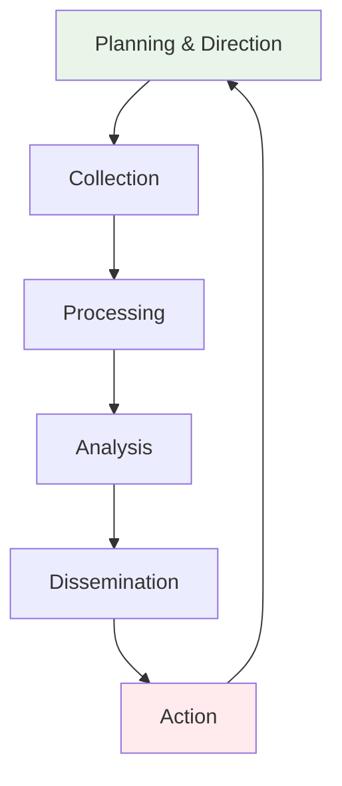

# Information Gathering and Reconnaissance
## Unit IV: Ethical Hacking
### Lecture 25: Intelligence Collection and OSINT Techniques

<div class="absolute bottom-5 left-5 text-xs text-gray-500">
Course: Cyber Security (4353204) | Semester V | Diploma ICT | Author: Milav Dabgar
</div>

---
layout: default
---

# The Art of Reconnaissance

<div class="grid grid-cols-2 gap-6">

<div>

## 🔍 What is Reconnaissance?

**Reconnaissance** is the systematic process of gathering information about a target to identify potential attack vectors, vulnerabilities, and security weaknesses before launching any exploitation attempts.

### 🎯 Key Objectives
- **Target identification** - Discover systems, networks, and assets
- **Attack surface mapping** - Identify entry points and vulnerabilities
- **Intelligence gathering** - Collect operational and technical information
- **Risk assessment** - Evaluate potential impact and success likelihood
- **Planning support** - Inform attack strategy and methodology
- **Stealth maintenance** - Avoid detection during information collection

### 📊 Reconnaissance Statistics
- **95%** of successful attacks begin with reconnaissance
- **Average reconnaissance time**: 250+ days before attack
- **Information sources**: 70% public, 20% semi-public, 10% private
- **Social media intelligence**: 85% of organizations have exploitable data
- **DNS information leakage**: 60% of organizations expose internal structure
- **Employee information**: Available for 90% of target organizations

### 🔄 Intelligence Cycle


### 💡 Reconnaissance Benefits
```yaml
Strategic Advantages:
  - Reduced detection risk
  - Higher attack success rate
  - Efficient resource utilization
  - Better target prioritization
  - Enhanced attack planning

Information Assets:
  - Network infrastructure details
  - Employee personal information
  - Technology stack identification
  - Security control awareness
  - Business process understanding
  - Organizational structure mapping
```

</div>

<div>

## 🔀 Types of Reconnaissance

### 🕵️ Passive Reconnaissance
**Definition**: Gathering information without directly interacting with the target system or alerting security controls.

```yaml
Characteristics:
  - No direct target contact
  - Uses publicly available information
  - Difficult to detect
  - Lower legal risk
  - Time-intensive process
  - High information accuracy

Advantages:
  - Stealth operation
  - No alerting target
  - Legal gray area minimal
  - Comprehensive data collection
  - Social engineering preparation
  - Attack vector identification

Limitations:
  - Information may be outdated
  - Limited technical details
  - Time-consuming process
  - Requires manual analysis
  - May miss recent changes
  - Indirect validation needed
```

### 🎯 Active Reconnaissance
**Definition**: Direct interaction with target systems to gather information, potentially triggering security alerts and logs.

```yaml
Characteristics:
  - Direct system interaction
  - Real-time information
  - Higher detection risk
  - Immediate results
  - Technical precision
  - Legal implications

Advantages:
  - Current system state
  - Accurate service details
  - Port and service enumeration
  - Vulnerability confirmation
  - Network topology mapping
  - Live system validation

Risks:
  - Security alert triggering
  - Legal liability issues
  - Intrusion detection alerts
  - System performance impact
  - Activity logging
  - Relationship damage risk
```

### 🔄 Hybrid Approach
```python
# Reconnaissance strategy framework
class ReconnaissanceStrategy:
    def __init__(self, target):
        self.target = target
        self.passive_intel = {}
        self.active_intel = {}
        self.risk_level = "low"
    
    def passive_phase(self):
        """Phase 1: Passive information gathering"""
        techniques = [
            "search_engine_intelligence",
            "social_media_analysis",
            "dns_enumeration",
            "whois_analysis",
            "public_records_research",
            "financial_data_analysis",
            "news_monitoring",
            "job_posting_analysis"
        ]
        
        for technique in techniques:
            print(f"Executing: {technique}")
            # Implementation would go here
        
        self.risk_level = "minimal"
        return self.passive_intel
    
    def active_phase(self):
        """Phase 2: Active reconnaissance (authorized)"""
        if not self.authorized():
            print("ERROR: Active reconnaissance requires authorization")
            return
        
        techniques = [
            "port_scanning",
            "service_enumeration",
            "vulnerability_scanning",
            "network_mapping",
            "banner_grabbing",
            "certificate_analysis"
        ]
        
        for technique in techniques:
            print(f"Executing: {technique}")
            # Implementation would go here
        
        self.risk_level = "elevated"
        return self.active_intel
    
    def authorized(self):
        """Verify authorization for active testing"""
        # Check for proper authorization
        return True  # Placeholder
```

</div>

</div>

<div class="absolute bottom-5 left-5 text-xs text-gray-500">
Course: Cyber Security (4353204) | Unit IV | Lecture 25 | Author: Milav Dabgar
</div>

---
layout: default
---

# Open Source Intelligence (OSINT)

<div class="grid grid-cols-2 gap-6">

<div>

## 🌐 OSINT Fundamentals

**Open Source Intelligence (OSINT)** is the collection and analysis of publicly available information to produce actionable intelligence for security assessments.

### 🔍 OSINT Sources
```yaml
Primary Sources:
  - Search engines (Google, Bing, DuckDuckGo)
  - Social media platforms
  - Company websites and blogs
  - Government databases
  - Public registries and records
  - News articles and press releases
  - Academic publications
  - Professional networking sites

Secondary Sources:
  - Industry reports and analyses
  - Third-party security assessments
  - Competitor intelligence
  - Market research data
  - Financial filings
  - Patent databases
  - Code repositories
  - Technical documentation
```

### 🛠️ Essential OSINT Tools
```bash
# Search Engine Intelligence
site:target.com filetype:pdf
site:target.com inurl:admin
cache:target.com
"target.com" -site:target.com

# DNS and Network Intelligence
whois target.com
dig target.com ANY
nslookup -type=MX target.com
host -a target.com

# Social Media Intelligence
theHarvester -d target.com -l 500 -b google
recon-ng
maltego
spiderfoot

# Specialized OSINT Tools
shodan search hostname:target.com
censys search target.com
wayback machine analysis
github and gitlab searches
```

### 📱 Social Media Intelligence (SOCINT)
```python
#!/usr/bin/env python3
"""
Social Media Intelligence Gathering Tool
Educational purposes - Respect privacy and terms of service
"""

import requests
import json
import re
from urllib.parse import urlencode
import time

class SocialIntelligence:
    def __init__(self, target_organization):
        self.target = target_organization
        self.employees = []
        self.social_profiles = {}
        
    def linkedin_enumeration(self, company_name):
        """Gather employee information from LinkedIn"""
        print(f"[*] Searching LinkedIn for {company_name} employees...")
        
        # Note: This would require LinkedIn API or web scraping
        # Educational framework only - respect terms of service
        search_queries = [
            f'site:linkedin.com "{company_name}"',
            f'site:linkedin.com "{company_name}" "software engineer"',
            f'site:linkedin.com "{company_name}" "system administrator"',
            f'site:linkedin.com "{company_name}" "network engineer"'
        ]
        
        for query in search_queries:
            print(f"  [+] Query: {query}")
            # Implementation would use appropriate APIs
            
        return self.employees
    
    def twitter_intelligence(self, company_handle):
        """Analyze Twitter presence and employee accounts"""
        print(f"[*] Analyzing Twitter intelligence for {company_handle}")
        
        intelligence_areas = [
            "company_announcements",
            "employee_accounts",
            "technology_mentions",
            "security_updates",
            "event_participation",
            "customer_interactions"
        ]
        
        for area in intelligence_areas:
            print(f"  [+] Analyzing: {area}")
            
    def github_reconnaissance(self, organization):
        """GitHub repository and developer intelligence"""
        print(f"[*] GitHub reconnaissance for {organization}")
        
        try:
            # GitHub API example (requires authentication)
            api_url = f"https://api.github.com/orgs/{organization}"
            headers = {
                'Accept': 'application/vnd.github.v3+json',
                # 'Authorization': 'token YOUR_TOKEN'  # Required for real use
            }
            
            # This is a framework - actual implementation needs proper auth
            areas_to_analyze = [
                "public_repositories",
                "organization_members",
                "code_languages",
                "recent_commits",
                "issue_discussions",
                "security_policies"
            ]
            
            for area in areas_to_analyze:
                print(f"  [+] Analyzing: {area}")
                
        except Exception as e:
            print(f"  [!] Error: {e}")
    
    def email_pattern_analysis(self, domain):
        """Identify email patterns and potential accounts"""
        print(f"[*] Email pattern analysis for {domain}")
        
        common_patterns = [
            "firstname.lastname@{domain}",
            "firstname@{domain}",
            "flastname@{domain}",
            "first.last@{domain}",
            "f.lastname@{domain}"
        ]
        
        for pattern in common_patterns:
            print(f"  [+] Pattern: {pattern.format(domain=domain)}")
    
    def generate_intelligence_report(self):
        """Generate comprehensive OSINT report"""
        report = f"""
SOCIAL MEDIA INTELLIGENCE REPORT
================================

Target: {self.target}
Analysis Date: {time.strftime('%Y-%m-%d %H:%M:%S')}

EMPLOYEE ENUMERATION:
{len(self.employees)} employees identified across platforms

SOCIAL MEDIA PRESENCE:
- LinkedIn: Company page analysis
- Twitter: Corporate and employee accounts
- Facebook: Business presence
- Instagram: Brand representation

GITHUB INTELLIGENCE:
- Repository analysis
- Developer identification
- Technology stack assessment
- Security policy review

RECOMMENDATIONS:
1. Employee security awareness training
2. Social media policy implementation
3. Information sharing guidelines
4. Public repository security review
5. Employee privacy training

RISK ASSESSMENT:
- Information disclosure: Medium
- Social engineering risk: High
- Credential exposure: Medium
- Business intelligence leakage: High
        """
        
        return report

# Example usage framework
# osint = SocialIntelligence("TechCorp")
# osint.linkedin_enumeration("TechCorp Inc")
# osint.twitter_intelligence("@techcorp")
# osint.github_reconnaissance("techcorp")
# report = osint.generate_intelligence_report()
# print(report)
```

</div>

<div>

## 🔎 Advanced OSINT Techniques

### 🌍 Search Engine Intelligence
```python
# Advanced Google Dorking for OSINT
class SearchEngineIntelligence:
    def __init__(self, target_domain):
        self.target = target_domain
        self.search_results = {}
    
    def google_dorking(self):
        """Advanced Google search operators"""
        dorks = {
            # Sensitive files
            "documents": f'site:{self.target} filetype:pdf OR filetype:doc OR filetype:xls',
            "configurations": f'site:{self.target} filetype:conf OR filetype:config OR filetype:cfg',
            "database_files": f'site:{self.target} filetype:sql OR filetype:db',
            "backup_files": f'site:{self.target} filetype:bak OR filetype:backup',
            
            # Directory listings
            "directories": f'site:{self.target} intitle:"Index of"',
            "admin_panels": f'site:{self.target} inurl:admin OR inurl:administrator',
            "login_pages": f'site:{self.target} inurl:login OR inurl:signin',
            
            # System information
            "phpinfo": f'site:{self.target} "phpinfo()" OR "PHP Version"',
            "server_status": f'site:{self.target} "server-status" OR "server-info"',
            "error_messages": f'site:{self.target} "error" OR "warning" OR "fatal"',
            
            # Employee information
            "employees": f'"{self.target}" site:linkedin.com',
            "contact_info": f'site:{self.target} "email" OR "phone" OR "contact"',
            "org_chart": f'site:{self.target} "org chart" OR "organizational"',
            
            # Technology footprint
            "technologies": f'site:{self.target} "powered by" OR "built with" OR "framework"',
            "versions": f'site:{self.target} "version" OR "v1." OR "v2." OR "v3."',
            "api_docs": f'site:{self.target} "API" OR "documentation" OR "developer"'
        }
        
        for category, query in dorks.items():
            print(f"[*] Searching for {category}:")
            print(f"    Query: {query}")
            # Actual implementation would execute searches
            
        return dorks
    
    def subdomain_enumeration(self):
        """Discover subdomains using search engines"""
        search_patterns = [
            f'site:*.{self.target}',
            f'site:{self.target} -www',
            f'inurl:{self.target}',
            f'"*.{self.target}"'
        ]
        
        common_subdomains = [
            "www", "mail", "ftp", "admin", "test", "dev", "staging",
            "api", "app", "secure", "vpn", "remote", "blog", "shop",
            "portal", "support", "help", "docs", "cdn", "static"
        ]
        
        print(f"[*] Subdomain enumeration for {self.target}")
        for subdomain in common_subdomains:
            full_domain = f"{subdomain}.{self.target}"
            print(f"  [+] Testing: {full_domain}")
```

### 🗂️ Public Records and Databases
```yaml
Business Intelligence Sources:
  Corporate Registrations:
    - SEC filings (US)
    - Companies House (UK)
    - Local business registrations
    - Trade mark databases
  
  Financial Information:
    - Annual reports
    - Quarterly filings
    - Credit ratings
    - Investment records
  
  Legal Documents:
    - Court filings
    - Patent applications
    - Trademark registrations
    - Litigation records

Technical Intelligence Sources:
  DNS Records:
    - WHOIS databases
    - DNS zone transfers
    - Certificate transparency logs
    - Historical DNS data
  
  Network Information:
    - ASN (Autonomous System Number) data
    - IP address assignments
    - BGP routing information
    - Network topology maps
  
  Certificate Analysis:
    - SSL/TLS certificates
    - Certificate authorities
    - SAN (Subject Alternative Name)
    - Certificate transparency
```

### 🔍 Shodan and Internet-Wide Scanning
```python
# Shodan Intelligence Framework
class ShodanIntelligence:
    def __init__(self, api_key=None):
        self.api_key = api_key
        self.results = {}
    
    def search_organization(self, organization):
        """Search for organization's internet-facing assets"""
        search_queries = [
            f'org:"{organization}"',
            f'hostname:"{organization.lower().replace(" ", "")}.com"',
            f'ssl.cert.subject.cn:"{organization.lower()}.com"',
            f'http.title:"{organization}"'
        ]
        
        for query in search_queries:
            print(f"[*] Shodan query: {query}")
            # Actual implementation would use Shodan API
            # shodan search {query}
            
    def analyze_services(self, target_ip):
        """Analyze services and technologies"""
        service_categories = [
            "web_servers",
            "database_servers", 
            "mail_servers",
            "ftp_servers",
            "ssh_servers",
            "remote_access",
            "network_devices",
            "iot_devices"
        ]
        
        for category in service_categories:
            print(f"  [+] Analyzing {category} for {target_ip}")
            
    def vulnerability_correlation(self, services):
        """Correlate discovered services with known vulnerabilities"""
        vulnerability_databases = [
            "CVE database",
            "ExploitDB",
            "Metasploit modules",
            "Vendor advisories"
        ]
        
        for db in vulnerability_databases:
            print(f"  [+] Checking {db} for service vulnerabilities")

# Example Shodan searches (educational)
shodan_queries = [
    'apache country:"US"',
    'IIS country:"US"',
    'ssh default password',
    'mysql port:3306',
    'mongodb port:27017',
    'elasticsearch port:9200',
    'vnc port:5900',
    'rdp port:3389'
]
```

</div>

</div>

<div class="absolute bottom-5 left-5 text-xs text-gray-500">
Course: Cyber Security (4353204) | Unit IV | Lecture 25 | Author: Milav Dabgar
</div>

---
layout: default
---

# DNS Enumeration and Analysis

<div class="grid grid-cols-2 gap-6">

<div>

## 🌐 DNS Intelligence Gathering

**Domain Name System (DNS)** contains valuable information about network infrastructure, subdomains, mail servers, and organizational structure.

### 🔍 DNS Record Types
```yaml
Essential DNS Records:
  A Records:
    - IPv4 address mappings
    - Primary domain resolution
    - Subdomain identification
    - Load balancer detection
  
  AAAA Records:
    - IPv6 address mappings
    - Modern infrastructure
    - Dual-stack implementations
    - Future connectivity
  
  MX Records:
    - Mail server identification
    - Email infrastructure mapping
    - Priority configurations
    - Backup server detection
  
  CNAME Records:
    - Alias relationships
    - CDN implementations
    - Service redirections
    - Infrastructure dependencies
  
  TXT Records:
    - SPF (Sender Policy Framework)
    - DKIM (DomainKeys Identified Mail)
    - DMARC (Domain-based Message Authentication)
    - Google/Microsoft verification
    - Security policies
  
  SOA Records:
    - Zone authority information
    - Primary nameserver
    - Administrative contacts
    - Zone transfer policies
  
  NS Records:
    - Authoritative nameservers
    - DNS infrastructure
    - Hosting provider identification
    - Geographic distribution
```

### 🛠️ DNS Enumeration Tools
```bash
# Basic DNS queries
dig target.com ANY                    # All record types
nslookup target.com                   # Basic resolution
host -a target.com                    # All available records

# Advanced DNS enumeration
dig @8.8.8.8 target.com MX           # Query specific DNS server
dig target.com +trace                # Trace DNS resolution path
dig -x 192.168.1.1                   # Reverse DNS lookup

# Zone transfer attempts (rarely successful)
dig @nameserver target.com AXFR      # Full zone transfer
dig @nameserver target.com IXFR      # Incremental zone transfer

# DNS enumeration with fierce
fierce -dns target.com                # Subdomain enumeration

# DNS bruteforcing with dnsrecon
dnsrecon -d target.com -t brt -D subdomains.txt

# DNS cache snooping
dig @target-dns-server google.com     # Check cached queries
```

### 📊 DNS Analysis Script
```python
#!/usr/bin/env python3
"""
Comprehensive DNS Analysis Tool
Educational purposes - Use responsibly
"""

import dns.resolver
import dns.zone
import dns.query
import socket
import sys
from concurrent.futures import ThreadPoolExecutor
import time

class DNSIntelligence:
    def __init__(self, target_domain):
        self.target = target_domain
        self.results = {
            'a_records': [],
            'aaaa_records': [],
            'mx_records': [],
            'ns_records': [],
            'txt_records': [],
            'cname_records': [],
            'soa_records': [],
            'subdomains': []
        }
    
    def query_dns_records(self):
        """Query all DNS record types"""
        record_types = ['A', 'AAAA', 'MX', 'NS', 'TXT', 'CNAME', 'SOA']
        
        for record_type in record_types:
            try:
                print(f"[*] Querying {record_type} records for {self.target}")
                answers = dns.resolver.resolve(self.target, record_type)
                
                records = []
                for answer in answers:
                    record_data = str(answer)
                    records.append(record_data)
                    print(f"  [+] {record_type}: {record_data}")
                
                self.results[f'{record_type.lower()}_records'] = records
                
            except dns.resolver.NXDOMAIN:
                print(f"  [!] {record_type}: Domain not found")
            except dns.resolver.NoAnswer:
                print(f"  [!] {record_type}: No records found")
            except Exception as e:
                print(f"  [!] {record_type}: Error - {e}")
    
    def subdomain_enumeration(self):
        """Discover subdomains using common wordlist"""
        common_subdomains = [
            'www', 'mail', 'ftp', 'admin', 'test', 'dev', 'staging',
            'api', 'app', 'secure', 'vpn', 'remote', 'blog', 'shop',
            'portal', 'support', 'help', 'docs', 'cdn', 'static',
            'img', 'images', 'video', 'upload', 'download', 'files',
            'beta', 'demo', 'old', 'new', 'mobile', 'm', 'wap',
            'admin', 'administrator', 'root', 'user', 'login',
            'db', 'database', 'mysql', 'postgres', 'oracle',
            'smtp', 'pop', 'pop3', 'imap', 'exchange',
            'ns1', 'ns2', 'dns', 'dns1', 'dns2',
            'ssh', 'sftp', 'ftp', 'ftps', 'tftp'
        ]
        
        print(f"[*] Subdomain enumeration for {self.target}")
        
        def check_subdomain(subdomain):
            full_domain = f"{subdomain}.{self.target}"
            try:
                answers = dns.resolver.resolve(full_domain, 'A')
                ip_addresses = [str(answer) for answer in answers]
                return full_domain, ip_addresses
            except:
                return None, None
        
        # Use threading for faster enumeration
        with ThreadPoolExecutor(max_workers=10) as executor:
            results = executor.map(check_subdomain, common_subdomains)
        
        for domain, ips in results:
            if domain and ips:
                print(f"  [+] Found: {domain} -> {', '.join(ips)}")
                self.results['subdomains'].append({
                    'domain': domain,
                    'ips': ips
                })
    
    def reverse_dns_lookup(self, ip_ranges):
        """Perform reverse DNS lookups on IP ranges"""
        print(f"[*] Reverse DNS lookup for discovered IPs")
        
        for record_type in ['a_records', 'subdomains']:
            if record_type in self.results:
                if record_type == 'a_records':
                    ips = self.results[record_type]
                else:
                    ips = []
                    for subdomain in self.results[record_type]:
                        ips.extend(subdomain['ips'])
                
                for ip in ips:
                    try:
                        hostname = socket.gethostbyaddr(ip)[0]
                        print(f"  [+] {ip} -> {hostname}")
                    except:
                        print(f"  [-] {ip} -> No reverse DNS")
    
    def dns_zone_transfer(self):
        """Attempt DNS zone transfer (educational - rarely works)"""
        print(f"[*] Attempting zone transfer for {self.target}")
        
        try:
            # Get nameservers
            ns_records = dns.resolver.resolve(self.target, 'NS')
            
            for ns in ns_records:
                nameserver = str(ns).rstrip('.')
                print(f"  [*] Trying zone transfer from {nameserver}")
                
                try:
                    zone = dns.zone.from_xfr(dns.query.xfr(nameserver, self.target))
                    print(f"  [+] Zone transfer successful from {nameserver}")
                    
                    for name, node in zone.nodes.items():
                        print(f"    {name}: {node}")
                        
                except Exception as e:
                    print(f"  [-] Zone transfer failed from {nameserver}: {e}")
                    
        except Exception as e:
            print(f"  [!] Error getting nameservers: {e}")
    
    def analyze_txt_records(self):
        """Analyze TXT records for security policies and configurations"""
        print(f"[*] Analyzing TXT records for security information")
        
        if 'txt_records' in self.results:
            for record in self.results['txt_records']:
                record_lower = record.lower()
                
                if 'spf' in record_lower:
                    print(f"  [+] SPF Policy Found: {record}")
                elif 'dmarc' in record_lower:
                    print(f"  [+] DMARC Policy Found: {record}")
                elif 'dkim' in record_lower:
                    print(f"  [+] DKIM Configuration: {record}")
                elif 'google-site-verification' in record_lower:
                    print(f"  [+] Google Verification: {record}")
                elif 'ms=' in record_lower:
                    print(f"  [+] Microsoft Verification: {record}")
                else:
                    print(f"  [+] Other TXT Record: {record}")
    
    def generate_dns_report(self):
        """Generate comprehensive DNS analysis report"""
        report = f"""
DNS INTELLIGENCE REPORT
======================

Target Domain: {self.target}
Analysis Date: {time.strftime('%Y-%m-%d %H:%M:%S')}

SUMMARY:
--------
- A Records: {len(self.results.get('a_records', []))}
- AAAA Records: {len(self.results.get('aaaa_records', []))}
- MX Records: {len(self.results.get('mx_records', []))}
- NS Records: {len(self.results.get('ns_records', []))}
- TXT Records: {len(self.results.get('txt_records', []))}
- Subdomains: {len(self.results.get('subdomains', []))}

DETAILED FINDINGS:
-----------------
        """
        
        for record_type, records in self.results.items():
            if records:
                report += f"\n{record_type.upper()}:\n"
                if record_type == 'subdomains':
                    for subdomain in records:
                        report += f"  - {subdomain['domain']}: {', '.join(subdomain['ips'])}\n"
                else:
                    for record in records:
                        report += f"  - {record}\n"
        
        report += """
SECURITY OBSERVATIONS:
---------------------
- Check for DNS cache poisoning vulnerabilities
- Verify SPF, DKIM, and DMARC configurations
- Review subdomain exposure and security
- Validate SSL certificates for all discovered domains
- Monitor for DNS hijacking attempts

RECOMMENDATIONS:
---------------
1. Implement DNS security extensions (DNSSEC)
2. Regular DNS configuration audits
3. Monitor for unauthorized subdomains
4. Implement proper email authentication
5. Use DNS monitoring services
6. Configure DNS over HTTPS/TLS where applicable
        """
        
        return report

# Example usage
if __name__ == "__main__":
    if len(sys.argv) != 2:
        print("Usage: python3 dns_intelligence.py <domain>")
        sys.exit(1)
    
    domain = sys.argv[1]
    dns_intel = DNSIntelligence(domain)
    
    print(f"Starting DNS intelligence gathering for {domain}")
    print("=" * 60)
    
    dns_intel.query_dns_records()
    dns_intel.subdomain_enumeration()
    dns_intel.analyze_txt_records()
    dns_intel.dns_zone_transfer()
    
    print("\n" + "=" * 60)
    print("DNS Analysis Complete")
    
    report = dns_intel.generate_dns_report()
    print(report)
```

</div>

<div>

## 🔍 Advanced DNS Techniques

### 🌐 DNS Cache Snooping
```yaml
Cache Snooping Concept:
  Purpose:
    - Determine previously queried domains
    - Identify user browsing patterns
    - Discover internal infrastructure
    - Map organizational interests
  
  Methodology:
    - Query DNS server for specific domains
    - Analyze response times and TTL values
    - Identify cached vs. fresh responses
    - Build profile of queried domains
  
  Detection Methods:
    - Response time analysis
    - TTL value comparison
    - Authority section analysis
    - Recursion availability testing
```

### 📊 DNS Tunneling Detection
```python
# DNS Tunneling Detection Framework
class DNSTunnelDetection:
    def __init__(self, dns_logs):
        self.logs = dns_logs
        self.suspicious_patterns = []
        
    def analyze_query_patterns(self):
        """Analyze DNS queries for tunneling indicators"""
        indicators = {
            'high_entropy_domains': [],
            'unusual_record_types': [],
            'high_frequency_queries': [],
            'long_domain_names': [],
            'base64_patterns': []
        }
        
        for log_entry in self.logs:
            domain = log_entry.get('domain', '')
            record_type = log_entry.get('type', '')
            
            # Check for high entropy (randomized) domain names
            if self.calculate_entropy(domain) > 4.5:
                indicators['high_entropy_domains'].append(domain)
            
            # Check for unusual record types
            if record_type in ['NULL', 'CNAME', 'TXT', 'MX']:
                indicators['unusual_record_types'].append({
                    'domain': domain,
                    'type': record_type
                })
            
            # Check for suspiciously long domain names
            if len(domain) > 50:
                indicators['long_domain_names'].append(domain)
            
            # Check for base64-like patterns
            if self.is_base64_like(domain):
                indicators['base64_patterns'].append(domain)
        
        return indicators
    
    def calculate_entropy(self, domain):
        """Calculate Shannon entropy of domain name"""
        import math
        from collections import Counter
        
        # Remove common TLD and subdomain patterns
        domain_part = domain.split('.')[0]
        
        # Calculate character frequency
        char_count = Counter(domain_part)
        domain_len = len(domain_part)
        
        # Shannon entropy calculation
        entropy = 0
        for char, count in char_count.items():
            probability = count / domain_len
            if probability > 0:
                entropy += -probability * math.log2(probability)
        
        return entropy
    
    def is_base64_like(self, domain):
        """Check if domain resembles base64 encoding"""
        import re
        
        # Base64 pattern: alphanumeric + / and + characters
        base64_pattern = re.compile(r'^[A-Za-z0-9+/]*={0,2}$')
        domain_part = domain.split('.')[0]
        
        return (
            len(domain_part) > 10 and
            base64_pattern.match(domain_part) and
            len(domain_part) % 4 == 0
        )
    
    def generate_tunnel_report(self):
        """Generate DNS tunneling analysis report"""
        indicators = self.analyze_query_patterns()
        
        report = f"""
DNS TUNNELING ANALYSIS REPORT
============================

Analysis Summary:
- High Entropy Domains: {len(indicators['high_entropy_domains'])}
- Unusual Record Types: {len(indicators['unusual_record_types'])}
- Long Domain Names: {len(indicators['long_domain_names'])}
- Base64-like Patterns: {len(indicators['base64_patterns'])}

SUSPICIOUS INDICATORS:
        """
        
        for category, findings in indicators.items():
            if findings:
                report += f"\n{category.upper().replace('_', ' ')}:\n"
                for finding in findings[:10]:  # Limit output
                    if isinstance(finding, dict):
                        report += f"  - {finding['domain']} ({finding['type']})\n"
                    else:
                        report += f"  - {finding}\n"
        
        return report

# DNS Reconnaissance Integration
class DNSReconnaissance:
    def __init__(self, target):
        self.target = target
        self.nameservers = []
        self.subdomains = {}
        
    def discover_nameservers(self):
        """Discover authoritative nameservers"""
        try:
            ns_records = dns.resolver.resolve(self.target, 'NS')
            for ns in ns_records:
                nameserver = str(ns).rstrip('.')
                self.nameservers.append(nameserver)
                print(f"[+] Nameserver: {nameserver}")
                
                # Get nameserver IP
                try:
                    ns_ips = dns.resolver.resolve(nameserver, 'A')
                    for ip in ns_ips:
                        print(f"    IP: {ip}")
                except:
                    pass
                    
        except Exception as e:
            print(f"[!] Error discovering nameservers: {e}")
    
    def dns_walking(self):
        """DNS zone walking using NSEC records"""
        print(f"[*] Attempting DNS zone walking for {self.target}")
        
        try:
            # Query for NSEC records
            nsec_records = dns.resolver.resolve(self.target, 'NSEC')
            for nsec in nsec_records:
                print(f"[+] NSEC: {nsec}")
                # Parse NSEC record for next domain
                
        except dns.resolver.NoAnswer:
            print("[!] No NSEC records found - zone walking not possible")
        except Exception as e:
            print(f"[!] DNS walking error: {e}")
    
    def certificate_transparency_search(self):
        """Search certificate transparency logs for subdomains"""
        print(f"[*] Searching certificate transparency logs for {self.target}")
        
        # This would integrate with CT log APIs
        ct_sources = [
            "crt.sh",
            "certstream",
            "google_ct",
            "cloudflare_ct"
        ]
        
        for source in ct_sources:
            print(f"  [*] Checking {source}")
            # Implementation would query CT APIs
            
    def passive_dns_collection(self):
        """Collect passive DNS data from various sources"""
        passive_sources = [
            "virustotal",
            "passivetotal", 
            "farsight_dnsdb",
            "securitytrails",
            "threatcrowd"
        ]
        
        for source in passive_sources:
            print(f"[*] Querying {source} for passive DNS data")
            # Implementation would use respective APIs
```

</div>

</div>

<div class="absolute bottom-5 left-5 text-xs text-gray-500">
Course: Cyber Security (4353204) | Unit IV | Lecture 25 | Author: Milav Dabgar
</div>

---
layout: default
---

# Network Scanning and Enumeration

<div class="grid grid-cols-2 gap-6">

<div>

## 🎯 Port Scanning Fundamentals

**Port scanning** is the process of probing target systems to identify open ports, running services, and potential attack vectors.

### 🔍 Port Scanning Types
```yaml
TCP Scanning Techniques:
  TCP Connect Scan (-sT):
    - Full TCP handshake
    - Most reliable method
    - Easily detected and logged
    - No special privileges required
    
  TCP SYN Scan (-sS):
    - Half-open scanning
    - Stealthy operation
    - Requires root privileges
    - Default Nmap scan type
    
  TCP ACK Scan (-sA):
    - Firewall rule mapping
    - Port filtering detection
    - No connection establishment
    - Useful for firewall analysis
    
  TCP Window Scan (-sW):
    - Similar to ACK scan
    - Uses TCP window size
    - System-specific responses
    - Advanced evasion technique

UDP Scanning Techniques:
  UDP Scan (-sU):
    - Connectionless protocol
    - Slow scanning process
    - Often filtered by firewalls
    - Requires packet analysis
    
  UDP Version Scan (-sUV):
    - Service version detection
    - Application identification
    - Enhanced fingerprinting
    - Comprehensive enumeration

Stealth Scanning:
  FIN Scan (-sF):
    - TCP FIN flag set
    - Bypasses simple firewalls
    - System-dependent responses
    - Evasion technique
    
  NULL Scan (-sN):
    - No TCP flags set
    - Unusual packet structure
    - Firewall evasion
    - Limited effectiveness
    
  Xmas Scan (-sX):
    - FIN, PSH, URG flags
    - Christmas tree packet
    - Firewall bypassing
    - Creative evasion method
```

### 🛠️ Nmap Scanning Techniques
```bash
# Basic port scanning
nmap target.com                       # Default scan (top 1000 ports)
nmap -p 1-65535 target.com           # All ports scan
nmap -p 22,80,443,8080 target.com    # Specific ports
nmap -p- target.com                   # All 65535 ports

# Service and version detection
nmap -sV target.com                   # Version detection
nmap -sC target.com                   # Default scripts
nmap -sC -sV target.com               # Scripts + versions
nmap -A target.com                    # Aggressive scan (OS, version, scripts)

# Operating system detection
nmap -O target.com                    # OS fingerprinting
nmap --osscan-guess target.com        # Aggressive OS detection
nmap --osscan-limit target.com        # Limit to promising hosts

# Timing and stealth options
nmap -T0 target.com                   # Paranoid (slowest)
nmap -T1 target.com                   # Sneaky
nmap -T2 target.com                   # Polite
nmap -T3 target.com                   # Normal (default)
nmap -T4 target.com                   # Aggressive
nmap -T5 target.com                   # Insane (fastest)

# Firewall evasion
nmap -f target.com                    # Fragment packets
nmap --mtu 24 target.com             # Custom MTU
nmap -D RND:10 target.com            # Decoy scanning
nmap --source-port 53 target.com     # Source port specification
nmap --data-length 25 target.com     # Append random data

# Network discovery
nmap -sn 192.168.1.0/24              # Ping scan (host discovery)
nmap -PS22,80,443 target.com         # TCP SYN ping
nmap -PA22,80,443 target.com         # TCP ACK ping
nmap -PU53,67,68 target.com          # UDP ping

# Output formats
nmap -oN scan_results.txt target.com  # Normal output
nmap -oX scan_results.xml target.com  # XML output
nmap -oG scan_results.gnmap target.com # Greppable output
nmap -oA scan_results target.com      # All formats
```

### 📊 Advanced Nmap Scripting
```python
#!/usr/bin/env python3
"""
Advanced Nmap Scanner with Python Integration
Educational purposes - Use with proper authorization
"""

import subprocess
import json
import xml.etree.ElementTree as ET
from datetime import datetime
import os

class AdvancedNmapScanner:
    def __init__(self, targets):
        self.targets = targets if isinstance(targets, list) else [targets]
        self.scan_results = {}
        self.output_dir = f"nmap_scans_{datetime.now().strftime('%Y%m%d_%H%M%S')}"
        os.makedirs(self.output_dir, exist_ok=True)
    
    def comprehensive_scan(self, target):
        """Perform comprehensive scanning of target"""
        print(f"[*] Starting comprehensive scan of {target}")
        
        scan_phases = {
            'host_discovery': self.host_discovery,
            'port_scan': self.port_scan,
            'service_detection': self.service_detection,
            'vulnerability_scan': self.vulnerability_scan,
            'os_detection': self.os_detection,
            'script_scan': self.script_scan
        }
        
        results = {}
        for phase_name, phase_func in scan_phases.items():
            print(f"  [*] Phase: {phase_name}")
            try:
                results[phase_name] = phase_func(target)
            except Exception as e:
                print(f"    [!] Error in {phase_name}: {e}")
                results[phase_name] = f"Error: {e}"
        
        self.scan_results[target] = results
        return results
    
    def host_discovery(self, target):
        """Phase 1: Host discovery and network mapping"""
        cmd = [
            'nmap', '-sn', '-PS22,80,443', '-PA22,80,443',
            '-PU53,67,68,161', '--reason', target
        ]
        
        result = subprocess.run(cmd, capture_output=True, text=True)
        return {
            'command': ' '.join(cmd),
            'output': result.stdout,
            'errors': result.stderr
        }
    
    def port_scan(self, target):
        """Phase 2: Comprehensive port scanning"""
        cmd = [
            'nmap', '-sS', '-p-', '-T4', '--min-rate=1000',
            '--max-retries=2', target
        ]
        
        result = subprocess.run(cmd, capture_output=True, text=True)
        return {
            'command': ' '.join(cmd),
            'output': result.stdout,
            'errors': result.stderr
        }
    
    def service_detection(self, target):
        """Phase 3: Service version detection"""
        cmd = [
            'nmap', '-sV', '--version-intensity=5',
            '-p', '1-1000', target
        ]
        
        result = subprocess.run(cmd, capture_output=True, text=True)
        return {
            'command': ' '.join(cmd),
            'output': result.stdout,
            'errors': result.stderr
        }
    
    def vulnerability_scan(self, target):
        """Phase 4: Vulnerability scanning with NSE scripts"""
        vuln_scripts = [
            'vuln',
            'exploit',
            'dos',
            'malware',
            'safe'
        ]
        
        cmd = [
            'nmap', '--script=' + ','.join(vuln_scripts),
            '--script-args=unsafe=1', '-p', '1-1000', target
        ]
        
        result = subprocess.run(cmd, capture_output=True, text=True)
        return {
            'command': ' '.join(cmd),
            'output': result.stdout,
            'errors': result.stderr
        }
    
    def os_detection(self, target):
        """Phase 5: Operating system fingerprinting"""
        cmd = [
            'nmap', '-O', '--osscan-guess', '--osscan-limit',
            '--fuzzy', target
        ]
        
        result = subprocess.run(cmd, capture_output=True, text=True)
        return {
            'command': ' '.join(cmd),
            'output': result.stdout,
            'errors': result.stderr
        }
    
    def script_scan(self, target):
        """Phase 6: Comprehensive NSE script scanning"""
        script_categories = [
            'default',
            'discovery',
            'safe',
            'intrusive'
        ]
        
        results = {}
        for category in script_categories:
            cmd = [
                'nmap', f'--script={category}',
                '-p', '1-1000', target
            ]
            
            result = subprocess.run(cmd, capture_output=True, text=True)
            results[category] = {
                'command': ' '.join(cmd),
                'output': result.stdout,
                'errors': result.stderr
            }
        
        return results
    
    def parse_xml_output(self, xml_file):
        """Parse Nmap XML output for structured data"""
        try:
            tree = ET.parse(xml_file)
            root = tree.getroot()
            
            parsed_data = {
                'hosts': [],
                'scan_info': {}
            }
            
            # Parse scan information
            scaninfo = root.find('scaninfo')
            if scaninfo is not None:
                parsed_data['scan_info'] = {
                    'type': scaninfo.get('type'),
                    'protocol': scaninfo.get('protocol'),
                    'numservices': scaninfo.get('numservices')
                }
            
            # Parse host information
            for host in root.findall('host'):
                host_data = {'ports': []}
                
                # Host address
                address = host.find('address')
                if address is not None:
                    host_data['ip'] = address.get('addr')
                    host_data['addrtype'] = address.get('addrtype')
                
                # Host status
                status = host.find('status')
                if status is not None:
                    host_data['state'] = status.get('state')
                
                # Ports
                ports = host.find('ports')
                if ports is not None:
                    for port in ports.findall('port'):
                        port_data = {
                            'portid': port.get('portid'),
                            'protocol': port.get('protocol')
                        }
                        
                        # Port state
                        state = port.find('state')
                        if state is not None:
                            port_data['state'] = state.get('state')
                        
                        # Service information
                        service = port.find('service')
                        if service is not None:
                            port_data['service'] = {
                                'name': service.get('name'),
                                'product': service.get('product'),
                                'version': service.get('version')
                            }
                        
                        host_data['ports'].append(port_data)
                
                parsed_data['hosts'].append(host_data)
            
            return parsed_data
            
        except Exception as e:
            return {'error': f'XML parsing failed: {e}'}
    
    def generate_scan_report(self):
        """Generate comprehensive scanning report"""
        report_file = os.path.join(self.output_dir, 'scan_report.txt')
        
        with open(report_file, 'w') as f:
            f.write(f"""
ADVANCED NMAP SCANNING REPORT
============================

Scan Date: {datetime.now().strftime('%Y-%m-%d %H:%M:%S')}
Targets: {', '.join(self.targets)}

EXECUTIVE SUMMARY:
-----------------
Total Targets Scanned: {len(self.scan_results)}
Scan Phases Completed: 6 per target
Output Directory: {self.output_dir}

DETAILED RESULTS:
================
            """)
            
            for target, results in self.scan_results.items():
                f.write(f"\nTARGET: {target}\n")
                f.write("-" * (len(target) + 8) + "\n")
                
                for phase, data in results.items():
                    f.write(f"\n{phase.upper().replace('_', ' ')}:\n")
                    
                    if isinstance(data, dict) and 'output' in data:
                        f.write(f"Command: {data['command']}\n")
                        f.write(f"Output:\n{data['output']}\n")
                        if data['errors']:
                            f.write(f"Errors: {data['errors']}\n")
                    else:
                        f.write(f"{data}\n")
        
        print(f"[+] Report generated: {report_file}")
        return report_file

# Example usage
if __name__ == "__main__":
    import sys
    
    if len(sys.argv) < 2:
        print("Usage: python3 advanced_nmap.py <target1> [target2] ...")
        sys.exit(1)
    
    targets = sys.argv[1:]
    scanner = AdvancedNmapScanner(targets)
    
    for target in targets:
        scanner.comprehensive_scan(target)
    
    scanner.generate_scan_report()
```

</div>

<div>

## 🔍 Service Enumeration Techniques

### 🌐 Web Service Enumeration
```python
# Web Service Enumeration Framework
import requests
from urllib.parse import urljoin
import socket
import ssl
from datetime import datetime

class WebServiceEnumerator:
    def __init__(self, target):
        self.target = target
        self.results = {}
        
    def http_fingerprinting(self):
        """Identify web server and technology stack"""
        print(f"[*] HTTP fingerprinting for {self.target}")
        
        try:
            response = requests.get(f"http://{self.target}", timeout=5)
            
            fingerprint_data = {
                'status_code': response.status_code,
                'headers': dict(response.headers),
                'server': response.headers.get('Server', 'Unknown'),
                'x_powered_by': response.headers.get('X-Powered-By', 'Not disclosed'),
                'content_length': len(response.content),
                'technologies': []
            }
            
            # Technology detection based on headers and content
            content_lower = response.text.lower()
            
            # Common technology indicators
            tech_indicators = {
                'WordPress': ['wp-content', 'wp-includes', 'wp-admin'],
                'Drupal': ['drupal.js', '/sites/default', 'drupal.css'],
                'Joomla': ['joomla', '/administrator', 'option=com_'],
                'Apache': ['apache'],
                'Nginx': ['nginx'],
                'IIS': ['iis', 'x-aspnet-version'],
                'PHP': ['php', 'x-powered-by: php'],
                'ASP.NET': ['aspx', 'viewstate', 'x-aspnetmvc-version'],
                'Java': ['jsessionid', 'j_session', 'wicket'],
                'Python': ['django', 'flask', 'wsgi'],
                'Node.js': ['express', 'x-powered-by: express']
            }
            
            for tech, indicators in tech_indicators.items():
                if any(indicator in content_lower or 
                      indicator in str(fingerprint_data['headers']).lower() 
                      for indicator in indicators):
                    fingerprint_data['technologies'].append(tech)
            
            self.results['http_fingerprint'] = fingerprint_data
            
            print(f"  [+] Server: {fingerprint_data['server']}")
            print(f"  [+] Technologies: {', '.join(fingerprint_data['technologies'])}")
            
        except Exception as e:
            print(f"  [!] HTTP fingerprinting failed: {e}")
    
    def directory_enumeration(self):
        """Discover hidden directories and files"""
        print(f"[*] Directory enumeration for {self.target}")
        
        common_paths = [
            '/admin', '/administrator', '/login', '/wp-admin',
            '/backup', '/backups', '/test', '/dev', '/staging',
            '/api', '/v1', '/v2', '/docs', '/documentation',
            '/config', '/configuration', '/setup', '/install',
            '/phpmyadmin', '/phpinfo.php', '/server-status',
            '/robots.txt', '/sitemap.xml', '/.htaccess', '/.git'
        ]
        
        discovered_paths = []
        
        for path in common_paths:
            try:
                url = f"http://{self.target}{path}"
                response = requests.get(url, timeout=3, allow_redirects=False)
                
                if response.status_code in [200, 301, 302, 403]:
                    discovered_paths.append({
                        'path': path,
                        'status': response.status_code,
                        'size': len(response.content)
                    })
                    print(f"  [+] Found: {path} (Status: {response.status_code})")
                    
            except:
                continue
        
        self.results['directories'] = discovered_paths
    
    def ssl_certificate_analysis(self):
        """Analyze SSL certificate for information disclosure"""
        print(f"[*] SSL certificate analysis for {self.target}")
        
        try:
            # Connect to HTTPS port
            context = ssl.create_default_context()
            
            with socket.create_connection((self.target, 443), timeout=5) as sock:
                with context.wrap_socket(sock, server_hostname=self.target) as ssock:
                    cert = ssock.getpeercert()
                    
                    cert_info = {
                        'subject': dict(x[0] for x in cert.get('subject', [])),
                        'issuer': dict(x[0] for x in cert.get('issuer', [])),
                        'version': cert.get('version'),
                        'serial_number': cert.get('serialNumber'),
                        'not_before': cert.get('notBefore'),
                        'not_after': cert.get('notAfter'),
                        'san': cert.get('subjectAltName', [])
                    }
                    
                    self.results['ssl_certificate'] = cert_info
                    
                    print(f"  [+] Subject: {cert_info['subject']}")
                    print(f"  [+] Issuer: {cert_info['issuer']}")
                    print(f"  [+] SAN: {[san[1] for san in cert_info['san']]}")
                    
        except Exception as e:
            print(f"  [!] SSL analysis failed: {e}")

# SSH Service Enumeration
class SSHEnumerator:
    def __init__(self, target, port=22):
        self.target = target
        self.port = port
        
    def ssh_banner_grab(self):
        """Extract SSH version and banner information"""
        try:
            sock = socket.socket(socket.AF_INET, socket.SOCK_STREAM)
            sock.settimeout(5)
            sock.connect((self.target, self.port))
            
            banner = sock.recv(1024).decode().strip()
            sock.close()
            
            print(f"[+] SSH Banner: {banner}")
            
            # Parse version information
            version_info = {
                'banner': banner,
                'version': banner.split()[0] if banner else 'Unknown',
                'software': 'OpenSSH' if 'OpenSSH' in banner else 'Unknown'
            }
            
            return version_info
            
        except Exception as e:
            print(f"[!] SSH banner grab failed: {e}")
            return None

# SMTP Service Enumeration
class SMTPEnumerator:
    def __init__(self, target, port=25):
        self.target = target
        self.port = port
    
    def smtp_banner_grab(self):
        """Extract SMTP server information"""
        try:
            sock = socket.socket(socket.AF_INET, socket.SOCK_STREAM)
            sock.settimeout(5)
            sock.connect((self.target, self.port))
            
            banner = sock.recv(1024).decode().strip()
            
            # Send EHLO command
            sock.send(b'EHLO test\r\n')
            ehlo_response = sock.recv(1024).decode().strip()
            
            sock.close()
            
            smtp_info = {
                'banner': banner,
                'ehlo_response': ehlo_response,
                'server_type': 'Unknown'
            }
            
            # Identify server type
            if 'postfix' in banner.lower():
                smtp_info['server_type'] = 'Postfix'
            elif 'sendmail' in banner.lower():
                smtp_info['server_type'] = 'Sendmail'
            elif 'exchange' in banner.lower():
                smtp_info['server_type'] = 'Microsoft Exchange'
            
            print(f"[+] SMTP Banner: {banner}")
            print(f"[+] Server Type: {smtp_info['server_type']}")
            
            return smtp_info
            
        except Exception as e:
            print(f"[!] SMTP enumeration failed: {e}")
            return None

# Database Service Enumeration
class DatabaseEnumerator:
    def __init__(self, target):
        self.target = target
        
    def mysql_enumeration(self, port=3306):
        """MySQL service enumeration"""
        try:
            sock = socket.socket(socket.AF_INET, socket.SOCK_STREAM)
            sock.settimeout(5)
            sock.connect((self.target, port))
            
            # Receive MySQL handshake packet
            handshake = sock.recv(1024)
            
            if len(handshake) > 5:
                protocol_version = handshake[4]
                
                # Extract server version (null-terminated string starting at byte 5)
                version_start = 5
                version_end = handshake.find(b'\x00', version_start)
                
                if version_end > version_start:
                    version = handshake[version_start:version_end].decode()
                    
                    print(f"[+] MySQL Version: {version}")
                    print(f"[+] Protocol Version: {protocol_version}")
                    
                    return {
                        'version': version,
                        'protocol_version': protocol_version
                    }
            
            sock.close()
            
        except Exception as e:
            print(f"[!] MySQL enumeration failed: {e}")
            return None
    
    def mssql_enumeration(self, port=1433):
        """Microsoft SQL Server enumeration"""
        try:
            # Send SQL Server Browser Service query
            sock = socket.socket(socket.AF_INET, socket.SOCK_DGRAM)
            sock.settimeout(5)
            
            # SQL Server Browser Service runs on UDP 1434
            query = b'\x02'  # Server enumeration request
            sock.sendto(query, (self.target, 1434))
            
            response, addr = sock.recvfrom(1024)
            
            if response:
                # Parse response for server information
                response_str = response.decode('utf-8', errors='ignore')
                print(f"[+] SQL Server Response: {response_str}")
                
                return {
                    'response': response_str,
                    'server_info': 'Available'
                }
            
            sock.close()
            
        except Exception as e:
            print(f"[!] MSSQL enumeration failed: {e}")
            return None

# Comprehensive Service Enumeration
def enumerate_services(target, ports):
    """Enumerate services on discovered ports"""
    print(f"[*] Service enumeration for {target}")
    
    enumerators = {
        80: lambda: WebServiceEnumerator(target).http_fingerprinting(),
        443: lambda: WebServiceEnumerator(target).ssl_certificate_analysis(),
        22: lambda: SSHEnumerator(target).ssh_banner_grab(),
        25: lambda: SMTPEnumerator(target).smtp_banner_grab(),
        3306: lambda: DatabaseEnumerator(target).mysql_enumeration(),
        1433: lambda: DatabaseEnumerator(target).mssql_enumeration()
    }
    
    results = {}
    
    for port in ports:
        if port in enumerators:
            print(f"\n[*] Enumerating port {port}")
            try:
                results[port] = enumerators[port]()
            except Exception as e:
                print(f"[!] Enumeration failed for port {port}: {e}")
                results[port] = f"Error: {e}"
    
    return results
```

</div>

</div>

<div class="absolute bottom-5 left-5 text-xs text-gray-500">
Course: Cyber Security (4353204) | Unit IV | Lecture 25 | Author: Milav Dabgar
</div>

---
layout: default
---

# Practical Exercise: OSINT and Reconnaissance Challenge

<div class="exercise-container">

## 🎯 Team Challenge (30 minutes)

### Mission: Corporate Intelligence Assessment

Your cybersecurity team has been tasked with conducting a comprehensive OSINT assessment for **"CyberTech Solutions"**, a fictional technology company, to demonstrate reconnaissance capabilities to stakeholders.

### 🎭 Scenario Setup
**Target Organization Profile:**
- **Company Name**: CyberTech Solutions  
- **Domain**: cybertech-solutions.com (fictional)
- **Industry**: Cybersecurity consulting and managed services
- **Employees**: ~500 across multiple locations
- **Public Presence**: Website, social media, industry participation

### Phase 1: Intelligence Gathering Plan (10 minutes)

**Team Task: Create OSINT Strategy**

1. **Information Sources Identification**
   - List 10 different OSINT sources you would utilize
   - Categorize sources by type (technical, business, social)
   - Prioritize sources based on expected value and accessibility

2. **Data Collection Framework**
   - Design systematic approach for information gathering
   - Define search queries and keywords for different platforms
   - Create data validation and verification procedures

3. **Legal and Ethical Considerations**
   - Identify potential legal boundaries and restrictions
   - Develop ethical guidelines for information collection
   - Create procedures for handling sensitive discovered information

### Phase 2: Technical Reconnaissance Planning (12 minutes)

**DNS and Network Intelligence:**
1. Plan DNS enumeration strategy including:
   - Record types to query and analyze
   - Subdomain discovery techniques  
   - Certificate transparency log searches
   - Historical DNS data analysis

**Passive Network Reconnaissance:**
1. Design approach for:
   - Search engine intelligence gathering
   - Social media monitoring and analysis
   - Public database and registry searches
   - Third-party security service queries

**Active Reconnaissance Authorization:**
1. Define requirements for authorized active scanning:
   - Legal documentation needed
   - Scope and boundary definitions
   - Risk mitigation procedures
   - Emergency contact protocols

### Phase 3: Tool Selection and Implementation (8 minutes)

**OSINT Toolkit Assembly:**
1. Select appropriate tools for each reconnaissance phase:
   - Search engine and web intelligence tools
   - DNS enumeration and analysis tools  
   - Social media intelligence platforms
   - Network scanning and enumeration tools

2. Create scanning methodology:
   - Tool execution sequence and timing
   - Data correlation and analysis procedures
   - Results validation and verification methods
   - Reporting format and structure

**Deliverables:**
- Comprehensive OSINT strategy document
- Technical reconnaissance methodology
- Tool selection matrix with justifications
- Legal compliance and ethical guidelines checklist
- Timeline and resource allocation plan

### 💡 Evaluation Criteria:
- **Completeness**: Coverage of all major OSINT categories
- **Methodology**: Systematic and logical approach
- **Ethics**: Proper consideration of legal and ethical boundaries
- **Practicality**: Realistic and achievable reconnaissance plan
- **Documentation**: Clear and professional presentation

</div>

<style>
.exercise-container {
  @apply bg-purple-50 border-2 border-purple-300 rounded-lg p-6;
}
</style>

<div class="absolute bottom-5 left-5 text-xs text-gray-500">
Course: Cyber Security (4353204) | Unit IV | Lecture 25 | Author: Milav Dabgar
</div>

---
layout: center
class: text-center
---

# Questions & Discussion

## 🤔 Critical Thinking Points:
- How do you balance information gathering thoroughness with ethical boundaries?
- What are the legal implications of different OSINT techniques?
- How can organizations protect themselves from reconnaissance activities?

### 💡 Exercise Review
Present your OSINT strategies and discuss reconnaissance methodologies

<div class="absolute bottom-5 left-5 text-xs text-gray-500">
Course: Cyber Security (4353204) | Unit IV | Lecture 25 | Author: Milav Dabgar
</div>

---
layout: center
class: text-center
---

# Thank You!

## Next Lecture: Vulnerability Assessment and Analysis
### From Discovery to Risk Evaluation

<div class="pt-8 text-gray-500">
  <p>Cyber Security (4353204) - Lecture 25 Complete</p>
  <p>Knowledge is power, but reconnaissance is strategy! 🔍🎯</p>
</div>

<div class="absolute bottom-5 left-5 text-xs text-gray-500">
Course: Cyber Security (4353204) | Unit IV | Lecture 25 | Author: Milav Dabgar
</div>