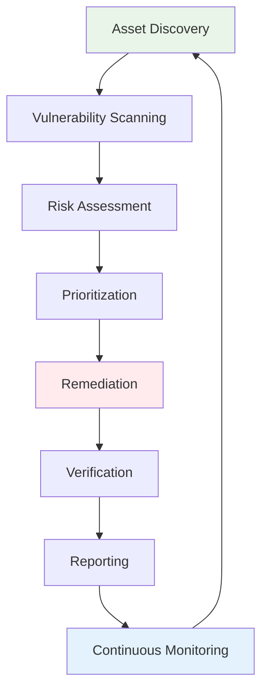

# Vulnerability Assessment and Analysis
## Unit IV: Ethical Hacking
### Lecture 26: Systematic Vulnerability Discovery and Risk Analysis

<div class="absolute bottom-5 left-5 text-xs text-gray-500">
Course: Cyber Security (4353204) | Semester V | Diploma ICT | Author: Milav Dabgar
</div>

---
layout: default
---

# Understanding Vulnerability Assessment

<div class="grid grid-cols-2 gap-6">

<div>

## 🔍 What is Vulnerability Assessment?

**Vulnerability Assessment** is the systematic identification, quantification, and prioritization of security vulnerabilities in computer systems, networks, and applications.

### 🎯 Key Objectives
- **Discover vulnerabilities** before malicious actors do
- **Quantify risk** associated with identified weaknesses
- **Prioritize remediation** efforts based on business impact
- **Validate security controls** effectiveness
- **Comply with regulations** and security standards
- **Provide actionable intelligence** for security improvements

### 📊 Vulnerability Assessment Statistics
- **Average vulnerabilities per organization**: 76,000+ in 2023
- **Time to remediate critical vulnerabilities**: 97 days average
- **Unpatched vulnerabilities**: 57% remain unaddressed after discovery
- **Cost of data breach**: $4.45 million average (2023)
- **ROI of vulnerability management**: $7 saved per $1 invested
- **Critical vulnerabilities**: 2.8% of total discovered vulnerabilities

### 🔄 Vulnerability Management Lifecycle


### 💡 Assessment Benefits
```yaml
Security Benefits:
  - Proactive threat identification
  - Risk reduction and mitigation
  - Security posture improvement
  - Incident prevention
  - Compliance achievement

Business Benefits:
  - Reduced breach costs
  - Business continuity assurance  
  - Customer trust maintenance
  - Regulatory compliance
  - Competitive advantage

Technical Benefits:
  - System hardening guidance
  - Patch management optimization
  - Security control validation
  - Architecture improvement
  - Technology stack optimization
```

</div>

<div>

## 🔀 Types of Vulnerability Assessments

### 🌐 Network Vulnerability Assessment
```yaml
Scope and Coverage:
  Internal Networks:
    - LAN infrastructure scanning
    - Server and workstation analysis
    - Network device assessment
    - Wireless network evaluation
    - IoT device identification
  
  External Networks:
    - Internet-facing systems
    - DMZ infrastructure analysis
    - Public service evaluation
    - Cloud service assessment
    - Third-party connections

Assessment Techniques:
  Authenticated Scanning:
    - Credentialed access scanning
    - Deep system analysis
    - Configuration assessment
    - Missing patch detection
    - Privilege escalation paths
  
  Unauthenticated Scanning:
    - External perspective analysis
    - Service enumeration
    - Banner grabbing
    - Version detection
    - Default credential testing
```

### 💻 Application Vulnerability Assessment
```yaml
Web Applications:
  OWASP Top 10 Testing:
    - Injection vulnerabilities
    - Broken authentication
    - Sensitive data exposure
    - XML external entities (XXE)
    - Broken access control
    - Security misconfigurations
    - Cross-site scripting (XSS)
    - Insecure deserialization
    - Known vulnerabilities
    - Insufficient logging

  Testing Methodologies:
    - Static Application Security Testing (SAST)
    - Dynamic Application Security Testing (DAST)
    - Interactive Application Security Testing (IAST)
    - Runtime Application Self-Protection (RASP)
    - Software Composition Analysis (SCA)

Mobile Applications:
  Platform-Specific Testing:
    - iOS application analysis
    - Android application assessment
    - Hybrid application testing
    - Cross-platform evaluation
    - API security analysis

Database Assessments:
  Database-Specific Testing:
    - Access control evaluation
    - Configuration assessment
    - Privilege escalation testing
    - Data encryption analysis
    - Backup security review
```

### ☁️ Cloud Security Assessment
```yaml
Infrastructure as Code (IaC):
  - Terraform configuration analysis
  - CloudFormation template review
  - Kubernetes manifest assessment
  - Docker container scanning
  - CI/CD pipeline security

Cloud Service Evaluation:
  AWS Security Assessment:
    - IAM policy analysis
    - S3 bucket permissions
    - Security group configurations
    - VPC network security
    - CloudTrail logging review
  
  Azure Security Assessment:
    - Azure AD configuration
    - Storage account security
    - Network security groups
    - Key Vault analysis
    - Monitor and logging

  Multi-Cloud Assessment:
    - Cross-cloud security analysis
    - Hybrid environment evaluation
    - Data flow security review
    - Identity federation assessment
    - Compliance validation
```

### 🏢 Physical Security Assessment
```yaml
Physical Infrastructure:
  - Facility access controls
  - Perimeter security evaluation
  - CCTV and monitoring systems
  - Environmental controls
  - Fire suppression systems

Human Factor Assessment:
  - Social engineering susceptibility
  - Security awareness evaluation
  - Physical badge security
  - Tailgating prevention
  - Visitor management systems
```

</div>

</div>

<div class="absolute bottom-5 left-5 text-xs text-gray-500">
Course: Cyber Security (4353204) | Unit IV | Lecture 26 | Author: Milav Dabgar
</div>

---
layout: default
---

# Vulnerability Scanning Tools and Technologies

<div class="grid grid-cols-2 gap-6">

<div>

## 🛠️ Enterprise Vulnerability Scanners

### 🏆 Leading Commercial Solutions
```yaml
Tenable Nessus:
  Strengths:
    - Comprehensive vulnerability database
    - Excellent coverage and accuracy
    - User-friendly interface
    - Strong reporting capabilities
    - Regular plugin updates
    
  Features:
    - 170,000+ plugins
    - Cloud and on-premises deployment
    - Credentialed scanning
    - Compliance templates
    - API integration

Rapid7 Nexpose/InsightVM:
  Strengths:
    - Real-time vulnerability detection
    - Risk-based prioritization
    - Integration with Metasploit
    - Advanced reporting
    - Threat intelligence integration
  
  Features:
    - Live monitoring capabilities
    - Asset discovery and tracking
    - Policy compliance scanning
    - Remediation workflows
    - Executive dashboards

Qualys VMDR:
  Strengths:
    - Cloud-native architecture
    - Scalable deployment
    - Continuous monitoring
    - ThreatPROTECT integration
    - Global sensor network
  
  Features:
    - Multi-platform support
    - Asset inventory management
    - Patch management integration
    - Compliance reporting
    - API-driven automation

Greenbone OpenVAS:
  Strengths:
    - Open-source solution
    - No licensing costs
    - Community-driven development
    - Customizable architecture
    - Strong technical capabilities
  
  Features:
    - 50,000+ vulnerability tests
    - Web-based management
    - Scheduling and automation
    - Custom scan configurations
    - Multi-format reporting
```

### 🔧 Specialized Scanning Tools
```bash
# Web Application Scanners
nikto -h target.com                    # Web vulnerability scanner
dirb http://target.com                 # Directory enumeration
gobuster dir -u http://target.com -w wordlist.txt  # Directory brute forcing
sqlmap -u "http://target.com/page.php?id=1"  # SQL injection testing

# Network Vulnerability Scanners  
nmap --script vuln target.com          # Nmap vulnerability scripts
masscan -p1-65535 target.com --rate=1000  # Fast port scanning
unicornscan target.com                 # Information gathering

# SSL/TLS Analysis
sslscan target.com                     # SSL/TLS configuration analysis
sslyze --regular target.com           # SSL configuration scanner
testssl target.com                     # SSL/TLS tester

# Database Scanners
oscanner -s target.com                 # Oracle database scanner
sqlninja -m t -f sqlninja.conf         # SQL Server assessment

# Wireless Security
airodump-ng wlan0                      # Wireless network discovery
kismet                                 # Wireless network detector
```

### 📊 Vulnerability Assessment Framework
```python
#!/usr/bin/env python3
"""
Comprehensive Vulnerability Assessment Framework
Educational purposes - Use with proper authorization
"""

import subprocess
import json
import xml.etree.ElementTree as ET
from datetime import datetime
import requests
import socket
import ssl
from concurrent.futures import ThreadPoolExecutor
import threading
from dataclasses import dataclass
from typing import List, Dict, Optional

@dataclass
class Vulnerability:
    """Vulnerability data structure"""
    id: str
    title: str
    description: str
    severity: str
    cvss_score: float
    cve_id: Optional[str]
    service: str
    port: int
    host: str
    solution: str
    references: List[str]

class VulnerabilityScanner:
    def __init__(self, targets, scan_type="comprehensive"):
        self.targets = targets if isinstance(targets, list) else [targets]
        self.scan_type = scan_type
        self.vulnerabilities = []
        self.scan_results = {}
        self.lock = threading.Lock()
    
    def network_discovery(self, target):
        """Phase 1: Network and service discovery"""
        print(f"[*] Network discovery for {target}")
        
        try:
            # Port scanning with service detection
            nmap_cmd = [
                'nmap', '-sS', '-sV', '-O', 
                '--top-ports', '1000',
                '--version-intensity', '5',
                '-oX', f'nmap_{target}_discovery.xml',
                target
            ]
            
            result = subprocess.run(nmap_cmd, capture_output=True, text=True)
            
            if result.returncode == 0:
                # Parse XML output
                services = self.parse_nmap_xml(f'nmap_{target}_discovery.xml')
                return services
            else:
                print(f"  [!] Nmap scan failed for {target}")
                return {}
                
        except Exception as e:
            print(f"  [!] Network discovery error: {e}")
            return {}
    
    def vulnerability_detection(self, target, services):
        """Phase 2: Vulnerability detection and analysis"""
        print(f"[*] Vulnerability detection for {target}")
        
        detected_vulns = []
        
        # Use multiple scanning techniques
        scan_methods = [
            self.nmap_vulnerability_scan,
            self.web_vulnerability_scan,
            self.ssl_vulnerability_scan,
            self.service_specific_scan
        ]
        
        for method in scan_methods:
            try:
                vulns = method(target, services)
                if vulns:
                    detected_vulns.extend(vulns)
            except Exception as e:
                print(f"  [!] Scan method failed: {e}")
        
        return detected_vulns
    
    def nmap_vulnerability_scan(self, target, services):
        """Nmap NSE vulnerability scanning"""
        print(f"  [*] Nmap vulnerability scripts for {target}")
        
        vulnerabilities = []
        
        # Run comprehensive vulnerability scripts
        vuln_scripts = [
            'vuln',
            'exploit', 
            'dos',
            'malware',
            'safe'
        ]
        
        for script_category in vuln_scripts:
            try:
                nmap_cmd = [
                    'nmap', '--script', script_category,
                    '--script-args', 'unsafe=1',
                    '-oX', f'nmap_{target}_{script_category}.xml',
                    target
                ]
                
                result = subprocess.run(nmap_cmd, capture_output=True, text=True)
                
                if result.returncode == 0:
                    # Parse vulnerability results
                    vulns = self.parse_nmap_vulnerabilities(f'nmap_{target}_{script_category}.xml')
                    vulnerabilities.extend(vulns)
                    
            except Exception as e:
                print(f"    [!] Script {script_category} failed: {e}")
        
        return vulnerabilities
    
    def web_vulnerability_scan(self, target, services):
        """Web application vulnerability scanning"""
        web_ports = [80, 443, 8080, 8443, 8000, 8888]
        web_vulns = []
        
        for service in services:
            if service.get('port') in web_ports or 'http' in service.get('service', '').lower():
                port = service.get('port')
                protocol = 'https' if port in [443, 8443] else 'http'
                base_url = f"{protocol}://{target}:{port}"
                
                print(f"  [*] Web scanning {base_url}")
                
                # Common web vulnerabilities to test
                web_vulns.extend(self.check_common_web_vulns(base_url))
                web_vulns.extend(self.check_ssl_vulnerabilities(target, port))
        
        return web_vulns
    
    def check_common_web_vulns(self, base_url):
        """Check for common web application vulnerabilities"""
        vulnerabilities = []
        
        try:
            response = requests.get(base_url, timeout=10, verify=False)
            
            # Check for common security headers
            security_headers = [
                'X-Content-Type-Options',
                'X-Frame-Options', 
                'X-XSS-Protection',
                'Strict-Transport-Security',
                'Content-Security-Policy'
            ]
            
            missing_headers = []
            for header in security_headers:
                if header not in response.headers:
                    missing_headers.append(header)
            
            if missing_headers:
                vuln = Vulnerability(
                    id="MISSING_SECURITY_HEADERS",
                    title="Missing Security Headers",
                    description=f"Missing security headers: {', '.join(missing_headers)}",
                    severity="Medium",
                    cvss_score=5.3,
                    cve_id=None,
                    service="HTTP",
                    port=80,  # Will be updated
                    host=base_url,
                    solution="Implement proper security headers",
                    references=["https://owasp.org/www-project-secure-headers/"]
                )
                vulnerabilities.append(vuln)
            
            # Check for information disclosure
            if 'server' in response.headers:
                server_header = response.headers['server']
                if any(tech in server_header.lower() for tech in ['apache', 'nginx', 'iis']):
                    vuln = Vulnerability(
                        id="SERVER_INFO_DISCLOSURE",
                        title="Server Information Disclosure",
                        description=f"Server header reveals: {server_header}",
                        severity="Low",
                        cvss_score=2.6,
                        cve_id=None,
                        service="HTTP",
                        port=80,
                        host=base_url,
                        solution="Configure server to hide version information",
                        references=["https://owasp.org/www-community/Security_Headers"]
                    )
                    vulnerabilities.append(vuln)
            
            # Check for default pages and directories
            default_paths = ['/admin', '/administrator', '/phpmyadmin', '/wp-admin']
            
            for path in default_paths:
                try:
                    test_url = base_url + path
                    test_response = requests.get(test_url, timeout=5, allow_redirects=False)
                    
                    if test_response.status_code in [200, 301, 302]:
                        vuln = Vulnerability(
                            id="DEFAULT_PAGE_ACCESS",
                            title="Default Administrative Interface Accessible",
                            description=f"Administrative interface accessible at {path}",
                            severity="High",
                            cvss_score=7.5,
                            cve_id=None,
                            service="HTTP",
                            port=80,
                            host=base_url,
                            solution="Restrict access to administrative interfaces",
                            references=["https://owasp.org/www-project-top-ten/"]
                        )
                        vulnerabilities.append(vuln)
                        
                except:
                    continue
                    
        except Exception as e:
            print(f"    [!] Web vulnerability check failed: {e}")
        
        return vulnerabilities
    
    def ssl_vulnerability_scan(self, target, services):
        """SSL/TLS vulnerability assessment"""
        ssl_vulns = []
        
        # Check HTTPS services
        for service in services:
            if service.get('port') in [443, 8443] or 'ssl' in service.get('service', '').lower():
                port = service.get('port', 443)
                
                print(f"  [*] SSL analysis for {target}:{port}")
                
                try:
                    # SSL certificate analysis
                    context = ssl.create_default_context()
                    context.check_hostname = False
                    context.verify_mode = ssl.CERT_NONE
                    
                    with socket.create_connection((target, port), timeout=10) as sock:
                        with context.wrap_socket(sock, server_hostname=target) as ssock:
                            cert = ssock.getpeercert()
                            cipher = ssock.cipher()
                            version = ssock.version()
                            
                            # Check for weak ciphers
                            if cipher and cipher[1] < 128:  # Key length less than 128 bits
                                vuln = Vulnerability(
                                    id="WEAK_SSL_CIPHER",
                                    title="Weak SSL/TLS Cipher Suite",
                                    description=f"Weak cipher detected: {cipher[0]}",
                                    severity="Medium",
                                    cvss_score=5.9,
                                    cve_id=None,
                                    service="HTTPS",
                                    port=port,
                                    host=target,
                                    solution="Configure strong cipher suites",
                                    references=["https://wiki.mozilla.org/Security/Server_Side_TLS"]
                                )
                                ssl_vulns.append(vuln)
                            
                            # Check for outdated SSL/TLS versions
                            if version in ['SSLv2', 'SSLv3', 'TLSv1', 'TLSv1.1']:
                                vuln = Vulnerability(
                                    id="OUTDATED_SSL_VERSION",
                                    title="Outdated SSL/TLS Version",
                                    description=f"Outdated protocol version: {version}",
                                    severity="High",
                                    cvss_score=7.4,
                                    cve_id="CVE-2014-3566",  # POODLE for SSLv3
                                    service="HTTPS",
                                    port=port,
                                    host=target,
                                    solution="Upgrade to TLS 1.2 or higher",
                                    references=["https://tools.ietf.org/rfc/rfc7568.txt"]
                                )
                                ssl_vulns.append(vuln)
                                
                except Exception as e:
                    print(f"    [!] SSL analysis failed: {e}")
        
        return ssl_vulns
    
    def service_specific_scan(self, target, services):
        """Service-specific vulnerability scanning"""
        service_vulns = []
        
        for service in services:
            service_name = service.get('service', '').lower()
            port = service.get('port')
            
            # SSH vulnerabilities
            if 'ssh' in service_name or port == 22:
                service_vulns.extend(self.check_ssh_vulnerabilities(target, port))
            
            # FTP vulnerabilities  
            elif 'ftp' in service_name or port == 21:
                service_vulns.extend(self.check_ftp_vulnerabilities(target, port))
            
            # SMTP vulnerabilities
            elif 'smtp' in service_name or port == 25:
                service_vulns.extend(self.check_smtp_vulnerabilities(target, port))
            
            # Database vulnerabilities
            elif any(db in service_name for db in ['mysql', 'postgres', 'mssql', 'oracle']):
                service_vulns.extend(self.check_database_vulnerabilities(target, port, service_name))
        
        return service_vulns
    
    def check_ssh_vulnerabilities(self, target, port):
        """SSH-specific vulnerability checks"""
        ssh_vulns = []
        
        try:
            # Connect and get banner
            sock = socket.socket(socket.AF_INET, socket.SOCK_STREAM)
            sock.settimeout(10)
            sock.connect((target, port))
            
            banner = sock.recv(1024).decode().strip()
            sock.close()
            
            # Check for outdated SSH versions
            if 'OpenSSH' in banner:
                # Extract version
                import re
                version_match = re.search(r'OpenSSH_(\d+)\.(\d+)', banner)
                if version_match:
                    major, minor = map(int, version_match.groups())
                    
                    # Check for known vulnerable versions
                    if major < 7 or (major == 7 and minor < 4):
                        vuln = Vulnerability(
                            id="OUTDATED_SSH_VERSION",
                            title="Outdated SSH Version",
                            description=f"SSH version {major}.{minor} has known vulnerabilities",
                            severity="Medium",
                            cvss_score=6.5,
                            cve_id="CVE-2016-0777",
                            service="SSH",
                            port=port,
                            host=target,
                            solution="Upgrade SSH to latest version",
                            references=["https://www.openssh.com/security.html"]
                        )
                        ssh_vulns.append(vuln)
                        
        except Exception as e:
            print(f"    [!] SSH vulnerability check failed: {e}")
        
        return ssh_vulns
    
    def parse_nmap_xml(self, xml_file):
        """Parse Nmap XML output for services"""
        services = []
        
        try:
            tree = ET.parse(xml_file)
            root = tree.getroot()
            
            for host in root.findall('host'):
                ports = host.find('ports')
                if ports is not None:
                    for port in ports.findall('port'):
                        service_info = {
                            'port': int(port.get('portid')),
                            'protocol': port.get('protocol'),
                            'state': port.find('state').get('state') if port.find('state') is not None else 'unknown'
                        }
                        
                        service_elem = port.find('service')
                        if service_elem is not None:
                            service_info.update({
                                'service': service_elem.get('name', 'unknown'),
                                'product': service_elem.get('product', ''),
                                'version': service_elem.get('version', ''),
                                'extrainfo': service_elem.get('extrainfo', '')
                            })
                        
                        if service_info['state'] == 'open':
                            services.append(service_info)
                            
        except Exception as e:
            print(f"    [!] XML parsing failed: {e}")
        
        return services
    
    def generate_vulnerability_report(self):
        """Generate comprehensive vulnerability report"""
        # Sort vulnerabilities by CVSS score
        self.vulnerabilities.sort(key=lambda v: v.cvss_score, reverse=True)
        
        # Calculate risk statistics
        severity_counts = {
            'Critical': len([v for v in self.vulnerabilities if v.cvss_score >= 9.0]),
            'High': len([v for v in self.vulnerabilities if 7.0 <= v.cvss_score < 9.0]),
            'Medium': len([v for v in self.vulnerabilities if 4.0 <= v.cvss_score < 7.0]),
            'Low': len([v for v in self.vulnerabilities if v.cvss_score < 4.0])
        }
        
        report = f"""
VULNERABILITY ASSESSMENT REPORT
==============================

Assessment Date: {datetime.now().strftime('%Y-%m-%d %H:%M:%S')}
Targets: {', '.join(self.targets)}
Total Vulnerabilities: {len(self.vulnerabilities)}

RISK SUMMARY:
------------
Critical (CVSS 9.0-10.0): {severity_counts['Critical']}
High (CVSS 7.0-8.9):      {severity_counts['High']}
Medium (CVSS 4.0-6.9):    {severity_counts['Medium']}  
Low (CVSS 0.1-3.9):       {severity_counts['Low']}

TOP VULNERABILITIES:
==================
        """
        
        # Include top 10 vulnerabilities
        for i, vuln in enumerate(self.vulnerabilities[:10], 1):
            report += f"""
{i}. {vuln.title}
   Host: {vuln.host}
   Port/Service: {vuln.port}/{vuln.service}
   CVSS Score: {vuln.cvss_score}
   CVE ID: {vuln.cve_id if vuln.cve_id else 'N/A'}
   Description: {vuln.description}
   Solution: {vuln.solution}
   
        """
        
        report += """
REMEDIATION PRIORITIES:
======================
1. Address all Critical vulnerabilities immediately
2. Patch High severity vulnerabilities within 30 days
3. Plan Medium severity fixes within 90 days
4. Review Low severity issues during regular maintenance

RECOMMENDATIONS:
===============
- Implement vulnerability management program
- Regular patch management procedures
- Network segmentation and access controls
- Security awareness training
- Continuous monitoring and scanning
        """
        
        return report

# Example usage framework
if __name__ == "__main__":
    import sys
    
    if len(sys.argv) < 2:
        print("Usage: python3 vulnerability_scanner.py <target1> [target2] ...")
        sys.exit(1)
    
    targets = sys.argv[1:]
    scanner = VulnerabilityScanner(targets)
    
    print("Starting comprehensive vulnerability assessment...")
    print("=" * 60)
    
    # Process each target
    for target in targets:
        print(f"\n[*] Processing target: {target}")
        
        # Network discovery
        services = scanner.network_discovery(target)
        
        # Vulnerability detection
        vulnerabilities = scanner.vulnerability_detection(target, services)
        scanner.vulnerabilities.extend(vulnerabilities)
    
    # Generate report
    print("\n" + "=" * 60)
    print("Vulnerability Assessment Complete")
    
    report = scanner.generate_vulnerability_report()
    print(report)
    
    # Save report to file
    with open(f'vulnerability_report_{datetime.now().strftime("%Y%m%d_%H%M%S")}.txt', 'w') as f:
        f.write(report)
```

</div>

<div>

## 🎯 Vulnerability Classification and Scoring

### 📊 CVSS (Common Vulnerability Scoring System)
```yaml
CVSS v3.1 Metrics:

Base Score Metrics:
  Attack Vector (AV):
    - Network (N): 0.85
    - Adjacent (A): 0.62  
    - Local (L): 0.55
    - Physical (P): 0.2
  
  Attack Complexity (AC):
    - Low (L): 0.77
    - High (H): 0.44
  
  Privileges Required (PR):
    - None (N): 0.85
    - Low (L): 0.62/0.68
    - High (H): 0.27/0.5
  
  User Interaction (UI):
    - None (N): 0.85
    - Required (R): 0.62
  
  Scope (S):
    - Unchanged (U)
    - Changed (C)
  
  Impact Metrics:
    - Confidentiality (C): None/Low/High
    - Integrity (I): None/Low/High  
    - Availability (A): None/Low/High

Severity Ratings:
  - Critical: 9.0-10.0
  - High: 7.0-8.9
  - Medium: 4.0-6.9
  - Low: 0.1-3.9
  - None: 0.0
```

### 🏷️ Vulnerability Categories
```python
# Vulnerability Classification System
class VulnerabilityClassifier:
    def __init__(self):
        self.categories = {
            'injection': {
                'name': 'Injection Vulnerabilities',
                'description': 'Flaws that allow untrusted data to be interpreted as code',
                'examples': ['SQL Injection', 'Command Injection', 'LDAP Injection', 'XPath Injection'],
                'typical_cvss': 8.8,
                'remediation': 'Input validation and parameterized queries'
            },
            'authentication': {
                'name': 'Authentication Vulnerabilities',
                'description': 'Weaknesses in authentication mechanisms',
                'examples': ['Weak Passwords', 'Broken Session Management', 'Default Credentials'],
                'typical_cvss': 7.5,
                'remediation': 'Strong authentication controls and session management'
            },
            'authorization': {
                'name': 'Authorization Vulnerabilities', 
                'description': 'Improper access controls and privilege escalation',
                'examples': ['Privilege Escalation', 'Insecure Direct Object References', 'Missing Function Level Access Control'],
                'typical_cvss': 8.1,
                'remediation': 'Proper access control implementation'
            },
            'configuration': {
                'name': 'Security Misconfiguration',
                'description': 'Insecure default configurations and missing security controls',
                'examples': ['Default Credentials', 'Unnecessary Services', 'Missing Security Headers'],
                'typical_cvss': 6.5,
                'remediation': 'Security hardening and configuration management'
            },
            'cryptographic': {
                'name': 'Cryptographic Vulnerabilities',
                'description': 'Weak cryptographic implementations and key management',
                'examples': ['Weak Encryption', 'Poor Key Management', 'Insufficient Transport Layer Protection'],
                'typical_cvss': 7.4,
                'remediation': 'Strong cryptographic implementations'
            },
            'information_disclosure': {
                'name': 'Information Disclosure',
                'description': 'Unintended exposure of sensitive information',
                'examples': ['Error Messages', 'Directory Listing', 'Source Code Disclosure'],
                'typical_cvss': 5.3,
                'remediation': 'Information leakage prevention'
            }
        }
    
    def classify_vulnerability(self, vuln_data):
        """Classify vulnerability based on characteristics"""
        title = vuln_data.get('title', '').lower()
        description = vuln_data.get('description', '').lower()
        
        # Classification logic based on keywords
        for category, details in self.categories.items():
            keywords = category.split('_') + [example.lower() for example in details['examples']]
            
            if any(keyword in title or keyword in description for keyword in keywords):
                return {
                    'category': category,
                    'name': details['name'],
                    'typical_cvss': details['typical_cvss'],
                    'remediation_guidance': details['remediation']
                }
        
        # Default classification
        return {
            'category': 'other',
            'name': 'Other Vulnerability',
            'typical_cvss': 5.0,
            'remediation_guidance': 'Review and remediate according to best practices'
        }
    
    def calculate_risk_score(self, vuln):
        """Calculate organizational risk score"""
        base_score = vuln.get('cvss_score', 0)
        
        # Risk factors
        risk_multipliers = {
            'external_facing': 1.5,
            'critical_system': 1.4,
            'contains_sensitive_data': 1.3,
            'high_privilege_access': 1.2,
            'publicly_disclosed': 1.1
        }
        
        # Apply risk multipliers (would be based on asset classification)
        adjusted_score = base_score
        
        # Example: if system is external-facing and contains sensitive data
        # adjusted_score *= risk_multipliers['external_facing'] * risk_multipliers['contains_sensitive_data']
        
        return min(adjusted_score, 10.0)  # Cap at 10.0

# Vulnerability Database Integration
class VulnerabilityDatabase:
    def __init__(self):
        self.cve_cache = {}
        self.exploit_databases = [
            'exploit-db',
            'metasploit',
            'canvas',
            'core_impact'
        ]
    
    def lookup_cve_details(self, cve_id):
        """Lookup CVE details from NIST NVD"""
        if cve_id in self.cve_cache:
            return self.cve_cache[cve_id]
        
        try:
            # NIST NVD API call (example structure)
            api_url = f"https://services.nvd.nist.gov/rest/json/cve/1.0/{cve_id}"
            
            # This would be the actual API call
            cve_details = {
                'id': cve_id,
                'description': 'CVE description from NVD',
                'cvss_v3_score': 7.5,
                'severity': 'High',
                'published_date': '2023-01-01',
                'references': [],
                'cpe_entries': []
            }
            
            self.cve_cache[cve_id] = cve_details
            return cve_details
            
        except Exception as e:
            print(f"[!] CVE lookup failed for {cve_id}: {e}")
            return None
    
    def check_exploit_availability(self, cve_id):
        """Check if exploits are publicly available"""
        exploit_status = {
            'public_exploits': False,
            'metasploit_modules': False,
            'exploit_db_entries': False,
            'weaponized': False
        }
        
        # This would query actual exploit databases
        # exploit_status['public_exploits'] = self.search_exploit_db(cve_id)
        # exploit_status['metasploit_modules'] = self.search_metasploit(cve_id)
        
        return exploit_status

# Risk Prioritization Engine
class RiskPrioritizer:
    def __init__(self):
        self.business_impact_weights = {
            'revenue_impact': 0.3,
            'customer_impact': 0.25, 
            'regulatory_impact': 0.25,
            'operational_impact': 0.2
        }
    
    def prioritize_vulnerabilities(self, vulnerabilities, asset_context):
        """Prioritize vulnerabilities based on business impact"""
        prioritized_vulns = []
        
        for vuln in vulnerabilities:
            # Calculate business risk score
            business_risk = self.calculate_business_risk(vuln, asset_context)
            
            # Combine technical and business risk
            overall_risk = (vuln.cvss_score * 0.6) + (business_risk * 0.4)
            
            prioritized_vulns.append({
                'vulnerability': vuln,
                'technical_risk': vuln.cvss_score,
                'business_risk': business_risk,
                'overall_risk': overall_risk,
                'priority_level': self.assign_priority_level(overall_risk)
            })
        
        # Sort by overall risk score
        prioritized_vulns.sort(key=lambda x: x['overall_risk'], reverse=True)
        
        return prioritized_vulns
    
    def calculate_business_risk(self, vuln, asset_context):
        """Calculate business impact risk score"""
        base_business_score = 5.0  # Default medium business impact
        
        # Asset criticality factors
        if asset_context.get('critical_system'):
            base_business_score *= 1.5
        
        if asset_context.get('external_facing'):
            base_business_score *= 1.3
        
        if asset_context.get('contains_pii'):
            base_business_score *= 1.4
        
        if asset_context.get('financial_system'):
            base_business_score *= 1.6
        
        return min(base_business_score, 10.0)
    
    def assign_priority_level(self, risk_score):
        """Assign priority level based on risk score"""
        if risk_score >= 9.0:
            return 'P0 - Emergency'
        elif risk_score >= 7.0:
            return 'P1 - Critical'
        elif risk_score >= 5.0:
            return 'P2 - High'
        elif risk_score >= 3.0:
            return 'P3 - Medium'
        else:
            return 'P4 - Low'
```

</div>

</div>

<div class="absolute bottom-5 left-5 text-xs text-gray-500">
Course: Cyber Security (4353204) | Unit IV | Lecture 26 | Author: Milav Dabgar
</div>

---
layout: default
---

# Advanced Vulnerability Analysis Techniques

<div class="grid grid-cols-2 gap-6">

<div>

## 🧬 Static and Dynamic Analysis

### 📋 Static Application Security Testing (SAST)
```yaml
SAST Methodology:
  Code Analysis:
    - Source code review
    - Binary analysis  
    - Configuration file analysis
    - Dependency analysis
    - Architecture review
  
  Detection Capabilities:
    - Coding standard violations
    - Security anti-patterns
    - Vulnerable functions usage
    - Input validation flaws
    - Cryptographic weaknesses
    - Authentication bypasses
  
  Advantages:
    - Early detection in SDLC
    - Comprehensive code coverage
    - No runtime environment needed
    - Precise location identification
    - Low false positive rate
  
  Limitations:
    - Runtime behavior blind spots
    - Complex business logic gaps
    - Third-party component limitations
    - Configuration context missing
    - Environmental dependency issues
```

### 🎯 Dynamic Application Security Testing (DAST)
```python
# DAST Implementation Framework
import requests
from urllib.parse import urljoin, urlparse
import re
from bs4 import BeautifulSoup
import time
import random

class DynamicWebScanner:
    def __init__(self, base_url, session_cookies=None):
        self.base_url = base_url
        self.session = requests.Session()
        
        if session_cookies:
            self.session.cookies.update(session_cookies)
        
        self.vulnerabilities = []
        self.crawled_urls = set()
        self.forms = []
        
        # Common vulnerability payloads
        self.payloads = {
            'xss': [
                '<script>alert("XSS")</script>',
                '"><script>alert("XSS")</script>',
                "javascript:alert('XSS')",
                '',
                '<svg onload=alert("XSS")>'
            ],
            'sql_injection': [
                "' OR '1'='1",
                "'; DROP TABLE users; --",
                "' UNION SELECT NULL,NULL,NULL--",
                "1' AND EXTRACTVALUE(rand(),CONCAT(0x7e,version(),0x7e))--",
                "' OR 1=1#"
            ],
            'command_injection': [
                "; ls -la",
                "| whoami",  
                "&& ping -c 1 127.0.0.1",
                "; cat /etc/passwd",
                "| net user"
            ],
            'directory_traversal': [
                "../../../etc/passwd",
                "..\\..\\..\\windows\\system32\\drivers\\etc\\hosts",
                "../../../../../etc/shadow",
                "....//....//....//etc//passwd"
            ]
        }
    
    def crawl_website(self, max_pages=100):
        """Crawl website to discover forms and endpoints"""
        print(f"[*] Crawling website: {self.base_url}")
        
        urls_to_crawl = [self.base_url]
        crawled_count = 0
        
        while urls_to_crawl and crawled_count < max_pages:
            current_url = urls_to_crawl.pop(0)
            
            if current_url in self.crawled_urls:
                continue
            
            try:
                response = self.session.get(current_url, timeout=10)
                if response.status_code == 200:
                    self.crawled_urls.add(current_url)
                    crawled_count += 1
                    
                    # Parse HTML content
                    soup = BeautifulSoup(response.text, 'html.parser')
                    
                    # Extract forms
                    forms = soup.find_all('form')
                    for form in forms:
                        form_data = self.extract_form_data(form, current_url)
                        if form_data:
                            self.forms.append(form_data)
                    
                    # Extract links
                    links = soup.find_all('a', href=True)
                    for link in links:
                        href = link['href']
                        absolute_url = urljoin(current_url, href)
                        
                        # Only crawl URLs from same domain
                        if urlparse(absolute_url).netloc == urlparse(self.base_url).netloc:
                            if absolute_url not in self.crawled_urls:
                                urls_to_crawl.append(absolute_url)
                
                # Rate limiting
                time.sleep(random.uniform(0.5, 2.0))
                
            except Exception as e:
                print(f"  [!] Error crawling {current_url}: {e}")
        
        print(f"  [+] Crawled {len(self.crawled_urls)} pages")
        print(f"  [+] Found {len(self.forms)} forms")
    
    def extract_form_data(self, form, page_url):
        """Extract form data for testing"""
        form_data = {
            'action': urljoin(page_url, form.get('action', '')),
            'method': form.get('method', 'get').lower(),
            'inputs': []
        }
        
        # Extract input fields
        inputs = form.find_all(['input', 'textarea', 'select'])
        for input_elem in inputs:
            if input_elem.name == 'input':
                input_data = {
                    'name': input_elem.get('name'),
                    'type': input_elem.get('type', 'text'),
                    'value': input_elem.get('value', '')
                }
            elif input_elem.name == 'textarea':
                input_data = {
                    'name': input_elem.get('name'),
                    'type': 'textarea', 
                    'value': input_elem.text
                }
            elif input_elem.name == 'select':
                options = input_elem.find_all('option')
                input_data = {
                    'name': input_elem.get('name'),
                    'type': 'select',
                    'value': options[0].get('value') if options else ''
                }
            
            if input_data.get('name'):
                form_data['inputs'].append(input_data)
        
        return form_data if form_data['inputs'] else None
    
    def test_xss_vulnerabilities(self):
        """Test for Cross-Site Scripting vulnerabilities"""
        print("[*] Testing for XSS vulnerabilities")
        
        for form in self.forms:
            for payload in self.payloads['xss']:
                try:
                    # Prepare form data
                    form_data = {}
                    for input_field in form['inputs']:
                        if input_field['type'] not in ['hidden', 'submit', 'csrf_token']:
                            form_data[input_field['name']] = payload
                        else:
                            form_data[input_field['name']] = input_field['value']
                    
                    # Submit form
                    if form['method'] == 'post':
                        response = self.session.post(form['action'], data=form_data, timeout=10)
                    else:
                        response = self.session.get(form['action'], params=form_data, timeout=10)
                    
                    # Check if payload is reflected
                    if payload in response.text:
                        vulnerability = {
                            'type': 'Cross-Site Scripting (XSS)',
                            'severity': 'High',
                            'url': form['action'],
                            'method': form['method'],
                            'payload': payload,
                            'parameter': list(form_data.keys()),
                            'evidence': f"Payload reflected in response: {payload}"
                        }
                        self.vulnerabilities.append(vulnerability)
                        print(f"  [+] XSS found in {form['action']}")
                        break  # Move to next form
                
                except Exception as e:
                    print(f"  [!] XSS test error: {e}")
    
    def test_sql_injection(self):
        """Test for SQL Injection vulnerabilities"""
        print("[*] Testing for SQL Injection vulnerabilities")
        
        # SQL error patterns
        sql_errors = [
            "mysql_fetch_array",
            "ORA-01756",
            "Microsoft OLE DB Provider",
            "PostgreSQL query failed",
            "SQLite3::SQLException"
        ]
        
        for form in self.forms:
            for payload in self.payloads['sql_injection']:
                try:
                    form_data = {}
                    vulnerable_param = None
                    
                    for input_field in form['inputs']:
                        if input_field['type'] not in ['hidden', 'submit', 'csrf_token']:
                            form_data[input_field['name']] = payload
                            vulnerable_param = input_field['name']
                        else:
                            form_data[input_field['name']] = input_field['value']
                    
                    # Submit form
                    if form['method'] == 'post':
                        response = self.session.post(form['action'], data=form_data, timeout=10)
                    else:
                        response = self.session.get(form['action'], params=form_data, timeout=10)
                    
                    # Check for SQL errors
                    for error_pattern in sql_errors:
                        if error_pattern.lower() in response.text.lower():
                            vulnerability = {
                                'type': 'SQL Injection',
                                'severity': 'Critical',
                                'url': form['action'],
                                'method': form['method'],
                                'payload': payload,
                                'parameter': vulnerable_param,
                                'evidence': f"SQL error pattern found: {error_pattern}"
                            }
                            self.vulnerabilities.append(vulnerability)
                            print(f"  [+] SQL Injection found in {form['action']}")
                            break
                
                except Exception as e:
                    print(f"  [!] SQL injection test error: {e}")
    
    def test_command_injection(self):
        """Test for Command Injection vulnerabilities"""
        print("[*] Testing for Command Injection vulnerabilities")
        
        # Command execution indicators
        command_indicators = [
            "uid=", "gid=",  # Unix whoami output
            "root:", "bin:",  # /etc/passwd content
            "Microsoft Windows",  # Windows version
            "Directory of",  # Windows dir command
            "PING", "ping"   # Ping command output
        ]
        
        for form in self.forms:
            for payload in self.payloads['command_injection']:
                try:
                    form_data = {}
                    vulnerable_param = None
                    
                    for input_field in form['inputs']:
                        if input_field['type'] not in ['hidden', 'submit', 'csrf_token']:
                            form_data[input_field['name']] = payload
                            vulnerable_param = input_field['name']
                        else:
                            form_data[input_field['name']] = input_field['value']
                    
                    # Submit form
                    if form['method'] == 'post':
                        response = self.session.post(form['action'], data=form_data, timeout=15)
                    else:
                        response = self.session.get(form['action'], params=form_data, timeout=15)
                    
                    # Check for command execution evidence
                    for indicator in command_indicators:
                        if indicator in response.text:
                            vulnerability = {
                                'type': 'Command Injection', 
                                'severity': 'Critical',
                                'url': form['action'],
                                'method': form['method'],
                                'payload': payload,
                                'parameter': vulnerable_param,
                                'evidence': f"Command execution evidence: {indicator}"
                            }
                            self.vulnerabilities.append(vulnerability)
                            print(f"  [+] Command Injection found in {form['action']}")
                            break
                
                except Exception as e:
                    print(f"  [!] Command injection test error: {e}")
    
    def run_scan(self):
        """Execute complete dynamic security scan"""
        print(f"Starting DAST scan of {self.base_url}")
        print("=" * 60)
        
        # Phase 1: Discovery
        self.crawl_website()
        
        # Phase 2: Vulnerability Testing
        if self.forms:
            self.test_xss_vulnerabilities()
            self.test_sql_injection()
            self.test_command_injection()
        else:
            print("[!] No forms found for testing")
        
        # Generate report
        return self.generate_scan_report()
    
    def generate_scan_report(self):
        """Generate DAST scan report"""
        report = f"""
DYNAMIC APPLICATION SECURITY TESTING REPORT
==========================================

Target: {self.base_url}
Scan Date: {time.strftime('%Y-%m-%d %H:%M:%S')}

SCAN SUMMARY:
- Pages Crawled: {len(self.crawled_urls)}
- Forms Tested: {len(self.forms)}
- Vulnerabilities Found: {len(self.vulnerabilities)}

VULNERABILITIES:
        """
        
        if self.vulnerabilities:
            for i, vuln in enumerate(self.vulnerabilities, 1):
                report += f"""
{i}. {vuln['type']}
   Severity: {vuln['severity']}
   URL: {vuln['url']}
   Method: {vuln['method'].upper()}
   Parameter: {vuln['parameter']}
   Payload: {vuln['payload']}
   Evidence: {vuln['evidence']}
        """
        else:
            report += "\nNo vulnerabilities detected in this scan.\n"
        
        report += """
RECOMMENDATIONS:
- Implement proper input validation
- Use parameterized queries for database access
- Apply output encoding for XSS prevention
- Implement proper error handling
- Regular security testing in development lifecycle
        """
        
        return report

# Example usage
# scanner = DynamicWebScanner("https://example.com")
# report = scanner.run_scan()
# print(report)
```

</div>

<div>

## 🔄 Interactive and Hybrid Testing

### 🤝 Interactive Application Security Testing (IAST)
```yaml
IAST Characteristics:
  Runtime Analysis:
    - Real-time vulnerability detection
    - Code execution monitoring
    - Data flow analysis
    - Runtime context awareness
    - Dynamic taint tracking
  
  Hybrid Approach Benefits:
    - SAST precision with DAST coverage
    - Low false positive rate
    - Runtime environment accuracy
    - Business logic vulnerability detection
    - Third-party component analysis
  
  Implementation Requirements:
    - Application instrumentation
    - Runtime agent deployment
    - Performance overhead considerations
    - Development environment integration
    - Continuous monitoring capabilities
```

### 🛡️ Runtime Application Self-Protection (RASP)
```python
# RASP Implementation Framework
class RASPSecurityMonitor:
    def __init__(self, application_context):
        self.app_context = application_context
        self.threat_detection_rules = {}
        self.security_events = []
        self.response_actions = {
            'block': self.block_request,
            'alert': self.generate_alert,
            'monitor': self.log_event,
            'redirect': self.redirect_request
        }
        
        self.initialize_detection_rules()
    
    def initialize_detection_rules(self):
        """Initialize threat detection rules"""
        self.threat_detection_rules = {
            'sql_injection': {
                'patterns': [
                    r"(\bunion\b|\bselect\b|\binsert\b|\bupdate\b|\bdelete\b|\bdrop\b)",
                    r"(\'\s*or\s*\'|\'\s*=\s*\')",
                    r"(\-\-|\#|\/\*|\*\/)"
                ],
                'severity': 'critical',
                'action': 'block'
            },
            'xss': {
                'patterns': [
                    r"<\s*script[^>]*>",
                    r"javascript\s*:",
                    r"on\w+\s*=",
                    r"<\s*iframe[^>]*>"
                ],
                'severity': 'high',
                'action': 'block'
            },
            'command_injection': {
                'patterns': [
                    r"(\|\s*\w+|\&\&\s*\w+|\;\s*\w+)",
                    r"(wget|curl|nc|netcat|bash|sh|cmd|powershell)",
                    r"(\.\./|\.\.\\\)"
                ],
                'severity': 'critical',
                'action': 'block'
            },
            'path_traversal': {
                'patterns': [
                    r"(\.\./|\.\.\\\\)",
                    r"(\/etc\/passwd|\/windows\/system32)",
                    r"(\%2e\%2e\%2f|\%2e\%2e\%5c)"
                ],
                'severity': 'high', 
                'action': 'block'
            }
        }
    
    def monitor_request(self, request_data):
        """Monitor incoming request for threats"""
        threats_detected = []
        
        # Analyze request parameters
        all_parameters = {}
        all_parameters.update(request_data.get('query_params', {}))
        all_parameters.update(request_data.get('form_data', {}))
        all_parameters.update(request_data.get('headers', {}))
        
        for param_name, param_value in all_parameters.items():
            if isinstance(param_value, str):
                for threat_type, rule in self.threat_detection_rules.items():
                    for pattern in rule['patterns']:
                        import re
                        if re.search(pattern, param_value, re.IGNORECASE):
                            threat = {
                                'type': threat_type,
                                'severity': rule['severity'],
                                'parameter': param_name,
                                'value': param_value,
                                'pattern': pattern,
                                'action': rule['action'],
                                'timestamp': time.time(),
                                'request_id': request_data.get('id')
                            }
                            threats_detected.append(threat)
        
        # Process detected threats
        for threat in threats_detected:
            self.process_threat(threat, request_data)
        
        return threats_detected
    
    def process_threat(self, threat, request_data):
        """Process detected threat based on configured action"""
        action = threat['action']
        
        if action in self.response_actions:
            self.response_actions[action](threat, request_data)
        
        # Log security event
        self.security_events.append(threat)
    
    def block_request(self, threat, request_data):
        """Block malicious request"""
        print(f"[BLOCKED] {threat['type']} attack blocked")
        print(f"  Parameter: {threat['parameter']}")
        print(f"  Pattern: {threat['pattern']}")
        
        # Return HTTP 403 Forbidden
        return {
            'status_code': 403,
            'response': 'Request blocked by security policy',
            'headers': {'X-Security-Block': threat['type']}
        }
    
    def generate_alert(self, threat, request_data):
        """Generate security alert"""
        alert_message = f"""
SECURITY ALERT: {threat['type'].upper()}
===============================

Timestamp: {time.strftime('%Y-%m-%d %H:%M:%S', time.localtime(threat['timestamp']))}
Severity: {threat['severity'].upper()}
Request ID: {threat['request_id']}
Source IP: {request_data.get('source_ip', 'Unknown')}
User Agent: {request_data.get('user_agent', 'Unknown')}
Parameter: {threat['parameter']}
Malicious Value: {threat['value']}
Detection Pattern: {threat['pattern']}

RECOMMENDED ACTION:
- Review request details
- Check for false positive
- Update security rules if needed
- Monitor for additional attempts
        """
        
        print(alert_message)
        # Send to SIEM/logging system
        
    def log_event(self, threat, request_data):
        """Log security event for monitoring"""
        log_entry = {
            'timestamp': threat['timestamp'],
            'event_type': 'security_threat',
            'threat_type': threat['type'],
            'severity': threat['severity'],
            'source_ip': request_data.get('source_ip'),
            'user_agent': request_data.get('user_agent'),
            'parameter': threat['parameter'],
            'value': threat['value'][:100],  # Truncate long values
            'action_taken': 'logged'
        }
        
        print(f"[LOGGED] Security event: {threat['type']}")
        # Send to security monitoring system
    
    def generate_security_report(self):
        """Generate security monitoring report"""
        threat_counts = {}
        for event in self.security_events:
            threat_type = event['type']
            threat_counts[threat_type] = threat_counts.get(threat_type, 0) + 1
        
        report = f"""
RUNTIME SECURITY MONITORING REPORT
==================================

Monitoring Period: Last 24 hours
Total Security Events: {len(self.security_events)}

THREAT BREAKDOWN:
        """
        
        for threat_type, count in sorted(threat_counts.items(), key=lambda x: x[1], reverse=True):
            report += f"- {threat_type.replace('_', ' ').title()}: {count} attempts\n"
        
        report += """
TOP THREATS:
-----------
        """
        
        # Show recent critical threats
        critical_threats = [e for e in self.security_events[-10:] if e['severity'] == 'critical']
        for threat in critical_threats:
            report += f"- {threat['type']} at {time.strftime('%H:%M:%S', time.localtime(threat['timestamp']))}\n"
        
        return report

# Software Composition Analysis (SCA)
class SoftwareCompositionAnalyzer:
    def __init__(self, project_path):
        self.project_path = project_path
        self.dependencies = []
        self.vulnerabilities = []
        
        # Known vulnerability databases
        self.vuln_databases = {
            'nvd': 'https://nvd.nist.gov/vuln/search',
            'snyk': 'https://snyk.io/vuln',
            'ossindex': 'https://ossindex.sonatype.org',
            'github_advisory': 'https://github.com/advisories'
        }
    
    def scan_dependencies(self):
        """Scan project dependencies for vulnerabilities"""
        print(f"[*] Scanning dependencies in {self.project_path}")
        
        # Detect package managers and dependency files
        dependency_files = {
            'package.json': self.scan_npm_dependencies,
            'requirements.txt': self.scan_python_dependencies, 
            'pom.xml': self.scan_maven_dependencies,
            'Gemfile': self.scan_ruby_dependencies,
            'composer.json': self.scan_php_dependencies
        }
        
        import os
        for dep_file, scan_func in dependency_files.items():
            file_path = os.path.join(self.project_path, dep_file)
            if os.path.exists(file_path):
                print(f"  [+] Found {dep_file}, scanning...")
                scan_func(file_path)
        
        # Lookup vulnerabilities for discovered dependencies
        self.lookup_vulnerabilities()
        
        return self.generate_sca_report()
    
    def scan_npm_dependencies(self, package_json_path):
        """Scan npm/Node.js dependencies"""
        try:
            import json
            with open(package_json_path, 'r') as f:
                package_data = json.load(f)
            
            dependencies = {}
            dependencies.update(package_data.get('dependencies', {}))
            dependencies.update(package_data.get('devDependencies', {}))
            
            for package, version in dependencies.items():
                self.dependencies.append({
                    'name': package,
                    'version': version.replace('^', '').replace('~', ''),
                    'ecosystem': 'npm'
                })
                
        except Exception as e:
            print(f"    [!] Error scanning package.json: {e}")
    
    def scan_python_dependencies(self, requirements_path):
        """Scan Python dependencies"""
        try:
            with open(requirements_path, 'r') as f:
                lines = f.readlines()
            
            for line in lines:
                line = line.strip()
                if line and not line.startswith('#'):
                    if '==' in line:
                        package, version = line.split('==')
                    elif '>=' in line:
                        package, version = line.split('>=')
                    else:
                        package, version = line, 'latest'
                    
                    self.dependencies.append({
                        'name': package.strip(),
                        'version': version.strip(),
                        'ecosystem': 'pypi'
                    })
                    
        except Exception as e:
            print(f"    [!] Error scanning requirements.txt: {e}")
    
    def lookup_vulnerabilities(self):
        """Lookup vulnerabilities for discovered dependencies"""
        print(f"  [*] Looking up vulnerabilities for {len(self.dependencies)} dependencies")
        
        # This would integrate with actual vulnerability databases
        # For demonstration, we'll simulate some findings
        
        high_risk_packages = [
            'lodash', 'express', 'jquery', 'bootstrap',
            'requests', 'flask', 'django', 'numpy'
        ]
        
        for dep in self.dependencies:
            if dep['name'] in high_risk_packages:
                # Simulate vulnerability lookup
                vuln = {
                    'package': dep['name'],
                    'version': dep['version'],
                    'ecosystem': dep['ecosystem'],
                    'vulnerability_id': f"CVE-2023-{random.randint(1000, 9999)}",
                    'severity': random.choice(['Critical', 'High', 'Medium', 'Low']),
                    'cvss_score': random.uniform(4.0, 9.8),
                    'description': f"Security vulnerability in {dep['name']} {dep['version']}",
                    'fixed_version': f"{dep['version'].split('.')[0]}.{int(dep['version'].split('.')[1]) + 1}.0",
                    'references': [f"https://nvd.nist.gov/vuln/detail/CVE-2023-{random.randint(1000, 9999)}"]
                }
                self.vulnerabilities.append(vuln)
    
    def generate_sca_report(self):
        """Generate Software Composition Analysis report"""
        report = f"""
SOFTWARE COMPOSITION ANALYSIS REPORT
===================================

Project Path: {self.project_path}
Total Dependencies: {len(self.dependencies)}
Vulnerable Components: {len(self.vulnerabilities)}

VULNERABILITY SUMMARY:
        """
        
        if self.vulnerabilities:
            severity_counts = {}
            for vuln in self.vulnerabilities:
                severity = vuln['severity']
                severity_counts[severity] = severity_counts.get(severity, 0) + 1
            
            for severity, count in severity_counts.items():
                report += f"- {severity}: {count}\n"
            
            report += "\nVULNERABLE COMPONENTS:\n"
            report += "-" * 50 + "\n"
            
            for vuln in sorted(self.vulnerabilities, key=lambda x: x['cvss_score'], reverse=True):
                report += f"""
Package: {vuln['package']} ({vuln['version']})
Vulnerability: {vuln['vulnerability_id']}
Severity: {vuln['severity']} (CVSS: {vuln['cvss_score']:.1f})
Description: {vuln['description']}
Fixed Version: {vuln['fixed_version']}
                """
        else:
            report += "No vulnerabilities detected in dependencies.\n"
        
        report += """
RECOMMENDATIONS:
- Update vulnerable dependencies to fixed versions
- Implement dependency scanning in CI/CD pipeline
- Monitor for new vulnerabilities in dependencies
- Consider alternative packages for high-risk components
- Implement security policies for dependency management
        """
        
        return report
```

</div>

</div>

<div class="absolute bottom-5 left-5 text-xs text-gray-500">
Course: Cyber Security (4353204) | Unit IV | Lecture 26 | Author: Milav Dabgar
</div>

---
layout: default
---

# Practical Exercise: Comprehensive Vulnerability Assessment

<div class="exercise-container">

## 🎯 Team Challenge (35 minutes)

### Scenario: Multi-Layered Security Assessment

Your security consulting firm has been contracted to perform a comprehensive vulnerability assessment for **"FinanceSecure Bank"**, a regional financial institution preparing for regulatory compliance audit.

### 🏦 Organization Profile
**Target Environment:**
- **Web banking platform** (customer portal and admin interface)
- **Internal network infrastructure** (servers, workstations, network devices)
- **Mobile banking application** (iOS and Android)
- **Third-party integrations** (payment processors, credit bureaus)
- **Cloud infrastructure** (AWS-based disaster recovery)
- **Compliance requirements**: PCI DSS, SOX, GLBA, regional banking regulations

### Phase 1: Assessment Planning and Scoping (12 minutes)

**Team Task: Develop Vulnerability Assessment Strategy**

1. **Scope Definition and Asset Classification**
   - Identify and categorize all systems requiring assessment
   - Define testing boundaries and exclusions
   - Classify assets by business criticality and risk level
   - Determine assessment methodologies for each asset type

2. **Compliance and Regulatory Mapping**
   - Map assessment requirements to regulatory frameworks
   - Identify specific vulnerability categories required for compliance
   - Define evidence collection and documentation standards
   - Create compliance validation checklist

3. **Risk Assessment Framework**
   - Design risk scoring methodology combining technical and business impact
   - Define vulnerability prioritization criteria  
   - Create escalation procedures for critical findings
   - Establish remediation timeline requirements

### Phase 2: Technical Assessment Design (15 minutes)

**Vulnerability Scanning Strategy:**
1. **Network Infrastructure Assessment**
   - Design comprehensive network scanning approach
   - Plan authenticated vs. unauthenticated scanning strategy
   - Define service enumeration and fingerprinting methodology
   - Create network segmentation and access control testing plan

2. **Application Security Testing**
   - Plan SAST, DAST, and IAST implementation strategy
   - Design web application security testing methodology
   - Create mobile application security assessment plan
   - Define API security testing procedures

**Advanced Analysis Techniques:**
1. **Configuration and Policy Assessment**
   - Design security configuration review procedures
   - Plan policy compliance validation methodology
   - Create change management and patch assessment strategy
   - Define access control and privilege analysis approach

2. **Threat Modeling and Attack Simulation**
   - Design threat modeling methodology for critical assets
   - Plan attack path analysis and privilege escalation testing
   - Create business logic vulnerability assessment procedures
   - Define data flow and encryption analysis approach

### Phase 3: Reporting and Remediation Framework (8 minutes)

**Reporting Strategy:**
1. **Multi-Audience Report Design**
   - Create executive summary template with business risk focus
   - Design technical report format for IT teams
   - Develop compliance mapping and evidence documentation
   - Plan regulatory submission and audit preparation materials

2. **Remediation and Risk Management**
   - Design vulnerability remediation prioritization framework
   - Create patch management and configuration change procedures
   - Plan security control implementation and validation
   - Define continuous monitoring and re-assessment strategy

**Quality Assurance:**
1. **Validation and Verification Procedures**
   - Create false positive identification and validation process
   - Design vulnerability confirmation and reproduction procedures
   - Plan security control effectiveness testing
   - Define metrics and KPI tracking for vulnerability management program

**Deliverables:**
- Comprehensive vulnerability assessment methodology document
- Risk-based prioritization framework and scoring system
- Multi-audience reporting templates and compliance mapping
- Remediation strategy and continuous improvement plan
- Quality assurance and validation procedures

</div>

<style>
.exercise-container {
  @apply bg-red-50 border-2 border-red-300 rounded-lg p-6;
}
</style>

<div class="absolute bottom-5 left-5 text-xs text-gray-500">
Course: Cyber Security (4353204) | Unit IV | Lecture 26 | Author: Milav Dabgar
</div>

---
layout: center
class: text-center
---

# Questions & Discussion

## 🤔 Strategic Questions:
- How do you balance comprehensive coverage with assessment timeline constraints?
- What's your approach to vulnerability remediation prioritization in regulated environments?
- How do you ensure assessment quality while managing false positives?

### 💡 Exercise Review
Present your vulnerability assessment strategies and discuss methodologies

<div class="absolute bottom-5 left-5 text-xs text-gray-500">
Course: Cyber Security (4353204) | Unit IV | Lecture 26 | Author: Milav Dabgar
</div>

---
layout: center
class: text-center
---

# Thank You!

## Next Lecture: Exploitation Techniques and Methodologies
### From Vulnerability to Compromise

<div class="pt-8 text-gray-500">
  <p>Cyber Security (4353204) - Lecture 26 Complete</p>
  <p>Discovery is the first step to defense! 🔍🛡️</p>
</div>

<div class="absolute bottom-5 left-5 text-xs text-gray-500">
Course: Cyber Security (4353204) | Unit IV | Lecture 26 | Author: Milav Dabgar
</div>